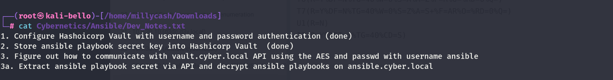
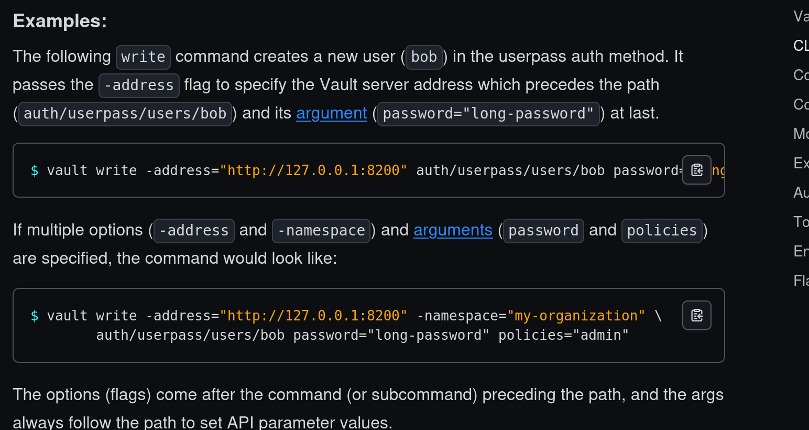
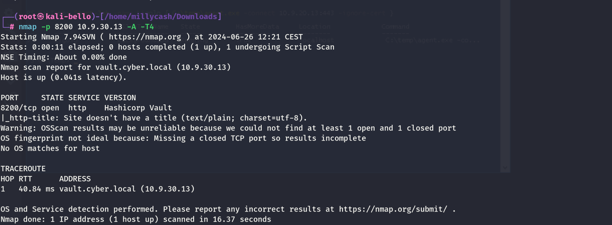
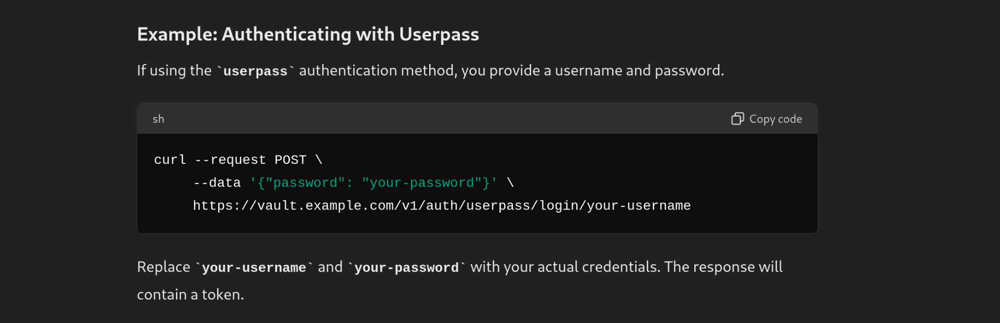
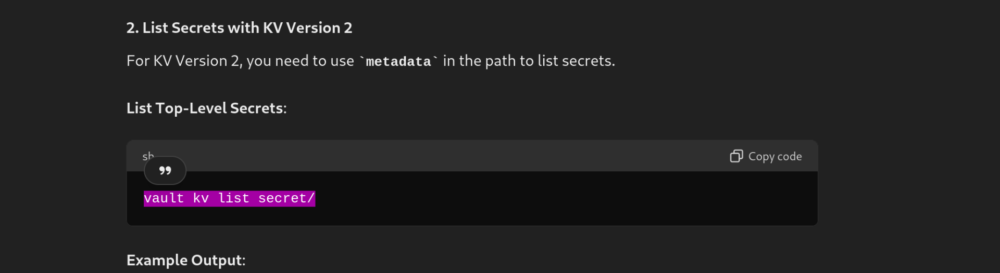

Same here we can run the NMAP to check the server.

```
PORT      STATE SERVICE       REASON         VERSION
135/tcp   open  msrpc         syn-ack ttl 64 Microsoft Windows RPC
445/tcp   open  microsoft-ds? syn-ack ttl 64
3389/tcp  open  ms-wbt-server syn-ack ttl 64 Microsoft Terminal Services
| ssl-cert: Subject: commonName=d3webvw.d3v.local
| Issuer: commonName=d3webvw.d3v.local
| Public Key type: rsa
| Public Key bits: 2048
| Signature Algorithm: sha256WithRSAEncryption
| Not valid before: 2024-06-23T03:35:17
| Not valid after:  2024-12-23T03:35:17
| MD5:   bd80:73aa:0e14:ef2e:d0d3:1851:8d7c:9959
| SHA-1: 1e65:39a3:ee0f:9f3d:6ceb:445c:e15b:dc28:b17f:39b7
| -----BEGIN CERTIFICATE-----
| MIIC5jCCAc6gAwIBAgIQPKiaVFrwopRLKWl3gx2fATANBgkqhkiG9w0BAQsFADAc
| MRowGAYDVQQDExFkM3dlYnZ3LmQzdi5sb2NhbDAeFw0yNDA2MjMwMzM1MTdaFw0y
| NDEyMjMwMzM1MTdaMBwxGjAYBgNVBAMTEWQzd2VidncuZDN2LmxvY2FsMIIBIjAN
| BgkqhkiG9w0BAQEFAAOCAQ8AMIIBCgKCAQEAzhPR8Ba3h94vL0JpE6fBcFkWovrz
| EbUuXyTwCmX3768/WfyjVUrOWOqyqDB6WVoZFkgLI3kprTvRcQz+MIimG6sAMwuu
| +jFv4ZyAqfThGqnMEa8IYX8ABX57jYZVbT6cv7ZmqTlRH9DRAS6eTX9RFVhdyRdT
| xJqBVvGBiHuB5x1If+DjNRkcf6emb/3QFQweGCOElvW6SlQSAF75UABlP3iuzsVM
| Ln6tVtDIs0xzd4UxyX/fuDfOuoh7yOP4Q0eDPam6SGrKnDxVQnQfOxAmn8Gndg/n
| lWM+3D/FXTj+FT80R592Be7k+0skJas32YEoYYqdK2nSUHimi39rTCI6pQIDAQAB
| oyQwIjATBgNVHSUEDDAKBggrBgEFBQcDATALBgNVHQ8EBAMCBDAwDQYJKoZIhvcN
| AQELBQADggEBAJoDjeT4mYvu85SmLt5N1OTM6k73MwaK+XOm1rqWmQCBkp6V6sj6
| +qUVLdNZcQTWW0lhoMY6k4Z8iPfwOTAnrGNxAZTR7YQ+Yw1WOZAQjvSQFgVOUYnL
| kuLTLNkOB/jHeFfDWdrHGKsxF3e7jfKXCgLFx0mOX9cSRhvTIViPW6hUwa+z7ESx
| EqDMvb2xItXgvL6zGP26zovNcInqKFCiYyGIg/aviHZ+Lb/jK1fSXgVsLs96d2If
| L+gKUBmyTte7jFEPZvqqTRlIUqBCDe3mgYCfhGTMu58eVTrMpuAXhE7bT+yPDBs9
| 5e6iynMwSU0rZOrrWBWVOzXkpXUBTOh4V0I=
|_-----END CERTIFICATE-----
| rdp-ntlm-info: 
|   Target_Name: D3V
|   NetBIOS_Domain_Name: D3V
|   NetBIOS_Computer_Name: D3WEBVW
|   DNS_Domain_Name: d3v.local
|   DNS_Computer_Name: d3webvw.d3v.local
|   Product_Version: 10.0.14393
|_  System_Time: 2024-06-24T15:51:27+00:00
|_ssl-date: 2024-06-24T15:52:06+00:00; +4s from scanner time.
5985/tcp  open  http          syn-ack ttl 64 Microsoft HTTPAPI httpd 2.0 (SSDP/UPnP)
|_http-title: Not Found
|_http-server-header: Microsoft-HTTPAPI/2.0
8200/tcp  open  http          syn-ack ttl 64 Hashicorp Vault
|_http-title: Site doesn't have a title (text/plain; charset=utf-8).
8201/tcp  open  ssl/trivnet2? syn-ack ttl 64
47001/tcp open  http          syn-ack ttl 64 Microsoft HTTPAPI httpd 2.0 (SSDP/UPnP)
|_http-title: Not Found
|_http-server-header: Microsoft-HTTPAPI/2.0
49664/tcp open  msrpc         syn-ack ttl 64 Microsoft Windows RPC
49665/tcp open  msrpc         syn-ack ttl 64 Microsoft Windows RPC
49667/tcp open  msrpc         syn-ack ttl 64 Microsoft Windows RPC
49681/tcp open  msrpc         syn-ack ttl 64 Microsoft Windows RPC
49682/tcp open  msrpc         syn-ack ttl 64 Microsoft Windows RPC
49683/tcp open  msrpc         syn-ack ttl 64 Microsoft Windows RPC
49703/tcp open  msrpc         syn-ack ttl 64 Microsoft Windows RPC
Warning: OSScan results may be unreliable because we could not find at least 1 open and 1 closed port
OS fingerprint not ideal because: Missing a closed TCP port so results incomplete
No OS matches for host
TCP/IP fingerprint:
SCAN(V=7.94SVN%E=4%D=6/24%OT=135%CT=%CU=%PV=Y%G=N%TM=66799622%P=x86_64-pc-linux-gnu)
SEQ(SP=105%GCD=1%ISR=10B%TI=I%CI=I%II=RI%TS=A)
OPS(O1=M5B4NNT11NW7%O2=M5B4NNT11NW7%O3=M5B4NNT11NW7%O4=M5B4NNT11NW7%O5=M5B4NNT11NW7%O6=M5B4NNT11)
WIN(W1=7200%W2=7200%W3=7200%W4=7200%W5=7200%W6=7200)
ECN(R=Y%DF=N%TG=40%W=7200%O=M5B4NW7%CC=N%Q=)
T1(R=Y%DF=N%TG=40%S=O%A=S+%F=AS%RD=0%Q=)
T2(R=Y%DF=N%TG=40%W=0%S=Z%A=S%F=AR%O=%RD=0%Q=)
T3(R=Y%DF=N%TG=40%W=7200%S=O%A=S+%F=AS%O=M5B4NNT11NW7%RD=0%Q=)
T4(R=Y%DF=N%TG=40%W=0%S=A%A=Z%F=R%O=%RD=0%Q=)
T6(R=Y%DF=N%TG=40%W=0%S=A%A=Z%F=R%O=%RD=0%Q=)
T7(R=Y%DF=N%TG=40%W=0%S=Z%A=S+%F=AR%O=%RD=0%Q=)
U1(R=N)
IE(R=Y%DFI=S%TG=40%CD=S)
```

&nbsp;

# Attacking the Vault

Now I guess we need to go back to the note we found on the Jenkins backend, specifically what we know:



We know when i pinged the vault.cyber.local that this was the machine answering, so I guess we need to connect to this damn vault. I will check the CLI documentation:

https://developer.hashicorp.com/vault/docs/commands

It states that the default TCP/8200 should be the default one?



And it exist indeed:



But here i am getting issues to login to the hashicorp by using the native tool, so I asked my friend chatgpt on how to use the API via curl and he got me this one:



And seems like I need the username:

```
┌──(root㉿kali-bello)-[/home/millycash/Downloads/Cybernetics/Ansible]
└─# curl --request POST --data '{"password": "6daDjIU0UqEdvGI"}' http://vault.cyber.local:8200/v1/auth/userpass/login/culo   

{"errors":["invalid username or password"]}
```

Going back to the note is described in the file to use the usernane "ansible":


Which means we can do the following;

```
┌──(root㉿kali-bello)-[/home/millycash/Downloads/Cybernetics/Ansible]
└─# curl --request POST --data '{"password": "6daDjIU0UqEdvGI"}' http://vault.cyber.local:8200/v1/auth/userpass/login/ansible | jq
  % Total    % Received % Xferd  Average Speed   Time    Time     Time  Current
                                 Dload  Upload   Total   Spent    Left  Speed
100   505  100   474  100    31   1764    115 --:--:-- --:--:-- --:--:--  1884
{
  "request_id": "cc85d9b1-51b7-b434-487f-e0002198f02a",
  "lease_id": "",
  "renewable": false,
  "lease_duration": 0,
  "data": null,
  "wrap_info": null,
  "warnings": null,
  "auth": {
    "client_token": "s.k9mSQkJB1gWJ5siIEp7Omi7V",
    "accessor": "c2bpaj9xcyLF8bY4aeUI1mSA",
    "policies": [
      "ansible",
      "default"
    ],
    "token_policies": [
      "ansible",
      "default"
    ],
    "metadata": {
      "username": "ansible"
    },
    "lease_duration": 1800,
    "renewable": true,
    "entity_id": "99a5f474-d2c2-9130-f989-b2f3a062d6c8",
    "token_type": "service",
    "orphan": true
  }
}
```

With this token now we should be able to surf the secrets?

```
──(root㉿kali-bello)-[/home/millycash/Downloads/Cybernetics/Ansible]
└─# curl --header "X-Vault-Token: s.MjSICcRNP9iohzch79pQIFrJ" http://vault.cyber.local:8200/v1/secret/?list=true | jq
  % Total    % Received % Xferd  Average Speed   Time    Time     Time  Current
                                 Dload  Upload   Total   Spent    Left  Speed
100   332  100   332    0     0   2003      0 --:--:-- --:--:-- --:--:--  2012
{
  "request_id": "267d41b2-f550-c361-3acf-a28ea29a32c3",
  "lease_id": "",
  "renewable": false,
  "lease_duration": 0,
  "data": null,
  "wrap_info": null,
  "warnings": [
    "Invalid path for a versioned K/V secrets engine. See the API docs for the appropriate API endpoints to use. If using the Vault CLI, use 'vault kv list' for this operation."
  ],
  "auth": null
}
```

Seems like i really need to configure this app! I will first login with the token obtained by the previous steps:

```
┌──(root㉿kali-bello)-[/home/millycash/Downloads/Cybernetics/Ansible]
└─# ./vault login                                                                 
Token (will be hidden): 
WARNING! The VAULT_TOKEN environment variable is set! The value of this
variable will take precedence; if this is unwanted please unset VAULT_TOKEN or
update its value accordingly.

Success! You are now authenticated. The token information displayed below
is already stored in the token helper. You do NOT need to run "vault login"
again. Future Vault requests will automatically use this token.

Key                    Value
---                    -----
token                  s.MjSICcRNP9iohzch79pQIFrJ
token_accessor         8D1Yv9bBVNkloQHUjMuX8BlY
token_duration         21m53s
token_renewable        true
token_policies         ["ansible" "default"]
identity_policies      []
policies               ["ansible" "default"]
token_meta_username    ansible
```

Damn seems like I can't neither list secrets nor the namespaces:

```
┌──(root㉿kali-bello)-[/home/millycash/Downloads/Cybernetics/Ansible]
└─# ./vault namespace list
Error listing namespaces: Error making API request.

URL: GET http://vault.cyber.local:8200/v1/sys/namespaces?list=true
Code: 403. Errors:

* 1 error occurred:
    * permission denied


                                                                                                                                                                                  
┌──(root㉿kali-bello)-[/home/millycash/Downloads/Cybernetics/Ansible]
└─# ./vault secrets list  
Error listing secrets engines: Error making API request.

URL: GET http://vault.cyber.local:8200/v1/sys/mounts
Code: 403. Errors:

* 1 error occurred:
    * permission denied
```

Here I had to check for tips and apparently it was easier than I thought:

```
┌──(root㉿kali-bello)-[/home/millycash/Downloads/Cybernetics/Ansible]
└─# ./vault kv list secret 
Keys
----
Cybernetics-Flag
ansible-secret
```

But dummy me this was also possible if I asked to chatgpt on how to list secrets via the native vault cli app from Hashicorp:



And likewise we can use the get function to read the secret:

```
┌──(root㉿kali-bello)-[/home/millycash/Downloads/Cybernetics/Ansible]
└─# ./vault kv get secret/Cybernetics-Flag
======== Secret Path ========
secret/data/Cybernetics-Flag

====== Metadata ======
Key              Value
---              -----
created_time     2020-02-17T15:10:56.2516873Z
deletion_time    n/a
destroyed        false
version          1

==== Data ====
Key     Value
---     -----
flag    Cyb3rN3t1C5{V@ult_AP!}
```

And likewise the ansible playbook password?

```
┌──(root㉿kali-bello)-[/home/millycash/Downloads/Cybernetics/Ansible]
└─# ./vault kv get secret/ansible-secret  
======= Secret Path =======
secret/data/ansible-secret

====== Metadata ======
Key              Value
---              -----
created_time     2020-01-04T03:29:24.3053968Z
deletion_time    n/a
destroyed        false
version          1

========== Data ==========
Key                  Value
---                  -----
playbook-password    aXYxQqxIWldJHX5sJVrCzVEkdQmP33
```

Now I don't think we can get a flag at this stage but judging from the flag name i guess we need to move forward to work with ansible.

I will come back as soon I find the DA@d3v.local...

&nbsp;

# EXTRA

I came back with Administrator@d3v.local but wasn't anle

&nbsp;

&nbsp;

&nbsp;

&nbsp;

&nbsp;

&nbsp;

&nbsp;