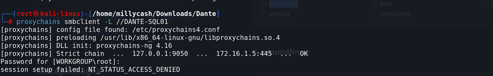

I will start by running a new NMAP scan and identify possible openn services running on the UDP service:

```
root@DANTE-WEB-NIX01:/tmp# ./nmap -sU -F 172.16.1.5
Starting Nmap 6.49BETA1 ( http://nmap.org ) at 2023-09-01 02:44 PDT
Unable to find nmap-services!  Resorting to /etc/services
Cannot find nmap-payloads. UDP payloads are disabled.
Nmap scan report for 172.16.1.5
Cannot find nmap-mac-prefixes: Ethernet vendor correlation will not be performed
Host is up (0.00034s latency).
Not shown: 109 closed ports
PORT     STATE         SERVICE
111/udp  open|filtered sunrpc
123/udp  open|filtered ntp
137/udp  open|filtered netbios-ns
138/udp  open|filtered netbios-dgm
500/udp  open|filtered isakmp
1434/udp open|filtered ms-sql-m
2049/udp open|filtered nfs
4500/udp open|filtered ipsec-nat-t
5353/udp open|filtered mdns
5355/udp open|filtered hostmon
MAC Address: 00:50:56:B9:37:94 (Unknown)
Nmap done: 1 IP address (1 host up) scanned in 231.61 seconds
```

As far as I see no UDP services are available, we can't use the NSE scripts since the latency is too high and it's just dropping so I will report what we found from the NIX01 and start to drill down manually every single service:

```
PORT     STATE SERVICE
21/tcp   open  ftp
111/tcp  open  sunrpc
135/tcp  open  epmap
139/tcp  open  netbios-ssn
445/tcp  open  microsoft-ds
1433/tcp open  ms-sql-s
2049/tcp open  nfs
Nmap done: 1 IP address (1 host up) scanned in 14.96 seconds
```

* * *

## FTP:

Indeed the FTP was allowing "Anonymous" login which lead us to grab another flag:

```
┌──(root㉿kali-linux)-[/home/millycash/Downloads/Dante]
└─# proxychains ftp anonymous@172.16.1.5
[proxychains] config file found: /etc/proxychains4.conf
[proxychains] preloading /usr/lib/x86_64-linux-gnu/libproxychains.so.4
[proxychains] DLL init: proxychains-ng 4.16
[proxychains] Strict chain  ...  127.0.0.1:9050  ...  172.16.1.5:21  ...  OK
Connected to 172.16.1.5.
220 Dante Staff Drop Box
331 Password required for anonymous
Password: 
230 Logged on
Remote system type is UNIX.
Using binary mode to transfer files.
ftp> ls
229 Entering Extended Passive Mode (|||54422|)
[proxychains] Strict chain  ...  127.0.0.1:9050  ...  172.16.1.5:54422  ...  OK
150 Opening data channel for directory listing of "/"
-r--r--r-- 1 ftp ftp             44 Jan 08  2021 flag.txt
226 Successfully transferred "/"
ftp> get föa[proxychains] Strict chain  ...  127.0.0.1:9050  ...  172.16.1.5:50947  ...  OK

local: f remote: f
229 Entering Extended Passive Mode (|||57188|)
[proxychains] Strict chain  ...  127.0.0.1:9050  ...  172.16.1.5:57188  ...  OK
550 File not found
ftp> get flag.txt
local: flag.txt remote: flag.txt
229 Entering Extended Passive Mode (|||52608|)
[proxychains] Strict chain  ...  127.0.0.1:9050  ...  172.16.1.5:52608  ...  OK
150 Opening data channel for file download from server of "/flag.txt"
100% |*****************************************************************************************************************|    44      457.11 KiB/s    00:00 ETA
226 Successfully transferred "/flag.txt"
44 bytes received in 00:00 (137.71 KiB/s)
ftp> exit
221 Goodbye
```

I won't perform a service version because it hangs on the proxychain and don't think we can do anything interesting here so far.

* * *

## Portmapper

Next we know that portmapper is running on port 111/tcp which most likely is because the NFS is also running but  we can check with metaploit for possible hidden flags:

```
[+] 172.16.1.5:111        - SunRPC Programs for 172.16.1.5
==============================

 Name      Number  Version  Port  Protocol
 ----      ------  -------  ----  --------
 mountd    100005  1        2049  tcp
 mountd    100005  2        2049  tcp
 mountd    100005  3        2049  tcp
 mountd    100005  1        2049  udp
 mountd    100005  2        2049  udp
 mountd    100005  3        2049  udp
 nfs       100003  2        2049  tcp
 nfs       100003  3        2049  tcp
 nfs       100003  2        2049  udp
 nfs       100003  3        2049  udp
 nfs       100003  4        2049  tcp
 nlockmgr  100021  1        2049  tcp
 nlockmgr  100021  2        2049  tcp
 nlockmgr  100021  3        2049  tcp
 nlockmgr  100021  4        2049  tcp
 nlockmgr  100021  1        2049  udp
 nlockmgr  100021  2        2049  udp
 nlockmgr  100021  3        2049  udp
 nlockmgr  100021  4        2049  udp
 rpcbind   100000  2        111   udp
 rpcbind   100000  3        111   udp
 rpcbind   100000  4        111   udp
 rpcbind   100000  2        111   tcp
 rpcbind   100000  3        111   tcp
 rpcbind   100000  4        111   tcp
 status    100024  1        2049  tcp
 status    100024  1        2049  udp
```

We can try to run rpcdump from impacketer suite and check everythigb we can dump from the RPC service:

```
┌──(root㉿kali-linux)-[/home/millycash/Downloads/Dante]
└─# proxychains impacket-rpcdump @172.16.1.5
[proxychains] config file found: /etc/proxychains4.conf
[proxychains] preloading /usr/lib/x86_64-linux-gnu/libproxychains.so.4
[proxychains] DLL init: proxychains-ng 4.16
[proxychains] DLL init: proxychains-ng 4.16
[proxychains] DLL init: proxychains-ng 4.16
Impacket v0.11.0 - Copyright 2023 Fortra

[*] Retrieving endpoint list from 172.16.1.5
[proxychains] Strict chain  ...  127.0.0.1:9050  ...  172.16.1.5:135  ...  OK
Protocol: N/A 
Provider: winlogon.exe 
UUID    : 76F226C3-EC14-4325-8A99-6A46348418AF v1.0 
Bindings: 
          ncalrpc:[WindowsShutdown]
          ncacn_np:\\DANTE-SQL01[\PIPE\InitShutdown]
          ncalrpc:[WMsgKRpc07D8D0]
          ncalrpc:[WMsgKRpc080801]

Protocol: [MS-RSP]: Remote Shutdown Protocol 
Provider: wininit.exe 
UUID    : D95AFE70-A6D5-4259-822E-2C84DA1DDB0D v1.0 
Bindings: 
          ncacn_ip_tcp:172.16.1.5[49664]
          ncalrpc:[WindowsShutdown]
          ncacn_np:\\DANTE-SQL01[\PIPE\InitShutdown]
          ncalrpc:[WMsgKRpc07D8D0]

Protocol: N/A 
Provider: N/A 
UUID    : 9B008953-F195-4BF9-BDE0-4471971E58ED v1.0 
Bindings: 
          ncalrpc:[LRPC-a265f1fbbcb1344860]
          ncalrpc:[dabrpc]
          ncalrpc:[csebpub]
          ncalrpc:[LRPC-696f646ed74667ea78]
          ncalrpc:[LRPC-b8930f0aebc1c00745]
          ncalrpc:[LRPC-9f234ef51777aed1e3]
          ncacn_np:\\DANTE-SQL01[\pipe\LSM_API_service]
          ncalrpc:[LSMApi]
          ncalrpc:[LRPC-15a39875020b6d9008]
          ncalrpc:[actkernel]
          ncalrpc:[umpo]

Protocol: N/A 
Provider: N/A 
UUID    : D09BDEB5-6171-4A34-BFE2-06FA82652568 v1.0 
Bindings: 
          ncalrpc:[csebpub]
          ncalrpc:[LRPC-696f646ed74667ea78]
          ncalrpc:[LRPC-b8930f0aebc1c00745]
          ncalrpc:[LRPC-9f234ef51777aed1e3]
          ncacn_np:\\DANTE-SQL01[\pipe\LSM_API_service]
          ncalrpc:[LSMApi]
          ncalrpc:[LRPC-15a39875020b6d9008]
```

I didn''t got the whole verbose but we can see that it have been idenfied as the DANTE-SQL01 server. I guess we can move forward...

* * *

## SMB:

With SMB we can try to run some automatic tools to enumerate the SAMBA server:

```
┌──(root㉿kali-linux)-[/home/millycash/Downloads/Dante]
└─# proxychains enum4linux-ng -A DANTE-SQL01
[proxychains] config file found: /etc/proxychains4.conf
[proxychains] preloading /usr/lib/x86_64-linux-gnu/libproxychains.so.4
 ====================================
|    Listener Scan on DANTE-SQL01    |
 ====================================
[*] Checking LDAP
[proxychains] Strict chain  ...  127.0.0.1:9050  ...  172.16.1.5:389 <--socket error or timeout!
[-] Could not connect to LDAP on 389/tcp: connection refused
[*] Checking LDAPS
[proxychains] Strict chain  ...  127.0.0.1:9050  ...  172.16.1.5:636 <--socket error or timeout!
[-] Could not connect to LDAPS on 636/tcp: connection refused
[*] Checking SMB
[proxychains] Strict chain  ...  127.0.0.1:9050  ...  172.16.1.5:445  ...  OK
[+] SMB is accessible on 445/tcp
[*] Checking SMB over NetBIOS
[proxychains] Strict chain  ...  127.0.0.1:9050  ...  172.16.1.5:139  ...  OK
[+] SMB over NetBIOS is accessible on 139/tcp

 ==========================================================
|    NetBIOS Names and Workgroup/Domain for DANTE-SQL01    |
 ==========================================================
[-] Could not get NetBIOS names information via 'nmblookup': timed out

 ========================================
|    SMB Dialect Check on DANTE-SQL01    |
 ========================================
[*] Trying on 445/tcp
[proxychains] Strict chain  ...  127.0.0.1:9050  ...  172.16.1.5:445  ...  OK
[proxychains] Strict chain  ...  127.0.0.1:9050  ...  172.16.1.5:445  ...  OK
[proxychains] Strict chain  ...  127.0.0.1:9050  ...  172.16.1.5:445  ...  OK
[proxychains] Strict chain  ...  127.0.0.1:9050  ...  172.16.1.5:445  ...  OK
[proxychains] Strict chain  ...  127.0.0.1:9050  ...  172.16.1.5:445  ...  OK
[proxychains] Strict chain  ...  127.0.0.1:9050  ...  172.16.1.5:445  ...  OK
[+] Supported dialects and settings:
Supported dialects:
  SMB 1.0: true
  SMB 2.02: true
  SMB 2.1: true
  SMB 3.0: true
  SMB 3.1.1: true
Preferred dialect: SMB 3.0
SMB1 only: false
SMB signing required: false

 ==========================================================
|    Domain Information via SMB session for DANTE-SQL01    |
 ==========================================================
[*] Enumerating via unauthenticated SMB session on 445/tcp
[proxychains] Strict chain  ...  127.0.0.1:9050  ...  172.16.1.5:445  ...  OK
[+] Found domain information via SMB
NetBIOS computer name: DANTE-SQL01
NetBIOS domain name: ''
DNS domain: DANTE-SQL01
FQDN: DANTE-SQL01
Derived membership: workgroup member
Derived domain: unknown

 ========================================
|    RPC Session Check on DANTE-SQL01    |
 ========================================
[*] Check for null session
[-] Could not establish null session: STATUS_ACCESS_DENIED
[*] Check for random user
[-] Could not establish random user session: STATUS_LOGON_FAILURE
[-] Sessions failed, neither null nor user sessions were possible

 ==============================================
|    OS Information via RPC for DANTE-SQL01    |
 ==============================================
[*] Enumerating via unauthenticated SMB session on 445/tcp
[proxychains] Strict chain  ...  127.0.0.1:9050  ...  172.16.1.5:445  ...  OK
[proxychains] Strict chain  ...  127.0.0.1:9050  ...  172.16.1.5:445  ...  OK
[+] Found OS information via SMB
[*] Enumerating via 'srvinfo'
[-] Skipping 'srvinfo' run, not possible with provided credentials
[+] After merging OS information we have the following result:
OS: Windows Server 2016 Standard 14393
OS version: '10.0'
OS release: '1607'
OS build: '14393'
Native OS: Windows Server 2016 Standard 14393
Native LAN manager: Windows Server 2016 Standard 6.3
Platform id: null
Server type: null
Server type string: null
```

As we can see it's a Windows server 2016 build 14393 and doesn't seem to be domain joined so far.  We can manually try to check for possible samba shares on the host:



I tried to fuzz the service with the password found from the NIX01 server but it didn't worked out.


Ok we need some credentials which means we can come back as soon we find a valid set of credentials.

* * *

## NFS:

NFS is a old alternative of the Samba shares and by default used port 2049/tcp, easiest is to check for possible shares that do not request authetication:

```
┌──(root㉿kali-linux)-[/home/millycash/Downloads/Dante]
└─# proxychains showmount -e DANTE-SQL01
[proxychains] config file found: /etc/proxychains4.conf
[proxychains] preloading /usr/lib/x86_64-linux-gnu/libproxychains.so.4
[proxychains] DLL init: proxychains-ng 4.16
[proxychains] Strict chain  ...  127.0.0.1:9050  ...  172.16.1.5:111  ...  OK
[proxychains] Strict chain  ...  127.0.0.1:9050  ...  172.16.1.5:2049  ...  OK
Export list for DANTE-SQL01:
```

Nothign so far I guess we can move forward and eventually come back as soon we find something more interesting.

* * *

## MSSQL:

Lastly we know that a MSSQL DB engine is installed on the machine and consequently the management port 14337tcp is active.

Unfortunately without a valid set of credentials is not possible to do anything and bruteforce would make to much noise and most likely block out users if a security controll is on place.