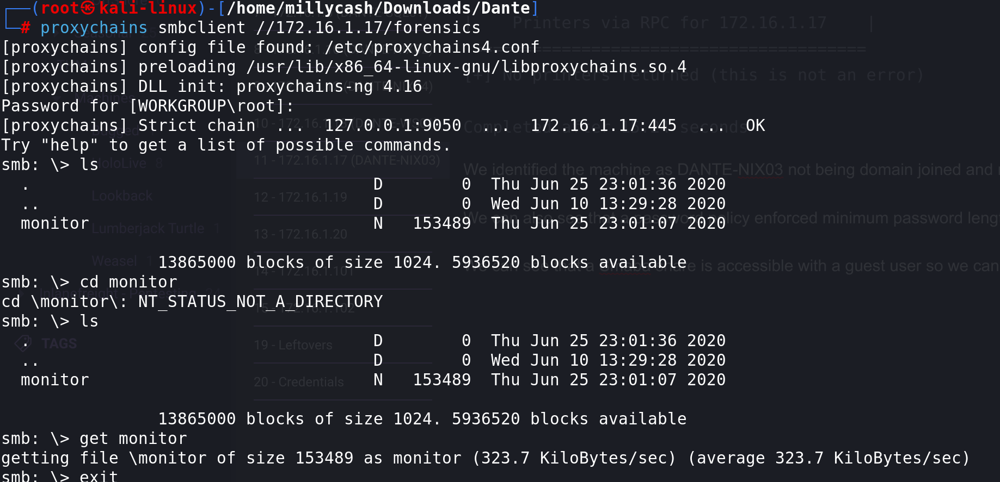
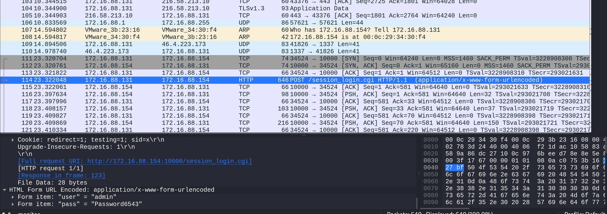
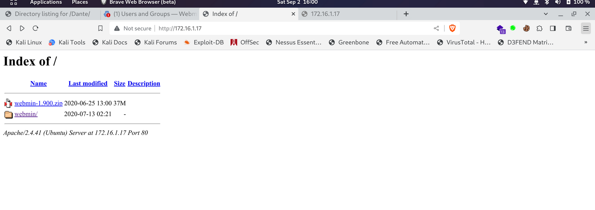
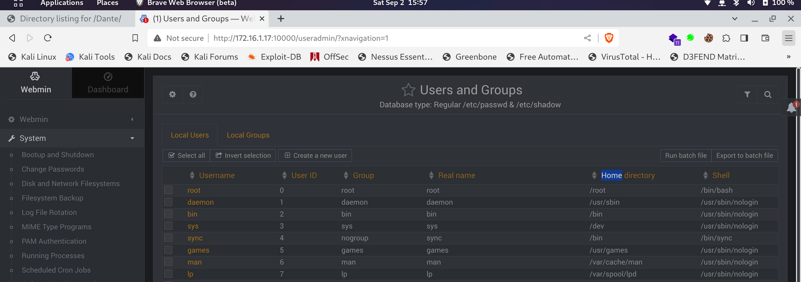
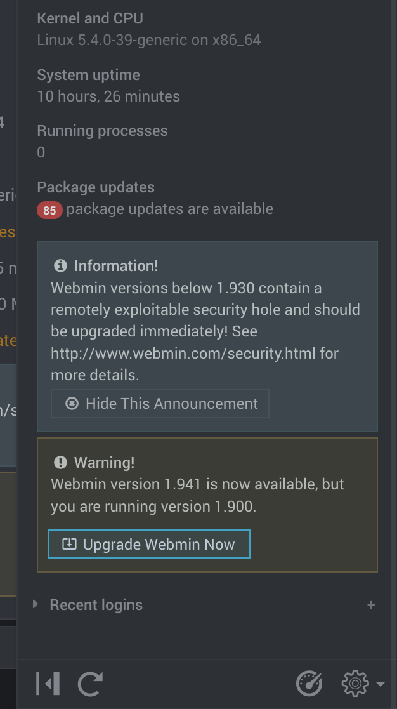
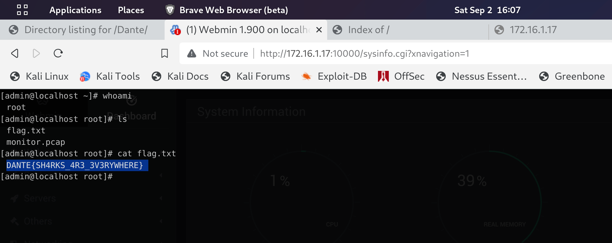
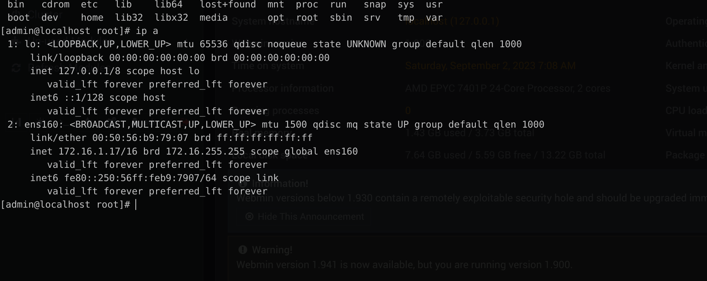

Here again I start by getting the running services on TCP:

```
balthazar@DANTE-WEB-NIX01:/tmp$ ./nmap 172.16.1.17
Starting Nmap 6.49BETA1 ( http://nmap.org ) at 2023-09-01 02:19 PDT
Unable to find nmap-services!  Resorting to /etc/services
Cannot find nmap-payloads. UDP payloads are disabled.
Nmap scan report for 172.16.1.17
Host is up (0.00011s latency).
Not shown: 1178 closed ports
PORT      STATE SERVICE
80/tcp    open  http
139/tcp   open  netbios-ssn
445/tcp   open  microsoft-ds
10000/tcp open  webmin
Nmap done: 1 IP address (1 host up) scanned in 13.05 seconds
```

On same way we can check for possible open services on UDP:

```
root@DANTE-WEB-NIX01:/tmp# ./nmap -sU -F 172.16.1.17

Starting Nmap 6.49BETA1 ( http://nmap.org ) at 2023-09-02 06:44 PDT
Unable to find nmap-services!  Resorting to /etc/services
Cannot find nmap-payloads. UDP payloads are disabled.
Stats: 0:01:01 elapsed; 0 hosts completed (1 up), 1 undergoing UDP Scan
UDP Scan Timing: About 47.15% done; ETC: 06:46 (0:00:54 remaining)
Nmap scan report for 172.16.1.17
Cannot find nmap-mac-prefixes: Ethernet vendor correlation will not be performed
Host is up (0.00039s latency).
Not shown: 116 closed ports
PORT     STATE         SERVICE
137/udp  open|filtered netbios-ns
138/udp  open|filtered netbios-dgm
5353/udp open|filtered mdns
MAC Address: 00:50:56:B9:79:07 (Unknown)
```

Nothing much on the UDP site, so we can move forward and poke around  those TCP services.

* * *

## SMB:

We can start by checking what can we find about the device on the Samba protocoll running on port 445/tcp:

```
┌──(root㉿kali-linux)-[/home/millycash/Downloads/Dante]
└─# proxychains enum4linux-ng -A 172.16.1.17
[proxychains] config file found: /etc/proxychains4.conf
[proxychains] preloading /usr/lib/x86_64-linux-gnu/libproxychains.so.4
[proxychains] DLL init: proxychains-ng 4.16
ENUM4LINUX - next generation (v1.3.1)

[proxychains] DLL init: proxychains-ng 4.16
 ==========================
|    Target Information    |
 ==========================
[*] Target ........... 172.16.1.17
[*] Username ......... ''
[*] Random Username .. 'otkqroci'
[*] Password ......... ''
[*] Timeout .......... 5 second(s)

 ====================================
|    Listener Scan on 172.16.1.17    |
 ====================================
[*] Checking LDAP
[proxychains] Strict chain  ...  127.0.0.1:9050  ...  172.16.1.17:389 <--socket error or timeout!
[-] Could not connect to LDAP on 389/tcp: connection refused
[*] Checking LDAPS
[proxychains] Strict chain  ...  127.0.0.1:9050  ...  172.16.1.17:636 <--socket error or timeout!
[-] Could not connect to LDAPS on 636/tcp: connection refused
[*] Checking SMB
[proxychains] Strict chain  ...  127.0.0.1:9050  ...  172.16.1.17:445  ...  OK
[+] SMB is accessible on 445/tcp
[*] Checking SMB over NetBIOS
[proxychains] Strict chain  ...  127.0.0.1:9050  ...  172.16.1.17:139  ...  OK
[+] SMB over NetBIOS is accessible on 139/tcp

 ==========================================================
|    NetBIOS Names and Workgroup/Domain for 172.16.1.17    |
 ==========================================================
[-] Could not get NetBIOS names information via 'nmblookup': timed out

 ========================================
|    SMB Dialect Check on 172.16.1.17    |
 ========================================
[*] Trying on 445/tcp
[proxychains] Strict chain  ...  127.0.0.1:9050  ...  172.16.1.17:445  ...  OK
[proxychains] Strict chain  ...  127.0.0.1:9050  ...  172.16.1.17:445  ...  OK
[proxychains] Strict chain  ...  127.0.0.1:9050  ...  172.16.1.17:445  ...  OK
[proxychains] Strict chain  ...  127.0.0.1:9050  ...  172.16.1.17:445  ...  OK
[proxychains] Strict chain  ...  127.0.0.1:9050  ...  172.16.1.17:445  ...  OK
[proxychains] Strict chain  ...  127.0.0.1:9050  ...  172.16.1.17:445  ...  OK
[+] Supported dialects and settings:
Supported dialects:
  SMB 1.0: false
  SMB 2.02: true
  SMB 2.1: true
  SMB 3.0: true
  SMB 3.1.1: true
Preferred dialect: SMB 3.0
SMB1 only: false
SMB signing required: false

 ==========================================================
|    Domain Information via SMB session for 172.16.1.17    |
 ==========================================================
[*] Enumerating via unauthenticated SMB session on 445/tcp
[proxychains] Strict chain  ...  127.0.0.1:9050  ...  172.16.1.17:445  ...  OK
[+] Found domain information via SMB
NetBIOS computer name: DANTE-NIX03
NetBIOS domain name: ''
DNS domain: ''
FQDN: localhost
Derived membership: workgroup member
Derived domain: unknown

 ========================================
|    RPC Session Check on 172.16.1.17    |
 ========================================
[*] Check for null session
[+] Server allows session using username '', password ''
[*] Check for random user
[+] Server allows session using username 'otkqroci', password ''
[H] Rerunning enumeration with user 'otkqroci' might give more results

 ==================================================
|    Domain Information via RPC for 172.16.1.17    |
 ==================================================
[+] Domain: WORKGROUP
[+] Domain SID: NULL SID
[+] Membership: workgroup member

 ==============================================
|    OS Information via RPC for 172.16.1.17    |
 ==============================================
[*] Enumerating via unauthenticated SMB session on 445/tcp
[proxychains] Strict chain  ...  127.0.0.1:9050  ...  172.16.1.17:445  ...  OK
[+] Found OS information via SMB
[*] Enumerating via 'srvinfo'
[+] Found OS information via 'srvinfo'
[+] After merging OS information we have the following result:
OS: Windows 7, Windows Server 2008 R2
OS version: '6.1'
OS release: ''
OS build: '0'
Native OS: not supported
Native LAN manager: not supported
Platform id: '500'
Server type: '0x809a03'
Server type string: 'init: proxychains-ng 4.16'

 ====================================
|    Users via RPC on 172.16.1.17    |
 ====================================
[*] Enumerating users via 'querydispinfo'
[-] Could not extract users from querydispinfo output, please open a GitHub issue
[*] Enumerating users via 'enumdomusers'
[-] Could not extract users from eumdomusers output, please open a GitHub issue

 =====================================
|    Groups via RPC on 172.16.1.17    |
 =====================================
[*] Enumerating local groups
[-] Could not parse result of 'enumalsgroups domain' command, please open a GitHub issue
[*] Enumerating builtin groups
[-] Could not parse result of 'enumalsgroups builtin' command, please open a GitHub issue
[*] Enumerating domain groups
[-] Could not parse result of 'enumdomgroups' command, please open a GitHub issue

 =====================================
|    Shares via RPC on 172.16.1.17    |
 =====================================
[*] Enumerating shares
[+] Found 2 share(s):
IPC$:
  comment: IPC Service (DANTE-NIX03 server (Samba, Ubuntu))
  type: IPC
forensics:
  comment: ''
  type: Disk
[*] Testing share IPC$
[-] Could not check share: STATUS_OBJECT_NAME_NOT_FOUND
[*] Testing share forensics
[+] Mapping: OK, Listing: OK

 ========================================
|    Policies via RPC for 172.16.1.17    |
 ========================================
[*] Trying port 445/tcp
[proxychains] Strict chain  ...  127.0.0.1:9050  ...  172.16.1.17:445  ...  OK
[+] Found policy:
Domain password information:
  Password history length: None
  Minimum password length: 5
  Maximum password age: 49710 days 6 hours 21 minutes
  Password properties:
  - DOMAIN_PASSWORD_COMPLEX: false
  - DOMAIN_PASSWORD_NO_ANON_CHANGE: false
  - DOMAIN_PASSWORD_NO_CLEAR_CHANGE: false
  - DOMAIN_PASSWORD_LOCKOUT_ADMINS: false
  - DOMAIN_PASSWORD_PASSWORD_STORE_CLEARTEXT: false
  - DOMAIN_PASSWORD_REFUSE_PASSWORD_CHANGE: false
Domain lockout information:
  Lockout observation window: 30 minutes
  Lockout duration: 30 minutes
  Lockout threshold: None
Domain logoff information:
  Force logoff time: 49710 days 6 hours 21 minutes

 ========================================
|    Printers via RPC for 172.16.1.17    |
 ========================================
[+] No printers returned (this is not an error)

Completed after 15.24 seconds
```

We identified the machine as DANTE-NIX03 not being domain joined and most likely being eight Windows 7  or Windows server 2008 r2.

We can also see that a password policy enforced minimum password length of 5 with no lockout threshold.

We can see that a Samba share is accessible with a guest user so we can see what we can get out of it:



Ok it's a dump of traffic, and can be read with Wireshark or similars:

```
┌──(root㉿kali-linux)-[/home/millycash/Downloads/Dante]
└─# file monitor             
monitor: pcap capture file, microsecond ts (little-endian) - version 2.4 (Ethernet, capture length 65535)
```

Scrolling thru we can find the cleartext credentials used to login into webmin service on the machine!



* * *

## HTTP:

Seems like the http service is not hosting anything interesting:



We can see some webmin related files, and event the zip file is only the installation file.

If we run a directory search we can't find anything other that what we already know so far. We can move forward with the remaining checks.

* * *

## Webmin:

If we login with the admin creds found in the PCAP file we can check the users on the machine:



As you see seems like the non priviledges user on the machine is "Lou". Checking the running version we can see it's 1.930.



Anyway if we try to run the terminal integrated on the machine we can grab another flag:



Checking for NIC settings we can't see anything more which means we should be able to stop here when ready with all the enumerations:



Since we are already root and lou home is not holding anything other I guess we can move forward.