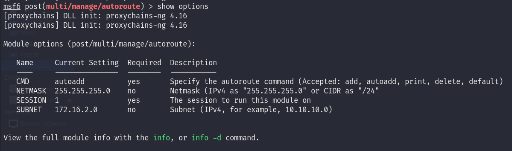
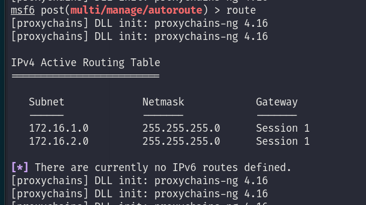
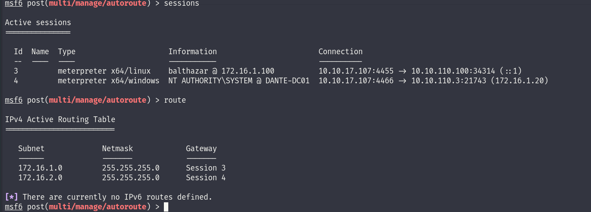

I had to check again for tips and I totally forgot about the DANTE-DC01server so we can go back here!

I will repost the open ports on the machine to make my life easier:

```
balthazar@DANTE-WEB-NIX01:/tmp$ ./nmap 172.16.1.20
Starting Nmap 6.49BETA1 ( http://nmap.org ) at 2023-09-01 02:22 PDT
Unable to find nmap-services!  Resorting to /etc/services
Cannot find nmap-payloads. UDP payloads are disabled.
Stats: 0:00:09 elapsed; 0 hosts completed (0 up), 1 undergoing Ping Scan
Parallel DNS resolution of 1 host. Timing: About 0.00% done
Stats: 0:00:15 elapsed; 0 hosts completed (1 up), 1 undergoing Connect Scan
Connect Scan Timing: About 30.82% done; ETC: 02:22 (0:00:04 remaining)
Nmap scan report for 172.16.1.20
Host is up (0.00030s latency).
Not shown: 1169 closed ports
PORT     STATE SERVICE
22/tcp   open  ssh
53/tcp   open  domain
80/tcp   open  http
88/tcp   open  kerberos
135/tcp  open  epmap
139/tcp  open  netbios-ssn
389/tcp  open  ldap
443/tcp  open  https
445/tcp  open  microsoft-ds
464/tcp  open  kpasswd
593/tcp  open  unknown
636/tcp  open  ldaps
3389/tcp open  ms-wbt-server
Nmap done: 1 IP address (1 host up) scanned in 19.27 seconds
```

Ok so here I went back since we still don't have a valid account neither for DANTE-SQL01 nor the Jenkins server so I guess we have to find the other subdomains available. We found out that the DANTE-DC01 had 3 NIC available and not only 2:

```
meterpreter > ipconfig 
[proxychains] DLL init: proxychains-ng 4.16
[proxychains] DLL init: proxychains-ng 4.16

Interface  1
============
Name         : Software Loopback Interface 1
Hardware MAC : 00:00:00:00:00:00
MTU          : 4294967295
IPv4 Address : 127.0.0.1
IPv4 Netmask : 255.0.0.0
IPv6 Address : ::1
IPv6 Netmask : ffff:ffff:ffff:ffff:ffff:ffff:ffff:ffff


Interface 12
============
Name         : vmxnet3 Ethernet Adapter
Hardware MAC : 00:50:56:b9:89:1c
MTU          : 1500
IPv4 Address : 172.16.1.20
IPv4 Netmask : 255.255.255.0
IPv6 Address : fe80::b433:eb55:2d7d:ee78
IPv6 Netmask : ffff:ffff:ffff:ffff::


Interface 13
============
Name         : Microsoft ISATAP Adapter #4
Hardware MAC : 00:00:00:00:00:00
MTU          : 1280
IPv6 Address : fe80::5efe:ac10:114
IPv6 Netmask : ffff:ffff:ffff:ffff:ffff:ffff:ffff:ffff

[proxychains] DLL init: proxychains-ng 4.16
[proxychains] DLL init: proxychains-ng 4.16
[proxychains] DLL init: proxychains-ng 4.16
[proxychains] DLL init: proxychains-ng 4.16
[proxychains] DLL init: proxychains-ng 4.16
meterpreter >
```

So even if no routes are pointing towards a IPv4 address on other ranges I will try to scan **172.16.2.0/24** from the DANTE-DC01:

```
C:\Temp>for /L %i in (1 1 254) do ping 172.16.2.%i -n 1 -w 100 | find "Reply"
for /L %i in (1 1 254) do ping 172.16.2.%i -n 1 -w 100 | find "Reply"

C:\Temp>ping 172.16.2.1 -n 1 -w 100   | find "Reply" 

C:\Temp>ping 172.16.2.2 -n 1 -w 100   | find "Reply" 

C:\Temp>ping 172.16.2.3 -n 1 -w 100   | find "Reply" 

C:\Temp>ping 172.16.2.4 -n 1 -w 100   | find "Reply" 

C:\Temp>ping 172.16.2.5 -n 1 -w 100   | find "Reply" 
Reply from 172.16.2.5: bytes=32 time<1ms TTL=127

C:\Temp>ping 172.16.2.6 -n 1 -w 100   | find "Reply" 

C:\Temp>ping 172.16.2.7 -n 1 -w 100   | find "Reply" 

C:\Temp>ping 172.16.2.8 -n 1 -w 100   | find "Reply" 

C:\Temp>ping 172.16.2.9 -n 1 -w 100   | find "Reply" 

C:\Temp>ping 172.16.2.10 -n 1 -w 100   | find "Reply" 

C:\Temp>ping 172.16.2.11 -n 1 -w 100   | find "Reply" 

C:\Temp>ping 172.16.2.12 -n 1 -w 100   | find "Reply" 

C:\Temp>ping 172.16.2.13 -n 1 -w 100   | find "Reply" 

C:\Temp>ping 172.16.2.14 -n 1 -w 100   | find "Reply" 

C:\Temp>ping 172.16.2.15 -n 1 -w 100   | find "Reply" 

C:\Temp>ping 172.16.2.16 -n 1 -w 100   | find "Reply" 

C:\Temp>ping 172.16.2.17 -n 1 -w 100   | find "Reply" 

C:\Temp>ping 172.16.2.18 -n 1 -w 100   | find "Reply" 

C:\Temp>ping 172.16.2.19 -n 1 -w 100   | find "Reply" 

C:\Temp>ping 172.16.2.20 -n 1 -w 100   | find "Reply" 

C:\Temp>ping 172.16.2.21 -n 1 -w 100   | find "Reply" 

C:\Temp>ping 172.16.2.22 -n 1 -w 100   | find "Reply" 

C:\Temp>ping 172.16.2.23 -n 1 -w 100   | find "Reply" 

C:\Temp>ping 172.16.2.24 -n 1 -w 100   | find "Reply" 

C:\Temp>ping 172.16.2.25 -n 1 -w 100   | find "Reply" 

C:\Temp>ping 172.16.2.26 -n 1 -w 100   | find "Reply" 

C:\Temp>ping 172.16.2.27 -n 1 -w 100   | find "Reply" 

C:\Temp>ping 172.16.2.28 -n 1 -w 100   | find "Reply" 

C:\Temp>ping 172.16.2.29 -n 1 -w 100   | find "Reply" 

C:\Temp>ping 172.16.2.30 -n 1 -w 100   | find "Reply" 

C:\Temp>ping 172.16.2.31 -n 1 -w 100   | find "Reply" 

C:\Temp>ping 172.16.2.32 -n 1 -w 100   | find "Reply" 

C:\Temp>ping 172.16.2.33 -n 1 -w 100   | find "Reply" 

C:\Temp>ping 172.16.2.34 -n 1 -w 100   | find "Reply" 

C:\Temp>ping 172.16.2.35 -n 1 -w 100   | find "Reply" 

C:\Temp>ping 172.16.2.36 -n 1 -w 100   | find "Reply" 

C:\Temp>ping 172.16.2.37 -n 1 -w 100   | find "Reply" 

C:\Temp>ping 172.16.2.38 -n 1 -w 100   | find "Reply" 

C:\Temp>ping 172.16.2.39 -n 1 -w 100   | find "Reply" 

C:\Temp>ping 172.16.2.40 -n 1 -w 100   | find "Reply" 

C:\Temp>ping 172.16.2.41 -n 1 -w 100   | find "Reply" 

C:\Temp>ping 172.16.2.42 -n 1 -w 100   | find "Reply" 

C:\Temp>ping 172.16.2.43 -n 1 -w 100   | find "Reply" 

C:\Temp>ping 172.16.2.44 -n 1 -w 100   | find "Reply" 

C:\Temp>ping 172.16.2.45 -n 1 -w 100   | find "Reply" 

C:\Temp>ping 172.16.2.46 -n 1 -w 100   | find "Reply" 

C:\Temp>ping 172.16.2.47 -n 1 -w 100   | find "Reply" 

C:\Temp>ping 172.16.2.48 -n 1 -w 100   | find "Reply" 

C:\Temp>ping 172.16.2.49 -n 1 -w 100   | find "Reply" 

C:\Temp>ping 172.16.2.50 -n 1 -w 100   | find "Reply" 

C:\Temp>ping 172.16.2.51 -n 1 -w 100   | find "Reply" 

C:\Temp>ping 172.16.2.52 -n 1 -w 100   | find "Reply" 

C:\Temp>ping 172.16.2.53 -n 1 -w 100   | find "Reply" 

C:\Temp>ping 172.16.2.54 -n 1 -w 100   | find "Reply" 

C:\Temp>ping 172.16.2.55 -n 1 -w 100   | find "Reply" 

C:\Temp>ping 172.16.2.56 -n 1 -w 100   | find "Reply" 

C:\Temp>ping 172.16.2.57 -n 1 -w 100   | find "Reply" 

C:\Temp>ping 172.16.2.58 -n 1 -w 100   | find "Reply" 

C:\Temp>ping 172.16.2.59 -n 1 -w 100   | find "Reply" 

C:\Temp>ping 172.16.2.60 -n 1 -w 100   | find "Reply" 

C:\Temp>ping 172.16.2.61 -n 1 -w 100   | find "Reply" 

C:\Temp>ping 172.16.2.62 -n 1 -w 100   | find "Reply" 

C:\Temp>ping 172.16.2.63 -n 1 -w 100   | find "Reply" 

C:\Temp>ping 172.16.2.64 -n 1 -w 100   | find "Reply" 

C:\Temp>ping 172.16.2.65 -n 1 -w 100   | find "Reply" 

C:\Temp>ping 172.16.2.66 -n 1 -w 100   | find "Reply" 

C:\Temp>ping 172.16.2.67 -n 1 -w 100   | find "Reply" 

C:\Temp>ping 172.16.2.68 -n 1 -w 100   | find "Reply" 

C:\Temp>ping 172.16.2.69 -n 1 -w 100   | find "Reply" 

C:\Temp>ping 172.16.2.70 -n 1 -w 100   | find "Reply" 

C:\Temp>ping 172.16.2.71 -n 1 -w 100   | find "Reply" 

C:\Temp>ping 172.16.2.72 -n 1 -w 100   | find "Reply" 

C:\Temp>ping 172.16.2.73 -n 1 -w 100   | find "Reply" 

C:\Temp>ping 172.16.2.74 -n 1 -w 100   | find "Reply" 

C:\Temp>ping 172.16.2.75 -n 1 -w 100   | find "Reply" 

C:\Temp>ping 172.16.2.76 -n 1 -w 100   | find "Reply" 

C:\Temp>ping 172.16.2.77 -n 1 -w 100   | find "Reply" 

C:\Temp>ping 172.16.2.78 -n 1 -w 100   | find "Reply" 

C:\Temp>ping 172.16.2.79 -n 1 -w 100   | find "Reply" 

C:\Temp>ping 172.16.2.80 -n 1 -w 100   | find "Reply" 

C:\Temp>ping 172.16.2.81 -n 1 -w 100   | find "Reply" 

C:\Temp>ping 172.16.2.82 -n 1 -w 100   | find "Reply" 

C:\Temp>ping 172.16.2.83 -n 1 -w 100   | find "Reply" 

C:\Temp>ping 172.16.2.84 -n 1 -w 100   | find "Reply" 

C:\Temp>ping 172.16.2.85 -n 1 -w 100   | find "Reply" 

C:\Temp>ping 172.16.2.86 -n 1 -w 100   | find "Reply" 

C:\Temp>ping 172.16.2.87 -n 1 -w 100   | find "Reply" 

C:\Temp>ping 172.16.2.88 -n 1 -w 100   | find "Reply" 

C:\Temp>ping 172.16.2.89 -n 1 -w 100   | find "Reply" 

C:\Temp>ping 172.16.2.90 -n 1 -w 100   | find "Reply" 

C:\Temp>ping 172.16.2.91 -n 1 -w 100   | find "Reply" 

C:\Temp>ping 172.16.2.92 -n 1 -w 100   | find "Reply" 

C:\Temp>ping 172.16.2.93 -n 1 -w 100   | find "Reply" 

C:\Temp>ping 172.16.2.94 -n 1 -w 100   | find "Reply" 

C:\Temp>ping 172.16.2.95 -n 1 -w 100   | find "Reply" 

C:\Temp>ping 172.16.2.96 -n 1 -w 100   | find "Reply" 

C:\Temp>ping 172.16.2.97 -n 1 -w 100   | find "Reply" 

C:\Temp>ping 172.16.2.98 -n 1 -w 100   | find "Reply" 

C:\Temp>ping 172.16.2.99 -n 1 -w 100   | find "Reply" 

C:\Temp>ping 172.16.2.100 -n 1 -w 100   | find "Reply" 

C:\Temp>ping 172.16.2.101 -n 1 -w 100   | find "Reply" 

C:\Temp>ping 172.16.2.102 -n 1 -w 100   | find "Reply" 

C:\Temp>ping 172.16.2.103 -n 1 -w 100   | find "Reply" 

C:\Temp>ping 172.16.2.104 -n 1 -w 100   | find "Reply" 

C:\Temp>ping 172.16.2.105 -n 1 -w 100   | find "Reply" 

C:\Temp>ping 172.16.2.106 -n 1 -w 100   | find "Reply" 

C:\Temp>ping 172.16.2.107 -n 1 -w 100   | find "Reply" 

C:\Temp>ping 172.16.2.108 -n 1 -w 100   | find "Reply" 

C:\Temp>ping 172.16.2.109 -n 1 -w 100   | find "Reply" 

C:\Temp>ping 172.16.2.110 -n 1 -w 100   | find "Reply" 

C:\Temp>ping 172.16.2.111 -n 1 -w 100   | find "Reply" 

C:\Temp>ping 172.16.2.112 -n 1 -w 100   | find "Reply" 

C:\Temp>ping 172.16.2.113 -n 1 -w 100   | find "Reply" 

C:\Temp>ping 172.16.2.114 -n 1 -w 100   | find "Reply" 

C:\Temp>ping 172.16.2.115 -n 1 -w 100   | find "Reply" 

C:\Temp>ping 172.16.2.116 -n 1 -w 100   | find "Reply" 

C:\Temp>ping 172.16.2.117 -n 1 -w 100   | find "Reply" 

C:\Temp>ping 172.16.2.118 -n 1 -w 100   | find "Reply" 

C:\Temp>ping 172.16.2.119 -n 1 -w 100   | find "Reply" 

C:\Temp>ping 172.16.2.120 -n 1 -w 100   | find "Reply" 

C:\Temp>ping 172.16.2.121 -n 1 -w 100   | find "Reply" 

C:\Temp>ping 172.16.2.122 -n 1 -w 100   | find "Reply" 

C:\Temp>ping 172.16.2.123 -n 1 -w 100   | find "Reply" 

C:\Temp>ping 172.16.2.124 -n 1 -w 100   | find "Reply" 

C:\Temp>ping 172.16.2.125 -n 1 -w 100   | find "Reply" 

C:\Temp>ping 172.16.2.126 -n 1 -w 100   | find "Reply" 

C:\Temp>ping 172.16.2.127 -n 1 -w 100   | find "Reply" 

C:\Temp>ping 172.16.2.128 -n 1 -w 100   | find "Reply" 

C:\Temp>ping 172.16.2.129 -n 1 -w 100   | find "Reply" 

C:\Temp>ping 172.16.2.130 -n 1 -w 100   | find "Reply" 

C:\Temp>ping 172.16.2.131 -n 1 -w 100   | find "Reply" 

C:\Temp>ping 172.16.2.132 -n 1 -w 100   | find "Reply" 

C:\Temp>ping 172.16.2.133 -n 1 -w 100   | find "Reply" 

C:\Temp>ping 172.16.2.134 -n 1 -w 100   | find "Reply" 

C:\Temp>ping 172.16.2.135 -n 1 -w 100   | find "Reply" 

C:\Temp>ping 172.16.2.136 -n 1 -w 100   | find "Reply" 

C:\Temp>ping 172.16.2.137 -n 1 -w 100   | find "Reply" 

C:\Temp>ping 172.16.2.138 -n 1 -w 100   | find "Reply" 

C:\Temp>ping 172.16.2.139 -n 1 -w 100   | find "Reply" 

C:\Temp>ping 172.16.2.140 -n 1 -w 100   | find "Reply" 

C:\Temp>ping 172.16.2.141 -n 1 -w 100   | find "Reply" 

C:\Temp>ping 172.16.2.142 -n 1 -w 100   | find "Reply" 

C:\Temp>ping 172.16.2.143 -n 1 -w 100   | find "Reply" 

C:\Temp>ping 172.16.2.144 -n 1 -w 100   | find "Reply" 

C:\Temp>ping 172.16.2.145 -n 1 -w 100   | find "Reply" 

C:\Temp>ping 172.16.2.146 -n 1 -w 100   | find "Reply" 

C:\Temp>ping 172.16.2.147 -n 1 -w 100   | find "Reply" 

C:\Temp>ping 172.16.2.148 -n 1 -w 100   | find "Reply" 

C:\Temp>ping 172.16.2.149 -n 1 -w 100   | find "Reply" 

C:\Temp>ping 172.16.2.150 -n 1 -w 100   | find "Reply" 

C:\Temp>ping 172.16.2.151 -n 1 -w 100   | find "Reply" 

C:\Temp>ping 172.16.2.152 -n 1 -w 100   | find "Reply" 

C:\Temp>ping 172.16.2.153 -n 1 -w 100   | find "Reply" 

C:\Temp>ping 172.16.2.154 -n 1 -w 100   | find "Reply" 

C:\Temp>ping 172.16.2.155 -n 1 -w 100   | find "Reply" 

C:\Temp>ping 172.16.2.156 -n 1 -w 100   | find "Reply" 

C:\Temp>ping 172.16.2.157 -n 1 -w 100   | find "Reply" 

C:\Temp>ping 172.16.2.158 -n 1 -w 100   | find "Reply" 

C:\Temp>ping 172.16.2.159 -n 1 -w 100   | find "Reply" 

C:\Temp>ping 172.16.2.160 -n 1 -w 100   | find "Reply" 

C:\Temp>ping 172.16.2.161 -n 1 -w 100   | find "Reply" 

C:\Temp>ping 172.16.2.162 -n 1 -w 100   | find "Reply" 

C:\Temp>ping 172.16.2.163 -n 1 -w 100   | find "Reply" 

C:\Temp>ping 172.16.2.164 -n 1 -w 100   | find "Reply" 

C:\Temp>ping 172.16.2.165 -n 1 -w 100   | find "Reply" 

C:\Temp>ping 172.16.2.166 -n 1 -w 100   | find "Reply" 

C:\Temp>ping 172.16.2.167 -n 1 -w 100   | find "Reply" 

C:\Temp>ping 172.16.2.168 -n 1 -w 100   | find "Reply" 

C:\Temp>ping 172.16.2.169 -n 1 -w 100   | find "Reply" 

C:\Temp>ping 172.16.2.170 -n 1 -w 100   | find "Reply" 

C:\Temp>ping 172.16.2.171 -n 1 -w 100   | find "Reply" 

C:\Temp>ping 172.16.2.172 -n 1 -w 100   | find "Reply" 

C:\Temp>ping 172.16.2.173 -n 1 -w 100   | find "Reply" 

C:\Temp>ping 172.16.2.174 -n 1 -w 100   | find "Reply" 

C:\Temp>ping 172.16.2.175 -n 1 -w 100   | find "Reply" 

C:\Temp>ping 172.16.2.176 -n 1 -w 100   | find "Reply" 

C:\Temp>ping 172.16.2.177 -n 1 -w 100   | find "Reply" 

C:\Temp>ping 172.16.2.178 -n 1 -w 100   | find "Reply" 

C:\Temp>ping 172.16.2.179 -n 1 -w 100   | find "Reply" 

C:\Temp>ping 172.16.2.180 -n 1 -w 100   | find "Reply" 

C:\Temp>ping 172.16.2.181 -n 1 -w 100   | find "Reply" 

C:\Temp>ping 172.16.2.182 -n 1 -w 100   | find "Reply" 

C:\Temp>ping 172.16.2.183 -n 1 -w 100   | find "Reply" 

C:\Temp>ping 172.16.2.184 -n 1 -w 100   | find "Reply" 

C:\Temp>ping 172.16.2.185 -n 1 -w 100   | find "Reply" 

C:\Temp>ping 172.16.2.186 -n 1 -w 100   | find "Reply" 

C:\Temp>ping 172.16.2.187 -n 1 -w 100   | find "Reply" 

C:\Temp>ping 172.16.2.188 -n 1 -w 100   | find "Reply" 

C:\Temp>ping 172.16.2.189 -n 1 -w 100   | find "Reply" 

C:\Temp>ping 172.16.2.190 -n 1 -w 100   | find "Reply" 

C:\Temp>ping 172.16.2.191 -n 1 -w 100   | find "Reply" 

C:\Temp>ping 172.16.2.192 -n 1 -w 100   | find "Reply" 

C:\Temp>ping 172.16.2.193 -n 1 -w 100   | find "Reply" 

C:\Temp>ping 172.16.2.194 -n 1 -w 100   | find "Reply" 

C:\Temp>ping 172.16.2.195 -n 1 -w 100   | find "Reply" 

C:\Temp>ping 172.16.2.196 -n 1 -w 100   | find "Reply" 

C:\Temp>ping 172.16.2.197 -n 1 -w 100   | find "Reply" 

C:\Temp>ping 172.16.2.198 -n 1 -w 100   | find "Reply" 

C:\Temp>ping 172.16.2.199 -n 1 -w 100   | find "Reply" 

C:\Temp>ping 172.16.2.200 -n 1 -w 100   | find "Reply" 

C:\Temp>ping 172.16.2.201 -n 1 -w 100   | find "Reply" 

C:\Temp>ping 172.16.2.202 -n 1 -w 100   | find "Reply" 

C:\Temp>ping 172.16.2.203 -n 1 -w 100   | find "Reply" 

C:\Temp>ping 172.16.2.204 -n 1 -w 100   | find "Reply" 

C:\Temp>ping 172.16.2.205 -n 1 -w 100   | find "Reply" 

C:\Temp>ping 172.16.2.206 -n 1 -w 100   | find "Reply" 

C:\Temp>ping 172.16.2.207 -n 1 -w 100   | find "Reply" 

C:\Temp>ping 172.16.2.208 -n 1 -w 100   | find "Reply" 

C:\Temp>ping 172.16.2.209 -n 1 -w 100   | find "Reply" 

C:\Temp>ping 172.16.2.210 -n 1 -w 100   | find "Reply" 

C:\Temp>ping 172.16.2.211 -n 1 -w 100   | find "Reply" 

C:\Temp>ping 172.16.2.212 -n 1 -w 100   | find "Reply" 

C:\Temp>ping 172.16.2.213 -n 1 -w 100   | find "Reply" 

C:\Temp>ping 172.16.2.214 -n 1 -w 100   | find "Reply" 

C:\Temp>ping 172.16.2.215 -n 1 -w 100   | find "Reply" 

C:\Temp>ping 172.16.2.216 -n 1 -w 100   | find "Reply" 

C:\Temp>ping 172.16.2.217 -n 1 -w 100   | find "Reply" 

C:\Temp>ping 172.16.2.218 -n 1 -w 100   | find "Reply" 

C:\Temp>ping 172.16.2.219 -n 1 -w 100   | find "Reply" 

C:\Temp>ping 172.16.2.220 -n 1 -w 100   | find "Reply" 

C:\Temp>ping 172.16.2.221 -n 1 -w 100   | find "Reply" 

C:\Temp>ping 172.16.2.222 -n 1 -w 100   | find "Reply" 

C:\Temp>ping 172.16.2.223 -n 1 -w 100   | find "Reply" 

C:\Temp>ping 172.16.2.224 -n 1 -w 100   | find "Reply" 

C:\Temp>ping 172.16.2.225 -n 1 -w 100   | find "Reply" 

C:\Temp>ping 172.16.2.226 -n 1 -w 100   | find "Reply" 

C:\Temp>ping 172.16.2.227 -n 1 -w 100   | find "Reply" 

C:\Temp>ping 172.16.2.228 -n 1 -w 100   | find "Reply" 

C:\Temp>ping 172.16.2.229 -n 1 -w 100   | find "Reply" 

C:\Temp>ping 172.16.2.230 -n 1 -w 100   | find "Reply" 

C:\Temp>ping 172.16.2.231 -n 1 -w 100   | find "Reply" 

C:\Temp>ping 172.16.2.232 -n 1 -w 100   | find "Reply" 

C:\Temp>ping 172.16.2.233 -n 1 -w 100   | find "Reply" 

C:\Temp>ping 172.16.2.234 -n 1 -w 100   | find "Reply" 

C:\Temp>ping 172.16.2.235 -n 1 -w 100   | find "Reply" 

C:\Temp>ping 172.16.2.236 -n 1 -w 100   | find "Reply" 

C:\Temp>ping 172.16.2.237 -n 1 -w 100   | find "Reply" 

C:\Temp>ping 172.16.2.238 -n 1 -w 100   | find "Reply" 

C:\Temp>ping 172.16.2.239 -n 1 -w 100   | find "Reply" 

C:\Temp>ping 172.16.2.240 -n 1 -w 100   | find "Reply" 

C:\Temp>ping 172.16.2.241 -n 1 -w 100   | find "Reply" 

C:\Temp>ping 172.16.2.242 -n 1 -w 100   | find "Reply" 

C:\Temp>ping 172.16.2.243 -n 1 -w 100   | find "Reply" 

C:\Temp>ping 172.16.2.244 -n 1 -w 100   | find "Reply" 

C:\Temp>ping 172.16.2.245 -n 1 -w 100   | find "Reply" 

C:\Temp>ping 172.16.2.246 -n 1 -w 100   | find "Reply" 

C:\Temp>ping 172.16.2.247 -n 1 -w 100   | find "Reply" 

C:\Temp>ping 172.16.2.248 -n 1 -w 100   | find "Reply" 

C:\Temp>ping 172.16.2.249 -n 1 -w 100   | find "Reply" 

C:\Temp>ping 172.16.2.250 -n 1 -w 100   | find "Reply" 

C:\Temp>ping 172.16.2.251 -n 1 -w 100   | find "Reply" 

C:\Temp>ping 172.16.2.252 -n 1 -w 100   | find "Reply" 

C:\Temp>ping 172.16.2.253 -n 1 -w 100   | find "Reply" 

C:\Temp>ping 172.16.2.254 -n 1 -w 100   | find "Reply"
```

And from here you can see that we can only find one machine answering on the 172.16.2.5! So now we can use the autoroute function in Metasploit framework and leverage the Meterpreter session to route through 172.16.2.x.



And running the exploit add the needed routes to reach the other internal network:



And next we need to setup a socksv4a proxy via Metasploit and then we are gucci and we should be able to use all our favorite tools via Proxychains directly sitting on our attacking machine. Again doing the same but this time from DC01 we prepared the first 2 sessions with it's own routing tables:



&nbsp;

&nbsp;

&nbsp;