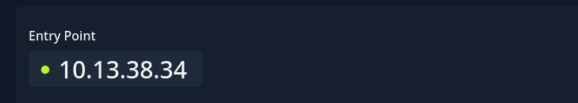
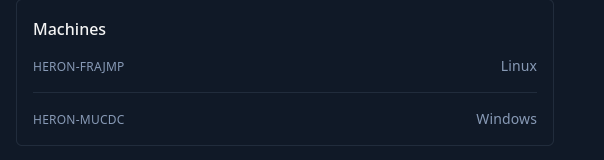

# Introduction

You are tasked with performing a penetration test on Heron, starting with credentials of an employee in an assumed breach scenario.

**Initial Access Credentials**  
Username: pentest  
Password: Heron123!

Heron is a small Active Directory scenario that involves typical vulnerabilities found in real word company environments.

Heron is designed for penetration testers and red teamers in search of a quick and challenging lab.

This **Red Team Operator I** lab will expose players to:

- Enumeration
- Active Directory enumeration and attacks
- Lateral movement
- Local privilege escalation
- Situational awareness

# Entry Point

Except the credentials the challenge provides a entry point IP:

But also some insight into what machine stack I will find in this challenge:

Knowing this I will move on to the singural machines.