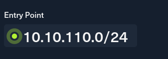
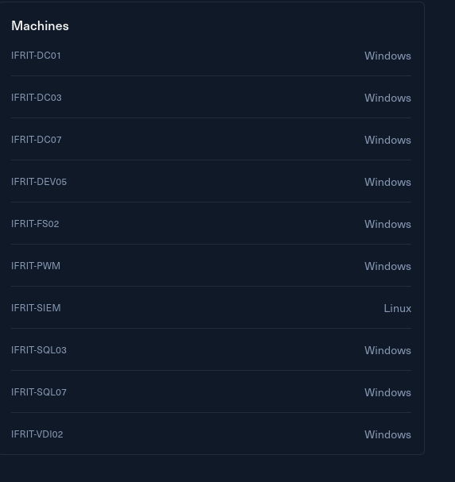
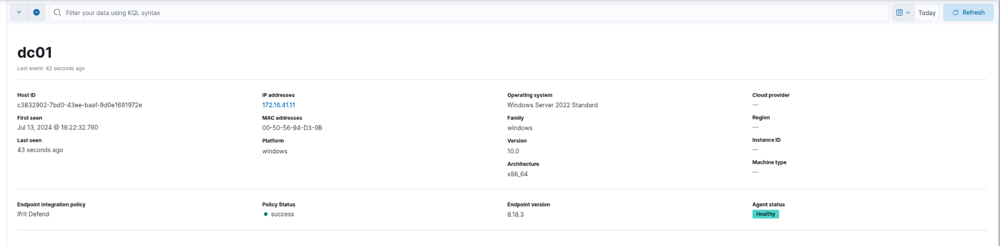
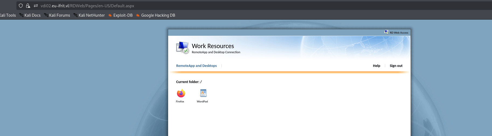

# Introduction

Ifrit is an IT services company that introduced a new security baseline recently. To evaluate its effectiveness, you have been tasked with performing a red team engagement on Ifrit's internal networks. This engagement is being conducted as an assumed breach scenario.

**VDI Environment Access**  
Log in to the VDI at https://vdi02.eu-ifrit.vl/RDWeb/ (10.10.110.225).

**Test User Credentials**  
Choose any user from the following list; the password for all accounts is PenEuIfrit527#:

- Caroline.Hunter
- Michelle.Jordan
- Wendy.French
- Joyce.Johnson
- Kathleen.Walker
- Tina.Dawson
- Gavin.Dixon
- Robin.Smith
- Marcus.Taylor
- Jemma.Smith
- Annette.King
- Mohammed.Ward
- Laura.Robinson
- Henry.Jordan
- Bernard.Turner
- Peter.Nash
- Jade.Perry
- Barry.Cox
- Martin.Marsden
- Grace.Dunn

**SIEM Access**  
Additionally, you have been provided with a read-only account "viewer:c1cdf03f4b" to the companies SIEM at http://10.10.110.3:5601/. This will allow students to learn from their detections in real time.

Ifrit is a typical real world environment, designed to put your red team skills to the test. This lab is focused on operating covertly without triggering detection mechanisms. You will be able to see detections in near real time and be able to tune your actions accordingly.

Ifrit is for people that already have basic knowledge in AD topics and pentesting and want to dive into red teaming.

This **Red Team Operator II** lab will expose players to:

- Network & Active Directory Enumeration
- Active Directory & Custom Exploitation
- Active Directory Certificate Services
- Lateral Movement across multiple Forests
- Bypassing EDR Solutions
- Relay Attacks
- Operating covertly

&nbsp;

# Entry Point

As per usual the customer appointed a whole /24 subnet as entry point for this challenge:



And I can also get an insight of the techstack used by the challenge as well where except the SIEM(which is OFF-LIMITS by the way) it is entirely composed by Windows servers.



# Initial Enumeration

I need now to footprint what machines are alive in this network and to do so i can check via fping:

```bash
└─$ fping -asqg 10.10.110.0/24         
10.10.110.2
10.10.110.3
10.10.110.225

     254 targets
       3 alive
     251 unreachable
       0 unknown addresses

    1004 timeouts (waiting for response)
    1007 ICMP Echos sent
       3 ICMP Echo Replies received
      11 other ICMP received

 24.3 ms (min round trip time)
 25.0 ms (avg round trip time)
 25.9 ms (max round trip time)
        9.820 sec (elapsed real time)


```

Now the first 2 machines are off-limits(the .2 is most likely the Firewall and the .3 is the SIEM solution) plus I am also aware of the VDI being hosted on the .225 machine.

Now I immediately see that the challenge description is totally off as the SIEM machine is now a Proxy server:

The .3 is the actual SIEM solution(in Wazuh) and it seems hosting also a self-hosted version of gitlab?

```bash
PORT     STATE SERVICE    REASON         VERSION
22/tcp   open  ssh        syn-ack ttl 63 OpenSSH 8.9p1 Ubuntu 3ubuntu0.13 (Ubuntu Linux; protocol 2.0)
| ssh-hostkey: 
|   256 91:e8:dc:47:0b:8f:23:d8:7a:f9:8c:b7:49:8f:81:27 (ECDSA)
| ecdsa-sha2-nistp256 AAAAE2VjZHNhLXNoYTItbmlzdHAyNTYAAAAIbmlzdHAyNTYAAABBBEFYNl0PIMgmVOIUPHUyJoiBfjbRsXqVwJpJ1wajUcZCFW1cejH1SG7I1Y7rphEiaSGG2gFbAyuxL1mQKBrKpCY=
|   256 a3:47:75:a0:d7:8e:68:45:ab:0b:6c:9b:01:d3:cf:4f (ED25519)
|_ssh-ed25519 AAAAC3NzaC1lZDI1NTE5AAAAIBapsQjhyr4fRrToisUeSPc5dJ3RsQH+TizLPq86Jqnh
80/tcp   open  http       syn-ack ttl 63 nginx
|_http-favicon: Unknown favicon MD5: 66F9A1C3F2CFD0DF1B570990E86D3095
| http-methods: 
|_  Supported Methods: GET HEAD POST OPTIONS
| http-robots.txt: 58 disallowed entries (40 shown)
| / /autocomplete/users /autocomplete/projects /search 
| /admin /profile /dashboard /users /api/v* /help /s/ /-/profile 
| /-/user_settings/profile /-/ide/ /-/experiment /*/new /*/edit /*/raw 
| /*/realtime_changes /groups/*/analytics 
| /groups/*/contribution_analytics /groups/*/group_members /groups/*/-/saml/sso 
| /*/*.git$ /*/archive/ /*/repository/archive* /*/activity 
| /*/blame /*/commits /*/commit /*/commit/*.patch 
| /*/commit/*.diff /*/compare /*/network /*/graphs 
| /*/merge_requests/*.patch /*/merge_requests/*.diff /*/merge_requests/*/diffs 
|_/*/deploy_keys /*/hooks
| http-title: Sign in \xC2\xB7 GitLab
|_Requested resource was http://10.10.110.3/users/sign_in
|_http-trane-info: Problem with XML parsing of /evox/about
81/tcp   open  http       syn-ack ttl 63 nginx 1.18.0 (Ubuntu)
|_http-title: Welcome to nginx!
|_http-server-header: nginx/1.18.0 (Ubuntu)
| http-methods: 
|_  Supported Methods: GET HEAD
3128/tcp open  http-proxy syn-ack ttl 63 Squid http proxy 5.9
|_http-title: ERROR: The requested URL could not be retrieved
|_http-server-header: squid/5.9
5601/tcp open  http       syn-ack ttl 63 Elasticsearch Kibana (serverName: siem)
|_http-trane-info: Problem with XML parsing of /evox/about
| http-methods: 
|_  Supported Methods: GET HEAD POST OPTIONS
| http-title: Elastic
|_Requested resource was /login?next=%2F
|_http-favicon: Unknown favicon MD5: 0667F0BA312C307D21AB129613197614
8060/tcp open  http       syn-ack ttl 63 nginx 1.24.0
|_http-title: 404 Not Found
|_http-server-header: nginx/1.24.0
| http-methods: 
|_  Supported Methods: GET HEAD POST
8220/tcp open  ssl/http   syn-ack ttl 63 Golang net/http server
|_http-title: Site doesn't have a title (text/plain; charset=utf-8).
| http-methods: 
|_  Supported Methods: GET HEAD POST OPTIONS
| ssl-cert: Subject: commonName=siem/organizationName=elastic-fleet
| Subject Alternative Name: DNS:siem
| Issuer: commonName=localhost/organizationName=elastic-fleet
| Public Key type: rsa
| Public Key bits: 2048
| Signature Algorithm: sha256WithRSAEncryption
| Not valid before: 2024-07-14T08:07:12
| Not valid after:  2034-07-14T08:07:12
| MD5:     11c1 8128 4a1b 3c3c 836a 097d f65b a219
| SHA-1:   b87d dc75 2008 a316 a049 5fa1 549b dbb5 5552 8b90
| SHA-256: 3526 25dc 3183 1238 6118 335d 4774 6bf1 a45d 3f15 b789 2bfa bed7 5a51 5292 65a0
| -----BEGIN CERTIFICATE-----
| MIIDMjCCAhqgAwIBAgICBnowDQYJKoZIhvcNAQELBQAwLDEWMBQGA1UEChMNZWxh
| c3RpYy1mbGVldDESMBAGA1UEAxMJbG9jYWxob3N0MB4XDTI0MDcxNDA4MDcxMloX
| DTM0MDcxNDA4MDcxMlowJzEWMBQGA1UEChMNZWxhc3RpYy1mbGVldDENMAsGA1UE
| AxMEc2llbTCCASIwDQYJKoZIhvcNAQEBBQADggEPADCCAQoCggEBAKO7eoBWW/mA
| mY5Sg3dZdcvZiF3dHrzZWikuGyMNsIBLRaJPOzrHvv2OD3hIsTQKiU57fHxNxkkR
| 2ElcNaamA/goyFH3CrNJ3b0qlItJaHt3/CpU4aXdDgKDohFA4BwGDCPl2AlxOxPP
| 0IjcfSGNIHVBI5ToxrkFMTjk9tr9P3hd9LEEPqzTWtWVWSn3vl6VCuFREU0s1hNT
| DqA+v1NIALTjh4n8GKjKrwAJBQZHwx9AgsjcDQSl/UlNZjQk+6/WzDVh72n8jRGJ
| od5sn1ohU7nO0sq3h1NxhBB9mGUXx69W39ubgdwqjqkgQErSmcaFHkK114NJCLNG
| 1u1n26b2cdkCAwEAAaNjMGEwDgYDVR0PAQH/BAQDAgeAMB0GA1UdJQQWMBQGCCsG
| AQUFBwMCBggrBgEFBQcDATAfBgNVHSMEGDAWgBTb2HLBilFvYpcx3a5ZjkA0rt0M
| hjAPBgNVHREECDAGggRzaWVtMA0GCSqGSIb3DQEBCwUAA4IBAQCrA6ZsA6EdFc1K
| VFIyNONa86+QxEG1J80Cjajw7zZRdD1evIr/9JSpREzT39F9qAwRjpSrDRNPXJQi
| xPgqkexZGKrzYkIZ9HSAbK4rSE6Lni2JG01Eolm4V4K0yWIv8hxLe7KuBt3JTbWY
| kDrwLawPHOWuJYPktoUPyXxedTl/YZ5ezYso5glk/0qFFLvAh/9rB4dsLT+lzj3H
| PPYbM/SluTD2mndSdkcFH9lMMSj7KfzdOc6lHwCd1dUKfoHseG4PwwOrtlnknVuN
| LLmVjiNgXdVUGpucu+c3omdNMWVVGjFzqLHT+6wK+g+PixUtNbVb18gu/vKYWugJ
| TdGalwF+
|_-----END CERTIFICATE-----
|_ssl-date: TLS randomness does not represent time
| fingerprint-strings: 
|   FourOhFourRequest: 
|     HTTP/1.0 404 Not Found
|     Content-Type: text/plain; charset=utf-8
|     X-Content-Type-Options: nosniff
|     X-Request-Id: f0755c61-c97d-4364-8efa-39c1effa177b
|     Date: Wed, 01 Apr 2026 11:24:08 GMT
|     Content-Length: 19
|     page not found
|   GenericLines, Help, LPDString, RTSPRequest, SIPOptions, SSLSessionReq, Socks5: 
|     HTTP/1.1 400 Bad Request
|     Content-Type: text/plain; charset=utf-8
|     Connection: close
|     Request
|   GetRequest: 
|     HTTP/1.0 404 Not Found
|     Content-Type: text/plain; charset=utf-8
|     X-Content-Type-Options: nosniff
|     X-Request-Id: 2d0998cc-bab0-4313-98ee-430f442fc2cb
|     Date: Wed, 01 Apr 2026 11:23:52 GMT
|     Content-Length: 19
|     page not found
|   HTTPOptions: 
|     HTTP/1.0 404 Not Found
|     Content-Type: text/plain; charset=utf-8
|     X-Content-Type-Options: nosniff
|     X-Request-Id: 05b4f4ae-dca5-4136-95d2-920c99d8bcf9
|     Date: Wed, 01 Apr 2026 11:23:52 GMT
|     Content-Length: 19
|_    page not found
9200/tcp open  ssl/http   syn-ack ttl 63 Elasticsearch REST API 7.0 or later (Shield plugin; realm: security)
| http-methods: 
|   Supported Methods: GET DELETE HEAD OPTIONS
|_  Potentially risky methods: DELETE
|_ssl-date: TLS randomness does not represent time
|_http-title: Site doesn't have a title (application/json).
| http-auth: 
| HTTP/1.1 401 Unauthorized\x0D
|   Basic charset=UTF-8 realm=security
|   Bearer realm=security
|_  ApiKey
| ssl-cert: Subject: commonName=siem
| Subject Alternative Name: DNS:siem, IP Address:0:0:0:0:0:0:0:1, IP Address:127.0.0.1, IP Address:192.168.94.225, DNS:localhost, IP Address:FE80:0:0:0:20C:29FF:FEEA:5B64
| Issuer: commonName=Elasticsearch security auto-configuration HTTP CA
| Public Key type: rsa
| Public Key bits: 4096
| Signature Algorithm: sha256WithRSAEncryption
| Not valid before: 2024-07-13T15:17:31
| Not valid after:  2026-07-13T15:17:31
| MD5:     3bdb b6e5 470f 691f 0916 7fc4 3445 c747
| SHA-1:   8c6c da53 22fa 1883 d566 2ed8 76e1 a1ab b2e0 889a
| SHA-256: f2c0 103b 450a 5914 b311 a9a8 1f08 2e42 bd94 b867 aa80 20e3 184e 9fd6 f00f 0850
| -----BEGIN CERTIFICATE-----
| MIIFijCCA3KgAwIBAgIVAKCfvSjkRvgeKdj7oSV1Q6sc/WZEMA0GCSqGSIb3DQEB
| CwUAMDwxOjA4BgNVBAMTMUVsYXN0aWNzZWFyY2ggc2VjdXJpdHkgYXV0by1jb25m
| aWd1cmF0aW9uIEhUVFAgQ0EwHhcNMjQwNzEzMTUxNzMxWhcNMjYwNzEzMTUxNzMx
| WjAPMQ0wCwYDVQQDEwRzaWVtMIICIjANBgkqhkiG9w0BAQEFAAOCAg8AMIICCgKC
| AgEAyb9it0QLXXxvetKyO0eNTNzslzaGCSg1L0bYMhArEdDdo7f8P4u0uq06h3a+
| 9Y44DV3ipRBBi+7AecQzd9sqN9HrRHTOiN9GeaS+vigscUGHMvvjALumzLoDL9mk
| ZUqeYVArqiwzM3GEoColpPmlO0F+KYbL41CiToiE7OG7vmkR4J3/iTKvM4D9Cm12
| YB7B3SPipw2VUMvxvt17XKSOyldKjZnCRJqi1sjzxbMn1ZIEkt5SCVAoodVRlRGJ
| z4/AX3AQoun7n42hBu1c958hP9aFEm1LIZwln3HQBqO6gRj7X9kYiPyrQswClb0Y
| RQfRMpPT57LyCKl2II0nFXAVE5dOYZguQ+cDwFWi6hrM7TlsgKcDurmYchFnncNa
| D8HyfYorINW2A1x3B/qwZpTZvYR0G+ciVOOkKSB6rGAVPnMgJA5gRR2zBjsEN/Mq
| kgTrxyrHVjwV9doqRaQaaqfOEnypYQuc46LI2Qyoi2k5AOjvjTtJKJ/MQOOlPxsp
| c5EYfPiWHn1NbOgm8U7rKfsWwQLpwkawi5Q8H9BIq0oniptZRKDXrfAF/R1U3gln
| DgTGD7uoaKqufKAlyJlKJYvjUTmWH2vd/UH6Je0OCGSwfAQBtPo1bpjJniTjuZdM
| uqgk+l9v61wHu57roOqsQ+7396W331LBTDJHapcsp1mYJ8UCAwEAAaOBrzCBrDAd
| BgNVHQ4EFgQUdPC/dD3zoqoGT6+33/6uu6uw0JEwHwYDVR0jBBgwFoAUFcJVaMF5
| djGqM4MCkoOCSa4ArwwwSgYDVR0RBEMwQYIEc2llbYcQAAAAAAAAAAAAAAAAAAAA
| AYcEfwAAAYcEwKhe4YIJbG9jYWxob3N0hxD+gAAAAAAAAAIMKf/+6ltkMAkGA1Ud
| EwQCMAAwEwYDVR0lBAwwCgYIKwYBBQUHAwEwDQYJKoZIhvcNAQELBQADggIBAIqu
| Poal10znCb5m+3RBRSC0TlZ4gO2RLhl1TBe5xQTeFEcfwJrP3M1WOCnn3vy0dgSb
| 7wijYRyImQaYyUFgJ9BwWyg2Yf9jIz7Ombxnonqp7vv5/FmqS40tZj+RI2oywfDK
| NjhDKbIYXI8nqQleW0ACJQOQGUfJMKcx+n/KFMBSapmvI8G/gtlrOYEGg9EEC5pH
| TV7Hn1Boi4TaiCWgi4wxar/z9KedXUrjJkYqs6UAjR2Rpt0KRHLYemLaT/+BcLMs
| aNC3MrhTdqFet6DZXzHDdYvDYIaH0Ke5dyj/NurVLQA3yWKgl1ZAOGdtHRbna2El
| gC1vHb8CoO5hnq70xvamjoGQmcqfiYBYlQF706axTamhVruLB7GR8PkjtKFcF0ih
| iCpBwmqFph/i62DNbgvi986Vr6j05RDVajHWVrkWdfTiFELcVxxgAIupSpT0WdgB
| PEoFFapPNd9VN++FfDG4x5o3AEFJDkKPwiqSNVJzV23E9t0vkX24RKXLvX2hStLQ
| Wl207JrY6EG4SUw8QneMdpkLtEvxKOeB4aJtd4GdhUwZ4Lmgjl9n7EskrUk/m9xh
| NWE05x60WyKPkAsce6G2NBJh7wyXdqTClS5kv4Df/h6Xzwgjea3IfuLt8WxzxJ6N
| acWmneKM+AGozFB6cVC/LnIvIDntGGV+GdE/P4Zu
|_-----END CERTIFICATE-----
1 service unrecognized despite returning data. If you know the service/version, please submit the following fingerprint at https://nmap.org/cgi-bin/submit.cgi?new-service :
SF-Port8220-TCP:V=7.98%T=SSL%I=7%D=4/1%Time=69CD0047%P=x86_64-pc-linux-gnu
SF:%r(GenericLines,67,"HTTP/1\.1\x20400\x20Bad\x20Request\r\nContent-Type:
SF:\x20text/plain;\x20charset=utf-8\r\nConnection:\x20close\r\n\r\n400\x20
SF:Bad\x20Request")%r(GetRequest,E4,"HTTP/1\.0\x20404\x20Not\x20Found\r\nC
SF:ontent-Type:\x20text/plain;\x20charset=utf-8\r\nX-Content-Type-Options:
SF:\x20nosniff\r\nX-Request-Id:\x202d0998cc-bab0-4313-98ee-430f442fc2cb\r\
SF:nDate:\x20Wed,\x2001\x20Apr\x202026\x2011:23:52\x20GMT\r\nContent-Lengt
SF:h:\x2019\r\n\r\n404\x20page\x20not\x20found\n")%r(HTTPOptions,E4,"HTTP/
SF:1\.0\x20404\x20Not\x20Found\r\nContent-Type:\x20text/plain;\x20charset=
SF:utf-8\r\nX-Content-Type-Options:\x20nosniff\r\nX-Request-Id:\x2005b4f4a
SF:e-dca5-4136-95d2-920c99d8bcf9\r\nDate:\x20Wed,\x2001\x20Apr\x202026\x20
SF:11:23:52\x20GMT\r\nContent-Length:\x2019\r\n\r\n404\x20page\x20not\x20f
SF:ound\n")%r(RTSPRequest,67,"HTTP/1\.1\x20400\x20Bad\x20Request\r\nConten
SF:t-Type:\x20text/plain;\x20charset=utf-8\r\nConnection:\x20close\r\n\r\n
SF:400\x20Bad\x20Request")%r(Help,67,"HTTP/1\.1\x20400\x20Bad\x20Request\r
SF:\nContent-Type:\x20text/plain;\x20charset=utf-8\r\nConnection:\x20close
SF:\r\n\r\n400\x20Bad\x20Request")%r(SSLSessionReq,67,"HTTP/1\.1\x20400\x2
SF:0Bad\x20Request\r\nContent-Type:\x20text/plain;\x20charset=utf-8\r\nCon
SF:nection:\x20close\r\n\r\n400\x20Bad\x20Request")%r(FourOhFourRequest,E4
SF:,"HTTP/1\.0\x20404\x20Not\x20Found\r\nContent-Type:\x20text/plain;\x20c
SF:harset=utf-8\r\nX-Content-Type-Options:\x20nosniff\r\nX-Request-Id:\x20
SF:f0755c61-c97d-4364-8efa-39c1effa177b\r\nDate:\x20Wed,\x2001\x20Apr\x202
SF:026\x2011:24:08\x20GMT\r\nContent-Length:\x2019\r\n\r\n404\x20page\x20n
SF:ot\x20found\n")%r(LPDString,67,"HTTP/1\.1\x20400\x20Bad\x20Request\r\nC
SF:ontent-Type:\x20text/plain;\x20charset=utf-8\r\nConnection:\x20close\r\
SF:n\r\n400\x20Bad\x20Request")%r(SIPOptions,67,"HTTP/1\.1\x20400\x20Bad\x
SF:20Request\r\nContent-Type:\x20text/plain;\x20charset=utf-8\r\nConnectio
SF:n:\x20close\r\n\r\n400\x20Bad\x20Request")%r(Socks5,67,"HTTP/1\.1\x2040
SF:0\x20Bad\x20Request\r\nContent-Type:\x20text/plain;\x20charset=utf-8\r\
SF:nConnection:\x20close\r\n\r\n400\x20Bad\x20Request");
Warning: OSScan results may be unreliable because we could not find at least 1 open and 1 closed port
Device type: general purpose
Running: Linux 4.X|5.X
OS CPE: cpe:/o:linux:linux_kernel:4 cpe:/o:linux:linux_kernel:5
OS details: Linux 4.15 - 5.19, Linux 5.0 - 5.14
TCP/IP fingerprint:
OS:SCAN(V=7.98%E=4%D=4/1%OT=22%CT=%CU=31525%PV=Y%DS=2%DC=T%G=N%TM=69CD0078%
OS:P=x86_64-pc-linux-gnu)SEQ(SP=FF%GCD=1%ISR=109%TI=Z%CI=Z%II=I%TS=A)OPS(O1
OS:=M552ST11NW7%O2=M552ST11NW7%O3=M552NNT11NW7%O4=M552ST11NW7%O5=M552ST11NW
OS:7%O6=M552ST11)WIN(W1=FE88%W2=FE88%W3=FE88%W4=FE88%W5=FE88%W6=FE88)ECN(R=
OS:Y%DF=Y%T=40%W=FAF0%O=M552NNSNW7%CC=Y%Q=)T1(R=Y%DF=Y%T=40%S=O%A=S+%F=AS%R
OS:D=0%Q=)T2(R=N)T3(R=N)T4(R=Y%DF=Y%T=40%W=0%S=A%A=Z%F=R%O=%RD=0%Q=)T5(R=Y%
OS:DF=Y%T=40%W=0%S=Z%A=S+%F=AR%O=%RD=0%Q=)T6(R=Y%DF=Y%T=40%W=0%S=A%A=Z%F=R%
OS:O=%RD=0%Q=)U1(R=Y%DF=N%T=40%IPL=164%UN=0%RIPL=G%RID=G%RIPCK=G%RUCK=G%RUD
OS:=G)IE(R=Y%DFI=N%T=40%CD=S)


```

On the other side the

```bash
PORT      STATE SERVICE       REASON          VERSION
80/tcp    open  http          syn-ack ttl 127 Microsoft IIS httpd 10.0
|_http-server-header: Microsoft-IIS/10.0
|_http-title: IIS Windows Server
| http-methods: 
|   Supported Methods: OPTIONS TRACE GET HEAD POST
|_  Potentially risky methods: TRACE
135/tcp   open  msrpc         syn-ack ttl 127 Microsoft Windows RPC
443/tcp   open  ssl/https?    syn-ack ttl 127
| tls-alpn: 
|   h2
|_  http/1.1
|_ssl-date: TLS randomness does not represent time
| ssl-cert: Subject: commonName=VDI02.eu-ifrit.vl
| Issuer: commonName=VDI02.eu-ifrit.vl
| Public Key type: rsa
| Public Key bits: 2048
| Signature Algorithm: sha256WithRSAEncryption
| Not valid before: 2024-08-01T09:17:54
| Not valid after:  2025-01-31T09:17:54
| MD5:     d5b5 7ce7 06e1 78e5 4bc3 1ebd 9c8e 609e
| SHA-1:   1f48 52e9 c410 f0bb 16e7 e015 341f 6f69 fec2 b0ce
| SHA-256: c0f0 3dc3 835c 2570 8ba0 64c7 ea6f b105 8e88 62dd 04b4 975e f719 8fcd 4bde 1255
| -----BEGIN CERTIFICATE-----
| MIIC5jCCAc6gAwIBAgIQX8kcN67olYFGPHHiyvkYFjANBgkqhkiG9w0BAQsFADAc
| MRowGAYDVQQDExFWREkwMi5ldS1pZnJpdC52bDAeFw0yNDA4MDEwOTE3NTRaFw0y
| NTAxMzEwOTE3NTRaMBwxGjAYBgNVBAMTEVZESTAyLmV1LWlmcml0LnZsMIIBIjAN
| BgkqhkiG9w0BAQEFAAOCAQ8AMIIBCgKCAQEA4OyR/br8p5WXrGHZ23IxmO2ZXlgp
| V2nwDQUmebJ4bkscHAV6gko92AxeVSnb1oaZnEc4xQgm7RPmj4kPPYnp6rrMKazH
| BaXPW8+Ks6zwo5Zgj3/cs3G2UDjCwe98OFWOC2aGLHIN3t6Qz8NvsaxV2YE3WVnP
| y440Lhh87LQmyDY0iFr+utRTZmhdbB/TQ0GYvDXQ5uLIxqFiLZppcolpEMYMKpDZ
| CLqZuHlxj2Bnk1JF7Oq1QfYRXVHx23QQG03VLwcp6XMn/OfWvcV4856AgtUZY3xP
| u/SStP15YdXXfGV0FCS87JIjfbylwSi1xZ3tDH7hveDUM8vHGvYIO5ff8QIDAQAB
| oyQwIjATBgNVHSUEDDAKBggrBgEFBQcDATALBgNVHQ8EBAMCBDAwDQYJKoZIhvcN
| AQELBQADggEBABl2hivoAaPKketiUaseoGDX8sEfYfSFRqtwPdAzWo1oPjQV9tjl
| sSzH7JOJWA9YX8uYwWcHydkq6U3VjzCIpNXuIw23IiRBD32MbhzP0Wnz3mie5mEk
| johPekC09IseV8ejUbOoqShYz2mjR7yDHE/H+HQfcGoUGOFEAtI4WeZhPn/ZnAmV
| n9RMrHz/4u+YUyA/B+hOdHfGg62TXtIXCydP1WNVetO7BLfZW1+2qwdiL9CHw93A
| Q66/KO0LCYLCHI9j0exeM49o63U0jE+zum6UAvqRTuWdNF49SnmwswRAkDSuyrr+
| mWu1alDIieQiPUnpOE6KAEz6swf/TyRc1zw=
|_-----END CERTIFICATE-----
445/tcp   open  microsoft-ds? syn-ack ttl 127
593/tcp   open  ncacn_http    syn-ack ttl 127 Microsoft Windows RPC over HTTP 1.0
3387/tcp  open  http          syn-ack ttl 127 Microsoft HTTPAPI httpd 2.0 (SSDP/UPnP)
|_http-server-header: Microsoft-HTTPAPI/2.0
|_http-title: Not Found
3389/tcp  open  ms-wbt-server syn-ack ttl 127 Microsoft Terminal Services
|_ssl-date: 2026-04-01T11:28:52+00:00; +1s from scanner time.
| ssl-cert: Subject: commonName=VDI02.eu-ifrit.vl
| Issuer: commonName=VDI02.eu-ifrit.vl
| Public Key type: rsa
| Public Key bits: 2048
| Signature Algorithm: sha256WithRSAEncryption
| Not valid before: 2026-03-31T02:44:52
| Not valid after:  2026-09-30T02:44:52
| MD5:     5d7a 233f 6914 5cc4 76dd a055 77f0 b484
| SHA-1:   2e26 c438 e7ff a481 1a1b 8020 abd6 9206 9543 2ab1
| SHA-256: 0d77 80b1 d3ff c42e 579e 692a 1475 8f11 a0b0 4454 1f27 0857 8094 2944 0165 5913
| -----BEGIN CERTIFICATE-----
| MIIC5jCCAc6gAwIBAgIQQLUN2aashIBIdvdxYFsCvjANBgkqhkiG9w0BAQsFADAc
| MRowGAYDVQQDExFWREkwMi5ldS1pZnJpdC52bDAeFw0yNjAzMzEwMjQ0NTJaFw0y
| NjA5MzAwMjQ0NTJaMBwxGjAYBgNVBAMTEVZESTAyLmV1LWlmcml0LnZsMIIBIjAN
| BgkqhkiG9w0BAQEFAAOCAQ8AMIIBCgKCAQEAvPV793NkNom8uv0DC+tSgFY9tZI5
| kdZAEh/KEv5nczNnk+1cbVbxIcVHy8TE96J7nFu1XDDlpEADYvYLS5/LvJk/NLyG
| 0GAi1ib1dYe1y2AJaqJwouQtALvaK8KcNiMIyx8H+Oa/0EYCVgbc78dJt+ha70iU
| ogIMePEQAWGvfgX0rHwfX23BJ8Cw/f1+RtbLqJQS4pWZyWJ4zl6PRhdXmDiXEh2A
| 6uvWpA1nXP1r20BcB1eec5QOAXpnqGUR01vfiBF8XLCgrx4qaXRfGUmzkrnylYYI
| bGfkCHxddE2oeRoANFQZbqfQ/Fbl/HfuoDqiXDJvz6Umsxer70LFbYaqQQIDAQAB
| oyQwIjATBgNVHSUEDDAKBggrBgEFBQcDATALBgNVHQ8EBAMCBDAwDQYJKoZIhvcN
| AQELBQADggEBAIHvKmTAcqgUkiK/GsU2UrcBJKofyvHntiOip25FNbpb0M2+MRgh
| 9CViJpTQJ1eg4341R1heLcoOTsR0rAi1/6Cfp9dGFSJH2DprByZ5eoIfTvDMPEfp
| gJnVAVnEt5CSfgFpDOsRrrByb1H2c8vDNomVCerzlnoPo8w9sasU3TCIwOq55eFD
| 0HFNHuyq4vdJd9U92a/aQKHA9iilF6hdpT9eH9tk/xd5YDZlJrZvXvdMEHDZSCgo
| Mjo+eOZ1wWI36RGWAUC5HPMoyqQ641zTCvpaYbfzZdJp9HYWGBnSyG8mi7aTXlXs
| lN8vjPuwIrOlJPEc5ZNQ/nj2pVEAdMtdLYY=
|_-----END CERTIFICATE-----
| rdp-ntlm-info: 
|   Target_Name: EU-IFRIT
|   NetBIOS_Domain_Name: EU-IFRIT
|   NetBIOS_Computer_Name: VDI02
|   DNS_Domain_Name: eu-ifrit.vl
|   DNS_Computer_Name: VDI02.eu-ifrit.vl
|   Product_Version: 10.0.20348
|_  System_Time: 2026-04-01T11:28:11+00:00
5504/tcp  open  msrpc         syn-ack ttl 127 Microsoft Windows RPC
49667/tcp open  msrpc         syn-ack ttl 127 Microsoft Windows RPC
49675/tcp open  msrpc         syn-ack ttl 127 Microsoft Windows RPC
49815/tcp open  msrpc         syn-ack ttl 127 Microsoft Windows RPC
Warning: OSScan results may be unreliable because we could not find at least 1 open and 1 closed port
Device type: general purpose
Running (JUST GUESSING): Microsoft Windows 2022|2012|2016 (89%)
OS CPE: cpe:/o:microsoft:windows_server_2022 cpe:/o:microsoft:windows_server_2012:r2 cpe:/o:microsoft:windows_server_2016
OS fingerprint not ideal because: Missing a closed TCP port so results incomplete
Aggressive OS guesses: Microsoft Windows Server 2022 (89%), Microsoft Windows Server 2012 R2 (85%), Microsoft Windows Server 2016 (85%)
No exact OS matches for host (test conditions non-ideal).
TCP/IP fingerprint:
SCAN(V=7.98%E=4%D=4/1%OT=80%CT=%CU=%PV=Y%DS=2%DC=T%G=N%TM=69CD0175%P=x86_64-pc-linux-gnu)
SEQ(SP=104%GCD=1%ISR=10A%TI=I%II=I%SS=S%TS=A)
SEQ(SP=FE%GCD=1%ISR=108%TI=I%II=I%SS=S%TS=A)
OPS(O1=M552NW8ST11%O2=M552NW8ST11%O3=M552NW8NNT11%O4=M552NW8ST11%O5=M552NW8ST11%O6=M552ST11)
WIN(W1=FFFF%W2=FFFF%W3=FFFF%W4=FFFF%W5=FFFF%W6=FFDC)
ECN(R=Y%DF=Y%TG=80%W=FFFF%O=M552NW8NNS%CC=Y%Q=)
T1(R=Y%DF=Y%TG=80%S=O%A=S+%F=AS%RD=0%Q=)
T2(R=N)
T3(R=N)
T4(R=N)
U1(R=N)
IE(R=Y%DFI=N%TG=80%CD=Z)

```

Now I was looking inside the SIEM and i can see that there is only one host monitored which is the DC, see that the subnet of the internal domain is on the address **172.16.41.x**:



But I totally forgot that the Domain is disquised in the URL of the VDI address and I am inside the VDI:



&nbsp;

&nbsp;