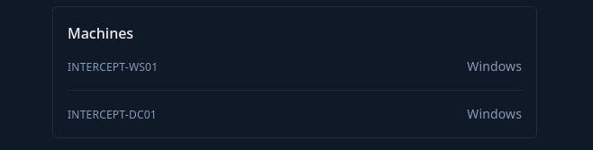

# Intruduction

You are tasked with performing a red team engagement on Intercept involving a Windows only Active Directory environment.

Intercept is a small Active Directory scenario that provides hands-on experience with common Active Directory vulnerabilities and misconfigurations, demonstrating relay attacks and authentication coercion attacks can be used to get access to the domain.

Intercept is designed for penetration testers and red teamers in search of challenging labs. It is well-suited for those seeking to challenge themselves with attacking unique aspects of an Active Directory environment.

**This Red Team Operator Level 1** lab will expose players to:

- Active Directory enumeration and attacks
- Abusing NTLM relay attacks
- Abusing authentication coercion attacks
- Active Directory Certificate Service abuse.

&nbsp;

# Entry Points

The challenge gives you 2 private IPs as entry points:

Plus it is also aware that the challenge involves only 2 Windows based servers:  

Without further due I will start drilling down the IPs.

&nbsp;